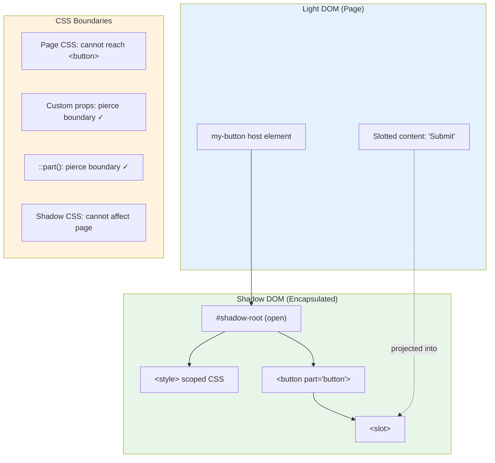
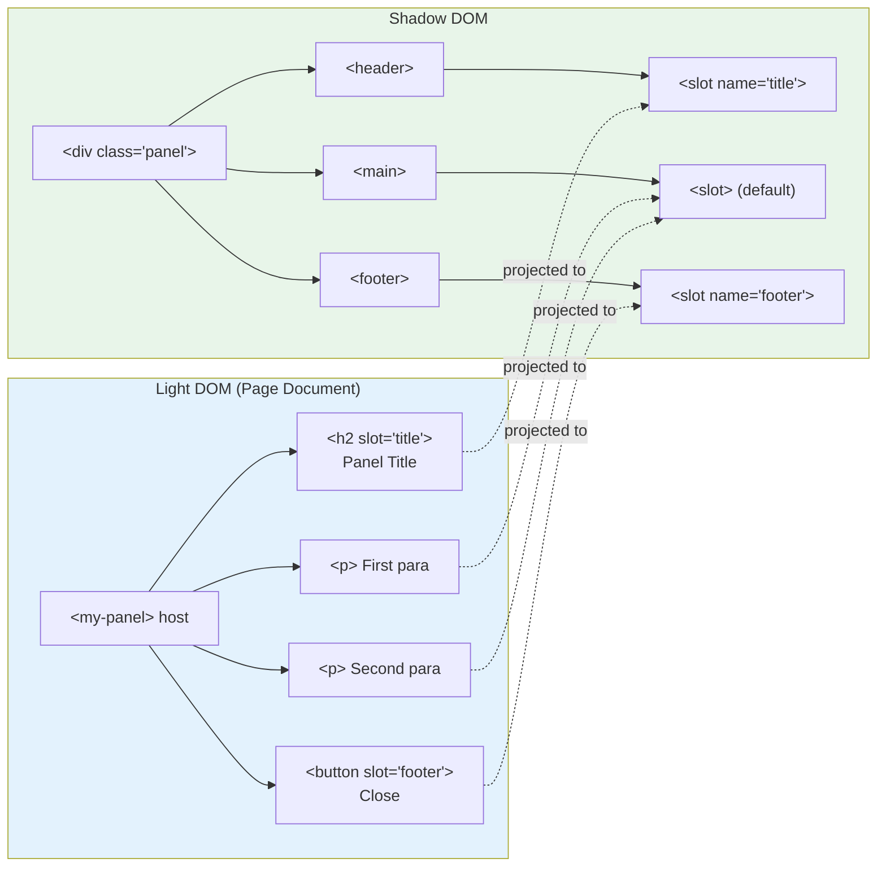

# Custom Elements and Shadow DOM

🎯 **Interview Weight:** high (★★☆) - Web Components are now
baseline-supported and tested in senior frontend interviews;
Shadow DOM is a distinct knowledge area

---

### 🎯 Model Answer

**30 seconds:**

> Custom Elements let you define new HTML tags with custom behavior
> using JavaScript. `class MyButton extends HTMLElement` + 
> `customElements.define('my-button', MyButton)` → `<my-button>`
> works in HTML. Shadow DOM attaches a separate, encapsulated DOM
> tree to an element where CSS is scoped and doesn't leak in or out.
> Together these form the core of Web Components.

**3 minutes (Senior):**

> Custom Elements have two types. Autonomous custom elements extend
> `HTMLElement` directly (fully custom element). Customized built-ins
> extend specific elements like `HTMLButtonElement` - they USE the
> native element semantics but add custom behavior. Customized built-ins
> use the `is` attribute: `<button is="my-button">`.
>
> Lifecycle callbacks are the mechanism: `connectedCallback` fires
> when the element is added to the DOM (like `componentDidMount`).
> `disconnectedCallback` fires on removal (like `componentWillUnmount`).
> `attributeChangedCallback` fires when observed attributes change
> (requires the static `observedAttributes` getter).
>
> Shadow DOM creates an encapsulated DOM tree attached to a host
> element. CSS inside the Shadow DOM doesn't affect the page;
> page CSS doesn't affect Shadow DOM internals (except CSS custom
> properties, which can cross the boundary). Two modes: `open`
> (accessible via `el.shadowRoot`) and `closed` (inaccessible
> from outside JavaScript - used for security-sensitive widgets).
>
> The key limit: Shadow DOM is excellent for style isolation.
> It's more complex for accessibility (focus management crosses
> shadow boundaries but ARIA is scoped).

*Adapting up:* Discuss form-associated custom elements (FACE),
the internals.setValidity API, CSS `::part()` and `::slotted()`,
constructable stylesheets, and the declarative shadow DOM API.

*Adapting down:* Custom Elements let you make your own HTML tags.
Shadow DOM keeps the CSS inside those tags from affecting the rest of the page.

**Blank Mind Recovery:**

**(1) Restate:** "Custom Elements are user-defined HTML tags.
Shadow DOM encapsulates their CSS and internal DOM."

**(2) First principles:** "HTML has a fixed set of tags. Custom
Elements expand this with user-defined tags, each with custom
lifecycle and behavior."

**(3) Bridge:** "Like a React component but native to the browser
with no framework dependency."

---

### 📘 Concept Explanation

**What it is:**

Custom Elements is a Web API for defining new HTML element types
with custom behavior and lifecycle. Shadow DOM is a Web API for
attaching an encapsulated DOM subtree to a host element, with
scoped CSS and isolated DOM tree.

**The problem it solves:**

Framework component models (React, Vue, Angular) produce components
that are framework-specific. Custom Elements produce components
that work in any HTML context, with any framework or none.
Shadow DOM solves CSS global scope by encapsulating component styles.

**How it works:**

```
CUSTOM ELEMENT DEFINITION:
  class MyButton extends HTMLElement {
    // REQUIRED: declare which attributes to observe
    static get observedAttributes() {
      return ['disabled', 'variant'];
    }

    constructor() {
      super();           // always call super() first
      // Don't read attributes or DOM in constructor
      // (element not yet in DOM, attributes not set)
      this._value = 0;
    }

    // Called when element is added to the document
    connectedCallback() {
      this.render();
      this.addEventListener('click', this.handleClick);
    }

    // Called when element is removed from the document
    disconnectedCallback() {
      this.removeEventListener('click', this.handleClick);
    }

    // Called when attribute in observedAttributes changes
    attributeChangedCallback(name, oldVal, newVal) {
      if (name === 'disabled') {
        this.render();
      }
    }

    // Called when element is moved to a different document
    adoptedCallback() { }

    render() {
      this.textContent = this.getAttribute('label') || 'Click me';
    }

    handleClick = (e) => {
      this.dispatchEvent(new CustomEvent('my-click', {
        bubbles: true,
        composed: true,  // crosses shadow DOM boundary
        detail: { count: ++this._value }
      }));
    };
  }

  // Register the element:
  customElements.define('my-button', MyButton);

  // Usage in HTML:
  // <my-button label="Submit" disabled></my-button>

SHADOW DOM:
  class MyCard extends HTMLElement {
    constructor() {
      super();
      // Attach shadow root (mode determines accessibility):
      this.attachShadow({ mode: 'open' });
      //   'open': el.shadowRoot accessible in JS
      //   'closed': el.shadowRoot is null (privacy)
    }

    connectedCallback() {
      // Shadow DOM renders inside the shadow root:
      this.shadowRoot.innerHTML = `
        <style>
          /* Scoped to this component only: */
          :host {
            display: block;
            border: 1px solid #ccc;
            border-radius: 8px;
          }
          :host([featured]) {
            border-color: gold;
          }
          h2 { color: #333; margin: 0; }
          /* .title in page CSS does NOT affect this h2 */
        </style>
        <div class="card-inner">
          <h2 class="title">
            <slot name="title">Default Title</slot>
          </h2>
          <slot></slot>
        </div>
      `;
    }
  }

  customElements.define('my-card', MyCard);

SHADOW DOM CSS SELECTORS:
  :host            → the host element (my-card)
  :host(.active)   → host when it has class 'active'
  :host([variant]) → host when it has 'variant' attribute
  :host-context(.theme-dark) → host when ancestor has class
  ::slotted(p)     → paragraphs placed in slot
  ::slotted(*)     → all slotted elements
  ::part(button)   → exposed parts from outside

CSS CUSTOM PROPERTIES (cross shadow boundary):
  /* In page CSS: */
  my-button {
    --primary-color: #0066cc;
  }
  /* In component's shadow CSS: */
  :host {
    background: var(--primary-color, #000);
  }
  /* Custom properties pierce the shadow boundary */

EVENTS ACROSS SHADOW DOM:
  // Events with bubbles:true but NOT composed:true
  //   stop at the shadow root boundary
  // Events with composed:true
  //   cross the shadow boundary (retargeted to host)

  // Custom events from shadow DOM components:
  element.dispatchEvent(new CustomEvent('change', {
    bubbles: true,
    composed: true,  // REQUIRED to cross shadow boundary
    detail: { value: newValue }
  }));

LIFECYCLE ORDER:
  1. constructor()           (element created)
  2. attributeChangedCallback (if attributes set in HTML)
  3. connectedCallback()     (element inserted in DOM)
  4. [interactions, attribute changes]
  5. disconnectedCallback()  (element removed from DOM)
```

**The key insight:**

Shadow DOM CSS encapsulation has a critical limitation: ARIA
relationships (`aria-labelledby`, `aria-describedby`) cannot cross
the shadow DOM boundary. An element inside a shadow root cannot
be referenced by an ARIA ID from outside. This forces accessibility
patterns that keep ARIA relationships within the shadow root, which
sometimes requires architectural changes.

**When to use it:**

Use Custom Elements for reusable, framework-agnostic UI components.
Use Shadow DOM when CSS isolation is critical (design system
components, widgets used in third-party pages, or embed scenarios
where you don't control the host page CSS).

**When NOT to use it:**

Don't use Shadow DOM for all components if the team primarily
uses CSS-in-JS or CSS modules (already provides scope). Don't
use closed shadow DOM for accessibility-sensitive widgets without
extensive testing. Don't use Custom Elements for page-level
components that are only ever used in one framework context.

**Alternatives:**

- React, Vue, Angular components → framework-specific, better DX
- CSS Modules → CSS scope without Shadow DOM
- Stencil, Lit, Polymer → Web Components frameworks/helpers

**First-principles derivation:**

HTML elements are objects with a tag name, attributes, and behavior.
Custom Elements extend this model: define a class → define a tag
name → browser instantiates the class when the tag appears in HTML.
Shadow DOM applies the same "encapsulation" principle from
programming to the DOM: the internal implementation is hidden,
and the external interface (attributes, events, slots) is the API.

---

### 💻 Code Example

**Complete accessible custom button with Shadow DOM**

```html
<!-- BAD: basic custom element, no lifecycle, no shadow DOM -->
<script>
class BadButton extends HTMLElement {
  connectedCallback() {
    // Direct innerHTML with no shadow = CSS leaks
    this.innerHTML = '<button>Click me</button>';
    // All CSS on page affects this button
    // This button's CSS affects ALL buttons on page
  }
}
customElements.define('bad-button', BadButton);
</script>
```

```javascript
// GOOD: shadow DOM, lifecycle, accessibility, events
class AccessibleButton extends HTMLElement {
  static get observedAttributes() {
    return ['label', 'disabled', 'variant'];
  }

  constructor() {
    super();
    this.attachShadow({ mode: 'open' });
  }

  connectedCallback() {
    this._render();
    this._addEventListeners();
  }

  disconnectedCallback() {
    // Cleanup to prevent memory leaks:
    this.shadowRoot.removeEventListener(
      'click', this._handleClick
    );
  }

  attributeChangedCallback(name, old, newVal) {
    // Re-render when attributes change:
    this._render();
  }

  _render() {
    const label = this.getAttribute('label') || 'Button';
    const isDisabled = this.hasAttribute('disabled');
    const variant = this.getAttribute('variant') || 'primary';

    this.shadowRoot.innerHTML = `
      <style>
        :host {
          display: inline-block;
        }
        button {
          padding: 8px 16px;
          border-radius: 4px;
          cursor: pointer;
          font-size: 1rem;
          border: none;
        }
        :host([variant="primary"]) button {
          background: var(--btn-primary-bg, #0066cc);
          color: var(--btn-primary-color, #fff);
        }
        :host([variant="secondary"]) button {
          background: var(--btn-secondary-bg, transparent);
          border: 1px solid var(--btn-primary-bg, #0066cc);
          color: var(--btn-primary-bg, #0066cc);
        }
        button:disabled {
          opacity: 0.5;
          cursor: not-allowed;
        }
        button:focus-visible {
          outline: 3px solid var(--btn-primary-bg, #0066cc);
          outline-offset: 2px;
        }
      </style>
      <button
        type="button"
        ${isDisabled ? 'disabled' : ''}
        part="button">
        <slot>${label}</slot>
      </button>
    `;
  }

  _addEventListeners() {
    this._handleClick = (e) => {
      if (this.hasAttribute('disabled')) return;
      this.dispatchEvent(new CustomEvent('button-click', {
        bubbles: true,
        composed: true,  // crosses shadow boundary
        detail: { source: this }
      }));
    };
    this.shadowRoot.addEventListener('click', this._handleClick);
  }
}

customElements.define('accessible-button', AccessibleButton);
```

```html
<!-- Usage: -->
<accessible-button
  variant="primary"
  label="Submit Form">
  <!-- Slot content overrides label: -->
  <span>Submit</span>
  <svg aria-hidden="true"><!-- icon --></svg>
</accessible-button>

<!-- Style via CSS custom properties or ::part(): -->
<style>
  accessible-button {
    --btn-primary-bg: #e91e63;  /* pink brand color */
    --btn-primary-color: white;
  }
  /* Style the inner button via ::part(): */
  accessible-button::part(button) {
    border-radius: 24px;  /* pill shape */
  }
</style>
```

> **Code walkthrough:** The custom element uses Shadow DOM for
> CSS encapsulation - the button's internal styles don't affect
> page CSS. CSS custom properties (`--btn-primary-bg`) allow
> external styling to cross the shadow boundary for theming.
> The `part="button"` attribute exposes the inner button to
> `::part(button)` selectors from outside, allowing structural
> CSS overrides. The `composed: true` on the custom event ensures
> it crosses the shadow boundary and reaches page-level event
> listeners. The `disconnectedCallback` removes event listeners
> to prevent memory leaks.

---

### 🎓 Answers by Seniority

**Junior / Mid:**

> Custom Elements are user-defined HTML tags. Define a class
> extending `HTMLElement`, call `customElements.define('my-tag',
> MyClass)`, and `<my-tag>` works in HTML. The lifecycle callbacks:
> `connectedCallback` (added to DOM), `disconnectedCallback`
> (removed), `attributeChangedCallback` (attribute changed).
> Shadow DOM adds CSS encapsulation - styles inside the component
> don't affect the page and vice versa.

---

**Senior / Staff:**

> Web Components shine for design system components that need to
> work across multiple frameworks. A `<ds-button>` built as a Web
> Component works in React, Vue, Angular, and vanilla JS. Lit
> is the practical choice over raw Custom Elements - it handles
> property/attribute reflection, declarative templates, and
> reactive rendering without a heavy framework footprint.
>
> The main challenge at scale: Form participation. Custom Elements
> that look like form inputs (custom `<select>`, `<date-picker>`)
> don't participate in native `<form>` by default. Form-Associated
> Custom Elements (FACE) API solves this with `ElementInternals`.

---

### ⚠️ Common Misconceptions

**"Shadow DOM blocks all external CSS"**

CSS custom properties (variables) pierce the shadow DOM boundary.
The `::part()` selector also allows styling internal parts from
outside. Shadow DOM provides encapsulation for regular CSS rules -
not a complete CSS sandbox. CSS custom properties are the intended
mechanism for theming components across the shadow boundary.

**"Custom Events with bubbles:true cross Shadow DOM"**

Regular events with `bubbles: true` do NOT cross Shadow DOM by
default. They're retargeted and stopped at the shadow root.
Events must be dispatched with `composed: true` to cross the
shadow boundary. Native events like `click`, `focus`, `input`
are `composed: true` by default. Custom events are NOT `composed`
by default - you must set it explicitly.

---

### 🚨 Failure Modes and Diagnosis

**Symptom: events from custom element not reaching page listeners**

```
Root cause: custom event missing composed:true

Bug:
  // Inside shadow DOM:
  this.dispatchEvent(new CustomEvent('change', {
    bubbles: true
    // composed: false (default) → stops at shadow root
  }));

  // Outside in page:
  document.addEventListener('change', handler);
  // handler NEVER fires for shadow DOM changes

Fix:
  this.dispatchEvent(new CustomEvent('change', {
    bubbles: true,
    composed: true  // crosses shadow boundary
  }));

Diagnosis:
  1. Add event listener on the custom element itself:
     myElement.addEventListener('change', e => console.log(e));
  2. Also add on document
  3. If element listener fires but document doesn't: missing composed

  Note: native click, input, focus ARE composed by default
        Custom events are NOT composed by default
```

---

### 🎯 Interview Deep-Dive

| Scenario | Recommended Time | Key Signal |
|---|---|---|
| Custom element lifecycle | 3 min | Four callbacks |
| Shadow DOM open vs closed | 2-3 min | Accessibility implications |
| CSS encapsulation in shadow | 3 min | ::part(), custom properties |
| composed:true events | 2 min | Cross-boundary events |
| Form-associated custom elements | 3-4 min | FACE API |
| Customized built-ins | 2-3 min | is="" attribute |
| Web Components vs framework | 3 min | Trade-off analysis |
| observedAttributes | 2 min | Attribute reactivity |
| Lit vs raw custom elements | 2-3 min | Practical choice |
| Shadow DOM accessibility | 3-4 min | ARIA limitations |
| connectedCallback timing | 2 min | When attrs are available |
| CSS custom properties cross-boundary | 2 min | Theming |

---

**Q1: What are the Custom Element lifecycle callbacks?** `[JUNIOR]`
DEFINITION

*Why they ask:* Foundation knowledge for Web Components.

*Likely follow-up:* "When are attributes available in connectedCallback?"

> **Answer:**
>
> Custom Elements have four lifecycle callbacks:
>
> `constructor()`:
> - Called when element is created
> - Must call `super()` first
> - Attach Shadow DOM here, do NOT access children or attributes
>   (element isn't in DOM yet, attributes may not be set yet for
>   elements upgraded from HTML)
> - Do NOT use `document.createElement` for children here
>
> `connectedCallback()`:
> - Called when element is inserted into the DOM
> - Safe to access attributes and add children
> - Re-fires if element is moved between documents
> - Like `componentDidMount` in React
> - Runs for every insertion (remove and re-add = fires again)
>
> `disconnectedCallback()`:
> - Called when element is removed from the DOM
> - Clean up event listeners, timers, subscriptions
> - Like `componentWillUnmount` in React
>
> `attributeChangedCallback(name, oldValue, newValue)`:
> - Called when an observed attribute changes
> - Only fires for attributes listed in `observedAttributes`
> - `oldValue` is null for newly set attributes
> - `newValue` is null for removed attributes
>
> `adoptedCallback()`:
> - Called when element is moved to a different document
>   (via `document.adoptNode()`)
> - Rare in practice
>
> ```javascript
> static get observedAttributes() {
>   return ['color', 'size'];  // MUST list them here
> }
>
> attributeChangedCallback(name, oldVal, newVal) {
>   if (name === 'color') this._updateColor(newVal);
>   if (name === 'size') this._updateSize(newVal);
> }
> ```
>
> *What separates good from great:* The `connectedCallback`
> fires again if the element is moved (removed from DOM and
> re-added). Code that should run ONCE should use a flag:
> ```javascript
> connectedCallback() {
>   if (!this._initialized) {
>     this._initialize();
>     this._initialized = true;
>   }
>   // OR: only re-subscribe events:
>   this._attachEventListeners();
> }
> ```

---

**Q2: What is the difference between open and closed Shadow DOM?**
`[SENIOR]` COMPARISON

*Why they ask:* Shadow DOM mode has real practical implications.

*Likely follow-up:* "When would you use closed mode?"

> **Answer:**
>
> Both modes create an encapsulated shadow DOM tree. The difference:
> whether JavaScript from OUTSIDE the component can access the
> shadow root.
>
> `mode: 'open'`:
> ```javascript
> this.attachShadow({ mode: 'open' });
> // From outside:
> const shadow = myElement.shadowRoot;  // Returns shadow root
> shadow.querySelector('button')  // Can access internals
> ```
>
> `mode: 'closed'`:
> ```javascript
> this.attachShadow({ mode: 'closed' });
> // From outside:
> myElement.shadowRoot  // Returns null
> // No external access to internals
> ```
>
> When to use closed mode:
> - Components where internal DOM should be hidden from page JS
> - Third-party widgets embedded in untrusted host pages
> - Security-sensitive components (authentication flows)
> - Library components where API contract is attributes+events only
>
> Why most use open mode:
> - DevTools accessibility (elements panel shows shadow DOM)
> - Testing frameworks need access to shadow internals
> - Closed mode doesn't provide real security (polyfills can work around it)
> - Makes debugging harder
>
> Accessibility impact of both modes:
> - Both modes affect ARIA ID referencing across boundaries
>   (aria-labelledby can't reference IDs across shadow boundaries)
> - Focus traversal crosses shadow DOM naturally
> - Screen readers handle open shadows better (Chrome accessibility
>   tree exposes open shadow DOM internals to AT)
>
> *What separates good from great:* Closed shadow DOM doesn't
> prevent determined attackers. The `attachShadow` method returns
> the shadow root - if the code stores it privately, outside
> access is blocked. But JavaScript prototype overriding can
> intercept the `attachShadow` call before the component does.
> Closed mode is a "reasonable privacy" measure, not cryptographic
> security. For true security, don't put sensitive data in the DOM.

---

**Q3: How do CSS custom properties work with Shadow DOM?** `[SENIOR]`
MECHANISM

*Why they ask:* Critical theming knowledge for Web Components.

*Likely follow-up:* "What is the ::part() selector?"

> **Answer:**
>
> CSS custom properties (variables) are the intended theming
> mechanism for Shadow DOM components. They pierce the shadow
> boundary.
>
> How it works:
> ```css
> /* PAGE CSS: sets custom properties on the host element */
> my-button {
>   --button-bg: #0066cc;
>   --button-color: white;
>   --button-radius: 4px;
> }
>
> /* DARK THEME: override custom properties */
> .dark-theme my-button {
>   --button-bg: #4a9eff;
>   --button-color: #000;
> }
> ```
>
> ```css
> /* SHADOW DOM CSS: consumes custom properties */
> :host {
>   display: inline-block;
> }
> button {
>   background: var(--button-bg, #000);  /* fallback: #000 */
>   color: var(--button-color, #fff);
>   border-radius: var(--button-radius, 2px);
> }
> ```
>
> `::part()` selector - exposes internal elements for styling:
> ```html
> <!-- In shadow DOM template: -->
> <button part="button">Click</button>
> <span part="label">Text</span>
> ```
>
> ```css
> /* From outside page: style exposed parts */
> my-button::part(button) {
>   border-radius: 24px;    /* pill button */
>   font-weight: bold;
> }
> my-button::part(label) {
>   text-transform: uppercase;
> }
> ```
>
> `::part()` can style ANY CSS property. Custom properties
> only style properties that the component explicitly supports.
>
> `::slotted()` - styles elements projected into slots:
> ```css
> /* In shadow DOM: */
> ::slotted(*) {
>   color: inherit;  /* all slotted content */
> }
> ::slotted(img) {
>   width: 100%;    /* images in slots */
>   border-radius: 4px;
> }
> /* Note: ::slotted() can't style deep descendants */
> /* Only direct slotted children, not their children */
> ```
>
> *What separates good from great:* The difference between what
> `::part()` and custom properties can do. Custom properties: you
> design a theming API (explicit properties the user can set).
> `::part()`: the user can override any CSS. `::part()` gives more
> styling power but is harder to maintain (breaking component
> changes can break user styles). The practical approach: use
> custom properties for the intended theming API, add `::part()`
> for power users who need full control.

---

**Q4: What are form-associated custom elements (FACE)?** `[SENIOR]`
MECHANISM

*Why they ask:* Critical gap in Web Components for forms.

*Likely follow-up:* "How do you make a custom element participate in form validation?"

> **Answer:**
>
> Standard custom elements don't participate in HTML forms:
> their values aren't included in `FormData`, they don't respond
> to form `reset()`, they can't be required or validated.
>
> Form-Associated Custom Elements (FACE) solve this via the
> `ElementInternals` API:
>
> ```javascript
> class CustomInput extends HTMLElement {
>   // REQUIRED: declare the element is form-associated
>   static formAssociated = true;
>
>   constructor() {
>     super();
>     // Get internals: this is the form API
>     this.internals = this.attachInternals();
>     this.attachShadow({ mode: 'open' });
>   }
>
>   connectedCallback() {
>     this.shadowRoot.innerHTML = `
>       <input type="text" id="input">
>     `;
>     this.shadowRoot.getElementById('input')
>       .addEventListener('input', (e) => {
>         // Tell the form about the value:
>         this.internals.setFormValue(e.target.value);
>       });
>   }
>
>   // Form lifecycle callbacks (only for form-associated):
>   formResetCallback() {
>     this.shadowRoot.getElementById('input').value = '';
>     this.internals.setFormValue('');
>   }
>
>   formDisabledCallback(disabled) {
>     this.shadowRoot.getElementById('input').disabled = disabled;
>   }
>
>   // Validation:
>   checkValidity() {
>     const value = this.internals.value;
>     if (!value) {
>       this.internals.setValidity(
>         { valueMissing: true },
>         'Please fill in this field'
>       );
>       return false;
>     }
>     this.internals.setValidity({});
>     return true;
>   }
> }
>
> customElements.define('custom-input', CustomInput);
> ```
>
> Usage in a form:
> ```html
> <form>
>   <custom-input name="username" required></custom-input>
>   <button type="submit">Submit</button>
> </form>
> <!-- FormData will include 'username' from custom-input -->
> <!-- form.checkValidity() includes custom-input validation -->
> ```
>
> `ElementInternals` also provides accessibility internals:
> `setRole()`, `setARIAAttribute()` for elements that need
> non-standard accessibility roles.
>
> Browser support: Chrome 77+, Edge 79+, Safari 16.4+, Firefox 98+.
>
> *What separates good from great:* Before FACE, custom input
> components required a hidden `<input>` inside the shadow DOM
> to participate in form submission. The hidden input pattern
> had synchronization bugs (form value and visual value could
> diverge). FACE eliminates the hidden input hack and integrates
> directly with the browser's form infrastructure.

---

**Q5: How do you handle accessibility in Shadow DOM components?**
`[SENIOR]` SCENARIO

*Why they ask:* Shadow DOM + ARIA is a critical, often broken, combination.

*Likely follow-up:* "Can aria-labelledby reference elements across shadow boundaries?"

> **Answer:**
>
> Shadow DOM creates boundaries that affect ARIA in specific ways:
>
> **Focus management works across shadow boundaries:**
> Tab navigation crosses shadow DOM naturally. `tabindex` inside
> shadow DOM participates in the page tab order. No special handling needed.
>
> **ARIA ID references do NOT cross shadow boundaries:**
> ```html
> <!-- PAGE LEVEL: -->
> <label id="my-label">Username</label>
> <!-- SHADOW DOM COMPONENT: -->
> <custom-input aria-labelledby="my-label">
>   <!-- INSIDE SHADOW DOM: -->
>   <input aria-labelledby="my-label">
>   <!-- FAILS: my-label is outside shadow boundary -->
>   <!-- Screen reader: no label found for input -->
> </custom-input>
> ```
>
> **Solutions for labelling shadow DOM elements:**
>
> Option A: `aria-label` on the host element, accessed via
> `ElementInternals`:
> ```javascript
> // In custom element:
> this.internals.ariaLabel = this.getAttribute('aria-label');
> // OR: expose native aria attributes:
> // Chrome 111+: 'ariaLabelledByElements' API (cross-reference)
> ```
>
> Option B: Pass label as attribute, render inside shadow:
> ```javascript
> connectedCallback() {
>   const label = this.getAttribute('label');
>   this.shadowRoot.innerHTML = `
>     <label id="internal-label">${label}</label>
>     <input aria-labelledby="internal-label">
>   `;
>   // Both label and input inside shadow: ID reference works
> }
> ```
>
> Option C: Use native `<label>` element WITH slotted input:
> ```html
> <!-- Shadow template: -->
> <label>
>   <slot name="label-text"></slot>
>   <slot name="input"></slot>
> </label>
> <!-- Usage: -->
> <custom-field>
>   <span slot="label-text">Username</span>
>   <input slot="input">
> </custom-field>
> ```
>
> The `<label>` wrapping both slots works because browsers handle
> `<label>` + slotted `<input>` association correctly.
>
> *What separates good from great:* Google's accessibility team
> documented the "ARIA cross-shadow" problem in 2022 and proposed
> the Reference Target API (allowing ARIA attributes to reference
> across shadow boundaries using element objects instead of ID strings).
> This is in the ARIA spec as of 2024. Until widely supported,
> option B (keep label + input both inside shadow) is the safest.

---

**Q6: When should you use Web Components vs a framework?**
`[SENIOR]` TRADEOFF

*Why they ask:* Architecture decision awareness.

*Likely follow-up:* "What is Lit and when would you use it?"

> **Answer:**
>
> Web Components (Custom Elements + Shadow DOM) and frameworks
> solve overlapping but different problems:
>
> **Use Web Components when:**
> - Building design system components for multi-framework teams
>   (React team, Vue team, and Angular team all use the same button)
> - Building embeddable widgets for third-party sites
>   (chat widget, analytics widget, payment form)
> - Need zero-dependency components (no bundle, works anywhere)
> - Long-lived components that will outlive any framework
>
> **Use framework components when:**
> - Building an application (not a component library)
> - Team is using a specific framework (React/Vue/Angular)
> - Complex state management is required
> - Server-side rendering is needed (Custom Elements SSR is limited)
> - DX matters: JSX, TypeScript, hot reload, ecosystem tools
>
> **Lit** (by Google): a thin layer over Custom Elements that adds:
> - Declarative templates (tagged template literals)
> - Reactive properties (like Vue's reactive())
> - Lifecycle integration with property change → render cycle
> - TypeScript decorators (`@property`, `@state`, `@customElement`)
>
> ```javascript
> // RAW CUSTOM ELEMENT: manual rendering
> attributeChangedCallback() { this._render(); }
> _render() { this.shadowRoot.innerHTML = `...`; }
>
> // LIT: reactive rendering
> import { LitElement, html, css } from 'lit';
> class MyButton extends LitElement {
>   static styles = css`:host { display: inline-block; }`;
>   static properties = { label: { type: String } };
>   render() {
>     return html`<button>${this.label}</button>`;
>   }
> }
> ```
>
> Lit bundle: ~5KB gzip. Extremely lightweight.
>
> *What separates good from great:* The "design system" use case
> is where Web Components shine uniquely. A company with React
> for the web app, React Native for mobile, and Vue for a dashboard
> can share ONE component library built with Web Components or Lit.
> The React team wraps them as React components, the Vue team wraps
> as Vue components - same underlying implementation. Framework
> components can't achieve this without duplicating the implementation.

---

**Q7: What is declarative Shadow DOM and why does it matter?**
`[SENIOR]` MECHANISM

*Why they ask:* SSR for Web Components.

*Likely follow-up:* "What is the hydration story for Web Components?"

> **Answer:**
>
> Standard Shadow DOM requires JavaScript to attach: the component
> JavaScript runs, calls `attachShadow()`, and renders into the shadow.
> This means: no shadow DOM content in server-rendered HTML, no
> content before JavaScript runs.
>
> Declarative Shadow DOM (Chrome 90+, Safari 16.4+) allows shadow
> DOM to be declared in HTML:
>
> ```html
> <my-card>
>   <!-- Declarative shadow DOM: no JS required to attach -->
>   <template shadowrootmode="open">
>     <style>
>       :host { display: block; border: 1px solid #ccc; }
>       h2 { color: #333; }
>     </style>
>     <h2><slot name="title"></slot></h2>
>     <slot></slot>
>   </template>
>   <!-- Slotted content -->
>   <span slot="title">Product Name</span>
>   <p>Product description here.</p>
> </my-card>
> ```
>
> The browser parses the `<template shadowrootmode="open">` and
> automatically attaches it as a shadow root to the host element -
> NO JavaScript needed.
>
> Why it matters for SSR:
> - Server renders HTML including the shadow DOM template
> - Browser displays content immediately (no JS flash)
> - Custom element JavaScript can upgrade later (hydration)
> - Works with progressive enhancement
>
> Streaming: Declarative Shadow DOM works with streaming HTML
> responses (the browser renders shadow content as it arrives,
> before the full page is received).
>
> Without Declarative Shadow DOM:
> ```
> 1. HTML arrives (no shadow content)
> 2. Browser parses: empty <my-card>
> 3. JS downloads + executes
> 4. Shadow DOM attaches + content renders
> → Flash of empty component
> ```
>
> With Declarative Shadow DOM:
> ```
> 1. HTML arrives (with shadow template)
> 2. Browser parses: shadow DOM attached immediately
> 3. Content visible
> → No flash; JS upgrade enhances if available
> ```
>
> *What separates good from great:* The combination of Declarative
> Shadow DOM + Custom Element upgrade is how Web Components achieve
> progressive enhancement. The HTML with declarative shadow DOM
> provides the static content. When the Custom Element class loads,
> it "upgrades" the element (the lifecycle callbacks fire, event
> listeners attach, dynamic behavior activates). Before upgrade,
> the element is functional static HTML. After upgrade, it's
> interactive. This matches the core progressive enhancement principle.

---

**Q8: How do you test Custom Elements?** `[SENIOR]` SCENARIO

*Why they ask:* Testing is production discipline.

*Likely follow-up:* "What is @web/test-runner?"

> **Answer:**
>
> Testing Custom Elements requires a browser environment because
> the Custom Elements registry and Shadow DOM require real browser APIs.
>
> **Option 1: @web/test-runner + @open-wc/testing (recommended):**
> ```javascript
> import { fixture, html, expect } from '@open-wc/testing';
> import './my-button.js';
>
> describe('MyButton', () => {
>   it('renders with default label', async () => {
>     const el = await fixture(html`<my-button></my-button>`);
>     expect(el.shadowRoot.querySelector('button')
>       .textContent.trim()).to.equal('Click me');
>   });
>
>   it('fires custom event on click', async () => {
>     const el = await fixture(html`
>       <my-button label="Submit"></my-button>
>     `);
>     const listener = oneEvent(el, 'button-click');
>     el.shadowRoot.querySelector('button').click();
>     const { detail } = await listener;
>     expect(detail.source).to.equal(el);
>   });
>
>   it('is accessible', async () => {
>     const el = await fixture(html`
>       <my-button label="Submit form"></my-button>
>     `);
>     await expect(el).to.be.accessible();
>     // Uses axe-core under the hood
>   });
> });
> ```
>
> **Option 2: Playwright / Cypress component testing:**
> ```javascript
> // playwright:
> test('custom button renders', async ({ page }) => {
>   await page.setContent(`
>     <script src="/my-button.js" type="module"></script>
>     <my-button label="Test"></my-button>
>   `);
>   const button = page.locator('my-button');
>   await expect(button.locator('button')).toHaveText('Test');
> });
> ```
>
> Shadow DOM querying in tests:
> ```javascript
> // Access shadow root:
> const shadow = el.shadowRoot;
> shadow.querySelector('button');  // open shadow only
>
> // Pierce shadow DOM (Playwright):
> page.locator('my-button >> css=button');
>
> // Cypress shadow:
> cy.get('my-button').shadow().find('button').click();
> ```
>
> *What separates good from great:* The `@open-wc/testing` library's
> `accessible()` matcher runs axe-core on the component. This
> catches: missing labels, wrong roles, focus management issues.
> Running accessibility tests as part of component unit tests
> (not just in E2E tests) provides earlier feedback. A component
> failing its accessible() assertion fails the PR - accessibility
> is enforced at the component level.

---

| Interviewer Type | Emphasis |
|---|---|
| Technical Panel | Lifecycle + Shadow DOM mechanics |
| Hiring Manager | Web Components vs framework decision |
| Bar Raiser | FACE API + accessibility + testing |
| Peer Engineer | Practical Lit + event composition |

---

### ⚖️ Comparison Table

| | Custom Elements | React Components | Vue Components |
|---|---|---|---|
| Runtime required | None (native) | React runtime | Vue runtime |
| Framework lock-in | None | React | Vue |
| SSR support | Limited (decl. shadow DOM) | Full | Full |
| TypeScript DX | Manual | Excellent | Excellent |
| Ecosystem | Growing | Massive | Large |
| Form integration | FACE API | React controlled | v-model |
| Best for | Design systems | Applications | Applications |

---

### 🏛️ System Design

*(Omit: not a ★★★ keyword.)*

---

### 📊 Diagram

```
WEB COMPONENT STRUCTURE:
  <my-button>          (Host element, light DOM)
  ├── #shadow-root     (Shadow root boundary)
  │   ├── <style>      (Scoped CSS)
  │   ├── <button>     (Internal DOM)
  │   │   └── <slot>   (Projection point)
  └── "Submit"         (Slotted content, light DOM)
      (appears where <slot> is)
```



> **Diagram walkthrough:** The Shadow DOM creates a separate tree
> attached to the host element. The shadow root is the boundary:
> styles declared inside don't escape (shadow CSS cannot affect the page),
> and most page styles don't enter (page CSS cannot reach the internal
> button). The slot element is a projection point - slotted content
> visually appears where the slot is, but remains in the light DOM.
> Two mechanisms pierce the shadow boundary: CSS custom properties
> (set on the host, consumed inside) and `::part()` selectors (expose
> internal elements for outside styling). This design intentionally
> provides controlled theming without full CSS bleed.

---

---

# HTML Templates and Slots

🎯 **Interview Weight:** high (★★☆) - Templates and slots are
the content projection mechanism of Web Components; also tested
for Vue/React slot knowledge

---

### 🎯 Model Answer

**30 seconds:**

> `<template>` holds HTML that is parsed but NOT rendered until
> cloned and inserted into the DOM. It's the reusable HTML
> fragment mechanism: the browser validates the HTML but doesn't
> execute scripts or load images until the template is used.
> `<slot>` is a placeholder in Shadow DOM for content passed in
> from the light DOM. Named slots enable multiple content
> projection points.

**3 minutes (Senior):**

> `<template>` is a document fragment that lives in the DOM but
> produces no output. `document.createElement('template')`,
> or `<template>` in HTML. Its contents are in `template.content`
> (a DocumentFragment). Cloning: `template.content.cloneNode(true)`.
>
> In Shadow DOM, `<slot>` enables composition: the Shadow DOM
> component can define a layout structure, and the slot positions
> where user content appears. This is the Shadow DOM equivalent
> of React's `{children}` prop - but with multiple named slots
> (`<slot name="header">`, `<slot name="footer">`).
>
> Slot mechanics: slotted content stays in the light DOM (no DOM
> movement). The browser renders it at the slot position visually.
> CSS `::slotted()` from inside shadow DOM can style slotted
> content. `slot.assignedNodes()` lets JS access what's slotted.
>
> The `slotchange` event fires when slot assignment changes
> (content added/removed from a slot). This enables components
> to react to slot content changes.

*Adapting up:* Discuss the difference between slotted and non-slotted
performance characteristics, the fallback slot content pattern,
and template element cloning performance.

*Adapting down:* Template is "HTML stored for later use."
Slots are "holes" in a component where you put your own content.

**Blank Mind Recovery:**

**(1) Restate:** "Template holds HTML ready to clone.
Slots in Shadow DOM are where external content appears."

**(2) First principles:** "Components need placeholder positions
for user content. In HTML, this is the slot mechanism - define
where content goes, then pass content in."

**(3) Bridge:** "Slots are like named regions in a layout template:
'put the title HERE, put the body HERE.'"

---

### 📘 Concept Explanation

**What it is:**

`<template>` is an HTML element that contains inert markup -
parsed and validated but not rendered, no resources loaded, no
scripts executed. `<slot>` is a content projection point inside
Shadow DOM that displays slotted light DOM content.

**The problem it solves:**

Templates enable reusable HTML fragments without string manipulation
or runtime parsing. Slots enable component composition: define
a component layout once, let users provide specific content into
named positions.

**How it works:**

```
TEMPLATE ELEMENT:
  <template id="card-template">
    <div class="card">
      <h2 class="title"><!-- filled by JS --></h2>
      <p class="desc"><!-- filled by JS --></p>
    </div>
  </template>

  // Template content is not rendered (no visible output)
  // Images in template not loaded, scripts not run
  // Access content:
  const template = document.getElementById('card-template');
  template.content  // → DocumentFragment
  template.innerHTML  // → string of template's HTML

  // Clone and use:
  const clone = template.content.cloneNode(true);
  clone.querySelector('.title').textContent = 'My Card';
  clone.querySelector('.desc').textContent = 'Card content';
  document.body.appendChild(clone);
  // Now visible in page, scripts run, images load

  // Or use in Custom Element:
  connectedCallback() {
    const template = document.getElementById('card-template');
    const clone = template.content.cloneNode(true);
    this.shadowRoot.appendChild(clone);
  }

SLOT ELEMENT:
  // Shadow DOM template with slots:
  <template id="dialog-template">
    <style>
      :host { display: block; border: 2px solid #ccc; }
      header { background: #f5f5f5; padding: 16px; }
      main { padding: 16px; }
      footer { padding: 16px; text-align: right; }
    </style>
    <dialog>
      <header>
        <!-- Named slot: place header content here -->
        <slot name="header">Default header</slot>
      </header>
      <main>
        <!-- Default (unnamed) slot: all unslotted content -->
        <slot></slot>
      </main>
      <footer>
        <!-- Named slot for footer buttons -->
        <slot name="footer"></slot>
      </footer>
    </dialog>
  </template>

  // Usage in HTML:
  <my-dialog>
    <h2 slot="header">Confirm Delete</h2>  <!-- named slot -->
    <p>Are you sure you want to delete?</p>  <!-- default slot -->
    <button slot="footer">Cancel</button>  <!-- named slot -->
    <button slot="footer">Delete</button>  <!-- same slot, both render -->
  </my-dialog>

SLOT FALLBACK CONTENT:
  <slot name="header">
    <!-- Shown when no content is slotted into "header": -->
    <h2>Untitled</h2>
  </slot>

SLOT EVENTS AND ACCESS:
  // In shadow DOM component:
  const slot = this.shadowRoot.querySelector('slot');

  // Access currently slotted nodes:
  const nodes = slot.assignedNodes();
  // assignedNodes({ flatten: true }) - includes fallback too

  // React to slot content changes:
  slot.addEventListener('slotchange', (e) => {
    const assigned = e.target.assignedNodes();
    console.log('Slotted content changed:', assigned);
    // Re-measure, re-calculate layout
  });

CSS FOR SLOTTED CONTENT:
  /* In shadow DOM CSS: */
  /* Style slotted children (direct only): */
  ::slotted(*) { margin: 0; }
  ::slotted(h2) { font-size: 1.2rem; }
  ::slotted(.error) { color: red; }

  /* CANNOT: style descendants of slotted elements */
  /* ::slotted(.container span) - does NOT work */

TEMPLATE PERFORMANCE:
  // Parsing: template.content is a DocumentFragment
  // Cloning: cloneNode(true) is O(subtree size)
  // For many instances: clone once, reuse many times

  const template = document.getElementById('list-item');
  const fragment = document.createDocumentFragment();

  data.forEach(item => {
    const clone = template.content.cloneNode(true);
    clone.querySelector('.name').textContent = item.name;
    fragment.appendChild(clone);
  });
  list.appendChild(fragment);  // single DOM mutation
```

**The key insight:**

Slotted content remains in the LIGHT DOM (the page's document).
It is not moved into the shadow DOM. The browser renders it AT
the slot position, but DOM APIs still find it in the light DOM.
`this.children` on the host element shows slotted content.
`this.shadowRoot.querySelector('slot').assignedNodes()` shows
what's assigned to a specific slot.

**When to use it:**

Use `<template>` for reusable HTML fragments, especially in Web
Components. Use `<slot>` for composition - allowing users to
project content into specific positions in the component layout.

**When NOT to use it:**

Don't use `<template>` when `createElement` + `insertAdjacentHTML`
is simpler (one-off elements). Don't use named slots for
every piece of content in simple components (over-engineering).

**Alternatives:**

- `innerHTML` direct assignment → simpler but less reusable
- React `children` / `render props` → framework equivalent
- Vue `<slot>` / `<template v-slot>` → same concept, Vue API
- Angular `<ng-content>` → Angular content projection

**First-principles derivation:**

Component composition requires a mechanism for the component to
define a structure while the user provides specific content.
The slot pattern (placeholder + assigned content) is the universal
solution: define WHERE content goes, let users provide WHAT
goes there. Template enables HTML reuse without parsing overhead.

---

### 💻 Code Example

**Card component with named slots and slotchange**

```javascript
class InfoCard extends HTMLElement {
  constructor() {
    super();
    this.attachShadow({ mode: 'open' });
  }

  connectedCallback() {
    // Use template for the shadow structure:
    const template = document.createElement('template');
    template.innerHTML = `
      <style>
        :host {
          display: block;
          border: 1px solid #e0e0e0;
          border-radius: 8px;
          overflow: hidden;
        }
        .header {
          padding: 16px;
          background: #f5f5f5;
          border-bottom: 1px solid #e0e0e0;
        }
        .body { padding: 16px; }
        .footer {
          padding: 12px 16px;
          background: #f5f5f5;
          border-top: 1px solid #e0e0e0;
          display: flex;
          gap: 8px;
          justify-content: flex-end;
        }
        /* Hide empty footer if no content: */
        .footer:not(:has(slot[name="footer"] *)) {
          display: none;
        }
        ::slotted(h2), ::slotted(h3) {
          margin: 0;
          font-size: 1.1rem;
        }
        ::slotted(p) { margin: 0 0 8px; }
      </style>
      <article>
        <div class="header">
          <slot name="title">
            <!-- Fallback if no title slot provided: -->
            <h2>Card</h2>
          </slot>
        </div>
        <div class="body">
          <!-- Default slot: all unattributed content -->
          <slot></slot>
        </div>
        <div class="footer">
          <slot name="footer"></slot>
        </div>
      </article>
    `;

    // Clone template content into shadow root:
    this.shadowRoot.appendChild(
      template.content.cloneNode(true)
    );

    // React to slot content changes:
    const defaultSlot = this.shadowRoot.querySelector('slot:not([name])');
    defaultSlot.addEventListener('slotchange', (e) => {
      const nodes = e.target.assignedNodes({ flatten: true });
      const textContent = nodes
        .filter(n => n.nodeType === Node.TEXT_NODE ||
                     n.nodeType === Node.ELEMENT_NODE)
        .map(n => n.textContent?.trim())
        .filter(Boolean)
        .join(' ');
      // Use content length to adapt layout if needed:
      this.toggleAttribute('compact', textContent.length < 50);
    });
  }
}

customElements.define('info-card', InfoCard);
```

```html
<!-- Usage with all slots: -->
<info-card>
  <h3 slot="title">Payment Failed</h3>
  <p>Your payment of $29.99 could not be processed.</p>
  <p>Check your card details and try again.</p>
  <button slot="footer">Update card</button>
  <button slot="footer">Cancel</button>
</info-card>

<!-- Usage with only default slot: -->
<info-card>
  <!-- No slot="title": fallback "Card" h2 shows -->
  <p>Simple content here.</p>
  <!-- No slot="footer": footer hidden by :has() selector -->
</info-card>
```

> **Code walkthrough:** The InfoCard uses three slots: a named
> "title" slot with fallback content, the default slot for body
> content, and a named "footer" slot for action buttons.
> `::slotted(h2)` and `::slotted(p)` normalize typography for
> projected content. The `slotchange` listener reacts to content
> changes and toggles a `compact` attribute when content is short.
> The `.footer:not(:has(slot[name="footer"] *))` selector hides
> the footer automatically when no content is projected - avoiding
> an empty bar at the bottom of cards without footer buttons.

---

### 🎓 Answers by Seniority

**Junior / Mid:**

> `<template>` holds HTML that's parsed but not rendered until
> cloned. `<slot>` in Shadow DOM is a placeholder for projected
> content. Named slots let components have multiple content zones:
> `<slot name="header">` for header content and `<slot>` for
> body content. The content passes in via `slot="header"` attribute
> on the child element.

---

**Senior / Staff:**

> Template and slot together enable Web Component composition.
> The critical insight: slotted content is NOT in the shadow DOM.
> It remains in the light DOM and is projected visually. This
> means: `window.getComputedStyle` on slotted content returns
> light DOM styles (not shadow CSS). `::slotted()` has limited
> power (direct children only, no pseudo-classes). For complex
> layout control inside components, the component must render
> the content inside the shadow DOM (via slots or `innerHTML`),
> not use slotted projection.

---

### ⚠️ Common Misconceptions

**"Slotted content is moved into the Shadow DOM"**

Slotted content stays in the light DOM. The browser renders it
AT the slot position visually (flattened tree for rendering),
but DOM APIs (querySelector, parentElement, children) find slotted
content in its original light DOM position. This means: events
from slotted content bubble through the light DOM, not the shadow
DOM. Event delegation on the shadow root does NOT catch events
from slotted content.

**"::slotted() can style deep descendants"**

`::slotted()` only targets DIRECT slotted children. `::slotted(.container span)`
does not work - you cannot traverse into slotted content. Styles
for deeper content must come from either the light DOM (page CSS)
or CSS custom properties that pierce the shadow boundary.

---

### 🚨 Failure Modes and Diagnosis

**Symptom: slot content not rendering**

```
Common causes:
1. Using slot without Shadow DOM
   <slot> only works inside Shadow DOM
   If a custom element has no shadow root: slot has no effect
   Fix: ensure element calls this.attachShadow() in constructor

2. Mismatched slot names (case-sensitive)
   <slot name="Header">  ← capital H
   <p slot="header">     ← lowercase h
   Mismatch: content goes to default slot, not named slot
   Fix: ensure exact case match

3. Slotted content has display:none from page CSS
   Page CSS applies to light DOM (slotted content)
   Check: .container p { display: none; }
   might hide slotted <p> elements

4. Dynamic content added after connectedCallback
   If content is added after component renders,
   the slotchange event fires but the initial render
   may not have the content
   Fix: listen to slotchange to react to late additions

Diagnosis:
  Chrome DevTools Elements panel:
  Expand the custom element → see "reveal shadow DOM"
  Check slot assignments: click on slot → "Assigned elements"
  shows what content is assigned to each slot
```

---

### 🎯 Interview Deep-Dive

| Scenario | Recommended Time | Key Signal |
|---|---|---|
| Template vs createElement | 2 min | When to use template |
| Named vs default slots | 2-3 min | Composition patterns |
| Slotted content DOM location | 2-3 min | Light DOM insight |
| ::slotted limitations | 2 min | CSS depth limitation |
| assignedNodes API | 2 min | Programmatic slot access |
| slotchange event | 2-3 min | Reactive content |
| Template cloning performance | 2 min | Fragment batching |
| Fallback slot content | 1-2 min | Default content |
| Multiple items in named slot | 2 min | Ordering behavior |

---

**Q1: What is the `<template>` element and when do you use it?**
`[JUNIOR]` DEFINITION

*Why they ask:* Tests knowledge of the template mechanism.

*Likely follow-up:* "What is the difference between template.content and template.innerHTML?"

> **Answer:**
>
> The `<template>` element contains HTML that is parsed and validated
> but NOT rendered. Its content is inert until cloned:
>
> - Images in `<template>`: NOT loaded (src ignored until cloned)
> - Scripts in `<template>`: NOT executed
> - CSS in `<template>`: NOT applied
> - Rendered output: NONE (template itself is invisible)
>
> Use cases:
> 1. Web Component shadow DOM structure (clone once, use many)
> 2. Client-side rendering templates (before frameworks)
> 3. Reusable HTML fragments for JS cloning
>
> ```html
> <template id="user-card">
>   <div class="card">
>     
>     <h3 class="name"></h3>
>     <p class="bio"></p>
>   </div>
> </template>
> ```
>
> ```javascript
> const template = document.getElementById('user-card');
>
> // template.content: DocumentFragment (reference, not clone)
> template.content;  // → DocumentFragment
>
> // template.innerHTML: string of template's HTML content
> template.innerHTML;  // → '<div class="card">...'
>
> // ALWAYS clone (don't use directly - would empty the template):
> const clone = template.content.cloneNode(true);
> clone.querySelector('.name').textContent = 'Alice Smith';
> clone.querySelector('.avatar').src = 'alice.jpg';
> clone.querySelector('.avatar').alt = 'Alice Smith';
> document.getElementById('user-list').appendChild(clone);
>
> // Template is unchanged - can clone again for next user
> ```
>
> `cloneNode(true)`: deep clone (all descendants).
> `cloneNode(false)`: shallow clone (just the fragment wrapper).
>
> `document.importNode(template.content, true)`: use when
> importing template from a different document (like `<link
> rel="import">` scenarios).
>
> *What separates good from great:* Template parsing is done ONCE
> (when the HTML is parsed) vs `innerHTML` assignment which re-parses
> on every clone. For a component rendering 1000 list items, a
> single template clone is significantly faster than 1000
> `innerHTML` assignments. The template is also safer: HTML in a
> `<template>` can't accidentally start rendering before the
> content is fully prepared.

---

**Q2: How does slot content projection work?** `[JUNIOR]`
MECHANISM

*Why they ask:* Core Shadow DOM composition concept.

*Likely follow-up:* "What is the rendered tree vs the DOM tree?"

> **Answer:**
>
> Slots enable Web Components to define a layout skeleton that
> user-provided content fills.
>
> Mechanism:
> 1. Shadow DOM template defines `<slot>` placeholder(s)
> 2. User of the component places content as children of the host
> 3. Browser projects (renders) that content at the slot position
> 4. The content stays in the LIGHT DOM (original position in document)
>
> ```html
> <!-- Host element with content children: -->
> <my-panel>
>   <h2 slot="title">Panel Title</h2>
>   <p>First paragraph.</p>
>   <p>Second paragraph.</p>
>   <button slot="footer">Close</button>
> </my-panel>
>
> <!-- Shadow DOM template: -->
> <template>
>   <div class="panel">
>     <header>
>       <slot name="title"></slot>      <!-- h2 renders here -->
>     </header>
>     <main>
>       <slot></slot>                   <!-- p tags render here -->
>     </main>
>     <footer>
>       <slot name="footer"></slot>     <!-- button renders here -->
>     </footer>
>   </div>
> </template>
>
> <!-- VISUAL OUTPUT (flattened tree):
>   <div class="panel">
>     <header><h2>Panel Title</h2></header>
>     <main><p>First...</p><p>Second...</p></main>
>     <footer><button>Close</button></footer>
>   </div>
>
>   BUT in the DOM: h2, p, p, button are still children of <my-panel>
>   They are in the light DOM, not the shadow DOM. -->
> ```
>
> Default slot: content without a `slot="..."` attribute
> goes into the unnamed `<slot>`. Multiple elements can go
> into the same slot (they render in DOM order).
>
> *What separates good from great:* The "flattened tree vs DOM
> tree" distinction. DevTools shows the "Accessibility" panel
> using the flattened tree (how AT perceives the page). JavaScript
> DOM APIs use the actual DOM (content in light DOM parent).
> `element.querySelector('.panel')` searches the shadow DOM.
> `myPanel.children` returns the slotted content from the light DOM.
> These are two different trees that DevTools overlays.

---

**Q3: What can `::slotted()` style and what are its limits?**
`[SENIOR]` MECHANISM

*Why they ask:* CSS slot styling limitations.

*Likely follow-up:* "How do you style deep descendants of slotted content?"

> **Answer:**
>
> `::slotted()` is a CSS pseudo-element inside Shadow DOM that
> matches elements assigned to a slot (from the light DOM).
>
> What it can style:
> ```css
> /* In shadow DOM CSS: */
> ::slotted(*) { color: inherit; }          /* any slotted */
> ::slotted(p) { margin-bottom: 1rem; }     /* slotted <p> */
> ::slotted(.highlight) { background: yellow; } /* slotted .highlight */
> ::slotted(img) { max-width: 100%; border-radius: 4px; }
> ```
>
> What it CANNOT style:
> ```css
> /* INVALID - descendants of slotted elements: */
> ::slotted(.container span) { }  /* NO - not direct slotted */
> ::slotted(p:first-child) { }   /* YES - pseudo-class on slotted works */
> ::slotted(p:hover) { }          /* YES - state pseudo-classes work */
> ```
>
> `::slotted()` only targets DIRECT children of the host element.
> Cannot target children's children.
>
> Why: slotted content is in the light DOM. The browser allows
> the shadow DOM to style the "boundary" of the slotted content
> (the top-level slotted elements) but not to reach arbitrarily
> deep into light DOM elements. This would violate the encapsulation
> boundary in the other direction.
>
> How to style deep slotted descendants:
>
> Option A: Light DOM (page) CSS:
> ```css
> /* Page CSS applies to slotted content: */
> my-card .content p { font-size: 0.9rem; }
> ```
>
> Option B: CSS custom properties that pierce boundary:
> ```css
> /* Shadow CSS: */
> ::slotted(.body-text) {
>   font-size: var(--card-body-font-size, 1rem);
> }
> /* Page CSS: */
> my-card { --card-body-font-size: 0.9rem; }
> ```
>
> *What separates good from great:* The specificity of `::slotted()`
> is lower than a regular class selector. `p.content { color: red; }` in the light DOM WINS over
> `::slotted(p) { color: blue; }` in shadow CSS. This is by design:
> the light DOM author always has higher specificity over the shadow
> component's default styles.

---

**Q4: What is `slot.assignedNodes()` used for?** `[SENIOR]`
MECHANISM

*Why they ask:* Programmatic slot content access.

*Likely follow-up:* "What does the flatten option do?"

> **Answer:**
>
> `slot.assignedNodes()` returns the nodes currently projected
> into the slot from the light DOM.
>
> ```javascript
> const slot = this.shadowRoot.querySelector('slot');
>
> // All nodes (including text nodes, comments):
> slot.assignedNodes();
>
> // Elements only (most useful):
> slot.assignedElements();
>
> // Include fallback content (if slot is empty):
> slot.assignedNodes({ flatten: true });
> // flatten:false (default): empty if no content assigned
> // flatten:true: fallback content if nothing assigned
>
> // Use case: react to slot content for dynamic layout:
> const titleSlot = this.shadowRoot.querySelector('[name="title"]');
> titleSlot.addEventListener('slotchange', () => {
>   const hasTitle = titleSlot.assignedElements().length > 0;
>   // Adjust layout based on whether title is provided:
>   this.shadowRoot.querySelector('header')
>     .hidden = !hasTitle;
> });
> ```
>
> Common use cases:
> 1. Show/hide sections based on whether slot is populated
> 2. Count slotted items (e.g., badge count)
> 3. Apply layout changes based on slotted content type
> 4. Pass slot content to an aria-label or screen reader
>
> ```javascript
> // Get accessible text from slotted content:
> getAccessibleLabel() {
>   const nodes = this.shadowRoot
>     .querySelector('slot[name="label"]')
>     .assignedNodes({ flatten: true });
>   return nodes.map(n => n.textContent).join(' ').trim();
> }
>
> connectedCallback() {
>   this.shadowRoot.querySelector('button')
>     .setAttribute('aria-label', this.getAccessibleLabel());
>
>   // Update on slot content change:
>   this.shadowRoot.querySelector('[name="label"]')
>     .addEventListener('slotchange', () => {
>       this.shadowRoot.querySelector('button')
>         .setAttribute('aria-label', this.getAccessibleLabel());
>     });
> }
> ```
>
> *What separates good from great:* `assignedNodes()` is how
> components build accessible accessible names from slotted
> content. A button component with `<slot>` for its label text
> should derive its `aria-label` from the slotted content so
> screen readers announce the actual label text. Without this,
> the shadow DOM button has no accessible name (the slotted
> text is not automatically associated as the button's label).

---

| Interviewer Type | Emphasis |
|---|---|
| Technical Panel | Template cloning + slot mechanics |
| Hiring Manager | Slot composition for design systems |
| Bar Raiser | assignedNodes + slotchange + accessibility |
| Peer Engineer | ::slotted() limits + fallback content |

---

### ⚖️ Comparison Table

| Content Projection | HTML Standard | Framework | Depth of Styling |
|---|---|---|---|
| `<slot>` (Shadow DOM) | Web Components | n/a | Direct only (::slotted) |
| `{children}` | React | React | Full CSS control |
| `<slot>` / `<template v-slot>` | Vue | Vue | Full CSS (scoped) |
| `<ng-content>` | Angular | Angular | Full CSS (scoped) |

---

### 🏛️ System Design

*(Omit: not a ★★★ keyword.)*

---

### 📊 Diagram

```
SLOT PROJECTION (light DOM vs shadow DOM):
  Light DOM:                    Shadow DOM:
  <my-panel>                    <div class="panel">
  ├── <h2 slot="title">           <header>
  │   "Panel Title"         ←──── <slot name="title">
  ├── <p>First para</p>           </header>
  ├── <p>Second para</p>   ←──── <slot> (default)
  └── <button slot="footer">      <footer>
      "Close"               ←──── <slot name="footer">
                                  </footer>
                                  </div>
  (arrows = visual projection, content stays in light DOM)
```



> **Diagram walkthrough:** Slot projection creates two parallel
> trees: the light DOM (where content actually lives) and the
> shadow DOM (where the layout structure lives). Dotted arrows show
> projection: the h2 visually appears where `slot name="title"` is,
> but remains as a child of the host in the light DOM. DOM APIs
> (`myPanel.children`) return the light DOM children. CSS `::slotted()`
> in the shadow DOM targets the items at the projection points.
> This design means the light DOM author retains ownership of their
> content (can style it with page CSS) while the shadow DOM author
> controls the layout structure.
