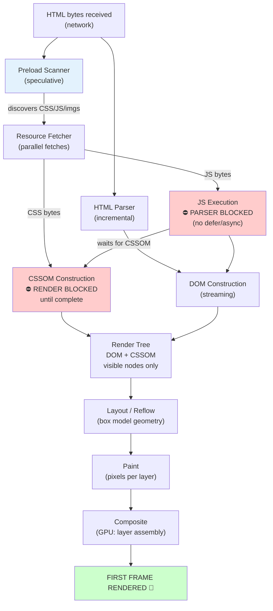

# Critical Rendering Path

🎯 **Interview Weight:** essential (★★★) - CRP is the senior
frontend systems question; anything touching Core Web Vitals,
performance audits, or browser internals leads here

---

### 🎯 Model Answer

**30 seconds:**

> The Critical Rendering Path (CRP) is the sequence of steps the
> browser takes from receiving bytes to displaying pixels:
> Parse HTML → build DOM, parse CSS → build CSSOM, combine →
> Render Tree, Layout, Paint, Composite. Blocking resources
> on the CRP delay first render. CSS is render-blocking. Scripts
> without `defer`/`async` are parser-blocking (and render-blocking).
> Optimizing CRP = getting the browser to its first paint faster.

**3 minutes (Senior):**

> The CRP has 6 distinct stages:
>
> 1. HTML parsing → DOM construction. Incremental: browser starts
>    building the DOM as HTML bytes arrive (streaming parse).
>
> 2. CSS parsing → CSSOM construction. The CSSOM is NOT incremental
>    for rendering: the browser blocks rendering until all CSS is
>    loaded and parsed (partial CSS = wrong styles = reflow).
>
> 3. JavaScript execution. Scripts BLOCK HTML parsing (they can
>    modify the DOM and can include `document.write`). Scripts also
>    BLOCK CSS: a script after a stylesheet must wait for the
>    stylesheet to finish (scripts can query computed styles).
>
> 4. Render Tree = DOM + CSSOM (filtered to visible nodes only).
>    `display: none` nodes are excluded. `visibility: hidden`
>    nodes ARE included (they take space).
>
> 5. Layout (Reflow): browser calculates element positions and
>    sizes. This is expensive and can cascade (change parent = recalculate children).
>
> 6. Paint + Compositing: pixels drawn to layer bitmaps, then
>    layers composited (GPU). `transform` and `opacity` changes
>    avoid layout and paint - they're composited on GPU only.
>
> CRP optimization targets:
> - Minimize render-blocking CSS (inline critical CSS, async non-critical)
> - Defer JavaScript (move to `defer` or `async`)
> - Minimize bytes in HTML/CSS (compressed, minified)
> - Cache aggressively (HTTP cache, service workers)

*Adapting up:* Discuss the Preload Scanner (browser's secondary
lookahead parser), interleaved compositor thread, Blink's multi-process
architecture, layer promotion heuristics (`will-change: transform`),
and how `content-visibility: auto` changes the rendering model.

*Adapting down:* The browser reads HTML, builds a description of
the page, applies CSS for styling, calculates where things go,
and draws them. This sequence is the Critical Rendering Path.
Anything that slows any step slows the first visible output.

**Blank Mind Recovery:**

**(1) Restate:** "Parse HTML and CSS → merge into Render Tree →
Layout → Paint → Composite. Blocking resources slow first paint."

**(2) First principles:** "Before showing a pixel, the browser
needs to know what elements exist (DOM), how they're styled (CSSOM),
where they go (Layout), and what color they are (Paint). Each step
depends on the previous. Block any step = delay all subsequent steps."

**(3) Bridge:** "CRP is the browser's assembly line. Render-blocking
CSS is like a quality checkpoint that stops the line until it passes.
Deferring scripts lets the line keep running in parallel."

---

### 📘 Concept Explanation

**What it is:**

The Critical Rendering Path (CRP) is the sequence of steps the
browser performs to convert HTML, CSS, and JavaScript bytes into
pixels rendered on the screen. It defines the minimum amount of
work required to produce the first visible output.

**The problem it solves:**

Understanding the CRP enables targeted performance optimization.
Without knowing which steps are blocking and why, performance
improvements are guesswork. CRP analysis identifies the specific
bottleneck (render-blocking CSS? parser-blocking JS? large HTML?)
and guides the correct fix.

**How it works:**

```
THE SIX STAGES:

STAGE 1 - HTML PARSING (incremental):
  Bytes → Characters → Tokens → Nodes → DOM

  Browser receives bytes from network (streaming)
  Parser converts bytes to tokens (start/end tags, text, attrs)
  Tokens become DOM nodes with parent/child relationships
  Parsing is incremental (renders before all HTML received)

  <html>              → html element
    <head>            → head element
      <link rel="stylesheet" href="styles.css">
        → PAUSE: CSS fetch begins (render-blocking resource discovered)
    <body>
      <div id="main">
        <p>Hello</p>

  The Preload Scanner (also called "speculative parser") runs
  AHEAD of the main parser to discover resource URLs early
  (link, script, img, etc.) and starts fetching them before
  the parser reaches them - this is why ordering resources
  in <head> matters.

STAGE 2 - CSSOM CONSTRUCTION:
  CSS Bytes → Tokens → Rules → CSSOM

  CSS is render-blocking:
  - Browser WILL NOT render until CSSOM is complete
  - Partial CSS causes visible style flicker (FOUC)
  - CSSOM construction blocks rendering, not parsing

  Why CSS is "cascade": child rules override parent rules
  The browser must have ALL CSS before it can determine
  the final computed style of any element.

  CSSOM is NOT exposed to JavaScript as a tree
  (it's internal to the render engine)
  JavaScript accesses it via:
    element.style (inline styles)
    window.getComputedStyle(element) (final computed value)
    document.styleSheets (parsed rules)

STAGE 3 - JAVASCRIPT EXECUTION:
  Script encountered → PAUSE HTML parsing
  → Fetch script (if external)
  → Execute script
  → RESUME HTML parsing

  Scripts are parser-blocking because:
  1. Scripts can use document.write() which modifies the HTML
     stream mid-parse
  2. Scripts can modify DOM nodes already parsed

  Scripts are also CSS-blocking:
  Script encounters: getComputedStyle(element)
  → Script WAITS for CSSOM to be ready first
  → Therefore: CSS before script = CSS blocks script
               → CSS blocks script → CSS blocks HTML parsing

  Blocking chain: CSS (before script) → Script → HTML parsing

  defer eliminates parser-blocking:
    <script src="app.js" defer>
    → downloaded parallel with HTML parsing
    → executed AFTER HTML parsing completes
    → execution ORDER preserved for multiple defers

  async eliminates parser-blocking:
    <script src="analytics.js" async>
    → downloaded parallel with HTML parsing
    → executed AS SOON AS downloaded (any time)
    → ORDER NOT preserved

STAGE 4 - RENDER TREE CONSTRUCTION:
  DOM + CSSOM → Render Tree

  Render Tree includes ONLY visible nodes:
    display: none → EXCLUDED (no box in tree)
    visibility: hidden → INCLUDED (empty box in tree)
    <head> content → EXCLUDED
    <script> content → EXCLUDED
    comments → EXCLUDED

  Each node in render tree:
    - DOM node reference
    - Computed style
    - Rendering box type (block, inline, flex, grid, etc.)

  Pseudo-elements (::before, ::after):
    ARE included in render tree even though not in DOM

STAGE 5 - LAYOUT (REFLOW):
  Render Tree → box model geometry

  Calculates: exact position (x,y) and size (width, height)
  of every element in the viewport.

  Uses: the box model (content, padding, border, margin)
  Input: computed styles (font-size, padding, width, etc.)
  Output: layout boxes with exact pixel positions

  Layout is EXPENSIVE:
  - Single layout: O(n) where n = visible elements
  - Cascades: changing parent width reflows all children
  - Layout thrashing: reading then writing DOM in a loop
    triggers repeated reflows

  Layout thrashing (BAD):
    for (let i = 0; i < 100; i++) {
      el.style.left = el.offsetLeft + 1 + 'px'; // read+write
      // Each iteration: write triggers pending layout
      //                 read forces immediate layout
      // 100 layouts instead of 1
    }

  Fix (batch reads then writes):
    // Read all first:
    const lefts = items.map(el => el.offsetLeft);
    // Write all after:
    items.forEach((el, i) => {
      el.style.left = lefts[i] + 1 + 'px';
    });
    // 1 layout instead of 100

  Properties that trigger layout (expensive):
    offsetTop/Left/Width/Height, clientWidth/Height,
    scrollTop/Left/Width/Height, getBoundingClientRect(),
    computed width/height with getComputedStyle

STAGE 6 - PAINT AND COMPOSITING:
  Layout boxes → pixels

  PAINT:
  - Fills pixels for each element in layout box order
  - Background, borders, text, images, shadows
  - Paint is per-layer (browser creates layers)

  COMPOSITING:
  - GPU assembles the layers in correct order
  - Produces final frame bitmap
  - Compositor thread: separate from main thread

  Layer promotion:
    Elements promoted to their own GPU layer:
    - will-change: transform (explicitly hints to browser)
    - transform: translateZ(0) (legacy hack - still works)
    - position: fixed (usually)
    - <video>, <canvas>, <iframe>
    - Elements with CSS animations on transform/opacity

  GPU-accelerated properties (no layout, no paint):
    transform: translate/scale/rotate
    opacity
    These changes are handled by the compositor thread
    (different CPU core, doesn't block main thread)

  Properties and their rendering cost:
    Layout triggers: width, height, padding, margin, top, left,
      font-size, border-width, overflow, display, position
    Paint triggers: background, color, border-style, box-shadow
    Compositing only: transform, opacity, filter

THE CRITICAL PATH METRIC:
  CRP length = resources on the critical path
  CRP time = sum of round trips for critical resources

  Single page load with external CSS and JS (no defer):
  RTT1: HTML
  RTT2: CSS + JS (discovered by preload scanner, parallel)
  RTT3: (parsing completes, CSSOM+DOM ready)
  First Paint: RTT3

  With defer on JS:
  RTT1: HTML
  RTT2: CSS (render-blocking), JS (parallel, not blocking)
  RTT3: CSSOM ready (DOM parsing finishes after CSS)
  First Paint: RTT2 or RTT3 (JS doesn't block)
```

**The key insight:**

CSS-before-script creates a hidden blocking dependency. If you
have `<link rel="stylesheet">` followed immediately by `<script>`
(no defer/async), the browser must WAIT for CSS before executing
the script (because the script might call `getComputedStyle`).
This means the script effectively becomes CSS-blocking even if
the CSS and script are independent. Moving the script to `defer`
or placing it after the body breaks this chain.

**When to use it (optimization guidance):**

1. Inline critical CSS (above-fold styles) → eliminates CSS
   network round trip for first render
2. `defer` on all scripts → removes parser-blocking
3. Minimize render-blocking CSS file size (code split)
4. Preload critical resources (`<link rel="preload">`)
5. Compress HTML/CSS (Brotli > gzip, minification)
6. Use GPU-compositable properties for animations (transform, opacity)

**When NOT to use it:**

There is no "don't optimize CRP." Every page benefits from CRP
analysis. The question is whether the optimization ROI justifies
the engineering cost. For internal tools: basic defer/async and
minification. For consumer-facing pages: full CRP optimization.

**Alternatives:**

- Server-Side Rendering: deliver fully rendered HTML (fast FCP)
- Streaming SSR: send HTML incrementally (faster TTFB)
- Edge rendering: render at CDN edge (lower TTFB)
- `content-visibility: auto`: defer off-screen layout + paint

**First-principles derivation:**

The browser has a rendering pipeline with dependencies: CSS must
be known before styles can be applied. Scripts may modify the
DOM. The browser is maximally cautious: it won't render partial
CSS (visible glitch), won't continue parsing HTML past a script
(DOM modification risk). These constraints create the "blocking"
behavior. Optimizing the CRP = reducing these necessary waits
without violating the browser's correctness guarantees.

---

### 💻 Code Example

**CRP blocking vs optimized comparison**

```html
<!-- BAD: render-blocking and parser-blocking configuration -->
<!DOCTYPE html>
<html>
<head>
  <!-- External CSS: render-blocking (OK, but optimize size) -->
  <link rel="stylesheet" href="/styles.css">
  <!-- JS after CSS + no defer: CSS blocks JS, JS blocks parse -->
  <script src="/app.js"></script>
  <!-- Time to first render: HTML fetch + CSS fetch + JS fetch
       + JS execution. All sequential. -->
</head>
<body>
  <h1>Page content</h1>
  <!-- Large images with no dimensions: CLS on load -->
  
  <!-- The browser doesn't know this image is LCP - no priority -->
</body>
</html>
```

```html
<!-- GOOD: optimized CRP -->
<!DOCTYPE html>
<html>
<head>
  <meta charset="UTF-8">
  <meta name="viewport"
        content="width=device-width, initial-scale=1">
  <title>Page Title</title>

  <!-- 1. INLINE critical CSS (above-fold styles only) -->
  <!-- Eliminates CSS network round trip for first render -->
  <style>
    /* Inlined: only styles needed for above-fold content */
    body { margin: 0; font-family: system-ui, sans-serif; }
    .hero { max-width: 1200px; margin: auto; }
    h1 { font-size: clamp(1.5rem, 4vw, 3rem); }
  </style>

  <!-- 2. PRECONNECT: third-party origins used within 3s -->
  <link rel="preconnect" href="https://fonts.gstatic.com" crossorigin>

  <!-- 3. PRELOAD: LCP image at highest priority -->
  <link rel="preload"
        as="image"
        href="/hero.jpg"
        fetchpriority="high">

  <!-- 4. PRELOAD: non-inlined critical CSS -->
  <!-- <link rel="preload" href="/critical.css" as="style"> -->

  <!-- 5. NON-CRITICAL CSS: async load (media trick) -->
  <!-- Loads in background, applies when ready, no render block -->
  <link rel="stylesheet"
        href="/full-styles.css"
        media="print"
        onload="this.media='all'">
  <noscript>
    <link rel="stylesheet" href="/full-styles.css">
  </noscript>
</head>
<body>
  <!-- HERO: LCP element with dimensions + priority -->
  
  <!-- width+height: reserves space (prevents CLS) -->
  <!-- fetchpriority="high": LCP at highest priority -->

  <!-- BELOW FOLD: lazy load -->
  

  <!-- 6. SCRIPTS: defer (parallel download, post-parse execution) -->
  <!-- Placed at end of body for DOM availability (good practice) -->
  <!-- OR: in head with defer (same result) -->
  <script src="/app.js" defer></script>
  <!-- Independent analytics: async -->
  <script src="/analytics.js" async></script>
</body>
</html>
```

> **Code walkthrough:** The optimized page eliminates three CRP
> bottlenecks. Inline critical CSS removes the CSS network round
> trip for above-fold styles - the render tree can be built using
> only inline styles, allowing a first paint before `/full-styles.css`
> loads. The preload hint for the LCP image starts fetching it
> as soon as the HTML head is parsed, not when the parser reaches
> the `` tag in the body. `defer` on the app bundle means
> HTML parsing is never interrupted - the script downloads in
> parallel and executes after the DOM is complete. The async load
> of full CSS uses the media print trick: `media="print"` prevents
> render-blocking while the `onload` handler switches it to `all`.

---

### ⚖️ Comparison Table

| Property Type | Triggers | GPU? | Cost | Example Properties |
|---|---|---|---|---|
| Layout (reflow) | Layout + Paint + Composite | No | High | width, height, top, left, font-size, padding |
| Paint | Paint + Composite | No | Medium | background, color, border-style, box-shadow |
| Compositing only | Composite | Yes | Low | transform, opacity |

| Resource Type | Blocks Parsing | Blocks Rendering | Fix |
|---|---|---|---|
| CSS (external) | No | YES | Inline critical, async non-critical |
| Script (no defer) | YES | YES (via CSS) | Add defer or async |
| Script (defer) | No | No | Default choice |
| Script (async) | No | No | Independent scripts only |
| Images | No | No | Preload LCP image |
| Fonts | No | Partially (FOIT) | preload + font-display |

---

### 🎓 Answers by Seniority

**Junior / Mid:**

> CRP is the sequence: parse HTML (DOM) → parse CSS (CSSOM) →
> merge into Render Tree → Layout → Paint → Composite.
> CSS is render-blocking (browser won't paint until CSSOM is ready).
> Scripts without defer/async block HTML parsing. Optimize by:
> inlining critical CSS, deferring scripts, preloading the LCP image.
> The goal is minimizing Time to First Paint.

---

**Senior / Staff:**

> CRP optimization strategy is layered:
>
> Network layer: preconnect for origins, preload for critical
> resources, Brotli compression, HTTP/2 multiplexing, CDN edge
> caching.
>
> Parse/render layer: inline critical CSS, async load non-critical
> CSS, defer scripts, modulepreload for ES modules.
>
> Layout layer: avoid layout thrashing (batch reads/writes), use
> transform/opacity for animations, `will-change: transform` for
> promoted layers, `content-visibility: auto` for long pages.
>
> Measurement: lighthouse, Web Vitals (LCP, CLS, INP), Chrome
> DevTools Performance panel. CRP optimization is complete when
> Lighthouse Performance score is 90+ and LCP is under 2.5s for
> the 75th percentile.

---

### ⚠️ Common Misconceptions

**"CSS doesn't block JavaScript"**

CSS DOES block JavaScript. Any `<script>` tag that follows a
`<link rel="stylesheet">` in the HTML must wait for the stylesheet
to finish loading before executing. The reason: the script may
call `getComputedStyle()` which requires CSSOM. The browser
plays it safe. This creates: CSS load → script execution →
HTML parsing resume. Use `defer` to break this chain.

**"Render-blocking and parser-blocking are the same thing"**

They're distinct. CSS is RENDER-blocking (halts the render tree
construction and painting) but is NOT parser-blocking (HTML parsing
continues). Scripts without defer are BOTH parser-blocking AND
render-blocking. Knowing the difference guides the fix: CSS
render-blocking is reduced by inlining critical CSS; script
parser-blocking is fixed by adding `defer`.

---

### 🚨 Failure Modes and Diagnosis

**Symptom: high render-blocking time in Lighthouse audit**

```
Lighthouse: "Eliminate render-blocking resources"
  Lists: styles.css (x ms), vendor.js (y ms)

Root cause: external CSS + parser-blocking scripts in <head>

Analysis steps:
  1. Chrome DevTools → Performance tab → Record page load
  2. Look at timeline:
     - "Parse HTML" events (purple): should run continuously
     - "Evaluate Script" (yellow): blocking? for how long?
     - "Recalculate Style" (purple): after CSS loads?
  3. Network panel → check critical waterfall:
     - Which resources are on the critical path?
     - How long is the longest render-blocking chain?

  4. Find render-blocking CSS:
     Coverage tab (Cmd+Shift+P → "Coverage"):
     Shows what % of each CSS file is used on initial load.
     Red = unused. If style.css is 90% red: split it.

  5. Fix render-blocking CSS:
     Option A: Inline critical (top 10-15KB)
     Option B: Load all CSS async:
       <link rel="stylesheet" href="/styles.css"
             media="print" onload="this.media='all'">
     Option C: HTTP/2 early hints (server sends preload headers)

  6. Fix parser-blocking scripts:
     Add defer to every <script> in <head>
     Move scripts to end of <body> (alternative, same effect)

  Verify improvement:
    Lighthouse → regenerate → compare render-blocking score
    DevTools Performance → "First Contentful Paint" marker
    should appear earlier in timeline
```

**Symptom: layout thrashing causing janky scroll/animation**

```
User reports: "scrolling is choppy", "animation stutters"

Diagnosis: Chrome DevTools → Performance → Record scroll
  Look for: Long frames (red bars at top)
  Expand: "Layout" events (dark purple)
  If MANY layouts per frame: layout thrashing

  Forced layout / reflow indicator:
  DevTools Performance panel: red triangle on Layout event
  = "forced synchronous layout"

  Console warning (Chrome):
  "Forced reflow while executing JavaScript"

Root cause (layout thrashing):
  for (const el of elements) {
    const height = el.offsetHeight;   // FORCES LAYOUT (read)
    el.style.height = height * 2 + 'px'; // INVALIDATES (write)
    // Next iteration: layout is invalidated,
    // offsetHeight forces another layout → thrashing
  }

Fix (separate read and write phases):
  // Phase 1: read all values:
  const heights = elements.map(el => el.offsetHeight);
  // Phase 2: write all values:
  elements.forEach((el, i) => {
    el.style.height = heights[i] * 2 + 'px';
  });

Or: use requestAnimationFrame to batch writes:
  const updates = [];
  elements.forEach(el => {
    updates.push({ el, height: el.offsetHeight });
  });
  requestAnimationFrame(() => {
    updates.forEach(({ el, height }) => {
      el.style.height = height * 2 + 'px';
    });
  });

Libraries: fastdom.js formalizes read/write batching
```

---

### 🎯 Interview Deep-Dive

| Scenario | Recommended Time | Key Signal |
|---|---|---|
| Six CRP stages in order | 3-4 min | Sequence mastery |
| Why CSS is render-blocking | 3 min | CSSOM + FOUC reasoning |
| CSS before script creates hidden block | 3 min | Subtle interaction |
| Layout vs paint vs composite | 3 min | Rendering cost tiers |
| Layout thrashing - diagnosis and fix | 4-5 min | Production debugging |
| Inline critical CSS strategy | 3-4 min | CRP optimization |
| Preload scanner mechanics | 3 min | How browser parallelizes |
| Layer promotion and will-change | 3-4 min | GPU compositing |
| content-visibility and its effect on CRP | 3 min | Modern CRP |
| Measuring CRP performance | 3-4 min | Tools + metrics |
| LCP optimization from CRP perspective | 3-5 min | Core Web Vitals |
| Script loading and CRP blocking chain | 4 min | defer/async CRP effect |
| requestAnimationFrame and compositing | 3 min | Frame timing |
| Server-side streaming and CRP | 4 min | SSR optimization |
| HTTP/103 Early Hints and CRP | 3 min | Pre-HTML hints |
| Speculative/lookahead parsing | 3 min | Preload scanner |
| CRP in mobile/slow networks | 3 min | Real-world constraints |
| CSS architecture for CRP (critical + async) | 3-4 min | Build strategy |
| transform vs top/left for animation | 3 min | Compositing vs layout |

---

**Q1: What are the six stages of the Critical Rendering Path
and what does each do?** `[JUNIOR]` DEFINITION

*Why they ask:* Foundation question for all CRP topics.

*Likely follow-up:* "Which stage blocks all others if it's slow?"

> **Answer:**
>
> The six stages of the Critical Rendering Path:
>
> **Stage 1: HTML Parsing → DOM**
> The browser's HTML parser reads bytes, converts to tokens (start
> tags, end tags, text, attributes), and builds the Document Object
> Model (DOM). Parsing is INCREMENTAL: the browser starts building
> the DOM before receiving all HTML. The Preload Scanner runs
> ahead of the main parser to discover resource URLs early.
>
> **Stage 2: CSS Parsing → CSSOM**
> CSS bytes are converted to the CSS Object Model (CSSOM). The
> CSSOM is a tree of computed styles. Unlike DOM construction,
> rendering is BLOCKED until the CSSOM is complete. A partial
> CSSOM would cause visible style changes (Flash of Unstyled Content).
> The browser must know ALL cascading rules before applying any.
>
> **Stage 3: JavaScript Execution**
> When the parser encounters a `<script>` tag (without defer/async),
> it stops parsing and executes the script. Scripts may modify the
> DOM, call `document.write()`, or query computed styles (which
> requires CSSOM). This creates the blocking behavior.
>
> **Stage 4: Render Tree Construction**
> DOM + CSSOM are merged into the Render Tree. Only VISIBLE nodes
> are included: `display: none` nodes are excluded, `<head>` is
> excluded, comments are excluded. `visibility: hidden` nodes ARE
> included (they hold space). Each render tree node has its
> computed style and box type.
>
> **Stage 5: Layout (Reflow)**
> The browser calculates the exact position and size of every
> element based on the box model, viewport dimensions, and computed
> styles. Output: geometry (x, y, width, height) for every visible
> element. Layout is expensive - changes cascade through the tree.
>
> **Stage 6: Paint + Compositing**
> Paint fills pixel buffers for each rendering layer (background,
> text, borders, images). Compositing assembles layers in order
> on the GPU to produce the final frame. GPU-composited properties
> (transform, opacity) skip layout and paint, going directly to
> compositing.
>
> Which stage blocks all others if slow:
> CSSOM construction (Stage 2) is the most common bottleneck.
> Stages 4, 5, and 6 cannot start until CSSOM is complete. A
> large, unoptimized CSS file delays all subsequent stages.
>
> *What separates good from great:* The browser has a "render
> pipeline" but it's not fully sequential in practice. For example,
> Paint can happen incrementally as layout is progressively determined.
> Modern browsers also have multiple threads: the compositor thread
> handles compositing separately from the main thread. `transform`
> and `opacity` animations run on the compositor thread without
> touching the main thread - this is why they're smooth even when
> the main thread is busy. Understanding the thread model explains
> why some animations are smooth and others aren't.

---

**Q2: Why is CSS render-blocking? Can you make it non-blocking?**
`[SENIOR]` MECHANISM

*Why they ask:* Core CRP understanding question.

*Likely follow-up:* "What is FOUC and why does browser prevent it?"

> **Answer:**
>
> CSS is render-blocking because the browser must have a complete
> CSSOM before it can build the Render Tree. A render with incomplete
> CSS would show elements in wrong styles, then reflash when
> CSS loads - the Flash of Unstyled Content (FOUC).
>
> Example of what happens without blocking (hypothetical FOUC):
> ```
> 1. HTML parsed: <h1>Hello</h1> (no CSS yet)
> 2. Browser renders: h1 with default user-agent styles (serif, 16px)
> 3. CSS loads: h1 { font-family: sans-serif; font-size: 32px; }
> 4. Browser re-renders: h1 changes style
> → User sees text flicker (FOUC) = bad UX
> ```
>
> The browser blocks rendering to prevent this:
> ```
> 1. HTML parsed: <h1>Hello</h1>
> 2. CSS loading... (rendering blocked)
> 3. CSS loaded and parsed
> 4. Render Tree built with correct styles
> 5. Layout + Paint: h1 appears CORRECTLY on first render
> ```
>
> Can you make CSS non-blocking?
> CSS is blocking for all stylesheets that apply to the current
> context. But there are tricks to load non-critical CSS
> asynchronously:
>
> Trick 1: `media` attribute mismatch (doesn't apply → not blocking):
> ```html
> <!-- loads but not render-blocking (media doesn't match screen): -->
> <link rel="stylesheet" href="/non-critical.css"
>       media="print"
>       onload="this.media='all'">
> <!-- onload: switches to 'all' → applies to screen -->
> <!-- Until it loads: no render blocking -->
> ```
>
> Trick 2: Dedicated media query:
> ```html
> <!-- Only render-blocking on screens >= 1024px: -->
> <link rel="stylesheet" href="/desktop.css" media="(min-width: 1024px)">
> <!-- On mobile: not render-blocking -->
> ```
>
> Why `print` stylesheet blocks on PRINT, not on SCREEN:
> Browser determines if a media query matches the current context.
> `print` doesn't match screen rendering → not render-blocking for screen.
>
> `preload` with stylesheet: NOT the same as async loading.
> `<link rel="preload" href="/style.css" as="style">` fetches
> at high priority but is still render-blocking when the browser
> encounters the corresponding `<link rel="stylesheet">`. Preload
> just fetches earlier; it doesn't remove the blocking.
>
> *What separates good from great:* The `media="print"` trick
> is the standard for async CSS loading because:
> 1. Browser still downloads it (not ignored)
> 2. It's fast (applying `media="all"` via onload is a style update,
>    not a CSS re-parse)
> 3. Works without JavaScript for the initial load (noscript fallback)
> 4. Respected by all browsers
>
> The noscript fallback:
> ```html
> <link rel="stylesheet" href="/styles.css" media="print"
>       onload="this.media='all'">
> <noscript><link rel="stylesheet" href="/styles.css"></noscript>
> ```
> This ensures the stylesheet applies even when JavaScript is disabled.

---

**Q3: How does JavaScript interact with the CRP? What is the
CSS-before-script blocking chain?** `[SENIOR]` MECHANISM

*Why they ask:* The most subtle and commonly misunderstood CRP behavior.

*Likely follow-up:* "What does defer do differently from async in the context of CRP?"

> **Answer:**
>
> Scripts are parser-blocking because:
> 1. Scripts can call `document.write()` which inserts HTML mid-parse
> 2. Scripts can modify DOM nodes that have already been parsed
>
> The parser stops, waits for the script to be fetched and executed,
> then resumes. This is the direct blocking.
>
> **CSS-before-script blocking chain (the hidden dependency):**
>
> If a `<script>` appears AFTER a `<link rel="stylesheet">` in the
> HTML, the script must wait for the stylesheet to finish:
>
> ```html
> <link rel="stylesheet" href="/styles.css">
> <script src="/app.js"></script>
> <!-- app.js CANNOT execute until styles.css finishes -->
> <!-- Reason: app.js might call getComputedStyle() -->
> <!-- getComputedStyle() requires a complete CSSOM -->
> ```
>
> Blocking chain:
> ```
> HTML parsing starts
> → Parser sees <link rel="stylesheet">
>   → Stylesheet fetch begins
> → Parser sees <script src="app.js">
>   → HTML parsing BLOCKED
>   → Script fetch begins
>   → Script is ready: BUT CSS not loaded yet
>   → WAIT for CSS (getComputedStyle risk)
>   → CSS loaded + parsed
>   → Script executes
>   → HTML parsing RESUMES
>
> Total delay: max(CSS fetch time, JS fetch time)
> + JS execution time
> ```
>
> The fix: `defer` on the script:
> ```html
> <link rel="stylesheet" href="/styles.css">
> <script src="/app.js" defer></script>
> <!-- Now:
>   HTML parsing continues (not blocked)
>   CSS and app.js download in parallel
>   BOTH complete before DOMContentLoaded
>   app.js executes after DOM is ready AND CSS is ready
>   No blocking chain
> ```
>
> OR: move script before the stylesheet (if the script doesn't
> need CSS):
> ```html
> <script src="/analytics.js" async></script>
> <link rel="stylesheet" href="/styles.css">
> <!-- analytics.js has no CSS dependency -->
> <!-- No blocking chain (script before CSS in DOM order) -->
> ```
>
> DOMContentLoaded vs load:
> - `DOMContentLoaded`: fires when HTML is fully parsed AND
>   deferred scripts have executed. CSS may still be loading.
> - `load`: fires when page AND all resources (images, CSS, fonts)
>   are fully loaded.
>
> *What separates good from great:* In practice, most production
> applications put scripts at the end of `<body>` (traditional
> advice) OR use `defer` in `<head>` (modern advice). Both are
> equivalent for CRP. `defer` in `<head>` is strictly better:
> the browser can START downloading the script EARLIER (preload
> scanner discovers it earlier). A script at the end of body is
> discovered only when the parser reaches it (after the body).
> `defer` in `<head>` = same execution order + earlier download start.

---

**Q4: What is layout thrashing and how do you diagnose and fix it?**
`[SENIOR]` SCENARIO

*Why they ask:* Production performance engineering.

*Likely follow-up:* "What is requestAnimationFrame used for?"

> **Answer:**
>
> Layout thrashing occurs when JavaScript forces the browser to
> perform multiple reflows in rapid succession by interleaving
> DOM reads and writes.
>
> How it happens:
> ```javascript
> // THRASHING: read then write alternating in a loop
> for (const box of boxes) {
>   const width = box.offsetWidth;   // READ: forces layout
>   box.style.width = width + 10 + 'px'; // WRITE: invalidates layout
>   // Next iteration: layout is INVALIDATED
>   // offsetWidth READ: forces ANOTHER layout
>   // 100 boxes = 100 layouts, 100 paints
> }
> ```
>
> Why it's expensive: each layout is O(visible nodes). With
> 100 boxes and 100 layouts, work is O(n * visible_nodes).
> A page with 1000 DOM nodes: 100 * 1000 = 100,000 node
> evaluations per frame. At 60fps: must complete in 16.67ms.
> This is impossible and causes "jank" (missed frames).
>
> Diagnosis:
> ```
> Chrome DevTools → Performance tab
> Click "Record" → interact with the page → "Stop"
> Look for:
>   1. Long red bars at the top (frames > 16.67ms)
>   2. Repeated "Layout" blocks in the main thread flame chart
>   3. Red triangle on Layout events = "Forced Synchronous Layout"
>   4. Warning in console (Chrome): "Forced reflow while executing JS"
>
> The "Forced Synchronous Layout" indicator means:
>   A layout was REQUESTED by JS (DOM read that requires geometry)
>   but the render tree was INVALIDATED (by a previous DOM write)
>   so the browser was FORCED to complete layout synchronously
>   instead of batching it.
> ```
>
> Fix 1: Batch reads before writes:
> ```javascript
> // Read phase first:
> const widths = boxes.map(box => box.offsetWidth);
> // Write phase after:
> boxes.forEach((box, i) => {
>   box.style.width = widths[i] + 10 + 'px';
> });
> // Result: 1 layout (the read phase) + DOM updates
> ```
>
> Fix 2: Use `requestAnimationFrame` for batching:
> ```javascript
> // requestAnimationFrame: callback runs at the START of a frame
> // BEFORE any layout/paint for that frame
> let pendingUpdate = false;
>
> function scheduleUpdate() {
>   if (!pendingUpdate) {
>     pendingUpdate = true;
>     requestAnimationFrame(() => {
>       // All DOM writes happen here:
>       updateDOM();
>       pendingUpdate = false;
>     });
>   }
> }
>
> // Read DOM values OUTSIDE rAF (before write):
> const measurements = elements.map(e => e.getBoundingClientRect());
>
> // Write in rAF:
> requestAnimationFrame(() => {
>   measurements.forEach((rect, i) => {
>     elements[i].style.transform =
>       `translateX(${rect.left}px)`;
>   });
> });
> ```
>
> Fix 3: Use CSS for what CSS is good at:
> ```javascript
> // BAD: JavaScript driving layout animation:
> function animate() {
>   el.style.left = el.offsetLeft + 1 + 'px'; // layout thrash
>   requestAnimationFrame(animate);
> }
>
> // GOOD: CSS transition (GPU compositing, no JS layout):
> el.style.transform = `translateX(${targetX}px)`;
> el.style.transition = 'transform 300ms ease';
> // No JavaScript per frame. CSS handles it. Compositor thread.
> ```
>
> *What separates good from great:* FastDOM (github.com/wilsonpage/fastdom)
> is a library that formally separates reads and writes using
> microtask scheduling. It provides a `.measure()` function for
> DOM reads and `.mutate()` for DOM writes. FastDOM batches all
> measures to run BEFORE any mutates in a single frame. This turns
> accidental thrashing into a structured pattern. For complex UIs
> with many independent components each reading/writing DOM, FastDOM
> prevents thrashing without requiring the developer to manually
> coordinate read/write ordering across component boundaries.

---

**Q5: What is the Preload Scanner and why does it matter for CRP?**
`[SENIOR]` MECHANISM

*Why they ask:* Advanced CRP knowledge.

*Likely follow-up:* "What types of resources does the preload scanner discover?"

> **Answer:**
>
> The Preload Scanner (also called Speculative Parser or Look-Ahead Parser)
> is a secondary HTML scanner that runs AHEAD of the main HTML parser
> to discover resource URLs while the main parser is blocked.
>
> Why it exists:
> ```
> Main parser hits <script src="app.js">
> → Main parser STOPS (parser-blocking)
> → Without preload scanner: all other resources wait
> → With preload scanner: secondary scanner continues reading HTML
>   → Discovers /styles.css (link), /hero.jpg (img), /font.woff2
>   → Starts fetching ALL of them immediately
> → When main parser resumes: resources are already downloading
> ```
>
> Resources the preload scanner discovers:
> - `<link rel="stylesheet" href="...">` → CSS
> - `<script src="...">` → JavaScript
> - `` and `` → Images
> - `<link rel="preload" href="...">` → Explicit preloads
> - `<video poster="...">` → Video poster
> - `<input type="image" src="...">` → Image inputs
>
> What the preload scanner CANNOT discover:
> - CSS `background-image: url(...)` → only in CSS, parsed after CSSOM
> - Dynamically injected resources via JS (document.createElement)
> - Resources in `@import` inside CSS (deep in CSS parse)
> - Shadow DOM resources
>
> Implications for CRP optimization:
>
> 1. Script order matters: put scripts after CSS in `<head>` for
>    the preload scanner to discover both simultaneously:
>    ```html
>    <!-- Both discovered in parallel by preload scanner: -->
>    <link rel="stylesheet" href="/styles.css">
>    <script src="/app.js" defer></script>
>    ```
>
> 2. Image srcset in HTML (not CSS): preload scanner can discover
>    and fetch the correct image variant early:
>    ```html
>    <!-- Preload scanner discovers this, fetches correct variant: -->
>             sizes="(max-width: 600px) 480px, 1200px"
>         src="large.jpg" alt="">
>    <!-- CSS background-image NOT discovered by preload scanner -->
>    ```
>
> 3. CSS background images as LCP: worst case for CRP.
>    If the LCP element uses a CSS background image:
>    ```css
>    .hero { background-image: url('/hero.jpg'); }
>    ```
>    The hero.jpg is not discoverable until: HTML parsed → CSS
>    fetched → CSS parsed → background-image URL discovered →
>    hero.jpg fetch begins. Three sequential hops.
>    Fix: use `` for the LCP element (preload scanner finds it),
>    or add `<link rel="preload" href="/hero.jpg" as="image">`.
>
> *What separates good from great:* The preload scanner is the
> main reason why resource ordering in `<head>` matters. A `<link rel="preload">`
> that appears BEFORE the `<script>` that blocks parsing gives
> the preload scanner a chance to start the fetch before parsing
> is blocked. A preload AFTER the parser-blocking script is only
> discovered when the parser resumes. In practice: put all preloads
> and resource hints at the very beginning of `<head>`, before
> any blocking resources.

---

**Q6: What is the difference between `transform` and `top/left`
for animations?** `[SENIOR]` MECHANISM

*Why they ask:* CSS rendering performance.

*Likely follow-up:* "What is will-change: transform?"

> **Answer:**
>
> Animating `top/left` (positional properties) and `transform`
> produce identical visual results but trigger different rendering stages:
>
> `top: 100px` → `top: 110px`:
> 1. Layout: recalculates positions of the element AND potentially
>    all sibling/descendant elements (flow changes)
> 2. Paint: re-paints the affected region
> 3. Composite: assembles layers
>
> Cost: Layout + Paint + Composite per frame. Layout at 60fps
> = 60 full layouts per second. On a complex page: expensive.
>
> `transform: translateY(100px)` → `transform: translateY(110px)`:
> 1. ~~Layout~~: not triggered (transform doesn't affect layout flow)
> 2. ~~Paint~~: not triggered (the element's pixel content doesn't change)
> 3. Composite: GPU moves the layer's existing bitmap to new position
>
> Cost: Composite only. Runs on the COMPOSITOR THREAD (separate
> from main thread). Even if main thread is busy (JavaScript
> running), the animation continues smoothly.
>
> ```css
> /* BAD: top/left animation - layout + paint each frame */
> .moving-box {
>   position: absolute;
>   top: 0;
>   transition: top 300ms ease;  /* triggers layout each frame */
>   animation: move 1s infinite;
> }
> @keyframes move {
>   from { top: 0; }
>   to { top: 100px; }
> }
>
> /* GOOD: transform animation - composite only */
> .moving-box {
>   position: absolute;
>   transform: translateY(0);
>   transition: transform 300ms ease;  /* compositor only */
>   animation: move 1s infinite;
> }
> @keyframes move {
>   from { transform: translateY(0); }
>   to { transform: translateY(100px); }
> }
> ```
>
> `will-change: transform`:
> ```css
> .animated-element {
>   will-change: transform;
> }
> ```
> Tells the browser: "this element WILL be animated with transform."
> Browser promotes it to its own GPU layer BEFORE the animation starts.
> Without this: layer promotion happens when animation starts → visible
> repaint of the new layer.
> With this: layer is pre-created → animation starts instantly, no repaint.
>
> Cost of `will-change`: GPU memory for the layer bitmap.
> Use sparingly - only on elements that genuinely animate.
> `will-change: auto` (default) or `will-change: initial` = remove the hint.
>
> Only two properties have "free" animation:
> - `transform` (including translate, rotate, scale)
> - `opacity`
>
> CSS `filter` (non-blur): also composited in modern browsers.
> CSS `filter: blur()`: paint + composite (re-paint for blur).
>
> *What separates good from great:* Using `transform: translateX()`
> instead of `left` is not just a performance micro-optimization -
> it's the difference between an animation that degrades gracefully
> on a busy main thread vs one that freezes. JavaScript-heavy pages
> (React rendering, long tasks) occupy the main thread. `top/left`
> animations pause when the main thread is busy (they require a
> new layout). `transform` animations continue because they run on
> the compositor thread independently. This is why `transform`
> is the correct choice for any UI animation on an interactive page.

---

**Q7: How do you measure CRP performance and set improvement targets?**
`[SENIOR]` SCENARIO

*Why they ask:* Measurement discipline.

*Likely follow-up:* "What is the Web Vitals threshold for LCP?"

> **Answer:**
>
> CRP optimization must be measured to validate improvements.
> Toolchain:
>
> **Chrome DevTools - Performance Panel:**
> ```
> 1. Open Performance panel
> 2. Enable "Screenshots" and "Network" checkboxes
> 3. Click Record, reload the page, click Stop
> 4. Key metrics to look for:
>    - "FP" marker: First Paint (browser first drew a pixel)
>    - "FCP" marker: First Contentful Paint
>    - "LCP" marker: Largest Contentful Paint
>    - Network waterfall (top): blocking resources
>    - Main thread (pink): long tasks, layout events
>    - Rendering (dark green): paint events
>
> Critical signals:
>    - Green FCP < 1.8s: good
>    - Red FCP > 3s: poor
>    - Forced reflow triangles: layout thrashing
>    - Long yellow JS tasks: blocking main thread
> ```
>
> **Lighthouse:**
> ```
> DevTools → Lighthouse tab → Performance
> Key scores:
>   FCP (First Contentful Paint): target < 1.8s
>   LCP (Largest Contentful Paint): target < 2.5s
>   CLS (Cumulative Layout Shift): target < 0.1
>   TBT (Total Blocking Time): target < 200ms
>   Speed Index: target < 3.4s
>
> Lighthouse diagnoses:
>   "Eliminate render-blocking resources" → CSS/JS on CRP
>   "Reduce unused CSS" → CSS coverage
>   "Preload LCP image" → LCP element not preloaded
>   "Avoid chaining critical requests" → deep request chains
> ```
>
> **Web Vitals (Real User Monitoring):**
> ```javascript
> import { getLCP, getFID, getCLS, getFCP } from 'web-vitals';
>
> getLCP(metric => {
>   console.log('LCP:', metric.value);
>   // value in ms
>   // Good: < 2500
>   // Needs improvement: 2500 - 4000
>   // Poor: > 4000
>   sendToAnalytics(metric);
> });
>
> // LCP threshold (Google CWV):
> // Good: <= 2500ms
> // Needs improvement: 2500-4000ms
> // Poor: > 4000ms
>
> // FCP threshold:
> // Good: <= 1800ms
> // Needs improvement: 1800-3000ms
> // Poor: > 3000ms
> ```
>
> **WebPageTest (production-grade):**
> - Test from real geographic locations
> - Test on real devices (not just desktop)
> - Shows full waterfall with connection timing
> - Filmstrip view: visual progression of page loading
> - Core Web Vitals overlay on filmstrip
>
> Setting targets:
> ```
> LCP target: <= 2.5s at 75th percentile (real users)
> FCP target: <= 1.8s
> TBT target: <= 200ms
> CLS target: <= 0.1
>
> The 75th percentile requirement: optimization for
> median users isn't enough - Core Web Vitals counts
> the 75th percentile across page views.
> ```
>
> *What separates good from great:* The distinction between
> lab data (Lighthouse, DevTools) and field data (real users via
> CrUX, web-vitals.js). Lab data is controlled but doesn't
> represent real devices, networks, and user behavior. Field data
> (from Google's Chrome User Experience Report, CrUX) shows
> ACTUAL percentile distributions across real users.
> Google's PageSpeed Insights shows BOTH: lab (Lighthouse) and
> field (CrUX). For CWV ranking signals in Google search: only
> field data counts. You can have a perfect Lighthouse score and
> still fail CWV if real users on slow devices experience poor LCP.

---

**Q8: How does inline critical CSS work and how do you generate it?**
`[SENIOR]` MECHANISM

*Why they ask:* Most impactful single CRP optimization.

*Likely follow-up:* "What tools generate critical CSS automatically?"

> **Answer:**
>
> Inline critical CSS is the technique of placing styles for
> above-fold content directly in a `<style>` tag in the `<head>`,
> then loading the full stylesheet asynchronously.
>
> Why it works:
> ```
> WITHOUT inline critical CSS:
>   1. HTML arrives (no style yet)
>   2. Browser waits for styles.css (render-blocked)
>   3. styles.css arrives (all 100KB)
>   4. First render happens
>   → FCP = HTML + 1 CSS round trip
>
> WITH inline critical CSS:
>   1. HTML arrives, contains <style>...critical CSS...</style>
>   2. First render happens immediately (critical CSS in HTML)
>   3. full-styles.css loads asynchronously (no blocking)
>   → FCP = HTML only (critical CSS is inline, no extra RTT)
> ```
>
> What is "critical CSS":
> Styles required to render the above-fold content correctly.
> Typically: typography, layout (header, hero section), colors,
> font-face declarations for fonts used above fold.
>
> How much to inline: 10-15KB max (compressed). Larger inline
> CSS prevents the HTML from being efficiently cached and slows
> the initial document transfer.
>
> Generating critical CSS:
>
> **Tool: Critical (npm):**
> ```javascript
> const critical = require('critical');
>
> critical.generate({
>   inline: true,
>   base: 'dist/',
>   src: 'index.html',
>   target: 'index-critical.html',
>   width: 1300,
>   height: 900,
>   // also generate for mobile:
>   dimensions: [
>     { width: 375, height: 812 },
>     { width: 1300, height: 900 }
>   ]
> });
>
> // What it does:
> //   Loads the page in a headless browser (Puppeteer)
> //   Identifies CSS rules used by above-fold elements
> //   Inlines those rules, loads rest asynchronously
> ```
>
> **Tool: Penthouse (Puppeteer-based):**
> ```javascript
> const penthouse = require('penthouse');
>
> const criticalCss = await penthouse({
>   url: 'https://yoursite.com',
>   css: './dist/styles.css',
>   width: 1300, height: 900
> });
>
> fs.writeFileSync('./dist/critical.css', criticalCss);
> ```
>
> Automated in build pipeline:
> ```json
> // package.json scripts:
> {
>   "scripts": {
>     "build": "webpack --mode production && npm run critical",
>     "critical": "node scripts/generate-critical-css.js"
>   }
> }
> ```
>
> Practical caveat: critical CSS is page-specific. The home page
> critical CSS is different from the product page. For large sites:
> generate per template, not per URL.
>
> *What separates good from great:* Critical CSS combined with
> `font-display: optional` (don't wait for custom fonts to render
> above-fold text) and preloading the LCP image produces a "first
> render with correct styles but no custom font + progressive
> enhancement" pattern. The user sees styled content immediately
> (critical CSS provides layout), with the custom font appearing
> once loaded. This prevents both FOUT (Flash of Unstyled Text)
> and FOIT (Flash of Invisible Text) while achieving fast FCP.

---

**Q9: What is the impact of third-party scripts on the CRP?**
`[SENIOR]` SCENARIO

*Why they ask:* Real-world complexity; third-party scripts are
a major source of CRP degradation.

*Likely follow-up:* "How do you control third-party script timing?"

> **Answer:**
>
> Third-party scripts (analytics, A/B testing, chat, ads, social
> embeds) are among the biggest contributors to poor CRP performance.
>
> Why they're particularly harmful:
> 1. External origins: DNS resolution + TCP + TLS for each new origin
> 2. Synchronous (no defer/async): common with older tag managers
> 3. Large bundles: 100KB+ analytics scripts
> 4. Chain loading: Script A loads Script B loads Script C
> 5. Execution blocking: some do synchronous `document.write()`
>    (yes, this still exists in 2025 in some ad networks)
>
> Categories and mitigations:
>
> ```html
> <!-- ANALYTICS (async - doesn't need DOM or CSS): -->
> <script async src="https://analytics.example.com/script.js">
> </script>
> <!-- async: doesn't block parsing, executes when ready -->
>
> <!-- CHAT WIDGETS (defer - needs DOM): -->
> <script defer src="https://widget.example.com/chat.js">
> </script>
> <!-- defer: executes after DOM, doesn't block parsing -->
>
> <!-- A/B TESTING (tricky - needs to hide content before render): -->
> <!-- Some A/B tools MUST be synchronous to prevent flicker -->
> <!-- Best: use edge-based A/B testing (no client-side script) -->
> <!-- Or: use a minimal synchronous snippet + async main script -->
>
> <!-- AD SCRIPTS (worst case - often document.write): -->
> <script defer src="https://ads.example.com/loader.js">
> </script>
> <!-- defer prevents most damage, but document.write in ads
>      still causes issues - audit and report to ad network -->
> ```
>
> Preconnect for third-party origins:
> ```html
> <!-- Start TCP+TLS early for critical third-party origins: -->
> <link rel="preconnect" href="https://analytics.example.com">
> <link rel="dns-prefetch" href="https://ads.example.com">
> <!-- (dns-prefetch for less critical - cheaper than preconnect) -->
> ```
>
> Facade pattern (load on interaction):
> ```html
> <!-- Instead of full YouTube embed (loads 400KB+): -->
> <!-- Show static thumbnail + play button, -->
> <!-- Load actual embed only when user clicks play: -->
> <div class="video-facade"
>      data-src="https://www.youtube.com/embed/VIDEO_ID"
>      onclick="loadVideo(this)">
>           alt="Video title">
>   <button aria-label="Play video">▶</button>
> </div>
>
> <script>
> function loadVideo(facade) {
>   const iframe = document.createElement('iframe');
>   iframe.src = facade.dataset.src + '?autoplay=1';
>   iframe.width = '560'; iframe.height = '315';
>   iframe.allow = 'autoplay; fullscreen';
>   facade.replaceWith(iframe);
> }
> </script>
> <!-- Initial page: no YouTube JS/CSS loaded -->
> <!-- User clicks play: YouTube loads and autoplays -->
> ```
>
> Measuring third-party impact:
> ```
> Chrome DevTools → Performance tab
> After recording: scroll to "Third-party summary" in the
> bottom panel. Shows:
>   - Total main thread blocking time by origin
>   - Total bytes by origin
>   - Number of requests by origin
>
> Lighthouse: "Third-party code" audit
>   Shows total third-party blocking time
>   Highlights the worst offenders
> ```
>
> *What separates good from great:* The facade pattern (sometimes
> called "lazy social embeds" or "load on interaction") is the
> most impactful technique for pages with multiple embeds. A page
> with 3 YouTube videos, a Twitter timeline, and a chat widget
> might add 2MB and 500ms to initial load. With facades: initial
> load is near-zero for those embeds. Clicking play loads ONE video.
> Google's Chrome team published `lite-youtube-embed` as a Web
> Component implementation of this pattern - it's a native
> Custom Element that shows a static thumbnail and loads YouTube
> only on user interaction.

---

**Q10: What is render-blocking font loading and how do you fix it?**
`[SENIOR]` MECHANISM

*Why they ask:* Fonts are a common, often overlooked CRP issue.

*Likely follow-up:* "What is FOIT vs FOUT?"

> **Answer:**
>
> Fonts affect CRP via two performance issues:
>
> 1. **The font is on the CRP** (render-blocking if not preloaded)
> 2. **Font swap timing** affects visual stability (CLS and FOIT/FOUT)
>
> Without optimization:
> ```
> HTML → CSS → @font-face url discovered → font fetched
>   ↓
> Default behavior: invisible text during font load (FOIT)
>   = Flash of Invisible Text
>   Characters appear blank → snap to custom font
>   User can't read during load (bad UX)
> ```
>
> FOUT (Flash of Unstyled Text):
> Text displays in system font → snaps to custom font when loaded.
> Less bad than FOIT (readable during load) but causes CLS.
>
> `font-display` property controls the behavior:
> ```css
> @font-face {
>   font-family: 'MyFont';
>   src: url('/fonts/my-font.woff2') format('woff2');
>
>   /* SWAP (recommended for body text): */
>   font-display: swap;
>   /* Show system font immediately, swap when custom loads */
>   /* FOUT (visible text always) */
>
>   /* OPTIONAL (recommended for decorative fonts): */
>   font-display: optional;
>   /* Short block period, then give up if not cached */
>   /* No FOUT, no FOIT: uses system font permanently if slow */
>
>   /* BLOCK (old default, bad): */
>   font-display: block;
>   /* Blocks up to 3s waiting for font */
>   /* FOIT for 3 seconds */
>
>   /* FALLBACK: */
>   font-display: fallback;
>   /* Short block (100ms), then swap if loaded within 3s */
> }
> ```
>
> Preloading fonts eliminates CRP delay:
> ```html
> <link rel="preload"
>       href="/fonts/my-font.woff2"
>       as="font"
>       type="font/woff2"
>       crossorigin>
> <!-- Font fetch starts as soon as HTML head is parsed -->
> <!-- Not after: HTML → CSS → @font-face parsed -->
> <!-- 2 round trips saved from the critical path -->
> ```
>
> Combined optimal strategy:
> ```html
> <!-- Preload: starts early -->
> <link rel="preload" href="/fonts/inter.woff2"
>       as="font" type="font/woff2" crossorigin>
> <!-- Plus: font-display: swap or optional in @font-face -->
> <!-- Plus: system font stack as fallback -->
> ```
>
> System font stack as fallback:
> ```css
> body {
>   font-family: 'Inter', system-ui, -apple-system,
>     BlinkMacSystemFont, 'Segoe UI', Roboto, sans-serif;
> }
> ```
>
> `font-display: optional` for LCP optimization:
> If the LCP element contains text in a custom font:
> `block` or `swap` = LCP waits for font (bad).
> `optional` = LCP uses system font immediately (good for LCP).
>
> *What separates good from great:* The `size-adjust` CSS descriptor
> (2022, all major browsers) allows specifying a scaling factor for
> the fallback font to match the custom font's metrics:
> ```css
> @font-face {
>   font-family: 'Arial-Adjusted';
>   src: local('Arial');
>   size-adjust: 96.2%;
>   ascent-override: 103.5%;
>   descent-override: 23.5%;
>   line-gap-override: 0%;
> }
> ```
> This makes the fallback font the SAME SIZE as the custom font,
> eliminating the layout shift when the font swaps. Combined with
> `font-display: swap`, this produces FOUT WITHOUT CLS - text is
> visible immediately in the correct-sized fallback, and swaps to
> the custom font when loaded without any layout shift.

---

**Q11: How does streaming HTML response affect CRP?** `[SENIOR]`
MECHANISM

*Why they ask:* Server-side performance strategy.

*Likely follow-up:* "What is React's streaming SSR?"

> **Answer:**
>
> Traditional SSR sends the complete HTML response in one chunk.
> The browser starts processing only when the FULL HTML is received.
>
> Streaming HTML (chunked transfer encoding): the server sends HTML
> in chunks as they're generated. The browser starts parsing and
> rendering each chunk immediately.
>
> ```
> Traditional SSR:
>   t0: Request sent
>   t100ms: Server starts processing (DB query)
>   t300ms: Server completes response
>   t400ms: Browser receives complete HTML
>   t500ms: First render

> Streaming SSR:
>   t0: Request sent
>   t100ms: Server starts streaming:
>     CHUNK 1: <head> with CSS, critical JS, meta (arrives at t150ms)
>     → Browser starts: CSS fetch, font fetch, LCP image preload
>     CHUNK 2: above-fold HTML (arrives at t250ms)
>     → Browser: first render (FCP)
>     CHUNK 3: below-fold HTML with dynamic data (arrives at t350ms)
>     → Browser: renders the rest
>   → FCP: t250ms (much earlier)
> ```
>
> Express.js streaming HTML:
> ```javascript
> app.get('/product/:id', async (req, res) => {
>   // Set chunked transfer:
>   res.setHeader('Content-Type', 'text/html; charset=utf-8');
>   res.setHeader('Transfer-Encoding', 'chunked');
>
>   // CHUNK 1: head + above-fold shell (immediate):
>   res.write(`
>     <!DOCTYPE html>
>     <html>
>     <head>
>       <link rel="preload" href="/product-hero.jpg" as="image" fetchpriority="high">
>       <link rel="stylesheet" href="/styles.css">
>       <title>Product Page</title>
>     </head>
>     <body>
>       <nav><!-- navigation (static, send immediately) --></nav>
>       <main id="product-container">
>         <div class="skeleton">Loading...</div>
>   `);
>
>   // Await slow DB query:
>   const product = await db.getProduct(req.params.id);
>
>   // CHUNK 2: dynamic content (when ready):
>   res.write(`
>         <!-- Replace skeleton: -->
>         <div class="product">
>           <h1>${escapeHtml(product.name)}</h1>
>           <p>${escapeHtml(product.description)}</p>
>         </div>
>       </main>
>       <script src="/app.js" defer></script>
>     </body>
>     </html>
>   `);
>
>   res.end();
> });
> ```
>
> React streaming SSR (React 18+):
> ```javascript
> import { renderToPipeableStream } from 'react-dom/server';
>
> app.get('/', (req, res) => {
>   const { pipe } = renderToPipeableStream(<App />, {
>     bootstrapScripts: ['/app.js'],
>     onShellReady() {
>       // Shell (above-fold) is ready: start streaming
>       res.setHeader('Content-Type', 'text/html');
>       pipe(res);  // streams HTML to client
>     }
>   });
> });
> // React streams <Suspense> boundaries progressively:
> // Shell renders immediately, Suspense content streams when ready
> ```
>
> `103 Early Hints` + streaming: best of both:
> ```
> t0: Request arrives
> t1ms: Server sends 103 Early Hints (immediately):
>   Link: </styles.css>; rel=preload; as=style
>   Link: </hero.jpg>; rel=preload; as=image
>   → Browser starts fetching CSS and image NOW
> t5ms: Server starts streaming HTML head
> t150ms: Server streams above-fold content
>   → CSS already (partly) loaded → first render
> ```
>
> *What separates good from great:* The combination of 103 Early
> Hints + streaming SSR + React Suspense is the current state-of-the-art
> for CRP performance in SSR applications. 103 Early Hints fills
> the server processing time with resource loading. Streaming sends
> the HTML shell (nav, layout) before dynamic data is ready.
> Suspense boundaries stream dynamic content when available.
> Together: no dead time in the browser loading pipeline. Netflix,
> Shopify, and other large sites use this pattern for LCP under
> 1 second on server-rendered pages.

---

**Q12: How do you optimize the CRP for above-the-fold rendering
in a high-traffic production site?** `[SENIOR]` SCENARIO

*Why they ask:* System-level optimization question.

*Likely follow-up:* "How do you measure the ROI of each optimization?"

> **Answer:**
>
> Above-the-fold CRP optimization is a prioritized stack:
>
> **Priority 1: Eliminate render-blocking resources**
> ```
> Inline critical CSS (10-15KB max):
>   Tool: `critical` npm package generates from live page
>   Effect: eliminates CSS round trip from first paint
>
> Defer all scripts:
>   Add defer to every <script> in <head>
>   Effect: removes parser-blocking chain
> ```
>
> **Priority 2: Optimize the LCP element**
> ```
> Identify LCP element (Lighthouse):
>   Usually: hero image, H1, or banner
>
> For image LCP:
>   1. <link rel="preload" ... fetchpriority="high"> in head
>   2. 
>   3. Serve WebP/AVIF (30-50% smaller than JPEG)
>   4. Correct size (srcset): don't serve 4K for mobile
>
> For text LCP (fonts):
>   1. font-display: optional (don't wait for font)
>   2. Preload font file
>   3. System font fallback as interim
> ```
>
> **Priority 3: Reduce total bytes on CRP**
> ```
> Minify HTML: htmlmin or webpack HtmlMinimizerPlugin
> Minify CSS: cssnano or LightningCSS
> Compress: Brotli (better than gzip, 10-20%)
> HTTP/2 or HTTP/3: header compression + multiplexing
> ```
>
> **Priority 4: Pre-connect and pre-fetch**
> ```html
> <!-- For every critical origin used in first 3 seconds: -->
> <link rel="preconnect" href="https://cdn.example.com">
> <!-- Saves 150-450ms DNS+TCP+TLS per origin -->
> ```
>
> **Priority 5: CDN + caching**
> ```
> HTML: short cache (5-60s) or CDN with purge on deploy
> CSS/JS: long cache (1 year) with content-hash filenames
> Images: long cache (1 year) with content-hash filenames
> Fonts: long cache (1 year) with content-hash filenames
>
> CDN edge caching:
>   HTML served from edge = TTFB < 50ms
>   vs: HTML served from origin = TTFB 100-500ms
>   TTFB is the start time for all CRP work
> ```
>
> Measuring ROI:
> ```
> Baseline: run Lighthouse 3 times (average scores)
> After each change: run Lighthouse 3 times
> Track: LCP, FCP, TBT, CLS deltas
>
> Real-user data (CrUX):
>   PageSpeed Insights shows field data (75th percentile)
>   Wait 28 days after changes for CrUX data to update
>
> Business metrics:
>   A/B test performance improvements
>   1s LCP improvement ≈ 5-10% conversion rate improvement
>   (Varies by industry; e-commerce is highest ROI for CRP)
> ```
>
> *What separates good from great:* The performance engineering
> mindset: "measure, prioritize, implement, measure again." At
> a high-traffic production site, every optimization decision
> should have a hypothesis ("inline critical CSS will reduce FCP
> by 200ms") and a measurement ("FCP improved by 180ms, LCP
> improved by 50ms, CLS unchanged"). Without measurement, teams
> optimize low-impact areas while ignoring high-impact ones.
> The biggest real-world impact in order: CDN (TTFB reduction),
> LCP image optimization (size + priority), inline critical CSS,
> defer scripts, preconnect. Do these five first before anything
> else.

---

| Interviewer Type | Emphasis |
|---|---|
| Technical Panel | 6 stages, render-blocking chain |
| Hiring Manager | LCP impact, business metrics |
| Bar Raiser | Preload scanner, streaming SSR, 103 Early Hints |
| Peer Engineer | Layout thrashing fix, transform vs top/left |

---

### 🏛️ System Design

**CRP optimization architecture for a high-traffic e-commerce product page:**

```
GOAL: LCP < 2.5s at P75 for global users

LAYER 1 - NETWORK LATENCY:
  CDN (Cloudflare/Fastly/CloudFront)
    - Edge cache for HTML (1 minute TTL + purge on deploy)
    - Edge cache for CSS/JS/images (1 year + content hash)
    - TTFB from edge: < 50ms globally
  HTTP/2 or HTTP/3
    - Multiplexing: CSS, fonts, LCP image in parallel
  Brotli compression
    - HTML: 5-10KB (vs 15-20KB uncompressed)
    - CSS: 8-12KB critical (vs 80-120KB full bundle)

LAYER 2 - HTML ARCHITECTURE:
  103 Early Hints (from CDN):
    Link: </critical.css>; rel=preload; as=style
    Link: </hero.jpg>; rel=preload; as=image; fetchpriority=high
    (Sent before HTML is ready - fills TTFB with resource loading)

  HTML head (in order):
    1. charset, viewport meta
    2. <title>
    3. <link rel="preconnect"> for CDN, fonts origin
    4. <link rel="preload" fetchpriority="high"> for LCP image
    5. <style> inline critical CSS (above-fold only, < 15KB)
    6. <link rel="stylesheet"> full CSS (render-blocking, fast)
    OR:
    6. <link rel="stylesheet" media="print" onload="..."> async

  HTML body:
    - Hero image: 
    - Product images: 
    - App script: <script defer>
    - Analytics: <script async>

LAYER 3 - CSS ARCHITECTURE:
  Critical CSS (inlined):
    - Layout grid (above fold)
    - Typography (h1, p, prices)
    - Hero image container
    - Navigation structure
    Generated: Penthouse/critical npm from Puppeteer render

  Full CSS (async):
    - All component styles
    - Animations, transitions
    - Below-fold layout
    Served: from CDN, long cache, Brotli compressed

LAYER 4 - IMAGE OPTIMIZATION:
  LCP hero image:
    - AVIF/WebP format (50% smaller than JPEG)
    - Responsive srcset (mobile 400w, tablet 800w, desktop 1200w)
    - Exact width/height on  (prevents CLS)
    - fetchpriority="high" + <link rel="preload">
    - Served from CDN with long cache + content hash

  Product images:
    - WebP (30% smaller)
    - loading="lazy" + width/height attributes
    - srcset for responsive serving

LAYER 5 - FONTS:
  - Preload critical font (woff2, crossorigin)
  - font-display: optional (don't block text render)
  - size-adjust fallback (prevents CLS on swap)
  - Subset to used characters (Latin only: 50% size reduction)

MEASUREMENT + ITERATION:
  - Web Vitals RUM (web-vitals.js sending to analytics)
  - CrUX data via PageSpeed Insights API
  - Synthetic: Lighthouse CI on each PR
  - Alert: if P75 LCP > 2.5s for any page template
  - Review: CrUX data monthly, compare against competitors
```

**Expected results with this architecture:**

- TTFB: 20-50ms (CDN edge)
- FCP: 300-600ms (inline CSS + preloaded fonts)
- LCP: 800ms - 1.8s (preloaded hero image)
- CLS: < 0.05 (explicit dimensions, no font shifts)
- TBT: < 100ms (deferred scripts, no parser blocking)

---

### 📊 Diagram

```
CRITICAL RENDERING PATH:

  HTML bytes received
       |
  HTML Parser (incremental)
  |                    |
  DOM               Preload Scanner
  building          discovers: CSS, JS, fonts
       |
  CSS found → PAUSE DOM rendering
       |
  CSSOM building (ALL CSS must be complete)
       |
  JS found (no defer) → PAUSE HTML parsing
  (JS waits for CSSOM too)
       |
  RESUME parsing after JS executes
       |
  Render Tree = DOM + CSSOM (visible nodes)
       |
  Layout (calculate positions + sizes)
       |
  Paint (fill pixel buffers per layer)
       |
  Composite (GPU assembles layers)
       |
  FIRST FRAME VISIBLE TO USER
```



> **Diagram walkthrough:** The CRP reveals two critical blocking points
> marked in red. CSS CSSOM construction is render-blocking: the Render
> Tree cannot be assembled until all CSS is parsed - any CSS still
> loading delays everything from the Render Tree stage onward.
> JavaScript execution is parser-blocking: the HTML Parser pauses,
> and the script itself waits for CSSOM (creating a CSS-then-JS-then-parse
> chain). The Preload Scanner (blue) is the browser's parallelization
> mechanism - it runs ahead of the main parser to start fetching
> CSS, JS, and images while the main parser may be blocked. This
> is why resource ordering in `<head>` matters: resources declared
> earlier are discovered earlier by the scanner, starting fetches earlier.
> The green box is the target: every optimization decision is about
> reaching that first frame faster.
