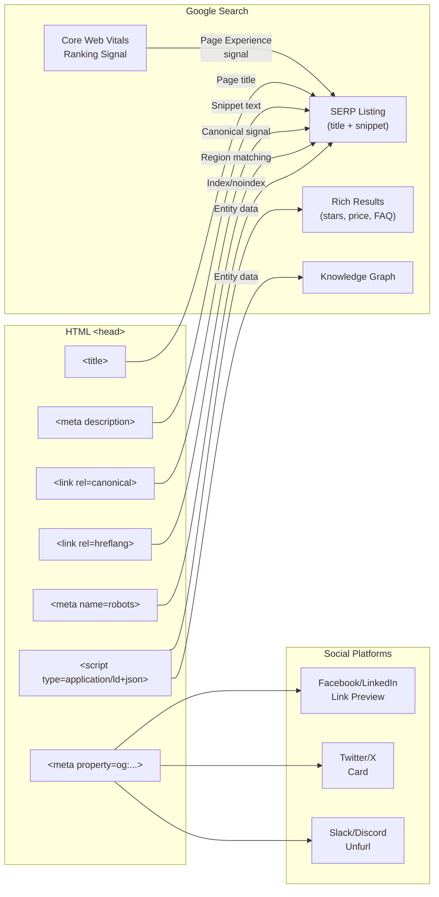

# Structured Data and HTML SEO

🎯 **Interview Weight:** essential (★★★) - HTML SEO is cross-cutting
knowledge; structured data (schema.org + JSON-LD) appears in
senior interviews; every staff engineer must understand how HTML
drives discoverability

---

### 🎯 Model Answer

**30 seconds:**

> HTML SEO starts with the basics: unique `<title>`, meaningful `<meta name="description">`,
> canonical URLs (`<link rel="canonical">`), and correct heading hierarchy.
> Structured data adds machine-readable context via JSON-LD `<script type="application/ld+json">`
> using schema.org vocabulary. Structured data enables Rich Results
> in Google Search (star ratings, prices, breadcrumbs, FAQs).
> Technical SEO also covers crawlability (`robots.txt`, `noindex`),
> open graph meta tags for social sharing, and performance (Core Web Vitals).

**3 minutes (Senior):**

> HTML-level SEO has two audiences: crawlers (Google, Bing, social
> bots) and human users in SERPs. The HTML `<head>` is the
> primary interface to both.
>
> Essential head tags:
> - `<title>`: shown in browser tab AND SERP result title (50-60 chars max)
> - `<meta name="description">`: SERP snippet (150-160 chars; Google may override)
> - `<link rel="canonical">`: tells crawlers which URL is the authoritative
>   version (solves duplicate content: www vs non-www, HTTP vs HTTPS,
>   paginated URLs)
> - `<meta name="robots" content="noindex,nofollow">`: prevent indexing
>
> Structured Data (JSON-LD) extends this by providing explicit
> semantic context. Instead of the crawler guessing that stars next to
> a product name are a rating, you declare it:
> ```json
> {"@type": "Product", "aggregateRating": {"ratingValue": "4.5"}}
> ```
> Google can then show a star rating in the SERP result (Rich Result).
>
> Performance is now an SEO signal: Core Web Vitals (LCP, CLS, INP)
> directly affect ranking via the Page Experience signal. Poor
> performance = ranking penalty. This is the intersection of CRP
> optimization and SEO.

*Adapting up:* Discuss server-side rendering for SEO (crawler JS execution),
structured data testing via Google's Rich Results Test, breadcrumb
schema, SiteLinksSearchBox, and multi-region hreflang.

*Adapting down:* SEO is making your HTML understandable to search
engines. Title tags say what the page is. Structured data adds
extra details like ratings and prices that Google shows in search results.

**Blank Mind Recovery:**

**(1) Restate:** "SEO in HTML: title, description, canonical URL.
Structured data = JSON-LD with schema.org vocabulary for Rich Results."

**(2) First principles:** "Search engines crawl HTML. They understand
what your page is about from the markup. Clearer markup = better indexing
= better ranking."

**(3) Bridge:** "Think of structured data as adding labels to your HTML:
'This text is a price', 'This is a rating', 'This is a FAQ'. Labels
that search engines can display directly in results."

---

### 📘 Concept Explanation

**What it is:**

HTML SEO is the practice of optimizing HTML structure and metadata
so that search engines can accurately index, understand, and represent
your content in search results. Structured data is a formal vocabulary
(schema.org) expressed in JSON-LD that provides machine-readable
semantics beyond what HTML tags convey.

**The problem it solves:**

Search engines parse HTML to determine page content, relevance, and
trustworthiness. Without optimization: the crawler might index the
wrong page as canonical, miss the page's topic from a weak title,
or not know a number is a price vs a quantity. Structured data
explicitly declares entity types and their attributes, enabling
Rich Results that increase click-through rates.

**How it works:**

```
ESSENTIAL HEAD TAGS FOR SEO:
  <head>
    <!-- TITLE: most important on-page SEO signal -->
    <!-- Format: Primary Keyword - Brand Name -->
    <!-- Length: 50-60 chars (Google truncates at ~580px) -->
    <title>Buy Running Shoes - Free Shipping - BrandName</title>

    <!-- META DESCRIPTION: affects CTR (not ranking directly) -->
    <!-- Length: 150-160 chars -->
    <meta name="description"
          content="Shop 500+ running shoes with free shipping.
          Waterproof and trail options. Best prices guaranteed.">

    <!-- CANONICAL: THE authoritative URL for this content -->
    <!-- Prevents duplicate content penalties -->
    <link rel="canonical"
          href="https://www.yoursite.com/running-shoes/">
    <!-- SOLVES: www vs non-www, http vs https, paginated,
         ?sort= query params, /index.html vs / -->

    <!-- ROBOTS: control crawler behavior -->
    <!-- default: "index, follow" (no need to specify) -->
    <meta name="robots" content="noindex, nofollow">
    <!-- noindex: don't add to index (staging, thank-you pages) -->
    <!-- nofollow: don't follow links on this page -->
    <!-- noarchive: don't cache this page -->

    <!-- OPEN GRAPH: social sharing (Facebook, LinkedIn, Slack) -->
    <meta property="og:type" content="product">
    <meta property="og:title" content="Running Shoes - BrandName">
    <meta property="og:description"
          content="Free shipping on all orders.">
    <meta property="og:image"
          content="https://cdn.yoursite.com/og-running-shoes.jpg">
    <!-- og:image: min 1200x630px, under 1MB -->
    <meta property="og:url"
          content="https://www.yoursite.com/running-shoes/">

    <!-- TWITTER CARD: twitter/X sharing -->
    <meta name="twitter:card" content="summary_large_image">
    <meta name="twitter:title" content="Running Shoes - BrandName">
    <meta name="twitter:image"
          content="https://cdn.yoursite.com/twitter-shoes.jpg">

    <!-- HREFLANG: multi-language/region alternate versions -->
    <link rel="alternate" hreflang="en-us"
          href="https://yoursite.com/en-us/running-shoes/">
    <link rel="alternate" hreflang="en-gb"
          href="https://yoursite.com/en-gb/running-shoes/">
    <link rel="alternate" hreflang="de"
          href="https://yoursite.com/de/laufschuhe/">
    <link rel="alternate" hreflang="x-default"
          href="https://yoursite.com/running-shoes/">
    <!-- x-default: fallback for unmatched locales -->
  </head>

STRUCTURED DATA (JSON-LD):
  <!-- Placed in <head> or at end of <body> -->
  <!-- <script type="application/ld+json"> is not executed
       by the browser as JS - it's parsed as JSON by crawlers -->
  <script type="application/ld+json">
  {
    "@context": "https://schema.org",
    "@type": "Product",
    "name": "Trail Runner Pro X3",
    "description": "Waterproof trail running shoes for all terrain.",
    "image": "https://cdn.yoursite.com/trail-runner-pro.jpg",
    "brand": {
      "@type": "Brand",
      "name": "BrandName"
    },
    "offers": {
      "@type": "Offer",
      "url": "https://yoursite.com/trail-runner-pro/",
      "priceCurrency": "USD",
      "price": "149.99",
      "priceValidUntil": "2025-12-31",
      "availability": "https://schema.org/InStock",
      "itemCondition": "https://schema.org/NewCondition"
    },
    "aggregateRating": {
      "@type": "AggregateRating",
      "ratingValue": "4.7",
      "reviewCount": "342"
    },
    "review": [
      {
        "@type": "Review",
        "reviewRating": {
          "@type": "Rating",
          "ratingValue": "5"
        },
        "name": "Best trail shoe I've owned",
        "author": {
          "@type": "Person",
          "name": "Jane D."
        }
      }
    ]
  }
  </script>

  <!-- Enables Rich Result:
       Search result shows stars (4.7 ★★★★☆), price ($149.99),
       availability (In Stock) directly under the title -->

COMMON SCHEMA.ORG TYPES FOR RICH RESULTS:
  Product             → prices, ratings, availability
  Article / BlogPost  → author, publishDate, headline
  BreadcrumbList      → breadcrumb trail in SERP
  FAQPage             → FAQ accordion in SERP
  HowTo               → step-by-step instructions with images
  LocalBusiness       → address, hours, phone, rating map pack
  Organization        → logo, social profiles, knowledge panel
  Person              → bio, social links
  Event               → date, location, tickets
  Recipe              → ingredients, cooking time, ratings
  SoftwareApplication → rating, price, OS compatibility
  VideoObject         → thumbnail, duration, upload date

BREADCRUMB SCHEMA:
  <script type="application/ld+json">
  {
    "@context": "https://schema.org",
    "@type": "BreadcrumbList",
    "itemListElement": [
      {
        "@type": "ListItem",
        "position": 1,
        "name": "Home",
        "item": "https://yoursite.com/"
      },
      {
        "@type": "ListItem",
        "position": 2,
        "name": "Running",
        "item": "https://yoursite.com/running/"
      },
      {
        "@type": "ListItem",
        "position": 3,
        "name": "Trail Runner Pro X3",
        "item": "https://yoursite.com/trail-runner-pro/"
      }
    ]
  }
  </script>
  <!-- SERP: yoursite.com > Running > Trail Runner Pro X3 -->

FAQ SCHEMA:
  <script type="application/ld+json">
  {
    "@context": "https://schema.org",
    "@type": "FAQPage",
    "mainEntity": [
      {
        "@type": "Question",
        "name": "What sizes are available?",
        "acceptedAnswer": {
          "@type": "Answer",
          "text": "Available in US sizes 6-14, including half sizes."
        }
      },
      {
        "@type": "Question",
        "name": "Are these waterproof?",
        "acceptedAnswer": {
          "@type": "Answer",
          "text": "Yes, Gore-Tex membrane rated IPX7 waterproof."
        }
      }
    ]
  }
  </script>
  <!-- SERP: expands FAQ accordion directly in search result -->
  <!-- Dramatically increases SERP real estate - higher CTR -->

TECHNICAL SEO HTML PATTERNS:
  <!-- Pagination: use rel=prev/next (deprecated by Google 2019) -->
  <!-- Modern: consolidate pages or use canonical to main page -->
  <!-- For infinite scroll: ensure static URL pagination exists -->

  <!-- Image SEO: -->
  
  <!-- alt: describe the image content for crawlers + screen readers -->
  <!-- Filename: descriptive (trail-runner-pro-x3.jpg vs IMG_1234.jpg) -->

  <!-- Heading hierarchy: ONE h1, logical h2/h3 structure -->
  <h1>Trail Runner Pro X3</h1>        <!-- ONE per page -->
  <h2>Features</h2>
  <h3>Waterproofing</h3>
  <h3>Cushioning Technology</h3>
  <h2>Customer Reviews</h2>

  <!-- Internal links: descriptive anchor text -->
  <!-- BAD: -->
  <a href="/trail-runner">Click here</a>
  <!-- GOOD: -->
  <a href="/trail-runner">Trail Runner Pro X3 specifications</a>
  <!-- Anchor text tells crawler what the linked page is about -->
```

**The key insight:**

JSON-LD structured data is preferred over Microdata and RDFa because
JSON-LD is entirely in a `<script>` tag - it doesn't require you to
annotate every HTML element with `itemprop` attributes. This means
your structured data can be managed independently of your HTML layout.
A template can generate the JSON-LD block from your data model
without touching the display HTML.

**When to use it:**

Always: title, description, canonical URL. For products: Product
schema with offers and aggregateRating. For articles: Article or
BlogPost schema. For local businesses: LocalBusiness schema.
For pages with FAQs: FAQPage schema (high CTR impact).

**When NOT to use it:**

Don't add structured data for content that isn't actually on the
page (Google penalizes misrepresentation). Don't add FAQ schema
for FAQs that are hidden behind a click (they must be visible on
the page). Don't add rating structured data unless you have real
ratings from users (manufactured ratings = Google penalty).

**Alternatives:**

- Microdata: inline HTML annotations (deprecated in practice)
- RDFa: similar to Microdata (used by some CMS platforms)
- Open Graph meta tags: for social sharing (not Google Rich Results)

**First-principles derivation:**

Search engines are text processors that need to extract meaning from
HTML. HTML tags provide VISUAL structure (h1 = prominent heading)
but limited SEMANTIC structure. Schema.org provides a shared vocabulary
for semantic annotation - a machine-readable layer on top of HTML
that explicitly declares entity types and their relationships. The
result: search engines understand your page structure rather than
inferring it.

---

### 💻 Code Example

**Complete SEO-optimized product page head**

```html
<!-- BAD: minimal head with no SEO signals -->
<head>
  <title>Product</title>
  <!-- No description, no canonical, no OG tags, no structured data -->
  <!-- Crawler: doesn't know what this page is about -->
  <!-- Social share: default browser title, no image -->
</head>
```

```html
<!-- GOOD: SEO-optimized head -->
<!DOCTYPE html>
<html lang="en">
<head>
  <meta charset="UTF-8">
  <meta name="viewport"
        content="width=device-width, initial-scale=1">

  <!-- PRIMARY SEO TAGS -->
  <title>Trail Runner Pro X3 - Waterproof | BrandName</title>
  <!-- 55 chars: has keyword + brand, under limit -->

  <meta name="description"
        content="Buy Trail Runner Pro X3 waterproof shoes.
        Gore-Tex, 4.7★ rating, free shipping over $50.
        Available sizes 6-14.">
  <!-- 148 chars: includes KW, rating, shipping, size -->

  <!-- CANONICAL URL -->
  <link rel="canonical"
        href="https://www.brandname.com/trail-runner-pro-x3/">

  <!-- OPEN GRAPH (social + Google) -->
  <meta property="og:type" content="product">
  <meta property="og:title"
        content="Trail Runner Pro X3 - Waterproof Running Shoe">
  <meta property="og:description"
        content="Gore-Tex waterproof, 4.7 star rating,
        free shipping over $50.">
  <meta property="og:image"
        content="https://cdn.brandname.com/og-trail-runner-1200x630.jpg">
  <meta property="og:image:width" content="1200">
  <meta property="og:image:height" content="630">
  <meta property="og:url"
        content="https://www.brandname.com/trail-runner-pro-x3/">
  <meta property="og:site_name" content="BrandName">

  <!-- TWITTER CARD -->
  <meta name="twitter:card" content="summary_large_image">
  <meta name="twitter:site" content="@brandname">
  <meta name="twitter:title"
        content="Trail Runner Pro X3 - Waterproof Running Shoe">
  <meta name="twitter:image"
        content="https://cdn.brandname.com/twitter-trail-runner.jpg">

  <!-- STRUCTURED DATA (JSON-LD) -->
  <script type="application/ld+json">
  {
    "@context": "https://schema.org",
    "@type": "Product",
    "name": "Trail Runner Pro X3",
    "description":
      "Waterproof trail running shoes with Gore-Tex membrane.",
    "image": [
      "https://cdn.brandname.com/trail-runner-800x800.jpg",
      "https://cdn.brandname.com/trail-runner-side.jpg"
    ],
    "sku": "TRPX3-001",
    "brand": {
      "@type": "Brand",
      "name": "BrandName"
    },
    "offers": {
      "@type": "Offer",
      "url": "https://www.brandname.com/trail-runner-pro-x3/",
      "priceCurrency": "USD",
      "price": "149.99",
      "priceValidUntil": "2025-12-31",
      "availability": "https://schema.org/InStock",
      "itemCondition": "https://schema.org/NewCondition",
      "shippingDetails": {
        "@type": "OfferShippingDetails",
        "shippingRate": {
          "@type": "MonetaryAmount",
          "value": "0",
          "currency": "USD"
        },
        "shippingDestination": {
          "@type": "DefinedRegion",
          "addressCountry": "US"
        },
        "deliveryTime": {
          "@type": "ShippingDeliveryTime",
          "handlingTime": {
            "@type": "QuantitativeValue",
            "minValue": 0,
            "maxValue": 1,
            "unitCode": "DAY"
          },
          "transitTime": {
            "@type": "QuantitativeValue",
            "minValue": 2,
            "maxValue": 5,
            "unitCode": "DAY"
          }
        }
      }
    },
    "aggregateRating": {
      "@type": "AggregateRating",
      "ratingValue": "4.7",
      "reviewCount": "342",
      "bestRating": "5",
      "worstRating": "1"
    }
  }
  </script>

  <!-- BREADCRUMB STRUCTURED DATA -->
  <script type="application/ld+json">
  {
    "@context": "https://schema.org",
    "@type": "BreadcrumbList",
    "itemListElement": [
      {
        "@type": "ListItem",
        "position": 1,
        "name": "Home",
        "item": "https://www.brandname.com/"
      },
      {
        "@type": "ListItem",
        "position": 2,
        "name": "Running Shoes",
        "item": "https://www.brandname.com/running-shoes/"
      },
      {
        "@type": "ListItem",
        "position": 3,
        "name": "Trail Runner Pro X3"
      }
    ]
  }
  </script>
</head>
```

> **Code walkthrough:** The head contains four layers of SEO metadata.
> The title and description are the human-facing signals that control
> what users see in the SERP. The canonical URL prevents duplicate
> content penalties from URL variations. Open Graph and Twitter Card
> tags control how the page renders when shared on social platforms -
> without these, social previews show a generic thumbnail and the raw
> title. The JSON-LD structured data provides machine-readable semantics:
> Google can extract the price ($149.99), availability (InStock), rating
> (4.7/5), and shipping details to display as Rich Results, potentially
> increasing click-through rate by 20-30%.

---

### ⚖️ Comparison Table

| Method | Syntax | Maintainability | Google Support |
|---|---|---|---|
| JSON-LD | `<script type="application/ld+json">` | High (separate from HTML) | Preferred |
| Microdata | `itemprop`, `itemscope`, `itemtype` attrs | Low (annotates every element) | Supported |
| RDFa | `typeof`, `property`, `resource` attrs | Low (verbose) | Supported |
| Open Graph | `<meta property="og:...">` | Medium | Social + Google Knowledge Graph |

| Rich Result Type | Schema.org Type | SERP Impact |
|---|---|---|
| Star Ratings | Product, Recipe | High CTR boost |
| Price + Availability | Product, Offer | High CTR boost |
| FAQ Accordion | FAQPage | More SERP real estate |
| Breadcrumbs | BreadcrumbList | Navigation signal |
| Article Byline | Article | Trust signal |
| Event Tickets | Event | Direct action |

---

### 🎓 Answers by Seniority

**Junior / Mid:**

> HTML SEO needs: unique title (50-60 chars), meta description
> (150-160 chars), canonical URL, one h1 per page, descriptive
> alt text on images, semantic HTML (articles, nav, header). Open
> Graph meta tags control social sharing previews. Structured data
> in JSON-LD adds Rich Results (star ratings, prices) to search results.

---

**Senior / Staff:**

> SEO strategy layered by impact:
>
> Technical (foundation): canonical URLs, robots.txt, XML sitemap,
> HTTPS, mobile-friendly viewport, Core Web Vitals (LCP < 2.5s
> since it's a ranking signal). Without technical SEO, nothing
> else matters.
>
> Content signals: unique title/description per page (not templated
> duplicates), heading hierarchy, internal link anchor text.
>
> Structured data: Product + BreadcrumbList + FAQPage for e-commerce.
> Article + Organization for content sites. Measure rich result
> impressions in Google Search Console.
>
> JavaScript SEO: SSR or prerendering for JS-heavy apps. Googlebot
> executes JS but with a 2-wave crawl delay (first pass HTML-only,
> second pass with JS days later). Critical content in initial HTML.

---

### ⚠️ Common Misconceptions

**"Meta keywords still matter for Google ranking"**

Google explicitly ignores `<meta name="keywords">` (confirmed since 2009).
It was abandoned due to keyword stuffing abuse. Bing still gives it
minor weight. The `<meta name="description">` affects CTR (which
indirectly affects ranking) but is not a direct ranking signal either.
Ranking signals are title relevance, page content, backlinks, Core
Web Vitals, and user engagement.

**"Structured data improves SEO ranking directly"**

Structured data enables Rich Results (visual enhancements in SERP)
which improve CTR. Higher CTR can improve ranking as a user signal.
But the structured data itself is not a direct ranking factor.
Google uses structured data to understand the page and potentially
display it differently, not to boost its position for any given query.

---

### 🚨 Failure Modes and Diagnosis

**Symptom: structured data not generating Rich Results**

```
Root cause A: structured data validation errors
  Test: Google Rich Results Test
  URL: https://search.google.com/test/rich-results
  Shows: errors (missing required fields), warnings

Root cause B: content mismatch
  Google policy: structured data must match visible page content
  Example: JSON-LD shows rating 4.9 but no ratings on page
  Google will ignore or penalize misleading markup

Root cause C: JavaScript rendering delay (SPA)
  JSON-LD in JS-generated content not found by first-pass crawl
  Fix: include JSON-LD in server-rendered HTML (SSR)
  Verify: Google Search Console → URL Inspection → "View Crawled Page"
  Check if JSON-LD appears in "HTML" tab (not just rendered)

Root cause D: incorrect @type or missing required fields
  Product requires: name, offers.price, offers.priceCurrency,
    offers.availability
  AggregateRating requires: ratingValue, reviewCount OR ratingCount
  Missing any required field: Rich Result not shown

Diagnosis pipeline:
  1. Rich Results Test → check for errors
  2. Search Console → Enhancements → check "Products" report
  3. Search Console → URL Inspection → inspect individual URL
  4. Wait: new structured data takes 1-2 weeks to appear in SERPs
```

---

### 🎯 Interview Deep-Dive

| Scenario | Recommended Time | Key Signal |
|---|---|---|
| Essential head tags for SEO | 3 min | Title, description, canonical |
| What is a canonical URL | 2-3 min | Duplicate content |
| JSON-LD vs Microdata | 2-3 min | Implementation choice |
| Product schema required fields | 2-3 min | Structured data |
| Rich Results types | 3 min | FAQ, breadcrumb, product |
| Open Graph vs Twitter Card | 2 min | Social sharing |
| Core Web Vitals as SEO signal | 3-4 min | Performance + SEO |
| hreflang implementation | 3-4 min | International SEO |
| JavaScript SEO (crawl behavior) | 4-5 min | SPA rendering |
| robots noindex vs robots.txt | 2-3 min | Crawl control |
| structured data testing tools | 2 min | Validation |
| canonical URL edge cases | 3 min | www, https, params |
| Image SEO (alt text + filename) | 2 min | Visual search |
| Google Search Console signals | 3-4 min | Monitoring |
| FAQ schema impact on CTR | 2-3 min | SERP real estate |
| Meta description CTR strategy | 2-3 min | CTR optimization |
| Title tag optimization strategy | 3 min | Keyword + brand |
| Site architecture for SEO | 4-5 min | Internal linking |
| Schema.org for e-commerce at scale | 4-5 min | Template generation |

---

**Q1: What is a canonical URL and when do you need it?** `[JUNIOR]`
DEFINITION

*Why they ask:* Fundamental SEO concept with HTML implementation.

*Likely follow-up:* "What are common duplicate content scenarios?"

> **Answer:**
>
> A canonical URL is the definitive, authoritative URL for a piece
> of content. You declare it with:
> ```html
> <link rel="canonical" href="https://www.yoursite.com/product/trail-runner/">
> ```
>
> Why it's needed: the same content is often accessible via multiple URLs:
>
> ```
> Duplicate URL scenarios:
>   http://yoursite.com/product/trail-runner/
>   https://yoursite.com/product/trail-runner/   ← different (protocol)
>   https://www.yoursite.com/product/trail-runner/ ← different (subdomain)
>   https://yoursite.com/product/trail-runner    ← different (trailing slash)
>   https://yoursite.com/product/trail-runner/?sort=price ← different (param)
>   https://yoursite.com/product/trail-runner/?session=abc123
>   https://yoursite.com/print/product/trail-runner/ (print version)
> ```
>
> Without canonical: Google sees these as different pages with
> duplicate content. PageRank is split across all variants.
> The "wrong" variant might rank.
>
> With canonical: you tell Google which URL gets all the credit:
> ```html
> <!-- On EVERY variant of the page, point to the canonical: -->
> <!-- On http://yoursite.com/...: -->
> <link rel="canonical" href="https://www.yoursite.com/product/trail-runner/">
> <!-- On https://yoursite.com/...?sort=price: -->
> <link rel="canonical" href="https://www.yoursite.com/product/trail-runner/">
> ```
>
> The canonical URL should:
> - Use HTTPS
> - Include or exclude www consistently (match preferred version)
> - Include or exclude trailing slash consistently
> - Not include tracking parameters
>
> Self-referencing canonical: even the canonical page itself should
> have a canonical tag pointing to itself. This prevents issues
> if someone links to your page with UTM parameters.
>
> ```html
> <!-- On https://www.yoursite.com/product/trail-runner/ -->
> <!-- (the canonical page itself): -->
> <link rel="canonical"
>       href="https://www.yoursite.com/product/trail-runner/">
> <!-- Self-referencing: standard practice -->
> ```
>
> *What separates good from great:* The canonical tag is a HINT
> to Google, not a directive. Google may choose to honor or ignore it.
> If the canonical page and the duplicate have very different content
> or if the canonical is not accessible (redirects, noindex), Google
> may choose a different canonical. The `X-Canonical-Url` HTTP header
> does the same thing as the meta tag but for non-HTML resources.
> For absolute authority: use 301 redirects + canonical tags together.

---

**Q2: How does JavaScript affect SEO and what is the two-wave crawl?**
`[SENIOR]` MECHANISM

*Why they ask:* Critical for SPA/React/Vue applications.

*Likely follow-up:* "How do you test what Googlebot sees on your page?"

> **Answer:**
>
> Googlebot crawls web pages in two passes due to JavaScript:
>
> **Wave 1 (immediate):** Googlebot downloads the HTML and indexes
> the content that is in the initial HTML response - before any
> JavaScript runs.
>
> **Wave 2 (delayed):** Days to weeks later, Googlebot executes
> the JavaScript and indexes the rendered content.
>
> Impact on SPAs:
> ```
> Single Page App (React, Vue, Angular):
>   HTML response: <div id="app"></div>
>   Actual content: rendered by JavaScript
>
> Wave 1 crawl:
>   Googlebot sees: empty <div id="app"></div>
>   Indexed content: nothing meaningful
>   Possible time until wave 2: days
>
> Wave 2 crawl:
>   Googlebot executes JS
>   Indexed content: full rendered page
>   But: days late, crawl budget consumed
> ```
>
> Problems with relying on Wave 2:
> 1. Indexing delay: new content might not appear for days
> 2. Crawl budget: Google allocates limited crawl budget per site.
>    JS rendering is expensive - fewer pages crawled per day
> 3. Errors: JS errors, dynamic content from APIs, session-dependent
>    content may fail in Googlebot's rendering environment
> 4. Social bots: Facebook, Twitter, LinkedIn bots do NOT execute JS.
>    They see Wave 1 only. No OG data = generic social preview.
>
> Solutions:
>
> **SSR (Server-Side Rendering):**
> HTML response contains full rendered content.
> Both Wave 1 and Wave 2 see the same content.
> Critical content in initial HTML.
>
> **Static Site Generation (SSG):**
> Pre-build all HTML pages.
> Same result as SSR for crawlers.
> Best for content that doesn't change per user.
>
> **Prerendering:**
> Detect bot user-agents (Googlebot, facebookexternalhit, Twitterbot)
> → Serve pre-rendered HTML.
> Tools: prerender.io, rendertron.
>
> **Testing what Googlebot sees:**
> Google Search Console → URL Inspection → Inspect URL
> → "View Crawled Page" → "HTML" tab: what Wave 1 saw
> → "Screenshot" tab: what Wave 2 rendering produced
>
> Or: `curl -A "Googlebot" https://yoursite.com/page`
> (Note: Googlebot has a more complex behavior than just user-agent)
>
> *What separates good from great:* The "Crawl Budget" concept
> is often overlooked. Large sites (100,000+ pages) must prioritize
> which pages Googlebot crawls. JavaScript rendering consumes
> significantly more crawl budget per page than plain HTML. For
> e-commerce sites with thousands of product pages: SSG for product
> templates, SSR for personalized content, and client-side rendering
> ONLY for above-the-fold components that don't need to be indexed.
> The robots.txt can also be used to block crawling of low-value
> JavaScript-heavy pages that aren't ranking targets.

---

**Q3: What structured data schema type should you use for a product page?
What fields are required?** `[SENIOR]` SCENARIO

*Why they ask:* Practical implementation knowledge.

*Likely follow-up:* "What is the difference between InStock and LimitedAvailability?"

> **Answer:**
>
> For a product page, use `Product` schema from schema.org.
>
> Google's REQUIRED fields for Product Rich Results:
> - `name`: product name
> - `offers`: at least one Offer with:
>   - `price`: numeric price (no currency symbol)
>   - `priceCurrency`: ISO 4217 code (USD, EUR, GBP)
>   - `availability`: one of the schema.org enumeration URLs
>
> Required for star ratings (AggregateRating):
> - `aggregateRating.ratingValue`: number between 1 and `bestRating`
> - `aggregateRating.reviewCount` OR `aggregateRating.ratingCount`
>
> ```json
> {
>   "@context": "https://schema.org",
>   "@type": "Product",
>   "name": "Trail Runner Pro X3",
>   "offers": {
>     "@type": "Offer",
>     "price": "149.99",
>     "priceCurrency": "USD",
>     "availability": "https://schema.org/InStock"
>   },
>   "aggregateRating": {
>     "@type": "AggregateRating",
>     "ratingValue": "4.7",
>     "reviewCount": "342"
>   }
> }
> ```
>
> Availability values:
> - `InStock`: available to order
> - `OutOfStock`: not currently available
> - `LimitedAvailability`: low stock
> - `PreOrder`: available for pre-order
> - `BackOrder`: available on back-order
> - `Discontinued`: no longer available
>
> Recommended additional fields for better results:
> - `image`: URL or array of URLs (Google uses for image pack)
> - `description`: product description
> - `sku`: stock keeping unit
> - `brand`: Brand object with name
> - `offers.shippingDetails`: for "Get it by..." shipping info
> - `review`: array of Review objects
>
> Google Merchant Center integration:
> Product structured data feeds directly into Google Shopping
> (organic product listings). The structured data must EXACTLY
> match the product data in Google Merchant Center, or Google
> may show warnings in Search Console.
>
> Testing:
> ```
> Google Rich Results Test: https://search.google.com/test/rich-results
> Schema.org validator: https://validator.schema.org
> Google Search Console → Enhancements → Shopping (Products)
> ```
>
> *What separates good from great:* The `offers.shippingDetails`
> property (added to schema in 2020) allows Google to show "Free
> shipping" or "Get it by Thursday" directly in the SERP result.
> This significantly increases CTR for e-commerce. It requires
> specifying `shippingRate` (0 for free shipping) and `deliveryTime`
> (handlingTime + transitTime). Sites that implement this correctly
> and consistently see measurable CTR improvements vs competitors
> without shipping details in their Rich Results.

---

**Q4: What is the difference between `noindex` meta tag and `robots.txt`?**
`[JUNIOR]` COMPARISON

*Why they ask:* Crawl control fundamentals.

*Likely follow-up:* "If you block a page in robots.txt, can it still appear in search results?"

> **Answer:**
>
> Both control how search engine crawlers interact with your pages,
> but at different stages:
>
> **`robots.txt` (crawl control):**
> - Located at: `https://yoursite.com/robots.txt`
> - Controls: whether the crawler VISITS the URL
> - Syntax: `Disallow: /admin/` (bots don't fetch this path)
> - Processed BEFORE fetching: crawler reads robots.txt first
>
> ```
> User-agent: *
> Disallow: /admin/
> Disallow: /api/
> Disallow: /search?
> Allow: /
>
> Sitemap: https://yoursite.com/sitemap.xml
> ```
>
> **`noindex` meta tag (index control):**
> - Located at: in the `<head>` of the HTML page
> - Controls: whether the crawler INDEXES the URL (adds to results)
> - Syntax: `<meta name="robots" content="noindex">`
> - Processed AFTER fetching: crawler must visit to see the tag
>
> ```html
> <!-- Page is crawled, but NOT indexed: -->
> <meta name="robots" content="noindex">
>
> <!-- Not crawled (robots.txt), not indexed (meta): -->
> <!-- robots.txt: Disallow: /thank-you/ -->
> <!-- BUT: noindex ALSO on the page (belt and suspenders) -->
> ```
>
> Critical difference - the trap:
> If you block a page in `robots.txt` (crawler can't visit),
> the crawler CANNOT see the `noindex` tag. But the page can
> STILL appear in search results if other pages link to it.
> Google will show the URL in results with "No information
> available about this page" snippet.
>
> To guarantee a page doesn't appear in search:
> - Use `noindex` meta tag (not robots.txt)
> - Don't block it in robots.txt (crawler must fetch to see noindex)
> - The crawler fetches, sees noindex, drops from index
>
> ```
> Strategy by page type:
>   /admin/: robots.txt Disallow (don't waste crawl budget)
>   /thank-you/: noindex meta (prevent indexing, allow crawl)
>   /search?q=: noindex + robots.txt Disallow (both for safety)
>   /sitemap.xml: robots.txt Allow (ensure crawlers find it)
> ```
>
> `robots` meta tag options:
> ```html
> <meta name="robots" content="index, follow">   <!-- default -->
> <meta name="robots" content="noindex, follow">
> <meta name="robots" content="index, nofollow">
> <meta name="robots" content="noindex, nofollow">
> <!-- Per-bot: -->
> <meta name="googlebot" content="noindex">
> <meta name="bingbot" content="noindex">
> ```
>
> *What separates good from great:* The `X-Robots-Tag` HTTP response
> header does the same as the meta tag but for ANY resource type
> (PDFs, images, JSON). A PDF with `X-Robots-Tag: noindex` won't
> be indexed. This is not possible with an HTML meta tag (PDFs have
> no head). For file-heavy sites (legal documents, price lists as PDFs),
> X-Robots-Tag is essential for crawl control.

---

**Q5: How does `hreflang` work for international SEO?** `[SENIOR]`
MECHANISM

*Why they ask:* International sites are common; hreflang is complex.

*Likely follow-up:* "What is x-default used for?"

> **Answer:**
>
> `hreflang` tells Google which language and region variant of a
> page to show to users in different locations and languages.
>
> Without hreflang: Google might show the English page to a German
> user, or the US page to a UK user, because it can't determine
> which version is correct for which audience.
>
> Implementation:
> ```html
> <!-- On the EN-US page: -->
> <link rel="alternate" hreflang="en-us"
>       href="https://yoursite.com/en-us/product/">
> <link rel="alternate" hreflang="en-gb"
>       href="https://yoursite.com/en-gb/product/">
> <link rel="alternate" hreflang="de"
>       href="https://yoursite.com/de/produkt/">
> <link rel="alternate" hreflang="fr"
>       href="https://yoursite.com/fr/produit/">
> <link rel="alternate" hreflang="x-default"
>       href="https://yoursite.com/product/">
>
> <!-- CRITICAL: the SAME tags must appear on EVERY alternate page -->
> <!-- The German page /de/produkt/ MUST also list ALL alternates -->
> ```
>
> `hreflang` attribute values:
> - Language only: `hreflang="en"` (any English-speaking user)
> - Language + Region: `hreflang="en-US"` (US-specific English)
> - Region-specific: ISO 3166-1 country codes
>
> `x-default`: shown to users whose language/country doesn't
> match any specific variant. Points to the "default" or "catch-all"
> page.
>
> Rules (must follow all):
> 1. **Bidirectional**: if page A lists page B as an alternate, page B
>    must also list page A as an alternate. Google ignores non-bidirectional.
> 2. **Self-referencing**: each page must include itself in the list
>    (the DE page must have `hreflang="de"` pointing to itself)
> 3. **Canonical agreement**: hreflang page must not be canonicalized
>    away (canonical must match the hreflang URL)
> 4. **Complete**: all alternates listed on all pages
>
> Alternative implementation via XML Sitemap (preferred for large sites):
> ```xml
> <url>
>   <loc>https://yoursite.com/en-us/product/</loc>
>   <xhtml:link rel="alternate" hreflang="en-us"
>               href="https://yoursite.com/en-us/product/"/>
>   <xhtml:link rel="alternate" hreflang="de"
>               href="https://yoursite.com/de/produkt/"/>
>   <xhtml:link rel="alternate" hreflang="x-default"
>               href="https://yoursite.com/product/"/>
> </url>
> ```
>
> Sitemap approach is easier to maintain at scale (no HTML edits
> needed per page when adding a new language).
>
> *What separates good from great:* The most common hreflang mistake
> is missing bidirectional links. If the German page doesn't link
> back to the English page in its hreflang annotations, Google
> treats the English annotations as unverified and may ignore them.
> At scale (thousands of product pages in 10 languages = 100,000 page variants),
> the sitemap approach with automated generation from your database is
> the only maintainable option. Errors in hreflang can result in the
> wrong language page ranking for the wrong country's search results,
> which directly hurts conversion rates.

---

**Q6: What is the relationship between Core Web Vitals and SEO ranking?**
`[SENIOR]` MECHANISM

*Why they ask:* Performance as a direct business/SEO KPI.

*Likely follow-up:* "What are the CWV thresholds for 'Good' status?"

> **Answer:**
>
> Google's Page Experience update (2021) made Core Web Vitals a
> ranking signal. Pages with poor CWV receive a ranking penalty;
> pages with good CWV receive a ranking boost.
>
> Core Web Vitals metrics and thresholds:
>
> | Metric | Good | Needs Improvement | Poor |
> |---|---|---|---|
> | LCP (Largest Contentful Paint) | ≤ 2.5s | 2.5s - 4.0s | > 4.0s |
> | INP (Interaction to Next Paint) | ≤ 200ms | 200ms - 500ms | > 500ms |
> | CLS (Cumulative Layout Shift) | ≤ 0.1 | 0.1 - 0.25 | > 0.25 |
>
> Note: FID (First Input Delay) was replaced by INP as of March 2024.
>
> How Google measures CWV for ranking:
> - Uses FIELD DATA from Chrome User Experience Report (CrUX)
> - Requires 75th percentile to be "Good" for all three metrics
> - Measured per page and per origin (domain-wide average)
> - Applies to MOBILE performance (desktop separately)
>
> ```
> Ranking signal weight: CWV is a "tiebreaker"
> Google says: content relevance >> CWV
>   A highly relevant page with poor CWV > irrelevant page with good CWV
>   But: equal relevance → page with good CWV wins
>
> In competitive niches (e-commerce, news, lead gen):
>   Many pages of equal relevance → CWV is a meaningful differentiator
> ```
>
> How CWV maps to HTML/CRP:
> - LCP: LCP element (usually hero image) load speed
>   → Fix: `<link rel="preload">` + `fetchpriority="high"` + WebP
> - INP: main thread blocking time (JavaScript)
>   → Fix: defer scripts, code split, avoid long tasks
> - CLS: layout shifts from late-loading images, fonts, embeds
>   → Fix: `width`/`height` on images, `font-display: swap`,
>          `contain-intrinsic-size` on iframes
>
> Monitoring:
> ```javascript
> import { getLCP, getINP, getCLS } from 'web-vitals';
>
> getLCP(metric => {
>   if (metric.value > 2500) {
>     // Report to analytics: LCP threshold exceeded
>     sendAnalytics({ metric: 'LCP', value: metric.value });
>   }
> });
> ```
>
> Google Search Console → Core Web Vitals report:
> Shows which URLs are "Poor", "Needs Improvement", or "Good".
> URLs in "Poor" status have active ranking penalties.
>
> *What separates good from great:* The CWV ranking signal is applied
> using the P75 FIELD data, not lab data (Lighthouse). A page that
> scores 100 in Lighthouse but has P75 field LCP of 3.5s due to
> users on slow mobile connections is still in the "Needs Improvement"
> tier. The SEO strategy: optimize for the P75 user (not the ideal
> user), monitor via CrUX data, and prioritize LCP (most impactful
> metric for most pages) before INP and CLS.

---

**Q7: How do you generate structured data for thousands of products
in a template-driven system?** `[SENIOR]` SCENARIO

*Why they ask:* Scale thinking and engineering approach.

*Likely follow-up:* "How do you validate at scale?"

> **Answer:**
>
> At scale (10,000+ products), structured data must be:
> 1. Generated from the product data model (not hand-coded)
> 2. Validated automatically
> 3. Monitored for errors
>
> **Template approach (Node.js/Next.js):**
>
> ```javascript
> // generateProductSchema.js
> function generateProductSchema(product) {
>   const schema = {
>     "@context": "https://schema.org",
>     "@type": "Product",
>     "name": product.name,
>     "description": product.description,
>     "sku": product.sku,
>     "image": product.images.map(img => img.url),
>     "brand": {
>       "@type": "Brand",
>       "name": product.brandName
>     },
>     "offers": {
>       "@type": "Offer",
>       "priceCurrency": product.currency,
>       "price": product.price.toFixed(2),
>       "priceValidUntil": getNextYear(),
>       "availability": product.inStock
>         ? "https://schema.org/InStock"
>         : "https://schema.org/OutOfStock",
>       "itemCondition": "https://schema.org/NewCondition",
>       "url": `https://yoursite.com/product/${product.slug}/`
>     }
>   };
>
>   // Only add aggregateRating if reviews exist:
>   if (product.reviewCount > 0) {
>     schema.aggregateRating = {
>       "@type": "AggregateRating",
>       "ratingValue": product.averageRating.toFixed(1),
>       "reviewCount": product.reviewCount,
>       "bestRating": "5",
>       "worstRating": "1"
>     };
>   }
>
>   return JSON.stringify(schema, null, 2);
> }
>
> // Usage in Next.js page component:
> export default function ProductPage({ product }) {
>   return (
>     <>
>       <Head>
>         <script
>           type="application/ld+json"
>           dangerouslySetInnerHTML={{
>             __html: generateProductSchema(product)
>           }}
>         />
>       </Head>
>       {/* rest of page */}
>     </>
>   );
> }
> ```
>
> **Validation at scale:**
>
> ```bash
> # CI: validate schema against Google's requirements
> npm install schema-dts  # TypeScript types for schema.org
>
> # Unit test the generator:
> test('generates valid product schema', () => {
>   const schema = generateProductSchema(mockProduct);
>   const parsed = JSON.parse(schema);
>   expect(parsed['@type']).toBe('Product');
>   expect(parsed.offers.price).toBeDefined();
>   expect(parsed.offers.availability).toMatch(/schema.org/);
> });
>
> # Batch validation via Google's API:
> # PageSpeed Insights API or Rich Results Test API
> # Run against 100 sample product pages
> ```
>
> **Monitoring:**
>
> Google Search Console → Enhancements → Shopping:
> Shows: valid items, items with warnings, items with errors
> Errors: click through to see which fields are wrong
> Track: error rate per week (alert if error rate > 1%)
>
> *What separates good from great:* The template function should
> include data validation before schema generation. If `product.price`
> is null (e.g., from a DB error), generating `"price": null`
> creates an invalid schema. Pre-validation:
> ```javascript
> if (!product.price || product.price <= 0) {
>   // Log error, skip schema generation:
>   reportError('Invalid price for structured data', { sku: product.sku });
>   return null;  // No schema rather than invalid schema
> }
> ```
> Invalid structured data in Google Search Console creates warnings
> that trigger manual review of the "Shopping" enhancement report.
> An invalid schema is worse than no schema.

---

**Q8: How does Open Graph metadata work and why do you need separate
tags from the SEO title/description?** `[JUNIOR]` MECHANISM

*Why they ask:* Social sharing is a common implementation need.

*Likely follow-up:* "What happens to your og:image aspect ratio?"

> **Answer:**
>
> When a URL is shared on social platforms (Facebook, LinkedIn, Slack,
> Discord, Twitter/X), their bots fetch the page and look for
> `<meta property="og:...">` tags to generate the link preview.
>
> Without OG tags: social platforms use their own algorithms to
> pick a title (usually `<title>`), description (sometimes `<meta name="description">`),
> and image (first significant image on the page). Results are often
> wrong or ugly.
>
> With OG tags: you control exactly what the preview shows:
> ```html
> <!-- TITLE: what appears in the share card -->
> <meta property="og:title"
>       content="Trail Runner Pro X3 - 50% Off Today Only">
> <!-- Can be different from <title>: optimize for clicks, not SEO -->
>
> <!-- DESCRIPTION: subtitle in the share card -->
> <meta property="og:description"
>       content="Waterproof, 4.7 stars, free shipping.
>       Limited offer ends midnight.">
>
> <!-- IMAGE: the most important element for clicks -->
> <meta property="og:image"
>       content="https://cdn.yoursite.com/og-trail-runner.jpg">
> <!-- Requirements:
>      - Minimum: 200x200px (displayed as small square)
>      - Recommended: 1200x630px (16:9 ratio, displayed large)
>      - Max file size: 8MB (Facebook), 5MB (Twitter)
>      - Use CDN URL (not relative path) -->
> <meta property="og:image:width" content="1200">
> <meta property="og:image:height" content="630">
> <meta property="og:image:alt"
>       content="Trail Runner Pro X3 in blue colorway">
>
> <!-- URL: canonical URL of the shared page -->
> <meta property="og:url"
>       content="https://www.yoursite.com/trail-runner-pro-x3/">
>
> <!-- TYPE: affects rendering in Facebook -->
> <meta property="og:type" content="product">
> <!-- For articles: "article", for site homepage: "website" -->
>
> <!-- SITE NAME: appears as subdomain in preview -->
> <meta property="og:site_name" content="BrandName">
> ```
>
> Why separate from SEO title/description:
>
> SEO title: "Trail Runner Pro X3 | Waterproof | BrandName"
> (Includes brand, informational, keyword-optimized)
>
> OG title: "Trail Runner Pro X3 - 50% Off Today Only"
> (Optimized for social engagement, time-sensitive offer)
>
> SEO description: "Buy trail running shoes with Gore-Tex waterproof..."
> (Informational, keyword-rich)
>
> OG description: "Waterproof, 4.7 stars, free 2-day shipping. 50% off ends midnight."
> (Urgency, social proof, benefit)
>
> Testing: `https://developers.facebook.com/tools/debug/`
> Paste your URL, see the preview card, clear Facebook's cache.
>
> *What separates good from great:* The `og:image` aspect ratio
> matters critically. Facebook/LinkedIn display 1200x630 (1.91:1)
> as full-width cards. Images that aren't this ratio get letterboxed
> or cropped. Generate dedicated OG images at exactly 1200x630 for
> each major page template. Tools: Puppeteer screenshots, Vercel OG,
> or server-side `canvas` with `node-canvas`. Automated OG image
> generation (with product name, price, image rendered on template)
> significantly improves social sharing engagement vs generic images.

---

**Q9: How do you implement Article schema for a blog?** `[JUNIOR]`
SCENARIO

*Why they ask:* Content site structured data.

*Likely follow-up:* "What is the difference between Article and BlogPost?"

> **Answer:**
>
> Article schema provides Google with explicit author, publication
> date, and headline - enabling rich results in Google News, Discover,
> and Top Stories.
>
> ```html
> <script type="application/ld+json">
> {
>   "@context": "https://schema.org",
>   "@type": "Article",
>   "headline":
>     "How to Choose the Right Trail Running Shoe",
>   "description":
>     "Guide to waterproofing, stack height, drop,
>     and terrain-specific features.",
>   "image": [
>     "https://cdn.yoursite.com/article-1200x675.jpg",
>     "https://cdn.yoursite.com/article-800x800.jpg"
>   ],
>   "author": {
>     "@type": "Person",
>     "name": "Sarah Chen",
>     "url": "https://yoursite.com/authors/sarah-chen/"
>   },
>   "publisher": {
>     "@type": "Organization",
>     "name": "BrandName",
>     "logo": {
>       "@type": "ImageObject",
>       "url": "https://yoursite.com/logo-600x60.png",
>       "width": 600,
>       "height": 60
>     }
>   },
>   "datePublished": "2025-01-15T10:00:00+00:00",
>   "dateModified": "2025-01-20T14:30:00+00:00"
> }
> </script>
> ```
>
> Required for Google Discover / Top Stories:
> - `headline`: 110 chars max
> - `image`: at least one image (min 1200px wide)
> - `datePublished`: ISO 8601 date
> - `author`: Person or Organization
>
> `Article` vs `BlogPost`:
> - `BlogPost` is a subtype of `Article`
> - Use `Article` for news articles, long-form journalism
> - Use `BlogPost` for blog posts, personal writing
> - Google treats them the same in practice
> - `NewsArticle` for news publishers (additional requirements)
>
> The `publisher.logo` must meet Google's logo requirements:
> - Max 600x60px
> - Rectangular (not square logo)
> - White/transparent background
>
> *What separates good from great:* The `dateModified` field is as
> important as `datePublished` for content freshness signals. Google
> factors recency into ranking for many query types. Updating
> `dateModified` to the ISO 8601 current datetime whenever content
> is meaningfully updated (not just fixing a typo) signals to Google
> that the content is fresh and re-crawlable. Also: multiple image
> aspect ratios (3 different ratios helps Google choose the best one
> for different placements in Discover, image packs, and web results).

---

| Interviewer Type | Emphasis |
|---|---|
| Technical Panel | JSON-LD structure + required fields |
| Hiring Manager | CTR impact + Rich Results strategy |
| Bar Raiser | JavaScript SEO + CWV + scale engineering |
| Peer Engineer | Canonical + hreflang + robots |

---

### 🏛️ System Design

**SEO infrastructure for a large e-commerce site:**

```
SCALE: 50,000 product pages, 10 categories,
       3 regions (US, UK, DE), 1,000 new products/month

HTML ARCHITECTURE:
  All product pages: SSR (Next.js)
  - Initial HTML contains full product data
  - Googlebot Wave 1 sees complete content
  - No JS execution required for indexing

  CRP optimization:
  - Inline critical CSS (<15KB)
  - Defer all JavaScript
  - Preload LCP image (hero product image)
  - Core Web Vitals target: LCP < 2.5s, CLS < 0.1, INP < 200ms

SEO METADATA GENERATION (automated):
  Template function per page type:
  - Product pages: Product + BreadcrumbList schema
  - Category pages: ItemList schema
  - Blog articles: Article schema
  - Homepage: Organization + WebSite + SitelinksSearchBox schema

  Per-page outputs:
  - <title>: {ProductName} - {Category} | {Brand}
  - <meta description>: {Offer details, rating, shipping}
  - <link rel="canonical">: normalized URL (https, www, trailing slash)
  - <link rel="alternate" hreflang>: en-us, en-gb, de variants
  - JSON-LD: Product + BreadcrumbList
  - Open Graph: product type, price, image 1200x630

INTERNATIONAL SEO:
  URL structure: /en-us/, /en-gb/, /de/
  hreflang via XML Sitemap (not HTML tags at this scale)
  Per-region: pricing, currency, shipping in schema
  Content translation + schema translation
  x-default: /en-us/ (primary market)

SITEMAP:
  Dynamic XML Sitemap generation:
  - Updated daily (or on product create/update)
  - Separate sitemaps per category (max 50,000 URLs per file)
  - Sitemap index at /sitemap.xml
  - Submitted to Google Search Console

CRAWL BUDGET MANAGEMENT:
  robots.txt:
    Disallow: /cart
    Disallow: /checkout
    Disallow: /account
    Disallow: /search (faceted search variants)
    Allow: /
  noindex meta: thank-you pages, pagination variants (?page=2+)
  Canonical: paginated pages → canonical to page 1 or no-canonical

MONITORING:
  Google Search Console:
    - Coverage: indexed vs errors vs excluded
    - Core Web Vitals: pages by status (Good/NI/Poor)
    - Rich Results: Products report (valid/warning/error)
    - Sitelinks: hreflang errors

  CrUX monitoring (field data):
    - P75 LCP, INP, CLS per page template
    - Alert if any metric degrades week-over-week

  Logging:
    - Bot traffic in analytics (Googlebot, facebookexternalhit)
    - 404 errors for crawl error detection
    - Structured data rendering verification (random sample, weekly)
```

---

### 📊 Diagram

```
HTML SEO SIGNAL LAYERS:
  SEARCH ENGINE CRAWLER:
  ┌──────────────────────────────────────┐
  │ <head>                               │
  │   title    → SERP title              │
  │   meta desc → SERP snippet           │
  │   canonical → Dedup signal           │
  │   hreflang → Region targeting        │
  │   robots   → Crawl/index control     │
  │   JSON-LD  → Rich Results            │
  └──────────────────────────────────────┘
  SOCIAL BOT:
  ┌──────────────────────────────────────┐
  │   og:title  → Share card title       │
  │   og:image  → Share card image       │
  │   og:desc   → Share card description │
  └──────────────────────────────────────┘
```



> **Diagram walkthrough:** HTML meta signals split between two audiences.
> Search engine crawlers consume title, description, canonical, hreflang,
> robots, and JSON-LD structured data - each serving a distinct function
> in the indexing pipeline. JSON-LD has two destinations: Rich Results
> (visual enhancements in SERP) and the Knowledge Graph (Google's entity
> understanding). Core Web Vitals (LCP, INP, CLS) flows into the Page
> Experience ranking signal separately from the HTML meta signals - it's
> performance data collected from real users, not markup. Social bots
> only read Open Graph and Twitter Card tags - they don't execute
> JavaScript and don't use structured data. This is why OG tags must
> be in the initial HTML response, not rendered by JavaScript.
