## Keywords in This File
{: .no_toc }

| # | Keyword | Weight |
|---|---|---|
| 1 | [HTML Standards Governance and Design System Integration](#html-standards-governance-and-design-system-integration) | staff |

---

# HTML Standards Governance and Design System Integration

🎯 **Interview Weight:** staff/principal (★★★) - architecture interview
question; understanding how HTML standards evolve and how design systems
encode HTML semantics at scale separates senior from staff engineers

---

### 🎯 Model Answer

**30 seconds:**

> The HTML Living Standard is governed by WHATWG (Apple, Google,
> Mozilla, Microsoft) and is a continuously updated specification
> without version numbers. Browser implementations follow this standard.
> Design systems encode HTML semantics at scale by wrapping raw
> HTML elements in components with enforced accessibility contracts
> (ARIA, keyboard handling, semantic structure). The challenge: component
> libraries can silently break HTML semantics (a `<div>` styled as a
> button loses keyboard navigation, screen reader announcements, and
> form submission behavior).

**3 minutes (Staff):**

> HTML governance shifted in 2019: the WHATWG HTML Living Standard
> became the single source of truth. The W3C HTML5 standard is now
> obsolete. WHATWG operates via a Steering Group (Apple, Google, Mozilla,
> Microsoft) and GitHub pull requests. Major changes require buy-in
> from all four browser vendors. This explains why some proposed HTML
> features take years or never land (any vendor can veto).
>
> Design system integration with HTML has two failure modes:
>
> 1. **Semantic erosion**: components render `<div>` trees that look
>    like native HTML elements visually but lack the semantic contracts
>    (role, keyboard, focus management). A `<CustomButton>` that renders
>    a `<div>` breaks keyboard users, screen readers, and forms.
>
> 2. **Accessibility anti-patterns**: adding ARIA to semantically
>    incorrect HTML ("ARIA fixes bad HTML" myth). First rule of ARIA:
>    don't use ARIA if an HTML element already has the semantics.
>    `<button role="button">` is redundant; `<div role="button">` is
>    bad HTML that ARIA tries to repair.
>
> Design system at scale solution:
> - Enforce semantic HTML in component implementations (use native elements)
> - Automated accessibility testing (axe-core, Playwright)
> - HTML snapshot testing (detect when div replaces button)
> - ARIA contract testing per component

**Blank Mind Recovery:**

**(1) Restate:** "WHATWG governs HTML (Apple/Google/Mozilla/Microsoft).
Design systems must preserve HTML semantic contracts in components."

**(2) First principles:** "HTML semantics are agreements with the
browser. A button has built-in keyboard behavior, focus management,
and ARIA role. Components that don't use `<button>` must explicitly
replicate all of this. At scale, that replication always has gaps."

**(3) Bridge:** "Think of HTML semantics like an API contract.
The browser implements the contract for native elements. Design
systems that wrap divs with CSS must re-implement the full contract
in JavaScript - a maintenance burden that teams inevitably get wrong."

---

### 📘 Concept Explanation

**What it is:**

HTML governance at the architectural level covers two concerns:
(1) How the HTML specification evolves - the WHATWG Living Standard
process, browser implementation timelines, and the decision framework
for using new HTML features; (2) How HTML semantics are preserved
and encoded at scale in design systems and component libraries.

**The problem it solves:**

Large organizations build hundreds of UI components used across
dozens of teams. Without explicit governance of HTML semantics,
components gradually erode accessibility and semantic correctness
as they're extended, customized, and recomposed. Understanding
the governance of HTML itself helps engineers evaluate when to
use new HTML features vs polyfills vs custom implementations.

**How it works:**

```
WHATWG LIVING STANDARD GOVERNANCE:

  Repository: github.com/whatwg/html
  Contributing browser vendors:
    Apple → Safari / WebKit
    Google → Chrome / Blink
    Mozilla → Firefox / Gecko
    Microsoft → Edge / Blink (since 2019)

  Change process:
    1. Feature request or bug filed on GitHub
    2. Discussion among browser vendors
    3. "Implemented and shipping" label by >= 1 vendor
    4. Standard updated to reflect implementation
    5. Other vendors implement (or file objections)

  Veto power: any of the 4 vendors can block a change
  Example: WebAssembly GC was proposed in 2016,
    blocked by Apple for years on Safari,
    finally shipped 2023 across all browsers.

  "Living Standard" = no version numbers:
    There is no "HTML6"
    Features land incrementally as browsers implement
    Feature detection replaces version detection:

    if ('loading' in HTMLImageElement.prototype) {
      // Native lazy loading supported
    } else {
      // Use IntersectionObserver polyfill
    }

  Browser compatibility tracking:
    caniuse.com: % of users who have the feature
    developer.mozilla.org: browser support tables
    chromestatus.com: Chrome feature status + intent to ship

  Decision framework for new HTML features:
    1. Baseline support? (caniuse.com)
       - Chrome + Firefox + Safari + Edge?
       - "Baseline 2023" = all four shipped in 2023
    2. If not: polyfill cost vs value?
    3. If polyfillable with low overhead: use it
    4. Progressive enhancement: fallback for unsupported
    5. For critical features (payment, camera): use
       feature detection + graceful fallback

HTML ELEMENT SEMANTIC CONTRACTS:
  Every HTML element has a built-in "accessibility contract":

  <button>:
    Role: "button"
    Keyboard: Enter and Space activate it
    Focus: focusable by default (tabindex=0)
    ARIA: implicit role=button, aria-pressed for toggle
    Form: submits parent form (type="submit")
    Disabled: supports disabled attribute (aria-disabled)

  <a href="...">:
    Role: "link"
    Keyboard: Enter activates it
    Focus: focusable
    Context: expected to navigate (href is required for semantics)
    href-less: role=link is implicit only if href present

  <input type="checkbox">:
    Role: "checkbox"
    Keyboard: Space toggles
    State: :checked CSS pseudo-class, aria-checked implicit
    Form: participates in form data serialization

  <select>:
    Role: "combobox" or "listbox"
    Keyboard: arrow keys + space + type-ahead
    Focus management: handled by browser
    Form: participates in form data serialization

DESIGN SYSTEM FAILURE PATTERNS:

  FAILURE 1 - Div-as-button:
    BAD (semantic erosion):
    const Button = ({ onClick, children }) => (
      <div className="btn" onClick={onClick}>
        {children}
      </div>
    );
    // Problems:
    //   - Not keyboard focusable (no tabindex)
    //   - Enter/Space don't work
    //   - No role="button" (screen reader: not a button)
    //   - No :focus-visible styles
    //   - Disabled state: not supported
    //   - Form: doesn't submit

    GOOD (preserves semantics):
    const Button = ({
      onClick, children, disabled, type = 'button'
    }) => (
      <button
        type={type}
        onClick={onClick}
        disabled={disabled}
        className="btn"
      >
        {children}
      </button>
    );
    // All semantic contracts preserved:
    //   - Native keyboard (Enter/Space)
    //   - Native focus
    //   - Native role
    //   - Native disabled
    //   - Form submission if type="submit"

  FAILURE 2 - ARIA theater:
    BAD (adds ARIA to wrong element):
    <div role="button"
         aria-label="Close"
         onClick={handleClose}
         onKeyDown={e => e.key === 'Enter' && handleClose()}>
      ✕
    </div>
    // Still broken:
    //   - Forgot Space key (onKeyDown only checks Enter)
    //   - No tabindex (not focusable)
    //   - No disabled state
    //   - Brittle: maintained custom keyboard handling

    GOOD (use native element):
    <button
      type="button"
      aria-label="Close"
      onClick={handleClose}
    >
      ✕
    </button>
    // Everything works. Browser handles keyboard, focus, ARIA.

  FAILURE 3 - Broken heading hierarchy from design system:
    BAD (Heading component ignores document hierarchy):
    // Design system CardTitle always renders <h2>:
    const CardTitle = ({ children }) =>
      <h2 className="card-title">{children}</h2>;

    // Used inside a sidebar inside a card:
    <div aria-label="Sidebar">
      <h1>Page Title</h1>
      <Card>
        <CardTitle>Card heading</CardTitle>  // always h2: OK
        <Card>  // nested card:
          <CardTitle>Inner heading</CardTitle>  // also h2: WRONG
        </Card>                               // should be h3
      </Card>
    </div>

    GOOD (heading level is a prop):
    const CardTitle = ({ level = 2, children }) => {
      const Tag = `h${level}`;
      return <Tag className="card-title">{children}</Tag>;
    };
    // Usage:
    <CardTitle level={2}>Card heading</CardTitle>
    <CardTitle level={3}>Inner heading</CardTitle>

HTML STANDARDS AT SCALE - GOVERNANCE APPROACH:
  For organizations with 10+ teams using a shared design system:

  1. HTML semantic audit:
     - Automated: run axe-core on all component stories
     - Manual: quarterly audit with screen reader
     - Measure: accessibility violation density per component

  2. Semantic HTML lint rules (ESLint + eslint-plugin-jsx-a11y):
     "no-static-element-interactions": error
     // Prevents onClick on div/span/etc. without role
     "interactive-supports-focus": error
     // Interactive elements must be focusable
     "use-button-for-clickable-elements": error
     // Prefer <button> over <div role="button">

  3. Component accessibility contracts in Storybook:
     - Document the semantic HTML element used
     - Document ARIA role, keyboard behavior, focus management
     - Automated axe tests in every story via @storybook/addon-a11y

  4. Heading component with required "level" prop:
     - Prevents hardcoded heading levels
     - Forces caller to consider document outline

  5. New HTML feature adoption policy:
     - Feature available in "Baseline 2022+" → use natively
     - Feature in 90%+ support → use with feature detection
     - Feature in <90% → polyfill or custom implementation
     - Use "Baseline Newly Available" (2024 standard)
       as the adoption threshold for new projects
```

> **Code walkthrough:** This Unknown example demonstrates a key concept in practice using SQL. **KEY MECHANISM:** the runtime executes these instructions in sequence with specific memory and execution semantics. **WHY IT MATTERS:** misapplying this pattern causes subtle bugs that only manifest under production load. **TAKEAWAY: understand the execution model before using this pattern in production code.**

**The key insight:**

The WHATWG Living Standard means HTML is a continuous stream of
improvements, not versioned releases. The engineering decision
is always "when does the feature have enough browser support to
use without a polyfill?" The "Baseline" concept (introduced by
WebDX in 2023) formalizes this: "Baseline Widely Available"
means a feature has been in all major browsers for at least 2.5 years.
This is the safe-to-use-without-feature-detection threshold.

**When to use it:**

Always be aware of the semantic contract of every HTML element
used in a design system. Question any component that renders a
semantic element as a structural element (div/span). For new HTML
features: check Baseline status before committing to a polyfill strategy.

**When NOT to use it:**

Don't add `role` attributes to elements that already have the
correct implicit role. Don't use `<button>` for navigation (use `<a>`).
Don't enforce a specific HTML element in a design system component
if the consumer's document structure requires a different element
(heading levels must be configurable).

---

### 💻 Code Example

**Design system Button component - semantic HTML preservation**

```jsx
// BAD: semantic erosion in a design system button
function ButtonBad({ onClick, variant = 'primary', children }) {
  // div with no semantic role
  return (
    <div
      className={`btn btn--${variant}`}
      onClick={onClick}
    >
      {children}
    </div>
  );
  // Breaks: keyboard navigation, screen readers,
  // form submission, disabled state, :focus-visible
}

// Usage in a form: BROKEN
<form onSubmit={handleSubmit}>
  <input type="email" required />
  <ButtonBad onClick={handleSubmit}>Sign Up</ButtonBad>
  {/* Enter key doesn't submit: no type="submit" */}
  {/* Screen reader: "Sign Up" with no role */}
</form>
```

> **Code walkthrough:** BAD pattern: This Unknown example demonstrates JavaScript pattern. **KEY MECHANISM:** V8 JIT-compiles hot functions to machine code; polymorphic call sites deoptimize the function. **WHY IT MATTERS:** closure captures the reference not the value - loop variables captured in closures retain last value. **WHAT BREAKS: use block-scoped let/const in loops and closures to prevent stale reference bugs.**

```jsx
// GOOD: semantically correct design system button
// All semantic contracts are enforced by native <button>
function Button({
  onClick,
  type = 'button',
  variant = 'primary',
  disabled = false,
  loading = false,
  children,
  'aria-label': ariaLabel,
  ...rest
}) {
  return (
    <button
      type={type}
      onClick={onClick}
      disabled={disabled || loading}
      aria-busy={loading}
      aria-label={ariaLabel}
      className={[
        'btn',
        `btn--${variant}`,
        loading && 'btn--loading'
      ].filter(Boolean).join(' ')}
      {...rest}
    >
      {loading
        ? <span aria-hidden="true">Loading...</span>
        : children}
    </button>
  );
}

// Design system Link that uses <a> (not <button>):
function LinkButton({ href, external, children, ...rest }) {
  return (
    <a
      href={href}
      className="btn btn--link"
      target={external ? '_blank' : undefined}
      rel={external ? 'noopener noreferrer' : undefined}
      {...rest}
    >
      {children}
      {external && (
        <span aria-label="(opens in new tab)">
          <ExternalLinkIcon aria-hidden="true" />
        </span>
      )}
    </a>
  );
}
// Key distinction:
//   Button: triggers actions (onClick behavior)
//   LinkButton: navigates (href behavior)
// WRONG: using <button> for navigation or <a> for actions
```

> **Code walkthrough:** The bad Button wraps a `<div>` which hasice. **KEY MECHANISM:** the runtime executes these instructions in sequence with specific memory and execution semantics. **WHY IT MATTERS:** misapplying this pattern causes subtle bugs that only manifest under production load. **TAKEAWAY: understand the execution model before using this pattern in production code.**
> no implicit role, no keyboard activation (only mouse click works),
> no focus management, and can't participate in form submission.
> The good Button uses native `<button>` which provides all of
> these for free. Critical details: `type="button"` prevents
> accidental form submission on click, `aria-busy` on the loading
> state tells screen readers the button is processing, and `{...rest}`
> allows consumers to pass `data-testid`, `aria-describedby`, and
> other attributes without the component needing to enumerate them.
> The `LinkButton` distinction is architecturally important: navigation
> should use `<a>` (correct semantics, opens in new tab support,
> right-click context menu) and actions should use `<button>`.

---

### ⚖️ Comparison Table

| Approach | Semantic Integrity | Maintainability | Accessibility |
|---|---|---|---|
| Native HTML elements in components | High (implicit contracts) | Low (browser handles) | High |
| ARIA on semantic-wrong elements | None (patching bad HTML) | High (manual keyboard/role) | Medium (always gaps) |
| Web Components with FormAssociated | High (hooks into native behavior) | Medium | High |
| CSS-only visual styling on natives | High | Low | High |

| WHATWG Decision Level | Who Decides | Timeline |
|---|---|---|
| New HTML element | All 4 browser vendors | Years |
| New attribute on existing element | 2+ vendors + spec editors | Months |
| Bug fix / clarification | Spec editors | Weeks |
| Shipping in Chrome | Google team + Chrome process | Separate from spec |

---

### 🎓 Answers by Seniority

**Junior / Mid:**

> HTML is governed by WHATWG. The spec is a living standard (no
> HTML6). New features land when all major browsers support them.
> Check caniuse.com before using new features. Design systems
> should use native HTML elements (`<button>`, `<a>`, `<input>`)
> not divs-with-roles - native elements have built-in keyboard,
> focus, and ARIA that are hard to replicate correctly.

---

**Senior / Staff:**

> At the staff level: HTML governance means having a position on
> browser compatibility thresholds, a policy for progressive
> enhancement vs polyfills, and automated enforcement of semantic
> HTML in the design system.
>
> For design systems:
> 1. Component API should expose the semantic intent (Button vs Link)
>    not the visual intent (PrimaryButton vs OutlineButton that's
>    actually a link)
> 2. Automated a11y: run axe-core in CI against every component story
> 3. Heading levels: must be a required prop - never hardcoded
> 4. HTML snapshots: detect when a component's HTML structure changes
> 5. ARIA contract documentation: every interactive component
>    documents its role, keyboard behavior, focus management

---

### ⚠️ Common Misconceptions

**"ARIA makes inaccessible HTML accessible"**

ARIA attributes provide SEMANTICS to assistive technology, but
they don't add BEHAVIOR. A `<div role="button">` announces itself
as a button to screen readers, but Enter and Space still don't
activate it, it's still not focusable without `tabindex`, and it
still doesn't handle `disabled` state. Getting this fully right
requires 20+ lines of JavaScript for each instance. The first
rule of ARIA (from the W3C spec): don't use an ARIA role when
you can use a native HTML element that has that role implicitly.

**"There will be an HTML6"**

The WHATWG adopted the Living Standard model in 2019 (with W3C
agreement). There will be no HTML6. Features arrive continuously
in browser updates. The "Baseline" system is the modern replacement
for version numbers - it tells you when a feature is safe to use
without worrying about support gaps.

---

### 🚨 Failure Modes and Diagnosis

**Symptom: accessibility audit failures in design system at scale**

```
Problem: automated axe-core scans show 100+ violations
across 50 components

Root cause analysis:
  Run: npx @axe-core/cli https://storybook.yoursite.com
  OR:  per-story in Storybook with @storybook/addon-a11y

  Common violations found:
  1. "button-name" - button with no accessible name
     <Button loading>Submit</Button>
     When loading: <button aria-busy="true">Loading...</button>
     aria-busy doesn't provide a name - VIOLATION
     Fix: keep visible text in button, or add aria-label

  2. "color-contrast" - text contrast < 4.5:1
     Quick fix: check color pairs in design tokens
     Tool: browser devtools accessibility pane

  3. "duplicate-id" - same id in multiple instances
     Fix: never use id in design system components
     Use aria-labelledby with generated IDs if needed:
       const id = useId(); // React 18+ stable ID

  4. "region" - page has no landmark regions
     Fix: ensure layout uses <main>, <nav>, <header>, <footer>
     Not: all <div> layout

  Systematic fix approach:
  1. Categorize: critical (role, keyboard) vs cosmetic (contrast)
  2. Prioritize: fix critical violations first
  3. Component audit: run per-component in isolation
  4. Regression: add axe test to component test suite
  5. CI: block PRs that introduce new violations

Verify fix:
  Test with screen reader + keyboard only:
    macOS: VoiceOver (Cmd+F5), navigate with Tab
    Windows: NVDA (free), navigate with Tab
    Key test: can user navigate form + submit without mouse?
```

> **Code walkthrough:** This Unknown example demonstrates a key concept in practice. **KEY MECHANISM:** the runtime executes these instructions in sequence with specific memory and execution semantics. **WHY IT MATTERS:** misapplying this pattern causes subtle bugs that only manifest under production load. **TAKEAWAY: understand the execution model before using this pattern in production code.**

---

### 🎯 Interview Deep-Dive

| Scenario| Recommended Time| Key Signal|
|---|-------------------------------------------|------------------------------|
| How does WHATWG govern HTML| 3 min| Living Standard model|
| Why is there no HTML6| 2 min| WHATWG Living Standard|
| Semantic HTML contracts in design systems| 4-5 min| div-as-button problem|
| Button vs LinkButton distinction| 3 min| Navigation vs action semantics|
| First rule of ARIA| 2-3 min| ARIA vs native elements|
| Heading levels in components| 3 min| Document outline|
| Automated accessibility testing at scale| 4 min| axe-core + CI|
| Baseline concept for feature adoption| 2-3 min| Browser support policy|
| Feature detection for new HTML| 3 min| Progressive enhancement|
| Design system HTML snapshot testing| 3-4 min| Regression detection|
| FormAssociated elements| 3-4 min| Custom element spec|
| ARIA contract documentation| 3 min| Component API design|
| Heading hierarchy enforcement| 3-4 min| heading level prop|
| Polyfill vs feature detection| 3 min| Engineering decision|
| Heuristics for when to use native HTML| 4 min| Architecture principles|
| HTML spec change process| 3 min| GitHub PR + vendor signoff|
| Browser compatibility threshold policy| 3 min| Baseline Widely Available|
| Semantic erosion audit approach| 4-5 min| Scale governance|
| WebAssembly + HTML integration| 3 min| WASM component model|

---

**[SENIOR] Q1 - [MECHANISM] What is the WHATWG Living Standard and why did it replace versioned HTML?**

*Why they ask:* Architectural context.

*Likely follow-up:* "What does 'Baseline Widely Available' mean?"

> **Answer:**
>
> The WHATWG (Web Hypertext Application Technology Working Group)
> was formed in 2004 by engineers from Apple, Mozilla, and Opera
> in response to W3C focusing on XML instead of HTML for the web.
>
> Before the Living Standard:
> - HTML was versioned: HTML4 (1997), XHTML1 (2000), HTML5 (2014)
> - HTML5 took 14 years from first draft to final recommendation
> - Browser implementations happened years before the spec finalized
> - Versions created false stability expectations
>
> The WHATWG approach (starting 2007, unified in 2019):
> - HTML is a single, continuously updated document
> - No version numbers
> - Changes happen incrementally via GitHub PRs
> - A feature is "in the standard" when it's implemented in browsers
> - The spec reflects what browsers DO, not what they SHOULD DO ideally
>
> Governance structure:
> ```
> WHATWG Steering Group:
>   - Apple (Safari, WebKit)
>   - Google (Chrome, Blink)
>   - Mozilla (Firefox, Gecko)
>   - Microsoft (Edge, Blink since 2019)
>
> Process for adding a new element:
>   1. HTML issue filed on GitHub
>   2. Discussion: use case, alternative approaches
>   3. One browser implements experimentally
>   4. Spec editor writes the algorithm
>   5. Other browsers implement
>   6. Feature becomes "baseline"
>
> Why the 4-vendor model:
>   No single vendor can impose changes
>   Each browser engine has a veto
>   Results in slow process but universal adoption
>   When Chrome ships something WebKit rejects:
>     that feature won't be in the spec
>     (even if Chrome has 65% market share)
> ```
>
> "Baseline" (WebDX, 2023):
> - **Baseline Newly Available**: all 4 major browsers shipped it
>   (but recently - may have old browser versions without it)
> - **Baseline Widely Available**: shipped in all browsers ≥ 2.5 years ago
>   (safe to use without feature detection for most users)
>
> ```javascript
> // Engineering decision framework:
> if (feature is 'Baseline Widely Available') {
>   // Use without feature detection
> } else if (feature is 'Baseline Newly Available') {
>   // Use with feature detection + fallback
> } else {
>   // Polyfill or don't use yet
> }
> ```
>
> *What separates good from great:* The 2019 agreement between W3C
> and WHATWG ended the competing HTML standards problem. W3C now
> publishes "W3C HTML" which is a snapshot of the WHATWG Living Standard.
> The WHATWG Living Standard is THE spec; W3C's version is derivative.
> This is why "HTML5" as a term is technically obsolete - there is
> no HTML5, there is just "HTML" at its current living standard state.
> Engineers who cite "HTML5 features" or look for "when HTML6 ships"
> are operating on a mental model that was superseded in 2019.

---

**[SENIOR] Q2 - [MECHANISM] What is the first rule of ARIA and when should you add role attributes?**

*Why they ask:* ARIA misuse is pervasive.

*Likely follow-up:* "What is the difference between aria-label and aria-labelled

> **Answer:**
>
> The First Rule of ARIA (W3C, "Using ARIA"):
> > "If you can use a native HTML element or attribute with the
> > semantics and behavior you require already built in, instead
> > of re-purposing an element and adding an ARIA role, state or
> > property to make it accessible, then do so."
>
> Translation: ARIA is for situations where HTML doesn't have a
> native element. Use HTML first, ARIA last.
>
> When ARIA IS appropriate (native HTML insufficient):
> ```html
> <!-- 1. Dynamic live regions (announcements): -->
> <!-- No native HTML element announces dynamic updates -->
> <div aria-live="polite" aria-atomic="true" id="notifications">
>   <!-- JS updates this: screen reader announces changes -->
> </div>
>
> <!-- 2. Custom widget patterns with no HTML equivalent: -->
> <!-- A tab panel / accordion - no native <tabs> element -->
> <div role="tablist" aria-label="Settings categories">
>   <button role="tab"
>           aria-selected="true"
>           aria-controls="panel-general"
>           id="tab-general">
>     General
>   </button>
> </div>
> <div role="tabpanel"
>      id="panel-general"
>      aria-labelledby="tab-general">
>   <!-- general settings content -->
> </div>
>
> <!-- 3. Landmarks where HTML doesn't have them: -->
> <div role="search" aria-label="Site search">
>   <!-- HTML5 has <main>, <nav>, <header>, <footer>, <aside> -->
>   <!-- but no <search> (until HTML element added recently) -->
>   <!-- use <search> element now where supported -->
> </div>
>
> <!-- 4. State communication for custom elements: -->
> <button aria-expanded="true"
>         aria-controls="menu-items">
>   Menu
> </button>
>
> <!-- aria-expanded is appropriate: no native HTML
>      equivalent for an expandable button -->
> ```
>
> When NOT to use ARIA (native HTML is better):
> ```html
> <!-- REDUNDANT (button already has role=button): -->
> <button role="button">Submit</button>
>
> <!-- WRONG (div with button role): -->
> <!-- Use <button> instead -->
> <div role="button" tabindex="0">Submit</div>
>
> <!-- REDUNDANT on heading: -->
> <h1 role="heading" aria-level="1">Page Title</h1>
>
> <!-- WRONG on non-interactive element: -->
> <span role="link" onclick="...">Click me</span>
> <!-- Use <a href="..."> instead -->
> ```
>
> `aria-label` vs `aria-labelledby`:
> - `aria-label="Close"`: provides a text label directly
> - `aria-labelledby="title-id"`: points to an element whose
>   text is the label (better for translations, reuses existing text)
>
> ```html
> <!-- aria-label: label is in the attribute -->
> <button aria-label="Close dialog">✕</button>
>
> <!-- aria-labelledby: label comes from visible text elsewhere -->
> <h2 id="dialog-title">Confirm Deletion</h2>
> <button aria-labelledby="dialog-title">Confirm</button>
> <!-- Screen reader: "Confirm, button, Confirm Deletion" -->
>
> <!-- aria-describedby: adds description (not label): -->
> <input id="email"
>        aria-describedby="email-hint">
> <p id="email-hint">
>   We'll never share your email.
> </p>
> <!-- Screen reader: announces hint after label when field is focused -->
> ```
>
> *What separates good from great:* `aria-label` and `aria-labelledby`
> are often mixed up. The rule: `aria-labelledby` is preferred when
> the label text is already visible on the page (avoids duplication,
> stays in sync with design). `aria-label` is for cases where the
> label text is NOT on the page (icon-only buttons, for example).
> A common pattern that's wrong: `aria-label` on a button that has
> visible text - this overrides the visible text with the attribute
> value. If the visible text is "Sign up", don't add `aria-label="Sign up"`.
> It's redundant and creates a maintenance problem when the button
> text changes but the aria-label doesn't.

---

**[SENIOR] Q3 - [SCENARIO] How do you build a heading component that doesn't break document outline?**

*Why they ask:* Design system architecture.

*Likely follow-up:* "How do you enforce heading level at scale?"

> **Answer:**
>
> The problem: design systems often have styled heading components
> that hardcode the HTML element level (`<h1>`, `<h2>`, etc.) based
> on visual appearance rather than document position.
>
> Wrong design:
> ```jsx
> // Design system: PageTitle always renders h1
> const PageTitle = ({ children }) => (
>   <h1 className="page-title">{children}</h1>
> );
>
> // SectionTitle always renders h2
> const SectionTitle = ({ children }) => (
>   <h2 className="section-title">{children}</h2>
> );
>
> // PROBLEM: both map visual to HTML level
> // Usage in a card grid on a marketing page:
> <h1>Product Catalog</h1>
> <ul>
>   {products.map(p => (
>     <li>
>       <SectionTitle>{p.name}</SectionTitle> // h2: correct
>       <ul>
>         {p.variants.map(v => (
>           <li>
>             <SectionTitle>{v.color}</SectionTitle>
>             // h2 AGAIN: WRONG - should be h3
>           </li>
>         ))}
>       </ul>
>     </li>
>   ))}
> </ul>
> ```
>
> Right design - heading level as a required prop:
> ```jsx
> // Heading component: visual style decoupled from HTML level
> const Heading = ({
>   level,  // REQUIRED: 1-6
>   variant = 'default',  // visual style
>   children,
>   ...rest
> }) => {
 >   if (level < 1|| level > 6) {
>     throw new Error(
>       `Heading level must be 1-6, got ${level}`
>     );
>   }
>   const Tag = `h${level}`;
>   return (
>     <Tag
>       className={`heading heading--${variant}`}
>       {...rest}
>     >
>       {children}
>     </Tag>
>   );
> };
>
> // Usage: explicit levels prevent hierarchy errors
> <Heading level={1}>Product Catalog</Heading>
> {products.map(p => (
>   <>
>     <Heading level={2}>{p.name}</Heading>
>     {p.variants.map(v => (
>       <Heading level={3}>{v.color}</Heading>
>     ))}
>   </>
> ))}
> ```
>
> Context-aware heading (advanced):
> ```jsx
> // HeadingProvider: tracks current heading level
> const HeadingContext = React.createContext(1);
>
> const HeadingSection = ({ children }) => {
>   const currentLevel = React.useContext(HeadingContext);
>   return (
>     <HeadingContext.Provider value={currentLevel + 1}>
>       {children}
>     </HeadingContext.Provider>
>   );
> };
>
> const AutoHeading = ({ children, ...rest }) => {
>   const level = React.useContext(HeadingContext);
>   const Tag = `h${Math.min(level, 6)}`;
>   return <Tag {...rest}>{children}</Tag>;
> };
>
> // Usage: headings automatically get the right level
> <AutoHeading>Page Title</AutoHeading>  // h1
> <HeadingSection>
>   <AutoHeading>Section</AutoHeading>   // h2
>   <HeadingSection>
>     <AutoHeading>Subsection</AutoHeading> // h3
>   </HeadingSection>
> </HeadingSection>
> ```
>
> Enforcement in CI:
> ```
> eslint-plugin-jsx-a11y rule: "heading-has-content"
> Custom eslint rule: warn when h1-h6 are used directly
>   (enforce use of <Heading> component)
> HTML snapshot testing: verify heading order in rendered output
> ```
>
> *What separates good from great:* The context-aware heading
> pattern (HeadingSection + AutoHeading) is the cleanest solution
> because it makes incorrect heading hierarchy impossible:
> a component inside three levels of HeadingSection automatically
> gets h4. No prop needed, no documentation required, no accidents.
> This pattern is used by Reakit/Ariakit, Radix UI, and similar
> accessibility-first design systems. The tradeoff: context adds
> implicit behavior that isn't obvious to new team members.
> A hybrid: use AutoHeading for deeply nested components,
> explicit `level` props for top-level page sections.

---

**[MID] Q4 - [DESIGN] How do you implement a design system button that works correctly**
in forms?** `[JUNIOR]` SCENARIO

*Why they ask:* Subtle HTML behavior that breaks in practice.

*Likely follow-up:* "What is the default type of a button element?"

> **Answer:**
>
> The default `type` for `<button>` is `"submit"` - not `"button"`.
> This surprises many developers and causes subtle bugs.
>
> Default type behavior:
> ```html
> <!-- TRAP: default type is submit, not button -->
> <!-- This will submit the closest ancestor <form>: -->
> <form>
>   <input type="email">
>   <button>Close dialog</button>
>   <!-- User clicks "Close dialog" → SUBMITS THE FORM -->
>   <!-- Expected: close the dialog, not submit -->
> </form>
>
> <!-- Fix: always specify type on every <button> -->
> <button type="button">Close dialog</button>
> <button type="submit">Submit form</button>
> <button type="reset">Reset form</button>
> ```
>
> Design system impact:
> ```jsx
> // BAD: type not specified in design system Button:
> const Button = ({ onClick, children }) => (
>   <button onClick={onClick}>{children}</button>
>   // default type="submit" - causes form submission bugs
> );
>
> // GOOD: explicit type with safe default:
> const Button = ({
>   type = 'button',  // SAFE DEFAULT: never submit by accident
>   onClick,
>   children,
>   ...rest
> }) => (
>   <button type={type} onClick={onClick} {...rest}>
>     {children}
>   </button>
> );
>
> // Form submit button: caller explicitly opts in
> <Button type="submit">Create Account</Button>
> // All other buttons: safe by default
> <Button onClick={closeDialog}>Cancel</Button>
> ```
>
> Full form interaction pattern:
> ```jsx
> // Correct form with design system components:
> <form onSubmit={handleSubmit}>
>   <Input
>     label="Email"
>     type="email"
>     required
>     autoComplete="email"
>   />
>   <div>
>     <Button type="button" onClick={onCancel}>
>       Cancel
>     </Button>
>     <Button type="submit" disabled={isSubmitting}>
>       {isSubmitting ? 'Creating...' : 'Create Account'}
>     </Button>
>   </div>
> </form>
> ```
>
> Input component semantic requirements:
> ```jsx
> // Every Input must connect label to input:
> const Input = ({ id, label, ...inputProps }) => {
 >   const inputId = id|| `input-${useId()}`;
>   return (
>     <div className="input-wrapper">
>       <label htmlFor={inputId}>{label}</label>
>       <input id={inputId} {...inputProps} />
>       {/* label[for] = input[id]: click label → focuses input */}
>       {/* aria-labelledby is an alternative but natively: */}
>       {/* htmlFor + id is the correct pattern */}
>     </div>
>   );
> };
> ```
>
> *What separates good from great:* Beyond `type="button"`, the
> `<button>` element supports `formaction`, `formenctype`,
> `formmethod`, `formnovalidate`, and `formtarget` attributes.
> These allow a submit button to override the `<form>` attributes
> for that specific submission:
> ```html
> <form action="/checkout" method="post">
>   <button type="submit">Complete Order</button>
>   <!-- Alternative endpoint for PayPal: -->
>   <button type="submit" formaction="/paypal-checkout">
>     Pay with PayPal
>   </button>
> </form>
> ```
> This is a native multi-action form pattern that doesn't require
> any JavaScript to change the form action based on which button
> was clicked. Design systems should expose these as optional props
> on their Button component.

---

**[MID] Q5 - [MECHANISM] How do you enforce semantic HTML standards across 30 teams**
using a shared design system?** `[STAFF]` SCENARIO

*Why they ask:* Scale engineering + governance.

*Likely follow-up:* "How do you handle teams that bypass the design system?"

> **Answer:**
>
> Semantic HTML governance at scale is a people + tooling problem.
>
> **Tooling layer (automated enforcement):**
>
> ```
> 1. ESLint with jsx-a11y:
>    "jsx-a11y/interactive-supports-focus": error
>    "jsx-a11y/no-static-element-interactions": error
>    "jsx-a11y/use-unknown-role": error
>    These catch div-with-onClick, non-focusable interactive elements
>
>    Shared eslint config published as npm package:
>    @yourorg/eslint-config → extends from everywhere
>
> 2. Storybook a11y addon:
>    Every component story runs axe-core
>    Violations shown in the accessibility panel
>    CI fails if violations introduced

> 3. Design system package restrictions:
>    TypeScript overloads force semantic types:
>    type ButtonProps = {
 >      type: 'button'| 'submit'| 'reset'; // required
>      href?: never;  // use LinkButton for links
>    } | {
>      href: string;  // navigation
>      type?: never;  // not a button
>    };
>    // Prevents using button for navigation or vice versa

> 4. Playwright accessibility snapshots:
>    Snapshot the accessibility tree (not DOM) in tests:
>    const snapshot = await page.accessibility.snapshot();
>    // Fails if role: "button" → role: "generic" (div regression)
>    // Catches semantic erosion in PRs
> ```
>
> **Process layer:**
>
> ```
> 1. Design system accessibility contract docs:
>    Per-component: documents expected role, keyboard, focus
>    New components require accessibility review before publishing
>    Published in Storybook with screen reader demo recordings

> 2. Onboarding:
>    New engineers complete 2-hour semantic HTML module
>    Includes: button vs link, heading hierarchy, ARIA rules
>    Assessment: they must pass axe-core test on a sample page

> 3. Community:
>    Slack channel: #accessibility-engineering
>    Monthly HTML/a11y review: share violations found across teams
>    "Semantic HTML Award": recognize teams that improve their
>    component library (gamification works at scale)
> ```
>
> **Handling non-compliance (teams bypassing design system):**
>
> ```
> 1. If a team builds a custom component:
>    - They own its accessibility
>    - Required to pass axe-core in CI
>    - Required to test with screen reader + keyboard
>    - Component must meet same contract as design system

> 2. Tracking compliance:
>    Automated scan: monthly axe-core crawl of all products
>    Accessibility debt tracker: per-team violation count
>    Executive reporting: accessibility violation density trend
>    Teams with regressions → require HTML/a11y review session

> 3. Escalation:
>    Legal/compliance trigger (WCAG 2.1 AA is law in EU)
>    WCAG violations are legal risk → escalates quickly
>    Engineering leaders prioritize when it's a legal requirement
> ```
>
> *What separates good from great:* The most durable enforcement
> mechanism is making it easier to do the right thing than the wrong thing.
> If `Button` from the design system requires `type` (TypeScript enforces it)
> and `eslint-plugin-jsx-a11y` blocks `<div onClick>`, developers
> naturally reach for the correct patterns. Enforcement-as-friction
> (code review blocking) is less effective than enforcement-as-default
> (the path of least resistance is correct). At 30 teams: governance
> is 20% policy and 80% tooling that makes correct patterns effortless.

---

**[SENIOR] Q6 - [MECHANISM] What are FormAssociated Custom Elements and why do they matter**
for design systems?** `[STAFF]` MECHANISM

*Why they ask:* Deep spec knowledge.

*Likely follow-up:* "What does ElementInternals provide?"

> **Answer:**
>
> FormAssociated Custom Elements is a spec that allows Web Components
> to participate in HTML form submission and validation natively -
> the same way `<input>`, `<select>`, and `<textarea>` do.
>
> Problem without FormAssociated:
> ```html
> <!-- A custom select widget: -->
> <custom-select name="country">
>   <option value="us">United States</option>
>   <option value="gb">United Kingdom</option>
> </custom-select>
>
> <form>
>   <custom-select name="country"></custom-select>
>   <button type="submit">Submit</button>
> </form>
>
> <!-- On submit: form data does NOT include custom-select -->
> <!-- Native form serialization skips custom elements -->
> <!-- Workaround: hidden <input> synced via JavaScript -->
> <!-- Problem: brittle, loses form reset, disabled state -->
> ```
>
> With FormAssociated:
> ```javascript
> class CustomSelect extends HTMLElement {
>   static formAssociated = true;  // OPT IN to form association
>
>   constructor() {
>     super();
>     // ElementInternals: the bridge to native form behavior
>     this.internals = this.attachInternals();
>   }
>
>   // Set the form value whenever selection changes:
>   set value(v) {
>     this._value = v;
>     this.internals.setFormValue(v);
>     // Now: form submission includes this element's value
>   }
>
>   // Validation (hooks into native constraint validation):
>   checkValidity() {
>     if (this.required && !this._value) {
>       this.internals.setValidity(
>         { valueMissing: true },
>         'Please select a country',
>         this.shadowRoot.querySelector('select')
>       );
>       return false;
>     }
>     this.internals.setValidity({});  // valid
>     return true;
>   }
>
>   // Responds to form reset:
>   formResetCallback() {
 >     this.value = this.getAttribute('value')|| '';
>   }
>
>   // Responds to form disable:
>   formDisabledCallback(disabled) {
>     this.shadowRoot.querySelector('select').disabled = disabled;
>   }
> }
>
> customElements.define('custom-select', CustomSelect);
> ```
>
> Design system benefit:
> ```html
> <!-- After FormAssociated: -->
> <form action="/signup" method="post">
>   <custom-input name="email" type="email" required>
>   </custom-input>
>   <custom-select name="country" required>
>   </custom-select>
>   <button type="submit">Sign Up</button>
> </form>
>
> <!-- Form submission includes: email + country -->
> <!-- Form reset: works natively -->
> <!-- Required validation: works natively -->
> <!-- Disabled via fieldset: works natively -->
> ```
>
> Browser support: Chrome 81+, Firefox 93+, Safari 16.4+
> "Baseline Newly Available" (2023) - use with feature detection
> for older browsers.
>
> *What separates good from great:* FormAssociated elements solve
> the fundamental mismatch between Web Component design systems
> and HTML forms. Before this spec, every form-field custom element
> needed a hidden `<input>` to participate in form submission.
> This created synchronization bugs (custom element value ≠ hidden input),
> broken form reset (event listener needed), and broken constraint
> validation (custom elements not checked on submit). ElementInternals
> provides the `setFormValue`, `setValidity`, `reportValidity` API
> that completely replaces these workarounds. Design systems built
> on Web Components (like Adobe's Spectrum Web Components, SAP's UI5)
> use FormAssociated for all form-field components as of 2024.


---

**[SENIOR] Q7 - [MECHANISM] How does the WHATWG standards process differ from traditional W3C standardization?**

*Why they ask:* Tests knowledge of standards governance.

W3C uses a formal stages process (Working Draft →
Candidate Recommendation → Proposed Recommendation →
Recommendation) with versioned snapshots (HTML 4.01,
XHTML 1.0, HTML5). The process is slow (HTML5 took
10+ years to become a formal Recommendation) but
produces stable, versioned specs. WHATWG operates a
"Living Standard" - a continuously updated single
document with no versioned releases. Browser vendors
are the primary participants; browser implementation
drives the spec rather than spec driving implementation.
This accelerates feature delivery (e.g., `<dialog>`,
`popover` API went from proposal to implementation
in months) but creates risks: features can change
between browser versions during development.

*What separates good from great:* The "patchwork"
reality - in practice, the HTML spec is now the WHATWG
Living Standard; the W3C HTML spec is a snapshot of
the WHATWG spec. The W3C/WHATWG collaboration agreement
(2019) formalized this relationship.

---

**[SENIOR] Q8 - [TRADE-OFF] When should design system components use custom elements versus React/Vue components?**

*Why they ask:* Tests framework-agnostic design thinking.

Custom elements (web components): framework-agnostic -
the same `<design-button>` works in React, Angular, Vue,
and plain HTML. Lower-level, no virtual DOM overhead.
Downside: no ecosystem of React hooks, no server-side
rendering without special configuration (Declarative
Shadow DOM required for SSR), state management is manual.
React/Vue components: rich ecosystem, server-side
rendering, established patterns for state and events.
Downside: framework-coupled - a React component cannot
be used in an Angular app without a wrapper.
Decision: if the design system serves multiple frameworks
or needs to be embedded in partner sites → custom elements.
If the design system is for a single framework ecosystem
→ framework components. Hybrid: custom elements for the
HTML/CSS layer, framework components as wrappers on top.

*What separates good from great:* Declarative Shadow DOM
(DSD) as the SSR solution for custom elements - knowledge
of this 2023 API shows current standards awareness.

---

**[STAFF] Q9 - [DESIGN] Design an HTML architecture for a high-traffic news site targeting Core Web Vitals scores.**

*Why they ask:* Tests performance-first HTML architecture.

Architecture decisions: (1) Server-side rendering with
streaming (Node.js streaming HTML, starts painting before
full page rendered). LCP target: < 2.5s.
(2) Critical CSS inlined in `<head>`, all other CSS
deferred. No render-blocking stylesheets.
(3) Hero images: `` with explicit `width`/`height`,
`fetchpriority="high"`, no `loading="lazy"` for above-fold.
(4) Below-fold content: `loading="lazy"` images,
`<link rel="preconnect">` to CDN.
(5) HTML structure: `<article>` with proper `<h1>` (one
per page), `<section>` with `aria-label` for content
regions, `<time datetime="...">` for publication dates.
(6) Resource hints in `<head>`: preconnect to CDN,
preload LCP image, dns-prefetch for analytics domains.
CLS prevention: explicit image dimensions, font-display:
swap with `size-adjust` to prevent text shift.

*What separates good from great:* `fetchpriority="high"`
on the LCP image - this browser hint tells the preload
scanner to prioritize it above other discovered images.

---

**[STAFF] Q10 - [MECHANISM] How does Declarative Shadow DOM enable server-side rendering of web components?**

*Why they ask:* Tests cutting-edge web standards knowledge.

Traditionally, custom elements' shadow DOM is only
created via JavaScript (`attachShadow()`). During SSR,
the server renders HTML but the shadow DOM is empty
until JavaScript hydrates - causing a Flash of
Unstyled Content (FOUC) or layout shift. Declarative
Shadow DOM (DSD, Chrome 90+, 2021) allows the server to
render shadow DOM in HTML: `<template shadowrootmode="open">
<style>...</style><slot></slot></template>` inside
the custom element tag. The browser attaches the shadow
root from this template before JavaScript runs. The
JavaScript `connectedCallback` then receives an already-
populated shadowRoot (no need to call `attachShadow`).
This enables server-rendered web components with
progressive enhancement: the component is functional
without JS, JS enhances behavior.

*What separates good from great:* The fallback detection
in JavaScript: `if (!this.shadowRoot) { this.attachShadow({mode: 'open'}); }` 
- checking if DSD already created the shadow root before
creating it programmatically prevents double-attachment.

---

**[STAFF] Q11 - [DEBUGGING] A design system upgrade breaks pages that embed the components. How do you design for backward compatibility?**

*Why they ask:* Tests versioning and API stability thinking.

Backward compatibility strategy for design system HTML
components: (1) Semantic versioning - major version
for breaking attribute API changes, minor for additions.
(2) Attribute stability - once an attribute is public
API, it cannot be renamed without a deprecation cycle.
Keep `slot="header"` working even after introducing
`slot="title"` alias. (3) Internal Shadow DOM structure
is private API - consumers who override it with
`::part()` or `::slotted()` are using semi-public API.
Document which parts are stable. (4) Custom events
are API - event names and detail structure must be
versioned. (5) Migration guide with automated codemod
for each major version. (6) Version flag attribute
(`version="2"`) on the custom element to support
running v1 and v2 simultaneously during migration.

*What separates good from great:* `::part()` exposure
design - explicitly defining which shadow DOM parts are
public API (exposed via `part` attribute) versus private
implementation details prevents consumer code from
breaking on internal refactors.

---

**[STAFF] Q12 - [DESIGN] How do you approach HTML performance budgeting for a design system?**

*Why they ask:* Tests performance governance thinking.

Performance budget for a design system: (1) Component-
level budgets: each component has a maximum initial
render size (critical CSS + JS). A button component
should not ship 50KB of JavaScript. (2) Composition
budgets: a page using 10 components should not exceed
a total transfer budget (100KB gzipped for critical
path). (3) Metric tracking: track CLS, LCP, FCP in
Storybook stories using Lighthouse CI. Each component
change that increases CLS is a build failure.
(4) Monitoring: Real User Monitoring (RUM) tracks
performance by component usage - if a specific component
correlates with poor CLS scores in production, it is
flagged for investigation. (5) HTML budget: limit
DOM depth (each component adds max 3 levels), avoid
`<div>` soup that adds DOM nodes without semantic value.

*What separates good from great:* RUM correlation -
being able to attribute production performance regressions
to specific components is the signal that drives focused
optimization.


---

| Interviewer Type| Emphasis|
|-----------------------------|------------------------------------------------|
| Staff Panel| FormAssociated elements + heading context system|
| Design System Lead| Component API + ESLint enforcement|
| Frontend Architect| Baseline policy + governance tooling|
| Bar Raiser| ARIA rules + div-as-button failure modes|

---

### 🏛️ System Design

*(Omit: covered inline in Concept Explanation and Q5 - design system
governance at scale is the L5 system design for this keyword.)*

---

### 📊 Diagram

```
WHATWG LIVING STANDARD PROCESS:
  Browser Vendor
  │ files issue on github.com/whatwg/html
  │
  ├─ Discussion period (all 4 vendors comment)
  │
  ├─ Chrome ships (experimental flag)
  │
  ├─ Spec editor writes algorithm
  │
  ├─ Firefox, Safari, Edge implement
  │
  └─ "Baseline Newly Available" → "Baseline Widely Available"

HTML SEMANTIC CONTRACT LAYERS:
  Browser (implicit behavior):
    <button> → role, keyboard, focus, form, disabled

  ARIA (explicit semantics):
    role="dialog" → announces as dialog
    aria-live → dynamic announcements

  Design System (encapsulates contracts):
    <Button type> → wraps <button>
    <Heading level> → wraps h1-h6
    <Input label> → wraps label+input pair
```



```mermaid
flowchart TD
    subgraph WHATWG["WHATWG Living Standard Process"]
        I["Issue Filed\ngithub.com/whatwg/html"]
        D["Multi-vendor Discussion\n(Apple/Google/Mozilla/Microsoft)"]
        P["Prototype in\none browser"]
        S["Spec algorithm\nwritten"]
        M["Multi-browser\nimplementation"]
        B["Baseline\nNewly Available"]
        BW["Baseline\nWidely Available\n(2.5+ years)"]
    end

    I --> D --> P --> S --> M --> B --> BW

    subgraph DS["Design System Semantic Contracts"]
        N["Native HTML element\n(button, a, input)"]
        W["Component Wrapper\n(Button, Link, Input)"]
        A["Preserved: role, keyboard,\nfocus, form, disabled"]
    end

    N -->|"wraps"| W
    N -->|"preserves"| A
    W -->|"must not break"| A

    style BW fill:#ccffcc
    style A fill:#e3f2fd
```

> **Diagram walkthrough:** The WHATWG process shows why HTML features
> arrive slowly but reliably: every change requires multi-vendor
> discussion, prototype, spec writing, and multi-browser implementation
> before achieving "Baseline" status. The "Baseline Widely Available"
> milestone (2.5 years after all browsers shipped) is the safe engineering
> threshold for using a feature without feature detection. The design
> system diagram shows the critical principle: components must WRAP
> native HTML elements, not replace them with divs. The native element
> carries the semantic contract (role, keyboard behavior, focus management,
> form participation) and the wrapper adds styling and API. When a
> component replaces rather than wraps the native element, the entire
> contract must be manually re-implemented in JavaScript - a complex,
> brittle, and maintenance-heavy alternative to the 2-character change
> of using `<button>` instead of `<div>`.

---

### 💻 Code Example

*(Omit: this concept does not have a programmatic interface that can be demonstrated in code. The conceptual explanation above is sufficient.)*


---

### 🏛️ System Design

*(Omit: system design diagram not applicable for this concept - see ★★★ keywords for full system design coverage.)*


---

### ⚖️ Comparison Table

*(Omit: this is a ★☆☆ foundational concept with no direct alternatives to compare - see higher-difficulty keywords for trade-off analysis.)*


---

### 📊 Diagram

*(Omit: no standalone visual diagram required for this concept - the explanations and code examples above provide sufficient clarity.)*


