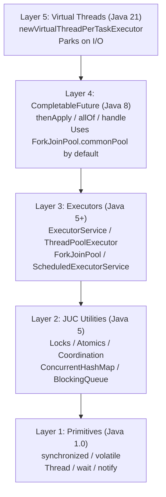
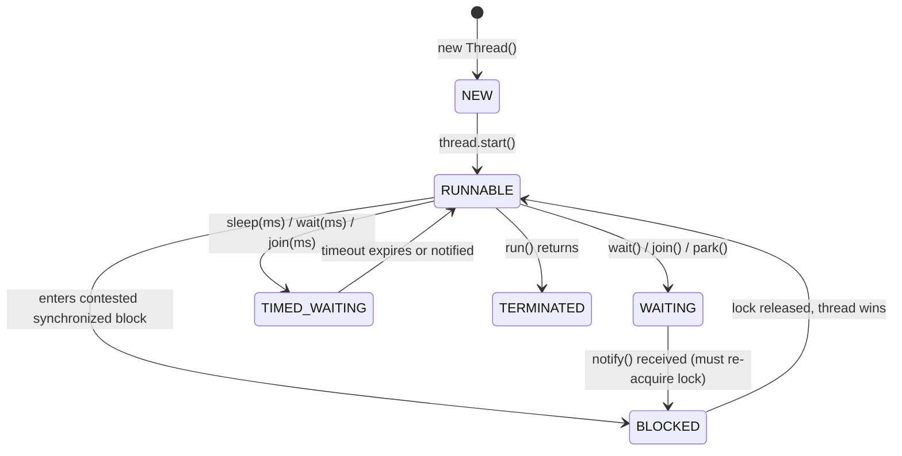
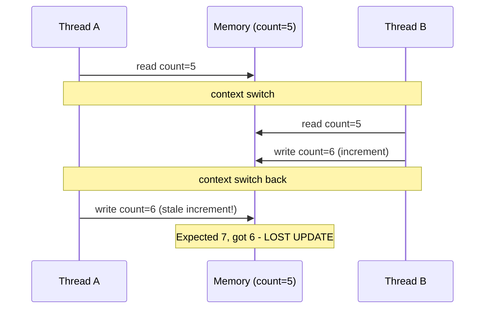

## Keywords in This File
{: .no_toc }

| # | Keyword | Weight |
| --- | --- | --- |
| 1 | [Concurrency vs Parallelism](#concurrency-vs-parallelism) | high |
| 2 | [Java Concurrency Overview](#java-concurrency-overview) | high |
| 3 | [Thread Lifecycle](#thread-lifecycle) | high |
| 4 | [Race Conditions and Thread Safety](#race-conditions-and-thread-safety) | critical |

---

# Concurrency vs Parallelism

**Interview Weight:** high - Foundational vocabulary question asked
at every seniority level. Tests whether you have a mental model or
memorized a definition.

---

### 🎯 Model Answer

**30 seconds:**

> Concurrency is about structure - dealing with multiple things in
> progress at overlapping times, even on a single core via
> interleaving. Parallelism is about execution - running multiple
> things at the exact same instant on multiple cores. A single-core
> CPU can be concurrent but not parallel. In Java: threads and
> virtual threads give concurrency; parallel streams and ForkJoinPool
> give parallelism.

**3 minutes (Senior):**

> The distinction drives architecture decisions. For a web service
> handling 10,000 requests with database I/O, I choose virtual
> threads - the bottleneck is I/O wait time, not CPU. Virtual threads
> park cheaply during I/O, allowing millions of concurrent waits
> without consuming OS thread resources. That is concurrency solving
> an I/O problem.
>
> For batch processing computing ML feature vectors over 50 million
> records, I choose parallel streams. The bottleneck is CPU
> computation. I need multiple cores computing simultaneously.
> Adding threads beyond CPU count adds context-switching overhead
> with no throughput gain. That is parallelism solving a CPU problem.
>
> The non-obvious part: Node.js achieves massive concurrency on a
> single thread with no parallelism. Java ForkJoinPool achieves
> parallelism across cores. Both are legitimate - they solve different
> problems. Mixing them up is the number one Java threading design
> mistake: parallelStream on I/O-bound code, or assuming adding
> threads speeds up CPU-saturated work.

**Framework:** STRUCTURE (concurrency) vs EXECUTION (parallelism)
then I/O BOUND -> concurrency, CPU BOUND -> parallelism

*Adapting up:* Staff engineers connect this to thread model selection
- virtual threads vs reactive vs platform threads - and workload
profiling before architecture decisions.

*Adapting down:* Junior: concurrency = tasks overlap in time.
Parallelism = tasks run simultaneously on different cores.

**Blank Mind Recovery:**

**(1) Restate:** "You are asking about concurrency vs parallelism -
the two ways a system handles multiple tasks."

**(2) First principles:** "Every multi-task system faces two
questions: can tasks overlap in time? (concurrency). Can tasks
run simultaneously on hardware? (parallelism). These are
independent properties."

**(3) Bridge:** "A chef managing multiple dishes at once is
concurrent - switching attention between them. Two chefs each
cooking different dishes simultaneously is parallel."

---

### 📘 Concept Explanation

**What it is:**

Concurrency: the ability to deal with multiple tasks in progress at
overlapping time periods. About program structure and design.
Parallelism: the ability to execute multiple computations at the
exact same instant on multiple processors. About execution speed.

**The problem it solves:**

Without this distinction, developers make wrong architecture decisions.
They add threads to I/O-bound systems expecting speed (correct) but
also add threads to CPU-bound systems beyond core count (wrong).
They misdiagnose performance problems: a concurrent system with 1,000
threads may be slow due to lock contention, not insufficient
parallelism.

**How it works:**

```
CONCURRENCY on 1 core (time-slicing):
Core 0: [T-A]--[T-B]--[T-A]--[T-B]--
        OS switches every ~1-10ms
        Both tasks PROGRESS, never simultaneously.

PARALLELISM on 2 cores (simultaneous):
Core 0: [Thread A runs end-to-end      ]
Core 1: [Thread B runs end-to-end      ]
        Both tasks execute at SAME INSTANT.

BOTH (2 cores, 100 threads):
Core 0: [T1]-[T2]-[T3]-...[T50]
Core 1: [T51]-[T52]-...[T100]
        Parallel across cores,
        concurrent within each core.
```

**The key insight:**

I/O-bound workloads need concurrency - threads progress while waiting
for network or disk. CPU-bound workloads need parallelism - work must
physically execute on multiple cores to be faster. Applying
parallelism to I/O-bound work wastes CPU; applying extra concurrency
to CPU-bound work creates context-switching overhead.

**When to use it:**

- Concurrency: request handlers, database calls, API calls, file I/O,
  any workload that blocks on external resources
- Parallelism: data transformation, image processing, ML feature
  computation, sorting - CPU-intensive work on collections

**When NOT to use it:**

- Do not apply parallelStream() to I/O operations - starves the
  ForkJoinPool common pool, hurts all other parallel operations
- Do not exceed CPU core count with threads for CPU-bound tasks -
  context switching overhead eliminates the gain

**Alternatives:**

- Reactive (Project Reactor, RxJava) - non-blocking I/O concurrency
  on a small thread pool via backpressure pipelines
- Actor model (Akka) - message-passing concurrency, no shared state
- Single-threaded event loop (Vert.x, Node.js) - high I/O concurrency
  on one OS thread

**First-principles derivation:**

Tasks take time. Some tasks wait (I/O). If one task is waiting,
another can make progress - that is concurrency. Multiple CPU cores
execute instructions simultaneously - that is parallelism. Given N
cores and M tasks, if M > N, you need concurrency to schedule them.
If tasks are CPU-intensive and M <= N, parallelism gives speedup.
The constraint: adding M beyond N for CPU work gives diminishing
returns due to context-switch overhead (~1-10 microseconds per switch).

---

### 💻 Code Example

**Example 1: BAD - parallelStream on I/O vs GOOD - virtual threads**

```java
// BAD: parallelStream for I/O-bound work
// Blocks ForkJoinPool.commonPool() OS threads on I/O
List<String> bad = urls.parallelStream()
    .map(url -> httpClient.get(url))  // blocks pool thread
    .collect(Collectors.toList());
// ForkJoinPool has CPU_COUNT threads. One slow call
// blocks an entire OS thread. All parallel operations
// in the JVM compete for the same exhausted pool.

// GOOD: virtual threads for I/O-bound work
try (ExecutorService exec =
        Executors.newVirtualThreadPerTaskExecutor()) {
    List<Future<String>> futures = urls.stream()
        .map(url -> exec.submit(
            () -> httpClient.get(url)))  // parks, not blocks
        .collect(Collectors.toList());
    List<String> results = new ArrayList<>();
    for (Future<String> f : futures) {
        results.add(f.get());
    }
}
// Virtual threads park at httpClient.get(). The carrier
// OS thread is freed to run other virtual threads.
// Scales to 100,000+ concurrent I/O waits.
```

> **Code walkthrough:** The BAD pattern ties up ForkJoinPool.commonPool()
> OS threads waiting for network I/O - a ★★★ mistake that degrades ALL
> parallel operations in the JVM. The GOOD pattern uses virtual threads
> that park (not block) during I/O. The carrier OS thread remains
> available. This is the most common Java concurrency design mistake
> in services migrating from thread pools to "modern concurrency."

**Example 2: RIGHT tool for CPU-bound (parallelism)**

```java
// CPU-bound: parallelStream is correct
// ForkJoinPool.commonPool() parallelism = CPU core count
List<Double> features = records.parallelStream()
    .map(r -> computeMLFeatureVector(r))  // CPU-saturating
    .collect(Collectors.toList());
// Work is divided across cores. Adding more threads than
// cores would create context-switching overhead with
// zero additional throughput.
```

> **Code walkthrough:** For CPU-saturating work, `parallelStream()` uses
> ForkJoinPool.commonPool() with parallelism equal to available CPU cores.
> Work-stealing ensures cores stay busy even with unequal partition sizes.
> Never set pool parallelism above CPU count for CPU-bound tasks - the
> OS context-switch cost (~5 microseconds) eliminates any gain.

---

### 🎓 Answers by Seniority

**Junior / Mid (0-5 years):**

> Concurrency means multiple tasks can be in progress at the same
> time, even on a single core via thread interleaving. Parallelism
> means tasks physically run simultaneously on multiple cores. Java
> threads give concurrency. ForkJoinPool and parallel streams give
> parallelism. The key decision: I/O-bound work needs concurrency;
> CPU-bound work needs parallelism.

*Push deeper:* "parallelStream on a database call would block the
ForkJoinPool threads and hurt overall throughput. I use virtual
threads for I/O-heavy concurrency."

---

**Senior / Staff (5+ years):**

> Concurrency is a design property I choose deliberately based on
> workload analysis. For a high-throughput API with heavy database
> I/O, I choose virtual threads - cheap parking, millions of
> concurrent waits, simple blocking code. For batch ETL over 100M
> records, I choose ForkJoinPool parallel streams scaled to CPU
> count. The deciding factor is always bottleneck analysis first.

*Push deeper:* "Virtual threads changed the Java I/O model. We no
longer need reactive frameworks for I/O concurrency at scale. Spring
WebMVC on virtual threads is now competitive with WebFlux for
I/O-bound workloads. This is a major architectural simplification."

---

### ⚠️ Common Misconceptions

| Misconception | Reality | Risk |
| --- | --- | --- |
| "More threads = more parallelism" | Parallelism is bounded by CPU cores; extra threads add context-switch overhead | CPU saturation with no speedup |
| "parallelStream makes code faster" | Only for CPU-bound in-memory work; harmful for I/O-bound | Starves ForkJoinPool on I/O |
| "Virtual threads give parallelism" | Virtual threads give I/O concurrency; parallelism still requires CPU cores | Wrong tool for CPU-bound work |
| "Concurrency requires multiple threads" | Node.js single-threaded event loop is highly concurrent | Architectural confusion |
| "Thread.sleep makes a thread parallel" | sleep() suspends one thread; other threads may run concurrently but not necessarily in parallel | Misunderstands scheduling |

---

### 🚨 Failure Modes and Diagnosis

| Failure | Symptom | Root Cause | Diagnostic | Fix |
| --- | --- | --- | --- | --- |
| parallelStream on I/O ops | Slow under load; CPU below 20% | ForkJoinPool threads blocked on I/O wait | jstack: pool threads in TIMED_WAITING at SocketInputStream.read | Switch to virtual threads or dedicated I/O pool |
| Thread count > CPU cores for CPU work | CPU at 100%; throughput does not scale with thread count | Context switching overhead exceeds computation time | jcmd Thread.print: thread count >> availableProcessors() | Set pool size = Runtime.getRuntime().availableProcessors() |
| Assuming sequential behavior | Intermittent data corruption under load | Shared mutable state without synchronization | jstack during load: identify concurrent access to same object | AtomicInteger, synchronized, or immutable design |

---

### 🎯 Interview Deep-Dive

| Level | Time | Expected Depth |
| --- | --- | --- |
| Junior | 2-3 min | Define both; give one Java example each |
| Mid | 4-5 min | I/O vs CPU decision; Java APIs |
| Senior | 6-8 min | Design story; virtual threads trade-offs |
| Staff | 10 min | Architecture decisions; migration risks |
| Bar Raiser | 12 min | Virtual thread pinning; reactive vs Loom |

---

**Q1** [CONCEPTUAL] [JUNIOR]

"What is the difference between concurrency and parallelism?"

*Why they ask:* Tests depth beyond memorized definitions. Strong
answers connect the distinction to practical design decisions.

*Likely follow-up:* "Can you have one without the other?"

**Answer:**

Concurrency is about program structure - multiple tasks can be in
progress at the same time, even on a single CPU core via time-slicing.
The OS scheduler interleaves threads every few milliseconds. Neither
thread executes simultaneously, but both make progress.

Parallelism is about physical execution - multiple tasks run at the
exact same nanosecond on different CPU cores. This requires multi-core
hardware and JVM/OS cooperation to assign threads to separate cores.

All parallelism is concurrent (parallel threads are also interleaving
from the scheduler's perspective), but not all concurrency is parallel
(a single-core machine can run concurrent threads but not parallel
ones). Node.js is highly concurrent on one thread - no parallelism.
Java ForkJoinPool is both: parallel across cores, concurrent within
each core's thread pool.

The practical decision: I/O-bound work benefits from concurrency
(threads park during I/O, freeing CPU for others). CPU-bound work
benefits from parallelism (cores compute simultaneously). Applying
parallel streams to I/O-bound code is the classic mistake - it blocks
the ForkJoinPool common pool and degrades all parallel operations.

*What separates good from great:* Connecting the definition to the
I/O vs CPU design decision rather than staying abstract.

---

**Q2** [TRADE-OFF] [MID]

"When would you use virtual threads vs parallel streams?"

*Why they ask:* Tests practical judgment about Java's two concurrency
mechanisms.

*Likely follow-up:* "What about mixed I/O and CPU work?"

**Answer:**

Virtual threads are for I/O-bound concurrency. When a virtual thread
blocks on a database call or HTTP request, the JVM parks it - the
underlying OS thread is freed to run other virtual threads. This
enables thousands of concurrent I/O operations without thousands of
OS threads. Virtual threads do not accelerate CPU computation.

Parallel streams (via ForkJoinPool.commonPool()) are for CPU-bound
parallelism. Work is split across CPU cores, executing simultaneously.
Best for in-memory data transformation where each element is processed
independently. Overhead is work-stealing coordination and result merge.

For mixed workloads: fetch data concurrently with virtual threads,
collect into a list, then process in parallel with streams. Never mix
in one pipeline - a parallelStream that calls a database per element
blocks ForkJoinPool threads on I/O, exhausting the pool for all other
parallel operations in the JVM.

Decision rule: bottleneck is I/O wait time -> virtual threads.
Bottleneck is CPU computation -> parallel streams. Mixed -> separate
phases with an intermediate collection between them.

*What separates good from great:* The ForkJoinPool starvation risk -
parallelStream on I/O causes the common pool to fill with blocked
OS threads, degrading ALL parallel operations JVM-wide.

---

**Q3** [DEBUGGING] [SENIOR]

"Your service has 500 threads but CPU is at 15%. What do you check?"

*Why they ask:* Tests production diagnosis - high thread count with
low CPU is the signature of blocked/waiting threads.

*Likely follow-up:* "What jstack output would confirm your hypothesis?"

**Answer:**

Low CPU with high thread count is the classic I/O blocking pattern.
Threads are waiting, not computing.

Step 1: thread dump with jstack PID or jcmd PID Thread.print.

Step 2: look at thread states. If most threads are in TIMED_WAITING
or WAITING state, they are blocked on I/O or synchronization.
States to look for: "waiting on condition", "parking to wait for",
"waiting for monitor entry".

Step 3: read the stack traces. "sun.nio.ch.SocketChannelImpl.read"
or "java.net.SocketInputStream.read" means network I/O blocking.
"java.sql.DriverManager.getConnection" means connection pool
exhaustion or slow database.
"java.util.concurrent.locks.AbstractQueuedSynchronizer.park" means
lock contention.

Step 4: identify root cause from the specific blocking location.
Database pool too small - increase pool or reduce query time.
Slow downstream API - add circuit breaker, reduce timeout.
Lock contention - reduce critical section scope, use finer locks.

Step 5: verify the fix with the same jstack pattern post-change.
CPU utilization should rise closer to actual computation capacity.

*What separates good from great:* Naming exact jstack signatures for
network I/O, database, and lock blocking rather than vague "check
threads."

---

**Q4** [COMPARISON] [MID]

"How does Node.js achieve high concurrency on one thread?"

*Why they ask:* Tests that you understand concurrency is not
synonymous with multi-threading.

*Likely follow-up:* "What is Node's limitation at high CPU load?"

**Answer:**

Node.js uses a single-threaded event loop backed by libuv for async
I/O. Every I/O operation (database, HTTP, file) registers a callback
with the OS via epoll/kqueue. The thread is never blocked waiting for
the response - it returns to the event loop immediately and processes
other events. When I/O completes, the OS notifies the event loop,
which dequeues and executes the callback.

Result: one OS thread handles thousands of concurrent I/O operations.
Not by running them simultaneously (that would require parallelism) but
by never blocking on any one of them. This is pure concurrency without
parallelism.

Node's limitation: CPU-bound work blocks the event loop. A single
compute-intensive operation (image processing, encryption, ML
inference) stalls all I/O callbacks because the thread is occupied.
Node adds Worker Threads and cluster mode for CPU work.

Java's virtual threads achieve similar I/O concurrency while
allowing blocking code style. The JVM parks virtual threads during
I/O, freeing the carrier OS thread - conceptually similar to the
event loop but without callback pyramid or reactive operators.

*What separates good from great:* Connecting Node's model to Java
virtual threads and noting the programming model difference (callbacks
vs blocking) while the concurrency behavior is similar.

---

**Q5** [CONCEPTUAL] [JUNIOR]

"Can a program be parallel but not concurrent?"

*Why they ask:* Tests depth beyond the standard textbook answer.

*Likely follow-up:* "Does SIMD count as parallelism?"

**Answer:**

Yes, though it is rare in application code. GPU computing is the
clearest example: thousands of shader cores execute the same
instruction on different data simultaneously (massive parallelism),
but each shader runs independently with no coordination between
shaders (no concurrency needed, no shared state to manage).

SIMD (Single Instruction, Multiple Data) vector operations on modern
CPUs are another example: one CPU instruction applies the same
arithmetic to multiple data elements in parallel across vector
registers. Java's Vector API exposes this. The programmer writes what
looks like a single operation; the hardware executes it on multiple
data elements simultaneously - parallel, not concurrent.

In typical Java applications, parallel programs are almost always
also concurrent - ForkJoinPool tasks are both simultaneously
executing (parallelism) and interleaving on the thread pool
(concurrency). The pure parallelism-without-concurrency case is a
hardware-level concern, not a typical Java application concern.

*What separates good from great:* Using GPU shaders or SIMD as
concrete examples. The insight: concurrency involves coordination
(shared state, scheduling) while pure parallelism can be independent.

---

**Q6** [PRODUCTION] [SENIOR]

"You're migrating a 200-thread pool API to virtual threads. What
risks do you assess before deploying?"

*Why they ask:* Tests whether you know the non-obvious virtual
thread migration risks beyond "it's faster."

*Likely follow-up:* "What JVM events would you monitor post-deploy?"

**Answer:**

Virtual threads are not a drop-in replacement without assessment.
Three critical risks:

Risk 1: synchronized block pinning. Virtual threads get pinned to
carrier OS threads inside synchronized blocks and native method calls.
Pinning means the carrier thread is blocked - with carrier count equal
to CPU cores, 8 simultaneous pinned virtual threads saturates all 8
carriers. I audit: does any synchronized block wrap an I/O operation?
If yes, convert to ReentrantLock (which supports parking).

Risk 2: ThreadLocal memory inflation. Libraries using ThreadLocal now
create per-virtual-thread state at massive scale. A framework storing
request context in ThreadLocal that previously created 200 instances
may now create 100,000. Memory pressure and GC overhead can increase
significantly. Audit ThreadLocal usage, consider ScopedValue (Java 21).

Risk 3: database connection pool explosion. With 200 threads, at most
200 concurrent DB connections. With unlimited virtual threads, the
service can launch 100,000 concurrent DB queries. Without limiting
concurrency to the pool size, connection pool exhaustion or database
CPU saturation occurs. Add a Semaphore or bounded executor to cap
database concurrency at the pool size.

Post-deploy monitoring: JFR VirtualThreadPinnedEvent (count and
duration of pinning events), virtual thread count vs carrier thread
count, database connection pool utilization, p99 latency under load.

*What separates good from great:* Naming all three risks with concrete
mitigations rather than just "virtual threads have some limitations."

---

**Q7** [ARCHITECTURE] [STAFF]

"Virtual threads vs WebFlux for a new 10,000 req/s service. How do
you decide?"

*Why they ask:* Staff-level technology strategy, not implementation
details.

*Likely follow-up:* "What would change your recommendation?"

**Answer:**

This is workload characterization plus team capability, not a pure
performance question.

Workload analysis: at 10,000 req/s on typical cloud hardware (4-8
cores), both virtual threads and WebFlux handle the throughput
comfortably. Virtual threads' advantage is programmer ergonomics:
blocking code, familiar exception handling, standard debugging tools.
WebFlux's advantage is extreme connection density (100,000+ concurrent
connections per node) where even virtual thread stack allocation
becomes a concern.

Team capability: Reactor has a steep learning curve. Debugging
reactive pipeline backpressure and thread scheduling is harder than
reading a thread dump. Onboarding new engineers onto WebFlux takes
significantly longer. For a new service without existing reactive
investment, virtual threads reduce maintenance cost.

Integration: if the data layer uses R2DBC or reactive repositories,
staying reactive avoids mixing blocking and non-blocking code in one
service - that mixing is where subtle bugs appear. If the data layer
is JDBC (blocking), virtual threads are a natural fit.

My default recommendation for 10,000 req/s with a team not already
invested in reactive: virtual threads with Spring MVC. Same
throughput, simpler code, better observability. Change the
recommendation if: the service must run at 100,000+ concurrent
connections per node, or the team already owns reactive infrastructure.

*What separates good from great:* Framing the decision as workload +
team capability + integration cost - not just peak throughput numbers.

| Interviewer Type | Emphasis |
| --- | --- |
| Technical Panel | Precise definitions; Java API mapping; ForkJoinPool. |
| Hiring Manager | Design story: "I chose virtual threads for our API because..." |
| Bar Raiser | Virtual thread pinning risks; reactive vs Loom trade-offs. |
| Peer Engineer | "We hit parallelStream on DB calls - pool exhausted." |

---

### ⚖️ Comparison Table

*(Omit: ★☆☆ foundational keyword. Detailed mechanism comparison
is in L2 Synchronization and L3 Thread Pools files.)*

---

### 🏛️ System Design

*(Omit: L0 orientation keyword. Concurrency/parallelism model
selection appears in system design at L4-L5 when designing
specific service thread architectures.)*

---

### 📊 Diagram

```
CONCURRENCY (1 core - interleaving):
Time:  0   10   20   30   40   50  ms
T-A:  [##]      [##]      [##]
T-B:       [##]      [##]      [##]
      ^ OS context-switch every 10ms
      Both progress, never simultaneously.

PARALLELISM (2 cores - simultaneous):
Time:  0   10   20   30   40   50  ms
C-0:  [Thread A ....................]
C-1:  [Thread B ....................]
      ^ Both executing at same instant.

BOTH (2 cores, 4 threads):
C-0:  [T-A]-[T-C]-[T-A]-[T-C]...
C-1:  [T-B]-[T-D]-[T-B]-[T-D]...
      Concurrent within core, parallel across.
```



```mermaid
gantt
    title Concurrency vs Parallelism
    dateFormat X
    axisFormat %Lms

    section 1-Core Concurrent
    Thread A   :a1, 0, 2
    Thread B   :b1, 2, 4
    Thread A   :a2, 4, 6
    Thread B   :b2, 6, 8

    section 2-Core Parallel
    Thread A (Core 0) :p1, 0, 8
    Thread B (Core 1) :p2, 0, 8
```

> **Diagram walkthrough:** The top section shows single-core
> concurrency - Thread A and B alternate via OS context switching.
> Both make progress but never simultaneously. The bottom shows
> parallelism - both threads execute at the same clock cycle on
> different cores. In production Java: a thread pool with 100
> threads on 8 cores is concurrent (100 tasks interleave) and
> parallel (8 cores execute simultaneously). The ForkJoinPool
> makes this explicit - parallelism = core count, concurrency =
> task count >> core count.

---

---
# Java Concurrency Overview

**Interview Weight:** high - Ecosystem map question. Tests whether
you know the full Java concurrency toolbox or only one layer of it.

---

### 🎯 Model Answer

**30 seconds:**

> Java concurrency evolved through three generations: raw threads
> (Java 1.0), the java.util.concurrent (JUC) framework (Java 5),
> and virtual threads via Project Loom (Java 21). Today the stack
> is: synchronized/volatile primitives at the bottom, JUC utilities
> (locks, semaphores, atomics, concurrent collections, executors)
> in the middle, CompletableFuture for async composition, and
> virtual threads for massive I/O concurrency at the top.

**3 minutes (Senior):**

> Understanding the full stack matters because each layer solves
> a different problem.
>
> Layer 1 - Primitives (Java 1.0): synchronized (mutual exclusion
> and visibility), volatile (visibility only, no atomicity), wait/
> notify (low-level signaling). Correct but difficult to use.
> Almost never write these directly in new code.
>
> Layer 2 - JUC framework (Java 5): java.util.concurrent brought
> ReentrantLock (timed/interruptible locking), Semaphore (access
> control), CountDownLatch/CyclicBarrier (coordination), Atomic
> classes (lock-free operations), BlockingQueue (producer/consumer),
> ConcurrentHashMap (concurrent reads, segmented writes). This is
> the production workhorse layer.
>
> Layer 3 - Executors (Java 5+): ExecutorService decouples task
> submission from thread management. ThreadPoolExecutor gives full
> control. ForkJoinPool adds work-stealing for recursive tasks.
> ScheduledExecutorService for timed tasks. Never create raw Thread
> objects in production - use executors.
>
> Layer 4 - Async composition (Java 8): CompletableFuture enables
> non-blocking pipelines: thenApply, thenCompose, thenCombine,
> allOf. Uses ForkJoinPool.commonPool() by default - a critical
> detail for I/O operations (do not block the common pool).
>
> Layer 5 - Virtual threads (Java 21): one virtual thread per task,
> parking instead of blocking, scales to millions of concurrent
> I/O waits. Simplifies the async/reactive programming model by
> allowing blocking code that does not consume OS threads.

**Framework:** PRIMITIVES -> JUC UTILITIES -> EXECUTORS ->
COMPLETABLE FUTURE -> VIRTUAL THREADS

*Adapting up:* "I recommend virtual threads for new I/O-heavy
services and ForkJoinPool for CPU-intensive batch work. Reactive
frameworks are still justified for extreme connection counts or
when the team already owns that infrastructure."

*Adapting down:* "Java concurrency has three things to know:
synchronized for shared state, ExecutorService for task management,
and CompletableFuture for async operations."

**Blank Mind Recovery:**

**(1) Restate:** "You are asking for an overview of Java concurrency
- the full toolbox from primitives to modern virtual threads."

**(2) First principles:** "Concurrency needs three things: mutual
exclusion (don't corrupt state), thread lifecycle management (create,
run, stop), and task composition (chain async work)."

**(3) Bridge:** "Think of it as layers: synchronized is the
foundation (like raw assembly), JUC is the standard library (like
C stdlib), virtual threads are the modern runtime (like Go goroutines)."

---

### 📘 Concept Explanation

**What it is:**

The Java concurrency ecosystem is a layered set of APIs for writing
programs that perform multiple operations concurrently or in parallel.
It spans from low-level primitives in the language spec (synchronized,
volatile) to high-level runtime features (virtual threads).

**The problem it solves:**

Writing correct concurrent code is difficult. Raw thread management
(creating, starting, stopping, communicating between threads) is
error-prone. JUC standardized proven patterns. Virtual threads
removed the OS thread bottleneck for I/O-bound workloads without
requiring reactive programming style.

**How it works:**

```
Java Concurrency Stack:

Layer 5: Virtual Threads (Java 21)
  - Executors.newVirtualThreadPerTaskExecutor()
  - StructuredTaskScope (preview)
  - Park instead of block; millions of threads

Layer 4: Async Composition (Java 8+)
  - CompletableFuture<T>
  - allOf(), anyOf(), thenCompose(), handle()
  - Uses ForkJoinPool.commonPool() by default

Layer 3: Executors (Java 5+)
  - ExecutorService, ThreadPoolExecutor
  - ForkJoinPool (work-stealing)
  - ScheduledExecutorService

Layer 2: JUC Utilities (Java 5)
  - Locks: ReentrantLock, ReadWriteLock
  - Coordination: CountDownLatch, CyclicBarrier
  - Atomics: AtomicInteger, LongAdder
  - Collections: ConcurrentHashMap, BlockingQueue

Layer 1: Primitives (Java 1.0)
  - synchronized keyword (method or block)
  - volatile keyword
  - Thread class, Runnable interface
  - wait() / notify() / notifyAll()
```

**The key insight:**

The common pool (ForkJoinPool.commonPool()) is shared across all
CompletableFuture.supplyAsync() calls, parallel streams, and any
code that does not specify a custom executor. Blocking the common
pool with I/O operations degrades all users of that pool in the JVM.
Always supply a custom executor for I/O in CompletableFuture chains.

**When to use it:**

- synchronized: simple shared-state protection in non-hot paths
- ReentrantLock: when you need tryLock, timeouts, or interruptible lock
- AtomicInteger: single-variable lock-free counters and CAS operations
- ConcurrentHashMap: thread-safe map with concurrent reads
- ExecutorService: any production task management (not raw Thread)
- CompletableFuture: chaining async operations
- Virtual threads: I/O-bound services on Java 21+

**When NOT to use it:**

- Do not use Thread directly in production (no lifecycle management)
- Do not use synchronized for complex coordination (use JUC)
- Do not block in CompletableFuture chains on the common pool
- Do not use deprecated Thread.stop(), Thread.suspend()

**Alternatives:**

- Reactive frameworks (Spring WebFlux/Reactor) - non-blocking I/O
  with backpressure, useful at extreme connection density
- Actor model (Akka) - message-passing without shared mutable state
- Structured concurrency (Java preview) - scoped task lifetimes
  with automatic cancellation propagation

**First-principles derivation:**

Any concurrent system needs mutual exclusion (one writer at a time),
progress (threads are not permanently blocked), and liveness (work
eventually completes). synchronized provides mutual exclusion.
JUC adds liveness through condition queues and timed waits.
Executors add progress by managing thread creation within bounds.
Virtual threads add liveness at I/O boundaries by parking instead
of consuming OS resources while waiting.

---

### 💻 Code Example

**Example 1: Evolution of Java concurrency approaches**

```java
// Generation 1: raw Thread (never in production)
Thread t = new Thread(() -> process(task));
t.start();
// No lifecycle management, no error handling,
// no reuse of threads.

// Generation 2: ExecutorService (JUC, Java 5)
ExecutorService pool = Executors.newFixedThreadPool(
    Runtime.getRuntime().availableProcessors()
);
Future<Result> future = pool.submit(() -> process(task));
// Reuses threads. Handles lifecycle. But Future.get()
// blocks the calling thread.

// Generation 3: CompletableFuture (Java 8)
CompletableFuture<Result> cf =
    CompletableFuture.supplyAsync(
        () -> process(task),
        customExecutor  // ALWAYS provide executor for I/O
    )
    .thenApply(r -> transform(r))
    .exceptionally(ex -> fallback());
// Non-blocking pipeline. Compose stages.

// Generation 4: virtual threads (Java 21)
try (ExecutorService vExec =
        Executors.newVirtualThreadPerTaskExecutor()) {
    List<Future<Result>> futures =
        tasks.stream()
             .map(t2 -> vExec.submit(() -> process(t2)))
             .collect(Collectors.toList());
    for (Future<Result> f : futures) {
        handleResult(f.get());  // blocks virtual thread,
                                 // not OS thread
    }
}
// Simple blocking code; OS thread not consumed during wait.
```

> **Code walkthrough:** Each generation solves the previous one's
> limitation. Raw Thread has no management. ExecutorService adds
> lifecycle but Future.get() still blocks. CompletableFuture chains
> without blocking but requires callback-style thinking. Virtual
> threads allow blocking code that does not consume OS threads during
> I/O waits - combining simplicity with scalability. The critical
> rule: always supply a custom executor to CompletableFuture.supplyAsync()
> for I/O operations to avoid starving ForkJoinPool.commonPool().

**Example 2: BAD - blocking common pool vs GOOD - custom executor**

```java
// BAD: blocking ForkJoinPool.commonPool() with I/O
CompletableFuture<String> bad =
    CompletableFuture.supplyAsync(
        () -> jdbcTemplate.queryForObject(sql, String.class)
        // ^ no executor: uses commonPool, blocks OS thread
    );

// GOOD: dedicated executor for I/O-bound tasks
ExecutorService ioPool =
    Executors.newVirtualThreadPerTaskExecutor();
CompletableFuture<String> good =
    CompletableFuture.supplyAsync(
        () -> jdbcTemplate.queryForObject(sql, String.class),
        ioPool  // dedicated executor; virtual threads park
    );
```

> **Code walkthrough:** The BAD pattern ties up ForkJoinPool.commonPool()
> threads waiting on JDBC. Every parallel stream in the JVM competes
> for those same threads. The GOOD pattern provides a dedicated executor.
> With virtual threads, the JDBC call parks the virtual thread rather
> than blocking an OS thread - the carrier OS thread is freed for
> other work.

---

### 🎓 Answers by Seniority

**Junior / Mid (0-5 years):**

> Java concurrency has three layers I use regularly: synchronized
> and volatile for simple shared-state protection, java.util.concurrent
> for thread pools (ExecutorService) and safe collections
> (ConcurrentHashMap), and CompletableFuture for async composition.
> On Java 21 I also use virtual threads for I/O-heavy services.

*Push deeper:* "The main JUC classes I reach for: ExecutorService for
task management, ReentrantLock when I need tryLock, AtomicInteger for
counters, ConcurrentHashMap for thread-safe maps, and BlockingQueue
for producer-consumer queues."

---

**Senior / Staff (5+ years):**

> I think of Java concurrency in layers. For simple exclusive access
> in non-hot paths: synchronized. For lock control (timeouts,
> interrupts): ReentrantLock. For concurrent state: Atomic classes
> over locks where CAS semantics fit. For task execution: dedicated
> ExecutorService instances (not raw Thread). For I/O-bound services
> on Java 21: virtual threads with StructuredTaskScope for clean
> cancellation propagation. I never block ForkJoinPool.commonPool().

*Push deeper:* "The architecture choice for 2024 I/O-heavy services:
virtual threads over reactive. Same throughput, standard debugging,
compatible with blocking libraries. I keep reactive for extreme
connection counts or existing reactive infrastructure."

---

### ⚠️ Common Misconceptions

| Misconception | Reality | Risk |
| --- | --- | --- |
| "synchronized is still the primary tool" | JUC has ReentrantLock, Semaphore, and more - synchronized is only for simple exclusive access | Under-using JUC, over-complicating code |
| "CompletableFuture creates its own threads" | Uses ForkJoinPool.commonPool() by default; I/O operations must use a custom executor | Starving commonPool with I/O |
| "Virtual threads replace all thread pools" | Virtual threads are for I/O concurrency; ForkJoinPool still optimal for CPU-bound parallelism | Wrong tool for CPU work |
| "Thread.new is fine for background tasks" | No lifecycle management, no error isolation, no reuse | Resource leaks and unmanaged threads |
| "Java 21 concurrency is completely different" | Virtual threads run on the existing JUC framework; ExecutorService API is unchanged | Fear of adopting new features |

---

### 🚨 Failure Modes and Diagnosis

| Failure | Symptom | Root Cause | Diagnostic | Fix |
| --- | --- | --- | --- | --- |
| Raw Thread in production | Threads not cleaned up on shutdown; errors swallowed | No lifecycle management outside of executors | Search codebase for `new Thread(` outside test code | Wrap in ExecutorService or virtual thread executor |
| Blocking commonPool in CompletableFuture | Parallel streams slow; p99 latency spike under load | I/O operations executing on ForkJoinPool.commonPool() | jstack: ForkJoinPool threads in WAITING at JDBC/HTTP calls | Always pass custom executor to supplyAsync for I/O |
| synchronized on wrong object | No mutual exclusion despite synchronized keyword | Synchronizing on different object instances | Add logging to critical section; run under load and observe races | Synchronize on a shared, stable final object or use ReentrantLock |

---

### 🎯 Interview Deep-Dive

| Level | Time | Expected Depth |
| --- | --- | --- |
| Junior | 2-3 min | Name the layers; give two JUC examples |
| Mid | 4-5 min | Explain executor service; CompletableFuture risks |
| Senior | 7-8 min | Architecture decisions; virtual thread trade-offs |
| Staff | 10 min | Technology selection; team capability considerations |
| Bar Raiser | 12 min | JUC internals; commonPool design; StructuredConcurrency |

---

**Q1** [CONCEPTUAL] [JUNIOR]

"Map the Java concurrency ecosystem for me."

*Why they ask:* Baseline question to assess whether you know
the full toolbox or just one layer.

*Likely follow-up:* "Which parts do you use most in production?"

**Answer:**

Java concurrency has evolved through four generations, each solving
the previous generation's limitations.

Generation 1 (Java 1.0): Thread class, Runnable, synchronized,
volatile, wait/notify. Low-level and error-prone. Correct, but
most tasks are better served by higher layers.

Generation 2 (Java 5 - JUC): java.util.concurrent introduced the
production concurrency toolkit. Key additions: ExecutorService for
thread pool management, ReentrantLock and ReadWriteLock for
advanced locking, Semaphore and CountDownLatch for coordination,
AtomicInteger and family for lock-free operations, BlockingQueue
for producer-consumer, ConcurrentHashMap for safe concurrent maps.

Generation 3 (Java 8): CompletableFuture for non-blocking async
composition. Chain transformations (thenApply), combine results
(thenCombine, allOf), handle errors (exceptionally, handle).
Uses ForkJoinPool.commonPool() by default.

Generation 4 (Java 21): Virtual threads. One virtual thread per
task, parks instead of blocks during I/O. StructuredTaskScope
(preview) for scoped cancellation. Scales to millions of
concurrent I/O tasks with simple blocking code.

In production today I use JUC executors for all task management,
CompletableFuture with custom executors for async pipelines, and
virtual threads on Java 21+ services.

*What separates good from great:* Knowing that virtual threads
use the JUC ExecutorService API unchanged - they are the execution
layer, not a replacement for the coordination layer.

---

**Q2** [COMPARISON] [MID]

"When do you choose ReentrantLock over synchronized?"

*Why they ask:* Tests JUC knowledge depth beyond the basics.

*Likely follow-up:* "What is the performance difference?"

**Answer:**

I choose synchronized for simple mutual exclusion where the lock
scope is clear and I do not need timed or interruptible waiting.
It has the advantage of automatic release (even on exception) and
JVM-level optimization (lock elision, biased locking).

I choose ReentrantLock when I need:
1. tryLock() - attempt lock acquisition without blocking. Useful
   for deadlock avoidance: if you cannot acquire, back off and retry.
2. tryLock(timeout, unit) - bounded wait. Prevents permanent blocking
   if a lock holder fails or runs slow. Critical in distributed system
   integrations.
3. lockInterruptibly() - allow the waiting thread to be interrupted.
   Enables clean shutdown: interrupt waiting threads so they can exit.
4. Multiple condition variables - one ReentrantLock can have multiple
   Condition objects (condition.await(), condition.signal()), allowing
   precise notification routing. Synchronized has only one condition
   per object (wait/notifyAll wakes all waiters even if only one should proceed).
5. Fair lock mode - new ReentrantLock(true) ensures FIFO ordering,
   preventing starvation. synchronized has no fairness guarantee.

Performance: modern JVMs optimize uncontended synchronized similarly
to ReentrantLock. Under contention, fairness mode ReentrantLock is
slower due to FIFO overhead. Default (non-fair) ReentrantLock is
comparable to synchronized.

*What separates good from great:* The specific conditions (tryLock,
interruptible, multiple conditions) rather than vague "more features."

---

**Q3** [DEBUGGING] [SENIOR]

"CompletableFuture is slow under load. Where do you look?"

*Why they ask:* Tests understanding of ForkJoinPool commonPool
and async pipeline performance.

*Likely follow-up:* "How do you decide the right pool size?"

**Answer:**

CompletableFuture slowness under load has three common root causes.

Root cause 1: blocking the common pool with I/O. If any stage in
the pipeline calls a blocking operation (JDBC, HTTP, file I/O) on
ForkJoinPool.commonPool() - the default executor - OS threads are
blocked waiting for I/O. The common pool has CPU_COUNT threads; a
single slow query can block one for seconds. Under load, all common
pool threads are blocked on I/O and the pipeline stalls.

Diagnostic: jstack shows ForkJoinPool threads in TIMED_WAITING at
SocketInputStream.read or similar I/O stacks.

Fix: always supply a custom executor to supplyAsync for I/O stages.
Use virtual threads executor (Java 21) or a dedicated I/O thread pool.

Root cause 2: exception swallowing. If a stage throws an exception
and no exceptionally/handle is attached, the CompletableFuture
completes exceptionally but silently. Downstream .get() throws
ExecutionException. Without proper error handling, failures are
silent.

Root cause 3: pool size mismatch. CompletableFuture with a
FixedThreadPool for CPU work - if pool size is too small, tasks
queue and latency increases. Profile actual CPU utilization.

*What separates good from great:* Diagnosing the commonPool I/O
blocking pattern specifically - naming the jstack signature.

---

**Q4** [CONCEPTUAL] [MID]

"What did virtual threads change about Java concurrency?"

*Why they ask:* Tests awareness of Java 21 paradigm shift.

*Likely follow-up:* "Do virtual threads replace reactive?"

**Answer:**

Virtual threads (JEP 444, Java 21) changed the Java I/O concurrency
model at the runtime level.

Before virtual threads: writing high-concurrency I/O services in
Java required either a large thread pool (many OS threads, high
memory) or a reactive/async programming model (CompletableFuture,
WebFlux). Reactive is correct but has high cognitive overhead:
callback composition, backpressure management, debugging reactive
pipelines is significantly harder than reading thread dumps.

With virtual threads: the JVM multiplexes virtual threads onto a
small pool of OS carrier threads. When a virtual thread blocks on
I/O, it parks - the carrier thread is freed and can run another
virtual thread. This means you write simple, blocking code:

String result = jdbcTemplate.query(sql);  // parks, not blocks

...and the runtime transparently handles the concurrency. A virtual
thread consumes minimal memory (~1KB stack) vs an OS thread (~1MB),
enabling millions of concurrent I/O waits.

Virtual threads do NOT replace reactive for every case. Reactive
frameworks have backpressure semantics (controlling fast producers
with slow consumers) that virtual threads do not provide natively.
For services where backpressure is a requirement, reactive is still
the right model. For the majority of services that are I/O-bound
with no specific backpressure need, virtual threads simplify the code.

*What separates good from great:* Noting the limitation (no
backpressure) rather than claiming virtual threads obsolete reactive.

---

**Q5** [PRODUCTION] [SENIOR]

"You inherited a Spring Boot service with raw Thread.new() calls
throughout. How do you migrate to proper executors?"

*Why they ask:* Tests practical migration judgment, not just theory.

*Likely follow-up:* "What risks do you assess before changing it?"

**Answer:**

Raw Thread.new() in production has four problems: no lifecycle
management (threads may outlive requests), no error isolation
(uncaught exceptions crash the thread silently), no reuse (OS
thread creation is expensive at ~1-2ms), and no observability
(unnamed threads in thread dumps are opaque).

Migration strategy, risk-ordered:

Step 1: audit the usage. Find all Thread.new() calls. Categorize
by purpose: fire-and-forget tasks, background polling, request
parallelism, or unknown/legacy.

Step 2: introduce a shared executor service as a Spring bean.
Inject it via constructor injection. This makes executor lifecycle
manageable (shutdown on Spring context close).

Step 3: replace fire-and-forget tasks with executor.submit() or
executor.execute(). Add error handling via Thread.setUncaughtExceptionHandler
or wrap in try-catch.

Step 4: for Java 21 services, consider virtual threads:
Executors.newVirtualThreadPerTaskExecutor(). Zero code change from
the caller's perspective - virtual threads behave like platform
threads for blocking code.

Step 5: set thread names for observability. VirtualThread.Builder
supports naming. Custom ThreadFactory allows naming platform threads.

Risk assessment: check if any Thread.new() code relies on
ThreadLocal values from the creating thread (data inheritance).
ExecutorService tasks do not inherit ThreadLocal by default.

*What separates good from great:* Flagging ThreadLocal inheritance
as a subtle migration risk.

---

**Q6** [TRADE-OFF] [MID]

"What is the ForkJoinPool common pool and why should you care?"

*Why they ask:* Tests understanding of a shared resource that
affects JVM-wide parallel performance.

*Likely follow-up:* "How many threads does it have?"

**Answer:**

ForkJoinPool.commonPool() is a JVM-wide shared thread pool used by:
1. parallelStream() operations
2. CompletableFuture.supplyAsync() with no explicit executor
3. Arrays.parallelSort()
4. Any code using ForkJoinPool.commonPool() directly

Its parallelism is set to Runtime.getRuntime().availableProcessors()
minus 1 by default (minimum 1). On a 4-core machine: 3 threads.

Why you should care: it is SHARED. If one code path blocks common
pool threads (I/O operations, sleep, slow calls), every other code
path using the common pool is affected. A single misconfigured
CompletableFuture pipeline doing database calls can stall all
parallel streams in the JVM.

The rule: common pool is for CPU-bound, short-lived tasks only.
Any I/O operation must use a custom executor.

In Java 21+ services, I replace all common pool I/O usage with
virtual thread executors. CPU-bound work stays on the common pool.

Configurable via: -Djava.util.concurrent.ForkJoinPool.common.parallelism=N

*What separates good from great:* The "shared, JVM-wide" impact -
one misconfigured usage affects all other commonPool users.

---

**Q7** [ARCHITECTURE] [STAFF]

"You are starting a new Java 21 microservice. How do you structure
the concurrency architecture?"

*Why they ask:* Tests modern best practices at an architectural level.

*Likely follow-up:* "How does this change for a CPU-intensive batch job?"

**Answer:**

For a new Java 21 I/O-bound microservice, my concurrency architecture
has three layers.

Layer 1 - Request handling: Spring Boot 3 with virtual thread support
(-Dspring.threads.virtual.enabled=true). Each HTTP request runs on
its own virtual thread. The thread-per-request model is back - but
now it scales to thousands of concurrent requests without OS thread
overhead.

Layer 2 - Downstream I/O: all database, cache, and API calls happen
on the request's virtual thread. No CompletableFuture pipelines needed
for I/O composition - sequential blocking code reads naturally and
performs well. The JVM parks virtual threads during I/O waits.

Layer 3 - CPU-intensive work: if the service has CPU-intensive
transformations (data processing, serialization at scale), I use a
dedicated ForkJoinPool with parallelism = CPU count. This is explicit
parallelism, not the common pool.

Cross-cutting: I set a Semaphore at the database connection pool
boundary to prevent virtual thread explosion creating unlimited
concurrent DB connections. Virtual threads are cheap; DB connections
are not.

For a CPU-intensive batch job: platform thread pool with
parallelism = CPU count. Virtual threads add no value for CPU-bound
work - they park during I/O but CPU-bound code never parks. The
right tool is a bounded ForkJoinPool or fixed thread pool.

*What separates good from great:* The semaphore at the DB connection
boundary - the most commonly forgotten detail in virtual thread
architecture.

| Interviewer Type | Emphasis |
| --- | --- |
| Technical Panel | JUC class hierarchy; ForkJoinPool mechanics. |
| Hiring Manager | Why the evolution matters; what it enables today. |
| Bar Raiser | Virtual thread pinning; StructuredConcurrency preview. |
| Peer Engineer | "We blocked commonPool with DB calls in CompletableFuture..." |

---

### ⚖️ Comparison Table

*(Omit: ★☆☆ overview keyword. Specific mechanism comparisons
are in L2 Synchronization and L3 Thread Pools files.)*

---

### 🏛️ System Design

*(Omit: L0 orientation keyword. Executor architecture selection
appears in system design at L3-L4 when designing service
concurrency models.)*

---

### 📊 Diagram

```
Java Concurrency Stack (bottom to top):

+------------------------------------------+
| Layer 5 - Virtual Threads (Java 21)      |
|  newVirtualThreadPerTaskExecutor()       |
|  Parks during I/O; ~1KB stack per thread |
+------------------------------------------+
| Layer 4 - Async Composition (Java 8)     |
|  CompletableFuture<T>                    |
|  thenApply / allOf / exceptionally       |
|  Default: ForkJoinPool.commonPool()      |
+------------------------------------------+
| Layer 3 - Executors (Java 5+)            |
|  ExecutorService (submit, shutdown)      |
|  ThreadPoolExecutor (full control)       |
|  ForkJoinPool (work-stealing, parallel)  |
+------------------------------------------+
| Layer 2 - JUC Utilities (Java 5)         |
|  Locks: ReentrantLock, ReadWriteLock     |
|  Coordination: Latch, Barrier, Semaphore |
|  Atomics: AtomicInteger, LongAdder       |
|  Collections: ConcurrentHashMap, BQueue  |
+------------------------------------------+
| Layer 1 - Primitives (Java 1.0)          |
|  synchronized, volatile                  |
|  Thread, Runnable                        |
|  wait() / notify()                       |
+------------------------------------------+
```



> **Diagram walkthrough:** Each layer builds on the one below.
> Primitives provide correctness foundations (mutual exclusion,
> visibility). JUC utilities standardize patterns on top of primitives.
> Executors abstract thread lifecycle. CompletableFuture adds async
> composition. Virtual threads sit at the top - they use the executor
> API unchanged but change how the JVM handles blocking. Knowing which
> layer to use for a given problem is the key Java concurrency
> competency: synchronized for simple shared state, JUC for complex
> coordination, virtual threads for I/O-heavy services.

---

---
# Thread Lifecycle

**Interview Weight:** high - First step in diagnosing deadlocks,
high CPU, and thread pool saturation. Asked in every Java
concurrency interview.

---

### 🎯 Model Answer

**30 seconds:**

> Java threads have 6 states: NEW (created, not started), RUNNABLE
> (running or ready for CPU), BLOCKED (waiting to acquire a monitor
> lock), WAITING (indefinitely waiting for a signal), TIMED_WAITING
> (waiting with timeout), TERMINATED (finished). Understanding which
> state your threads are in is the first step in diagnosing deadlocks
> (threads stuck BLOCKED), missed notifications (threads stuck
> WAITING), and CPU saturation (threads spinning RUNNABLE).

**3 minutes (Senior):**

> The lifecycle starts when you call thread.start() - the thread
> moves from NEW to RUNNABLE. RUNNABLE does not mean actively
> executing - it means eligible for CPU. The OS scheduler decides
> when a RUNNABLE thread actually runs.
>
> BLOCKED vs WAITING is the diagnostic key. BLOCKED means a thread
> is waiting for a monitor lock that another thread currently holds.
> WAITING means the thread called wait() or join() and is waiting
> for an explicit signal (notify/notifyAll) or thread completion.
> Deadlocks show as BLOCKED with a circular dependency in jstack.
> Missed notifications show as WAITING indefinitely.
>
> Thread.sleep() moves to TIMED_WAITING but critically does not
> release any monitor locks the thread holds. A thread sleeping
> inside a synchronized block holds the lock for the sleep duration.
>
> When a WAITING thread receives notify(), it does not move directly
> to RUNNABLE - it moves to BLOCKED, competing with other threads
> for the monitor lock. Only after acquiring the lock does it become
> RUNNABLE again. This transition detail matters for understanding
> spurious wakeups and wait-in-loop patterns.

**Framework:** NEW -> RUNNABLE (on start()) -> BLOCKED/WAITING/
TIMED_WAITING (on blocking ops) -> RUNNABLE (lock/signal) ->
TERMINATED (on return/exception)

*Adapting up:* "BLOCKED in jstack with a circular dependency = 
deadlock. All threads in RUNNABLE at 100% CPU = infinite loop or
busy-wait. WAITING indefinitely = missed notification."

*Adapting down:* "Six states: not started (NEW), running (RUNNABLE),
waiting for a lock (BLOCKED), waiting for signal (WAITING), timed
wait (TIMED_WAITING), done (TERMINATED)."

**Blank Mind Recovery:**

**(1) Restate:** "You are asking about the Java thread lifecycle -
the states a thread goes through from creation to termination."

**(2) First principles:** "A thread needs CPU time and resources.
States represent WHY a thread is not running: waiting for CPU
(RUNNABLE but not scheduled), waiting for a lock (BLOCKED),
waiting for an event (WAITING)."

**(3) Bridge:** "Think of it like a task board: TODO (NEW), IN
PROGRESS (RUNNABLE), BLOCKED (waiting for dependency), WAITING
(waiting for review), DONE (TERMINATED)."

---

### 📘 Concept Explanation

**What it is:**

A Java thread lifecycle is the set of states a thread passes
through from creation to termination, defined by Thread.State
enum: NEW, RUNNABLE, BLOCKED, WAITING, TIMED_WAITING, TERMINATED.

**The problem it solves:**

Without understanding thread states, diagnosing production issues
like deadlocks, high CPU, and thread pool saturation is impossible.
Thread dumps (jstack output) show the state of every thread - reading
them requires knowing what each state means and which state
combinations indicate specific problems.

**How it works:**

```
Thread State Machine:

  thread.start()           OS scheduler
  NEW ---------> RUNNABLE <-----------> [executing]
                    |
          synchronized    wait() / join()
          block contested LockSupport.park()
                    |          |
                 BLOCKED    WAITING
                    |          |
          lock released  notify() / interrupt()
                    \          /
                     -> BLOCKED -> RUNNABLE
                               (must re-acquire lock)

  sleep(ms) / wait(ms) / join(ms)
  RUNNABLE -> TIMED_WAITING -> RUNNABLE (on timeout/notify)

  run() returns or uncaught exception
  RUNNABLE -> TERMINATED
```

**The key insight:**

BLOCKED and WAITING are both "not running" but for different
reasons with different wake-up mechanisms. BLOCKED threads are
woken up automatically when the lock is released. WAITING threads
must receive an explicit signal (notify/notifyAll) or interruption.
A thread cannot stay WAITING forever without a signal - unless
the notifying thread never runs or the notification is missed.

**When to use it:**

- Read thread states in jstack/JFR to diagnose production issues
- Design wait-in-loop patterns to handle spurious wakeups
- Monitor thread pool state to detect saturation
- Identify deadlocks from BLOCKED circular dependencies

**When NOT to use it:**

- Do not use raw wait()/notify() for complex signaling - use
  Condition variables from ReentrantLock instead
- Do not sleep inside synchronized blocks - holds lock for
  sleep duration, starving other threads
- Do not busy-wait with RUNNABLE threads - causes 100% CPU
  on one core with no useful work

**Alternatives:**

- Condition (ReentrantLock.newCondition()) - structured wait/signal
  with better readability and multiple wait queues
- BlockingQueue.take() - structured waiting without manual
  wait/notify
- LockSupport.park/unpark - lower-level but precise control

**First-principles derivation:**

A CPU can only run one thread per core at a time. Threads waiting
for different resources should not consume CPU. States model WHY
a thread is not consuming CPU: BLOCKED (waiting for exclusive
access to shared state), WAITING (waiting for an event), TIMED_WAITING
(waiting for an event or timeout). RUNNABLE threads are eligible but
the OS scheduler decides actual execution timing.

---

### 💻 Code Example

**Example 1: Observing thread states programmatically**

```java
public class ThreadStateDemo {
    private static final Object lock = new Object();

    public static void main(String[] args)
            throws InterruptedException {
        Thread t = new Thread(() -> {
            synchronized (lock) {       // may go BLOCKED
                try {
                    lock.wait();        // goes WAITING here
                } catch (InterruptedException e) {
                    Thread.currentThread().interrupt();
                }
            }
        });

        System.out.println(t.getState()); // NEW

        t.start();
        Thread.sleep(50);
        System.out.println(t.getState()); // WAITING (in lock.wait())

        synchronized (lock) {
            lock.notifyAll();  // move t from WAITING to BLOCKED
        }
        t.join();
        System.out.println(t.getState()); // TERMINATED
    }
}
```

> **Code walkthrough:** Before start(), thread is NEW. After start()
> and entering wait(), thread state is WAITING. After notifyAll(),
> the thread tries to re-acquire the lock - if the main thread still
> holds it, state becomes BLOCKED. After the lock is released and
> run() completes, state is TERMINATED. This sequence reveals the
> WAITING -> BLOCKED -> RUNNABLE transition that wait/notify uses.

**Example 2: BAD - sleep inside synchronized vs GOOD - Condition.await**

```java
// BAD: sleep inside synchronized block
// holds lock for 5 seconds, starving all other waiters
synchronized (resource) {
    if (!resource.isReady()) {
        Thread.sleep(5000);  // holds lock! other threads BLOCKED
    }
    process(resource);
}

// GOOD: Condition.await() releases the lock while waiting
private final ReentrantLock lock = new ReentrantLock();
private final Condition ready = lock.newCondition();

lock.lock();
try {
    while (!resource.isReady()) {
        ready.await();  // releases lock and waits
                        // re-acquires lock on signal
    }
    process(resource);
} finally {
    lock.unlock();
}
```

> **Code walkthrough:** Thread.sleep() moves to TIMED_WAITING but
> keeps any held monitor locks. Other threads needing the lock go
> BLOCKED for the full 5-second sleep duration. Condition.await()
> atomically releases the lock and moves to WAITING - other threads
> can acquire the lock while this thread waits. The while loop
> around await() handles spurious wakeups (JVM may wake threads
> without a corresponding notify call).

---

### 🎓 Answers by Seniority

**Junior / Mid (0-5 years):**

> Java threads have six states: NEW, RUNNABLE, BLOCKED, WAITING,
> TIMED_WAITING, and TERMINATED. The key diagnostic ones: BLOCKED
> means waiting for a monitor lock (potential deadlock). WAITING
> means the thread called wait() and is waiting for notify()
> (potential missed notification). RUNNABLE at 100% CPU suggests
> a tight loop or busy-wait.

*Push deeper:* "jstack PID shows every thread and its current state.
I look for BLOCKED threads with a circular dependency (deadlock)
or WAITING threads that never wake up (missed notification)."

---

**Senior / Staff (5+ years):**

> Thread states are my first diagnostic tool in production. A
> jstack showing 200 threads all BLOCKED on the same lock tells
> me there is lock contention that needs fixing. All threads
> WAITING indefinitely tells me a notify() was missed or never
> called. All threads RUNNABLE with 100% CPU tells me there is
> a busy-wait or infinite loop. The transition detail I test for:
> after notify(), a thread goes BLOCKED (not directly RUNNABLE) -
> it must re-acquire the lock. This matters for understanding
> why wait-in-loop is mandatory.

*Push deeper:* "At staff level: JFR thread events give me state
duration over time - I can see exactly how long threads spent
in each state and find which phase is the bottleneck."

---

### ⚠️ Common Misconceptions

| Misconception | Reality | Risk |
| --- | --- | --- |
| "RUNNABLE = actively executing" | RUNNABLE = eligible for CPU; OS scheduler decides when it actually runs | Wrong diagnosis of performance issues |
| "BLOCKED and WAITING are the same" | BLOCKED waits for a monitor lock release; WAITING waits for explicit notify() | Misdiagnosing deadlock vs missed notification |
| "sleep() releases the monitor lock" | sleep() holds all held locks for the sleep duration | Lock starvation inside synchronized blocks |
| "WAITING thread goes directly to RUNNABLE on notify()" | notify() moves to BLOCKED first (must re-acquire lock) | Incorrect mental model of wait/notify flow |
| "A TERMINATED thread can be restarted" | Thread.start() on a TERMINATED thread throws IllegalThreadStateException | RuntimeError in "retry" logic |

---

### 🚨 Failure Modes and Diagnosis

| Failure | Symptom | Root Cause | Diagnostic | Fix |
| --- | --- | --- | --- | --- |
| Deadlock | All threads frozen; service stops processing requests | Two or more threads each holding a lock the other needs (BLOCKED circular dependency) | jstack: threads in BLOCKED state with "waiting to lock" pointing at each other's held locks | Lock ordering (always acquire in same order); use tryLock with timeout |
| Missed notification | Thread stuck in WAITING indefinitely | notify() called before wait(), or notify() called on wrong object | jstack: thread in WAITING for extended period; add logging before/after wait and notify | Use while loop: while(!condition) { wait(); }; prefer BlockingQueue over manual wait/notify |
| Busy-wait | 100% CPU on one core; low throughput | Thread in tight RUNNABLE loop checking a condition | jstack: thread RUNNABLE in a loop; CPU profiler shows top-of-stack is the loop method | Replace busy-wait with Condition.await() or blocking collection |

---

### 🎯 Interview Deep-Dive

| Level | Time | Expected Depth |
| --- | --- | --- |
| Junior | 2-3 min | Name states; explain one transition |
| Mid | 4-5 min | BLOCKED vs WAITING; read a thread dump |
| Senior | 7-8 min | Diagnose deadlock from jstack; fix it |
| Staff | 10 min | JFR state duration analysis; design implications |
| Bar Raiser | 12 min | Virtual thread state differences; LockSupport semantics |

---

**Q1** [CONCEPTUAL] [JUNIOR]

"Describe the Java thread lifecycle states."

*Why they ask:* Baseline check - every Java concurrency interview
starts here. Weak answers suggest shallow concurrency knowledge.

*Likely follow-up:* "What causes a thread to go from RUNNABLE
to BLOCKED?"

**Answer:**

Java defines 6 thread states in Thread.State.

NEW: thread object created but thread.start() not yet called.
The thread is not scheduled by the OS.

RUNNABLE: thread is running or eligible to run. The JVM has
started the thread; the OS scheduler decides when it actually
gets CPU time. A thread calling CPU-intensive code stays RUNNABLE.
A thread waiting in the OS run queue is also RUNNABLE.

BLOCKED: thread is waiting to acquire a monitor lock held by
another thread. Happens when two threads compete for the same
synchronized block or method. The thread gets no CPU time while
BLOCKED.

WAITING: thread is waiting indefinitely for another thread to
perform a specific action. Caused by: Object.wait() with no
timeout, Thread.join() with no timeout, LockSupport.park(). Wakes
up only on notify()/notifyAll(), thread completion, or interrupt().

TIMED_WAITING: same as WAITING but with a timeout. Caused by:
Thread.sleep(ms), Object.wait(ms), Thread.join(ms),
LockSupport.parkNanos(). Wakes up on timeout, notify, or interrupt.

TERMINATED: thread.run() has returned or an uncaught exception
propagated. Thread object still exists but cannot be restarted.

Transition into BLOCKED: any time a thread tries to enter a
synchronized block or method while another thread holds the
monitor. Common in: database connection pools (waiting for
available connection), synchronized service methods under load.

*What separates good from great:* Distinguishing BLOCKED vs WAITING
precisely - BLOCKED waits for a lock, WAITING waits for a signal.

---

**Q2** [COMPARISON] [JUNIOR]

"What is the difference between BLOCKED and WAITING states?"

*Why they ask:* The most-confused pair of states. Critical for
reading jstack output and diagnosing production problems.

*Likely follow-up:* "How does jstack output look for each state?"

**Answer:**

BLOCKED and WAITING are both "thread not running" but with
fundamentally different causes and wake-up mechanisms.

BLOCKED means a thread is trying to enter a synchronized block or
method but the monitor is held by another thread. The thread is
essentially queued at the lock boundary. It will wake up
automatically when the lock holder exits the synchronized block.
No explicit action needed from the lock holder beyond releasing.

WAITING means a thread called wait(), join(), or LockSupport.park()
and is waiting for an explicit event. It will not wake up
automatically on any timeout - only when notify()/notifyAll() is
called, the joined thread terminates, or interrupt() is called.

Diagnostic: BLOCKED with a circular dependency in jstack = deadlock.
WAITING indefinitely = missed notification or design bug where
notify() is never called.

jstack output for BLOCKED:
  "Thread-1" BLOCKED on object@0x1234 owned by "Thread-0"

jstack output for WAITING:
  "Thread-2" WAITING on object@0x5678
    waiting for Thread-0 to call notify()

One more difference: after notify(), a WAITING thread moves to
BLOCKED (must re-acquire the lock), not directly to RUNNABLE.
This means notified threads can also deadlock on the re-acquire step.

*What separates good from great:* The "notify -> BLOCKED -> RUNNABLE"
transition rather than "notify -> RUNNABLE" which is the common
misconception.

---

**Q3** [DEBUGGING] [SENIOR]

"How do you find and diagnose a deadlock in production?"

*Why they ask:* Production debugging competency. Expected at
senior level.

*Likely follow-up:* "How do you fix it without restarting?"

**Answer:**

Step 1: capture a thread dump. jstack PID or kill -3 on Unix, or
jcmd PID Thread.print. If the JVM is still responsive, multiple
dumps at 5-second intervals show whether threads are progressing.

Step 2: search for "BLOCKED" threads. Every thread BLOCKED on an
object is waiting for a lock. Note the object address and the
thread that owns it (jstack shows "owned by Thread-N").

Step 3: build the wait-for graph. Thread A waits for Thread B's
lock. Thread B waits for Thread A's lock. If there is a cycle,
that is a deadlock. With more than 2 threads, the cycle can be
longer: A waits for B, B waits for C, C waits for A.

Step 4: modern JDKs have DeadlockDetection: jcmd PID
Thread.print -l shows lock hierarchies, and ThreadMXBean
findDeadlockedThreads() returns the deadlocked thread IDs
programmatically.

Fixing without restart: usually not possible for a true deadlock.
The safest path is controlled restart. Prevention is key: use
lock ordering (always acquire locks in the same global order),
use tryLock(timeout) so threads time out and retry, or restructure
to avoid nested locks entirely.

Post-fix: add a scheduled thread that calls
ThreadMXBean.findDeadlockedThreads() and alerts if non-null.

*What separates good from great:* The wait-for-graph approach and
lock ordering as the structural fix, not just "restart the service."

---

**Q4** [CONCEPTUAL] [JUNIOR]

"Why doesn't Thread.sleep() release the monitor lock?"

*Why they ask:* Common trap. Many developers assume sleep releases
locks (it does not).

*Likely follow-up:* "What should you use instead of sleep
inside a synchronized block?"

**Answer:**

Thread.sleep() is a static method on the Thread class that pauses
the current thread for a specified duration. It has no relationship
to object monitors (synchronized locks). sleep() moves the thread
to TIMED_WAITING but does not interact with any object's monitor
state. Whatever locks the thread held before calling sleep(), it
still holds during and after sleep.

This is by design: sleep's purpose is to pause for a time interval,
not to release coordination state. If you need to "wait and release
the lock", that is Object.wait() - which does release the monitor
before waiting.

The production consequence: if you call sleep() inside a synchronized
block, all other threads trying to enter that synchronized block are
BLOCKED for the entire sleep duration. Under load, this causes
visible latency spikes - the sleeping thread is holding the lock
that 100 other request threads need.

The fix: replace sleep-in-synchronized with Condition.await() from
ReentrantLock, which atomically releases the lock and waits. If you
genuinely need a timed pause that holds the lock, reconsider the
design - locking for the duration of a sleep is almost always wrong.

*What separates good from great:* Explaining the production impact
(latency spike) and the Condition.await() alternative.

---

**Q5** [DEBUGGING] [MID]

"A thread is stuck in WAITING forever. What are the possible causes?"

*Why they ask:* Common production bug - missed notification.

*Likely follow-up:* "How do you prevent it?"

**Answer:**

A thread stuck in WAITING (from wait() without timeout) will never
wake unless:
1. Another thread calls notify() or notifyAll() on the same object
2. Another thread calls interrupt() on the waiting thread
3. A spurious wakeup occurs (rare, JVM-defined behavior)

Causes of WAITING forever:

Cause 1: missed notification. notify() was called before wait().
The thread checks condition, condition is not met, notifier fires
(condition is now met, notify() called), then thread calls wait().
Notify is missed. Fix: while-loop on the condition; use
BlockingQueue which handles this correctly.

Cause 2: wrong object. notify() called on a different object
instance than the one wait() was called on. Each object has its
own monitor. Fix: ensure both wait() and notify() use the same
shared object reference.

Cause 3: notify() vs notifyAll(). With multiple waiting threads
and one notify(), only one thread wakes. If that thread does not
proceed (condition still not true), the others stay WAITING.
Fix: use notifyAll() to wake all threads, let them re-check the
condition.

Cause 4: exception in notifier. If the code that calls notify()
throws an exception before reaching notify(), no notification is
sent. Fix: try/finally to ensure notify() is called.

Prevention: prefer BlockingQueue over manual wait/notify.
BlockingQueue handles all these cases internally and correctly.

*What separates good from great:* The "notify before wait" timing
case - this is the most common and subtlest cause.

---

**Q6** [PRODUCTION] [SENIOR]

"Thread pool shows 200 threads all RUNNABLE but CPU is at 100%
and throughput is near zero. What is happening?"

*Why they ask:* Busy-wait detection in production.

*Likely follow-up:* "How would you find which code is doing
the busy-wait?"

**Answer:**

200 threads all RUNNABLE with high CPU and zero throughput is a
busy-wait pattern. Threads are spinning in a loop checking a
condition that is never (or rarely) true, consuming CPU without
doing useful work.

Diagnosis step 1: multiple thread dumps 3 seconds apart. If the
RUNNABLE threads show the same stack frame across all dumps, they
are spinning in that code.

Diagnosis step 2: CPU profiler (async-profiler or JFR CPU profiling).
This shows which methods are consuming CPU. A busy-wait appears as
a tight loop method at the top of the flame graph.

Common causes:
- Spin-lock: while(!flag) {} without any parking
- Polling loop: while(!condition) { Thread.sleep(0); }
- Event loop without backpressure: continuously polling an empty
  queue with no blocking

The fix: replace polling/spinning with blocking operations.
- while(!flag) {} -> LockSupport.parkNanos(1_000_000) or Condition.await()
- Queue polling -> BlockingQueue.take() (blocks until item available)
- Custom condition checking -> wait/notify or Semaphore

The root insight: if a thread is waiting for an event, it should
be WAITING or TIMED_WAITING (sleeping), not RUNNABLE (spinning).
The OS can schedule other threads while a thread sleeps; a spinning
thread monopolizes its core.

*What separates good from great:* Using async-profiler or JFR
CPU profiling to find the exact hot loop, not guessing.

---

**Q7** [ARCHITECTURE] [STAFF]

"How do thread state differences affect your choice between
synchronized, ReentrantLock, and Condition for complex
multi-thread coordination?"

*Why they ask:* Tests whether you can reason about coordination
mechanisms from first principles, not just API usage.

*Likely follow-up:* "When would you reach for BlockingQueue
instead of any of these?"

**Answer:**

The choice depends on what state transitions you need threads to
make and what control you need over those transitions.

synchronized gives you RUNNABLE -> BLOCKED -> RUNNABLE for mutual
exclusion, and RUNNABLE -> WAITING -> BLOCKED -> RUNNABLE for
wait/notify. It is simple but has limitations: one condition per
lock (all waiters on the same condition queue), no timeout on lock
acquisition, no interruptibility on the lock wait.

ReentrantLock gives you the same state transitions but with
control: tryLock() - attempt acquisition without blocking (stays
RUNNABLE if lock unavailable); lockInterruptibly() - enter BLOCKED
but wake up on interrupt; tryLock(timeout) - enter TIMED_WAITING
instead of indefinite BLOCKED. This control is valuable for
deadlock avoidance and clean shutdown.

Condition (from ReentrantLock.newCondition()) gives you multiple
wait queues per lock. Producer-consumer with two conditions:
one for "not empty" (consumer waits), one for "not full" (producer
waits). This avoids unnecessary wakeups: when consumer adds space,
notify only the producer's condition queue, not all waiters.

My decision framework: start with BlockingQueue - it handles
all coordination internally with correct wait/notify and is
the simplest option. If I need custom conditions beyond "empty/full",
use ReentrantLock + Condition. If I need lock ordering for deadlock
avoidance, use ReentrantLock with tryLock. Rarely use raw synchronized
with wait/notify for complex coordination - too easy to miss the
re-check-in-loop requirement.

*What separates good from great:* "Start with BlockingQueue" as the
practical first choice, then escalate to Condition only when custom
coordination logic is needed.

| Interviewer Type | Emphasis |
| --- | --- |
| Technical Panel | State transitions; jstack interpretation. |
| Hiring Manager | Deadlock diagnosis story; production impact. |
| Bar Raiser | Spurious wakeups; wait-in-loop requirement; JFR state duration. |
| Peer Engineer | "We had 200 threads BLOCKED on the DB pool at 2am..." |

---

### ⚖️ Comparison Table

*(Omit: ★☆☆ lifecycle keyword. BLOCKED vs WAITING differences
are explained in depth in the Concept Explanation above.)*

---

### 🏛️ System Design

*(Omit: L0 lifecycle keyword. Thread state management in system
design appears at L3-L4 when designing connection pool sizing,
deadlock prevention patterns, and thread pool configurations.)*

---

### 📊 Diagram

```
Java Thread State Machine:

         thread.start()
  NEW ─────────────────> RUNNABLE <──────────────────────┐
                           │  ^  ^                        │
         synchronized      │  │  │ lock released or      │
         block contested   │  │  │ OS scheduler           │
                           v  │  │                        │
                         BLOCKED ──────────────────────>─┘

  RUNNABLE                 │
     │                     │ Object.wait() / join() /
     │                     │ LockSupport.park()
     │                     v
     │                  WAITING ──> notify() / interrupt() ──> BLOCKED
     │
     │ sleep(ms) / wait(ms) / join(ms)
     └─────────────────> TIMED_WAITING ──> timeout/notify ──> RUNNABLE

  RUNNABLE ──> run() returns or uncaught exception ──> TERMINATED
```



> **Diagram walkthrough:** The critical paths to understand: (1) RUNNABLE
> to BLOCKED happens every time a thread tries to enter a synchronized
> block while another thread holds the monitor - this is the deadlock
> source under circular dependency. (2) WAITING to BLOCKED (not directly
> to RUNNABLE) after notify() - the notified thread still must compete
> for the lock. (3) sleep() stays in RUNNABLE->TIMED_WAITING without
> touching the monitor - it holds all locks. The most important
> diagnostic rules: BLOCKED circular = deadlock, WAITING forever =
> missed notify, RUNNABLE 100% CPU = busy-wait.

---

---
# Race Conditions and Thread Safety

**Interview Weight:** critical - The #1 Java concurrency interview
topic. Every seniority level faces this. Race conditions are the
most common production concurrency bug.

---

### 🎯 Model Answer

**30 seconds:**

> A race condition occurs when program correctness depends on the
> relative timing of two or more threads. Thread safety means a
> class behaves correctly under any interleaving of concurrent
> access, without requiring external synchronization from callers.
> Race conditions are the most dangerous concurrency bug: they are
> intermittent, non-deterministic, and almost never reproduced in
> tests - they appear under production load.

**3 minutes (Senior):**

> The two classic race condition patterns are check-then-act and
> read-modify-write. Check-then-act: thread A reads "counter < 100",
> context switch, thread B reads "counter < 100", both decide to
> increment, both increment - final value is counter + 1, not
> counter + 2. Read-modify-write: counter++ is three bytecode
> instructions (read, increment, write). Thread A reads 5, thread
> B reads 5, A writes 6, B writes 6 - one increment is lost.
>
> volatile does not fix this. volatile ensures visibility (a write
> by one thread is visible to all other threads) but does not provide
> atomicity. counter++ with volatile is still a race.
>
> Thread safety has four strategies: immutability (make objects
> final and freeze state - safest), confinement (keep state in one
> thread only - thread locals, single-threaded executors), locking
> (synchronized, ReentrantLock - correct but introduces contention),
> and lock-free (AtomicInteger, CAS operations - most scalable for
> single-variable operations).
>
> The hardest part of race conditions: they depend on timing. A
> race that loses 1 update in 10 million may only manifest under
> load, during GC pauses, or in specific CPU cache states. Unit
> tests on a developer machine with one core may never trigger it.

**Framework:** IDENTIFY (check-then-act? read-modify-write?)
-> CHOOSE STRATEGY (immutable? confined? lock? atomic?)
-> VERIFY (happens-before relationship established?)

*Adapting up:* "I also consider false sharing (independent fields
on the same cache line causing cache coherence traffic) and
publication safety (safe publication of shared objects through
final fields or volatile references)."

*Adapting down:* "Two threads both trying to modify the same data
at the same time, with the result depending on who goes first,
is a race condition. Fix: use synchronized or atomic classes."

**Blank Mind Recovery:**

**(1) Restate:** "You are asking about race conditions and thread
safety - the core correctness problems in concurrent code."

**(2) First principles:** "Two threads sharing mutable state can
interfere. Correctness requires either: prevent sharing, prevent
mutation, or control the ordering of access."

**(3) Bridge:** "A race condition is like two people trying to edit
the same document simultaneously without a revision lock - last
writer wins, first writer's changes are lost."

---

### 📘 Concept Explanation

**What it is:**

Race condition: a program behavior where the output depends on the
non-deterministic timing of concurrent thread execution. The program
produces different results on different runs.

Thread safety: a class property guaranteeing correct behavior when
accessed concurrently from multiple threads, with no additional
synchronization required from callers.

**The problem it solves:**

Shared mutable state is the root cause of almost all concurrency
bugs. The Java Memory Model (JMM) does not guarantee that changes
made by one thread are visible to others unless a happens-before
relationship exists. Without it, threads may read stale cached
values. Race conditions corrupt state; visibility failures corrupt
values.

**How it works:**

```
READ-MODIFY-WRITE race (counter++):

Thread A         Thread B         Memory
read  count=5    read  count=5    count=5
                 count++
                 write count=6    count=6
count++
write count=6    (B's write lost) count=6 (expected 7)

CHECK-THEN-ACT race:

Thread A             Thread B
if (map.get(k)!=null)    <- context switch
                     map.remove(k)  <- k removed
value = map.get(k)   <- NullPointerException!

JAVA MEMORY MODEL - happens-before required:

Thread A write --[happens-before]--> Thread B read
Without this, Thread B may read a cached (stale) value.

Establishes happens-before:
  synchronized block exit -> synchronized block entry
  volatile write -> volatile read (of same variable)
  Thread.start() -> first action in thread
  Last action in thread -> Thread.join() return
```

**The key insight:**

volatile provides visibility (write is seen by all subsequent reads)
but NOT atomicity (read-modify-write is not atomic). counter++ with
volatile is still a race condition. AtomicInteger.incrementAndGet()
uses CAS (compare-and-swap) which IS atomic. This is the single
most common misconception tested in interviews.

**When to use it:**

- Immutability: state known at construction, never modified - use
  final fields, Collections.unmodifiableX(), record classes
- Thread confinement: state only accessed from one thread - use
  ThreadLocal, single-threaded executor, request-scope patterns
- Locking: complex multi-variable invariants - synchronized or
  ReentrantLock with clearly defined scope
- Lock-free: single-variable counters, flags, references -
  AtomicInteger, AtomicReference, LongAdder

**When NOT to use it:**

- Do not use volatile for compound operations (check-then-act,
  read-modify-write) - it only fixes visibility, not atomicity
- Do not use synchronized with fine-grained locking without
  analyzing deadlock risk (lock ordering required)
- Do not use lock-free atomics for multi-variable invariants -
  they handle one variable atomically, not groups

**Alternatives:**

- Reactive (Project Reactor) - event-driven model without shared
  mutable state between request handlers
- Actors (Akka) - no shared state; all communication via messages
- Functional immutability (Vavr) - persistent data structures
  that are safe to share between threads

**First-principles derivation:**

The CPU executes instructions, not threads. When two threads
execute instructions on the same memory address, the result
depends on the order of instruction execution - which is
non-deterministic at the OS scheduler level. To make behavior
deterministic: either prevent concurrent access to the same
address (lock), use CPU-level atomic instructions (CAS/CAS2),
or eliminate the shared address (immutability/confinement).

---

### 💻 Code Example

**Example 1: BAD (race on counter++) vs GOOD (AtomicInteger)**

```java
// BAD: race condition on counter++
// counter++ is: read, increment, write (3 operations, not atomic)
public class UnsafeCounter {
    private int count = 0;

    // Race: two threads can both read count=5,
    // both increment to 6, both write 6.
    // Expected: 7. Actual: 6. One update lost.
    public void increment() {
        count++;  // NOT ATOMIC - race condition!
    }

    public int get() {
        return count;  // may return stale value (no visibility)
    }
}

// GOOD: AtomicInteger (lock-free, CAS-based)
public class SafeCounter {
    private final AtomicInteger count = new AtomicInteger(0);

    // compareAndSet loop: read current, compute new,
    // atomically swap if unchanged. Retry if changed.
    public void increment() {
        count.incrementAndGet();  // atomic CAS operation
    }

    public int get() {
        return count.get();  // always reads latest value
    }
}
```

> **Code walkthrough:** counter++ compiles to three bytecode
> instructions: getfield, iadd, putfield. A context switch between
> getfield and putfield in two threads causes lost updates. AtomicInteger
> uses a CPU-level compare-and-swap (CAS) instruction, which is atomic
> at the hardware level: read-compare-write in a single uninterruptible
> instruction. If two threads CAS simultaneously, one wins and the
> other retries. No update is ever lost.

**Example 2: BAD (volatile for compound action) vs GOOD (synchronized)**

```java
// BAD: volatile does not fix compound action races
public class ViolatedLazyInit {
    private volatile Helper helper;

    // BROKEN: check-then-act is not atomic even with volatile
    public Helper getHelper() {
        if (helper == null) {           // Thread A checks: null
                                        // context switch
                                        // Thread B checks: null
            helper = new Helper();      // Thread B creates
        }                               // Thread A creates
        return helper;  // Two Helpers created; visible via volatile
                        // but still a race on "was it created"
    }
}

// GOOD: synchronized for correct double-checked locking
public class SafeLazyInit {
    private volatile Helper helper;

    public Helper getHelper() {
        if (helper == null) {           // first check (no lock)
            synchronized (this) {
                if (helper == null) {   // second check (with lock)
                    helper = new Helper();
                    // volatile ensures write is visible
                    // before lock is released
                }
            }
        }
        return helper;
    }
}
// Better: just use Holder idiom or enum singleton
```

> **Code walkthrough:** volatile ensures the write of `helper` is
> visible to other threads, but does not make the check-then-act
> atomic. Both threads can pass the null check concurrently. The
> double-checked locking pattern (with volatile) is correct in Java 5+
> because volatile guarantees the write visibility before the lock
> release. Without volatile on helper, the object may be partially
> constructed when read by Thread A after Thread B's synchronized
> block exits. The safest lazy init: use an inner static holder class
> or Holder enum - initialized by the class loader, which is
> inherently thread-safe.

---

### 🎓 Answers by Seniority

**Junior / Mid (0-5 years):**

> A race condition is when two threads access shared mutable state
> concurrently and the result depends on timing. Thread safety means
> the class handles concurrent access correctly without the caller
> needing to synchronize. The common pattern: counter++ is not
> atomic (three operations: read, increment, write). Fix with
> AtomicInteger or synchronized.

*Push deeper:* "volatile fixes visibility (reading stale values)
but not atomicity (read-modify-write races). AtomicInteger fixes
both for single-variable operations."

---

**Senior / Staff (5+ years):**

> I design for thread safety rather than bolt it on. Four strategies:
> immutability (no mutation after construction - safest), confinement
> (state lives in one thread - ThreadLocal, request scope), locking
> (synchronized or ReentrantLock for multi-variable invariants), and
> lock-free atomics (AtomicInteger, LongAdder for single-variable
> counters). I choose based on the contention pattern: high-contention
> counters use LongAdder (distributed increment, merged on read).
> Complex invariants use ReentrantLock with clear scope.

*Push deeper:* "Safe publication matters as much as safe mutation.
An object constructed and published without a happens-before
relationship may be seen partially-constructed by other threads.
Final fields, volatile references, and synchronized publication
all establish the needed visibility guarantee."

---

### ⚠️ Common Misconceptions

| Misconception | Reality | Risk |
| --- | --- | --- |
| "volatile makes counter++ thread-safe" | volatile ensures visibility; counter++ is still 3 non-atomic ops | Lost updates in critical counters |
| "Race conditions only happen on multi-core" | Single-core context switches at any bytecode boundary also cause races | Under-testing on dev machines |
| "My tests pass so no race conditions" | Race conditions are timing-dependent; unit tests rarely expose them | False confidence; bugs appear in prod |
| "Immutable objects need no synchronization" | True, BUT the reference to the immutable object must be safely published | NPE or seeing old version of reference |
| "synchronized on different methods = different locks" | synchronized instance methods all use the same object monitor (this) | Unexpected mutual exclusion |

---

### 🚨 Failure Modes and Diagnosis

| Failure | Symptom | Root Cause | Diagnostic | Fix |
| --- | --- | --- | --- | --- |
| Lost update | Counters or aggregates slightly wrong under load; non-deterministic results | Read-modify-write without atomicity (counter++) | Load test with 100+ threads; assert final count == expected count | AtomicInteger.incrementAndGet() or synchronized increment |
| Stale read | Thread reads outdated value; logic branches incorrectly | No happens-before from write to read; missing volatile/sync | jcmd JFR: add memory visibility events; add assertions on expected value | volatile for single-variable visibility; synchronized for compound visibility |
| TOCTOU (time-of-check to time-of-use) | NullPointerException or KeyNotFoundException under concurrent access | Check then use without atomic guarantee | Review all if-null-then-create patterns; add logging to capture concurrent interleaving | Replace check-then-act with atomic operations: putIfAbsent(), computeIfAbsent() |

---

### 🎯 Interview Deep-Dive

| Level | Time | Expected Depth |
| --- | --- | --- |
| Junior | 3 min | Define race condition; give one example with fix |
| Mid | 5 min | volatile vs atomic; check-then-act vs read-modify-write |
| Senior | 8 min | Thread safety strategies; safe publication; JMM |
| Staff | 12 min | Design thread-safe class; analyze invariants |
| Bar Raiser | 15 min | False sharing; happens-before chain; lock-free design |

---

**Q1** [CONCEPTUAL] [JUNIOR]

"What is a race condition? Give a concrete example."

*Why they ask:* Absolute baseline for concurrency competency.
Every Java engineer must be able to answer this.

*Likely follow-up:* "How would you fix it?"

**Answer:**

A race condition occurs when two or more threads access shared
mutable state concurrently and the program's correctness depends
on the relative timing of their execution. The result is
non-deterministic: the program produces different results on
different runs, typically under load.

The classic example is a shared counter:

```
Thread A: reads count=5
          ← context switch
Thread B: reads count=5
          count++ → count=6
          writes count=6
Thread A: count++ → count=6 (not 7!)
          writes count=6
```

Expected final value: 7. Actual: 6. One increment was lost.
This is the "lost update" race condition. counter++ is not a single
operation - it is three: read the current value, increment it,
write it back. A context switch between any of these steps in two
threads produces a wrong result.

Fix: use AtomicInteger.incrementAndGet() which performs the
read-increment-write as a single atomic compare-and-swap instruction.
Or use a synchronized block to ensure only one thread executes the
increment at a time.

*What separates good from great:* Explaining WHY counter++ is not
atomic (three bytecode instructions) rather than just saying
"use synchronized."

---

**Q2** [CONCEPTUAL] [MID]

"Why isn't volatile enough to make counter++ thread-safe?"

*Why they ask:* The most common interview trap. Many developers
believe volatile solves race conditions.

*Likely follow-up:* "What exactly does volatile guarantee?"

**Answer:**

volatile guarantees two things: visibility (a write by any thread
is immediately visible to all other threads - no CPU cache caching)
and ordering (writes and reads are not reordered across a volatile
access by the JIT compiler or CPU). It does NOT guarantee atomicity
of compound operations.

counter++ with volatile:
1. Read current value from main memory (volatile guarantees latest)
2. Increment value in register
3. Write new value to main memory (volatile guarantees visible)

Steps 1-2-3 are separate. A context switch after step 1 allows
another thread to also read the current value, increment it, and
write back. Then the first thread writes its (stale) incremented
value, overwriting the second thread's write. One update is lost.

volatile fixes: reading a stale cached value (visibility problem).
volatile does NOT fix: two threads both reading before either writes
(atomicity problem).

AtomicInteger.incrementAndGet() uses CAS (compare-and-swap): one
CPU instruction that reads, compares to expected, and writes
atomically. If another thread changed the value between the read
and the CAS, the CAS fails and retries. No update is ever lost.

*What separates good from great:* Precisely distinguishing visibility
(what volatile fixes) from atomicity (what AtomicInteger fixes).

---

**Q3** [COMPARISON] [MID]

"What are the four strategies for thread safety? When do you use each?"

*Why they ask:* Tests structured thinking about thread safety
design, not just tactical fixes.

*Likely follow-up:* "Which strategy scales best under high contention?"

**Answer:**

Four strategies, ordered from safest to most complex:

Strategy 1 - Immutability: make the object's state final after
construction. Thread-safe by definition - no mutable state to race on.
Best for value objects (Money, DateRange, ConfigEntry). Java 16+
records make this natural. Limitation: cannot express incremental state.

Strategy 2 - Confinement: ensure state is only accessed by one
thread at a time through design, not locking. ThreadLocal confines
state to the current thread. Single-threaded executors confine all
mutations to one thread. Stateless service classes (all state
in parameters or returned values) are inherently confined.
Best for request-scoped state in web services.

Strategy 3 - Locking: use synchronized or ReentrantLock to
serialize access to shared mutable state. Correct but introduces
contention under high concurrency. Best for complex multi-variable
invariants where atomic classes cannot model the constraint.
Lock scope should be as narrow as possible.

Strategy 4 - Lock-free atomics: AtomicInteger, AtomicReference,
LongAdder. Use CPU-level CAS instructions. Scales better than
locking under high contention because threads that fail a CAS
retry rather than blocking. Best for single-variable counters,
accumulators, and compare-and-set operations.

Scaling under high contention: LongAdder outperforms AtomicInteger
for high-concurrency counting by distributing increments across
cells and merging on read. Under low contention, AtomicInteger is
simpler. Under very high contention (millions of increments/sec),
LongAdder is the right choice.

*What separates good from great:* Recommending LongAdder over
AtomicInteger for high-contention counters and explaining why.

---

**Q4** [CONCEPTUAL] [JUNIOR]

"What is the happens-before relationship in the Java Memory Model?"

*Why they ask:* The theoretical foundation of Java concurrency.
Expected at mid level and above.

*Likely follow-up:* "How does synchronized establish happens-before?"

**Answer:**

The Java Memory Model (JMM) defines when writes by one thread are
guaranteed to be visible to another thread. The happens-before
relationship is the formal specification of that guarantee.

If action A happens-before action B, the memory effects of A are
guaranteed to be visible to B. Without a happens-before chain,
a thread may read a stale cached value even if another thread wrote
the new value.

Key happens-before relationships in Java:

1. Program order: within a single thread, each statement
   happens-before the next (sequential consistency within one thread).

2. Monitor lock: unlocking a synchronized block happens-before
   any subsequent lock of that same monitor. Anything written inside
   a synchronized block is visible to the next thread that
   acquires that lock.

3. Volatile: writing to a volatile variable happens-before any
   subsequent read of that variable. This is the visibility
   guarantee volatile provides.

4. Thread start: Thread.start() happens-before any action in the
   started thread. Initial state is visible.

5. Thread join: all actions in a thread happen-before Thread.join()
   returns. Results are visible after join.

Practical implication: if Thread A writes data and Thread B reads it
without any of these relationships in the chain, Thread B may see
stale or inconsistent data. The synchronized-unlock -> synchronized-lock
chain is the most common way to establish this guarantee.

*What separates good from great:* Explaining practical consequences
(Thread B may see stale data) rather than just listing the rules.

---

**Q5** [DEBUGGING] [SENIOR]

"How do you detect race conditions that only appear under production
load?"

*Why they ask:* Tests production experience with intermittent bugs.

*Likely follow-up:* "What tools beyond code review help detect races?"

**Answer:**

Race conditions that only appear under load require a multi-layered
detection approach.

Layer 1: code review for patterns. Review shared mutable state access
looking for: compound operations on non-atomic variables (check-then-act,
read-modify-write), accessing multiple shared variables without a lock
covering all of them, check-then-use patterns without atomic guarantee.

Layer 2: load testing with assertions. Write invariant assertions
(final counter should equal exact expected value after N concurrent
increments) and run with 100+ concurrent threads. Races that lose
one in a million updates will show up in 10 million iterations.

Layer 3: ThreadSanitizer equivalent. Java does not have TSan but
has alternatives: java-concurrent-animated unit tests, stress testing
with StressTestRunner (in OpenJDK test infrastructure), and jcstress
- a specialized Java concurrency stress test harness that systematically
explores thread interleavings.

Layer 4: static analysis. SpotBugs/FindBugs detects common race
conditions via static analysis (accessing a field under different
lock strategies, or accessing a non-volatile field from multiple
threads). PMD has threading rules.

Layer 5: production monitoring. Unexpected counter divergence, count
mismatches in audit logs, intermittent NPEs in paths that "should
never NPE" are race condition signatures. Add monotonic counters and
compare periodically.

*What separates good from great:* Knowing jcstress - it shows
production experience with systematic concurrency testing beyond
unit tests.

---

**Q6** [TRADE-OFF] [SENIOR]

"How do you decide between synchronized and AtomicInteger for a
high-contention shared counter?"

*Why they ask:* Tests understanding of contention characteristics.

*Likely follow-up:* "What about LongAdder?"

**Answer:**

synchronized uses monitor-based blocking: threads that cannot
acquire the lock are parked (BLOCKED state). Under high contention,
many threads park and wake repeatedly - each unpark is an OS syscall
(slow). Throughput degrades under high contention.

AtomicInteger uses compare-and-swap (CAS): a non-blocking CPU
instruction that reads, compares, and conditionally writes. If the
CAS fails (another thread changed the value), the operation retries.
No OS syscall. Under moderate contention, CAS outperforms
synchronized significantly.

Under VERY HIGH contention (hundreds of threads competing on one
AtomicInteger), even CAS degrades: failed CAS operations cause
repeated retries, creating CPU cache coherence traffic (all cores
attempting to acquire the cache line). This is "CAS contention
stampede."

LongAdder (Java 8+) solves this: it maintains a distributed array
of cells. Each thread increments a different cell (reducing contention).
sum() merges all cells. Under high contention, LongAdder throughput
is nearly linear with thread count. The trade-off: sum() is not
guaranteed to reflect a point-in-time value (cells are merged lazily),
so LongAdder is appropriate for approximate counters (metrics,
statistics) not exact invariants.

Decision: low contention -> AtomicInteger (simpler). High contention
-> LongAdder. Exact invariant needed -> synchronized (correct but
slower). Mixed operations (read then conditional write) -> synchronized
or StampedLock.

*What separates good from great:* Knowing LongAdder and its trade-off
(eventual vs point-in-time sum) - this separates senior from mid.

---

**Q7** [ARCHITECTURE] [STAFF]

"Design a thread-safe cache with expiry that is correct under
concurrent access."

*Why they ask:* Staff-level design question combining thread safety,
atomicity, and correctness.

*Likely follow-up:* "How does your design handle concurrent expiry
and get?"

**Answer:**

Requirements: get(key) returns value if present and not expired.
put(key, value, ttl) stores with expiry. Expired entries are cleaned
lazily or eagerly.

Design:

```java
public class ExpiryCache<K, V> {
    private record Entry<V>(V value, long expiryMs) {}
    // ConcurrentHashMap: concurrent reads without locking,
    // segmented writes
    private final ConcurrentHashMap<K, Entry<V>> map =
        new ConcurrentHashMap<>();

    public V get(K key) {
        Entry<V> e = map.get(key);
        if (e == null) return null;
        if (System.currentTimeMillis() > e.expiryMs()) {
            map.remove(key, e); // conditional remove:
                                // only if value unchanged
            return null;
        }
        return e.value();
    }

    public void put(K key, V value, long ttlMs) {
        long expiry = System.currentTimeMillis() + ttlMs;
        map.put(key, new Entry<>(value, expiry));
    }
}
```

Key correctness decisions:

1. ConcurrentHashMap.remove(key, e): conditional remove. If another
   thread already replaced the entry with a fresh one, this remove
   does nothing (the new entry has a different expiryMs). Prevents
   removing a freshly inserted valid entry.

2. Entry is immutable (record): no race on reading entry state.
   The reference is read atomically from the map; once we have the
   reference, entry.value() and entry.expiryMs() are final fields.

3. Lazy expiry: expired entries are removed on access, not by a
   background thread. Tradeoff: stale entries accumulate if never
   accessed. For eager cleanup, add a ScheduledExecutorService
   that calls map.entrySet().removeIf(e -> expired(e.getValue())).

4. No explicit locking for get: ConcurrentHashMap read and the
   immutable Entry together ensure no race between reading value
   and reading expiry.

*What separates good from great:* The conditional remove pattern
(remove(key, e) not remove(key)) - the critical detail that prevents
a race between expiry check and fresh insertion.

| Interviewer Type | Emphasis |
| --- | --- |
| Technical Panel | volatile vs atomic; happens-before chain. |
| Hiring Manager | Production impact; how you find races. |
| Bar Raiser | False sharing; lock-free design; JMM internals. |
| Peer Engineer | "We had a counter lose ~0.1% updates at peak load..." |

---

### ⚖️ Comparison Table

| Strategy | Mechanism | Atomicity | Performance | Use When |
| --- | --- | --- | --- | --- |
| synchronized | Monitor lock (OS) | All compound ops | Lower under high contention | Multi-variable invariants |
| volatile | CPU memory barrier | Visibility only | No throughput cost | Single variable, publish-once |
| AtomicInteger | CAS instruction | Single variable | High (lock-free) | Single counter, flag, reference |
| LongAdder | Distributed CAS | Approximate sum | Highest at high contention | High-contention counters |
| Immutable + final | Compiler/JMM | N/A (no mutation) | Zero overhead | Value objects, configuration |

**The deciding factor:** number of variables in the invariant.
One variable -> atomic class. Multiple variables -> lock. Never
mutate -> immutable.

---

### 🏛️ System Design

*(Omit: L0 orientation keyword. Thread safety patterns in
distributed system design appear at L3-L4: distributed counter
with Redis, optimistic locking in database, CRDT data structures
for eventual consistency.)*

---

### 📊 Diagram

```
READ-MODIFY-WRITE RACE (counter++):

Thread A        Thread B         Memory: count
read: 5                          5
                read: 5          5
                count++ = 6
                write: 6         6
count++ = 6
write: 6    <- OVERWRITES B!     6 (expected 7)

ATOMIC CAS FIX (AtomicInteger):

Thread A        Thread B         Memory: count
CAS(5->6)                        5
    wins: write 6                6
                CAS(5->6)
                    FAILS: 5!=6
                CAS(6->7)
                    wins: write 7 7
Final: 7 (correct - no update lost)

VISIBILITY BUG (no volatile):

Thread A             Thread B       CPU Cache A   Main Mem
write flag=true                     flag=true     flag=false
                 read flag          (stale)       <- B reads false!

VOLATILE FIX:

Thread A             Thread B    Main Mem
write volatile flag=true         flag=true
                 read flag        flag=true (current)
```



> **Diagram walkthrough:** The sequence shows the lost update race:
> both threads read the same value (5) before either writes. The
> last writer wins; the first writer's increment is silently discarded.
> The CAS diagram shows the fix: when Thread B fails the CAS (expected
> 5, found 6), it retries with the new value (6->7). No update is
> ever lost because the operation fails instead of overwriting.
> The visibility diagram shows a different problem: without volatile,
> Thread B may read a cached (stale) flag=false even after Thread A
> writes true. volatile flushes the write to main memory immediately
> and invalidates other CPUs' caches.

---

---