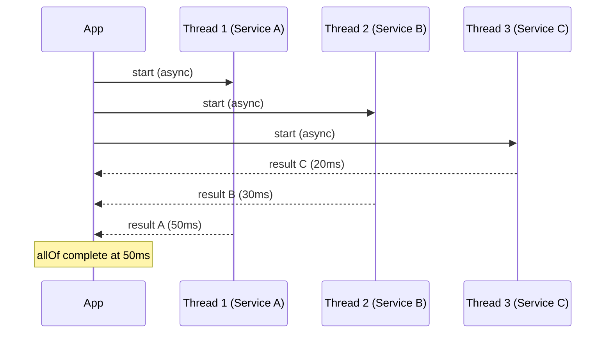
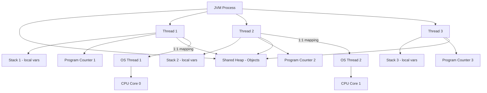
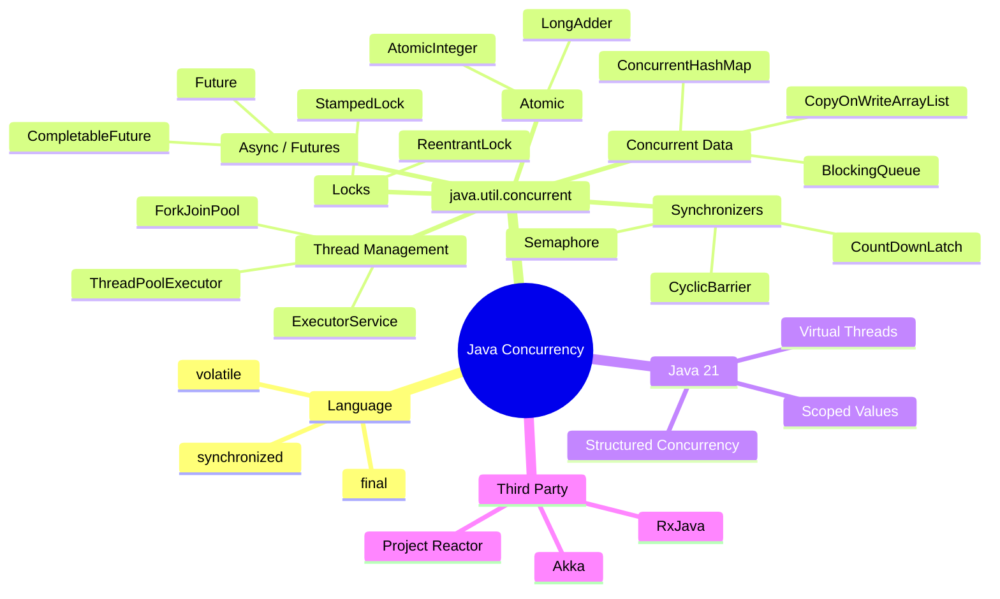

## Keywords in This File
{: .no_toc }

| # | Keyword | Weight |
|---|---|---|
| 1 | [Java Concurrency - L0 Orientation](#java-concurrency---l0-orientation) | medium |

---

# Java Concurrency - L0 Orientation

## Why Concurrency Exists

---

### 🎯 Model Answer

**30 seconds:**
> Concurrency exists because modern hardware has multiple CPU cores
> that single-threaded programs cannot use, and because programs spend
> significant time waiting for I/O - network calls, disk reads, database
> queries - during which the CPU sits completely idle. Concurrency lets
> a program do useful work while waiting and use all available cores,
> multiplying throughput and keeping systems responsive under load.

**3 minutes (Senior):**
> The fundamental problem concurrency solves is CPU underutilization.
> Consider a web server handling user requests: each request triggers
> a database query that takes 20ms to return. Without concurrency, the
> server processes requests one at a time - while waiting for the database
> the CPU does nothing. With 1000 concurrent users, you are burning 99.99%
> of your CPU time blocked on I/O.
>
> Before threads, developers used event loops - a single thread polling
> for I/O completion and dispatching callbacks. That model works but
> forces you to write code as state machines, which is mentally
> exhausting. Threads give you the intuitive sequential programming model
> while the operating system handles interleaving.
>
> Java's concurrency model maps each Java Thread to a native OS thread.
> The OS scheduler distributes threads across CPU cores using preemptive
> time-slicing. For I/O-bound workloads - web servers, microservices,
> batch jobs - concurrency produces near-linear throughput gains up to
> the I/O bottleneck. For CPU-bound workloads, you gain up to one thread
> per core before context-switching overhead dominates.
>
> The non-obvious trade-off: concurrency introduces coordination cost.
> Any shared mutable state requires synchronization, which has real
> overhead - memory barriers, cache invalidation, thread coordination.
> A poorly designed concurrent program can run slower than a
> single-threaded equivalent. Concurrency is a tool, not a free lunch.

**Framework:** WHAT → WHY → HOW → TRADE-OFF → EXAMPLE

*Adapting up:* Add: specific JVM thread-to-core mapping, happens-before
guarantees, and a production failure story involving race conditions.

*Adapting down:* WHAT + WHY only: "Multiple cores exist and programs
block on I/O - concurrency uses both."

**Blank Mind Recovery:**

**(1) Restate:** "So you are asking why concurrency exists - let me
think through what problem it solves."

**(2) First principles:** "From first principles: CPUs run at nanosecond
speed but network I/O runs at millisecond speed - a 10,000x gap. Any
program that doesn't overlap work during that gap is throwing away
99.99% of its throughput potential."

**(3) Bridge:** "This reminds me of a restaurant kitchen - a single
cook who waits for each dish to finish before starting the next one
would have terrible throughput. Concurrency is the kitchen's ability
to have multiple dishes in progress simultaneously."

---

### 📘 Concept Explanation

**What it is:**
Concurrency is the ability of a program to make progress on multiple
computations simultaneously - either by interleaving execution on a
single core or running truly in parallel across multiple cores.
Java uses the term concurrency to cover both interleaving and
true parallelism.

**The problem it solves:**
Before concurrency primitives, two problems made programs inefficient.
First, CPU waste during I/O: a thread making a database call blocks
for 10-50ms while the CPU does nothing. Second, hardware
underutilization: a machine with 16 cores runs single-threaded code
at 6.25% of its theoretical peak. Concurrency attacks both problems -
it fills I/O wait time with other work and distributes computation
across all available cores.

**How it works:**
```
Thread A: [work]--[wait I/O]--------[work]
Thread B:         [work]--[wait I/O]------[work]
Thread C:                 [work]----------[work]
CPU core: [AAAA][BBBB][CCCC][AAAA][BBBB][CCCC]
```
> **Code walkthrough:** This L0 Orientation example demonstrates a key concept in practice. **KEY MECHANISM:** the runtime executes these instructions in sequence with specific memory and execution semantics. **WHY IT MATTERS:** misapplying this pattern causes subtle bugs that only manifest under production load. **TAKEAWAY: understand the execution model before using this pattern in production code.**

The JVM creates a Java Thread backed by an OS native thread. The OS
scheduler uses preemptive time-slicing to assign threads to CPU cores.
When a thread makes a blocking I/O call, the kernel marks it as WAITING,
removes it from the run queue, and schedules another thread. When the
I/O completes, the kernel moves the thread back to RUNNABLE. Each
thread has its own stack (local variables are thread-private) but all
threads share the heap (objects are potentially shared).

**The key insight:**
Concurrency and parallelism are different. Concurrency is a program
structure - multiple tasks can be in progress at once. Parallelism is
physical execution - multiple tasks actually run at the same instant.
You can have concurrent code that doesn't run in parallel (single-core
machine) and parallel code with correctness problems (race conditions).
Most concurrency bugs are not about "too much parallelism" - they are
about incorrect reasoning about shared state.

**When to use it:**
- Web servers and APIs handling multiple simultaneous requests
- Background jobs (emails, reports) while the main thread serves requests
- Parallel data processing across large datasets
- Any workload where tasks are independent and I/O-heavy

**When NOT to use it:**
- Short-lived scripts with sequential dependencies throughout
- Simple CRUD where a connection pool already provides concurrency
- Shared state-heavy code without clear ownership boundaries
- When correctness is critical and the team lacks concurrency experience

**Alternatives:**
- Reactive programming (Project Reactor, RxJava) - event-driven
  non-blocking with backpressure; no thread-per-request overhead
- Virtual threads (Java 21 Loom) - lightweight threads that unblock
  on blocking calls; looks like threads, costs like coroutines
- Process isolation - separate JVM processes; better fault isolation
  but higher memory and IPC overhead

**First-principles derivation:**
Given (a) CPUs execute instructions in nanoseconds, (b) network I/O
takes milliseconds - a 10,000x gap - and (c) modern hardware has 8-128
cores, a single-threaded program voluntarily ignores 99.9%+ of available
capacity. The only rational response to these constraints is to schedule
multiple units of work simultaneously. Every server-side Java application
benefits from concurrency because every database query, every HTTP call,
every file read has that 10,000x gap to fill.

---

### 💻 Code Example

> **Code walkthrough:** This example shows the two ways to create threadsice. **KEY MECHANISM:** the runtime executes these instructions in sequence with specific memory and execution semantics. **WHY IT MATTERS:** misapplying this pattern causes subtle bugs that only manifest under production load. **TAKEAWAY: understand the execution model before using this pattern in production code.**
> in Java and the fundamental shared-state problem that makes concurrency
> non-trivial. The BAD example ignores the race condition on `counter`.
> The GOOD example uses `AtomicInteger` to eliminate the race. The key
> lesson: simply "using threads" is not enough - shared mutable state
> always requires explicit synchronization, or the results are
> unpredictable.

```java
// BAD: race condition on shared counter - non-deterministic result
public class UnsafeCounter {
    private int counter = 0; // shared mutable state - DANGER

    public void increment() {
        counter++; // NOT atomic: read, increment, write - 3 steps
    }

    public static void main(String[] args)
            throws InterruptedException {
        UnsafeCounter c = new UnsafeCounter();
        Thread t1 = new Thread(() -> {
            for (int i = 0; i < 10_000; i++) c.increment();
        });
        Thread t2 = new Thread(() -> {
            for (int i = 0; i < 10_000; i++) c.increment();
        });
        t1.start(); t2.start();
        t1.join(); t2.join();
        // Expected: 20000. Actual: anywhere from 10000-20000
        System.out.println(c.counter);
    }
}
```

> **Code walkthrough:** BAD pattern: This L0 Orientation example demonstrates Java API usage. **KEY MECHANISM:** the JVM compiles to bytecode that runs on the JVM; JIT compiles hot paths to native. **WHY IT MATTERS:** unchecked assumptions about thread safety cause data races under concurrent load. **WHAT BREAKS: document thread-safety guarantees on every shared mutable class.**

```java
// GOOD: atomic counter using java.util.concurrent.atomic
import java.util.concurrent.atomic.AtomicInteger;

public class SafeCounter {
    // AtomicInteger uses CAS (Compare-and-Swap) - no lock needed
    private final AtomicInteger counter = new AtomicInteger(0);

    public void increment() {
        counter.incrementAndGet(); // single atomic operation
    }

    public static void main(String[] args)
            throws InterruptedException {
        SafeCounter c = new SafeCounter();
        Thread t1 = new Thread(() -> {
            for (int i = 0; i < 10_000; i++) c.increment();
        });
        Thread t2 = new Thread(() -> {
            for (int i = 0; i < 10_000; i++) c.increment();
        });
        t1.start(); t2.start();
        t1.join(); t2.join();
        System.out.println(c.counter.get()); // Always: 20000
    }
}
```

> **Code walkthrough:** GOOD pattern: This Unknown example demonstrates Java API usage using concurrency primitive. **KEY MECHANISM:** the JVM compiles to bytecode that runs on the JVM; JIT compiles hot paths to native. **WHY IT MATTERS:** unchecked assumptions about thread safety cause data races under concurrent load. **TAKEAWAY: document thread-safety guarantees on every shared mutable class.**

---

### 🎓 Answers by Seniority

**Junior / Mid (0-5 years):**
> Concurrency exists because programs often wait for I/O - like database
> calls or HTTP requests - and modern hardware has multiple cores. Without
> concurrency, those cores sit idle while the program blocks. Java provides
> the Thread class and Runnable interface as the basic building blocks.
> The main challenge is that threads share heap memory, so you need
> synchronization whenever multiple threads access the same data.

*Push deeper:* Mention `ExecutorService` as the preferred way to manage
threads in production, and the difference between `synchronized` for
mutual exclusion and `volatile` for visibility.

---

**Senior / Staff (5+ years):**
> Concurrency solves CPU underutilization and I/O wait time. The real
> insight is that concurrency is not free - every synchronization
> primitive introduces overhead (memory barriers, cache coherence traffic,
> context switches). I have seen teams blindly add threads to slow code
> and make it slower because the bottleneck was lock contention, not
> parallelism. The decision framework I use: measure first, identify
> whether the bottleneck is CPU-bound or I/O-bound, then choose
> the right concurrency tool. For I/O-bound workloads in Java 21+,
> virtual threads are often better than platform threads because they
> are cheap enough to have one per I/O operation without a thread pool.

*Push deeper:* Discuss the Java Memory Model (JMM) happens-before
relationship, why it exists, and how it governs what a thread is
guaranteed to see after another thread's writes.

---

### ⚠️ Common Misconceptions

**Misconception 1: "More threads = more throughput."**
False above a saturation point. For CPU-bound work, optimal thread
count is roughly `(number of cores)`. Beyond that, context-switching
overhead dominates. For I/O-bound work, more threads help until the
I/O subsystem saturates or thread management overhead exceeds the gain.

**Misconception 2: "Concurrency and parallelism are the same thing."**
Concurrency is a design property - tasks can make progress without
waiting for others to complete. Parallelism is a runtime property -
tasks physically execute simultaneously. A single-core machine can
run concurrent code that is not parallel.

**Misconception 3: "Thread.sleep() yields the CPU to other threads."**
`Thread.sleep()` pauses the current thread, but the JVM scheduler
decides which other thread runs. There is no guarantee of fair
distribution. Never use `sleep()` for coordination - use the proper
synchronization primitives.

**Misconception 4: "Java's synchronized keyword is always slow."**
In low-contention scenarios, the JVM biases or eliminates the lock
entirely via lock elimination and lock coarsening optimizations. The
cost of `synchronized` is primarily in contention, not in the keyword
itself.

---

### 🚨 Failure Modes and Diagnosis

**Failure 1: Race condition - non-deterministic data corruption**
Symptom: intermittent wrong values, tests pass 95% of the time,
failures impossible to reproduce consistently.
Cause: multiple threads read-modify-write shared state without
synchronization. The `counter++` operation is three separate JVM
instructions.
Diagnosis: Run with multiple threads, compare results across runs.
Use `java.util.concurrent.atomic` classes or `synchronized` blocks.

**Failure 2: Thread starvation - some threads never run**
Symptom: the application appears hung despite CPU activity;
some tasks never complete.
Cause: high-priority threads or unfair scheduling prevent lower-priority
threads from acquiring the CPU. Common in thread pools where long tasks
consume all worker threads.
Diagnosis: take a thread dump (`jstack <pid>`), look for threads in
RUNNABLE state that never progress.

**Failure 3: Out of memory from uncapped thread creation**
Symptom: `OutOfMemoryError: unable to create new native thread`
Cause: creating one thread per incoming request without a thread pool.
Each thread consumes ~512KB-1MB of stack space. 1000 threads = ~1GB.
Fix: use `ExecutorService` with a bounded thread pool.

---

### 🎯 Interview Deep-Dive

| Question Category | Time to Answer |
|---|---|
| Definition | 30-60 seconds |
| Mechanism | 1-2 minutes |
| Comparison | 1-2 minutes |
| Scenario | 2-3 minutes |
| Debugging | 2-3 minutes |
| Trade-off | 1-2 minutes |
| Ecosystem | 1-2 minutes |

---

**Q1 (Definition): What is concurrency and why does it exist?**

A: Concurrency is the ability of a program to have multiple computations
in progress at the same time. It exists because of two hardware realities
that make sequential execution inefficient. First, modern hardware has
multiple CPU cores - a 16-core server running a single-threaded program
uses 6.25% of its capacity. Second, I/O operations are orders of magnitude
slower than CPU operations - a database query takes 10-50ms while the
CPU can execute millions of instructions per millisecond. Concurrency
fills that gap by scheduling other work while waiting.

The historical context matters: before Java's `Thread` class and the
`java.util.concurrent` package (Java 5, 2004), developers either used
raw OS threads (difficult, platform-specific) or event loops (correct
but mentally taxing to code). Java made concurrency accessible to
mainstream developers.

*What separates good from great:* Mentioning that concurrency is a
design property (tasks can make progress without waiting for each other)
while parallelism is a runtime property (tasks execute simultaneously),
and that single-core machines can run concurrent code that isn't parallel.

---

**Q2 (Mechanism): How does Java create and schedule threads?**

A: When you call `new Thread()` and `.start()`, the JVM calls the
OS to create a native thread - a first-class OS scheduling unit.
The OS scheduler manages these threads using preemptive time-slicing:
it allocates each thread a time quantum (typically 1-10ms), and when
the quantum expires, saves the thread's register state (context) and
switches to another thread.

Each thread gets its own call stack on the OS process's virtual memory.
The default stack size is 512KB-1MB (configurable with `-Xss`). All
threads share the JVM heap - this is where objects live and where
most concurrency problems originate.

The critical transition: when a thread makes a blocking I/O call (socket
read, file read), the kernel marks it BLOCKED, removes it from the CPU
run queue, and schedules another thread. When the I/O completes, the
kernel moves the thread back to RUNNABLE. This is transparent to the
Java developer - from our perspective, the code just waits for the
method to return.

Java 21 introduced virtual threads (Project Loom), which are lightweight
threads scheduled by the JVM rather than the OS. When a virtual thread
blocks on I/O, the JVM parks it on a heap structure and reuses the
underlying OS thread for another virtual thread - enabling millions of
concurrent threads with low memory overhead.

*What separates good from great:* Describing the context-switch cost
(register save/restore, CPU cache warm-up after switch) and why this
makes Java 21 virtual threads attractive for I/O-bound workloads.

---

**Q3 (Comparison): What is the difference between a process and a thread?**

A: A process is an isolated execution environment with its own virtual
address space, file descriptors, and OS resources. A thread is an
execution unit within a process that shares the process's address space
with all other threads in that process.

Key differences:
- Memory: Processes are isolated (IPC required for communication).
  Threads share heap memory (easy sharing, but race conditions possible).
- Creation cost: Forking a process is expensive (~1ms+, memory copy).
  Creating a thread is cheaper (~100-500 microseconds, shares memory).
- Failure isolation: A crashed process does not affect others.
  A thread crash with an unhandled exception can bring down the entire JVM.
- Communication: Processes use IPC (sockets, pipes, shared memory).
  Threads communicate via shared objects (fast but requires synchronization).

In Java's single-process model, we only work with threads. The trade-off:
shared memory makes concurrency fast but requires explicit coordination
for correctness. Languages like Go and Erlang encourage message-passing
(no shared state) to avoid this class of bugs.

*What separates good from great:* Connecting this to practical decisions -
why microservices prefer process isolation over thread isolation, and
the role of Java modules in providing some isolation within a JVM.

---

**Q4 (Scenario): You are building a web API that needs to call 3 external
services for each request. How does concurrency help?**

A: Without concurrency, each request calls ServiceA (50ms), waits,
then ServiceB (30ms), waits, then ServiceC (20ms) - total: 100ms per
request, and each request blocks a thread throughout.

With concurrency, I would call all three services simultaneously using
`CompletableFuture.allOf()`:

```java
CompletableFuture<String> a = CompletableFuture
    .supplyAsync(() -> callServiceA());
CompletableFuture<String> b = CompletableFuture
    .supplyAsync(() -> callServiceB());
CompletableFuture<String> c = CompletableFuture
    .supplyAsync(() -> callServiceC());
CompletableFuture.allOf(a, b, c).join();
// Total latency: max(50, 30, 20) = 50ms instead of 100ms
```

> **Code walkthrough:** This Unknown example demonstrates async pipeline construice. **KEY MECHANISM:** the runtime executes these instructions in sequence with specific memory and execution semantics. **WHY IT MATTERS:** misapplying this pattern causes subtle bugs that only manifest under production load. **TAKEAWAY: understand the execution model before using this pattern in production code.**

This cuts latency by 50% and reduces thread blocking time. In a
high-throughput system, this means your thread pool handles 2x more
requests with the same number of threads.

The important follow-up: each `supplyAsync` uses the common
`ForkJoinPool` by default. If those service calls are blocking (standard
HTTP), the ForkJoinPool will saturate. I would use a dedicated thread
pool or, in Java 21, virtual threads to ensure the async tasks don't
compete with CPU-bound computation.

*What separates good from great:* Identifying the ForkJoinPool saturation
risk and explaining how to pass a custom `Executor` to `supplyAsync`.

---

**Q5 (Debugging): Your application is slowing down under load. How would
you determine if concurrency is the problem?**

A: I approach this systematically. First, I look at CPU utilization: if
CPU is low but threads are high and response time is high, the bottleneck
is likely locking or thread starvation, not compute.

Step 1: Take a thread dump with `jstack <pid>` or `kill -3 <pid>`.
Look for threads in BLOCKED state - they are waiting for a monitor lock.
If many threads are blocked on the same lock, that's lock contention.

Step 2: Check for WAITING or TIMED_WAITING threads - they are waiting on
`Object.wait()` or `Thread.sleep()`. Excessive waiting threads indicate
producer-consumer imbalance or thread pool exhaustion.

Step 3: Use Java Flight Recorder (JFR) with the `jdk.ThreadPark` event
enabled. It shows which object threads are blocking on and for how long.

Step 4: Look at thread pool metrics (if using Spring or Micrometer) -
active threads, queue depth, rejected tasks. A saturated thread pool
with a full queue causes request rejections.

Common diagnosis: if I see "BLOCKED on java.lang.Object@..." in the
thread dump, that's a synchronized block under contention. If I see
"WAITING on java.util.concurrent.locks.ReentrantLock", that's
explicit lock contention.

*What separates good from great:* Knowing that a thread dump is a
snapshot - take 3-5 dumps 5 seconds apart. Threads that appear BLOCKED
in every snapshot are genuinely stuck, not just caught mid-transition.

---

**Q6 (Trade-off): When would a single-threaded design outperform
a multi-threaded one?**

A: Several scenarios where single-threaded wins:

1. CPU-bound with low parallelism: if the computation has sequential
   dependencies (each step depends on the previous), threads compete
   for the same data and spend time waiting for each other. The lock
   overhead exceeds the parallelism benefit.

2. In-memory operations without I/O: if your hot path is pure
   computation on thread-local data (no shared state, no I/O), a
   single-threaded loop has no synchronization overhead. Redis is
   deliberately single-threaded for its core data operations - it
   avoids locking overhead entirely, and I/O multiplexing handles
   the concurrency at the network layer.

3. Cache locality: a single thread accessing data sequentially has
   excellent CPU cache behavior. Multiple threads accessing the same
   memory cause cache invalidation traffic between cores (false sharing).
   This can reduce throughput by 10-50x for cache-sensitive operations.

4. Correctness simplicity: some domains (financial transaction
   processing, ledger updates) benefit from a single-threaded actor
   model - one thread owns all state, no synchronization needed,
   correctness is much easier to reason about.

*What separates good from great:* Mentioning false sharing by name -
two threads writing to fields that occupy the same cache line cause
the CPU to invalidate and re-fetch the cache line on every write,
even though they are not touching each other's data.

---

**Q7 (Ecosystem): What tools and libraries does the Java ecosystem
provide for concurrency?**

A: Java's concurrency ecosystem has grown significantly since Java 1.0:

Core JDK:
- `java.lang.Thread` and `Runnable` - since Java 1.0, low-level
- `synchronized`/`volatile` - language keywords for mutual exclusion
  and visibility
- `java.util.concurrent` (Java 5) - the production concurrency toolkit:
  `ExecutorService`, `Future`, `CompletableFuture`, `BlockingQueue`,
  atomic classes, concurrent collections, locks
- Virtual threads (Java 21) - Project Loom, lightweight threads
  that unblock the blocking I/O model

Reactive frameworks (non-blocking, event-driven):
- Project Reactor (`Flux`, `Mono`) - used by Spring WebFlux
- RxJava - popular in Android and backend
- Mutiny - Quarkus's reactive library

High-throughput actors:
- Akka - actor model for distributed concurrent systems
- Vert.x - event loop based, similar to Node.js

Testing:
- Awaitility - DSL for testing async code without sleep()
- jcstress - stress testing for concurrency correctness
- Thread Weaver - inject delays to expose race conditions

In practice, most Java server-side code uses `ExecutorService` for
thread management and `CompletableFuture` for async pipelines, with
reactive frameworks for high-throughput APIs.

*What separates good from great:* Distinguishing reactive (non-blocking
event loop) from thread-based concurrency (blocking with threads) and
knowing when each is the right tool.

---

### ⚖️ Comparison Table

*(Omit: L0 orientation keyword - comparison table not applicable
at foundational overview level. See L2+ files for detailed
concurrency approach comparisons.)*

---

### 🏛️ System Design

*(Omit: L0 orientation keyword - system design context not applicable.
See L4/L5 files for concurrency architecture and system design patterns.)*

---

### 📊 Diagram

```
Single-threaded (blocking):
  Thread: [Query A]---wait-->[Query B]---wait-->[Query C]
  Time:   |--50ms--|---------|--30ms--|---------|--20ms--|
  Total:  100ms

Concurrent (overlapping):
  Thread 1: [Query A]---wait-----------[result A]
  Thread 2: [Query B]---wait------[result B]
  Thread 3: [Query C]---wait--[result C]
  Time:     |---50ms (longest)---|
  Total:    50ms
```



> **Diagram walkthrough:** In the sequential model, each service call
> blocks the thread - total latency is the sum (100ms). In the concurrent
> model, all three calls start simultaneously and the application waits
> for the slowest one (50ms). This 2x latency reduction is why concurrent
> fan-out is the standard pattern for service aggregation. The critical
> insight is that threads overlap during the I/O wait period - no thread
> is doing useful computation during that time, so no CPU is "wasted"
> by the parallelism.

---
---

## The Java Thread Model

---

### 🎯 Model Answer

**30 seconds:**
> Java models concurrency using threads - lightweight execution units
> within a JVM process that share heap memory but have independent stacks.
> Each Java thread maps one-to-one to an OS native thread. The JVM
> delegates scheduling to the OS, which distributes threads across CPU
> cores using preemptive time-slicing. This model is powerful but
> requires explicit synchronization whenever threads share mutable data.

**3 minutes (Senior):**
> Java's threading model is a direct mapping to OS threads. When you
> call `thread.start()`, the JVM asks the OS to create a native thread.
> The OS scheduler then controls when that thread runs - Java has no
> direct control over scheduling decisions.
>
> Each thread has three key memory regions: the stack (local variables,
> method parameters, return addresses - private to the thread), the
> program counter (which instruction is currently executing - private),
> and access to the shared heap (all objects - requires coordination).
>
> The thread model has a known limitation: each Java thread consumes
> ~512KB-1MB of OS stack memory. A system with 10,000 concurrent users
> needs 10,000 threads = 5-10GB of memory just for thread stacks.
> This is why Java 21's virtual threads are architecturally significant -
> they are managed by the JVM, cost ~hundreds of bytes, and can number
> in the millions.
>
> The key constraint of the 1:1 thread model: blocking operations block
> the OS thread. A thread waiting on a database query holds its OS thread
> hostage for the entire wait. Virtual threads decouple this - a virtual
> thread blocking on I/O releases its carrier OS thread, which can then
> run another virtual thread.

**Framework:** WHAT → WHY → HOW → TRADE-OFF → EXAMPLE

*Adapting up:* Add JMM happens-before, how the JIT compiler can
reorder instructions (and why this matters for synchronization), and
how virtual threads change the architecture of high-throughput services.

*Adapting down:* "A thread is like a worker - they share the office
(heap) but have their own desk (stack). Multiple workers can work
simultaneously but need to coordinate when touching shared resources."

**Blank Mind Recovery:**

**(1) Restate:** "So you are asking how Java's thread model works -
let me think through the key components."

**(2) First principles:** "From first principles, a program needs to
track: what code is executing (program counter), what variables are in
scope (stack), and what data is shared between executions (heap). A
thread is the unit that has its own program counter and stack."

**(3) Bridge:** "This reminds me of tabs in a browser - each tab is
a separate execution context with its own JavaScript call stack, but
they all share browser memory and DOM. Java threads work the same way."

---

### 📘 Concept Explanation

**What it is:**
A thread in Java is an independent sequence of execution within a single
JVM process. Multiple threads share the process's heap memory but each
has its own stack, program counter, and register state. This is the
foundation of all Java concurrency.

**The problem it solves:**
Without threads, a JVM process executes instructions sequentially -
one at a time. Web servers, database connection pools, and background
job processors all require handling multiple tasks simultaneously.
Threads provide the OS-level mechanism for this multiplexing.

**How it works:**
```plaintext
JVM Process
  +------ Shared Heap (all objects) --------+
  |  Thread 1    Thread 2    Thread 3        |
  |  [Stack]     [Stack]     [Stack]          |
  |  [PC]        [PC]        [PC]             |
  +------------------------------------------+
         |              |              |
    OS Thread 1    OS Thread 2    OS Thread 3
         |              |              |
    CPU Core 0     CPU Core 1    CPU Core 0
```

> **Code walkthrough:** This Unknown example demonstrates a key concept in practice. **KEY MECHANISM:** the runtime executes these instructions in sequence with specific memory and execution semantics. **WHY IT MATTERS:** misapplying this pattern causes subtle bugs that only manifest under production load. **TAKEAWAY: understand the execution model before using this pattern in production code.**

Thread creation in Java:
1. `new Thread(runnable).start()` - JVM calls `pthread_create()` (Linux)
2. OS allocates stack memory and creates a kernel thread
3. OS scheduler adds thread to run queue
4. On `start()`, JVM calls the thread's `run()` method

Thread states (from `Thread.State` enum):
- `NEW` - created but not started
- `RUNNABLE` - executing or ready to execute
- `BLOCKED` - waiting to acquire a monitor lock
- `WAITING` - indefinitely waiting (Object.wait(), join())
- `TIMED_WAITING` - waiting with timeout (sleep(), wait(timeout))
- `TERMINATED` - execution complete

**The key insight:**
The 1:1 mapping between Java threads and OS threads is both a strength
and a limitation. It means Java threads get real CPU time and blocking
I/O is transparent, but it also means thread creation is expensive and
you cannot have millions of threads. Java 21 virtual threads break this
constraint by multiplexing millions of virtual threads onto a small
pool of OS carrier threads.

**When to use it:**
- Anywhere Java concurrency is needed - threads are the foundation
- Explicitly when you need fine-grained control over thread behavior
  (thread name, priority, uncaught exception handler)
- When you need to block for I/O without yielding (though virtual
  threads are preferred in Java 21+)

**When NOT to use it:**
- Don't create raw `Thread` objects for application tasks - use
  `ExecutorService` which manages lifecycle, pooling, and errors
- Don't use raw threads for parallelizing computations - use
  `ForkJoinPool` or parallel streams

**Alternatives:**
- Virtual threads (`Thread.ofVirtual()`) - Java 21+, lightweight
  threads suitable for high-concurrency I/O workloads
- `ExecutorService` - manages a pool of threads with lifecycle control
- Reactive streams - no threads-per-request; event-driven callback model

**First-principles derivation:**
An OS process is an isolated container: memory, file handles, OS
resources. To have multiple execution paths in one process without
creating separate processes (expensive, isolated), you need a lighter
unit of execution that shares the process's memory but has its own
instruction pointer. That is precisely what a thread is - a shared-memory
concurrent execution unit.

---

### 💻 Code Example

> **Code walkthrough:** The BAD example shows the pitfall of extendingice. **KEY MECHANISM:** the runtime executes these instructions in sequence with specific memory and execution semantics. **WHY IT MATTERS:** misapplying this pattern causes subtle bugs that only manifest under production load. **TAKEAWAY: understand the execution model before using this pattern in production code.**
> Thread directly - it makes the class non-reusable and ties business
> logic to infrastructure. The GOOD example separates concerns: Runnable
> holds the logic, Thread holds the execution context. The production
> example shows `ExecutorService` - the real-world way to manage threads
> that handles pooling, lifecycle, and error propagation correctly.

```java
// BAD: extending Thread couples logic to thread lifecycle
public class BadWorker extends Thread {
    @Override
    public void run() {
        // Business logic inside Thread subclass
        // Cannot reuse this logic in an Executor or CompletableFuture
        processData();
    }
}
```

> **Code walkthrough:** BAD pattern: This Unknown example demonstrates async pipeline construction using CompletableFuture. **KEY MECHANISM:** the JVM schedules continuations via ForkJoinPool when each stage completes. **WHY IT MATTERS:** callback chains execute on wrong threads causing ClassCastException in Spring context. **WHAT BREAKS: always specify executor on thenApplyAsync to control thread context.**

```java
// GOOD: implement Runnable to separate logic from execution
public class GoodWorker implements Runnable {
    private final String taskId;

    public GoodWorker(String taskId) {
        this.taskId = taskId;
    }

    @Override
    public void run() {
        System.out.println(Thread.currentThread().getName()
            + " processing " + taskId);
        processData(taskId);
    }
}

// Usage - still using raw Thread (acceptable for demos)
Thread t = new Thread(new GoodWorker("task-1"));
t.setName("worker-1");         // name shows in thread dumps
t.setDaemon(false);            // false = JVM waits for this thread
t.start();
t.join();                      // wait for completion
```

> **Code walkthrough:** GOOD pattern: This Unknown example demonstrates Java API usage. **KEY MECHANISM:** the JVM compiles to bytecode that runs on the JVM; JIT compiles hot paths to native. **WHY IT MATTERS:** unchecked assumptions about thread safety cause data races under concurrent load. **TAKEAWAY: document thread-safety guarantees on every shared mutable class.**

```java
// PRODUCTION: use ExecutorService - manages pooling and lifecycle
import java.util.concurrent.*;

ExecutorService pool = Executors.newFixedThreadPool(
    Runtime.getRuntime().availableProcessors()
);
try {
    Future<String> result = pool.submit(() -> {
        return expensiveComputation();
    });
    String value = result.get(30, TimeUnit.SECONDS); // timeout
} catch (TimeoutException e) {
    // Handle timeout - task may still be running
} finally {
    pool.shutdown();
    pool.awaitTermination(60, TimeUnit.SECONDS);
}
```

> **Code walkthrough:** This Unknown example demonstrates thread pool management using thread pool. **KEY MECHANISM:** the pool maintains a work queue; submitted tasks block until a thread is free. **WHY IT MATTERS:** unconfigured pool sizes exhaust threads under load or waste memory at rest. **TAKEAWAY: always name threads and bound queue size to detect saturation.**

---

### 🎓 Answers by Seniority

**Junior / Mid (0-5 years):**
> A Java thread is an independent unit of execution inside the JVM.
> You create one by either extending Thread and overriding run(), or
> implementing Runnable and passing it to a Thread. Calling start()
> makes it run concurrently - calling run() directly just runs it
> on the current thread. Each thread has its own stack but shares the
> heap with all other threads, which is why you need synchronization
> for shared data.

*Push deeper:* Explain thread states - RUNNABLE, BLOCKED, WAITING,
TIMED_WAITING - and what transitions cause each state change.

---

**Senior / Staff (5+ years):**
> Java threads are 1:1 mapped to OS threads. The OS scheduler manages
> them using preemptive time-slicing - Java cannot control when the
> scheduler preempts a thread or which core it runs on. This matters for
> performance: context switches are ~1-10 microseconds, and cache misses
> after a context switch can double that cost. In high-throughput services,
> I would use Java 21 virtual threads for I/O-heavy workloads - they
> allow one virtual thread per request without the memory and scheduling
> overhead of OS threads. For CPU-bound work, I still use platform threads
> sized to the core count.

*Push deeper:* Discuss how the JVM maps `Thread.setPriority()` to OS
thread priorities (the mapping is platform-specific and often ignored
by the scheduler), and why pinning virtual threads to carrier threads
can happen with native synchronized blocks.

---

### ⚠️ Common Misconceptions

**Misconception 1: "thread.run() starts a new thread."**
Calling `run()` directly executes the runnable on the calling thread
sequentially. Only `start()` creates a new OS thread. This is one of
the most common beginner mistakes.

**Misconception 2: "Daemon threads are low-priority threads."**
Daemon vs non-daemon is about JVM shutdown behavior, not priority.
The JVM exits when all non-daemon threads have finished. Daemon threads
are terminated abruptly when the JVM exits - regardless of what they
were doing. Use daemon threads for background cleanup tasks, not for
work that must complete.

**Misconception 3: "Thread.yield() guarantees another thread runs."**
`yield()` is a hint to the scheduler - it can be ignored. Never use
`yield()` for correctness guarantees. Use proper synchronization.

**Misconception 4: "Thread priority is reliable across platforms."**
Java thread priorities (1-10) map to OS-level priorities, but the
mapping varies by OS and JVM implementation. On Linux with the default
scheduler, Java thread priorities are often ignored. Never rely on
priority for correctness - only use it as a performance hint.

---

### 🚨 Failure Modes and Diagnosis

**Failure 1: Calling run() instead of start()**
Symptom: code appears to work but is sequential, not concurrent.
Performance is single-threaded. No concurrency errors appear.
Diagnosis: check if you called `thread.run()` instead of
`thread.start()`. The thread dump will show one thread instead of many.

**Failure 2: Thread leaks from unmanaged thread creation**
Symptom: JVM memory grows steadily over time. OOM with
"unable to create new native thread". High thread count in monitoring.
Cause: creating new threads per request without pooling or cleanup.
Diagnosis: `jstack <pid>` to count threads. Add thread count metrics.
Fix: use `ExecutorService` with bounded thread pools.

**Failure 3: Not joining threads and missing results**
Symptom: program exits before background threads finish, or produces
empty results from threads that hadn't completed yet.
Cause: forgetting to call `thread.join()` or `future.get()`.
Diagnosis: add logging to thread completion; check if results are
populated before reading them.

---

### 🎯 Interview Deep-Dive

| Question Category | Time to Answer |
|---|---|
| Definition | 30-60 seconds |
| Mechanism | 1-2 minutes |
| Comparison | 1-2 minutes |
| Scenario | 2-3 minutes |
| Debugging | 2-3 minutes |
| Trade-off | 1-2 minutes |
| Advanced | 2-3 minutes |

---

**Q1 (Definition): What is a Java thread?**

A: A thread is the smallest unit of execution within a JVM process.
It consists of a program counter (which instruction is currently
executing), a call stack (local variables and method frames), and
access to the shared heap. Multiple threads in the same JVM process
share heap memory, which is the root cause of most concurrency challenges.

The JVM backs each Java thread with an OS native thread (on current
versions of HotSpot), so the OS scheduler controls when threads run.
Java 21 introduced virtual threads - lightweight threads managed
by the JVM scheduler, not the OS - which can exist in millions
with low memory overhead.

*What separates good from great:* Mentioning that the Thread object
in Java is a user-space wrapper around an OS thread, and distinguishing
this from Java 21's virtual threads which are a fundamentally different
mechanism.

---

**Q2 (Mechanism): What happens between thread.start() and thread.run()?**

A: Calling `thread.start()` triggers this sequence:
1. JVM calls the native OS API to create a kernel thread
   (pthread_create on Linux, CreateThread on Windows)
2. The OS allocates stack memory for the thread (default 512KB-1MB,
   configurable with `-Xss`)
3. The OS adds the new thread to the scheduler's run queue
4. At some point (non-deterministic), the OS scheduler assigns the
   thread to a CPU core
5. The thread begins executing at `Thread.run()`, which calls
   `runnable.run()`

The non-obvious detail: `start()` returns immediately on the calling
thread. The new thread is ready to run but may not start executing for
several milliseconds depending on OS scheduling. This is why you cannot
assume a thread has started its work immediately after `start()` returns.

*What separates good from great:* Explaining that calling `run()` directly
instead of `start()` executes the runnable on the calling thread with no
new OS thread created - a common mistake that produces sequential
rather than concurrent execution.

---

**Q3 (Comparison): When would you use a raw Thread vs ExecutorService?**

A: Raw Thread is appropriate when:
- You need direct control over thread properties (name, daemon status,
  uncaught exception handler, stack size)
- Single long-lived background thread with a defined lifecycle
- Educational code or simple scripts

ExecutorService is almost always better for production:
- Thread pooling: reusing threads avoids creation/destruction overhead
- Lifecycle management: orderly shutdown with `shutdown()` and
  `awaitTermination()`
- Work queuing: when all threads are busy, tasks queue rather than
  failing
- Future support: `submit()` returns a `Future` for result retrieval
  and exception handling
- Monitoring: thread pool metrics (active threads, queue depth) are
  easily observable

The rule I follow: if the code is running in a production service,
use `ExecutorService`. If I am writing a one-time script or demo,
raw Thread is fine. I have seen production outages caused by
unlimited thread creation - a single code path creating one thread
per incoming request, with no pool cap, exhausting OS thread limits
under traffic spikes.

*What separates good from great:* Knowing that `Executors.newFixedThreadPool(n)`
uses a `LinkedBlockingQueue` with no capacity bound, which can cause
OOM under sustained high load. In production, use `ThreadPoolExecutor`
with explicit queue capacity and a rejection handler.

---

**Q4 (Scenario): How would you implement a background health check
that runs every 30 seconds?**

A: For a periodic background task, I would use `ScheduledExecutorService`:

```java
ScheduledExecutorService scheduler =
    Executors.newSingleThreadScheduledExecutor(r -> {
        Thread t = new Thread(r, "health-check-thread");
        t.setDaemon(true); // JVM can exit without waiting for it
        return t;
    });

scheduler.scheduleAtFixedRate(() -> {
    try {
        checkHealth();
    } catch (Exception e) {
        // Must catch all exceptions - an uncaught exception
        // silently stops future executions
        log.error("Health check failed", e);
    }
}, 0, 30, TimeUnit.SECONDS);
```

> **Code walkthrough:** This Unknown example demonstrates thread pool managementice. **KEY MECHANISM:** the runtime executes these instructions in sequence with specific memory and execution semantics. **WHY IT MATTERS:** misapplying this pattern causes subtle bugs that only manifest under production load. **TAKEAWAY: understand the execution model before using this pattern in production code.**

The critical detail: `scheduleAtFixedRate` silently stops if the
task throws an unchecked exception. You must wrap the task body in
try-catch to prevent this. I have debugged "health checks stopped
working" issues caused by a NullPointerException in the task that
suppressed all future executions.

Also: the thread is set as daemon so the JVM can exit during shutdown
without waiting for the health check to complete. For critical cleanup
tasks, you would use a non-daemon thread and explicitly shut down the
executor during application shutdown.

*What separates good from great:* The exception suppression behavior
of ScheduledExecutorService is a well-known trap. Mentioning it shows
production experience.

---

**Q5 (Debugging): A thread is printing "done" before the task is
complete. How would you debug this?**

A: This is almost always a visibility problem or a missing join/get.

First check: is the task result being read on the same thread that
set it? If the producer thread writes a result and a consumer thread
reads it without synchronization, the consumer may see stale data.
Java's memory model does not guarantee visibility across threads
without a happens-before relationship.

Second check: is `thread.join()` (or `future.get()`) being called
before reading the result? Without join, the calling thread may
execute past the read before the worker thread has finished writing.

Diagnosis approach:
1. Add `System.err.println` with thread names at key checkpoints
2. Run with `-ea` (assertions enabled) and add assertion on final state
3. Run with jcstress (if this is a reproducibility issue) to
   stress-test thread interleavings
4. Use `volatile` on the result field, or better, use
   `CompletableFuture` which handles visibility correctly

The root pattern: printing "done" is probably on the main thread,
and the check is reading a field that was written by a worker thread
without a visibility guarantee. Adding `volatile` or wrapping in
`CompletableFuture.get()` fixes it.

*What separates good from great:* Explaining the Java Memory Model
visibility rule: without a happens-before relationship (via
synchronized, volatile, or concurrent API), writes in one thread
are not guaranteed to be visible in another.

---

**Q6 (Trade-off): What are the costs of creating too many threads?**

A: Three categories of cost:

Memory: each OS thread allocates a fixed stack frame - default 512KB
in HotSpot. 1,000 threads = 512MB just for stacks. 10,000 threads =
5GB. This is the most concrete limit - you hit OOM before running out
of CPU.

Scheduling overhead: the OS scheduler must decide which thread runs
at each time slice. With hundreds of threads all wanting CPU time,
context-switching overhead increases. Each context switch takes ~1-5
microseconds and pollutes CPU caches, reducing effective throughput.
Beyond ~(2 * core count) threads for CPU-bound work, throughput
saturates and latency increases.

Application complexity: more threads means more potential for race
conditions, deadlocks, and starvation. The debugging surface area
grows combinatorially with thread count - any pair of threads can
interact, and thread interleavings are non-deterministic.

The practical guide: for CPU-bound work, use `Runtime.getRuntime()
.availableProcessors()` threads. For I/O-bound work, use
`availableProcessors() * (1 + wait_time / compute_time)` - the
"Little's Law" calculation. In Java 21, use virtual threads for
I/O-bound work and avoid manual sizing entirely.

*What separates good from great:* Knowing the default Xss is
configurable and that reducing it to 256KB doubles the thread
count you can create before OOM - a technique used by some
high-throughput servers.

---

**Q7 (Advanced): How do virtual threads in Java 21 change the
threading model?**

A: Virtual threads (Project Loom) decouple the 1:1 mapping between
Java threads and OS threads. Instead, a small pool of OS "carrier"
threads runs many virtual threads, multiplexed by the JVM scheduler.

The key behavior change: when a virtual thread blocks on I/O
(socket read, database call), the JVM scheduler detects the block,
"unmounts" the virtual thread from its carrier OS thread, and mounts
a different virtual thread to run. The carrier OS thread is never
idle while virtual threads have work to do.

This means:
- Thread creation cost drops from ~1ms to ~microseconds
- Memory per thread drops from ~512KB to ~hundreds of bytes
- You can have millions of virtual threads with reasonable memory
- No more thread pool sizing calculations for I/O-bound code

Code change: `Thread.ofVirtual().start(runnable)` or pass a
virtual-thread executor to `ExecutorService`. Blocking code that
previously required complex async rewrites can be written as
simple sequential code.

Caveats: virtual threads are not better for CPU-bound work (they
still run on OS threads). They can "pin" to carrier threads when
executing synchronized blocks with native code inside, which
reduces the multiplexing benefit. And thread-local variables become
more complex because millions of virtual threads means millions
of thread-local values.

*What separates good from great:* Understanding pinning - the scenario
where `synchronized` around blocking code prevents the virtual thread
from unmounting, eliminating the benefit of virtual threads. The fix
is to replace `synchronized` with `ReentrantLock` in those critical
sections.

---

### ⚖️ Comparison Table

*(Omit: L0 foundational concept - comparison table not applicable.
See L2+ files for thread vs ExecutorService vs virtual thread
comparison tables.)*

---

### 🏛️ System Design

*(Omit: L0 foundational concept - system design context not applicable.
See L5 Architecture file for concurrency architecture patterns.)*

---

### 📊 Diagram

```
Java Thread Memory Model:

JVM Process Memory
+-----------------------------------------------+
| Heap (SHARED - all threads access)             |
|  [Object A] [Object B] [Object C]...           |
+-----------------------------------------------+
|  Thread 1       Thread 2       Thread 3        |
|  +----------+   +----------+   +----------+   |
|  | Stack    |   | Stack    |   | Stack    |   |
|  | [frame3] |   | [frame1] |   | [frame2] |   |
|  | [frame2] |   +----------+   +----------+   |
|  | [frame1] |   | PC: 0x42 |   | PC: 0x7A |   |
|  +----------+   +----------+   +----------+   |
|  | PC: 0x1F |                                  |
+-----------------------------------------------+
       |                |                |
  OS Thread 1      OS Thread 2      OS Thread 3
       |                |
  CPU Core 0        CPU Core 1
```



> **Diagram walkthrough:** Each Java thread owns its stack (local
> variables, method call frames) and program counter (current
> instruction pointer) - these are thread-private and never shared.
> The heap is fully shared: any thread can read or write any object.
> This shared heap is the source of all Java concurrency challenges.
> Platform threads map 1:1 to OS threads; the OS scheduler assigns
> OS threads to physical CPU cores. Virtual threads (Java 21) replace
> the 1:1 mapping with M:N - many virtual threads per OS thread.

---
---

## Java Concurrency Ecosystem Overview

---

### 🎯 Model Answer

**30 seconds:**
> Java's concurrency ecosystem evolved from raw threads in Java 1.0 to
> the comprehensive `java.util.concurrent` package in Java 5, which added
> thread pools, concurrent collections, atomic variables, and explicit
> locks. Java 8 added `CompletableFuture` for async pipelines. Java 21
> delivered virtual threads via Project Loom, fundamentally changing
> the scalability ceiling for I/O-bound Java applications.

**3 minutes (Senior):**
> The Java concurrency ecosystem has three distinct eras, each solving
> a different class of problem.
>
> Era 1 (Java 1-4): raw `Thread` and `synchronized`. Sufficient for
> basic concurrent programming but no high-level abstractions.
> Creating one thread per task was the only pattern, which didn't scale.
>
> Era 2 (Java 5, 2004): Doug Lea's `java.util.concurrent` package.
> This was a watershed release: `ExecutorService` for thread pooling,
> `ConcurrentHashMap` for thread-safe maps, `BlockingQueue` for
> producer-consumer patterns, `AtomicInteger` and friends for lock-free
> counters, `ReentrantLock` for explicit locking with timeouts and
> try-lock. This package is the foundation of production Java concurrency.
>
> Era 3 (Java 8+): `CompletableFuture` for composable async pipelines,
> parallel streams for data-parallel computation, and eventually (Java
> 21) virtual threads that allow writing simple blocking code that scales
> like async code.
>
> The reactive ecosystem (Project Reactor, RxJava) exists alongside
> these because for truly high-throughput event-driven systems, the
> non-blocking model still offers advantages even with virtual threads.
>
> The practical hierarchy I use: for new code in Java 21+, use virtual
> threads for I/O and parallel streams for CPU parallelism. For Java
> 8-17, use `CompletableFuture` for async and `ExecutorService` for
> I/O. Avoid raw `Thread` in production.

**Framework:** WHAT → WHY → HOW → TRADE-OFF → EXAMPLE

*Adapting up:* Add discussion of virtual thread pinning, structured
concurrency (JEP 428/453), and scoped values (replacing ThreadLocal).

*Adapting down:* The three main things to know: Thread/ExecutorService
for basic concurrency, CompletableFuture for async, virtual threads in
Java 21 for high-throughput I/O.

**Blank Mind Recovery:**

**(1) Restate:** "So you want an overview of Java's concurrency
ecosystem - let me map the key components."

**(2) First principles:** "From first principles: you need a way to
create concurrent work (threads/executors), coordinate it (locks,
barriers), safely share data (concurrent collections, atomics), and
compose async operations (futures). The Java ecosystem has a library
for each of these."

**(3) Bridge:** "This is similar to how a kitchen is organized -
you have the raw tools (knives = raw Thread), prep stations
(Executors = thread pools), serving coordination (BlockingQueue
= producer-consumer), and order tracking (Future = async results)."

---

### 📘 Concept Explanation

**What it is:**
The Java concurrency ecosystem is the set of language features,
JVM primitives, and standard library classes that enable safe,
efficient multi-threaded programming. It spans from language keywords
(`synchronized`, `volatile`) through the `java.util.concurrent`
package to modern reactive frameworks.

**The problem it solves:**
Raw threads are powerful but dangerous: no pooling, no cancellation,
no timeout handling, no safe data structures. The ecosystem provides
higher-level abstractions that make concurrent programming correct
by default, with production-grade lifecycle and error handling.

**How it works:**
The ecosystem layers from low-level to high-level:

```plaintext
Level 1 (Language):
  synchronized, volatile, final

Level 2 (JDK Core - java.util.concurrent):
  Thread primitives: Executor, ExecutorService, ScheduledExecutorService
  Futures: Future, CompletableFuture
  Concurrent data: ConcurrentHashMap, CopyOnWriteArrayList,
                   BlockingQueue, ConcurrentLinkedQueue
  Synchronizers: CountDownLatch, CyclicBarrier, Semaphore, Phaser
  Atomic: AtomicInteger, AtomicReference, LongAdder
  Locks: ReentrantLock, ReadWriteLock, StampedLock

Level 3 (JDK Modern):
  Virtual threads (Java 21): Thread.ofVirtual()
  Structured concurrency (preview): StructuredTaskScope
  Scoped values (preview): ScopedValue

Level 4 (Third-party):
  Reactive: Project Reactor, RxJava, Mutiny
  Actors: Akka, Eclipse Vert.x
  Testing: jcstress, Awaitility
```

> **Code walkthrough:** This Unknown example demonstrates a key concept in practice using CompletableFuture. **KEY MECHANISM:** the runtime executes these instructions in sequence with specific memory and execution semantics. **WHY IT MATTERS:** misapplying this pattern causes subtle bugs that only manifest under production load. **TAKEAWAY: understand the execution model before using this pattern in production code.**

**The key insight:**
The concurrent collections (`ConcurrentHashMap`, `BlockingQueue`) are
not just synchronized wrappers - they are purpose-built concurrent
data structures with reduced lock contention. `ConcurrentHashMap` uses
segment-level locking (Java 7) / CAS-based bucket locking (Java 8+),
allowing multiple threads to write to different segments simultaneously.
This is fundamentally different from `Collections.synchronizedMap()`
which locks the entire map on every operation.

**When to use it:**
Match the tool to the problem:
- Thread pool management: `ExecutorService`
- Async pipelines: `CompletableFuture`
- Producer-consumer: `BlockingQueue`
- Thread-safe counter: `AtomicLong` or `LongAdder`
- High-throughput I/O (Java 21): virtual threads
- Event-driven high-throughput: reactive frameworks

**When NOT to use it:**
- Don't use `Vector` or `Hashtable` - they are synchronized
  but not designed for concurrent access patterns
- Don't use `Collections.synchronizedList()` for iteration -
  you still need external synchronization during traversal
- Don't use `CopyOnWriteArrayList` for write-heavy workloads -
  each write copies the entire array

**Alternatives:**
- Kotlin coroutines - structured concurrency built into the language
- Go goroutines - cheap user-space threads + channels for communication
- Erlang/Elixir - actor model with process isolation by default

**First-principles derivation:**
Concurrent programming requires four capabilities: (1) starting
concurrent work, (2) coordinating start/end of multiple tasks,
(3) safely sharing data, and (4) communicating results. Every class
in `java.util.concurrent` addresses one of these four needs. The
ecosystem grew by identifying which raw Thread + synchronized solutions
were too low-level, error-prone, or unscalable, then providing
type-safe, well-tested higher-level abstractions.

---

### 💻 Code Example

> **Code walkthrough:** This example shows the progression from Era 1ice. **KEY MECHANISM:** the runtime executes these instructions in sequence with specific memory and execution semantics. **WHY IT MATTERS:** misapplying this pattern causes subtle bugs that only manifest under production load. **TAKEAWAY: understand the execution model before using this pattern in production code.**
> (raw threads with race conditions) to Era 2 (ExecutorService with
> futures and concurrent collections) to Era 3 (CompletableFuture
> pipelines). Each version solves the same problem - processing a
> list of URLs - with increasing safety and expressiveness. The key
> lesson: using the right abstraction level eliminates entire categories
> of bugs (thread leaks, race conditions, lost exceptions).

```java
// ERA 1 (Java 1-4): Raw threads - error-prone
List<String> results = new ArrayList<>(); // NOT thread-safe!
List<Thread> threads = new ArrayList<>();
for (String url : urls) {
    Thread t = new Thread(() -> {
        results.add(fetch(url)); // RACE CONDITION - ArrayList
    });
    threads.add(t);
    t.start();
}
for (Thread t : threads) t.join(); // manual lifecycle
// results may be corrupt - ArrayList not thread-safe
```

> **Code walkthrough:** This Unknown example demonstrates Java API usage. **KEY MECHANISM:** the JVM compiles to bytecode that runs on the JVM; JIT compiles hot paths to native. **WHY IT MATTERS:** unchecked assumptions about thread safety cause data races under concurrent load. **TAKEAWAY: document thread-safety guarantees on every shared mutable class.**

```java
// ERA 2 (Java 5+): ExecutorService with concurrent collection
List<String> results =
    Collections.synchronizedList(new ArrayList<>());
ExecutorService exec =
    Executors.newFixedThreadPool(10);
List<Future<?>> futures = new ArrayList<>();

for (String url : urls) {
    futures.add(exec.submit(() -> results.add(fetch(url))));
}
for (Future<?> f : futures) f.get(); // propagates exceptions
exec.shutdown();
```

> **Code walkthrough:** This Unknown example demonstrates mutex locking using thread pool. **KEY MECHANISM:** the JVM acquires the intrinsic lock on the object monitor before entering the block. **WHY IT MATTERS:** a thread holding the lock blocks all other threads - a bottleneck at scale. **TAKEAWAY: prefer ReentrantLock or ConcurrentHashMap over synchronized for hot paths.**

```java
// ERA 3 (Java 8+): CompletableFuture pipeline - idiomatic
ExecutorService exec = Executors.newFixedThreadPool(10);

List<CompletableFuture<String>> futures = urls.stream()
    .map(url -> CompletableFuture
        .supplyAsync(() -> fetch(url), exec)
        .thenApply(content -> parse(content))
        .exceptionally(ex -> "error: " + ex.getMessage()))
    .collect(Collectors.toList());

// Wait for all and collect results
List<String> results = futures.stream()
    .map(CompletableFuture::join)
    .collect(Collectors.toList());
exec.shutdown();
```

> **Code walkthrough:** This Unknown example demonstrates async pipeline construction using CompletableFuture. **KEY MECHANISM:** the JVM schedules continuations via ForkJoinPool when each stage completes. **WHY IT MATTERS:** callback chains execute on wrong threads causing ClassCastException in Spring context. **TAKEAWAY: always specify executor on thenApplyAsync to control thread context.**

---

### 🎓 Answers by Seniority

**Junior / Mid (0-5 years):**
> Java's main concurrency tools are: Thread and ExecutorService for
> managing concurrent work, synchronized and volatile keywords for
> basic synchronization, CompletableFuture for async programming, and
> ConcurrentHashMap and BlockingQueue for thread-safe data sharing.
> Java 21 added virtual threads which make concurrent I/O much easier.
> The general rule: use ExecutorService instead of raw Thread, use
> concurrent collections instead of synchronized wrappers, and use
> CompletableFuture instead of manually managing futures.

*Push deeper:* Describe the difference between `ConcurrentHashMap`
and `Collections.synchronizedMap()` in terms of lock granularity
and iteration behavior.

---

**Senior / Staff (5+ years):**
> I evaluate Java concurrency tools by three axes: the level of
> abstraction (raw thread vs executor vs reactive), the data-sharing
> model (shared mutable state vs message passing vs immutability), and
> the target workload (CPU-bound vs I/O-bound). For production services
> in Java 17+, my default stack is: ExecutorService with bounded thread
> pool for CPU work, CompletableFuture for async fan-out, BlockingQueue
> for producer-consumer, and in Java 21 virtual threads for anything
> that blocks on I/O. I avoid reactive frameworks unless the team has
> the expertise and the throughput requirements genuinely demand them -
> reactive code is significantly harder to debug and maintain.

*Push deeper:* Discuss structured concurrency (JEP 453) - the idea
that concurrent tasks should have the same lifecycle scope as their
calling code, preventing thread leaks and improving observability.

---

### ⚠️ Common Misconceptions

**Misconception 1: "java.util.concurrent replaced synchronized."**
No - synchronized is still used and correct for many use cases.
`java.util.concurrent` adds higher-level abstractions for cases where
synchronized is too low-level or too coarse-grained.

**Misconception 2: "Concurrent collections are always safe for
all operations."**
Atomic read and atomic write are safe. But compound operations
(check-then-act) are not automatically safe. Example:
`if (!map.containsKey(k)) map.put(k, v)` is a race condition
even with `ConcurrentHashMap`. Use `map.putIfAbsent()` instead.

**Misconception 3: "Virtual threads replace all thread pools."**
Virtual threads replace thread pools for I/O-bound work. For CPU-bound
work, you still need a pool sized to core count. Virtual threads do not
execute on the same OS thread in parallel - they still need OS threads.

**Misconception 4: "Reactive programming is always faster than
thread-based concurrency."**
With virtual threads in Java 21, blocking code can achieve equivalent
or better throughput than reactive code for most I/O-bound workloads,
with dramatically simpler code. Reactive still wins for extremely
high-throughput event-driven systems, but the performance gap has
narrowed.

---

### 🚨 Failure Modes and Diagnosis

**Failure 1: Using wrong executor type for workload**
Symptom: CPU-bound tasks run in `CachedThreadPool`, causing thread
explosion under load. Or I/O tasks run in `FixedThreadPool` sized to
core count, causing unnecessary queuing.
Fix: match executor type to workload. CPU-bound: fixed pool sized
to core count. I/O-bound: larger pool, cached pool, or virtual threads.

**Failure 2: Silent exception suppression in futures**
Symptom: tasks submitted to ExecutorService silently fail with no
error logged. Background processing appears to work but produces
no output.
Cause: `ExecutorService.submit()` wraps exceptions in `Future` - if
you never call `future.get()`, exceptions are silently discarded.
Fix: always call `future.get()` or add an uncaught exception handler.
With `CompletableFuture`, always chain `.exceptionally()` or
`.whenComplete()`.

**Failure 3: ConcurrentModificationException in "concurrent" code**
Symptom: `ConcurrentModificationException` thrown during iteration
over a `ConcurrentHashMap`.
Cause: using `for (Entry e : map.entrySet())` while another thread
is modifying the map. `ConcurrentHashMap` iterators provide
weakly-consistent semantics but throw `ConcurrentModificationException`
only from structural modifications during iteration in some paths.
Fix: use `map.forEach()` or collect keys first, then process.

---

### 🎯 Interview Deep-Dive

| Question Category | Time to Answer |
|---|---|
| Definition | 30-60 seconds |
| Mechanism | 1-2 minutes |
| Comparison | 1-2 minutes |
| Scenario | 2-3 minutes |
| Debugging | 2-3 minutes |
| Evolution | 1-2 minutes |
| Trade-off | 1-2 minutes |

---

**Q1 (Definition): Name the major packages and classes in Java's
concurrency toolkit.**

A: Java's concurrency toolkit is organized in `java.util.concurrent`
and its sub-packages. The major components:

Thread management: `Executor`, `ExecutorService`, `ScheduledExecutorService`,
`ThreadPoolExecutor`, `ForkJoinPool`. These manage thread lifecycle,
pooling, and work scheduling.

Futures and async: `Future`, `CompletableFuture`. Future represents a
pending result. CompletableFuture (Java 8+) adds chainable async
transformations, exception handling, and combining multiple futures.

Concurrent data structures: `ConcurrentHashMap`, `CopyOnWriteArrayList`,
`BlockingQueue` (and implementations: `LinkedBlockingQueue`,
`ArrayBlockingQueue`, `SynchronousQueue`), `ConcurrentLinkedQueue`.

Synchronizers: `CountDownLatch` (one-time gate), `CyclicBarrier`
(reusable rendezvous), `Semaphore` (permit management), `Phaser`
(flexible barrier with dynamic participant count).

Atomic variables: `AtomicInteger`, `AtomicLong`, `AtomicReference`,
`AtomicBoolean`, `LongAdder` (high-concurrency counter).

Explicit locks: `ReentrantLock`, `ReadWriteLock`, `StampedLock`.

*What separates good from great:* Explaining that `LongAdder` is
preferred over `AtomicLong` for high-concurrency counters because it
stripes the counter across cells to reduce CAS contention.

---

**Q2 (Mechanism): How does ConcurrentHashMap achieve thread safety
without locking the entire map?**

A: In Java 8+, `ConcurrentHashMap` uses a combination of CAS operations
and synchronized blocks on individual bucket heads rather than a single
global lock.

For reads: no locking at all. The `Node` array entries are `volatile`,
so reads are always fresh without locks.

For writes to an empty bucket: CAS (Compare-and-Swap) atomically inserts
the first node without acquiring any lock.

For writes to a non-empty bucket: the implementation synchronized on
only the head node of the specific bucket (the first entry in that
hash slot). This means two threads writing to different buckets can
proceed in parallel - only threads writing to the same bucket contend.

The resize operation is distributed: instead of one thread doing all
the work, multiple threads can cooperate on transferring entries to
the new array.

Result: reads scale linearly with core count (no contention). Writes
contend only within the same bucket (1/n contention of a global lock).

*What separates good from great:* Contrasting with Java 7's
`ConcurrentHashMap` which used 16 explicit segments (ReentrantLocks),
and why Java 8's approach is better (lower memory overhead, finer
granularity, better resize performance).

---

**Q3 (Comparison): When should you use CompletableFuture vs a
reactive framework like Project Reactor?**

A: `CompletableFuture` is the right choice when:
- Team is familiar with sequential Java programming
- The async pipeline is moderately complex (fan-out, fan-in, chained transforms)
- You're integrating with blocking Java APIs that don't have reactive drivers
- Debugging and maintenance simplicity are priorities
- You don't need backpressure (controlling producer rate to match consumer rate)

Project Reactor (`Flux`/`Mono`) is better when:
- The data flow is genuinely streaming (unbounded sequences of events)
- Backpressure is required (high-volume event streams, streaming data)
- The team has reactive expertise and the codebase is already reactive
- You need advanced operators (windowing, groupBy, merge with backpressure)
- Integrating with reactive drivers (R2DBC, reactive HTTP clients)

The honest trade-off: reactive code is harder to read, debug, and test.
Stack traces become nearly unreadable. Error handling is non-intuitive.
With Java 21 virtual threads, the performance argument for reactive
(thread efficiency) has weakened significantly. I would only choose
reactive for new projects when the use case genuinely requires
streaming semantics with backpressure.

*What separates good from great:* Distinguishing that `CompletableFuture`
and reactive are not just stylistic choices - they represent different
execution models (pull vs push, eager vs lazy) with different semantics
for backpressure and cancellation.

---

**Q4 (Scenario): You are migrating a service from Java 11 to Java 21.
What concurrency improvements can you take advantage of?**

A: Java 21 brings three major concurrency improvements:

1. Virtual threads (stable): drop-in replacement for platform threads
   for I/O-bound workloads. Change `Executors.newFixedThreadPool(n)`
   to `Executors.newVirtualThreadPerTaskExecutor()` for services that
   do a lot of blocking I/O. This eliminates thread pool sizing
   calculations and allows thousands of concurrent I/O operations
   with low memory overhead. Spring Boot 3.2+ auto-configures this
   for Tomcat.

2. Sequenced collections (stable): `SequencedCollection`,
   `SequencedMap` interfaces make ordered collection operations
   explicit (`getFirst()`, `getLast()`, `reversed()`). Less concurrency-
   specific but useful for queue-based patterns.

3. Structured concurrency (preview): `StructuredTaskScope` enforces
   that subtasks complete before the scope exits. This prevents the
   thread-leak patterns common with `CompletableFuture` where errors
   in one branch can leave other branches running indefinitely.

Migration strategy: identify all thread pools that handle I/O (database
connections, HTTP clients, file I/O). Benchmark with virtual threads.
For most services, this requires minimal code change - just replacing
the executor factory - and can yield 2-5x more concurrency capacity.

*What separates good from great:* Mentioning virtual thread pinning
- if `synchronized` blocks wrap blocking I/O in libraries, virtual
threads pin to carrier threads and lose their benefit. Audit
dependencies for synchronized+blocking patterns.

---

**Q5 (Debugging): A service's thread pool is exhausted and requests
are queueing. How do you diagnose and fix it?**

A: Thread pool exhaustion is a common production issue. Diagnosis steps:

1. Get a thread dump immediately: `jstack <pid>` or via JMX.
   Look at what all the pool threads are doing - BLOCKED, WAITING,
   or RUNNABLE? If BLOCKED, they are waiting for a lock. If WAITING,
   they are waiting for I/O or a condition. If RUNNABLE with the
   same stack frame, there may be an infinite loop.

2. Check pool metrics: active thread count, completed task count,
   queue size. If queue size is growing and tasks are completing
   normally, the pool is undersized for the load. If tasks are not
   completing (stuck), there is a leak or blocking issue.

3. Common causes:
   - Slow downstream dependency (database, external API slow) -
     threads accumulate waiting for responses
   - Deadlock between pool threads - rare but catastrophic
   - Thread pool submitted work waiting on the same pool (deadlock)
   - Incorrect pool size for workload type

Short-term fix: increase pool size (if I/O-bound) or add circuit
breakers to fast-fail slow dependencies. Long-term fix: identify
root cause (slow dependency, sizing mismatch, blocking issue) and
address it. For Java 21, migrate I/O work to virtual threads.

*What separates good from great:* Knowing the thread-pool deadlock
pattern: task A is in the pool, submits task B to the same pool,
and waits for B's result. If the pool is full, B never starts and
A waits forever - deadlock. Fix: use a separate pool for sub-tasks
or CompletableFuture with a different executor.

---

**Q6 (Trade-off): What are the trade-offs of using immutable objects
vs synchronized mutable objects for shared state?**

A: Immutable objects are the gold standard for concurrent shared state
because threads can read them simultaneously without any synchronization.
No locks, no memory barriers, no cache coherence traffic. The compiler
and JIT can also optimize more aggressively.

Trade-offs of immutability:
- Creating new objects for every mutation has GC pressure. For high-
  frequency updates (counters, accumulators), allocation cost can
  exceed synchronization cost.
- Not all data structures have efficient immutable equivalents. Java's
  Collections.unmodifiableList wraps a mutable list - it prevents writes
  but the underlying list can still change (shallow immutability).
- Circular references between immutable objects require careful
  construction ordering.

When synchronized mutable wins:
- When mutation is frequent and the critical section is short
  (e.g., updating a counter with AtomicLong - one CAS instruction)
- When the data structure has complex invariants that require
  atomic multi-field updates
- When memory allocation would dominate (tight loops over large objects)

The modern approach: prefer immutability for shared configuration and
request-scoped data; use atomic classes (AtomicLong, LongAdder) for
counters; use concurrent collections for shared mutable maps and queues.
Mutable synchronized state is the last resort.

*What separates good from great:* Mentioning that Java records (Java 16+)
make defining immutable value objects trivial, reducing the argument
against immutability for simple data carriers.

---

**Q7 (Advanced): What is structured concurrency and why does it matter?**

A: Structured concurrency (JEP 453, preview in Java 21) is a programming
model that enforces that concurrent subtasks have the same lifetime as
the code scope that created them - mirroring how structured programming
enforced that control flow stays within a function.

The problem it solves: with `CompletableFuture` and `ExecutorService`,
it is easy to start tasks that outlive their creating scope, leak
threads on cancellation, or lose error context when one of multiple
parallel tasks fails.

The primitive: `StructuredTaskScope`:

```java
try (var scope = new StructuredTaskScope.ShutdownOnFailure()) {
    Future<String> user = scope.fork(() -> fetchUser(userId));
    Future<String> order = scope.fork(() -> fetchOrder(orderId));
    scope.join();      // wait for both
    scope.throwIfFailed(); // propagate any exception
    return new Result(user.get(), order.get());
}
// When scope exits: all forked tasks are guaranteed complete/cancelled
```

> **Code walkthrough:** This Unknown example demonstrates exception handling. **

Key properties:
- If any subtask fails, all others are cancelled (ShutdownOnFailure)
- Or, return first success (ShutdownOnSuccess for race patterns)
- Thread leaks are impossible - exiting the scope cancels remaining tasks
- Error handling is predictable and at the right scope level
- Observability improves: the thread tree mirrors the call tree

Why it matters long-term: structured concurrency + virtual threads
creates a model where you write concurrent code that looks like
sequential code, has structured error handling, and is free of
common async bugs (thread leaks, lost cancellations, exception swallowing).

*What separates good from great:* Connecting structured concurrency
to the analogy of structured programming: just as goto was replaced
by if/for/function, unstructured concurrent task creation should be
replaced by structured task scopes that make the lifetime of
concurrent work explicit and bounded.

---

### ⚖️ Comparison Table

*(Omit: L0 ecosystem overview - comparison table not applicable
at this orientation level. See L2+ files for specific tool
comparisons within the ecosystem.)*

---

### 🏛️ System Design

*(Omit: L0 orientation keyword - system design context not applicable.
See L5 Architecture file for concurrency architecture in system design.)*

---

### 📊 Diagram

```
Java Concurrency Ecosystem Layers:

+--------------------------------------------------+
| LANGUAGE KEYWORDS                                |
| synchronized  volatile  final  Thread            |
+--------------------------------------------------+
| java.util.concurrent (Java 5+)                   |
| Executors | Future/CF | Atomics | Concurrent Coll|
| Locks     | Synchrz   | ForkJoin| BlockingQueue  |
+--------------------------------------------------+
| Java 8+ Additions                                |
| CompletableFuture | Parallel Streams             |
+--------------------------------------------------+
| Java 21+ Additions                               |
| Virtual Threads | Structured Concurrency         |
+--------------------------------------------------+
| Third-Party Frameworks                           |
| Project Reactor | RxJava | Akka | Vert.x         |
+--------------------------------------------------+
```



> **Diagram walkthrough:** The ecosystem is layered from primitive
> language keywords at the bottom to high-level third-party frameworks
> at the top. The `java.util.concurrent` package (Java 5, 2004) is the
> production workhorse - everything you need for thread pools, async
> programming, thread-safe data structures, and synchronization
> primitives. Java 21 adds a fundamentally new execution model
> (virtual threads) and a safer concurrency composition model
> (structured concurrency). Third-party frameworks like Project Reactor
> add streaming semantics with backpressure on top of this foundation.

---

### 💻 Code Example

*(Omit: this concept does not have a programmatic interface that can be demonstrated in code. The conceptual explanation above is sufficient.)*


---

### 🏛️ System Design

*(Omit: system design diagram not applicable for this concept - see ★★★ keywords for full system design coverage.)*


---

### ⚖️ Comparison Table

*(Omit: this is a ★☆☆ foundational concept with no direct alternatives to compare - see higher-difficulty keywords for trade-off analysis.)*


---

### 📊 Diagram

*(Omit: no standalone visual diagram required for this concept - the explanations and code examples above provide sufficient clarity.)*


