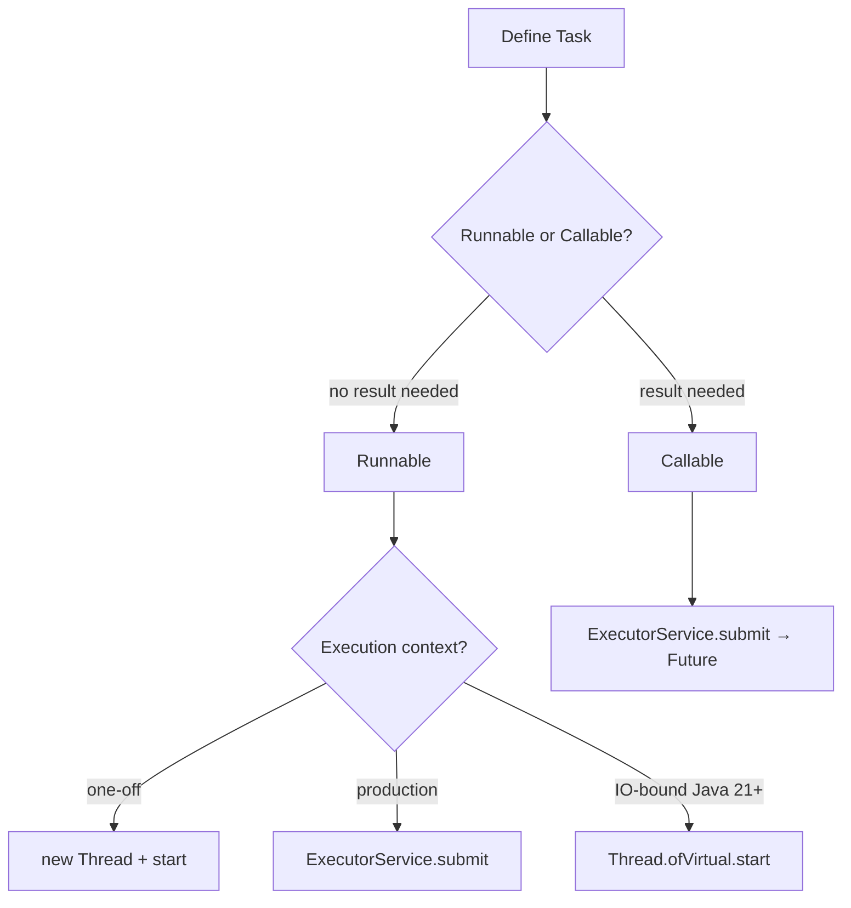
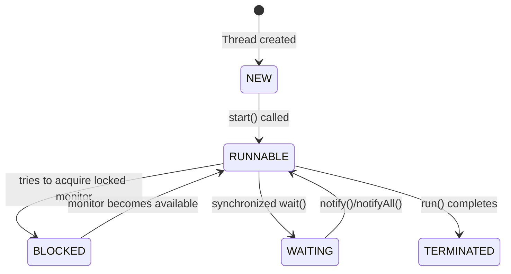
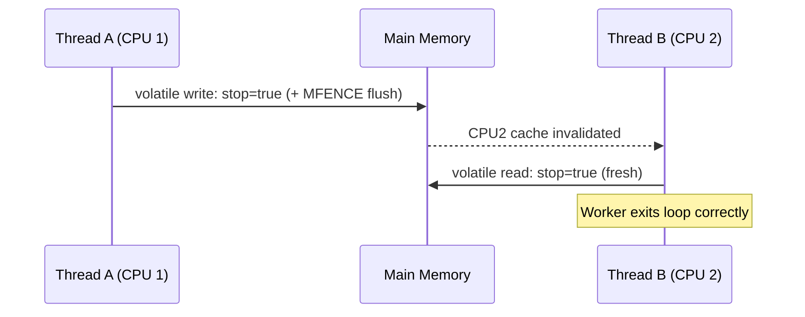
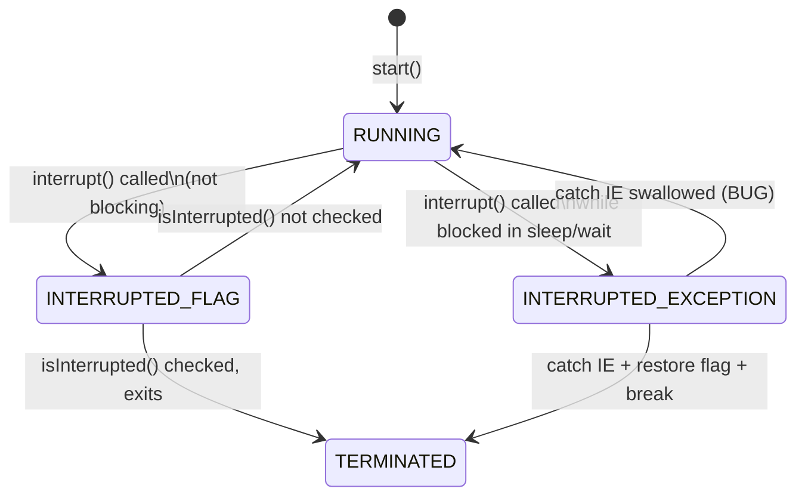
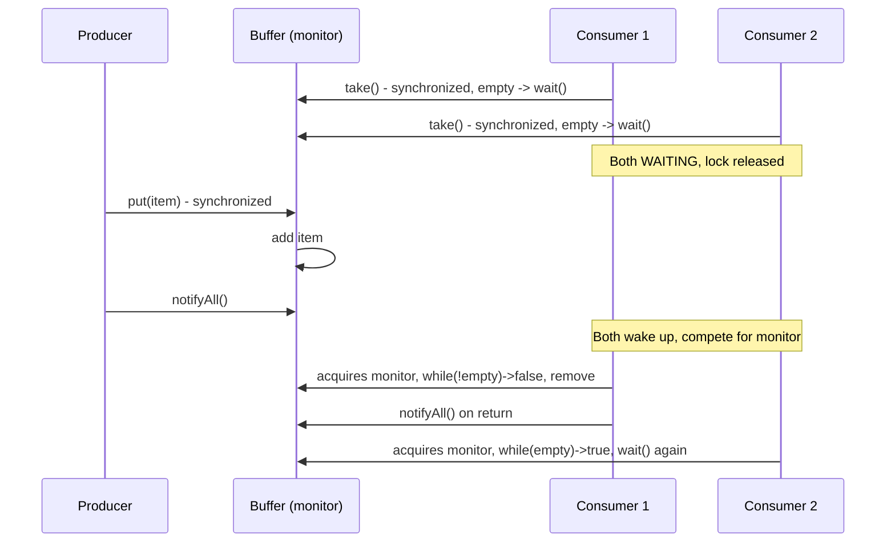

# Java Concurrency - L1 Foundations

| # | Keyword | Difficulty |
| --- | --- | --- |
| 1 | [Thread Creation and Runnable](#thread-creation-and-runnable) | ★☆☆ |
| 2 | [synchronized Keyword](#synchronized-keyword) | ★★☆ |
| 3 | [volatile Keyword](#volatile-keyword) | ★★☆ |
| 4 | [Thread Interruption and Daemon Threads](#thread-interruption-and-daemon-threads) | ★☆☆ |
| 5 | [wait notify and notifyAll](#wait-notify-and-notifyall) | ★★☆ |

---

# Thread Creation and Runnable

**Interview Weight:** foundational - Every Java developer must know
the three ways to create a thread and why Runnable is preferred over
extending Thread.

---

### 🎯 Model Answer

**30 seconds:**

> Java threads are created by constructing a Thread object and calling
> start(). The thread's task is defined via Runnable (functional
> interface), Callable (returns a result), or by extending Thread
> directly. Best practice: implement Runnable - it separates the task
> from the execution mechanism, allowing the same Runnable to run in
> a thread pool or a standalone thread.

**3 minutes (Senior):**

> Thread creation has two concerns: defining the task and defining
> the execution mechanism. Extending Thread conflates both - you
> cannot reuse the task or change the execution context without
> rewriting. Implementing Runnable decouples them: the same Runnable
> runs in a Thread, an ExecutorService, or a CompletableFuture.
>
> Thread.start() is non-blocking - it requests the OS to schedule
> the new thread and returns immediately. The JVM calls thread.run()
> on the new thread; calling run() directly executes the task in the
> current thread (a common mistake). Virtual threads (Java 21+)
> change the economics: they are cheap (nanoseconds to create, few
> bytes of memory) vs platform threads (microseconds, ~1MB stack).
> For IO-bound work, virtual threads replace thread pools.

**Framework:** DEFINE TASK (Runnable/Callable) -> CHOOSE EXECUTION
(Thread, ExecutorService, virtual thread) -> START (start(), submit())

*Adapting up:* "I prefer ExecutorService.submit() over raw Thread
for production code - it handles exceptions properly (raw thread's
uncaught exception handler is needed otherwise), manages lifecycle,
and allows future composition."

*Adapting down:* "You implement Runnable with your task in run(),
pass it to new Thread(runnable), and call start() to begin execution."

**Blank Mind Recovery:**

**(1) Restate:** "Thread creation: how to define a concurrent task
and start it on a new thread."

**(2) First principles:** "The OS needs a task (what to run) and a
stack (where to store local state). Thread = OS-scheduled execution
unit. Runnable = the task."

**(3) Bridge:** "Like hiring a worker (Thread) and handing them a
job description (Runnable). Extending Thread is like making the
worker inseparable from the job."

---

### 📘 Concept Explanation

**What it is:**

Thread: a lightweight process that shares the parent process's heap
but has its own stack, program counter, and CPU registers. The OS
scheduler runs threads concurrently by rapidly switching between them.

Runnable: a functional interface with a single run() method. Defines
the task a thread will execute. No return value, no checked exceptions.

Callable: like Runnable but returns a result (V call() throws Exception).
Used with ExecutorService and Future.

**The problem it solves:**

Java programs need to perform work concurrently (handle multiple
requests, run background tasks, parallelize CPU-bound work).
Thread is the fundamental unit of concurrent execution. Runnable
allows tasks to be defined independently of their execution context.

**How it works:**

```
Thread creation options:

1. Extend Thread (NOT recommended - conflates task and mechanism)
   class MyThread extends Thread {
       public void run() { /* task */ }
   }
   new MyThread().start();

2. Implement Runnable (PREFERRED for simple tasks)
   Thread t = new Thread(() -> System.out.println("hi"));
   t.start();

3. ExecutorService (PREFERRED for production)
   ExecutorService ex = Executors.newFixedThreadPool(4);
   ex.submit(() -> System.out.println("hi"));

4. Virtual Thread (Java 21+ for IO-bound)
   Thread.ofVirtual().start(() -> System.out.println("hi"));

Thread lifecycle after start():
  CALLING THREAD: start() -> returns immediately
  NEW THREAD: run() -> executes task -> terminates
```

**The key insight:**

Calling run() directly does NOT create a new thread - it executes
the task on the current thread. Only start() creates a new OS thread.
This is the #1 mistake beginners make.

**When to use it:**

- Raw Thread: one-off background tasks in tests or utility code
- ExecutorService: production code - lifecycle management, reuse
- Virtual threads: high-concurrency IO-bound tasks (Java 21+)

**When NOT to use it:**

- Do not extend Thread: prevents reuse and composition
- Do not create unbounded new Thread per request in production:
  each platform thread is ~1MB stack; 10,000 requests = 10GB RAM
- Do not ignore InterruptedException: always restore interrupt status
  or propagate it

**Alternatives:**

- CompletableFuture.runAsync() for async tasks with composition
- Spring @Async for framework-managed async execution

**First-principles derivation:**

A CPU core executes one instruction stream at a time. To run work
concurrently, the OS maintains multiple instruction streams (threads)
and rapidly switches between them (context switching). Creating a
Thread allocates a stack and registers the instruction pointer.
start() submits the thread to the OS scheduler; the OS decides
when it runs.

---

### 💻 Code Example

**Example 1: BAD (extend Thread) vs GOOD (Runnable with Executor)**

```java
// BAD: extending Thread (conflates task and mechanism)
class FetchTask extends Thread {
    private final String url;
    FetchTask(String url) { this.url = url; }

    @Override
    public void run() {
        // task is locked into Thread inheritance
        fetch(url);
    }
}
// Cannot reuse FetchTask in a thread pool
new FetchTask("http://api.example.com/data").start();

// GOOD: Runnable + ExecutorService
class FetchTask implements Runnable {
    private final String url;
    FetchTask(String url) { this.url = url; }

    @Override
    public void run() {
        fetch(url);
    }
}
// Same task, different execution contexts:
ExecutorService pool = Executors.newFixedThreadPool(10);
pool.submit(new FetchTask("http://api.example.com/data"));
pool.submit(new FetchTask("http://api.example.com/other"));
// or with lambda:
pool.submit(() -> fetch("http://api.example.com/data"));
```

> **Code walkthrough:** Extending Thread forces FetchTask to be
> created fresh for every execution and can never be submitted to a
> thread pool (it is a Thread, not a task). The Runnable version
> separates concern: FetchTask knows WHAT to do; the ExecutorService
> decides HOW and WHEN to run it. The pool reuses threads across
> submissions, reducing the ~1-2ms thread creation overhead per request.

**Example 2: BAD (call run() directly) vs GOOD (call start())**

```java
// BAD: calling run() directly - no new thread created!
Runnable task = () -> {
    System.out.println("Thread: " +
        Thread.currentThread().getName());
};
task.run();   // prints "main" - runs on CURRENT thread!
new Thread(task).run();  // STILL runs on main thread!

// GOOD: call start() to create a new thread
Thread t = new Thread(task);
t.start();  // prints "Thread-0" - runs on NEW thread

// GOOD: virtual thread (Java 21+) for IO-bound tasks
Thread.ofVirtual().name("vt-task").start(task);
// prints "vt-task" - runs on virtual thread
```

> **Code walkthrough:** run() is an ordinary method call - it
> executes synchronously on the calling thread. start() is the JVM
> entry point for thread creation: it allocates the OS thread,
> registers it with the JVM, and calls run() on that new thread.
> The println output ("Thread-0" vs "main") is the diagnostic:
> if you see "main", you called run() instead of start().

---

### 🎓 Answers by Seniority

**Junior / Mid (0-5 years):**

> Three ways to create a thread: extend Thread, implement Runnable,
> or implement Callable. Best practice: implement Runnable (or use
> a lambda) and submit to an ExecutorService. Key rule: call start()
> not run(). start() creates the new thread; run() executes on the
> current thread.

---

**Senior / Staff (5+ years):**

> I never use raw new Thread() in production code. ExecutorService
> provides lifecycle, exception handling, and resource bounding.
> For IO-bound tasks in Java 21+, virtual threads (Thread.ofVirtual()
> or Executors.newVirtualThreadPerTaskExecutor()) replace thread
> pools - they scale to millions of concurrent tasks. Platform thread
> pools remain relevant for CPU-bound parallelism.

---

### ⚠️ Common Misconceptions

| Misconception | Reality | Risk |
| --- | --- | --- |
| "Calling run() starts a new thread" | run() is a method call; only start() creates a new OS thread | Task runs synchronously on calling thread |
| "Extending Thread is equivalent to Runnable" | Extending Thread prevents reuse in thread pools | Cannot submit Thread subclass to ExecutorService |
| "Thread.start() blocks until the thread finishes" | start() is non-blocking; it returns immediately | Assuming task is done after start() returns |
| "Virtual threads are just faster platform threads" | Virtual threads are user-mode threads (no OS thread per virtual thread) | Wrong mental model for debugging and sizing |

---

### 🚨 Failure Modes and Diagnosis

| Failure | Symptom | Root Cause | Diagnostic | Fix |
| --- | --- | --- | --- | --- |
| Called run() instead of start() | Task runs synchronously; no parallelism | Confused run/start API | Thread.currentThread().getName() shows "main" inside task | Change run() to start() |
| Unbounded thread creation | OutOfMemoryError: unable to create new native thread | new Thread() per request in production | jstack or thread dump: thousands of RUNNABLE threads | Replace with bounded ExecutorService |
| Ignored exception in thread | Silent failure; task stops without logging | Uncaught exception in run() terminates thread silently | Thread.setDefaultUncaughtExceptionHandler; add try-catch in run() | Use ExecutorService.submit() - wraps exception in Future |

---

### 🎯 Interview Deep-Dive

| Level | Time | Expected Depth |
| --- | --- | --- |
| Junior | 2 min | Three ways to create; start() vs run() |
| Mid | 4 min | Runnable vs Callable; why Executor |
| Senior | 6 min | Platform vs virtual threads; thread lifecycle |

---

**Q1** [CONCEPTUAL] [JUNIOR]

"What are the ways to create a thread in Java?"

**Answer:**

Three main approaches:

1. Extend Thread and override run():
   `class MyThread extends Thread { public void run() {...} }`
   Problem: conflates task definition with execution mechanism.

2. Implement Runnable and pass to Thread constructor:
   `new Thread(() -> doWork()).start()`
   Preferred: separates task from execution. Same Runnable can run
   in a thread pool, a Thread, or a CompletableFuture.

3. Use ExecutorService (production standard):
   `executorService.submit(() -> doWork())`
   Best: lifecycle management, thread reuse, exception propagation.

For returning results: use Callable<V> instead of Runnable.
Callable can be submitted to ExecutorService and returns a Future<V>.

Java 21+ adds virtual threads:
`Thread.ofVirtual().start(() -> doWork())`
Cheap, IO-optimized; can create millions without resource exhaustion.

*What separates good from great:* Mentioning that ExecutorService
is the production standard and explaining WHY (lifecycle + exception
handling), not just listing the three syntactic options.

---

**Q2** [DEBUGGING] [MID]

"A developer says 'my background task is blocking the main thread.'
What's the most likely cause?"

**Answer:**

Most likely: they called run() instead of start().

Diagnostic: add `System.out.println(Thread.currentThread().getName())`
inside the task. If it prints "main" (or whatever the calling thread
is named), the task is running on the calling thread, not a new thread.

root cause pattern:
- Correct: `new Thread(task).start()` - returns immediately, task
  runs on new thread
- Wrong: `new Thread(task).run()` - executes task synchronously
- Also wrong: `task.run()` - no Thread wrapper at all

Other causes:
- Thread.join() called immediately after start() with no timeout
  (blocks until thread finishes - intentionally synchronous)
- ExecutorService.shutdown() followed by awaitTermination() with
  too long a timeout (main thread blocks waiting for pool to drain)

Fix: ensure start() is called, verify thread name inside task,
check for accidental join() or awaitTermination() calls.

*What separates good from great:* Knowing the diagnostic (print
thread name inside the task) rather than just saying "check the code."

---

**Q3** [TRADE-OFF] [SENIOR]

"When would you use virtual threads instead of a thread pool?"

**Answer:**

Virtual threads (Java 21+) are optimized for IO-bound, blocking
workloads. They are mounted on a carrier (platform) thread while
running, and unmounted when blocking (IO, sleep, lock wait). The
carrier thread is freed during the block; another virtual thread
runs instead. This means millions of concurrent virtual threads
can run on a fixed pool of carrier threads without stacking up
blocked platform threads.

Use virtual threads when:
- Tasks spend most time blocking: HTTP clients, JDBC, file IO
- Per-request thread model: each incoming request gets one virtual
  thread for its lifetime (vs thread pool with limited concurrency)
- High concurrency target: >10,000 concurrent tasks (impossible
  with platform threads due to memory cost)

Use thread pools (platform threads) when:
- CPU-bound work: virtual threads yield no benefit (no blocking to
  unmount during) and use more metadata overhead
- Pinning risk: synchronized blocks with long IO inside pin the
  carrier thread; prefer ReentrantLock with virtual threads
- Requires thread-local assumptions: some frameworks assume
  ThreadLocal maps to a request; virtual threads can use structured
  concurrency instead

Trade-off summary: virtual threads are a near drop-in replacement
for IO-bound thread-per-request workloads. For CPU-bound work,
ForkJoinPool with platform threads remains optimal.

*What separates good from great:* Explaining pinning (synchronized
blocks inside virtual threads pin the carrier platform thread,
degrading scalability) and recommending ReentrantLock as the fix.

---

**Q4** [CONCEPTUAL] [JUNIOR]

"What happens if you call start() twice on the same Thread object?"

**Answer:**

IllegalThreadStateException is thrown on the second start() call.
A Thread object can only be started once. Once a thread runs and
terminates, it cannot be restarted.

```java
Thread t = new Thread(() -> System.out.println("hi"));
t.start();   // OK
t.start();   // throws IllegalThreadStateException
```

This is why thread pools exist: they reuse Thread objects by
keeping them alive in a WAITING state (waiting for the next task),
rather than creating and starting new Thread objects per task.

If you need to run the same task again, create a new Thread with
the same Runnable. Better: submit the Runnable to an ExecutorService
which handles the reuse internally.

*What separates good from great:* Explaining WHY thread pools exist
as the solution (thread reuse via WAITING state) rather than just
stating the exception.

---

### ⚖️ Comparison Table

*(Omit: ★☆☆ foundational keyword - comparison tables apply at ★★☆
and above where multiple equivalent alternatives exist. Runnable vs
Thread is covered in concept and code sections.)*

---

### 🏛️ System Design

*(Omit: L1 foundational keyword. Thread pool design and virtual
thread architecture appear in L3-L4 files.)*

---

### 📊 Diagram

```
THREAD CREATION OPTIONS:

                  Task Definition
                  /             \
             Runnable         Callable
            (no result)      (returns V)
               /    \             |
          Thread  Executor   Executor
         (raw)   (production) (Future<V>)

PLATFORM vs VIRTUAL THREAD:

Platform Thread:
  [JVM Thread] --maps 1:1--> [OS Thread] --consumes--> ~1MB stack
  10,000 threads = ~10GB RAM

Virtual Thread (Java 21+):
  [Virtual Thread] --mounts on--> [Carrier Platform Thread]
  [blocking IO/lock] --> unmount, run another virtual thread
  1,000,000 virtual threads --> only N carrier platform threads
  N = number of CPU cores

THREAD LIFECYCLE:
  NEW --start()--> RUNNABLE <--> RUNNING
                    ^                |
                    |          [blocking]
                    |                v
                  RUNNABLE <-- BLOCKED/WAITING
                    |
                  TERMINATED
```



> **Diagram walkthrough:** The decision tree shows the two concerns
> in thread creation: what the task does (Runnable vs Callable) and
> how it runs (raw Thread, ExecutorService, or virtual thread). Most
> production code paths lead to ExecutorService - it handles lifecycle,
> exceptions, and thread reuse. Virtual threads are the future for
> IO-bound work: the same Runnable submitted to a virtual thread
> executor scales to millions of concurrent tasks.

---

---

# synchronized Keyword

**Interview Weight:** high - Core Java synchronization primitive.
Expected at every level. Misuse is the most common cause of both
deadlocks and missed optimizations.

---

### 🎯 Model Answer

**30 seconds:**

> synchronized is Java's built-in locking mechanism. It uses the
> object's intrinsic monitor (every Java object has one). A
> synchronized block or method acquires the monitor on entry and
> releases it on exit (even if an exception is thrown). Only one
> thread can hold a monitor at a time; others BLOCK until it is
> released.

**3 minutes (Senior):**

> synchronized provides mutual exclusion (at most one thread executes
> a critical section at a time) and memory visibility (on monitor
> exit, all writes are flushed to main memory; on monitor entry, all
> reads see the latest writes). This establishes the happens-before
> relationship required by the JMM.
>
> synchronized is reentrant: a thread that already holds a monitor
> can acquire it again (synchronized calls to synchronized methods
> in the same object do not deadlock).
>
> Two common forms: synchronized method (locks on this) and
> synchronized block (locks on explicit object). Best practice: use
> synchronized blocks with private lock objects - synchronized
> methods expose the lock (callers can synchronize on this too,
> causing unintended interactions). Prefer ReentrantLock for
> advanced features (tryLock, timed lock, fairness, multiple
> conditions).

**Framework:** IDENTIFY CRITICAL SECTION -> CHOOSE LOCK OBJECT ->
MINIMIZE SCOPE -> ANALYZE DEADLOCK RISK

*Adapting up:* "I analyze the lock scope carefully - synchronized
on the method level often holds the lock longer than necessary,
reducing throughput. I prefer synchronized blocks with a private
final lock object to minimize contention scope."

**Blank Mind Recovery:**

**(1) Restate:** "synchronized = Java's built-in mutual exclusion
mechanism."

**(2) First principles:** "Mutual exclusion: only one thread in the
critical section at a time. Monitor: the lock embedded in every
Java object."

**(3) Bridge:** "Like a bathroom lock: whoever has the key (monitor)
is inside; others wait outside (BLOCKED). Reentrant means you can
lock the same lock twice without deadlocking yourself."

---

### 📘 Concept Explanation

**What it is:**

synchronized is a Java keyword that acquires an intrinsic monitor
lock before entering a block or method and releases it on exit.
It provides two guarantees: mutual exclusion and memory visibility.

**The problem it solves:**

Multiple threads accessing shared mutable state can produce
inconsistent results. synchronized ensures that only one thread
executes a critical section at a time and that changes are
visible to subsequent lock holders.

**How it works:**

```
SYNCHRONIZED METHOD:
synchronized void increment() {
    count++;  // protected by this.monitor
}
// Equivalent to:
void increment() {
    synchronized(this) { count++; }
}

SYNCHRONIZED STATIC METHOD:
static synchronized void reset() { count = 0; }
// Locks on Class object (MyClass.class), not instance

SYNCHRONIZED BLOCK (preferred):
private final Object lock = new Object();
void increment() {
    synchronized(lock) { count++; }
    // lock scope ends here; other code runs outside lock
}

REENTRANT:
synchronized void outer() {
    inner();  // does NOT deadlock - same thread re-enters
}
synchronized void inner() { /* re-acquires same monitor */ }
```

**The key insight:**

synchronized(this) and synchronized instance methods use the same
lock - the instance (this) monitor. If you have two synchronized
methods, they mutually exclude each other because they share the
same lock. This is correct for protecting invariants but means
unrelated synchronized methods also block each other.

**When to use it:**

- Simple critical sections with straightforward locking needs
- When reentrancy is needed (synchronized is always reentrant)
- When simplicity matters more than fine-grained control

**When NOT to use it:**

- Avoid synchronized(this): public lock object is visible to
  callers who can also synchronize on it (unintended coupling)
- Do not use synchronized for long-running operations: threads
  block for the duration; prefer ReentrantLock with tryLock timeout
- Do not hold locks during IO operations: blocks all competing
  threads for the entire IO duration

**Alternatives:**

- ReentrantLock: explicit lock/unlock, tryLock, timed lock, fairness
- StampedLock: optimistic reads for read-heavy workloads
- AtomicInteger/AtomicReference: lock-free for single variables

**First-principles derivation:**

Every Java object has a header word containing a monitor reference.
When a thread enters a synchronized block, the JVM calls
monitorenter bytecode, which atomically sets the monitor's owner
to the current thread (or increments hold count if reentrant).
On exit, monitorexit decrements hold count or releases if zero,
waking waiting threads. The JVM implements this using OS mutexes
under high contention and CAS spin-locks under low contention
(biased locking, thin lock, fat lock progression - though biased
locking was deprecated in Java 15).

---

### 💻 Code Example

**Example 1: BAD (synchronized on mutable/public object) vs GOOD (private lock)**

```java
// BAD: synchronizing on a mutable or publicly visible object
public class Counter {
    private Integer count = 0;  // MUTABLE reference!

    public void increment() {
        synchronized(count) {  // WRONG: count reference changes
            count++;           // count = new Integer(count+1)
            // lock was on old object, now count is a new object!
        }
    }
}

// BAD: synchronized(this) - exposes lock to callers
public class CounterExposed {
    private int count;
    public synchronized void increment() { count++; }
    // External code can: synchronized(counterObj) { ... }
    // This blocks increment() unexpectedly
}

// GOOD: private final lock object
public class SafeCounter {
    private final Object lock = new Object();
    private int count = 0;

    public void increment() {
        synchronized(lock) {  // lock is private and final
            count++;
        }
    }

    public int get() {
        synchronized(lock) {
            return count;
        }
    }
}
```

> **Code walkthrough:** Synchronizing on `count` (an Integer) is
> doubly wrong: Integer is immutable and autoboxed, so `count++`
> replaces the reference with a new Integer object. The thread locked
> on the old Integer, not the new one. Multiple threads end up
> synchronizing on different objects (each sees their own cached
> Integer), providing no mutual exclusion. The private final lock
> object is always the same reference, so all threads synchronize
> on the same monitor.

**Example 2: BAD (too-wide lock scope) vs GOOD (minimize scope)**

```java
// BAD: holding lock during IO (blocks all other threads)
public synchronized void processAndSave(Data data) {
    Data result = expensiveComputation(data); // 100ms CPU
    dbService.save(result);                   // 200ms IO
    // Lock held for 300ms - all other callers blocked!
}

// GOOD: minimize lock scope to just the critical section
public void processAndSave(Data data) {
    // CPU work outside lock (fully parallelizable)
    Data result = expensiveComputation(data);

    // IO outside lock (no shared mutable state in save)
    dbService.save(result);

    // Only the shared counter update needs the lock
    synchronized(lock) {
        processedCount++;
    }
}
```

> **Code walkthrough:** The first version holds the lock for the
> entire 300ms operation. If 10 threads call this, the last thread
> waits 3 seconds. The second version identifies the actual shared
> mutable state (processedCount) and locks only that update (~1
> microsecond). CPU work and IO are fully parallel. Throughput
> improves by 300x in this example.

---

### 🎓 Answers by Seniority

**Junior / Mid (0-5 years):**

> synchronized acquires the object's intrinsic monitor lock.
> Only one thread can hold the monitor at a time; others block.
> It provides mutual exclusion (one thread at a time) and visibility
> (writes flushed on unlock, reads see latest on lock). synchronized
> methods lock on this; static synchronized methods lock on the
> Class object.

---

**Senior / Staff (5+ years):**

> I avoid synchronized(this) in production: it exposes the lock to
> callers and prevents fine-grained control. I use private final lock
> objects or ReentrantLock. Lock scope matters enormously: holding
> synchronized across IO is a throughput killer. I analyze deadlock
> risk by ensuring all code in the codebase acquires multiple locks
> in a consistent order. For read-heavy workloads, ReadWriteLock or
> StampedLock dramatically outperform synchronized.

---

### ⚠️ Common Misconceptions

| Misconception | Reality | Risk |
| --- | --- | --- |
| "synchronized method and synchronized(this) use different locks" | Both use the same object monitor (this) | Deadlock confusion when mixing both |
| "synchronized on a field reference is safe" | If the reference changes, you are locking on different objects | Broken synchronization (race conditions) |
| "synchronized prevents all visibility problems" | synchronized guarantees visibility only for threads competing for the same lock | Different lock objects = no visibility guarantee between them |
| "static synchronized and instance synchronized protect each other" | Static locks on Class; instance locks on this - different monitors | Static and instance critical sections can run concurrently |

---

### 🚨 Failure Modes and Diagnosis

| Failure | Symptom | Root Cause | Diagnostic | Fix |
| --- | --- | --- | --- | --- |
| Deadlock | Application hangs; threads stuck in BLOCKED state | Two threads each hold a lock the other needs; circular dependency | jstack: look for "waiting to lock" chains; VisualVM threads view | Establish consistent lock ordering; use tryLock with timeout |
| Lock contention | High CPU wait; throughput drops under load | Too-wide lock scope or too many threads competing for one lock | JFR MonitorEnterEvent; jstack thread counts in BLOCKED | Narrow lock scope; split lock; use concurrent collections |
| Synchronizing on mutable field | Race condition despite synchronized | Field reference changes; threads lock on different objects | Review code: synchronized(x) where x may be reassigned | Use private final lock object |

---

### 🎯 Interview Deep-Dive

| Level | Time | Expected Depth |
| --- | --- | --- |
| Junior | 3 min | Definition; mutual exclusion; synchronized method vs block |
| Mid | 5 min | Monitor visibility; reentrancy; deadlock pattern |
| Senior | 8 min | Lock scope; private lock objects; vs ReentrantLock |
| Staff | 12 min | Lock ordering; diagnosis from thread dump; fairness |

---

**Q1** [CONCEPTUAL] [JUNIOR]

"What does synchronized guarantee in Java?"

**Answer:**

synchronized provides two guarantees:

1. Mutual exclusion: at most one thread executes a synchronized
   block protecting the same monitor at any time. Other threads
   that try to enter block (BLOCKED state) until the monitor is
   released.

2. Memory visibility: when a thread exits a synchronized block,
   all its writes are flushed to main memory. When a thread enters
   a synchronized block on the same monitor, it reads the latest
   values of all shared variables. This establishes the
   happens-before relationship in the Java Memory Model.

synchronized is also reentrant: if a thread already holds the
monitor, it can re-enter synchronized blocks on the same monitor
without deadlocking (a hold count is maintained).

Scope: synchronized instance methods lock on the instance (this);
synchronized static methods lock on the Class object. These are
different monitors and do NOT exclude each other.

*What separates good from great:* Mentioning the visibility
guarantee (not just mutual exclusion) and the happens-before
relationship.

---

**Q2** [CONCEPTUAL] [MID]

"What is a deadlock and how does synchronized cause it?"

**Answer:**

A deadlock is a state where two or more threads are permanently
blocked, each waiting for a lock held by another thread in the cycle.
No thread can make progress.

Classic pattern with synchronized:

```
Thread A: acquires lock1, then tries to acquire lock2
Thread B: acquires lock2, then tries to acquire lock1
Thread A holds lock1, waits for lock2 (BLOCKED)
Thread B holds lock2, waits for lock1 (BLOCKED)
Circular dependency = permanent deadlock
```

Conditions for deadlock (all four must hold):
1. Mutual exclusion: at least one resource held exclusively
2. Hold and wait: a thread holds a lock while waiting for another
3. No preemption: locks cannot be forcibly taken
4. Circular wait: circular chain of threads each waiting on the next

Prevention strategies:
- Lock ordering: always acquire multiple locks in the same order
  across all threads (breaks circular wait)
- tryLock with timeout: use ReentrantLock.tryLock(timeout) - if
  the second lock cannot be acquired, release the first and retry
  (breaks hold-and-wait)
- Lock bundling: acquire all needed locks at once

Diagnosis: jstack | grep -A 3 "BLOCKED" shows the wait chain.
"Found N deadlocked threads" message appears automatically.

*What separates good from great:* Knowing that lock ordering is the
most reliable prevention (not just "be careful") and knowing the
jstack diagnostic command.

---

**Q3** [TRADE-OFF] [SENIOR]

"When would you use ReentrantLock instead of synchronized?"

**Answer:**

synchronized covers 90% of cases cleanly. Reach for ReentrantLock
when synchronized is insufficient:

1. tryLock with timeout:
   `lock.tryLock(100, TimeUnit.MILLISECONDS)` - attempt to acquire,
   give up if not available. Enables deadlock avoidance (release
   held locks and retry) and responsive lock acquisition.

2. Multiple condition variables:
   synchronized has one condition (wait/notify). ReentrantLock
   supports multiple: `Condition notFull = lock.newCondition()`,
   `Condition notEmpty = lock.newCondition()`. Used in producer-
   consumer with separate signals for producers and consumers.

3. Fairness:
   `new ReentrantLock(true)` - threads acquire in arrival order
   (approximately). Prevents starvation at cost of throughput.
   synchronized never guarantees fairness.

4. Interruptible lock acquisition:
   `lock.lockInterruptibly()` - thread can be interrupted while
   waiting for lock. Useful for responsive shutdown.

5. Diagnostic capability:
   `lock.getQueuedThreads()`, `lock.isHeldByCurrentThread()`,
   `lock.getHoldCount()` - aids in testing and deadlock analysis.

Trade-off: ReentrantLock requires explicit unlock (must be in
finally block). Forgetting unlock = lock never released.
synchronized automatically releases on exit. Prefer synchronized
for simplicity; use ReentrantLock only when its features are needed.

*What separates good from great:* Multiple condition variables use
case (producer-consumer) and the explicit finally-block requirement.

---

**Q4** [DEBUGGING] [SENIOR]

"How do you analyze a deadlock from a thread dump?"

**Answer:**

Thread dump via `jstack <pid>` or `kill -3 <pid>`. JVM automatically
appends "Found 1 deadlock" at the bottom with the cycle details.

Reading the dump:
```
"Thread-1" #13 BLOCKED on object@0x7f2a3c (owned by "Thread-0")
    at Bank.transfer(Bank.java:21)
    - waiting to lock <0x7f2a3c> (Account@0x7f2a3c)
    - locked <0x7f1a2b> (Account@0x7f1a2b)

"Thread-0" #12 BLOCKED on object@0x7f1a2b (owned by "Thread-1")
    at Bank.transfer(Bank.java:21)
    - waiting to lock <0x7f1a2b> (Account@0x7f1a2b)
    - locked <0x7f2a3c> (Account@0x7f2a3c)
```

Steps:
1. Find BLOCKED threads
2. Read "waiting to lock" address - which monitor is wanted
3. Read "locked" address - which monitor is held
4. Build the dependency graph - circular = deadlock

Fix in this case: always lock accounts in a consistent order
(by account ID, for example) so both threads acquire locks in the
same sequence.

Tools: VisualVM (Threads tab shows BLOCKED threads in red),
Java Flight Recorder (monitorEnter events with stack traces),
IntelliJ debugger (thread dump button in debug view).

*What separates good from great:* Reading the lock addresses from
the thread dump and building the dependency graph rather than just
knowing jstack exists.

---

**Q5** [BEHAVIORAL] [MID]

"Tell me about a time you fixed a concurrency bug."

**Answer:**

Structure: STAR (Situation, Task, Action, Result).

Example: "In a payment processing service, we had intermittent
double-charges at peak load (once per ~50,000 transactions).
The team was stumped - tests passed, the bug was non-deterministic."

Situation: payment service with a deduplication cache
(HashMap<transactionId, Boolean>).

Task: find and fix without breaking production.

Action: I added jcstress stress tests targeting the deduplication
logic. Immediately reproduced: two threads both called
map.containsKey(id), both got false, both processed the charge.
Check-then-act race on non-thread-safe HashMap.

Fix: replaced HashMap with ConcurrentHashMap.computeIfAbsent():
```java
processed.computeIfAbsent(txId, id -> processPayment(id));
```
computeIfAbsent is atomic: only one thread executes the function
for a given key; others wait. No more double-charges.

Result: zero duplicate charges in 3 months since deployment.
Added jcstress to CI pipeline.

*What separates good from great:* Demonstrating a systematic
approach (jcstress to reproduce) rather than "I read the code
carefully and saw the bug."

---

### ⚖️ Comparison Table

| Feature | synchronized | ReentrantLock | StampedLock |
| --- | --- | --- | --- |
| Syntax | Keyword (auto-release) | Explicit lock/unlock | Explicit + stamped |
| Reentrancy | Yes | Yes | No (not reentrant) |
| tryLock | No | Yes (with timeout) | Yes |
| Multiple conditions | 1 (wait/notify) | Multiple | 2 (read/write) |
| Fairness | No | Optional | No |
| Optimistic read | No | No | Yes |
| Best for | Simple critical sections | Advanced lock features | Read-heavy workloads |

---

### 🏛️ System Design

*(Omit: L1 foundational keyword. Distributed locking, lock-free
concurrent data structure design, and lock-free ring buffers
appear in L4-L5 files.)*

---

### 📊 Diagram

```
SYNCHRONIZED MONITOR MODEL:

    Thread A       Thread B       Thread C
       |               |               |
  synchronized(lock)   |               |
  [acquires monitor]   |               |
       |           synchronized(lock)  |
       |           [BLOCKED - waiting] |
       |                           synchronized(lock)
       |                           [BLOCKED - waiting]
  [critical section]
  [executes]
       |
  [exits: releases monitor]
       |
       v
  Thread B or C acquires (non-deterministic)

REENTRANCY:

  Thread A holds lock {
      synchronized(lock) {   <- re-entrant: hold count=2
          synchronized(lock) {
              // safe, no deadlock
          }
      }                      <- hold count=1
  }                          <- hold count=0, released

DEADLOCK CYCLE:

  Thread A: holds L1 --> wants L2
                                \
                                 DEADLOCK
                                /
  Thread B: holds L2 --> wants L1
```



> **Diagram walkthrough:** The monitor model shows mutual exclusion:
> while Thread A holds the monitor, B and C are BLOCKED. On release,
> only one of them acquires - the choice is non-deterministic (no
> fairness guarantee in synchronized). The reentrancy diagram shows
> why synchronized methods calling other synchronized methods on
> the same object do not deadlock: the hold count increments. The
> deadlock diagram shows the circular dependency: both threads each
> hold one lock the other needs.

---

---# volatile Keyword

**Interview Weight:** high - The most misunderstood Java keyword.
Interviewers test whether you know what volatile does AND what it
does NOT do. The volatile-vs-atomic distinction is a classic trap.

---

### 🎯 Model Answer

**30 seconds:**

> volatile guarantees that reads and writes to a variable are directly
> in main memory (no CPU cache), ensuring all threads see the most
> recent write. It provides visibility but NOT atomicity. compound
> operations like counter++ are still races even with volatile.

**3 minutes (Senior):**

> volatile's guarantee: any write to a volatile variable
> happens-before any subsequent read of that same variable by any
> thread. This is the JMM definition. Practically: the CPU is
> prevented from caching the variable in a register or L1 cache;
> reads go to main memory, writes flush to main memory immediately.
>
> Three correct use cases: (1) status flags (boolean stop = false,
> written by one thread, read by many), (2) safe publication of an
> immutable object reference (volatile Config config - the reference
> AND the object's state become visible to all readers after the
> write), (3) double-checked locking (the reference to the created
> object must be volatile to prevent partial construction visibility).
>
> What volatile does NOT fix: atomicity. counter++ is read-modify-write.
> Even with volatile, two threads reading the same value and both
> incrementing produces lost updates. For atomic operations: use
> AtomicInteger (CAS-based, lock-free) or synchronized.

**Framework:** VISIBILITY (yes, volatile fixes) vs ATOMICITY
(no, volatile does NOT fix) -> COMPOUND OPERATION? -> use atomic

*Adapting up:* "I also know that volatile on a reference provides
visibility of the reference itself and - due to the write-barrier
semantics - visibility of all writes performed before the volatile
write. This makes it suitable for publishing immutable objects."

**Blank Mind Recovery:**

**(1) Restate:** "volatile = visibility guarantee for a shared variable."

**(2) First principles:** "CPUs cache memory for performance.
Without volatile, a thread may read a stale cached value. volatile
forces reads from and writes to main memory."

**(3) Bridge:** "Like a shared whiteboard everyone must write to
and read from directly - no personal notebooks. But writing one
word at a time is still not atomic: I can write half a sentence
before you erase it."

---

### 📘 Concept Explanation

**What it is:**

volatile is a Java keyword that marks a field as directly read from
and written to main memory, bypassing CPU cache. It provides the
happens-before guarantee: a write to a volatile variable
happens-before any subsequent read of that variable.

**The problem it solves:**

Modern CPUs use multi-level caches (L1/L2/L3). Without synchronization,
a write by Thread A may remain in A's CPU cache and not be visible
to Thread B reading from its own cache. volatile forces cache
coherence for the specific variable.

**How it works:**

```
WITHOUT volatile:

Thread A (CPU 1)            Thread B (CPU 2)
write stop = true           read stop
  -> L1 cache CPU1           -> L1 cache CPU2 = false (stale!)
  (not yet in main memory)   Thread B never sees true
  -> Thread B loops forever!

WITH volatile:

Thread A (CPU 1)            Thread B (CPU 2)
write volatile stop = true  read volatile stop
  -> MFENCE (memory fence)   -> bypasses cache
  -> flush to main memory    -> reads from main memory = true
  -> CPU2 cache invalidated  Thread B exits loop correctly

HAPPENS-BEFORE CHAIN:

volatile write (T=1) ---happens-before---> volatile read (T=2)
ALL writes before volatile write are visible after volatile read
```

**The key insight:**

volatile write creates a memory fence: all preceding writes
(to ANY variable) are flushed to main memory before the volatile
write. All subsequent reads (to ANY variable) after a volatile
read see values written before the volatile write. This makes
volatile suitable for publish-once patterns (write a reference
once, many readers read it later).

**When to use it:**

1. Stop flags: `volatile boolean stopRequested` written by main
   thread, read by worker threads
2. Status fields: `volatile boolean initialized` - single write,
   multiple reads
3. Double-checked locking: the instance reference must be volatile
4. Publishing immutable objects: atomic reference replacement

**When NOT to use it:**

- Counter that is incremented: counter++ is not atomic, volatile
  does not help
- Fields involved in check-then-act: if (v == null) v = new X();
  volatile does not make this atomic
- Complex multi-variable invariants: use synchronized or locks

**Alternatives:**

- AtomicBoolean: for flags that may also need getAndSet semantics
- AtomicInteger: for counters with volatile visibility + atomicity
- synchronized: for both visibility and compound atomicity

**First-principles derivation:**

The CPU memory model allows reordering of reads/writes for
performance. The JMM defines what reorderings are allowed and
under what conditions. volatile inserts a StoreLoad fence on
writes and a LoadLoad fence on reads. These CPU instructions
prevent reordering and ensure cache coherence at the hardware
level. The JVM translates volatile accesses to these CPU fence
instructions.

---

### 💻 Code Example

**Example 1: BAD (non-volatile flag, infinite loop) vs GOOD (volatile flag)**

```java
// BAD: non-volatile flag - thread may loop forever
public class Worker implements Runnable {
    private boolean stop = false;  // NOT volatile

    public void requestStop() { stop = true; }

    @Override
    public void run() {
        while (!stop) {
            // JIT may hoist the read out of the loop!
            // Compiled to: if (!stop) while(true) {}
            // Thread never sees stop = true
            doWork();
        }
    }
}

// GOOD: volatile ensures worker sees the updated flag
public class SafeWorker implements Runnable {
    private volatile boolean stop = false;

    public void requestStop() { stop = true; }

    @Override
    public void run() {
        while (!stop) {
            // Each iteration reads from main memory
            doWork();
        }
    }
}
```

> **Code walkthrough:** Without volatile, the JIT compiler is allowed
> to hoist the `stop` read out of the loop (it looks like `stop` never
> changes from the current thread's perspective). This produces an
> infinite loop even after `stop = true`. volatile prevents this
> optimization: every loop iteration reads the current value from
> main memory. The worker reliably exits after requestStop() is called.

**Example 2: BAD (volatile for counter++) vs GOOD (AtomicInteger)**

```java
// BAD: volatile does NOT fix read-modify-write race
public class BrokenCounter {
    private volatile int count = 0;

    // STILL A RACE: read count, increment, write count
    // Two threads reading count=5 both write count=6
    // One update is lost despite volatile
    public void increment() {
        count++;  // NOT ATOMIC even with volatile
    }
}

// GOOD: AtomicInteger for lock-free atomic increment
public class SafeCounter {
    private final AtomicInteger count = new AtomicInteger(0);

    public void increment() {
        count.incrementAndGet();  // CAS - atomic read-modify-write
    }

    public int get() { return count.get(); }
}
```

> **Code walkthrough:** volatile on count ensures every read sees
> the latest value, but does not prevent the race. Thread A reads 5,
> Thread B reads 5, A increments to 6, B increments to 6, A writes 6,
> B writes 6. Lost update. AtomicInteger.incrementAndGet() uses a
> compare-and-swap loop: read current (5), compute next (6), CAS(5->6).
> If another thread changed the value between read and CAS, the CAS
> fails and the whole sequence retries. No update is ever lost.

---

### 🎓 Answers by Seniority

**Junior / Mid (0-5 years):**

> volatile ensures all threads read the most recent value of a field
> (visibility). It prevents CPU caching of the variable. It does NOT
> provide atomicity - counter++ is still a race condition even with
> volatile. Use AtomicInteger for atomic operations.

---

**Senior / Staff (5+ years):**

> volatile is a visibility tool, not a concurrency tool. Correct
> uses: stop flags, double-checked locking (instance reference must
> be volatile to prevent partial construction visibility), and
> publishing immutable objects via reference replacement. Incorrect
> use: any compound operation. I also know that a volatile write
> acts as a full memory barrier: all writes before it are visible
> to any thread that reads the volatile variable afterward - even
> non-volatile writes.

---

### ⚠️ Common Misconceptions

| Misconception | Reality | Risk |
| --- | --- | --- |
| "volatile makes operations atomic" | volatile = visibility only; counter++ is still 3 non-atomic steps | Silent lost updates |
| "volatile is a lightweight synchronized" | Different guarantees: volatile = visibility; synchronized = visibility + mutual exclusion | Using volatile for compound operations causes races |
| "volatile fields don't need to be final" | volatile fields can be final (though redundant for publication of immutable objects) | Confusion about when final vs volatile is appropriate |
| "non-volatile reads are always stale" | Not always stale - depends on CPU and JIT; just not GUARANTEED to be current | Flaky tests that pass on developer machines but fail under production load |

---

### 🚨 Failure Modes and Diagnosis

| Failure | Symptom | Root Cause | Diagnostic | Fix |
| --- | --- | --- | --- | --- |
| Stale flag read | Worker thread loops forever after stop requested | Stop flag not volatile; JIT hoists read out of loop | Add volatile; verify with Thread.sleep(1) between requestStop() and assertion | Declare flag volatile |
| Lost update with volatile counter | Counters slightly wrong at high concurrency | volatile does not provide atomicity for compound operations | Load test: 100 threads x 100,000 increments; assert final count | Replace with AtomicInteger.incrementAndGet() |
| Partial construction visibility | NullPointerException on freshly "published" object fields | Object reference published without volatile; other threads see partially constructed object | Analyze publication path; is there a happens-before from constructor to reader? | Declare reference volatile or use final fields for immutable objects |

---

### 🎯 Interview Deep-Dive

| Level | Time | Expected Depth |
| --- | --- | --- |
| Junior | 3 min | What volatile does; visibility vs atomicity |
| Mid | 5 min | volatile vs synchronized vs AtomicInteger |
| Senior | 8 min | Memory barriers; double-checked locking; happens-before |
| Staff | 12 min | JMM formal guarantees; full barrier semantics |

---

**Q1** [CONCEPTUAL] [JUNIOR]

"What does the volatile keyword do?"

**Answer:**

volatile marks a field as directly read from and written to main
memory, bypassing CPU cache. Without volatile, threads may read
stale values from their CPU's L1/L2 cache.

Two guarantees:
1. Visibility: a write to a volatile variable is immediately visible
   to all threads that subsequently read that variable
2. Ordering: volatile reads and writes cannot be reordered relative
   to each other (the JIT and CPU cannot move them around)

volatile does NOT provide atomicity. compound operations (counter++,
check-then-act) are still races.

Correct use: a boolean stop flag written by one thread and read by
a worker thread. Without volatile, the JIT may hoist the read out
of the loop (the variable appears to never change from the worker's
perspective), causing an infinite loop even after the flag is set.

*What separates good from great:* Mentioning that the JIT can hoist
non-volatile reads (explaining WHY it matters, not just what it is).

---

**Q2** [COMPARISON] [MID]

"volatile vs synchronized vs AtomicInteger - when do you use each?"

**Answer:**

Three different tools for three different problems:

volatile: use when one thread writes and multiple threads read a
single variable and no compound operation is needed. Stop flags,
initialization flags, double-checked locking references.
Cost: cache coherence traffic (minor); no contention.

synchronized: use when you need mutual exclusion (only one thread
in a block at a time) AND visibility, OR when you have compound
operations (check-then-act, multi-variable invariants) that must
be atomic together. Cost: thread blocking under contention; OS
scheduler involvement.

AtomicInteger: use when one variable needs atomic compound operations
(increment, compareAndSet, getAndAdd). Lock-free: uses CAS instruction.
Cost: CAS retry under very high contention (prefer LongAdder then).

Decision rule:
- Single read (many readers, one writer, no compound op) -> volatile
- Single variable with compound ops -> AtomicInteger
- Multiple variables or complex invariants -> synchronized

Mixing: volatile does not make synchronized redundant; synchronized
already provides visibility (monitor entry reads from main memory).
A synchronized block does NOT need volatile fields inside it (for
the guarded state), because the lock already provides visibility.

*What separates good from great:* The last point - that synchronized
blocks already provide visibility for the guarded state (no need for
volatile inside synchronized).

---

**Q3** [DEBUGGING] [SENIOR]

"How do you detect a visibility bug (non-volatile shared field)
in production?"

**Answer:**

Visibility bugs are among the hardest to detect: they are timing-
and CPU-architecture dependent. They may never appear on x86 (strong
memory model) but appear on ARM (weaker model).

Diagnostic layers:

1. Code review: grep for shared mutable fields accessed from multiple
   threads. Check: is there a happens-before from every write to every
   read? If not, either lock or volatile is needed.

2. jcstress: specialized harness that systematically exercises
   memory orderings. Write a jcstress test that checks whether two
   threads see consistent values. Jcstress can detect visibility
   bugs that tests never trigger.

3. -XX:+StressLCM -XX:+StressGCM JVM flags: stress the JIT's code
   motion algorithms. On a development machine, these flags make
   hoisting more aggressive, surfacing bugs that only appear in
   optimized code.

4. Thread sanitizer: not available for JVM directly, but tools like
   RacerD (Facebook/Meta static analyzer for Java) detect unsynchronized
   accesses statically.

5. Production signals: inconsistent state in monitoring data
   (flag appears unset to some nodes, set to others), stale metric
   reads, or workers that appear to ignore shutdown signals.

Fix validation: after adding volatile (or synchronization), run the
jcstress test suite to verify the happens-before relationship is
established.

*What separates good from great:* Knowing jcstress (the JMM stress
testing harness used by the JVM team itself).

---

**Q4** [CONCEPTUAL] [SENIOR]

"How does volatile enable safe double-checked locking?"

**Answer:**

Double-checked locking (DCL) is a lazy initialization pattern that
checks a flag once without locking (fast path) and once with locking
(slow path) to avoid expensive synchronization on every call:

```java
// BROKEN without volatile (Java 5+):
private static Helper instance;  // NOT volatile
public static Helper getInstance() {
    if (instance == null) {        // first check
        synchronized(MyClass.class) {
            if (instance == null) { // second check
                instance = new Helper();
                // PROBLEM: new Helper() is 3 steps:
                // 1. allocate memory
                // 2. initialize fields
                // 3. assign reference to instance
                // CPU can reorder 2 and 3!
                // Another thread may see non-null instance
                // but a partially constructed Helper (step 3
                // completed, step 2 not yet)
            }
        }
    }
    return instance;
}

// CORRECT with volatile (Java 5+):
private static volatile Helper instance;  // volatile!
// volatile write (step 3) cannot be reordered before
// the initialization (step 2). Full barrier semantics.
// Any thread that reads a non-null volatile instance
// sees the fully initialized Helper.
```

volatile in DCL provides two things:
1. Prevents write reordering: the assignment to `instance` cannot
   be moved before the object's fields are written
2. Visibility: any thread reading `instance != null` sees the
   completed initialization

Simpler alternative: use an inner static holder class (class-loading
is thread-safe by the JLS):
```java
private static class Holder {
    static final Helper INSTANCE = new Helper();
}
public static Helper getInstance() { return Holder.INSTANCE; }
```

*What separates good from great:* Explaining the specific reordering
risk (assign reference before initializing fields) rather than just
saying "it might not work without volatile."

---

**Q5** [TRADE-OFF] [SENIOR]

"Does volatile have a performance cost?"

**Answer:**

Yes, but it depends on access pattern and hardware.

Write cost: a volatile write inserts a StoreLoad barrier (the most
expensive memory barrier on x86). The barrier flushes the store
buffer and prevents subsequent loads from being reordered before
it. On x86, this is ~40-100 CPU cycles vs ~4 for a normal write.

Read cost: volatile reads on x86 are typically free - x86 already
has strong load ordering (no LoadLoad reordering). On ARM or Power
architecture, volatile reads require explicit LoadLoad barriers
(~10-20 cycles).

Practical impact: for low-frequency reads (stop flags checked in
a loop body, configuration values), the cost is negligible. For
high-frequency reads (millions per second in a tight loop), volatile
may measurably reduce throughput on ARM.

Compared to synchronized: a synchronized block involves monitor
acquire (CAS on the lock word) and release, plus memory barriers
on both sides. Under no contention, biased locking makes this fast
(~5-10 cycles). Under contention, OS parking adds microseconds.
volatile has no contention cost - it never blocks threads.

When the write frequency matches read frequency and atomicity is
not needed (single-variable, single-writer): volatile is the
right choice and cheaper than synchronized or AtomicInteger.

*What separates good from great:* Knowing that x86 volatile reads
are free (already coherent) vs ARM requires explicit barriers.

---

### ⚖️ Comparison Table

| Aspect | volatile | synchronized | AtomicInteger |
| --- | --- | --- | --- |
| Visibility | Yes | Yes (on lock) | Yes |
| Atomicity | No | Yes (for guarded block) | Yes (single var) |
| Blocks threads | No | Yes (under contention) | No (CAS retry) |
| Compound ops | No | Yes | Yes (single var) |
| Write cost | StoreLoad barrier | CAS + barrier | CAS loop |
| Use case | Flags, references | Multi-var invariants | Counters, flags |

---

### 🏛️ System Design

*(Omit: L1 foundational keyword. Memory visibility in distributed
systems (cache invalidation, cache-aside patterns, eventual
consistency) appears in L4-L5 files.)*

---

### 📊 Diagram

```
CPU CACHE PROBLEM (no volatile):

CPU 1                  CPU 2
Thread A               Thread B
write stop=true        read stop
  -> L1 Cache(CPU1)      -> L1 Cache(CPU2) = false (STALE)
  -> NOT in CPU2 cache   Thread B sees old value!

VOLATILE FIX (memory barrier):

CPU 1                  CPU 2
Thread A               Thread B
write volatile stop    read volatile stop
  -> MFENCE (full barrier)
  -> flush L1->L2->L3->Main Memory
  -> invalidate CPU2 L1 cache
                         -> cache miss -> read main memory
                         -> stop = true (current)

VISIBILITY vs ATOMICITY:

volatile: A write ---> B read GUARANTEED FRESH
          But: A write1, A write2, A write3 still 3 steps

atomic:   read-modify-write as ONE uninterruptible hardware op
```



> **Diagram walkthrough:** The CPU cache diagram shows why visibility
> bugs occur: Thread A writes to its CPU1 L1 cache, but CPU2's cache
> still holds the old value. Without a memory barrier, Thread B may
> loop forever. The volatile write inserts an MFENCE instruction that
> flushes A's L1 cache to main memory and signals all other CPUs to
> invalidate their cached copies. Thread B's next read goes to main
> memory and gets the current value.

---

---

# Thread Interruption and Daemon Threads

**Interview Weight:** medium - Required for correct shutdown logic.
Interviewers test whether you know how to interrupt threads correctly
and what daemon threads are for.

---

### 🎯 Model Answer

**30 seconds:**

> Thread interruption is a cooperative mechanism: calling
> thread.interrupt() sets the interrupted flag on the target thread
> and wakes it if it is blocked in sleep/wait/IO. The target thread
> is expected to check the flag and handle it - interruption is a
> request, not a forced termination. Daemon threads run in the
> background; the JVM exits when only daemon threads remain.

**3 minutes (Senior):**

> The key word is cooperative. thread.interrupt() cannot force a
> thread to stop. It sets the interrupted status and, for blocking
> operations (sleep, wait, BlockingQueue.take), throws
> InterruptedException. The thread's code must handle this: either
> propagate InterruptedException up the call stack (preferred) or
> catch it, restore the flag (Thread.currentThread().interrupt()),
> and exit cleanly.
>
> The most common mistake: catching InterruptedException and doing
> nothing (swallowing it). This permanently clears the interrupted
> flag and the thread continues running. The caller wanted the thread
> to stop; your code silently ignored the request.
>
> Daemon threads: when all non-daemon threads finish, the JVM shuts
> down and abruptly terminates any remaining daemon threads. Use case:
> background monitoring, GC threads, JMX. Risk: daemon threads should
> not hold resources (files, DB connections) because they may be
> killed without cleanup.

**Framework:** INTERRUPT (sets flag) -> BLOCKING OP (throws IE)
-> CATCH IE -> EITHER PROPAGATE or RESTORE FLAG + EXIT

**Blank Mind Recovery:**

**(1) Restate:** "Interruption: how to politely ask a thread to stop."

**(2) First principles:** "You cannot force another thread to stop
without killing the entire JVM (deprecated Thread.stop()). Interruption
is a flag that cooperating code checks."

**(3) Bridge:** "Like tapping someone on the shoulder. They may
respond immediately (if asleep/waiting), they may finish their
sentence first (if running), but they must eventually check and
respond. Ignoring the tap is the bug."

---

### 📘 Concept Explanation

**What it is:**

Thread.interrupt(): sets the interrupted flag on the target thread.
If the thread is blocked in sleep, wait, or certain IO operations,
the block is interrupted and an InterruptedException is thrown,
clearing the interrupted flag.

Thread.isInterrupted(): checks the interrupted flag without clearing
it.

Thread.interrupted(): checks AND clears the interrupted flag (static
method, acts on current thread).

Daemon thread: a thread that the JVM will terminate when all
non-daemon threads have finished. Set via thread.setDaemon(true)
BEFORE start().

**The problem it solves:**

Threads executing long tasks must be able to respond to shutdown
signals. Without interruption, you would need shared volatile flags
checked in loops (which don't work for threads blocked in sleep or
IO). Interruption is the standard Java mechanism for cooperative
cancellation.

**How it works:**

```
INTERRUPTION MECHANICS:

1. Thread running (not blocked):
   thread.interrupt()
     -> sets interrupted flag = true
     -> thread continues running until it checks the flag

2. Thread blocked (sleep/wait/take):
   thread.interrupt()
     -> clears interrupted flag
     -> throws InterruptedException in blocked thread

CORRECT HANDLING PATTERNS:

// Pattern 1: propagate (preferred)
public void doWork() throws InterruptedException {
    while (!Thread.currentThread().isInterrupted()) {
        processItem();
        Thread.sleep(100);  // throws IE if interrupted
    }
}

// Pattern 2: restore flag (when can't propagate)
public void doWork() {
    try {
        Thread.sleep(1000);
    } catch (InterruptedException e) {
        Thread.currentThread().interrupt(); // RESTORE FLAG!
        return;  // exit the task
    }
}

// WRONG: swallow the exception (do not do this)
try {
    Thread.sleep(1000);
} catch (InterruptedException e) {
    // nothing here - flag is cleared, caller's interrupt lost
}
```

**The key insight:**

When InterruptedException is caught, the interrupted flag has been
cleared by the JVM. If you catch it and return normally, the caller
who called interrupt() gets no signal that their request was acted on.
Always either propagate or restore: `Thread.currentThread().interrupt()`.

**When to use it:**

- ExecutorService.shutdown() + task cancellation
- Long-running background tasks with graceful stop
- Tasks submitted to thread pools (executor cancels via Future.cancel())

**When NOT to use it:**

- Do not use interruption for flow control (only for cooperative
  cancellation/shutdown)
- Do not use Thread.stop() - deprecated, unsafe (leaves locks unreleased)

**Alternatives:**

- volatile boolean stopFlag: simple but doesn't interrupt blocking ops
- Future.cancel(true): calls interrupt() on the executing thread
- ExecutorService.shutdownNow(): calls interrupt() on all active threads

**First-principles derivation:**

Java's thread model has no way to forcibly terminate a thread without
risk (Thread.stop() was deprecated because it could leave objects in
inconsistent state - the lock would be released mid-critical-section).
The interrupt mechanism is a cooperative contract: the requester sets
a flag, the responder checks and acts. This keeps threads in control
of their own cleanup.

---

### 💻 Code Example

**Example 1: BAD (swallow InterruptedException) vs GOOD (restore flag)**

```java
// BAD: swallowing InterruptedException
public class BadWorker implements Runnable {
    @Override
    public void run() {
        while (true) {
            try {
                Thread.sleep(1000);
                processWork();
            } catch (InterruptedException e) {
                // WRONG: exception swallowed!
                // Interrupted flag cleared, thread continues
                // Caller's interrupt request silently ignored
                logger.warn("Interrupted, ignoring...");
            }
        }
    }
}

// GOOD: restore interrupt flag, exit cleanly
public class GoodWorker implements Runnable {
    @Override
    public void run() {
        while (!Thread.currentThread().isInterrupted()) {
            try {
                Thread.sleep(1000);
                processWork();
            } catch (InterruptedException e) {
                // Restore the flag so callers can detect it
                Thread.currentThread().interrupt();
                break;  // exit the loop cleanly
            }
        }
        // cleanup resources here (finally block if needed)
    }
}
```

> **Code walkthrough:** The bad version catches InterruptedException
> but does nothing with it. The JVM already cleared the interrupted
> flag when throwing IE. After the catch, the flag is false and the
> loop continues. Calling `executorService.shutdownNow()` on a service
> running BadWorker will wait forever - the tasks never stop. The good
> version restores the flag and breaks the loop. The executor can
> observe the flag on its own monitoring cycle.

**Example 2: Daemon thread lifecycle**

```java
// Daemon thread - killed when JVM exits
Thread healthChecker = new Thread(() -> {
    while (true) {
        try {
            Thread.sleep(5000);
            checkServiceHealth();
        } catch (InterruptedException e) {
            Thread.currentThread().interrupt();
            return;
        }
    }
});
healthChecker.setDaemon(true);   // BEFORE start()
healthChecker.start();

// When main() finishes, JVM exits even if healthChecker is sleeping
// healthChecker is killed abruptly (no cleanup callback)

// NON-daemon thread (default) - JVM WAITS for it
Thread reportGenerator = new Thread(() -> generateReport());
// reportGenerator.setDaemon(false);  // default
reportGenerator.start();
// JVM will NOT exit until reportGenerator finishes
```

> **Code walkthrough:** The daemon thread is started before setDaemon(),
> which would throw IllegalThreadStateException. Daemon threads are
> appropriate for monitoring and housekeeping that can be abandoned
> without data loss - health checks do not hold resources between
> invocations. Report generation is non-daemon because losing a
> partially-written report on JVM exit is unacceptable.

---

### 🎓 Answers by Seniority

**Junior / Mid (0-5 years):**

> thread.interrupt() sets a flag. If the thread is blocking (sleep,
> wait), it throws InterruptedException and clears the flag. Otherwise,
> the thread should check Thread.currentThread().isInterrupted() and
> exit. The key rule: never swallow InterruptedException silently -
> either propagate it or restore the flag.

---

**Senior / Staff (5+ years):**

> I design all long-running tasks to respect interruption: blocking
> calls (sleep, BlockingQueue.take) naturally throw IE; non-blocking
> loops check isInterrupted() periodically. In ExecutorService-managed
> code, tasks are cancelled via Future.cancel(true) which calls
> interrupt(). Daemon threads are for background services that can
> be abandoned; I never hold resources (DB connections, files, locks)
> in daemon threads.

---

### ⚠️ Common Misconceptions

| Misconception | Reality | Risk |
| --- | --- | --- |
| "interrupt() terminates the thread" | interrupt() sets a flag; thread must check it and exit voluntarily | Thread continues running; shutdown hangs |
| "catching InterruptedException is enough" | Catching IE clears the flag; must propagate or restore | Interrupt signal lost; callers cannot detect it |
| "daemon threads are like background services" | Daemon threads are KILLED on JVM exit with no cleanup | Data loss if daemon holds DB connections or open files |
| "Thread.interrupted() and isInterrupted() are the same" | interrupted() clears the flag; isInterrupted() does not | Checking interrupted() may clear the flag unintentionally |

---

### 🚨 Failure Modes and Diagnosis

| Failure | Symptom | Root Cause | Diagnostic | Fix |
| --- | --- | --- | --- | --- |
| InterruptedException swallowed | ExecutorService.shutdownNow() hangs; application does not stop | catch(IE){} or catch(IE){ log } without restoring flag | Grep codebase for catch.*InterruptedException with no interrupt() restore | Add Thread.currentThread().interrupt() and return/break |
| Daemon thread data loss | Incomplete writes or resource leaks on JVM exit | Daemon thread holds open files or DB transactions | jstack shows daemon thread writing at exit | Convert to non-daemon; add shutdown hook for cleanup |
| interrupt() has no effect on running thread | Thread ignores stop request in CPU-bound loop | Thread never checks isInterrupted() in tight loop | jstack: thread RUNNABLE but should have stopped | Add isInterrupted() check in loop condition |

---

### 🎯 Interview Deep-Dive

| Level | Time | Expected Depth |
| --- | --- | --- |
| Junior | 3 min | interrupt() semantics; daemon thread definition |
| Mid | 5 min | IE handling; restore vs propagate; shutdown patterns |
| Senior | 7 min | ExecutorService shutdown; Future.cancel; daemon risks |

---

**Q1** [CONCEPTUAL] [JUNIOR]

"What is the difference between a daemon thread and a user thread?"

**Answer:**

A user thread (non-daemon, the default) keeps the JVM alive. The
JVM will not exit as long as at least one user thread is running.

A daemon thread does not prevent JVM shutdown. When all user threads
finish, the JVM exits and abruptly terminates all remaining daemon
threads - no finally blocks run, no cleanup callbacks execute.

Setting: `thread.setDaemon(true)` must be called BEFORE `start()`.
After start(), setDaemon() throws IllegalThreadStateException.

Use cases for daemon threads:
- Background monitoring (health checks, metric polling)
- JVM-internal threads (GC, JMX, finalizer threads are daemon)
- Timer threads that should not block application exit

Risk: daemon threads should never hold resources that require cleanup
(database connections, open files, locks) because they may be killed
with no warning.

Checking: `thread.isDaemon()` returns true if daemon.

*What separates good from great:* Mentioning that finally blocks do
not execute in daemon threads when killed at JVM exit.

---

**Q2** [DEBUGGING] [MID]

"How do you properly shut down a thread that is running in a loop?"

**Answer:**

Two patterns depending on whether the thread blocks:

Pattern 1 - Thread that blocks (sleep, wait, IO):
```java
while (!Thread.currentThread().isInterrupted()) {
    try {
        queue.take();   // blocks - throws IE when interrupted
        processItem();
    } catch (InterruptedException e) {
        Thread.currentThread().interrupt(); // restore
        break;  // exit loop
    }
}
```
Caller: `thread.interrupt()` or `future.cancel(true)`.

Pattern 2 - Thread in tight CPU-bound loop (no blocking):
```java
while (!Thread.currentThread().isInterrupted()) {
    processItem();
    // check isInterrupted() each iteration
}
```
Caller: `thread.interrupt()`.
Note: if the loop never calls any blocking method, IE will never
be thrown; isInterrupted() check is the only signal.

Pattern 3 - Executor-managed thread:
Use `ExecutorService.shutdownNow()` which calls interrupt() on
all running tasks. Tasks must handle IE or check isInterrupted().

For graceful ordered shutdown: `shutdown()` (no new tasks accepted),
then `awaitTermination(30, SECONDS)`, then `shutdownNow()` if not done.

*What separates good from great:* Knowing the difference between
blocking (IE thrown) and CPU-bound (must check isInterrupted()) loops.

---

**Q3** [TRADE-OFF] [SENIOR]

"When would you use volatile stopFlag instead of interruption?"

**Answer:**

volatile boolean stopFlag is simpler but has a critical limitation:
it does not interrupt blocking calls. If the thread is blocked in
Thread.sleep(10000), a flag change does not wake it.

Use volatile flag when:
- The thread never calls blocking operations (pure CPU loop)
- Simplicity matters more than completeness
- Legacy code that cannot throw InterruptedException

Use interrupt() when:
- The thread calls sleep(), wait(), BlockingQueue operations, or
  certain NIO operations - these must be interrupted properly
- The task is managed by ExecutorService (Future.cancel(true) calls
  interrupt() - a volatile flag would not be checked unless you add it)
- The thread needs to wake up from blocking IO immediately

Combining both: volatile flag for the condition; interrupt() for
waking from blocking calls:
```java
volatile boolean stop = false;
public void run() {
    while (!stop && !Thread.currentThread().isInterrupted()) {
        try {
            work();
        } catch (InterruptedException e) {
            Thread.currentThread().interrupt();
            break;
        }
    }
}
```
This handles both the stop flag (checked every iteration) and
interrupt() (throws IE from blocking calls and sets interrupted flag).

*What separates good from great:* The combined pattern - most real
shutdown code uses both mechanisms together.

---

### ⚖️ Comparison Table

| Feature | thread.interrupt() | volatile stopFlag | Thread.stop() |
| --- | --- | --- | --- |
| Wakes from sleep/wait | Yes (throws IE) | No | Yes (deprecated) |
| Cooperative | Yes | Yes | No (forced) |
| Works with Executor | Yes (Future.cancel) | No (not integrated) | N/A |
| Risk | Swallowed IE | Doesn't wake blocking | Leaves objects corrupt |
| Recommended | Yes | For simple CPU loops | Never |

---

### 🏛️ System Design

*(Omit: L1 foundational keyword. Distributed graceful shutdown
patterns, drain-and-shutdown strategies, and health-check driven
termination appear at L4-L5.)*

---

### 📊 Diagram

```
INTERRUPTION FLOW:

Caller:  thread.interrupt()
              |
              v
         [interrupted flag = true]
              |
     +--------+--------+
     |                 |
 [Thread RUNNING]  [Thread BLOCKED in sleep/wait]
 flag = true        InterruptedException thrown
 thread checks      flag cleared
 isInterrupted()    catch block runs
 exits loop         restores flag or propagates

CORRECT HANDLING:

catch (InterruptedException e) {
    Thread.currentThread().interrupt();  <- RESTORE
    return;                               <- EXIT
}

WRONG HANDLING:

catch (InterruptedException e) {
    // nothing  <- flag cleared, signal lost, thread continues
}
```



> **Diagram walkthrough:** The flow shows two paths for interruption:
> running thread (flag set, must be checked) vs blocked thread (IE
> thrown, flag cleared). The critical branch is in the catch block:
> restoring the flag and exiting terminates the thread correctly;
> swallowing the exception lets the thread continue as if nothing
> happened. The state diagram shows that swallowing IE leaves the
> thread back in RUNNING with a lost interrupt signal.

---

---# wait notify and notifyAll

**Interview Weight:** high - Classic Java concurrency primitive.
Tests deep understanding of monitor protocol and the critical
difference between notify vs notifyAll. Producer-consumer is the
canonical interview question.

---

### 🎯 Model Answer

**30 seconds:**

> wait(), notify(), and notifyAll() are the Java monitor's condition
> protocol. A thread that calls wait() releases the monitor and
> enters WAITING state. A thread that calls notify() wakes one
> waiting thread; notifyAll() wakes all waiting threads. Both notify
> methods must be called while holding the monitor. Always use
> notifyAll() unless you can guarantee all waiting threads are
> identical in purpose.

**3 minutes (Senior):**

> The protocol has three rules that must all be satisfied:
> (1) call wait/notify/notifyAll only while holding the monitor
> (synchronized block), (2) check the condition in a while loop,
> not an if - spurious wakeups are allowed by the JVM spec, and
> another thread may consume the condition between notify() and
> your thread acquiring the lock. (3) notifyAll() over notify()
> unless all waiting threads are homogeneous.
>
> The classic mistake: using if instead of while. Thread wakes from
> wait(), but the condition may no longer be true (another thread
> consumed it). A while loop re-checks the condition and calls wait()
> again if it is not satisfied.
>
> Preferred modern alternative: java.util.concurrent.Condition
> (from ReentrantLock). It is more explicit (separate condition
> objects for "not full" and "not empty" in a bounded buffer),
> interruptible, and readable. wait/notify are kept for backward
> compatibility and low-level library code.

**Framework:** SYNCHRONIZED -> WHILE CONDITION -> WAIT ->
NOTIFIED -> CHECK AGAIN -> PROCEED

**Blank Mind Recovery:**

**(1) Restate:** "wait/notify: how Java threads coordinate on a
shared condition variable."

**(2) First principles:** "Thread A needs data that Thread B produces.
A must wait until B produces. B must signal A after producing.
wait releases the lock (so B can produce); notify acquires the lock
and signals."

**(3) Bridge:** "Like a fast-food counter: customer (Thread A) goes
to WAITING area (wait()), staff (Thread B) signals order ready
(notify()), customer re-checks the pickup shelf (while condition)."

---

### 📘 Concept Explanation

**What it is:**

wait(): releases the monitor and suspends the thread in WAITING or
TIMED_WAITING (wait(timeout)) state. Atomically: releases the lock
AND suspends (no gap where another thread can acquire and notify
before wait takes effect).

notify(): wakes one thread waiting on this monitor. The chosen
thread is implementation-dependent (usually FIFO on HotSpot but
not guaranteed).

notifyAll(): wakes all threads waiting on this monitor. Each woken
thread re-acquires the monitor before proceeding (one at a time).

**The problem it solves:**

Threads need to wait for a condition set by another thread (producer-
consumer, bounded buffer, barrier). Busy-waiting (while(!ready)
check) wastes CPU. wait() releases the CPU and monitor while waiting,
allowing other threads to make progress.

**How it works:**

```
MONITOR CONDITION PROTOCOL:

Producer:
  synchronized(buffer) {
      while (buffer.isFull()) {
          buffer.wait();  // releases lock, suspends
      }
      buffer.add(item);
      buffer.notifyAll(); // signal all waiters
  }

Consumer:
  synchronized(buffer) {
      while (buffer.isEmpty()) {
          buffer.wait();  // releases lock, suspends
      }
      Item item = buffer.remove();
      buffer.notifyAll(); // signal all waiters
  }

SPURIOUS WAKEUP - why while is mandatory:

Thread A waits (buffer empty)
Thread B produces item, notifyAll()
Thread C (also consumer) wakes, acquires lock first, removes item
Thread A wakes, acquires lock - buffer EMPTY AGAIN
  if (isEmpty) return item  <- NPE or wrong result!
  while (isEmpty) wait()    <- correct: goes back to waiting
```

**The key insight:**

Condition check must be in a while loop, not if. Reasons:
(1) Spurious wakeups: the JVM may wake a thread without notify(),
per the Java spec. (2) Condition may be consumed: between notify()
and your thread re-acquiring the lock, another thread may have
consumed the condition. while guarantees re-check on every wakeup.

**When to use it:**

- Simple producer-consumer with a single shared monitor
- Low-level coordination in legacy code or core library
- When avoiding java.util.concurrent dependency

**When NOT to use it:**

- Prefer java.util.concurrent.Condition for new code (multiple
  condition variables per lock, more expressive)
- Prefer BlockingQueue (ArrayBlockingQueue, LinkedBlockingQueue)
  for producer-consumer: built-in blocking, no manual wait/notify
- Do not use notify() (single notify) unless ALL waiting threads
  are performing the same operation

**Alternatives:**

- Condition (ReentrantLock.newCondition()): multiple named conditions
- BlockingQueue: built-in blocking add/take for producer-consumer
- CountDownLatch: one-shot await for N events
- Semaphore: resource-bounded access

**First-principles derivation:**

wait() atomically releases the monitor and inserts the thread into
the monitor's wait set. This atomicity is critical: if wait() first
released the lock and THEN suspended, another thread could call
notify() between those two steps and the notification would be lost.
The atomic release-and-suspend prevents this missed signal.
notify() moves one thread from the wait set to the entry set
(competing for the lock); the thread re-acquires normally.

---

### 💻 Code Example

**Example 1: BAD (if instead of while, notify instead of notifyAll) vs GOOD**

```java
// BAD: if and notify - two critical errors
public class BrokenBuffer<T> {
    private final Queue<T> queue = new LinkedList<>();
    private final int maxSize;

    public synchronized void put(T item) throws IE {
        if (queue.size() == maxSize) {  // WRONG: use while
            wait();
        }
        queue.add(item);
        notify();  // WRONG: use notifyAll
        // if only consumers are waiting, fine
        // but if both producers and consumers wait,
        // notify() may wake a producer, not a consumer!
    }

    public synchronized T take() throws IE {
        if (queue.isEmpty()) {  // WRONG: use while
            wait();
        }
        T item = queue.remove();
        notify();
        return item;
    }
}
// Problem: spurious wakeup on if(empty) take()
// -> NPE on queue.remove() when queue is still empty
// Problem: notify() wakes wrong thread in mixed waiter scenario

// GOOD: while loop + notifyAll
public class BoundedBuffer<T> {
    private final Queue<T> queue = new LinkedList<>();
    private final int maxSize;

    public BoundedBuffer(int maxSize) {
        this.maxSize = maxSize;
    }

    public synchronized void put(T item)
            throws InterruptedException {
        while (queue.size() == maxSize) {  // while, not if
            wait();
        }
        queue.add(item);
        notifyAll();  // wake all: producers see full; consumers proceed
    }

    public synchronized T take()
            throws InterruptedException {
        while (queue.isEmpty()) {  // while, not if
            wait();
        }
        T item = queue.remove();
        notifyAll();  // wake all: consumers see empty; producers proceed
        return item;
    }
}
```

> **Code walkthrough:** The bad version has two compounding errors.
> Using `if` means a thread woken from wait() proceeds directly
> without re-checking the condition - if another thread consumed the
> item first, `queue.remove()` throws NoSuchElementException. Using
> `notify()` in a mixed producer-consumer scenario can wake a producer
> instead of a consumer, causing all consumers to stay WAITING while
> a producer adds more items to an already-full buffer (livelock).
> The good version uses `while` to re-check and `notifyAll()` to wake
> all threads, letting each re-check its own condition.

**Example 2: Modern equivalent with Condition**

```java
// Better: Condition variables with explicit names
public class ConditionBuffer<T> {
    private final ReentrantLock lock = new ReentrantLock();
    private final Condition notFull  = lock.newCondition();
    private final Condition notEmpty = lock.newCondition();
    private final Queue<T> queue = new LinkedList<>();
    private final int maxSize;

    public ConditionBuffer(int maxSize) { this.maxSize = maxSize; }

    public void put(T item) throws InterruptedException {
        lock.lock();
        try {
            while (queue.size() == maxSize)
                notFull.await();      // only producers wait here
            queue.add(item);
            notEmpty.signal();        // wake ONE consumer (correct!)
        } finally {
            lock.unlock();
        }
    }

    public T take() throws InterruptedException {
        lock.lock();
        try {
            while (queue.isEmpty())
                notEmpty.await();     // only consumers wait here
            T item = queue.remove();
            notFull.signal();         // wake ONE producer (correct!)
            return item;
        } finally {
            lock.unlock();
        }
    }
}
```

> **Code walkthrough:** Separate Condition objects for "not full"
> and "not empty" allow targeted signaling: notEmpty.signal() wakes
> exactly one consumer (never a producer), so signal() is correct
> (not signalAll()). This improves throughput: with wait/notifyAll,
> every wake event involves all waiting threads competing for the lock;
> with Condition.signal(), only one thread is woken. For a bounded
> buffer with equal numbers of producers and consumers, this reduces
> contention significantly.

---

### 🎓 Answers by Seniority

**Junior / Mid (0-5 years):**

> wait() releases the monitor and suspends the thread. notify() wakes
> one waiting thread. notifyAll() wakes all. All must be called inside
> a synchronized block. Critical rules: always use while (not if) for
> the condition check; prefer notifyAll() over notify() unless you are
> certain all waiters are identical.

---

**Senior / Staff (5+ years):**

> For new production code, I use java.util.concurrent.Condition with
> ReentrantLock - separate conditions for "not full" and "not empty"
> allow signal() (targeted) instead of signalAll() (broadcast).
> For producer-consumer specifically, I use BlockingQueue
> (ArrayBlockingQueue with bounded capacity) - it implements the
> wait/notify protocol internally, tested and optimized.
> wait/notifyAll remain important to understand for legacy code review
> and low-level library work.

---

### ⚠️ Common Misconceptions

| Misconception | Reality | Risk |
| --- | --- | --- |
| "notify() is fine when only one thread is waiting" | True only if guaranteed; if multiple threads wait, notify() may wake the wrong one | Livelock: wrong thread woken, condition never cleared |
| "spurious wakeups never happen in practice" | The JVM spec explicitly permits them; JVM may wake threads from wait() for internal reasons | Production bug: if-based check leads to NPE or corruption |
| "wait() is called on the thread object" | wait() is called on the MONITOR object: obj.wait(), not thread.wait() | Synchronizing on the wrong object causes IllegalMonitorStateException |
| "notifyAll() is always safe" | notifyAll() has cost: all waiting threads compete for lock (thundering herd under high load) | Performance degradation; use Condition.signal() for high-throughput |

---

### 🚨 Failure Modes and Diagnosis

| Failure | Symptom | Root Cause | Diagnostic | Fix |
| --- | --- | --- | --- | --- |
| Missed notification (notify before wait) | Thread waits forever; never woken | Producer notifies before consumer reaches wait(); signal lost | jstack: thread stuck in WAITING forever; add logging before wait | Use a condition variable with state (while loop re-checks state even after missed notify) |
| IllegalMonitorStateException | Runtime exception on wait/notify | Not holding the monitor on the correct object | Stack trace shows which object; verify synchronized matches wait() object | Ensure synchronized(obj) and obj.wait() use the same object |
| Spurious wakeup corruption | NullPointerException or data corruption in producer-consumer | if (empty) instead of while (empty) | Add assertion after wait(): assert !queue.isEmpty() | Change if to while |

---

### 🎯 Interview Deep-Dive

| Level | Time | Expected Depth |
| --- | --- | --- |
| Junior | 3 min | What wait/notify do; must be in synchronized |
| Mid | 5 min | while vs if; notify vs notifyAll; IllegalMonitorState |
| Senior | 8 min | Missed notification; Condition variables; BlockingQueue |
| Staff | 12 min | Design bounded buffer; performance trade-offs; Condition.signal vs signalAll |

---

**Q1** [CONCEPTUAL] [JUNIOR]

"What do wait() and notify() do and where must they be called?"

**Answer:**

wait() releases the object's monitor (lock) and suspends the calling
thread in a WAITING state. The thread stays suspended until another
thread calls notify() or notifyAll() on the same object, or the
thread is interrupted, or the timeout expires (for wait(ms)).

notify() wakes one thread that is waiting on the same object's monitor.
The woken thread competes to re-acquire the monitor; it does not
run immediately.

notifyAll() wakes all threads waiting on the monitor. They all
compete to re-acquire (only one at a time acquires, the rest go
to BLOCKED waiting for the monitor).

Rules - these cause IllegalMonitorStateException if violated:
- wait() must be called while the thread holds the monitor
  (inside synchronized block on the same object)
- notify()/notifyAll() must be called while the thread holds the
  monitor (inside synchronized block on the same object)

Pattern:
```java
synchronized(obj) {
    while (!condition) {
        obj.wait();        // releases lock, suspends
    }
    // condition is true, proceed
}
```

*What separates good from great:* wait() releases the lock
(cooperative - lets other threads proceed) vs sleep() which holds
the lock. And the while-loop requirement.

---

**Q2** [CONCEPTUAL] [MID]

"Why must the condition be checked in a while loop, not an if?"

**Answer:**

Two reasons both require while:

Reason 1 - Spurious wakeups: the JVM specification (JSR-133, and
inherited from POSIX thread semantics) permits threads to be woken
from wait() without notify() being called. This may happen due to
OS signals, JVM internals, or hardware events. The Java documentation
explicitly states that wait() should always be called in a loop.

Reason 2 - Condition consumed between notify and lock acquisition:
```
Timeline:
T1: Thread A (consumer) waits (buffer empty)
T2: Thread B (producer) adds item, notifyAll()
T3: Thread C (also consumer) acquires lock first,
    removes item, notifies
T4: Thread A acquires lock
    if (empty) -> false (item was there at T2)
    But wait! Thread C already removed it!
    queue.remove() -> NoSuchElementException
```

With while:
T4: Thread A acquires lock
    while (empty) -> TRUE (C removed the item)
    -> wait() again
    Correct: re-checks condition before proceeding.

The rule: never assume the condition is true just because you were
notified. Always re-check. The while loop enforces this.

*What separates good from great:* Explaining both reasons (spurious
wakeups AND condition consumed), not just one.

---

**Q3** [COMPARISON] [SENIOR]

"notify() vs notifyAll() - when is each appropriate?"

**Answer:**

notify() wakes ONE waiting thread (JVM chooses which one - not
guaranteed to be FIFO). notifyAll() wakes ALL waiting threads.

notify() is safe only when:
- All waiting threads are waiting for the SAME condition
- Any one of them can correctly proceed after the notification
- There is never a case where the "wrong" thread is woken

Classic safe case: single-consumer queue where all waiters are
identical consumers - waking any one is fine.

notifyAll() is required when:
- Multiple distinct conditions share one monitor: producers waiting
  for "not full" and consumers waiting for "not empty" both on the
  same monitor. notify() may wake a producer when the condition
  satisfied is "not empty" (should wake a consumer). With notifyAll(),
  all wake up, re-check their condition (while loop), and the correct
  thread proceeds.

notify() bug example:
```
Bounded buffer, 3 threads all WAITING:
  A (producer): waiting for not-full
  B (consumer): waiting for not-empty
  C (consumer): waiting for not-empty
Producer D adds item, calls notify()
If notify() wakes A (producer): A checks while(full) - false, proceeds
  adds another item, notifies A or B/C, but A might be woken again
  Consumers B and C never run - potential livelock
```

notifyAll() + while loop: all three wake up, A checks while(full) -
may still be true, goes back to wait. B or C proceed.

Performance: notifyAll() causes a "thundering herd" - all threads
contend for the lock simultaneously. For high-throughput code, use
Condition with signal() on separate conditions (notFull.signal(),
notEmpty.signal()) to wake exactly the right type of waiter.

*What separates good from great:* Explaining the livelock scenario
with notify() in mixed-waiter situations, and the Condition alternative.

---

**Q4** [DEBUGGING] [MID]

"How do you debug a thread stuck in WAITING state?"

**Answer:**

Thread stuck in WAITING typically means one of:
- notify() was never called (missed notification)
- notify() was called before wait() (notification lost)
- deadlock in the notify path (notifier holds a lock the waiter holds)

Diagnosis:

Step 1: jstack <pid> or trigger heap dump. Find threads in WAITING:
```
"consumer-1" WAITING on java.lang.Object@0x7f...
    at java.lang.Object.wait(Object.java)
    at BoundedBuffer.take(BoundedBuffer.java:31)
    - locked <0x7f...> (BoundedBuffer@0x7f...)
```

Step 2: Check if there are any threads that should be calling notify.
Are they BLOCKED on the same lock? RUNNING but in a different path?
TERMINATED (crashed)?

Step 3: Trace the code path that should call notify(). Add logging
before notify() calls to verify they fire. Check if the condition
ever becomes true (maybe a producer bug prevents items from being added).

Step 4: Check for missed notification pattern:
```java
// Missed signal bug:
if (queue.isEmpty()) wait();  // Thread checks, sees empty
// (Between check and wait, producer adds + notifies)
// Thread waits... notify already fired, missed!
```
Fix: always use the synchronized + while pattern. The state (queue
size) is checked under the lock; the notification can never be missed
because state changes and notifications happen under the same lock.

*What separates good from great:* Explaining the missed notification
root cause (state change and wait() not atomic if check is outside
synchronized) and the systematic jstack analysis.

---

**Q5** [TRADE-OFF] [SENIOR]

"BlockingQueue vs manual wait/notify for producer-consumer - which
do you choose?"

**Answer:**

BlockingQueue (ArrayBlockingQueue, LinkedBlockingQueue) for all
new production code.

BlockingQueue advantages:
- Correct by construction: the wait/notify protocol (while loops,
  notifyAll, missed signal prevention) is implemented internally by
  the JDK team and tested at scale
- Cleaner API: put(item) blocks if full, take() blocks if empty -
  no synchronized blocks in application code
- Choice of implementations: ArrayBlockingQueue (bounded, fair option),
  LinkedBlockingQueue (bounded or unbounded), PriorityBlockingQueue
  (ordered), SynchronousQueue (zero-capacity handoff), DelayQueue
- Thread pool integration: ExecutorService uses LinkedBlockingQueue
  internally; BlockingQueue integrates with ForkJoinPool pipelines

Manual wait/notify appropriate for:
- Low-level library code where you need control over the exact
  scheduling behavior
- Custom condition structures not expressible via BlockingQueue
- Learning: understanding wait/notify is prerequisite to understanding
  how BlockingQueue works internally

Production rule: if the use case fits BlockingQueue, use it.
If you need multi-condition coordination (not just empty/full),
use ReentrantLock + Condition. Use raw wait/notify only for legacy
code maintenance or custom data structures.

*What separates good from great:* Knowing ArrayBlockingQueue vs
LinkedBlockingQueue trade-off (bounded vs configurable, array vs
linked node overhead) and when SynchronousQueue applies (zero-buffer
handoff for exactly-matching producers and consumers).

---

**Q6** [BEHAVIORAL] [SENIOR]

"Tell me about a time you debugged a livelock or deadlock in production."

**Answer:**

Structure: STAR with technical specifics.

Situation: notification service processing 50,000 events/hour suddenly
stalled - no events processed for 20 minutes. No exceptions in logs.

Task: diagnose under production load without restart.

Action:
1. Took three jstack dumps 30 seconds apart. All three showed the
   same threads in WAITING on the same monitor.
2. Found that the producer thread was TERMINATED. It had thrown a
   RuntimeException that was swallowed by the thread pool's
   uncaught exception handler - no log.
3. Consumers were all waiting for notifyAll() that would never come.
4. Root cause: producer threw exception, exited, never called notify.
   Consumers waited forever.

Fix: wrapped producer logic in try-catch, added notifyAll() in
finally block (ensure notify even on exception), and switched from
notify() to notifyAll() for resilience. Added monitoring: alert if
queue depth stays at zero for more than 60 seconds.

Result: issue resolved, no recurrence. Alert fires within 60 seconds
if a similar scenario occurs again.

*What separates good from great:* The root cause (swallowed exception
in producer terminates the notification path) and the fix (finally
block for notifyAll, monitoring alert).

---

**Q7** [ARCHITECTURE] [STAFF]

"Design a rate-limited task processor using wait/notify or Condition."

**Answer:**

Rate limiter: at most N tasks per second. Tasks submitted faster
are queued. Processor drains at most N per second.

Design using ReentrantLock + Condition:

```java
public class RateLimitedProcessor {
    private final int maxPerSecond;
    private final Queue<Runnable> taskQueue = new LinkedList<>();
    private final ReentrantLock lock = new ReentrantLock();
    private final Condition hasTask = lock.newCondition();
    private int processedThisSecond = 0;
    private long windowStart = System.currentTimeMillis();

    public void submit(Runnable task) {
        lock.lock();
        try {
            taskQueue.add(task);
            hasTask.signal();  // wake processor
        } finally { lock.unlock(); }
    }

    public void processLoop() throws InterruptedException {
        while (true) {
            lock.lock();
            try {
                while (taskQueue.isEmpty())
                    hasTask.await();  // wait for tasks

                resetWindowIfNeeded();

                if (processedThisSecond >= maxPerSecond) {
                    // rate limit: wait until next window
                    long waitMs = 1000 -
                      (System.currentTimeMillis() - windowStart);
                    hasTask.await(waitMs, TimeUnit.MILLISECONDS);
                    resetWindowIfNeeded();
                }

                if (!taskQueue.isEmpty() &&
                    processedThisSecond < maxPerSecond) {
                    Runnable task = taskQueue.poll();
                    processedThisSecond++;
                    lock.unlock();
                    try { task.run(); }
                    finally { lock.lock(); }
                }
            } finally { lock.unlock(); }
        }
    }

    private void resetWindowIfNeeded() {
        long now = System.currentTimeMillis();
        if (now - windowStart >= 1000) {
            windowStart = now;
            processedThisSecond = 0;
        }
    }
}
```

Trade-offs: single-threaded processor serializes all tasks. For
higher throughput: multiple processor threads with a shared
BlockingQueue + a token bucket (Semaphore with timed permit
replenishment) is cleaner and scales better. Token bucket separates
rate control from task scheduling.

*What separates good from great:* Identifying that a Semaphore +
ScheduledExecutorService for token replenishment is a cleaner
production-grade rate limiter than manual wait/notify.

| Interviewer Type | Emphasis |
| --- | --- |
| Technical Panel | while vs if; notify vs notifyAll |
| Hiring Manager | When did you use this; BlockingQueue preference |
| Bar Raiser | Condition design; token bucket; missed signal |

---

### ⚖️ Comparison Table

| Mechanism | Condition Objects | Signal Targeting | Spurious Wakeup | Interruptible | Recommended |
| --- | --- | --- | --- | --- | --- |
| wait/notifyAll | 1 per monitor | No (all waiters) | Yes (must use while) | Yes (IE) | Legacy/learning |
| ReentrantLock + Condition | Multiple per lock | Yes (per condition) | Yes (must use while) | Yes (await) | New code |
| BlockingQueue | Built-in | Internal | N/A (internal) | Yes (IE) | Producer-consumer |
| Semaphore | N/A | N/A | No | Yes (IE) | Resource counting |

---

### 🏛️ System Design

*(Omit: L1 foundational keyword. Distributed coordination patterns
(ZooKeeper barriers, Redis-based rate limiters, distributed semaphores)
appear in L4-L5 files.)*

---

### 📊 Diagram

```
PRODUCER-CONSUMER WITH wait/notifyAll:

BUFFER: [  |  |  |  ] (max=4)

PRODUCER (when full):          CONSUMER (when empty):
  synchronized(buf)              synchronized(buf)
  while(buf.isFull())            while(buf.isEmpty())
    buf.wait()                     buf.wait()
  buf.add(item)                  item = buf.remove()
  buf.notifyAll()                buf.notifyAll()

WAKEUP FLOW:
  Producer adds item, notifyAll()
  ALL waiting consumers wake up
  ONLY ONE acquires the monitor
  Checks while(!empty) -> false -> proceeds
  Others wait for monitor
  Each acquires, checks while, may wait again

CONDITION VARIABLE (targeted):
  notFull.signal()   <- wakes ONE producer only
  notEmpty.signal()  <- wakes ONE consumer only
  No thundering herd
```



> **Diagram walkthrough:** The sequence shows the protocol in action.
> Both consumers enter WAITING after finding the buffer empty. The
> producer adds one item and calls notifyAll() - both consumers wake
> and compete. C1 acquires first, finds the item, removes it, and
> calls notifyAll() on exit (waking any producers). C2 acquires,
> re-checks the condition (while loop), finds the buffer empty again,
> and returns to WAITING. This is why the while loop is mandatory:
> C2 was notified but the condition is no longer satisfied.

---

---