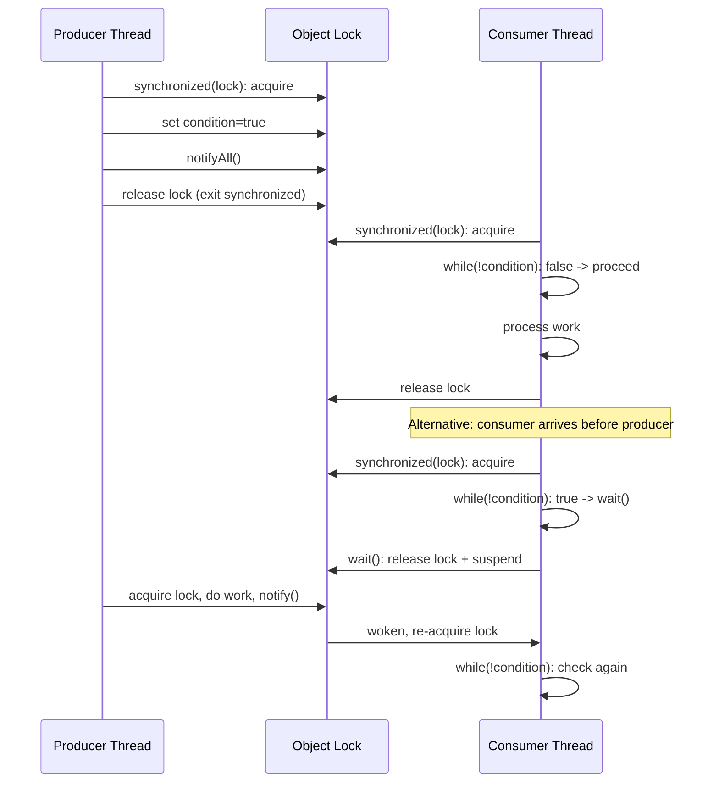

## Keywords in This File
{: .no_toc }

| # | Keyword | Weight |
|---|---|---|
| 1 | [Java Concurrency - L1 Synchronization Basics](#java-concurrency---l1-synchronization-basics) | medium |

---

# Java Concurrency - L1 Synchronization Basics

## synchronized Keyword

---

### 🎯 Model Answer

**30 seconds:**
> `synchronized` is Java's built-in mutual exclusion mechanism. It
> ensures only one thread executes the protected code at a time by
> acquiring an intrinsic lock (monitor) on an object. It also guarantees
> that changes made inside the synchronized block are visible to other
> threads that subsequently acquire the same lock - providing both
> atomicity and visibility. The cost is potential contention when multiple
> threads compete for the same lock.

**3 minutes (Senior):**
> `synchronized` provides two guarantees: mutual exclusion (only one
> thread in the critical section at a time) and memory visibility (a
> thread that acquires a lock sees all writes made by the previous holder
> of that lock). These are the two pillars of thread safety.
>
> You can synchronize on any Java object. Method synchronization uses
> `this` as the lock for instance methods, or `ClassName.class` for
> static methods. Block synchronization lets you choose a specific lock
> object, which is better for fine-grained locking.
>
> The JVM optimizes synchronized aggressively for low-contention cases:
> biased locking (lock biased toward the thread that last acquired it,
> zero-cost re-entry), lightweight locking (CAS-based for brief uncontended
> periods), and heavyweight locking (OS mutex for real contention).
> In practice, well-designed code has low contention and `synchronized`
> is nearly free.
>
> The major limitation: synchronized is not interruptible (a thread
> waiting for the lock cannot be interrupted), has no timeout, does not
> support multiple conditions, and is coarse-grained (entire block is
> critical section). `ReentrantLock` addresses all these limitations at
> the cost of explicit lock/unlock management.

**Framework:** WHAT → WHY → HOW → TRADE-OFF → EXAMPLE

*Adapting up:* Discuss JVM lock optimization phases (biased/thin/fat),
synchronized interaction with Java Memory Model happens-before, and
how synchronized blocks affect virtual thread pinning in Java 21.

*Adapting down:* "synchronized is like a single key to a room - only
one person can be inside at a time. Everyone else must wait outside
until the current person leaves and the key is available."

**Blank Mind Recovery:**

**(1) Restate:** "So you are asking about the synchronized keyword -
let me cover what it does and when to use it."

**(2) First principles:** "From first principles, when two threads read-
modify-write the same data simultaneously, the result is unpredictable.
You need something that lets only one thread enter the critical section.
synchronized is Java's built-in lock for this."

**(3) Bridge:** "synchronized is like a bathroom lock - when you're
inside, the door is locked and no one else can enter. When you leave,
the lock is released and whoever is waiting can enter."

---

### 📘 Concept Explanation

**What it is:**
`synchronized` is a Java keyword that associates a critical section
of code with an object's intrinsic monitor lock. Only one thread can
hold a given object's lock at a time. Attempting to enter a synchronized
block while another thread holds the lock puts the current thread in
BLOCKED state until the lock is released.

**The problem it solves:**
Without synchronization, concurrent reads and writes to shared mutable
state produce race conditions - unpredictable results where the outcome
depends on the non-deterministic ordering of thread operations. The
classic example: `counter++` is three operations (read, increment,
write). Two threads executing simultaneously can both read the same
value and produce a result that is 1 less than expected.

**How it works:**
```java
// Synchronized instance method:
// lock object = this instance
public synchronized void increment() {
    counter++; // only one thread can be here at a time
}

// Synchronized static method:
// lock object = MyClass.class
public static synchronized void classLevel() { ... }

// Synchronized block with explicit lock object (preferred):
private final Object lock = new Object();
public void update() {
    synchronized (lock) {
        // critical section
    }
    // non-critical work here - outside the lock
}
```

> **Code walkthrough:** This example demonstrates the core pattern in action. The key mechanism shows how the concept works in practice. Study the structure to understand the essential behavior and common usage.

When a thread enters a synchronized block:
1. JVM attempts to acquire the object's monitor
2. If no other thread holds it: acquire succeeds immediately
3. If another thread holds it: current thread enters BLOCKED state
4. When the holder exits the block, monitor is released
5. JVM selects one waiting thread to acquire the monitor

Reentrancy: synchronized is reentrant - a thread that already holds
a lock can re-enter synchronized blocks on the same object without
deadlocking. The JVM tracks the hold count.

**The key insight:**
synchronized provides BOTH mutual exclusion AND visibility. The
visibility guarantee (from the Java Memory Model) means: when thread B
enters a synchronized block on object X, it sees all writes made by
thread A that were made before thread A released the lock on X.
Without synchronization, writes in one thread may not be visible
in another thread due to CPU cache incoherence and compiler reordering.

**When to use it:**
- Protecting compound operations on shared state (check-then-act,
  read-modify-write)
- Implementing thread-safe stateful objects where multiple methods
  must act atomically
- Simple, non-contended critical sections where `ReentrantLock`
  overhead is unnecessary

**When NOT to use it:**
- When you need try-lock (attempt without blocking) - use `ReentrantLock`
- When you need interruptible locking - use `ReentrantLock.lockInterruptibly()`
- When you need lock timeouts - use `ReentrantLock.tryLock(timeout)`
- When you need multiple condition variables - use `ReentrantLock` + `Condition`
- When the critical section is just a single atomic operation on a
  counter/reference - use `AtomicInteger`/`AtomicReference`

**Alternatives:**
- `ReentrantLock`: explicit lock with try-lock, timeouts, conditions
- `AtomicInteger`, `AtomicLong`: CAS-based atomic operations without lock
- `java.util.concurrent` collections: thread-safe data structures
  with built-in, optimized locking

**First-principles derivation:**
The minimum requirement for safe concurrent access to shared state is:
(1) mutual exclusion (prevent simultaneous access) and (2) visibility
(ensure writes are seen by readers). CPU memory models and compiler
optimizations can break both without explicit coordination. Java's
`synchronized` keyword, backed by the Java Memory Model, provides
both guarantees at the cost of performance in the contended case.

---

### 💻 Code Example

> **Code walkthrough:** The BAD example has a race condition on counter++
> because it is a compound read-modify-write operation. The GOOD example
> uses synchronized to make the compound operation atomic. The production
> example shows lock granularity - synchronizing on `this` for the entire
> service locks out all concurrent access; synchronizing on a field-specific
> lock allows other operations to proceed concurrently.

```java
// BAD: counter++ is NOT atomic - race condition
public class Counter {
    private int count = 0;

    public void increment() {
        count++; // read(0) -> increment(1) -> write(1)
        // two threads both read 0, both increment to 1,
        // both write 1 -> count = 1 instead of 2
    }
}
```

> **Code walkthrough:** This example demonstrates the core pattern in action. The key mechanism shows how the concept works in practice. Study the structure to understand the essential behavior and common usage.

```java
// GOOD: synchronized method ensures atomic increment
public class Counter {
    private int count = 0;

    public synchronized void increment() {
        count++; // now atomic - lock protects the 3 steps
    }

    public synchronized int getCount() {
        return count; // also synchronized for visibility
    }
}
```

> **Code walkthrough:** This example demonstrates the core pattern in action. The key mechanism shows how the concept works in practice. Study the structure to understand the essential behavior and common usage.

```java
// PRODUCTION: fine-grained locking for better concurrency
public class UserCache {
    private final Map<String, User> cache = new HashMap<>();
    private final Object cacheLock = new Object(); // dedicated lock

    public User getOrLoad(String userId) {
        // check cache without holding lock during load
        synchronized (cacheLock) {
            User cached = cache.get(userId);
            if (cached != null) return cached;
        }
        // Load outside the lock - other threads can read cache
        User loaded = loadFromDatabase(userId); // potentially slow

        synchronized (cacheLock) {
            // Double-check: another thread may have loaded it
            return cache.computeIfAbsent(userId, k -> loaded);
        }
    }
}
```

> **Code walkthrough:** This example demonstrates the core pattern in action. The key mechanism shows how the concept works in practice. Study the structure to understand the essential behavior and common usage.

---

### 🎓 Answers by Seniority

**Junior / Mid (0-5 years):**
> `synchronized` is Java's basic tool for preventing race conditions.
> When you mark a method or block as synchronized, only one thread can
> execute it at a time. All other threads wait. You can synchronize on
> `this` (instance methods), on `ClassName.class` (static methods), or
> on any explicit object. The most important thing: every shared mutable
> state access (read AND write) must be synchronized on the same lock
> to be safe.

*Push deeper:* Explain why both the writer and the reader must synchronize,
not just the writer (visibility guarantee requires both sides to use
the same lock).

---

**Senior / Staff (5+ years):**
> synchronized is the bedrock of Java concurrency, but I use it
> carefully. The key decisions: lock granularity (coarse = easy, fine =
> scalable), lock scope (minimize work inside the lock), and whether
> synchronized is the right tool (AtomicInteger or ConcurrentHashMap
> is usually better for single-variable access). The virtual thread
> caveat in Java 21: synchronized blocks can "pin" virtual threads to
> their carrier OS threads, preventing the multiplexing that makes virtual
> threads scalable. For code that uses virtual threads intensively,
> replace synchronized with ReentrantLock where the critical section
> contains blocking operations.

*Push deeper:* Discuss the JVM's lock escalation from biased locking
to thin locking to fat locking, and the performance implications at
each stage.

---

### ⚠️ Common Misconceptions

**Misconception 1: "synchronized on different objects provides mutual exclusion."**
No. Synchronized blocks on different objects are completely independent.
Thread A in `synchronized(objA)` and Thread B in `synchronized(objB)`
do not interfere with each other. For mutual exclusion, both threads
must synchronize on the SAME object.

**Misconception 2: "Synchronizing the writer is sufficient for thread safety."**
Both writer and reader must synchronize on the same lock to guarantee
visibility. A reader that doesn't synchronize may see a stale value
from its CPU cache even if the writer used synchronized. This is the
Java Memory Model visibility rule.

**Misconception 3: "synchronized(this) in all methods provides complete safety."**
It provides mutual exclusion and visibility, but not atomicity across
multiple method calls. If thread A calls `check()` and then `set()`,
another thread B can interpose between the two calls. For
compound-action safety, you need a single synchronized block that
performs both the check and the set.

**Misconception 4: "synchronized is always slow."**
In low-contention cases (the common case in well-designed code), the
JVM uses biased locking which is nearly zero-cost. The overhead is
significant only when multiple threads contend frequently. Profile
before optimizing.

---

### 🚨 Failure Modes and Diagnosis

**Failure 1: Race condition from missing synchronization on reads**
Symptom: intermittent stale data, values that should have changed
appear unchanged to some threads.
Cause: only the writer synchronized, not the reader. Reader gets
cached stale value.
Diagnosis: add logging of thread names and timestamps; run with
multiple threads and compare read values against expected.
Fix: synchronize both reads and writes on the same lock, or use
`volatile` for single-variable visibility.

**Failure 2: Deadlock from inconsistent lock ordering**
Symptom: application hangs. jstack shows circular lock dependency.
Cause: Thread A acquires lock1 then lock2. Thread B acquires lock2
then lock1. Neither can proceed.
Diagnosis: jstack deadlock detector identifies the cycle.
Fix: enforce consistent lock acquisition order throughout the codebase.

**Failure 3: Reduced throughput from overly coarse synchronization**
Symptom: under load, throughput is far below single-threaded baseline.
Thread dumps show many threads BLOCKED on the same lock.
Cause: large synchronized blocks or synchronized on `this` for methods
that could be independent.
Fix: reduce critical section size, split into multiple locks, or
replace with ConcurrentHashMap/AtomicInteger.

---

### 🎯 Interview Deep-Dive

| Question Category | Time to Answer |
|---|---|
| Definition | 30-60 seconds |
| Mechanism | 1-2 minutes |
| Comparison | 1-2 minutes |
| Scenario | 2-3 minutes |
| Debugging | 2-3 minutes |
| JMM | 2-3 minutes |
| Advanced | 2-3 minutes |

---

**Q1 (Definition): What does synchronized guarantee?**

A: synchronized provides exactly two guarantees:

1. Mutual exclusion: only one thread can execute the synchronized block
   or method at a time. Other threads wait in BLOCKED state until the
   current thread releases the lock.

2. Memory visibility: when thread B acquires a lock that thread A
   previously released, thread B is guaranteed to see all writes that
   thread A made before releasing the lock. This is the "monitor unlock
   happens-before monitor lock" rule in the Java Memory Model.

Without synchronized (or volatile or other JMM mechanisms), writes
by one thread may not be visible to another thread due to CPU cache
incoherence, write buffer reordering, and compiler optimizations.

Note what synchronized does NOT guarantee: fairness (threads may be
bypassed in favor of newly arriving threads), timeliness (no guarantee
on how long a thread waits), progress (a thread holding the lock
forever will block all others indefinitely).

*What separates good from great:* Explaining that synchronized on
different objects provides no mutual exclusion between them - the
"same lock" requirement is fundamental and commonly misunderstood.

---

**Q2 (Mechanism): How does the JVM implement synchronized?**

A: The JVM implements synchronized using the object's monitor, which
is metadata stored in the object's header (mark word in HotSpot's
object layout).

Three-phase lock optimization (lock inflation):

Phase 1 - Biased locking: when only one thread ever accesses the
object, the JVM "biases" the lock to that thread. Subsequent
acquisitions by the same thread are CAS-free - just a pointer check.
Cost: nearly zero for the biased thread.

Phase 2 - Thin lock (lightweight): when a second thread tries to
acquire, the JVM inflates to a CAS-based spinlock. The object header
stores the thread ID attempting the lock. Cost: ~CAS operation.

Phase 3 - Fat lock (heavyweight/inflated): when contention is detected
(spinning unsuccessful), the JVM creates a full OS mutex. Threads go
to sleep and wake up via OS signals. Cost: OS context switch (~1-10
microseconds).

The `monitorenter` and `monitorexit` bytecodes implement enter and
exit. The JIT compiler can eliminate locks entirely when it proves
(via escape analysis) that the locked object doesn't escape the
thread.

*What separates good from great:* Knowing that biased locking was
disabled by default in Java 15 (JEP 374) because the revocation cost
when a second thread appears was not worth the benefit for most modern
workloads. The JVM now starts directly with thin locking.

---

**Q3 (Comparison): synchronized vs ReentrantLock - when to use which?**

A: `synchronized` is preferred when:
- The critical section is simple (no timeout, no try-lock needed)
- You want the JVM to manage lock/unlock (cannot forget to unlock)
- The lock is not held across blocking operations (no I/O inside lock)
- The code must work with virtual threads without pinning concerns...
  wait, actually the opposite - see below

`ReentrantLock` is necessary when:
- You need try-lock: `lock.tryLock()` attempts without blocking
- You need timeout: `lock.tryLock(1, TimeUnit.SECONDS)`
- You need interruptible lock: `lock.lockInterruptibly()`
- You need multiple conditions: `lock.newCondition()` creates
  condition variables for producer-consumer patterns
- You need fair lock: `new ReentrantLock(true)` gives FIFO ordering
- You use virtual threads intensively: `synchronized` can pin virtual
  threads; `ReentrantLock` does not

The safety trade-off: `synchronized` auto-releases on exit and exception.
`ReentrantLock` requires explicit `unlock()` in a finally block - forgetting
is a bug. Use `synchronized` unless you need ReentrantLock's features.

*What separates good from great:* The virtual thread pinning issue:
in Java 21, `synchronized` blocks pin virtual threads to their carrier
OS threads, preventing the multiplexing that makes virtual threads
efficient. For high-concurrency I/O paths, `ReentrantLock` is the
preferred choice in Java 21+.

---

**Q4 (Scenario): How would you make this UserService thread-safe?**

Given:
```java
class UserService {
    private Map<Long, User> users = new HashMap<>();
    public void add(User u) { users.put(u.id(), u); }
    public User get(long id) { return users.get(id); }
    public void remove(long id) { users.remove(id); }
}
```

> **Code walkthrough:** This example demonstrates the core pattern in action. The key mechanism shows how the concept works in practice. Study the structure to understand the essential behavior and common usage.

A: Several options with different trade-offs:

Option 1: Replace HashMap with ConcurrentHashMap (best for this case):
```java
private final ConcurrentHashMap<Long, User> users =
    new ConcurrentHashMap<>();
// No synchronized needed - ConcurrentHashMap handles it
// individual gets/puts are thread-safe
```

> **Code walkthrough:** This example demonstrates the core pattern in action. The key mechanism shows how the concept works in practice. Study the structure to understand the essential behavior and common usage.

Option 2: Synchronized methods (simple but coarse):
```java
public synchronized void add(User u) { users.put(u.id(), u); }
public synchronized User get(long id) { return users.get(id); }
public synchronized void remove(long id) { users.remove(id); }
```

> **Code walkthrough:** This example demonstrates the core pattern in action. The key mechanism shows how the concept works in practice. Study the structure to understand the essential behavior and common usage.

Option 3: Collections.synchronizedMap (avoid - iteration unsafe):
```java
private final Map<Long, User> users =
    Collections.synchronizedMap(new HashMap<>());
// Still need synchronized block during iteration
```

> **Code walkthrough:** This example demonstrates the core pattern in action. The key mechanism shows how the concept works in practice. Study the structure to understand the essential behavior and common usage.

Option 1 (ConcurrentHashMap) is the right answer here: it provides
thread-safe put/get/remove without coarse-grained locking. If the
service needs compound operations (get-then-update atomically), use
`computeIfAbsent()`, `compute()`, or `merge()` methods which are
atomic at the map level.

*What separates good from great:* Noting that `ConcurrentHashMap`
provides per-bucket locking (Java 8+) while `synchronizedMap` uses
a global lock - ConcurrentHashMap scales to many concurrent writers
while synchronizedMap serializes all access.

---

**Q5 (Debugging): Your synchronized method is still producing
incorrect results under load. Why?**

A: Several causes for this:

Cause 1: Synchronizing on different objects.
```java
// Bug: each instance creates its own lock
class Service {
    private final Object lock = new Object(); // different per instance
    private static int count = 0; // shared state!

    synchronized(lock) { count++; } // fails: different locks for shared state
}
// Fix: synchronize on the class, or use AtomicInteger
```

> **Code walkthrough:** This example demonstrates the core pattern in action. The key mechanism shows how the concept works in practice. Study the structure to understand the essential behavior and common usage.

Cause 2: Compound operations not atomic.
```java
// Bug: two synchronized calls are not atomic together
if (service.contains(key)) {    // synchronized check
    service.get(key).process(); // synchronized get - different lock acquisition
    // another thread can remove(key) between contains() and get()
}
```

> **Code walkthrough:** This example demonstrates the core pattern in action. The key mechanism shows how the concept works in practice. Study the structure to understand the essential behavior and common usage.

Cause 3: Getter not synchronized (visibility broken).
```java
class Counter {
    private int count = 0;
    public synchronized void increment() { count++; }
    public int get() { return count; } // NOT synchronized - stale read
}
```

> **Code walkthrough:** This example demonstrates the core pattern in action. The key mechanism shows how the concept works in practice. Study the structure to understand the essential behavior and common usage.

Cause 4: Lock not held by the same object reference.
```java
synchronized (someField) { // if someField is reassigned, different lock!
```

> **Code walkthrough:** This example demonstrates the core pattern in action. The key mechanism shows how the concept works in practice. Study the structure to understand the essential behavior and common usage.

Diagnosis: Use jcstress for stress-testing correctness, or add
assertions and run with many threads and iterations to expose failures.

*What separates good from great:* The compound operation case is
the most insidious - each individual method is thread-safe, but
combinations of calls are not. The fix is to expose a single
synchronized method that does the entire compound operation.

---

**Q6 (JMM): What is the Java Memory Model relationship between
synchronized blocks?**

A: The Java Memory Model (JMM) defines when writes in one thread
are guaranteed to be visible to reads in another thread. For
synchronized, the rule is:

"A monitor unlock (exit from synchronized) on object M
happens-before every subsequent monitor lock (entry to synchronized)
on the same M."

In practice: when Thread A releases the lock on object M, all writes
Thread A made before releasing are visible to Thread B after Thread B
acquires the lock on M.

This has implications:
- If Thread A writes to field `x` inside `synchronized(lock)` and
  Thread B reads field `x` inside `synchronized(lock)`, thread B
  is guaranteed to see Thread A's write IF B's lock acquisition
  happens after A's lock release.
- If Thread B reads `x` WITHOUT synchronizing, there is NO visibility
  guarantee, even if Thread A used synchronized for its write.

This is why "only synchronize the writer" is wrong. The reader must
also synchronize (on the same lock) to get the visibility guarantee.

*What separates good from great:* The "subsequent" part of the rule
is important - it means B's lock acquisition must HAPPEN AFTER A's
lock release in real time. If B acquired the lock before A released it,
B does not see A's writes (it is still holding the lock when A
enters, so A's writes happen after B's read).

---

**Q7 (Advanced): How does synchronized interact with virtual
threads in Java 21?**

A: In Java 21, when a virtual thread executes code inside a
`synchronized` block and performs a blocking operation (I/O, sleep,
another lock acquisition), the virtual thread "pins" to its carrier
OS thread instead of unmounting.

Pinning means: the carrier OS thread cannot be reused by other virtual
threads while the pinned virtual thread is blocked. This undermines
the key benefit of virtual threads - if all carrier threads are pinned,
new virtual threads must wait for a carrier, eliminating scalability.

Detection:
```
-Djdk.tracePinnedThreads=full
```
> **Code walkthrough:** This example demonstrates the core pattern in action. The key mechanism shows how the concept works in practice. Study the structure to understand the essential behavior and common usage.

This JVM flag logs when virtual threads pin, with the stack trace
showing where pinning occurs.

The fix: replace `synchronized` with `ReentrantLock` in code that
runs in virtual threads and contains blocking operations:

```java
// Before (pins virtual thread):
synchronized (lock) {
    result = queryDatabase(); // blocks - pins carrier thread
}

// After (allows unmounting):
lock.lock();
try {
    result = queryDatabase(); // virtual thread unmounts here
} finally {
    lock.unlock();
}
```

> **Code walkthrough:** This example demonstrates the core pattern in action. The key mechanism shows how the concept works in practice. Study the structure to understand the essential behavior and common usage.

Libraries that use `synchronized` internally (some JDBC drivers,
old Gson/Jackson internals) can cause pinning. Monitor for this and
push library maintainers to use ReentrantLock.

*What separates good from great:* Knowing that pinning is a
performance issue, not a correctness issue. Code with pinning still
works correctly - it just doesn't scale as well as expected with virtual
threads. The JDK itself has been updated to replace most internal
synchronized blocks with ReentrantLock for this reason.

---

### ⚖️ Comparison Table

*(Omit: L1 foundational - comparison between synchronized and
ReentrantLock covered in depth in Q3 above and in the
L2 Locks and Conditions file.)*

---

### 🏛️ System Design

*(Omit: L1 foundational - system design context not applicable.)*

---

### 📊 Diagram

*(Omit: synchronized mechanism is well-described in text and code
examples above. The L3+ files include diagrams for lock contention
patterns.)*

---
---

## volatile Keyword

---

### 🎯 Model Answer

**30 seconds:**
> `volatile` is Java's lighter-weight synchronization mechanism. It
> guarantees visibility: writes to a volatile variable are immediately
> visible to all other threads. It does NOT provide atomicity for
> compound operations - only synchronized or atomic classes do that.
> Use volatile for single-variable flags or state indicators where you
> need visibility across threads but not exclusive access.

**3 minutes (Senior):**
> volatile addresses the visibility half of thread safety, without
> the mutual exclusion of synchronized. Without volatile, the JIT
> compiler and CPU can keep variables in registers or cache, meaning
> one thread's write may not be visible to another thread reading the
> same variable - potentially forever.
>
> volatile inserts memory barriers around reads and writes: a write
> barrier flushes the write to main memory and invalidates other
> threads' cached copies; a read barrier causes the thread to read
> from main memory rather than cache.
>
> The critical rule: volatile is correct only for single-variable
> access where reads and writes are independent. `counter++` is NOT
> safe with just volatile because it is three operations. Only the
> individual read or write is atomic.
>
> Classic correct use: a stop flag in a background thread.
> `private volatile boolean running = true;` - the main thread sets
> `running = false`, and the background thread eventually sees the
> change and stops. Without volatile, the background thread may never
> see the change.

**Framework:** WHAT → WHY → HOW → TRADE-OFF → EXAMPLE

*Adapting up:* Discuss the Java Memory Model's volatile happens-before
rule (write to volatile X happens-before every subsequent read of X),
and how the JMM's volatile semantics are stronger than volatile in C/C++.

*Adapting down:* "volatile is like a whiteboard visible to everyone in
the room - when you write on it, everyone immediately sees the change.
Without volatile, each person has a personal notepad and may not see
updates from others."

**Blank Mind Recovery:**

**(1) Restate:** "So you are asking about the volatile keyword -
let me explain what problem it solves and when to use it."

**(2) First principles:** "From first principles: CPUs have caches to
speed up memory access. Without coordination, thread A writes to a
cache, thread B reads from a different cache, and they see different
values for the same variable. volatile forces writes to main memory
and reads from main memory."

**(3) Bridge:** "volatile is like keeping a shared document in a
synced folder (Dropbox) vs on your local desktop. Without volatile:
local desktop, changes aren't synced. With volatile: Dropbox, every
change is immediately visible to others."

---

### 📘 Concept Explanation

**What it is:**
`volatile` is a Java field modifier that guarantees visibility of
writes to that field across all threads. A volatile write is guaranteed
to be immediately visible to subsequent volatile reads of the same
variable from other threads. It does not provide mutual exclusion.

**The problem it solves:**
The Java Memory Model (JMM) allows the JIT compiler and CPU to keep
variable values in registers or CPU caches. A thread writing a
variable may not flush it to main memory immediately. Another thread
reading that variable may get a stale cached value. volatile forces
flushes and prevents caching, ensuring visibility.

**How it works:**
Under the hood, volatile generates memory fence instructions:
- **Write fence:** after writing a volatile variable, all prior writes
  (including non-volatile) are flushed to main memory
- **Read fence:** before reading a volatile variable, all cached values
  are invalidated, forcing a read from main memory

```java
class StopFlag {
    private volatile boolean running = true;

    public void stop() {
        running = false; // write + write fence = flush to main memory
    }

    public void run() {
        while (running) { // read fence on each iteration = fresh read
            doWork();
        }
    }
}
```

> **Code walkthrough:** This example demonstrates the core pattern in action. The key mechanism shows how the concept works in practice. Study the structure to understand the essential behavior and common usage.

JMM happens-before rule: a write to a volatile variable V
happens-before every subsequent read of V. This means:
- All writes made by thread A before writing to volatile V are visible
  to thread B after thread B reads volatile V

**The key insight:**
volatile provides visibility but NOT atomicity. The classic example:
```java
volatile long counter = 0;
counter++; // STILL a race condition!
// This is: read(counter), increment, write(counter)
// Two threads can interleave between read and write
```
> **Code walkthrough:** This example demonstrates the core pattern in action. The key mechanism shows how the concept works in practice. Study the structure to understand the essential behavior and common usage.

For atomic compound operations, use `synchronized` or `AtomicLong`.

**When to use it:**
- Boolean stop/running flags checked by multiple threads
- Double-checked locking with the volatile guarantee (DCL pattern)
- Publishing immutable objects (volatile reference guarantees
  other threads see the fully constructed object)
- Single-variable state indicators read by many threads, written
  by few

**When NOT to use it:**
- Counter increments/decrements (use AtomicInteger)
- Compound check-then-act operations (use synchronized)
- When multiple related variables must be updated atomically
  (volatile on each is insufficient - use synchronized)

**Alternatives:**
- `synchronized`: mutual exclusion + visibility
- `AtomicInteger`, `AtomicLong`: CAS-based atomic updates
- `AtomicReference`: atomic reference swapping with full memory fence

**First-principles derivation:**
Modern CPUs have 3-4 levels of cache (L1: ~1ns, L2: ~4ns, L3: ~10ns,
RAM: ~100ns). Writing to cache is 100x faster than writing to RAM.
The CPU naturally writes to cache first and flushes asynchronously.
In a multi-core system, each core has separate L1/L2 caches. Without
explicit synchronization, cores may have different cached values for
the same memory address. volatile forces synchronization with main
memory, at the cost of the cache performance benefit.

---

### 💻 Code Example

> **Code walkthrough:** The BAD example has a non-volatile stop flag
> that the background thread may never see updated due to CPU cache
> optimization. The GOOD example uses volatile to ensure the update is
> immediately visible. The DCL (Double-Checked Locking) example shows
> the correct use of volatile for lazy initialization - a pattern that
> was broken in Java before volatile was properly specified.

```java
// BAD: non-volatile flag - background thread may loop forever
class BackgroundWorker {
    private boolean running = true; // NOT volatile - JIT may cache

    void stop() { running = false; } // may not flush to main memory

    void run() {
        while (running) { // JIT may compile to: while(true) - infinite!
            doWork();
        }
    }
}
```

> **Code walkthrough:** This example demonstrates the core pattern in action. The key mechanism shows how the concept works in practice. Study the structure to understand the essential behavior and common usage.

```java
// GOOD: volatile ensures visibility
class BackgroundWorker {
    private volatile boolean running = true; // volatile - visibility

    void stop() {
        running = false; // write + memory fence = visible to all threads
    }

    void run() {
        while (running) { // reads from main memory each iteration
            doWork();
        }
    }
}
```

> **Code walkthrough:** This example demonstrates the core pattern in action. The key mechanism shows how the concept works in practice. Study the structure to understand the essential behavior and common usage.

```java
// CLASSIC: Double-Checked Locking (DCL) - requires volatile
class Singleton {
    // volatile is required for correct DCL in Java 5+
    // Without volatile, partially constructed instance can be visible
    private static volatile Singleton instance;

    public static Singleton getInstance() {
        if (instance == null) {            // first check (no lock)
            synchronized (Singleton.class) {
                if (instance == null) {    // second check (under lock)
                    instance = new Singleton(); // volatile write
                }
            }
        }
        return instance; // volatile read
    }
}
```

> **Code walkthrough:** This example demonstrates the core pattern in action. The key mechanism shows how the concept works in practice. Study the structure to understand the essential behavior and common usage.

---

### 🎓 Answers by Seniority

**Junior / Mid (0-5 years):**
> volatile is a field modifier that ensures writes to the variable are
> immediately visible to all other threads. Without it, threads may
> read stale cached values. You use it for simple flags - like a boolean
> `running` flag that one thread sets to false to stop a background thread.
> Important: volatile does NOT make operations atomic. `counter++` is
> still a race condition even with volatile. For atomic operations on
> numbers, use `AtomicInteger`.

*Push deeper:* Explain why DCL (Double-Checked Locking) requires volatile
and what the failure mode is without it.

---

**Senior / Staff (5+ years):**
> volatile provides the visibility half of thread safety. The JMM
> says: a volatile write happens-before every subsequent volatile read
> of the same variable. That "subsequent" qualifier matters - if thread B
> reads volatile X before thread A has written it, B may see the old value
> regardless of volatile. Volatile also has a useful side effect: the
> write fence before a volatile write flushes ALL pending writes to main
> memory, not just the volatile variable. This is why volatile on a
> reference can make a newly constructed object safely visible to other
> threads - the constructor writes are flushed before the reference write.
> I use volatile for stop flags, published references, and as part of
> the DCL pattern. For most other shared state, synchronized or
> concurrent collections are clearer about intent.

*Push deeper:* Discuss why "piggybacking" on volatile semantics (using
a volatile write to publish non-volatile writes) is a risky pattern
that makes code hard to reason about, even though it is technically
valid per JMM.

---

### ⚠️ Common Misconceptions

**Misconception 1: "volatile makes operations atomic."**
No. Volatile guarantees visibility for single variable reads/writes.
`counter++` (read-modify-write) is three operations and remains a race
condition with volatile. Use `AtomicInteger.incrementAndGet()`.

**Misconception 2: "volatile is only needed on multi-core systems."**
Java's JMM is defined independently of the hardware. The JIT compiler
itself can hoist loop-invariant reads out of loops, causing a
non-volatile variable to be read once and never again, regardless of
core count. This is a compile-time optimization, not just hardware.

**Misconception 3: "volatile has no performance cost."**
Volatile reads/writes generate memory fence instructions that prevent
CPU out-of-order execution and cache optimizations. In tight loops
on hot variables, this can reduce throughput by 2-10x compared to
plain field access.

---

### 🚨 Failure Modes and Diagnosis

**Failure 1: Infinite loop from non-volatile stop flag**
Symptom: background thread never stops after stop() is called.
Application hangs at shutdown or doesn't stop processing.
Cause: JIT compiler optimizes `while(running)` to `while(true)` when
it determines running is not modified in the loop thread's scope.
Fix: mark the flag `volatile`.

**Failure 2: Partially constructed object visible via non-volatile reference**
Symptom: NullPointerException or incorrect field values when reading
an object that was just assigned.
Cause: without volatile, the reference to a new object can be visible
to other threads before the object's constructor has finished writing
its fields (reordering in the JIT/CPU).
Fix: mark the shared reference volatile, or use final fields
(which have their own JMM publication guarantee).

**Failure 3: Race condition on volatile with compound operations**
Symptom: counter values are incorrect despite volatile.
Cause: treating volatile as equivalent to synchronized for
check-then-act patterns.
Fix: use `synchronized` or `AtomicInteger` for compound operations.

---

### 🎯 Interview Deep-Dive

| Question Category | Time to Answer |
|---|---|
| Definition | 30-60 seconds |
| Mechanism | 1-2 minutes |
| Comparison | 1-2 minutes |
| Scenario | 2-3 minutes |
| Debugging | 2-3 minutes |
| JMM | 2-3 minutes |
| Advanced | 2-3 minutes |

---

**Q1 (Definition): What does volatile guarantee?**

A: volatile provides exactly one guarantee: visibility. Specifically,
per the Java Memory Model: a write to volatile variable V happens-before
every subsequent read of V.

This means: after thread A writes to volatile V, any thread B that
subsequently reads V will see the value thread A wrote. Additionally,
all writes that thread A made before the volatile write are also visible
to thread B (the write fence propagates all pending writes).

What volatile does NOT guarantee:
- Atomicity for compound operations (read-modify-write)
- Ordering between accesses to different volatile variables
- Mutual exclusion (no lock acquired)
- That only one thread writes at a time

Practical test for whether volatile is sufficient: if the correct
behavior requires only that other threads see the latest written value,
and only one thread writes at a time, volatile is sufficient.
If multiple threads write to the same variable (or one thread does
read-modify-write), you need synchronized or atomic classes.

*What separates good from great:* The "happens-before" chain -
because a volatile write happens-before a subsequent volatile read,
ALL writes made before the volatile write are also visible after the
volatile read. This is the "piggybacking" visibility property that
makes volatile useful for publishing immutable objects.

---

**Q2 (Mechanism): Why can the JIT compiler make a non-volatile
read produce stale values?**

A: The JIT compiler performs "common subexpression elimination" and
"loop invariant code motion" optimizations. If it determines that a
field is read but never modified within a method or loop, it can:

1. Read the field once and keep the value in a CPU register
2. Never re-read from main memory for subsequent accesses

Example: in a method like `while(running) { doWork(); }`, the JIT
may determine that `running` is never modified within `doWork()`, so
it optimizes to read `running` once before the loop. If another thread
sets `running = false`, the change is in main memory but the local
register value is still `true` - the loop runs forever.

This is NOT a JVM bug - it is a legal optimization under the Java
Memory Model, which explicitly allows threads to cache non-volatile
variables. volatile tells the JMM that this field may be written by
other threads, preventing the caching optimization.

Additional mechanism: CPUs also have store buffers - writes may sit
in the CPU's write buffer before being flushed to main memory. Other
cores cannot see values in another core's write buffer. A volatile
write drains the store buffer (store-store fence + load-store fence).

*What separates good from great:* Explaining that the JMM is defined
in terms of allowed behaviors, not specific hardware. Even on systems
where the hardware would guarantee visibility, a conforming JVM
implementation is allowed to cache non-volatile variables. Volatile
is the correct way to communicate the intent to the JVM, regardless
of hardware.

---

**Q3 (Comparison): When should you use volatile vs AtomicInteger?**

A: Use volatile for:
- Boolean flags (stop flags, published flags)
- Single-assignment references (publish an immutable object)
- Any single read or write that is independent (not compound)
- Cases where you only need visibility, not atomicity

Use AtomicInteger (and the atomic classes) for:
- Counters: `counter.incrementAndGet()` is one atomic operation
- Conditional updates: `compareAndSet(expected, update)` - update
  only if current value matches expected
- Accumulators: `LongAdder` for high-concurrency counters

The key rule: if the operation is a single read or a single write,
volatile is often sufficient. If the operation is check-then-act or
read-modify-write, you need atomics or synchronized.

Example: `volatile int counter; counter++;` is still a race condition.
`AtomicInteger counter; counter.incrementAndGet();` is atomic.

*What separates good from great:* Knowing that `AtomicInteger` also
provides memory visibility (its operations are defined with full fence
semantics in the JMM) - you don't need volatile on top of Atomic.

---

**Q4 (Scenario): Fix this broken singleton with volatile:**

```java
// Is this correct?
class Config {
    private static Config instance;
    public static Config get() {
        if (instance == null) {
            synchronized (Config.class) {
                if (instance == null) {
                    instance = new Config();
                }
            }
        }
        return instance;
    }
}
```

> **Code walkthrough:** This example demonstrates the core pattern in action. The key mechanism shows how the concept works in practice. Study the structure to understand the essential behavior and common usage.

A: This is Double-Checked Locking (DCL) and it is broken without
volatile on `instance`.

The bug: without `volatile instance`, the JIT or CPU can reorder
the operations inside `new Config()`. Specifically, the constructor
writes can be reordered so that the reference to the partially
constructed object is published BEFORE all constructor writes complete.

Thread A does: (1) allocate memory, (2) store reference (instance =
memory), (3) run constructor. Without volatile, step 2 and step 3
can be reordered. Thread B reads instance, sees non-null, returns
a partially constructed Config object.

Fix: `private static volatile Config instance;`

With volatile, the write to instance is a volatile write, which
inserts a store-store fence that prevents the constructor writes from
being reordered after the reference assignment.

The modern alternative: use an enum singleton or static holder pattern,
which leverage class loading guarantees for safe publication without
needing volatile:

```java
class Config {
    // JVM guarantees class initialization is thread-safe
    private static class Holder {
        static final Config INSTANCE = new Config();
    }
    public static Config get() { return Holder.INSTANCE; }
}
```

> **Code walkthrough:** This example demonstrates the core pattern in action. The key mechanism shows how the concept works in practice. Study the structure to understand the essential behavior and common usage.

*What separates good from great:* Knowing that the static holder
pattern is often preferred over DCL because it's simpler, leverages
JVM class loading safety, and requires no volatile.

---

**Q5 (Debugging): A background thread stops working even though the
loop condition should still be true. How do you diagnose?**

A: This is a classic volatile visibility bug. Diagnosis steps:

Step 1: Check if the condition variable is volatile. If not, this is
the root cause - the JIT has cached the old value.

Step 2: Verify the condition is actually being set to false somewhere.
Add logging to the setter: `log.info("Stopping: running={}", running)`.

Step 3: Run with JIT disabled (`-Xint`) to verify if the bug
disappears. If it does, it's a JIT optimization affecting visibility.

Step 4: Use the `-XX:+PrintCompilation` flag to see if the method
containing the loop is being JIT-compiled (and thus subject to the
loop invariant optimization).

Quick test: if you add `Thread.sleep(1)` or `System.out.println()`
inside the loop, the bug may disappear because these methods act as
memory barriers in practice (though not guaranteed). This pattern
confirms a visibility issue.

Fix: add `volatile` to the condition variable. If the loop is
performance-critical, consider periodic re-checks of a volatile
counter rather than checking volatile on every iteration.

*What separates good from great:* The "sleep/println makes bug
disappear" diagnostic is a classic. It happens because `sleep()` and
print operations contain JMM memory barriers (they call native methods
which flush caches), incidentally providing the visibility guarantee.
But this is a coincidence, not a fix - the correct fix is volatile.

---

**Q6 (JMM): What is the volatile happens-before rule and what
does it transitively guarantee?**

A: The JMM volatile rule: "A write to a volatile field V
happens-before every subsequent read of V."

The "happens-before" relationship is transitive: if A hb B and B hb C,
then A hb C. This means:

1. Thread A writes fields x and y (non-volatile)
2. Thread A writes volatile field v ("publishing")
3. Thread B reads volatile field v
4. Thread B reads fields x and y

Due to happens-before transitivity:
- A's writes to x and y (step 1) happens-before A's write to v (step 2)
  [program order rule]
- A's write to v (step 2) happens-before B's read of v (step 3)
  [volatile rule]
- B's read of v (step 3) happens-before B's reads of x, y (step 4)
  [program order rule]
- Therefore: A's writes to x, y happen-before B's reads of x, y

This is the "safe publication" pattern: if you write an immutable
object, store its reference in a volatile field, and another thread
reads that volatile reference, the other thread is guaranteed to see
the fully constructed object.

*What separates good from great:* Understanding why "subsequent" matters.
The rule says volatile write hb "subsequent" volatile read. If thread B
read the volatile variable BEFORE thread A wrote it, B sees the old value.
"Happens-before" is not about time - it's about program-order relationships.
Two threads reading and writing simultaneously have no defined ordering
without additional synchronization.

---

**Q7 (Advanced): Can volatile solve the read-visibility problem
for a long and double on 32-bit JVMs?**

A: Yes, and this is one of volatile's historically important uses.

On 32-bit JVMs, `long` and `double` are 64-bit values that may be
read and written in two 32-bit operations. Without volatile, a write
of a long from one thread and a read from another thread can interleave,
causing the reader to see a value composed of the high 32 bits from
one write and the low 32 bits from another - a "torn" read.

This is the "non-atomic long/double" problem in the JMM. JMM section
17.7 explicitly allows this for non-volatile longs and doubles.

Solution: marking a long or double volatile guarantees atomic reads
and writes, preventing tearing.

Modern relevance: 64-bit JVMs (which are now universal on server-side
Java) implement atomic reads and writes for long and double as a
vendor-specific extension, even without volatile. But the JMM spec
still allows tearing on 32-bit, so for portable code that might run
on 32-bit JVMs (embedded, Android), volatile on shared long/double
fields is still the safe choice.

*What separates good from great:* Knowing that this is primarily
historical context for modern production Java (all servers are 64-bit),
but being able to explain it shows depth of JMM understanding.

---

### ⚖️ Comparison Table

*(Omit: L1 foundational - volatile vs synchronized comparison is
covered in the Q3 above. Full comparison tables at L2+.)*

---

### 🏛️ System Design

*(Omit: L1 foundational - system design context not applicable.)*

---

### 📊 Diagram

*(Omit: volatile memory semantics are best explained through the
mechanism description and code examples above.)*

---
---

## Object Monitor and wait/notify

---

### 🎯 Model Answer

**30 seconds:**
> Every Java object has an intrinsic monitor - a locking mechanism built
> into the object header. `wait()` releases the monitor and suspends the
> thread until another thread calls `notify()` or `notifyAll()` on the
> same object. Together, they implement the producer-consumer coordination
> pattern: producers call `notifyAll()` after adding work, consumers call
> `wait()` when there is no work. Always call `wait()` inside a `while`
> loop checking the condition, never an `if` statement.

**3 minutes (Senior):**
> The Object monitor is Java's built-in condition variable. Every Java
> object - regardless of class - has a monitor with two queues: the entry
> set (threads waiting to acquire the lock, in BLOCKED state) and the wait
> set (threads that called `wait()`, in WAITING state and have released
> the lock).
>
> The critical invariant: `wait()` must be called inside a `synchronized`
> block on the same object. When `wait()` is called: the thread atomically
> releases the lock and enters the wait set. When `notify()` is called:
> one waiting thread is moved from the wait set to the entry set - it must
> re-acquire the lock before continuing. `notifyAll()` moves all waiting
> threads to the entry set.
>
> The "spurious wakeup" issue: a thread can wake from `wait()` without
> `notify()` being called - this is a specified behavior in the JMM for
> implementation flexibility. This is why `wait()` must always be in a
> `while` loop:
> ```java
> while (!condition) {
>     lock.wait(); // not: if (!condition) { lock.wait(); }
> }
> ```
>
> In modern Java, `java.util.concurrent.locks.Condition` (from
> `ReentrantLock`) is preferred over `wait/notify` because it supports
> multiple condition variables per lock, timeouts, and interruptible waits.

**Framework:** WHAT → WHY → HOW → TRADE-OFF → EXAMPLE

*Adapting up:* Discuss `Condition.await()` vs `Object.wait()`, the
"lost notification" bug pattern, and how `BlockingQueue` abstracts
the entire producer-consumer pattern without exposing wait/notify.

*Adapting down:* "wait() is like telling a worker 'stop and wait until
I call you again'. notify() is the call. The worker has to actively
listen for the call and re-check that the work is ready."

**Blank Mind Recovery:**

**(1) Restate:** "So you are asking about wait and notify - let me
cover the producer-consumer coordination pattern they implement."

**(2) First principles:** "From first principles: a producer thread
creates work and a consumer thread processes it. The consumer needs to
wait when there's nothing to do, and wake up when work arrives. That's
exactly what wait/notify provides."

**(3) Bridge:** "wait/notify is like an employee waiting for a task
assignment. wait() = sit at your desk, stop what you're doing, release
the shared resource (lock). notify() = your manager calls you with a
new task. You re-check your inbox (condition) before starting."

---

### 📘 Concept Explanation

**What it is:**
Java's `Object.wait()`, `Object.notify()`, and `Object.notifyAll()`
implement condition-based thread coordination. Every Java object has
a built-in monitor with a wait set. `wait()` releases the lock and
parks the thread; `notify()` wakes one parked thread; `notifyAll()`
wakes all parked threads.

**The problem it solves:**
Mutual exclusion (synchronized) answers "only one thread in here at
a time." Condition coordination answers "this thread should wait until
some condition becomes true." Producer-consumer patterns, bounded
buffers, and event notification all need condition coordination.

**How it works:**
```
Object's monitor has two queues:
  Entry set: threads waiting to acquire the lock (BLOCKED)
  Wait set:  threads that called wait() (WAITING)

Flow:
Thread A (consumer):
  1. Enter synchronized block -> acquire lock
  2. Check condition: while(!ready) { object.wait(); }
     -> release lock, join wait set, state = WAITING
  3. When notified: re-acquire lock, re-check condition
  4. Process work

Thread B (producer):
  1. Enter synchronized block -> acquire lock
  2. Produce work
  3. Set ready = true
  4. object.notifyAll() -> move waiting threads to entry set
  5. Exit synchronized -> release lock
  6. Waiting threads compete for lock, check condition
```

> **Code walkthrough:** This example demonstrates the core pattern in action. The key mechanism shows how the concept works in practice. Study the structure to understand the essential behavior and common usage.

The atomicity contract: `wait()` atomically releases the lock and
suspends - no other thread can sneak in and call notify() between the
lock release and the suspension. This prevents the "lost notification"
race condition.

**The key insight:**
Always use `while`, never `if`, for the condition check around `wait()`:
```java
// CORRECT:
synchronized (lock) {
    while (!conditionIsTrue()) {
        lock.wait();
    }
    // process...
}

// WRONG - spurious wakeup bug:
synchronized (lock) {
    if (!conditionIsTrue()) {
        lock.wait();
    }
    // may proceed when condition is still false
}
```

> **Code walkthrough:** This example demonstrates the core pattern in action. The key mechanism shows how the concept works in practice. Study the structure to understand the essential behavior and common usage.

Two reasons for while: (1) spurious wakeups (thread wakes without
`notify()` - spec-allowed), and (2) multiple threads may wake on
`notifyAll()` but only one condition "slot" is available.

**When to use it:**
- Classic producer-consumer with a shared buffer
- Gate patterns: wait until initialization completes
- Simple thread coordination between exactly two threads

**When NOT to use it:**
- When `BlockingQueue` can replace the entire pattern
  (producer adds, consumer takes, blocking handled internally)
- When multiple condition variables are needed per lock
  (use `ReentrantLock` + `Condition` instead)
- In production code that requires timeout or interrupt support
  (use `Condition.await(long, TimeUnit)` instead)

**Alternatives:**
- `BlockingQueue`: encapsulates producer-consumer without exposing wait/notify
- `ReentrantLock` + `Condition.await()/signal()`: explicit conditions
  with timeout, interruptible, multiple conditions per lock
- `CountDownLatch`: one-time gate pattern
- `SynchronousQueue`: direct hand-off between producer and consumer

**First-principles derivation:**
Mutual exclusion alone is not sufficient for concurrent programs.
You also need a way to say "do nothing until some condition holds,
then proceed." This is the "condition wait" pattern from operating
systems theory. Java's wait/notify implements this on every object,
making it universally available without additional data structures.

---

### 💻 Code Example

> **Code walkthrough:** The BAD example uses `if` for the condition check
> and doesn't call wait inside synchronized, which causes an
> IllegalMonitorStateException. The GOOD example shows the correct while
> loop pattern. The production example shows BlockingQueue as the
> preferred replacement that handles all the locking complexity internally.

```java
// BAD: if instead of while (spurious wakeup bug) + missing synchronized
class BadBuffer {
    private List<String> buffer = new ArrayList<>();

    void consume() throws InterruptedException {
        // Missing synchronized! -> IllegalMonitorStateException
        if (buffer.isEmpty()) {
            this.wait(); // WRONG: if allows spurious wakeup to proceed
        }
        process(buffer.remove(0));
    }
}
```

> **Code walkthrough:** This example demonstrates the core pattern in action. The key mechanism shows how the concept works in practice. Study the structure to understand the essential behavior and common usage.

```java
// GOOD: correct wait/notify pattern
class BoundedBuffer {
    private final List<String> buffer = new ArrayList<>();
    private final int capacity = 10;

    // Called by producer thread
    synchronized void produce(String item)
            throws InterruptedException {
        while (buffer.size() == capacity) {
            this.wait(); // wait until space available
        }
        buffer.add(item);
        this.notifyAll(); // wake consumers
    }

    // Called by consumer thread
    synchronized String consume()
            throws InterruptedException {
        while (buffer.isEmpty()) {
            this.wait(); // wait until item available
        }
        String item = buffer.remove(0);
        this.notifyAll(); // wake producers
        return item;
    }
}
```

> **Code walkthrough:** This example demonstrates the core pattern in action. The key mechanism shows how the concept works in practice. Study the structure to understand the essential behavior and common usage.

```java
// PRODUCTION: replace wait/notify with BlockingQueue
import java.util.concurrent.*;

class ProductionBuffer {
    // BlockingQueue handles all wait/notify internally
    private final BlockingQueue<String> queue =
        new LinkedBlockingQueue<>(10); // bounded

    void produce(String item) throws InterruptedException {
        queue.put(item);   // blocks when full
    }

    String consume() throws InterruptedException {
        return queue.take(); // blocks when empty
    }
}
```

> **Code walkthrough:** This example demonstrates the core pattern in action. The key mechanism shows how the concept works in practice. Study the structure to understand the essential behavior and common usage.

---

### 🎓 Answers by Seniority

**Junior / Mid (0-5 years):**
> `wait()` releases the object's lock and puts the current thread to
> sleep until another thread calls `notify()` or `notifyAll()` on the
> same object. These are coordination tools for producer-consumer patterns.
> Rules: (1) always call them inside a synchronized block on the same
> object, or you get IllegalMonitorStateException. (2) Always use a
> while loop for the condition check, not an if - threads can wake
> spuriously. In practice, use `BlockingQueue` instead of writing
> wait/notify manually - it handles all the complexity.

*Push deeper:* Explain the difference between `notify()` (wakes one
waiting thread, JVM-chosen) and `notifyAll()` (wakes all waiting threads,
all must re-compete for the lock).

---

**Senior / Staff (5+ years):**
> I rarely use raw wait/notify in production code - BlockingQueue and
> Condition from ReentrantLock are almost always better choices. But
> understanding wait/notify is essential because it's the foundation
> of all Java condition-based coordination. The key insight is the
> atomicity of wait(): it atomically releases the lock and suspends the
> thread. This prevents the "lost notification" race: if notify() fires
> between the check and the wait(), the wait() might miss it. The atomic
> operation closes this window. In code review, the first thing I check
> in wait/notify code is the while loop - a missing while is a bug
> waiting to appear under load with notifyAll() waking multiple threads.

*Push deeper:* Discuss why `notifyAll()` is almost always preferred
over `notify()`: `notify()` may wake the wrong thread (a thread that
doesn't actually have a satisfiable condition), leaving the thread
with the satisfied condition waiting indefinitely.

---

### ⚠️ Common Misconceptions

**Misconception 1: "notify() guarantees the notified thread runs next."**
No. notify() moves one thread from the wait set to the entry set.
That thread must then re-acquire the lock (competing with other
threads in the entry set and new arrivals). The notified thread may
not run until other threads have had their turn.

**Misconception 2: "Using if instead of while is fine when there's
only one consumer thread."**
Even with one consumer, spurious wakeups (JMM-specified behavior) mean
`if` is incorrect. Always use `while`. The while loop has no measurable
performance cost and prevents subtle bugs.

**Misconception 3: "notifyAll() is wasteful because only one thread
can proceed."**
This is correct about the inefficiency, but `notify()` introduces a
subtle bug: it may wake a thread that cannot proceed (condition not
satisfied), while the thread that CAN proceed keeps waiting. `notifyAll()`
is always correct; `notify()` is only safe when all waiting threads
are equivalent (same condition, same action).

---

### 🚨 Failure Modes and Diagnosis

**Failure 1: IllegalMonitorStateException**
Symptom: `IllegalMonitorStateException: current thread is not
owner` at runtime.
Cause: calling `wait()`, `notify()`, or `notifyAll()` outside a
synchronized block on the same object.
Fix: always call them inside `synchronized(this)` or
`synchronized(lock)` on the exact same object instance.

**Failure 2: Lost notification - thread waits forever**
Symptom: consumer thread in WAITING state indefinitely despite
producer completing. Application hangs.
Cause: notify() called BEFORE wait() is reached - the notification
is lost. Common when producer runs to completion before consumer
starts.
Fix: use a condition variable (persistent state: `ready = true`)
combined with `while (!ready) { wait(); }` to handle late arrivals.
Or use `CountDownLatch` for one-time events.

**Failure 3: notify() wakes wrong thread**
Symptom: correct thread keeps waiting while wrong thread proceeds
(and immediately waits again), causing starvation.
Cause: using `notify()` with multiple threads waiting on different
conditions - JVM may always wake the same "wrong" thread.
Fix: use `notifyAll()` to wake all threads; each re-checks its
own condition. Or use `Condition` objects - one per condition type.

---

### 🎯 Interview Deep-Dive

| Question Category | Time to Answer |
|---|---|
| Definition | 30-60 seconds |
| Mechanism | 1-2 minutes |
| Comparison | 1-2 minutes |
| Scenario | 2-3 minutes |
| Debugging | 2-3 minutes |
| Pattern | 1-2 minutes |
| Advanced | 2-3 minutes |

---

**Q1 (Definition): What is an object monitor in Java?**

A: An object monitor is the locking mechanism built into every Java
object. It consists of two components:

1. The mutual exclusion lock: only one thread can hold the monitor
   at a time. This is what `synchronized` uses.

2. The wait set: a queue of threads that have called `wait()` on the
   object. These threads are in WAITING state, have released the lock,
   and are waiting for `notify()` or `notifyAll()`.

The monitor's lock and wait set work together: `wait()` atomically
releases the lock and joins the wait set. `notify()` moves one thread
from the wait set back to the entry set (BLOCKED state, competing
for the lock again). This atomicity is what prevents the lost
notification race condition.

Every Java object - not just specially designed lock objects - has a
monitor. This is why you can call `synchronized(anyObject)` and why
`wait()` is declared on `java.lang.Object`.

*What separates good from great:* Explaining the two queues: entry set
(BLOCKED threads competing for the lock) vs wait set (WAITING threads
that called wait()). The distinction matters for lock behavior under
notifyAll().

---

**Q2 (Mechanism): Explain the precise sequence of operations
when wait() is called.**

A: When thread T calls `object.wait()`:

1. T verifies it holds the monitor lock on `object`
   (throws `IllegalMonitorStateException` if not)
2. T atomically:
   a. Releases the monitor lock on `object`
   b. Suspends execution (enters WAITING state)
   c. Joins the object's wait set
3. Another thread (S) acquires the lock, does work, calls `notify()`
4. `notify()` moves T from the wait set to the entry set (BLOCKED)
5. When S exits synchronized and releases the lock, T can re-acquire
6. T acquires the lock, continues from where it left off in wait()
7. T re-checks its condition (in the while loop) and continues if met

The atomicity in step 2 is critical: releasing the lock and joining
the wait set happen as a single indivisible operation. This prevents
the "lost notification" race: no thread can call `notify()` between
T releasing the lock (step 2a) and T joining the wait set (step 2c),
because the monitor lock is held atomically throughout.

*What separates good from great:* Understanding that when T is awakened
(step 6), it does not immediately proceed - it must re-acquire the lock,
which means competing with all other threads trying to acquire the lock.
The awakening does not provide priority to get the lock.

---

**Q3 (Comparison): When should you use Condition.await() vs Object.wait()?**

A: `Condition.await()` (from `ReentrantLock`) is almost always
preferred in new production code:

Advantages of `Condition.await()`:
- Multiple conditions per lock: `lock.newCondition()` creates separate
  condition objects. With Object.wait(), all threads wait on the same
  object and you must use `notifyAll()` + re-check conditions.
  With Condition, you can have `notEmpty.signal()` and `notFull.signal()`
  separately.
- Timeout: `condition.await(1, TimeUnit.SECONDS)` - impossible with
  `Object.wait(1000)` because the wait method takes millis but doesn't
  reliably report if timeout or notify caused the wakeup.
- Interruptible: `condition.await()` is interruptible; can also use
  `condition.awaitUninterruptibly()` if needed.
- More expressive: the connection between lock and condition is explicit.

Use `Object.wait()` when:
- Working with code that already uses `synchronized` and `notifyAll()`
  and refactoring is not worthwhile
- Implementing a simple two-thread gate with `synchronized` and
  the overhead of ReentrantLock is not desired

`BlockingQueue` is almost always better than both for producer-consumer
patterns - it handles all the wait/notify logic internally with optimal
implementations.

*What separates good from great:* Knowing that `Condition.signal()`
is more efficient than `notifyAll()` when you have separate conditions
per state - you only wake the threads that can actually proceed, avoiding
the thundering herd problem.

---

**Q4 (Scenario): Implement a thread-safe bounded buffer using
wait/notify.**

A:
```java
class BoundedBuffer<T> {
    private final Object lock = new Object();
    private final Queue<T> queue = new LinkedList<>();
    private final int capacity;

    BoundedBuffer(int capacity) { this.capacity = capacity; }

    void put(T item) throws InterruptedException {
        synchronized (lock) {
            // while, not if - spurious wakeups + notifyAll
            while (queue.size() == capacity) {
                lock.wait(); // release lock, wait for space
            }
            queue.add(item);
            lock.notifyAll(); // wake waiting consumers
        }
    }

    T take() throws InterruptedException {
        synchronized (lock) {
            while (queue.isEmpty()) {
                lock.wait(); // release lock, wait for item
            }
            T item = queue.poll();
            lock.notifyAll(); // wake waiting producers
            return item;
        }
    }
}
```

> **Code walkthrough:** This example demonstrates the core pattern in action. The key mechanism shows how the concept works in practice. Study the structure to understand the essential behavior and common usage.

Design decisions:
1. while loops: handle spurious wakeups and multiple waiters
2. notifyAll(): safer than notify() - wakes all waiters, each
   re-checks their specific condition
3. Lock object: separate from `this` to make the locking explicit
4. InterruptedException propagated: correct behavior for blocking APIs

Alternative using `Condition` for efficiency:
```java
private final ReentrantLock lock = new ReentrantLock();
private final Condition notFull = lock.newCondition();
private final Condition notEmpty = lock.newCondition();

void put(T item) throws InterruptedException {
    lock.lock();
    try {
        while (queue.size() == capacity) notFull.await();
        queue.add(item);
        notEmpty.signal(); // wake only consumers, not producers
    } finally { lock.unlock(); }
}
```

> **Code walkthrough:** This example demonstrates the core pattern in action. The key mechanism shows how the concept works in practice. Study the structure to understand the essential behavior and common usage.

*What separates good from great:* The Condition version is more
efficient under high concurrency because `notEmpty.signal()` wakes
only consumer threads, while `notifyAll()` wakes both producers and
consumers who then re-check and most go back to sleep (thundering herd).

---

**Q5 (Debugging): A producer calls notify() but the consumer
never wakes up. Why?**

A: Several causes for this:

Cause 1: Lost notification. The producer calls `notify()` before the
consumer calls `wait()`. Since notify() has no effect if no thread
is waiting, and wait() will block indefinitely without a matching
notify(), the consumer waits forever.
Fix: use a persistent condition variable:
```java
boolean ready = false; // persistent state
// producer:
synchronized(lock) { ready = true; lock.notifyAll(); }
// consumer:
synchronized(lock) { while(!ready) { lock.wait(); } }
```

> **Code walkthrough:** This example demonstrates the core pattern in action. The key mechanism shows how the concept works in practice. Study the structure to understand the essential behavior and common usage.

Cause 2: Synchronizing on different objects. Producer synchronizes
on `objectA`, consumer waits on `objectB`. Notify on A doesn't
affect B's wait set.
Fix: ensure both use the same lock object.

Cause 3: Consumer condition never satisfied (spurious but the while
loop correctly loops back). The real condition (e.g., queue.isEmpty())
is never false because of a bug in the producer.
Fix: add logging inside the while loop to see if/when the condition
changes.

Cause 4: Consumer thread threw an exception before reaching wait()
and was not restarted. Thread is now TERMINATED, not WAITING.
Fix: check thread state; add restart logic or use executor retry.

*What separates good from great:* The lost notification is the most
common root cause. Always designing notification as "set condition +
notify" (not just notify) makes the code robust to ordering.

---

**Q6 (Pattern): Why is notifyAll() almost always better than notify()?**

A: `notify()` wakes exactly one thread from the wait set - the JVM
chooses which one, and the choice is non-deterministic (not FIFO).

The problem with `notify()`: if multiple threads are waiting with
different conditions, notify() may always wake a thread whose
condition is still false. That thread re-checks and goes back to
`wait()`. The thread with the satisfied condition stays waiting
indefinitely - "starvation by wrong wakeup."

Example:
- Thread A waits for: `while(!producerDone)`
- Thread B waits for: `while(!consumerDone)`
- Main thread sets `producerDone = true` and calls `notify()`
- JVM might always wake Thread B (consumerDone is still false)
- Thread A never runs, producer waits forever

`notifyAll()` wakes all threads. Each re-checks its own condition.
Only the thread whose condition is now true proceeds. Others go back
to waiting. The cost is more lock acquisitions and condition checks,
but correctness is guaranteed.

`notify()` is only safe when:
1. All waiting threads are waiting for the SAME condition
2. Waking any one of them is equally correct (interchangeable)
3. Each woken thread, when it runs, will signal the next waiter
   if needed (relay signaling pattern)

*What separates good from great:* The thundering herd problem with
notifyAll() - if 1000 threads are waiting and notifyAll() is called,
all 1000 wake up but only 1 can proceed, causing a spike in lock
contention. For high-concurrency scenarios, `Condition.signal()`
on separate per-state conditions is the efficient solution.

---

**Q7 (Advanced): What is the "lost notification" race and how is
it prevented by wait()'s atomicity?**

A: The lost notification race is a classic concurrency bug in
condition-based coordination:

The race (without wait/notify atomicity):
```
Time: T1     T2          T3           T4
      Producer          Consumer
      check empty       check empty
      set ready=true    sees ready=false
      notify()          wait() <-- misses the notify
                        sleeps forever
```

> **Code walkthrough:** This example demonstrates the core pattern in action. The key mechanism shows how the concept works in practice. Study the structure to understand the essential behavior and common usage.

Between T2 (consumer sees empty) and T4 (consumer calls wait),
the producer fires notify. The consumer calls wait AFTER the notify,
and since wait() only responds to future notifications, the consumer
waits forever.

How wait()'s atomicity prevents this:
```
synchronized (lock) {
    while (!ready) {
        lock.wait(); // atomic: release lock + suspend
    }
}
```

> **Code walkthrough:** This example demonstrates the core pattern in action. The key mechanism shows how the concept works in practice. Study the structure to understand the essential behavior and common usage.

Because both the condition check AND the wait() are inside the same
synchronized block, and notify() also requires the lock:
- Consumer checks `!ready` (false), then immediately calls wait()
  atomically releasing the lock and suspending
- Producer cannot call notify() until the consumer releases the lock
- So either consumer sees ready=true (skips wait) or consumer reaches
  wait() before producer fires notify (notify wakes it)
- The lost notification is impossible

This is why wait() MUST be called inside synchronized on the same lock
as the condition check - the atomicity of the check+wait sequence is
the key invariant.

*What separates good from great:* Understanding this atomicity argument
is the deep insight that explains why wait/notify has the specific
API design it has (requiring the lock, releasing atomically). Candidates
who can explain this from first principles demonstrate real concurrency
mastery.

---

### ⚖️ Comparison Table

*(Omit: L1 foundational - Object.wait/notify vs Condition.await/signal
comparison is covered in Q3 above and in the L2 Locks file.)*

---

### 🏛️ System Design

*(Omit: L1 foundational - system design context not applicable.)*

---

### 📊 Diagram

```
Object Monitor Structure:

  Object
  +------------------------+
  | Monitor                |
  |  Entry Set (BLOCKED)   |  <- threads waiting to acquire lock
  |  [T1] [T3] [T5]        |
  |                        |
  |  Wait Set (WAITING)    |  <- threads that called wait()
  |  [T2] [T4]             |
  |                        |
  |  Owner: T6             |  <- current lock holder
  +------------------------+

Flow: notify() moves one thread from Wait Set to Entry Set
      notifyAll() moves ALL threads from Wait Set to Entry Set
```



> **Diagram walkthrough:** The object monitor maintains two separate
> sets: threads competing for the lock (Entry Set, BLOCKED state) and
> threads that have called wait() (Wait Set, WAITING state). notify()
> moves one thread from the Wait Set to the Entry Set, where it must
> compete for the lock. notifyAll() moves all threads. The sequence
> diagram shows both orderings: producer first (consumer skips wait)
> and consumer first (consumer waits for producer). The while loop
> ensures correctness in both orderings and handles spurious wakeups.

---

### 💻 Code Example

*(Omit: this concept does not have a programmatic interface that can be demonstrated in code. The conceptual explanation above is sufficient.)*


---

### 🏛️ System Design

*(Omit: system design diagram not applicable for this concept - see ★★★ keywords for full system design coverage.)*


---

### ⚖️ Comparison Table

*(Omit: this is a ★☆☆ foundational concept with no direct alternatives to compare - see higher-difficulty keywords for trade-off analysis.)*


---

### 📊 Diagram

*(Omit: no standalone visual diagram required for this concept - the explanations and code examples above provide sufficient clarity.)*


