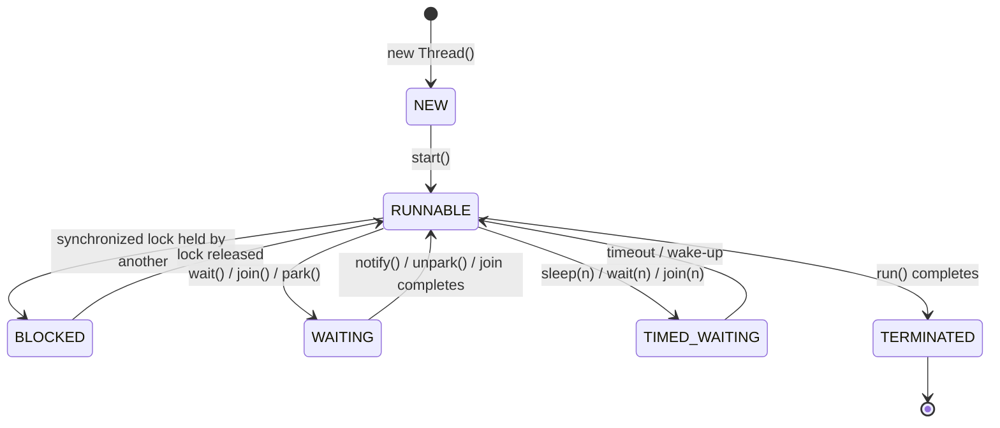

# Java Concurrency - L1 Thread Basics

## Thread Class and Runnable

### 🎯 Model Answer

**30 seconds:**
> `Thread` is Java's class representing an OS-level execution unit.
> `Runnable` is the interface that defines the task the thread will run.
> You always implement `Runnable` for the task logic and pass it to a
> `Thread` - this separates what to do from how to run it. In production,
> you almost always submit `Runnable` or `Callable` tasks to an
> `ExecutorService` rather than creating `Thread` objects directly.

**3 minutes (Senior):**
> Java provides two mechanisms for defining concurrent tasks: `Thread`
> subclassing and `Runnable` implementation. `Thread.run()` defines what
> the thread does, `Thread.start()` launches it as a new OS thread.
>
> The design pattern distinction matters: extending `Thread` ties your
> business logic to the thread lifecycle, preventing reuse. Implementing
> `Runnable` separates the task from execution - the same `Runnable`
> can run in a direct thread, an `ExecutorService`, a `CompletableFuture`,
> or anywhere else that accepts a task.
>
> Java 5 added `Callable<T>` as `Runnable`'s typed sibling - it can
> return a result and throw checked exceptions, making it suitable for
> computation tasks that produce values. `Callable` submitted to an
> `ExecutorService` returns a `Future<T>`.
>
> The most important practical rule: never call `thread.run()` instead of
> `thread.start()` - `run()` executes on the calling thread sequentially.
> Only `start()` creates a new OS thread.

**Framework:** WHAT → WHY → HOW → TRADE-OFF → EXAMPLE

*Adapting up:* Discuss `ThreadFactory` for custom thread naming,
the `UncaughtExceptionHandler` interface for handling crashes in
background threads, and why proper thread naming is critical for
production debugging.

*Adapting down:* "Thread is the worker, Runnable is the job description.
Give the job description to the worker, then tell the worker to start."

**Blank Mind Recovery:**

**(1) Restate:** "So you are asking about Thread and Runnable -
let me think through what each one does."

**(2) First principles:** "From first principles: you need to separate
the task (what to compute) from the execution context (how to run it).
Thread = execution context. Runnable = task. This separation allows
tasks to be submitted to thread pools."

**(3) Bridge:** "This is like a FedEx delivery: the package is Runnable
(the work to deliver), FedEx's driver is the Thread (the executor),
and you don't care which driver delivers your package."

---

### 📘 Concept Explanation

**What it is:**
`Thread` is a class in `java.lang` that represents a single thread of
execution in the JVM. `Runnable` is a functional interface with one
method: `void run()`. When you implement `Runnable`, you define the
code that will execute in the thread.

**The problem it solves:**
A Java program starts with one thread (the main thread). To do multiple
things concurrently, you need additional threads. `Thread` and `Runnable`
are the foundation - they give you the lowest-level mechanism for
creating independent execution paths.

**How it works:**
```java
// Creating a thread - two patterns:
// Pattern 1: extend Thread (not recommended for production)
class MyThread extends Thread {
    public void run() { /* task */ }
}
MyThread t = new MyThread();
t.start(); // creates OS thread, calls run() on it

// Pattern 2: implement Runnable (preferred)
class MyTask implements Runnable {
    public void run() { /* task */ }
}
Thread t = new Thread(new MyTask());
t.start();
```

Thread lifecycle triggered by `start()`:
1. JVM calls OS to create native thread
2. OS allocates thread stack (default 512KB-1MB)
3. JVM sets thread state to RUNNABLE
4. OS scheduler determines when it gets CPU time
5. Thread executes `run()` until completion
6. Thread state becomes TERMINATED
7. Thread object remains in memory but cannot be restarted

**The key insight:**
`Runnable`'s `run()` cannot throw checked exceptions and cannot return
a value. When you need both, use `Callable<T>` (Java 5+):
```java
Callable<String> task = () -> {
    Thread.sleep(1000);
    return "result";  // can return value
};
Future<String> future = executor.submit(task);
```

**When to use it:**
- `Runnable`: fire-and-forget tasks with no return value
- `Callable<T>`: tasks that return results or throw checked exceptions
- Raw `Thread`: long-lived background threads with explicit lifecycle
  control; setting thread name/daemon/priority/exception handler

**When NOT to use it:**
- Don't create `Thread` objects for short-lived work in a server -
  use `ExecutorService` which pools threads for reuse
- Don't extend `Thread` for application tasks - it forces inheritance
  and prevents using your task in other execution contexts

**Alternatives:**
- `ExecutorService.submit(Runnable)` - pooled execution with lifecycle
- `CompletableFuture.runAsync(Runnable)` - async with chaining
- Lambda: since `Runnable` is a functional interface, `() -> {...}`
  is valid anywhere `Runnable` is expected

**First-principles derivation:**
A thread needs three things: what to execute (the task), when to execute
(scheduler), and where to store state (stack). `Runnable` defines the
"what" as a first-class object. `Thread` provides the "when" and "where".
Separating them is the classic strategy pattern - algorithm (Runnable)
is separated from its context (Thread).

---

### 💻 Code Example

> **Code walkthrough:** The BAD example extends Thread, coupling business
> logic (data processing) to the thread infrastructure. The GOOD example
> implements Runnable, keeping the task independent. The production example
> shows a named thread with an uncaught exception handler - critical for
> diagnosing background thread crashes in production, where otherwise
> an exception disappears silently.

```java
// BAD: extending Thread - couples task to execution context
public class DataProcessor extends Thread {
    private final String data;

    public DataProcessor(String data) { this.data = data; }

    @Override
    public void run() {
        // business logic in Thread subclass - can't submit to
        // ExecutorService or CompletableFuture without refactoring
        processData(data);
    }
}
// Usage: new DataProcessor("input").start();
```

```java
// GOOD: Runnable separates task from execution
public class DataProcessorTask implements Runnable {
    private final String data;

    public DataProcessorTask(String data) { this.data = data; }

    @Override
    public void run() {
        processData(data); // same logic, but reusable
    }
}

// Can be used in multiple ways:
DataProcessorTask task = new DataProcessorTask("input");
new Thread(task).start();                    // raw thread
executor.submit(task);                       // thread pool
CompletableFuture.runAsync(task);            // async
// Same task object, any execution context
```

```java
// PRODUCTION: named thread with UncaughtExceptionHandler
Thread t = new Thread(new DataProcessorTask("input"));
t.setName("data-processor-1"); // shows in jstack, logs, APM
t.setDaemon(false);             // JVM waits for this to finish
t.setUncaughtExceptionHandler((thread, ex) -> {
    // Without this, exceptions from threads are silently lost
    // (printed to stderr but not to logging frameworks)
    logger.error("Thread {} failed: {}", thread.getName(), ex);
    alertingService.notify("thread-failure", ex);
});
t.start();
```

---

### 🎓 Answers by Seniority

**Junior / Mid (0-5 years):**
> `Thread` is Java's class for concurrent execution. You define the
> task by implementing `Runnable`'s `run()` method, pass it to a
> `Thread`, and call `start()` to launch it. The most important rule:
> always call `start()`, not `run()` - calling `run()` directly just
> runs the code on the current thread without any concurrency. For
> production code, use `ExecutorService.submit()` instead of managing
> threads directly.

*Push deeper:* Describe `Callable<T>` and how `Future<T>` lets you
retrieve the result from an async computation.

---

**Senior / Staff (5+ years):**
> I think of `Thread` and `Runnable` as low-level primitives - correct
> but rarely the right production tool. In practice, I submit `Runnable`
> or `Callable` tasks to an `ExecutorService`. The key production detail:
> threads need names (for thread dumps and APM), daemon flags (for clean
> shutdown), and uncaught exception handlers (for error visibility).
> Without these, background thread failures are invisible in production.
> I always create executors with a custom `ThreadFactory` that sets all
> three. The Guava `ThreadFactoryBuilder` or a lambda in
> `Executors.newFixedThreadPool(n, factory)` makes this easy.

*Push deeper:* Discuss `ForkJoinPool` and work-stealing as an
alternative to fixed thread pools for recursive decomposition tasks.

---

### ⚠️ Common Misconceptions

**Misconception 1: "Calling run() is the same as start()."**
No. `run()` executes synchronously on the calling thread. `start()`
creates a new OS thread and executes `run()` on it. This is one of
the most common beginner mistakes and produces code that appears
correct but is actually sequential.

**Misconception 2: "You can restart a Thread after it finishes."**
A `Thread` object can only be started once. Calling `start()` on a
TERMINATED thread throws `IllegalThreadStateException`. Create a new
`Thread` object with the same `Runnable` to run it again.

**Misconception 3: "Implementing Runnable is old-fashioned; use lambdas."**
Lambdas ARE Runnable implementations - they just use compact syntax.
`() -> processData()` is exactly equivalent to an anonymous Runnable
class. Using lambdas for simple tasks is idiomatic; implementing a
named class is better when the task has complex state or needs testing.

---

### 🚨 Failure Modes and Diagnosis

**Failure 1: Thread runs sequentially instead of concurrently**
Symptom: code takes as long as sequential execution, no parallelism.
Cause: called `thread.run()` instead of `thread.start()`.
Diagnosis: thread dump shows only the main thread in the stack trace.
Fix: replace `run()` with `start()`.

**Failure 2: Thread exceptions silently swallowed**
Symptom: background task stops working, no error in logs.
Cause: unchecked exception thrown in `run()` terminates the thread
silently (printed to stderr but not to logging frameworks by default).
Fix: add `thread.setUncaughtExceptionHandler()` before starting.
Or wrap `run()` body in try-catch and log all exceptions explicitly.

**Failure 3: Thread cannot be reused after completion**
Symptom: `IllegalThreadStateException: Thread already started`
Cause: calling `start()` on a previously started Thread.
Fix: create a new `Thread` instance or use `ExecutorService`
which handles thread reuse automatically.

---

### 🎯 Interview Deep-Dive

| Question Category | Time to Answer |
|---|---|
| Definition | 30-60 seconds |
| Mechanism | 1-2 minutes |
| Comparison | 1-2 minutes |
| Scenario | 2-3 minutes |
| Debugging | 2-3 minutes |
| Advanced | 2-3 minutes |
| Best Practice | 1-2 minutes |

---

**Q1 (Definition): What is the difference between Thread and Runnable?**

A: `Thread` is the execution unit - it represents a thread of execution
with a stack, program counter, and OS thread handle. `Runnable` is the
task - it defines the work to perform via its single `run()` method.

The relationship: you give a `Runnable` to a `Thread` as the constructor
argument. The `Thread` will call `run()` on the `Runnable` when started.
This separation follows the strategy pattern - the execution mechanism
is decoupled from the task logic.

Practical implication: a `Runnable` is reusable. You can submit the
same `Runnable` to different threads or executors. This is why all
modern Java concurrency APIs (`ExecutorService`, `CompletableFuture`,
`ForkJoinPool`) accept `Runnable` or `Callable` rather than `Thread`.

*What separates good from great:* Noting that Java 8's lambda syntax
means `Runnable r = () -> doWork()` is idiomatic, because `Runnable`
is a functional interface. The lambda is a concise Runnable implementation.

---

**Q2 (Mechanism): What is the lifecycle of a Thread from creation to termination?**

A: A Thread progresses through these states (`Thread.State` enum):

NEW: `Thread t = new Thread(runnable)` - object created, no OS thread
yet. Can set name, daemon flag, priority, exception handler here.

RUNNABLE: After `t.start()` - OS thread created and in the run queue.
May or may not be currently executing on a CPU. Java calls both
"on CPU" and "waiting for CPU" RUNNABLE because the distinction is
OS-level, not JVM-level.

BLOCKED: Waiting to acquire an object monitor (enter a synchronized
block/method that another thread holds). Returns to RUNNABLE when
the monitor is released.

WAITING: Indefinitely waiting - called by `Object.wait()`,
`Thread.join()` (no timeout), or `LockSupport.park()`. Must be
explicitly awakened by `notify()`, `notifyAll()`, or `unpark()`.

TIMED_WAITING: Waiting with timeout - `Thread.sleep(n)`,
`Object.wait(n)`, `Thread.join(n)`, `LockSupport.parkNanos(n)`.
Returns to RUNNABLE when timeout expires or awakened.

TERMINATED: `run()` has returned normally or via exception. The
Thread object remains but cannot be restarted.

*What separates good from great:* Explaining that `jstack` thread
dumps show exactly these states, and knowing BLOCKED vs WAITING is
critical for diagnosing contention (BLOCKED = lock contention,
WAITING = coordination issue).

---

**Q3 (Comparison): Runnable vs Callable - when do you use each?**

A: `Runnable`: `void run()` - no return value, cannot throw checked
exceptions. Use for fire-and-forget tasks, side effects, notifications.

`Callable<T>`: `T call() throws Exception` - returns a result, can
throw checked exceptions. Use when you need a result from concurrent
computation or when the task can fail with a checked exception.

`ExecutorService.submit(Callable<T>)` returns `Future<T>`, allowing
you to retrieve the result later: `T result = future.get()`.

In practice with CompletableFuture (Java 8+):
- `CompletableFuture.runAsync(Runnable)` for fire-and-forget
- `CompletableFuture.supplyAsync(Supplier<T>)` for result-producing
  tasks (Supplier is like Callable but simpler - no checked exceptions)

The modern preference: `CompletableFuture.supplyAsync(Supplier)` over
`ExecutorService.submit(Callable)` because CompletableFuture supports
chaining, exception handling, and composition.

*What separates good from great:* `Callable` allows checked exceptions,
but `CompletableFuture.supplyAsync` uses `Supplier` which does not.
To use a Callable with CompletableFuture, you must wrap it:
`CompletableFuture.supplyAsync(() -> { try { return callable.call(); } catch (Exception e) { throw new RuntimeException(e); } })`.

---

**Q4 (Scenario): How would you run 10 tasks concurrently and wait
for all to complete?**

A: Three approaches, in order of preference:

Option 1: `CompletableFuture.allOf()` (Java 8+, recommended):
```java
ExecutorService exec = Executors.newFixedThreadPool(10);
List<CompletableFuture<Void>> futures = tasks.stream()
    .map(task -> CompletableFuture.runAsync(task, exec))
    .collect(Collectors.toList());
CompletableFuture
    .allOf(futures.toArray(new CompletableFuture[0]))
    .join(); // blocks until all complete
exec.shutdown();
```

Option 2: `ExecutorService.invokeAll()` (synchronous wait):
```java
ExecutorService exec = Executors.newFixedThreadPool(10);
List<Callable<String>> callables = ...; // tasks with results
List<Future<String>> futures =
    exec.invokeAll(callables, 30, TimeUnit.SECONDS);
// futures are all done at this point (or timed out)
```

Option 3: `CountDownLatch` (explicit counting):
```java
CountDownLatch latch = new CountDownLatch(10);
for (Task task : tasks) {
    executor.submit(() -> {
        try { task.run(); } finally { latch.countDown(); }
    });
}
latch.await(30, TimeUnit.SECONDS);
```

I prefer `CompletableFuture.allOf()` for its composability and
exception handling. `invokeAll()` is simpler when you need results
from all tasks. `CountDownLatch` is useful when tasks are not in
an executor context.

*What separates good from great:* Knowing that `CompletableFuture.join()`
throws `CompletionException` wrapping the original exception, while
`Future.get()` throws `ExecutionException`. Exception handling patterns
differ between them.

---

**Q5 (Debugging): A background thread crashes and no error appears
in the logs. How do you diagnose this?**

A: Silent thread failure is a classic production problem. A thread
that throws an uncaught exception dies silently - the exception goes
to the thread's `UncaughtExceptionHandler`, which by default prints
to `System.err` (not to your logging framework).

Step 1: Check if the thread is alive: `thread.isAlive()` returning
false when it should be running is the symptom.

Step 2: Look at `System.err` output in container/process logs.
The default handler writes to stderr, which often goes to a different
place than log files.

Step 3: Add an `UncaughtExceptionHandler` to the thread:
```java
thread.setUncaughtExceptionHandler((t, ex) -> {
    log.error("Thread {} died", t.getName(), ex);
});
```

Step 4: For threads in an `ExecutorService`, submit tasks with
`submit()` not `execute()`. `submit()` wraps the task in a `Future` -
if you call `future.get()`, the exception is rethrown. With `execute()`,
exceptions are still lost unless the thread has an exception handler.

For `ScheduledExecutorService`: a task that throws an unchecked
exception silently stops future scheduling. Always wrap task bodies
in try-catch and log all exceptions.

*What separates good from great:* Knowing the `ThreadGroup.uncaughtException()`
mechanism - if no thread-level handler is set, the exception goes
to the ThreadGroup's handler, and finally to the default JVM handler.
Understanding this chain helps diagnose complex exception routing.

---

**Q6 (Trade-off): What are the trade-offs of using thread-local
state (ThreadLocal) vs passing state as method parameters?**

A: `ThreadLocal<T>` stores a per-thread copy of a value, accessed via
`get()` and `set()`. Common uses: request ID propagation, database
connection per thread (JDBC), transaction context.

Advantages of ThreadLocal:
- Avoids passing context through every method parameter (no "parameter
  explosion" for cross-cutting concerns like request ID or locale)
- Thread-safe by design - each thread has its own copy
- Low-overhead access (approximately array index lookup per thread)

Disadvantages:
- Values leak if not removed: threads in a pool reuse their
  ThreadLocal storage. If your code does `set()` but not `remove()`,
  the next request on that thread gets stale data. Production bug:
  user A sees user B's request ID in logs.
- Invisible coupling: code that reads ThreadLocal creates an implicit
  dependency that's hard to test (test must set up ThreadLocal state)
- Virtual threads (Java 21): millions of virtual threads means millions
  of ThreadLocal copies if you're not careful. Java 21's `ScopedValue`
  is the structured alternative.

Rule: use ThreadLocal for infrastructure concerns (logging context,
request tracing, transaction management). Pass application data as
parameters. Always call `ThreadLocal.remove()` in a finally block
when using thread pools.

*What separates good from great:* Knowing that Spring's request-scoped
beans use ThreadLocal internally and that this is why Spring WebMVC
does not work with reactive programming (where there is no thread-per-request).

---

**Q7 (Best Practice): What configuration options should you set when
creating a Thread for production use?**

A: A production-ready thread configuration:
```java
Thread t = new Thread(runnable);
// 1. Name: visible in thread dumps, logs, APM
t.setName("user-event-processor-" + instanceId);
// 2. Daemon flag: false for critical work (JVM waits),
//    true for background maintenance
t.setDaemon(false);
// 3. UncaughtExceptionHandler: route errors to logging
t.setUncaughtExceptionHandler((thread, ex) ->
    log.error("Thread {} failed", thread.getName(), ex)
);
// 4. Priority: rarely needed, usually leave at NORM_PRIORITY=5
// t.setPriority(Thread.NORM_PRIORITY);
```

For `ExecutorService`, encapsulate this in a `ThreadFactory`:
```java
ThreadFactory factory = r -> {
    Thread t = new Thread(r, "pool-thread-" + counter.incrementAndGet());
    t.setDaemon(false);
    t.setUncaughtExceptionHandler((thread, ex) ->
        log.error("Pool thread failed", ex));
    return t;
};
ExecutorService exec =
    Executors.newFixedThreadPool(10, factory);
```

Why names matter: when a production incident occurs at 3am, your
first tool is `jstack`. If all threads are named "Thread-1",
"Thread-2" through "Thread-100", you cannot identify which threads
belong to which subsystem. If they are named "payment-processor-3"
vs "user-session-handler-7", the thread dump immediately tells you
which component is blocked.

*What separates good from great:* Mentioning that Guava's
`ThreadFactoryBuilder` provides a fluent API for this:
`new ThreadFactoryBuilder().setNameFormat("pool-%d").setDaemon(true).build()`.

---

### ⚖️ Comparison Table

*(Omit: L1 foundational concept - comparison at this level is
covered within the keyword text. See L2 Executor Framework for
Thread vs ExecutorService comparison table.)*

---

### 🏛️ System Design

*(Omit: L1 foundational concept - system design context not applicable.)*

---

### 📊 Diagram

*(Omit: Thread and Runnable concepts are most clearly expressed
in code examples rather than diagrams. See Thread Lifecycle keyword
for a state machine diagram.)*

---
---

## Thread Lifecycle

### 🎯 Model Answer

**30 seconds:**
> A Java thread progresses through six states: NEW (created but not
> started), RUNNABLE (executing or ready), BLOCKED (waiting for a lock),
> WAITING (waiting indefinitely for notification), TIMED_WAITING (waiting
> with a timeout), and TERMINATED (finished). Understanding these states
> is essential for reading thread dumps and diagnosing deadlocks, thread
> leaks, and starvation in production.

**3 minutes (Senior):**
> Thread states in Java are defined by the `Thread.State` enum and
> represent the thread's relationship to the CPU and synchronization
> primitives.
>
> NEW to RUNNABLE: calling `start()` creates the OS thread and moves
> the thread to RUNNABLE. "RUNNABLE" in Java includes both "executing
> on a CPU core" and "waiting for a CPU timeslice" - Java can't
> distinguish them because that's an OS-level distinction.
>
> RUNNABLE to BLOCKED: attempting to enter a `synchronized` block
> or method held by another thread. The thread sits in the monitor's
> wait set until the lock is released. This is the classic lock
> contention state and shows up in thread dumps when you have
> hot synchronized methods.
>
> RUNNABLE to WAITING: calling `Object.wait()`, `Thread.join()` (no
> timeout), or `LockSupport.park()`. The thread gives up its lock
> (for `wait()`) and waits for an explicit `notify()` or `unpark()`.
>
> RUNNABLE to TIMED_WAITING: `Thread.sleep(n)`, `wait(n)`, `join(n)`.
> Automatically returns to RUNNABLE after the timeout, or when awakened.
>
> TERMINATED: `run()` method returned or threw an exception. The Thread
> object is still reachable but the OS thread is gone. Calling `start()`
> on a terminated thread throws `IllegalThreadStateException`.

**Framework:** WHAT → WHY → HOW → TRADE-OFF → EXAMPLE

*Adapting up:* Discuss how thread state transitions appear in JVM
Flight Recorder events and how to use `jstack`/`jcmd` to capture
thread states at production scale.

*Adapting down:* "Think of it as a traffic light system - NEW (parked
car), RUNNABLE (driving or waiting at a green), BLOCKED (red light),
WAITING (parked waiting for a call), TERMINATED (car returned)."

**Blank Mind Recovery:**

**(1) Restate:** "So you are asking about thread lifecycle states -
let me walk through them in order."

**(2) First principles:** "From first principles, a thread needs to
track: is it doing work? Is it waiting for something? Did it finish?
The lifecycle states capture all possible answers to those questions."

**(3) Bridge:** "Thread lifecycle is like a job ticket: NEW = submitted,
RUNNABLE = in progress, BLOCKED = waiting for approval, WAITING = waiting
for input, TIMED_WAITING = waiting with deadline, TERMINATED = closed."

---

### 📘 Concept Explanation

**What it is:**
Thread lifecycle is the set of states a Java thread can be in, and the
transitions between them. These states are defined in `Thread.State`
and are directly observable via the `thread.getState()` method and
in thread dump output from `jstack` or `jcmd`.

**The problem it solves:**
Without lifecycle states, you cannot diagnose concurrent programs.
When threads appear stuck, you need to know: are they executing (CPU
bound), waiting for a lock (contention), waiting for data (design
issue), or leaked (never terminated)?

**How it works:**
```
NEW
 |
 | start()
 v
RUNNABLE <------- notify() / unpark() / timeout ----+
 |                                                   |
 |-- synchronized lock contention --> BLOCKED ------+|
 |                                                   ||
 |-- Object.wait() / join() -------> WAITING -------+|
 |                                                   ||
 |-- sleep(n) / wait(n) -----------> TIMED_WAITING --+
 |
 | run() returns or throws
 v
TERMINATED
```

State transitions triggered by:
- NEW → RUNNABLE: `thread.start()`
- RUNNABLE → BLOCKED: entering `synchronized` block/method held by
  another thread
- BLOCKED → RUNNABLE: lock released by owning thread
- RUNNABLE → WAITING: `object.wait()`, `thread.join()`,
  `LockSupport.park()`
- WAITING → RUNNABLE: `object.notify()`, `object.notifyAll()`,
  `LockSupport.unpark(thread)`, or thread being joined terminates
- RUNNABLE → TIMED_WAITING: `Thread.sleep(n)`, `object.wait(n)`,
  `thread.join(n)`, `LockSupport.parkNanos(n)`
- TIMED_WAITING → RUNNABLE: timeout expires or explicit wake-up
- RUNNABLE → TERMINATED: `run()` returns or throws

**The key insight:**
The distinction between BLOCKED and WAITING is critical for diagnostics.
BLOCKED means the thread is waiting for a `synchronized` lock (monitor).
WAITING means the thread explicitly gave up execution (via `wait()` or
`park()`). These require different fixes: BLOCKED = reduce lock contention,
WAITING = check that `notify()`/`unpark()` is being called correctly.

**When to use it:**
- Reading thread dumps: identify what each thread is doing
- Diagnosing deadlocks: all threads in BLOCKED with circular lock chains
- Diagnosing starvation: threads stuck in WAITING with no notifiers
- Writing thread-safe utilities: knowing which operations transition
  state helps design correct synchronization

**When NOT to use it:**
- `getState()` is a snapshot - the state may change between the call
  and when you act on it. Never write logic that depends on thread state
  for correctness; only use it for monitoring and diagnostics.

**Alternatives:**
- JVM Flight Recorder: records thread state transitions as events
  with timestamps - much richer than point-in-time snapshots
- `jcmd <pid> Thread.print`: same as jstack but uses JDK's
  diagnostic command infrastructure

**First-principles derivation:**
A thread can only be in one of three fundamental states at any instant:
executing (has CPU), blocked by OS (waiting for I/O or scheduler),
or waiting for application-level coordination (lock, barrier, notification).
Java's six `Thread.State` values refine these three into categories
useful for application-level debugging.

---

### 💻 Code Example

> **Code walkthrough:** This example demonstrates observing thread state
> transitions in real time. The BAD pattern uses `Thread.sleep()` to
> "poll" for state changes - this is fragile and racy. The GOOD pattern
> uses proper synchronization. The diagnostic example shows reading state
> from another thread, which is the correct use of `getState()` (monitoring
> and debugging only, never for control flow).

```java
// BAD: polling thread state for coordination
Thread worker = new Thread(() -> doWork());
worker.start();
while (worker.getState() != Thread.State.TERMINATED) {
    Thread.sleep(100); // polling - fragile, wasteful
}
// Don't do this - use worker.join() instead
```

```java
// GOOD: use join() to wait for TERMINATED state
Thread worker = new Thread(() -> doWork());
worker.start();
worker.join(); // blocks current thread until worker terminates
// Proceeds only when worker.getState() == TERMINATED
```

```java
// DIAGNOSTIC: observe state transitions (monitoring only)
Thread worker = new Thread(() -> {
    synchronized (this) {
        try {
            wait(); // WAITING state
        } catch (InterruptedException e) {
            Thread.currentThread().interrupt();
        }
    }
});
worker.start();
// Check states from monitoring thread (for observability only)
Thread.State state = worker.getState();
System.out.println("State: " + state);
// NEW -> RUNNABLE -> WAITING -> RUNNABLE -> TERMINATED
```

---

### 🎓 Answers by Seniority

**Junior / Mid (0-5 years):**
> A Java thread goes through six states: NEW when created, RUNNABLE
> after start() is called, BLOCKED when waiting for a synchronized
> lock, WAITING when waiting for notify(), TIMED_WAITING when sleeping
> with a timeout, and TERMINATED when done. You can check the current
> state with `thread.getState()`. These states are what you see in
> thread dumps from jstack.

*Push deeper:* Explain the practical difference between BLOCKED and
WAITING and give a concrete example of when each occurs.

---

**Senior / Staff (5+ years):**
> Thread lifecycle states are my first diagnostic tool for production
> concurrency issues. When I see a performance degradation, I take 3
> jstack dumps 5 seconds apart. If I see the same threads consistently
> in BLOCKED state, they are contending for a lock - I look at which
> object they are blocked on. If I see threads in WAITING with no
> corresponding thread doing `notify()`, that is a coordination bug.
> If I see TIMED_WAITING with sleep() calls, I look for busy-wait loops.
> The key detail: a thread in RUNNABLE state in jstack may not actually
> be running - it may be waiting for the OS scheduler. Only CPU profiler
> data (JFR, async-profiler) tells you which RUNNABLE threads are
> actually on-CPU.

*Push deeper:* Discuss the `BLOCKED` vs `WAITING` distinction when
using `ReentrantLock` - with explicit locks, the thread state is
WAITING via `LockSupport.park()`, not BLOCKED. This means lock
contention on `ReentrantLock` shows as WAITING in jstack, while
synchronized contention shows as BLOCKED.

---

### ⚠️ Common Misconceptions

**Misconception 1: "RUNNABLE means the thread is actively executing."**
RUNNABLE means the thread is either executing OR waiting to be
scheduled by the OS. Java cannot distinguish "on CPU" from "in run
queue" because that distinction is OS-internal. CPU profilers
(not jstack) show which RUNNABLE threads are actually on-CPU.

**Misconception 2: "A thread in WAITING state is blocked on I/O."**
WAITING is specifically for `Object.wait()`, `Thread.join()`, and
`LockSupport.park()` - all application-level coordination calls.
I/O blocking shows as RUNNABLE in jstack (the kernel handles I/O
scheduling transparently; from Java's view, the thread is runnable).

**Misconception 3: "Thread.sleep() is the same as Object.wait()."**
`sleep()` puts the thread in TIMED_WAITING but does NOT release
any monitor locks the thread holds. `Object.wait()` puts the thread
in WAITING and DOES release the object's monitor lock. This is a
critical difference for code that calls `wait()` inside `synchronized`.

---

### 🚨 Failure Modes and Diagnosis

**Failure 1: Deadlock - all threads permanently BLOCKED**
Symptom: application hangs, no progress, CPU near zero.
Cause: Thread A holds lock X, waits for lock Y. Thread B holds
lock Y, waits for lock X. Neither can proceed.
Diagnosis: `jstack` output shows "Found one Java-level deadlock" with
the lock ownership chain. JVM's deadlock detector catches this.
Fix: consistent lock ordering (always acquire X before Y), or use
`ReentrantLock.tryLock()` with timeout to detect and handle contention.

**Failure 2: Livelock - threads active but not progressing**
Symptom: CPU is 100% but no progress. Different from deadlock.
Cause: threads keep responding to each other's actions in a cycle
without making progress (e.g., two threads keep yielding to each other).
Diagnosis: jstack shows threads in RUNNABLE but repeatedly in the
same stack frames. CPU profiler shows hot loop.
Fix: add randomization or exponential backoff to the coordination.

**Failure 3: Thread in WAITING forever (missing notify)**
Symptom: thread never completes; application slowly runs out of
available threads.
Cause: `wait()` called but `notify()` never called, or notification
happens before `wait()` and is missed.
Diagnosis: jstack shows thread in WAITING on `Object.wait()`;
look for the corresponding `notify()` - it may not exist or may be
guarded by a condition that's never true.
Fix: use `Condition.await()` with `ReentrantLock` and always
re-check condition in a while loop (not if).

---

### 🎯 Interview Deep-Dive

| Question Category | Time to Answer |
|---|---|
| Definition | 30-60 seconds |
| Mechanism | 1-2 minutes |
| Comparison | 1-2 minutes |
| Scenario | 2-3 minutes |
| Debugging | 2-3 minutes |
| Advanced | 2-3 minutes |
| Trade-off | 1-2 minutes |

---

**Q1 (Definition): What are the six thread states in Java?**

A: Java defines thread states in `Thread.State` enum:

1. NEW: Thread object created, `start()` not called yet. No OS thread.
2. RUNNABLE: After `start()`. Thread is executing or waiting for CPU.
   Includes both "on CPU" and "in run queue" states.
3. BLOCKED: Waiting to acquire a synchronized monitor (object lock).
   Caused by entering a synchronized block/method held by another thread.
4. WAITING: Indefinitely waiting for explicit notification. Caused by
   `Object.wait()`, `Thread.join()` (no timeout), `LockSupport.park()`.
5. TIMED_WAITING: Waiting with a timeout. Caused by `Thread.sleep(n)`,
   `Object.wait(n)`, `Thread.join(n)`, `LockSupport.parkNanos(n)`.
6. TERMINATED: `run()` completed (normally or via exception). OS thread
   is gone. Thread object cannot be restarted.

*What separates good from great:* Pointing out that the distinction
between BLOCKED and WAITING matters for diagnostics: BLOCKED = lock
contention (synchronized), WAITING = coordination via wait/notify or
park/unpark. The fix strategies are different.

---

**Q2 (Mechanism): How does a thread transition from RUNNABLE to BLOCKED
and back?**

A: The BLOCKED state specifically applies to synchronized monitors.

Transition to BLOCKED: when a thread attempts to enter a `synchronized`
block or method where another thread already holds the monitor. The JVM
inserts the thread into the monitor's "entry set" - a wait queue of
threads wanting the lock. The OS removes the thread from the CPU
run queue.

While BLOCKED: the thread consumes no CPU. The OS scheduler ignores it.
Other threads can run. The thread waits until the owning thread exits
the synchronized block.

Transition back to RUNNABLE: when the owning thread exits the synchronized
block (by returning, throwing, or explicitly releasing), the JVM picks
one thread from the entry set (not necessarily the one that waited
longest - not FIFO), makes it the new monitor owner, and moves it to
RUNNABLE.

The non-obvious behavior: "BLOCKED" is specifically for intrinsic locks
(`synchronized`). When using `ReentrantLock.lock()`, the waiting thread
is in WAITING state (via `LockSupport.park()`) rather than BLOCKED.
This is why jstack shows different states for intrinsic vs explicit locks
under contention.

*What separates good from great:* The entry set is unordered - Java
`synchronized` makes no fairness guarantees. A thread may be blocked
for a long time while newly arriving threads get the lock ahead of it.
`ReentrantLock` can be created with `new ReentrantLock(true)` for
fair FIFO ordering at the cost of reduced throughput.

---

**Q3 (Comparison): What is the difference between BLOCKED and WAITING states?**

A: Both BLOCKED and WAITING mean the thread is not executing, but for
different reasons and with different remedies:

BLOCKED:
- Cause: waiting to acquire a synchronized monitor
- Triggered by: another thread holding an intrinsic lock
- Resolution: automatic - when the lock owner exits synchronized,
  JVM selects a waiting thread
- Diagnostic signal: lock contention (too many threads competing
  for the same synchronized resource)

WAITING:
- Cause: explicitly yielded execution via `Object.wait()`,
  `Thread.join()`, or `LockSupport.park()`
- Triggered by: application code calling a wait primitive
- Resolution: must be explicitly awakened via `notify()`, `unpark()`,
  or join completion
- Diagnostic signal: coordination issue (notifier is slow, absent,
  or condition never becomes true)

In a thread dump:
- BLOCKED shows: `"waiting to lock <0x1234> (a java.lang.Object)"`
- WAITING shows: `"waiting on <0x1234>" or "parking to wait for..."`

Fix strategies: BLOCKED = reduce critical section size, reduce
sharing, split the lock. WAITING = verify the notification path is
working and that the condition is eventually satisfied.

*What separates good from great:* The platform-vs-virtual-thread
nuance: virtual threads don't use BLOCKED state for `synchronized`
blocks that would pin them. They instead remain in RUNNABLE but
the carrier OS thread is blocked. This is why using synchronized
around blocking I/O in virtual threads is problematic.

---

**Q4 (Scenario): You see 500 threads all in BLOCKED state in a
thread dump. What caused this and how do you fix it?**

A: 500 threads all BLOCKED on the same object means severe lock
contention on a single synchronized resource. This is a classic
hot-lock problem.

Investigation: look at the jstack output for what object they are
blocked on. If it's `java.lang.Object@0x1234`, find the code path
that synchronizes on that object. It might be:
- A `synchronized` method on a shared service object
- `Collections.synchronizedList()` or `Hashtable` under heavy
  concurrent access
- A global cache with coarse-grained locking
- Logging framework with synchronization (log4j 1.x had this)

Fixes in order of preference:
1. Reduce the critical section: move non-contended code outside
   synchronized
2. Switch to `ConcurrentHashMap` instead of synchronized map
3. Use `ReentrantLock` with fair mode or try-lock with backoff
4. Partition data: instead of one shared object, use a sharded
   structure where each shard has its own lock - reduces contention
   by n/shards
5. Replace with lock-free design using `AtomicReference` + CAS

*What separates good from great:* The diagnosis question: "Is the
critical section's work actually contended, or is the lock too coarse?"
Often the fix is finding that the entire `synchronized` block protects
both the contended check and non-contended processing - refactoring
to use the lock only for the check, then processing outside the lock,
can eliminate 90% of contention.

---

**Q5 (Debugging): How do you use a thread dump to diagnose a deadlock?**

A: A thread dump from `jstack <pid>` includes a built-in deadlock
detector that produces a "Found one Java-level deadlock" section when
deadlocks are detected. But here is the manual approach:

Step 1: Look for threads in BLOCKED state.
Step 2: For each BLOCKED thread, find what object it is waiting for:
  `"waiting to lock <0x1234> (a java.lang.Object)"`
Step 3: Find which thread currently OWNS that object:
  `"locked <0x1234> (a java.lang.Object)"`
Step 4: Check if that owning thread is BLOCKED on an object owned
  by the first thread - that is the deadlock cycle.

Example deadlock in jstack:
```
Thread-A  BLOCKED on 0x1234 (owned by Thread-B)
Thread-B  BLOCKED on 0x5678 (owned by Thread-A)
```

For ReentrantLock deadlocks: jstack shows WAITING state and the
lock ownership in the ownable synchronizers section:
`"Locked ownable synchronizers: <0x1234> (a java.util.concurrent.locks.ReentrantLock)"`

Prevention: always acquire locks in consistent global order (alphabetical
by class name, by lock ID, or by a well-defined ordering). This
eliminates the circular dependency required for deadlock.

*What separates good from great:* Knowing that JVM can only detect
Java-level deadlocks (intrinsic and explicit locks). Native code
deadlocks (JNI, OS-level mutexes) are invisible to jstack. Also:
jcmd produces the same output as jstack but is the preferred tool
on modern JDKs.

---

**Q6 (Advanced): What happens to thread state during garbage collection
safepoints?**

A: At GC safepoints, all Java threads must pause to allow safe GC
operation (accurate heap scanning requires no mutation during scan).

The JVM inserts safepoint polls into compiled code (loop back-edges,
method returns). When the JVM requests a safepoint, threads:
- Finish their current safepoint poll
- Suspend at a known safe location
- Remain in their RUNNABLE state (jstack shows RUNNABLE during
  safepoint, not BLOCKED or WAITING)

From jstack's perspective, threads during GC STW (stop-the-world)
pause appear RUNNABLE because the pause is at the OS level, not the
JVM state level. This is why a long GC pause looks like "nothing
happening" in thread dumps - no state change is recorded.

The practical implication: if `Thread.sleep(100)` on the main thread
actually sleeps for 300ms, the extra 200ms may be STW GC pause time.
Tools that measure: JFR's `GarbageCollection` and `SafepointBegin`
events, GC logs with `-Xlog:gc*`, and JVM pause time in APM tools.

*What separates good from great:* Explaining that "time to safepoint"
is distinct from GC pause time - a thread in a tight loop without
safepoint polls may delay the entire JVM's GC for the duration of
that loop. This is the "long safepoint" problem measured by
`-XX:+PrintGCApplicationStoppedTime`.

---

**Q7 (Trade-off): Why does Java's RUNNABLE state combine executing
and ready-to-run? What problems does this cause?**

A: Java's RUNNABLE state merges two distinct OS states: "currently
executing on CPU" and "in the OS run queue waiting for CPU". This
was a deliberate design choice because the JVM cannot reliably
distinguish them across all supported OS and CPU architectures.

Problems this causes:

1. Misleading thread dumps: a thread dump showing 200 RUNNABLE
   threads doesn't tell you how many are actually consuming CPU.
   100% CPU usage could mean 8 threads truly executing and 192
   waiting for a turn, or 200 threads in CPU-intensive work on
   a 200-core machine.

2. CPU profiling requires separate tools: `jstack` cannot distinguish
   "hot" RUNNABLE threads from "idle waiting" RUNNABLE threads. You
   need async-profiler, JFR, or OS-level tools (`top -H`, `perf`)
   to identify which threads are actually consuming CPU.

3. I/O blocking appears as RUNNABLE: when a thread is blocked on
   a blocking socket call, the OS marks it as blocked (sleeping)
   but Java still shows RUNNABLE. This means high-load situations
   where many threads are doing blocking I/O look the same as
   CPU-saturated situations in jstack.

The solution: never use jstack alone for CPU analysis. Use it for
lock diagnostics (BLOCKED/WAITING) and combine with CPU profiling
tools for CPU utilization analysis.

*What separates good from great:* Knowing that async-profiler uses
Linux perf_events (eBPF/perf) to actually sample on-CPU threads,
giving a true picture of CPU consumption that jstack cannot provide.

---

### ⚖️ Comparison Table

*(Omit: L1 foundational concept - comparison table applies at L2+
where specific synchronization tool choices are made.)*

---

### 🏛️ System Design

*(Omit: L1 foundational concept - system design context not applicable.)*

---

### 📊 Diagram

```
Thread State Machine:

         start()
  NEW ---------> RUNNABLE <--------------------+
                   |  ^                        |
      synchronized |  | lock released          |
      contention   |  |                        |
                   v  |    notify() / unpark() |
                BLOCKED    WAITING <-----------+---+
                           |                       |
                         wait()                  sleep(n)
                         join()                  wait(n)
                         park()                  join(n)
                           |                       |
                       TIMED_WAITING --------------+
                                   timeout / wake-up
           run() completes
  RUNNABLE -----------> TERMINATED
```



> **Diagram walkthrough:** The state machine shows all six Thread.State
> values and what triggers each transition. The most important transitions
> for diagnostics: RUNNABLE to BLOCKED (synchronized contention - bad for
> performance), RUNNABLE to WAITING (explicit coordination - expected),
> RUNNABLE to TIMED_WAITING (sleep/timeout - usually expected). A thread
> stuck permanently in BLOCKED indicates deadlock or excessive contention.
> A thread stuck in WAITING indicates a missing or broken notification.
> Note that TERMINATED has no outgoing transitions - a terminated thread
> cannot be restarted.

---
---

## Thread Priority and Daemon Threads

### 🎯 Model Answer

**30 seconds:**
> Thread priority in Java is a hint to the OS scheduler (1=lowest,
> 10=highest, 5=normal) that influences CPU allocation but offers no
> guarantees. Daemon threads are background threads that the JVM
> terminates automatically when all non-daemon threads finish - they are
> ideal for monitoring, cleanup, and housekeeping tasks that should not
> prevent JVM shutdown.

**3 minutes (Senior):**
> Thread priority and daemon status are two separate configurations that
> control different aspects of thread behavior.
>
> Priority (1-10) maps to OS thread priority, but the mapping is
> platform-specific and often unreliable. On Linux with the default CFS
> (Completely Fair Scheduler), all Java threads get equal CPU time
> regardless of priority unless you use real-time scheduling policies.
> On Windows, thread priorities are honored more directly. I treat
> priority as an optimization hint, never as a correctness mechanism.
>
> Daemon status controls JVM lifecycle. The JVM exits when all non-daemon
> threads terminate, regardless of how many daemon threads are running.
> Common daemon thread users: GC threads (JVM-managed, all daemon),
> JIT compiler threads (daemon), scheduled cleanup tasks, background
> metrics reporters.
>
> The critical daemon thread failure mode: if daemon threads are
> performing I/O that must complete (flushing buffers, closing
> connections), they will be killed mid-operation when the JVM exits.
> For Spring Boot applications, the shutdown lifecycle (graceful shutdown
> hooks) handles this by explicitly waiting for work to complete before
> the JVM exits - but only for non-daemon threads or threads explicitly
> joined by shutdown hooks.

**Framework:** WHAT → WHY → HOW → TRADE-OFF → EXAMPLE

*Adapting up:* Discuss real-time thread scheduling (`-XX:ThreadPriorityPolicy`),
virtual thread priority semantics (virtual threads always have the same
priority as their carrier), and JVM shutdown hooks as the correct
alternative to relying on daemon thread termination.

*Adapting down:* "Priority = how important is this thread to get CPU.
Daemon = should the JVM wait for this thread to finish before exiting."

**Blank Mind Recovery:**

**(1) Restate:** "So you are asking about thread priority and daemon
threads - let me cover each one."

**(2) First principles:** "From first principles: when multiple threads
compete for CPU, something must decide the order - that's priority.
And when a program is done with its main work, something must decide
whether to wait for background tasks - that's daemon vs non-daemon."

**(3) Bridge:** "Daemon threads are like restaurant kitchen cleanup
crew - when the restaurant closes (main threads done), the cleanup crew
(daemon threads) is dismissed immediately, whether or not they finished."

---

### 📘 Concept Explanation

**What it is:**
Thread priority is an integer from 1 (`MIN_PRIORITY`) to 10
(`MAX_PRIORITY`), with 5 as `NORM_PRIORITY`, that hints to the OS
scheduler which threads deserve more CPU time. Daemon status is a
boolean flag (`setDaemon(true/false)`) that controls whether the JVM
will wait for the thread before shutting down.

**The problem it solves:**
Priority: in CPU-constrained systems, some work is more time-sensitive
than others. Priority gives a mechanism (albeit unreliable) to express
relative importance.

Daemon: background threads (GC, JIT, monitoring) should not prevent
the application from exiting. Making them daemon allows the JVM to
shut down cleanly without waiting for these maintenance tasks.

**How it works:**
```java
// Thread priority
Thread t = new Thread(task);
t.setPriority(Thread.MAX_PRIORITY);  // 10 - highest
t.setPriority(Thread.MIN_PRIORITY);  // 1 - lowest
t.setPriority(Thread.NORM_PRIORITY); // 5 - default
t.start();

// Daemon status (MUST be set before start())
Thread t = new Thread(task);
t.setDaemon(true);  // background - JVM won't wait
t.start();
// Calling setDaemon() after start() throws IllegalThreadStateException
```

JVM daemon thread behavior:
1. JVM monitors all non-daemon threads
2. When the last non-daemon thread exits, JVM initiates shutdown
3. All daemon threads are interrupted and terminated immediately
4. Shutdown hooks run (they run in non-daemon threads)
5. JVM exits

**The key insight:**
Daemon threads can be killed at any point - mid-write to a file,
mid-flush of a buffer, mid-close of a connection. Never use daemon
threads for work that must complete to maintain data integrity.
Use them only for truly optional background work (monitoring,
cache warming, metrics collection) where abrupt termination is safe.

**When to use it:**
Daemon threads: background monitoring, metrics reporting, log flushing
with best-effort semantics, cache eviction, watchdog threads.

Priority: give lower priority to background batch jobs that compete
with interactive request processing on the same machine.

**When NOT to use it:**
Priority: never rely on priority for correctness (race conditions,
ordering guarantees). Priority is a hint, not a contract.

Daemon threads: never for work that modifies persistent state (database
writes, file writes, message publishing). The JVM may kill the thread
before the operation completes.

**Alternatives:**
- JVM shutdown hooks (`Runtime.getRuntime().addShutdownHook(thread)`)
  for cleanup that must run before JVM exit
- `ExecutorService.awaitTermination()` as part of a graceful shutdown
  sequence for work that must complete
- Spring's `@PreDestroy` or application lifecycle events for
  framework-managed cleanup

**First-principles derivation:**
A multi-process system needs a way to prioritize competing resource
requests. CPU scheduling is this mechanism at the OS level. Thread
priority is the Java API for expressing preferences to this scheduler.
For daemon threads: a process conceptually has a "main purpose" (served
by user threads) and "support functions" (served by daemon threads).
The process is done when its main purpose completes, and support
functions should not artificially extend its life.

---

### 💻 Code Example

> **Code walkthrough:** The BAD example sets daemon status after start(),
> which throws an exception. It also uses MAX_PRIORITY for all threads,
> which either has no effect (Linux CFS) or starves lower-priority work.
> The GOOD example shows correct daemon configuration for a monitoring
> thread and a graceful shutdown pattern that ensures work completes
> before the JVM can exit even without daemon threads.

```java
// BAD: setting daemon after start() - throws exception
Thread t = new Thread(task);
t.start();
t.setDaemon(true); // IllegalThreadStateException - too late!

// BAD: priority used for correctness (won't work)
Thread highPriority = new Thread(criticalTask);
highPriority.setPriority(Thread.MAX_PRIORITY);
highPriority.start();
Thread lowPriority = new Thread(backgroundTask);
lowPriority.setPriority(Thread.MIN_PRIORITY);
lowPriority.start();
// On Linux, both threads likely get equal CPU time - priorities ignored
```

```java
// GOOD: daemon thread for metrics reporting
Thread metricsReporter = new Thread(() -> {
    while (!Thread.currentThread().isInterrupted()) {
        try {
            reportMetrics(); // best-effort, OK if killed
            Thread.sleep(60_000); // report every minute
        } catch (InterruptedException e) {
            break; // interrupted on shutdown
        }
    }
});
metricsReporter.setName("metrics-reporter");
metricsReporter.setDaemon(true); // JVM won't wait for this
metricsReporter.start();
```

```java
// PRODUCTION: graceful shutdown pattern for work that MUST complete
ExecutorService pool = Executors.newFixedThreadPool(10);

// Register shutdown hook to drain the pool
Runtime.getRuntime().addShutdownHook(new Thread(() -> {
    pool.shutdown(); // stop accepting new work
    try {
        // Wait up to 30 seconds for current work to complete
        if (!pool.awaitTermination(30, TimeUnit.SECONDS)) {
            pool.shutdownNow(); // force stop if timeout
        }
    } catch (InterruptedException e) {
        pool.shutdownNow();
    }
}));
```

---

### 🎓 Answers by Seniority

**Junior / Mid (0-5 years):**
> Thread priority (1-10) hints to the OS scheduler which threads should
> get more CPU time, but it's not reliable - especially on Linux where
> priorities are often ignored. Daemon threads are background threads
> that the JVM kills automatically when all regular (non-daemon) threads
> finish. You must call `setDaemon(true)` before `start()`. Use daemon
> threads for non-critical background tasks like monitoring or metrics
> collection that are safe to interrupt.

*Push deeper:* Explain what happens to daemon threads at JVM shutdown
and why this makes them unsafe for I/O operations.

---

**Senior / Staff (5+ years):**
> Thread priority is essentially a no-op on Linux with the default
> scheduler - I have tested this and seen no measurable effect in practice.
> On Windows it works, but cross-platform behavior means I never rely on
> it. Daemon threads I use specifically and deliberately: monitoring
> threads, cache warming, and metrics are all daemon. Any thread that
> touches persistent state (database, files, outbound messages) is
> non-daemon, and I ensure graceful shutdown via `ExecutorService.shutdown()`
> + `awaitTermination()` in a shutdown hook. The real risk with daemon
> threads: silently lost data when the JVM exits mid-write. I have seen
> this happen with daemon-based log flushers that lost the last few
> seconds of logs at shutdown - right when the crash information was
> most valuable.

*Push deeper:* Discuss how to implement graceful shutdown for Spring
Boot services: `server.shutdown=graceful` in Spring Boot 2.3+ combined
with `spring.lifecycle.timeout-per-shutdown-phase=30s`.

---

### ⚠️ Common Misconceptions

**Misconception 1: "Higher priority threads always run first."**
Priority is a hint, not a guarantee. The OS scheduler may completely
ignore Java thread priorities (Linux CFS). Never use priority for
ordering or correctness guarantees.

**Misconception 2: "Daemon threads complete before JVM shutdown."**
No - daemon threads are killed immediately and abruptly when the last
non-daemon thread exits. There is no graceful completion. Data being
written by a daemon thread at that moment is likely lost or corrupt.

**Misconception 3: "Child threads inherit daemon status from parent."**
Yes they do - a thread created by a daemon thread is automatically
daemon unless explicitly set to non-daemon. This can cause surprising
behavior when thread pools create worker threads (which inherit the
daemon status of the thread that created the pool).

---

### 🚨 Failure Modes and Diagnosis

**Failure 1: Lost data from daemon thread killed mid-write**
Symptom: last N log lines or metrics points are missing after
application restart; data files are truncated or corrupt.
Cause: background writer thread was daemon, killed during JVM shutdown
before flush completed.
Fix: make writer threads non-daemon; add shutdown hook to flush
buffers and close streams before JVM exit.

**Failure 2: JVM won't exit because of forgotten non-daemon thread**
Symptom: application main() returns but process never exits; memory
and CPU accumulate over time.
Cause: a non-daemon background thread is running indefinitely
(usually a thread pool or scheduled task that was never shut down).
Diagnosis: `jstack <pid>` to find which non-daemon threads are still
running; check for `ScheduledExecutorService` or `ExecutorService`
instances that were never shut down.
Fix: call `executor.shutdown()` in application cleanup; use daemon
threads or shutdown hooks for background services.

**Failure 3: setDaemon() throws after start()**
Symptom: `IllegalThreadStateException: Thread already started`
Cause: `setDaemon()` called after `thread.start()`.
Fix: always set daemon status before calling `start()`.

---

### 🎯 Interview Deep-Dive

| Question Category | Time to Answer |
|---|---|
| Definition | 30-60 seconds |
| Mechanism | 1-2 minutes |
| Comparison | 1-2 minutes |
| Scenario | 2-3 minutes |
| Debugging | 2-3 minutes |
| Best Practice | 1-2 minutes |
| Advanced | 2-3 minutes |

---

**Q1 (Definition): What is the difference between daemon and
non-daemon threads?**

A: The distinction is about JVM shutdown behavior. Non-daemon (user)
threads keep the JVM alive - the JVM will not exit while any non-daemon
thread is running. When the last non-daemon thread exits, the JVM
initiates shutdown regardless of how many daemon threads are active.

Default behavior: all threads you create are non-daemon unless you
explicitly call `setDaemon(true)`. The main thread is non-daemon.

Use cases for daemon threads: background monitoring, cache eviction,
GC coordination, JIT compilation - all the JVM's own internal threads
are daemon. Log reporters, metrics collectors, heartbeat threads.

The critical contract: daemon threads may be killed at any instant.
They have no guarantee of completing their current operation. This
means they are only safe for work that is idempotent, recoverable,
or truly optional.

*What separates good from great:* Knowing that the JVM's shutdown
sequence is: (1) invoke all shutdown hooks registered via
`Runtime.getRuntime().addShutdownHook()` in parallel, (2) after hooks
complete, kill all remaining daemon threads. Shutdown hooks are the
mechanism for cleanup that must complete.

---

**Q2 (Mechanism): What is the effect of thread priority on Linux vs Windows?**

A: The effect differs significantly by platform:

Linux (most Java servers): Java thread priorities (1-10) map to OS
"nice" values (-20 to +19). However, the Linux CFS (Completely Fair
Scheduler) does not honor nice values for real-time applications by
default. In practice, Java thread priority changes are usually
ineffective on Linux unless you configure real-time scheduling via
`-XX:ThreadPriorityPolicy=1` (requires OS privileges). I have
confirmed this by benchmarking: a Thread.MIN_PRIORITY background
thread and Thread.MAX_PRIORITY foreground thread on Linux share CPU
equally under load.

Windows: Java priorities map directly to Windows thread priorities
(THREAD_PRIORITY_LOWEST through THREAD_PRIORITY_HIGHEST). The Windows
scheduler does honor these, giving high-priority threads proportionally
more CPU time quanta.

macOS: Similar to Linux - priorities have limited effect under default
scheduling.

Implication: code that relies on thread priority for performance
behavior is not portable. Use explicit scheduling logic (dedicated
thread pools, work queues with priority queues) instead of thread
priority for priority-based task scheduling.

*What separates good from great:* Knowing that real-time priorities
(`SCHED_FIFO`, `SCHED_RR` on Linux) CAN make thread priority effective
but require root/cap_sys_nice privileges and are typically used only in
embedded systems or specialized audio/video processing applications.

---

**Q3 (Comparison): When should you use a daemon thread vs a shutdown hook?**

A: Daemon threads: for work that is optional and safe to interrupt at
any point. The JVM kills them automatically without any cleanup
opportunity. Examples: background metrics export, cache preloading,
log sampling.

Shutdown hooks (`Runtime.addShutdownHook(thread)`): for work that
must complete before the JVM exits. The JVM runs all shutdown hooks
in parallel after the last non-daemon thread exits, and waits for
them all to complete before proceeding with halt. Examples: flushing
pending writes, closing database connections, sending "I am shutting
down" notification.

The key difference: daemon threads can be killed mid-operation;
shutdown hooks are given a chance to run to completion (unless the
shutdown itself has a timeout, e.g., `kill -9`).

Typical pattern: use daemon threads for ongoing background work
(they don't prevent JVM exit), and register a shutdown hook that
signals them to stop and drains any in-flight work:

```java
ScheduledExecutorService scheduler = ...;
Runtime.getRuntime().addShutdownHook(new Thread(() -> {
    scheduler.shutdown();
    scheduler.awaitTermination(10, TimeUnit.SECONDS);
}));
```

*What separates good from great:* Knowing that shutdown hooks have
a timeout in managed environments (Docker SIGTERM gives 30 seconds
by default before SIGKILL). If your shutdown hook takes longer, work
is forcibly killed - the same as daemon threads.

---

**Q4 (Scenario): Design a background metrics reporter that sends
data every 30 seconds without preventing JVM shutdown.**

A: This is a classic use case for daemon threads + graceful shutdown.

```java
class MetricsReporter {
    private final ScheduledExecutorService scheduler;

    MetricsReporter() {
        // Custom factory: daemon threads + good naming
        ThreadFactory factory = r -> {
            Thread t = new Thread(r, "metrics-reporter");
            t.setDaemon(true); // won't prevent shutdown
            return t;
        };
        scheduler = Executors.newSingleThreadScheduledExecutor(factory);
    }

    void start() {
        scheduler.scheduleAtFixedRate(() -> {
            try {
                collectAndSendMetrics();
            } catch (Exception e) {
                // MUST catch - uncaught exception stops scheduling
                log.warn("Metrics report failed, will retry", e);
            }
        }, 0, 30, TimeUnit.SECONDS);

        // Register shutdown hook for graceful drain
        Runtime.getRuntime().addShutdownHook(new Thread(() -> {
            scheduler.shutdown();
            try {
                // Give up to 5 seconds for current report to complete
                scheduler.awaitTermination(5, TimeUnit.SECONDS);
            } catch (InterruptedException ignored) {}
        }));
    }
}
```

Design decisions:
1. Daemon thread: reporter won't block JVM shutdown
2. Shutdown hook: attempts graceful completion of in-flight report
3. Exception handling in task: prevents silent scheduling stop
4. Named thread: visible in jstack for diagnostics

*What separates good from great:* The exception catch inside
scheduleAtFixedRate is non-negotiable. Without it, the first
RuntimeException stops all future reporting permanently.
The silence is the worst part - no error, just no more reports.

---

**Q5 (Debugging): The JVM process won't exit after main() returns.
How do you diagnose this?**

A: This is a non-daemon thread leak - something is keeping a non-daemon
thread alive. Investigation steps:

Step 1: Get a thread dump. `jstack <pid>` or send SIGQUIT (`kill -3`
on Linux). Look for all threads in non-TERMINATED state.

Step 2: Identify which threads are non-daemon. In jstack output,
daemon threads show `daemon` in their descriptor line.

Step 3: Find the non-daemon thread that shouldn't be running.
Common culprits:
- `ExecutorService` never shut down (most common)
- `ScheduledExecutorService` never shut down
- A thread created via `new Thread()` that is in a while(true) loop
- JDBC connection pool background threads (non-daemon by default in some drivers)
- Servlet container threads still waiting for connections

Step 4: trace the thread's stack to identify the code path.

Fix: ensure every `ExecutorService` is shut down during application
cleanup. Use `try-with-resources` or application lifecycle hooks.
For Spring: `@PreDestroy` or `ApplicationListener<ContextClosedEvent>`.

*What separates good from great:* Knowing that `HikariCP` (common
connection pool) creates non-daemon threads for pool management. If
you create a HikariDataSource and don't close it, the JVM will not
exit. Always close DataSources in shutdown hooks.

---

**Q6 (Best Practice): What are the rules for using thread priority
in production Java code?**

A: The practical rules, based on production experience:

Rule 1: Never use thread priority for correctness. If your code is
only correct when high-priority threads run before low-priority threads,
it has a race condition. Use proper synchronization instead.

Rule 2: Treat priority as a hint for performance optimization only.
Use it when you want background batch work to yield to interactive
requests, but accept that on Linux it may have no effect.

Rule 3: Test on your target platform. If the service runs on Linux
(most cloud deployments), verify that priority changes actually produce
the desired behavior before shipping. They usually don't.

Rule 4: Prefer architectural solutions over priority. Dedicated thread
pools for different priority classes, bounded queues with priority
queues (`PriorityBlockingQueue`), and separate services are all more
reliable than thread priority.

Rule 5: If you need real priority-based scheduling, use
`PriorityBlockingQueue<Runnable>` with a thread pool. This implements
actual FIFO ordering by priority within the JVM, independent of OS
scheduling behavior.

*What separates good from great:* The insight that the most reliable
"priority" mechanism in Java is to simply have separate ExecutorService
instances for different priority tiers. High-priority work submits to
a pool sized to always have available threads; low-priority work submits
to a pool that is sized more conservatively.

---

**Q7 (Advanced): How do virtual threads handle daemon status and priority?**

A: Virtual threads have specific behaviors for these properties:

Daemon status: all virtual threads are automatically daemon threads.
You cannot change this - `setDaemon(false)` throws
`UnsupportedOperationException` on virtual threads. This design
makes sense: virtual threads are cheap and numerous, and having
millions of them block JVM shutdown would defeat their purpose.
The implication: if you create virtual threads for request processing
in Java 21, you must ensure requests complete before JVM shutdown
through application-level means (graceful shutdown with request
draining), not through daemon status.

Priority: virtual threads always have `NORM_PRIORITY` (5) and
`setPriority()` is a no-op. The virtual thread scheduler manages
scheduling internally without exposing priority controls.

Structured concurrency (JEP 453) addresses this limitation: within
a `StructuredTaskScope`, all forked tasks are children of the scope,
and the scope guarantees they complete (or are cancelled) when the
scope exits. This provides lifecycle control that daemon status
previously attempted to provide, in a more principled way.

*What separates good from great:* Understanding why virtual threads
being daemon by default is the correct design choice - virtual threads
are meant to represent individual I/O operations or request processing
steps, not long-lived background services. Long-lived services should
use platform threads, which support non-daemon configuration.

---

### ⚖️ Comparison Table

*(Omit: L1 foundational concept - the distinction between daemon
and non-daemon threads is the primary comparison, covered in depth
in the keyword text above.)*

---

### 🏛️ System Design

*(Omit: L1 foundational concept - system design context not applicable.)*

---

### 📊 Diagram

*(Omit: daemon/priority concepts are behavioral, not structural.
The mechanism is best understood through the shutdown sequence
described in the text above.)*
