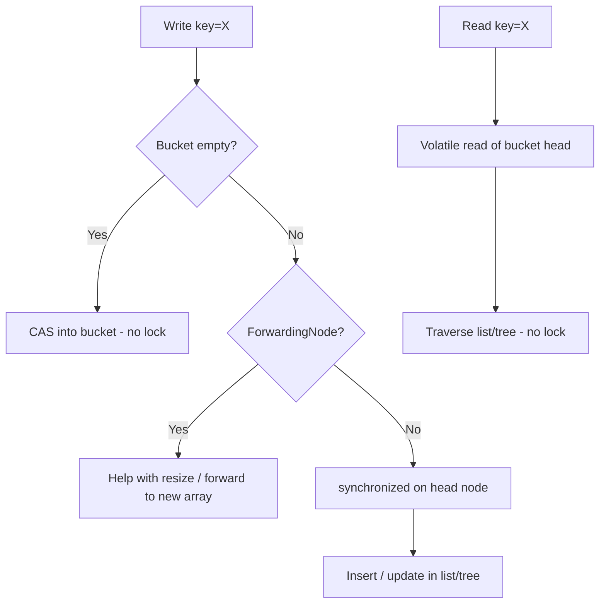
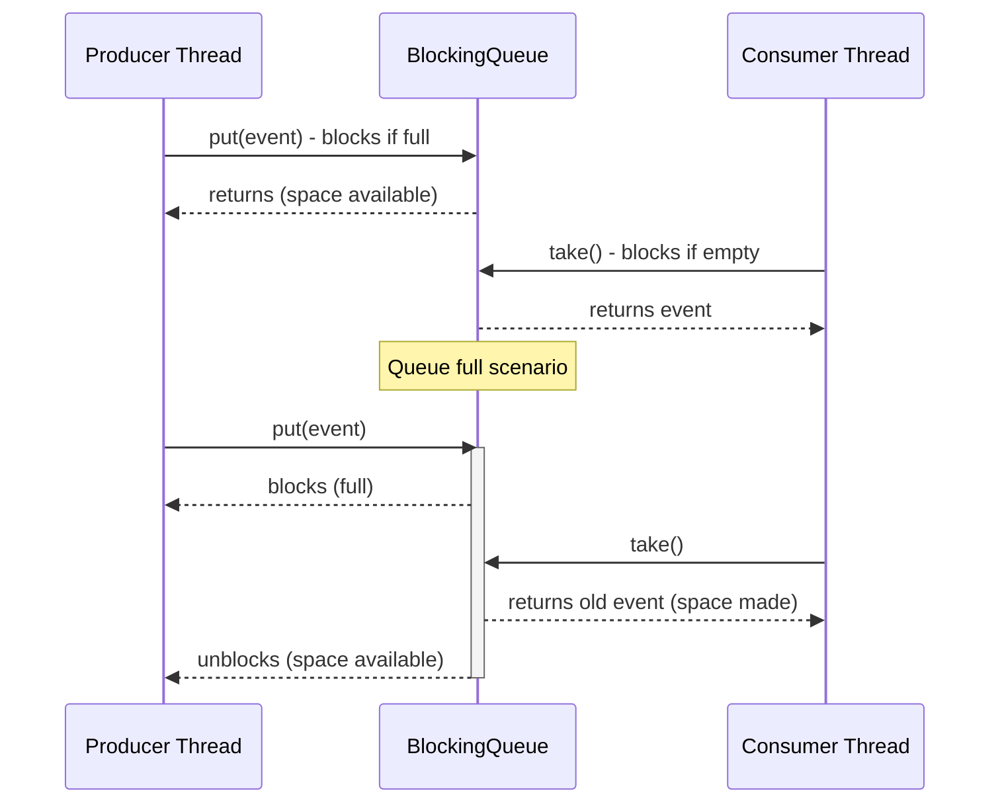

## Keywords in This File
{: .no_toc }

| # | Keyword | Weight |
|---|---|---|
| 1 | [Java Concurrency - L2 Concurrent Collections](#java-concurrency---l2-concurrent-collections) | medium |

---

# Java Concurrency - L2 Concurrent Collections

## ConcurrentHashMap

---

### 🎯 Model Answer

**30 seconds:**
> `ConcurrentHashMap` is a thread-safe hash map that allows concurrent
> reads and fine-grained writes without a global lock. Unlike
> `Collections.synchronizedMap()` which serializes ALL access,
> `ConcurrentHashMap` partitions the map into segments (Java 7) or
> uses node-level CAS + synchronized locking (Java 8+) to allow
> multiple threads to write to different buckets simultaneously. It
> provides atomic compound operations like `computeIfAbsent()`,
> `putIfAbsent()`, and `merge()` that are essential for thread-safe
> compound updates.

**3 minutes (Senior):**
> `ConcurrentHashMap` solves the concurrency/performance trade-off that
> plagues synchronized maps. The Java 8+ implementation uses a hybrid
> approach: reads are lock-free via volatile reads of node references;
> writes CAS the node into the bucket (compare-and-swap for the first
> element in a bucket); only when bucket slots are contended does it
> fall back to `synchronized` on the bucket head node.
>
> The practical result: reads are essentially as fast as `HashMap`
> reads. Writes on non-contended buckets are a CAS operation. Only
> writes to the same bucket are serialized.
>
> The compound operations are the killer feature. `putIfAbsent(key, value)`
> atomically adds the entry only if absent. `computeIfAbsent(key, fn)` is
> even better: it calls the function and inserts the result atomically,
> preventing duplicate computation. These are essential for caches and
> memoization.
>
> Two subtle gotchas: `size()` returns an approximate count (not exact
> under concurrent modification). `null` keys and values are prohibited
> (unlike `HashMap`) - a null value cannot be distinguished from
> "absent."

**Framework:** WHAT → WHY → HOW → TRADE-OFF → EXAMPLE

*Adapting up:* Discuss the Java 8 internal structure (trie, TreeNode
for high-collision buckets, ForwardingNode during resize), bulk operations
(`forEach`, `reduce`, `search`), and why `ConcurrentHashMap.size()` is
approximate.

*Adapting down:* "ConcurrentHashMap is a thread-safe HashMap. Multiple
threads can read and write it simultaneously without external locking.
Think of it as a HashMap that manages its own internal concurrency."

**Blank Mind Recovery:**

**(1) Restate:** "You're asking about ConcurrentHashMap - let me explain
what makes it better than synchronized HashMap and how it achieves
thread safety."

**(2) First principles:** "From first principles: a regular HashMap is
unsafe for concurrent access because bucket list traversal and rehashing
are non-atomic. We need either a global lock (slow) or fine-grained
locking (fast). ConcurrentHashMap uses the latter."

**(3) Bridge:** "ConcurrentHashMap is like a filing cabinet with locks
on individual drawers instead of one lock for the whole cabinet. Two
people can pull different drawers simultaneously - only the same drawer
is serialized."

---

### 📘 Concept Explanation

**What it is:**
`ConcurrentHashMap<K,V>` is a thread-safe implementation of `Map`
that provides high-concurrency reads and low-contention writes through
bucket-level locking. It lives in `java.util.concurrent` and is the
default choice for any shared map in concurrent Java code.

**The problem it solves:**
`HashMap` is not thread-safe - concurrent structural modifications
(resize, bucket manipulation) can cause infinite loops and data
corruption. `Collections.synchronizedMap(new HashMap<>())` adds a
global lock that serializes ALL reads and writes, creating a bottleneck.
`ConcurrentHashMap` allows true concurrent reads and near-concurrent
writes.

**How it works:**
Java 8+ implementation (Node-based, replacing Java 7 segments):

```
Bucket array: [B0] [B1] [B2] ... [Bn]
                |         |
              Node      Node
                |
              Node (linked list or TreeNode for 8+ entries)
```

> **Code walkthrough:** This L2 Concurrent Collections example demonstrates a key concept in practice. **KEY MECHANISM:** the runtime executes these instructions in sequence with specific memory and execution semantics. **WHY IT MATTERS:** misapplying this pattern causes subtle bugs that only manifest under production load. **TAKEAWAY: understand the execution model before using this pattern in production code.**

Read path (lock-free): volatile read of bucket head node, then
traverse the linked list comparing key hash and key equality.
No locks acquired.

Write path (CAS + synchronized):
1. If bucket is empty: CAS the new node into the bucket.
   No lock needed - CAS handles the atomicity.
2. If bucket has entries: `synchronized(head_node)` - lock only
   this bucket's head node, traverse to find/insert/update.
3. If under resize (`ForwardingNode` at bucket): wait for resize
   and retry.

Sizing: after writes, update `counterCells` (striped counter) to
avoid contention on a single size counter. `size()` sums all cells
- approximate under concurrent modification.

**The key insight:**
Compound operations (`computeIfAbsent`, `putIfAbsent`, `compute`,
`merge`) are the critical feature that makes `ConcurrentHashMap` safe
for common patterns that require check-then-act:

```java
// WRONG: check-then-act with two separate calls is NOT atomic
if (!map.containsKey(key)) {
    map.put(key, computeExpensiveValue(key));
    // Another thread can insert between containsKey and put!
}

// CORRECT: computeIfAbsent is atomic at the map level
Value v = map.computeIfAbsent(key, k -> computeExpensiveValue(k));
```

> **Code walkthrough:** This L2 Concurrent Collections example demonstrates Java API usage using SQL. **KEY MECHANISM:** the JVM compiles to bytecode that runs on the JVM; JIT compiles hot paths to native. **WHY IT MATTERS:** unchecked assumptions about thread safety cause data races under concurrent load. **TAKEAWAY: document thread-safety guarantees on every shared mutable class.**

**When to use it:**
- Any shared mutable map accessed by multiple threads
- In-memory caches (with `computeIfAbsent`)
- Frequency counters (with `merge`)
- Service registries, feature flag stores
- Any producer-consumer pattern that uses a map as shared state

**When NOT to use it:**
- When you need a sorted concurrent map: use `ConcurrentSkipListMap`
- When the map is always accessed by one thread: plain `HashMap`
- When you need transaction-level atomicity across multiple operations
  that span more than what the atomic methods provide

**Alternatives:**
- `ConcurrentSkipListMap`: concurrent sorted map (O(log n) operations)
- `Collections.synchronizedMap()`: simpler but global lock (avoid)
- `Caffeine` / `Guava LoadingCache`: full-featured cache with eviction
- `CopyOnWriteArrayMap` (not built-in): snapshot-based (rare use case)

**First-principles derivation:**
The key insight is that hash maps have natural parallelism: separate
buckets are completely independent. Two operations on different buckets
can proceed simultaneously. The only coordination needed is for
operations on the same bucket (write+write or write during resize).
By locking at the bucket level rather than the map level, contention
probability = (threads / bucket_count), which at default capacity 16
is already 16x less contention than a global lock, growing to 256x
less at capacity 256.

---

### 💻 Code Example

> **Code walkthrough:** The BAD example uses `containsKey+put` whichice. **KEY MECHANISM:** the runtime executes these instructions in sequence with specific memory and execution semantics. **WHY IT MATTERS:** misapplying this pattern causes subtle bugs that only manifest under production load. **TAKEAWAY: understand the execution model before using this pattern in production code.**
> is a race condition even with ConcurrentHashMap. The GOOD example
> uses `computeIfAbsent` which is atomic. The production example shows
> the frequency counter pattern using `merge()` - a common pattern for
> counting events by key without external synchronization.

```java
// BAD: check-then-act is NOT atomic even with ConcurrentHashMap
ConcurrentHashMap<String, Connection> pool = new ConcurrentHashMap<>();

Connection getOrCreate(String host) {
    if (!pool.containsKey(host)) {         // check
        pool.put(host, createConnection(host)); // act
        // TWO threads can both pass the check and create two connections!
    }
    return pool.get(host);
}
```

> **Code walkthrough:** BAD pattern: This L2 Concurrent Collections example demonstrates Java API usage. **KEY MECHANISM:** the JVM compiles to bytecode that runs on the JVM; JIT compiles hot paths to native. **WHY IT MATTERS:** unchecked assumptions about thread safety cause data races under concurrent load. **WHAT BREAKS: document thread-safety guarantees on every shared mutable class.**

```java
// GOOD: computeIfAbsent is atomic - function runs at most once per key
ConcurrentHashMap<String, Connection> pool = new ConcurrentHashMap<>();

Connection getOrCreate(String host) {
    // computeIfAbsent: atomic check-and-insert
    // The lambda runs ONLY if key is absent, at most once per key
    return pool.computeIfAbsent(host, h -> createConnection(h));
}
```

> **Code walkthrough:** GOOD pattern: This L2 Concurrent Collections example demonstrates Java API usage using SQL. **KEY MECHANISM:** the JVM compiles to bytecode that runs on the JVM; JIT compiles hot paths to native. **WHY IT MATTERS:** unchecked assumptions about thread safety cause data races under concurrent load. **TAKEAWAY: document thread-safety guarantees on every shared mutable class.**

```java
// PRODUCTION: frequency counter using merge()
ConcurrentHashMap<String, Long> eventCounts =
    new ConcurrentHashMap<>();

void recordEvent(String eventType) {
    // merge: atomically update or initialize the counter
    // If key absent: put 1L. If present: add 1L to existing value.
    eventCounts.merge(eventType, 1L, Long::sum);
}

// Alternative using compute():
void recordEventV2(String eventType) {
    eventCounts.compute(eventType, (key, current) ->
        current == null ? 1L : current + 1L);
}

// Bulk reads - snapshot-safe iteration:
void printTopEvents() {
    // forEach iterates a snapshot - safe for concurrent modification
    eventCounts.entrySet().stream()
        .sorted(Map.Entry.<String, Long>comparingByValue().reversed())
        .limit(10)
        .forEach(e -> System.out.println(e.getKey() + ": " + e.getValue()));
}
```

> **Code walkthrough:** This Unknown example demonstrates Java Stream pipeline using Stream. **KEY MECHANISM:** the stream is lazy - intermediate ops build a pipeline, terminal op drives it. **WHY IT MATTERS:** calling terminal op twice throws IllegalStateException; parallel() on small data adds overhead. **TAKEAWAY: collect() or findFirst() triggers the pipeline; reuse by wrapping in Supplier.**

---

### 🎓 Answers by Seniority

**Junior / Mid (0-5 years):**
> `ConcurrentHashMap` is a thread-safe HashMap. You can use it from
> multiple threads without external synchronization. Unlike wrapping a
> HashMap in `Collections.synchronizedMap()`, ConcurrentHashMap allows
> multiple threads to access different parts of the map simultaneously,
> which is much faster under high concurrency. The key methods to know:
> `putIfAbsent()` to add only if absent, `computeIfAbsent()` to compute
> and store only if absent, and `merge()` to update or initialize a value.
> Note: null keys and values are not allowed.

*Push deeper:* Ask why you'd use `computeIfAbsent()` instead of separate
`containsKey()` + `put()` calls.

---

**Senior / Staff (5+ years):**
> The Java 8 ConcurrentHashMap is remarkably well-designed - lock-free
> reads via volatile node references, CAS for empty-bucket writes, and
> bucket-head synchronized locking only when needed. In practice, it
> scales to dozens of concurrent writers on modern hardware. My usage
> pattern: always use the atomic compound operations. A mistake I see
> often: using `size()` for load-factor decisions - `size()` is
> approximate during concurrent writes. Instead, use `mappingCount()` for
> a better estimate, or accept approximation if exact count isn't critical.
> For production caches, I use Caffeine over ConcurrentHashMap because it
> adds maximum-size bounding and expiry, which are almost always needed.

*Push deeper:* Discuss when high-collision buckets get converted to
TreeNodes (bin conversion at 8 entries, back to list at 6), and how
this affects worst-case O(log n) read complexity for collision-heavy
workloads.

---

### ⚠️ Common Misconceptions

**Misconception 1: "ConcurrentHashMap is fully consistent - size() returns
exact count."**
`size()` and `isEmpty()` are approximate under concurrent modification
(they sum striped counters). For an accurate count, use
`mappingCount()` (still approximate but better) or accept the
approximation. Exact atomic counting requires external coordination.

**Misconception 2: "null is allowed like in HashMap."**
`ConcurrentHashMap` prohibits null keys and values. The reason: in a
concurrent context, you cannot distinguish a map that returns null
for "key absent" from a map that stored null as a value, without the
ability to call `containsKey()` atomically with the `get()`. This
ambiguity is safe in HashMap (single-threaded) but dangerous in
concurrent code.

**Misconception 3: "Individual operations are atomic therefore compound
operations are too."**
Individual `get()` and `put()` are thread-safe, but a sequence of
`get()` then `put()` is not atomic as a pair. Use `compute()`,
`computeIfAbsent()`, `merge()`, or `replace()` for atomic compound
operations.

---

### 🚨 Failure Modes and Diagnosis

**Failure 1: Duplicate computation from check-then-act**
Symptom: expensive resource (connection, parsed object) created
multiple times per key, causing resource leaks or conflicts.
Cause: `if(!contains) put()` pattern with two separate atomic calls.
Fix: use `computeIfAbsent()` - function guaranteed to run at most
once per key under concurrent access.

**Failure 2: NullPointerException from prohibited nulls**
Symptom: `NullPointerException` when putting/getting null keys or values.
Cause: ConcurrentHashMap.put(null, value) or put(key, null) throws NPE.
Fix: use a sentinel object (e.g., Optional.empty() or a special marker
object) if you need to store "no value" semantics.

**Failure 3: ConcurrentModificationException during iteration**
Symptom: exception thrown during map iteration.
Cause: NOT from concurrent modification (unlike HashMap) - iterators
are weakly consistent and don't throw ConcurrentModificationException.
Real cause: structural modification during `.keySet()` or `.values()`
stream iteration.
Fix: ConcurrentHashMap iteration is safe concurrently - if you see CME,
check for HashMap being used instead, or investigate your iterator
usage pattern.

---

### 🎯 Interview Deep-Dive

| Question Category | Time to Answer |
|---|---|
| Definition | 30-60 seconds |
| Mechanism | 2-3 minutes |
| Comparison | 1-2 minutes |
| API | 1-2 minutes |
| Debugging | 2-3 minutes |
| Advanced | 2-3 minutes |
| Trade-off | 1-2 minutes |
| Scenario | 2-3 minutes |
| Internals | 2-3 minutes |

---

**Q1 (Definition): What is ConcurrentHashMap and how does it differ
from synchronizedMap?**

A: `ConcurrentHashMap` is a thread-safe Map implementation optimized
for high concurrency. The key differences from `synchronizedMap`:

Locking granularity: `synchronizedMap` wraps every method in
`synchronized(this)` - a global lock. All reads and writes are
serialized. `ConcurrentHashMap` uses bucket-level locking - only
operations on the same bucket are serialized. Different buckets
proceed in parallel.

Read scalability: `ConcurrentHashMap` reads are completely lock-free
(volatile reads). `synchronizedMap` reads require acquiring the global
lock, blocking all other readers and writers.

Atomic compound operations: `ConcurrentHashMap` provides atomic
`putIfAbsent()`, `computeIfAbsent()`, `compute()`, `merge()`.
`synchronizedMap` provides none - you need external synchronized
blocks, reintroducing the global lock.

Null handling: `ConcurrentHashMap` prohibits null keys/values.
`synchronizedMap(HashMap)` allows them.

Iteration: `synchronizedMap` requires external synchronization during
iteration (otherwise CME). `ConcurrentHashMap` iterators are weakly
consistent - safe to iterate while modified, seeing a snapshot.

*What separates good from great:* Knowing that `synchronizedMap` wraps
EVERY method including `size()`, `isEmpty()`, `containsKey()` etc.,
meaning even read-only queries serialize with all writes. With thousands
of concurrent reads, this serialization is catastrophic for throughput.

---

**Q2 (Mechanism): How does Java 8 ConcurrentHashMap achieve concurrent
writes without a global lock?**

A: Java 8 `ConcurrentHashMap` uses a three-tier approach for writes:

Tier 1 - CAS for empty buckets: when writing to a previously empty
bucket, the new node is inserted using a Compare-And-Swap (CAS)
operation on the bucket reference. No lock is acquired. If CAS fails
(another thread wrote simultaneously), retry.

Tier 2 - Synchronized on head node for non-empty buckets: when a
bucket already has entries, `synchronized(head_node)` is acquired.
This locks only the linked list (or tree) at that specific bucket.
Other buckets are completely unaffected.

Tier 3 - Resize protocol: when the map is resizing, buckets that have
been migrated contain `ForwardingNode`. Writes to these buckets wait
for migration to complete by helping with the resize.

The result: two writers on different buckets proceed simultaneously.
Two writers on the same bucket are serialized, but contention
probability = 1/n_buckets (default 16, grows with load factor).

Counter updates: rather than a single `size` field (which would be
a contention bottleneck), updates go to `LongAdder`-like
`CounterCell` arrays with one cell per core. `size()` sums all cells.

*What separates good from great:* The bucket-level synchronized lock
is the same `synchronized` keyword we use in application code - the
JVM optimizes it with biased/thin locking. So in the common case of
no contention on the same bucket, the locking cost is minimal (biased
or CAS-based thin lock).

---

**Q3 (Comparison): When would you use ConcurrentSkipListMap vs ConcurrentHashMap?**

A: The core trade-off is ordering vs performance:

`ConcurrentHashMap`:
- O(1) average reads/writes (hash-based)
- No ordering - iteration order is undefined
- Higher throughput for unordered access
- Use for: caches, frequency maps, registries

`ConcurrentSkipListMap`:
- O(log n) reads/writes (skip list - linked levels)
- Keys always sorted by natural/comparator order
- Supports range queries: `subMap()`, `headMap()`, `tailMap()`
- Lower write throughput than ConcurrentHashMap
- Use for: sorted indices, range-based lookups, time-series data,
  ordered event queues

The decision criterion: if you ever need "get all entries with key
between X and Y" or "get the highest/lowest N keys", you need
ConcurrentSkipListMap. If you only need point lookups by key,
ConcurrentHashMap is significantly faster.

*What separates good from great:* Skip lists achieve O(log n) without
locks by using probabilistic structure and CAS operations. There is
no "resize" event that would require global coordination. This makes
ConcurrentSkipListMap predictably low-latency, whereas ConcurrentHashMap
can pause all writes briefly during resize.

---

**Q4 (API): What is the difference between putIfAbsent(), computeIfAbsent(),
compute(), and merge()?**

A: These are the four atomic compound operations for common patterns:

`putIfAbsent(key, value)`: atomically insert `value` for `key` only
if `key` is not present. Returns the existing value if present,
or null if the new value was inserted. The value is always computed
before the call (even if key exists). Use for pre-computed values.

`computeIfAbsent(key, fn)`: atomically compute and insert `fn(key)`
only if `key` is absent. The function is called ONLY if insertion
happens (lazy computation). Returns the current (existing or new)
value. Use for lazy initialization, caches, and memoization.

`compute(key, fn)`: atomically compute `fn(key, currentValue)` and
store the result. Called regardless of key presence (`currentValue`
is null if absent). Returns the new value. Use for atomic
read-modify-write on any key.

`merge(key, value, fn)`: if key is absent, stores `value`. If present,
stores `fn(currentValue, value)`. Use for aggregations (frequency
counting, summing):
```java
// Count events:
map.merge(eventType, 1L, Long::sum);
// Equivalent but less readable:
map.compute(eventType, (k, v) -> v == null ? 1L : v + 1L);
```

> **Code walkthrough:** This Unknown example demonstrates Java API usage. **KEY MECHANISM:** the JVM compiles to bytecode that runs on the JVM; JIT compiles hot paths to native. **WHY IT MATTERS:** unchecked assumptions about thread safety cause data races under concurrent load. **TAKEAWAY: document thread-safety guarantees on every shared mutable class.**

The functional difference: `putIfAbsent` needs the value pre-computed;
`computeIfAbsent` computes lazily; `compute` always computes;
`merge` combines with existing value.

*What separates good from great:* Knowing that the functions in
`computeIfAbsent` and `compute` should be fast and non-blocking.
The bucket lock is held while the function executes. A slow or
blocking function in `computeIfAbsent` blocks all other writes to
that bucket, creating hidden contention.

---

**Q5 (Debugging): computeIfAbsent is creating the expensive resource
multiple times under high concurrency. Why?**

A: This should not happen with `ConcurrentHashMap.computeIfAbsent()` -
it guarantees at-most-once computation per key. If resources are being
created multiple times, investigate these potential causes:

Cause 1: Using `HashMap` instead of `ConcurrentHashMap`. The issue
is invisible because `HashMap` is not thread-safe, and the internal
state corruption only manifests under specific timing - sometimes
it silently allows duplicate inserts.

Cause 2: Using the `if(!contains) put()` pattern instead of
`computeIfAbsent()`. The map is ConcurrentHashMap but the caller
code is doing two-step check-then-act.

Cause 3: The resource is being replaced: `compute()` or `put()` is
being called elsewhere (in different code paths), which replaces the
entry and triggers re-creation on the next `computeIfAbsent()` call.

Cause 4: In Java < 8 or certain JDK implementations: there was a
bug in `computeIfAbsent` related to recursive calls from within the
computing function - if the function itself calls `computeIfAbsent` on
the same map, it can deadlock or allow duplicate execution.

Diagnosis: add logging inside the compute function with Thread.currentThread()
and a unique call ID. If you see the same key computed by multiple threads,
confirm the map type and check all code paths that write to the map.

*What separates good from great:* Mentioning Cause 4 (recursive
computeIfAbsent deadlock) - this was a known JDK bug and the correct
fix is to not call `computeIfAbsent` for the same map inside the
computing function.

---

**Q6 (Advanced): Why does ConcurrentHashMap forbid null keys and values?**

A: The null prohibition is a deliberate design decision to prevent a
class of ambiguous-result bugs in concurrent contexts:

The problem with nulls: when you call `map.get(key)` and receive
`null`, what does it mean?
- Option A: the key is not in the map
- Option B: the key IS in the map, with value `null`

In single-threaded `HashMap`, you can resolve the ambiguity with
`containsKey()`. In a concurrent context, between `get()` returning
null and `containsKey()` being called, another thread can add or
remove the key - making `containsKey()` results unreliable for
resolving the ambiguity.

The ConcurrentHashMap design decision: prohibit null so that `null`
return from `get()` ALWAYS means "not present." This eliminates the
ambiguity entirely and makes all null-checking code correct by default.

`ConcurrentSkipListMap` has the same prohibition for the same reason.
`HashMap` and `TreeMap` allow null because the ambiguity is safe in
single-threaded contexts (you can call `containsKey()` immediately
after `get()` without risk of concurrent modification).

If you need to store "no value" semantics, use `Optional<V>` as the
value type, or a sentinel singleton object.

*What separates good from great:* Understanding that this is NOT a
limitation or oversight - it's a contract that prevents an entire class
of concurrent bugs. Libraries and frameworks that accidentally store
nulls in shared maps often discover this bug late in production.

---

**Q7 (Trade-off): What are the performance characteristics of
ConcurrentHashMap under high contention on the same key?**

A: `ConcurrentHashMap` optimizes for different-key concurrency. When
multiple threads hammer the same key, performance degrades because:

All writes to the same bucket (which includes the same key) are
serialized via `synchronized(head_node)`. With 10 threads updating
key "X" concurrently, writes proceed one at a time.

For high-contention counters per key, better alternatives:

`LongAdder` / `AtomicLong`: for pure numeric accumulation. Replace
`map.compute(key, (k,v) -> v+1)` with `longAdder.increment()` for
a specific key.

Striped / partitioned counters: maintain an array of counters and
use `key.hashCode() % array.length` to distribute writes across
multiple counters. Sum the array for the total.

`java.util.concurrent.atomic.LongAccumulator`: similar to LongAdder
with a custom combination function.

For production high-throughput event counting:
```java
// Instead of ConcurrentHashMap<String, Long>:
ConcurrentHashMap<String, LongAdder> counters = new ConcurrentHashMap<>();

void increment(String key) {
    counters.computeIfAbsent(key, k -> new LongAdder()).increment();
    // LongAdder uses striped counters internally - much lower contention
}

long getCount(String key) {
    LongAdder adder = counters.get(key);
    return adder == null ? 0L : adder.sum();
}
```

> **Code walkthrough:** This Unknown example demonstrates Java API usage. **KEY MECHANISM:** the JVM compiles to bytecode that runs on the JVM; JIT compiles hot paths to native. **WHY IT MATTERS:** unchecked assumptions about thread safety cause data races under concurrent load. **TAKEAWAY: document thread-safety guarantees on every shared mutable class.**

*What separates good from great:* The `ConcurrentHashMap<String, LongAdder>`
pattern is a well-known high-throughput counter idiom. `LongAdder` is
designed for high-write, low-read scenarios - internally striped to
minimize false sharing and CAS contention.

---

**Q8 (Scenario): Implement a thread-safe bounded cache with eviction.**

A: `ConcurrentHashMap` alone cannot do eviction. For production caches,
use Caffeine:

```java
import com.github.benmanes.caffeine.cache.*;

LoadingCache<String, User> userCache = Caffeine.newBuilder()
    .maximumSize(10_000)            // evict LRU when size exceeded
    .expireAfterWrite(5, TimeUnit.MINUTES) // TTL
    .recordStats()                  // for monitoring
    .build(userId -> loadFromDatabase(userId)); // auto-load on miss

// Usage - atomic: loads if absent, returns if present
User user = userCache.get(userId);
```

> **Code walkthrough:** This Unknown example demonstrates Java API usage. **KEY MECHANISM:** the JVM compiles to bytecode that runs on the JVM; JIT compiles hot paths to native. **WHY IT MATTERS:** unchecked assumptions about thread safety cause data races under concurrent load. **TAKEAWAY: document thread-safety guarantees on every shared mutable class.**

If you must use only JDK classes:
```java
// LinkedHashMap in access-order mode with synchronizedMap
Map<String, User> lruCache =
    Collections.synchronizedMap(
        new LinkedHashMap<>(16, 0.75f, true) { // access-order=true
            protected boolean removeEldestEntry(Map.Entry e) {
                return size() > 10_000; // evict when over limit
            }
        }
    );
```

> **Code walkthrough:** This Unknown example demonstrates mutex locking using concurrency primitive. **KEY MECHANISM:** the JVM acquires the intrinsic lock on the object monitor before entering the block. **WHY IT MATTERS:** a thread holding the lock blocks all other threads - a bottleneck at scale. **TAKEAWAY: prefer ReentrantLock or ConcurrentHashMap over synchronized for hot paths.**

The JDK LRU approach has a global lock (synchronizedMap) which
limits concurrency. For production use, Caffeine is 10-100x faster
under concurrent access, supports async loading, and provides rich
monitoring.

*What separates good from great:* Explaining that Caffeine's cache uses
a window TinyLFU eviction policy (not pure LRU) which achieves better
hit rates for skewed access patterns - in practice, this means higher
cache hit rates and lower backend load compared to an LRU cache of
the same size.

---

**Q9 (Internals): What happens during a ConcurrentHashMap resize?**

A: When the load factor threshold is reached (default 0.75), the map
doubles its bucket array:

1. A new array of 2x size is allocated
2. Transfer of buckets begins cooperatively: multiple threads can
   participate in the transfer (each thread claims a contiguous range
   of buckets)
3. Each transferred bucket gets a `ForwardingNode` placed at its
   head, pointing to the new array
4. Reads: when a thread encounters a `ForwardingNode`, it follows the
   forward pointer to the new array and reads from there
5. Writes: when a thread encounters a `ForwardingNode`, it also
   forwards to the new array, or helps with the transfer
6. When all buckets are transferred, the array reference is atomically
   swapped to the new array

Key properties: the resize is non-blocking for readers (they follow
forward pointers). Writes during resize are serialized per bucket but
proceed concurrently across buckets. The concurrent transfer protocol
means resize can leverage multiple available threads to complete faster.

*What separates good from great:* The pre-sizing optimization: if you
know the expected size, construct with `new ConcurrentHashMap<>(capacity /
0.75 + 1)` to avoid all resize events. A resize that occurs during a
traffic spike can cause temporary write latency as threads synchronize
on bucket migration.

---

### ⚖️ Comparison Table

| Option | Concurrency | Ordering | Null | Throughput | Best For |
|---|---|---|---|---|---|
| ConcurrentHashMap | High | None | No | Very High | Shared map, caches |
| synchronizedMap(HashMap) | Low (global lock) | None | Yes | Low | Simple, low-concurrency |
| ConcurrentSkipListMap | High | Sorted | No | Medium | Range queries |
| HashMap | None (not thread-safe) | None | Yes | Highest | Single-thread only |
| Hashtable | Low (global lock) | None | No | Low | Legacy, avoid |

**The deciding factor:**
Default choice for any shared map: `ConcurrentHashMap`. If sorted
order is needed: `ConcurrentSkipListMap`. If you need eviction or
TTL: Caffeine.

---

### 🏛️ System Design

*(Omit: L2 working-level concept - ConcurrentHashMap as a distributed
cache building block appears in L4/L5 system design contexts.)*

---

### 📊 Diagram

```
ConcurrentHashMap Internal Structure (Java 8+):

  Bucket Array
  [0]  -> null
  [1]  -> Node("a",1) -> Node("q",5)   <- same bucket (hash collision)
  [2]  -> Node("b",2)
  ...
  [n]  -> TreeNode (converted when 8+ nodes in bucket)

  Write to empty bucket: CAS(bucket[i], null, newNode) -- no lock
  Write to non-empty bucket: synchronized(bucket[i].head) { ... }
```



> **Diagram walkthrough:** Writes to `ConcurrentHashMap` follow a
> three-path decision: empty bucket uses lock-free CAS, non-empty
> buckets use synchronized on the head node (per-bucket lock), and
> during resize a ForwardingNode forwards to the new array. Reads are
> always lock-free via volatile reads. This design allows parallel
> writes to different buckets while serializing only same-bucket
> conflicts, achieving near-linear read scaling and low-contention
> write scaling across a default 16-bucket (growing) array.

---
---

## BlockingQueue

---

### 🎯 Model Answer

**30 seconds:**
> `BlockingQueue` is a thread-safe queue that blocks on `put()` when
> full and blocks on `take()` when empty. It is the canonical Java
> implementation of the producer-consumer pattern - producers call
> `put()`, consumers call `take()`, and the queue manages all the
> wait/notify coordination internally. It eliminates the need to write
> any manual synchronization for bounded producer-consumer scenarios.
> `LinkedBlockingQueue` (unbounded or bounded) and `ArrayBlockingQueue`
> (always bounded) are the two most common implementations.

**3 minutes (Senior):**
> `BlockingQueue` is Java's most important concurrency building block
> for producer-consumer architectures. It provides four operation modes:
> throw (offer/poll return false), block (`put()`/`take()` wait
> indefinitely), timeout (`offer(e, timeout, unit)` / `poll(timeout, unit)`),
> and special (`drainTo()`).
>
> `LinkedBlockingQueue` uses two separate locks - one for head
> (consumer/take) and one for tail (producer/put) - allowing producers
> and consumers to operate simultaneously without contention. The default
> capacity is Integer.MAX_VALUE, which is effectively unbounded and
> dangerous in production.
>
> `ArrayBlockingQueue` uses a single lock and circular buffer. Both
> producers and consumers share the same lock, meaning producers and
> consumers contend. Lower throughput than LinkedBlockingQueue but
> more predictable memory usage (array pre-allocated).
>
> `SynchronousQueue` has zero capacity - every `put()` blocks until
> a `take()` is ready (direct handoff). This is how the
> `newCachedThreadPool()` work queue works.
>
> The production pattern: almost always use `LinkedBlockingQueue(capacity)`
> with explicit capacity for backpressure.

**Framework:** WHAT → WHY → HOW → TRADE-OFF → EXAMPLE

*Adapting up:* Discuss `PriorityBlockingQueue` for priority-ordered
processing, `DelayQueue` for scheduled task queues, and how
`ArrayBlockingQueue` with `fair=true` provides FIFO ordering at
cost of throughput.

*Adapting down:* "BlockingQueue is a smart waiting room. When the
waiting room is full, new arrivals wait outside (put blocks). When
the waiting room is empty, the doctor waits (take blocks)."

**Blank Mind Recovery:**

**(1) Restate:** "You're asking about BlockingQueue - the key insight
is that it handles all the producer-consumer synchronization for you."

**(2) First principles:** "From first principles: a producer-consumer
problem needs a buffer with backpressure. When full, producers must
wait. When empty, consumers must wait. BlockingQueue gives you that
with a clean API."

**(3) Bridge:** "BlockingQueue is like a conveyor belt between the
bakery (producer) and the checkout counter (consumer). When the belt is
full, bakers stop adding items until space opens. When the belt is empty,
cashiers wait until new items arrive."

---

### 📘 Concept Explanation

**What it is:**
`BlockingQueue<E>` is an interface in `java.util.concurrent` that
extends `Queue`. Implementations provide thread-safe, blocking
insertion and removal operations. The blocking behavior eliminates
manual wait/notify code for producer-consumer patterns.

**The problem it solves:**
Implementing a thread-safe bounded buffer with blocking requires careful
wait/notify or Condition coordination. Getting it right (no lost
notifications, no spurious wakeup bugs, correct while-not-if) is
non-trivial. `BlockingQueue` encapsulates all that complexity in a
well-tested implementation.

**How it works:**
```plaintext
Operations and their behaviors:

Method        | Full queue     | Empty queue   | Blocking?
put(e)        | blocks         | n/a (insert)  | Yes
offer(e)      | returns false  | n/a (insert)  | No
offer(e,t,u)  | blocks up to t | n/a (insert)  | Timed

take()        | n/a (remove)   | blocks        | Yes
poll()        | n/a (remove)   | returns null  | No
poll(t,u)     | n/a (remove)   | blocks up to t| Timed
```

> **Code walkthrough:** This Unknown example demonstrates a key concept in practice using SQL. **KEY MECHANISM:** the runtime executes these instructions in sequence with specific memory and execution semantics. **WHY IT MATTERS:** misapplying this pattern causes subtle bugs that only manifest under production load. **TAKEAWAY: understand the execution model before using this pattern in production code.**

`LinkedBlockingQueue` internals: separate head lock (take) and tail
lock (put). A producer and consumer can proceed simultaneously. Uses
a linked node structure - memory grows with queue size.

`ArrayBlockingQueue` internals: single lock (both put and take share
it), circular buffer, pre-allocated array. Single lock means producer
and consumer contend. `fair=true` uses fair locking (FIFO, higher cost).

**The key insight:**
`BlockingQueue` is the correct abstraction for decoupling producers
from consumers. The queue acts as a buffer that absorbs rate differences.
When the queue is full, `put()` blocking is the natural backpressure
mechanism - producers automatically slow down when consumers can't
keep up.

**When to use it:**
- Producer-consumer pipelines where producers and consumers run at
  different rates
- Work queues where worker threads pull tasks
- Data pipelines where stages run at different speeds
- Event processing with variable event rates
- Rate-limiting by using a bounded queue as a token bucket

**When NOT to use it:**
- When you need priority ordering: use `PriorityBlockingQueue`
- When you need delay-based scheduling: use `DelayQueue`
- When tasks should execute immediately (no queuing): use
  `SynchronousQueue` (zero capacity, direct handoff)
- When you need reactive/non-blocking flow control:
  use reactive streams (Project Reactor, RxJava)

**Alternatives:**
- `ArrayDeque` + ReentrantLock: custom implementation with deque semantics
- `LinkedTransferQueue`: producer blocks until consumer takes directly
  (stronger handoff guarantee than BlockingQueue)
- Reactive Streams: non-blocking backpressure via `Flux`, `Flowable`
- Disruptor (LMAX): ultra-high-throughput ring buffer (10x+ over queue)

**First-principles derivation:**
The producer-consumer problem is one of the classic concurrency
patterns. The natural solution is a bounded buffer: producers add,
consumers remove, both block on boundary conditions. BlockingQueue
provides exactly this abstraction with production-quality implementations.
The API design (separate put/offer/take/poll variants) gives callers
control over blocking behavior without changing the underlying structure.

---

### 💻 Code Example

> **Code walkthrough:** The BAD example manually implements blockingice. **KEY MECHANISM:** the runtime executes these instructions in sequence with specific memory and execution semantics. **WHY IT MATTERS:** misapplying this pattern causes subtle bugs that only manifest under production load. **TAKEAWAY: understand the execution model before using this pattern in production code.**
> using wait/notify - it's error-prone and harder to read. The GOOD
> example uses BlockingQueue which encapsulates all synchronization.
> The production example shows a thread pool-backed pipeline pattern,
> the most common real-world BlockingQueue usage.

```java
// BAD: manual wait/notify producer-consumer (error-prone, verbose)
class ManualBuffer {
    private final List<Item> buffer = new ArrayList<>();
    private final int capacity;

    synchronized void produce(Item item) throws InterruptedException {
        while (buffer.size() == capacity) wait();
        buffer.add(item);
        notifyAll();
    }

    synchronized Item consume() throws InterruptedException {
        while (buffer.isEmpty()) wait();
        Item item = buffer.remove(0);
        notifyAll();
        return item;
    }
    // 20 lines, easy to get wrong, hard to add timeout
}
```

> **Code walkthrough:** BAD pattern: This Unknown example demonstrates mutex locking using concurrency primitive. **KEY MECHANISM:** the JVM acquires the intrinsic lock on the object monitor before entering the block. **WHY IT MATTERS:** a thread holding the lock blocks all other threads - a bottleneck at scale. **WHAT BREAKS: prefer ReentrantLock or ConcurrentHashMap over synchronized for hot paths.**

```java
// GOOD: BlockingQueue encapsulates all synchronization
class BlockingBuffer {
    // Explicitly bounded - production-safe
    private final BlockingQueue<Item> queue =
        new LinkedBlockingQueue<>(500); // capacity = 500

    void produce(Item item) throws InterruptedException {
        queue.put(item); // blocks when full - automatic backpressure
    }

    Item consume() throws InterruptedException {
        return queue.take(); // blocks when empty - automatic waiting
    }

    // Timeout variant for responsive shutdown:
    Item consumeWithTimeout() throws InterruptedException {
        return queue.poll(1, TimeUnit.SECONDS); // null if timeout
    }
}
```

> **Code walkthrough:** GOOD pattern: This Unknown example demonstrates Java API usage. **KEY MECHANISM:** the JVM compiles to bytecode that runs on the JVM; JIT compiles hot paths to native. **WHY IT MATTERS:** unchecked assumptions about thread safety cause data races under concurrent load. **TAKEAWAY: document thread-safety guarantees on every shared mutable class.**

```java
// PRODUCTION: worker pool with BlockingQueue work queue
class TaskProcessor {
    private final BlockingQueue<Task> workQueue =
        new LinkedBlockingQueue<>(1000);
    private final List<Thread> workers = new ArrayList<>();
    private volatile boolean running = true;

    TaskProcessor(int workerCount) {
        for (int i = 0; i < workerCount; i++) {
            Thread worker = new Thread(() -> {
                while (running || !workQueue.isEmpty()) {
                    try {
                        // Poll with timeout for responsive shutdown
                        Task task = workQueue.poll(
                            100, TimeUnit.MILLISECONDS);
                        if (task != null) {
                            processTask(task); // actual work
                        }
                    } catch (InterruptedException e) {
                        Thread.currentThread().interrupt();
                        break;
                    }
                }
            }, "worker-" + i);
            worker.start();
            workers.add(worker);
        }
    }

    void submit(Task task) throws InterruptedException {
        workQueue.put(task); // blocks when work queue full
    }

    void shutdown() throws InterruptedException {
        running = false;
        for (Thread w : workers) w.join(5000);
    }
}
```

> **Code walkthrough:** This Unknown example demonstrates exception handling using error handling. **KEY MECHANISM:** the JVM checks catch clauses in order; finally always executes for cleanup. **WHY IT MATTERS:** swallowing exceptions silently hides failures that corrupt downstream state. **TAKEAWAY: log or rethrow every exception; empty catch blocks are defects.**

---

### 🎓 Answers by Seniority

**Junior / Mid (0-5 years):**
> `BlockingQueue` is a thread-safe queue where `put()` blocks when the
> queue is full and `take()` blocks when empty. It makes producer-consumer
> patterns simple: the producer calls `put()`, the consumer calls `take()`,
> and the queue handles all the blocking and waking up internally. Common
> implementations: `LinkedBlockingQueue` (linked list, optionally bounded),
> `ArrayBlockingQueue` (array, always bounded), `SynchronousQueue` (no
> capacity, direct handoff). Always specify a capacity for `LinkedBlockingQueue`
> in production to prevent unbounded growth.

*Push deeper:* What is the difference between `offer()` and `put()`?
When would you use `offer(timeout)` instead of `put()`?

---

**Senior / Staff (5+ years):**
> I treat BlockingQueue as the default building block for any work queue
> or pipeline. The choice of implementation matters: `LinkedBlockingQueue`
> gives higher throughput (two locks - producers and consumers don't
> contend), `ArrayBlockingQueue` gives predictable memory (pre-allocated,
> no GC pressure from node allocation). For high-throughput event streams
> (>100K/sec), LMAX Disruptor is 10-20x faster than any BlockingQueue -
> it uses a lock-free ring buffer with single-writer/multiple-reader
> semantics. But for most production workloads under 50K/sec, a bounded
> `LinkedBlockingQueue` is the right choice. I always set an explicit
> capacity - the default Integer.MAX_VALUE capacity is effectively unbounded
> and will OOM under sustained backlog.

*Push deeper:* Compare `LinkedTransferQueue` (producer blocks until
consumer takes) vs `LinkedBlockingQueue` for latency-sensitive pipelines.

---

### ⚠️ Common Misconceptions

**Misconception 1: "BlockingQueue.take() is inefficient because it
wastes CPU spinning."**
`take()` uses OS-level parking (`LockSupport.park()`) - the thread
is suspended and consumes no CPU while waiting. It is awoken when a
producer calls `put()` which unparks the waiting consumer. Zero CPU
waste. This is different from busy-waiting (spinloop), which does
waste CPU.

**Misconception 2: "LinkedBlockingQueue with no capacity is fine if
producers are usually fast enough."**
"Usually" is not "always." During GC pauses, traffic spikes, or slow
consumers, the queue can grow unboundedly. In production, unbounded
queues cause OOM during incidents precisely when you don't want them.
Always set capacity.

**Misconception 3: "drainTo() is atomic and thread-safe for consumer
side."**
`drainTo()` is not atomic for the producer side - producers can add
elements during a drain. It drains elements that are present at the
time of the call, potentially missing elements added concurrently.
Use it for batch processing where "drain all current elements" is
acceptable, not when exact atomic batch semantics are required.

---

### 🚨 Failure Modes and Diagnosis

**Failure 1: OOM from unbounded LinkedBlockingQueue**
Symptom: heap exhaustion during load spike. `OutOfMemoryError:
Java heap space`.
Cause: `new LinkedBlockingQueue<>()` defaults to Integer.MAX_VALUE
capacity. Tasks pile up faster than workers process them.
Fix: `new LinkedBlockingQueue<>(capacity)` with calculated capacity.

**Failure 2: Deadlock when queue puts block forever**
Symptom: producer thread stuck in `put()` forever. Consumer threads
in WAITING state from `take()`.
Cause: consumer threads died due to uncaught exception - no one
is calling `take()`, queue fills, producer blocks indefinitely.
Diagnosis: thread dump shows producer in TIMED_WAITING or WAITING
on the queue lock; no consumer threads exist.
Fix: wrap consumer task execution in try/catch; restart failed consumer
threads via ExecutorService with `AfterExecute` hook.

**Failure 3: Slow shutdown - workers don't stop**
Symptom: application takes too long to shut down (consumers stuck
in `take()` after last task processed).
Cause: consumers waiting on `take()` indefinitely with no more tasks.
Fix: use `poll(timeout, unit)` instead of `take()` and check a stop
flag periodically, OR submit "poison pill" sentinel tasks to signal
consumers to stop.

---

### 🎯 Interview Deep-Dive

| Question Category | Time to Answer |
|---|---|
| Definition | 30-60 seconds |
| Implementation | 2-3 minutes |
| Comparison | 1-2 minutes |
| Scenario | 2-3 minutes |
| Debugging | 2-3 minutes |
| Pattern | 1-2 minutes |
| Advanced | 2-3 minutes |
| Trade-off | 1-2 minutes |
| Design | 2-3 minutes |

---

**Q1 (Definition): What are the four operation modes of BlockingQueue?**

A: BlockingQueue provides four behaviors for each operation type
(add/remove):

1. Throws exception: `add(e)` throws `IllegalStateException` if full;
   `remove()` throws `NoSuchElementException` if empty. Use when these
   conditions represent bugs (should never happen).

2. Returns special value: `offer(e)` returns false if full;
   `poll()` returns null if empty. Use for non-blocking checks.

3. Blocks indefinitely: `put(e)` blocks until space available;
   `take()` blocks until element available. Use for producer-consumer
   with indefinite wait.

4. Times out: `offer(e, timeout, unit)` blocks up to timeout;
   `poll(timeout, unit)` blocks up to timeout. Use for responsive
   shutdown and timeout-based backpressure.

The most important for production: `put()`/`take()` for simple
producer-consumer, and `poll(timeout)` for consumers that need to
check a stop flag periodically.

*What separates good from great:* Knowing the "times out" variant
is critical for responsive shutdown. Using `take()` without timeout
means consumer threads can be stuck forever when the queue is drained
and producers have stopped. `poll(1, SECONDS)` allows the consumer to
check `running` flag periodically and exit gracefully.

---

**Q2 (Implementation): Compare LinkedBlockingQueue vs ArrayBlockingQueue
in detail.**

A: The implementations differ in lock structure, memory, and performance:

`LinkedBlockingQueue`:
- Two separate locks: `takeLock` (for take/poll) and `putLock` (for
  put/offer). Producers and consumers can proceed simultaneously.
- Nodes allocated on-demand: memory grows with queue size; GC pressure
  from node allocation/collection.
- Default capacity: Integer.MAX_VALUE (unbounded - dangerous). Always
  pass explicit capacity.
- Higher throughput than ArrayBlockingQueue for simultaneous producers
  and consumers.

`ArrayBlockingQueue`:
- Single lock: producers and consumers share the same lock. One cannot
  proceed while the other holds it.
- Pre-allocated circular buffer: fixed memory, no GC from node
  allocation.
- Always bounded at construction: capacity is required parameter.
- Fair mode: `new ArrayBlockingQueue<>(cap, true)` uses fair locking
  (FIFO thread wake-up). Adds 20-30% overhead but prevents starvation.
- Lower throughput than LinkedBlockingQueue due to single lock.

Rule of thumb: prefer `LinkedBlockingQueue(capacity)` for throughput-
sensitive pipelines. Prefer `ArrayBlockingQueue` when memory predictability
is critical (real-time systems, GC-sensitive applications).

*What separates good from great:* For high-throughput scenarios
(>100K ops/sec per queue), neither is ideal. LMAX Disruptor's ring
buffer with sequential write/read indices and memory barriers (no CAS,
no locks) achieves 10-20x higher throughput.

---

**Q3 (Comparison): When would you use SynchronousQueue vs LinkedBlockingQueue?**

A: `SynchronousQueue` has zero capacity - every put() blocks until a
take() is ready, and vice versa. It is a direct handoff mechanism, not
a buffer.

Use `SynchronousQueue` when:
- You want zero latency between production and consumption (no queuing
  delay)
- The handoff should be direct - the producer knows its task was
  received by a consumer thread
- You need the "cached thread pool" behavior: new task → immediately
  hand off to existing thread or create new one

`SynchronousQueue` in practice:
```java
// This is how newCachedThreadPool() works:
new ThreadPoolExecutor(0, Integer.MAX_VALUE, 60L, TimeUnit.SECONDS,
    new SynchronousQueue<>(), ...);
// Every task: either goes to an idle thread immediately or creates new thread
```

> **Code walkthrough:** This Unknown example demonstrates Java API usage using thread pool. **KEY MECHANISM:** the JVM compiles to bytecode that runs on the JVM; JIT compiles hot paths to native. **WHY IT MATTERS:** unchecked assumptions about thread safety cause data races under concurrent load. **TAKEAWAY: document thread-safety guarantees on every shared mutable class.**

Use `LinkedBlockingQueue` when:
- You need to absorb rate differences (producers faster than consumers)
- You want backpressure (full queue slows producers naturally)
- Queue depth should be observable (for monitoring pipeline health)

`LinkedTransferQueue` (between the two): producer can optionally block
until a consumer takes the element (`transfer()` method), or fall back
to queuing if no consumer is waiting. Best of both - no-latency handoff
when consumer is ready, queuing when not.

*What separates good from great:* Knowing that `SynchronousQueue` with
no capacity effectively shifts all backpressure to the rejection policy
of the executor - when all threads are busy and no thread is waiting
to take, the task is rejected (or runs in caller with CallerRunsPolicy).

---

**Q4 (Scenario): Design a pipeline that ingests events, processes them,
and writes results - with backpressure.**

A: A three-stage pipeline with BlockingQueue backpressure:

```java
class EventPipeline {
    private static final int BOUND = 500;

    // Bounded queues provide natural backpressure between stages
    private final BlockingQueue<RawEvent> ingest =
        new LinkedBlockingQueue<>(BOUND);
    private final BlockingQueue<ProcessedEvent> processed =
        new LinkedBlockingQueue<>(BOUND);

    // Stage 1: ingest worker
    void startIngest(int threads) {
        for (int i = 0; i < threads; i++) {
            Thread t = new Thread(() -> {
                while (running) {
                    RawEvent event = readFromSource(); // from Kafka, etc.
                    try {
                        ingest.put(event); // blocks when ingest is full
                        // backpressure: slow down reading from source
                    } catch (InterruptedException e) { break; }
                }
            });
            t.start();
        }
    }

    // Stage 2: processing worker
    void startProcessing(int threads) {
        for (int i = 0; i < threads; i++) {
            Thread t = new Thread(() -> {
                while (running) {
                    try {
                        RawEvent raw = ingest.poll(
                            100, TimeUnit.MILLISECONDS);
                        if (raw != null) {
                            ProcessedEvent p = process(raw);
                            processed.put(p); // blocks if writer is slow
                        }
                    } catch (InterruptedException e) { break; }
                }
            });
            t.start();
        }
    }

    // Stage 3: write worker
    void startWriting(int threads) {
        for (int i = 0; i < threads; i++) {
            Thread t = new Thread(() -> {
                while (running) {
                    try {
                        ProcessedEvent p = processed.poll(
                            100, TimeUnit.MILLISECONDS);
                        if (p != null) writeToDatabase(p);
                    } catch (InterruptedException e) { break; }
                }
            });
            t.start();
        }
    }
}
```

> **Code walkthrough:** This Unknown example demonstrates exception handling using Kafka messaging. **KEY MECHANISM:** the JVM checks catch clauses in order; finally always executes for cleanup. **WHY IT MATTERS:** swallowing exceptions silently hides failures that corrupt downstream state. **TAKEAWAY: log or rethrow every exception; empty catch blocks are defects.**

The backpressure flows backward: if the writer is slow, `processed`
fills up. Stage 2 blocks on `put(p)`. `ingest` fills. Stage 1 blocks
on `put(event)`. Reading from the source slows down. Natural flow
control without a separate backpressure protocol.

*What separates good from great:* Monitoring the queue depths: high
queue depth between stages indicates that the downstream stage is the
bottleneck. Add metrics: `ingest.size()`, `processed.size()` as
gauge metrics. Alert when either is > 80% full.

---

**Q5 (Debugging): A production queue drains but consumers never stop.
What's wrong?**

A: Consumers using `take()` will block forever when the queue is empty
and no producer will add more. This is the "stuck consumer" issue.

Root causes:

Cause 1: Graceful shutdown not implemented.
Producers have stopped but consumers are in `take()` forever.
Fix: use `poll(timeout)` + check a volatile `running` flag:
```java
while (running || !queue.isEmpty()) {
    Task t = queue.poll(100, TimeUnit.MILLISECONDS);
    if (t != null) process(t);
}
```

> **Code walkthrough:** This Unknown example demonstrates Java API usage. **KEY MECHANISM:** the JVM compiles to bytecode that runs on the JVM; JIT compiles hot paths to native. **WHY IT MATTERS:** unchecked assumptions about thread safety cause data races under concurrent load. **TAKEAWAY: document thread-safety guarantees on every shared mutable class.**

Cause 2: Poison pill pattern not used.
For definite-end pipelines (process a file, then stop), producers
should submit a sentinel "poison pill" task:
```java
// Producer end:
queue.put(POISON_PILL); // for each consumer thread

// Consumer:
Task task = queue.take();
if (task == POISON_PILL) { queue.put(POISON_PILL); return; }
// re-poison for other consumers before returning
```

> **Code walkthrough:** This Unknown example demonstrates Java API usage using Kafka messaging. **KEY MECHANISM:** the JVM compiles to bytecode that runs on the JVM; JIT compiles hot paths to native. **WHY IT MATTERS:** unchecked assumptions about thread safety cause data races under concurrent load. **TAKEAWAY: document thread-safety guarantees on every shared mutable class.**

Cause 3: Consumer count mismatch.
5 consumers started, only 4 POISON_PILLs sent. One consumer waits
forever. Fix: send one poison pill per consumer thread.

Diagnosis: thread dump shows all consumer threads in WAITING state
on the queue's `takeLock.lockInterruptibly()` or `notEmpty.await()`.

*What separates good from great:* The poison pill pattern is clean
for definite-end pipelines, while the `poll(timeout) + flag` pattern
is better for daemon-style workers that run until explicit shutdown.
Mix them incorrectly and you get stuck threads at shutdown.

---

**Q6 (Pattern): When would you use DelayQueue?**

A: `DelayQueue<E extends Delayed>` is a BlockingQueue where elements
can only be taken after their delay has expired. `take()` blocks until
the element at the head of the queue has elapsed its delay.

Use cases:
1. Retry with backoff: schedule a retry attempt N seconds after failure
2. Session expiry: store session objects with expiry time, poll
   to find and expire them
3. Rate limiting: delay token replenishment
4. Scheduled task execution: task with execute-at timestamp

```java
class RetryTask implements Delayed {
    private final long executeAt; // System.nanoTime() + delay
    private final Runnable task;

    public long getDelay(TimeUnit unit) {
        return unit.convert(executeAt - System.nanoTime(),
            TimeUnit.NANOSECONDS);
    }
    public int compareTo(Delayed other) {
        return Long.compare(executeAt,
            ((RetryTask) other).executeAt);
    }
}

DelayQueue<RetryTask> retryQueue = new DelayQueue<>();

// Schedule retry in 5 seconds:
retryQueue.put(new RetryTask(System.nanoTime() +
    TimeUnit.SECONDS.toNanos(5), failedTask));

// Consumer blocks until a task's delay expires:
RetryTask task = retryQueue.take(); // blocks until ready
task.run();
```

> **Code walkthrough:** This Unknown example demonstrates exception handling usiice. **KEY MECHANISM:** the runtime executes these instructions in sequence with specific memory and execution semantics. **WHY IT MATTERS:** misapplying this pattern causes subtle bugs that only manifest under production load. **TAKEAWAY: understand the execution model before using this pattern in production code.**

*What separates good from great:* `DelayQueue` is single-consumer-
friendly (elements are processed in delay order by a single thread).
For high-throughput delayed scheduling across multiple consumers,
`ScheduledExecutorService` is better (handles multiple concurrent
executions).

---

**Q7 (Advanced): What makes LMAX Disruptor faster than BlockingQueue?**

A: The LMAX Disruptor achieves 10-20x higher throughput by eliminating
the sources of latency in BlockingQueue:

No locks: BlockingQueue uses `ReentrantLock` (with OS mutex for
contention). Disruptor uses memory barriers (volatile reads/writes)
and CAS - no thread parking or OS calls.

Sequential memory access: Disruptor uses a pre-allocated ring buffer
(array) with sequential slot assignment. Sequential writes hit CPU
caches efficiently. BlockingQueue linked nodes are scattered in heap
memory (cache misses).

No garbage: ring buffer nodes are pre-allocated and reused. No object
allocation per event (no GC pressure). LinkedBlockingQueue creates a
new node for every event.

Batching: consumers process all available events in a batch without
re-checking state. BatchEventProcessor reads up to `highestPublishedSequence`
in one pass.

Multiple consumers without copying: multiple consumer threads can each
track their own sequence independently. The same slot is not removed
or copied - each consumer reads it at its own pace. BlockingQueue
requires separate queues for multiple consumers (or explicit handoff).

Practical use: Disruptor is appropriate for >100K events/sec financial
trading, game event loops, or networking. For typical application
workloads <50K/sec, BlockingQueue is simpler and sufficient.

*What separates good from great:* The CPU cache-line padding in
Disruptor is a real engineering consideration - the sequence number
for each producer and consumer is padded to 64 bytes to prevent
false sharing between sequences that would otherwise share a cache
line and cause unnecessary cache invalidation between cores.

---

**Q8 (Trade-off): What are the trade-offs between bounded vs
unbounded BlockingQueue?**

A: Bounded queue (ArrayBlockingQueue or LinkedBlockingQueue with capacity):

Pros:
- Natural backpressure: producers slow down when consumers can't keep up
- Memory bounded: OOM under load is prevented
- Observable: queue depth is a useful health metric
- Clear failure mode: `put()` blocks (predictable) vs OOM (unpredictable)

Cons:
- Producers can block: may introduce latency in the producer path
- Capacity sizing: too small = frequent backpressure; too large = delayed
  backpressure signal

Unbounded queue (LinkedBlockingQueue() with no capacity):

Pros:
- Never blocks producers: producers always add immediately
- Simple: no capacity tuning needed

Cons:
- Memory unbounded: OOM during sustained overload
- Hides backpressure: producers don't slow down when consumers lag
- Queue depth spikes unknown until OOM

My rule: always use bounded queues in production. Capacity = (max
acceptable queue latency) × (consumer throughput). Example: 500ms
max queue time, consumer processes 1000/sec → capacity = 500 tasks.

For cases where blocking producers is unacceptable (e.g., logging
from performance-critical path), use `offer()` with
DiscardOldestPolicy or a separate thread for non-critical logging.

*What separates good from great:* The `offer(e, timeout, unit)` variant
is the "best of both" for interactive systems: the producer waits up
to the timeout (providing partial backpressure and elasticity for
brief bursts), then drops the task (or triggers a fallback) if the
queue doesn't drain in time.

---

**Q9 (Design): Design a rate limiter using BlockingQueue.**

A: A token bucket rate limiter using BlockingQueue:

```java
class RateLimiter {
    // Queue represents tokens (permits)
    private final BlockingQueue<Object> tokens;
    private static final Object TOKEN = new Object();

    RateLimiter(int ratePerSecond) {
        // Pre-fill with initial tokens
        tokens = new ArrayBlockingQueue<>(ratePerSecond);

        // Refill thread: add one token every (1000/rate) ms
        long intervalMs = 1000 / ratePerSecond;
        ScheduledExecutorService refiller =
            Executors.newSingleThreadScheduledExecutor();
        refiller.scheduleAtFixedRate(() -> {
            tokens.offer(TOKEN); // non-blocking - discard if full
        }, 0, intervalMs, TimeUnit.MILLISECONDS);
    }

    // Blocks until a token is available
    void acquire() throws InterruptedException {
        tokens.take(); // blocks when no token available
    }

    // Non-blocking: returns false if rate exceeded
    boolean tryAcquire() {
        return tokens.poll() != null;
    }
}
```

> **Code walkthrough:** This Unknown example demonstrates thread pool management using thread pool. **KEY MECHANISM:** the pool maintains a work queue; submitted tasks block until a thread is free. **WHY IT MATTERS:** unconfigured pool sizes exhaust threads under load or waste memory at rest. **TAKEAWAY: always name threads and bound queue size to detect saturation.**

Production note: this naive implementation has timer granularity
limitations. For production rate limiting, use Guava `RateLimiter` or
Resilience4j `RateLimiter` which implement smooth token bucket with
precise timing. Caffeine also includes a rate limiter internally.

*What separates good from great:* The ArrayBlockingQueue capacity = max
burst size (token bucket size). When the queue is full (burst capacity
reached), new tokens from the refiller are discarded via `offer()`.
This correctly models token bucket semantics: burst up to capacity,
then sustain at the refill rate.

---

### ⚖️ Comparison Table

| Implementation | Capacity | Locks | Memory | Ordering | Best For |
|---|---|---|---|---|---|
| LinkedBlockingQueue | Optional (default unbounded) | Two (head+tail) | Linked nodes | FIFO | High throughput pipelines |
| ArrayBlockingQueue | Required | One (shared) | Pre-allocated | FIFO | Memory-predictable, GC-sensitive |
| SynchronousQueue | Zero | None (CAS) | Minimal | Direct handoff | Immediate thread handoff |
| PriorityBlockingQueue | Optional | One | Heap-based | Priority order | Priority-ordered processing |
| DelayQueue | Optional | One | Heap-based | Delay expiry | Scheduled retry, TTL expiry |
| LinkedTransferQueue | Unbounded | CAS | Linked nodes | FIFO + transfer | Low-latency handoff |

**The deciding factor:**
For most producer-consumer work queues: `LinkedBlockingQueue(capacity)`.
For memory-predictable fixed-size queues: `ArrayBlockingQueue`.
For direct executor handoff: `SynchronousQueue`.
For scheduled/delayed: `DelayQueue`.

---

### 🏛️ System Design

*(Omit: L2 working-level concept - BlockingQueue as a building block
in distributed queue architectures (Kafka-style) is covered at L4/L5.)*

---

### 📊 Diagram

```
Producer-Consumer with BlockingQueue:

  Producer Threads       BlockingQueue       Consumer Threads
  [P1] -> put(e)  ->  |e1|e2|e3|e4|  ->  take() <- [C1]
  [P2] -> put(e)  ->  | capacity=500|  ->  take() <- [C2]
  [P3]  BLOCKED       |_____________|   (waiting)   [C3]
  (queue full)                              (queue empty)

  backpressure: P3 blocked     flow resumes when C1 drains
```



> **Diagram walkthrough:** `BlockingQueue` decouples producers and
> consumers by acting as a bounded buffer. Producers call `put()` which
> blocks when the queue is at capacity - this is the backpressure signal.
> Consumers call `take()` which blocks when empty - this is the demand
> signal. The sequence diagram shows the queue-full scenario: the producer
> blocks until a consumer makes space, then continues. This bidirectional
> blocking provides automatic rate matching between stages without any
> explicit coordination code in producers or consumers.

---

### 💻 Code Example

*(Omit: this concept does not have a programmatic interface that can be demonstrated in code. The conceptual explanation above is sufficient.)*


---

### 🏛️ System Design

*(Omit: system design diagram not applicable for this concept - see ★★★ keywords for full system design coverage.)*


---

### ⚖️ Comparison Table

*(Omit: this is a ★☆☆ foundational concept with no direct alternatives to compare - see higher-difficulty keywords for trade-off analysis.)*


---

### 📊 Diagram

*(Omit: no standalone visual diagram required for this concept - the explanations and code examples above provide sufficient clarity.)*


