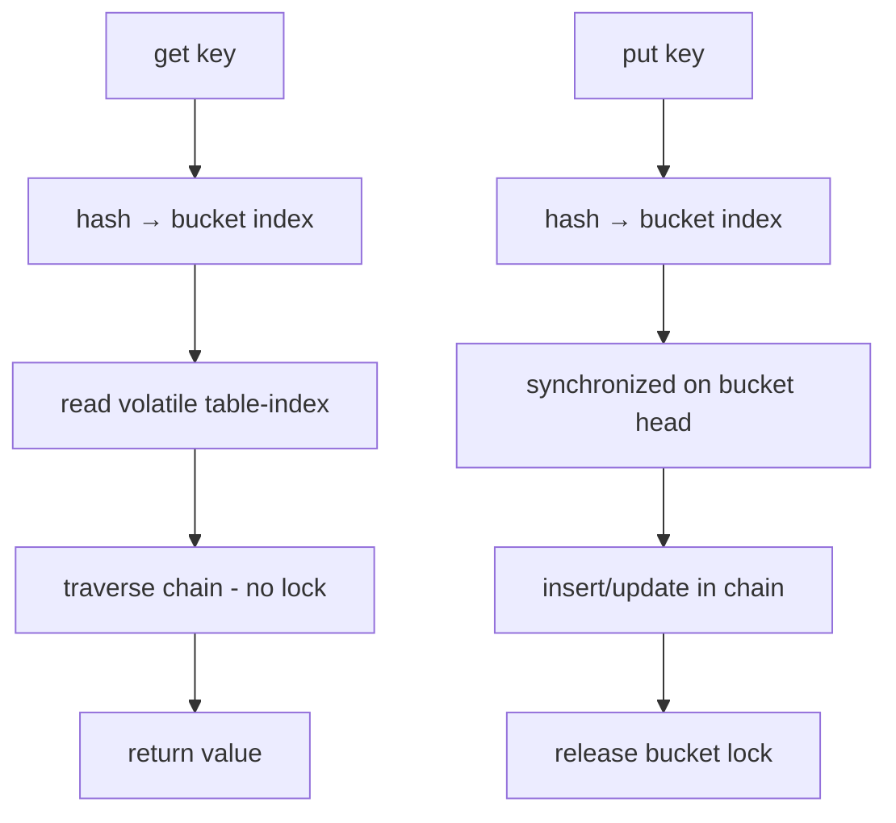
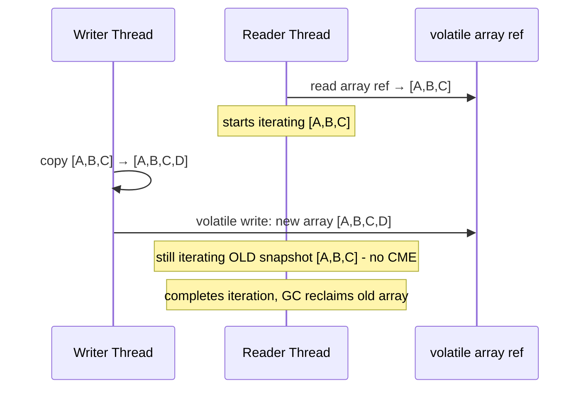
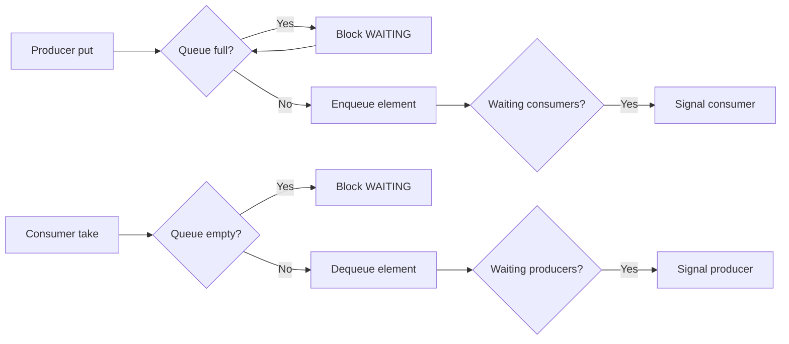
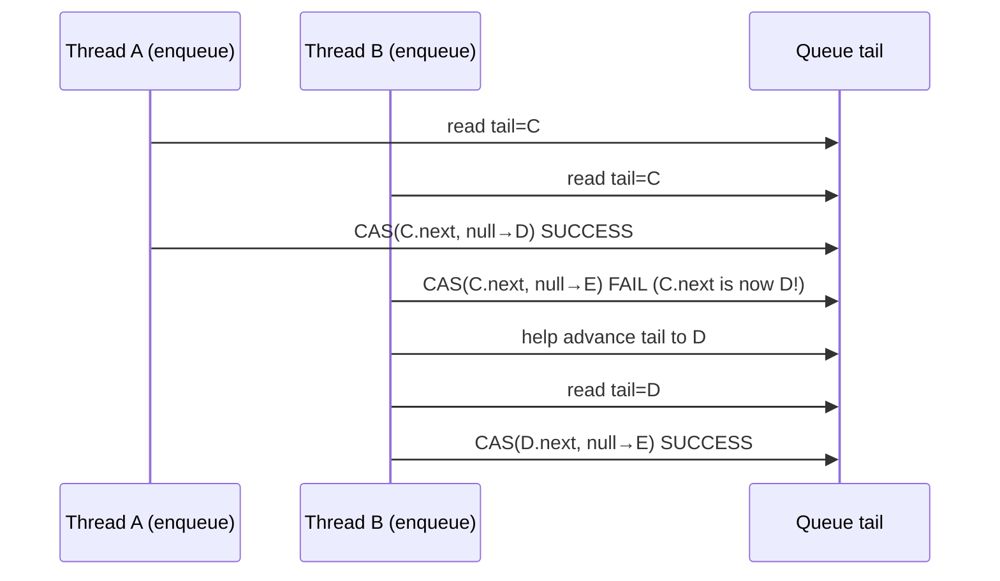

# Java Concurrency - L2 Concurrent Collections

| # | Keyword | Difficulty |
| --- | --- | --- |
| 1 | [ConcurrentHashMap](#concurrenthashmap) | ★★☆ |
| 2 | [CopyOnWriteArrayList](#copyonwritearraylist) | ★★☆ |
| 3 | [BlockingQueue Implementations](#blockingqueue-implementations) | ★★☆ |
| 4 | [ConcurrentLinkedQueue](#concurrentlinkedqueue) | ★★☆ |
| 5 | [Concurrent Collections Design](#concurrent-collections-design) | ★★☆ |

---

# ConcurrentHashMap

**Interview Weight:** critical - The most-used concurrent collection.
Tests understanding of segment/stripe locking, compute* methods,
and when to use it vs synchronized HashMap.

---

### 🎯 Model Answer

**30 seconds:**

> ConcurrentHashMap provides thread-safe HashMap access without
> a global lock. In Java 8+, it uses fine-grained synchronization:
> synchronized on individual buckets for writes; reads are lock-free
> (volatile + CAS). Compound operations (computeIfAbsent, merge,
> compute) are atomic per key. Never use synchronized HashMap or
> Collections.synchronizedMap() for concurrent access - ConcurrentHashMap
> is dramatically better.

**3 minutes (Senior):**

> Java 8 ConcurrentHashMap replaced segment-based locking (Java 7)
> with per-bucket (per-node) locking. Write operations synchronize
> on the head node of the bucket; other buckets proceed in parallel.
> Read operations are lock-free: the table is an array of volatile
> references; reading a chain is wait-free.
>
> The compound atomic operations are critical: computeIfAbsent(key,
> func) atomically checks if key exists and, if not, calls func and
> inserts the result - the check-and-insert is not split. putIfAbsent,
> compute, merge all operate atomically per key. This eliminates the
> check-then-act race that plagues HashMap + synchronized wrappers.
>
> Performance: size() is an approximation (cells merged via
> LongAdder-style CounterCell array). For exact counts, maintain a
> separate AtomicLong. Null keys and null values are not allowed
> (unlike HashMap) - a deliberate design choice to distinguish "key
> not present" from "key maps to null."

**Framework:** COMPOUND OP needed? -> compute*/merge/putIfAbsent
Single read? -> get (lock-free). Batch iteration? -> entrySet()
(weakly consistent - may or may not reflect concurrent changes)

**Blank Mind Recovery:**

**(1) Restate:** "ConcurrentHashMap: thread-safe HashMap with
per-bucket locking and lock-free reads."

**(2) First principles:** "HashMap has buckets. Writes to different
buckets don't conflict. Lock per bucket, not the whole map."

**(3) Bridge:** "Like a library with 1000 shelves: locking one shelf
for reshelving doesn't block readers at other shelves."

---

### 📘 Concept Explanation

**What it is:**

ConcurrentHashMap: a thread-safe hash map that provides full
concurrency for reads and high concurrency for writes. Java 8+:
per-node (bucket-head) synchronized writes; volatile-array reads
(lock-free).

**The problem it solves:**

HashMap is not thread-safe: concurrent modifications cause infinite
loops (Java 7), data corruption, or ConcurrentModificationException.
Collections.synchronizedMap(HashMap) is thread-safe but serializes
ALL operations (reads and writes share one lock) - no parallelism.
ConcurrentHashMap allows parallel reads + concurrent writes to
different buckets.

**How it works:**

```
INTERNAL STRUCTURE:
  Node[] table  <- volatile reference array (one slot per bucket)
  Each slot: linked list (or TreeNode when > 8 entries)

READ (lock-free):
  1. Compute hash: bucket = hash % table.length
  2. Read volatile table[bucket]  <- no lock
  3. Traverse linked list comparing keys
  Returns value or null  <- wait-free for existing keys

WRITE (per-bucket synchronized):
  1. Compute bucket
  2. synchronized(table[bucket]) { insert/update }
  Other buckets proceed concurrently

COMPOUND OPERATION (atomic per key):
  computeIfAbsent(key, k -> expensiveCreate(k)):
    synchronized(bucket) {
        if (table.get(key) == null) {
            table.put(key, expensiveCreate(k)); // atomic check+insert
        }
    }
    // Only called once even with 100 concurrent callers for same key

NULL POLICY:
  map.get("key") returns null for two cases in HashMap:
    1. key not present
    2. key maps to null value
  ConcurrentHashMap: null value not allowed -> unambiguous absence
```

**The key insight:**

computeIfAbsent() is the most important API for avoiding race
conditions. Pattern: lazy initialization of a per-key resource:
`cache.computeIfAbsent(userId, id -> loadUserFromDB(id))`.
Without computeIfAbsent, a check-then-put race could call the loader
twice, wasting resources or causing duplicate side effects.

**When to use it:**

- Any shared map accessed from multiple threads
- Cache with lazy initialization (computeIfAbsent)
- Frequency counters (merge: compute counts)
- Read-heavy lookup tables

**When NOT to use it:**

- Do not use when the entire map must be locked for a multi-step
  operation: computeIfAbsent is atomic per key but two separate
  operations on different keys are not atomic together
- Do not use null values: not permitted (NullPointerException)
- Do not rely on size() for accurate counts under concurrent modification

**Alternatives:**

- Guava Cache (with expiry, eviction, loading): built on CHM
- Caffeine: high-performance concurrent cache with W-TinyLFU eviction
- ReadWriteLock + HashMap: when all-or-nothing map locking is needed

**First-principles derivation:**

The key insight in Java 8 CHM: bucket granularity maximizes write
parallelism (N buckets = N concurrent writers), while volatile reads
make reads non-blocking. The default initial capacity (16 buckets)
gives 16-way write parallelism. Load factor (0.75) triggers resize
at 75% occupancy; resize doubles table size. CAS on the first node
of a bucket prevents the lock if the bucket is empty - only a
non-empty bucket requires synchronized.

---

### 💻 Code Example

**Example 1: BAD (synchronized HashMap) vs GOOD (ConcurrentHashMap + computeIfAbsent)**

```java
// BAD: synchronized HashMap - serializes all access
Map<String, List<Event>> eventMap =
    Collections.synchronizedMap(new HashMap<>());

// Race condition: two threads both see null for "user1",
// both create new list, second overwrites first
eventMap.get("user1");  // returns null
// context switch here
eventMap.put("user1", new ArrayList<>());  // BAD: race!

// GOOD: ConcurrentHashMap with computeIfAbsent
ConcurrentHashMap<String, List<Event>> eventMap =
    new ConcurrentHashMap<>();

// Atomic: check+create+insert in one synchronized per-bucket op
List<Event> events = eventMap.computeIfAbsent(
    "user1",
    k -> new CopyOnWriteArrayList<>()  // thread-safe list
);
events.add(newEvent);
// If two threads call computeIfAbsent("user1") simultaneously:
// exactly one creates the list; the other gets the existing one
```

> **Code walkthrough:** The synchronized HashMap get+put is a check-
> then-act race: both threads see null, both create a new list, the
> second overwrites the first (events from first thread are lost).
> computeIfAbsent is atomic per key: the check (key absent?) and the
> insert are a single synchronized operation on the bucket. Only one
> thread executes the function even with 1000 concurrent callers for
> the same key. The returned list is the canonical one for that key.

**Example 2: merge() for frequency counter**

```java
// Word frequency counter with concurrent merge
ConcurrentHashMap<String, Integer> wordCount =
    new ConcurrentHashMap<>();

// Thread-safe frequency increment with merge:
// merge(key, value, remappingFunction):
//   if key absent: put(key, value)
//   if key present: put(key, remappingFunction(existing, value))
// All atomic per key
wordCount.merge(word, 1, Integer::sum);
// Equivalent atomic effect:
//   count = wordCount.get(word)
//   wordCount.put(word, count == null ? 1 : count + 1)
// No race - merge is atomic

// Same with compute:
wordCount.compute(word, (k, v) -> v == null ? 1 : v + 1);
```

> **Code walkthrough:** merge() performs a read-modify-write atomically
> per key. The remapping function (Integer::sum) is called inside the
> per-bucket synchronized block. No two threads can concurrently
> modify the count for the same word. Under concurrent access, every
> word increment is captured. This replaces the common (but wrong)
> pattern: `count = map.get(w); map.put(w, count == null ? 1 : count+1)`
> which is a race.

---

### 🎓 Answers by Seniority

**Junior / Mid (0-5 years):**

> ConcurrentHashMap is thread-safe HashMap. Reads are lock-free;
> writes lock only the affected bucket. Much better than synchronized
> HashMap. Key methods: computeIfAbsent (atomic create-if-absent),
> putIfAbsent, merge (atomic read-modify-write). Null keys and values
> not allowed.

---

**Senior / Staff (5+ years):**

> I use CHM's compute* methods for all conditional operations - they
> eliminate check-then-act races. For high-frequency counters on
> many keys, CHM.merge() or LongAdder per key is preferred. I know
> that CHM.size() is approximate under concurrent modification; for
> accurate counts, I maintain a separate AtomicLong. For a read-heavy
> cache with eviction, Caffeine is better than CHM (W-TinyLFU
> eviction, reference-based expiry, async loading).

---

### ⚠️ Common Misconceptions

| Misconception | Reality | Risk |
| --- | --- | --- |
| "ConcurrentHashMap is fully consistent" | Weakly consistent: iteration may not reflect all concurrent changes | Business logic that relies on exact iteration state |
| "get+put is atomic in CHM" | Only compute*/merge/putIfAbsent are atomic; get then put is still a race | Race conditions on check-then-act patterns |
| "CHM allows null values" | Null values and null keys throw NullPointerException | NullPointerException on put(key, null) |
| "synchronized HashMap and CHM perform similarly" | CHM is dramatically faster under concurrent access (no global lock) | Performance problem if choosing synchronized HashMap |

---

### 🚨 Failure Modes and Diagnosis

| Failure | Symptom | Root Cause | Diagnostic | Fix |
| --- | --- | --- | --- | --- |
| Duplicate initialization | Two objects created for one key; wasted resources or side effects | Manual get+putIfAbsent instead of computeIfAbsent | Log inside creation function: should fire once per key | Replace with computeIfAbsent |
| NullPointerException on put | NPE at put(key, null) | CHM does not allow null values | Stack trace shows CHM.put | Use Optional wrapper or sentinel value instead of null |
| Size drift | size() returns inaccurate count | size() aggregates CounterCells; approximate under concurrent modification | Add assertion: size after N puts == N (fails under concurrency) | Maintain separate AtomicLong for exact count if needed |

---

### 🎯 Interview Deep-Dive

| Level | Time | Expected Depth |
| --- | --- | --- |
| Junior | 2 min | Thread-safe; vs synchronized Map; null restriction |
| Mid | 4 min | computeIfAbsent atomic; per-bucket locking; size() approximate |
| Senior | 8 min | Java 8 internals; compute*/merge; Caffeine vs CHM |
| Staff | 12 min | Resize protocol; CAS vs sync in buckets; design concurrent cache |

---

**Q1** [CONCEPTUAL] [JUNIOR]

"Why is ConcurrentHashMap preferred over Collections.synchronizedMap()?"

**Answer:**

Collections.synchronizedMap() wraps a HashMap with a single
mutex (the map itself). Every operation - get, put, remove,
containsKey, iteration - acquires the same lock. Result: even
concurrent reads serialize. 100 reader threads get the same
throughput as 1 reader thread.

ConcurrentHashMap (Java 8+):
- Reads are lock-free: volatile table array, wait-free for key lookup
- Writes lock only the affected bucket (of ~16-N buckets)
  Different buckets proceed in parallel
- compute/merge/putIfAbsent are atomic per key

Performance under 100 concurrent readers: CHM reads are non-blocking,
all 100 read in parallel. synchronizedMap: 100 reads serialize.

Additionally, CHM's compute methods eliminate the check-then-act
race that requires external synchronization with synchronizedMap:
```java
// synchronizedMap: STILL requires external sync for compound ops:
synchronized(syncMap) {
    if (!syncMap.containsKey(k)) syncMap.put(k, v);
}
// CHM: atomic, no external sync needed:
chm.putIfAbsent(k, v);
```

*What separates good from great:* Pointing out that synchronizedMap
still requires external synchronization for compound operations -
it does not eliminate races, only serializes individual method calls.

---

**Q2** [DEBUGGING] [SENIOR]

"You have a ConcurrentHashMap cache with computeIfAbsent, and the
loader function is being called more than once for the same key.
What's wrong?"

**Answer:**

Likely cause: recursive update or lambda that triggers a CHM
structural modification.

CHM.computeIfAbsent documentation says: if the computation modifies
the same map (e.g., the lambda calls compute or put on the same CHM),
the computation may be retried. This is because the lambda runs
inside a synchronized bucket block, and re-entrant modification
can cause resize or rehash, breaking the block.

```java
// BUG: recursive computeIfAbsent triggers loader multiple times
cache.computeIfAbsent(key, k -> {
    // WRONG: modifying the same map inside the function
    cache.put("otherKey", computeOther());  // re-entrant!
    return loadFromDB(k);
});
```

Fix: never modify the CHM inside the mapping function.

Other cause: the lambda throws a RuntimeException on first call
(no entry created), and a subsequent call creates the entry.
Add logging inside the function to see how many times it fires
and whether it throws.

Third cause: multiple CHM instances or scope confusion (function
logs to different instance than the one checked).

Diagnostic:
```java
cache.computeIfAbsent(key, k -> {
    log.warn("Creating entry for key: {}", k);  // count calls
    Thread.dumpStack();  // show caller
    return loadFromDB(k);
});
```

*What separates good from great:* Knowing the CHM restriction that
the mapping function must not modify the map.

---

### ⚖️ Comparison Table

| Feature | HashMap | SynchronizedMap | ConcurrentHashMap | Caffeine |
| --- | --- | --- | --- | --- |
| Thread-safe | No | Yes (global lock) | Yes (per-bucket) | Yes |
| Read concurrency | N/A | Serial | Parallel (lock-free) | Parallel |
| Compute atomicity | No | Requires external sync | Yes | Yes |
| Null values | Yes | Yes | No | No |
| Eviction/TTL | No | No | No | Yes |
| Size accuracy | Exact | Exact | Approximate | Approximate |

---

### 🏛️ System Design

*(Omit: L2 keyword. Distributed caching with Redis/Memcached and
cache invalidation patterns appear in L5 files.)*

---

### 📊 Diagram

```
JAVA 8 CONCURRENTHASHMAP INTERNAL:

table[] (volatile Node[]):
  [0] -> Node(k1,v1) -> Node(k3,v3)
  [1] -> null
  [2] -> Node(k2,v2)
  ...

READ (lock-free):
  hash(key) -> index=0
  Read volatile table[0] -> traverse chain
  No lock acquired

WRITE (per-bucket synchronized):
  Thread A: hash(k1) -> index=0
    synchronized(table[0]) { update k1 }
  Thread B: hash(k2) -> index=2
    synchronized(table[2]) { update k2 }
  A and B run CONCURRENTLY (different buckets)
```



> **Diagram walkthrough:** Reads go directly to the volatile table
> array and traverse the chain without acquiring any lock. Two
> concurrent reads proceed completely independently. Writes lock only
> the bucket's head node: Thread A locking bucket 0 and Thread B
> locking bucket 2 proceed in parallel. Only two writes targeting
> the same bucket serialize. With 16+ buckets, write contention is
> distributed across buckets, giving near-linear throughput scaling
> with thread count up to N=bucket-count.

---

---

# CopyOnWriteArrayList

**Interview Weight:** medium - Tests knowledge of the copy-on-write
pattern, its trade-offs, and when it is appropriate vs when it is
catastrophic.

---

### 🎯 Model Answer

**30 seconds:**

> CopyOnWriteArrayList creates a fresh copy of the underlying array
> on every write (add, remove, set). Reads are lock-free: they
> always see a stable snapshot. Write cost: O(n) for every mutation.
> Use only when reads dramatically outnumber writes and the list is
> small. Never use for high-write scenarios.

**3 minutes (Senior):**

> The copy-on-write mechanism: the internal array reference is
> volatile. A write acquires a lock, copies the entire array,
> modifies the copy, then publishes the copy atomically via
> volatile write. Any concurrent read that started before the
> write sees the old array snapshot to completion. Reads never block.
>
> Use cases: event listener lists (rarely changed, frequently
> iterated), whitelist/blacklist sets (updated occasionally,
> checked on every request), configuration callbacks. All of these
> share: many more reads than writes, list size is small (< few
> hundred elements).
>
> When CopyOnWriteArrayList kills performance: high-write rate with
> large lists. Each add() copies the entire array O(n). 1000 threads
> adding to a 10,000-element list = 10,000 copies per second =
> 10 billion element copies per second. Immediate OOM or extreme GC.
> For high-write concurrent lists: use LinkedBlockingDeque,
> ConcurrentLinkedDeque, or a synchronized structure.

**Blank Mind Recovery:**

**(1) Restate:** "CopyOnWriteArrayList: read-optimized by sacrificing
write performance."

**(2) First principles:** "Readers see a consistent snapshot. How?
Writes copy the data first, then atomically swap the reference. Reads
use the old reference - immutable snapshot."

**(3) Bridge:** "Like a shared document: to edit, you photocopy
the whole document, edit your copy, then replace the original.
Readers of the original never see partial edits."

---

### 📘 Concept Explanation

**What it is:**

CopyOnWriteArrayList: a thread-safe List where all write operations
(add, set, remove) copy the internal array, modify the copy, and
publish the copy via volatile write. Reads are always against a stable
array snapshot and never block.

**The problem it solves:**

Concurrent read + write on a list. ConcurrentModificationException
from iterating while another thread mutates. CopyOnWrite eliminates
this: iterators hold a reference to the array snapshot at iterator
creation time; mutations produce new arrays, not affecting live
iterators.

**How it works:**

```
INTERNAL STATE:
  volatile Object[] array;  // current array
  final ReentrantLock lock; // for writes only

READ (lock-free):
  Object[] snapshot = array;  // read volatile reference
  return snapshot[index];     // read from snapshot, no lock

WRITE (lock + copy):
  lock.lock();
  try {
      Object[] current = array;
      Object[] copy = Arrays.copyOf(current, current.length+1);
      copy[copy.length-1] = element;
      array = copy;  // volatile write - atomic publish
  } finally { lock.unlock(); }

ITERATION:
  Iterator holds reference to array snapshot at creation time.
  Concurrent mutations create new arrays.
  Iterator never throws ConcurrentModificationException.
  Iterator may not reflect concurrent adds (snapshot behavior).
```

**The key insight:**

Iterators reflect the state of the list at the time the iterator
was created. They never see subsequent modifications. This is
"snapshot iteration" - useful when you need stable iteration over
a rarely-changing list but do not need real-time freshness.

**When to use it:**

- Event listener registries: add/remove listeners rarely, fire
  events (iterate) frequently
- Observer pattern implementations
- Small immutable-ish shared lists: config entries, feature flags

**When NOT to use it:**

- High write rate: O(n) copy on every write - catastrophic for
  large lists or frequent mutations
- Large lists (> few hundred elements): copy overhead dominates
- If you need read freshness during iteration: CopyOnWriteArrayList
  iteration reflects snapshot, not live state

**Alternatives:**

- CopyOnWriteArraySet: same pattern for Set semantics
- ConcurrentLinkedDeque: concurrent linked deque, O(1) add/remove
- LinkedBlockingDeque: bounded blocking concurrent deque
- Collections.synchronizedList() with manual sync on iteration

**First-principles derivation:**

CopyOnWrite is a form of multi-version concurrency control (MVCC) -
the same technique databases use for snapshot isolation. Each write
creates a new version; readers hold a reference to their version
until done. Version cleanup is via GC (old arrays are garbage
collected when no readers reference them). This trades memory/write
cost for zero-cost reads and full read parallelism.

---

### 💻 Code Example

**Example 1: BAD (ArrayList + synchronized) vs GOOD (CopyOnWriteArrayList for listeners)**

```java
// BAD: synchronized ArrayList - listeners can't fire while adding
public class EventBus {
    private final List<EventListener> listeners =
        Collections.synchronizedList(new ArrayList<>());

    public void addListener(EventListener l) {
        listeners.add(l);  // acquires lock
    }

    public void fireEvent(Event e) {
        synchronized(listeners) {  // required for safe iteration
            // ALL event processing serialized - contention!
            for (EventListener l : listeners) l.onEvent(e);
        }
    }
}

// GOOD: CopyOnWriteArrayList - reads (fireEvent) never block
public class EventBus {
    private final CopyOnWriteArrayList<EventListener> listeners =
        new CopyOnWriteArrayList<>();

    public void addListener(EventListener l) {
        listeners.add(l);  // copies array, O(n)
        // only called rarely - acceptable cost
    }

    public void fireEvent(Event e) {
        // Iteration is lock-free: uses snapshot at call time
        // Multiple threads can fire events concurrently
        for (EventListener l : listeners) {
            l.onEvent(e);  // no lock held during listener invocation
        }
    }
}
```

> **Code walkthrough:** The synchronized version holds the listeners
> lock for the entire event dispatch loop. If a listener takes 10ms,
> all concurrent event dispatchers wait. With CopyOnWriteArrayList,
> fireEvent() reads the current array snapshot and iterates without
> any lock. 100 concurrent event dispatchers all proceed in parallel.
> The tradeoff: if a listener is added during iteration, it is not
> visible to in-progress iterators - but for event buses, this is
> acceptable (the listener will be called on the next event).

---

### 🎓 Answers by Seniority

**Junior / Mid (0-5 years):**

> CopyOnWriteArrayList copies the array on every write. Reads are
> lock-free and see a snapshot. Perfect for read-heavy, rarely-written
> lists. Terrible for write-heavy: O(n) copy on every add.

---

**Senior / Staff (5+ years):**

> I use CopyOnWriteArrayList only for event listener patterns where
> listeners are added/removed rarely and iterated frequently. For
> anything with moderate write rates: LinkedBlockingDeque or a
> ConcurrentLinkedDeque. The snapshot iteration semantics mean
> listeners added during fireEvent() are not called for that event;
> this is usually acceptable. Memory footprint doubles temporarily
> during each write (old + new array both live until GC).

---

### ⚠️ Common Misconceptions

| Misconception | Reality | Risk |
| --- | --- | --- |
| "CopyOnWrite is always thread-safe for all operations" | Compound ops (addIfAbsent) are atomic; individual get then add is still a race | Race conditions on manual check-then-add |
| "CopyOnWriteArrayList is suitable for any concurrent list" | Write-heavy scenarios cause massive GC pressure and OOM | Using it for a high-frequency event queue |
| "Iteration reflects live mutations" | Iterators hold snapshot - concurrent mutations are NOT visible during iteration | Business logic that relies on real-time list state during iteration |

---

### 🚨 Failure Modes and Diagnosis

| Failure | Symptom | Root Cause | Diagnostic | Fix |
| --- | --- | --- | --- | --- |
| GC pressure / OOM | Frequent GC, heap exhausted | High write rate to large CopyOnWrite list | Heap dump: many Object[] arrays; GC logs showing frequent collection | Switch to ConcurrentLinkedDeque or LinkedBlockingDeque |
| Stale read during iteration | Listener not called for an event | Listener added after iterator snapshot was taken | Log listener list size before/after fire | Acceptable by design; document the eventual-consistency semantics |

---

### 🎯 Interview Deep-Dive

| Level | Time | Expected Depth |
| --- | --- | --- |
| Junior | 2 min | Copy-on-write concept; read-heavy use case |
| Mid | 4 min | O(n) write cost; snapshot iteration; event listener pattern |
| Senior | 7 min | Memory impact; when NOT to use; alternatives |

---

**Q1** [TRADE-OFF] [MID]

"When would CopyOnWriteArrayList be a performance disaster?"

**Answer:**

When writes are frequent or the list is large:

Write cost: every add/set/remove copies the entire array O(n).
For a list of 10,000 elements, every add creates a new 10,000-element
array. 100 adds/second = 1,000,000 element copies/second.

Worst case: high-write rate + large list:
- 1000 threads concurrently adding to a 100,000-element list
- Each add: copy 100,000 references = ~800KB allocation
- 1000 adds = 800MB/s allocation rate
- GC cannot keep up: OOM, or constant full-GC pauses

Indicators it is wrong:
- List grows unboundedly (logs, events, metrics)
- Write rate > 10% of total operations
- List size > few hundred elements

Correct alternatives:
- Queue / buffer pattern: LinkedBlockingQueue (bounded) or
  ConcurrentLinkedQueue (unbounded, O(1) add/poll)
- ConcurrentLinkedDeque: concurrent deque, O(1) add at either end
- Striped collections: partition by key to reduce per-partition rate

*What separates good from great:* Providing the concrete worst-case
scenario (high-write + large list) and the alternative collections.

---

### ⚖️ Comparison Table

| Feature | ArrayList+synchronized | CopyOnWriteArrayList | ConcurrentLinkedDeque |
| --- | --- | --- | --- |
| Read cost | Lock acquired | Lock-free (snapshot) | Lock-free |
| Write cost | O(1) append | O(n) copy | O(1) |
| Iteration | Must hold lock | Snapshot (no CME) | Weakly consistent |
| Use case | Low concurrency | Read-heavy, rare writes | Balanced read/write |

---

### 🏛️ System Design

*(Omit: L2 keyword. MVCC at database scale and distributed observer
patterns appear in L5 files.)*

---

### 📊 Diagram

```
COPY-ON-WRITE MECHANISM:

State: array -> [A, B, C]

Write (add D):
  lock acquired
  newArray = copy([A, B, C]) + D = [A, B, C, D]
  volatile array = newArray   <- atomic reference swap
  lock released

Reader (started before write):
  snapshot = [A, B, C]    <- holds old reference
  iterates [A, B, C]      <- never sees D

Reader (started after write):
  snapshot = [A, B, C, D] <- sees new array
  iterates [A, B, C, D]
```



> **Diagram walkthrough:** The reader captures the old array reference
> before the write completes. The write atomically swaps the volatile
> reference to the new array. The reader's snapshot is now orphaned -
> no new readers will see it - but the in-progress reader iterates
> it safely to completion. When the reader releases the snapshot
> reference, the old array becomes garbage-collectible. This is
> multi-version concurrency: the write creates a new version;
> in-progress readers finish against their version.

---

---

# BlockingQueue Implementations

**Interview Weight:** high - Core producer-consumer primitive.
Tests knowledge of implementations, their characteristics, and
when to use each.

---

### 🎯 Model Answer

**30 seconds:**

> BlockingQueue is the standard Java interface for thread-safe
> producer-consumer channels. put() blocks if full; take() blocks
> if empty. Key implementations: ArrayBlockingQueue (bounded, array),
> LinkedBlockingQueue (optionally bounded, linked nodes),
> PriorityBlockingQueue (ordered), SynchronousQueue (zero capacity
> handoff). Use LinkedBlockingQueue for thread pools; ArrayBlockingQueue
> for bounded backpressure.

**3 minutes (Senior):**

> The choice of implementation depends on: bounded vs unbounded,
> fairness, ordering, and performance needs.
>
> ArrayBlockingQueue: fixed capacity. Useful for backpressure
> (producers slow down or fail-fast when full). Uses one lock for
> both read and write - slightly simpler but more contention than
> LinkedBlockingQueue.
>
> LinkedBlockingQueue: optionally bounded (Integer.MAX_VALUE if
> unspecified). Uses two locks (head lock for take, tail lock for
> put) - allows simultaneous read and write from different ends.
> Used internally by Executors.newFixedThreadPool() and
> newCachedThreadPool().
>
> SynchronousQueue: zero capacity. put() blocks until a thread
> calls take(); take() blocks until a thread calls put(). Direct
> handoff - no buffering. Used by Executors.newCachedThreadPool()
> for direct task dispatch to available threads.
>
> PriorityBlockingQueue: unbounded, priority-ordered. Elements
> must be Comparable or constructor takes Comparator. Useful for
> task prioritization.
>
> Performance: non-blocking poll()/offer() for time-sensitive code.
> Bounded queues enable backpressure: a full queue signals producers
> to slow down or apply load shedding.

**Blank Mind Recovery:**

**(1) Restate:** "BlockingQueue: thread-safe producer-consumer queue
with blocking semantics."

**(2) First principles:** "Producer needs consumer. If queue full:
producer waits. If queue empty: consumer waits. BlockingQueue
implements this protocol."

---

### 📘 Concept Explanation

**What it is:**

BlockingQueue: an interface extending Queue with blocking put()
and take() operations. Provides four sets of APIs:
- Throws exception: add/remove/element
- Returns special value: offer/poll/peek (non-blocking)
- Blocks: put/take (blocking)
- Times out: offer(e, t, unit)/poll(t, unit) (timed)

**The problem it solves:**

Producer threads generate work; consumer threads process it. Rates
may differ. BlockingQueue decouples producers from consumers with
a safe buffer. Blocking semantics handle rate mismatch automatically:
fast producers block when consumers can't keep up (backpressure).

**How it works:**

```
ARRAY BLOCKING QUEUE:
  ArrayBlockingQueue<Task> q = new ArrayBlockingQueue<>(100);
  // Capacity=100 enforces backpressure

  Producer: q.put(task);   // blocks if q.size()==100
            q.offer(task, 100, MILLIS); // try 100ms, return false
  Consumer: Task t = q.take(); // blocks if empty
            Task t = q.poll(100, MILLIS); // try 100ms, return null

IMPLEMENTATION COMPARISON:
  ArrayBlockingQueue:  1 lock (head+tail share), fixed array, bounded
  LinkedBlockingQueue: 2 locks (separate head, tail), linked nodes
                       optionally bounded (default: MAX_VALUE)
  SynchronousQueue:    0 capacity - direct thread-to-thread handoff
  PriorityBlockingQueue: unbounded, heap-ordered, no null

THREAD POOL USAGE:
  newFixedThreadPool:  LinkedBlockingQueue (unbounded - tasks queue)
  newCachedThreadPool: SynchronousQueue (direct dispatch, no queue)
  newSingleThreadExec: LinkedBlockingQueue (unbounded)
```

**The key insight:**

SynchronousQueue has zero capacity. When a producer calls put(),
it blocks until a consumer thread calls take(). This creates a
direct hand-off: no buffering, tasks are never queued. This is
why newCachedThreadPool grows unboundedly: there is no queue to
absorb excess tasks; each task forces a new thread if no idle
thread is available.

**When to use it:**

- ArrayBlockingQueue: when capacity limits are needed for backpressure
- LinkedBlockingQueue: general producer-consumer (default for pools)
- SynchronousQueue: direct task dispatch; task-per-request executor
- PriorityBlockingQueue: priority-ordered task processing

**When NOT to use it:**

- Do not leave LinkedBlockingQueue unbounded in a production executor:
  tasks will queue indefinitely, consuming heap
- Do not use SynchronousQueue if producers run faster than consumers:
  producers block; use a bounded ArrayBlockingQueue instead

**Alternatives:**

- Disruptor (LMAX): lock-free ring buffer for ultra-high-throughput
- Reactive Streams (Flux/Mono): back-pressure aware, non-blocking

**First-principles derivation:**

ArrayBlockingQueue uses one ReentrantLock with two Conditions
(notFull for producers, notEmpty for consumers). LinkedBlockingQueue
uses two ReentrantLocks: takeLock (head side) and putLock (tail side).
These can be held simultaneously (take and put do not conflict),
allowing a producer and a consumer to proceed in parallel.

---

### 💻 Code Example

**Example 1: Bounded queue for backpressure**

```java
// GOOD: bounded ArrayBlockingQueue with backpressure
int capacity = 1000; // queue can buffer 1000 tasks
BlockingQueue<Task> queue =
    new ArrayBlockingQueue<>(capacity);

// Producer: blocks if queue is full (backpressure!)
ExecutorService producer = Executors.newSingleThreadExecutor();
producer.submit(() -> {
    for (Task task : tasks) {
        try {
            queue.put(task);  // blocks if queue full
        } catch (InterruptedException e) {
            Thread.currentThread().interrupt();
            return;
        }
    }
});

// Consumer pool: takes from queue
ExecutorService consumers = Executors.newFixedThreadPool(8);
for (int i = 0; i < 8; i++) {
    consumers.submit(() -> {
        while (!Thread.currentThread().isInterrupted()) {
            try {
                Task t = queue.take();  // blocks if empty
                processTask(t);
            } catch (InterruptedException e) {
                Thread.currentThread().interrupt();
                break;
            }
        }
    });
}
```

> **Code walkthrough:** The ArrayBlockingQueue(1000) caps the
> pending task buffer at 1000. When all 8 consumers are busy and
> 1000 tasks are already queued, the producer's put() blocks until
> a consumer takes a task. This is backpressure: the upstream
> producer is slowed to the consumer's processing rate. Without
> a bounded queue, a fast producer with slow consumers would queue
> millions of tasks, exhausting heap.

---

### 🎓 Answers by Seniority

**Junior / Mid (0-5 years):**

> BlockingQueue has put() (blocks if full) and take() (blocks if
> empty). Main implementations: ArrayBlockingQueue (bounded),
> LinkedBlockingQueue (optionally bounded), SynchronousQueue (zero
> capacity). Used for producer-consumer decoupling. Much better than
> manual wait/notify.

---

**Senior / Staff (5+ years):**

> I choose implementation based on bounded vs unbounded and
> handoff semantics. ArrayBlockingQueue for explicit backpressure
> (capacity must be sized to load). LinkedBlockingQueue for general
> use (but always size it in production - unbounded = OOM under
> backlog). SynchronousQueue only for direct-dispatch executors
> where the thread pool is also sized appropriately.

---

### ⚠️ Common Misconceptions

| Misconception | Reality | Risk |
| --- | --- | --- |
| "LinkedBlockingQueue is bounded by default" | Default capacity is Integer.MAX_VALUE (effectively unbounded) | Heap exhaustion when consumers can't keep up |
| "SynchronousQueue has one slot" | Zero capacity - no element is ever stored; direct handoff only | Surprising blocking behavior if no consumer is waiting |
| "offer() is always non-blocking" | offer() without timeout is non-blocking; offer(timeout) blocks up to timeout | Using wrong offer() variant |

---

### 🚨 Failure Modes and Diagnosis

| Failure | Symptom | Root Cause | Diagnostic | Fix |
| --- | --- | --- | --- | --- |
| Unbounded queue growth | Heap exhaustion; OOM | LinkedBlockingQueue without capacity limit; consumers too slow | jmap -heap: queue size growing; Grafana: queue.size() metric | Add capacity limit to queue constructor; add more consumers |
| SynchronousQueue blocking | Producer threads all BLOCKED; no throughput | Consumers cannot keep up; SynchronousQueue has no buffer | jstack: producer threads WAITING in SynchronousQueue.transfer | Switch to ArrayBlockingQueue with bounded buffer |
| Lost tasks on shutdown | Tasks not processed after shutdownNow() | Tasks still in queue; executor discards queue on shutdown | Log queue.size() at shutdown; use awaitTermination | Drain queue manually before shutdown |

---

### 🎯 Interview Deep-Dive

| Level | Time | Expected Depth |
| --- | --- | --- |
| Junior | 2 min | put/take; blocked if full/empty; main implementations |
| Mid | 4 min | ArrayBlocking vs LinkedBlocking; SynchronousQueue; thread pool connection |
| Senior | 7 min | Backpressure sizing; dual-lock in LinkedBlockingQueue; Disruptor |

---

**Q1** [COMPARISON] [SENIOR]

"Why does newCachedThreadPool use SynchronousQueue?"

**Answer:**

newCachedThreadPool is designed to create a new thread for every
submitted task IF no idle thread is available. SynchronousQueue
makes this happen automatically.

SynchronousQueue behavior: put(task) blocks until a thread calls
take(task). If no thread calls take(), the executor creates a new
thread (the thread count is unbounded). When a thread finishes its
task, it tries to take() from the queue - if a task arrives quickly,
the thread handles it directly (cached). If the thread waits more
than 60 seconds with no task, it exits (cache eviction).

The key insight: there is NO buffer. Tasks are never "pending in
a queue" - they are either being processed or the producer is
blocked. This makes the pool automatically sized to the current load:
- Load increases: tasks arrive faster than threads can take them;
  SynchronousQueue blocks producers; executor creates new threads
- Load decreases: threads have no tasks; 60s keepAlive expires;
  threads exit

This is appropriate for: short-lived tasks with unpredictable bursts.
Inappropriate for: long-running tasks (unbounded thread creation under
load can exceed OS thread limits; OutOfMemoryError).

*What separates good from great:* Explaining that SynchronousQueue
FORCES thread creation (no buffer to absorb tasks) and the thread
expiry mechanism (60s keepAlive).

---

### ⚖️ Comparison Table

| Queue | Capacity | Ordering | Locks | Use In |
| --- | --- | --- | --- | --- |
| ArrayBlockingQueue | Fixed | FIFO | 1 (read+write share) | Bounded backpressure |
| LinkedBlockingQueue | Optional | FIFO | 2 (head, tail separate) | General pools |
| SynchronousQueue | 0 | N/A (handoff) | CAS | newCachedThreadPool |
| PriorityBlockingQueue | Unbounded | Priority | 1 | Priority tasks |
| DelayQueue | Unbounded | Delay order | 1 | Scheduled tasks |

---

### 🏛️ System Design

*(Omit: L2 keyword. Message queue architecture (Kafka, RabbitMQ,
backpressure with reactive streams) appears in L5 files.)*

---

### 📊 Diagram

```
PRODUCER-CONSUMER WITH BLOCKINGQUEUE:

Producer (fast)   BlockingQueue    Consumer (slower)
    |            [capacity=100]         |
    +--put()-->  [##########99]         |
    |            [##########99]  <--take()--+
    |            [##########98]         |
    |            ...                    |
    +--put()-->  [##########100]        |  <- full!
    |  BLOCKED   (backpressure)         |
    |            [##########99]  <--take()--+
    |  UNBLOCKED                        |
```



> **Diagram walkthrough:** The capacity diagram shows backpressure
> in action: the producer fills the queue to capacity (100) and
> then blocks. Only when a consumer takes an element does the queue
> drop below capacity, signaling the producer to resume. This is
> automatic rate matching: the producer is throttled to the consumer's
> processing speed. The flowchart shows the blocking and signaling
> protocol for both put() and take(), matching the wait/notifyAll
> pattern discussed in the L1 file.

---

---

# ConcurrentLinkedQueue

**Interview Weight:** medium - Non-blocking lock-free queue.
Tests knowledge of lock-free algorithms and when to prefer
ConcurrentLinkedQueue over BlockingQueue.

---

### 🎯 Model Answer

**30 seconds:**

> ConcurrentLinkedQueue is a lock-free, unbounded, non-blocking
> concurrent queue. It uses CAS operations on node references.
> It never blocks: poll() returns null if empty (no blocking).
> Best for low-latency pipelines where blocking is unacceptable.
> Unlike BlockingQueue, it provides no blocking semantics - callers
> must handle the empty/null case explicitly.

**3 minutes (Senior):**

> ConcurrentLinkedQueue implements a non-blocking queue algorithm
> (Michael-Scott queue): enqueue CASes the tail.next pointer;
> dequeue CASes the head pointer. If a CAS fails (contention),
> the operation retries. No thread ever blocks; failed CAS operations
> retry immediately.
>
> Use cases: work queues where latency matters more than throughput
> (gaming, trading, real-time event processing), multi-producer
> multi-consumer scenarios where blocking would cause cascading
> delays, and as an intermediate buffer where the consumer checks
> periodically (poll in a loop) rather than blocking.
>
> Limitations: unbounded (no backpressure - heap can grow without
> limit), no blocking API (cannot sleep waiting for items), size()
> is O(n) - traverses the entire queue. For most producer-consumer
> patterns, BlockingQueue is simpler and sufficient. ConcurrentLinkedQueue
> for latency-critical or non-blocking architectures.

**Blank Mind Recovery:**

**(1) Restate:** "ConcurrentLinkedQueue: lock-free non-blocking queue."

**(2) First principles:** "CAS on head/tail pointers. No lock = no
blocking. Retry on CAS failure."

---

### 📘 Concept Explanation

**What it is:**

ConcurrentLinkedQueue: an unbounded, thread-safe, non-blocking FIFO
queue. Implemented using Michael-Scott non-blocking queue algorithm.
Operations use CAS on internal node pointers.

**The problem it solves:**

Blocking queues (BlockingQueue) suspend threads that find the queue
empty. For latency-sensitive systems, thread suspension introduces
OS scheduler latency (microseconds). ConcurrentLinkedQueue never
suspends; callers busy-check or periodically poll.

**How it works:**

```
MICHAEL-SCOTT NON-BLOCKING ENQUEUE:
  Node newNode = new Node(value);
  while (true) {
      Node t = tail;
      Node next = t.next;
      if (next == null) {
          // tail is last node - try to enqueue
          if (t.next.CAS(null, newNode)) {  // CAS tail.next
              tail.CAS(t, newNode);  // advance tail (best effort)
              return;
          }
      } else {
          // another thread added; help advance tail
          tail.CAS(t, next);
      }
  }

KEY OPERATIONS:
  offer(e)  - enqueue (non-blocking, always succeeds)
  poll()    - dequeue or null if empty (non-blocking)
  peek()    - see head without removing
  isEmpty() - check (weakly consistent)
  size()    - O(n) - traverses entire queue
```

**The key insight:**

size() is O(n) in ConcurrentLinkedQueue (it traverses the queue).
Never call size() in a hot path or tight loop. Use isEmpty() (O(1))
to check emptiness.

**When to use it:**

- Work pipelines where producers and consumers run continuously
  (no need to block)
- Low-latency dispatch where OS thread park/unpark is too slow
- Multiple producers, multiple consumers, no capacity needed

**When NOT to use it:**

- When you need blocking (consumers sleeping until work arrives):
  use BlockingQueue
- When you need backpressure (bounded capacity): use ArrayBlockingQueue
- When you need size() often: O(n) size is expensive

**Alternatives:**

- ArrayBlockingQueue/LinkedBlockingQueue: blocking with capacity
- LinkedTransferQueue: combines non-blocking and blocking; can hand
  off directly to a waiting consumer

**First-principles derivation:**

The Michael-Scott algorithm maintains two CAS pointers: head (for
dequeue) and tail (for enqueue). Each operation CAS on exactly one
pointer and retries if contended. A key design: even partially-
completed operations are "helped" by other threads (if tail.next
is non-null, another thread advances tail). This prevents ABA-style
stuck states.

---

### 💻 Code Example

**Example 1: BAD (polling with size()) vs GOOD (isEmpty() + poll)**

```java
// BAD: size() is O(n) - expensive in hot path
ConcurrentLinkedQueue<Task> queue = new ConcurrentLinkedQueue<>();

// Production thread:
while (true) {
    if (queue.size() > 0) {       // O(n) traversal each check!
        Task t = queue.poll();    // may return null if concurrent poll
        if (t != null) process(t);
    }
}

// GOOD: isEmpty() is O(1), poll() returns null safely
while (true) {
    Task t = queue.poll();        // returns null if empty
    if (t != null) {
        process(t);
    } else {
        // queue empty - back off or spin
        Thread.onSpinWait();      // CPU hint for spin-wait
        // or: Thread.sleep(1) for lower CPU usage
    }
}
```

> **Code walkthrough:** size() traverses the entire linked list to
> count nodes - O(n). Calling it on every iteration of a tight loop
> with a million-element queue is catastrophic. poll() is O(1) and
> returns null when empty - the pattern `t = poll(); if (t != null)
> process(t)` is the correct idiom. Thread.onSpinWait() is a CPU hint
> (Java 9+) that tells the CPU this is a spin-wait loop, enabling
> energy-efficient spinning (PAUSE instruction on x86).

---

### 🎓 Answers by Seniority

**Junior / Mid (0-5 years):**

> ConcurrentLinkedQueue is a non-blocking lock-free queue. offer()
> always succeeds (unbounded). poll() returns null if empty. Never
> blocks. Use when you don't need blocking; use BlockingQueue when
> you do. Key gotcha: size() is O(n).

---

**Senior / Staff (5+ years):**

> I use ConcurrentLinkedQueue in event-driven or reactive pipelines
> where the consumer thread is always running and polling. For latency-
> critical hot paths (trading systems, game servers), the absence of
> OS park/unpark overhead is significant. For most CRUD services,
> LinkedBlockingQueue is simpler. I know that LinkedTransferQueue
> combines non-blocking and blocking modes and is often the best of
> both worlds.

---

### ⚠️ Common Misconceptions

| Misconception | Reality | Risk |
| --- | --- | --- |
| "ConcurrentLinkedQueue is bounded" | Unbounded - grows indefinitely if consumers can't keep up | OOM under backlog |
| "size() is O(1)" | size() is O(n) - traverses queue | Performance hotspot in tight loops |
| "poll() blocks if empty" | poll() returns null immediately if empty | NullPointerException if result not null-checked |

---

### 🚨 Failure Modes and Diagnosis

| Failure | Symptom | Root Cause | Diagnostic | Fix |
| --- | --- | --- | --- | --- |
| Memory growth | Heap increases unboundedly | Producers faster than consumers; no capacity limit | Monitor queue size (track enqueue/dequeue rates) | Switch to bounded BlockingQueue with backpressure |
| High CPU in empty queue | CPU at 100% despite no work | Tight poll() loop with no back-off | CPU profiler shows Thread.poll() loop | Add Thread.onSpinWait() or Thread.sleep(1) in empty case |

---

### 🎯 Interview Deep-Dive

| Level | Time | Expected Depth |
| --- | --- | --- |
| Junior | 2 min | Non-blocking; poll returns null; unbounded |
| Mid | 4 min | CAS internals; vs BlockingQueue; size() cost |
| Senior | 7 min | Michael-Scott algorithm; LinkedTransferQueue; use in reactive |

---

**Q1** [COMPARISON] [MID]

"ConcurrentLinkedQueue vs LinkedBlockingQueue - when do you choose each?"

**Answer:**

ConcurrentLinkedQueue: choose when:
- Consumer is always running (event loop, reactive thread)
- Latency matters: blocking and OS park/unpark introduce microseconds;
  CAS retry is nanoseconds
- Non-blocking API fits: caller can handle null and retry

LinkedBlockingQueue: choose when:
- Consumer should sleep when no work is available (blocking take())
- Capacity bounding is needed (provide capacity in constructor)
- Simpler code: blocking semantics reduce explicit null-check loops

Performance comparison: under high contention with two locks
(head lock + tail lock), LinkedBlockingQueue allows simultaneous
enqueue and dequeue. ConcurrentLinkedQueue uses single-pointer CAS
but is fully non-blocking. For throughput-heavy pipelines, both
perform similarly; CLQ wins on latency tail (P99) because no thread
ever blocks.

Typical use:
- Thread pool task queue: LinkedBlockingQueue (pool threads block
  waiting for tasks)
- Reactive event pipeline: ConcurrentLinkedQueue (event loop polls)
- High-frequency trading: ConcurrentLinkedQueue or Disruptor

*What separates good from great:* Knowing that LinkedTransferQueue
(Java 7+) is a better choice when you want both non-blocking and
blocking modes with direct handoff capability.

---

### ⚖️ Comparison Table

| Feature | ConcurrentLinkedQueue | LinkedBlockingQueue | ArrayBlockingQueue |
| --- | --- | --- | --- |
| Blocking | No | Yes | Yes |
| Bounded | No | Optional | Yes |
| size() | O(n) | O(1) | O(1) |
| Backpressure | No | Yes (bounded) | Yes |
| Latency | Lowest (CAS) | Low (lock) | Low (lock) |
| Use case | Non-blocking pipeline | Thread pool queue | Bounded backpressure |

---

### 🏛️ System Design

*(Omit: L2 keyword. Lock-free ring buffer (Disruptor), non-blocking
IO event loops, and reactive backpressure appear in L4-L5 files.)*

---

### 📊 Diagram

```
MICHAEL-SCOTT NON-BLOCKING QUEUE:

Before enqueue(D):
  [sentinel] --> [A] --> [B] --> [C]
   head                           tail

Enqueue(D) - CAS tail.next:
  [sentinel] --> [A] --> [B] --> [C] --> [D]
   head                        tail

Advance tail:
  [sentinel] --> [A] --> [B] --> [C] --> [D]
   head                                tail(updated)

Dequeue():
  CAS head to first real node (A)
  Return A's value
```



> **Diagram walkthrough:** Two threads concurrently try to enqueue.
> Thread A wins the CAS to append D to tail C. Thread B's CAS fails
> because C.next is no longer null. Thread B "helps" by advancing
> the tail pointer to D (the algorithm helps partially-complete
> operations to prevent stuck states). Then B retries, appending E
> after D. No data is lost; both enqueues complete. This is the core
> of non-blocking algorithm design: help others rather than blocking.

---

---

# Concurrent Collections Design

**Interview Weight:** medium - Tests ability to choose the right
collection for the concurrency context, and knowledge of the
design principles behind these collections.

---

### 🎯 Model Answer

**30 seconds:**

> Choosing a concurrent collection: identify the access pattern
> (read-heavy, write-heavy, or balanced), the operation type
> (compound atomic or individual), capacity requirements (bounded
> or unbounded), and blocking semantics needed. Map of these
> dimensions to the correct collection, then verify with load testing.

**3 minutes (Senior):**

> The three design axes: (1) Synchronization strategy - lock-based
> (ConcurrentHashMap per-bucket, BlockingQueue), lock-free/CAS
> (ConcurrentLinkedQueue, AtomicInteger), or copy-on-write
> (CopyOnWriteArrayList). (2) Blocking vs non-blocking - BlockingQueue
> sleeps threads; ConcurrentLinkedQueue returns null. (3) Bounded
> vs unbounded - bounded provides backpressure and heap protection.
>
> Common pitfall: using a thread-safe collection but accessing it
> via non-atomic compound operations. ConcurrentHashMap is thread-safe;
> get(k) + put(k, v+1) is not - use merge() instead. Collections
> provide atomic individual operations; compound logic must use the
> atomic compound methods (compute*, merge, putIfAbsent).
>
> Design principle: prefer higher-level abstractions. Prefer BlockingQueue
> over wait/notify. Prefer ConcurrentHashMap over synchronized HashMap.
> Prefer ExecutorService over raw threads. The JDK concurrent collections
> are written by concurrency experts, tested at scale, and handle
> corner cases that manual implementations miss.

**Blank Mind Recovery:**

**(1) Restate:** "Choosing the right concurrent collection for the
access pattern and semantics needed."

**(2) First principles:** "What access pattern? Read-heavy, write-heavy,
or mixed? Blocking or non-blocking? Bounded or unbounded?"

---

### 📘 Concept Explanation

**What it is:**

The java.util.concurrent package provides a set of concurrent
collection implementations covering common patterns. Each is designed
for a specific access pattern and makes explicit trade-offs.

**The problem it solves:**

Manual synchronization is error-prone: developers miss compound
operation races, use wrong lock objects, or choose inefficient
lock granularity. The concurrent collections encode proven,
correct, efficient implementations.

**How it works:**

```
COLLECTION SELECTION DECISION TREE:

Map:
  Thread-safe? -> ConcurrentHashMap (atomic compound ops)
  All-or-nothing iteration? -> synchronizedMap with external lock

List:
  Read-heavy, rare writes, no blocking? -> CopyOnWriteArrayList
  Write-heavy or large? -> ConcurrentLinkedDeque
  Producer-consumer? -> BlockingQueue implementation

Queue:
  Need blocking? -> LinkedBlockingQueue or ArrayBlockingQueue
  Need backpressure? -> ArrayBlockingQueue (bounded)
  Non-blocking, latency? -> ConcurrentLinkedQueue
  Priority ordered? -> PriorityBlockingQueue

Counter:
  Low contention? -> AtomicInteger/AtomicLong
  High contention (10+ threads)? -> LongAdder

COMPOUND OPERATION PATTERN:
  WRONG: if (!map.containsKey(k)) map.put(k, v);  // race!
  RIGHT: map.putIfAbsent(k, v);                   // atomic

  WRONG: v = map.get(k); map.put(k, f(v));        // race!
  RIGHT: map.compute(k, (key, val) -> f(val));     // atomic
```

**The key insight:**

Thread-safe collections provide atomic individual operations.
Compound logic requires the atomic compound methods. Calling two
thread-safe methods in sequence is NOT atomic unless both are part
of an atomic compound operation (compute, merge, putIfAbsent, etc.).

**When to use each design strategy:**

- Per-bucket locking (ConcurrentHashMap): balanced read/write access
  to a map; fine-grained write parallelism
- Copy-on-write (CopyOnWriteArrayList): read-dominant with rare writes
- Non-blocking CAS (ConcurrentLinkedQueue): low-latency pipelines
- Blocking (BlockingQueue): producer-consumer decoupling with
  potential rate mismatch

**When NOT to use each:**

- Per-bucket: when all-or-nothing map consistency is needed
  (lock the whole map externally)
- Copy-on-write: write-heavy; high memory churn
- Non-blocking: when backpressure is needed
- Blocking: when latency is critical

**Alternatives:**

For specialized needs: Disruptor (ultra-high-throughput ring buffer),
Caffeine (concurrent cache), reactive streams (back-pressure pipeline).

**First-principles derivation:**

All concurrent collections reduce to: (1) isolation of shared state
into minimal lockable units (per-bucket, per-node), (2) CAS for
single-word atomicity, (3) volatile for visibility without locking,
(4) copy-on-write for read isolation. No single mechanism is best
for all access patterns; choosing the right one requires understanding
the pattern first.

---

### 💻 Code Example

**Example 1: Common wrong patterns vs correct patterns**

```java
// WRONG PATTERN 1: non-atomic compound check-then-put on CHM
ConcurrentHashMap<String, Integer> map = new ConcurrentHashMap<>();
// Race: both threads see map.get("x")==null, both put
if (map.get("x") == null) map.put("x", 1);  // RACE!
// CORRECT:
map.putIfAbsent("x", 1);
// Or if init is expensive:
map.computeIfAbsent("x", k -> expensiveInit(k));

// WRONG PATTERN 2: manual increment on CHM value
Integer count = map.get(key);
map.put(key, count == null ? 1 : count + 1);  // RACE!
// CORRECT:
map.merge(key, 1, Integer::sum);

// WRONG PATTERN 3: CopyOnWrite for write-heavy task queue
List<Task> tasks = new CopyOnWriteArrayList<>();
tasks.add(task);  // O(n) copy every time! Memory pressure
// CORRECT for task queue:
BlockingQueue<Task> tasks = new LinkedBlockingQueue<>(1000);
tasks.put(task);

// WRONG PATTERN 4: size() check on ConcurrentLinkedQueue
if (queue.size() > 0) processNext();  // O(n) size!
// CORRECT:
Task t = queue.poll();
if (t != null) process(t);
```

> **Code walkthrough:** Four patterns, four mistakes. Pattern 1:
> get+put on CHM is a check-then-act race; use putIfAbsent or
> computeIfAbsent. Pattern 2: get+put is a read-modify-write race;
> use merge() for atomic increment. Pattern 3: CopyOnWrite is O(n)
> per write; task queues need BlockingQueue. Pattern 4: size() on
> CLQ is O(n) traversal; use poll() and null-check. Each mistake
> is a race condition or performance bug that will appear in production.

---

### 🎓 Answers by Seniority

**Junior / Mid (0-5 years):**

> Choose by access pattern: read-heavy map -> ConcurrentHashMap.
> Producer-consumer -> BlockingQueue. Read-heavy list -> CopyOnWrite.
> High-contention counter -> LongAdder. Always use atomic compound
> methods (computeIfAbsent, merge) instead of manual get+put.

---

**Senior / Staff (5+ years):**

> My selection framework: identify (1) read/write ratio, (2) compound
> operation needs, (3) blocking vs non-blocking, (4) bounded vs
> unbounded. Then match to the collection. I verify under realistic
> concurrency with jcstress or load tests. I avoid manual lock-based
> implementations when a JDK concurrent collection exists - the JDK
> implementations handle corner cases (resize, ABA, spurious wakeup)
> that manual code misses.

---

### ⚠️ Common Misconceptions

| Misconception | Reality | Risk |
| --- | --- | --- |
| "Using a concurrent collection makes my code thread-safe" | Concurrent collections are individually atomic; compound multi-step operations still need atomic methods | Race conditions on check-then-act patterns |
| "I should add synchronized to methods using ConcurrentHashMap" | Adding synchronized blocks defeats the purpose; use CHM's atomic methods | Performance back to serial; also doesn't fix compound races |
| "Collections.synchronizedX and concurrent collections are equivalent" | synchronizedX uses a global lock; concurrent collections use fine-grained locking | Huge performance difference under concurrent access |

---

### 🚨 Failure Modes and Diagnosis

| Failure | Symptom | Root Cause | Diagnostic | Fix |
| --- | --- | --- | --- | --- |
| Double initialization in cache | Expensive computation called twice for same key | Manual get+put instead of computeIfAbsent | Log inside creation function | Use computeIfAbsent |
| Lost counter increments | Metric counts slightly wrong | Manual get+put for increment | Load test: final count != expected | Use merge(key, 1, Integer::sum) |
| Deadlock with synchronized wrapper | Application hangs | External synchronized block + internal lock in synchronizedMap | jstack: circular lock dependency | Use ConcurrentHashMap; no external sync needed |

---

### 🎯 Interview Deep-Dive

| Level | Time | Expected Depth |
| --- | --- | --- |
| Junior | 2 min | Which collection for which use case |
| Mid | 4 min | Compound operation races; collection selection framework |
| Senior | 8 min | Trade-off analysis; design a thread-safe component from scratch |
| Staff | 12 min | Design a concurrent task graph; collection choice under SLA |

---

**Q1** [ARCHITECTURE] [STAFF]

"Design a thread-safe LRU cache with a maximum size."

**Answer:**

Requirements: O(1) get/put, evict least-recently-used when full,
thread-safe.

Design:

```java
public class LRUCache<K, V> {
    private final int maxSize;
    private final ReentrantLock lock = new ReentrantLock();

    // LinkedHashMap with access-order for LRU tracking
    private final LinkedHashMap<K, V> map;

    public LRUCache(int maxSize) {
        this.maxSize = maxSize;
        // accessOrder=true: put/get moves entry to tail
        this.map = new LinkedHashMap<K, V>(
            maxSize, 0.75f, true) {
            @Override
            protected boolean removeEldestEntry(Map.Entry<K,V> e) {
                return size() > maxSize; // evict when over limit
            }
        };
    }

    public V get(K key) {
        lock.lock();
        try { return map.get(key); }  // moves to tail (LRU update)
        finally { lock.unlock(); }
    }

    public void put(K key, V value) {
        lock.lock();
        try { map.put(key, value); }  // evicts eldest if full
        finally { lock.unlock(); }
    }
}
```

Trade-offs:
- Single lock: serializes all access. Under high read concurrency,
  this is a bottleneck.
- Better: segment the cache (partition by key hash into N segments,
  each with its own LRU + lock). N-way parallelism.
- Production: Caffeine (Java) implements W-TinyLFU (a better eviction
  policy than LRU) with fully lock-free reads and fine-grained writes.
  Use Caffeine in production; implement the above for interviews.

ConcurrentHashMap-based approach: store entries in CHM (lock-free reads).
Track access order with a ConcurrentLinkedDeque (move key to front on
access). Evict by polling the deque. Problem: CHM update and deque
update are not atomic - difficult to implement correctly without a lock.

*What separates good from great:* Knowing that Caffeine exists and why
it uses W-TinyLFU (higher hit rate than LRU for most cache access patterns)
while still being able to implement the simple version.

---

**Q2** [TRADE-OFF] [SENIOR]

"When would you use the Disruptor (LMAX) instead of a BlockingQueue?"

**Answer:**

The Disruptor is a lock-free ring buffer with ultra-high throughput
(millions of events/second) and ultra-low latency (sub-microsecond).

Key differences:

1. Pre-allocated ring buffer: no object allocation per event (reduces
   GC pressure). Events are pre-allocated slots in a ring.

2. Single writer principle: typically one producer writes to the ring;
   consumers read from it via sequence counters (CAS on counter).
   No dequeue - consumers read at their own pace.

3. Cache line padding: Disruptor pads sequence counters to avoid
   false sharing (multiple sequence counters sharing a cache line
   would cause cache invalidation storms on every update).

4. Multiple consumer topologies: consumers can be chained (C2 reads
   after C1 processes) or parallel (C1 and C2 read the same events).

Use Disruptor when:
- Throughput > 10 million events/second
- P99 latency < 1 microsecond required
- Event processing pipeline with defined topology
- GC pause is unacceptable (financial trading, real-time gaming)

Use BlockingQueue when:
- Standard producer-consumer pattern
- Throughput < 1 million events/second
- Simplicity matters

*What separates good from great:* Knowing cache line padding as a
Disruptor design choice and the pre-allocation vs per-event allocation difference.

---

### ⚖️ Comparison Table

| Collection | Access Pattern | Blocking | Bounded | Compound Atomic | Key Trade-off |
| --- | --- | --- | --- | --- | --- |
| ConcurrentHashMap | Map (read/write) | No | No | Yes (compute*) | No null values |
| CopyOnWriteArrayList | List (read-heavy) | No | No | Yes (addIfAbsent) | O(n) writes |
| LinkedBlockingQueue | Queue (producer-consumer) | Yes | Optional | N/A | Head+tail locks |
| ConcurrentLinkedQueue | Queue (low-latency) | No | No | N/A | size() is O(n) |
| LongAdder | Counter (high-contention) | No | No | N/A | sum() approximate |

---

### 🏛️ System Design

*(Omit: L2 keyword. Distributed concurrent systems design (event
sourcing, CQRS, distributed actor systems) appears in L5 files.)*

---

### 📊 Diagram

```
COLLECTION SELECTION MAP:

Need a thread-safe MAP?
  -> ConcurrentHashMap (atomic compute*/merge)

Need a thread-safe LIST?
  Read >> Write? -> CopyOnWriteArrayList
  Write common?  -> ConcurrentLinkedDeque or BlockingDeque

Need a thread-safe QUEUE?
  Need blocking?    -> BlockingQueue (Array/Linked)
  Need backpressure? -> ArrayBlockingQueue (bounded)
  Non-blocking?     -> ConcurrentLinkedQueue
  Priority?         -> PriorityBlockingQueue

Need a COUNTER?
  Low contention?  -> AtomicInteger/AtomicLong
  High contention? -> LongAdder
```

```mermaid
mindmap
  root((Concurrent Collections))
    Map
      ConcurrentHashMap
        per-bucket locking
        compute/merge atomic
        no null values
    List
      CopyOnWriteArrayList
        O(n) write
        lock-free read
        snapshot iteration
    Queue
      BlockingQueue
        ArrayBlockingQueue bounded
        LinkedBlockingQueue general
        SynchronousQueue handoff
      Non-blocking
        ConcurrentLinkedQueue
        no backpressure
    Counter
      AtomicInteger
        CAS based
      LongAdder
        high contention
```

> **Diagram walkthrough:** The selection map organizes choices by
> data structure (Map, List, Queue, Counter) and the key decision
> factors (blocking vs non-blocking, read/write ratio, backpressure).
> The mindmap shows the full taxonomy with key properties at a glance.
> Each leaf node summarizes the most important characteristic: CHM
> has atomic compute methods, CopyOnWrite has O(n) write cost, CLQ
> has no backpressure, LongAdder scales under high contention.

---

---