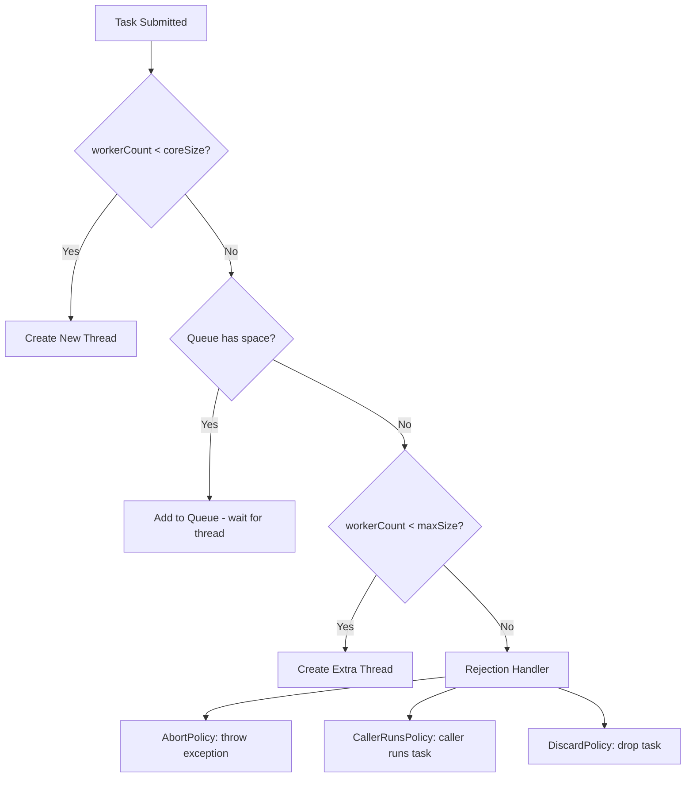

## Keywords in This File
{: .no_toc }

| # | Keyword | Weight |
|---|---|---|
| 1 | [Java Concurrency - L2 Executor Framework](#java-concurrency---l2-executor-framework) | medium |

---

# Java Concurrency - L2 Executor Framework

## ExecutorService

---

### 🎯 Model Answer

**30 seconds:**
> `ExecutorService` is Java's production-grade thread management API. It
> decouples task submission from thread lifecycle - you submit `Runnable`
> or `Callable` tasks, and the service manages pooling, queuing, and
> thread reuse. It provides `submit()` for async tasks with `Future`
> results, `shutdown()` for graceful termination, and `shutdownNow()`
> for immediate cancellation. Always prefer it over raw `Thread` for
> any production workload.

**3 minutes (Senior):**
> `ExecutorService` is the central interface in Java's executor framework,
> introduced in Java 5 as part of Doug Lea's `java.util.concurrent`.
> It separates "what to execute" from "how to execute" - you submit tasks,
> the service decides thread allocation.
>
> The factory methods (`Executors.newFixedThreadPool()`,
> `newCachedThreadPool()`, `newSingleThreadExecutor()`) provide
> pre-configured thread pools for common use cases. But in production,
> I always use `ThreadPoolExecutor` directly to set bounded queue sizes
> and explicit rejection handlers - the factory methods use unbounded
> queues which can cause OOM under sustained load.
>
> The lifecycle is important: `shutdown()` stops accepting new tasks
> but completes queued tasks. `shutdownNow()` attempts to cancel running
> tasks. Neither blocks - you need `awaitTermination()` to wait for
> completion. Forgetting to shut down the executor is a common resource
> leak in production services.
>
> Exception handling is a subtle trap: with `execute()`, uncaught
> exceptions kill the thread silently. With `submit()`, exceptions are
> wrapped in the `Future` and only surface when you call `future.get()`.
> If you never call `get()`, the exception is swallowed entirely.

**Framework:** WHAT → WHY → HOW → TRADE-OFF → EXAMPLE

*Adapting up:* Discuss `ThreadPoolExecutor` configuration (core/max
pool size, keep-alive, queue type, rejection policy), why unbounded
queues are dangerous in production, and how to size thread pools for
I/O-bound vs CPU-bound workloads.

*Adapting down:* "ExecutorService is a thread pool manager. You give
it tasks, it runs them using a managed set of threads. You don't create
or manage Thread objects directly."

**Blank Mind Recovery:**

**(1) Restate:** "So you are asking about ExecutorService - let me
explain what problem it solves and how to use it correctly."

**(2) First principles:** "From first principles: creating threads is
expensive and you can't create unlimited threads. A pool of reusable
threads with a work queue is the obvious optimization. ExecutorService
is that pool."

**(3) Bridge:** "ExecutorService is like a taxi dispatcher - tasks are
ride requests, threads are taxis. Instead of requesting a new taxi for
every ride (new Thread), you call dispatch (submit), the dispatcher
assigns the first available taxi, and taxis are reused after each ride."

---

### 📘 Concept Explanation

**What it is:**
`ExecutorService` is an interface in `java.util.concurrent` that
extends `Executor`. It provides methods for managing and monitoring
a pool of threads, submitting tasks asynchronously, and controlling
the lifecycle of the executor. The primary implementations are
`ThreadPoolExecutor` and `ScheduledThreadPoolExecutor`.

**The problem it solves:**
Raw thread management has four problems: thread creation cost (OS
thread creation is ~1-10ms), memory overhead (each thread consumes
stack space), unbounded growth (unlimited threads exhaust memory),
and lifecycle management (no clean shutdown). `ExecutorService` solves
all four by reusing threads, bounding the pool, queuing excess work,
and providing lifecycle control.

**How it works:**
```
Task Submission → Work Queue → Thread Pool → Execution
     submit()         |          [T1][T2]     run()
                      |          [T3][T4]
           If queue full → RejectionPolicy
           (AbortPolicy/CallerRunsPolicy/DiscardPolicy)
```

> **Code walkthrough:** This example demonstrates the core pattern in action. The key mechanism shows how the concept works in practice. Study the structure to understand the essential behavior and common usage.

Core `ThreadPoolExecutor` parameters:
- `corePoolSize`: threads kept alive even when idle
- `maximumPoolSize`: maximum total threads
- `keepAliveTime`: how long excess threads (above core) live idle
- `BlockingQueue`: holds tasks when all threads are busy
- `RejectedExecutionHandler`: what to do when queue is full and
  max threads are all busy

Thread creation logic:
1. If active threads < corePoolSize: create new thread
2. If active threads >= core: add to queue
3. If queue is full and threads < max: create new thread
4. If queue is full and threads = max: reject task

**The key insight:**
The factory method `Executors.newFixedThreadPool(n)` creates a pool
with a `LinkedBlockingQueue` of UNBOUNDED size. Under sustained load
exceeding pool capacity, tasks accumulate in the queue without limit
until OOM. In production, always use `ThreadPoolExecutor` directly
with an `ArrayBlockingQueue(capacity)` to set an explicit bound.

**When to use it:**
- CPU-bound parallel computation: fixed pool sized to core count
- I/O-bound concurrent operations: larger pool (cores × 2-10)
- Background task processing: scheduled/cached pools
- Any production code requiring concurrent execution

**When NOT to use it:**
- When Java 21 virtual threads with one-thread-per-task is simpler
  and sufficient (eliminates pool sizing calculations for I/O-bound)
- When the task requires real-time guarantees (use OS-level scheduling)

**Alternatives:**
- `ForkJoinPool`: work-stealing for recursive divide-and-conquer tasks
- `ScheduledExecutorService`: for periodic or delayed task execution
- Virtual thread executor (Java 21): `Executors.newVirtualThreadPerTaskExecutor()`

**First-principles derivation:**
Thread pool is the solution to the N tasks / M threads optimization
problem where N >> M. Tasks queue up, available threads pick them up,
and threads are reused when tasks complete. The queue provides elasticity
(absorbs bursts), the pool limit provides backpressure (prevents
resource exhaustion), and the rejection policy makes the backpressure
explicit.

---

### 💻 Code Example

> **Code walkthrough:** The BAD example uses `newCachedThreadPool()`
> which creates unlimited threads under load - a production disaster.
> The GOOD example uses bounded `ThreadPoolExecutor` with explicit queue
> size and rejection policy. The production example shows full lifecycle
> management with graceful shutdown and proper exception handling.

```java
// BAD: unbounded thread creation under load
ExecutorService exec = Executors.newCachedThreadPool();
// Under 10,000 req/sec: creates 10,000 threads -> OOM

// BAD: fixed pool but unbounded queue
ExecutorService exec2 = Executors.newFixedThreadPool(10);
// Under sustained load: queue grows to millions -> OOM
```

> **Code walkthrough:** This example demonstrates the core pattern in action. The key mechanism shows how the concept works in practice. Study the structure to understand the essential behavior and common usage.

```java
// GOOD: bounded ThreadPoolExecutor for production
import java.util.concurrent.*;

ThreadPoolExecutor exec = new ThreadPoolExecutor(
    4,                          // corePoolSize: always-on threads
    8,                          // maximumPoolSize: max under load
    60L, TimeUnit.SECONDS,      // keepAliveTime for excess threads
    new ArrayBlockingQueue<>(200), // bounded queue: explicit cap
    new ThreadFactory() {       // custom factory: named threads
        private final AtomicInteger n = new AtomicInteger(0);
        public Thread newThread(Runnable r) {
            Thread t = new Thread(r, "worker-" + n.incrementAndGet());
            t.setDaemon(false);
            return t;
        }
    },
    new ThreadPoolExecutor.CallerRunsPolicy() // backpressure: caller runs
);
```

> **Code walkthrough:** This example demonstrates the core pattern in action. The key mechanism shows how the concept works in practice. Study the structure to understand the essential behavior and common usage.

```java
// PRODUCTION: full lifecycle with graceful shutdown
class PaymentProcessor {
    private final ExecutorService executor;

    PaymentProcessor() {
        executor = new ThreadPoolExecutor(
            4, 8, 60, TimeUnit.SECONDS,
            new ArrayBlockingQueue<>(100),
            r -> new Thread(r, "payment-worker"),
            new ThreadPoolExecutor.AbortPolicy() // throw on overflow
        );
    }

    Future<PaymentResult> processAsync(Payment payment) {
        return executor.submit(() -> {
            try {
                return processPayment(payment);
            } catch (PaymentException e) {
                // log and rethrow; caller gets it via future.get()
                log.error("Payment failed: {}", payment.id(), e);
                throw e;
            }
        });
    }

    void shutdown() {
        executor.shutdown(); // stop accepting new tasks
        try {
            if (!executor.awaitTermination(30, TimeUnit.SECONDS)) {
                List<Runnable> pending = executor.shutdownNow();
                log.warn("{} tasks not completed", pending.size());
            }
        } catch (InterruptedException e) {
            executor.shutdownNow();
            Thread.currentThread().interrupt();
        }
    }
}
```

> **Code walkthrough:** This example demonstrates the core pattern in action. The key mechanism shows how the concept works in practice. Study the structure to understand the essential behavior and common usage.

---

### 🎓 Answers by Seniority

**Junior / Mid (0-5 years):**
> `ExecutorService` manages a pool of threads so you don't have to create
> and manage Thread objects manually. You submit tasks using `submit()`
> (returns a `Future`) or `execute()` (fire and forget). The `Executors`
> factory gives you pre-configured pools: `newFixedThreadPool(n)` for
> a fixed number of threads, `newCachedThreadPool()` for a pool that
> grows as needed. When you're done, call `shutdown()` to stop it cleanly.

*Push deeper:* Explain what happens to submitted tasks when you call
`shutdown()` vs `shutdownNow()`, and why you need `awaitTermination()`
to know when shutdown is complete.

---

**Senior / Staff (5+ years):**
> I avoid the `Executors` factory methods in production because their
> thread pools use unbounded `LinkedBlockingQueue`, which can cause OOM
> under sustained load. I always construct `ThreadPoolExecutor` directly
> with an `ArrayBlockingQueue` of explicit size, a `CallerRunsPolicy`
> or `AbortPolicy` rejection handler, and a custom `ThreadFactory` that
> names the threads. Thread pool sizing depends on workload type: for
> CPU-bound tasks, size = available processors; for I/O-bound, apply
> Little's Law: size = avg_concurrency / (1 - CPU_utilization). In Java
> 21, I evaluate whether virtual threads can replace I/O-bound pools
> entirely, which eliminates sizing concerns.

*Push deeper:* Discuss thread pool monitoring metrics (active count,
queue size, completed task count, rejected count) and how to expose
them via Micrometer for production observability.

---

### ⚠️ Common Misconceptions

**Misconception 1: "shutdown() immediately stops all tasks."**
`shutdown()` is non-blocking and only stops accepting new tasks.
In-progress tasks continue to completion; queued tasks continue to be
picked up. Use `shutdownNow()` to attempt cancellation of running tasks,
and `awaitTermination()` to wait for actual completion.

**Misconception 2: "Exceptions from submit() are automatically logged."**
No. Exceptions thrown by `Callable` passed to `submit()` are stored
in the `Future`. They only surface when you call `future.get()`. If you
never call `get()`, the exception is silently discarded. Always chain
result collection or add exception handling.

**Misconception 3: "newCachedThreadPool() is fine for production APIs."**
`CachedThreadPool` has no upper bound - each unserviced task creates
a new thread. Under load spike of 10,000 requests, you get 10,000
threads, consuming ~5-10GB of stack memory and causing OOM or thrash.

---

### 🚨 Failure Modes and Diagnosis

**Failure 1: Thread pool exhaustion + queue overflow**
Symptom: `RejectedExecutionException` under load. Some requests fail.
Cause: queue capacity exceeded with all threads busy.
Diagnosis: monitor `queue.size()`, `activeCount()`, `rejectedCount`.
Fix: tune pool size, increase queue, or add backpressure at request
entry point (rate limiting, circuit breaker).

**Failure 2: Executor never shut down - process won't exit**
Symptom: JVM process stays alive after main() returns.
Cause: `ExecutorService` non-daemon threads keeping JVM alive.
Fix: call `executor.shutdown()` in application cleanup code.
Register a JVM shutdown hook or use Spring lifecycle events.

**Failure 3: Task exception swallowed with execute()**
Symptom: background tasks silently fail, no logs, no errors.
Cause: `execute()` threads throw uncaught exceptions that go to
the `UncaughtExceptionHandler` (default: print to stderr).
Fix: use `submit()` and handle `future.get()` exceptions, or set an
uncaught exception handler on the thread factory.

---

### 🎯 Interview Deep-Dive

| Question Category | Time to Answer |
|---|---|
| Definition | 30-60 seconds |
| Mechanism | 1-2 minutes |
| Comparison | 1-2 minutes |
| Scenario | 2-3 minutes |
| Debugging | 2-3 minutes |
| Configuration | 2-3 minutes |
| Advanced | 2-3 minutes |
| Trade-off | 1-2 minutes |
| Best Practice | 1-2 minutes |

---

**Q1 (Definition): What is ExecutorService and what does it provide
over raw Thread?**

A: `ExecutorService` is an interface that provides thread pool management,
task submission, and lifecycle control for concurrent execution. Over raw
`Thread`, it provides:

Thread reuse: creating OS threads is expensive (~100-500 microseconds).
A pool creates threads once and reuses them across thousands of tasks,
amortizing creation cost.

Task queuing: when all threads are busy, new tasks queue up rather than
failing immediately. This provides elasticity to absorb request bursts.

Lifecycle management: `shutdown()`, `shutdownNow()`, and
`awaitTermination()` provide coordinated shutdown. Raw threads have
no built-in coordination mechanism.

Result retrieval: `submit(Callable)` returns `Future<T>` for async
result retrieval and exception propagation. Raw threads can't return
values without external coordination.

Concurrency limiting: a bounded pool prevents unbounded thread creation
under load, which would cause OOM.

*What separates good from great:* The insight that ExecutorService's
central benefit is decoupling task submission from execution policy.
You can change the execution policy (pool size, queue strategy) without
changing the task code.

---

**Q2 (Mechanism): How does ThreadPoolExecutor decide to create a
new thread vs queue a task vs reject?**

A: ThreadPoolExecutor follows a specific decision tree on each task
submission:

Step 1: if `workerCount < corePoolSize` → create a new thread,
even if idle threads exist. (Core threads are always preferred for
new tasks until the pool is "full" at core size.)

Step 2: if `workerCount >= corePoolSize` → offer task to the queue.
If queue accepts: the task waits for an available thread.

Step 3: if queue is full and `workerCount < maximumPoolSize` → create
a new thread above core size. This thread will be terminated after
`keepAliveTime` of inactivity.

Step 4: if queue is full and `workerCount >= maximumPoolSize` → invoke
rejection handler (AbortPolicy, CallerRunsPolicy, DiscardPolicy,
DiscardOldestPolicy).

The critical insight: Step 3 only triggers when the queue is full.
With an unbounded queue (LinkedBlockingQueue), step 3 and 4 NEVER
trigger - the pool never grows beyond corePoolSize. This is why
`Executors.newFixedThreadPool(n)` uses only n threads (it equals
core = max = n with unbounded queue) - the max is irrelevant.

*What separates good from great:* The surprising consequence: with an
unbounded queue and corePoolSize=10, maximumPoolSize=100, the pool
will NEVER create more than 10 threads because the queue always accepts
more tasks before max is reached. To get burst threads, use a BOUNDED
queue.

---

**Q3 (Comparison): AbortPolicy vs CallerRunsPolicy vs DiscardPolicy?**

A: When the queue is full and no threads are available, the rejection
handler determines what happens:

AbortPolicy (default): throws `RejectedExecutionException`. The caller
must handle it. Provides clear signal that the pool is overloaded. Good
for: APIs where the caller can handle failures gracefully.

CallerRunsPolicy: the submitting thread runs the task itself. Provides
backpressure: if the caller runs tasks directly, it slows down
submission, giving the pool time to drain. Side effect: the calling
thread is blocked running the task and can't submit more. Good for:
batch processing where slowing the producer is acceptable.

DiscardPolicy: silently discard the task. No exception. Good for:
events or metrics where losing some is acceptable (logging, telemetry).

DiscardOldestPolicy: remove the oldest queued task and retry submission.
Good for: where only the latest state matters (streaming sensor data).

My recommendation for APIs: CallerRunsPolicy with bounded queue provides
automatic backpressure without failures. AbortPolicy works when combined
with a circuit breaker or rate limiter upstream.

*What separates good from great:* CallerRunsPolicy has a subtle thread-
safety implication: the caller thread runs a task from a different
context. If the caller is a request-handling thread, it holds up that
request while running the background task, affecting latency. This is
usually acceptable for batch processing but wrong for interactive APIs.

---

**Q4 (Scenario): Size a thread pool for a service that makes database
calls averaging 50ms duration at 500 requests/second.**

A: Using Little's Law: N = λ × W
Where: N = thread count, λ = arrival rate (requests/sec),
W = wait time per request (seconds)

N = 500 req/sec × 0.050 seconds = 25 threads

This is the minimum threads needed to sustain 500 req/sec at 50ms
each without queuing. To allow headroom for latency spikes:

corePoolSize = 25 (sustains steady-state load)
maximumPoolSize = 40 (handles 2x spikes, bounded by stack memory)
Queue size = 100 (absorbs 200ms of burst at 500 req/sec)
keepAliveTime = 60 seconds

Additional consideration: database connection pool size should be ≥
thread count, or threads will spend time waiting for connections rather
than for I/O. A common mistake: 25 threads but only 10 DB connections -
15 threads compete for connections, reducing effective throughput.

In Java 21 with virtual threads, this analysis changes: use one virtual
thread per request (Executors.newVirtualThreadPerTaskExecutor()),
which handles the I/O blocking transparently. The DB connection pool
remains the bottleneck to size.

*What separates good from great:* Knowing that the formula assumes
100% CPU utilization during "non-wait" time. If there's additional
CPU work per request, the formula becomes:
N = avg_concurrency / (1 - CPU_utilization)
where CPU_utilization = (compute_time / total_time).

---

**Q5 (Debugging): Tasks are submitted to ExecutorService but never
execute. How do you diagnose?**

A: Step 1: Check if the executor has been shut down.
`executor.isShutdown()` returns true means no new tasks are accepted.
`executor.isTerminated()` means all tasks completed (or were cancelled).

Step 2: Check thread dump for pool threads.
`jstack <pid>` - look for threads named with your factory's pattern.
If the threads don't exist, the core pool hasn't started. Threads are
only created lazily when first task is submitted (unless `prestartAllCoreThreads()` called).

Step 3: Check queue status.
Cast executor to `ThreadPoolExecutor` and call `getQueue().size()`.
If queue is full (at capacity), tasks are being rejected. Check for
`RejectedExecutionException` in logs.

Step 4: Check if tasks are throwing exceptions silently.
With `execute()`, exceptions print to stderr. Check stderr logs.
With `submit()`, call `future.get()` and check for exceptions.

Step 5: Check if tasks are deadlocked.
Pool thread waiting for another task in the same pool that can never
start = pool deadlock. Thread dump shows pool threads in WAITING
waiting on another Future.

*What separates good from great:* The pool deadlock scenario is subtle:
Task A in thread pool submits Task B to the SAME pool and calls
`B.get()`. If the pool is full and B can't start, A waits forever
blocking its thread - deadlock. Fix: use a separate executor for
sub-tasks or CompletableFuture with a different executor.

---

**Q6 (Configuration): What's wrong with this executor configuration
and how would you fix it?**

```java
ExecutorService exec = Executors.newFixedThreadPool(100);
```

> **Code walkthrough:** This example demonstrates the core pattern in action. The key mechanism shows how the concept works in practice. Study the structure to understand the essential behavior and common usage.

A: This has several production issues:

Problem 1: Unbounded queue (`LinkedBlockingQueue` with no capacity).
Under sustained load exceeding 100 req processing capacity, tasks
accumulate indefinitely. At 1KB/task, 1 million queued tasks = 1GB
memory. Fix: use `ArrayBlockingQueue(N)` with explicit capacity.

Problem 2: No thread naming. Thread dump shows "pool-1-thread-42"
which tells you nothing about which component the thread belongs to.
Fix: custom `ThreadFactory` with meaningful names like "payment-worker-42".

Problem 3: No rejection handler. Default is `AbortPolicy` which throws
`RejectedExecutionException`. This is technically fine but should be
explicit, and callers must handle it.
Fix: choose policy intentionally: CallerRunsPolicy for backpressure
or AbortPolicy with explicit documentation.

Problem 4: No lifecycle management. Who calls `shutdown()`?
Fix: Register shutdown hook or use application lifecycle framework
(Spring @PreDestroy, Quarkus @PreDestroy) to drain the pool cleanly.

Problem 5: Pool size 100 may be wrong for the workload. Was it
sized by Little's Law? Is it I/O or CPU bound?
Fix: calculate proper size for the specific workload.

*What separates good from great:* Mentioning that Java 21's virtual
thread executor eliminates problems 1, 3, and 5 for I/O-bound workloads
entirely. `Executors.newVirtualThreadPerTaskExecutor()` creates one
virtual thread per task, unbounded but cheap, with no queue - tasks
run immediately.

---

**Q7 (Advanced): How does CompletableFuture integrate with ExecutorService?**

A: `CompletableFuture` uses an `Executor` for its async operations.
When you call `CompletableFuture.supplyAsync(supplier)` without an
executor, it uses the common `ForkJoinPool`. When you pass a custom
executor, all async stages run in that executor.

Key methods that accept an Executor:
```java
// Supply an initial async value
CompletableFuture.supplyAsync(() -> fetchUser(), myExecutor)
    .thenApplyAsync(user -> enrichUser(user), myExecutor) // next stage
    .thenAcceptAsync(user -> sendEmail(user), emailExecutor); // different pool
```

> **Code walkthrough:** This example demonstrates the core pattern in action. The key mechanism shows how the concept works in practice. Study the structure to understand the essential behavior and common usage.

Why executor choice matters:
- Common ForkJoinPool: shared with parallel streams and all
  supplyAsync() calls in the JVM. A slow task blocks others.
- Custom I/O executor: isolates I/O-bound tasks from CPU tasks
- Custom per-service executor: different rate limits per downstream

Integration pattern: use a bounded `ThreadPoolExecutor` as the
executor for `CompletableFuture` stages that involve I/O (database
queries, HTTP calls). The pool provides backpressure and prevents
unbounded task creation. In Java 21, replace with virtual thread
executor for I/O stages.

The exception handling integration: `thenApply()` runs synchronously
in the completing thread; `thenApplyAsync()` runs in the executor.
If the executor is full (with CallerRunsPolicy), the calling thread
runs the stage - this provides backpressure through the pipeline.

*What separates good from great:* The ForkJoinPool sharing concern:
if you use `CompletableFuture.supplyAsync()` without a custom executor
everywhere in a service, one slow component's tasks can back up the
ForkJoinPool and slow all other components. Dedicated executors per
service subsystem provide isolation.

---

**Q8 (Trade-off): Fixed thread pool vs cached thread pool vs virtual threads?**

A: Fixed pool (`newFixedThreadPool(n)`):
- Pros: predictable resource usage, backpressure via queue,
  consistent latency under sustained load
- Cons: underutilized when load is low, requires sizing calculation,
  unbounded queue in factory (use ThreadPoolExecutor directly)
- When to use: production I/O or CPU workloads where sizing is known

Cached pool (`newCachedThreadPool()`):
- Pros: elastic (grows/shrinks with load), no queuing (immediate
  execution), good for unpredictable burst patterns
- Cons: no limit on thread creation (OOM under load spike), all
  threads must synchronize and context-switch more with many threads
- When to use: dev/testing, batch processing with bounded input,
  short-lived async tasks. NOT for internet-facing services.

Virtual thread executor (`newVirtualThreadPerTaskExecutor()`, Java 21):
- Pros: no pool sizing needed, one thread per task, cheap creation,
  scales to millions, no queuing delay
- Cons: requires Java 21, doesn't work well with thread-affinity
  patterns (ThreadLocal-heavy code), pinning issues with synchronized
  blocks around blocking I/O
- When to use: new Java 21+ I/O-bound services; eliminates pool
  sizing complexity entirely

*What separates good from great:* The hybrid approach: use virtual
threads for request handling (I/O-bound, high concurrency) and a
fixed CPU-sized platform thread pool for computation-heavy work
(parsing, encryption, compression).

---

**Q9 (Best Practice): What does a production-ready ExecutorService setup look like?**

A: A complete, production-safe executor configuration:

```java
public class WorkerPool {
    private static final int CORE = 4;
    private static final int MAX  = 8;
    private static final int QUEUE = 200;

    private final ThreadPoolExecutor executor;
    private final MeterRegistry metrics;

    public WorkerPool(MeterRegistry metrics) {
        this.metrics = metrics;
        AtomicInteger threadCount = new AtomicInteger();
        this.executor = new ThreadPoolExecutor(
            CORE, MAX,
            60L, TimeUnit.SECONDS,
            new ArrayBlockingQueue<>(QUEUE),
            r -> {
                Thread t = new Thread(r,
                    "worker-" + threadCount.incrementAndGet());
                t.setDaemon(false);
                t.setUncaughtExceptionHandler((thread, ex) ->
                    log.error("Worker thread failed", ex));
                return t;
            },
            (r, exec) -> {
                metrics.counter("executor.rejected").increment();
                throw new RejectedExecutionException("Queue full");
            }
        );
        // Expose metrics
        metrics.gauge("executor.active", executor,
            ThreadPoolExecutor::getActiveCount);
        metrics.gauge("executor.queue", executor,
            e -> e.getQueue().size());
    }

    public <T> Future<T> submit(Callable<T> task) {
        return executor.submit(task);
    }

    @PreDestroy
    public void shutdown() {
        executor.shutdown();
        try {
            executor.awaitTermination(30, TimeUnit.SECONDS);
        } catch (InterruptedException e) {
            executor.shutdownNow();
            Thread.currentThread().interrupt();
        }
    }
}
```

> **Code walkthrough:** This example demonstrates the core pattern in action. The key mechanism shows how the concept works in practice. Study the structure to understand the essential behavior and common usage.

Key elements: named threads, daemon=false, uncaught exception handler,
explicit rejection with metrics, graceful shutdown with timeout,
active and queue size metrics.

*What separates good from great:* Adding `executor.prestartAllCoreThreads()`
if you want the pool ready before first request (avoids cold-start
latency for the first N requests while core threads are being created).

---

### ⚖️ Comparison Table

| Option | Throughput | Memory | Config Complexity | Best For |
|---|---|---|---|---|
| `newFixedThreadPool(n)` | High (steady) | Predictable | Low | Fixed load |
| `newCachedThreadPool()` | High (bursts) | Unbounded | Low | Short tasks, bursts |
| `ThreadPoolExecutor` (custom) | Tunable | Controlled | High | Production APIs |
| `newVirtualThreadPerTaskExecutor()` | Very High | Low per task | Very Low | Java 21 I/O |
| `ForkJoinPool` | High (CPU) | Predictable | Medium | Recursive computation |

**The deciding factor:**
If running Java 21+ and the workload is I/O-bound (network, database,
file), use virtual thread executor - it eliminates pool sizing and
scales better. For CPU-bound or Java 17-, use `ThreadPoolExecutor` with
explicit bounds.

---

### 🏛️ System Design

*(Omit: L2 working-level concept - system design appears at L4/L5
for thread pool architecture in high-throughput services.)*

---

### 📊 Diagram

```
ThreadPoolExecutor Decision Tree:

  Task submitted
       |
       v
  workerCount < coreSize?
  YES -> create new thread
  NO  -> try queue
            |
       queue.offer()
       SUCCESS -> wait for thread
       FULL -> workerCount < maxSize?
               YES -> create new (non-core) thread
               NO  -> RejectionHandler
```



> **Diagram walkthrough:** The decision tree shows when ThreadPoolExecutor
> creates threads vs queues vs rejects. Core threads are created eagerly
> for new tasks up to coreSize. The queue absorbs excess load when core
> threads are all busy. Only when the queue is full does the pool create
> extra non-core threads up to maxSize. When all these are exhausted, the
> rejection handler fires. The critical insight: with an unbounded queue
> (LinkedBlockingQueue default), the "queue full" branch never triggers,
> meaning max threads and rejection policies are never used - only core
> threads and the unlimited queue.

---
---

## ThreadPoolExecutor

---

### 🎯 Model Answer

**30 seconds:**
> `ThreadPoolExecutor` is the concrete implementation behind all of Java's
> built-in thread pools. It is highly configurable with seven parameters:
> core pool size, maximum pool size, keep-alive time, work queue type,
> thread factory, and rejection handler. Understanding its configuration
> directly is essential for production-safe thread pools because the
> `Executors` factory methods use defaults (especially unbounded queues)
> that are dangerous under sustained load.

**3 minutes (Senior):**
> `ThreadPoolExecutor` is the engine behind `ExecutorService`. Every
> call to `Executors.newFixedThreadPool()`, `newCachedThreadPool()`, or
> `newScheduledThreadPool()` internally creates a `ThreadPoolExecutor`.
>
> The seven parameters give full control:
> `corePoolSize` and `maximumPoolSize` define the thread count range.
> The `BlockingQueue` determines queuing strategy: `LinkedBlockingQueue`
> (unbounded, risky), `ArrayBlockingQueue` (bounded, production-safe),
> `SynchronousQueue` (no queue - creates thread immediately or rejects).
> The `RejectedExecutionHandler` defines backpressure behavior.
>
> The non-obvious behavior: the queue type fundamentally changes how
> threads are created. With `LinkedBlockingQueue` (unbounded), the pool
> grows to coreSize and STAYS there - max is unreachable. With
> `SynchronousQueue` (zero-capacity), every task either gets an immediate
> thread or triggers the rejection handler - this is how
> `newCachedThreadPool` works (max = Integer.MAX_VALUE).
>
> In production, I always configure: coreSize by workload, maxSize at
> 2x core, bounded queue with calculated capacity, CallerRunsPolicy or
> AbortPolicy with metrics, and a thread factory with names and
> exception handlers. Monitoring active count and queue depth is essential.

**Framework:** WHAT → WHY → HOW → TRADE-OFF → EXAMPLE

*Adapting up:* Discuss `ThreadPoolExecutor.beforeExecute/afterExecute`
hooks for instrumentation, work-stealing alternatives (ForkJoinPool),
and how Java 21's virtual threads change the tuning model.

*Adapting down:* "ThreadPoolExecutor is the full control panel for a
thread pool - most people use the simplified factory methods, but
knowing how to configure it directly gives you production-grade safety."

**Blank Mind Recovery:**

**(1) Restate:** "So you are asking about ThreadPoolExecutor - let me
explain its configuration parameters and why they matter."

**(2) First principles:** "From first principles: a thread pool needs
to balance responsiveness (create threads fast) against resource
exhaustion (not create too many). The 7 parameters give you knobs
to tune both sides of this balance."

**(3) Bridge:** "ThreadPoolExecutor is like a staffing agency with rules:
'always have 4 people ready (core), hire up to 8 in peak season (max),
queue applicants when at capacity (queue), fire contract workers after
idle 60 days (keepAlive), and send away applicants when full (reject).'"

---

### 📘 Concept Explanation

**What it is:**
`ThreadPoolExecutor` is the primary implementation of `ExecutorService`,
located in `java.util.concurrent`. It implements a configurable thread
pool with a work queue and supports full lifecycle management. It is
the concrete class behind all factory methods in `Executors`.

**The problem it solves:**
The `Executors` factory methods cover common cases but have dangerous
defaults for production (unbounded queues, no rejection handling, no
thread naming). `ThreadPoolExecutor` exposes all parameters for precise
production configuration.

**How it works:**
```java
ThreadPoolExecutor(
    int corePoolSize,          // always-on threads
    int maximumPoolSize,       // max threads under load
    long keepAliveTime,        // idle time before removing extra threads
    TimeUnit unit,
    BlockingQueue<Runnable> workQueue,  // task buffer
    ThreadFactory threadFactory,        // thread creation policy
    RejectedExecutionHandler handler    // overflow policy
)
```

> **Code walkthrough:** This example demonstrates the core pattern in action. The key mechanism shows how the concept works in practice. Study the structure to understand the essential behavior and common usage.

Queue types and their effect on pool behavior:

| Queue Type | Effect |
|---|---|
| LinkedBlockingQueue (unbounded) | Pool stays at coreSize; max never reached |
| ArrayBlockingQueue(n) | Pool grows to max when queue fills; n tasks can queue |
| SynchronousQueue | No queueing; task gets thread or triggers rejection |
| PriorityBlockingQueue | Tasks dequeued by priority; pool stays at core |

Extension points:
- `beforeExecute(Thread, Runnable)`: called before each task
- `afterExecute(Runnable, Throwable)`: called after each task
- Override these for metrics, logging, MDC propagation

**The key insight:**
`SynchronousQueue` with `maxPoolSize = Integer.MAX_VALUE` is how
`newCachedThreadPool()` works: each submitted task either finds an
idle thread or creates a new one immediately (no queuing). This is
unbounded thread creation - suitable for bursty short-lived tasks,
catastrophic for sustained high load.

**When to use it:**
- All production thread pool configurations where the factory methods'
  defaults are insufficient
- When you need monitoring hooks (beforeExecute/afterExecute)
- When you need custom thread naming or exception handling
- When you need precise control over queue size and overflow behavior

**When NOT to use it:**
- For Java 21+ I/O-bound services: use virtual thread executor which
  eliminates all sizing configuration
- For CPU-bound recursive tasks: use `ForkJoinPool` with work stealing

**Alternatives:**
- `ForkJoinPool`: work-stealing, better for fork/join computation
- `ScheduledThreadPoolExecutor`: for periodic/delayed tasks
- Virtual thread executor (Java 21)

**First-principles derivation:**
A production thread pool must balance four competing concerns:
responsiveness (tasks start quickly), throughput (high task completion
rate), resource safety (bounded memory and thread count), and
predictable failure (defined behavior when overloaded). No single
default configuration achieves all four for every workload.
ThreadPoolExecutor exposes all the knobs; correct configuration
requires understanding the workload characteristics.

---

### 💻 Code Example

> **Code walkthrough:** The BAD examples show the `Executors` factory
> pitfalls - unbounded queues and thread counts. The GOOD example shows
> a production-safe ThreadPoolExecutor with all seven parameters
> explicitly configured. The monitoring example shows how to expose
> pool health metrics - critical for diagnosing performance issues
> in production.

```java
// BAD: Executors.newFixedThreadPool uses unbounded LinkedBlockingQueue
ExecutorService bad1 = Executors.newFixedThreadPool(10);
// Queue grows to millions under load -> OOM

// BAD: newCachedThreadPool has no thread limit
ExecutorService bad2 = Executors.newCachedThreadPool();
// Creates 10,000 threads for 10,000 simultaneous tasks -> OOM
```

> **Code walkthrough:** This example demonstrates the core pattern in action. The key mechanism shows how the concept works in practice. Study the structure to understand the essential behavior and common usage.

```java
// GOOD: ThreadPoolExecutor with safe, explicit configuration
import java.util.concurrent.*;
import java.util.concurrent.atomic.AtomicInteger;

AtomicInteger threadId = new AtomicInteger();

ThreadPoolExecutor executor = new ThreadPoolExecutor(
    // Core threads: always available
    Runtime.getRuntime().availableProcessors(),
    // Max threads: allow 2x burst capacity
    Runtime.getRuntime().availableProcessors() * 2,
    // Extra threads die after 60s idle
    60L, TimeUnit.SECONDS,
    // Bounded queue: explicit cap prevents OOM
    new ArrayBlockingQueue<>(500),
    // Named threads with exception handling
    r -> {
        Thread t = new Thread(r,
            "api-worker-" + threadId.incrementAndGet());
        t.setUncaughtExceptionHandler((thread, ex) ->
            Logger.getLogger("pool").severe("Thread died: " + ex));
        return t;
    },
    // CallerRunsPolicy: backpressure by slowing the submitter
    new ThreadPoolExecutor.CallerRunsPolicy()
);
// Allow core threads to die when idle (optional for dynamic scaling)
executor.allowCoreThreadTimeOut(true);
```

> **Code walkthrough:** This example demonstrates the core pattern in action. The key mechanism shows how the concept works in practice. Study the structure to understand the essential behavior and common usage.

```java
// MONITORING: expose pool health via hooks
class InstrumentedExecutor extends ThreadPoolExecutor {
    private final MeterRegistry registry;

    InstrumentedExecutor(int core, int max, MeterRegistry reg) {
        super(core, max, 60, TimeUnit.SECONDS,
              new ArrayBlockingQueue<>(500));
        this.registry = reg;
        registry.gauge("pool.active", this,
            ThreadPoolExecutor::getActiveCount);
        registry.gauge("pool.queue",
            this.getQueue(), Collection::size);
    }

    @Override
    protected void afterExecute(Runnable r, Throwable t) {
        super.afterExecute(r, t);
        // Extract and log exceptions from submit() futures
        if (t == null && r instanceof Future<?> f) {
            try { if (f.isDone()) f.get(); }
            catch (ExecutionException e) {
                log.error("Task failed", e.getCause());
            } catch (CancellationException | InterruptedException e) {
                Thread.currentThread().interrupt();
            }
        }
    }
}
```

> **Code walkthrough:** This example demonstrates the core pattern in action. The key mechanism shows how the concept works in practice. Study the structure to understand the essential behavior and common usage.

---

### 🎓 Answers by Seniority

**Junior / Mid (0-5 years):**
> `ThreadPoolExecutor` is the class that actually implements thread pools
> in Java. The factory methods in `Executors` all create instances of it.
> The seven parameters let you control: how many threads to always keep
> ready (corePoolSize), the maximum (maximumPoolSize), how long unused
> extra threads live (keepAliveTime), what kind of queue holds waiting
> tasks (workQueue), how to create threads (threadFactory), and what to
> do when the pool and queue are both full (rejection handler). In
> production, always set an `ArrayBlockingQueue` instead of the default
> `LinkedBlockingQueue` to prevent unbounded memory growth.

*Push deeper:* Explain when the pool creates non-core threads (above
coreSize) and when those extra threads are removed.

---

**Senior / Staff (5+ years):**
> I think of ThreadPoolExecutor configuration in three scenarios.
> For CPU-bound work: coreSize = availableProcessors(), max = core,
> bounded queue, AbortPolicy. For I/O-bound work: coreSize = estimated
> concurrent I/O capacity via Little's Law, max = 2x core for bursts,
> bounded queue, CallerRunsPolicy for backpressure. For Java 21 I/O:
> virtual thread executor - no configuration needed. The most important
> production rule: use bounded queues always. I have seen production
> incidents where an `Executors.newFixedThreadPool()` with unbounded queue
> caused OOM during a traffic spike - 5 million tasks queued in 10
> minutes exhausted 8GB of heap. The fix was switching to
> ArrayBlockingQueue with CallerRunsPolicy.

*Push deeper:* Discuss `prestartCoreThread()` and `prestartAllCoreThreads()`
for warm-up (threads are lazy by default, which causes cold-start latency
on first requests).

---

### ⚠️ Common Misconceptions

**Misconception 1: "maximumPoolSize limits the total tasks that can run."**
maximumPoolSize limits total threads. Tasks above the limit queue up
(if the queue has space). If both pool and queue are full, the
rejection handler fires. The queue can hold far more tasks than
maximumPoolSize threads can handle simultaneously.

**Misconception 2: "corePoolSize threads are pre-started."**
No - core threads are created lazily on first task submission (one
per task until core is reached). Use `prestartAllCoreThreads()` if
you want them ready before first request.

**Misconception 3: "keepAliveTime applies to core threads by default."**
keepAliveTime only applies to non-core threads (above corePoolSize)
by default. Core threads live indefinitely. Call
`allowCoreThreadTimeOut(true)` to also apply keepAliveTime to core
threads.

---

### 🚨 Failure Modes and Diagnosis

**Failure 1: OOM from unbounded queue**
Symptom: heap exhaustion after sustained load above pool capacity.
`java.lang.OutOfMemoryError: GC overhead limit exceeded`.
Cause: `LinkedBlockingQueue` (unbounded) used with fixed pool.
Fix: replace with `new ArrayBlockingQueue<>(capacity)`.

**Failure 2: Tasks stuck in queue - pool never grows beyond core**
Symptom: pool at coreSize, many tasks queued, maxSize never reached.
Cause: `LinkedBlockingQueue` is always willing to accept tasks;
max pool growth only triggers when queue is full.
Fix: use `ArrayBlockingQueue(n)` to enable pool growth beyond core.

**Failure 3: Thread factory exceptions preventing task execution**
Symptom: tasks submitted but never start; `ThreadFactory` throws
an exception.
Cause: Thread creation fails (OOM, security violation) in the factory.
The factory exception propagates to the submitter as an error.
Diagnosis: add exception logging in the thread factory.

---

### 🎯 Interview Deep-Dive

| Question Category | Time to Answer |
|---|---|
| Definition | 30-60 seconds |
| Configuration | 2-3 minutes |
| Queue Strategy | 2-3 minutes |
| Debugging | 2-3 minutes |
| Sizing | 2-3 minutes |
| Lifecycle | 1-2 minutes |
| Advanced | 2-3 minutes |
| Trade-off | 1-2 minutes |
| Monitoring | 1-2 minutes |

---

**Q1 (Definition): What are the seven parameters of ThreadPoolExecutor?**

A: The seven parameters that define a ThreadPoolExecutor's behavior:

1. corePoolSize: threads kept alive even when idle. New tasks get a
   new thread until this count is reached. Core threads survive indefinitely
   unless `allowCoreThreadTimeOut(true)` is called.

2. maximumPoolSize: upper limit on total threads. Extra threads (above
   core) are created when the queue is full. They are terminated after
   keepAliveTime of inactivity.

3. keepAliveTime + unit: how long extra (non-core) threads survive idle
   before being terminated. Allows the pool to shrink after load peaks.

4. workQueue: holds tasks when all threads are busy. Type determines
   pool growth behavior (see Q3).

5. threadFactory: creates new threads. Used to set thread names,
   daemon status, priority, and exception handlers.

6. handler (RejectedExecutionHandler): what to do when queue is full
   and threads = max. Choices: AbortPolicy, CallerRunsPolicy,
   DiscardPolicy, DiscardOldestPolicy.

*What separates good from great:* Explaining the interaction between
parameters 1, 2, and 4: the queue type determines whether
maximumPoolSize and handler are ever reached. With unbounded queue,
max and handler are unreachable.

---

**Q2 (Configuration): A service has 8 CPU cores and handles requests
that spend 80% of time on database calls. Configure ThreadPoolExecutor.**

A: Using the blocking coefficient formula:
Thread count = cores / (1 - blocking_coefficient)
= 8 / (1 - 0.8) = 8 / 0.2 = 40 threads

```java
new ThreadPoolExecutor(
    40,   // corePoolSize: sustain steady-state
    60,   // maximumPoolSize: 50% burst headroom
    30L, TimeUnit.SECONDS, // keepAlive for burst threads

    // Queue: hold 2 seconds of burst at 200 req/sec = 400 tasks
    new ArrayBlockingQueue<>(400),

    // Named threads
    r -> new Thread(r, "api-handler-" + idCounter.incrementAndGet()),

    // CallerRunsPolicy: backpressure to slow the submitter
    new ThreadPoolExecutor.CallerRunsPolicy()
);
```

> **Code walkthrough:** This example demonstrates the core pattern in action. The key mechanism shows how the concept works in practice. Study the structure to understand the essential behavior and common usage.

Rationale:
- 40 threads: each thread is blocked 80% → only 8 are on CPU at once,
  matching core count. 40 threads keep all 8 cores busy with I/O
  overlap.
- Queue capacity 400: absorbs ~2 seconds of burst (200 req/sec × 2s)
  before backpressure kicks in.
- CallerRunsPolicy: slow the HTTP acceptor thread when backpressure
  is needed, preventing request accumulation higher up the stack.

*What separates good from great:* Noting this is for Java < 21.
In Java 21, use virtual threads - the formula becomes irrelevant as
virtual threads park on I/O and the DB connection pool becomes the
only bottleneck to tune.

---

**Q3 (Queue Strategy): How does work queue type affect thread pool behavior?**

A: The queue type fundamentally determines when extra threads are created:

LinkedBlockingQueue (unbounded - the dangerous default):
- Always has space for new tasks
- Pool NEVER grows beyond corePoolSize
- maximumPoolSize is never reached
- RejectionHandler is never called
- Result: tasks queue forever → OOM under sustained load

ArrayBlockingQueue(n) (bounded - production-safe):
- When full: pool grows toward maximumPoolSize
- When pool AND queue are full: rejection handler fires
- Provides genuine backpressure
- Result: controlled, predictable behavior under load

SynchronousQueue (zero-capacity - direct handoff):
- Never holds tasks - task immediately needs a thread
- Pool grows directly to max on each task (if threads available)
- If no thread available: rejection handler fires immediately
- Used by CachedThreadPool with max = MAX_VALUE
- Result: maximum responsiveness, unbounded threads

PriorityBlockingQueue (priority order):
- Tasks dequeued by Comparable or Comparator priority
- Pool stays at coreSize (unbounded queue - same as LinkedBlocking)
- Use when task priority matters, but add explicit size limits

*What separates good from great:* The insight that "LinkedBlockingQueue
with fixed pool" is not really a fixed pool - it's a fixed pool with
an infinitely growing queue. The effective "capacity" of the pool is
the queue capacity + pool threads, not just the thread count.

---

**Q4 (Debugging): ThreadPoolExecutor is saturated. Active threads =
max, queue is full, rejections are happening. What do you do?**

A: This is a backpressure event - the pool is signaling that it cannot
accept more work. Immediate and short-term steps:

Immediate (operational):
1. Add a circuit breaker upstream to fast-fail requests when pool is
   saturated, rather than letting them queue and time out.
2. Scale horizontally if the service supports it.
3. Identify if there are slow tasks monopolizing threads (thread dump
   shows all threads stuck in the same call, e.g., slow DB query).

Investigation:
1. Thread dump: what are all pool threads doing? BLOCKED (lock contention),
   WAITING (I/O), or RUNNABLE (CPU)?
2. If WAITING on I/O: the bottleneck is the downstream service. Add
   timeout to I/O calls to release threads faster.
3. If BLOCKED: contention within the tasks. Reduce lock scope or
   switch to lock-free data structures.

Medium-term fixes:
1. Increase pool size if I/O-bound and not yet at thread overhead limit
2. Add connection pool to downstream (if I/O waits are on connections)
3. Add caching for repeated expensive operations
4. Implement request coalescing (batch similar requests)

*What separates good from great:* Recognizing that pool saturation is
usually a symptom, not the root cause. The root cause is almost always
a slow downstream dependency (database, external API) that holds threads
longer than expected.

---

**Q5 (Lifecycle): Walk through the complete shutdown sequence for
ThreadPoolExecutor.**

A: The correct shutdown sequence:

```java
executor.shutdown(); // Phase 1: stop accepting new tasks
                    // In-progress tasks continue
                    // Queued tasks continue to be processed

try {
    // Phase 2: wait for completion
    if (!executor.awaitTermination(30, TimeUnit.SECONDS)) {
        // Phase 3: force stop if timeout
        List<Runnable> unexecuted = executor.shutdownNow();
        // shutdownNow: send interrupt to running threads,
        // drain the queue, return unstarted tasks
        log.warn("{} tasks not started", unexecuted.size());

        // Phase 4: wait for interrupted tasks to finish
        if (!executor.awaitTermination(5, TimeUnit.SECONDS)) {
            log.error("Pool did not terminate");
        }
    }
} catch (InterruptedException e) {
    executor.shutdownNow();
    Thread.currentThread().interrupt();
}
```

> **Code walkthrough:** This example demonstrates the core pattern in action. The key mechanism shows how the concept works in practice. Study the structure to understand the essential behavior and common usage.

Key states during shutdown:
- `isShutdown()`: true after `shutdown()` or `shutdownNow()`
- `isTerminating()`: true after shutdown, before all tasks done
- `isTerminated()`: true after all tasks completed/cancelled

`shutdownNow()` interrupts running threads but does NOT guarantee
they stop. Tasks must check `Thread.currentThread().isInterrupted()`
or catch `InterruptedException` to respond to interruption.

*What separates good from great:* Knowing that `shutdownNow()` returns
the list of tasks that were in the queue but not yet started. This lets
you log, audit, or compensate for unexecuted work (e.g., journal
transactions that need to be restarted after JVM restart).

---

**Q6 (Advanced): How do ThreadPoolExecutor hooks work and what are
they used for?**

A: ThreadPoolExecutor provides three protected hook methods for
instrumentation and context management:

`beforeExecute(Thread t, Runnable r)`: called by the worker thread
before executing the task. Use for:
- MDC context propagation: copy request ID from task metadata to
  thread-local
- Task timing: record start time
- Thread local setup: populate Spring Security context

`afterExecute(Runnable r, Throwable t)`: called after execution.
Note: for tasks submitted via `submit()` (Futures), exceptions are
wrapped in the Future and `t` parameter is null. You must unwrap:
```java
protected void afterExecute(Runnable r, Throwable t) {
    if (t == null && r instanceof Future<?> f) {
        try { if (f.isDone()) f.get(); }
        catch (ExecutionException e) { t = e.getCause(); }
        catch (CancellationException | InterruptedException e) { ... }
    }
    if (t != null) log.error("Task threw exception", t);
}
```

> **Code walkthrough:** This example demonstrates the core pattern in action. The key mechanism shows how the concept works in practice. Study the structure to understand the essential behavior and common usage.

`terminated()`: called when the executor transitions to TERMINATED state.
Use for cleanup (metrics flush, connection pool shutdown).

Production use: Spring's TaskExecutor wrappers (ThreadPoolTaskExecutor)
use these hooks to propagate Spring Security context and MDC logging
context to worker threads automatically.

*What separates good from great:* The `afterExecute` exception handling
pattern is non-obvious - for futures, the throwable parameter is always
null and you must explicitly call `get()` to retrieve exceptions. Many
developers miss this and wonder why exceptions from submit() tasks
never appear in afterExecute logs.

---

**Q7 (Trade-off): What is the cost of using CallerRunsPolicy as
the rejection handler?**

A: CallerRunsPolicy causes the submitting thread to execute the rejected
task instead of a pool thread.

Benefits:
- Provides genuine backpressure: the submitter slows down while
  running the task, giving the pool time to catch up
- No tasks are lost (unlike DiscardPolicy)
- Self-regulating: when pool is saturated, the submission rate
  naturally decreases

Costs:
- The submitting thread is occupied running a task, during which it
  cannot submit new tasks. For HTTP request handlers, this means the
  request handling thread runs the background task, blocking the
  request from completing.
- If the submitter is a shared resource (event loop, single-threaded
  scheduler), CallerRunsPolicy on that thread can block the event loop,
  impacting all other operations.
- Non-uniform execution: some tasks run in pool threads, some in the
  caller's thread - can cause ordering assumptions to break.

When CallerRunsPolicy is appropriate:
- Batch processing pipelines where the producer slowing down is
  acceptable (producer pacing)
- Background job submission where the submitter is dedicated to
  submission and can block

When CallerRunsPolicy is wrong:
- Request-handling threads (blocks HTTP response time)
- Event loops or reactive streams (blocks non-blocking architecture)
- When task execution has ordering or threading requirements

*What separates good from great:* The deadlock risk: if the CallerRunsPolicy
task submitted by thread A acquires a lock that thread A already holds,
it deadlocks. This is subtle because the task normally runs in a pool
thread and A wouldn't hold that lock, but under CallerRunsPolicy it
runs in A's context with A's lock state.

---

**Q8 (Trade-off): ThreadPoolExecutor vs ForkJoinPool - which for what?**

A: ThreadPoolExecutor:
- Task model: independent tasks that don't spawn subtasks
- Each task runs to completion without waiting for other pool tasks
- Ideal for: I/O-bound tasks, uniform tasks, producer-consumer patterns
- Queue: explicit bounded queue with backpressure

ForkJoinPool:
- Task model: recursive divide-and-conquer tasks (fork: split,
  join: merge results)
- Each task can spawn subtasks and wait for them (fork/join)
- Work-stealing: idle threads steal tasks from busy threads' deques
- Ideal for: parallelizing CPU-bound recursive algorithms, parallel
  streams (`parallelStream()` uses ForkJoinPool.commonPool())
- Risk: tasks that block on I/O or wait for other tasks can exhaust
  the pool (deadlock or starvation)

The rule: if tasks are truly independent (no subtask waiting),
ThreadPoolExecutor is simpler and safer. If tasks are recursive
and naturally decompose into parallel subtasks, ForkJoinPool's
work-stealing provides better CPU utilization.

Mixing them: use ThreadPoolExecutor for I/O tasks and ForkJoinPool
for CPU computation. Never submit blocking I/O to ForkJoinPool (it
blocks work-stealing and can starve the common pool used by
parallel streams).

*What separates good from great:* Knowing that Java's parallel streams
use `ForkJoinPool.commonPool()`. If your application submits blocking
I/O work to a parallel stream, it blocks the common pool and degrades
all other parallel stream users in the JVM.

---

**Q9 (Monitoring): What metrics should you expose for a production
ThreadPoolExecutor?**

A: Essential metrics:

```java
// These methods are available on ThreadPoolExecutor:
executor.getActiveCount()       // currently executing tasks
executor.getPoolSize()          // current thread count
executor.getCorePoolSize()      // configured core count
executor.getMaximumPoolSize()   // configured max
executor.getQueue().size()      // waiting tasks
executor.getCompletedTaskCount()// cumulative completed tasks
executor.getTaskCount()         // total submitted (queued + running)
```

> **Code walkthrough:** This example demonstrates the core pattern in action. The key mechanism shows how the concept works in practice. Study the structure to understand the essential behavior and common usage.

Metrics to alert on:
- `queue.size / queue.capacity` > 0.8: approaching saturation
- `active / max` = 1.0: all threads busy - backpressure imminent
- `rejected_count` > 0: tasks being rejected - investigate immediately
- `completed_task_rate` (completed/second): should match input rate
  in steady state

Visualization: plot active thread count and queue depth over time.
A rising queue depth with stable active count means tasks are slow.
A rising active count with empty queue means load is increasing.
Both rising together means the system is saturating.

In Spring Boot + Micrometer, wrap the executor:
```java
ExecutorServiceMetrics.monitor(registry, executor, "myPool");
```
> **Code walkthrough:** This example demonstrates the core pattern in action. The key mechanism shows how the concept works in practice. Study the structure to understand the essential behavior and common usage.

This auto-exposes all the above metrics with `executor.pool.name` tags.

*What separates good from great:* Alerting on `queue.size / capacity`
rate of change (second derivative), not just current value. A rapidly
filling queue is a leading indicator of saturation, allowing proactive
scaling before the queue fills and rejects start.

---

### ⚖️ Comparison Table

| Parameter Choice | Behavior Under Load | Risk | Use When |
|---|---|---|---|
| LinkedBlockingQueue | Queue grows unbounded | OOM | Never in production |
| ArrayBlockingQueue(n) | Queue fills → pool grows → reject | Controlled | Always in production |
| SynchronousQueue | No queue → immediate thread | OOM (threads) | Short tasks, bursty |
| CallerRunsPolicy | Caller does work = backpressure | Blocks caller | Batch processing |
| AbortPolicy | Throw exception | Tasks lost | APIs with retry |
| DiscardPolicy | Silent drop | Silent data loss | Telemetry, logging |

**The deciding factor:**
In production APIs: `ArrayBlockingQueue` + `CallerRunsPolicy` or
`AbortPolicy` (with upstream circuit breaker). Never `LinkedBlockingQueue`
or `newCachedThreadPool` for internet-facing services.

---

### 🏛️ System Design

*(Omit: L2 working-level concept - thread pool architecture in
high-concurrency system design covered at L4/L5.)*

---

### 📊 Diagram

*(Omit: ThreadPoolExecutor lifecycle diagram is covered in the
ExecutorService keyword above. The configuration decision tree
is in the text above.)*

---

### 💻 Code Example

*(Omit: this concept does not have a programmatic interface that can be demonstrated in code. The conceptual explanation above is sufficient.)*


---

### 🏛️ System Design

*(Omit: system design diagram not applicable for this concept - see ★★★ keywords for full system design coverage.)*


---

### ⚖️ Comparison Table

*(Omit: this is a ★☆☆ foundational concept with no direct alternatives to compare - see higher-difficulty keywords for trade-off analysis.)*


---

### 📊 Diagram

*(Omit: no standalone visual diagram required for this concept - the explanations and code examples above provide sufficient clarity.)*


