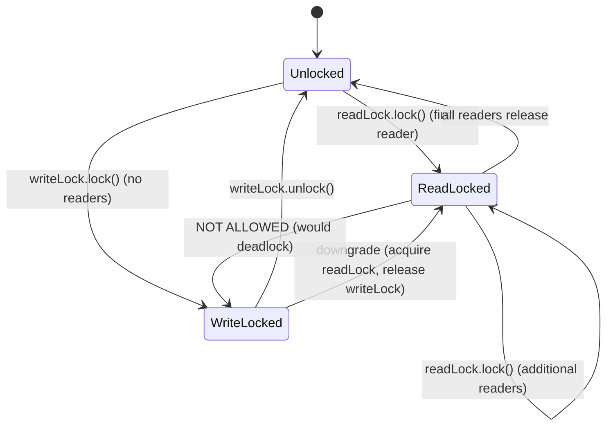

## Keywords in This File
{: .no_toc }

| # | Keyword | Weight |
|---|---|---|
| 1 | [Java Concurrency - L2 Locks and Conditions](#java-concurrency---l2-locks-and-conditions) | medium |

---

# Java Concurrency - L2 Locks and Conditions

## ReentrantLock

---

### 🎯 Model Answer

**30 seconds:**
> `ReentrantLock` is an explicit lock that provides everything
> `synchronized` provides plus: try-lock (attempt without blocking),
> timed lock (give up after N milliseconds), interruptible lock
> (respond to interrupt while waiting), and multiple condition variables
> per lock. It is reentrant - the same thread can acquire it multiple
> times without deadlocking. Always unlock in a finally block to prevent
> lock leaks.

**3 minutes (Senior):**
> `ReentrantLock` extends the capabilities of `synchronized` in three
> important ways. First, it separates lock acquisition from block entry:
> you can try to acquire, give up on timeout, or respond to interruption
> - none of which are possible with `synchronized`. Second, it supports
> multiple `Condition` objects per lock (vs one condition per
> `synchronized` object), allowing precise signaling: signal only
> producers (not consumers), or only threads waiting for a specific
> condition. Third, it supports fair mode: `new ReentrantLock(true)`
> uses FIFO ordering for lock acquisition, preventing starvation at
> ~20-30% throughput cost.
>
> The implementation: `ReentrantLock` is backed by `AbstractQueuedSynchronizer`
> (AQS) - a CLH-queue-based lock framework that is the foundation of all
> `java.util.concurrent` locks. AQS maintains a state int and a waiting
> queue. Non-fair mode uses CAS to try for immediate acquisition (barging);
> fair mode always enqueues first.
>
> Critical discipline: ALWAYS call `unlock()` in a `finally` block.
> Unlike `synchronized`, a missed unlock is a permanent lock hold -
> all other threads waiting on that lock wait forever.

**Framework:** WHAT → WHY → HOW → TRADE-OFF → EXAMPLE

*Adapting up:* Discuss AQS internals (state CAS, CLH queue, park/unpark),
fair vs non-fair performance characteristics, and ReentrantLock's
interaction with virtual threads (no pinning, unlike synchronized).

*Adapting down:* "ReentrantLock is synchronized with a remote control.
You can try to open the door without waiting (tryLock), set a timer
(tryLock with timeout), and cancel the attempt (interruptible)."

**Blank Mind Recovery:**

**(1) Restate:** "So you are asking about ReentrantLock - let me cover
what it adds over synchronized and when to use it."

**(2) First principles:** "From first principles: synchronized is a
simple lock that either acquires or blocks forever. Production systems
often need a lock you can give up on after N milliseconds or respond
to cancellation. ReentrantLock provides those capabilities."

**(3) Bridge:** "ReentrantLock is like a door with a lockpicking option:
you can try to open it (tryLock), wait up to 5 seconds (tryLock with
timeout), or give up if interrupted. synchronized is a door you just
push until it opens - no control over the waiting."

---

### 📘 Concept Explanation

**What it is:**
`ReentrantLock` is an implementation of the `Lock` interface in
`java.util.concurrent.locks`. It provides mutual exclusion and
visibility (same as `synchronized`) plus advanced capabilities:
try-lock, timed lock, interruptible lock, multiple conditions, and
fair scheduling.

**The problem it solves:**
`synchronized` blocks forever if the lock is held. There is no way
to say "try for 5 seconds then do something else," "cancel my wait
if I'm interrupted," or "signal only producers, not consumers." All
three are common production requirements.

**How it works:**
```java
ReentrantLock lock = new ReentrantLock();

// Basic usage (always in try/finally):
lock.lock();
try {
    // critical section
} finally {
    lock.unlock(); // MUST be in finally - exception-safe
}

// Try-lock (non-blocking):
if (lock.tryLock()) {
    try { /* critical section */ }
    finally { lock.unlock(); }
} else {
    // lock unavailable - do something else
}

// Timed try-lock:
if (lock.tryLock(500, TimeUnit.MILLISECONDS)) {
    try { /* critical section */ }
    finally { lock.unlock(); }
} else {
    throw new TimeoutException("Lock not acquired in 500ms");
}

// Interruptible lock:
lock.lockInterruptibly(); // throws InterruptedException if interrupted
try { /* critical section */ }
finally { lock.unlock(); }
```

> **Code walkthrough:** This L2 Locks and Conditions example demonstrates exception handling using concurrency primitive. **KEY MECHANISM:** the JVM checks catch clauses in order; finally always executes for cleanup. **WHY IT MATTERS:** swallowing exceptions silently hides failures that corrupt downstream state. **TAKEAWAY: log or rethrow every exception; empty catch blocks are defects.**

Multiple conditions (the key advantage):
```java
ReentrantLock lock = new ReentrantLock();
Condition notFull  = lock.newCondition();
Condition notEmpty = lock.newCondition();

void produce(Item item) throws InterruptedException {
    lock.lock();
    try {
        while (buffer.size() == capacity) notFull.await();
        buffer.add(item);
        notEmpty.signal(); // wake ONLY consumers
    } finally { lock.unlock(); }
}

void consume() throws InterruptedException {
    lock.lock();
    try {
        while (buffer.isEmpty()) notEmpty.await();
        Item item = buffer.remove(0);
        notFull.signal(); // wake ONLY producers
    } finally { lock.unlock(); }
}
```

> **Code walkthrough:** This L2 Locks and Conditions example demonstrates exception handling using concurrency primitive. **KEY MECHANISM:** the JVM checks catch clauses in order; finally always executes for cleanup. **WHY IT MATTERS:** swallowing exceptions silently hides failures that corrupt downstream state. **TAKEAWAY: log or rethrow every exception; empty catch blocks are defects.**

With `synchronized`, you'd need `notifyAll()` which wakes both
producers AND consumers - inefficient for high-concurrency buffers.

**The key insight:**
The `finally` block is not optional. If your critical section throws
an exception and `unlock()` is not in `finally`, the lock remains held
forever. Every thread waiting for it is blocked permanently. This is
the most common ReentrantLock bug.

**When to use it:**
- Need `tryLock()` or `tryLock(timeout)` for lock acquisition attempts
- Need `lockInterruptibly()` for cancellable waits
- Need multiple `Condition` objects for different wait conditions
- Need fair lock scheduling to prevent starvation
- Java 21 code with virtual threads (synchronized can pin, Lock cannot)

**When NOT to use it:**
- Simple critical sections without timeout/interrupt needs: use
  `synchronized` (simpler, auto-unlock)
- High-concurrency single-variable updates: use `AtomicInteger`

**Alternatives:**
- `StampedLock`: optimistic read locking for read-heavy workloads
- `synchronized`: simpler, auto-unlock for basic mutual exclusion
- `Semaphore`: permits-based access control (n concurrent accessors)

**First-principles derivation:**
The `synchronized` limitation comes from the Java language semantics -
once you enter the synchronized block, you must exit it for the lock
to release. There is no hook to "check if blocked too long" or "respond
to cancellation" inside the language construct. ReentrantLock moves
the lock to user space (backed by AQS), where the lock acquisition
itself is interruptible and time-bounded.

---

### 💻 Code Example

> **Code walkthrough:** The BAD example uses synchronized in a contextice. **KEY MECHANISM:** the runtime executes these instructions in sequence with specific memory and execution semantics. **WHY IT MATTERS:** misapplying this pattern causes subtle bugs that only manifest under production load. **TAKEAWAY: understand the execution model before using this pattern in production code.**
> that needs timeout - there's no way to implement lock timeout with
> synchronized. The GOOD example uses tryLock(timeout). The production
> example shows the full bounded buffer with separate producer/consumer
> conditions - more efficient than notifyAll() for high-concurrency.

```java
// BAD: no way to implement lock timeout with synchronized
public synchronized void processWithTimeout()
        throws TimeoutException {
    // If another thread holds this lock, we block FOREVER.
    // There is no mechanism to give up after 5 seconds.
    doWork();
}
```

> **Code walkthrough:** BAD pattern: This L2 Locks and Conditions example demonstrates mutex locking using concurrency primitive. **KEY MECHANISM:** the JVM acquires the intrinsic lock on the object monitor before entering the block. **WHY IT MATTERS:** a thread holding the lock blocks all other threads - a bottleneck at scale. **WHAT BREAKS: prefer ReentrantLock or ConcurrentHashMap over synchronized for hot paths.**

```java
// GOOD: ReentrantLock with timeout
private final ReentrantLock lock = new ReentrantLock();

public void processWithTimeout() throws TimeoutException,
        InterruptedException {
    if (!lock.tryLock(5, TimeUnit.SECONDS)) {
        throw new TimeoutException("Lock not acquired in 5 seconds");
    }
    try {
        doWork();
    } finally {
        lock.unlock(); // ALWAYS in finally
    }
}
```

> **Code walkthrough:** GOOD pattern: This Unknown example demonstrates exception handling using concurrency primitive. **KEY MECHANISM:** the JVM checks catch clauses in order; finally always executes for cleanup. **WHY IT MATTERS:** swallowing exceptions silently hides failures that corrupt downstream state. **TAKEAWAY: log or rethrow every exception; empty catch blocks are defects.**

```java
// PRODUCTION: efficient bounded buffer with separate conditions
class EfficientBuffer<T> {
    private final ReentrantLock lock = new ReentrantLock();
    private final Condition notFull  = lock.newCondition();
    private final Condition notEmpty = lock.newCondition();
    private final ArrayDeque<T> deque;
    private final int capacity;

    EfficientBuffer(int capacity) {
        this.capacity = capacity;
        this.deque = new ArrayDeque<>(capacity);
    }

    void put(T item) throws InterruptedException {
        lock.lock();
        try {
            while (deque.size() == capacity) notFull.await();
            deque.addLast(item);
            notEmpty.signal(); // wake exactly ONE consumer
            // Not notifyAll() - only one consumer can proceed
        } finally { lock.unlock(); }
    }

    T take() throws InterruptedException {
        lock.lock();
        try {
            while (deque.isEmpty()) notEmpty.await();
            T item = deque.removeFirst();
            notFull.signal(); // wake exactly ONE producer
        } finally { lock.unlock(); }
        return null; // unreachable - for compiler
    }
}
```

> **Code walkthrough:** This Unknown example demonstrates exception handling using concurrency primitive. **KEY MECHANISM:** the JVM checks catch clauses in order; finally always executes for cleanup. **WHY IT MATTERS:** swallowing exceptions silently hides failures that corrupt downstream state. **TAKEAWAY: log or rethrow every exception; empty catch blocks are defects.**

---

### 🎓 Answers by Seniority

**Junior / Mid (0-5 years):**
> `ReentrantLock` is an explicit lock from `java.util.concurrent.locks`.
> It provides everything `synchronized` does, plus: `tryLock()` to try
> without blocking, `tryLock(timeout)` to try with a time limit, and
> `lockInterruptibly()` to respond to thread interruption. The most
> important rule: always call `unlock()` in a `finally` block. Missing
> the unlock causes a permanent lock hold - all threads waiting on it
> block forever.

*Push deeper:* What is the `Condition` interface and how is it better
than `Object.wait()/notify()`?

---

**Senior / Staff (5+ years):**
> My decision for ReentrantLock vs synchronized: use ReentrantLock when
> you need any of its extra capabilities - timeout, interruptible, fair,
> or multiple conditions. Use synchronized otherwise. In Java 21, there's
> an additional reason to prefer ReentrantLock: synchronized blocks can
> pin virtual threads to carrier OS threads. If the code runs on virtual
> threads and the critical section contains any blocking operation (I/O,
> another lock), synchronized prevents the virtual thread from unmounting,
> killing scalability. ReentrantLock + AQS does not pin. I review all
> synchronized usage in code that runs on virtual threads and replace
> it with ReentrantLock where the critical section is non-trivial.

*Push deeper:* Describe how AQS (AbstractQueuedSynchronizer) implements
the fair and non-fair modes internally, and why non-fair mode has higher
throughput.

---

### ⚠️ Common Misconceptions

**Misconception 1: "tryLock() without timeout is always non-blocking."**
`lock.tryLock()` with no argument is indeed non-blocking - returns
true/false immediately. But `lock.tryLock(0, TimeUnit.SECONDS)` is
NOT the same - even a zero-timeout tryLock goes through the fair
acquisition path in fair mode. Use `tryLock()` (no args) for
non-blocking.

**Misconception 2: "ReentrantLock is faster than synchronized."**
For low-contention cases (the common case), `synchronized` is as fast
or faster due to JVM biased locking optimization. ReentrantLock has
no biased-lock optimization (AQS uses CAS). Under high contention,
performance is comparable. Choose by capability, not assumed performance.

**Misconception 3: "lock.unlock() is optional if I always return normally."**
The `finally` block is not about normal returns - it's about exceptions.
If `doWork()` throws a runtime exception that you don't catch,
`lock.unlock()` in a non-finally position is not reached. The lock
stays held. Always use try/finally.

---

### 🚨 Failure Modes and Diagnosis

**Failure 1: Lock leak - unlock() outside finally block**
Symptom: intermittent thread BLOCKED state under specific error conditions.
Application hangs when a rare exception occurs in the critical section.
Cause: `lock.unlock()` was placed in the normal flow, not in `finally`.
Diagnosis: thread dump shows multiple threads WAITING (in AQS queue)
on the same lock. The lock holder is in a state where it exited via
exception but didn't release.
Fix: always: `lock.lock(); try { ... } finally { lock.unlock(); }`

**Failure 2: Condition signaling wrong condition**
Symptom: producer signals a consumer, but the signal goes to a producer
(or vice versa), causing unintended wakeups.
Cause: calling `notFull.signal()` when `notEmpty.signal()` is needed.
Diagnosis: thread counts on each condition's wait set (not easy to
inspect directly - add logging).
Fix: rename conditions clearly (`producerWaiting`, `consumerWaiting`)
and double-check signal calls.

**Failure 3: Deadlock from lock ordering violation**
Symptom: application hangs; thread dump shows circular wait.
Cause: Thread A acquires lockA then lockB; Thread B acquires lockB
then lockA. Classic cycle.
Diagnosis: jstack deadlock detection identifies the cycle.
Fix: enforce consistent lock ordering (always acquire in alphabetical
or dependency order), or use tryLock with timeout to break deadlock.

---

### 🎯 Interview Deep-Dive

| Question Category | Time to Answer |
|---|---|
| Definition | 30-60 seconds |
| Comparison | 1-2 minutes |
| Mechanism | 2-3 minutes |
| Scenario | 2-3 minutes |
| Debugging | 2-3 minutes |
| Pattern | 2-3 minutes |
| Advanced | 2-3 minutes |
| Trade-off | 1-2 minutes |
| Virtual threads | 2-3 minutes |

---

**Q1 (Definition): What does ReentrantLock provide beyond synchronized?**

A: `ReentrantLock` provides four capabilities beyond `synchronized`:

1. Try-lock (non-blocking): `lock.tryLock()` returns true if the lock
   was acquired, false if not. Never blocks. Use for: acquiring a second
   lock without deadlock risk, optimistic operations.

2. Timed lock: `lock.tryLock(5, TimeUnit.SECONDS)` tries for up to
   5 seconds, then returns false. Use for: preventing indefinite hangs
   in distributed systems where downstream may be slow.

3. Interruptible lock: `lock.lockInterruptibly()` throws
   `InterruptedException` if the thread is interrupted while waiting.
   Unlike `synchronized` which ignores interrupts while blocked.
   Use for: cancellable tasks, responsive shutdown.

4. Multiple conditions: `lock.newCondition()` creates a separate
   condition variable. You can `await()` on one condition and
   `signal()` on another, precisely waking only the threads that
   should proceed. `Object.wait/notify` has only one wait set per
   object, forcing `notifyAll()` in multi-condition scenarios.

Bonus: Fair mode (`new ReentrantLock(true)`) provides FIFO waiting
order, preventing starvation. `synchronized` has no fairness guarantee.

*What separates good from great:* Knowing that all four capabilities
are for different failure modes: try-lock for livelock avoidance,
timed for distributed timeout, interruptible for cancellation, and
conditions for producer-consumer efficiency. Understanding which your
use case needs determines the right tool.

---

**Q2 (Mechanism): How does AQS (AbstractQueuedSynchronizer) implement
ReentrantLock?**

A: `AbstractQueuedSynchronizer` (AQS) is the framework behind all
`java.util.concurrent` synchronizers. ReentrantLock is built on AQS.

AQS maintains:
- `state` (int): for ReentrantLock, 0 = unlocked, N = locked with
  N reentrant acquisitions
- CLH wait queue: doubly-linked list of waiting threads' nodes

Acquisition path (non-fair):
1. CAS `state` from 0 to 1 (try immediate acquisition - barging)
2. If CAS fails: check if current thread already owns lock (reentrancy)
   If yes: increment state (hold count)
3. If not reentrant: enqueue in CLH queue with `LockSupport.park()`
4. When predecessor dequeues, `LockSupport.unpark(successor)` wakes next

Release:
1. Decrement hold count
2. If count reaches 0: set state to 0 (CAS)
3. `LockSupport.unpark(head.next)` to wake next waiter

Non-fair vs Fair:
- Non-fair: new thread attempts CAS (barging) before checking queue.
  A new thread can "steal" the lock from a queued thread. Higher
  throughput because thread parking/unparking is avoided.
- Fair: new thread always enqueues. Strict FIFO order.
  Higher latency due to mandatory queue enqueue even when lock is free.

*What separates good from great:* Understanding that AQS is also the
basis for Semaphore, CountDownLatch, CyclicBarrier, and ReentrantReadWriteLock.
All share the same CLH queue mechanism with different state semantics.

---

**Q3 (Comparison): synchronized vs ReentrantLock - choose for these scenarios:**

**Scenario A:** Simple counter increment, no external dependencies.

**Scenario B:** Lock acquisition with 500ms timeout, then fallback.

**Scenario C:** Producer-consumer buffer with separate wake conditions.

**Scenario D:** Java 21 virtual thread code with database calls.

A: For scenario A - synchronized or AtomicInteger. The critical section
is simple, no timeout or condition needed. AtomicInteger is better
(CAS, no lock).

For scenario B - ReentrantLock with `tryLock(500, TimeUnit.MILLISECONDS)`.
There is no way to do this with synchronized.

For scenario C - ReentrantLock with two `Condition` objects. With
synchronized, you'd need `notifyAll()` which wakes both producers and
consumers. With ReentrantLock, `notEmpty.signal()` wakes only consumers.

For scenario D - ReentrantLock. Synchronized blocks in virtual threads
can "pin" the virtual thread to its carrier OS thread when the blocked
virtual thread encounters a blocking operation (like a database call).
ReentrantLock uses `LockSupport.park()` which allows the virtual thread
to unmount from the carrier thread and be rescheduled elsewhere.

*What separates good from great:* Scenario D is the Java 21 production
gotcha. Many teams run virtual threads with old synchronized code and
see poor scaling under load. Profiling with
`-Djdk.tracePinnedThreads=full` reveals the pinning sites.

---

**Q4 (Scenario): Implement a resource pool that gives up after
timeout.**

A:
```java
class ResourcePool {
    private final ReentrantLock lock = new ReentrantLock();
    private final Condition available = lock.newCondition();
    private final Queue<Resource> pool = new ArrayDeque<>();
    private final int maxSize;

    ResourcePool(int size) {
        this.maxSize = size;
        for (int i = 0; i < size; i++) {
            pool.offer(new Resource());
        }
    }

    Resource acquire(long timeoutMs) throws InterruptedException {
        lock.lock();
        try {
            long deadline = System.nanoTime() +
                TimeUnit.MILLISECONDS.toNanos(timeoutMs);
            while (pool.isEmpty()) {
                long remaining = deadline - System.nanoTime();
                if (remaining <= 0) {
                    return null; // timeout - return null = unavailable
                }
                // await with remaining time:
                if (!available.await(remaining, TimeUnit.NANOSECONDS)) {
                    return null; // timed out waiting on condition
                }
            }
            return pool.poll();
        } finally {
            lock.unlock();
        }
    }

    void release(Resource r) {
        lock.lock();
        try {
            pool.offer(r);
            available.signal(); // wake one waiting thread
        } finally {
            lock.unlock();
        }
    }
}
```

> **Code walkthrough:** This Unknown example demonstrates exception handling using async/await. **KEY MECHANISM:** the JVM checks catch clauses in order; finally always executes for cleanup. **WHY IT MATTERS:** swallowing exceptions silently hides failures that corrupt downstream state. **TAKEAWAY: log or rethrow every exception; empty catch blocks are defects.**

Design notes: `Condition.await(time, unit)` returns false if timed out.
The deadline calculation using `nanoTime()` is correct for elapsed-time
measurement (not affected by wall-clock changes). `signal()` (not
`signalAll()`) wakes one waiter - only one resource was returned, only
one waiter can proceed.

*What separates good from great:* Using `nanoTime()` (not
`currentTimeMillis()`) for deadline calculation is important. System
clock adjustments (NTP, DST) can change `currentTimeMillis()` between
acquisition and timeout check, causing incorrect timeouts.

---

**Q5 (Debugging): A service using ReentrantLock occasionally hangs
indefinitely under load. How do you diagnose?**

A: This is likely a lock leak - unlock() not being called. Steps:

Step 1: Thread dump with `jstack <pid>` or `kill -3 <pid>`.
Look for:
- Threads in BLOCKED (waiting for `synchronized`) - not ReentrantLock
- Threads in WAITING on `LockSupport.park()` (this IS ReentrantLock)
- Identify which lock they're waiting for - the lock owner thread

Step 2: Find the lock holder.
In the thread dump, the WAITING threads show the lock object address.
Find the thread that holds this lock and is NOT making progress.
Common finding: the holder threw an exception that bypassed `unlock()`.

Step 3: Verify finally block coverage.
Search the codebase for `lock.lock()` without a matching
`lock.unlock()` in a `finally` block. Static analysis tools (Checkstyle,
SpotBugs) can find this.

Step 4: Check for conditional unlocking.
Pattern: `if (acquired) { lock.unlock(); }` - if `acquired` was set
before the lock but the exception path sets it to false, the unlock
is skipped.

Step 5: Add lock hold time monitoring.
Override `Lock` to log acquisition time and alert if held for > N ms.
Or use Micrometer's `TimedLock` wrapper.

*What separates good from great:* Knowing that `jstack` shows
ReentrantLock waiters with `java.util.concurrent.locks.AbstractQueuedSynchronizer.parkAndCheckInterrupt` in the stack, which is the AQS park call. This identifies ReentrantLock contention vs synchronized contention.

---

**Q6 (Pattern): What is the try-lock-both-or-release pattern and
when is it needed?**

A: This pattern avoids deadlock when acquiring multiple locks:

```java
// Deadlock-prone: always take locks in fixed order
// (solution for two known locks at compile time)

// But for dynamic lock sets, use try-lock-release:
boolean lockBoth(Lock lockA, Lock lockB)
        throws InterruptedException {
    while (true) {
        lockA.lock();
        try {
            if (lockB.tryLock()) { // try without blocking
                // Both locks held - success
                return true;
            }
            // Couldn't get B - release A and retry
        } finally {
            if (!lockBothHeld) lockA.unlock();
        }
        // Brief backoff before retry to avoid livelock
        Thread.sleep(1);
    }
}
```

> **Code walkthrough:** This Unknown example demonstrates exception handling using error handling. **KEY MECHANISM:** the JVM checks catch clauses in order; finally always executes for cleanup. **WHY IT MATTERS:** swallowing exceptions silently hides failures that corrupt downstream state. **TAKEAWAY: log or rethrow every exception; empty catch blocks are defects.**

Real use case: transferring between two bank accounts where both
accounts need to be locked. The accounts are not always in a fixed
order relative to each other.

Better alternative for known static lock sets: always acquire in a
defined canonical order (e.g., by object identity: `System.identityHashCode()`
as tiebreaker). This prevents circular wait without needing try-lock:

```java
void transfer(Account from, Account to, int amount) {
    Account first  = id(from) < id(to) ? from : to;
    Account second = id(from) < id(to) ? to   : from;
    synchronized (first) {
        synchronized (second) {
            from.debit(amount);
            to.credit(amount);
        }
    }
}
```

> **Code walkthrough:** This Unknown example demonstrates mutex locking using concurrency primitive. **KEY MECHANISM:** the JVM acquires the intrinsic lock on the object monitor before entering the block. **WHY IT MATTERS:** a thread holding the lock blocks all other threads - a bottleneck at scale. **TAKEAWAY: prefer ReentrantLock or ConcurrentHashMap over synchronized for hot paths.**

*What separates good from great:* The livelock risk in try-lock-release:
if two threads each grab their first lock and both fail to get the second,
they both release and retry, potentially forever. The `Thread.sleep(1)`
with random jitter prevents livelock by creating timing asymmetry.

---

**Q7 (Advanced): How does the fair mode of ReentrantLock work and
when should you use it?**

A: In non-fair mode (default), when a lock is released, any thread
(including new arrivals that haven't queued yet) can acquire it. This
is "barging" - a new thread can jump ahead of queued threads. This
maximizes throughput because it avoids the overhead of forcing the
new thread into the queue, parking it, then unparking it.

In fair mode (`new ReentrantLock(true)`), when a lock is released,
the next thread in the queue (the one that has been waiting longest)
always gets it. New threads must join the end of the queue. This
prevents starvation: no thread waits indefinitely if others keep
acquiring.

Performance trade-off:
- Non-fair: ~20-30% higher throughput (thread parking/unparking is
  avoided when the lock is available and a new thread arrives)
- Fair: ~20-30% lower throughput, but bounded waiting time per thread

When to use fair mode:
- Long-running locks where starvation is a real risk (lock held for
  milliseconds with dozens of waiters)
- Deterministic testing (predictable execution order)
- Priority work queues where ordering must be respected

When non-fair is fine (the common case):
- Locks held briefly (microseconds)
- Threads have similar priority and access frequency
- Throughput is more important than per-request latency tail

*What separates good from great:* Fair mode doesn't guarantee per-
request latency - it bounds waiting to the queue depth. If 100 threads
are queued, you still wait for all 100 ahead of you. For bounded latency
guarantees, fair mode + bounded pool size is the combination.

---

**Q8 (Trade-off): What is the overhead of ReentrantLock vs synchronized
and when does it matter?**

A: Low-contention case:
- `synchronized` uses biased locking: first acquisition is ~1-2 cycles,
  subsequent re-acquisitions by the same thread are ~0 cycles.
  Biased lock revocation (when a second thread appears) is expensive
  but rare.
- `ReentrantLock` uses CAS: ~5-10 cycles per acquisition (no biased lock).

High-contention case:
- Both degrade to OS-level parking. Performance is similar (~1-10
  microseconds per contended acquisition). ReentrantLock's AQS queue
  is slightly more efficient than the JVM's monitor queue in some JVMs.

When the difference matters:
- Locks acquired millions of times per second in tight loops: use
  `synchronized` (biased locking advantage)
- Locks under moderate to high contention: similar performance
- I/O-bound critical sections: overhead is negligible (I/O dominates)

Practical conclusion: choose ReentrantLock for its capabilities, not
for performance. If you need tryLock, conditions, or Java 21 virtual
thread compatibility, use ReentrantLock. Otherwise, synchronized is
fine and simpler.

*What separates good from great:* Note 1: biased locking was disabled
by default in Java 15+ (JEP 374) because the revocation cost was not
worth it for many workloads. From Java 15+, `synchronized` starts
directly with thin locking (CAS). The performance difference between
`synchronized` and `ReentrantLock` is now smaller than it was in Java 8.

---

**Q9 (Virtual threads): How does ReentrantLock interact with virtual
threads in Java 21?**

A: Virtual threads (Project Loom, Java 21) can be "pinned" or
"unpinned" when blocking:

`synchronized` causes pinning: when a virtual thread executes code
in a `synchronized` block and blocks (I/O, another lock, `wait()`),
the virtual thread cannot unmount from its carrier OS thread. The
carrier thread is occupied for the duration of the block. This prevents
the multiplexing that makes virtual threads efficient.

`ReentrantLock` does not pin: when a virtual thread calls
`lock.lock()` and the lock is held, it calls `LockSupport.park()` which
unmounts the virtual thread from the carrier thread. The carrier thread
is free to run other virtual threads. When the lock is released,
`LockSupport.unpark()` reschedules the waiting virtual thread.

Practical impact: a service handling 10,000 concurrent requests on
virtual threads, where each request holds a `synchronized` lock for
5ms for a database query:
- Without pinning: 10,000 virtual threads, ~10-20 carrier OS threads
- With pinning: 10,000 carrier OS threads pinned during the lock hold
  → same as platform threads, no virtual thread benefit

Detection: `-Djdk.tracePinnedThreads=full` logs all pinning events
with stack traces.

Migration pattern for library code using synchronized:
```java
// Java 21 library pattern: Lock instead of synchronized
private final ReentrantLock lock = new ReentrantLock();

// Before (pins virtual threads):
public synchronized void doWork() {
    performDatabaseQuery(); // blocks, pins carrier
}

// After (virtual thread safe):
public void doWork() {
    lock.lock();
    try {
        performDatabaseQuery(); // blocks, unmounts VT
    } finally {
        lock.unlock();
    }
}
```

> **Code walkthrough:** This Unknown example demonstrates mutex locking using coice. **KEY MECHANISM:** the runtime executes these instructions in sequence with specific memory and execution semantics. **WHY IT MATTERS:** misapplying this pattern causes subtle bugs that only manifest under production load. **TAKEAWAY: understand the execution model before using this pattern in production code.**

*What separates good from great:* Knowing that the JDK itself has been
updated extensively in Java 21 to replace `synchronized` blocks with
`ReentrantLock` in I/O-path code (NIO channels, socket implementation,
etc.) precisely for virtual thread compatibility. This is an ongoing
migration in the OpenJDK community.

---

### ⚖️ Comparison Table

| Feature| synchronized| ReentrantLock| AtomicInteger|
|-------------------|------------|---------------------|-------------|
| Auto-unlock| Yes| No (must use finally)| N/A|
| Try-lock| No| Yes| N/A|
| Timed lock| No| Yes| N/A|
| Interruptible| No| Yes| N/A|
| Fair mode| No| Yes| N/A|
| Conditions| One| Multiple| N/A|
| Virtual thread safe| No (pins)| Yes| Yes|
| Reentrancy| Yes| Yes| N/A|
| Compound atomic ops| No| Via Condition| Yes (CAS)|
| Complexity| Low| Medium| Low|

**The deciding factor:**
Use `synchronized` for simple critical sections. Use `ReentrantLock`
when you need timeout, interruption, fairness, or multiple conditions.
In Java 21+ with virtual threads: prefer `ReentrantLock` for any
code in the request-handling path that contains blocking operations.

---

### 🏛️ System Design

*(Omit: L2 working-level - lock design patterns in distributed systems
at L4/L5.)*

---

### 📊 Diagram

*(Omit: ReentrantLock mechanism is well covered by code examples.
AQS queue diagram appears in L4 Lock Contention file.)*

---
---

## ReadWriteLock

---

### 🎯 Model Answer

**30 seconds:**
> `ReadWriteLock` (implemented by `ReentrantReadWriteLock`) separates
> read and write locking: multiple readers can hold the read lock
> simultaneously, but a writer requires exclusive access (no readers,
> no other writers). This dramatically improves throughput for read-heavy
> workloads where reads vastly outnumber writes - instead of serializing
> all access like a regular lock, reads can proceed in parallel.

**3 minutes (Senior):**
> `ReentrantReadWriteLock` maintains two locks: a shared read lock
> (multiple concurrent holders allowed) and an exclusive write lock
> (one holder, zero readers). The key contract: write lock acquisition
> waits for all current readers to finish, then blocks all new readers
> until the write completes.
>
> The performance benefit is real only when reads substantially outnumber
> writes and the critical section is expensive (otherwise, lock
> overhead > concurrency gain). Rule of thumb: use when the read-to-write
> ratio is > 10:1 and the protected operation takes > 1 microsecond.
>
> A subtle issue: writer starvation. If readers are always present,
> a writer can wait indefinitely. `ReentrantReadWriteLock` addresses this
> with a "fair" constructor and the standard (non-fair) mode where writers
> have write-preference - once a writer is queued, new readers queue
> behind it rather than grabbing the read lock.
>
> In Java 8+, `StampedLock` is often a better choice for the same pattern:
> it adds optimistic reading (read without acquiring any lock, validate
> afterward) which can eliminate all lock acquisition in the common
> read-with-no-concurrent-write case.

**Framework:** WHAT → WHY → HOW → TRADE-OFF → EXAMPLE

*Adapting up:* Compare StampedLock's optimistic read mode, discuss the
read-to-write ratio threshold for when ReadWriteLock pays off, and the
downgrade from write to read lock pattern.

*Adapting down:* "ReadWriteLock is like a library reading room: many
readers can use books simultaneously, but when the librarian needs to
re-shelve (write), everyone waits."

**Blank Mind Recovery:**

**(1) Restate:** "So you are asking about ReadWriteLock - let me explain
when shared reads + exclusive writes is better than a single lock."

**(2) First principles:** "From first principles: most data structures
are read far more than written. Regular locks serialize all access
including reads. ReadWriteLock allows parallel reads - increasing
read throughput proportionally to the number of readers."

**(3) Bridge:** "ReadWriteLock is like a highway with multiple lanes for
cars (readers) and a lane closure procedure for maintenance trucks
(writers). Cars share lanes freely. When maintenance needs to work,
it waits for cars to clear, then has the road to itself."

---

### 📘 Concept Explanation

**What it is:**
`ReadWriteLock` is an interface with two methods: `readLock()` and
`writeLock()`. `ReentrantReadWriteLock` implements it with a shared
read lock and an exclusive write lock backed by AQS.

**The problem it solves:**
A regular mutex serializes ALL access - reads serialize with reads even
though simultaneous reads are safe (immutable access). For data that
is read 95% of the time and written 5%, a regular mutex wastes 95%
of potential concurrency.

**How it works:**
```
State:  read_count (number of active readers) | write_locked (boolean)
                                                        ^
                                              encoded in AQS state int

Invariant:
  writeLocked=true  → readCount=0  (exclusive: no readers while writing)
  readCount>0       → writeLocked=false (no writing while readers active)
```

> **Code walkthrough:** This Unknown example demonstrates a key concept in practice. **KEY MECHANISM:** the runtime executes these instructions in sequence with specific memory and execution semantics. **WHY IT MATTERS:** misapplying this pattern causes subtle bugs that only manifest under production load. **TAKEAWAY: understand the execution model before using this pattern in production code.**

Read lock acquisition: allowed if write lock is not held. Increment
read count. Multiple readers hold simultaneously.

Write lock acquisition: waits until read count = 0 AND write lock = 0.
Exclusive hold - blocks all readers and other writers.

Lock downgrade (allowed): thread holding write lock can acquire read
lock, then release write lock. Now holds read lock only (downgraded).
Used to publish a new value atomically and continue reading under the
read lock.

Lock upgrade (NOT allowed): thread holding read lock CANNOT upgrade to
write lock without releasing read lock first. Attempting it deadlocks
if another reader is also present (neither can upgrade, both wait).

```java
ReentrantReadWriteLock rwLock = new ReentrantReadWriteLock();
Lock readLock  = rwLock.readLock();
Lock writeLock = rwLock.writeLock();

// Read operation:
readLock.lock();
try {
    return data.get(key); // multiple threads here simultaneously
} finally {
    readLock.unlock();
}

// Write operation:
writeLock.lock();
try {
    data.put(key, value); // exclusive - no other readers or writers
} finally {
    writeLock.unlock();
}
```

> **Code walkthrough:** This Unknown example demonstrates exception handling usiice. **KEY MECHANISM:** the runtime executes these instructions in sequence with specific memory and execution semantics. **WHY IT MATTERS:** misapplying this pattern causes subtle bugs that only manifest under production load. **TAKEAWAY: understand the execution model before using this pattern in production code.**

**The key insight:**
ReadWriteLock only improves performance when reads are truly dominant
AND the critical section is long enough to justify the overhead.
For short critical sections (< 1 microsecond), the lock management
overhead may exceed the concurrency gain. Measure before optimizing.

**When to use it:**
- In-memory data structures read by many threads, written rarely
  (configuration cache, routing tables, metadata stores)
- Read-heavy shared collections (list of registered listeners)
- Read-mostly shared state with infrequent invalidation

**When NOT to use it:**
- Write-heavy workloads (write lock cost is higher than regular lock)
- Very short critical sections (overhead > gain)
- Java 8+ code where StampedLock's optimistic read could be applied
- When ConcurrentHashMap or CopyOnWriteArrayList covers the use case

**Alternatives:**
- `StampedLock`: adds optimistic read (read without acquiring lock,
  validate after) - faster for low-contention reads
- `ConcurrentHashMap`: fine-grained locking built-in
- `CopyOnWriteArrayList`: snapshot-based reads, write copies array

**First-principles derivation:**
Reader-writer problem: N readers can access data simultaneously.
1 writer needs exclusive access. The optimal solution serializes
only writer-reader and writer-writer pairs, not reader-reader pairs.
ReadWriteLock implements exactly this, leveraging the insight that
reads are naturally parallelizable as they don't modify state.

---

### 💻 Code Example

> **Code walkthrough:** The BAD example uses a single ReentrantLock forice. **KEY MECHANISM:** the runtime executes these instructions in sequence with specific memory and execution semantics. **WHY IT MATTERS:** misapplying this pattern causes subtle bugs that only manifest under production load. **TAKEAWAY: understand the execution model before using this pattern in production code.**
> read operations, serializing all reads. The GOOD example uses
> ReadWriteLock to allow concurrent reads. The StampedLock example shows
> the next-level optimization with optimistic reads - avoiding lock
> acquisition entirely in the common no-write case.

```java
// BAD: single lock serializes all reads (reads wait for each other)
class UserRegistry {
    private final Map<Long, User> users = new HashMap<>();
    private final ReentrantLock lock = new ReentrantLock();

    User lookup(long id) {
        lock.lock(); // serializes ALL reads
        try { return users.get(id); }
        finally { lock.unlock(); }
    }

    void register(User u) {
        lock.lock();
        try { users.put(u.id(), u); }
        finally { lock.unlock(); }
    }
}
```

> **Code walkthrough:** BAD pattern: This Unknown example demonstrates exceptionice. **KEY MECHANISM:** the runtime executes these instructions in sequence with specific memory and execution semantics. **WHY IT MATTERS:** misapplying this pattern causes subtle bugs that only manifest under production load. **TAKEAWAY: understand the execution model before using this pattern in production code.**

```java
// GOOD: ReadWriteLock - reads run concurrently
class UserRegistry {
    private final Map<Long, User> users = new HashMap<>();
    private final ReentrantReadWriteLock rwLock =
        new ReentrantReadWriteLock();
    private final Lock readLock  = rwLock.readLock();
    private final Lock writeLock = rwLock.writeLock();

    User lookup(long id) {
        readLock.lock(); // multiple threads here at once
        try { return users.get(id); }
        finally { readLock.unlock(); }
    }

    void register(User u) {
        writeLock.lock(); // exclusive - waits for readers
        try { users.put(u.id(), u); }
        finally { writeLock.unlock(); }
    }
}
```

> **Code walkthrough:** GOOD pattern: This Unknown example demonstrates exception handling using error handling. **KEY MECHANISM:** the JVM checks catch clauses in order; finally always executes for cleanup. **WHY IT MATTERS:** swallowing exceptions silently hides failures that corrupt downstream state. **TAKEAWAY: log or rethrow every exception; empty catch blocks are defects.**

```java
// ADVANCED: StampedLock with optimistic read
import java.util.concurrent.locks.StampedLock;

class StampedUserRegistry {
    private volatile Map<Long, User> users = new HashMap<>();
    private final StampedLock lock = new StampedLock();

    User lookup(long id) {
        long stamp = lock.tryOptimisticRead(); // NO lock acquired
        Map<Long, User> snapshot = users;      // read data
        if (!lock.validate(stamp)) {           // check no write occurred
            // Validation failed - a write happened; take real read lock
            stamp = lock.readLock();
            try { snapshot = users; }
            finally { lock.unlockRead(stamp); }
        }
        return snapshot.get(id); // read from validated snapshot
    }

    void register(User u) {
        long stamp = lock.writeLock();
        try {
            Map<Long, User> updated = new HashMap<>(users);
            updated.put(u.id(), u);
            users = updated; // volatile write - visible to all threads
        } finally {
            lock.unlockWrite(stamp);
        }
    }
}
```

> **Code walkthrough:** This Unknown example demonstrates exception handling usiice. **KEY MECHANISM:** the runtime executes these instructions in sequence with specific memory and execution semantics. **WHY IT MATTERS:** misapplying this pattern causes subtle bugs that only manifest under production load. **TAKEAWAY: understand the execution model before using this pattern in production code.**

---

### 🎓 Answers by Seniority

**Junior / Mid (0-5 years):**
> `ReadWriteLock` has two separate locks - one for reading and one for
> writing. Many threads can hold the read lock simultaneously (reads
> don't conflict). The write lock is exclusive - only one thread can
> write, and no readers can be active. This makes read operations
> much faster under concurrent read load because they don't block each
> other. Use it for data structures that are read often but written
> rarely.

*Push deeper:* Why can you not upgrade from a read lock to a write lock
without releasing the read lock first?

---

**Senior / Staff (5+ years):**
> ReadWriteLock is the right tool for read-heavy shared state, but I
> always measure before adding it. The overhead of maintaining read/write
> lock state is real - for sub-microsecond critical sections, a simple
> ReentrantLock might have lower total overhead. The measurement test:
> benchmark with single lock vs read-write lock at your actual read:write
> ratio. In practice, for things like a configuration cache or routing
> table where reads are 100x more frequent than writes and the critical
> section touches a few data structures, ReadWriteLock or StampedLock
> is clearly better. For Java 8+, I evaluate StampedLock's optimistic
> read first - in many read-dominant cases, the optimistic path avoids
> any lock acquisition entirely, which is faster than even ReadWriteLock.

*Push deeper:* Explain lock downgrade (write → read) and why lock
upgrade (read → write) is prohibited.

---

### ⚠️ Common Misconceptions

**Misconception 1: "Lock upgrade (read to write) is supported."**
You CANNOT upgrade from read lock to write lock without releasing the
read lock first. Attempting `writeLock.lock()` while holding
`readLock.lock()` in the same thread creates a deadlock: the writer
waits for all readers to finish, but you are a reader - circular wait.
The pattern is: release read lock, acquire write lock, re-verify
conditions.

**Misconception 2: "ReadWriteLock always improves performance over
a simple lock."**
ReadWriteLock helps only when reads significantly outnumber writes
AND the critical section is long enough to justify overhead. For very
short critical sections or write-heavy loads, a simple ReentrantLock
can outperform ReadWriteLock because of the added complexity in
read/write state management.

**Misconception 3: "Writers never starve in non-fair mode."**
In the default non-fair mode, `ReentrantReadWriteLock` uses a
"write-preferred" strategy: once a writer is queued, new readers
queue behind it. This prevents indefinite writer starvation but does
not prevent temporary starvation during existing reader activity.
True FIFO starvation prevention requires `new ReentrantReadWriteLock(true)`.

---

### 🚨 Failure Modes and Diagnosis

**Failure 1: Read lock upgrade deadlock**
Symptom: application hangs; two threads both holding read lock and
trying to acquire write lock.
Cause: attempt to upgrade read → write without releasing read first.
Diagnosis: thread dump shows both threads in WAITING state, each holding
read lock on the same RWLock.
Fix: release read lock before acquiring write lock. Re-validate the
condition after acquiring write lock.

**Failure 2: Writer starvation under continuous read load**
Symptom: write operations never complete (extremely high latency or
timeout). Read operations proceed normally.
Cause: continuous reader traffic in non-fair mode. When a reader
finishes, another starts before the writer can acquire.
Fix: switch to `new ReentrantReadWriteLock(true)` (fair mode). Or use
a read quota: occasionally drain all readers before allowing new reads.

**Failure 3: Performance worse than single lock**
Symptom: ReadWriteLock implementation is slower than synchronizedMap
in microbenchmark.
Cause: write-heavy workload OR very short critical sections where
RWLock state management overhead exceeds concurrency gain.
Fix: JMH benchmark with your actual read:write ratio. If writes >
30% of operations, single lock may be faster.

---

### 🎯 Interview Deep-Dive

  | Question Category | Time to Answer |  
|-----------------|--------------|
  | Definition        | 30-60 seconds  |  
  | Mechanism         | 1-2 minutes    |  
  | Comparison        | 2-3 minutes    |  
  | Scenario          | 2-3 minutes    |  
  | Debugging         | 2-3 minutes    |  
  | Upgrade/Downgrade | 2-3 minutes    |  
  | StampedLock       | 2-3 minutes    |  
  | Trade-off         | 1-2 minutes    |  
  | Advanced          | 2-3 minutes    |  

---

**Q1 (Definition): How does ReentrantReadWriteLock improve concurrency
over a plain lock?**

A: `ReentrantReadWriteLock` allows multiple concurrent readers while
maintaining exclusive write access. A plain lock (synchronized or
ReentrantLock) serializes ALL access - read after read, read after
write, write after read - regardless of whether the operations conflict.

`ReadWriteLock` serializes only conflicting access patterns:
- Read + Read: compatible → concurrent execution
- Read + Write: conflict → write waits for all reads
- Write + Write: conflict → serialize writes

For a read-to-write ratio of N:1, a ReadWriteLock provides up to N×
read throughput compared to a plain lock (reads proceed N at a time
rather than sequentially).

Example: configuration cache with 1000 reads/sec, 1 write/sec.
With ReentrantLock: 1001 operations serialized, 1 at a time.
With ReadWriteLock: 1000 reads in parallel (nearly 1000x throughput
for reads), 1 write serialized.

*What separates good from great:* The gain is limited by Amdahl's Law
for the write fraction. If writes are 5% of operations, max speedup
= 1/(0.05 + 0.95/N_readers). At 16 readers: ~11x. At 100 readers:
~17x. The write fraction is the bottleneck that limits maximum speedup.

---

**Q2 (Mechanism): Why is lock upgrade (read → write) prohibited?**

A: Lock upgrade is prohibited because it would create a deadlock in
the most common upgrade scenario.

Scenario: Thread A and Thread B both hold read locks. Thread A wants
to upgrade to write. For the write lock, Thread A must wait for ALL
readers to finish - including Thread B. But Thread B also wants to
upgrade to write - it must wait for Thread A to release the read lock.
Both are waiting for each other: deadlock.

The only safe way to "upgrade" is:
1. Release the read lock
2. Acquire the write lock (which may block briefly for other readers)
3. Re-validate that the condition still holds (because state may have
   changed between releasing read and acquiring write)
4. Proceed with the write

```java
// CORRECT upgrade pattern:
readLock.unlock();
writeLock.lock();
try {
    if (needsUpdate()) { // re-validate
        update();
    }
} finally {
    writeLock.unlock();
}
// Note: between unlock and lock, another thread may have updated -
// re-validation is essential.
```

> **Code walkthrough:** This Unknown example demonstrates exception handling using SQL. **KEY MECHANISM:** the JVM checks catch clauses in order; finally always executes for cleanup. **WHY IT MATTERS:** swallowing exceptions silently hides failures that corrupt downstream state. **TAKEAWAY: log or rethrow every exception; empty catch blocks are defects.**

*What separates good from great:* Lock downgrade (write → read) IS
supported and safe. A thread holding the write lock can acquire the
read lock, then release the write lock. The thread now holds only the
read lock. This atomically "publishes" a write while ensuring the
writing thread can continue reading without another writer interposing.

---

**Q3 (Comparison): ReadWriteLock vs StampedLock vs ConcurrentHashMap
for a shared configuration map.**

A: For a configuration map (read-heavy, infrequent writes):

ConcurrentHashMap:
- Best overall for a simple key-value configuration store
- No explicit locking needed - built-in thread safety
- `computeIfAbsent()` for lazy config loading
- No writer starvation concerns
- Choose this first unless configuration entries are complex objects
  that need transactional read (multiple fields together)

ReadWriteLock:
- Better when the data structure is complex (not just a map) or
  requires multiple-field consistency
- Multiple config values must be read atomically (e.g., read 5
  related fields that must be consistent with each other)
- Higher throughput than ConcurrentHashMap for very large maps where
  individual bucket locking is insufficient
- Writer starvation risk in write-heavy scenarios

StampedLock:
- Best for read-latency-sensitive config access
- Optimistic read path: no lock acquisition for reads when no
  concurrent writes (common case for config)
- 10-50% faster reads than ReadWriteLock in low-write scenarios
- More complex API - easier to misuse (forgetting to validate stamp)
- Not reentrant - cannot call another method that uses StampedLock
  from within a stamp-locked section

My recommendation: ConcurrentHashMap for simple config, StampedLock
for complex multi-field reads that need consistency.

*What separates good from great:* StampedLock's optimistic read is
not a lock - it's a version check. The pattern is: read stamp, read
data, validate stamp (no write occurred). If validation fails, fall
back to read lock. Under low-write load (config), the fast path
(no lock) is taken almost always.

---

**Q4 (Scenario): Implement a thread-safe routing table supporting
concurrent lookups and infrequent route updates.**

A:
```java
class RoutingTable {
    private final Map<String, String> routes = new HashMap<>();
    private final ReentrantReadWriteLock rwLock =
        new ReentrantReadWriteLock();
    private final Lock readLock  = rwLock.readLock();
    private final Lock writeLock = rwLock.writeLock();

    // Called thousands of times per second by request handlers
    String route(String destination) {
        readLock.lock();
        try {
            // reads run in parallel - no contention between lookups
            return routes.getOrDefault(destination, "default-route");
        } finally {
            readLock.unlock();
        }
    }

    // Called rarely when route table updates
    void addRoute(String dest, String target) {
        writeLock.lock();
        try {
            routes.put(dest, target); // exclusive, waits for readers
        } finally {
            writeLock.unlock();
        }
    }

    void removeRoute(String dest) {
        writeLock.lock();
        try {
            routes.remove(dest);
        } finally {
            writeLock.unlock();
        }
    }

    // Atomic bulk update (lock downgrade pattern):
    void reloadRoutes(Map<String, String> newRoutes) {
        writeLock.lock();
        try {
            routes.clear();
            routes.putAll(newRoutes);
            // Optional: downgrade to read lock for continued reading
            readLock.lock(); // acquire read lock while still holding write
        } finally {
            writeLock.unlock(); // release write, keep read
        }
        // Now holding read lock only - routes are published
        try {
            validateRoutes(); // read-only validation under read lock
        } finally {
            readLock.unlock();
        }
    }
}
```

> **Code walkthrough:** This Unknown example demonstrates null-safe value wrappiice. **KEY MECHANISM:** the runtime executes these instructions in sequence with specific memory and execution semantics. **WHY IT MATTERS:** misapplying this pattern causes subtle bugs that only manifest under production load. **TAKEAWAY: understand the execution model before using this pattern in production code.**

*What separates good from great:* The lock downgrade in `reloadRoutes()`
ensures no other writer can interpose between the update and the
validation - the read lock holds off writers while allowing other
readers to start seeing the new routes.

---

**Q5 (Debugging): A routing table using ReadWriteLock has high read
latency under write-heavy periods. How do you diagnose?**

A: High read latency during writes indicates write lock starvation of
reads, or vice versa - or sustained write lock hold time.

Diagnosis steps:

Step 1: Measure write frequency and hold time.
If writes are occurring frequently (> 10/sec for a routing table),
ReadWriteLock may be the wrong tool. Use ConcurrentHashMap instead.

Step 2: Measure write lock hold time.
If each write locks for 10ms (e.g., doing I/O inside the write lock),
readers queue for 10ms per write. Minimize write lock hold time - do
preparation outside the lock, then lock only for the actual state change.

Step 3: Check for writer starvation of reads vs read starvation of
writers. Thread dump shows which is waiting for which.

Step 4: Consider ConcurrentHashMap.
For a routing table, `ConcurrentHashMap.putAll()` is effectively
atomic per entry (each put is individually thread-safe). For a bulk
"replace all routes" operation, create a new ConcurrentHashMap and
assign the volatile reference atomically.

Step 5: Evaluate StampedLock.
If reads must be absolutely fast and writes are truly rare, StampedLock
optimistic reads avoid any synchronization on the common path.

*What separates good from great:* The minimum critical section principle:
under a write lock, only modify the shared data structure. Preparing
the new data (parsing, validation, copying) should happen BEFORE
acquiring the write lock. Lock → copy/update → unlock is the pattern,
not lock → fetch → compute → update → unlock.

---

**Q6 (StampedLock): What is optimistic reading and how does
StampedLock enable it?**

A: Optimistic reading is a pattern where you read shared data WITHOUT
acquiring any lock, then validate that no write occurred during the
read. If a write did occur (validation fails), fall back to acquiring
a proper read lock.

`StampedLock` implements this:

```java
StampedLock lock = new StampedLock();
volatile int x, y; // the shared data

// Optimistic read path:
long stamp = lock.tryOptimisticRead(); // no lock - just read version
int localX = x; // read data (may be stale if write concurrently)
int localY = y;
if (!lock.validate(stamp)) { // did a write occur since stamp?
    // YES - take real read lock and re-read:
    stamp = lock.readLock();
    try { localX = x; localY = y; }
    finally { lock.unlockRead(stamp); }
}
// Use localX, localY
```

> **Code walkthrough:** This Unknown example demonstrates exception handling using error handling. **KEY MECHANISM:** the JVM checks catch clauses in order; finally always executes for cleanup. **WHY IT MATTERS:** swallowing exceptions silently hides failures that corrupt downstream state. **TAKEAWAY: log or rethrow every exception; empty catch blocks are defects.**

`validate(stamp)` returns false if a write lock was acquired since
the stamp was obtained. This is implemented via a version counter that
increments on every write lock acquisition.

Performance benefit: in the common case (no concurrent writes),
`tryOptimisticRead()` + `validate()` is ~2 volatile reads (version
checks), with no lock acquisition. ReadWriteLock always acquires a lock.
Under high read concurrency with rare writes, StampedLock can be 2-3x
faster.

Limitation: the data read during the optimistic window may be partially
updated. Only use with data that can be re-read if validation fails.
Do not use StampedLock for complex operations that cannot be retried.

*What separates good from great:* StampedLock is NOT reentrant (unlike
ReentrantLock / ReentrantReadWriteLock). Calling a method that uses
StampedLock from within a stamp-locked section will deadlock if it
tries to acquire the same lock. This limits its use to non-recursive
access patterns.

---

**Q7 (Advanced): When should you use CopyOnWriteArrayList vs
ReadWriteLock for a shared list?**

A: `CopyOnWriteArrayList` creates a complete copy of the underlying
array on every write, then atomically swaps the reference. Reads use
the immutable snapshot - no locks at all.

Use CopyOnWriteArrayList when:
- Reads vastly outnumber writes (10:1 or more)
- The list is small (< ~1000 elements - copying is cheap)
- Iteration is common (iterators see a consistent snapshot, never
  throw ConcurrentModificationException)
- Example: listener lists, subscriber registries, plugin lists

Use ReadWriteLock when:
- The list is large (copying the array is expensive)
- Writes are more frequent (> 5-10% of operations)
- Memory is constrained (CopyOnWrite doubles memory during the copy)
- Modification-during-iteration behavior must be consistent

CopyOnWriteArrayList trade-offs:
- Reads: zero lock overhead (just array read)
- Writes: O(n) copy + memory spike
- Iterators: always see a consistent snapshot (no CME)
- Memory: 2× during write (old + new array both exist briefly)

ReadWriteLock trade-offs:
- Reads: lock acquisition overhead (CAS)
- Writes: exclusive lock, O(1) modification
- Iterators: must be inside read lock to avoid CME
- Memory: constant

*What separates good from great:* A listener list is the canonical
CopyOnWriteArrayList use case: listeners are added/removed rarely
(startup/shutdown), events are fired constantly (every request). The
zero-lock read for event dispatch makes it ideal despite the expensive
write.

---

**Q8 (Trade-off): When does ReadWriteLock NOT improve performance
over a plain lock?**

A: ReadWriteLock underperforms or provides no benefit in these cases:

High write frequency: if writes are 20%+ of operations, readers are
frequently blocked waiting for writers. The parallel read benefit is
diluted by write-induced serialization. At 50% writes, ReadWriteLock
is slower than a plain lock (higher lock management overhead with
no concurrency gain).

Short critical sections: lock acquisition is ~10-50 ns. If the
critical section takes 50 ns, the lock overhead is comparable to the
work. ReadWriteLock has more overhead than a simple CAS (two
lock objects, AQS state management). Use lock-free data structures
instead.

Single-thread or low concurrency: if only 1-2 threads access the data,
a plain lock has no contention and is simpler.

CPU cache effects: ReadWriteLock uses more state, causing more cache
lines to be touched. Under extremely high concurrency, this can cause
more cache coherence traffic than a simple lock.

Measurement rule: benchmark with JMH at your actual read:write ratio
and thread count. The "use ReadWriteLock for read-heavy" advice is
correct directionally but the break-even point depends on critical
section duration and contention pattern.

*What separates good from great:* Knowing that `ConcurrentHashMap` and
`CopyOnWriteArrayList` exist precisely because ReadWriteLock has this
performance profile. For common data structures, dedicated implementations
outperform ReadWriteLock wrappers.

---

**Q9 (Advanced): How does StampedLock differ from ReentrantReadWriteLock
in its memory model and lock types?**

A: Key structural differences:

Reentrancy: `ReentrantReadWriteLock` is reentrant (same thread can
lock multiple times). `StampedLock` is NOT reentrant. Calling
`writeLock()` from a thread that already holds `writeLock()` deadlocks.

Modes: StampedLock has three modes:
1. Write: exclusive, like RWLock write lock
2. Read: shared, like RWLock read lock (but NOT reentrant)
3. Optimistic read: no lock, just a version stamp

Condition support: `ReentrantReadWriteLock` supports `newCondition()`
on the write lock. `StampedLock` does NOT support conditions.

Lock conversion: StampedLock supports explicit conversion:
- Read → Write: `tryConvertToWriteLock(stamp)` - atomic conversion
  if no other readers exist
- Write → Read: `tryConvertToReadLock(stamp)` - always succeeds
  (downgrade)
- Optimistic → Read: `tryConvertToReadLock(stamp)` when validation fails

Memory semantics: StampedLock write lock provides full happens-before
(same as volatile). Optimistic read provides no happens-before - you
must validate the stamp to get the happens-before guarantee.

Use StampedLock for: read-optimistic data structures (points, geometry,
counters) where reads rarely conflict with writes.
Use ReentrantReadWriteLock for: complex state machines that need
reentrancy, conditions, or fair mode.

*What separates good from great:* The "tryConvertToWriteLock" in
StampedLock is an atomic lock upgrade IF it can complete without
deadlock (succeeds only when the calling thread is the only reader).
This achieves safe upgrade atomically - something impossible with
ReentrantReadWriteLock.

---

### ⚖️ Comparison Table

| Feature | ReentrantLock | ReadWriteLock (write) | ReadWriteLock (read) | StampedLock |
|---|---|---|---|---|
| Reentrant | Yes | Yes | Yes | No |
| Concurrent reads | No | No | Yes (multiple) | Yes (optimistic) |
| Exclusive write | Yes | Yes | No | Yes |
| Try-lock | Yes | Yes | Yes | Yes |
| Conditions | Yes | Yes | No | No |
| Fair mode | Yes | Yes | Yes | No |
| Optimistic read | No | No | No | Yes |
| Virtual thread safe | Yes | Yes | Yes | Yes |

**The deciding factor:**
For a simple read-heavy cache: StampedLock (optimistic read path).
For a complex stateful data structure: ReadWriteLock (reentrant, conditions).
For single-variable access: use atomic classes instead of any lock.

---

### 🏛️ System Design

*(Omit: L2 working-level - distributed read-write patterns at L4/L5.)*

---

### 📊 Diagram

```
ReadWriteLock State Machine:

  UNLOCKED
    |       -----> READ LOCKED (1+ readers, no writers)
    |      |        |
    +------+        | readLock.unlock() when count=0
                    v
                  UNLOCKED <--- writeLock.unlock()
                    |
                    +-------> WRITE LOCKED (1 writer, 0 readers)
```



> **Diagram walkthrough:** `ReadWriteLock` transitions between three
> states: Unlocked (no holders), ReadLocked (one or more readers, no
> writers), and WriteLocked (one writer, zero readers). The key rule:
> read and write states are mutually exclusive. Multiple readers can
> be in ReadLocked simultaneously (all entered via readLock.lock()),
> but WriteLocked requires complete exclusivity. Lock downgrade (write
> to read) is explicitly supported - a writer can acquire the read lock
> before releasing the write lock, ensuring no other writer interposides.
> Lock upgrade (read to write) is blocked because it would require
> waiting for yourself, causing deadlock.

---

### 💻 Code Example

*(Omit: this concept does not have a programmatic interface that can be demonstrated in code. The conceptual explanation above is sufficient.)*


---

### 🏛️ System Design

*(Omit: system design diagram not applicable for this concept - see ★★★ keywords for full system design coverage.)*


---

### ⚖️ Comparison Table

*(Omit: this is a ★☆☆ foundational concept with no direct alternatives to compare - see higher-difficulty keywords for trade-off analysis.)*


---

### 📊 Diagram

*(Omit: no standalone visual diagram required for this concept - the explanations and code examples above provide sufficient clarity.)*


