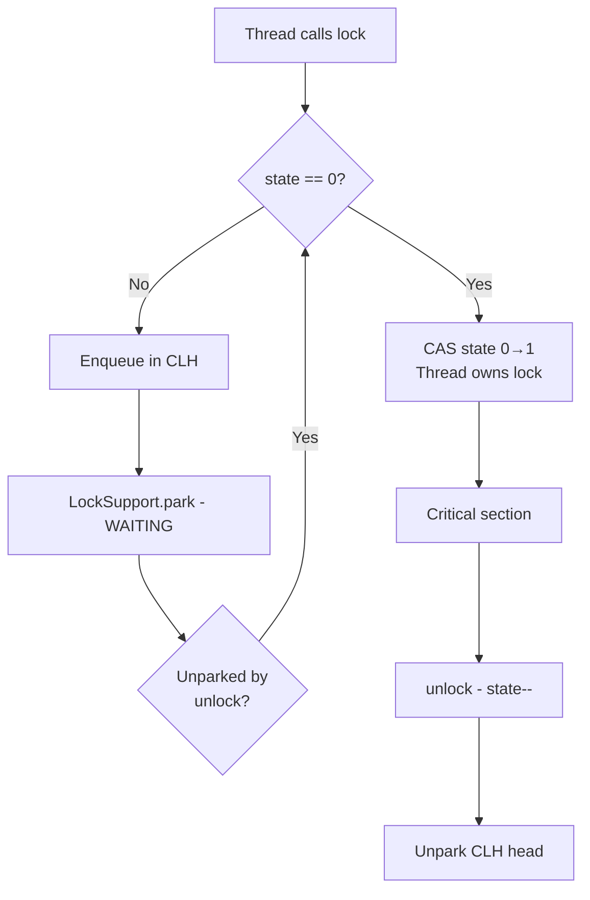
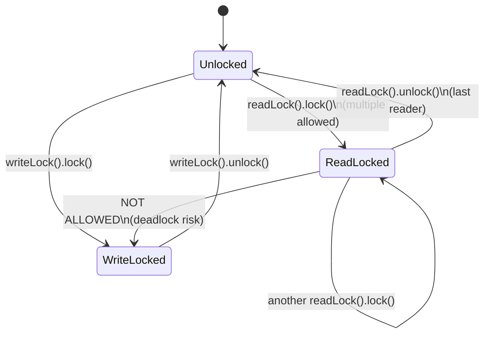
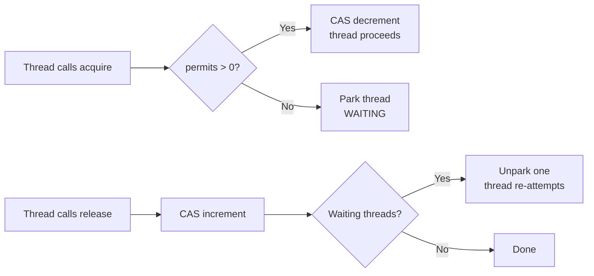
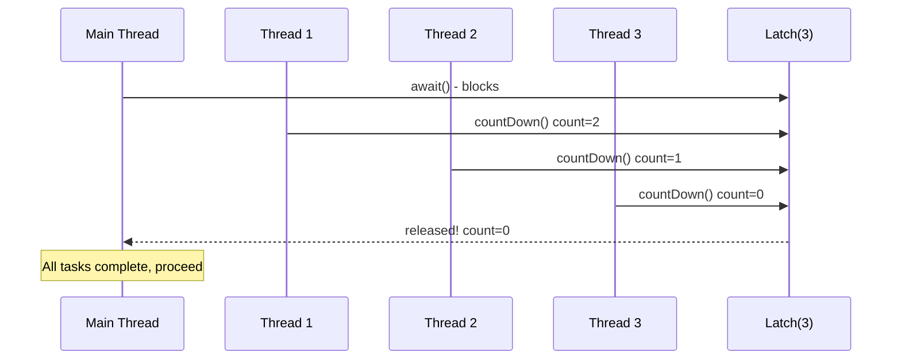
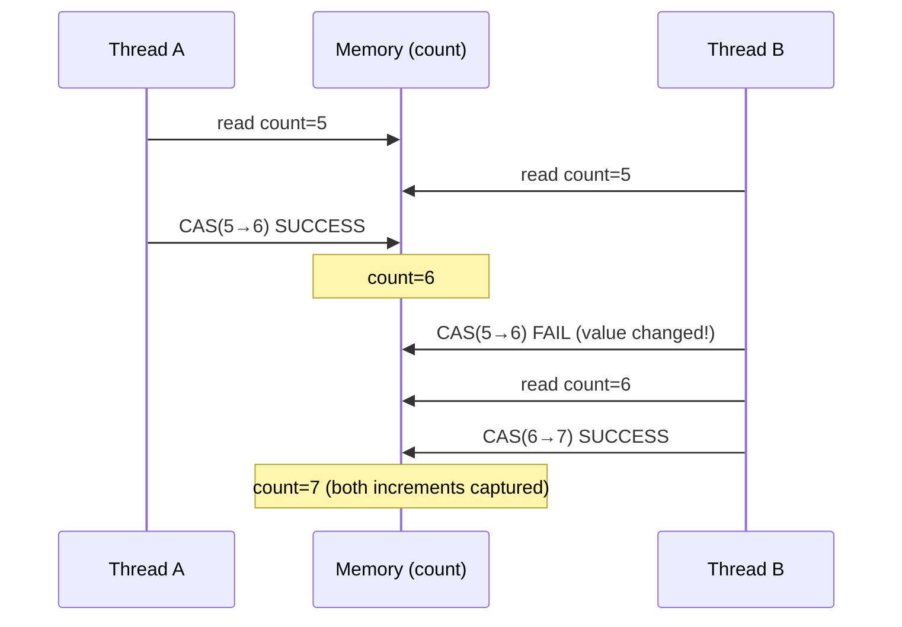

# Java Concurrency - L2 Synchronization

| # | Keyword | Difficulty |
| --- | --- | --- |
| 1 | [ReentrantLock](#reentrantlock) | ★★☆ |
| 2 | [ReadWriteLock](#readwritelock) | ★★☆ |
| 3 | [Semaphore](#semaphore) | ★★☆ |
| 4 | [CountDownLatch and CyclicBarrier](#countdownlatch-and-cyclicbarrier) | ★★☆ |
| 5 | [AtomicInteger and Atomic Variables](#atomicinteger-and-atomic-variables) | ★★☆ |

---

# ReentrantLock

**Interview Weight:** high - The most important java.util.concurrent
lock. Tests knowledge of explicit locking, tryLock, Condition
variables, and when to prefer it over synchronized.

---

### 🎯 Model Answer

**30 seconds:**

> ReentrantLock is a java.util.concurrent.locks.Lock implementation
> that provides the same mutual exclusion as synchronized but with
> additional capabilities: tryLock (non-blocking attempt), timed
> lock acquisition, interruptible waiting, multiple Condition
> variables, and optional fairness. It is always reentrant like
> synchronized. Critical rule: always unlock in a finally block.

**3 minutes (Senior):**

> ReentrantLock and synchronized provide the same fundamental
> guarantee - mutual exclusion with visibility. Choose ReentrantLock
> when synchronized is insufficient for the problem.
>
> Key advantages: tryLock(timeout) enables deadlock avoidance (release
> held locks and retry if the second lock cannot be acquired in time).
> Multiple Condition objects per lock (notFull, notEmpty) enable
> targeted signaling instead of notifyAll() - in a bounded buffer,
> this means waking exactly one producer OR one consumer rather than
> broadcasting to all.
>
> Fairness mode (new ReentrantLock(true)) ensures longest-waiting
> thread acquires next. Prevents starvation at 5-30x throughput cost
> under high contention - fair locks are rarely used in production
> except when starvation is a confirmed problem.
>
> Performance: JDK 9+ synchronized performance is close to
> ReentrantLock for uncontended and low-contention cases due to
> biased locking (deprecated in 15) and lock inflation improvements.
> Prefer synchronized for readability; prefer ReentrantLock when
> its extra features are needed.

**Framework:** NEED TRYLLOCK? -> NEED MULTIPLE CONDITIONS? ->
NEED INTERRUPTIBLE LOCK? -> NEED FAIRNESS? -> Use ReentrantLock

**Blank Mind Recovery:**

**(1) Restate:** "ReentrantLock = explicit lock with superpowers
over synchronized."

**(2) First principles:** "Mutual exclusion, visibility, and
reentrancy - same as synchronized. Extra: non-blocking attempt,
multiple conditions."

**(3) Bridge:** "synchronized is a basic lock on your front door.
ReentrantLock is a smart lock: try-for-5-seconds, three separate
keys for three rooms, interruptible knock."

---

### 📘 Concept Explanation

**What it is:**

ReentrantLock implements java.util.concurrent.locks.Lock. It is
a reentrant mutual exclusion lock. The thread that acquires the lock
can re-acquire it without blocking (hold count increments). Lock
is released when hold count returns to zero.

**The problem it solves:**

synchronized cannot: attempt to acquire without blocking, acquire
with a timeout, release on interrupt while waiting, or use separate
condition queues for different wait conditions. ReentrantLock
provides all of these.

**How it works:**

```
BASIC PATTERN (always use finally for unlock):

ReentrantLock lock = new ReentrantLock();

lock.lock();
try {
    // critical section
} finally {
    lock.unlock();  // ALWAYS in finally - never skip
}

TRYLOCK (non-blocking):

if (lock.tryLock()) {
    try { process(); }
    finally { lock.unlock(); }
} else {
    // lock not available - handle gracefully
}

TRYLOCK WITH TIMEOUT (deadlock avoidance):

boolean acquired = lock.tryLock(100, TimeUnit.MILLISECONDS);
if (!acquired) {
    // release other locks held, back off, retry
}

INTERRUPTIBLE ACQUISITION:

lock.lockInterruptibly();  // throws IE if interrupted while waiting
// useful for responsive shutdown

CONDITION VARIABLES:

Condition notFull  = lock.newCondition();
Condition notEmpty = lock.newCondition();
// Separate queues for producers and consumers
// Signal exactly the right type of waiter
```

**The key insight:**

unlock() must be in a finally block, unconditionally. If the critical
section throws an exception and unlock() is not in finally, the lock
is never released. All competing threads block forever.

**When to use it:**

- tryLock needed (avoidance of blocking, deadlock prevention)
- Multiple condition queues needed (producer-consumer with
  separate notFull/notEmpty conditions)
- Interruptible lock acquisition needed (responsive shutdown)
- Fairness needed (rarely - only when starvation confirmed)

**When NOT to use it:**

- Prefer synchronized when none of the above features are needed -
  it is simpler, more readable, and the compiler/JVM can optimize it
- Do not use ReentrantLock.lock() without a finally-unlock: this is
  worse than synchronized (synchronized auto-releases)
- Do not use fairness mode speculatively - significant throughput cost

**Alternatives:**

- synchronized: simpler, auto-release
- StampedLock: read-heavy workloads with optimistic read path
- ReadWriteLock: separate read and write locks

**First-principles derivation:**

ReentrantLock uses an AbstractQueuedSynchronizer (AQS) internally.
AQS maintains an int state (current hold count) and a CLH queue
(linked list of waiting threads). lock() performs CAS on state;
on contention, the thread is parked via LockSupport.park(). unlock()
decrements state and unparks the head of the queue. This is the same
mechanism underlying all java.util.concurrent synchronizers.

---

### 💻 Code Example

**Example 1: BAD (no finally) vs GOOD (unlock in finally)**

```java
// BAD: unlock not in finally - lock never released if exception thrown
public class UnsafeCache {
    private final ReentrantLock lock = new ReentrantLock();
    private Map<String, Object> cache = new HashMap<>();

    public Object get(String key) {
        lock.lock();
        Object value = cache.get(key);  // what if this throws?
        lock.unlock();  // NEVER REACHED if exception above
        return value;   // All threads block forever after exception
    }
}

// GOOD: unlock always in finally
public class SafeCache {
    private final ReentrantLock lock = new ReentrantLock();
    private final Map<String, Object> cache = new HashMap<>();

    public Object get(String key) {
        lock.lock();
        try {
            return cache.get(key);
        } finally {
            lock.unlock();  // ALWAYS executes, even on exception
        }
    }
}
```

> **Code walkthrough:** HashMap.get() can throw NullPointerException
> if key is null, ConcurrentModificationException from iterator, or
> any other runtime exception. Without finally, unlock() is skipped
> and the ReentrantLock enters a permanent locked state. All threads
> waiting to acquire this lock will block indefinitely. The finally
> block executes regardless of normal return, exception, or even
> Error - the lock is always released.

**Example 2: tryLock for deadlock avoidance**

```java
// GOOD: tryLock with timeout and lock ordering enforcement
public boolean transferFunds(
        Account from, Account to, BigDecimal amount) {
    // Attempt to acquire both locks with timeout
    // Use consistent order to prevent deadlock:
    Account first  = from.id() < to.id() ? from : to;
    Account second = from.id() < to.id() ? to : from;

    boolean firstAcquired  = false;
    boolean secondAcquired = false;
    try {
        firstAcquired  =
            first.lock().tryLock(50, TimeUnit.MILLISECONDS);
        if (!firstAcquired) return false;  // back off

        secondAcquired =
            second.lock().tryLock(50, TimeUnit.MILLISECONDS);
        if (!secondAcquired) return false; // back off

        // both locks held - safe to transfer
        from.debit(amount);
        to.credit(amount);
        return true;
    } catch (InterruptedException e) {
        Thread.currentThread().interrupt();
        return false;
    } finally {
        if (secondAcquired) second.lock().unlock();
        if (firstAcquired)  first.lock().unlock();
    }
}
```

> **Code walkthrough:** The transfer acquires two locks in consistent
> account-ID order (prevents deadlock from lock-order reversal).
> tryLock with timeout: if either lock is unavailable, the method
> returns false immediately rather than blocking indefinitely. The
> caller retries. This prevents deadlock without requiring global lock
> ordering knowledge at call sites. The finally block carefully checks
> which locks were acquired before releasing - if firstAcquired is
> false, attempting to unlock would throw IllegalMonitorStateException.

---

### 🎓 Answers by Seniority

**Junior / Mid (0-5 years):**

> ReentrantLock is like synchronized but with more control. Key
> differences: requires explicit unlock (must be in finally),
> supports tryLock (non-blocking attempt), supports Condition
> variables (multiple wait queues), optional fairness. Use when
> synchronized's features are insufficient.

---

**Senior / Staff (5+ years):**

> I choose between synchronized and ReentrantLock based on feature
> needs. ReentrantLock's tryLock is essential for deadlock-resistant
> multi-resource operations. Multiple Condition variables are critical
> for producer-consumer with distinct wait conditions - they allow
> signal() (targeted) instead of signalAll() (broadcast), improving
> throughput under high concurrency. For read-heavy workloads, I
> consider StampedLock for its optimistic read capability.

---

### ⚠️ Common Misconceptions

| Misconception | Reality | Risk |
| --- | --- | --- |
| "ReentrantLock is always faster than synchronized" | JDK 9+ synchronized is highly optimized; difference is small at low contention | Premature optimization; choosing complexity for no gain |
| "lock() and tryLock() return the same way" | lock() blocks until acquired; tryLock() returns false immediately if unavailable | Using tryLock() and proceeding without checking return value |
| "Fairness prevents starvation at no cost" | Fair lock: throughput drops 5-30x under contention; convoy effect | Using fair lock speculatively - confirmed starvation first |
| "unlock() in catch is sufficient" | catch does not run on normal return; must use finally | Lock leaked when no exception occurs |

---

### 🚨 Failure Modes and Diagnosis

| Failure | Symptom | Root Cause | Diagnostic | Fix |
| --- | --- | --- | --- | --- |
| Lock leaked (no finally) | Application hangs under exception path; all threads BLOCKED | unlock() not in finally block | jstack: all threads BLOCKED on same lock | Wrap critical section in try-finally |
| Deadlock with tryLock retry storm | CPU spike; threads retrying tryLock continuously | All threads keep failing tryLock and retrying without backoff | jstack: threads in tight loops; CPU at 100% | Add exponential backoff before retry; randomize timeout |
| Condition await without while loop | Data corruption; NPE in consumer | Using if instead of while for condition check in await | Add assertion on condition after await returns | Change if to while; re-check condition after every await return |

---

### 🎯 Interview Deep-Dive

| Level | Time | Expected Depth |
| --- | --- | --- |
| Junior | 3 min | synchronized vs ReentrantLock; unlock in finally |
| Mid | 5 min | tryLock; Condition variables; when to use each |
| Senior | 8 min | AQS internals; fairness trade-off; StampedLock comparison |
| Staff | 12 min | Design deadlock-free multi-resource protocol |

---

**Q1** [CONCEPTUAL] [JUNIOR]

"What does ReentrantLock provide that synchronized doesn't?"

**Answer:**

Five capabilities beyond synchronized:

1. tryLock(): attempts to acquire without blocking. Returns true if
   acquired, false if not. Enables lock avoidance: if the lock is
   not available, do something else rather than blocking.

2. tryLock(timeout, unit): waits up to the timeout. Critical for
   deadlock prevention in multi-resource operations.

3. lockInterruptibly(): throws InterruptedException if interrupted
   while waiting for the lock. synchronized cannot be interrupted
   while blocking.

4. Multiple Condition variables: lock.newCondition() creates a
   separate condition queue. Multiple conditions per lock enable
   targeted signaling (signal exactly producers OR consumers,
   not both).

5. Fairness: new ReentrantLock(true) - longest-waiting thread
   gets the lock next. Prevents starvation (at throughput cost).

Everything else (mutual exclusion, visibility, reentrancy) is
the same as synchronized. ReentrantLock requires explicit unlock
in a finally block - forgetting unlock leaks the lock permanently.

*What separates good from great:* Knowing tryLock + Condition
together and the finally-block requirement (the trap that makes
ReentrantLock harder to use correctly).

---

**Q2** [DEBUGGING] [SENIOR]

"How do you diagnose a ReentrantLock deadlock in production?"

**Answer:**

ReentrantLock deadlocks appear in thread dumps as:

```
"thread-1" WAITING on java.util.concurrent.locks.ReentrantLock$...
    at sun.misc.Unsafe.park(Native Method)
    at java.util.concurrent.locks.LockSupport.park(...)
    at java.util.concurrent.locks.AbstractQueuedSynchronizer.parkAndCheckInterrupt
    at java.util.concurrent.locks.AbstractQueuedSynchronizer.acquireQueued
```

Unlike synchronized (shows "waiting to lock <address>"), AQS-based
locks show LockSupport.park in the stack. The lock object is not
directly visible.

Diagnosis approach:
1. Take multiple jstack dumps - confirm threads are consistently
   WAITING (not transient)
2. Look for AQS.parkAndCheckInterrupt in the stack - that is a
   lock contention/deadlock signature
3. Use ReentrantLock diagnostic methods:
   `lock.getOwner()` - which thread holds it
   `lock.getQueuedThreads()` - who is waiting
   `lock.isLocked()` - is it locked?
4. Java Flight Recorder: MonitorEnterEvent + jdk.JavaMonitorWait
   for explicit lock events

Prevention: consistent lock ordering (same as synchronized deadlocks).
Or: use tryLock(timeout) - if timeout elapses, release held locks
and retry rather than blocking indefinitely.

*What separates good from great:* Knowing that AQS-based locks show
LockSupport.park (not "waiting to lock") and knowing the diagnostic
methods on ReentrantLock itself.

---

**Q3** [TRADE-OFF] [SENIOR]

"When would you use StampedLock instead of ReentrantLock?"

**Answer:**

StampedLock for read-heavy workloads where optimistic reads can
avoid lock acquisition entirely.

StampedLock provides three modes:

1. Write lock: exclusive write access (like synchronized write).
   Returns a stamp (long).

2. Read lock: shared read access (multiple readers allowed).
   Returns a stamp.

3. Optimistic read: no lock acquired. Reads the current stamp
   and reads data. Then validates: if stamp hasn't changed
   (no write occurred during the read), the data is consistent.
   If invalidated, upgrade to a proper read lock and retry.

```java
StampedLock lock = new StampedLock();
double x, y;

double distanceFromOrigin() {
    long stamp = lock.tryOptimisticRead();  // no lock!
    double curX = x, curY = y;             // read fields
    if (!lock.validate(stamp)) {           // was it consistent?
        stamp = lock.readLock();           // no: take real lock
        try { curX = x; curY = y; }
        finally { lock.unlockRead(stamp); }
    }
    return Math.sqrt(curX*curX + curY*curY);
}
```

When reads are much more frequent than writes, optimistic reads
avoid cache-line contention entirely for most operations.

Trade-offs vs ReentrantLock:
- StampedLock is NOT reentrant: calling writelock() while holding
  writelock() deadlocks
- No Condition support
- More complex API (stamps must be tracked)
- Upgradeable read lock: readLock() -> tryConvertToWriteLock()

Use StampedLock: read/write ratio >10:1, performance-critical path.
Use ReentrantLock: need Condition, need reentrancy, general cases.

*What separates good from great:* The optimistic read pattern with
validate() and the non-reentrant warning.

---

### ⚖️ Comparison Table

| Feature | synchronized | ReentrantLock | StampedLock |
| --- | --- | --- | --- |
| tryLock / timeout | No | Yes | Yes |
| Multiple Conditions | No (1 implicit) | Yes | No |
| Fairness | No | Optional | No |
| Optimistic read | No | No | Yes |
| Reentrant | Yes | Yes | No (write) |
| Auto-release | Yes | No (need finally) | No (need finally) |
| Best for | Simple critical sections | Advanced features | Read-heavy |

---

### 🏛️ System Design

*(Omit: L2 keyword. Distributed lock patterns (Redis SETNX,
ZooKeeper ephemeral nodes, database advisory locks) are covered
in L4-L5 files.)*

---

### 📊 Diagram

```
REENTRANTLOCK AQS INTERNALS:

state=0 (unlocked)  Thread A: lock() -> CAS(0->1) SUCCESS
                    Thread B: lock() -> CAS(0->1) FAIL
                              -> enqueue in CLH queue
                              -> LockSupport.park()

Thread A: unlock() -> state-- -> 0
                   -> LockSupport.unpark(head of queue)
Thread B: wakes, CAS(0->1) SUCCESS

CLH QUEUE:
  [Thread B] -> [Thread C] -> [Thread D]
  head                         tail

CONDITION VARIABLE:
  lock -------> notFull (Condition)
  lock -------> notEmpty (Condition)
  Producers await on notFull
  Consumers await on notEmpty
  Producer: notEmpty.signal()  <- wakes EXACTLY one consumer
  Consumer: notFull.signal()   <- wakes EXACTLY one producer
```



> **Diagram walkthrough:** AQS uses a CAS on an integer state to
> attempt lock acquisition. On failure, the thread is added to a
> CLH queue (linked list of nodes) and parked via LockSupport.park(),
> which calls the OS to suspend the thread (no busy-waiting). On
> unlock, the lock holder decrements state and unparks the queue
> head, which retries the CAS. Condition variables maintain separate
> linked lists; await() moves the node from the main queue to the
> condition queue; signal() moves it back, where it competes for the
> lock normally.

---

---

# ReadWriteLock

**Interview Weight:** medium - Tests knowledge of concurrent read
optimization and the trade-offs of separate read/write lock semantics.

---

### 🎯 Model Answer

**30 seconds:**

> ReadWriteLock maintains two locks: a read lock (shared - multiple
> readers allowed simultaneously) and a write lock (exclusive - only
> one writer, no concurrent readers). It is optimal when reads are
> more frequent than writes and reads are expensive. If writes are
> frequent, the write lock contention negates the benefit.

**3 minutes (Senior):**

> java.util.concurrent.locks.ReadWriteLock (implemented by
> ReentrantReadWriteLock) allows: multiple threads to hold the
> read lock simultaneously (no mutual exclusion between readers),
> but only one thread to hold the write lock, which excludes all
> readers and other writers.
>
> Read performance advantage: under read-heavy workloads (10+ reads
> per write), readers never block each other - only writers block
> readers, and only during writes. Under synchronized, every read
> blocks all other reads unnecessarily.
>
> Key features of ReentrantReadWriteLock: both read and write locks
> are reentrant, fairness option, downgrade from write to read is
> supported (while holding write lock, acquire read lock, release
> write lock - readers see updated state immediately). Upgrade from
> read to write is NOT supported (causes deadlock).
>
> StampedLock is a better alternative for read-heavy critical paths
> in modern code - its optimistic read avoids even read lock overhead.

**Blank Mind Recovery:**

**(1) Restate:** "ReadWriteLock: readers share, writer excludes."

**(2) First principles:** "Two readers reading the same data never
corrupt it. Only writing corrupts. So: why prevent concurrent reads?"

**(3) Bridge:** "Library: many people can read the same book
simultaneously. But if someone is writing a new edition, no one
can read (or write) until they're done."

---

### 📘 Concept Explanation

**What it is:**

ReadWriteLock: an interface with two methods - readLock() and
writeLock(), each returning a Lock. Multiple threads can hold the
read lock simultaneously. Only one thread can hold the write lock,
and no thread can hold the read lock while the write lock is held.

**The problem it solves:**

synchronized prevents all concurrent access, including concurrent
reads. For a cache or configuration object that is read millions
of times but updated rarely, synchronized makes all reads serialize
unnecessarily. ReadWriteLock allows concurrent reads to proceed in
parallel, improving throughput.

**How it works:**

```
READ LOCK (shared):
  Thread A: rwLock.readLock().lock()   -> OK (no writer)
  Thread B: rwLock.readLock().lock()   -> OK (no writer)
  Thread C: rwLock.writeLock().lock()  -> BLOCKED (readers active)

WRITE LOCK (exclusive):
  Thread A: rwLock.writeLock().lock()  -> OK
  Thread B: rwLock.readLock().lock()   -> BLOCKED
  Thread C: rwLock.writeLock().lock()  -> BLOCKED

LOCK DOWNGRADE (write to read):
  rwLock.writeLock().lock();
  try {
      update();
      rwLock.readLock().lock();  // acquire read while holding write
  } finally {
      rwLock.writeLock().unlock();  // downgrade: release write
  }
  // now holding only read lock - other readers can proceed
  try { readState(); }
  finally { rwLock.readLock().unlock(); }

LOCK UPGRADE (read to write) - NOT SUPPORTED:
  rwLock.readLock().lock();
  rwLock.writeLock().lock();  // DEADLOCK: read held, write waits
```

**The key insight:**

Lock upgrade (read-to-write) is not supported because it would cause
deadlock: if two threads both hold the read lock and both try to
upgrade to write, each waits for the other to release the read lock.

**When to use it:**

- Cache or configuration: rare writes, frequent reads
- In-memory indexes: bulk lookups with occasional updates
- Reference data: loaded once, read constantly

**When NOT to use it:**

- Write-heavy workloads: write lock contention negates benefit
- If reads are very short (nanoseconds): lock overhead exceeds benefit
- Modern Java: prefer StampedLock.tryOptimisticRead() for best performance

**Alternatives:**

- StampedLock: optimistic read (no lock for most reads)
- CopyOnWriteArrayList: safe reads with no locking (writes copy)
- Concurrent collections (ConcurrentHashMap): internal fine-grained locking

**First-principles derivation:**

ReadWriteLock maintains two AQS state fields: read hold count
and write hold count. Write lock acquisition: CAS the hold count
to exclusive. Read lock acquisition: CAS increment the shared count.
Write waits for read count to reach zero; read waits for write to
release. This is more complex than a simple mutex but allows full
read parallelism.

---

### 💻 Code Example

**Example 1: BAD (synchronized for read-heavy cache) vs GOOD (ReadWriteLock)**

```java
// BAD: synchronized blocks all concurrent reads
public class SynchronizedCache<K,V> {
    private final Map<K,V> cache = new HashMap<>();

    // All reads serialize: Thread A read blocks Thread B read!
    public synchronized V get(K key) {
        return cache.get(key);
    }

    public synchronized void put(K key, V value) {
        cache.put(key, value);
    }
}

// GOOD: ReadWriteLock - readers never block each other
public class ReadWriteCache<K,V> {
    private final Map<K,V> cache = new HashMap<>();
    private final ReentrantReadWriteLock rwLock =
        new ReentrantReadWriteLock();
    private final Lock readLock  = rwLock.readLock();
    private final Lock writeLock = rwLock.writeLock();

    public V get(K key) {
        readLock.lock();
        try {
            return cache.get(key);  // concurrent readers OK
        } finally {
            readLock.unlock();
        }
    }

    public void put(K key, V value) {
        writeLock.lock();
        try {
            cache.put(key, value);  // exclusive write
        } finally {
            writeLock.unlock();
        }
    }
}
```

> **Code walkthrough:** With synchronized, 100 concurrent reader
> threads serialize completely - only one reads at a time, though
> reads never conflict. With ReadWriteLock, all 100 readers proceed
> simultaneously. The write lock serializes writes and blocks readers
> during the write. For a cache with 100:1 read/write ratio, this
> can improve read throughput by 50-80x under load. The finally
> blocks are essential on both locks - always unlock in finally.

---

### 🎓 Answers by Seniority

**Junior / Mid (0-5 years):**

> ReadWriteLock has two locks: read (shared, multiple readers
> allowed) and write (exclusive, blocks all others). Best for
> read-heavy data like caches. If writes are rare, many readers
> can proceed in parallel - much better than synchronized which
> serializes all access including reads.

---

**Senior / Staff (5+ years):**

> ReadWriteLock is the right tool for read-heavy structures with
> rare updates. I typically benchmark before applying: if reads
> take microseconds and write ratio is >10%, the benefit may be
> marginal. For modern Java, StampedLock's optimistic read path
> is even better - zero lock overhead for reads when there are
> no concurrent writes. ConcurrentHashMap with its striped internal
> locking is already read-optimized for map use cases.

---

### ⚠️ Common Misconceptions

| Misconception | Reality | Risk |
| --- | --- | --- |
| "Read lock prevents all other access" | Read lock only blocks writers; other readers proceed freely | Unnecessary use of write lock for reads |
| "Lock upgrade (read to write) is supported" | NOT supported - causes deadlock | Application hangs permanently |
| "ReadWriteLock is always faster than synchronized" | Only if read frequency >> write frequency; write lock is expensive | Using it in write-heavy scenarios is slower |

---

### 🚨 Failure Modes and Diagnosis

| Failure | Symptom | Root Cause | Diagnostic | Fix |
| --- | --- | --- | --- | --- |
| Read starvation | Readers never acquire when writers arrive | Unfair lock; writers keep arriving before readers re-acquire | jstack: readers BLOCKED for long periods; add fairness | new ReentrantReadWriteLock(true) for fairness |
| Lock upgrade deadlock | Application freezes with two threads WAITING | Both threads hold read lock and try to acquire write lock | jstack: two threads in WAITING on AQS; both hold read | Never upgrade read-to-write; use write lock from the start |

---

### 🎯 Interview Deep-Dive

| Level | Time | Expected Depth |
| --- | --- | --- |
| Junior | 2 min | Read vs write lock; concurrent readers |
| Mid | 4 min | When to use; downgrade (not upgrade); vs synchronized |
| Senior | 7 min | StampedLock comparison; starvation; benchmarking |

---

**Q1** [CONCEPTUAL] [MID]

"When would you use ReadWriteLock over synchronized?"

**Answer:**

Use ReadWriteLock when: (1) reads are much more frequent than writes
(10:1 ratio or higher), (2) reads are not trivially short (otherwise
lock overhead dominates), (3) read correctness requires data consistency
(not ok to read during partial write).

The benefit: multiple threads can hold the read lock simultaneously,
so read-heavy workloads see near-linear throughput scaling with
thread count. synchronized serializes all access, so 100 reader
threads get the same throughput as 1.

Do NOT use when: writes are frequent (write lock contention negates
the benefit), or reads are nanosecond-level (lock overhead > saved time).

Alternative to consider: ConcurrentHashMap already implements
read-optimized concurrent access internally. StampedLock adds
optimistic reads (no lock at all for most reads).

*What separates good from great:* Mentioning benchmarking before
applying - the benefit depends on actual read/write ratio and read duration.

---

**Q2** [TRADE-OFF] [SENIOR]

"ReadWriteLock vs StampedLock for a read-heavy cache - which do you choose?"

**Answer:**

For a read-heavy cache with infrequent updates, StampedLock is
faster but more complex.

ReadWriteLock approach: readers acquire read lock (CAS increment),
read data, release (CAS decrement). Writers acquire write lock
(wait for readers to drain), update, release. Under 100 readers:
all readers CAS the shared read-count, causing cache contention.

StampedLock optimistic read: no CAS at all. Read the current stamp,
read the data, validate the stamp. If no write occurred, the data
is consistent. No lock acquisition, no CAS, no cache line contention.
Validate() is just reading an int and comparing - nearly free.

Performance difference: at 100 concurrent readers with rare writes,
StampedLock optimistic reads can be 5-10x faster than ReadWriteLock
because there is zero shared-memory contention on reads.

When optimistic read fails (write occurred during read):
```java
long stamp = lock.tryOptimisticRead();
double x = this.x; double y = this.y;
if (!lock.validate(stamp)) {
    stamp = lock.readLock();  // fall back to full read lock
    try { x = this.x; y = this.y; }
    finally { lock.unlockRead(stamp); }
}
```

Trade-off: StampedLock is NOT reentrant, has no Condition support,
and the stamp-based API is more error-prone. For most application
code, ReadWriteLock is the right choice. StampedLock for library
code or confirmed performance bottleneck.

*What separates good from great:* Knowing WHY StampedLock is faster
(no CAS on read, no cache line contention) rather than just "it's newer."

---

### ⚖️ Comparison Table

| Feature | synchronized | ReadWriteLock | StampedLock |
| --- | --- | --- | --- |
| Concurrent readers | No | Yes | Yes (optimistic) |
| Read lock cost | Full mutex | CAS on shared count | Near-zero (validate) |
| Write lock | Full mutex | Full exclusive | Full exclusive |
| Upgrade read->write | N/A | No (deadlock) | tryConvertToWriteLock |
| Downgrade write->read | N/A | Yes | Yes |
| Reentrant | Yes | Yes | No (write) |
| Conditions | 1 (wait/notify) | Via explicit Lock | No |

---

### 🏛️ System Design

*(Omit: L2 keyword. Distributed caching patterns (Redis read replica,
cache-aside, read-through) appear in L5 files.)*

---

### 📊 Diagram

```
READWRITELOCK ACCESS MATRIX:

             Read Lock    Write Lock
Read Lock:   ALLOWED      BLOCKED
Write Lock:  BLOCKED      BLOCKED

CONCURRENT READS (no writer):
  Thread A [=READ====]
  Thread B   [=READ=====]
  Thread C      [=READ==]
  (all proceed in parallel)

WRITE BLOCKS ALL:
  Thread A [=READ====]   <- must finish first
  Thread B               [=WRITE=]
  Thread C                        [=READ==]
  (C blocked during write)
```



> **Diagram walkthrough:** The access matrix shows the key rule:
> read+read is allowed (concurrent reads), but any combination
> involving write is exclusive. The timeline shows that all readers
> can proceed simultaneously without serialization. A writer must
> wait for all current readers to release before acquiring the write
> lock. After the write completes, readers can proceed again. The
> state diagram highlights that read-to-write upgrade is explicitly
> prohibited - it would require waiting for yourself to release the
> read lock, which never happens.

---

---# Semaphore

**Interview Weight:** medium - Tests knowledge of resource-bounded
concurrency. The canonical use case is a connection pool or rate
limiter.

---

### 🎯 Model Answer

**30 seconds:**

> A Semaphore controls access to a finite pool of resources by
> maintaining a count of available permits. acquire() blocks until
> a permit is available, then decrements the count. release()
> increments the count and signals waiting threads. With N=1, it
> behaves like a mutex. With N>1, it allows N concurrent accesses.

**3 minutes (Senior):**

> Semaphore is the right tool when you need to limit concurrency to
> a bounded number: connection pools (max 10 DB connections),
> rate limiters (max N concurrent HTTP requests), thread throttling
> (max N parallel downloads). It generalizes binary (mutex) locking
> to N-ary access control.
>
> Unlike ReentrantLock, Semaphore is NOT reentrant: calling acquire()
> twice without release() will block on the second call if the
> permit count hits zero. Also unlike locks, any thread can call
> release() - not just the thread that called acquire(). This enables
> producer-consumer signaling patterns (one thread releases permits
> another acquires).
>
> Fairness option: new Semaphore(N, true) - threads acquire in
> FIFO order. Fair semaphores prevent starvation in rate-limiting
> scenarios where some threads might otherwise never get permits.
> Cost: reduced throughput under high contention.

**Blank Mind Recovery:**

**(1) Restate:** "Semaphore: a counting lock for bounded concurrency."

**(2) First principles:** "N permits = N concurrent holders allowed.
acquire takes a permit; release returns one."

**(3) Bridge:** "Like a parking lot with N spaces. Cars (threads)
enter if a space is available; wait if full; leave and free a space
when done."

---

### 📘 Concept Explanation

**What it is:**

Semaphore: a concurrency utility that maintains a count of permits.
acquire() atomically decrements the count (blocks if zero).
release() increments the count and wakes waiting threads.
Any thread can release (not just the one that acquired).

**The problem it solves:**

Some resources have a fixed capacity (database connection pools,
API rate limits, file descriptor limits). Semaphore enforces that
capacity: at most N concurrent users of the resource.

**How it works:**

```
SEMAPHORE BASICS:
  Semaphore sem = new Semaphore(3);  // 3 permits

  Thread A: sem.acquire() -> permits: 2
  Thread B: sem.acquire() -> permits: 1
  Thread C: sem.acquire() -> permits: 0
  Thread D: sem.acquire() -> BLOCKED (no permits)

  Thread A: sem.release() -> permits: 1
  Thread D: wakes, acquires -> permits: 0

TRYACQUIRE (non-blocking):
  if (sem.tryAcquire()) {
      try { use resource; }
      finally { sem.release(); }
  } else {
      // resource not available, handle gracefully
  }

FAIRNESS:
  new Semaphore(N, true)  // fair: FIFO acquisition order
  new Semaphore(N, false) // unfair (default): higher throughput
```

**The key insight:**

Semaphore release() is NOT restricted to the thread that acquired.
This is intentional and enables signaling patterns: one thread
acquires N permits (empties the semaphore); another thread
releases 1 (signals); the first thread wakes. This is how
binary semaphores implement producer-consumer signaling.

**When to use it:**

- Connection pool: max N concurrent database connections
- Rate limiter: max N concurrent inflight HTTP requests
- Worker throttle: max N parallel file I/O operations

**When NOT to use it:**

- Do not use as a lock: Semaphore is not reentrant; double acquire()
  deadlocks
- Do not forget release() in finally: leaked permit means capacity
  permanently reduced
- Prefer higher-level utilities (BlockingQueue, ExecutorService
  with bounded pool) when available

**Alternatives:**

- ExecutorService with bounded pool: limits concurrent threads
  (similar effect for thread-based resources)
- RateLimiter (Guava): token bucket algorithm for rate limiting
- @Bulkhead (Resilience4j): adaptive semaphore for microservices

**First-principles derivation:**

Semaphore's acquire/release are CAS operations on a permit counter
(using AQS). acquire(): CAS decrement; if counter=0, park the thread.
release(): CAS increment; if threads are waiting, unpark one. This
is Dijkstra's P/V operations (Passeren/Vrijgeven) from 1965,
now implemented with lock-free CAS instead of OS blocking.

---

### 💻 Code Example

**Example 1: Connection pool with Semaphore**

```java
// BAD: unbounded concurrent connections
public class UnboundedPool {
    private final Queue<Connection> pool =
        new ConcurrentLinkedQueue<>();

    public Connection get() {
        // no limit - 1000 threads = 1000 concurrent connections
        return pool.poll();  // may return null (pool exhausted)
    }
}

// GOOD: Semaphore-bounded connection pool
public class BoundedConnectionPool {
    private final int maxConnections = 10;
    private final Semaphore available =
        new Semaphore(maxConnections, true); // fair
    private final Queue<Connection> pool =
        new ArrayBlockingQueue<>(maxConnections);

    public BoundedConnectionPool() {
        // pre-populate pool with maxConnections connections
        for (int i = 0; i < maxConnections; i++) {
            pool.add(createConnection());
        }
    }

    public Connection acquire()
            throws InterruptedException {
        available.acquire();  // blocks if none available
        return pool.poll();   // guaranteed non-null after acquire
    }

    public void release(Connection conn) {
        pool.offer(conn);
        available.release();  // signal waiting threads
    }
}
```

> **Code walkthrough:** The semaphore with 10 permits enforces the
> connection limit: the 11th thread calling acquire() blocks until
> a connection is released. The semaphore and the pool size are
> synchronized (both initialized to maxConnections). After acquire()
> returns, pool.poll() is guaranteed to return a connection because
> one was reserved by the semaphore. The release() adds the connection
> back to the pool before calling semaphore.release() - this ensures
> the connection is available before a waiting thread wakes.

---

### 🎓 Answers by Seniority

**Junior / Mid (0-5 years):**

> Semaphore has N permits. acquire() decrements (blocks if zero).
> release() increments. Useful for limiting concurrency: max N
> threads accessing a resource simultaneously. Unlike ReentrantLock,
> any thread can release (not just the acquirer).

---

**Senior / Staff (5+ years):**

> Semaphore is the primitive for capacity enforcement. In production,
> I use it for connection pool management, request throttling, and
> bulkhead patterns. For complex rate limiting (token bucket with
> burst allowance), Guava RateLimiter or Resilience4j Bulkhead are
> better. The key detail: release() in finally, and size the semaphore
> to match the actual resource capacity.

---

### ⚠️ Common Misconceptions

| Misconception | Reality | Risk |
| --- | --- | --- |
| "Semaphore is reentrant like ReentrantLock" | NOT reentrant - double acquire() without release = deadlock | Thread deadlocks itself |
| "Only the acquiring thread can release" | Any thread can release - intentional for signaling patterns | Over-releasing: more permits than capacity |
| "tryAcquire always returns immediately" | tryAcquire() returns immediately; tryAcquire(timeout) waits | Choosing wrong variant causes unexpected blocking |

---

### 🚨 Failure Modes and Diagnosis

| Failure | Symptom | Root Cause | Diagnostic | Fix |
| --- | --- | --- | --- | --- |
| Permit leak | Capacity degrades over time; fewer threads can access resource | acquire() without matching release() in finally | Semaphore.availablePermits() decreasing over time | Add release() to finally block |
| Over-release | More permits than initial capacity; more threads than limit | release() called too many times | Semaphore.availablePermits() > initial N | Track acquire/release pairs; assert availablePermits <= N |
| Starvation in unfair mode | Some threads never acquire under high contention | Default non-fair semaphore; new arrivals may steal permits | Measure time-to-acquire per thread; some threads show very high latency | new Semaphore(N, true) for fair ordering |

---

### 🎯 Interview Deep-Dive

| Level | Time | Expected Depth |
| --- | --- | --- |
| Junior | 2 min | acquire/release; use case |
| Mid | 4 min | vs mutex; not reentrant; tryAcquire |
| Senior | 7 min | Connection pool design; fairness; permit leak prevention |

---

**Q1** [CONCEPTUAL] [JUNIOR]

"What is a Semaphore and when would you use it?"

**Answer:**

A Semaphore is a concurrency utility that controls access to a
finite set of resources. It maintains a count of available permits.

acquire(): atomically decrements the permit count. Blocks if count
is zero (no permits available) until another thread releases one.

release(): increments the permit count and signals waiting threads.

Use cases:
- Database connection pool: Semaphore(10) limits concurrent connections
- HTTP request throttling: Semaphore(100) limits inflight requests
- File I/O throttling: Semaphore(5) limits concurrent file operations

With N=1, Semaphore is a binary semaphore - functionally a mutex
but NOT reentrant (unlike ReentrantLock). A thread calling acquire()
twice without release() will deadlock.

Semaphore is NOT reentrant and has no concept of "owner thread" -
any thread can call release(), even a thread that never called
acquire(). This makes it useful for signaling (one thread waits;
another thread signals).

*What separates good from great:* Mentioning that Semaphore is not
reentrant and any thread can release - the two key differences from ReentrantLock.

---

**Q2** [TRADE-OFF] [SENIOR]

"How does Semaphore differ from limiting thread pool size?"

**Answer:**

Both limit concurrent access but at different layers.

Semaphore limits concurrent resource usage regardless of threads.
100 threads may all call acquire() for a semaphore with N=10: only
10 proceed, 90 block. The threads still exist and consume stack memory.

Bounded thread pool (ExecutorService with fixed size): limits the
number of threads active in the pool. Only N threads run; additional
tasks queue. Threads not in the pool do not exist yet.

When to use Semaphore:
- The client threads already exist (request handlers in a web server)
  and need to share a limited resource (DB connections)
- You need non-blocking tryAcquire() (reject if at capacity)
- Multiple different resources with different limits

When to use bounded thread pool:
- Creating tasks for background processing where you control
  the number of threads from the start
- Task parallelism with bounded concurrency (parallel file processing)

Combination: bounded thread pool (limits thread count for CPU) +
Semaphore (limits DB connection count) - these address different
resources independently.

*What separates good from great:* Explaining that Semaphore limits
resource access while thread pools limit thread count - these are
orthogonal concerns.

---

### ⚖️ Comparison Table

| Feature | Semaphore | ReentrantLock | synchronized |
| --- | --- | --- | --- |
| Permit count | N (configurable) | 1 | 1 |
| Reentrant | No | Yes | Yes |
| Owner required for release | No (any thread) | Yes | Yes |
| Non-blocking attempt | tryAcquire() | tryLock() | No |
| Fairness option | Yes | Yes | No |
| Use case | Resource capacity | Critical section | Critical section |

---

### 🏛️ System Design

*(Omit: L2 keyword. Bulkhead patterns in microservices (Resilience4j,
Istio circuit breaker) and distributed rate limiting appear in L5.)*

---

### 📊 Diagram

```
SEMAPHORE PERMIT MODEL (N=3):

Initial: [*][*][*]  (3 permits)

Thread A acquire: [*][*][ ]   count=2
Thread B acquire: [*][ ][ ]   count=1
Thread C acquire: [ ][ ][ ]   count=0
Thread D acquire: BLOCKED (count=0, waits)

Thread A release: [*][ ][ ]   count=1
Thread D wakes:   [ ][ ][ ]   count=0 (D acquired)
```



> **Diagram walkthrough:** The permit model shows four threads: A,
> B, and C each acquire a permit until count reaches zero. Thread D
> parks (WAITING). When Thread A releases, count increments to 1 and
> Thread D is unparked. D acquires (CAS decrement back to 0). The
> flowchart shows the CAS-based acquire/release: non-blocking when
> permits are available, park-and-retry when count is zero.

---

---

# CountDownLatch and CyclicBarrier

**Interview Weight:** medium - Tests knowledge of thread coordination
primitives for one-shot and repeatable barriers.

---

### 🎯 Model Answer

**30 seconds:**

> CountDownLatch is a one-shot latch: initialized with a count, it
> counts down on each countDown() call. await() blocks until count
> reaches zero. Not reusable. CyclicBarrier lets a fixed number of
> threads wait at a barrier point, then releases all and resets for
> reuse. Use CountDownLatch for "wait for N events"; use CyclicBarrier
> for "N threads synchronize at a checkpoint repeatedly."

**3 minutes (Senior):**

> CountDownLatch models a gate: initialized at N, each countDown()
> decrements. await() blocks until the count reaches zero. Common
> patterns: a test waits for N background tasks to complete
> (countDown in each task, await in the test), or an app waits for
> N services to initialize before accepting requests.
>
> CyclicBarrier: N parties each call await(). When all N have called
> await(), the barrier trips: all threads are released simultaneously.
> Optional barrier action (Runnable) runs before release. Automatically
> resets for the next phase. Broken state: if one thread is interrupted,
> all waiting threads throw BrokenBarrierException.
>
> Key difference: CountDownLatch counts events (countDown() can be
> called by any thread, any number of times up to N). CyclicBarrier
> counts parties (threads): each thread is a party and calls await()
> exactly once per phase.

**Blank Mind Recovery:**

**(1) Restate:** "CountDownLatch = one-shot countdown gate.
CyclicBarrier = repeatable multi-thread checkpoint."

**(2) First principles:** "Coordination: some threads need to wait
for others. CountDownLatch: wait for N events. CyclicBarrier: wait
until all threads reach the same point."

**(3) Bridge:** "CountDownLatch = starting pistol that fires when
N runners confirm ready. CyclicBarrier = checkpoint in a relay race:
all runners must reach checkpoint before next leg starts."

---

### 📘 Concept Explanation

**What it is:**

CountDownLatch: initialized with a count N. countDown() decrements.
await() blocks until count == 0. Non-resettable (one-shot).
The count cannot go up, only down.

CyclicBarrier: initialized with N parties. await() blocks until
all N parties call await(). Then all are released. Optional
barrierAction Runnable runs when barrier trips. Auto-resets.

**The problem it solves:**

CountDownLatch: "start after N services are ready" or "wait for
N parallel tasks to complete." CyclicBarrier: "all threads must
reach phase N before any can start phase N+1" (phased computation,
parallel simulation steps).

**How it works:**

```
COUNTDOWNLATCH:
  CountDownLatch latch = new CountDownLatch(3);

  // Worker threads:
  executor.submit(() -> { work(); latch.countDown(); });
  executor.submit(() -> { work(); latch.countDown(); });
  executor.submit(() -> { work(); latch.countDown(); });

  latch.await();         // blocks until all 3 countDown()
  latch.await(5, SECONDS); // with timeout
  // NOT reusable - count stays 0

CYCLICBARRIER:
  CyclicBarrier barrier = new CyclicBarrier(3, () -> {
      // optional: runs when all 3 reach the barrier
      System.out.println("Phase complete");
  });

  // Each of 3 threads:
  barrier.await();  // blocks until 3 call await()
  // all 3 released, barrier resets, repeat next phase

BROKEN BARRIER:
  // If one thread in CyclicBarrier throws, others get:
  // BrokenBarrierException
```

**The key insight:**

CountDownLatch count can be reduced by any thread (not just the
waiting thread). CyclicBarrier requires exactly N parties to call
await() - each is a participant, not just a counter.

**When to use it:**

- CountDownLatch: test setup (wait for server ready), service startup
  gate, parallel task completion aggregation
- CyclicBarrier: parallel computation phases (matrix multiplication
  steps), simulation turns, tournament bracket rounds

**When NOT to use it:**

- CountDownLatch: do not reuse (create a new one); for repeated
  coordination, use CyclicBarrier or Phaser
- CyclicBarrier: do not use if parties may vary per phase; use
  Phaser (most flexible, variable party count)

**Alternatives:**

- Phaser: flexible; variable party count, phase advance, registration
- CompletableFuture.allOf(): wait for multiple async results
- ExecutorService.invokeAll(): parallel task execution + await

**First-principles derivation:**

CountDownLatch uses AQS state as the count; countDown() CAS decrements;
await() acquires shared if count==0 (returns immediately) or parks.
When count reaches zero, all waiting threads are unparked. CyclicBarrier
uses ReentrantLock + Condition: each await() decrements a local counter
and calls Condition.await() if not last; the last thread runs the
barrier action and calls Condition.signalAll().

---

### 💻 Code Example

**Example 1: CountDownLatch for parallel test setup**

```java
// BAD: sequential initialization (slow)
public void setup() {
    initDatabase();      // 2 seconds
    initCache();         // 1 second
    initMessageBroker(); // 1 second
    // Total: 4 seconds - could be parallel!
}

// GOOD: parallel initialization with CountDownLatch
public void setup() throws InterruptedException {
    CountDownLatch ready = new CountDownLatch(3);
    ExecutorService init = Executors.newFixedThreadPool(3);

    init.submit(() -> {
        try { initDatabase(); }
        finally { ready.countDown(); }
    });
    init.submit(() -> {
        try { initCache(); }
        finally { ready.countDown(); }
    });
    init.submit(() -> {
        try { initMessageBroker(); }
        finally { ready.countDown(); }
    });

    ready.await(10, TimeUnit.SECONDS);  // timeout safety
    // Total: max(2, 1, 1) = 2 seconds
    init.shutdown();
}
```

> **Code walkthrough:** The three initialization tasks run in
> parallel; the main thread waits on the latch until all three
> count down. Total time is the maximum (2 seconds), not the sum
> (4 seconds). The countDown() in a finally block ensures it always
> fires even if initialization throws. The 10-second timeout prevents
> hanging if a task fails silently. After await(), all services are
> ready and the setup method returns.

**Example 2: CyclicBarrier for parallel simulation phases**

```java
// GOOD: CyclicBarrier for phased parallel computation
int parties = 4;
CyclicBarrier barrier = new CyclicBarrier(parties, () ->
    System.out.println("Phase complete, starting next"));

for (int i = 0; i < parties; i++) {
    final int threadId = i;
    pool.submit(() -> {
        for (int phase = 0; phase < 10; phase++) {
            computePhase(threadId, phase);
            try {
                barrier.await();  // wait for all to finish phase
                // All 4 threads released; barrier resets; next phase
            } catch (BrokenBarrierException e) {
                // another thread was interrupted; abort
                return;
            } catch (InterruptedException e) {
                Thread.currentThread().interrupt();
                return;
            }
        }
    });
}
```

> **Code walkthrough:** Each thread computes its portion of a phase
> and waits at the barrier. The barrier trips when all 4 call await()
> - the barrier action prints "Phase complete" - then all 4 are
> released to start the next phase simultaneously. Without the barrier,
> faster threads would start phase 2 while slow threads are still on
> phase 1, corrupting shared phase-dependent state. BrokenBarrierException
> propagates to all waiters when one thread is interrupted.

---

### 🎓 Answers by Seniority

**Junior / Mid (0-5 years):**

> CountDownLatch: countdown from N, await() blocks until zero.
> One-shot, not reusable. CyclicBarrier: N parties all call await(),
> then all released together, auto-resets. Use CountDownLatch for
> "wait for N events"; CyclicBarrier for "all threads reach checkpoint."

---

**Senior / Staff (5+ years):**

> For one-shot event coordination: CountDownLatch (simpler, no reset).
> For repeating phases: CyclicBarrier (auto-reset) or Phaser (most
> flexible - variable parties, advance/arrive separate from await).
> In production, CompletableFuture.allOf() often replaces CountDownLatch
> for async results - it returns a CompletableFuture that completes
> when all supplied futures complete.

---

### ⚠️ Common Misconceptions

| Misconception | Reality | Risk |
| --- | --- | --- |
| "CountDownLatch can be reset" | No reset - one-shot; create new instance if needed | Logic error when reusing the same latch |
| "CyclicBarrier works with any number of parties" | Must be exactly N parties per phase; fewer causes permanent wait | Threads waiting forever if one party is dropped |
| "await() in CountDownLatch throws checked exception" | await() throws InterruptedException - must handle | Compilation error or swallowed exception |

---

### 🚨 Failure Modes and Diagnosis

| Failure | Symptom | Root Cause | Diagnostic | Fix |
| --- | --- | --- | --- | --- |
| Latch never counted down | await() waits forever | countDown() not called on exception path (missing finally) | Add logging before each countDown(); check thread exceptions | countDown() in finally block |
| CyclicBarrier broken | BrokenBarrierException on all waiters | One thread threw InterruptedException; barrier enters broken state | Log thread interruption; check which thread failed | Handle interruption per party; reset barrier or recreate |
| Timeout in await | await(timeout) returns false | Tasks take longer than expected | Measure task durations; trace which task is slow | Increase timeout; fix slow task |

---

### 🎯 Interview Deep-Dive

| Level | Time | Expected Depth |
| --- | --- | --- |
| Junior | 2 min | What each does; one-shot vs cyclic |
| Mid | 4 min | Code patterns; BrokenBarrierException; vs CompletableFuture.allOf |
| Senior | 7 min | Phaser; parallel task pattern; broken state handling |

---

**Q1** [COMPARISON] [MID]

"CountDownLatch vs CyclicBarrier - when do you use each?"

**Answer:**

CountDownLatch: one-shot event gate. Use when waiting for N events
to occur before proceeding. Events may come from different threads
at different times. The count can only go down (not up). Not reusable.

Best for: parallel initialization (wait for N services to start),
test synchronization (wait for background threads to complete),
starting signal (count down to 0, then release all waiting threads).

CyclicBarrier: repeating rendezvous point. N threads all call await();
when all N have arrived, they are released simultaneously and the
barrier resets. The N parties must ALL participate in each phase.

Best for: phased computation (all threads complete phase N before
any starts phase N+1), simulation turns, parallel batch processing
with inter-phase synchronization.

Key distinction: CountDownLatch counts down external events
(countDown() called by various threads). CyclicBarrier counts
party arrivals (each party calls await() exactly once per phase).

Practical alternative: CompletableFuture.allOf() replaces many
CountDownLatch use cases with a cleaner API and future composition.

*What separates good from great:* Knowing Phaser as the most flexible
alternative (handles variable party counts and complex phase protocols).

---

### ⚖️ Comparison Table

| Feature | CountDownLatch | CyclicBarrier | Phaser |
| --- | --- | --- | --- |
| Reusable | No | Yes (auto-reset) | Yes |
| Parties variable | N/A | No | Yes |
| Barrier action | No | Yes (Runnable) | Yes (advance) |
| Exception handling | await returns false | BrokenBarrierException | Phaser.forceTermination |
| Best for | One-shot wait | Repeating phases | Complex phasing |

---

### 🏛️ System Design

*(Omit: L2 keyword. Distributed barrier patterns (ZooKeeper barrier,
Redis synchronization primitives) appear in L5 files.)*

---

### 📊 Diagram

```
COUNTDOWNLATCH:
  latch = CountDownLatch(3)
  T1: countDown() -> count=2
  T2: countDown() -> count=1
  T3: countDown() -> count=0 -> GATE OPENS
  Main: await() -> BLOCKED ... -> RELEASED

CYCLICBARRIER (N=3):
  Phase 1:
  T1: await() -> WAITING
  T2: await() -> WAITING
  T3: await() -> barrier TRIPS, action runs, all RELEASED
  Phase 2: [auto-reset, repeat]
```



> **Diagram walkthrough:** The latch starts at 3. Three workers each
> call countDown() at different times (they may complete in any order).
> When the third countDown() fires (count hits zero), the latch
> releases the main thread immediately. The one-way nature is shown:
> count only decreases; there is no reset. For CyclicBarrier, the
> pattern would show threads meeting at the barrier, the action firing,
> all releasing, then the barrier resetting for the next phase.

---

---

# AtomicInteger and Atomic Variables

**Interview Weight:** high - Lock-free programming foundations.
Tests CAS mechanics, when atomics are appropriate, and their
limitations versus locks.

---

### 🎯 Model Answer

**30 seconds:**

> AtomicInteger and the java.util.concurrent.atomic package provide
> lock-free atomic operations on single variables using compare-and-swap
> (CAS). CAS reads the current value, computes a new value, and
> atomically writes the new value only if the current matches the
> expected. No thread blocks - failed CAS operations retry.

**3 minutes (Senior):**

> CAS (compareAndSet) is a single CPU instruction: read-compare-write
> atomically. AtomicInteger.incrementAndGet() compiles to a CAS loop:
> read current, compute current+1, CAS(current, current+1). If another
> thread changes the value between the read and CAS, the CAS fails
> and the loop retries with the new current value. No thread ever
> blocks; failed threads retry.
>
> AtomicInteger for simple counters; AtomicReference for reference
> replacement (publish updated immutable config); AtomicIntegerArray
> for array elements. Java 8+ adds LongAdder and LongAccumulator for
> high-contention scenarios: LongAdder distributes increments across
> internal cells, merging on sum() - dramatically better under many
> concurrent threads.
>
> Limitation: atomics work on single variables. If two variables
> must be updated atomically together, you need a lock. AtomicReference
> to an immutable snapshot can update multiple fields atomically:
> replace the entire snapshot object with compareAndSet().

**Framework:** SINGLE VARIABLE + COMPOUND OP -> atomic.
MULTIPLE VARIABLES -> lock or atomic snapshot reference.

**Blank Mind Recovery:**

**(1) Restate:** "Atomics: lock-free atomic single-variable ops."

**(2) First principles:** "CAS is a CPU instruction: read-compare-write
as one uninterruptible unit. Either succeeds or fails; never partial."

**(3) Bridge:** "Like a bank check with a 'spoils if altered' seal:
if the balance changed since you read it, your transaction is voided
and you try again with the new balance."

---

### 📘 Concept Explanation

**What it is:**

java.util.concurrent.atomic: a package of lock-free atomic variable
wrappers. AtomicInteger, AtomicLong, AtomicBoolean, AtomicReference,
AtomicIntegerArray, LongAdder, LongAccumulator, and more.

All use CAS (compare-and-swap) as the underlying mechanism.
CAS is a CPU instruction (CMPXCHG on x86) that atomically:
read current value, compare to expected, write new value if equal.

**The problem it solves:**

synchronized for a single counter is heavyweight (monitor acquire,
memory barriers, potential thread blocking). CAS provides atomicity
without blocking - threads that fail a CAS retry, never park.
Under low-to-moderate contention, CAS is 5-20x faster than synchronized.

**How it works:**

```
CAS LOOP (AtomicInteger.incrementAndGet):
  do {
      current = get();       // read
      next = current + 1;    // compute
  } while (!compareAndSet(current, next));  // CAS
  return next;
  // If CAS fails (another thread changed value), retry
  // Cannot lose an update: CAS loop retries until it wins

COMPARE-AND-SET:
  boolean compareAndSet(int expected, int update) {
      // ATOMIC: if current == expected, set to update, return true
      // If current != expected, do nothing, return false
      // Hardware: single CMPXCHG instruction, uninterruptible
  }

ATOMICREFERENCE:
  AtomicReference<Config> configRef = new AtomicReference<>(config);

  // Update config atomically (non-blocking):
  Config current, updated;
  do {
      current = configRef.get();
      updated = current.withNewValue(newVal); // immutable copy
  } while (!configRef.compareAndSet(current, updated));
```

**The key insight:**

CAS does not prevent the ABA problem: if a value changes from A to
B then back to A, a CAS(A, newValue) succeeds even though the state
changed in between. For most counters and flags, this is harmless.
For reference-based algorithms (lock-free stacks, queues), ABA
causes correctness bugs. Fix: AtomicStampedReference (CAS on
value + version stamp) or AtomicMarkableReference.

**When to use it:**

- Single-variable counters (requests/sec, errors/sec)
- Boolean flags (initialized, stopped, done)
- Reference replacement (publish updated immutable configuration)
- High-contention counters: use LongAdder instead of AtomicLong

**When NOT to use it:**

- Multi-variable invariants: cannot CAS two variables together atomically
- Long CAS contention storms: LongAdder is better under high contention
- Complex lock-free algorithms: extremely hard to implement correctly
  (use proven concurrent collections instead)

**Alternatives:**

- LongAdder: high-contention increment-only counter
- synchronized: for multi-variable invariants
- Concurrent collections: use proven implementations

**First-principles derivation:**

CAS maps to a single x86 LOCK CMPXCHG instruction. The LOCK prefix
asserts the CPU cache line ownership via the MESI protocol: no other
CPU can modify the cache line between the compare and the write.
This is cheaper than a mutex (no OS scheduler involvement) for
low-to-moderate contention. Under high contention, many CPUs
contend for the same cache line; CMPXCHG retry storms degrade
performance - which is why LongAdder distributes to multiple cells.

---

### 💻 Code Example

**Example 1: BAD (synchronized counter) vs GOOD (AtomicInteger) vs BEST (LongAdder)**

```java
// BAD: synchronized counter - blocks under contention
public class LockedCounter {
    private int count = 0;
    public synchronized void increment() { count++; }
    public synchronized int get() { return count; }
}

// GOOD: AtomicInteger - lock-free for moderate contention
public class AtomicCounter {
    private final AtomicInteger count = new AtomicInteger(0);
    public void increment() { count.incrementAndGet(); }
    public int get() { return count.get(); }
}

// BEST for high-contention: LongAdder
// Distributes increments across internal cells;
// sum() merges all cells (not point-in-time exact)
public class HighConcurrencyCounter {
    private final LongAdder count = new LongAdder();
    public void increment() { count.increment(); }
    public long get() { return count.sum(); } // approximate!
}
// Under 100+ concurrent incrementors, LongAdder
// has near-linear throughput scaling
```

> **Code walkthrough:** The synchronized counter serializes all
> increments - throughput is limited by the critical section duration.
> AtomicInteger uses CAS: each increment is lock-free, but under
> 100 concurrent threads all competing on one AtomicInteger, 99 threads
> are retrying their CAS at any moment (CPU cache line contention).
> LongAdder maintains an array of cells; each thread increments its
> designated cell (minimal contention). sum() traverses all cells
> and adds them. The trade-off: sum() is not a snapshot (cells can
> change between reads during merge). For metrics/statistics, this
> is acceptable.

**Example 2: AtomicReference for config reload**

```java
// Atomic config reload without locking
public class ConfigManager {
    private final AtomicReference<AppConfig> configRef;

    public ConfigManager(AppConfig initial) {
        configRef = new AtomicReference<>(initial);
    }

    // Any thread can read config without blocking
    public AppConfig getConfig() {
        return configRef.get(); // guaranteed to see latest write
    }

    // Atomic reload - CAS to prevent lost updates during reload
    public void reload(AppConfig newConfig) {
        // Simple: just replace (no conditional logic needed)
        configRef.set(newConfig);
        // For conditional: use compareAndSet for CAS semantics
    }

    // Read config: safe because AppConfig is immutable
    public String getDatabaseUrl() {
        return getConfig().getDatabaseUrl(); // no lock needed
    }
}
```

> **Code walkthrough:** AtomicReference wraps an immutable AppConfig
> object. Readers call getConfig() which returns the current reference -
> no locking needed because the reference itself is read atomically
> (reference read/write is atomic on 64-bit JVM for references <= 64 bits).
> Reload replaces the entire reference. Any reader either sees the old
> config or the new config - never a partial state - because the config
> itself is immutable (all fields final). This is the safe publication
> pattern for immutable objects.

---

### 🎓 Answers by Seniority

**Junior / Mid (0-5 years):**

> AtomicInteger provides lock-free atomic operations using CAS.
> incrementAndGet() is atomic: read-increment-write as one operation.
> No thread blocks on CAS failure - it retries. Better than
> synchronized for single-variable counters under moderate contention.

---

**Senior / Staff (5+ years):**

> I choose between AtomicInteger and LongAdder based on contention.
> For single-digit thread concurrency: either works. For 100+ concurrent
> incrementors: LongAdder's distributed cell architecture avoids CAS
> contention storms. I also use AtomicReference for lock-free immutable
> object publication - safer and faster than synchronized get/set.
> I avoid custom lock-free algorithms (CAS loop + ABA complexity);
> the JDK concurrent collections are heavily tested implementations.

---

### ⚠️ Common Misconceptions

| Misconception | Reality | Risk |
| --- | --- | --- |
| "AtomicInteger.incrementAndGet is a single instruction" | It is a CAS loop: may retry if contended | Surprised when throughput degrades at very high contention |
| "AtomicInteger is always faster than synchronized" | Under very high contention, CAS retry storms can be slower | Choosing AtomicInteger for high-frequency 100+ thread counter |
| "ABA problem can never happen with AtomicInteger" | ABA affects reference-based algorithms; integer counters are typically fine | Lock-free algorithm bugs in custom queue implementations |
| "LongAdder.sum() returns exact count" | sum() is approximate under concurrent modification | Using LongAdder for exact accounting (use AtomicLong instead) |

---

### 🚨 Failure Modes and Diagnosis

| Failure | Symptom | Root Cause | Diagnostic | Fix |
| --- | --- | --- | --- | --- |
| CAS retry storm | High CPU; throughput collapse at very high concurrency | 100+ threads CAS-ing the same AtomicInteger cell | JFR: CPU profile shows tight CAS loop; high retry counts | Replace AtomicLong with LongAdder for high-contention increment |
| Lost update with multiple atomics | Composite invariant violated | Two AtomicIntegers updated in sequence; not atomic together | Assert invariant under load (x + y == expected) | Wrap both in synchronized; or AtomicReference to immutable snapshot |
| ABA problem | Lock-free queue pops wrong element | Value changes A->B->A between read and CAS | Extremely hard to detect; add version counter to state | Use AtomicStampedReference or proven JDK concurrent collections |

---

### 🎯 Interview Deep-Dive

| Level | Time | Expected Depth |
| --- | --- | --- |
| Junior | 2 min | CAS concept; AtomicInteger.incrementAndGet |
| Mid | 5 min | CAS loop; when atomics vs synchronized; AtomicReference |
| Senior | 8 min | LongAdder; ABA problem; multi-variable invariants |
| Staff | 12 min | CAS internals; cache line; lock-free data structure design |

---

**Q1** [CONCEPTUAL] [JUNIOR]

"How does AtomicInteger.incrementAndGet() work internally?"

**Answer:**

incrementAndGet() uses a compare-and-swap (CAS) loop:

```
int incrementAndGet() {
    while (true) {
        int current = get();           // read current value
        int next = current + 1;        // compute new value
        if (compareAndSet(current, next)) {
            return next;               // CAS succeeded
        }
        // CAS failed: another thread changed value
        // retry with new current value
    }
}
```

compareAndSet(expected, update) is a single CPU instruction
(CMPXCHG on x86): reads the value, compares to expected, writes
update if equal. The comparison and write are uninterruptible at
the hardware level - no other CPU can change the value between them.

If two threads both read current=5 and both try CAS(5, 6):
- Thread A's CAS succeeds: value becomes 6
- Thread B's CAS fails: value is now 6, not 5
- Thread B retries: reads 6, computes 7, CAS(6, 7) succeeds

Final value: 7. Both increments are captured. No update is lost.

Unlike synchronized, no thread blocks - failed CAS threads
immediately retry. This is why atomics are faster than locks under
low-to-moderate contention.

*What separates good from great:* Showing the CAS loop explicitly and
explaining WHY no update is lost (retry reads the new current value).

---

**Q2** [COMPARISON] [MID]

"When would you use LongAdder instead of AtomicLong?"

**Answer:**

LongAdder for high-contention increment-only counters.

AtomicLong maintains one cell (one int/long). Under 100 concurrent
threads all incrementing, all 100 threads contend for the same
CPU cache line. Most CAS operations fail and retry. At extreme
concurrency (1000+ threads), the retry rate approaches 100% and
throughput collapses.

LongAdder maintains an internal array of cells. Each thread
increments its "own" cell (determined by thread hashing, with
dynamic expansion). Cell contention is minimal because threads
spread across cells. sum() adds all cells together.

Benchmark: at 100 threads, LongAdder throughput is ~5-10x higher
than AtomicLong.

Trade-off: LongAdder.sum() is not atomic - cells are read in
sequence, not as a snapshot. Under concurrent modification, sum()
may be slightly above or below the "true" count at the instant of
the call. This is acceptable for metrics, statistics, and monitoring.

Use AtomicLong when:
- Exact values required at a specific instant (accounting)
- You use operations beyond increment: get(), compareAndSet()
- Low contention (few threads) - AtomicLong is simpler

Use LongAdder when:
- High-throughput counters (request rates, error counts, metrics)
- Many threads (10+) incrementing frequently
- Approximate sum is acceptable

*What separates good from great:* Knowing that LongAdder is designed
for high contention and that sum() is not an exact snapshot.

---

**Q3** [DEBUGGING] [SENIOR]

"How do you detect a CAS contention storm in production?"

**Answer:**

CAS contention storm: CPU is high, throughput is low, JFR/JStack
shows threads spinning in CAS loops.

Symptoms:
- CPU at 100% on multiple cores
- Operation throughput not matching expected rate
- Profiler shows most time in AtomicInteger internal loops
- No threads in BLOCKED state (unlike lock contention)

Java Flight Recorder (JFR) diagnostic:
1. Start recording: `jcmd <pid> JFR.start`
2. Profile CPU: look for hot methods in AtomicInteger, LongAdder,
   Unsafe.compareAndSwapInt
3. If AtomicInteger shows high CPU with many loop iterations:
   CAS contention confirmed

Code-level diagnostic: add a counter of CAS failures:
```java
AtomicInteger retries = new AtomicInteger(0);
// Instrument CAS loop to count failures
// If retries >> successful updates: contention storm
```

Fix options:
1. Replace AtomicLong with LongAdder (most common fix)
2. Reduce contention: partition state (one counter per thread or
   CPU, merge periodically)
3. Reduce write frequency: batch updates, use sampling

*What separates good from great:* Knowing that CAS contention shows
as CPU spin (no BLOCKED threads) vs lock contention shows as BLOCKED
threads in thread dumps - different diagnostics for different tools.

---

**Q4** [TRADE-OFF] [SENIOR]

"AtomicReference vs volatile reference - when do you use each?"

**Answer:**

volatile reference: single write, multiple reads. Write is visible
to all subsequent readers. Cannot do conditional updates.

AtomicReference: conditional update (compareAndSet). Allows: "update
to newValue only if current is still expectedValue." Enables lock-free
conditional state transitions.

Use volatile reference when:
- Configuration hot-swap: single writer replaces config object atomically
  (volatile ensures visibility, no condition needed)
- Status publication: a field written once (initialized=true) or
  monotonically (reference to immutable list, replaced on update)
- Multiple readers, one writer, no conditional update needed

Use AtomicReference when:
- Multiple threads may try to update: CAS ensures only one succeeds
- CAS-based state machine: transition from state A to B only if still A
- Lock-free data structures: node replacement in lock-free list

```java
// volatile: one writer, safe publication
private volatile Config config;
void reload() { config = loadNewConfig(); } // one writer

// AtomicReference: multiple writers, conditional update
private AtomicReference<State> state = new AtomicReference<>(IDLE);
void start() {
    state.compareAndSet(IDLE, RUNNING); // only one thread succeeds
}
```

*What separates good from great:* Explaining the conditional update
use case for AtomicReference vs plain write use case for volatile.

---

### ⚖️ Comparison Table

| Class | Operations | Contention | Use Case |
| --- | --- | --- | --- |
| AtomicInteger | get/set/CAS/increment | Good to moderate | Counters, flags, CAS transitions |
| AtomicLong | same as Integer | Good to moderate | Long counters, timestamps |
| AtomicBoolean | get/set/CAS | Good | Flags, one-shot initialization |
| AtomicReference | get/set/CAS | Good | Reference replacement, state machines |
| LongAdder | add/sum | Excellent under high contention | High-throughput metrics |
| AtomicStampedReference | CAS with stamp | Good | ABA-safe reference CAS |

---

### 🏛️ System Design

*(Omit: L2 keyword. Lock-free data structure design, LMAX Disruptor
(cache-line-aware ring buffer), and distributed counters appear in L4-L5.)*

---

### 📊 Diagram

```
CAS MECHANISM:

Thread A              Thread B         Memory: count=5
read: 5               read: 5
compute: 6            compute: 6
CAS(5, 6)
  SUCCESS             CAS(5, 6)        count=6
                        FAIL (5 != 6)
                      read: 6
                      compute: 7
                      CAS(6, 7)
                        SUCCESS        count=7
Final: 7 (both increments captured)

LONGADDER CELL DISTRIBUTION:

Threads: T1 T2 T3 T4 T5 T6 T7 T8
         |  |  |  |  |  |  |  |
Cells:  [C0][C1][C2][C3] (4 cells, threads hash to cells)
Each thread increments its cell (low contention per cell)
sum() = C0 + C1 + C2 + C3 (merged on demand)
```



> **Diagram walkthrough:** The CAS diagram shows the retry mechanism.
> Both threads read 5 simultaneously. Thread A's CAS succeeds (count
> becomes 6). Thread B's CAS fails because the expected value (5) no
> longer matches the actual (6). Thread B immediately retries with
> the new current value (6), computes 7, and CAS(6,7) succeeds.
> Final count is 7 - both increments are captured. LongAdder
> eliminates this contention by distributing increments across cells.

---

---