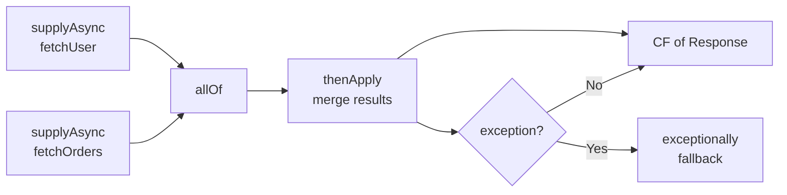
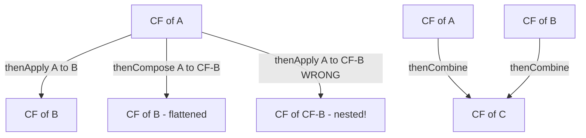
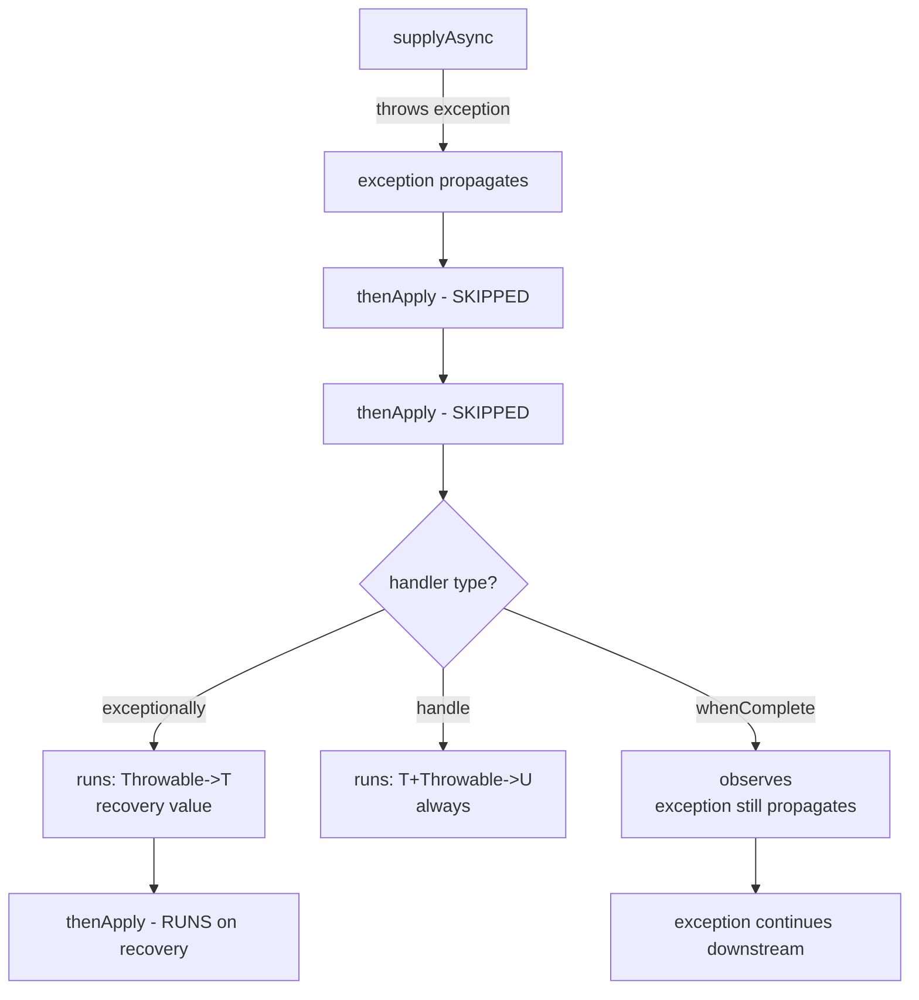
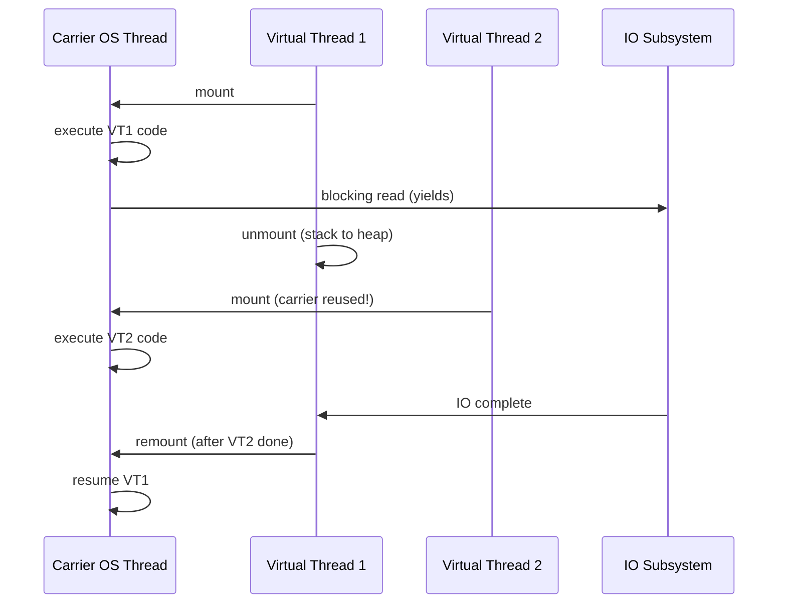

# Java Concurrency - L3 Async Programming

| # | Keyword | Difficulty |
| --- | --- | --- |
| 1 | [CompletableFuture Basics](#completablefuture-basics) | ★★☆ |
| 2 | [CompletableFuture Chaining and Composition](#completablefuture-chaining-and-composition) | ★★★ |
| 3 | [CompletableFuture Exception Handling](#completablefuture-exception-handling) | ★★☆ |
| 4 | [Virtual Threads Project Loom](#virtual-threads-project-loom) | ★★★ |
| 5 | [Reactive Programming vs Threads](#reactive-programming-vs-threads) | ★★☆ |

---

# CompletableFuture Basics

**Interview Weight:** critical - The primary modern async abstraction.
Every Java backend engineer must know it.

---

### 🎯 Model Answer

**30 seconds:**

> CompletableFuture is an async result container with callbacks.
> supplyAsync(supplier) runs work on a pool and returns a CF.
> thenApply transforms the result. thenAccept consumes it.
> thenCompose chains async steps. allOf waits for multiple CFs.
> Exceptions are captured and handled with exceptionally() or handle().

**3 minutes (Senior):**

> CompletableFuture solves the Future limitation: no callbacks.
> A CF is both a Future (holds pending result) and a CompletionStage
> (supports chaining). The chain model: each stage runs when its
> upstream completes; the result flows through the chain via thenApply
> (transform), thenCompose (flat-map into another CF), thenAccept
> (terminal consumer), thenRun (terminal, no result).
>
> Thread selection: stages without "Async" suffix run in the
> completing thread (synchronous, on whatever thread completes the
> upstream). Stages with "Async" suffix run in the common ForkJoinPool
> (or a provided executor). For IO-bound stages: always use Async
> variants with a dedicated IO executor - never block the
> ForkJoinPool.
>
> allOf(cf1, cf2, cf3): returns a CF<Void> that completes when
> all complete. To collect results, join each individual CF after
> allOf completes. anyOf: completes when any one completes.
> completedFuture(v): already-completed CF for testing or defaults.
> failedFuture(e): already-failed CF.

**Blank Mind Recovery:**

**(1) Restate:** "CompletableFuture: Future + callback chain for
async computation."

**(2) First principles:** "Run work async. When it completes, run
the next step. Each step transforms the result. Handle errors
at any step."

**(3) Bridge:** "Like a promise chain in JavaScript: fetch(url)
.then(parse).then(save).catch(handleError)."

---

### 📘 Concept Explanation

**What it is:**

CompletableFuture<T>: implements Future<T> and CompletionStage<T>.
A mutable container that can hold a value, exception, or pending
state. Supports a rich API of transformation and combination methods.

**The problem it solves:**

Raw Future: no callbacks; get() blocks. Manual thread coordination
for parallel tasks requires complex bookkeeping. CompletableFuture
enables a declarative, non-blocking async pipeline.

**How it works:**

```
CREATION:
  // Run on ForkJoinPool.commonPool():
  CompletableFuture<String> cf =
      CompletableFuture.supplyAsync(() -> fetchFromDB(id));

  // Run on dedicated executor (IO-safe):
  CompletableFuture<String> cf =
      CompletableFuture.supplyAsync(
          () -> fetchFromDB(id), ioExecutor);

  // Already-completed:
  CompletableFuture<String> done =
      CompletableFuture.completedFuture("value");

TRANSFORMATION:
  cf.thenApply(s -> s.toUpperCase())  // sync transform
    .thenApply(s -> "Result: " + s)
    .thenAccept(System.out::println); // terminal consumer

  // Async variant (runs on pool):
  cf.thenApplyAsync(s -> expensiveTransform(s), executor)

COMBINATION:
  CompletableFuture.allOf(cf1, cf2, cf3)
      .thenRun(() -> {
          // all three completed
          String r1 = cf1.join(); // join: like get() without checked ex
          String r2 = cf2.join();
          String r3 = cf3.join();
          combineResults(r1, r2, r3);
      });

MANUAL COMPLETION:
  CompletableFuture<String> manual = new CompletableFuture<>();
  // From another thread:
  manual.complete("result");
  // Or: manual.completeExceptionally(new IOException());
```

**The key insight:**

Methods without "Async" suffix execute on the thread that completes
the upstream stage (could be any thread - a pool thread or even
the main thread). This is "synchronous continuation." For predictable
thread control, always use the Async variants with an explicit executor.

**When to use it:**

- Parallel async IO: fetch from multiple services simultaneously
- Callback chains instead of blocking get() at each step
- Timeout with CompletableFuture.orTimeout() (Java 9+)
- Async request handling in web frameworks

**When NOT to use it:**

- CPU-heavy work: runs on common pool; blocks ForkJoinPool
  threads for IO (use separate executor)
- Deeply nested chains become hard to read: consider reactive streams
- When all steps are CPU-bound and synchronous: just use a method call

**Alternatives:**

- Reactive (Project Reactor Mono/Flux): for streaming and backpressure
- Virtual threads (Java 21): blocking code becomes async at JVM level
- RxJava: observable-based reactive (Android, legacy)

**First-principles derivation:**

CF internally uses a stack of "completions" (Treiber stack of
UniCompletion nodes). When a CF completes, it atomically swings
through the stack and triggers each waiting completion. No global
lock; CAS on the stack head. This is the core of the non-blocking
callback dispatch.

---

### 💻 Code Example

**Example 1: BAD (blocking chain) vs GOOD (non-blocking CF pipeline)**

```java
// BAD: sequential blocking - defeats async purpose
String userId = getUserId();     // blocks
String profile = fetchProfile(userId);  // blocks
String orders  = fetchOrders(userId);   // blocks (serial!)
return merge(profile, orders);

// GOOD: parallel non-blocking pipeline
CompletableFuture<String> profileCF =
    CompletableFuture.supplyAsync(
        () -> fetchProfile(userId), ioExecutor);
CompletableFuture<String> ordersCF =
    CompletableFuture.supplyAsync(
        () -> fetchOrders(userId), ioExecutor);

// Both fetches run in parallel; merge when both complete
return CompletableFuture.allOf(profileCF, ordersCF)
    .thenApply(ignored ->
        merge(profileCF.join(), ordersCF.join()))
    .get(5, TimeUnit.SECONDS);  // bounded wait
// If both fetches take 300ms each: parallel = 300ms total,
// sequential = 600ms total
```

> **Code walkthrough:** The bad version runs three operations serially:
> total time = T1 + T2 + T3. The good version runs profile and orders
> fetches in parallel using separate supplyAsync calls on a dedicated
> IO executor. allOf() returns a CF that completes when BOTH complete.
> The thenApply combines results with join() (which is safe here since
> allOf already ensures both are done). Total time = max(T_profile,
> T_orders). For two 300ms IO calls, this is 300ms vs 600ms - a 2x
> improvement. ioExecutor prevents blocking the ForkJoinPool.

**Example 2: orTimeout and completeOnTimeout (Java 9+)**

```java
// Timeout with fallback:
CompletableFuture<String> result =
    CompletableFuture.supplyAsync(() -> slowRemoteCall(), ioExecutor)
        .completeOnTimeout("default-value", 2, TimeUnit.SECONDS)
        // ^^ if not completed within 2s, complete with default
        .thenApply(s -> "Processed: " + s);

// Or fail on timeout:
CompletableFuture<String> strict =
    CompletableFuture.supplyAsync(() -> slowRemoteCall(), ioExecutor)
        .orTimeout(2, TimeUnit.SECONDS);
        // ^^ throws TimeoutException after 2s
```

> **Code walkthrough:** completeOnTimeout provides a fallback value
> if the async operation takes too long - useful for non-critical data
> (cache miss fallback, default config). orTimeout causes the CF to
> complete exceptionally with TimeoutException - use when a timeout
> is an error condition. Both are Java 9+ additions that eliminate
> the need for ScheduledExecutorService-based timeout logic.

---

### 🎓 Answers by Seniority

**Junior / Mid (0-5 years):**

> CompletableFuture is an async result that supports callbacks.
> supplyAsync runs work on a pool. thenApply transforms the result.
> thenAccept consumes it. allOf waits for multiple. exceptionally
> handles errors. Better than Future because it doesn't require
> blocking get() for each step.

---

**Senior / Staff (5+ years):**

> I use CF for parallel IO fan-out: multiple supplyAsync + allOf +
> join for aggregation. For IO operations, I always provide a dedicated
> executor to supplyAsync/thenApplyAsync - never use the common pool
> for blocking IO. I use orTimeout() for resilience. For complex
> pipelines with error recovery, handle() is better than exceptionally
> because it receives both result and exception. For streaming data,
> I switch to Project Reactor Mono/Flux.

---

### ⚠️ Common Misconceptions

| Misconception | Reality | Risk |
| --- | --- | --- |
| "thenApply runs on a pool thread" | Without Async suffix, runs on the completing thread (could be main thread) | Unexpected behavior; blocking chain if completing thread is pool thread |
| "join() is always safe" | join() blocks and can deadlock if called from within a CF callback that must complete before this one | Deadlock in nested CFs |
| "allOf collects results" | allOf returns CF<Void>; results must be collected from individual CFs after allOf completes | NullPointerException when trying to use allOf's result |

---

### 🚨 Failure Modes and Diagnosis

| Failure | Symptom | Root Cause | Diagnostic | Fix |
| --- | --- | --- | --- | --- |
| Deadlock on join() in CF chain | Application hangs | join() blocks the pool thread needed to complete the upstream CF | jstack: common pool threads all BLOCKED in join() | Never call join/get inside a CF callback; use thenCompose |
| IO blocking common pool | Parallel streams slow | supplyAsync for IO without custom executor; common pool threads blocked | jstack: commonPool threads WAITING on IO | Provide dedicated ioExecutor to all supplyAsync/thenApplyAsync calls |
| Unhandled exception swallowed | Silent failure; no result, no error | Exception thrown in CF chain with no exceptionally/handle | Add .whenComplete((r,e) -> { if(e!=null) log.error... }) | Always attach error handler to terminal CFs |

---

### 🎯 Interview Deep-Dive

| Level | Time | Expected Depth |
| --- | --- | --- |
| Junior | 3 min | supplyAsync; thenApply; allOf; exceptionally |
| Mid | 5 min | Async vs sync continuations; executor selection; allOf + join |
| Senior | 8 min | Common pool risk; Treiber stack internals; orTimeout; CF vs Mono |
| Staff | 12 min | Designing async pipeline with resilience; backpressure; reactive migration |

---

**Q1** [CONCEPTUAL] [SENIOR]

"What is the difference between thenApply and thenCompose?"

**Answer:**

Both chain operations on a CompletableFuture, but differ in what
the function returns.

thenApply(Function<T, U>): the function returns a plain value U.
Result: CompletableFuture<U>. Use for synchronous transformations.

```java
CompletableFuture<String> cf = supplyAsync(() -> "hello");
CompletableFuture<Integer> len = cf.thenApply(String::length);
// thenApply: "hello" -> 5
```

thenCompose(Function<T, CompletableFuture<U>>): the function returns
a CompletableFuture<U>. Result: CompletableFuture<U> (flattened,
not CompletableFuture<CompletableFuture<U>>). Use when the next
step is itself async.

```java
CompletableFuture<String> userId = supplyAsync(() -> "user-1");
// Next step is async (fetches from DB):
CompletableFuture<Profile> profile =
    userId.thenCompose(id -> supplyAsync(() -> fetchProfile(id)));
// NOT: thenApply(id -> supplyAsync(...)) = CF<CF<Profile>> !!
```

The analogy: thenApply is like Stream.map; thenCompose is like
Stream.flatMap. Use thenApply for synchronous transforms; use
thenCompose when the next step returns a CF (is itself async).

A common mistake: using thenApply when the function calls
supplyAsync, resulting in CompletableFuture<CompletableFuture<X>>.
Then you have to call .join() on the inner CF, which blocks the
thread. Use thenCompose to flatten automatically.

*What separates good from great:* The map/flatMap analogy and the
specific mistake (thenApply with an async function = nested CF).

---

**Q2** [DEBUGGING] [SENIOR]

"A CompletableFuture chain is running but producing no output and no
exceptions. How do you debug it?"

**Answer:**

This is the "silent CF" problem - a callback chain that never completes
or whose exception is swallowed.

Step 1: Add whenComplete at every stage:
```java
cf.whenComplete((result, ex) -> {
    if (ex != null) log.error("Stage X failed", ex);
    else log.info("Stage X complete: {}", result);
})
```
whenComplete fires regardless of success or failure and does not
alter the chain's result/exception.

Step 2: Check if the CF completes at all:
```java
CompletableFuture<?> cf = buildChain();
boolean done = cf.isDone();  // false = never triggered
```
If isDone() is false after expected completion time: the upstream
supplyAsync may not have started. Check executor shutdown: if the
executor was shut down before the task ran, the task never starts.

Step 3: Check exception swallowing:
```java
// Bad: exceptionally returns a default but exception is dropped
cf.exceptionally(e -> null)
  .thenAccept(v -> log.info("result: {}", v));
// If v is null (from exceptionally), thenAccept runs silently.
```
Replace exceptionally(e -> null) with
handle((r, e) -> { log.error...; return r; }) to log.

Step 4: jstack - look for pool threads WAITING or BLOCKED:
- commonPool threads BLOCKED: they are doing IO (wrong executor)
- All threads idle: upstream CF never completed (source task failed
  silently or executor rejected the task)

*What separates good from great:* Knowing that whenComplete is
the "observer" that does not alter the chain, and checking whether
the upstream CF itself completed.

---

**Q3** [TRADE-OFF] [SENIOR]

"When would you choose CompletableFuture over Project Reactor Mono?"

**Answer:**

CompletableFuture: choose when:
- Result is a single value (not a stream)
- Team knows Java but not reactive programming
- Integrating with non-reactive code (existing ExecutorService,
  JDBC, blocking APIs)
- Simpler pipeline: a few async steps, not complex fan-out/fan-in
- Java 8+ compatibility needed

Project Reactor Mono/Flux: choose when:
- Streaming results (0..N items): Flux is the right abstraction
- Backpressure is needed: Mono/Flux propagates demand signals upstream
- Reactive stack (R2DBC, WebFlux, reactive MongoDB): Mono/Flux is
  the native type; converting to CF creates extra overhead
- Complex error handling with retries, fallbacks, circuit breakers
  (Mono has built-in retry(), timeout(), onErrorReturn() etc.)
- High concurrency with many parallel requests: reactive scheduler
  is optimized for non-blocking IO dispatch

Practical rule: for a Spring MVC app making a few parallel DB calls,
CompletableFuture is sufficient. For a Spring WebFlux app with
streaming, backpressure, and reactive drivers: use Mono/Flux natively.

*What separates good from great:* Knowing backpressure as the key
reactive-only feature and the integration cost of mixing CF and Mono.

---

### ⚖️ Comparison Table

| Feature | Future | CompletableFuture | Mono (Reactor) |
| --- | --- | --- | --- |
| Callbacks | No | Yes | Yes |
| Composition | No | Yes (thenCompose) | Yes (flatMap) |
| Backpressure | No | No | Yes |
| Error handling | try-catch on get() | exceptionally/handle | onErrorReturn/retry |
| Streaming | No | No | Flux |
| Blocking | get() required | join()/get() or callbacks | subscribe() only |

---

### 🏛️ System Design

*(Omit: L3 keyword. Async microservice fan-out patterns with resilience
(circuit breaker, bulkhead) appear in L4-L5 files.)*

---

### 📊 Diagram

```
COMPLETABLEFUTURE PIPELINE:

supplyAsync(fetchUser)     supplyAsync(fetchOrders)
        |                           |
        v                           v
   CF<User>                   CF<Orders>
        \                           /
         +---allOf(user, orders)---+
                     |
                     v
             CF<Void> (both done)
                     |
               thenApply(merge)
                     |
                     v
              CF<Response>
```



> **Diagram walkthrough:** Two supplyAsync calls start in parallel
> on an IO executor. allOf() creates a new CF that completes only
> when both upstream CFs complete. The thenApply stage then safely
> calls join() on both (they are guaranteed done). If either upstream
> fails, the exception propagates through allOf to thenApply, which
> also fails; exceptionally catches it and returns a fallback.
> The entire pipeline is non-blocking: no thread sleeps waiting for
> the other; the completion triggers the callbacks automatically.

---

---

# CompletableFuture Chaining and Composition

**Interview Weight:** high - Tests deep understanding of CF's
composition API, thread execution model, and pitfalls.

---

### 🎯 Model Answer

**30 seconds:**

> CF chaining: thenApply (sync transform), thenCompose (flat-map
> to another CF), thenAccept (consume), thenRun (side-effect).
> Async variants add "Async" suffix and run on a pool. Composition:
> allOf (wait for all), anyOf (wait for first), thenCombine (merge
> two CFs). Execution thread: non-Async stages run on the completing
> thread; Async stages run on the provided executor or common pool.

**3 minutes (Senior):**

> The execution thread model is critical. thenApply runs in the
> same thread that completed the upstream CF. If the upstream CF
> completes in a pool thread, thenApply runs there. If the upstream
> CF was already complete when thenApply is called, thenApply
> runs in the calling thread. This non-determinism can be a problem
> in production.
>
> thenCombine(cf2, biFunction): when both this and cf2 complete,
> apply biFunction(thisResult, cf2Result). Equivalent to combining
> two CFs without allOf; results are typed (no need for individual
> join calls). Use thenCombine for two-CF merges; allOf for three
> or more.
>
> thenCompose is the key flatMap operation. Any time a pipeline
> step creates a new CF (calls another async method), use thenCompose.
> Using thenApply in this case produces CF<CF<T>> - the pipeline
> does not "await" the inner CF automatically.

**Blank Mind Recovery:**

**(1) Restate:** "CF chaining: thenApply/thenCompose for sequential,
allOf/thenCombine for parallel, Async variants for pool execution."

**(2) First principles:** "Monad: chain operations that may be
asynchronous. Map (thenApply) for sync transforms, flatMap
(thenCompose) for async."

---

### 📘 Concept Explanation

**What it is:**

CompletableFuture provides a rich composition API for building async
pipelines. Methods fall into: transform (thenApply/thenApplyAsync),
flat-map (thenCompose/thenComposeAsync), consume (thenAccept/thenRun),
combine (thenCombine, allOf, anyOf), and error handling
(exceptionally, handle, whenComplete).

**The problem it solves:**

Manual coordination of multiple async steps requires locks,
CountDownLatches, and complex exception handling. CF composition
encodes the same logic declaratively.

**How it works:**

```
COMPLETE COMPOSITION API:

thenApply(fn)      : CF<T> -> CF<U>   sync transform
thenApplyAsync(fn) : CF<T> -> CF<U>   async transform (pool)
thenCompose(fn)    : CF<T> -> CF<U>   fn returns CF<U> (flatMap)
thenAccept(fn)     : CF<T> -> CF<Void> terminal consumer
thenRun(fn)        : CF<?> -> CF<Void> no input, no output
thenCombine(cf2,fn): CF<T>, CF<U> -> CF<V>  merge two CFs

allOf(cf...)       : -> CF<Void>  all complete
anyOf(cf...)       : -> CF<Object> first complete

whenComplete(fn)   : observer (always fires, result unchanged)
handle(fn)         : transform success OR exception to U
exceptionally(fn)  : transform exception to T (recovery)

EXECUTION RULES:
  non-Async: runs in completing thread (non-deterministic)
  Async (no executor): runs in ForkJoinPool.commonPool()
  Async (with executor): runs in provided executor
```

**The key insight:**

thenCompose is the correct method for "the next step is also async."
Analogy: thenApply:thenCompose = Stream.map:Stream.flatMap.
If the function passed to thenApply returns a CompletableFuture,
use thenCompose instead - it unwraps the nested CF automatically.

**When to use each:**

- thenApply: parsing, deserialization, synchronous mapping
- thenCompose: another DB call, another HTTP call, another CF
- thenCombine: merge exactly two parallel CFs with typed results
- allOf: wait for N CFs, then collect all results
- anyOf: first-response-wins pattern (multiple redundant calls)

**When NOT to use it:**

- Do not call join() inside a thenApply/thenCompose callback:
  blocks the executing thread and can cause pool starvation
- Do not create deeply nested chains (>5 levels): readability suffers;
  consider extracting methods or using reactive
- Do not mix blocking and non-blocking stages without executor control

**Alternatives:**

- Reactor Mono.flatMap for reactive equivalent
- Kotlin coroutines (coroutineScope + async/await for structured concurrency)

**First-principles derivation:**

CF composition is the Continuation Monad applied to Java. Each "then*"
method registers a callback (continuation) that fires when the upstream
CF completes. The Treiber stack of continuations is atomically consumed
on completion. thenCompose is flatMap: it creates a new CF from a function
that returns a CF, ensuring the chain awaits the inner CF.

---

### 💻 Code Example

**Example 1: BAD (thenApply with CF-returning function) vs GOOD (thenCompose)**

```java
// BAD: thenApply returns CF<CF<Profile>> - inner CF not awaited
CompletableFuture<CompletableFuture<Profile>> wrong =
    getUsedId()
        .thenApply(id -> fetchProfileAsync(id));
        // fetchProfileAsync returns CF<Profile>
        // thenApply wraps it: CF<CF<Profile>>
        // Must call .join() on the inner CF - blocks the thread!

// GOOD: thenCompose unwraps the inner CF automatically
CompletableFuture<Profile> right =
    getUserId()
        .thenCompose(id -> fetchProfileAsync(id));
        // fetchProfileAsync returns CF<Profile>
        // thenCompose: CF<Profile> - flattened, correct

// Full pipeline example:
CompletableFuture<OrderSummary> result =
    CompletableFuture.supplyAsync(
            this::getCurrentUserId, ioExecutor)  // step 1: async
        .thenCompose(id ->                        // step 2: async
            fetchProfileAsync(id))
        .thenCompose(profile ->                   // step 3: async
            fetchOrdersAsync(profile.getUserId()))
        .thenApply(orders ->                      // step 4: sync transform
            OrderSummary.from(orders))
        .orTimeout(5, TimeUnit.SECONDS);          // step 5: timeout
```

> **Code walkthrough:** The bad version passes a function to thenApply
> that itself returns a CompletableFuture. thenApply wraps the result
> blindly: result type is CF<CF<Profile>>. To get the Profile, you
> must call .join() on the inner CF - which blocks the pool thread.
> thenCompose is the correct choice: it registers the returned CF
> as the next stage in the pipeline and waits for IT to complete,
> producing CF<Profile>. The full pipeline shows three async steps
> (thenCompose), one sync step (thenApply), and a timeout. No thread
> ever blocks waiting - the chain is entirely callback-driven.

**Example 2: thenCombine for two parallel results**

```java
// Two parallel async calls; merge results when both complete:
CompletableFuture<String> userCF =
    CompletableFuture.supplyAsync(
        () -> fetchUser(userId), ioExecutor);
CompletableFuture<List<Order>> ordersCF =
    CompletableFuture.supplyAsync(
        () -> fetchOrders(userId), ioExecutor);

// thenCombine: typed merge - no join() needed
CompletableFuture<Dashboard> dashboard =
    userCF.thenCombine(
        ordersCF,
        (user, orders) -> Dashboard.of(user, orders)
    );
// Cleaner than allOf + individual join() calls
```

> **Code walkthrough:** thenCombine registers a BiFunction that receives
> both results when BOTH CFs complete. Unlike allOf which returns CF<Void>
> (requiring explicit join calls), thenCombine produces a typed CF<Dashboard>.
> The BiFunction receives the user and orders directly - no casting, no
> join(). For exactly two CFs with typed merge, thenCombine is cleaner
> than allOf. For three or more, allOf is the correct choice.

---

### 🎓 Answers by Seniority

**Junior / Mid (0-5 years):**

> thenApply transforms the result synchronously. thenCompose is for
> async next steps (returns another CF). thenCombine merges two CFs.
> allOf waits for all. Async variants use "Async" suffix and run on
> a pool. Never use join() inside a callback.

---

**Senior / Staff (5+ years):**

> I use thenCompose for async-to-async chains and thenApply for sync
> transforms. For two-CF merge: thenCombine (typed); for N CFs: allOf.
> I always specify the executor for Async variants to avoid common
> pool starvation. anyOf for first-response-wins with redundant backends.
> For complex pipelines I extract each step as a named method returning
> CompletableFuture for readability.

---

### ⚠️ Common Misconceptions

| Misconception | Reality | Risk |
| --- | --- | --- |
| "thenApply is always non-blocking" | thenApply can run on any thread including the calling thread; if it blocks, it blocks that thread | Blocking common pool thread with thenApply |
| "anyOf returns typed result" | anyOf returns CF<Object>; must cast the result | ClassCastException at runtime |
| "thenCombine is sequential" | thenCombine fires when BOTH CFs complete (parallel) | Misunderstanding used for fan-out |

---

### 🚨 Failure Modes and Diagnosis

| Failure | Symptom | Root Cause | Diagnostic | Fix |
| --- | --- | --- | --- | --- |
| CF<CF<T>> type confusion | compile warning; need double .join() | thenApply with function returning CF | Type inspection: see nested CF type | Replace with thenCompose |
| anyOf type casting | ClassCastException | anyOf returns CF<Object>; cast without check | Stack trace at anyOf result usage | Check type before cast; or use allOf with typed CFs |

---

### 🎯 Interview Deep-Dive

| Level | Time | Expected Depth |
| --- | --- | --- |
| Junior | 3 min | thenApply vs thenCompose; Async variants; allOf |
| Mid | 5 min | map/flatMap analogy; thenCombine; execution thread model |
| Senior | 8 min | Treiber stack; anyOf typing; designing parallel fetch with fallback |
| Staff | 12 min | CF vs Reactor design; when to migrate to reactive; monadic design |

---

**Q1** [CONCEPTUAL] [STAFF]

"Design a service call with timeout, fallback, and parallel fan-out
using CompletableFuture."

**Answer:**

Requirements: call three services in parallel, combine results,
apply 3-second timeout, use fallback on failure.

```java
public DashboardResponse getDashboard(String userId) {
    ExecutorService io = getIoExecutor(); // dedicated IO pool

    // Parallel fan-out to three services
    CompletableFuture<Profile> profileCF =
        CompletableFuture
            .supplyAsync(() -> profileService.get(userId), io)
            .exceptionally(e -> {
                log.warn("Profile failed; using default", e);
                return Profile.DEFAULT;
            });

    CompletableFuture<List<Order>> ordersCF =
        CompletableFuture
            .supplyAsync(() -> orderService.get(userId), io)
            .exceptionally(e -> {
                log.warn("Orders failed; using empty list", e);
                return Collections.emptyList();
            });

    CompletableFuture<Recommendations> recoCF =
        CompletableFuture
            .supplyAsync(() -> recoService.get(userId), io)
            .exceptionally(e -> {
                log.warn("Recos failed; using empty", e);
                return Recommendations.EMPTY;
            });

    // Wait for all; aggregate; timeout
    return CompletableFuture
        .allOf(profileCF, ordersCF, recoCF)
        .thenApply(ignored -> DashboardResponse.of(
            profileCF.join(),
            ordersCF.join(),
            recoCF.join()))
        .orTimeout(3, TimeUnit.SECONDS)
        .exceptionally(e -> {
            log.error("Dashboard timed out; returning empty", e);
            return DashboardResponse.EMPTY;
        })
        .join();  // safe: caller thread blocks here; not in CF chain
}
```

Design decisions:
- Per-service exceptionally: each service has its own fallback.
  If profile fails, orders and recos still return.
- orTimeout(3s) applies to the TOTAL aggregation, not per service.
  For per-service timeout, add orTimeout to each individual CF.
- join() at the end is in the calling thread (HTTP handler), not
  in a CF callback - acceptable for blocking IO.
- IO executor: separate from ForkJoinPool to prevent starvation.

*What separates good from great:* Per-service fallbacks (not just
a single timeout fallback) and the distinction between total timeout
vs per-service timeout.

---

### ⚖️ Comparison Table

| Method | Input | Output | Use Case |
| --- | --- | --- | --- |
| thenApply(fn) | T -> U | CF<U> | Sync transform |
| thenCompose(fn) | T -> CF<U> | CF<U> | Async next step |
| thenCombine(cf2, fn) | T, U -> V | CF<V> | Merge two CFs |
| thenAccept(fn) | T -> void | CF<Void> | Terminal consume |
| allOf(cfs...) | - | CF<Void> | Wait for N CFs |
| anyOf(cfs...) | - | CF<Object> | First-wins |
| exceptionally(fn) | Throwable -> T | CF<T> | Error recovery |
| handle(fn) | (T,Throwable) -> U | CF<U> | Always transform |

---

### 🏛️ System Design

*(Omit: L3 keyword. Async fan-out with circuit breakers (resilience4j),
bulkhead patterns, and reactive API gateway appear in L4-L5 files.)*

---

### 📊 Diagram

```
CHAIN VS COMPOSE:

thenApply (sync transform):
  CF<A> --[A->B]--> CF<B>

thenCompose (async flatMap):
  CF<A> --[A->CF<B>]--> CF<B>
  (inner CF awaited automatically)

WRONG (thenApply with CF function):
  CF<A> --[A->CF<B>]--> CF<CF<B>>  !! nested

thenCombine (two parallel, merge):
  CF<A> \
         +--[A,B->C]--> CF<C>
  CF<B> /
```



> **Diagram walkthrough:** thenApply takes a plain function A->B and
> wraps the result in CF. thenCompose takes a function A->CF(B) and
> unwraps (flattens) the inner CF, producing CF(B) at the pipeline
> level. Using thenApply with an async function produces the "nested
> CF" anti-pattern. thenCombine shows the two-input merge: both CFs
> must complete before the BiFunction fires. Choosing the wrong method
> is the most common CF mistake - the diagram makes the type signatures
> visible.

---

---

# CompletableFuture Exception Handling

**Interview Weight:** high - Tests production exception handling,
the difference between exceptionally/handle/whenComplete, and
exception propagation in chains.

---

### 🎯 Model Answer

**30 seconds:**

> Three exception-handling methods: exceptionally (recover from
> error, provide fallback), handle (transform either result or
> exception), whenComplete (observe without changing chain).
> Exceptions propagate through the chain until caught. A stage
> that throws passes the exception downstream, skipping transform
> stages until exceptionally or handle catches it.

**3 minutes (Senior):**

> Exception propagation model: if a stage throws, the resulting CF
> completes exceptionally. All downstream thenApply/thenCompose
> stages are SKIPPED (they do not run). The exception continues
> propagating until it reaches a handle() or exceptionally() stage.
>
> exceptionally(fn): fn receives Throwable, returns T. Recovers the
> pipeline. The downstream receives the recovered value. If fn itself
> throws, the exception continues propagating.
>
> handle(biFunction): always runs. Receives (result, exception).
> One of them is null. Can inspect the exception AND produce a new
> result. Returns the new result. If handle returns normally, the
> downstream sees a successful result (exception absorbed).
>
> whenComplete(biConsumer): always runs (observes). Does NOT change
> the chain - exception still propagates after whenComplete. Use for
> logging, metrics, cleanup.
>
> Key difference: whenComplete cannot recover from exceptions
> (it passes the exception through). handle and exceptionally can.

**Blank Mind Recovery:**

**(1) Restate:** "Three exception handlers: exceptionally (recover),
handle (always runs, transforms), whenComplete (observe only)."

**(2) First principles:** "Exception in CF: propagates downstream.
Need to intercept? handle or exceptionally. Need to observe?
whenComplete."

---

### 📘 Concept Explanation

**What it is:**

Three exception-handling methods on CompletableFuture:

exceptionally(fn: Throwable -> T) -> CF<T>:
- Only runs if the upstream completes exceptionally
- fn: transforms the exception to a recovery value
- If fn throws, exception continues propagating

handle(fn: (T, Throwable) -> U) -> CF<U>:
- ALWAYS runs (success or failure)
- fn: receives (result, exception); one is null
- Can inspect both and produce a new result or rethrow

whenComplete(fn: (T, Throwable) -> void) -> CF<T>:
- ALWAYS runs (success or failure)
- fn: observe-only, no return value
- Does NOT change the chain; exception still propagates after

**The problem it solves:**

CF chains without exception handlers produce silently failed CFs.
Exceptions thrown in any stage propagate downstream invisibly,
skipping all transform stages, until they reach get() or join()
which throws ExecutionException - often in unexpected code.

**How it works:**

```
EXCEPTION PROPAGATION:

supplyAsync(() -> { throw new IOEx("fail"); })
    .thenApply(s -> s.toUpperCase())  // SKIPPED - exception
    .thenApply(s -> "Result: " + s)   // SKIPPED - exception
    .exceptionally(e -> "default")    // RUNS - recovery
    .thenApply(s -> s + "!")          // runs on "default!"

HANDLE VS EXCEPTIONALLY:
  // exceptionally: only on failure
  .exceptionally(e -> {
      log.error("Failed", e);
      return defaultValue;       // provide fallback
  })

  // handle: always
  .handle((result, ex) -> {
      if (ex != null) {          // failure
          log.error("Failed", ex);
          return defaultValue;
      }
      return transform(result);  // success
  })

  // whenComplete: observe only
  .whenComplete((result, ex) -> {
      if (ex != null) log.error("Stage failed", ex);
      else metrics.record(result);
      // exception STILL propagates after this
  })
```

**The key insight:**

When both a result and exception could be informative (e.g., partial
results with partial failures), handle is the right choice.
exceptionally is simpler for pure fallback. whenComplete is for
logging and metrics, never for recovery.

**When to use it:**

- Per-stage fallback: exceptionally after each supplyAsync that
  calls a fragile service
- Global handler: handle or exceptionally at the end of the chain
- Observability: whenComplete at every stage for metrics

**When NOT to use it:**

- Do not use whenComplete for recovery (exception propagates through)
- Do not catch and rethrow in exceptionally (nested exception wrapping)
- Do not rely on get()/join() to surface exceptions from long chains:
  add explicit handlers

**Alternatives:**

- Reactor's onErrorReturn, onErrorResume, retry, retryWhen

**First-principles derivation:**

CF internally stores either (result, null) or (null, exception) in
a volatile AltResult field. All downstream stages check this field
before running; if exception, they propagate it directly without
calling their function. handle() is an exception to this: it always
calls its function with both result and exception fields.

---

### 💻 Code Example

**Example 1: BAD (missing handler) vs GOOD (per-stage recovery)**

```java
// BAD: no exception handler - silent failure
CompletableFuture<Profile> cf =
    CompletableFuture.supplyAsync(() -> fetchFromDB(id), ioExec)
        .thenApply(this::transform);
// If fetchFromDB throws: cf is failed; thenApply skipped
// Nobody checks it; exception swallowed

// GOOD: per-service fallback + logging
CompletableFuture<Profile> cf =
    CompletableFuture.supplyAsync(() -> fetchFromDB(id), ioExec)
        .exceptionally(ex -> {
            log.warn("DB fetch failed for {}: {}", id, ex.getMessage());
            return Profile.EMPTY;  // graceful degradation
        })
        .thenApply(this::transform);
// If fetchFromDB throws: exceptionally returns Profile.EMPTY
// thenApply runs on EMPTY profile (always runs now)

// GOOD: handle for combined success/failure transform
CompletableFuture<String> result =
    CompletableFuture.supplyAsync(() -> fetchData(), ioExec)
        .handle((data, ex) -> {
            if (ex != null) {
                metrics.increment("fetch.error");
                return "error: " + ex.getMessage();  // fallback string
            }
            metrics.increment("fetch.success");
            return data.toUpperCase();  // normal transform
        });
```

> **Code walkthrough:** The bad version has no exception handler.
> If fetchFromDB throws, cf is in a failed state. thenApply is skipped.
> The failure is invisible unless someone calls cf.get() or cf.join().
> The first good version uses exceptionally for graceful degradation:
> on DB failure, use EMPTY profile and continue the chain. The second
> good version uses handle: it always runs (success or failure) and
> records metrics for both paths before transforming. handle is
> preferable when you need to observe the result even on success.

**Example 2: Detecting exception wrapping in ExecutionException**

```java
// Reading exception from CF chain:
CompletableFuture<String> cf = buildChain();
try {
    String result = cf.get(5, TimeUnit.SECONDS);
    return result;
} catch (ExecutionException e) {
    // e.getCause() is the original exception from the chain
    Throwable root = e.getCause();
    if (root instanceof ServiceUnavailableException) {
        return fallback();
    }
    throw new RuntimeException("Unexpected error", root);
} catch (TimeoutException e) {
    cf.cancel(true);
    return fallback();
} catch (InterruptedException e) {
    Thread.currentThread().interrupt();
    throw new RuntimeException(e);
}
// Pattern: always getCause() to unwrap from ExecutionException
```

> **Code walkthrough:** ExecutionException wraps any exception thrown
> in a CF chain. The root cause is always in getCause() - never check
> e.getMessage() directly. The pattern checks the cause type to make
> context-aware decisions. TimeoutException is distinct (not an
> ExecutionException subtype) - it comes from orTimeout() or get(timeout).
> Always cancel the CF on timeout to release resources.

---

### 🎓 Answers by Seniority

**Junior / Mid (0-5 years):**

> exceptionally recovers from exceptions (provides fallback). handle
> always runs (success or failure) and can transform or recover.
> whenComplete observes but does not change the chain. Exceptions
> skip thenApply stages until they hit a handler.

---

**Senior / Staff (5+ years):**

> My exception handling strategy: per-stage exceptionally for fallback
> on fragile services, whenComplete at terminal stages for metrics,
> handle when I need the result path and error path in one place.
> I never rely on get() to surface exceptions from production CF chains
> - unhandled CF failures cause silent corruption. I add a .whenComplete
> at the end of every chain that logs all failures.

---

### ⚠️ Common Misconceptions

| Misconception | Reality | Risk |
| --- | --- | --- |
| "whenComplete catches exceptions" | whenComplete observes; exception still propagates after | Thinking exception is handled; it is not |
| "exceptionally always runs" | exceptionally only runs if the upstream failed | Missing it for observability in success case |
| "handle's return value replaces the exception" | handle's return value becomes the new result; exception is absorbed (not rethrown unless handle throws) | Unexpected result if handle returns null instead of re-throwing |

---

### 🚨 Failure Modes and Diagnosis

| Failure | Symptom | Root Cause | Diagnostic | Fix |
| --- | --- | --- | --- | --- |
| Exception at get() from deep chain | Unexpected exception wrapping | No exceptionally/handle in chain; exception accumulated | Trace getCause() through ExecutionException layers | Add per-stage error handlers near the source |
| whenComplete swallows exception | Logging shows exception but caller gets it too | whenComplete does not stop propagation | Add handle after whenComplete to actually recover | Use handle instead of whenComplete for recovery |

---

### 🎯 Interview Deep-Dive

| Level | Time | Expected Depth |
| --- | --- | --- |
| Junior | 2 min | exceptionally vs handle vs whenComplete |
| Mid | 5 min | Exception propagation model; skip semantics; handle return |
| Senior | 8 min | Per-stage vs terminal handling; exception wrapping; CF error in allOf |

---

**Q1** [CONCEPTUAL] [SENIOR]

"If one CF in allOf fails, what happens to the others and the result?"

**Answer:**

When one CF in allOf fails, the resulting CF from allOf completes
exceptionally immediately (as soon as any one CF fails). However,
the OTHER CFs that were already running continue to run - they are
not cancelled.

```java
CompletableFuture<String> cf1 = supplyAsync(() -> {
    sleep(100); return "result1";  // completes in 100ms
});
CompletableFuture<String> cf2 = supplyAsync(() -> {
    throw new RuntimeException("cf2 failed");  // fails immediately
});
CompletableFuture<String> cf3 = supplyAsync(() -> {
    sleep(500); return "result3";  // still running!
});

CompletableFuture.allOf(cf1, cf2, cf3)
    .thenRun(() -> System.out.println("all done"))  // never runs
    .exceptionally(e -> {
        // cf2 failed; cf1 may be done; cf3 is still running!
        // cf1.isDone() == depends on timing
        // cf3.isDone() == false (still computing)
        System.out.println("allOf failed: " + e.getMessage());
        return null;
    });
```

Key points:
1. allOf fails as soon as any CF fails (short-circuits for the allOf
   result, not for the individual CFs)
2. Individual CFs still execute to completion (no cancellation)
3. To get partial results when allOf fails, check each CF individually
   after catching the allOf exception
4. To cancel all on first failure, use CompletableFuture.cancel(true)
   on each CF in the exceptionally handler

Design implication: if you need "fail fast and cancel all," you must
do it manually. allOf does not provide this.

*What separates good from great:* Knowing that allOf cancels the RESULT
but not the individual tasks - other tasks continue consuming resources.

---

### ⚖️ Comparison Table

| Method | Fires When | Changes Result | Receives | Use Case |
| --- | --- | --- | --- | --- |
| exceptionally(fn) | Failure only | Yes (recovery T) | Throwable | Fallback value |
| handle(fn) | Always | Yes (new U) | (T, Throwable) | Unified transform |
| whenComplete(fn) | Always | No | (T, Throwable) | Logging, metrics |
| thenApply(fn) | Success only | Yes | T | Normal transform |

---

### 🏛️ System Design

*(Omit: L3 keyword. CF exception handling in circuit breaker and
retry patterns appears in L4 files. Resilience4j integration in L5.)*

---

### 📊 Diagram

```
EXCEPTION PROPAGATION THROUGH CF CHAIN:

supplyAsync -> FAIL
    |
    v (exception propagates)
thenApply SKIPPED
    |
    v (exception propagates)
thenApply SKIPPED
    |
    v (exception arrives)
exceptionally RUNS -> recovery value
    |
    v (recovery value)
thenApply RUNS (on recovery value)
```



> **Diagram walkthrough:** An exception in any stage propagates
> downstream, causing all subsequent thenApply/thenCompose stages
> to be skipped. The exception "slides through" until it reaches
> a catching handler. exceptionally receives the exception and
> returns a recovery value; the chain resumes with that value.
> handle always runs, distinguishing by checking which argument is
> null. whenComplete observes but the exception continues to the
> next stage unchanged. Understanding this skip-until-caught behavior
> is critical for designing correct CF error handling.

---

---

# Virtual Threads Project Loom

**Interview Weight:** critical (Java 21+) - The most important
Java concurrency change in a decade. Tests understanding of
the carrier model, structured concurrency, and migration strategy.

---

### 🎯 Model Answer

**30 seconds:**

> Virtual threads (Java 21 GA) are lightweight threads managed by
> the JVM, not the OS. They unmount from their carrier (OS) thread
> during blocking IO and remount when IO completes. A single OS thread
> can multiplex millions of virtual threads. This eliminates the need
> for thread pool sizing for IO-bound workloads and makes blocking
> code scale like async code.

**3 minutes (Senior):**

> Platform threads (classic) map 1:1 to OS threads (~1MB stack, OS
> context switch on block). Virtual threads: JVM-managed, cheap to
> create (~few KB), millions possible. They are scheduled on a
> ForkJoinPool of carrier threads. When a virtual thread blocks on
> IO, the JVM unmounts it from the carrier (the OS thread is freed
> to run another virtual thread). When IO completes, the virtual
> thread remounts on any available carrier thread.
>
> This is continuations: the virtual thread's stack is stored in
> the heap during the unmount, not on the OS stack. Resumption
> restores the stack. The blocking code looks identical to
> non-blocking code from the developer's perspective.
>
> What does NOT change: synchronization primitives still work
> (synchronized blocks pin the virtual thread to the carrier -
> avoid using synchronized in virtual thread code; use ReentrantLock).
> ThreadLocal still works but is a performance concern (large
> ThreadLocal state per virtual thread when you have millions).
> ScopedValues (Java 21 preview) are the recommended replacement.
>
> Migration: replace fixed thread pools with
> Executors.newVirtualThreadPerTaskExecutor(). For Spring Boot 3.2+:
> enable virtual threads via spring.threads.virtual.enabled=true.

**Blank Mind Recovery:**

**(1) Restate:** "Virtual threads: JVM-managed cheap threads that
unmount during blocking IO. Millions possible."

**(2) First principles:** "Platform thread = OS thread = expensive.
Virtual thread = heap-backed stack = cheap. Block on IO: JVM moves
stack to heap, frees OS thread. Resume: restore stack."

**(3) Bridge:** "Like a restaurant: virtual threads are waiters,
OS threads are chefs. A waiter (virtual thread) can pause while
waiting for the kitchen (IO) and serve another table. Far more
waiters than chefs."

---

### 📘 Concept Explanation

**What it is:**

Virtual threads (Project Loom, Java 21 GA): JVM-managed threads with
heap-backed stack. Carrier threads: a ForkJoinPool of OS threads
(default size = CPU count) that actually execute virtual thread code.
Continuations: saved/restored state enabling unmount/remount.

**The problem it solves:**

Platform threads: 1 platform thread = 1 OS thread = ~1MB stack +
OS scheduling overhead. Limits: 10,000-50,000 threads practical max.
For IO-bound servers: threads sit blocked waiting for IO 90%+ of the
time. Thread pool tuning is complex and fragile.

Virtual threads: IO block = unmount (OS thread freed). 1 OS thread
handles 1000s of virtual threads. No pool sizing for IO. Write
blocking code; get async scalability.

**How it works:**

```
VIRTUAL THREAD MOUNTING/UNMOUNTING:

OS Thread (carrier): ===============================
  VT1: [run]  [BLOCK IO]
               [VT1 unmounted: stack -> heap]
  VT2:               [run]  [BLOCK IO]
                              [VT2 unmounted]
  VT1 (IO done):                       [remount][run]

Virtual thread creation:
  Thread.ofVirtual().start(runnable);         // single VT
  Executors.newVirtualThreadPerTaskExecutor() // one VT per task

PINNING PROBLEM (avoid):
  // synchronized pins the VT to its carrier:
  synchronized(this) {
      blockingIO();  // carrier blocked! defeats unmounting
  }
  // Fix: use ReentrantLock instead:
  lock.lock();
  try { blockingIO(); } finally { lock.unlock(); }

STRUCTURED CONCURRENCY (Java 21 preview):
  try (var scope = new StructuredTaskScope.ShutdownOnFailure()) {
      Future<User> user = scope.fork(() -> fetchUser(id));
      Future<List<Order>> orders =
          scope.fork(() -> fetchOrders(id));
      scope.join().throwIfFailed();
      return combine(user.resultNow(), orders.resultNow());
  }
  // Scope closes: all forked tasks cancelled if not done
```

**The key insight:**

synchronized blocks pin the virtual thread to its carrier OS thread.
The carrier cannot be reused while the VT is pinned. For IO-heavy
code inside synchronized, replace synchronized with ReentrantLock.
Java 24 fixes most pinning cases with virtual thread-aware monitors.

**When to use it:**

- HTTP servers handling many concurrent requests (each request: one VT)
- Any IO-bound workload: database calls, external HTTP, file IO
- Replacing fixed thread pools in Spring MVC services
- Code that already uses blocking IO but needs to scale

**When NOT to use it:**

- CPU-bound computation: VTs give no advantage; use ForkJoinPool
  with platform threads
- Heavy ThreadLocal use: millions of VTs with large TL = heap pressure
- Code with high contention on synchronized blocks: pinning risk

**Alternatives:**

- Reactive (WebFlux + Reactor): non-blocking at every layer;
  higher throughput ceiling but more complex code
- Kotlin coroutines: similar concept; JVM-native; good for Kotlin

**First-principles derivation:**

Virtual threads implement M:N threading (M virtual threads on N OS
threads). The JVM continuation mechanism saves the stack frame chain
to a heap-allocated Continuation object. The scheduler (based on
ForkJoinPool) parks the continuation and schedules another. On
unparking, the continuation is restored. All existing blocking APIs
(InputStream, Socket, JDBC) cooperate via JDK-internal hooks that
park the virtual thread instead of blocking the OS thread.

---

### 💻 Code Example

**Example 1: BAD (classic thread pool for IO) vs GOOD (virtual threads)**

```java
// BAD: classic fixed thread pool for IO-bound work
// Must size pool correctly; 200 threads blocking on DB = 200 OS threads
ExecutorService classic = Executors.newFixedThreadPool(200);
// Pool is too small: requests queue; too large: OS overhead

// GOOD: virtual thread per task - no pool sizing needed
ExecutorService vt = Executors.newVirtualThreadPerTaskExecutor();
// Each task gets its own virtual thread
// 10,000 concurrent DB calls = 10,000 VTs, few OS threads

// Server request handler (e.g., Spring @RequestMapping):
// Before VT:
public Response handleRequest(Request req) {
    // This blocks one of 200 pooled threads for full DB call
    User user = jdbcTemplate.queryForObject(...);
    return Response.ok(user);
}
// After VT (Spring Boot 3.2 with virtual threads enabled):
// Same blocking code, but the OS thread is freed during JDBC wait
// No code change needed; just configure virtual threads

// Explicit VT creation for batch:
try (var exec = Executors.newVirtualThreadPerTaskExecutor()) {
    List<Future<Result>> futures = tasks.stream()
        .map(task -> exec.submit(() -> processTask(task)))
        .toList();
    // All tasks run concurrently as VTs
    for (Future<Result> f : futures) {
        results.add(f.get());
    }
}
```

> **Code walkthrough:** The classic fixed pool requires careful sizing:
> 200 threads sounds like a lot, but with 100ms average DB latency,
> 200 threads = 2000 RPS max (200 / 0.1 = 2000). With virtual threads,
> each request gets its own VT. During JDBC blocking, the OS thread
> is freed. The same N OS threads serve far more concurrent requests.
> No pool sizing is needed. The try-with-resources pattern for
> VirtualThreadPerTaskExecutor is the recommended idiom: on close,
> it waits for all submitted tasks to complete (like invokeAll).

**Example 2: Pinning anti-pattern**

```java
// BAD: synchronized + blocking IO = carrier thread pinned
class DataService {
    private final Object lock = new Object();

    public Data fetchData(String key) {
        synchronized(lock) {        // VT pinned here!
            return httpClient.get(key);  // blocks OS thread
        }
    }
}
// VT blocks its carrier during HTTP call; carrier unavailable
// for other VTs. Defeats virtual thread purpose.

// GOOD: ReentrantLock + blocking IO = VT can unmount
class DataService {
    private final ReentrantLock lock = new ReentrantLock();

    public Data fetchData(String key) {
        lock.lock();
        try {
            return httpClient.get(key);  // VT can unmount here
        } finally {
            lock.unlock();
        }
    }
}
// VT unmounts during HTTP call; carrier free for other VTs
```

> **Code walkthrough:** synchronized pins the virtual thread to its
> carrier for the entire duration of the block. If the block contains
> IO (which blocks for 100ms), the carrier OS thread is also blocked
> for 100ms - preventing any other VT from running on it. ReentrantLock
> does not cause pinning: the virtual thread can unmount while waiting
> for IO inside the lock. The fix is drop-in: replace synchronized
> with ReentrantLock. Java profiler with "-Djdk.tracePinnedThreads=full"
> prints a stack trace whenever a VT is pinned.

---

### 🎓 Answers by Seniority

**Junior / Mid (0-5 years):**

> Virtual threads are JVM-managed lightweight threads. Millions can
> exist; they unmount during IO. Create with Thread.ofVirtual() or
> newVirtualThreadPerTaskExecutor(). Same blocking code works; JVM
> handles the concurrency. Avoid synchronized in VT code (causes pinning).

---

**Senior / Staff (5+ years):**

> I enable virtual threads in Spring Boot 3.2 for all IO-bound
> services. Migration is minimal: remove custom pool sizing, enable
> the VT property. I audit for pinning: synchronized blocks containing
> IO are replaced with ReentrantLock. I watch for heavy ThreadLocal
> use (millions of VTs with large TL = GC pressure). For CPU-bound
> work I still use ForkJoinPool. For structured concurrency (fan-out
> with cancellation), I use StructuredTaskScope in Java 21 preview.

---

### ⚠️ Common Misconceptions

| Misconception | Reality | Risk |
| --- | --- | --- |
| "Virtual threads eliminate the need for any thread pools" | CPU-bound work still uses OS threads; ForkJoinPool still relevant | Using VTs for CPU-heavy computation gives no benefit |
| "synchronized works normally in VTs" | synchronized pins the VT to its carrier; IO inside synchronized blocks the carrier | Performance regression vs platform threads |
| "Virtual threads are free (zero overhead)" | VT creation is cheap but not zero; millions of VTs with large state = heap pressure | OOM in extreme cases if VTs hold large objects |

---

### 🚨 Failure Modes and Diagnosis

| Failure | Symptom | Root Cause | Diagnostic | Fix |
| --- | --- | --- | --- | --- |
| VT pinning | Throughput no better than classic threads | synchronized + blocking IO | -Djdk.tracePinnedThreads=full: shows stack trace when pinned | Replace synchronized with ReentrantLock |
| ThreadLocal memory pressure | High heap usage; GC pressure | Millions of VTs each with large ThreadLocal state | Heap dump: many ThreadLocal maps | Use ScopedValues; keep ThreadLocal values small |
| Unexpected CPU spike | CPU saturated with VTs | CPU-bound tasks on VTs with no concurrency control | JVM CPU profiler: VTs running CPU tasks | Use ForkJoinPool with platform threads for CPU work |

---

### 🎯 Interview Deep-Dive

| Level | Time | Expected Depth |
| --- | --- | --- |
| Junior | 3 min | VT concept; how to create; vs platform thread |
| Mid | 5 min | Carrier model; pinning; synchronized vs ReentrantLock |
| Senior | 8 min | Continuation internals; Spring Boot migration; StructuredTaskScope |
| Staff | 12 min | When VT vs reactive; platform thread + VT coexistence; profiling |

---

**Q1** [CONCEPTUAL] [SENIOR]

"How do virtual threads handle blocking IO differently from platform threads?"

**Answer:**

Platform thread blocking:
- Platform thread == OS thread. When the OS thread blocks (read,
  accept, sleep), the kernel suspends the OS thread and removes it
  from the CPU scheduler. The thread sits in the OS run queue,
  consuming ~1MB stack. No other work can happen on that OS thread
  while it is blocked. For 1000 concurrent blocked DB calls: 1000
  OS threads blocked = 1000 MB stack + OS scheduler overhead.

Virtual thread blocking:
- When a virtual thread calls a blocking operation (socket read,
  JDBC query, etc.), the JDK-internal implementation calls
  Continuation.yield() instead of blocking the OS thread.
  The virtual thread's stack (the continuation) is saved to the heap.
  The carrier OS thread is freed and can immediately start running
  another virtual thread.
  When the IO completes (via the kernel's async notification),
  the virtual thread is unparked: its continuation is submitted
  to the ForkJoinPool of carriers. A carrier picks it up and
  restores the stack, continuing execution from the exact point
  it yielded.

Net effect: N carrier OS threads serve M virtual threads where
M >> N. Typical production: 4-8 carrier threads, 100,000+ virtual
threads. Throughput scales with IO completion rate, not OS thread count.

The key requirement: the JDK blocking APIs must cooperate (they must
yield instead of blocking the OS thread). JDK 21: all JDK IO APIs
(socket, file, database via JDBC wrappers) cooperate. Third-party
native libraries that bypass the JVM may not (they may pin a carrier).

*What separates good from great:* Knowing the Continuation.yield()
mechanism and the requirement for JDK API cooperation.

---

**Q2** [DEBUGGING] [SENIOR]

"You migrated to virtual threads but throughput didn't improve.
What do you check?"

**Answer:**

Root causes and diagnostics:

1. Pinning: synchronized blocks containing IO pin the carrier.
   Diagnostic: `-Djdk.tracePinnedThreads=full` (JVM flag) prints
   a stack trace whenever a VT pins its carrier. Look for
   synchronized methods/blocks wrapping database calls, HTTP calls.
   Fix: Replace synchronized with ReentrantLock.

2. CPU-bound work: VTs give no throughput benefit for CPU-bound
   tasks. Carrier threads = CPU threads = same as classic pool.
   Diagnostic: CPU profiler showing 100% CPU utilization. No IO.
   Fix: VTs are not the right tool; use ForkJoinPool.

3. Thread-per-request model not applied: if the app uses a single
   thread for the entire request (non-VT), migration has no effect.
   Diagnostic: check if newVirtualThreadPerTaskExecutor is actually
   used by the server (not old fixed pool).
   Fix: Ensure Spring's virtual.enabled is working; check actuator.

4. Third-party library pinning: JDBC drivers with synchronized
   blocks (older drivers) can pin. Check jdbc-driver version.
   Diagnostic: tracePinnedThreads.

5. ThreadLocal contention: millions of VTs each initializing
   ThreadLocal values. Diagnostic: heap dump; GC logs.
   Fix: Remove ThreadLocal; use ScopedValues.

*What separates good from great:* The specific JVM flag
`-Djdk.tracePinnedThreads=full` and knowing CPU-bound work is not
helped by VTs.

---

### ⚖️ Comparison Table

| Feature | Platform Thread | Virtual Thread | Reactive (WebFlux) |
| --- | --- | --- | --- |
| OS thread | 1:1 | M:N (many VT per OS) | N fixed threads |
| Stack | ~1MB OS stack | Heap-backed (few KB) | N/A |
| Blocking IO | OS thread blocks | Carrier freed | Non-blocking (no block) |
| Code style | Blocking | Blocking (same!) | Non-blocking (callbacks) |
| Throughput | Limited by OS threads | High (IO-bound) | Highest (no blocking) |
| Migration cost | None | Low (swap executor) | High (rewrite) |
| CPU-bound | Good | Same as platform | Same |

---

### 🏛️ System Design

Virtual threads are most impactful for high-concurrency IO-bound
services (web APIs, microservices calling downstream). Architectural
shift:

Before VT: size thread pool to expected concurrency. 1000 concurrent
requests = 1000 threads = 1GB stack. Use async/reactive to reduce.

With VT: 1000 concurrent requests = 1000 VTs = ~4-8 carrier threads.
Traditional MVC architecture scales to reactive throughput.

Migration strategy:
1. Spring Boot 3.2+: set spring.threads.virtual.enabled=true
2. Audit: find synchronized + IO (tracePinnedThreads)
3. Replace synchronized with ReentrantLock where pinning occurs
4. Test: load test with virtual threads; compare throughput metrics
5. Monitor: VT count (JFR), carrier thread count, GC pressure

For greenfield: use newVirtualThreadPerTaskExecutor() directly.
For Tomcat/Jetty: configure to use VT per request.

---

### 📊 Diagram

```
VIRTUAL THREAD MOUNTING:

Carrier Thread:   [VT1--run--][VT2--run--][VT1--resume--]
                          ^          ^
                    VT1 unmounts  VT2 unmounts
                    (IO wait)     (IO wait)
                    stack->heap   stack->heap

Virtual Threads:
  VT1: RUN | IO WAIT (heap) | RESUME
  VT2:       RUN | IO WAIT (heap) | RESUME
  VT3:             RUN | COMPLETE

1 carrier thread served 3 VTs with 0 OS blocks
```



> **Diagram walkthrough:** One carrier OS thread executes VT1 until it
> yields (blocking IO). The carrier is immediately reused for VT2 -
> zero wait. When VT1's IO completes, VT1 is scheduled back on the
> carrier (or any other available carrier). Two virtual threads
> made progress using one OS thread, with no OS-level blocking.
> In production with 1000 VTs and 8 carriers, all 1000 VTs make
> progress as long as their IO completes faster than the carrier
> can process them.

---

---

# Reactive Programming vs Threads

**Interview Weight:** medium - Tests ability to articulate the
trade-offs between reactive and thread-based models and choose
appropriately.

---

### 🎯 Model Answer

**30 seconds:**

> Reactive programming (Project Reactor, RxJava) processes data
> streams with non-blocking IO on a small thread pool. Thread-based
> models (thread-per-request) use blocking IO with many threads.
> Virtual threads close the gap: blocking code that scales like reactive.
> Choose reactive for highest throughput with streaming; virtual threads
> for simplicity with IO-bound services.

**3 minutes (Senior):**

> Thread model: each request gets a thread. Thread blocks on IO
> (DB, HTTP). Throughput = thread count / average latency. With
> 200 threads and 50ms average latency: max 4000 RPS. Increasing
> throughput requires more threads (OS limit).
>
> Reactive model: small thread pool (8-16 threads). Each IO operation
> returns a Mono/Flux (non-blocking). Threads never block; they
> register callbacks and move to the next task. Throughput = (threads
> * time_per_request_CPU_portion) / non_CPU_time_ratio. Near-linear
> throughput with IO wait ratio.
>
> Virtual threads: blocking code + VTs = thread model simplicity,
> reactive scalability. The JVM unmounts during IO without callback
> registration. Best of both worlds for most services.
>
> When reactive is still better: (1) streaming (Flux handles infinite
> streams with backpressure; CF and VTs have no stream semantics),
> (2) advanced operators (retry, debounce, window, buffer), (3) reactive
> data drivers (R2DBC, reactive MongoDB), (4) when throughput/latency
> profiles require the absolute ceiling of non-blocking IO.

**Blank Mind Recovery:**

**(1) Restate:** "Reactive: non-blocking callbacks on few threads.
Thread model: many threads, blocking. VT: blocking code + VT = both."

**(2) First principles:** "IO wait time is wasted per thread. Reactive:
zero wasted time. Thread: wasted = latency * concurrency."

---

### 📘 Concept Explanation

**What it is:**

Reactive programming: a paradigm for async, non-blocking,
event-driven processing. Publisher (Mono<T> for one item, Flux<T>
for stream) emits; Subscriber processes. Backpressure: subscriber
signals demand to publisher.

Thread-based: each unit of work runs in its own thread. Blocking
is natural. Thread count limits concurrency.

**The problem it solves:**

IO-bound services where blocking threads waste resources. Reactive
lets a small number of threads handle thousands of concurrent requests
via event-loop and callback chaining.

**How it works:**

```
THREAD MODEL (blocking):
  request -> Thread A {
      user = db.find(id);   // BLOCKS 50ms
      orders = db.find(uid); // BLOCKS 30ms
      return merge(user, orders);
  }
  Thread A: 80ms blocked, 2ms CPU

REACTIVE MODEL (non-blocking):
  Mono<User> user = r2dbc.find(id);       // non-blocking
  Mono<Orders> orders = r2dbc.find(uid);  // non-blocking
  return user.zipWith(orders, this::merge)
      .subscribe(result -> response.write(result));
  // Event loop thread: 2ms CPU per request, never blocked

VIRTUAL THREAD MODEL:
  request -> VirtualThread {
      user = jdbc.find(id);   // "blocks" but VT unmounts
      orders = jdbc.find(uid); // "blocks" but VT unmounts
      return merge(user, orders);
  }
  // Carrier thread: 2ms CPU per completed VT; not blocked
```

**The key insight:**

Reactive and virtual threads achieve the same scalability through
different mechanisms. Reactive: no blocking at all (callback chains).
Virtual threads: blocking at the language level, non-blocking at
the OS level (carrier freed). For most applications, virtual threads
are simpler and sufficient. Reactive is needed for streaming and
the advanced operator library.

**When to use reactive:**

- Streaming data (Flux): infinite event streams, SSE, WebSocket
- Backpressure: subscriber controls rate (message queue, file reading)
- Complex async operators: retry with exponential backoff,
  debounce, window, flatMapMany, groupBy
- Fully reactive stack: WebFlux + R2DBC + reactive MongoDB

**When to use thread model (classic or VT):**

- CRUD services: request-response, no streaming
- Simplicity: team knows blocking; reactive has a steep learning curve
- Legacy integration: existing JDBC, blocking HTTP clients
- Incremental migration: enable VT first, reactive later if needed

**Alternatives:**

- Kotlin coroutines: suspend functions are like VTs for Kotlin;
  can target reactive Mono/Flux via coroutines-reactor bridge
- Go goroutines: language-native M:N threading (similar to VT concept)

**First-principles derivation:**

IO-bound throughput bottleneck: threads waste time waiting. Utilization
= CPU_time / (CPU_time + IO_wait_time). For 98% IO wait: utilization
= 2%. Fix: reactive eliminates wait by never sitting idle; VTs
eliminate wait by freeing the OS thread. Both achieve near 100%
thread utilization for IO-bound work.

---

### 💻 Code Example

**Example 1: Same operation in thread model, reactive, and VT**

```java
// THREAD MODEL (blocking, classic pool)
public UserDashboard getDashboard(String userId) {
    User user       = userRepo.findById(userId);      // blocks
    List<Order> orders = orderRepo.findByUser(userId); // blocks
    return UserDashboard.of(user, orders);
}
// Simple, readable. Needs large thread pool for high concurrency.

// REACTIVE (Project Reactor, R2DBC)
public Mono<UserDashboard> getDashboard(String userId) {
    Mono<User> userMono =
        userRepo.findById(userId);        // non-blocking
    Mono<List<Order>> ordersMono =
        orderRepo.findByUser(userId);     // non-blocking
    return Mono.zip(userMono, ordersMono,
        (user, orders) -> UserDashboard.of(user, orders));
    // Parallel, non-blocking, event-loop thread
}
// No blocking. High throughput. Requires reactive stack.

// VIRTUAL THREAD (Java 21, blocking code)
public UserDashboard getDashboard(String userId) {
    // Same as thread model - code unchanged
    User user       = userRepo.findById(userId);      // "blocks"
    List<Order> orders = orderRepo.findByUser(userId); // "blocks"
    return UserDashboard.of(user, orders);
    // But: requests run on VTs; carrier freed during JDBC wait
    // Achieved reactive-level throughput with blocking code!
}
// Enable: spring.threads.virtual.enabled=true (Spring Boot 3.2)
```

> **Code walkthrough:** The thread model and virtual thread version
> are identical code - the difference is the executor. With virtual
> threads, JDBC calls yield the carrier thread during waiting rather
> than blocking it. The reactive version is structurally different:
> it returns Mono, uses zip for parallelism, and requires a reactive
> JDBC driver (R2DBC). For teams with existing Spring MVC + JDBC:
> virtual threads deliver scalability with zero code change. For
> teams starting fresh with streaming requirements: reactive WebFlux
> + R2DBC is the correct choice.

---

### 🎓 Answers by Seniority

**Junior / Mid (0-5 years):**

> Reactive: non-blocking callbacks, small thread pool, high throughput.
> Thread model: blocking IO, simpler code, needs larger pool. Virtual
> threads: blocking code + JVM handles the non-blocking mechanics.
> For most CRUD services: VTs give reactive performance with simpler
> code. Reactive for streaming and complex async operators.

---

**Senior / Staff (5+ years):**

> My decision: use virtual threads for IO-bound request-response
> services (simpler, less migration cost). Use reactive WebFlux +
> Reactor for streaming, backpressure, or complex async pipelines
> (debounce, window, groupBy). Never mix reactive and blocking in the
> same thread pool. For complex async composition without streaming:
> CompletableFuture or virtual threads are sufficient.

---

### ⚠️ Common Misconceptions

| Misconception | Reality | Risk |
| --- | --- | --- |
| "Virtual threads make reactive obsolete" | Reactive still needed for streaming (Flux), backpressure, and complex operators | Attempting to replace Flux with VTs for streaming |
| "Reactive is always faster than thread model" | Reactive has overhead (operator chain, scheduler); for CPU-bound work, thread model is equivalent | Over-engineering CRUD services with reactive |
| "Mixing reactive and blocking is fine" | Blocking in a reactive chain blocks the event loop thread; catastrophic for throughput | Thread.sleep or JDBC in Mono.fromCallable without subscribeOn |

---

### 🚨 Failure Modes and Diagnosis

| Failure | Symptom | Root Cause | Diagnostic | Fix |
| --- | --- | --- | --- | --- |
| Blocking in reactive chain | Throughput drops to near-zero; event loop threads blocked | JDBC/blocking call inside Mono.map or flatMap | jstack: reactor-* threads BLOCKED | Wrap in Mono.fromCallable(...).subscribeOn(Schedulers.boundedElastic()) |
| Backpressure ignored | OOM; subscriber overwhelmed | Publisher emits faster than subscriber consumes | Flux without onBackpressureBuffer or limitRate | Add .limitRate(N) or use Project Reactor's boundedElastic |

---

### 🎯 Interview Deep-Dive

| Level | Time | Expected Depth |
| --- | --- | --- |
| Junior | 2 min | Reactive vs thread model concept; Mono vs Flux |
| Mid | 5 min | Non-blocking mechanics; VT comparison; use case selection |
| Senior | 8 min | Backpressure; operator library; migration strategy; blocking in reactive |
| Staff | 12 min | System design: choose reactive vs VT for given SLAs |

---

**Q1** [TRADE-OFF] [SENIOR]

"When would you choose to stay with reactive WebFlux instead of migrating
to virtual threads?"

**Answer:**

Reactive is the correct choice when:

1. You need streaming: Flux<T> represents 0..N items over time.
   Server-Sent Events (SSE), WebSocket, live data feeds, file
   streaming. Virtual threads + blocking produce one response;
   Flux can emit items continuously with backpressure.

2. Backpressure is a requirement: Flux propagates demand signals
   upstream. A slow subscriber slows the producer automatically.
   For message queues, file readers, or event streams where consumer
   speed matters, reactive backpressure is the right abstraction.

3. You already have a reactive stack: R2DBC + reactive MongoDB +
   WebFlux. Converting to VT + blocking JDBC requires changing the
   entire data layer. The existing reactive stack works well; the
   migration cost exceeds the benefit.

4. Advanced operators are in use: retry(3).delayElements(100ms),
   window(1000), groupBy(key), concatMap, flatMapMany. These have
   no simple equivalent in VT + blocking code.

5. Absolute throughput ceiling: reactive on 8 event loop threads
   can achieve higher raw throughput for simple CRUD than VTs on
   8 carrier threads. The event loop has less scheduling overhead.
   The difference is significant only at very high RPS (>100K).

For all other cases (request-response, CRUD, team unfamiliar with
reactive): virtual threads are simpler and achieve near-equivalent
throughput.

*What separates good from great:* Knowing that Flux (streaming)
has no VT equivalent and is the clearest reason to stay reactive.

---

### ⚖️ Comparison Table

| Aspect | Thread per Request | Reactive (WebFlux) | Virtual Threads |
| --- | --- | --- | --- |
| Code style | Blocking, simple | Non-blocking, complex | Blocking, simple |
| Streaming | No | Yes (Flux) | No |
| Backpressure | No | Yes | No |
| Throughput (IO) | Medium (thread-limited) | High (event-loop) | High (carrier-free) |
| Migration cost | None | High (rewrite) | Low (swap executor) |
| Learning curve | None | High | Low |

---

### 🏛️ System Design

For a high-traffic API gateway serving 100K RPS:

Thread model: 100K * 50ms avg = 5000 threads needed. 5GB stack.
Not feasible with platform threads.

Reactive: 8-16 event loop threads, non-blocking. All 100K concurrent
requests handled. Memory: ~8 threads * 1MB = 8MB. Feasible.

Virtual threads: 100K VTs, ~8 carriers. 100K VT stacks in heap
(avg ~few KB each) = ~few hundred MB. Each IO yields the carrier.
Feasible.

Design recommendation:
- Pure CRUD API with simple request-response: virtual threads
  (Spring Boot 3.2) - simpler code, easy migration
- API gateway with streaming (event push, SSE): reactive WebFlux
- Mixed: WebFlux for streaming endpoints; VT for blocking DB calls
  (with subscribeOn(boundedElastic) bridge)

---

### 📊 Diagram

```
THROUGHPUT MODEL:

Thread model (200 threads, 80ms avg latency):
  Max RPS = 200 / 0.080 = 2500 RPS
  Bottleneck: thread count

Reactive (8 threads, 2ms CPU per request):
  Max RPS = 8 / 0.002 = 4000 RPS (ignoring IO wait)
  Bottleneck: CPU processing time

Virtual threads (8 carriers, 2ms CPU):
  Same as reactive: 4000 RPS
  Same CPU throughput, no blocking overhead
```

```mermaid
quadrantChart
    title Reactive vs VT Selection Guide
    x-axis Low Complexity --> High Complexity
    y-axis Low Throughput Need --> High Throughput Need
    quadrant-1 Reactive or VT
    quadrant-2 Reactive
    quadrant-3 Blocking Thread Model
    quadrant-4 VT (simple + scalable)
    Simple CRUD: [0.2, 0.4]
    High Traffic CRUD: [0.2, 0.8]
    Streaming API: [0.8, 0.7]
    Event Pipeline: [0.9, 0.9]
    Batch Job: [0.5, 0.2]
```

> **Diagram walkthrough:** The throughput model shows that reactive
> and virtual threads achieve the same ceiling for CPU-bound portions
> of requests; the bottleneck shifts from thread count (thread model)
> to CPU processing rate (reactive/VT). The quadrant chart guides
> selection: simple, low-traffic CRUD needs neither (blocking thread
> model works). High-traffic simple CRUD: VT (simple + scalable).
> Complex streaming or event pipelines: reactive (Flux, backpressure).
> High-complexity + high-throughput: reactive or VT depending on
> streaming requirement.

---

---