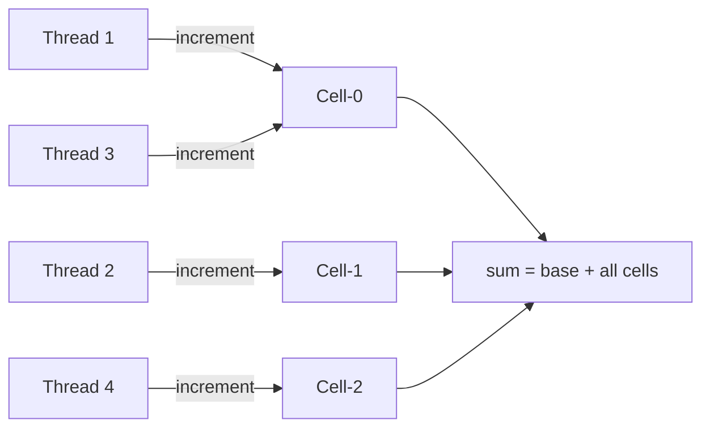
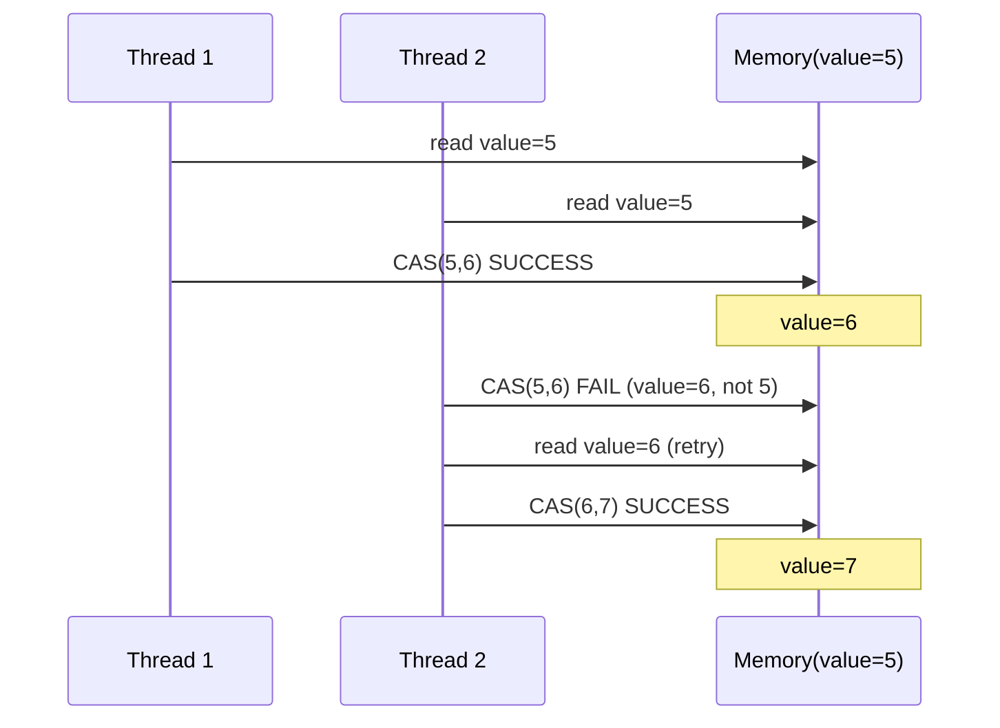

# Java Concurrency - L3 Atomic Operations

## Atomic Classes

### 🎯 Model Answer

**30 seconds:**
> Java's atomic classes (`AtomicInteger`, `AtomicLong`, `AtomicReference`,
> etc.) provide thread-safe single-variable operations without locks.
> They use CPU compare-and-swap (CAS) hardware instructions. Operations
> like `incrementAndGet()`, `compareAndSet()`, and `getAndUpdate()` are
> atomic - no other thread can observe an intermediate state. Use them
> instead of `synchronized int++` for counters, flags, and references
> where lock overhead is undesirable.

**3 minutes (Senior):**
> The atomic classes in `java.util.concurrent.atomic` fall into four
> families: scalars (`AtomicInteger`, `AtomicLong`, `AtomicBoolean`),
> references (`AtomicReference<V>`, `AtomicStampedReference<V>`,
> `AtomicMarkableReference<V>`), field updaters (`AtomicIntegerFieldUpdater`),
> and accumulators (`LongAdder`, `LongAccumulator`).
>
> The key API: `compareAndSet(expected, update)` - atomically sets to
> `update` if current value is `expected`, returns true if the swap
> happened. This is the building block for all other operations. All
> "get-and-X" operations use a CAS retry loop: read, compute new value,
> CAS; if CAS fails (another thread changed the value), retry.
>
> The ABA problem: `compareAndSet(A, B)` succeeds if value is A. But
> what if another thread changed A→B→A? CAS sees A and believes nothing
> changed, but the value WAS changed in between. `AtomicStampedReference`
> adds a version stamp to detect this.
>
> `LongAdder` vs `AtomicLong` for high-contention counters: `LongAdder`
> maintains a base value + per-CPU-stripe array. Increments go to the
> current thread's stripe (no contention). `sum()` aggregates. At high
> thread counts, LongAdder outperforms AtomicLong by 10-100x.

**Framework:** WHAT → WHY → HOW → TRADE-OFF → EXAMPLE

*Adapting up:* Discuss `VarHandle` (Java 9+) as the low-level
replacement for `Unsafe`-based atomics, `MemorySegment` and the
alignment requirements for CAS, and when LMAX Disruptor's lock-free
ring buffer is a better choice than atomic primitives.

*Adapting down:* "Atomic classes are variables with built-in thread
safety for simple operations like increment and compare-and-swap.
No locks needed - the CPU handles the atomicity."

**Blank Mind Recovery:**

**(1) Restate:** "So you are asking about atomic classes - let me
explain the CAS mechanism and the main use cases."

**(2) First principles:** "From first principles: incrementing a
counter requires read-modify-write. Without atomicity, two threads
can read the same value and both increment, losing one increment.
CAS makes this a single atomic instruction at the CPU level."

**(3) Bridge:** "AtomicInteger is like a locker with a combination:
you can change what's inside, but only if you know the current value.
If someone else changed it since you last looked, your change fails
and you look again."

---

### 📘 Concept Explanation

**What it is:**
`java.util.concurrent.atomic` provides classes for lock-free thread-safe
operations on single variables using hardware CAS instructions. Each
class wraps a value and exposes atomic read-modify-write operations.

**The problem it solves:**
Thread-safe counter/reference updates without synchronization overhead.
`synchronized int++` involves lock acquisition, memory barrier, and
lock release. CAS is a single instruction on modern CPUs.

**How it works:**
```
CAS operation (hardware instruction):

atomic compareAndSet(expected, newValue):
    current = read(address)
    if current == expected:
        write(address, newValue)
        return true
    else:
        return false   // someone else changed it

getAndIncrement() implementation:
    while(true):
        current = get()
        next = current + 1
        if compareAndSet(current, next): return current
        // else: retry (someone else incremented first)
```

Class hierarchy:
```
AtomicInteger        - int operations
AtomicLong           - long operations
AtomicBoolean        - boolean flag
AtomicReference<V>   - object reference operations
AtomicIntegerArray   - int[] with atomic element operations
AtomicLongArray      - long[] with atomic element operations
AtomicReferenceArray<V> - V[] with atomic element operations
AtomicStampedReference<V> - reference + version stamp (ABA fix)
AtomicMarkableReference<V> - reference + boolean mark
LongAdder            - high-contention counter (striped)
LongAccumulator      - high-contention accumulator (any function)
DoubleAdder          - high-contention double accumulator
```

**The key insight:**
CAS is optimistic: assume no conflict, try the update, retry on
conflict. Synchronized is pessimistic: assume conflict, acquire the
lock before update, no retry needed. CAS wins at low-to-medium
contention. At extremely high contention, CAS retry loops waste CPU
(spinning). `LongAdder` solves this with striping.

**When to use it:**
- High-read, low-write shared counters (hit counters, request counts)
- Shared flags/references (current leader, current config)
- Lock-free data structure building blocks
- Performance-critical counter operations

**When NOT to use it:**
- Multiple variable updates that must be atomic together: use
  synchronized or StampedLock (CAS only covers one variable at a time)
- High-contention counters: use LongAdder (better scaling)
- Complex invariants: use synchronized (clearer, correct, less error-prone)

**Alternatives:**
- `synchronized` on a method/block: simpler, handles multiple variables
- `LongAdder`: better for high-contention counters
- `VarHandle` (Java 9+): lower-level CAS on arbitrary fields
- `volatile` long: read/write atomic but no CAS support

---

### 💻 Code Example

> **Code walkthrough:** The BAD example uses a non-atomic `++` operation
> causing lost updates under concurrency. The GOOD example uses
> AtomicInteger for lock-free increment. The production example shows
> `AtomicReference` for lock-free reference update with a custom
> compare-and-set pattern.

```java
// BAD: non-atomic increment loses updates under concurrency
class Counter {
    private int count = 0; // NOT volatile, NOT synchronized

    // Two threads both read 5, both write 6 -> lost an increment
    public void increment() { count++; } // READ-MODIFY-WRITE, not atomic

    public int get() { return count; }
}
```

```java
// GOOD: AtomicInteger for lock-free thread-safe counter
class Counter {
    private final AtomicInteger count = new AtomicInteger(0);

    public void increment() { count.incrementAndGet(); } // atomic
    public int get() { return count.get(); }

    // Conditional increment:
    public boolean incrementIfLessThan(int max) {
        while (true) {
            int current = count.get();
            if (current >= max) return false;
            if (count.compareAndSet(current, current + 1)) {
                return true;
            }
            // CAS failed: another thread incremented - retry
        }
    }
}
```

```java
// PRODUCTION: AtomicReference for lock-free config hot-swap
class ConfigService {
    private final AtomicReference<Config> current =
        new AtomicReference<>(Config.defaultConfig());

    // Lock-free, thread-safe hot configuration swap:
    public Config getConfig() {
        return current.get(); // single atomic read - no lock
    }

    public boolean updateConfig(Config expected, Config updated) {
        // Only update if the current config IS the expected one
        // (prevents lost updates if two threads update simultaneously)
        return current.compareAndSet(expected, updated);
    }

    // Using updateAndGet (Java 8+) for functional update:
    public Config applyPatch(UnaryOperator<Config> patch) {
        return current.updateAndGet(patch); // atomic read-compute-CAS
    }
}
```

---

### 🎓 Answers by Seniority

**Junior / Mid (0-5 years):**
> Atomic classes make single-variable operations thread-safe without
> locks. `AtomicInteger.incrementAndGet()` is the atomic version of
> `count++`. The most useful operations are `get()`, `set()`,
> `incrementAndGet()`, `decrementAndGet()`, `compareAndSet(expected, new)`,
> and `getAndUpdate(fn)`. They are backed by hardware compare-and-swap
> instructions, not by Java synchronized blocks. Use them for shared
> counters, flags, and references when you don't need to coordinate
> updates across multiple variables.

*Push deeper:* What is the ABA problem and which class addresses it?

---

**Senior / Staff (5+ years):**
> I use atomic classes for single-variable lock-free patterns: counters,
> generation counters, current-reference hot-swap. My selection rule:
> for counters under high contention (>= 4 threads), I prefer LongAdder
> which has far better scaling. For correctness over multiple variables,
> I use a lock - composing CAS operations across multiple variables
> is extremely error-prone. I watch for the ABA problem in lock-free
> data structures and use `AtomicStampedReference` when it's a risk.
> `VarHandle` in Java 9+ is the modern low-level alternative to atomic
> classes when I need field-level CAS without wrapping the field.

*Push deeper:* When does a CAS retry loop become pathological? What
is the performance difference between AtomicLong and LongAdder at
high thread counts?

---

### ⚠️ Common Misconceptions

**Misconception 1: "volatile int is the same as AtomicInteger."**
`volatile int` guarantees visibility (reads see the latest write) and
ordering but NOT atomicity of read-modify-write. `volatile int count++;`
is STILL not atomic - three operations (read, increment, write).
AtomicInteger.incrementAndGet() is atomic via CAS.

**Misconception 2: "Using two separate atomic operations is atomic
across both."**
```java
// NOT atomic: another thread can see x=1, y=0 (inconsistent)
AtomicInteger x = new AtomicInteger(0);
AtomicInteger y = new AtomicInteger(0);
x.incrementAndGet(); // atomic separately
y.incrementAndGet(); // atomic separately - but NOT together
```
For two variables to update atomically, use synchronized or StampedLock.

**Misconception 3: "AtomicInteger is always faster than synchronized."**
For low contention, both are comparable. For high contention with simple
operations, AtomicLong vs LongAdder: AtomicLong degrades under contention
(CAS retries increase). LongAdder is better for high-contention counters.
Synchronized is simpler and often fast enough - don't assume atomic
classes are always the right choice.

---

### 🚨 Failure Modes and Diagnosis

**Failure 1: ABA problem in lock-free code**
Symptom: subtle correctness bugs; operations appear to succeed but
state is inconsistent; no exceptions.
Cause: CAS checks value equality, not identity or change history.
Value A → B → A looks like "no change" to CAS.
Diagnosis: code review of lock-free algorithms for ABA-vulnerable patterns.
Fix: use `AtomicStampedReference<V>` to include a version number that
increments on every change: CAS fails if stamp (version) changed even
if value reverted to original.

**Failure 2: CAS spin loop starving under high contention**
Symptom: high CPU usage; throughput lower than expected; JMH shows
CAS retries dominating latency.
Cause: many threads contending on one AtomicLong; CAS fails and
retries in a tight loop (spinning wastes CPU cycles).
Diagnosis: JMH benchmark, or CPU profiler showing hot `compareAndSet`
call.
Fix: replace `AtomicLong` with `LongAdder` for pure counters. Use
exponential backoff in CAS loops for non-counter uses.

**Failure 3: Visible stale value after AtomicInteger update**
Symptom: threads reading AtomicInteger see old values.
Cause: cannot happen - reads from AtomicInteger.get() always see the
latest write (atomic classes use volatile fields internally).
Clarification: if seeing "stale" values, the stale data is in local
variables or cached fields outside the AtomicInteger, not in the
AtomicInteger itself.

---

### 🎯 Interview Deep-Dive

| Question Category | Time to Answer |
|---|---|
| Definition | 30-60 seconds |
| CAS mechanism | 2-3 minutes |
| ABA problem | 2-3 minutes |
| LongAdder | 2-3 minutes |
| Scenario | 2-3 minutes |
| Debugging | 2-3 minutes |
| VarHandle | 2-3 minutes |
| Comparison | 1-2 minutes |
| Advanced | 2-3 minutes |

---

**Q1 (Definition): What is the difference between AtomicInteger and
a volatile int?**

A: Two distinct guarantees:

`volatile int`:
- Visibility: a write to a volatile variable is immediately visible to
  all threads (no caching in registers or thread-local buffers)
- Ordering: writes/reads establish happens-before relationships
- NOT atomic for compound operations: `volatile count++` is THREE
  operations (read, increment, write) - still a race condition

`AtomicInteger`:
- Visibility: same as volatile (AtomicInteger uses volatile internally)
- Ordering: same visibility guarantees
- Atomic compound operations: `incrementAndGet()`, `compareAndSet()`,
  `getAndUpdate()` are single atomic operations using CAS

```java
// volatile: visibility OK, but compound operations are NOT atomic
volatile int count = 0;
// RACE: two threads both read 5, both write 6 -> count = 6 (lost one)
count++;

// AtomicInteger: compound operations are atomic
AtomicInteger count = new AtomicInteger(0);
// SAFE: atomic read-modify-write
count.incrementAndGet();
```

When to use `volatile` instead: for a flag that is only written by one
thread and read by others (`volatile boolean running`). The single
write makes atomicity unnecessary; only visibility is needed.

*What separates good from great:* `volatile` establishes a happens-before
relationship between the write and subsequent reads. All writes before
the `volatile` write are visible to threads that read the `volatile`
variable. This is used in the "double-checked locking" pattern:
```java
volatile Singleton instance;
// After reading `instance`, all writes made by the constructor are
// visible, because the volatile write in the constructor precedes the
// volatile read in getInstance().
```

---

**Q2 (CAS mechanism): Explain compareAndSet(). What does it return
and when does it fail?**

A: `compareAndSet(expectedValue, newValue)` is the fundamental atomic
operation. It atomically:
1. Reads the current value
2. Compares current value to `expectedValue`
3. If equal: writes `newValue` and returns `true`
4. If not equal: does nothing and returns `false`

The entire operation is atomic - no other thread can change the value
between the read and the write.

```java
AtomicInteger value = new AtomicInteger(10);

// Returns true: value was 10, now set to 20
boolean success = value.compareAndSet(10, 20);
// success = true, value = 20

// Returns false: value is now 20, not 10
boolean fail = value.compareAndSet(10, 30);
// fail = false, value still = 20
```

When CAS fails: another thread changed the value between when you
read it and when you tried to update it. The correct response is to
retry the operation with the new current value:

```java
// CAS retry loop - the standard idiom:
int newValue;
int current;
do {
    current = atomicVar.get();
    newValue = compute(current); // compute desired new value
} while (!atomicVar.compareAndSet(current, newValue));
// Loop exits when our CAS succeeds (no intervening change)
```

The `getAndUpdate(fn)` and `updateAndGet(fn)` methods implement this
loop for you:
```java
// Equivalent to the retry loop above:
atomicVar.updateAndGet(current -> compute(current));
```

*What separates good from great:* The retry loop is "liveness but not
progress" - under extreme contention, a thread can retry indefinitely
if other threads keep preempting its CAS. This is an infinite loop
in theory, but in practice converges quickly because each retry
represents real progress by some thread in the system. Lock-free !=
wait-free. Wait-free algorithms guarantee bounded retries per thread;
lock-free algorithms only guarantee system-wide progress.

---

**Q3 (ABA problem): What is the ABA problem and how is it addressed?**

A: The ABA problem occurs in CAS-based algorithms when:

1. Thread T1 reads value A
2. Thread T2 changes A → B
3. Thread T2 changes B → A (back to A)
4. Thread T1 CAS: current is A == expected A → success

T1's CAS succeeds, but the value WAS changed in between. T1 wrongly
assumes "nothing changed since my read."

Example in a lock-free stack:
```
Stack: A → B → C
T1 reads top = A (wants to pop A)
T2 pops A, pops B, pushes A back. Stack: A → C (B is freed/reused)
T1 CAS(top, A, B) -- succeeds! But B is now freed memory!
Stack: B → C (B is a dangling pointer)
```

The problem: CAS only compares values, not "did anything change."

Fix: `AtomicStampedReference<V>`:
```java
AtomicStampedReference<Node> top =
    new AtomicStampedReference<>(headNode, 0); // (value, stamp)

// When updating, increment stamp:
int[] stampHolder = new int[1];
Node currentTop = top.get(stampHolder);
int currentStamp = stampHolder[0];

// CAS fails if either value OR stamp changed:
top.compareAndSet(
    currentTop, newTop,     // expected/new value
    currentStamp, currentStamp + 1); // expected/new stamp
```

`AtomicMarkableReference<V>`: simpler - adds a boolean mark instead
of an integer stamp. For "mark this reference as deleted" patterns
in lock-free linked lists.

In practice: ABA is only a problem in certain lock-free algorithms
(lock-free queues, stacks, linked lists). For simple counters and
flags, ABA is irrelevant.

*What separates good from great:* The stamp is a logical counter - it
doesn't need to be globally unique or overflow-safe. Even with stamp
overflow (wrapping back to 0), if the stamp cycles at 2^32 operations,
it would require precisely 2^32 operations between T1's read and T1's
CAS - practically impossible in all but the most adversarial conditions.

---

**Q4 (LongAdder): When should you use LongAdder instead of AtomicLong?**

A: Use `LongAdder` when you have high-contention concurrent increments
(many threads incrementing the same counter simultaneously).

How LongAdder works: maintains a volatile `base` value + an array of
`Cell` objects (one per CPU, lazily initialized). Increments attempt
to go to the current thread's Cell (using thread ID as index).
No contention if threads hash to different Cells. `sum()` aggregates
base + all cells.

Performance difference (approximate, depends on hardware):

| Threads | AtomicLong | LongAdder |
|---|---|---|
| 1 | ~10 ns | ~15 ns (overhead) |
| 4 | ~30 ns | ~12 ns |
| 16 | ~100+ ns | ~12 ns |
| 64 | ~500+ ns | ~12 ns |

Selection rules:
- High read frequency + infrequent increment: AtomicLong
  (reads are cheap: single volatile load)
- High write frequency (many threads incrementing): LongAdder
  (`sum()` has overhead: iterates all cells)
- Need `compareAndSet()`: AtomicLong (LongAdder doesn't have CAS)
- Need consistent snapshot (read + write atomically related): AtomicLong

```java
// Metrics counter: high-contention, infrequently read
LongAdder requestCount = new LongAdder();
// Each request thread:
requestCount.increment(); // near-zero contention
// Dashboard (reads every 10 seconds):
long total = requestCount.sum(); // slightly heavier, but rare
```

*What separates good from great:* `LongAdder.sum()` is NOT atomic with
respect to ongoing increments. A snapshot read of the counter while
threads are incrementing may reflect some increments but not others.
For metrics (approximate count is fine), this is acceptable. For a
counter that needs an exact consistent snapshot, AtomicLong.get() is
the correct choice.

---

**Q5 (Scenario): Implement a thread-safe statistics collector using
atomic classes.**

A:
```java
class RequestStats {
    private final LongAdder totalRequests = new LongAdder();
    private final LongAdder totalErrors   = new LongAdder();
    // Running sum of latency (nano): use LongAdder for writes
    private final LongAdder totalLatencyNs = new LongAdder();
    // Max latency: AtomicLong with CAS for max-update
    private final AtomicLong maxLatencyNs  = new AtomicLong(0);

    void recordRequest(long latencyNs, boolean error) {
        totalRequests.increment();
        totalLatencyNs.add(latencyNs);
        if (error) totalErrors.increment();

        // CAS loop to update max (only write if new max):
        long currentMax;
        do {
            currentMax = maxLatencyNs.get();
            if (latencyNs <= currentMax) break; // not a new max
        } while (!maxLatencyNs.compareAndSet(currentMax, latencyNs));
    }

    StatsSnapshot snapshot() {
        long requests = totalRequests.sum();
        long errors   = totalErrors.sum();
        long totalNs  = totalLatencyNs.sum();
        long maxNs    = maxLatencyNs.get();
        double avgNs  = requests > 0
            ? (double) totalNs / requests
            : 0.0;
        return new StatsSnapshot(requests, errors, avgNs, maxNs);
    }
}
```

Design decisions:
- LongAdder for counters (high-write, infrequent read)
- AtomicLong + CAS loop for max (conditional update)
- snapshot() is approximate (not atomically consistent) - acceptable
  for monitoring metrics
- updateAndGet() for max is cleaner: `maxLatencyNs.updateAndGet(
  m -> Math.max(m, latencyNs))` - but computes max even if no update
  needed (minor inefficiency)

*What separates good from great:* The `snapshot()` reads are not
atomically consistent - `totalRequests.sum()` and `totalErrors.sum()`
are read at different moments. A request that finishes between the
two reads could be counted in `totalRequests` but not `totalErrors`.
For monitoring, this is acceptable. For financial counting or audit
logs, snapshot needs proper synchronization.

---

**Q6 (Debugging): AtomicInteger.incrementAndGet() is showing lower
values than expected. How do you diagnose?**

A: The most common cause: `AtomicInteger.incrementAndGet()` is being
called correctly, but the result is being read from a DIFFERENT,
non-atomic path.

Step 1: Verify the AtomicInteger is THE same object everywhere.
```java
// BUG: two different AtomicInteger objects
class Service {
    AtomicInteger counter = new AtomicInteger(); // field A
    void count() { counter.incrementAndGet(); }
}
// Main thread reads a different instance:
service.counter.get(); // right field, but is it the same instance?
```

Step 2: Check for accidental re-initialization.
If the AtomicInteger field is non-final and something is assigning a
new `AtomicInteger(0)` to it (e.g., in a reset method), previous
increments are lost.

Step 3: Check LongAdder.sum() approximate issue.
If using `LongAdder.sum()` and it reads low: `sum()` is a non-atomic
snapshot. Under heavy write contention, some increments may not be
reflected at the exact moment of `sum()`. This is expected behavior.

Step 4: Thread safety check - is incrementAndGet() actually called?
Add logging or a breakpoint. Verify the increment is on the right object.

Step 5: Check for integer overflow.
`AtomicInteger` is 32-bit. At 2^31 (2.1 billion), it overflows to
negative values. Use `AtomicLong` for unbounded counters.

*What separates good from great:* The most common "AtomicInteger seems
wrong" bug is reading the field after creating a new instance elsewhere
(re-initialization). `final AtomicInteger counter = new AtomicInteger()`
prevents re-assignment and is the correct idiom.

---

**Q7 (VarHandle): How does VarHandle relate to atomic classes?**

A: `VarHandle` (Java 9+) is the low-level mechanism underlying atomic
operations, replacing `sun.misc.Unsafe`. It provides CAS and other
atomic operations on fields, array elements, and memory segments.

AtomicInteger vs VarHandle:
```java
// AtomicInteger: wraps value in object, convenient API
AtomicInteger counter = new AtomicInteger(0);
counter.incrementAndGet();
counter.compareAndSet(expected, newValue);

// VarHandle: operates on existing field, no wrapper object
class Counter {
    volatile int count = 0; // field must be volatile for CAS
    private static final VarHandle COUNT;
    static {
        COUNT = MethodHandles.lookup()
            .findVarHandle(Counter.class, "count", int.class);
    }
    void increment() {
        COUNT.getAndAdd(this, 1); // CAS on the existing field
    }
    boolean casUpdate(int expected, int update) {
        return COUNT.compareAndSet(this, expected, update);
    }
}
```

When to use VarHandle over AtomicInteger:
- Avoiding the wrapper object overhead: AtomicInteger adds 16 bytes
  object overhead; VarHandle operates directly on a field
- Existing class with many volatile fields: avoid wrapping each in
  an atomic object
- Library/framework code: tighter control over memory layout and access
- Replacing Unsafe-based code: VarHandle is the safe, public alternative

AtomicXxx classes still the right choice for: application code where
convenience matters, simpler API, no field layout concern.

*What separates good from great:* VarHandle also provides different
memory ordering modes: `get()` (plain), `getVolatile()`, `getAcquire()`,
`getOpaque()`. Plain mode is the weakest (no synchronization guarantee);
volatile is the strongest. For expert lock-free programming, choosing
the minimum necessary ordering mode reduces memory barrier overhead.

---

**Q8 (Comparison): AtomicReference vs synchronized block for
object reference updates?**

A: Both provide thread-safe reference updates. The choice depends on
the use case:

AtomicReference:
- Single reference swap: thread-safe `get()`, `set()`, `compareAndSet()`
- No locking: better throughput under low contention
- Lock-free: a slow/dead thread can't hold the lock
- No ability to coordinate with other variables atomically

synchronized:
- Multiple variables: can update N fields atomically in one block
- Complex invariants: easier to reason about compound operations
- Re-entrant: the same thread can enter multiple times
- More overhead, but simpler to use correctly

```java
// AtomicReference: hot-swap a single config reference
AtomicReference<Config> config = new AtomicReference<>(defaultConfig);
config.set(newConfig); // lock-free write
config.get();         // lock-free read

// synchronized: when update involves multiple related fields
synchronized(lock) {
    this.config = newConfig;
    this.configVersion++;    // both must update atomically
    this.lastUpdate = now;
}
```

The "prefer AtomicReference" rule is only correct for single-reference
updates. For invariants spanning multiple fields, synchronized is
correct and simpler.

*What separates good from great:* `AtomicReference.updateAndGet(fn)`
applies a function atomically: reads current, applies fn, CAS to
new result. Retries if CAS fails. Use this instead of the manual
CAS retry loop. Caveat: `fn` may be called multiple times (on retry)
- it must be side-effect-free.

---

**Q9 (Advanced): What is LongAccumulator and when is it better than
LongAdder?**

A: `LongAccumulator(accumulator, identity)` is a generalization of
`LongAdder`. Where `LongAdder` only adds, `LongAccumulator` applies
any binary associative function.

```java
// LongAdder: only sums
LongAdder sum = new LongAdder();
sum.accumulate(5); // sum += 5

// LongAccumulator: any associative operation
LongAccumulator max = new LongAccumulator(
    Math::max, Long.MIN_VALUE); // max(current, new) with identity MIN_VALUE
max.accumulate(42);
max.accumulate(100);
max.accumulate(7);
long currentMax = max.get(); // 100

LongAccumulator min = new LongAccumulator(
    Math::min, Long.MAX_VALUE);
```

The accumulator function must be: associative, commutative, and the
identity must be a true identity: `fn(identity, x) = x`.

Common uses:
- Running maximum: `Math::max` with identity `Long.MIN_VALUE`
- Running minimum: `Math::min` with identity `Long.MAX_VALUE`
- Running product: `(a, b) -> a * b` with identity 1

LongAccumulator vs AtomicLong for max tracking:
- AtomicLong max: CAS loop, contention at high thread counts
- LongAccumulator max: striped (like LongAdder), near-zero contention
- LongAccumulator is 3-10x faster than AtomicLong for max tracking
  at high thread counts

Limitation: `get()` returns the combined result but not a consistent
snapshot (same as LongAdder). The accumulator function must be
commutative and associative for the result to be correct regardless
of operation ordering.

*What separates good from great:* `DoubleAdder` and `DoubleAccumulator`
provide the same striped-accumulation for doubles. For floating-point
statistics (mean, max latency in seconds), these avoid casting to/from
long.

---

### ⚖️ Comparison Table

| Class | Use Case | CAS | Striped | Consistent Read |
|---|---|---|---|---|
| AtomicInteger/Long | Counter, CAS patterns | Yes | No | Yes |
| AtomicBoolean | Flags | Yes | No | Yes |
| AtomicReference | Reference swap | Yes (==) | No | Yes |
| AtomicStampedRef | ABA-safe CAS | Yes (value+stamp) | No | Yes |
| LongAdder | High-contention counter | No (accumulate) | Yes | Approximate |
| LongAccumulator | High-contention fn | No (accumulate) | Yes | Approximate |

**The deciding factor:**
Need CAS: AtomicXxx. High-write counter: LongAdder. High-write accumulate: LongAccumulator. ABA risk: AtomicStampedReference.

---

### 🏛️ System Design

*(Omit: L3 intermediate - atomic operations in distributed lock-free
systems at L4/L5.)*

---

### 📊 Diagram

```
CAS Retry Loop:

Thread 1:                   Thread 2:
read current=5              read current=5
compute next=6              compute next=6
CAS(5,6) -> SUCCESS         CAS(5,6) -> FAIL (T1 won)
                            retry:
                            read current=6
                            compute next=7
                            CAS(6,7) -> SUCCESS

LongAdder striped:
           base=0
Cell[0]=3 Cell[1]=4 Cell[2]=2  (per-thread)
sum() = 0+3+4+2 = 9
```



> **Diagram walkthrough:** LongAdder's striped architecture distributes
> increments across per-thread (or per-CPU) cells. Thread 1 and Thread 3
> hash to Cell-0; Thread 2 hashes to Cell-1; Thread 4 hashes to Cell-2.
> Each thread increments its cell using CAS - contention only occurs
> within a cell (2 threads sharing Cell-0 vs all 4 threads sharing one
> AtomicLong). The `sum()` operation aggregates the base value plus all
> cells, trading read cost for write scalability. This makes LongAdder
> 3-10x faster than AtomicLong under high write contention.

---
---

## Compare-and-Swap (CAS)

### 🎯 Model Answer

**30 seconds:**
> Compare-and-swap (CAS) is a hardware atomic instruction that reads a
> memory location, compares it to an expected value, and writes a new
> value only if the comparison succeeds - all as a single uninterruptible
> operation. Java's `AtomicInteger.compareAndSet(expected, update)` maps
> directly to this CPU instruction (`CMPXCHG` on x86). CAS is the
> foundation of all lock-free algorithms and Java's atomic classes,
> locks (AQS), and non-blocking data structures.

**3 minutes (Senior):**
> CAS enables lock-free programming: instead of acquiring a lock before
> modifying state, a thread reads the current state, computes the desired
> new state, then atomically checks-and-updates. If another thread
> modified the state in between, CAS fails and the thread retries.
> This "optimistic concurrency" model outperforms locking at low-to-medium
> contention because: (1) no thread can block another (no lock held),
> (2) there is no OS-level thread blocking (no context switches),
> (3) hardware can pipeline and optimize.
>
> The cost of CAS failure: on x86, CAS (`CMPXCHG`) issues a cache
> coherence protocol message (`LOCK` prefix, or `MESI` invalidation).
> Under high contention, many threads fail CAS and retry, each generating
> coherence traffic. This is the "CAS storm" - why AtomicLong degrades
> at high thread counts while LongAdder (striped CAS) does not.
>
> AQS (AbstractQueuedSynchronizer) uses CAS to manage the state field
> (lock state, semaphore count) and to manage the queue of waiting threads.
> This makes ReentrantLock, Semaphore, CountDownLatch, and CyclicBarrier
> all backed by CAS at the lowest level.

**Framework:** WHAT → WHY → HOW → TRADE-OFF → EXAMPLE

*Adapting up:* Discuss CMPXCHG8B / CMPXCHG16B for 64-bit/128-bit CAS,
`LL/SC` (Load-Linked/Store-Conditional) on ARM (the RISC alternative
to CMPXCHG that is stronger against ABA), and memory ordering models
(acquire/release semantics for CAS operations).

*Adapting down:* "CAS is like updating a document with version control:
you edit the document only if your copy is the latest version. If
someone else updated it while you were editing, your save fails and
you must re-read and re-edit."

**Blank Mind Recovery:**

**(1) Restate:** "So you are asking about CAS - the hardware instruction
that makes lock-free programming possible."

**(2) First principles:** "From first principles: to update shared
state, you need a way to say 'if nobody changed this since I read it,
update it.' That's CAS - it atomically checks and updates in one
instruction."

**(3) Bridge:** "CAS is like an atomic optimistic lock: take a snapshot,
try to commit your changes, fail if someone else changed it since your
snapshot, retry with the new snapshot."

---

### 📘 Concept Explanation

**What it is:**
Compare-and-swap is a CPU instruction that atomically compares a memory
location to an expected value and, if they match, updates it to a new
value. The operation returns success/failure. In Java, it surfaces as
`compareAndSet(expected, newValue)` on atomic classes.

**The problem it solves:**
Safe shared-state updates without mutual exclusion locks. Locks are
expensive (OS-level, context switches) and can cause priority inversion
and deadlock. CAS provides safe updates using hardware guarantees.

**How it works (hardware level):**
```
x86 CMPXCHG instruction:
  LOCK CMPXCHG [memory], newValue
  ; Implicitly: compare [memory] with EAX
  ; If equal: store newValue to [memory], set ZF=1
  ; If not equal: load [memory] into EAX, set ZF=0

  // "LOCK" prefix issues a cache-line lock (MESI invalidation)
  // ensuring exclusive access during read-compare-write

ARM LL/SC alternative:
  LDAXR x0, [addr]   // Load-Acquire Exclusive
  ; compare x0 to expected
  STLXR x1, newVal, [addr]  // Store-Release Exclusive
  ; fails (returns 1) if another CPU wrote [addr] since LDAXR
  ; retry loop if STLXR fails
```

```
Java CAS loop pattern:
while (true) {
    V current = get();       // read current value
    V next = compute(current); // compute desired new value
    if (compareAndSet(current, next)) {
       return next;           // CAS succeeded
    }
    // else: retry (another thread changed value)
}
```

**The key insight:**
CAS is "optimistic" - it assumes no conflict and proceeds. If a conflict
is detected (CAS fails), it retries. This is efficient when conflicts
are rare (low contention). At high contention, CAS loops spin (waste
CPU) and generate cache coherence traffic (memory bus contention).

**Memory ordering and CAS:**
A successful CAS operation on x86 is a full memory barrier: all
writes by the winning thread become visible before the CAS, and all
subsequent reads by other threads see those writes. This is the
"release" semantic of a successful CAS.

**When to use CAS patterns:**
- Building lock-free data structures (queues, stacks, linked lists)
- Counter increment (AtomicInteger)
- Conditional update (update only if value matches expectation)
- State machine transitions (move to new state only from expected old state)

**When NOT to use CAS:**
- Multiple variable coordination: CAS is only for one word at a time
- High-contention tight loops: consider LongAdder (striped) or locks
- Complex invariants: locks are simpler and less error-prone

---

### 💻 Code Example

> **Code walkthrough:** The BAD example shows a non-atomic
> read-modify-write creating a race. The GOOD example shows the CAS
> retry loop pattern used by all atomic classes. The production example
> shows building a lock-free stack using CAS.

```java
// BAD: non-atomic check-then-act (race condition)
class NonAtomicStateMachine {
    private String state = "INIT";

    // RACE: two threads both see "INIT", both transition to "RUNNING"
    synchronized void transition(String from, String to) {
        if (state.equals(from)) state = to; // not atomic check+update
    }
}
```

```java
// GOOD: CAS-based state machine (lock-free)
class AtomicStateMachine {
    private final AtomicReference<String> state =
        new AtomicReference<>("INIT");

    // Only one thread can succeed the transition at a time:
    boolean transition(String from, String to) {
        return state.compareAndSet(from, to);
        // returns true: transition succeeded
        // returns false: state changed since our read (someone else won)
    }
}
```

```java
// PRODUCTION: lock-free stack using CAS (Treiber stack)
class LockFreeStack<T> {
    private final AtomicReference<Node<T>> top =
        new AtomicReference<>(null);

    void push(T value) {
        Node<T> newHead = new Node<>(value);
        Node<T> oldHead;
        do {
            oldHead = top.get();     // read current top
            newHead.next = oldHead;  // new node points to current top
        } while (!top.compareAndSet(oldHead, newHead));
        // CAS: set top to newHead only if still == oldHead
        // If another thread pushed in between, oldHead is stale:
        // CAS fails, retry with new oldHead
    }

    T pop() {
        Node<T> oldHead;
        Node<T> newHead;
        do {
            oldHead = top.get();         // read current top
            if (oldHead == null) return null; // empty stack
            newHead = oldHead.next;      // next node becomes new top
        } while (!top.compareAndSet(oldHead, newHead));
        // CAS: set top to newHead only if still == oldHead
        return oldHead.value;
    }

    record Node<T>(T value, Node<T> next) {
        Node(T value) { this(value, null); }
    }
}
```

---

### 🎓 Answers by Seniority

**Junior / Mid (0-5 years):**
> CAS is how atomic classes work internally. `compareAndSet(expected, new)`
> is a single atomic hardware instruction: it reads a value, checks if
> it equals `expected`, and if so writes `new`. It's used in a retry loop:
> read the current value, compute the new value, try to CAS, retry if
> another thread changed the value in between. This is how `incrementAndGet()`
> works: read 5, compute 6, CAS(5,6), retry if CAS fails. No locks needed
> because the CPU handles the atomicity.

*Push deeper:* What is the ABA problem with CAS and which classes solve it?

---

**Senior / Staff (5+ years):**
> CAS is the foundation of Java's entire concurrency stack: AQS (which
> backs ReentrantLock, Semaphore, CountDownLatch, etc.) manages its state
> with a single CAS field. The important limits: CAS is a single-word
> operation (one reference or one int/long). Multi-word atomicity requires
> either a lock or a carefully designed algorithm (like STM or CAS2 where
> available). The performance ceiling: at high contention, CAS storms
> on a single memory location saturate the cache-coherence bus. The fix
> is striping (LongAdder) or a different algorithm. For lock-free data
> structure design, I use established algorithms (Treiber stack, Michael-Scott
> queue) rather than designing new ones - novel lock-free algorithms
> are notoriously difficult to get correct.

*Push deeper:* How does the memory model interact with CAS? What
happens-before relationships does a successful CAS establish?

---

### ⚠️ Common Misconceptions

**Misconception 1: "CAS is always faster than synchronization."**
At low contention: CAS is faster (no OS involvement, no context switch).
At high contention: CAS loops spin (burning CPU), while a lock
would put threads to sleep (no wasted CPU). The crossover point
depends on the hardware, contention level, and loop work. Always
benchmark before claiming CAS wins.

**Misconception 2: "Lock-free means wait-free."**
Lock-free: at least one thread makes progress. Under high contention,
some threads may retry indefinitely (livelock risk). Wait-free:
every thread completes in bounded steps regardless of other threads.
Java's atomic classes are lock-free but not wait-free.

**Misconception 3: "CAS eliminates all race conditions."**
CAS makes a SINGLE read-modify-write atomic. If your operation involves
reading TWO variables and updating them, two separate CAS operations
are NOT atomic together. For multi-variable invariants, CAS alone is
insufficient.

---

### 🚨 Failure Modes and Diagnosis

**Failure 1: CAS storm - high CPU, low throughput**
Symptom: CPU pegged at 100%; throughput much lower than expected;
profiler shows hot `compareAndSet` or `CMPXCHG` instructions.
Cause: many threads contending on a single atomic variable; CAS
retry loops burning CPU.
Diagnosis: JMH microbenchmark varying thread counts; monitor CAS
failure rate.
Fix: replace AtomicLong counter with LongAdder; use lock-striping for
data structures; reduce contention by sharding or partitioning.

**Failure 2: CAS livelock**
Symptom: threads run at full CPU but make no progress; no blocked
threads in thread dump (all RUNNABLE).
Cause: under adversarial scheduling, threads keep preempting each
other's CAS in an infinite cycle.
Diagnosis: thread dump shows all threads RUNNABLE in CAS retry loops.
Fix: add exponential backoff to CAS loops; switch to blocking approach
under high contention; use Lock.

**Failure 3: ABA correctness bug**
Symptom: no exception; subtle logic error; appears to work in tests
but fails in production under specific timing.
Cause: CAS-based algorithm vulnerable to ABA; CAS succeeds when it
should fail (value reverted to original between read and CAS).
Diagnosis: code review of lock-free algorithms; add version counters
or use AtomicStampedReference.

---

### 🎯 Interview Deep-Dive

| Question Category | Time to Answer |
|---|---|
| Definition | 30-60 seconds |
| Hardware | 2-3 minutes |
| Memory model | 2-3 minutes |
| AQS connection | 2-3 minutes |
| Lock-free vs wait-free | 1-2 minutes |
| CAS storm | 2-3 minutes |
| Implementation | 2-3 minutes |
| ARM difference | 2-3 minutes |
| Trade-off | 1-2 minutes |

---

**Q1 (Definition): How does CAS work at the hardware level?**

A: On x86 architecture, CAS maps to `CMPXCHG` with the `LOCK` prefix:

```nasm
LOCK CMPXCHG DWORD PTR [memory], newValue
; Implicitly compares [memory] with EAX register (expected value)
; If [memory] == EAX: writes newValue to [memory], sets ZF=1
; If [memory] != EAX: loads [memory] into EAX, sets ZF=0
; LOCK prefix: acquires cache-line exclusive ownership
; (MESI protocol: forces all other CPUs to invalidate their
;  copies before write completes)
```

The `LOCK` prefix doesn't lock the memory bus on modern x86 - it
locks the cache line via the MESI cache coherence protocol. Only the
cache line containing the target address is locked, not the entire
memory bus. This is why CAS has relatively low overhead at low contention.

Java `AtomicInteger.compareAndSet()` → `Unsafe.compareAndSetInt()` →
`LOCK CMPXCHG` (on x86). No OS call, no context switch, no thread
state change. Roughly 10-30 nanoseconds at low contention.

*What separates good from great:* The `LOCK` prefix stalls all CPUs
that have the same cache line in shared (S) state. When 16 threads
all try CAS on the same cache line simultaneously, all 16 generate
`LOCK CMPXCHG` instructions. Only one wins; the others must reload
the cache line and retry. This is the cache-line "ping pong" effect
that causes the CAS storm under high contention.

---

**Q2 (AQS connection): How does AQS use CAS?**

A: `AbstractQueuedSynchronizer` is the backing implementation for
most of Java's synchronizers. It uses CAS in two places:

1. State field management: AQS has a single volatile `int state` field.
   `compareAndSetState(expected, update)` is how subclasses implement
   `tryAcquire()` and `tryRelease()`:

```java
// ReentrantLock.FairSync.tryAcquire():
// Atomically claim the lock (state 0 -> 1)
protected boolean tryAcquire(int acquires) {
    if (getState() == 0 && !hasQueuedPredecessors() &&
        compareAndSetState(0, acquires)) {
        setExclusiveOwnerThread(Thread.currentThread());
        return true;
    }
    return false;
}
```

2. Wait queue management: the queue of waiting threads is a doubly
   linked list of `Node` objects. AQS uses CAS to atomically enqueue
   new nodes (compare tail to expected last node, update to new node).

```java
// Simplified enqueue CAS:
Node pred = tail;
node.prev = pred;
if (compareAndSetTail(pred, node)) { // CAS the tail pointer
    pred.next = node;
}
```

This means the ENTIRE Java lock ecosystem (ReentrantLock, Semaphore,
CountDownLatch, CyclicBarrier, ReadWriteLock) is built on 2 CAS fields.

*What separates good from great:* The AQS state field is the ONLY
point of contention in lock acquisition. All other operations (park,
unpark, queue management) are per-thread. This is why AQS-based locks
scale better than synchronized (which has JVM-internal lock word
contention + OS scheduler involvement).

---

**Q3 (Memory model): What memory guarantees does a successful CAS
provide?**

A: A successful `compareAndSet()` acts as a volatile read-write pair,
establishing happens-before relationships:

1. All writes by the current thread BEFORE the CAS are visible to
   any thread that observes the CAS's effect (reads the new value
   from the atomic variable).

2. All writes by other threads that happened-before THEIR modification
   to the atomic variable are visible to the current thread AFTER
   a successful CAS.

In practice: if thread T1 writes data to a set of fields, then does
CAS on an AtomicReference (publishing a new object), thread T2 doing
`get()` on the AtomicReference and seeing T1's new reference will
also see ALL of T1's writes to the published object. The CAS is the
"happens-before" edge.

```java
class DataPublisher {
    private volatile Object[] buffer = new Object[10];
    private final AtomicInteger writeIndex = new AtomicInteger(0);

    void publish(int slot, Object data) {
        buffer[slot] = data; // write data first
        // The CAS below establishes happens-before for the data write:
        writeIndex.compareAndSet(slot - 1, slot);
        // Any thread that sees writeIndex == slot is guaranteed
        // to see buffer[slot] = data
    }
}
```

*What separates good from great:* On x86, CMPXCHG has full sequential
consistency by default (total store order + LOCK prefix = all earlier
writes flushed before the CAS is visible). On ARM, explicit barriers
are needed. Java's `compareAndSet()` abstracts this - it ensures the
correct memory ordering on all platforms the JVM supports.

---

**Q4 (Lock-free vs wait-free): What is the difference and is Java
lock-free or wait-free?**

A: Definitions:

Blocking: a thread can be delayed by other threads indefinitely
(the OS can descheduled a thread holding a lock).

Lock-free: at least ONE thread makes progress in finite steps. Some
threads may be delayed, but the system as a whole advances.
Under adversarial scheduling, some threads may starve.

Wait-free: EVERY thread makes progress in bounded steps, regardless
of other threads. No thread can starve. This is the strongest guarantee.
Most implementations: `AtomicInteger.get()`, `AtomicInteger.set()`.

Obstruction-free: a thread makes progress when it runs in isolation.
The weakest of the three. Less commonly referenced.

Java atomic class analysis:
- `AtomicInteger.get()`: wait-free (single read)
- `AtomicInteger.set()`: wait-free (single write)
- `AtomicInteger.compareAndSet()`: lock-free (may fail and retry, but
  a successful CAS means some thread made progress)
- `AtomicInteger.incrementAndGet()`: lock-free (retry loop)
- `LongAdder.increment()`: lock-free (with potential resizing of cells)

In practice: the distinction between lock-free and wait-free rarely
matters for application code. Under reasonable scheduling (fair OS
scheduler, bounded task durations), lock-free CAS loops converge
quickly. The theoretical difference matters for real-time systems
with strict deadline requirements.

*What separates good from great:* True wait-free algorithms are
significantly more complex to implement. Java's `AtomicReferenceArray`
operations are wait-free (single indexed memory location). Treiber
stack push/pop is lock-free but not wait-free (a thread can be
repeatedly preempted). Michael-Scott queue is also lock-free. Building
wait-free variants of these requires significantly more complexity
(helping protocols).

---

**Q5 (CAS storm): Explain the CAS storm problem and how LongAdder
solves it.**

A: CAS storm occurs when many threads concurrently CAS the same memory
location, causing excessive cache-coherence traffic.

Mechanism:
- Thread T1 CAS on address X: acquires exclusive cache-line ownership
- Threads T2-T16 observe "invalidate" for cache line containing X
- All must fetch the new value from T1 before retrying CAS
- T1 wins; T2 wins the next round; T3 wins the following
- But in each round, N-1 threads get cache-line invalidations and
  retry. With N threads: O(N) invalidation messages per successful CAS.

Result: throughput does not scale with threads. At 16 threads,
an AtomicLong counter may achieve only 2-3x the throughput of 1 thread.

LongAdder solution (striped accumulation):
- Maintains an array of `Cell` objects (each Cell = one `long`)
- Threads hash to different Cells using thread ID
- Most increments go to different Cells - no cache-line conflict
- `sum()` aggregates: iterates cells + base value

With 16 threads hashing to 8+ Cells: at most 2 threads per Cell.
CAS contention is on 8 different cache lines (parallel). Total
CAS messages: O(N/stripes) instead of O(N).

Benchmark (approximate, 16 cores):
- AtomicLong at 16 threads: ~50M ops/sec
- LongAdder at 16 threads: ~500M ops/sec (10x faster)
- AtomicLong at 1 thread: ~250M ops/sec
- LongAdder at 1 thread: ~200M ops/sec (slight overhead)

*What separates good from great:* Cell initialization is lazy: starts
with just the base value (like AtomicLong). First contention creates
Cell[0]. More contention doubles the array. Cells cap at the next
power of 2 >= available CPUs. This makes LongAdder memory-efficient
at low concurrency and fast at high concurrency.

---

**Q6 (Implementation): Implement a lock-free queue using CAS.**

A: Michael-Scott queue (the standard lock-free queue algorithm):

```java
class LockFreeQueue<T> {
    private record Node<T>(T value, AtomicReference<Node<T>> next) {
        Node(T value) { this(value, new AtomicReference<>(null)); }
    }

    // sentinel node: head.next = first real element (or null if empty)
    private final AtomicReference<Node<T>> head;
    private final AtomicReference<Node<T>> tail;

    LockFreeQueue() {
        Node<T> sentinel = new Node<>(null);
        head = new AtomicReference<>(sentinel);
        tail = new AtomicReference<>(sentinel);
    }

    void enqueue(T value) {
        Node<T> newNode = new Node<>(value);
        while (true) {
            Node<T> curTail = tail.get();
            Node<T> tailNext = curTail.next().get();
            if (curTail == tail.get()) { // tail consistent?
                if (tailNext == null) {
                    // Tail points to last node; try to link new node:
                    if (curTail.next().compareAndSet(null, newNode)) {
                        // Try to update tail pointer (ok if it fails -
                        // another thread will advance it):
                        tail.compareAndSet(curTail, newNode);
                        return;
                    }
                } else {
                    // Tail not pointing to last node; advance it:
                    tail.compareAndSet(curTail, tailNext);
                }
            }
        }
    }

    T dequeue() {
        while (true) {
            Node<T> curHead = head.get();
            Node<T> curTail = tail.get();
            Node<T> headNext = curHead.next().get();
            if (curHead == head.get()) { // head consistent?
                if (curHead == curTail) {
                    if (headNext == null) return null; // empty
                    tail.compareAndSet(curTail, headNext); // advance tail
                } else {
                    T value = headNext.value();
                    if (head.compareAndSet(curHead, headNext)) {
                        return value;
                    }
                }
            }
        }
    }
}
```

In production: use `java.util.concurrent.ConcurrentLinkedQueue` which
is a proven Michael-Scott queue implementation. Implementing lock-free
data structures from scratch is extremely error-prone.

*What separates good from great:* The Michael-Scott queue uses TWO
tail advancement steps: the enqueue thread links the new node (CAS on
curTail.next), then tries to advance the tail pointer (CAS on tail).
If the enqueuing thread fails the second CAS (another thread advanced
it), that's OK - the invariant "tail points to last node or second-to-last"
is maintained. Other threads help advance the tail. This "helping"
protocol is what makes it lock-free (even if a thread dies after the
first CAS, another will complete the operation).

---

**Q7 (ARM difference): How does ARM implement CAS differently from x86?**

A: x86 uses CMPXCHG (compare-exchange) - a direct CAS instruction:

```nasm
LOCK CMPXCHG [memory], newValue
; Atomic: read, compare, conditionally write
```

ARM uses Load-Linked/Store-Conditional (LL/SC):

```nasm
LDAXR x0, [addr]    ; Load-Acquire Exclusive: read + mark exclusive
                    ; (LDAXR also has acquire semantics = memory barrier)
CMP   x0, expected  ; compare with expected
BNE   fail          ; branch if not equal (CAS fails)
STLXR x1, newVal, [addr] ; Store-Release Exclusive
                    ; Succeeds only if no other CPU wrote [addr] since LDAXR
                    ; x1 = 0 (success) or 1 (failure)
CBNZ  x1, retry     ; Retry if store failed
```

Key differences:

ABA resistance: LL/SC tracks exclusive access. If ANY write to the
cache line occurs between LL and SC (including write-then-write-back
to same value), SC fails. CMPXCHG only checks the value - ABA
(A→B→A) will succeed the CMPXCHG.

Spurious failure: on ARM, LL/SC can fail spuriously (without competing
write) due to context switch between LL and SC, or cache eviction.
This is why ARM retry loops must be tight (minimal instructions between
LDAXR and STLXR). Java's JIT handles this; user CAS loops see no
spurious failures.

Granularity: x86 CMPXCHG operates on 1, 2, 4, or 8 bytes. ARM LL/SC
covers the full cache line (up to 64 bytes), which means it's more
conservative but prevents ABA on the word.

*What separates good from great:* Java's `compareAndSet()` abstracts
these differences. The JVM guarantees that the implemented semantics
match the Java Memory Model specification regardless of CPU architecture.
Performance differences between x86 and ARM CAS are handled by the JIT.

---

**Q8 (Trade-off): What are the trade-offs between optimistic (CAS)
and pessimistic (lock-based) concurrency?**

A:

Optimistic (CAS):
- Advantages: no thread blocks another; no context switches on no-contention
  path; works well at low-to-medium contention
- Disadvantages: retry loops under high contention burn CPU; cannot
  span multiple variables; ABA problem in some algorithms; harder to
  reason about correctness; no fairness (threads can starve)

Pessimistic (lock-based):
- Advantages: simple to reason about; multi-variable invariants are
  easy; fair modes available; sleeping threads don't burn CPU
- Disadvantages: lock contention causes context switches and latency;
  deadlock risk; priority inversion; lock granularity affects performance

Decision guide:
- Single counter, low contention: AtomicLong (CAS)
- Single counter, high contention: LongAdder (striped CAS)
- Conditional single-reference update: AtomicReference CAS
- Multiple variable invariant: synchronized or ReentrantLock
- Read-heavy, write-rare: StampedLock (optimistic reads)
- Complex data structure, write-heavy: lock with fine granularity
- Read-heavy map: ConcurrentHashMap (segment CAS + synchronized buckets)

*What separates good from great:* The "always use CAS for performance"
is a misconception. The correct rule: use CAS for single-variable
lock-free patterns where contention is low. For everything else,
measure and choose based on the specific contention profile. Java
locks (backed by AQS with CAS) are already very well optimized and
often the right choice for clarity and safety.

---

**Q9 (Advanced): What is the relationship between CAS and the
Java Memory Model?**

A: The Java Memory Model (JMM) defines happens-before relationships.
CAS operations contribute to this model:

Volatile semantics of CAS: `AtomicInteger` stores its value in a
`volatile int value` field. Per JMM:
- A volatile write happens-before every subsequent volatile read
  of the same variable
- A successful CAS constitutes both a volatile read AND a volatile write

Happens-before chain:
```
Thread A: data = "result"   // write non-volatile field
Thread A: cas(0, 1)         // volatile write (successful CAS)

Thread B: value = atomic.get() // volatile read (sees 1 after A's CAS)
Thread B: use(data)            // GUARANTEED to see "result" because:
// A's non-volatile write -> A's volatile write (CAS)
// -> B's volatile read (get) -> B's non-volatile read
// happens-before chain spans the gap
```

This is how `AtomicReference` publication works: write to fields,
then CAS the reference into the AtomicReference. Any thread that
sees the new reference value (via volatile read) sees all the field
writes too.

An unsuccessful CAS: also a volatile read (observes the current value)
but NOT a volatile write (no value was changed). It still establishes
happens-before for the volatile READ part.

*What separates good from great:* The JMM's happens-before for CAS
means that `AtomicReference` can be used for safe publication of
immutable objects: construct the object, CAS the reference. Any thread
reading the reference via `get()` sees the fully constructed object.
This is stronger than `volatile` reference alone (volatile write
alone requires all writes to be visible before the volatile write,
which is guaranteed by the JMM's happens-before rule).

---

### ⚖️ Comparison Table

| Approach | Blocking | Contention Behavior | Fairness | Multi-var |
|---|---|---|---|---|
| CAS / lock-free | No | Degrades (CAS storm) | No guarantee | No (1 var) |
| Synchronized | Yes (OS) | Park thread, context switch | Depends on JVM | Yes |
| ReentrantLock | Yes | Park thread, AQS queue | Optional (fair=true) | Yes |
| LongAdder | No | Near-linear scale | No | Counter only |
| StampedLock | Configurable | Optimistic reads, then blocking | No | Yes (scope) |

**The deciding factor:**
Single variable, low contention: CAS. High-contention counter: LongAdder.
Multi-variable or complex invariant: lock. Read-heavy: StampedLock.

---

### 🏛️ System Design

*(Omit: L3 intermediate - CAS in distributed systems and consensus
algorithms at L4/L5.)*

---

### 📊 Diagram

```
CAS under high contention (cache-line ping-pong):

CPU 0: CAS(5,6) -> WIN  -> invalidates CPUs 1,2,3
CPU 1: CAS fails -> reload -> CAS(6,7) -> WIN -> invalidates others
CPU 2: CAS fails -> reload -> CAS(7,8) -> WIN -> invalidates others
CPU 3: CAS fails -> reload -> retry...

LongAdder striping:
CPU 0: Cell[0] CAS(3,4) -> WIN (no conflict with CPU 2)
CPU 1: Cell[1] CAS(2,3) -> WIN (no conflict with CPU 0)
CPU 2: Cell[0] CAS(4,5) -> WIN (after CPU 0 done)
CPU 3: Cell[1] CAS(3,4) -> WIN (after CPU 1 done)
```



> **Diagram walkthrough:** Thread 1 and Thread 2 both read value=5
> simultaneously. Thread 1 wins the CAS - setting value to 6 atomically.
> Thread 2's CAS fails because the value is now 6, not 5. Thread 2
> re-reads the current value (6), recomputes its desired new value (7),
> and retries. Thread 2's second CAS succeeds. This retry loop is the
> core mechanism of all lock-free algorithms. Under high contention
> with many threads, the retry rate increases, leading to the CAS storm
> where most CPU cycles are spent retrying rather than progressing.
