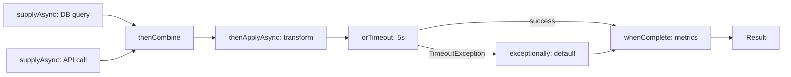
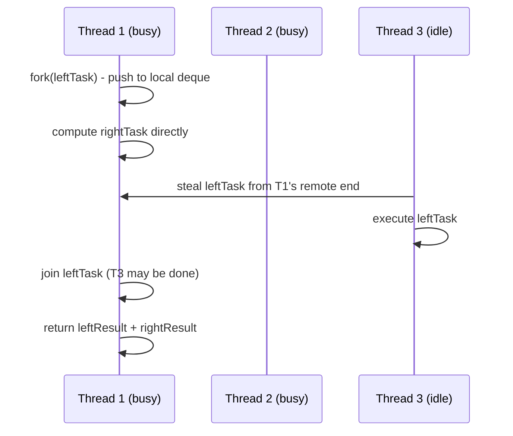

# Java Concurrency - L3 CompletableFuture

## CompletableFuture

### 🎯 Model Answer

**30 seconds:**
> `CompletableFuture` is Java's async programming model - it represents
> a computation that will complete in the future, with the ability to
> compose multiple async stages. You can chain operations with
> `thenApply()` (transform result), `thenCompose()` (flat-map to another
> future), `thenCombine()` (combine two futures), and handle exceptions
> with `exceptionally()`. Unlike `Future.get()` which blocks, the
> completion callback model allows non-blocking async pipelines.

**3 minutes (Senior):**
> `CompletableFuture<T>` implements both `Future<T>` (backward
> compatibility) and `CompletionStage<T>` (the composition API). The
> key insight: it separates the computation from the result, allowing
> you to attach callbacks that run when the computation completes,
> without blocking the current thread.
>
> The composition operators fall into three categories: transformation
> (`thenApply` - sync, `thenApplyAsync` - on executor), flat-map
> (`thenCompose` - returns another CompletableFuture, avoiding nested
> futures), and combination (`thenCombine` - zip two futures,
> `allOf` - wait for all, `anyOf` - first to complete).
>
> The executor choice is critical: all `*Async()` methods without an
> explicit executor use `ForkJoinPool.commonPool()`. The common pool is
> shared JVM-wide. Blocking operations in common pool threads degrade
> ALL users of parallel streams and CompletableFuture in the JVM.
> Always pass a dedicated executor for I/O-bound operations.
>
> Exception handling: `exceptionally(fn)` recovers from exceptions;
> `handle(fn)` processes both success and failure; `whenComplete(fn)`
> is a side-effect that sees both outcomes without changing the result.
> Uncaught exceptions don't surface until `get()` is called (wrapped
> in `ExecutionException`).

**Framework:** WHAT → WHY → HOW → TRADE-OFF → EXAMPLE

*Adapting up:* Discuss `CompletableFuture.failedFuture()`, timeout via
`orTimeout()` and `completeOnTimeout()` (Java 9+), the `complete()` /
`obtrudeValue()` methods for external completion, and how
CompletableFuture compares to reactive streams (Mono/Flux).

*Adapting down:* "CompletableFuture is a box that will eventually
contain a value. You can attach instructions for what to do when the
value arrives, without waiting for it."

**Blank Mind Recovery:**

**(1) Restate:** "So you are asking about CompletableFuture - let me
cover why it exists and how to chain async operations."

**(2) First principles:** "From first principles: blocking on a result
wastes a thread. CompletableFuture lets you say 'when A finishes, do B,
then when B finishes do C' - all non-blocking. Callbacks run when
results are ready."

**(3) Bridge:** "CompletableFuture is like a package with a note:
'when this arrives, do X with it, then send it to Y, then Z.' The
post office handles the handoff - you don't wait at the door."

---

### 📘 Concept Explanation

**What it is:**
`CompletableFuture<T>` is a `Future<T>` that can be completed
explicitly or via async computation, and supports method chaining for
building async processing pipelines. It implements `CompletionStage<T>`,
providing 50+ composition and combination methods.

**The problem it solves:**
`Future.get()` blocks the calling thread until the result is available.
For concurrent I/O operations (API calls, DB queries), blocking wastes
threads. CompletableFuture allows attaching callbacks to run when
results are ready, enabling non-blocking async pipelines.

**How it works:**
```
CompletableFuture lifecycle:
                           complete(value)
                         /
[pending] -----async--> [completing] --> [completed normally]
                         \
                           completeExceptionally(ex) --> [completed exceptionally]

Chain operators:
  thenApply(fn)         : T -> U (sync transform, same thread)
  thenApplyAsync(fn)    : T -> U (async, on executor)
  thenCompose(fn)       : T -> CompletableFuture<U> (flatMap)
  thenCombine(other, fn): (T, U) -> V (zip two futures)
  allOf(cf1, cf2, ...)  : waits for all (returns CF<Void>)
  anyOf(cf1, cf2, ...)  : first to complete

Exception handling:
  exceptionally(fn)     : Throwable -> T (recover)
  handle(fn)            : (T, Throwable) -> U (process both)
  whenComplete(fn)      : (T, Throwable) -> void (side effect)
```

```java
// Building an async pipeline:
CompletableFuture.supplyAsync(() -> fetchUser(userId), ioExecutor)
    .thenApplyAsync(user -> enrichWithPermissions(user), ioExecutor)
    .thenCombineAsync(
        CompletableFuture.supplyAsync(() -> loadPreferences(userId)),
        (user, prefs) -> buildResponse(user, prefs))
    .exceptionally(ex -> defaultResponse())
    .whenComplete((result, error) -> {
        if (error != null) metrics.recordError();
        else metrics.recordSuccess();
    });
```

**The key insight:**
`thenApply` vs `thenCompose`: `thenApply` maps `T → U`. When the
function returns a `CompletableFuture<U>`, you get
`CompletableFuture<CompletableFuture<U>>` - a nested future.
`thenCompose` flattens it to `CompletableFuture<U>`. Always use
`thenCompose` when the transformation is itself async (returns CF).

**When to use it:**
- Composing multiple independent async operations (fan-out then merge)
- Non-blocking async pipelines where callback chaining is cleaner
  than blocking sequential calls
- Running independent operations in parallel and combining results

**When NOT to use it:**
- Simple sequential async: using a single `supplyAsync` and immediately
  calling `get()` defeats the purpose; just use an executor directly
- Reactive streams with backpressure: use Project Reactor (Mono/Flux)
  which handles backpressure, cancellation, and streaming natively
- In Java 21 with virtual threads: structured concurrency
  (`StructuredTaskScope`) provides cleaner composition with virtual threads

**Alternatives:**
- `Future` + `ExecutorService`: simpler for non-composed async
- `ListenableFuture` (Guava): predecessor to CompletableFuture
- `Mono`/`Flux` (Project Reactor): reactive streams with backpressure
- `StructuredTaskScope` (Java 21): structured concurrency for virtual threads

**First-principles derivation:**
A concurrent program needs to express "do A and B in parallel, then
combine when both finish." Options: (1) block one thread on A's result,
compute B in another - wastes a thread. (2) Use callback: when A and B
finish, a continuation runs automatically. CompletableFuture implements
option 2 with a composable continuation monad pattern.

---

### 💻 Code Example

> **Code walkthrough:** The BAD example blocks two threads in sequence -
> the parallelism is wasted. The GOOD example runs both calls in parallel
> and combines results. The production example shows a full pipeline
> with timeout, exception handling, and executor isolation.

```java
// BAD: blocking sequential execution - no parallelism
UserProfile buildProfile(long userId) throws ExecutionException,
        InterruptedException {
    // These should run in parallel - they are independent!
    Future<User> userFuture = executor.submit(
        () -> fetchUser(userId));
    Future<List<Order>> ordersFuture = executor.submit(
        () -> fetchOrders(userId));

    // Blocks thread 1, then blocks thread 2 - SEQUENTIAL
    User user = userFuture.get();           // wait for user
    List<Order> orders = ordersFuture.get(); // wait for orders
    return buildProfile(user, orders);
}
```

```java
// GOOD: parallel execution with CompletableFuture
UserProfile buildProfile(long userId) {
    // Both fire simultaneously:
    CompletableFuture<User> userCF =
        CompletableFuture.supplyAsync(
            () -> fetchUser(userId), ioExecutor);
    CompletableFuture<List<Order>> ordersCF =
        CompletableFuture.supplyAsync(
            () -> fetchOrders(userId), ioExecutor);

    // Combine when BOTH are done (not blocked waiting):
    return userCF.thenCombine(ordersCF, this::buildProfile)
        .join(); // block only here, not during I/O
}
```

```java
// PRODUCTION: full pipeline with timeout + error handling + executor
CompletableFuture<ApiResponse> handleRequest(Request req) {
    return CompletableFuture
        .supplyAsync(() -> validate(req), cpuExecutor)
        .thenComposeAsync(
            valid -> callDownstream(valid), ioExecutor)
        .thenApplyAsync(
            result -> transform(result), cpuExecutor)
        // Java 9+: timeout if pipeline > 500ms
        .orTimeout(500, TimeUnit.MILLISECONDS)
        .exceptionally(ex -> {
            if (ex instanceof TimeoutException) {
                log.warn("Pipeline timed out");
                return ApiResponse.timeout();
            }
            log.error("Pipeline failed", ex);
            return ApiResponse.error(ex.getMessage());
        })
        .whenComplete((response, ex) -> {
            metrics.recordOutcome(response, ex);
        });
}
```

---

### 🎓 Answers by Seniority

**Junior / Mid (0-5 years):**
> `CompletableFuture` lets you run code asynchronously and chain
> operations to run when it finishes. `supplyAsync(() -> result)` starts
> async computation. `thenApply(fn)` transforms the result. `thenCompose(fn)`
> chains to another async computation. `join()` or `get()` blocks to
> get the final result. The key benefit: you can run multiple independent
> async operations in parallel and combine their results, rather than
> waiting for each one in sequence.

*Push deeper:* What is the difference between `thenApply` and
`thenCompose`? Give a concrete example where `thenCompose` is necessary.

---

**Senior / Staff (5+ years):**
> CompletableFuture's power is in combining async operations - allOf,
> thenCombine, and thenCompose cover most production patterns. My main
> concerns in code review: (1) executor choice - using the default common
> ForkJoinPool for blocking I/O operations will starve parallel streams
> JVM-wide. Always pass an explicit executor for I/O-bound stages.
> (2) Exception swallowing - if you don't handle exceptions, they're
> only visible when `get()` is called. Add `whenComplete` for logging,
> or `.exceptionally()` for recovery. (3) Java 9+ timeout operators
> (`orTimeout`, `completeOnTimeout`) are essential for production -
> hanging futures without timeout are a common outage cause.

*Push deeper:* How does `CompletableFuture.allOf()` behave when one
of the futures fails? Does it cancel the other futures?

---

### ⚠️ Common Misconceptions

**Misconception 1: "thenApply and thenCompose do the same thing."**
`thenApply` applies a function `T → U` to the result. If that function
returns a `CompletableFuture<U>`, you get `CF<CF<U>>` - a nested future.
`thenCompose` flattens it to `CF<U>`. Use `thenCompose` when the
next step is itself an async operation returning a CompletableFuture.

**Misconception 2: "Exceptions are automatically logged or propagated."**
Exceptions in CompletableFuture stages are stored silently in the
failed future. They only surface via `get()` (wrapped in
`ExecutionException`) or a downstream `exceptionally()` handler.
A future that fails and is never `get()`-checked loses the exception
silently. Always add `whenComplete` for logging.

**Misconception 3: "CompletableFuture.allOf() cancels remaining when
one fails."**
`allOf()` does NOT cancel other futures when one fails. All futures
run to completion regardless. The returned future fails with the first
exception. If cancellation on failure is needed, you must implement it
explicitly.

---

### 🚨 Failure Modes and Diagnosis

**Failure 1: ForkJoinPool exhaustion from blocking I/O**
Symptom: entire application slows down during high I/O; parallel
streams become slow or deadlock.
Cause: `thenApplyAsync()` without explicit executor uses common pool.
Blocking I/O in the function occupies common pool threads.
Fix: always pass a dedicated `ioExecutor` to any `*Async()` method
that does I/O: `thenApplyAsync(fn, ioExecutor)`.

**Failure 2: Unhandled CompletableFuture exception lost**
Symptom: operations silently not happening; no error logs; callers
get wrong results.
Cause: exception thrown in a stage, CompletableFuture entered failed
state, but no handler checked it.
Fix: add `whenComplete((r,ex) -> { if (ex!=null) log.error(...,ex); })`
or a top-level `exceptionally()` handler.

**Failure 3: Hanging CompletableFuture - no timeout**
Symptom: service stops responding; thread count rising but not
reducing; futures never complete.
Cause: downstream service hung; CompletableFuture waiting forever.
Fix: add `.orTimeout(N, TimeUnit.SECONDS)` to all futures that
involve external calls.

---

### 🎯 Interview Deep-Dive

| Question Category | Time to Answer |
|---|---|
| Definition | 30-60 seconds |
| API | 1-2 minutes |
| Executor | 2-3 minutes |
| Scenario | 2-3 minutes |
| Exception | 2-3 minutes |
| Combination | 2-3 minutes |
| Advanced | 2-3 minutes |
| Timeout | 1-2 minutes |
| Virtual threads | 2-3 minutes |

---

**Q1 (Definition): What is CompletableFuture and how does it improve
on Future?**

A: `Future<T>` represents the result of an async computation. You get
the result via `get()` which BLOCKS until ready. You cannot attach
callbacks, compose futures, or handle exceptions without blocking.

`CompletableFuture<T>` improves on Future in four ways:

1. Non-blocking composition: instead of `get()`, attach callbacks
   that run when the computation completes. No thread is wasted blocking.

2. Composition operators: chain operations with `thenApply()`,
   `thenCompose()`, `thenCombine()`, `allOf()` to build async pipelines.

3. Exception handling: `exceptionally()` and `handle()` process
   failures without throwing, enabling recovery and fallback.

4. Manual completion: `complete(value)` and `completeExceptionally(ex)`
   allow external code to complete the future (useful for adapting
   callback-based APIs to CompletableFuture).

The trade-off: CompletableFuture is more complex. Simple "submit and
wait" use cases are clearer with plain `Future`. Use CompletableFuture
when you need composition, parallel execution, or non-blocking callbacks.

*What separates good from great:* CompletableFuture is a monad - the
composition operators form a pipeline where each stage's output is
the next stage's input. Understanding it as a composition model rather
than "Future with callbacks" is the senior mental model.

---

**Q2 (API): What is the difference between thenApply, thenCompose,
and thenCombine?**

A: These are the three fundamental composition patterns:

`thenApply(fn: T → U)`: transform the result of this future.
Synchronous transform - runs in the completing thread (or calling
thread if already done). Returns `CF<U>`.

```java
CF.supplyAsync(() -> "hello")
  .thenApply(s -> s.toUpperCase())  // -> CF<"HELLO">
```

`thenCompose(fn: T → CF<U>)`: chain to another async computation.
The function returns a CompletableFuture, and `thenCompose` flattens
`CF<CF<U>>` to `CF<U>`. Use when the next step is itself async.

```java
CF.supplyAsync(() -> userId)
  .thenCompose(id -> loadUserAsync(id)) // async call, returns CF<User>
// Without thenCompose: CF<CF<User>> (double-wrapped, wrong)
```

`thenCombine(other: CF<U>, fn: (T,U) → V)`: wait for two independent
futures and combine their results. Both futures run concurrently.

```java
CF<User> userCF = loadUserAsync(id);
CF<Prefs> prefsCF = loadPrefsAsync(id);
userCF.thenCombine(prefsCF, (user, prefs) -> merge(user, prefs));
```

Summary: apply = transform, compose = flatMap (chain async), combine = zip.

*What separates good from great:* The Async variants (`thenApplyAsync`,
`thenComposeAsync`, `thenCombineAsync`) run the function in a new
thread from the executor. Non-async variants run in the completing
thread - which could be an I/O thread or the common pool thread.
Always use Async variants with an explicit executor for CPU-intensive
transforms to avoid starving the I/O threads.

---

**Q3 (Executor): Why should you always pass an explicit executor
to CompletableFuture's *Async methods?**

A: All `*Async()` methods without an explicit executor default to
`ForkJoinPool.commonPool()`. The common pool is:

1. Shared JVM-wide: ALL `CompletableFuture.supplyAsync()` calls in
   the entire JVM (your code + libraries) use it. One component's
   work steals threads from all others.

2. Sized to CPU cores: `common pool size = max(1, available processors - 1)`.
   On an 8-core machine, pool size = 7 threads. Seven I/O-blocking tasks
   fill the pool and block all other async operations JVM-wide.

3. Also used by parallel streams: `.parallelStream()` uses common pool.
   Blocking tasks in CompletableFuture stages starve parallel streams.

The fix: pass a dedicated executor:
```java
// I/O-bound stages: use dedicated I/O thread pool
CompletableFuture.supplyAsync(() -> callDatabase(), ioExecutor)
    .thenApplyAsync(result -> process(result), cpuExecutor)
    .thenAcceptAsync(result -> writeToCache(result), ioExecutor);
```

In Java 21: for I/O-bound stages, use virtual thread executor:
```java
ExecutorService vtExec =
    Executors.newVirtualThreadPerTaskExecutor();
CompletableFuture.supplyAsync(() -> callDatabase(), vtExec)
```

*What separates good from great:* The "my service slows down during
high load" symptom from common pool exhaustion is insidious because it
affects ALL concurrent operations - even parts of the application that
don't use the component doing I/O. Isolating with dedicated executors
is the production hygiene rule.

---

**Q4 (Scenario): Implement a parallel data enrichment service that
calls three independent external APIs and combines results.**

A:
```java
class EnrichmentService {
    private final ExecutorService ioExecutor;

    EnrichedData enrich(String entityId) {
        // All three fire simultaneously - no blocking
        CompletableFuture<Profile> profileCF =
            CompletableFuture.supplyAsync(
                () -> profileApi.get(entityId), ioExecutor);

        CompletableFuture<List<Tag>> tagsCF =
            CompletableFuture.supplyAsync(
                () -> tagApi.getAll(entityId), ioExecutor);

        CompletableFuture<Score> scoreCF =
            CompletableFuture.supplyAsync(
                () -> scoreApi.compute(entityId), ioExecutor)
            .orTimeout(2, TimeUnit.SECONDS) // per-call timeout
            .exceptionally(ex -> Score.defaultScore()); // fallback

        // Wait for all three, combine:
        return profileCF
            .thenCombine(tagsCF, PartialData::new)  // profile + tags
            .thenCombine(scoreCF,
                (partial, score) -> partial.withScore(score))
            .orTimeout(5, TimeUnit.SECONDS) // overall timeout
            .exceptionally(ex -> {
                log.error("Enrichment failed for {}", entityId, ex);
                return EnrichedData.minimal(entityId);
            })
            .join(); // blocking at the call site - OK if called from
                     // a virtual thread or dedicated request thread
    }
}
```

Key design decisions:
- `orTimeout()` on each call (per-API) AND on the combined future (total)
- `exceptionally` on score only: score failure is degradable; other
  failures return minimal data
- `join()` at call site: accepts blocking at the HTTP handler level
  (appropriate for Spring MVC; for reactive Spring WebFlux, return
  the CompletableFuture directly)

*What separates good from great:* Per-call timeouts (2s) AND overall
timeout (5s) are both important. Without per-call timeout, a slow API
can block the combined future for the full 5s even if other calls
complete quickly.

---

**Q5 (Exception): How do CompletableFuture exceptions propagate
through a pipeline?**

A: When a stage fails, the failure propagates through the pipeline
until it reaches an exception handler or `get()`/`join()`.

Rules:
1. If stage N fails (throws exception), all subsequent stages in the
   chain are skipped unless they are `exceptionally()` or `handle()`.

2. `exceptionally(fn)`: runs only if the upstream failed. `fn` receives
   the exception and returns a recovery value (normal result).
   From this point, the chain continues normally.

3. `handle(fn)`: runs for both success and failure. Receives the
   result (null if failed) and the exception (null if succeeded).
   Can produce a different type or rethrow.

4. `whenComplete(fn)`: runs for both, but does NOT change the result.
   The result/failure passes through unchanged. Use for logging/metrics.

5. `get()` and `join()` unwrap: `get()` throws `ExecutionException`
   wrapping the original exception. `join()` throws the original
   exception directly (unchecked). Use `join()` for cleaner code.

```java
CompletableFuture.supplyAsync(() -> fetchUser()) // throws UserNotFound
    .thenApply(user -> process(user)) // SKIPPED - upstream failed
    .exceptionally(ex -> {
        if (ex.getCause() instanceof UserNotFoundException) {
            return defaultUser(); // recovered
        }
        throw new CompletionException(ex); // re-throw unrecoverable
    })
    .thenApply(user -> enrich(user)) // RUNS - upstream recovered
    .whenComplete((r, ex) -> log.info("result={}, error={}", r, ex));
```

*What separates good from great:* Knowing that `ex.getCause()` is needed
because `exceptionally` receives the raw exception which is usually a
`CompletionException` wrapping the original. The original cause is
`ex.getCause()` - forgetting this is a common pattern bug.

---

**Q6 (Combination): How does CompletableFuture.allOf() work and
what is the idiomatic way to collect all results?**

A: `CompletableFuture.allOf(cf1, cf2, ...)` returns `CF<Void>` that
completes when ALL input futures complete (normally or exceptionally).
The `Void` result means you cannot directly get results from `allOf()`.

Idiomatic result collection:
```java
List<CompletableFuture<String>> futures = List.of(
    CompletableFuture.supplyAsync(() -> "A"),
    CompletableFuture.supplyAsync(() -> "B"),
    CompletableFuture.supplyAsync(() -> "C")
);

// Collect all results after allOf:
CompletableFuture<Void> allDone =
    CompletableFuture.allOf(futures.toArray(new CompletableFuture[0]));

CompletableFuture<List<String>> allResults = allDone.thenApply(
    v -> futures.stream()
            .map(CompletableFuture::join) // safe: all done by now
            .collect(Collectors.toList()));
```

Failure behavior of `allOf()`:
- If ANY future fails, `allOf` completes exceptionally with that failure
- Other futures CONTINUE running (no cancellation)
- Only the FIRST failure is reported (others may also fail silently)

For fail-fast (cancel others on first failure): implement with a
shared `CompletableFuture` that's externally completed on first failure.

`anyOf()` completes when any ONE future completes (success or failure).
Use for "first service to respond wins" patterns (speculative execution).

*What separates good from great:* The `.join()` inside `thenApply`
after `allOf` is safe (not a deadlock) because `join()` is called
after `allOf` guarantees all futures are complete. But calling `join()`
on a pending future from within a CompletableFuture stage CAN deadlock
if the common pool is exhausted.

---

**Q7 (Advanced): What is structured concurrency and how does
StructuredTaskScope differ from CompletableFuture in Java 21?**

A: `StructuredTaskScope` (Java 21 preview → Java 23+) is a new API
for structured concurrency:

```java
// StructuredTaskScope: scoped, concurrent, structured
try (var scope = new StructuredTaskScope.ShutdownOnFailure()) {
    Future<User>   userFuture   = scope.fork(() -> fetchUser(id));
    Future<Orders> ordersFuture = scope.fork(() -> fetchOrders(id));
    scope.join();           // wait for all forks
    scope.throwIfFailed();  // rethrow first failure

    return buildProfile(userFuture.get(), ordersFuture.get());
}
// Scope closed: all forked tasks guaranteed to be done
```

Key differences from CompletableFuture:

Lifecycle: CompletableFuture pipelines have no lifecycle boundary -
futures can outlive the method that created them. StructuredTaskScope
is bounded by the try-with-resources block; all forks MUST complete
before the scope exits.

Cancellation: `ShutdownOnFailure` automatically cancels remaining
tasks when one fails. CompletableFuture requires manual cancellation.

Structured: parent-child relationship is explicit. Parent scope
cannot complete until all children complete. CompletableFuture has
no such parent-child constraint.

Virtual threads: StructuredTaskScope is designed specifically for
virtual threads - each `scope.fork()` creates a virtual thread.
No pool sizing, no executor configuration.

When to use CompletableFuture vs StructuredTaskScope:
- Java 17 or older: CompletableFuture (StructuredTaskScope not available)
- Java 21+, scoped concurrent operations: StructuredTaskScope (simpler)
- Event-driven pipelines, reactive composition: CompletableFuture / Reactor
- Library APIs that return async results: CompletableFuture (broad compatibility)

*What separates good from great:* StructuredTaskScope solves the
"orphan task" problem - in CompletableFuture, if the parent method
returns early due to exception, started async tasks continue running
(consuming resources, potentially writing stale data). StructuredTaskScope
guarantees cleanup.

---

**Q8 (Timeout): How do orTimeout() and completeOnTimeout() work?**

A: These are Java 9+ additions that provide timeout capabilities:

`orTimeout(timeout, unit)`: if the future doesn't complete within the
timeout, completes it exceptionally with `TimeoutException`. Downstream
stages receive the exception.

```java
CompletableFuture.supplyAsync(() -> callSlowApi())
    .orTimeout(2, TimeUnit.SECONDS)
    .exceptionally(ex -> {
        if (ex instanceof TimeoutException)
            return defaultValue;
        throw new CompletionException(ex);
    });
```

`completeOnTimeout(value, timeout, unit)`: if the future doesn't
complete within the timeout, completes it normally with the provided
default value. Downstream stages see the default value rather than
an exception.

```java
CompletableFuture.supplyAsync(() -> callSlowApi())
    .completeOnTimeout(DEFAULT_VALUE, 2, TimeUnit.SECONDS)
    .thenApply(value -> process(value)); // always runs, value or default
```

Which to use:
- `orTimeout()`: when timeout is a failure that needs distinct handling
  or recovery
- `completeOnTimeout()`: when a default value is acceptable and you
  don't want to change the chain's exception-handling logic

Both use a scheduled task internally (backed by
`CompletableFuture.delayedExecutor()`). The internal thread pool for
the scheduled completion is separate from the common pool.

*What separates good from great:* Timeout behavior for `allOf()` with
individual futures: apply `orTimeout()` to each individual future,
AND to the combined `allOf()`. This bounds both individual and total
latency. Without per-future timeouts, a single slow dependency can hold
the combined future for the entire combined timeout.

---

**Q9 (Virtual threads): How should you use CompletableFuture with
virtual threads in Java 21?**

A: In Java 21, virtual threads change the optimal usage pattern:

Traditional (Java < 21): Use CompletableFuture + dedicated thread pools
to avoid blocking platform threads on I/O. The async pipeline is
necessary to maintain throughput.

Java 21 with virtual threads:
Option 1: Virtual thread executor for each stage:
```java
ExecutorService vtExec =
    Executors.newVirtualThreadPerTaskExecutor();

CompletableFuture.supplyAsync(() -> callDatabase(), vtExec)
    .thenApplyAsync(data -> process(data), vtExec)
```
Virtual threads park on I/O without occupying OS threads.
The pipeline is still callback-based.

Option 2: StructuredTaskScope (cleaner for scoped operations):
```java
try (var scope = new StructuredTaskScope.ShutdownOnFailure()) {
    Future<Data> f1 = scope.fork(() -> callApi1());
    Future<Data> f2 = scope.fork(() -> callApi2());
    scope.join();
    return combine(f1.resultNow(), f2.resultNow());
}
```
Each fork is a virtual thread. Blocking is fine - virtual threads
park rather than consuming OS threads.

Option 3: Plain sequential code on virtual threads:
```java
// On a virtual thread, blocking is acceptable:
Data d1 = callApi1(); // blocks virtual thread, not OS thread
Data d2 = callApi2(); // blocks while d1 running is wasteful
return combine(d1, d2);
```
Problem: sequential despite virtual threads. Use parallel forks or
`thenCombine` for parallelism.

Recommendation: CompletableFuture with virtual thread executor for
compatibility (works with existing code). StructuredTaskScope for
new Java 21+ code where lifetime scoping and cancellation matter.

*What separates good from great:* Understanding that CompletableFuture
still has value in Java 21 for its composition API (allOf, thenCombine,
anyOf) - these patterns are not natively supported by StructuredTaskScope.
The two models complement rather than replace each other.

---

### ⚖️ Comparison Table

| API | Blocking | Composition | Backpressure | Cancel | Java Version |
|---|---|---|---|---|---|
| Future.get() | Yes | None | None | Manual | Java 5+ |
| CompletableFuture | Optional | Rich (thenApply, etc.) | None | Manual | Java 8+ |
| StructuredTaskScope | Yes (in scope) | Fork/join scope | N/A | Shutdown on failure | Java 21 preview |
| Mono/Flux (Reactor) | No (reactive) | Rich + operators | Yes | Disposable | Library |

**The deciding factor:**
Java 17: CompletableFuture for async composition.
Java 21+: StructuredTaskScope for scoped concurrent tasks; CompletableFuture for pipeline composition.
Reactive backpressure needed: Project Reactor.

---

### 🏛️ System Design

*(Omit: L3 intermediate - CompletableFuture in distributed async
architectures covered at L4/L5.)*

---

### 📊 Diagram

```
CompletableFuture Pipeline:

  Thread 1          Thread 2 (ioExecutor)
  |                 |
  supplyAsync(A) -> | [async: call DB]
  supplyAsync(B) -> | [async: call API]
  |                 | ... both running ...
  |                 A completes --> thenApply(transform)
  |                 B completes
  thenCombine(A,B) -----------> combine(a,b)
  |                              |
  orTimeout(5s)                  result
```



> **Diagram walkthrough:** Two independent async operations (DB query and
> API call) fire simultaneously on the `ioExecutor`. `thenCombine` waits
> for both to complete and produces a combined result. A `thenApplyAsync`
> stage transforms the result on the CPU executor. `orTimeout` enforces
> a 5-second SLA on the entire pipeline. On success or timeout,
> `whenComplete` records metrics regardless of outcome. The pipeline is
> fully non-blocking from the calling thread's perspective until `join()`
> is called at the very end.

---
---

## ForkJoinPool

### 🎯 Model Answer

**30 seconds:**
> `ForkJoinPool` is a thread pool optimized for recursive divide-and-conquer
> tasks. It uses work stealing: when a thread has no tasks in its own
> deque, it steals from another thread's deque. This keeps all threads
> busy processing tasks without central queue contention. Java 8+
> parallel streams and `CompletableFuture.supplyAsync()` use the common
> ForkJoinPool. For recursive computation (merge sort, tree traversal),
> ForkJoinPool's work-stealing is significantly more efficient than
> `ThreadPoolExecutor`.

**3 minutes (Senior):**
> `ForkJoinPool` implements a work-stealing algorithm: each thread has
> its own double-ended deque (deque). Forked subtasks are pushed to the
> bottom of the local deque. The thread pops from the bottom (LIFO -
> cache-friendly, working on the freshest subtask). Idle threads steal
> from the TOP of another thread's deque (FIFO - taking the oldest,
> largest subtasks to subdivide further). This keeps all threads
> productive without a central bottleneck.
>
> The `RecursiveTask<T>` and `RecursiveAction` framework: tasks implement
> `compute()` which either does the work directly (below threshold) or
> forks subtasks and joins their results. The key pattern: fork one
> subtask, compute the other in the current thread (avoids unnecessary
> task creation), then join the forked one.
>
> The common pool concern: `ForkJoinPool.commonPool()` is shared across
> all parallel streams and unspecified `supplyAsync()` calls. Blocking
> operations in common pool threads degrade the entire JVM. For blocking
> I/O or long-running tasks, create a dedicated `ForkJoinPool(n)`.

**Framework:** WHAT → WHY → HOW → TRADE-OFF → EXAMPLE

*Adapting up:* Discuss `ManagedBlocker` for integrating blocking
operations safely into ForkJoinPool, the quiescence protocol (`isQuiescent()`),
and how Java 21 virtual threads change the model (a virtual thread per
task removes the need for work-stealing in I/O-bound scenarios).

*Adapting down:* "ForkJoinPool is a team of workers where idle workers
help busy ones by taking work from their backlog. Instead of a single
queue everyone competes for, each worker has a private queue and idle
workers 'steal' from busy ones."

**Blank Mind Recovery:**

**(1) Restate:** "So you are asking about ForkJoinPool - let me explain
the work-stealing model and when to use it."

**(2) First principles:** "From first principles: recursive tasks produce
subtasks at different speeds. Some threads get more subtasks than others.
Work-stealing rebalances automatically - idle threads take work from
busy ones."

**(3) Bridge:** "ForkJoinPool is like a restaurant where all chefs can
help each other: when one chef finishes their station early, they take
a ticket from the busiest chef's stack to stay productive. No one is
idle while others are overwhelmed."

---

### 📘 Concept Explanation

**What it is:**
`ForkJoinPool` is a thread pool implementation that uses work-stealing
to efficiently execute tasks that recursively subdivide (fork) and
combine (join) results. It is the backing implementation for Java's
parallel streams and CompletableFuture's common pool.

**The problem it solves:**
`ThreadPoolExecutor` with a central queue has a bottleneck: all threads
contend on the same queue. For recursive tasks that dynamically produce
subtasks, the queue contention is severe. Work-stealing distributes
this across per-thread deques.

**How it works:**
```
Thread 1 Deque:   [Task-A] [Task-B] [Task-C] (local end)
Thread 2 Deque:   [Task-D] (local end)
Thread 3 Deque:   [] (empty - idle)

Thread 3 steals Task-A from Thread 1's other end (remote end).
Thread 1 processes Task-C (local end - LIFO = cache-hot).
Thread 3 processes Task-A (stolen = FIFO = typically larger subtask).
```

`RecursiveTask<T>` pattern:
```java
class MergeSortTask extends RecursiveTask<int[]> {
    private final int[] array;
    private final int lo, hi;
    static final int THRESHOLD = 1000;

    protected int[] compute() {
        if (hi - lo <= THRESHOLD) {
            // Base case: sort directly
            return sortDirectly(array, lo, hi);
        }
        int mid = (lo + hi) / 2;
        // Fork left half (async):
        MergeSortTask left = new MergeSortTask(array, lo, mid);
        left.fork(); // push to local deque, may be stolen

        // Compute right half in THIS thread (no overhead):
        int[] right = new MergeSortTask(array, mid, hi).compute();

        // Join: wait for left (may be stolen and done already):
        int[] leftResult = left.join();
        return merge(leftResult, right);
    }
}
// Usage:
ForkJoinPool pool = ForkJoinPool.commonPool();
int[] sorted = pool.invoke(new MergeSortTask(array, 0, array.length));
```

**The key insight:**
Always fork only ONE half and directly compute the other in the current
thread. Forking both halves and joining both creates unnecessary task
creation overhead. The pattern: `left.fork(); right = compute(); left.join()`
is the canonical, efficient form.

**When to use it:**
- Recursive divide-and-conquer: merge sort, quicksort, tree traversal
- Parallel array operations where work splits naturally
- Parallel streams (under the hood)
- Any task that can be recursively subdivided to threshold

**When NOT to use it:**
- I/O-bound tasks (blocking in ForkJoinPool threads degrades work-stealing)
- Tasks that cannot be recursively subdivided (use ThreadPoolExecutor)
- Simple parallel task dispatch (ThreadPoolExecutor is clearer)
- Java 21 I/O concurrency: use virtual threads instead

**Alternatives:**
- `ThreadPoolExecutor`: for independent non-recursive tasks
- `parallelStream()`: ForkJoinPool usage for simple parallel operations
  without manual task management
- Virtual thread executor (Java 21): for I/O concurrency without pools

**First-principles derivation:**
The efficiency of fork/join comes from the "work-stealing" insight:
in a recursive task tree, the work load is naturally distributed
across threads by the fork/join mechanism - each thread works on its
local subtask stack (bottom = LIFO = recent = cache-hot) while idle
threads steal larger unprocessed subtasks from the other end
(top = FIFO = older = larger, better to subdivide further).

---

### 💻 Code Example

> **Code walkthrough:** The BAD pattern forks both halves and joins both
> - this is wasteful because each fork creates a task object. The GOOD
> pattern forks one half and directly computes the other. The production
> example shows using parallel streams (backed by ForkJoinPool) for
> simple cases without manual RecursiveTask.

```java
// BAD: fork both halves - unnecessary overhead
protected Long compute() {
    if (size <= THRESHOLD) return directCount();
    CountTask left  = new CountTask(lo, mid);
    CountTask right = new CountTask(mid, hi);
    left.fork();   // fork
    right.fork();  // fork - UNNECESSARY - could compute directly
    return left.join() + right.join();
}
```

```java
// GOOD: fork ONE, compute the other directly
protected Long compute() {
    if (size <= THRESHOLD) return directCount();
    int mid = (lo + hi) / 2;
    CountTask left = new CountTask(lo, mid);
    left.fork(); // fork left - may be stolen and run in parallel
    // Compute right in THIS thread - no object creation:
    Long rightResult = new CountTask(mid, hi).compute();
    // Join left (may already be done if stolen):
    return left.join() + rightResult;
}
```

```java
// PRODUCTION: parallel streams (common ForkJoinPool usage)
// Correct: CPU-bound work on common pool
long sum = LongStream.rangeClosed(1, 1_000_000_000L)
    .parallel() // uses ForkJoinPool.commonPool()
    .filter(n -> isPrime(n))
    .count();

// WARNING: don't do I/O in parallel streams
// BAD: blocking I/O in common pool
List<User> users = userIds.parallelStream()
    .map(id -> fetchUserFromDatabase(id)) // BLOCKS common pool threads
    .collect(Collectors.toList());

// GOOD: use CompletableFuture with dedicated executor for I/O:
List<CompletableFuture<User>> futures = userIds.stream()
    .map(id -> CompletableFuture.supplyAsync(
        () -> fetchUser(id), ioExecutor))
    .collect(Collectors.toList());
List<User> users = CompletableFuture.allOf(
    futures.toArray(new CompletableFuture[0]))
    .thenApply(v -> futures.stream()
        .map(CompletableFuture::join)
        .collect(Collectors.toList()))
    .join();
```

---

### 🎓 Answers by Seniority

**Junior / Mid (0-5 years):**
> `ForkJoinPool` is a specialized thread pool for tasks that split
> themselves into subtasks recursively. It uses work-stealing: when a
> thread finishes its tasks, it takes work from other threads' queues.
> This keeps all threads busy without a central bottleneck. Java's
> parallel streams use ForkJoinPool under the hood. You use it directly
> with `RecursiveTask` for recursive algorithms like merge sort or
> parallel tree processing. Don't put blocking I/O in ForkJoinPool tasks -
> it starves other work.

*Push deeper:* What is the "common pool" and why is blocking in it
dangerous?

---

**Senior / Staff (5+ years):**
> ForkJoinPool is correctly used for two scenarios: explicit recursive
> tasks (where I write RecursiveTask implementations) and as the implicit
> backing pool for parallel streams and CompletableFuture. The common
> pool concern is the most important production rule: blocking in the
> common pool deadlocks the JVM's parallel execution. I review all
> parallel stream usage in code review - any `parallelStream().map()` that
> does I/O is a production problem waiting to happen. For Java 21+, I
> evaluate whether virtual threads eliminate the need for ForkJoinPool
> tuning entirely for I/O-heavy workloads.

*Push deeper:* What is ManagedBlocker and when would you use it to
safely perform blocking operations inside a ForkJoinPool task?

---

### ⚠️ Common Misconceptions

**Misconception 1: "ForkJoinPool is always better than ThreadPoolExecutor."**
ForkJoinPool excels for recursive tasks with work-stealing. For
independent tasks (HTTP requests, DB queries, batch jobs), ThreadPoolExecutor
with a bounded queue and explicit rejection policy is better. Choosing
ForkJoinPool for non-recursive tasks adds complexity without benefit.

**Misconception 2: "parallelStream() always improves performance."**
Parallel streams use ForkJoinPool common pool. For small collections
(< ~1000 elements), parallel overhead exceeds parallelism benefit.
For I/O-bound operations, common pool saturation slows things down.
Benchmark with JMH before using `parallelStream()` in production.

**Misconception 3: "Creating many small ForkJoinPool tasks is free."**
Each `fork()` creates a `ForkJoinTask` object and enqueues it. Under
the threshold, the task overhead exceeds computation. Always use a
THRESHOLD to switch from recursive splitting to direct computation.
A good threshold: when task size × per-item-computation-time > 1 ms.

---

### 🚨 Failure Modes and Diagnosis

**Failure 1: Common pool starvation from blocking I/O**
Symptom: parallel streams slow or hang; CompletableFuture callbacks
never execute; JVM appears stuck.
Cause: blocking operations (DB, HTTP, sleep) in common pool threads.
With 7 threads (8-core machine) all blocked, no work proceeds.
Diagnosis: thread dump shows all ForkJoinPool threads in TIMED_WAITING
or BLOCKED state.
Fix: move I/O to a separate executor, never to parallel streams or
un-specified-executor CompletableFuture.

**Failure 2: Stack overflow from excessive recursion depth**
Symptom: `StackOverflowError` in ForkJoinTask.exec().
Cause: recursive `compute()` method without adequate base case, or
threshold too large (not splitting enough).
Fix: ensure base case reduces problem size, reduce THRESHOLD.

**Failure 3: Deadlock from task waiting for another task in same pool**
Symptom: application hangs; all pool threads in WAITING on join.
Cause: Task A calls `task.join()` for Task B, but Task B cannot be
executed because all pool threads are stuck in join().
Fix: use `ForkJoinPool.managedBlock()` for blocking operations, or
avoid cross-task dependencies within the same pool.

---

### 🎯 Interview Deep-Dive

| Question Category | Time to Answer |
|---|---|
| Definition | 30-60 seconds |
| Mechanism | 2-3 minutes |
| Comparison | 1-2 minutes |
| Pattern | 2-3 minutes |
| Common pool | 2-3 minutes |
| Debugging | 2-3 minutes |
| ManagedBlocker | 2-3 minutes |
| Trade-off | 1-2 minutes |
| Advanced | 2-3 minutes |

---

**Q1 (Definition): What is work-stealing and how does ForkJoinPool
implement it?**

A: Work-stealing is a load-balancing strategy where idle threads
"steal" tasks from busy threads' queues, keeping all threads productive.

ForkJoinPool implementation:
- Each thread has a private double-ended deque (deque) of tasks
- Threads push/pop their own tasks from the local (bottom) end: LIFO
  order, cache-friendly (working on the most recently created subtasks)
- Idle threads steal from the remote (top) end of OTHER threads' deques:
  FIFO order (taking the oldest, typically largest tasks - good for
  further subdivision)

Why this is efficient:
- No central queue = no central contention
- LIFO local execution = working on fresh context (CPU cache hot)
- Stealing large tasks = efficient subdivision by idle threads
- Self-balancing: if one thread's subtasks run longer, others will
  steal to balance the load

The key mechanism: when `fork()` is called, the task is pushed to
the thread's local deque. If the thread is busy, an idle thread may
steal it. The creating thread eventually calls `join()` - if the task
hasn't been stolen, the thread pops and executes it directly.
If it was stolen, the thread helps execute other tasks while waiting.

*What separates good from great:* The "helping" behavior in join():
when thread A calls `join()` on a forked task that another thread is
running, thread A doesn't block idly - it executes OTHER pending tasks
from the pool while waiting. This prevents deadlock in deeply recursive
task trees.

---

**Q2 (Mechanism): Why fork one subtask and compute the other directly?**

A: The canonical ForkJoinPool pattern is:
```java
left.fork();                     // submit left as a task
long rightResult = computeRight(); // compute right in THIS thread
long leftResult = left.join();   // get left result (may be done)
return leftResult + rightResult;
```

NOT:
```java
left.fork();
right.fork();         // unnecessary fork
return left.join() + right.join(); // two joins
```

Reason: task creation overhead. `fork()` creates a `ForkJoinTask`
object, pushes it to the deque, and potentially involves a memory
barrier. For small tasks, this overhead is significant.

By computing the right half directly in the current thread:
- One less task object created (less GC pressure)
- One less deque push/pop or steal operation
- The current thread stays useful (doesn't idle waiting for both)
- In practice: if the left task is stolen, both halves run in parallel.
  If not stolen, the current thread executes left after right (same
  as sequential, no overhead wasted).

The performance difference: for a task with 1 microsecond of computation
and 100 nanoseconds of task creation overhead, computing directly is
100x faster than forking.

*What separates good from great:* The threshold choice: fork until
the task is "small enough" then compute directly. "Small enough" means
the per-element computation dominates the fork/join overhead. Profile
with JMH to find the optimal threshold for your specific computation.

---

**Q3 (Common pool): What is ForkJoinPool.commonPool() and what are
the dangers of using it?**

A: `ForkJoinPool.commonPool()` is a static, JVM-wide shared pool used by:
- All `parallelStream()` operations
- All `CompletableFuture.supplyAsync()` without explicit executor
- All `CompletableFuture.*Async()` without explicit executor
- Internal Java operations that need parallelism

Size: `max(1, Runtime.getRuntime().availableProcessors() - 1)`.
On 8-core: 7 threads.

Dangers:

1. Sharing across components: when multiple application components
   (services, libraries) all use the common pool, they compete for
   the same 7 threads. One component's heavy computation steals
   throughput from others.

2. Blocking occupies threads: a blocking operation (DB call, HTTP, sleep)
   holds a common pool thread without doing work. With 7 threads and 7
   blocking operations, ALL parallel execution in the JVM is blocked.

3. Configuration: the pool size can be tuned with
   `-Djava.util.concurrent.ForkJoinPool.common.parallelism=N` but this
   is JVM-global. Setting it too high wastes threads; too low starves
   work.

Safe usage: use common pool ONLY for CPU-bound, non-blocking operations.
For I/O: always pass an explicit executor.

*What separates good from great:* The JVM tool for diagnosing common
pool starvation: `ForkJoinPool.commonPool().getActiveThreadCount()` and
`getQueuedTaskCount()` expose pool state. High queued tasks with low
active threads indicates saturation. Add Micrometer gauges for production
monitoring.

---

**Q4 (Pattern): Implement parallel sum of a large array using
ForkJoinPool.**

A:
```java
class ParallelSum extends RecursiveTask<Long> {
    private static final int THRESHOLD = 10_000;
    private final long[] data;
    private final int lo, hi;

    ParallelSum(long[] data, int lo, int hi) {
        this.data = data; this.lo = lo; this.hi = hi;
    }

    @Override
    protected Long compute() {
        if (hi - lo <= THRESHOLD) {
            // Base case: sum directly
            long sum = 0;
            for (int i = lo; i < hi; i++) sum += data[i];
            return sum;
        }
        int mid = (lo + hi) / 2;
        // Fork left half:
        ParallelSum leftTask = new ParallelSum(data, lo, mid);
        leftTask.fork();
        // Compute right half directly in this thread:
        long rightSum = new ParallelSum(data, mid, hi).compute();
        // Join left:
        long leftSum = leftTask.join();
        return leftSum + rightSum;
    }
}

// Usage:
long[] data = new long[100_000_000]; // 100M elements
ForkJoinPool pool = new ForkJoinPool(); // dedicated pool
long total = pool.invoke(new ParallelSum(data, 0, data.length));
pool.shutdown();

// Or with parallel streams (simpler):
long total2 = LongStream.of(data).parallel().sum();
```

Note: for simple reduction operations like sum, parallel streams are
cleaner than manual RecursiveTask. Write RecursiveTask when you need
more control (custom merge logic, side effects, non-stream operations).

*What separates good from great:* Using a dedicated pool (`new ForkJoinPool()`)
rather than `commonPool()` to avoid competing with other JVM parallel work.
The dedicated pool can be sized independently for this computation:
`new ForkJoinPool(availableProcessors)`.

---

**Q5 (Debugging): A ForkJoinPool-based computation runs slower than
expected. How do you diagnose?**

A: Diagnosis steps for ForkJoinPool performance issues:

Step 1: Check thread utilization.
```java
ForkJoinPool pool = ForkJoinPool.commonPool();
System.out.println("Active: " + pool.getActiveThreadCount());
System.out.println("Queued: " + pool.getQueuedTaskCount());
System.out.println("Running: " + pool.getRunningThreadCount());
System.out.println("Pool size: " + pool.getPoolSize());
```
If `running < poolSize` while tasks are queued, threads are blocked.

Step 2: Thread dump to find blocked threads.
`jstack <pid>` - look for ForkJoinPool threads. WAITING state means
blocking I/O or synchronization.

Step 3: Check task granularity.
Are tasks too small (overhead > work)? Increase THRESHOLD.
Are tasks too large (not splitting)? Decrease THRESHOLD.
Profile with JMH to find sweet spot.

Step 4: Check for THRESHOLD too low.
If threshold = 1 (splitting to individual elements), there are N-1
fork operations for N elements. Each fork has overhead. Minimum good
threshold: tasks that take >= 100 microseconds to compute directly.

Step 5: Verify no blocking operations.
Search for `Thread.sleep()`, JDBC calls, HTTP calls, or
`Object.wait()` inside `compute()` methods.

*What separates good from great:* Memory access patterns matter.
ForkJoinPool's work-stealing achieves good CPU cache utilization only
when task data is local (same array region). If tasks are randomly
scattered across heap (linked lists, complex object graphs), cache
misses dominate and parallel speedup is limited.

---

**Q6 (ManagedBlocker): How do you safely perform blocking operations
inside ForkJoinPool?**

A: `ForkJoinPool.ManagedBlocker` is an interface that allows ForkJoinPool
to compensate for blocked threads by temporarily adding more threads
to the pool, maintaining throughput.

Without ManagedBlocker: a blocked ForkJoinPool thread reduces available
capacity. If all threads are blocked, no work proceeds.

With ManagedBlocker: the pool detects the blocked call and may add
a compensation thread to keep the pool size effective.

```java
class BlockingIO implements ForkJoinPool.ManagedBlocker {
    private final String url;
    volatile String result;

    @Override
    public boolean block() throws InterruptedException {
        result = performBlockingHttpCall(url); // blocking
        return true; // done
    }

    @Override
    public boolean isReleasable() {
        return result != null; // already done?
    }
}

// Inside RecursiveTask.compute():
BlockingIO io = new BlockingIO(url);
ForkJoinPool.managedBlock(io); // blocks with compensation
String result = io.result;
```

Important: ManagedBlocker only helps if the blocking is bounded (will
finish eventually). If all pool threads are blocking indefinitely,
compensation threads grow unboundedly (up to MAX_CAP = 0x7fff), which
is effectively creating unbounded threads.

In practice: for I/O-bound operations, prefer CompletableFuture with
a dedicated I/O executor over ManagedBlocker. ManagedBlocker is a
tool for libraries that must use ForkJoinPool but occasionally need
to block.

*What separates good from great:* ManagedBlocker was primarily designed
for ForkJoinPool-based libraries that cannot avoid blocking (like some
database drivers). For application code, the cleaner pattern is to
keep ForkJoinPool for CPU-bound work and use a separate thread pool
for I/O.

---

**Q7 (Trade-off): When is parallelStream() wrong?**

A: `parallelStream()` is wrong in these situations:

I/O operations: database calls, HTTP requests, file I/O in
`parallelStream().map()` blocks common pool threads. Fix: use
`CompletableFuture.allOf()` with a dedicated I/O executor.

Short streams: for streams with < ~1000 elements and simple operations,
the overhead of fork/join, work-stealing, and result combining exceeds
the benefit. Rule of thumb: parallel pays when computation per element
takes > 100 microseconds AND stream has > ~10,000 elements.

Order-dependent operations: `forEachOrdered()` on a parallel stream
defeats the purpose (synchronization to maintain order eliminates
parallelism). Use sequential or `forEach()` without ordering.

State in lambdas: if the lambda modifies shared state (wrong):
```java
List<String> results = new ArrayList<>();
stream.parallelStream()
    .forEach(s -> results.add(transform(s))); // ArrayList not thread-safe!
```
Fix: use `collect(Collectors.toList())` which handles parallel safely.

Exceptions: `parallelStream()` wraps checked exceptions in
`RuntimeException`. Exception handling in parallel streams is messy.

*What separates good from great:* The "how to decide" rule: when in
doubt, benchmark with JMH. Common finding: for typical web application
map/filter operations on in-memory lists, sequential stream is within
5-10% of parallel for lists under 10,000 elements. The overhead is real.

---

**Q8 (Advanced): How does Java 21 virtual threads change the role of
ForkJoinPool?**

A: Java 21 virtual threads are mounted on carrier threads from a
ForkJoinPool (the "virtual thread scheduler pool"). This is a new,
separate ForkJoinPool from the common pool:

Virtual thread scheduler pool:
- `size = availableProcessors` (runtime.availableProcessors())
- Configured via: `-Djdk.virtualThreadScheduler.parallelism=N`
- NOT the common pool (`ForkJoinPool.commonPool()`)
- When virtual threads block on I/O, they unmount from carrier threads,
  freeing the carrier for other virtual threads

Impact on ForkJoinPool roles:
- Common pool: still used by parallelStream() and bare supplyAsync().
  Role unchanged - CPU-bound parallel work.
- Virtual thread scheduler: new pool, managed by JVM, not accessible
  to user code for submitting tasks. Internal to virtual thread dispatch.

For application I/O work:
- Before Java 21: use ThreadPoolExecutor or ForkJoinPool for I/O threads
- After Java 21: use `Executors.newVirtualThreadPerTaskExecutor()` for
  I/O - virtual threads mount on the scheduler, unmount on block, scale
  to millions

ForkJoinPool's position: still the right choice for CPU-bound recursive
divide-and-conquer. Virtual threads do not help CPU-bound tasks (they
still occupy carrier threads during computation). ForkJoinPool's
work-stealing optimization remains valuable for recursive computation.

*What separates good from great:* Understanding that virtual threads
use ForkJoinPool internally (the scheduler), which means creating very
large numbers of virtual threads competing for carrier threads still
has limits. For truly CPU-bound parallel work (>available processors
concurrent computations), ForkJoinPool or a bounded platform thread
pool is still necessary.

---

**Q9 (Advanced): What is the ForkJoinPool commonPool parallelism
property and when should you tune it?**

A: `ForkJoinPool.commonPool()` parallelism is set to
`Runtime.getRuntime().availableProcessors() - 1` by default.

Tuning via JVM property:
```
-Djava.util.concurrent.ForkJoinPool.common.parallelism=N
```

When to tune UP (N > default):
- The application's parallel workload is primarily I/O-bound and
  managed to use common pool (not best practice, but if stuck)
- The application runs on a machine with many cores and the default
  leaves capacity unused (e.g., 32 cores, default 31, but you want 63)

When to tune DOWN (N < default):
- The application must leave cores available for other services
  (e.g., on a machine shared with another JVM process)
- Parallel streams are over-parallelizing and causing cache thrash
  on small L1 cache CPUs

Important: this is a global JVM setting. It affects ALL parallel
streams and all bare `supplyAsync()` calls in the entire JVM.
For isolated tuning, create a dedicated ForkJoinPool with your desired
parallelism:

```java
ForkJoinPool customPool = new ForkJoinPool(16);
customPool.submit(() -> {
    myData.parallelStream()  // uses customPool, not commonPool
        .map(this::process)
        .collect(Collectors.toList());
}).get();
```

*What separates good from great:* The custom pool trick for parallel
streams (submitting the stream computation as a task to a custom pool)
is a valid pattern for isolating parallel stream parallelism. The
parallel stream inside the task uses the submitting pool, not the
common pool.

---

### ⚖️ Comparison Table

| Feature | ForkJoinPool | ThreadPoolExecutor | Virtual Thread Executor |
|---|---|---|---|
| Task model | Recursive (fork/join) | Independent tasks | Independent tasks |
| Work-stealing | Yes | No | No |
| Blocking I/O safety | No (degrades pool) | Yes (blocks thread) | Yes (unmounts VT) |
| Queue type | Per-thread deque | Shared queue | None (direct) |
| Best for | CPU recursive computation | Mixed I/O workloads | I/O concurrency |
| Sizing | CPU cores | Formula (Little's Law) | Unbounded (VT) |
| Java version | 7+ | 5+ | 21+ |

**The deciding factor:**
For recursive CPU computation: ForkJoinPool.
For I/O-bound tasks in Java < 21: ThreadPoolExecutor.
For I/O-bound tasks in Java 21+: virtual thread executor.
Never use ForkJoinPool for blocking I/O.

---

### 🏛️ System Design

*(Omit: L3 intermediate - ForkJoinPool in distributed data-parallel
architectures at L4/L5.)*

---

### 📊 Diagram

```
Work-Stealing:

Thread 1 deque: [A,B,C,D] <-- local end (pop LIFO)
Thread 2 deque: [E]
Thread 3 deque: [] (idle)

Thread 3 steals A --> deque: [B,C,D]
Thread 1 pops D (LIFO): deque: [B,C]
Thread 2 pops E: deque: []
Thread 2 steals B: Thread 1 deque: [C]
All threads busy!
```



> **Diagram walkthrough:** Work-stealing distributes load dynamically.
> Thread 1 forks a left subtask (pushing it to its local deque) and
> computes the right subtask directly. Idle Thread 3 "steals" the left
> task from Thread 1's deque and executes it concurrently. Thread 1
> calls `join()` - if Thread 3 finished, join returns immediately;
> if not, Thread 1 helps execute other pending tasks while waiting.
> This keeps all threads productive without a central queue bottleneck.
