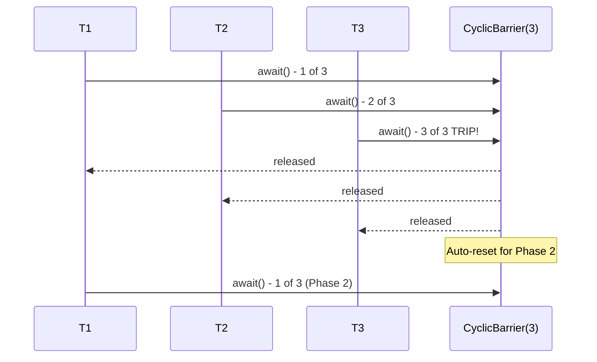

# Java Concurrency - L3 Synchronizers

## CountDownLatch

### 🎯 Model Answer

**30 seconds:**
> `CountDownLatch` is a one-time gate: it is initialized with a count,
> and threads calling `await()` block until the count reaches zero.
> Other threads decrement the count via `countDown()`. It cannot be
> reset - once the count reaches zero, all waiting threads are released
> and all subsequent `await()` calls return immediately. Use it for
> "wait for N things to complete" or "N threads wait for a start signal."

**3 minutes (Senior):**
> `CountDownLatch` is the simplest of the java.util.concurrent
> synchronizers. It models two patterns: a gate (many threads wait
> for one signal: `new CountDownLatch(1)`) and a barrier (one thread
> waits for N operations: `new CountDownLatch(N)`).
>
> The key design: it is one-shot. The count can never increase. Once
> the count reaches zero, it stays there forever. `await()` returns
> immediately if count is already zero. This makes it ideal for startup
> and shutdown synchronization where the event happens exactly once.
>
> For repeated barriers (same synchronization point used in multiple
> rounds), `CyclicBarrier` is appropriate instead.
>
> `await(timeout, unit)` provides a timed variant - blocks up to
> the timeout, then returns `false` if count has not reached zero.
> Essential for avoiding indefinite waits in test environments or
> during graceful shutdown.

**Framework:** WHAT → WHY → HOW → TRADE-OFF → EXAMPLE

*Adapting up:* Discuss `Phaser` (CountDownLatch + CyclicBarrier +
dynamic registration), testing patterns with CountDownLatch, and when
CompletableFuture is a more composable alternative.

*Adapting down:* "CountDownLatch is a ticket counter that starts at N.
Each countDown() tears off a ticket. When the counter reaches zero,
everyone waiting gets through."

**Blank Mind Recovery:**

**(1) Restate:** "So you are asking about CountDownLatch - let me
explain the one-time gate pattern."

**(2) First principles:** "From first principles: some operations must
wait until N other things complete. CountDownLatch gives threads a
signal to wait on, and N other things each signal once-done."

**(3) Bridge:** "CountDownLatch is like a space rocket launch: N checks
must complete (fuel, weather, crew). Each check calls countDown() when
done. The launch thread awaits() until all checks are complete."

---

### 📘 Concept Explanation

**What it is:**
`CountDownLatch` is a synchronizer initialized with a count N. It
provides two operations: `await()` (blocks until count = 0) and
`countDown()` (decrements count by 1). When count reaches zero, all
threads waiting in `await()` are released simultaneously.

**The problem it solves:**
Coordination between threads without shared state or polling. A thread
that needs to wait for N events (completions, starts, readiness signals)
can await on a latch, while the N contributing threads each call
`countDown()` when ready. No busy-waiting, no polling loop.

**How it works:**
```
Init: latch = new CountDownLatch(3)
      count = 3

Thread A: latch.await() -> WAITING (count > 0)
Thread B: latch.countDown() -> count = 2
Thread C: latch.countDown() -> count = 1
Thread D: latch.countDown() -> count = 0 -> release A!
Thread A: proceeds (count = 0)

Later:
Thread E: latch.await() -> returns immediately (count already 0)
Thread B: latch.countDown() -> no effect (count already 0)
```

Backed by AQS: `CountDownLatch` uses a custom `Sync` extending AQS.
The AQS state = count. `countDown()` uses a CAS loop to decrement
state. When state reaches 0, all shared waiters (in `acquireShared`)
are released via `releaseShared(1)`.

**The key insight:**
CountDownLatch models one-time events. The count represents the number
of "prerequisite events" before a gate opens. Once open, it never closes.
For repeatable gates, use `CyclicBarrier`. For dynamic participant
counts, use `Phaser`.

**When to use it:**
- Application startup: wait for N services to initialize before serving
- Test synchronization: start N threads simultaneously, then collect results
- Fan-out/fan-in: fire N async tasks, wait for all to complete before
  next phase
- Graceful shutdown: wait for N workers to drain their queues before exit

**When NOT to use it:**
- When the gate needs to reset (barrier pattern): use `CyclicBarrier`
- When participants are added dynamically: use `Phaser`
- When you need to collect results from parallel tasks:
  use `CompletableFuture.allOf()` which also returns results

**Alternatives:**
- `CyclicBarrier`: resettable barrier for repeated synchronization points
- `Phaser`: flexible, dynamic-participant version of CountDownLatch + CyclicBarrier
- `CompletableFuture.allOf()`: combines with result collection

**First-principles derivation:**
The pattern "wait until N conditions are satisfied" can be implemented
with a shared counter, mutex, and condition variable: `while(count > 0)
condition.await()`. CountDownLatch is a clean abstraction over this
pattern, backed by AQS for efficiency.

---

### 💻 Code Example

> **Code walkthrough:** The BAD example uses a busy-wait loop to check
> for readiness, wasting CPU. The GOOD example uses CountDownLatch to
> park threads efficiently. The production example shows parallel test
> execution with a start gate and a completion latch.

```java
// BAD: busy-wait polling for readiness
volatile boolean ready = false;

void worker() {
    while (!ready) { Thread.yield(); } // burns CPU spinning
    doWork();
}

void initialize() {
    setup();
    ready = true;
}
```

```java
// GOOD: CountDownLatch - park threads until signal
CountDownLatch ready = new CountDownLatch(1); // gate

// N worker threads wait for the start signal:
void worker() throws InterruptedException {
    ready.await(); // park - zero CPU until signaled
    doWork();
}

// Initialization thread:
void initialize() throws InterruptedException {
    setup();
    ready.countDown(); // release all waiting workers at once
}
```

```java
// PRODUCTION: parallel task execution with completion tracking
class ParallelTestHarness {
    void runConcurrentTest(int threadCount)
            throws InterruptedException {
        CountDownLatch startGate = new CountDownLatch(1);
        CountDownLatch doneLatch = new CountDownLatch(threadCount);
        List<Throwable> errors = new CopyOnWriteArrayList<>();

        for (int i = 0; i < threadCount; i++) {
            Thread t = new Thread(() -> {
                try {
                    startGate.await(); // all threads wait here
                    performOperation(); // test target
                } catch (Throwable e) {
                    errors.add(e);
                } finally {
                    doneLatch.countDown(); // always signal done
                }
            });
            t.start();
        }
        // All threads now waiting at startGate
        startGate.countDown(); // release all simultaneously

        // Wait for all to complete (max 10 seconds in tests):
        if (!doneLatch.await(10, TimeUnit.SECONDS)) {
            throw new TimeoutException("Test did not complete");
        }
        if (!errors.isEmpty()) {
            throw new AssertionError("Concurrent errors: " + errors);
        }
    }
}
```

---

### 🎓 Answers by Seniority

**Junior / Mid (0-5 years):**
> `CountDownLatch` starts with a count N. Threads calling `await()`
> block until the count reaches zero. Other threads call `countDown()`
> to decrement it. When count = 0, all waiting threads proceed. It's
> one-shot - once the count hits zero, it can't be reset. Common uses:
> waiting for services to start up, waiting for N async tasks to finish,
> or making N threads start simultaneously with a single start signal.

*Push deeper:* What is the difference between CountDownLatch and
CyclicBarrier? When would you choose one over the other?

---

**Senior / Staff (5+ years):**
> I use CountDownLatch mainly for two patterns: application initialization
> (wait for N services to be ready before accepting requests) and
> concurrent test setup (start all threads simultaneously to create
> real concurrency pressure). For anything that needs to repeat -
> like a producer-consumer rendezvous at phase boundaries - CyclicBarrier
> or Phaser is the right tool. In modern Java code, CompletableFuture.allOf()
> often replaces CountDownLatch for fan-out patterns because it also
> carries results, not just a completion signal.

*Push deeper:* When would you use Phaser instead of CountDownLatch?
What does Phaser add?

---

### ⚠️ Common Misconceptions

**Misconception 1: "countDown() can only be called once."**
`countDown()` can be called any number of times; each call decrements
the count by 1. You call it N times total (one per contributing event).
Multiple threads can each call it once, or one thread can call it N times.

**Misconception 2: "CountDownLatch can be reset."**
It cannot. Once the count reaches zero, it stays there. For a resettable
barrier, use `CyclicBarrier`.

**Misconception 3: "await() must be called before countDown() for
it to work."**
`await()` on a latch with count=0 returns immediately. If all
`countDown()` calls complete before `await()` is called, `await()`
still returns immediately. The count persisting at zero is the
"happened" state.

---

### 🚨 Failure Modes and Diagnosis

**Failure 1: Count never reaches zero - await() waits forever**
Symptom: application hangs at startup or test times out.
Cause: one or more threads that should call `countDown()` threw an
exception before doing so, OR weren't started.
Fix: always call `countDown()` in a `finally` block:
```java
try { doWork(); }
finally { latch.countDown(); } // always count down, even on exception
```

**Failure 2: Wrong initial count**
Symptom: await() returns too early (count reaches 0 before all work done)
or never returns (count set too high).
Cause: initial count doesn't match the number of `countDown()` calls.
Fix: count = exact number of `countDown()` calls expected.

**Failure 3: Latch used for repeated synchronization**
Symptom: only the first round works correctly. Second round:
`await()` returns immediately (count already 0).
Cause: using CountDownLatch where CyclicBarrier is needed.
Fix: replace with `CyclicBarrier(n)` which automatically resets.

---

### 🎯 Interview Deep-Dive

| Question Category | Time to Answer |
|---|---|
| Definition | 30-60 seconds |
| Comparison | 1-2 minutes |
| Pattern | 2-3 minutes |
| Scenario | 2-3 minutes |
| Debugging | 2-3 minutes |
| Advanced | 2-3 minutes |
| Phaser | 2-3 minutes |
| Testing | 2-3 minutes |
| Trade-off | 1-2 minutes |

---

**Q1 (Definition): What is CountDownLatch and what two coordination
patterns does it enable?**

A: `CountDownLatch` is a single-use gate backed by AQS. Initialized
with count N, it enables two patterns:

Pattern 1 - Start gate (N=1, single signal): N threads wait, one
thread fires the signal. All N threads start simultaneously.
```java
CountDownLatch startGate = new CountDownLatch(1);
// N threads: startGate.await();
// Orchestrator: startGate.countDown(); // releases all N at once
```
Use: concurrent stress tests, coordinated service startup.

Pattern 2 - Completion latch (N = number of tasks, single waiter):
one thread waits for N tasks to complete. Each task calls `countDown()`.
```java
CountDownLatch done = new CountDownLatch(N);
// N tasks: done.countDown(); // after task completion
// Waiter: done.await(); // unblocks when all N done
```
Use: fan-out/fan-in, waiting for async tasks.

These two patterns can be combined: a start gate AND a completion
latch in the same test (start simultaneously, collect results).

*What separates good from great:* The combination pattern (start gate +
completion latch) is the canonical concurrent test harness. It produces
maximum concurrency pressure (all threads start at the exact same
moment) while providing deterministic completion detection. This pattern
is in "Java Concurrency in Practice" as the reference implementation.

---

**Q2 (Comparison): CountDownLatch vs CyclicBarrier vs Phaser?**

A: Three synchronizers for different coordination needs:

CountDownLatch:
- One-time gate, count never increases
- Asymmetric: some threads decrement, others wait
- N "contributors" + M "waiters" (N and M are independent)
- Not reusable
- Use for: startup, shutdown, one-time fan-out/fan-in

CyclicBarrier:
- Reusable: after all threads arrive, automatically resets
- Symmetric: ALL participants both wait AND release together
- N threads all wait at the barrier; when all N arrive, all proceed
- Optional barrier action (runs when barrier breaks)
- Use for: multi-phase computations, simulation steps, pipeline stages
  with same number of participants per phase

Phaser:
- Combines features of both (Java 7+)
- Dynamic: participants can register and deregister
- Multiple phases: barrier resets after each phase
- Can be tiered (tree structure for large participant counts)
- Use for: dynamic participant counts, parallel iterative algorithms

Selection rule:
- "Wait for N one-time events": CountDownLatch
- "N threads synchronize repeatedly": CyclicBarrier
- "Participant count changes, or multi-phase": Phaser

*What separates good from great:* Phaser is the superset - you can
implement CountDownLatch as `Phaser(count)` and CyclicBarrier as
a Phaser with registration/deregistration on each phase. But
CountDownLatch and CyclicBarrier are simpler APIs for their specific
use cases.

---

**Q3 (Pattern): How do you implement a start gate with CountDownLatch?**

A: A start gate releases multiple waiting threads simultaneously to
create true concurrent contention:

```java
CountDownLatch startGate = new CountDownLatch(1);
int threadCount = 20;
AtomicInteger counter = new AtomicInteger(0);

// Start 20 threads, all blocked at the gate:
ExecutorService exec = Executors.newFixedThreadPool(threadCount);
for (int i = 0; i < threadCount; i++) {
    exec.submit(() -> {
        try {
            startGate.await(); // all 20 wait here
        } catch (InterruptedException e) {
            Thread.currentThread().interrupt();
            return;
        }
        // Do concurrent work - all 20 start simultaneously
        counter.incrementAndGet();
    });
}

// All 20 threads are now waiting. Release them ALL at once:
startGate.countDown(); // open the gate
```

Without the start gate, threads would start at slightly different
times (staggered). With the gate, all 20 attempt `incrementAndGet()`
simultaneously - maximum contention for testing thread-safety.

This is the recommended pattern in "Java Concurrency in Practice"
(Bloch et al.) for testing concurrent code under realistic conditions.

*What separates good from great:* The start gate eliminates timing
artifacts in concurrent tests. If threads start staggered, the first
thread may complete before the last starts, meaning they never actually
run concurrently. The gate ensures maximum overlap. This is why
concurrent correctness bugs often only appear with the gate pattern.

---

**Q4 (Scenario): Design startup sequencing for a microservice
that requires database, cache, and message queue before serving.**

A:
```java
class ServiceStartup {
    // 3 prerequisites must complete before serving traffic
    private final CountDownLatch readyLatch = new CountDownLatch(3);

    void start() throws InterruptedException {
        // Start each dependency initialization in parallel:
        Thread dbInit = new Thread(() -> {
            try {
                initDatabase();     // potentially slow
                readyLatch.countDown(); // signal database ready
                log.info("Database initialized");
            } catch (Exception e) {
                log.error("Database init failed", e);
                // Don't countDown - will hang readyLatch intentionally
                // This forces a startup failure vs. serving with no DB
            }
        }, "db-init");

        Thread cacheInit = new Thread(() -> {
            try {
                initCache();
                readyLatch.countDown();
            } catch (Exception e) {
                log.error("Cache init failed", e);
            }
        }, "cache-init");

        Thread mqInit = new Thread(() -> {
            try {
                initMessageQueue();
                readyLatch.countDown();
            } catch (Exception e) {
                log.error("MQ init failed", e);
            }
        }, "mq-init");

        dbInit.start(); cacheInit.start(); mqInit.start();

        // Wait up to 30 seconds for all to initialize:
        if (!readyLatch.await(30, TimeUnit.SECONDS)) {
            throw new StartupException(
                "Services not ready in 30 seconds");
        }
        startHttpServer(); // only now start accepting traffic
    }
}
```

Key decisions:
- 30-second timeout: prevents infinite hang if a dependency fails
- Not calling `countDown()` on error: intentional - a failed
  dependency blocks startup (fail fast vs. serve with missing dependency)
- Parallel initialization: reduces startup time from 3× sequential to max(3)

*What separates good from great:* The design decision of "don't
countDown on failure" vs "always countDown and check error state" is
a product decision. If the service can run with a degraded dependency
(e.g., cache miss falls through to DB), always countDown and check
health flags separately. If the service cannot function without the
dependency, not counting down causes a timeout-based failure.

---

**Q5 (Debugging): A CountDownLatch.await() never returns. How do
you diagnose?**

A: Step 1: Thread dump.
Identify threads stuck in `CountDownLatch.await()` (they show
`sun.misc.Unsafe.park()` in the stack, called from AQS).

Step 2: Find the latch value.
In the thread dump, the waiting threads show the `CountDownLatch`
object address. Use a heap dump or add logging to find the count value.
Common finding: count is still 1+ when it should be 0.

Step 3: Find the missing `countDown()` call.
Search for threads that SHOULD have called `countDown()` but didn't.
Common causes:
- Thread that should countDown threw an exception before reaching it
- The thread was never started (logic bug in the startup code)
- The count was initialized higher than the number of `countDown()` callers

Step 4: Add count monitoring (for diagnosis):
```java
// Temporarily add logging:
ScheduledExecutorService monitor = Executors.newSingleThreadScheduledExecutor();
monitor.scheduleAtFixedRate(() ->
    log.info("Latch count: {}", latch.getCount()),
    0, 1, TimeUnit.SECONDS);
```

Fix: ensure `countDown()` is ALWAYS in a `finally` block. If a
worker fails, still signal the latch so waiters can detect the
failure and fail cleanly rather than hanging indefinitely.

*What separates good from great:* The `await(timeout)` variant is
essential for liveness - if the latch never reaches zero due to a bug,
`await()` without timeout causes a permanent hang. In production,
always use `await(timeout, unit)` and handle the `false` return value.

---

**Q6 (Advanced): How does CountDownLatch use AQS internally?**

A: CountDownLatch implements an inner `Sync` class extending
`AbstractQueuedSynchronizer`:

- AQS state = countdown count (N)
- `countDown()` → calls `sync.releaseShared(1)`:
  - `tryReleaseShared(1)` loop: CAS state from N to N-1
  - If CAS reaches 0: release ALL shared waiters (count reached zero)
- `await()` → calls `sync.acquireSharedInterruptibly(1)`:
  - `tryAcquireShared(1)`: returns 1 if state=0, -1 otherwise
  - If -1: park thread in AQS wait queue (shared mode)
  - When released by `releaseShared`: all parked shared threads wake

The "shared mode" of AQS allows multiple threads to be unblocked
simultaneously (unlike exclusive mode where only one thread wakes).
This is key for CountDownLatch: when count reaches 0, ALL waiting
threads are unblocked at once via the shared propagation path.

The propagation: when the first sleeping thread is unparked, it checks
`tryAcquireShared()` (returns 1), then propagates wake-up to its
successor in the queue. The successor wakes and propagates further.
This cascades until all waiting threads are woken.

*What separates good from great:* Understanding that `await()` with
count already 0 returns immediately because `tryAcquireShared(1)` returns
1 (state is 0, which means latch is open) - no park needed. This is
why CountDownLatch is safe to use when `countDown()` may be called
before `await()`.

---

**Q7 (Advanced): When should you replace CountDownLatch with
CompletableFuture.allOf()?**

A: Replace CountDownLatch with `CompletableFuture.allOf()` when:

1. You need results: CountDownLatch only signals completion. If you
   also need to collect results from each task, `allOf()` with per-task
   CompletableFutures is cleaner.

2. Error propagation: CountDownLatch has no built-in error reporting.
   With `allOf()`, if any future fails, the combined future fails and
   you can handle the exception directly.

3. Timeout composition: `allOf().orTimeout(N, SECONDS)` is simpler
   than manually wrapping `await(N, SECONDS)`.

4. Non-blocking caller: if the calling thread should not block (e.g.,
   a reactive handler), returning a `CompletableFuture` from `allOf()`
   is correct; returning from a blocking `await()` is not.

Keep CountDownLatch when:
- Simplicity: you only need "wait for N things" with no results
- Thread signaling: one thread signals many threads simultaneously
  (start gate pattern) - `allOf()` doesn't have a natural start-gate API
- Java < 8 compatibility (unlikely in new code)
- The contributing threads are already existing (not CompletableFuture)

```java
// CountDownLatch version:
CountDownLatch done = new CountDownLatch(3);
executor.submit(() -> { processA(); done.countDown(); });
executor.submit(() -> { processB(); done.countDown(); });
executor.submit(() -> { processC(); done.countDown(); });
done.await(5, TimeUnit.SECONDS);

// CompletableFuture.allOf version (with results):
CompletableFuture.allOf(
    CompletableFuture.runAsync(() -> processA(), exec),
    CompletableFuture.runAsync(() -> processB(), exec),
    CompletableFuture.runAsync(() -> processC(), exec)
).orTimeout(5, TimeUnit.SECONDS).join();
```

*What separates good from great:* The start-gate pattern (CountDownLatch(1)
signaling many threads) has no direct CompletableFuture equivalent.
For starting N threads simultaneously at a signal, CountDownLatch
remains the cleanest tool.

---

**Q8 (Testing): How do you use CountDownLatch to test concurrent code?**

A: The canonical concurrent test pattern (from JCIP):

```java
@Test
void testConcurrentAccess() throws InterruptedException {
    int threadCount = 10;
    // Start gate: hold all threads until they're all ready
    CountDownLatch startGate = new CountDownLatch(1);
    // Done latch: wait for all to complete
    CountDownLatch doneLatch = new CountDownLatch(threadCount);
    List<Throwable> errors = new CopyOnWriteArrayList<>();

    SharedResource resource = new SharedResource(); // class under test

    for (int i = 0; i < threadCount; i++) {
        new Thread(() -> {
            try {
                startGate.await(); // all threads wait here
                resource.operationUnderTest(); // concurrent access
            } catch (Throwable t) {
                errors.add(t);
            } finally {
                doneLatch.countDown(); // always signal
            }
        }).start();
    }

    startGate.countDown(); // release all threads simultaneously
    assertTrue(doneLatch.await(10, TimeUnit.SECONDS),
        "Test did not complete in time");
    assertTrue(errors.isEmpty(), "Errors: " + errors);
    resource.assertInvariant(); // verify correctness
}
```

This pattern:
1. Creates maximum contention (start gate ensures simultaneous start)
2. Collects exceptions from all threads (CopyOnWriteArrayList)
3. Verifies all threads completed (doneLatch)
4. Has bounded test runtime (doneLatch.await with timeout)
5. Fails the test if any thread throws (errors check)

*What separates good from great:* jcstress (Java Concurrency Stress)
is the industrial-strength alternative for concurrent correctness testing.
It runs with JVM flags that promote reorderings and memory effects to
expose hard-to-find bugs that even the CountDownLatch pattern may not
catch. For production concurrent data structure testing, jcstress is
the tool.

---

**Q9 (Trade-off): What are the limitations of CountDownLatch vs Phaser?**

A: CountDownLatch limitations (which Phaser addresses):

1. Fixed count at construction: count must be known upfront.
   If you discover additional tasks mid-flight, you cannot increase
   the count. Phaser supports dynamic registration: `phaser.register()`
   adds a participant.

2. One-time use: after reaching zero, cannot be reused. For a
   pipeline with 10 phases, you need 10 CountDownLatches.
   Phaser advances phases automatically on each barrier completion.

3. No per-phase barrier action: CyclicBarrier has a barrier action
   (runs when all threads arrive). CountDownLatch has no equivalent.
   Phaser supports per-phase barrier actions.

4. No arrival count monitoring: `getCount()` gives current count
   but not "how many have arrived." Phaser provides
   `getArrivedParties()` and `getUnarrivedParties()`.

Phaser example (replacing 3 CountDownLatches):
```java
Phaser phaser = new Phaser(threadCount);
for (Thread t : workers) {
    t.start(); // all work in phase 0, 1, 2
}
// Workers call phaser.arriveAndAwaitAdvance() at each phase boundary
// Instead of three separate CountDownLatches
```

When CountDownLatch is still better: when the simpler API is sufficient.
Phaser has higher complexity and learning curve. For a fixed,
one-time gate, CountDownLatch is the clear choice.

*What separates good from great:* Phaser's tiered structure allows
tree-of-Phasers for very large participant counts. A flat Phaser
with 10,000 participants has contention on the single Phaser object.
Tiering: 100 Phasers each with 100 participants, with 1 root Phaser
aggregating. CyclicBarrier and CountDownLatch cannot tier.

---

### ⚖️ Comparison Table

| Feature | CountDownLatch | CyclicBarrier | Phaser |
|---|---|---|---|
| Reusable | No | Yes (auto-reset) | Yes (phases) |
| Dynamic participants | No | No | Yes |
| Symmetric | No (asymmetric) | Yes | Configurable |
| Barrier action | No | Yes | Per-phase |
| Result collection | No | No | No |
| Best for | One-time events | Repeated barriers | Dynamic, multi-phase |

**The deciding factor:**
One-time gate or fan-out: CountDownLatch. Repeated synchronization
with fixed N: CyclicBarrier. Multi-phase or dynamic: Phaser.

---

### 🏛️ System Design

*(Omit: L3 intermediate - distributed barrier patterns at L5.)*

---

### 📊 Diagram

*(Omit: CountDownLatch patterns are well illustrated in code examples.
The fundamental count-down mechanism is self-evident.)*

---
---

## CyclicBarrier and Semaphore

### 🎯 Model Answer

**30 seconds:**
> `CyclicBarrier` is a reusable barrier: N threads each call `await()`
> and all block until all N have arrived, then all proceed simultaneously.
> It automatically resets after each "trip." Use it for multi-phase
> computations where N threads must synchronize at each phase boundary.
>
> `Semaphore` is a counting permit: it holds N permits. `acquire()`
> decrements permits (blocks if none available). `release()` increments
> permits. Use it to limit concurrent access to a resource (connection
> pool, rate limiter, bounded access to a shared service).

**3 minutes (Senior):**
> `CyclicBarrier(N, action)`: when all N threads arrive, the optional
> barrier action runs in one of the arriving threads, then all N are
> released. Useful for phase-boundary aggregation (merge partial results
> from N threads before the next phase).
>
> CyclicBarrier failure mode: if one thread is interrupted or times out
> at the barrier, the barrier is "broken" - all waiting threads throw
> `BrokenBarrierException`. The barrier is unusable after breaking.
> This is a safety mechanism to prevent the others from waiting forever
> for a dead thread.
>
> `Semaphore(N, fair)`: N permits. `acquire()` for exclusive resources
> (connection pool), `acquire(M)` to acquire M permits at once. `release()`
> must be called even on exception (like a lock). Semaphore(1) is a
> mutex but without ownership - any thread can release (unlike locks
> where only the acquiring thread can release).

**Framework:** WHAT → WHY → HOW → TRADE-OFF → EXAMPLE

*Adapting up:* Discuss Semaphore as a rate limiter, the tryAcquire()
pattern for non-blocking resource access, and the difference between
a binary Semaphore and a mutex (ownership semantics).

*Adapting down:* "CyclicBarrier is like waiting at a bus stop: the
bus doesn't leave until all N passengers are seated. Semaphore is like
a parking lot: when all N spaces are full, new cars wait until someone
leaves."

**Blank Mind Recovery:**

**(1) Restate:** "Let me cover CyclicBarrier (N threads all wait for
each other) and Semaphore (limit concurrent access to N at a time)."

**(2) First principles:** "CyclicBarrier: synchronized computation phases
require all N participants to complete one phase before starting the
next. Semaphore: controlling concurrent access count without hard-coding
a limit in the data structure."

**(3) Bridge:** "CyclicBarrier is a team sprint: 5 runners start
together, all wait at the end of each lap until everyone finishes,
then start the next lap together. Semaphore is a nightclub with N
capacity: when full, new arrivals wait outside until someone leaves."

---

### 📘 Concept Explanation

**CyclicBarrier - What it is:**
`CyclicBarrier(int parties)` is a synchronizer where a fixed number
of threads (`parties`) must all call `await()` before any of them
can proceed. After all parties arrive, an optional barrier action runs,
then all proceed. The barrier automatically resets for the next round
(hence "cyclic").

**CyclicBarrier - The problem it solves:**
Multi-phase parallel computations where all N threads must complete
phase K before any can start phase K+1. Without synchronization,
fast threads could start phase K+1 with stale data from slow threads.

**CyclicBarrier - How it works:**
```
Phase 1:
T1 arrives -> wait (1/3 arrived)
T2 arrives -> wait (2/3 arrived)
T3 arrives -> barrier trip! run barrierAction, release all

Phase 2 (auto-reset):
T1 arrives -> wait
T2 arrives -> wait
T3 arrives -> barrier trip!
...repeats
```

Optional barrier action (`Runnable` passed to constructor): runs
in the last thread to arrive. Use for phase boundary processing
(merge partial results, start next input batch).

Broken state: if any thread is interrupted or times out while waiting,
the barrier breaks. All other waiting threads throw `BrokenBarrierException`.
The barrier must be explicitly reset with `barrier.reset()` to be used again.

**Semaphore - What it is:**
`Semaphore(int permits)` is a counting semaphore. It maintains N
permits. `acquire()` atomically decrements permits (blocks if 0).
`release()` atomically increments permits. Any number of threads can
hold permits simultaneously (up to N).

**Semaphore - The problem it solves:**
Limiting concurrent access to a resource without putting the limit in
the resource itself. Useful for: connection pools (limit concurrent
DB connections), rate limiting (limit concurrent API calls), bounded
parallelism (run at most N tasks simultaneously).

**Semaphore - How it works:**
```
Semaphore permits=3:

Thread A: acquire() -> permits=2, proceed
Thread B: acquire() -> permits=1, proceed
Thread C: acquire() -> permits=0, proceed
Thread D: acquire() -> permits=0, BLOCK
Thread A: release() -> permits=1, D unblocked
Thread D: acquire() -> permits=0, proceed
```

Semaphore(1): binary semaphore - mutex without ownership. Unlike
ReentrantLock, any thread can `release()` (not just the one that
`acquire()`d). This enables producer-consumer signaling patterns.

**The key insight (both):**
CyclicBarrier: "all N must wait for each other" - symmetric.
CountDownLatch: "M wait for N others to complete" - asymmetric.
Semaphore: "at most N concurrent" - access control.

**When to use them:**
CyclicBarrier:
- Multi-phase parallel algorithms (parallel merge sort phases)
- Simulation steps where all N agents must advance together
- Parallel matrix operations phase by phase

Semaphore:
- Connection pool (limit concurrent DB connections)
- Rate limiting (N concurrent API calls max)
- Bounded parallelism without a full ExecutorService

**When NOT to use them:**
CyclicBarrier:
- One-time synchronization: use CountDownLatch
- Dynamic participant count: use Phaser

Semaphore:
- Exclusive single-thread access: use ReentrantLock (has ownership)
- Simple counting without blocking: use AtomicInteger
- Task queuing: use BlockingQueue or ExecutorService

**Alternatives:**
- `Exchanger<V>`: exchange objects between exactly 2 threads
- `Phaser`: flexible CyclicBarrier + CountDownLatch
- `BlockingQueue`: producer-consumer without explicit Semaphore

---

### 💻 Code Example

> **Code walkthrough:** The CyclicBarrier example shows a parallel matrix
> computation where all threads must synchronize at each row boundary.
> The Semaphore example shows connection pool limiting - a production
> pattern for controlling downstream resource concurrency.

```java
// CyclicBarrier: parallel computation with phase synchronization
class ParallelMatrixProcessor {
    private final int N_THREADS = 4;
    private final CyclicBarrier barrier = new CyclicBarrier(
        N_THREADS,
        () -> log.info("Phase complete - merging results") // barrier action
    );

    void process(double[][] matrix) throws Exception {
        List<Thread> workers = new ArrayList<>();
        for (int i = 0; i < N_THREADS; i++) {
            final int threadId = i;
            workers.add(new Thread(() -> {
                try {
                    for (int phase = 0; phase < 3; phase++) {
                        // Phase work: each thread processes its rows
                        processRows(matrix, threadId, N_THREADS, phase);

                        // Synchronization point: all threads wait here
                        barrier.await(); // throws BrokenBarrierException
                        // if another thread failed

                        // After barrier: all threads proceed to next phase
                        // with all rows from current phase complete
                    }
                } catch (BrokenBarrierException e) {
                    log.error("Barrier broken - another thread failed");
                } catch (InterruptedException e) {
                    Thread.currentThread().interrupt();
                }
            }));
        }
        workers.forEach(Thread::start);
        for (Thread w : workers) w.join();
    }
}
```

```java
// Semaphore: connection pool limiting
class DatabaseConnectionLimiter {
    // Allow at most 10 concurrent database connections
    private final Semaphore semaphore = new Semaphore(10, true); // fair

    <T> T withConnection(Callable<T> dbWork)
            throws Exception {
        semaphore.acquire(); // wait for a permit
        try {
            Connection conn = getConnection(); // from pool
            try {
                return dbWork.call();
            } finally {
                releaseConnection(conn);
            }
        } finally {
            semaphore.release(); // ALWAYS release in finally
        }
    }

    // Non-blocking variant:
    <T> Optional<T> tryWithConnection(Callable<T> dbWork)
            throws Exception {
        if (!semaphore.tryAcquire(100, TimeUnit.MILLISECONDS)) {
            return Optional.empty(); // no permit available
        }
        try {
            return Optional.of(dbWork.call());
        } finally {
            semaphore.release();
        }
    }
}
```

---

### 🎓 Answers by Seniority

**Junior / Mid (0-5 years):**
> `CyclicBarrier` makes N threads wait for each other at a point in code.
> All N threads call `await()`, and none proceeds until all N have arrived.
> It automatically resets for the next round. `Semaphore` limits how many
> threads can access something at the same time. Initialize with N permits;
> `acquire()` takes one (blocks if none available), `release()` gives one
> back. Use it for connection pooling or rate limiting.

*Push deeper:* What happens to CyclicBarrier if one thread is interrupted
while waiting at the barrier?

---

**Senior / Staff (5+ years):**
> My CyclicBarrier usage is primarily in parallel computation frameworks -
> multi-phase algorithms where all workers must finish phase N before
> starting phase N+1. The critical production concern: BrokenBarrierException.
> If any thread dies, the barrier breaks, which is the correct behavior
> (prevents others waiting forever for a dead thread). But the broken
> barrier is permanent - you need a recovery strategy (restart all threads,
> reset the barrier, or fail the computation). For Semaphore, I use it
> for connection limiting and rate limiting, always in try/finally for
> the release. One subtlety: Semaphore is not reentrant - acquiring twice
> in the same thread reduces permits by 2, not by 1 (no reentrancy detection).

*Push deeper:* What is the difference between Semaphore(1) and
ReentrantLock? When would each be appropriate?

---

### ⚠️ Common Misconceptions

**Misconception 1: "CyclicBarrier barrier action runs in each thread."**
The barrier action runs exactly ONCE per barrier trip, in the last
thread to arrive. It runs before the waiting threads are released.
Not in each thread.

**Misconception 2: "Semaphore.release() can only be called by the
thread that called acquire()."**
Semaphore has no thread ownership. ANY thread can call `release()`
to add a permit, including threads that never called `acquire()`.
This is intentional (producer-consumer signaling) and different from
ReentrantLock which is owned by the acquiring thread.

**Misconception 3: "BrokenBarrierException means the barrier is gone."**
After `BrokenBarrierException`, the barrier is in a broken state but
still exists. It can be reset with `barrier.reset()`. However, threads
that were waiting when it broke all received `BrokenBarrierException`
and are no longer waiting. You must restart those threads AND reset
the barrier to use it again.

---

### 🚨 Failure Modes and Diagnosis

**Failure 1: Barrier breakage - BrokenBarrierException cascade**
Symptom: all threads throw BrokenBarrierException simultaneously.
Cause: one thread was interrupted, timed out, or the barrier was reset
while others were waiting.
Diagnosis: find the first exception (from the interrupted thread) in
logs.
Fix: implement robust handling:
```java
try {
    barrier.await();
} catch (BrokenBarrierException e) {
    // Another thread broke the barrier - stop processing
    cleanup();
    return;
} catch (InterruptedException e) {
    barrier.reset(); // optional - breaks it for others
    Thread.currentThread().interrupt();
}
```

**Failure 2: Semaphore permit leak**
Symptom: over time, available permits decrease to 0. System permanently
blocks.
Cause: `acquire()` called without matching `release()` in finally block.
Exception path bypasses `release()`.
Fix: always in try/finally:
```java
semaphore.acquire();
try { doWork(); }
finally { semaphore.release(); } // even if doWork throws
```

**Failure 3: Semaphore.release() called without acquire()**
Symptom: concurrent access exceeds the intended limit. More threads
than `permits` active simultaneously.
Cause: extra `release()` call adds a permit above the initial limit.
Note: Semaphore can grow above its initial limit if `release()` is
called more times than `acquire()`.
Fix: match each acquire with exactly one release. Code review for
double-release paths.

---

### 🎯 Interview Deep-Dive

| Question Category | Time to Answer |
|---|---|
| Definition | 30-60 seconds |
| Broken barrier | 2-3 minutes |
| Semaphore vs Lock | 2-3 minutes |
| Pattern (Semaphore) | 2-3 minutes |
| Pattern (CyclicBarrier) | 2-3 minutes |
| Debugging | 2-3 minutes |
| Advanced | 2-3 minutes |
| Trade-off | 1-2 minutes |
| Phaser comparison | 1-2 minutes |

---

**Q1 (Definition): What makes CyclicBarrier "cyclic"?**

A: CyclicBarrier automatically resets after all parties have arrived
and been released. After the barrier trips (all N arrived), the count
resets to N and the barrier is ready for the next round - without any
explicit reset call.

This is the key difference from CountDownLatch: a CountDownLatch stays
at zero forever once triggered. A CyclicBarrier automatically prepares
for the next phase.

The cycle: phase 1 → all N arrive → trip → phase 2 → all N arrive
→ trip → phase 3 → and so on.

After each trip:
1. Barrier action runs (if provided)
2. All waiting threads wake and proceed
3. Internal generation increments (new "cycle")
4. Party count resets to N
5. Next calls to `await()` begin accumulating for the new trip

The `reset()` method can forcibly reset the barrier mid-cycle
(breaking it for currently waiting threads, starting a new cycle).

*What separates good from great:* The internal "generation" counter
is what makes it cyclic. Each call to `await()` is associated with
a generation. When the barrier breaks (from interrupt or timeout),
only threads in the current generation receive `BrokenBarrierException`.
Threads arriving at the next generation see a new barrier.

---

**Q2 (Broken barrier): What happens when a thread is interrupted at
a CyclicBarrier?**

A: Interrupting a thread at a CyclicBarrier triggers a cascade:

1. The interrupted thread's `await()` throws `InterruptedException`
   (the thread is removed from the barrier).
2. The barrier is marked as "broken" (generation.broken = true).
3. All OTHER threads waiting at the barrier wake up and throw
   `BrokenBarrierException`.
4. Subsequent calls to `await()` on this barrier also throw
   `BrokenBarrierException` until `barrier.reset()` is called.

Why this design: if one of N threads dies mid-wait, the remaining
N-1 threads would wait forever for the missing thread. The broken-
barrier propagation is a fail-fast mechanism that prevents infinite
waits.

Recovery strategy:
```java
// Option 1: Complete fail - abort the computation
catch (BrokenBarrierException e) {
    throw new ComputationException("Worker failure", e);
}

// Option 2: Reset and retry (if all threads can restart)
if (barrier.isBroken()) {
    barrier.reset(); // reset for next attempt
    // restart all threads
}
```

*What separates good from great:* The barrier is also broken by
`barrier.reset()` itself when called while threads are waiting.
If you reset while 2 of 3 threads are waiting, those 2 receive
`BrokenBarrierException`. The 3rd thread (if it arrives later) gets
the new generation - `await()` completes when the remaining
(N - number-that-broke) + 1 threads arrive. Reset is disruptive;
only use it for error recovery.

---

**Q3 (Semaphore vs Lock): What is the difference between Semaphore(1)
and a ReentrantLock?**

A: Both provide mutual exclusion (only one thread at a time) but differ
in ownership semantics:

`ReentrantLock` ownership:
- Only the thread that called `lock()` can call `unlock()`
- Attempting to unlock from another thread throws
  `IllegalMonitorStateException`
- Reentrant: the owning thread can `lock()` multiple times; must
  `unlock()` the same number of times
- Supports `Condition`, try-lock, timed lock

`Semaphore(1)` - no ownership:
- ANY thread can call `release()`, including threads that never called
  `acquire()`
- Not reentrant: same thread acquiring twice reduces permits to -1
  (does not detect re-entry, doesn't deadlock, just uses 2 permits)
- Supports `tryAcquire()`, timed `tryAcquire()`

When to use Semaphore(1) instead of lock:
- Producer-consumer signaling: a producer acquires (takes a "ticket"),
  a consumer releases (makes a ticket available) - threads are different
- Bounded blocking without ownership: "only one thing at a time" but
  the "unlocker" is a different thread than the "locker"
- Handshake protocols where thread A's work enables thread B to proceed

When to use ReentrantLock instead of Semaphore(1):
- Standard mutual exclusion with the same thread as locker/unlocker
- Need Condition variables, try-lock, timed lock, fair mode

*What separates good from great:* The non-ownership of Semaphore is
both its power (inter-thread signaling) and its danger (double-release
is possible, increasing the permit count above the intended limit).
ReentrantLock's ownership prevents accidental double-unlock from
different threads.

---

**Q4 (Pattern): Implement a rate limiter using Semaphore.**

A: Semaphore-based rate limiter (concurrent request limiter):

```java
class ConcurrentRateLimiter {
    // Limit: at most 50 concurrent API calls
    private final Semaphore semaphore;
    private final int maxConcurrent;

    ConcurrentRateLimiter(int maxConcurrent) {
        this.maxConcurrent = maxConcurrent;
        this.semaphore = new Semaphore(maxConcurrent, true); // fair
    }

    <T> T call(Callable<T> apiCall) throws Exception {
        semaphore.acquire(); // wait for a permit
        try {
            return apiCall.call();
        } finally {
            semaphore.release(); // release after call completes
        }
    }

    // Non-blocking: try, fail fast if too busy
    <T> T tryCall(Callable<T> apiCall, long timeout,
            TimeUnit unit) throws Exception {
        if (!semaphore.tryAcquire(timeout, unit)) {
            throw new RateLimitException(
                "Too many concurrent calls: " + maxConcurrent);
        }
        try {
            return apiCall.call();
        } finally {
            semaphore.release();
        }
    }

    // Monitoring:
    int available() { return semaphore.availablePermits(); }
    int waiting()   { return semaphore.getQueueLength(); }
}
```

Note: this limits concurrent operations (at most N in flight), not
throughput (requests per second). For rate-per-second limiting, use
a token bucket (refill permits periodically) or Guava's `RateLimiter`.

*What separates good from great:* `Semaphore(N, true)` uses fair mode:
threads acquire in FIFO order. Without fair=true, a thread can be
starved if there is continuous demand. For production rate limiters,
fairness prevents one "hot" caller from monopolizing all permits.

---

**Q5 (Pattern): Implement a multi-phase parallel computation with
CyclicBarrier.**

A: Multi-phase image processing (N threads, 3 phases):

```java
class ParallelImageProcessor {
    private final int[][] pixels;   // shared: each thread writes its chunk
    private final int nThreads = 4;
    private final CyclicBarrier barrier;

    ParallelImageProcessor(int[][] image) {
        this.pixels = image;
        // Barrier action: called once per phase completion
        this.barrier = new CyclicBarrier(nThreads, () -> {
            System.out.println("Phase boundary: validating consistency");
            validateConsistency(); // runs in last arriving thread
        });
    }

    void process() throws InterruptedException {
        List<Thread> workers = new ArrayList<>();
        for (int t = 0; t < nThreads; t++) {
            final int tid = t;
            workers.add(new Thread(() -> {
                try {
                    // Phase 1: each thread processes its pixel rows
                    applyGaussianBlur(pixels, tid, nThreads);
                    barrier.await(); // sync before phase 2

                    // Phase 2: edge detection (needs blurred data)
                    detectEdges(pixels, tid, nThreads);
                    barrier.await(); // sync before phase 3

                    // Phase 3: color enhancement (needs edges)
                    enhanceColors(pixels, tid, nThreads);
                    // No barrier needed after last phase
                } catch (BrokenBarrierException | InterruptedException e) {
                    log.error("Worker {} failed at barrier", tid, e);
                }
            }, "image-worker-" + tid));
        }
        workers.forEach(Thread::start);
        for (Thread w : workers) w.join(); // wait for all to complete
    }
}
```

The barrier ensures: all threads complete phase N before any thread
starts phase N+1. Without the barrier, a fast thread could start
edge detection on partially blurred pixels.

*What separates good from great:* The barrier action for validation
runs between phases without additional thread coordination. This is
the key advantage over CountDownLatch (which would need a 3rd
entity to run the validation).

---

**Q6 (Debugging): Semaphore permits are decreasing over time,
eventually blocking all threads. How do you diagnose?**

A: Permit leakage - `acquire()` is being called without matching
`release()`. Diagnosis:

Step 1: Add permits monitoring.
```java
ScheduledExecutorService monitor = ...;
monitor.scheduleAtFixedRate(() -> {
    log.info("Available permits: {}", semaphore.availablePermits());
    log.info("Queue length: {}", semaphore.getQueueLength());
}, 0, 10, TimeUnit.SECONDS);
```
Trend: if `availablePermits()` decreases over time, there are unreleased
permits.

Step 2: Find the code path that skips `release()`.
Search for `semaphore.acquire()` in the codebase. Each must have
a corresponding `release()` in a `finally` block.

Step 3: Look for exception paths that bypass `finally`.
Calls to `System.exit()`, `Runtime.halt()`, or `Error` thrown from
the critical section can bypass `finally`. These are rare but catastrophic.

Step 4: Check for `return` statements inside `try` (without `finally`).
```java
// BUG: early return bypasses release
semaphore.acquire();
try {
    if (condition) return; // FORGETS release!
    doWork();
} // NO finally block
semaphore.release(); // only reached if no return
```

Fix: every acquire must have a corresponding release in `finally`:
```java
semaphore.acquire();
try {
    if (condition) return; // fine - finally runs
    doWork();
} finally {
    semaphore.release(); // always runs
}
```

*What separates good from great:* `semaphore.availablePermits()` monitoring
as a gauge metric in production monitoring. Alert if it reaches 0 or
stays near 0 for >5 seconds - that's the early warning for permit leakage.

---

**Q7 (Advanced): How does Semaphore's fair mode work and when
does it matter?**

A: `Semaphore(N, true)` uses fair mode: threads acquire permits in
FIFO order (the thread waiting longest gets the next available permit).

`Semaphore(N, false)` uses non-fair mode: when a permit is released,
any waiting thread may get it - no ordering guarantee. A barging
thread that just called `tryAcquire()` can steal a permit from a thread
that has been waiting for seconds.

Implementation: Semaphore extends AQS. Fair mode enqueues every thread
that doesn't find an immediately available permit. Non-fair mode first
CAS-attempts to steal the permit (barging) before enqueuing.

When fair mode matters:
- High-contention semaphores where some threads could be starved
- Rate limiters where per-thread fairness is important (no one thread
  gets unlimited access)
- System behavior must be predictable (FIFO ordering)

When non-fair is fine:
- Low-contention semaphores
- When only "at most N concurrent" matters, not who gets the permits
- Performance-critical paths (fair mode has ~20% higher overhead)

Key behavior difference:
```java
// Fair: Thread A waiting for 1 second gets next permit
// Non-fair: Thread B that just called acquire() may steal the permit
// leaving Thread A to wait longer

// For connection pools: fair prevents starvation of specific threads
```

*What separates good from great:* The default `Semaphore(N)` (non-fair)
is usually correct for resource pool limiting where we care about
"at most N concurrent" not about who gets the permits. Fair mode is
important for user-facing latency fairness - preventing a single heavy
caller from monopolizing all permits under high load.

---

**Q8 (Trade-off): Semaphore vs BlockingQueue for connection pooling?**

A: Connection pooling is a classic Semaphore vs BlockingQueue choice:

Semaphore approach:
- Semaphore(N) limits concurrent access
- Actual connections managed separately (connection factory, pool)
- `acquire()` before getting connection, `release()` after closing
- Pros: simple, decoupled limiting from connection management
- Cons: requires separate connection lifecycle management

BlockingQueue approach:
- Queue holds the actual connection objects
- `queue.take()` to get a connection (blocks if queue empty)
- `queue.put()` to return a connection
- Pros: connection management is automatic (the queue IS the pool)
- Cons: queue must hold live connections (size = pool size)

Production: use a library like HikariCP (built on a Semaphore +
`ConcurrentBag` internals) rather than either. HikariCP's design:
- Fast path: connection available → CAS acquire without lock
- Slow path: no connection → park thread, wait for `signalBorrow()`
- Connection validity checks, leak detection, metrics built-in

If building a custom resource pool:
- BlockingQueue for objects that can be held in a queue (connections,
  buffers, worker objects)
- Semaphore for limiting access to an external resource that lives
  outside the Java heap (external services, OS resources)

*What separates good from great:* HikariCP uses `SynchronousQueue` for
the fast path and a `Semaphore` for the counting mechanism, combining
both patterns. When a connection is returned, the returning thread
offers it to the SynchronousQueue first (direct handoff to a waiter)
before going back to the pool. This minimizes latency for waiters.

---

**Q9 (Advanced): What is Exchanger and how does it differ from other
synchronizers?**

A: `Exchanger<V>` is a synchronizer for exactly 2 threads. Thread A
and Thread B each call `exchange(value)`. Both block until the other
calls `exchange()`. Then A gets B's value and B gets A's value.
It's a synchronous, bidirectional data exchange.

```java
Exchanger<List<Item>> exchanger = new Exchanger<>();

// Thread A: fill a buffer, exchange for an empty one
Thread producer = new Thread(() -> {
    List<Item> buffer = new ArrayList<>();
    while (true) {
        fillBuffer(buffer);
        try {
            buffer = exchanger.exchange(buffer); // hand off full, get empty
            buffer.clear(); // reuse the empty buffer
        } catch (InterruptedException e) { break; }
    }
});

// Thread B: consume what Thread A gives, return empty buffer
Thread consumer = new Thread(() -> {
    List<Item> buffer = new ArrayList<>();
    while (true) {
        try {
            buffer = exchanger.exchange(buffer); // receive full, give empty
            consumeBuffer(buffer);
            buffer.clear();
        } catch (InterruptedException e) { break; }
    }
});
```

Use cases:
- Double-buffering: producer fills one buffer while consumer empties
  another, then they exchange
- Genetic algorithms: two populations swap individuals
- Pipeline handoff: exactly two adjacent stages exchange work

Differs from other synchronizers:
- CountDownLatch: one-directional signal, N threads
- CyclicBarrier: N-thread barrier, no data exchange
- BlockingQueue: many-to-many, not exactly 2, queue semantics
- Exchanger: exactly 2 threads, bidirectional, synchronous

*What separates good from great:* `Exchanger` with timeout:
`exchanger.exchange(value, 1, TimeUnit.SECONDS)` - if the other thread
doesn't arrive within 1 second, throws `TimeoutException`. Essential
for production use where the partner thread may fail - without timeout,
the waiting thread hangs forever.

---

### ⚖️ Comparison Table

| Feature | CyclicBarrier | CountDownLatch | Semaphore | Exchanger |
|---|---|---|---|---|
| Reusable | Yes | No | Yes | Yes |
| Participants | Fixed N | N down + M await | N permits | Exactly 2 |
| Data exchange | No | No | No | Yes (bidirectional) |
| Symmetric | Yes | No | N/A | Yes |
| Barrier action | Yes | No | N/A | N/A |
| Broken state | Yes | N/A | N/A | N/A |

**The deciding factor:**
One-time wait: CountDownLatch.
Repeated phase boundaries: CyclicBarrier.
Resource limiting: Semaphore.
Two-thread swap: Exchanger.

---

### 🏛️ System Design

*(Omit: L3 intermediate - distributed barrier and semaphore patterns
at L4/L5 production diagnostics.)*

---

### 📊 Diagram

```
CyclicBarrier (N=3):

Phase 1:
T1 ---> await() [waiting: 1/3]
T2 ---------> await() [waiting: 2/3]
T3 -------------> await() [waiting: 3/3] -> TRIP -> all released

Phase 2 (auto-reset):
T1 ---> await() [waiting: 1/3]
...repeats

Semaphore (permits=3):

T1: acquire() -> permits=2
T2: acquire() -> permits=1
T3: acquire() -> permits=0
T4: acquire() -> BLOCKED (permits=0)
T1: release() -> permits=1 -> T4 unblocked
T4: proceeds
```



> **Diagram walkthrough:** CyclicBarrier accumulates arrivals from N
> threads. The first two arrivals (T1, T2) block immediately. When the
> third arrival (T3) completes the group, the barrier "trips" - the
> optional barrier action runs in T3's thread, then all three threads
> are released simultaneously. The barrier automatically resets its
> count to 3, ready for the next phase. This symmetric synchronization
> pattern is ideal for multi-phase parallel computation where all threads
> must complete each phase before starting the next.
