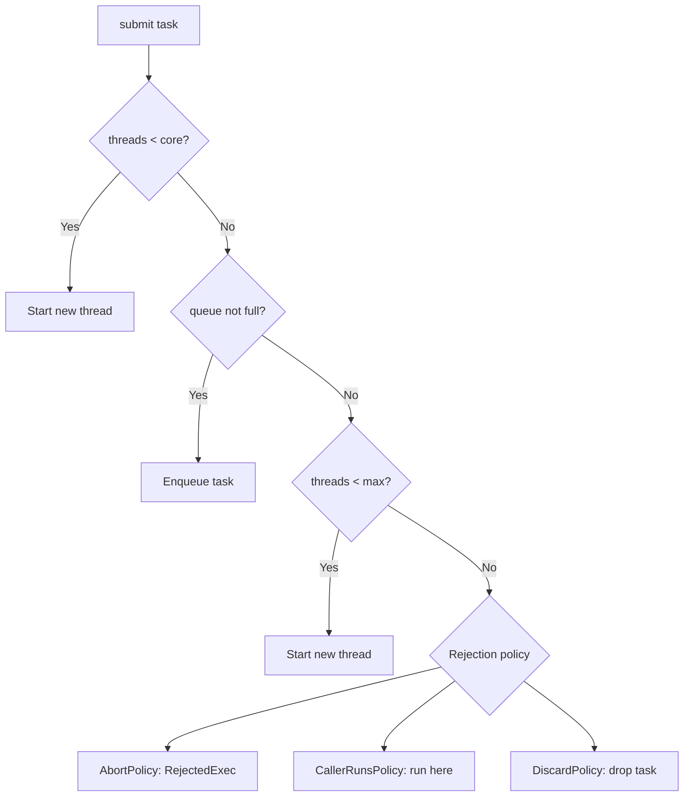
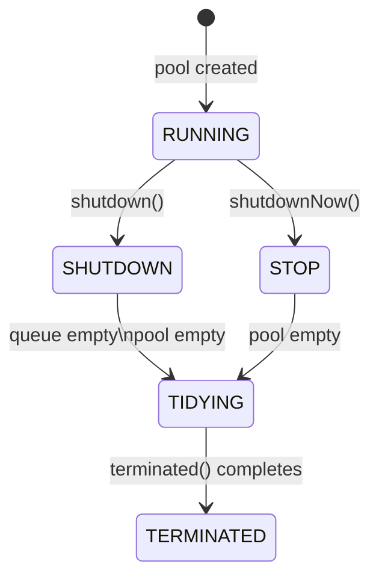
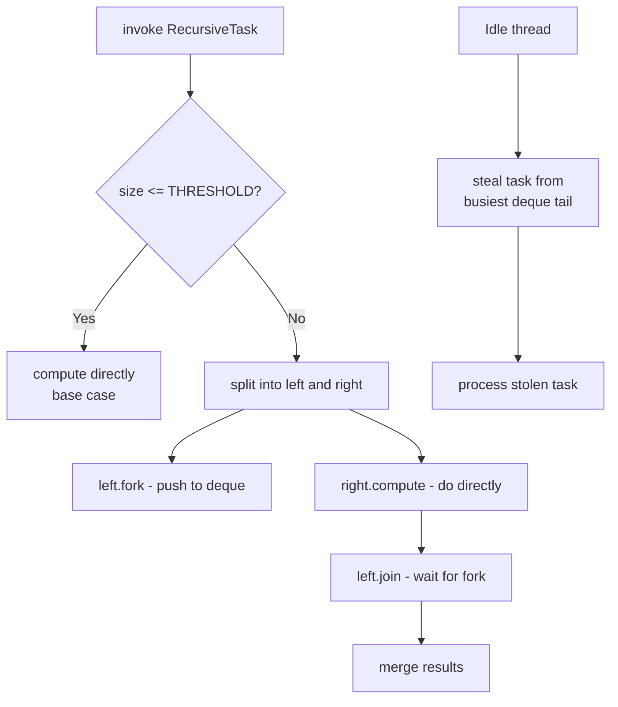
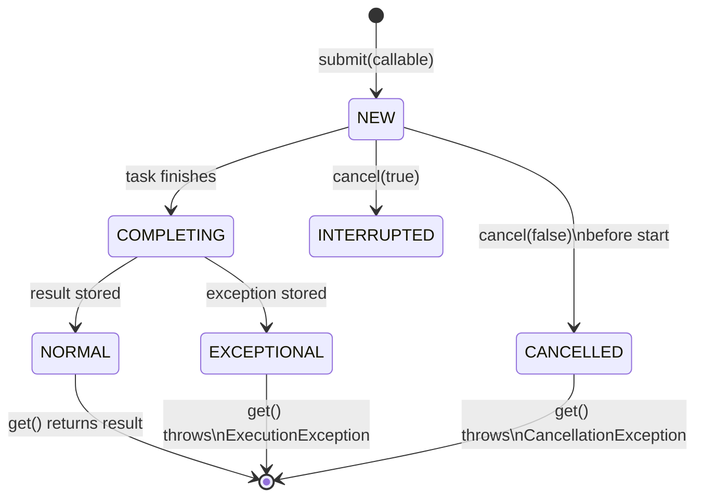

# Java Concurrency - L3 Thread Pools

| # | Keyword | Difficulty |
| --- | --- | --- |
| 1 | [ExecutorService and Executor](#executorservice-and-executor) | ★★☆ |
| 2 | [ThreadPoolExecutor Internals](#threadpoolexecutor-internals) | ★★★ |
| 3 | [ForkJoinPool and Work Stealing](#forkjoinpool-and-work-stealing) | ★★★ |
| 4 | [ScheduledExecutorService](#scheduledexecutorservice) | ★★☆ |
| 5 | [Callable and Future](#callable-and-future) | ★★☆ |

---

# ExecutorService and Executor

**Interview Weight:** high - Core abstraction for thread lifecycle
management. Every production Java app uses ExecutorService.

---

### 🎯 Model Answer

**30 seconds:**

> ExecutorService decouples task definition from thread management.
> You submit Runnable or Callable tasks; the service handles thread
> creation, reuse, and lifecycle. Key factory methods: newFixedThreadPool
> (bounded threads), newCachedThreadPool (elastic), newSingleThreadExecutor
> (serial). Always shut down explicitly - the JVM will not exit while
> a non-daemon ExecutorService has threads alive.

**3 minutes (Senior):**

> ExecutorService solves three problems: thread reuse (platform threads
> cost ~1MB stack + creation overhead), lifecycle management (shutdown,
> awaitTermination, graceful drain), and exception propagation (submit()
> wraps exceptions in Future; execute() logs to uncaught handler).
>
> Factory methods: newFixedThreadPool(N) uses LinkedBlockingQueue
> (unbounded - tasks queue forever if threads busy; risk: OOM).
> newCachedThreadPool uses SynchronousQueue (zero-capacity handoff;
> creates new thread per task if no idle thread available; unbounded
> thread count - risk: 10,000 threads under load). newSingleThreadExecutor:
> one thread, serial execution, tasks queue in order.
>
> Production best practice: always create ThreadPoolExecutor directly
> with explicit parameters (core size, max size, keepAlive, queue
> capacity, rejection policy) - never use Executors.newFixedThreadPool
> in production without understanding the unbounded queue risk.
>
> Java 21: Executors.newVirtualThreadPerTaskExecutor() - creates one
> virtual thread per task. For IO-bound work, replaces thread pools
> entirely.

**Framework:** SUBMIT TASK -> QUEUE -> THREAD EXECUTES -> FUTURE

**Blank Mind Recovery:**

**(1) Restate:** "ExecutorService: thread pool abstraction for task
submission and lifecycle management."

**(2) First principles:** "Threads are expensive. Reuse them. Submit
tasks to a pool; pool assigns tasks to idle threads."

**(3) Bridge:** "Like a staffing agency: you give the agency tasks
(submit); the agency assigns workers (threads) and manages hiring/firing."

---

### 📘 Concept Explanation

**What it is:**

Executor: interface with one method: execute(Runnable). The simplest
abstraction.

ExecutorService: extends Executor. Adds: submit (returns Future),
invokeAll/invokeAny, shutdown/shutdownNow, awaitTermination, isShutdown.

ScheduledExecutorService: extends ExecutorService. Adds: schedule
(one-shot delay), scheduleAtFixedRate, scheduleWithFixedDelay.

**The problem it solves:**

Manual thread creation: every task = new Thread = ~1MB stack + OS
overhead. 1000 concurrent tasks = 1GB. Thread pool: N threads handle
all tasks by queuing work. Task throughput decouples from thread count.

**How it works:**

```
THREAD POOL ANATOMY:
  ThreadPoolExecutor(
      corePoolSize,    // minimum live threads
      maximumPoolSize, // maximum live threads
      keepAliveTime,   // idle thread timeout beyond core
      unit,
      workQueue,       // task queue (BlockingQueue)
      rejectionHandler // what to do when queue+maxPool full
  )

TASK LIFECYCLE:
  submit(task) ->
    if threads < core: start new thread
    else if queue not full: enqueue
    else if threads < max: start new thread
    else: apply rejection policy

REJECTION POLICIES:
  AbortPolicy (default): throw RejectedExecutionException
  CallerRunsPolicy: run task in caller's thread (backpressure)
  DiscardPolicy: silently discard
  DiscardOldestPolicy: discard oldest queued task, retry

SHUTDOWN SEQUENCE:
  executor.shutdown()           // no new tasks; existing finish
  executor.awaitTermination(30, SECONDS)  // wait for drain
  executor.shutdownNow()        // interrupt active; return queued
```

**The key insight:**

Executors.newFixedThreadPool(N) creates a pool with an UNBOUNDED
LinkedBlockingQueue. If all N threads are busy and tasks are submitted
faster than processed, the queue grows without limit - eventual OOM.
Production pools must have bounded queues with rejection policies.

**When to use it:**

- CPU-bound tasks: pool size = number of CPU cores
- IO-bound tasks: pool size = tuned by load testing (or virtual threads)
- Background tasks: separate pool from request-handling pool
- Batch processing: bounded pool + bounded queue with CallerRuns policy

**When NOT to use it:**

- Do not use Executors.newFixedThreadPool in production without
  explicit queue bounds
- Do not use newCachedThreadPool for CPU-bound work: unbounded thread
  creation will saturate CPU
- Do not use single-thread executor for latency-sensitive code: tasks
  queue behind each other

**Alternatives:**

- Virtual threads (Java 21): newVirtualThreadPerTaskExecutor()
- ForkJoinPool: parallel recursive algorithms
- Reactive (Project Reactor): non-blocking async pipelines

**First-principles derivation:**

Thread pools implement the Thread Pool pattern (Doug Lea, Concurrent
Programming in Java). Core insight: thread creation is expensive;
task creation is cheap. Pool pre-creates threads (or creates lazily)
and keeps them alive to process tasks. A blocking queue is the
decoupling mechanism between producers (task submitters) and consumers
(worker threads).

---

### 💻 Code Example

**Example 1: BAD (Executors.newFixedThreadPool unbounded) vs GOOD (explicit ThreadPoolExecutor)**

```java
// BAD: unbounded queue - potential OOM under load
ExecutorService bad = Executors.newFixedThreadPool(10);
// Uses LinkedBlockingQueue(Integer.MAX_VALUE)
// Under load: 10 threads + unlimited queuing = OOM

// GOOD: explicit ThreadPoolExecutor with bounded queue
ThreadPoolExecutor pool = new ThreadPoolExecutor(
    4,              // corePoolSize: 4 always-live threads
    8,              // maxPoolSize: up to 8 under burst
    60, SECONDS,    // keepAlive: extra threads exit after 60s idle
    new ArrayBlockingQueue<>(1000),  // bounded queue: 1000 tasks
    new ThreadPoolExecutor.CallerRunsPolicy()
    // When full: task runs in the calling thread
    // This slows the producer (backpressure) instead of OOM
);

// Graceful shutdown:
pool.shutdown();
try {
    if (!pool.awaitTermination(30, SECONDS)) {
        pool.shutdownNow();  // interrupt remaining tasks
    }
} catch (InterruptedException e) {
    pool.shutdownNow();
    Thread.currentThread().interrupt();
}
```

> **Code walkthrough:** The explicit ThreadPoolExecutor has four
> protection mechanisms: bounded corePoolSize (4 threads minimum),
> bounded maxPoolSize (8 threads maximum), bounded queue (1000 tasks),
> and CallerRunsPolicy rejection handler (when queue + max threads
> are all used, the submitting thread runs the task itself - slowing
> the producer to the pool's processing rate). This is a complete
> backpressure implementation. The shutdown sequence: shutdown() stops
> new submissions, awaitTermination(30s) waits for drain, shutdownNow()
> interrupts if still running after 30 seconds.

---

### 🎓 Answers by Seniority

**Junior / Mid (0-5 years):**

> ExecutorService manages a thread pool. submit() returns a Future.
> Executors factory methods: newFixedThreadPool (fixed N threads),
> newCachedThreadPool (elastic), newSingleThreadExecutor (serial).
> Always call shutdown() when done - otherwise JVM won't exit.

---

**Senior / Staff (5+ years):**

> I never use Executors.newFixedThreadPool in production - the
> unbounded queue is a latent OOM risk. I construct ThreadPoolExecutor
> directly with explicit parameters: core size, max size, keepAlive,
> bounded queue, rejection policy. Rejection policy choice depends
> on the application: CallerRunsPolicy for natural backpressure,
> AbortPolicy for fail-fast with circuit breaker. For Java 21+
> IO-bound work: newVirtualThreadPerTaskExecutor() replaces IO thread
> pools entirely.

---

### ⚠️ Common Misconceptions

| Misconception | Reality | Risk |
| --- | --- | --- |
| "newFixedThreadPool(N) limits memory to N threads" | Fixed pool uses unbounded queue; memory grows with queued tasks | OOM when producers faster than consumers |
| "shutdownNow() waits for all tasks to finish" | shutdownNow() interrupts tasks and returns unexecuted tasks; does NOT wait | Application exits before tasks complete |
| "execute() and submit() are equivalent" | execute() discards exceptions; submit() wraps them in Future | Silent exception swallowing with execute() |

---

### 🚨 Failure Modes and Diagnosis

| Failure | Symptom | Root Cause | Diagnostic | Fix |
| --- | --- | --- | --- | --- |
| Thread pool saturation | RejectedExecutionException | Task rate exceeds pool capacity + queue capacity | Monitor pool.getQueue().size() and pool.getActiveCount() | Tune pool size; add queue capacity; use CallerRunsPolicy |
| Thread pool OOM | Heap exhaustion; queue grows unboundedly | Unbounded queue (newFixedThreadPool) + slow consumers | jmap -heap: large blocking queue; queue.size() monitoring | Bounded queue; rejection policy |
| Thread leak | JVM won't exit; threads running after main() returns | ExecutorService.shutdown() not called | jstack: non-daemon pool threads running | Always shutdown in finally or try-with-resource wrapper |

---

### 🎯 Interview Deep-Dive

| Level | Time | Expected Depth |
| --- | --- | --- |
| Junior | 3 min | Factory methods; submit vs execute; shutdown |
| Mid | 5 min | Unbounded queue risk; ThreadPoolExecutor parameters; rejection |
| Senior | 8 min | Sizing; monitoring; virtual threads; backpressure strategy |
| Staff | 12 min | Multi-pool architecture; pool isolation; bulkhead pattern |

---

**Q1** [CONCEPTUAL] [JUNIOR]

"What is the difference between execute() and submit() in ExecutorService?"

**Answer:**

Both submit a task to the thread pool, but differ in exception handling
and return values.

execute(Runnable): fire-and-forget. No return value. If the task
throws an uncaught exception, it goes to the thread's uncaught
exception handler (logged by default, often to stderr). The caller
cannot observe the exception or the task's completion.

submit(Runnable or Callable): returns a Future<V>. The Future
captures the task's result (or void/null for Runnable), and also
captures any exception thrown. The exception is wrapped in an
ExecutionException and rethrown when Future.get() is called.

```java
// execute - exception swallowed unless handler configured
executor.execute(() -> {
    throw new RuntimeException("bug");
    // logged to stderr; caller never sees it
});

// submit - exception captured in Future
Future<?> f = executor.submit(() -> {
    throw new RuntimeException("bug");
});
try {
    f.get();  // throws ExecutionException wrapping RuntimeException
} catch (ExecutionException e) {
    log.error("Task failed", e.getCause());  // see actual exception
}
```

Best practice: always use submit() for tasks where failure matters.
execute() only when you have configured an UncaughtExceptionHandler
on all pool threads, or for truly fire-and-forget tasks.

*What separates good from great:* Knowing that execute() + no
UncaughtExceptionHandler = silent exception swallowing in production.

---

**Q2** [DEBUGGING] [SENIOR]

"How do you monitor and tune a thread pool in production?"

**Answer:**

ThreadPoolExecutor exposes metrics directly:

```java
// Monitoring (expose via Micrometer/Actuator):
pool.getCorePoolSize()       // configured core
pool.getMaximumPoolSize()    // configured max
pool.getActiveCount()        // current active threads
pool.getPoolSize()           // current total threads
pool.getQueue().size()       // pending task count
pool.getCompletedTaskCount() // total completed
pool.getTaskCount()          // total submitted
```

Key metrics to alert on:
- Queue size growing consistently -> consumers too slow; add threads or workers
- activeCount == maximumPoolSize -> saturated; rejection risk imminent
- RejectedExecutionException in logs -> already saturated

Sizing rules:
- CPU-bound: corePoolSize = number of CPU cores (Runtime.getRuntime().availableProcessors())
- IO-bound: corePoolSize = estimated by Little's Law:
  N = concurrency / (1 - blocking coefficient)
  If average request time is 100ms, IO blocks for 90ms:
  blocking coefficient = 0.9
  For 100 concurrent requests: N = 100 / (1 - 0.9) = 1000 threads
  (or use virtual threads instead)

Dynamic tuning: ThreadPoolExecutor allows runtime changes:
```java
pool.setCorePoolSize(newCore);
pool.setMaximumPoolSize(newMax);
```
Useful for load-based scaling without restart.

*What separates good from great:* Knowing Little's Law for IO pool
sizing and knowing pool parameters are mutable at runtime.

---

**Q3** [TRADE-OFF] [SENIOR]

"CallerRunsPolicy vs AbortPolicy - when do you use each?"

**Answer:**

Both are rejection handlers when the pool + queue are saturated.

AbortPolicy (default): throws RejectedExecutionException. Caller
must handle this exception. Use when:
- The application has a circuit breaker: rejection is a signal to
  back off (HTTP 503, queue the request externally, return cached result)
- Tasks are non-critical and can be dropped safely
- Rejection rate should be monitored and alerted on

CallerRunsPolicy: the calling thread executes the task directly.
No exception; task always runs. Use when:
- Natural backpressure is desired: the submitting thread slows
  down because it is busy executing tasks
- Task loss is unacceptable
- The caller thread can safely execute the task (not the main thread
  or UI thread)

Risk with CallerRunsPolicy: the calling thread is now processing
a task instead of submitting new ones. If the caller is an HTTP
request handler, the request takes longer. If the task involves IO,
the caller is blocked. Under extreme load, all request threads
may be executing pool tasks directly, bypassing the pool.

Risk with AbortPolicy: silent data loss if the exception is not
handled correctly. Must instrument the RejectedExecutionHandler
to count rejections.

*What separates good from great:* Explaining the CallerRunsPolicy
risk (caller thread processing instead of submitting, stalling the
entire pipeline) and the AbortPolicy requirement (must handle and
monitor the exception).

---

### ⚖️ Comparison Table

| Factory Method | Core | Max | Queue | Risk |
| --- | --- | --- | --- | --- |
| newFixedThreadPool(N) | N | N | Unbounded LinkedBlocking | OOM from queue growth |
| newCachedThreadPool | 0 | MAX_VALUE | SynchronousQueue (0) | Thread explosion under load |
| newSingleThreadExecutor | 1 | 1 | Unbounded LinkedBlocking | Serial execution; queue growth |
| newVirtualThreadPerTaskExecutor | N/A | Unlimited | N/A | Unbounded virtual threads |
| ThreadPoolExecutor (manual) | Explicit | Explicit | Explicit (bounded) | Correct - production standard |

---

### 🏛️ System Design

*(Omit: L3 keyword. Thread pool topology in microservices (bulkhead
per downstream, pool isolation) appears in L4-L5 files.)*

---

### 📊 Diagram

```
THREAD POOL TASK ROUTING:

submit(task)
     |
     v
threads < corePoolSize?
     |            |
    YES           NO
     |             \
start new thread  queue not full?
                   |           |
                  YES          NO
                   |            \
                 enqueue        threads < maxPoolSize?
                                |                  |
                               YES                 NO
                                |                   \
                          start new thread       apply rejection policy
```



> **Diagram walkthrough:** The routing algorithm shows three growth
> stages: (1) grow to core (always create threads up to corePoolSize),
> (2) queue (use the work queue as a buffer), (3) grow beyond core
> (create non-core threads up to maximumPoolSize). Only after both
> the queue and the max thread count are exhausted does the rejection
> policy fire. This is counterintuitive: maxPoolSize threads are only
> created AFTER the queue is full, not when the core threads are all busy.

---

---

# ThreadPoolExecutor Internals

**Interview Weight:** high - Tests deep understanding of thread pool
behavior, task routing, and production tuning parameters.

---

### 🎯 Model Answer

**30 seconds:**

> ThreadPoolExecutor routes tasks through three stages: core growth
> (threads < core), queue (core full, queue not full), then max growth
> (queue full, threads < max). maxPoolSize threads only grow after the
> queue is full - this is counterintuitive and a common source of
> sizing mistakes. The control loop uses an atomic integer encoding
> both thread count and pool state.

**3 minutes (Senior):**

> The internal state is a single AtomicInteger: the high 3 bits
> encode pool state (RUNNING, SHUTDOWN, STOP, TIDYING, TERMINATED);
> the low 29 bits encode worker count. This single-word CAS enables
> lock-free state/count updates.
>
> Worker threads: each is a Worker object (extends AbstractQueuedSynchronizer
> for single-use lock) running a runWorker loop. runWorker() calls
> getTask() in a loop; getTask() blocks on queue.take() (blocking
> wait) or queue.poll(keepAliveTime) for non-core threads. When the
> queue is empty and keepAlive expires, the thread exits.
>
> Key parameter interactions: if corePoolSize == maximumPoolSize
> (fixed pool), non-core threads never exist. If queue is
> SynchronousQueue (zero capacity), tasks immediately trigger max
> growth or rejection - which is why newCachedThreadPool creates
> a new thread per task.
>
> Thread factory: controls thread naming, daemon status, priority.
> Always provide a custom ThreadFactory with meaningful names
> in production - "request-handler-pool-thread-N" not "pool-1-thread-1".

**Blank Mind Recovery:**

**(1) Restate:** "ThreadPoolExecutor internals: how tasks route through
core/queue/max growth."

**(2) First principles:** "Core threads always exist. Queue buffers
burst. Max threads handle queue-overflow burst. Rejection handles
excess."

---

### 📘 Concept Explanation

**What it is:**

ThreadPoolExecutor is the primary ExecutorService implementation.
It manages a pool of worker threads and a work queue. Key parameters:
corePoolSize, maximumPoolSize, keepAliveTime, workQueue, threadFactory,
rejectedExecutionHandler.

**The problem it solves:**

Thread-per-task is wasteful for high-throughput servers. Thread pools
reuse threads, bound memory, and provide structured task queuing.
ThreadPoolExecutor provides fine-grained control over all pool
behaviors.

**How it works:**

```
ATAOMICINTEGER STATE ENCODING:
  AtomicInteger ctl = new AtomicInteger(RUNNING | 0)
  Bits 31-29: state (RUNNING=111, SHUTDOWN=000, STOP=001...)
  Bits 28-0: worker count (max ~536 million workers)
  CAS on ctl: updates both state and count atomically

WORKER THREAD LIFECYCLE:
  addWorker() -> creates Worker -> worker.thread.start()
  Worker.runWorker() {
      while (task != null || (task = getTask()) != null) {
          execute task
      }
      processWorkerExit()  // remove worker; maybe start replacement
  }
  getTask() {
      if (core thread) queue.take()        // blocks forever
      else queue.poll(keepAliveTime, unit) // times out
      returns null -> worker exits
  }

HOOK METHODS (override for instrumentation):
  beforeExecute(Thread t, Runnable r)
  afterExecute(Runnable r, Throwable t)
  terminated()
```

**The key insight:**

maxPoolSize is only relevant when the queue is FULL. If you use
`newFixedThreadPool(10)` (LinkedBlockingQueue, unbounded), your
max threads are 10 forever - the "max" is never reached because
the queue never fills. maxPoolSize is only useful when paired with
a bounded queue.

**When to use it:**

- Any production thread pool: construct directly rather than via
  Executors factory
- When you need fine-grained control over rejection, sizing, monitoring

**When NOT to use it:**

- Do not share a pool across unrelated workloads: a slow database
  query pool and a fast HTTP pool should be separate (pool isolation)
- Do not set corePoolSize to 0 for pools that always have work:
  all threads will exit after keepAlive and be recreated constantly

**Alternatives:**

- ForkJoinPool: for divide-and-conquer parallel algorithms
- Virtual threads: for IO-bound concurrency in Java 21+

**First-principles derivation:**

The ctl integer packing (state + count) eliminates a separate
lock for state transitions. All state checks are a single
AtomicInteger.get(). State transitions (RUNNING -> SHUTDOWN,
SHUTDOWN -> STOP) use compareAndSet - they are CAS operations,
not mutex operations. This is the same trick used in
java.util.concurrent.FutureTask for state encoding.

---

### 💻 Code Example

**Example 1: Named threads + hooks for production pool**

```java
// GOOD: Production-grade ThreadPoolExecutor with naming and monitoring
ThreadPoolExecutor pool = new ThreadPoolExecutor(
    4,        // core
    16,       // max (only relevant when queue fills)
    60, TimeUnit.SECONDS,
    new ArrayBlockingQueue<>(500),
    // Custom ThreadFactory: meaningful thread names
    r -> {
        Thread t = new Thread(r);
        t.setName("payment-processor-" + t.getId());
        t.setDaemon(false);  // non-daemon: JVM waits on shutdown
        return t;
    },
    new ThreadPoolExecutor.CallerRunsPolicy()
) {
    // Hook: instrument task execution
    @Override
    protected void beforeExecute(Thread t, Runnable r) {
        super.beforeExecute(t, r);
        // start timer, MDC setup, etc.
    }

    @Override
    protected void afterExecute(Runnable r, Throwable e) {
        super.afterExecute(r, e);
        // stop timer, record metrics
        if (e != null) log.error("Task failed", e);
        // also check for Future exception:
        if (r instanceof Future<?>) {
            try { ((Future<?>)r).get(0, NANOSECONDS); }
            catch (ExecutionException ex) {
                log.error("Task failed", ex.getCause());
            }
        }
    }
};
```

> **Code walkthrough:** The ThreadFactory names threads with a
> meaningful prefix - when reading jstack, "payment-processor-42"
> immediately identifies the pool. The afterExecute hook handles
> both direct task exceptions (Throwable e parameter) and Future
> exceptions (wrapped in ExecutionException). The beforeExecute
> hook is the right place for MDC (logging context) setup. Core 4
> and max 16 with bounded queue 500: under normal load, 4 threads;
> under burst (500 queued), up to 16 threads; beyond that, CallerRuns.

**Example 2: Pool saturation detection**

```java
// GOOD: monitoring pool saturation
ScheduledExecutorService monitor =
    Executors.newSingleThreadScheduledExecutor();
monitor.scheduleAtFixedRate(() -> {
    int active  = pool.getActiveCount();
    int size    = pool.getPoolSize();
    int queued  = pool.getQueue().size();
    int maxPool = pool.getMaximumPoolSize();
    int maxQ    = 500; // our configured queue capacity

    if (queued > maxQ * 0.8) {
        log.warn("Pool queue at {}% capacity ({}/{})",
            100*queued/maxQ, queued, maxQ);
    }
    if (active == maxPool) {
        log.warn("Thread pool saturated: {}/{} threads active",
            active, maxPool);
    }
    // Export to Micrometer:
    // registry.gauge("pool.active", pool.getActiveCount());
}, 0, 5, SECONDS);
```

> **Code walkthrough:** Periodic monitoring at 5-second intervals
> checks the two key saturation indicators: queue depth approaching
> capacity (warn at 80%) and all max threads active (imminent rejection).
> This gives an early warning before RejectedExecutionException fires.
> In production, these metrics are exported to Grafana/Prometheus via
> Micrometer. The alert threshold of 80% queue capacity gives a 20%
> headroom buffer to react before tasks are rejected.

---

### 🎓 Answers by Seniority

**Junior / Mid (0-5 years):**

> ThreadPoolExecutor is the underlying implementation of all
> ExecutorService pools. Key parameters: corePoolSize (always-live),
> maximumPoolSize (burst max), workQueue (task buffer), rejection
> policy. Critical insight: max threads only grow after the queue
> is full, not when core threads are all busy.

---

**Senior / Staff (5+ years):**

> I always create ThreadPoolExecutor directly in production. The
> key parameter interaction: maxPoolSize is only active when the
> queue is bounded and full. For IO-bound pools, I size based on
> measured blocking coefficient (Little's Law). For CPU-bound:
> N = CPU cores. I instrument beforeExecute/afterExecute for metrics
> and override the thread factory for meaningful thread names (visible
> in jstack dumps). Pool isolation is essential: separate pools for
> database, HTTP calls, and background tasks.

---

### ⚠️ Common Misconceptions

| Misconception | Reality | Risk |
| --- | --- | --- |
| "maxPoolSize threads created when core threads are all busy" | Max threads created only when queue is FULL | Pool appears undersized; actual bottleneck is unbounded queue |
| "setting corePoolSize=maxPoolSize is always a mistake" | It is correct for fixed-size pools (eliminates thread count fluctuation) | No actual problem; just a design choice |
| "keepAlive only affects idle threads" | With allowCoreThreadTimeOut(true), even core threads can expire | Pool empty at rest; slow task startup on next burst |

---

### 🚨 Failure Modes and Diagnosis

| Failure | Symptom | Root Cause | Diagnostic | Fix |
| --- | --- | --- | --- | --- |
| Pool never grows beyond core | maxPoolSize has no effect; core threads bottleneck | Unbounded queue; queue never fills; max growth never triggered | pool.getQueue().size() == constant (never hits capacity) | Use bounded queue; verify max growth is needed |
| Thread leak on uncaught exception | Pool shrinks over time; throughput degrades | runWorker exits when task throws; thread not replaced if count > core | pool.getPoolSize() decreasing; jstack: fewer threads | afterExecute: log exception; pool auto-replaces for core threads |

---

### 🎯 Interview Deep-Dive

| Level | Time | Expected Depth |
| --- | --- | --- |
| Junior | 3 min | Parameters; routing algorithm; rejection policies |
| Mid | 5 min | maxPoolSize + bounded queue interaction; monitoring |
| Senior | 8 min | ctl AtomicInteger encoding; Worker class; hook methods |
| Staff | 12 min | Pool isolation architecture; dynamic sizing; virtual thread migration |

---

**Q1** [CONCEPTUAL] [SENIOR]

"Explain the counterintuitive task routing in ThreadPoolExecutor."

**Answer:**

The routing algorithm surprises most developers:

Stage 1 - Core growth: if current threads < corePoolSize, always
start a new thread for the task (even if idle threads exist).

Stage 2 - Queue: if threads >= core, try to enqueue the task. For
unbounded queues, this always succeeds - so Stage 3 never executes.

Stage 3 - Max growth: if the queue is FULL and threads < maxPoolSize,
start a new non-core thread.

Stage 4 - Reject: if threads == maxPoolSize AND queue is full,
apply rejection policy.

The surprise: maxPoolSize is only triggered when the queue is FULL.
With newFixedThreadPool(10) (unbounded queue): tasks always go to
the queue (Stage 2 always succeeds); Stage 3 never fires. Pool stays
at corePoolSize (10) regardless of maxPoolSize.

Implication: to use dynamic scaling (grow beyond core under burst),
you need a bounded queue. The queue size becomes the trigger for
scale-up.

Another surprise: Stage 1 creates a new thread even if idle threads
exist. The pool can have idle threads AND start new threads up to
corePoolSize. After core is reached, idle threads are used for
queued tasks.

*What separates good from great:* Explaining the specific scenario
where maxPoolSize has no effect (unbounded queue) and why.

---

**Q2** [DEBUGGING] [SENIOR]

"The thread pool has 16 threads configured but you only see 4
in jstack. Why?"

**Answer:**

Four possible causes:

1. corePoolSize=4 and prestartAllCoreThreads() not called:
   Core threads are started lazily (created only when first task
   arrives). If task rate is low, only 4 (core) threads may exist.
   Remaining threads up to max are created only when the queue fills.

2. keepAlive expired: non-core threads exit after keepAliveTime
   with no tasks. With allowCoreThreadTimeOut(true), even core
   threads can exit. If the pool was idle, all non-core threads
   (and possibly core threads) have exited.

3. Queue is not full: maxPoolSize threads are only created when the
   queue is full. If the queue has capacity and all work fits, only
   core threads run.

4. Pool shut down: jstack shows shutdown pool state; threads exit
   after completing current tasks.

Diagnosis:
```java
log.info("Pool: core={}, max={}, active={}, size={}, queue={}",
    pool.getCorePoolSize(),
    pool.getMaximumPoolSize(),
    pool.getActiveCount(),
    pool.getPoolSize(),
    pool.getQueue().size());
```

Expected for 4 threads visible with 16 max: queue.size() > 0 but
< bounded capacity (queue not full yet, so max growth hasn't triggered).
Fix for faster scaling: reduce queue capacity so max growth triggers sooner.

*What separates good from great:* Knowing the lazy core thread creation
(prestartAllCoreThreads()) and the queue-full trigger for max growth.

---

### ⚖️ Comparison Table

| Parameter | Effect When Low | Effect When High | Interaction |
| --- | --- | --- | --- |
| corePoolSize | Few always-live threads; cold start | Many threads even at idle | First growth boundary |
| maximumPoolSize | Pool stays small under burst | Threads explode under load | Only active when queue FULL |
| workQueue capacity | Queue fills quickly; max growth sooner | Queue absorbs burst; max growth delayed | Controls when max grows |
| keepAliveTime | Non-core threads exit quickly | Non-core threads persist | Extra threads survive brief idle |

---

### 🏛️ System Design

*(Omit: L3 keyword. Thread pool topology in microservice bulkhead
patterns and resilience4j Bulkhead appear in L4-L5.)*

---

### 📊 Diagram

```
THREADPOOLEXECUTOR STATE MACHINE:

  RUNNING -> SHUTDOWN (shutdown called)
  RUNNING -> STOP (shutdownNow called)
  SHUTDOWN -> TIDYING (when pool empty + queue empty)
  STOP -> TIDYING (when pool empty)
  TIDYING -> TERMINATED (terminated() hook returns)

WORKER COUNT + POOL STATE IN CTL:
  ctl = [STATE:3bits][WORKER_COUNT:29bits]
  AtomicInteger.compareAndSet enables atomic state+count update
```



> **Diagram walkthrough:** The state machine shows the lifecycle of
> a ThreadPoolExecutor. RUNNING accepts new tasks. SHUTDOWN rejects
> new tasks but completes existing ones and drains the queue. STOP
> rejects new tasks AND interrupts executing tasks (tasks currently
> running are interrupted; queued tasks are returned by shutdownNow()).
> TIDYING runs the terminated() hook for cleanup. TERMINATED is the
> final state. The ctl encoding combines state and count into one
> AtomicInteger, enabling atomic transitions without a separate lock.

---

---

# ForkJoinPool and Work Stealing

**Interview Weight:** high - Tests understanding of parallel
divide-and-conquer, work stealing, and when ForkJoinPool
is appropriate vs thread pools.

---

### 🎯 Model Answer

**30 seconds:**

> ForkJoinPool implements work-stealing for recursive divide-and-conquer
> algorithms. Each thread has a deque of tasks. When a thread's deque
> is empty, it steals tasks from other threads' deques. This balances
> load automatically. ForkJoinPool is the common pool for parallel
> streams and CompletableFuture.

**3 minutes (Senior):**

> ForkJoinPool is designed for tasks that recursively fork (split)
> into subtasks and join (merge) results. The canonical algorithm:
> RecursiveTask (returns value) or RecursiveAction (void). Fork splits
> work asynchronously; join waits for result. Work stealing: when a
> thread's deque is empty, it steals tasks from the tail of other
> threads' deques (the owner thread works from the head, so there is
> minimal contention between owner and stealer).
>
> The common pool (ForkJoinPool.commonPool()) is shared across all
> parallel streams and most CompletableFuture operations. Its
> parallelism = CPU core count - 1. Blocking tasks in the common
> pool starve other tasks sharing it - never block in a ForkJoinPool
> task (no IO, no locks that wait on external state). For blocking
> work: use a separate ThreadPoolExecutor.
>
> Java 21 virtual threads and ForkJoinPool: virtual threads use
> ForkJoinPool as their carrier pool. The common pool has a default
> mechanism (ManagedBlocker) that can create extra carrier threads
> when blocking is detected, preventing pool starvation.

**Blank Mind Recovery:**

**(1) Restate:** "ForkJoinPool: work-stealing pool for recursive
parallel algorithms."

**(2) First principles:** "Divide: split big task into subtasks.
Conquer: run subtasks in parallel. Merge: combine results.
Work-steal: idle threads help busy threads."

**(3) Bridge:** "Like a team splitting a large document for review:
one person splits the document, each person reviews their section,
an idle person steals some pages from a busy person."

---

### 📘 Concept Explanation

**What it is:**

ForkJoinPool: a thread pool optimized for fork/join (divide-and-conquer)
algorithms. Uses work-stealing: each worker thread has a Deque; idle
threads steal tasks from the tail of busy threads' deques.

RecursiveTask<V>: ForkJoinTask that returns a result.
RecursiveAction: ForkJoinTask without a result.

**The problem it solves:**

Traditional thread pools: one global task queue, all threads compete.
For recursive algorithms, subtasks are small and numerous; global
queue contention is high. ForkJoinPool: each thread has its own
deque, minimizing contention. Steal only when idle.

**How it works:**

```
WORK STEALING DEQUE:

Thread 1 deque:  [head] T1a T1b T1c [tail]
Thread 2 deque:  [head] T2a [tail] -> IDLE

Thread 2 steals from Thread 1's tail: T1c
Thread 1 works from head: T1a (no contention)

FORK/JOIN PATTERN:
class MergeSort extends RecursiveAction {
    int[] arr; int lo, hi;

    protected void compute() {
        if (hi - lo < THRESHOLD) {
            insertionSort(arr, lo, hi);  // base case
            return;
        }
        int mid = (lo + hi) / 2;
        MergeSort left  = new MergeSort(arr, lo, mid);
        MergeSort right = new MergeSort(arr, mid, hi);
        left.fork();      // async: push to own deque
        right.compute();  // sync: do right side directly
        left.join();      // wait for left to complete
        merge(arr, lo, mid, hi);
    }
}

// Submit to pool:
ForkJoinPool pool = new ForkJoinPool();
pool.invoke(new MergeSort(array, 0, array.length));
```

**The key insight:**

In fork/join, calling fork() + compute() + join() is more efficient
than calling fork() + fork() + join() + join(). The current thread
should do the right side directly (compute()), not fork it. This
reduces task creation overhead and keeps the thread busy.

**When to use it:**

- Recursive divide-and-conquer: sort, tree traversal, matrix ops
- Parallel streams (internally uses common pool)
- CompletableFuture operations (thenApply, etc. use common pool)
- CPU-bound parallel work with dynamic load imbalance

**When NOT to use it:**

- IO-bound tasks: blocking in ForkJoinPool starves the pool
- Long-running tasks that hold threads
- Tasks that acquire external locks (ForkJoinPool threads may not
  release the CPU while blocked - starvation risk)
- Producer-consumer patterns: use BlockingQueue + ThreadPoolExecutor

**Alternatives:**

- ThreadPoolExecutor: general purpose, IO-bound tasks
- parallel streams: sugar over ForkJoinPool common pool
- Virtual threads: IO-bound concurrency (Java 21)

**First-principles derivation:**

Work stealing was invented by Charles Leiserson for Cilk (MIT). The
insight: task creation is O(1) (push to own deque head); steal is
O(1) amortized (steal from tail of victim's deque). No global lock
on task submission. Idle threads have work to do as long as any thread
has tasks. This achieves near-perfect load balance for irregular
(uneven) task sizes automatically.

---

### 💻 Code Example

**Example 1: RecursiveTask for parallel sum**

```java
// BAD: sequential sum
long sequentialSum(long[] array) {
    long sum = 0;
    for (long v : array) sum += v;
    return sum;  // single-threaded
}

// GOOD: parallel sum with ForkJoinPool
class ParallelSum extends RecursiveTask<Long> {
    static final int THRESHOLD = 10_000;
    private final long[] array;
    private final int lo, hi;

    ParallelSum(long[] array, int lo, int hi) {
        this.array = array; this.lo = lo; this.hi = hi;
    }

    @Override
    protected Long compute() {
        if (hi - lo <= THRESHOLD) {
            // base case: sum directly
            long sum = 0;
            for (int i = lo; i < hi; i++) sum += array[i];
            return sum;
        }
        int mid = (lo + hi) / 2;
        // fork ONE side, compute the other directly
        ParallelSum left = new ParallelSum(array, lo, mid);
        left.fork();                      // async left
        long rightResult = new ParallelSum(array, mid, hi)
            .compute();                   // sync right (current thread)
        long leftResult = left.join();    // wait for async left
        return leftResult + rightResult;
    }
}

long[] bigArray = new long[10_000_000];
// ... fill array
ForkJoinPool pool = new ForkJoinPool(); // or commonPool()
long result = pool.invoke(new ParallelSum(bigArray, 0, bigArray.length));
// On 8 cores, ~7x speedup vs sequential for CPU-bound sum
```

> **Code walkthrough:** The recursion splits the array in half at
> each level. The current thread computes the right half directly
> (keeping the thread busy) while forking the left half (pushed to
> the thread's deque for other threads to steal). When both halves
> are done, results are added. The THRESHOLD of 10,000 prevents
> over-splitting: tasks smaller than THRESHOLD are computed directly.
> For N=10M elements on 8 cores, the parallel version achieves
> ~7x speedup (limited by memory bandwidth, not just CPU count).

---

### 🎓 Answers by Seniority

**Junior / Mid (0-5 years):**

> ForkJoinPool is for recursive parallel algorithms (divide and conquer).
> fork() splits work asynchronously; join() waits for the result.
> Work-stealing: idle threads steal tasks from busy threads. Used
> by parallel streams internally.

---

**Senior / Staff (5+ years):**

> ForkJoinPool.commonPool() is shared by parallel streams and
> CompletableFuture. I never put IO or blocking operations in the
> common pool (it starves other users). For blocking in ForkJoinPool:
> ForkJoinPool.managedBlock(blocker) creates an extra thread to
> compensate. Pool parallelism = cores - 1. For IO-bound parallel
> work in Java 21: virtual threads are better than ForkJoinPool.

---

### ⚠️ Common Misconceptions

| Misconception | Reality | Risk |
| --- | --- | --- |
| "ForkJoinPool is always better than ThreadPoolExecutor" | FJP is optimal for CPU-bound recursive work; TPE is better for IO-bound | Blocking in FJP starves other tasks |
| "commonPool parallelism = CPU count" | Parallelism = CPU count - 1 (one for the submitting thread) | Slightly less parallelism than expected |
| "fork() + fork() + join() + join() is equivalent to fork() + compute() + join()" | fork+compute+join is more efficient (current thread stays busy) | Unnecessary task overhead |

---

### 🚨 Failure Modes and Diagnosis

| Failure | Symptom | Root Cause | Diagnostic | Fix |
| --- | --- | --- | --- | --- |
| Common pool starvation | Parallel streams slow; CompletableFuture delays | Blocking IO or locks in common pool tasks | jstack: commonPool threads BLOCKED or WAITING | Use separate ForkJoinPool for blocking; use ManagedBlocker |
| Over-splitting | Performance worse than sequential | THRESHOLD too low; task creation overhead > work | Profile: time in RecursiveTask.fork() dominates | Increase THRESHOLD; aim for 10,000+ work units per leaf task |

---

### 🎯 Interview Deep-Dive

| Level | Time | Expected Depth |
| --- | --- | --- |
| Junior | 2 min | Fork/join concept; RecursiveTask; work-stealing idea |
| Mid | 4 min | commonPool risk; THRESHOLD tuning; fork+compute+join pattern |
| Senior | 8 min | Work-stealing deque; ManagedBlocker; vs ThreadPoolExecutor |
| Staff | 12 min | Parallel algorithm analysis; work-stealing proof; Cilk heritage |

---

**Q1** [CONCEPTUAL] [SENIOR]

"Why should you avoid blocking operations in ForkJoinPool?"

**Answer:**

ForkJoinPool maintains a fixed number of worker threads equal to
its parallelism level (default: CPU cores - 1). When a thread
blocks (IO, lock wait, sleep), it cannot process other tasks.
Unlike ThreadPoolExecutor (which can grow to maximumPoolSize),
ForkJoinPool does not automatically add threads for blocked ones.

Consequence: if all FJP threads block simultaneously, the pool
is completely stalled. For the common pool, this means all parallel
streams and CompletableFuture operations in the entire JVM stall.

Example: 8-core machine, commonPool parallelism=7. You submit 7
tasks, each doing HTTP calls (5 seconds each). All 7 threads block.
For the next 5 seconds, any parallel stream or CompletableFuture
using the common pool is stuck.

Mitigation options:

1. Use a separate ThreadPoolExecutor for IO-bound work. Never use
   the common pool for IO.

2. ForkJoinPool.managedBlock(ManagedBlocker): FJP can create an
   extra thread when it detects a ManagedBlocker. Virtual threads
   use this internally. User code can implement ManagedBlocker
   to mark blocking points:
   ```java
   ForkJoinPool.managedBlock(new ManagedBlocker() {
       public boolean block() throws IE {
           result = blockingCall();
           return true;
       }
       public boolean isReleasable() { return result != null; }
   });
   ```

3. Java 21 virtual threads: virtual threads unmount from the
   carrier (ForkJoinPool) thread during blocking, freeing the
   carrier to run other tasks. This eliminates the starvation problem.

*What separates good from great:* Knowing ForkJoinPool.managedBlock
and understanding how virtual threads solve this at the JVM level.

---

### ⚖️ Comparison Table

| Feature | ThreadPoolExecutor | ForkJoinPool |
| --- | --- | --- |
| Task type | Independent tasks | Recursive fork/join tasks |
| Queue type | Single shared queue | Per-thread deque + steal |
| Load balancing | None (FIFO queue) | Automatic (work stealing) |
| IO blocking | OK (grows to max) | Risk (starves pool) |
| Parallelism | Max pool size | CPU cores - 1 |
| Common pool | No | Yes (shared) |
| Best for | IO-bound, producer-consumer | CPU-bound recursive work |

---

### 🏛️ System Design

*(Omit: L3 keyword. Parallel task graph scheduling and distributed
work-stealing systems appear in L5 files.)*

---

### 📊 Diagram

```
WORK STEALING MECHANISM:

Thread 1 [deque]: [A B C D E] <- head is current work
Thread 2 [deque]: [X]
Thread 3 [deque]: [] IDLE -> steals E from Thread 1's tail
Thread 4 [deque]: [] IDLE -> steals D from Thread 1's tail

Result: 4 threads working in parallel with minimal contention
(T1 works from head, stealers work from tail = different ends)
```



> **Diagram walkthrough:** The fork/join recursion tree shows the
> divide-and-conquer pattern. At each level, one side is forked
> (pushed to the current thread's deque) and the other is computed
> directly (current thread stays busy). Idle threads steal from the
> tails of busy threads' deques. The head/tail split means the
> thread owner (working from head, recent tasks) and the stealer
> (taking from tail, older tasks) operate on different ends with
> minimal contention.

---

---

# ScheduledExecutorService

**Interview Weight:** medium - Tests knowledge of delayed and
periodic task execution, and the pitfalls of period scheduling.

---

### 🎯 Model Answer

**30 seconds:**

> ScheduledExecutorService runs tasks with a delay or on a fixed
> schedule. schedule(task, delay) = one-shot after delay.
> scheduleAtFixedRate(task, init, period) = every N seconds regardless
> of task duration. scheduleWithFixedDelay(task, init, delay) = N
> seconds after the previous task finishes.

**3 minutes (Senior):**

> The critical distinction: fixedRate vs fixedDelay. fixedRate fires
> on a calendar schedule; if a task takes longer than the period,
> the next execution is triggered immediately (no delay but no
> overlap - only one instance runs at a time). fixedDelay always
> waits the full delay between task completions.
>
> Failure behavior: if a scheduled task throws an uncaught exception,
> the ScheduledExecutorService CANCELS the task permanently. No retry,
> no alert, no log unless you add try-catch. The task silently stops
> executing. This is the most common bug in production schedulers.
>
> Implementation: ScheduledThreadPoolExecutor uses a DelayQueue
> internally - tasks are prioritized by their next scheduled time.
> The scheduler thread dequeues the next task when its delay expires.

**Blank Mind Recovery:**

**(1) Restate:** "ScheduledExecutorService: delay and periodic task
scheduling."

**(2) First principles:** "Tasks need to run at a specific future time
or repeatedly at an interval. DelayQueue orders tasks by next execution time."

---

### 📘 Concept Explanation

**What it is:**

ScheduledExecutorService: extends ExecutorService with time-based
task scheduling methods. Implemented by ScheduledThreadPoolExecutor.

**The problem it solves:**

Periodic tasks: health checks, metric collection, cache refresh,
report generation. Manual Thread.sleep loops are fragile (time drift,
exception handling). ScheduledExecutorService provides reliable
scheduled execution.

**How it works:**

```
SCHEDULING METHODS:

schedule(callable, 10, SECONDS)
  -> Run once, after 10 seconds

scheduleAtFixedRate(runnable, 5, 10, SECONDS)
  -> Run at T=5, T=15, T=25, ...
  -> If task takes 15 seconds: runs at T=5, T=20 (not T=15 - missed!)
  -> Only one instance at a time (no overlap)

scheduleWithFixedDelay(runnable, 5, 10, SECONDS)
  -> Run starting at T=5
  -> If task takes 3 seconds: finishes at T=8, next at T=18
  -> Delay is always from COMPLETION of previous run

FATAL BUG - exception cancels task silently:
  scheduler.scheduleAtFixedRate(() -> {
      fetchMetrics();  // throws IOException at T=30
      // After this exception: TASK IS PERMANENTLY CANCELLED
      // No more runs. No log. Metrics silently stop.
  }, 0, 60, SECONDS);

FIX: wrap in try-catch:
  scheduler.scheduleAtFixedRate(() -> {
      try {
          fetchMetrics();
      } catch (Exception e) {
          log.error("Metrics fetch failed", e);
          // task continues to be scheduled
      }
  }, 0, 60, SECONDS);
```

**The key insight:**

A thrown exception in a scheduled task cancels the future invocations
silently. The ScheduledFuture returned by scheduleAtFixedRate has
its exception captured - but nobody calls .get() on it. This is
the most common production bug: health check scheduled task throws
once, silently stops running, nobody notices for days.

**When to use it:**

- Metric collection, health checks, cache invalidation
- Retry with backoff (schedule each retry attempt)
- Timeout detection (schedule a check, cancel if main completes first)

**When NOT to use it:**

- Do not use Timer (pre-Java 5): no thread pool, tasks serialize,
  one exception kills all other tasks
- Do not use for high-frequency tasks (< 100ms period): scheduling
  overhead is significant
- Do not use for distributed scheduling: use Quartz or Spring @Scheduled
  with a cluster lock

**Alternatives:**

- Spring @Scheduled: annotation-based, managed by Spring context
- Quartz: enterprise-grade with persistence, cluster-aware
- CompletableFuture with delayedExecutor: one-off async delay

**First-principles derivation:**

ScheduledThreadPoolExecutor wraps a ThreadPoolExecutor with a
DelayedWorkQueue (a sorted queue of ScheduledFutureTasks ordered
by next-execution-time). Worker threads poll the queue; tasks that
are not yet due block in the queue until their scheduled time.
After a periodic task executes, it re-enqueues itself with the
next scheduled time.

---

### 💻 Code Example

**Example 1: BAD (exception swallowed) vs GOOD (wrapped with catch)**

```java
ScheduledExecutorService scheduler =
    Executors.newScheduledThreadPool(2);

// BAD: exception silently cancels future executions
scheduler.scheduleAtFixedRate(() -> {
    updateCache();   // throws RuntimeException at some point
    // After first exception: task never runs again
    // No log, no alert - cache goes stale forever
}, 0, 5, TimeUnit.MINUTES);

// GOOD: exception logged, task continues
ScheduledFuture<?> future = scheduler.scheduleAtFixedRate(() -> {
    try {
        updateCache();
    } catch (Exception e) {
        log.error("Cache update failed - will retry next cycle", e);
        // NOT rethrown: task continues to be scheduled
    }
}, 0, 5, TimeUnit.MINUTES);

// Also: monitor the future for unexpected cancellation
scheduler.scheduleAtFixedRate(() -> {
    if (future.isDone()) {
        log.error("Cache update task was cancelled! Re-schedule.");
        // alert, re-schedule, etc.
    }
}, 1, 1, TimeUnit.MINUTES);
```

> **Code walkthrough:** The bad version passes the exception up
> to the ScheduledExecutorService, which captures it in the future
> and cancels the task. No thread logs this. The good version catches
> all exceptions and logs them without rethrowing. The task's scheduled
> continuation is preserved. The monitoring task checks `future.isDone()`
> periodically - a done ScheduledFuture indicates either normal
> completion (impossible for periodic) or exception-based cancellation.

---

### 🎓 Answers by Seniority

**Junior / Mid (0-5 years):**

> ScheduledExecutorService schedules tasks. schedule() = one-shot.
> scheduleAtFixedRate() = run every N seconds. scheduleWithFixedDelay()
> = wait N seconds after each completion. Critical rule: wrap task
> body in try-catch - uncaught exceptions cancel the schedule silently.

---

**Senior / Staff (5+ years):**

> I always wrap scheduled task bodies in try-catch. I distinguish
> fixedRate (calendar-aligned, compensates for slow executions) vs
> fixedDelay (completion-relative, never overlaps). For production
> distributed scheduling: Spring @Scheduled with shedlock for single-
> execution guarantee across cluster nodes. For reliability: monitor
> ScheduledFuture.isDone() to detect silent cancellation.

---

### ⚠️ Common Misconceptions

| Misconception | Reality | Risk |
| --- | --- | --- |
| "scheduleAtFixedRate runs tasks in parallel if one is slow" | Only one instance at a time; if slow, next fires immediately after current completes | Task backlog under high load |
| "exceptions are logged by the scheduler" | Exceptions cancel the task silently; no log unless you check the Future | Silent task death - debugging nightmare |
| "Timer is equivalent to ScheduledExecutorService" | Timer: single thread, no exception recovery, one exception kills all tasks | Timer is deprecated in all production code |

---

### 🚨 Failure Modes and Diagnosis

| Failure | Symptom | Root Cause | Diagnostic | Fix |
| --- | --- | --- | --- | --- |
| Silent task death | Scheduled task stops running; no log | Uncaught exception in task body; ScheduledFuture cancelled | scheduledFuture.isDone() returns true; scheduledFuture.get() throws ExecutionException | Wrap task in try-catch; never rethrow from scheduled task |
| Task overlap | Multiple instances of slow task run | Using scheduleAtFixedRate; task takes longer than rate | jstack: multiple threads in same task code | Use scheduleWithFixedDelay; or add semaphore to limit concurrency |

---

### 🎯 Interview Deep-Dive

| Level | Time | Expected Depth |
| --- | --- | --- |
| Junior | 2 min | schedule vs fixedRate vs fixedDelay |
| Mid | 4 min | Exception cancels task; fixedRate vs fixedDelay behavior |
| Senior | 7 min | Production scheduling (Quartz, shedlock); monitoring task health |

---

**Q1** [CONCEPTUAL] [MID]

"What is the difference between scheduleAtFixedRate and scheduleWithFixedDelay?"

**Answer:**

scheduleAtFixedRate(task, initial, period, unit):
- Fires at: T=initial, T=initial+period, T=initial+2*period, ...
- Calendar-aligned: fires every `period` regardless of task duration
- If task takes longer than period: next fires immediately after
  current finishes (no overlap, no catchup)
- Use when: task must run on a predictable schedule (metrics every
  5 minutes, report at midnight)

scheduleWithFixedDelay(task, initial, delay, unit):
- First fire: T=initial
- Subsequent: T = previousCompletion + delay
- Always waits full `delay` after each completion
- If task is slow: next run is delayed accordingly
- Use when: there must be a quiet period between runs (cleanup task
  that must fully complete before running again, polling with backoff)

Example with task taking 3 seconds:

scheduleAtFixedRate(task, 0, 5, SECONDS):
  T=0: start, T=3: finish
  T=5: start (scheduled), T=8: finish
  T=10: start, T=13: finish

scheduleWithFixedDelay(task, 0, 5, SECONDS):
  T=0: start, T=3: finish
  T=8: start (3+5), T=11: finish
  T=16: start (11+5), T=19: finish

*What separates good from great:* Knowing the "slow task" behavior:
fixedRate fires immediately after the slow task completes (period
slippage); fixedDelay always waits the full delay after completion.

---

### ⚖️ Comparison Table

| Feature | scheduleAtFixedRate | scheduleWithFixedDelay | schedule (one-shot) |
| --- | --- | --- | --- |
| Timing basis | Absolute clock | Relative to completion | Absolute delay |
| Slow task behavior | Next fires immediately after current | Next delayed by full period | N/A |
| Overlap | Never (one at a time) | Never | N/A |
| Use case | Calendar-aligned metrics | Post-completion polling | One-time delayed action |

---

### 🏛️ System Design

*(Omit: L3 keyword. Distributed job scheduling (Quartz, Spring Batch,
Kubernetes CronJob) appears in L5 files.)*

---

### 📊 Diagram

```
FIXED RATE vs FIXED DELAY (task takes 3s, period/delay=5s):

scheduleAtFixedRate:
  T=0  [==task==]  T=3
  T=5  [==task==]  T=8
  T=10 [==task==]  T=13
  ^--- fires on clock tick (every 5s)

scheduleWithFixedDelay:
  T=0  [==task==]  T=3
                        [delay=5s]
  T=8  [==task==]  T=11
                         [delay=5s]
  T=16 [==task==]  T=19
  ^--- fires 5s AFTER previous finish
```



```mermaid
gantt
    title scheduleAtFixedRate vs scheduleWithFixedDelay (period/delay=5s, task=3s)
    dateFormat X
    axisFormat %s

    section fixedRate
    Task 1 :0, 3
    Task 2 :5, 8
    Task 3 :10, 13

    section fixedDelay
    Task 1 :0, 3
    Task 2 :8, 11
    Task 3 :16, 19
```

> **Diagram walkthrough:** The Gantt chart makes the timing difference
> clear. fixedRate tasks fire at T=0, 5, 10 (clock-aligned). fixedDelay
> tasks fire at T=0, 8, 16 (each 5 seconds after the previous finishes
> at T=3, 11). Under a slow task (say, taking 8 seconds - longer than
> the 5-second period), fixedRate fires immediately after the slow
> task ends; fixedDelay still waits 5 seconds after the slow task ends.
> The choice depends on whether "every 5 seconds" means "starting every
> 5 seconds" or "with a 5-second gap between executions."

---

---

# Callable and Future

**Interview Weight:** high - Core async result pattern.
Tests understanding of task cancellation, exception propagation,
and the limitations of raw Future vs CompletableFuture.

---

### 🎯 Model Answer

**30 seconds:**

> Callable is like Runnable but returns a result and can throw
> a checked exception. Future represents the result of an async
> computation. get() blocks until complete (or throws ExecutionException
> on task failure). cancel(true) interrupts the running task.
> Future is limited: no callbacks, no composition. CompletableFuture
> is the modern replacement.

**3 minutes (Senior):**

> Callable<V>.call() returns V and throws Exception. ExecutorService
> .submit(Callable) returns a Future<V>. Future.get() blocks; it
> throws ExecutionException (wrapping the task exception), InterruptedException
> (if the waiting thread is interrupted), or TimeoutException
> (get(timeout) variant).
>
> Future.cancel(mayInterruptIfRunning): if mayInterruptIfRunning=true,
> calls interrupt() on the executing thread. The task must check
> Thread.currentThread().isInterrupted() or handle InterruptedException
> for cancellation to work. cancel() returns false if the task has
> already completed or was already cancelled.
>
> Limitation: Future has no callbacks. You cannot say "when this
> future completes, run this code." You must call get() which blocks.
> CompletableFuture (Java 8+) adds: thenApply, thenCompose, thenAccept,
> whenComplete, exceptionally, allOf, anyOf - the full async composition
> API. For new code: always use CompletableFuture.

**Blank Mind Recovery:**

**(1) Restate:** "Callable: task with result. Future: handle to
async result."

**(2) First principles:** "Submit task; get back a token (Future).
Later, cash in the token (get()) for the result."

---

### 📘 Concept Explanation

**What it is:**

Callable<V>: functional interface with V call() throws Exception.
Like Runnable but with a return value and checked exception.

Future<V>: represents the pending result of an async computation.
Key methods: get() (blocking), get(timeout), cancel(interrupt),
isDone(), isCancelled().

**The problem it solves:**

Runnable cannot return values or throw checked exceptions. For
tasks that compute a result (fetch from DB, call API, parse file),
Callable + Future enables async result retrieval.

**How it works:**

```
CALLABLE + FUTURE:
  Future<String> f = executor.submit(() -> fetchUrl(url));
  // Submission is non-blocking; task runs on pool thread
  doOtherWork();
  // Now block for result:
  String result = f.get(5, SECONDS);  // TimeoutException if slow

EXCEPTION PROPAGATION:
  Future<String> f = executor.submit(() -> {
      throw new IOException("connection failed");
  });
  try {
      f.get();  // throws ExecutionException
  } catch (ExecutionException e) {
      Throwable cause = e.getCause();  // the IOException
      // cast and handle appropriately
  }

CANCELLATION:
  Future<?> f = executor.submit(longRunningTask);
  f.cancel(true);  // interrupt the running thread
  // Task must check isInterrupted() or handle IE for this to work

INVOKEALL:
  List<Callable<Result>> tasks = ...;
  List<Future<Result>> futures =
      executor.invokeAll(tasks, 10, SECONDS);
  // All tasks submitted; all run in parallel
  // After 10s, remaining tasks cancelled
  for (Future<Result> future : futures) {
      Result r = future.get(); // each may throw ExecutionException
  }
```

**The key insight:**

When the task throws any exception, Future.get() throws ExecutionException
with the original exception as the cause. Always call getCause() to
get the actual error. Calling get() without checking isDone() first
will block for the full duration of the task - always use get(timeout).

**When to use it:**

- Parallel task execution with result collection (invokeAll)
- Async computation where result is needed eventually
- Legacy code with ExecutorService (before CompletableFuture)

**When NOT to use it:**

- New code: use CompletableFuture for composition, callbacks, chaining
- Reactive code: use Mono/Flux (Project Reactor) for non-blocking

**Alternatives:**

- CompletableFuture: composition, callbacks, exception handling, allOf
- FutureTask: run Callable directly without an executor
- ListenableFuture (Guava): callback-based future (predates CompletableFuture)

**First-principles derivation:**

Future implements the Promise pattern: a contract to deliver a
value in the future. FutureTask (the concrete implementation used
by ExecutorService) uses an AtomicInteger state (NEW, COMPLETING,
NORMAL, EXCEPTIONAL, CANCELLED, INTERRUPTED) to track task state.
get() uses LockSupport.park() to block efficiently. Completion or
exception transitions state and unparks waiting threads.

---

### 💻 Code Example

**Example 1: BAD (ignoring timeout) vs GOOD (get with timeout + exception handling)**

```java
// BAD: blocking forever on get()
List<Future<String>> futures = executor.invokeAll(tasks);
for (Future<String> f : futures) {
    String result = f.get();  // blocks forever if task hangs!
}

// GOOD: bounded get with proper exception handling
List<Future<String>> futures = executor.invokeAll(
    tasks, 30, TimeUnit.SECONDS);  // timeout the whole batch

for (Future<String> f : futures) {
    try {
        if (f.isCancelled()) {
            log.warn("Task cancelled (timeout)");
            continue;
        }
        String result = f.get(0, TimeUnit.MILLISECONDS);
        // 0ms timeout: already done (invokeAll waits for all)
        process(result);
    } catch (ExecutionException e) {
        log.error("Task failed: {}", e.getCause().getMessage(), e);
    } catch (TimeoutException e) {
        f.cancel(true);
        log.warn("Task timed out");
    } catch (InterruptedException e) {
        Thread.currentThread().interrupt();
        return;
    }
}
```

> **Code walkthrough:** invokeAll with timeout: submits all tasks
> in parallel; waits for all to complete or the timeout to expire.
> After invokeAll returns, all futures are done (isDone() == true)
> or cancelled. Calling get(0ms) is effectively non-blocking at this
> point. The exception handling covers all three checked exceptions:
> ExecutionException (task threw), TimeoutException (task exceeded
> individual timeout), and InterruptedException (waiting thread
> interrupted). Each has a specific appropriate response.

---

### 🎓 Answers by Seniority

**Junior / Mid (0-5 years):**

> Callable returns a result and throws checked exceptions. Future
> holds the pending result. get() blocks. ExecutionException wraps
> the task exception - use getCause() to get the actual error.
> cancel(true) interrupts the running task. For new code, prefer
> CompletableFuture.

---

**Senior / Staff (5+ years):**

> I use invokeAll for parallel task execution with a timeout. Always
> get() with a timeout - never unbounded. For composition and callbacks:
> CompletableFuture. The main Future limitation: no callback API;
> waiting for multiple futures requires joining each or polling.
> CompletableFuture.allOf() and thenApply/thenCompose are the modern
> solution.

---

### ⚠️ Common Misconceptions

| Misconception | Reality | Risk |
| --- | --- | --- |
| "cancel() always cancels the task" | cancel(false) only cancels if not started; cancel(true) interrupts but task must check | Task continues running after cancel() if it ignores interrupts |
| "ExecutionException.getMessage() gives the error" | getCause() gives the original exception; getMessage() may be null | Losing the actual root cause exception |
| "isDone() means success" | isDone() returns true for success, exception, or cancellation | Calling get() after isDone() can still throw ExecutionException |

---

### 🚨 Failure Modes and Diagnosis

| Failure | Symptom | Root Cause | Diagnostic | Fix |
| --- | --- | --- | --- | --- |
| Blocked on get() | Application hangs; thread in WAITING state | get() without timeout; task hangs | jstack: thread WAITING in FutureTask.awaitDone | Use get(timeout, unit) always |
| Exception swallowed | Task failure invisible | ExecutionException caught but cause not logged | Search for "catch (ExecutionException" without "getCause()" | Log e.getCause() explicitly |
| Cancel has no effect | Task continues after cancel(true) | Task ignores interrupt; no isInterrupted() check | Task body: no interrupt check in CPU-bound loop | Add isInterrupted() check; handle IE in blocking calls |

---

### 🎯 Interview Deep-Dive

| Level | Time | Expected Depth |
| --- | --- | --- |
| Junior | 2 min | Callable vs Runnable; Future.get(); ExecutionException |
| Mid | 5 min | Exception handling; cancel; invokeAll; vs CompletableFuture |
| Senior | 8 min | FutureTask state machine; cancellation protocol; composition limitations |

---

**Q1** [COMPARISON] [MID]

"Future vs CompletableFuture - when do you use each?"

**Answer:**

Future is the legacy async result abstraction from Java 5.
CompletableFuture (Java 8+) is the modern replacement with
composition, callbacks, and exception handling.

Future limitations:
- No callbacks: you must call get() (blocking) to get the result
- No composition: combining multiple futures requires blocking on each
- No exception recovery: cannot attach error handlers
- Cannot be completed from outside (no complete() method)

CompletableFuture additions:
- thenApply/thenCompose: chain transformations without blocking
- thenAccept/thenRun: callbacks on completion
- exceptionally/handle: error recovery
- allOf/anyOf: wait for multiple futures
- completedFuture/failedFuture: create already-completed futures
- supplyAsync/runAsync: submit with optional executor

When to use Future:
- invokeAll() returns List<Future> - you get Futures, process all
- Working with older APIs that return Future
- Simple one-shot result where blocking is acceptable

When to use CompletableFuture:
- All new code: it is strictly more capable
- When you need callbacks (don't want to block)
- When chaining multiple async operations
- When combining results of multiple parallel computations

```java
// Future: must block for each
String r1 = f1.get();
String r2 = f2.get();  // blocks even after r1 is ready

// CompletableFuture: non-blocking combination
CompletableFuture.allOf(cf1, cf2)
    .thenRun(() -> process(cf1.join(), cf2.join()));
```

*What separates good from great:* Knowing allOf() for non-blocking
multi-future aggregation as the main advantage of CompletableFuture.

---

### ⚖️ Comparison Table

| Feature | Future | CompletableFuture |
| --- | --- | --- |
| Callbacks | No | Yes (thenApply, etc.) |
| Composition | No | Yes (allOf, anyOf) |
| Exception handling | ExecutionException on get() | exceptionally/handle |
| Manual completion | No | complete(), completeExceptionally() |
| Blocking required | Yes (get()) | No (callbacks) |
| Java version | 5 | 8+ |

---

### 🏛️ System Design

*(Omit: L3 keyword. CompletableFuture async pipeline design and
reactive programming (Flux/Mono) appear in L3 Async Programming
and L4-L5 files.)*

---

### 📊 Diagram

```
CALLABLE + FUTURE LIFECYCLE:

submit(callable)
     |
     v
FutureTask created (state=NEW)
     |
     v
Pool thread calls task.call()
     |
     +-- success: result stored, state=NORMAL
     +-- exception: exception stored, state=EXCEPTIONAL
     |
     v
get() called (blocking if not done):
     |
     +-- state=NORMAL: return result
     +-- state=EXCEPTIONAL: throw ExecutionException(cause)
     +-- state=CANCELLED: throw CancellationException
```



> **Diagram walkthrough:** FutureTask transitions through states
> using a single AtomicInteger. NEW means the task has not started
> or is running. COMPLETING is a transient state while the result
> is being stored. NORMAL means success; EXCEPTIONAL means the task
> threw. Callers blocked in get() are parked via LockSupport.park()
> and are unparked when the state transitions from NEW/COMPLETING
> to a terminal state. cancel() only succeeds if the task is in
> NEW state (not yet started) for cancel(false), or additionally
> interrupts a running task for cancel(true).

---

---