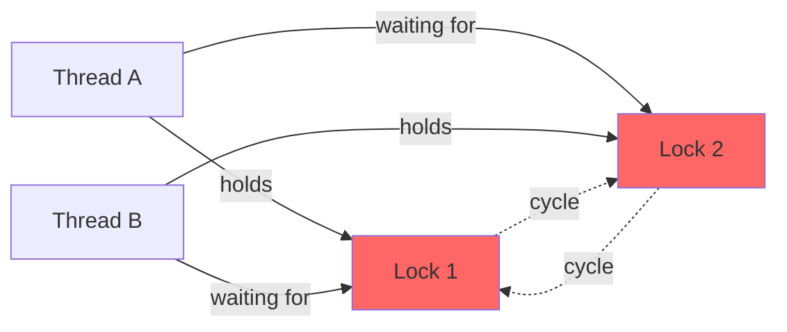

# Java Concurrency - L4 Deadlock Diagnosis

## Deadlock Detection and Diagnosis

### 🎯 Model Answer

**30 seconds:**
> Deadlock is a state where two or more threads each hold a resource
> the other needs, so none can proceed. In Java: Thread A holds lock L1
> and waits for L2; Thread B holds L2 and waits for L1 - circular wait.
> Detection: thread dump shows threads in BLOCKED state with a cycle in
> lock ownership. Prevention: always acquire locks in a consistent global
> order; use `tryLock()` with timeout; or break lock-level dependencies
> via design.

**3 minutes (Senior):**
> Deadlock requires four Coffman conditions: (1) Mutual exclusion -
> resources are non-shareable. (2) Hold and wait - threads hold one
> resource while waiting for another. (3) No preemption - resources
> are only released voluntarily. (4) Circular wait - a cycle of threads,
> each waiting for the next.
>
> Breaking ANY one condition prevents deadlock. In Java: (1) can't
> eliminate without changing algorithm. (2) Acquire all locks atomically
> or use `tryLock()`. (3) ReentrantLock.tryLock(timeout) - give up and
> release held locks if timeout. (4) Global lock ordering (the most
> common fix): always acquire locks in alphabetical or object-hash order.
>
> Diagnosis tools: `jstack <pid>` or `kill -3 <pid>` produces thread
> dump with deadlock detection output; JVisualVM deadlock tab; Java
> Flight Recorder with lock contention events. The thread dump shows
> "Found one Java-level deadlock" and the involved threads and locks.

**Framework:** WHAT → WHY → HOW → TRADE-OFF → EXAMPLE

*Adapting up:* Discuss livelock (threads keep yielding to each other,
never progressing), starvation (thread ready but never scheduled),
and how ReentrantLock's fair mode reduces but does not eliminate
starvation.

*Adapting down:* "Deadlock is two people each holding one key the other
needs to a locked door. They both wait forever because neither will give
up their key."

**Blank Mind Recovery:**

**(1) Restate:** "So you are asking about deadlock - let me explain
the four conditions, how to detect it in a thread dump, and the
prevention strategies."

**(2) First principles:** "From first principles: deadlock requires a
cycle in the resource dependency graph. If Thread A needs what B has
and B needs what A has, neither can proceed. Breaking the cycle
prevents deadlock."

**(3) Bridge:** "Deadlock is like a traffic circle with no entry gaps:
each car is blocked by the car in front, and the car in front is
blocked by the car behind. No one can move because everyone is waiting
for someone else to move first."

---

### 📘 Concept Explanation

**What it is:**
Deadlock is a state where two or more threads are permanently blocked,
each waiting for a resource held by another. The system makes no forward
progress. Unlike livelock (threads active but no progress) or starvation
(threads runnable but not scheduled), deadlocked threads are in BLOCKED
state.

**The Coffman conditions (ALL four must be present):**
```
1. Mutual exclusion:
   Resource can only be held by one thread at a time.
   (Locks, file descriptors, database connections)

2. Hold-and-wait:
   Thread holds a resource while waiting for another.
   (Thread A holds L1 while blocking on L2)

3. No preemption:
   Resources cannot be forcibly taken from a thread.
   (No thread can steal a lock from another)

4. Circular wait:
   A cycle exists in the thread-resource graph.
   Thread A -> needs L2 (held by B)
   Thread B -> needs L1 (held by A)
```

**How it works (minimal example):**
```java
// Two locks, two threads, opposite acquisition order
Object L1 = new Object();
Object L2 = new Object();

// Thread A:
synchronized(L1) {         // acquires L1
    synchronized(L2) { }   // waits for L2 (held by B)
}

// Thread B:
synchronized(L2) {         // acquires L2
    synchronized(L1) { }   // waits for L1 (held by A)
}
// Deadlock: A holds L1 waiting for L2; B holds L2 waiting for L1
```

**Thread dump deadlock indicator:**
```
Found one Java-level deadlock:
=============================
"Thread-A":
  waiting to lock monitor 0x...  (object L2)
  which is held by "Thread-B"
"Thread-B":
  waiting to lock monitor 0x...  (object L1)
  which is held by "Thread-A"

Java stack information for the threads listed above:
===================================================
"Thread-A":
  at MyClass.methodA(MyClass.java:25)
  - waiting to lock <0x...> (L2)
  - locked <0x...> (L1)
  at ...
"Thread-B":
  at MyClass.methodB(MyClass.java:42)
  - waiting to lock <0x...> (L1)
  - locked <0x...> (L2)
```

**When to use deadlock prevention vs detection:**
- Prevention: preferred - no deadlocks ever occur (lock ordering,
  tryLock with timeout)
- Detection: useful when prevention is too complex or impractical;
  detect and recover (throw exception, release locks, retry)

---

### 💻 Code Example

> **Code walkthrough:** The BAD example shows the classic lock-order
> inversion. The GOOD example shows global lock ordering by system
> identity hash. The production example shows tryLock with timeout
> for deadlock prevention.

```java
// BAD: inconsistent lock acquisition order -> deadlock
class BankAccount {
    private final Object lock = new Object();
    private double balance;

    // Thread A calls transfer(A, B)
    // Thread B calls transfer(B, A)
    // -> DEADLOCK
    static void transfer(BankAccount from, BankAccount to,
            double amount) {
        synchronized(from.lock) {  // acquire from's lock
            synchronized(to.lock) { // acquire to's lock - may deadlock
                from.balance -= amount;
                to.balance   += amount;
            }
        }
    }
}
```

```java
// GOOD: global lock ordering using System.identityHashCode
static void transfer(BankAccount from, BankAccount to,
        double amount) {
    BankAccount first, second;
    int fromHash = System.identityHashCode(from);
    int toHash   = System.identityHashCode(to);

    if (fromHash < toHash) {
        first = from; second = to;
    } else if (fromHash > toHash) {
        first = to; second = from;
    } else {
        // Hash collision: acquire a tie-breaker lock
        synchronized(GLOBAL_TIE_BREAKER) {
            doTransfer(from, to, amount);
            return;
        }
    }
    synchronized(first.lock) {
        synchronized(second.lock) {
            doTransfer(from, to, amount);
        }
    }
}
```

```java
// PRODUCTION: tryLock with timeout for deadlock avoidance
class ResourceManager {
    private final ReentrantLock l1 = new ReentrantLock();
    private final ReentrantLock l2 = new ReentrantLock();

    boolean tryOperation(long timeoutMs) throws InterruptedException {
        long deadline = System.nanoTime()
            + TimeUnit.MILLISECONDS.toNanos(timeoutMs);
        while (true) {
            if (!l1.tryLock(deadline - System.nanoTime(),
                    TimeUnit.NANOSECONDS)) {
                return false; // timeout
            }
            try {
                if (l2.tryLock(deadline - System.nanoTime(),
                        TimeUnit.NANOSECONDS)) {
                    try {
                        doWork();
                        return true;
                    } finally {
                        l2.unlock();
                    }
                }
                // l2 not acquired - release l1 and retry
            } finally {
                l1.unlock();
            }
            // Back off before retry (reduce livelock risk)
            Thread.sleep(ThreadLocalRandom.current().nextLong(10));
        }
    }
}
```

---

### 🎓 Answers by Seniority

**Junior / Mid (0-5 years):**
> Deadlock happens when two threads each hold a lock the other needs -
> they both wait forever. The classic example: Thread A holds lock1 and
> waits for lock2; Thread B holds lock2 and waits for lock1. Prevention:
> always acquire locks in the same order across all threads. Detection:
> take a thread dump (`jstack <pid>`) - it shows "Found one Java-level
> deadlock" and the threads involved.

*Push deeper:* What are the four Coffman conditions and which one is
easiest to break?

---

**Senior / Staff (5+ years):**
> Deadlock prevention in production: the primary strategy is global lock
> ordering. When two locks must be acquired, always acquire them in the
> same order (using object identity hash or a defined enum). For complex
> cases with many lock types, define a lock-level hierarchy and prohibit
> acquiring a lower-level lock while holding a higher-level one. For
> database transactions: use timeout-based deadlock detection (most DBs
> do this automatically). At the architectural level: reduce lock
> granularity, use immutable objects, and prefer message-passing
> (actors, queues) over shared state. I treat deadlock as a design smell
> that often indicates inappropriate shared mutable state.

*Push deeper:* How does deadlock in Java database transactions differ
from Java thread deadlock? How do you detect and recover from DB deadlock?

---

### ⚠️ Common Misconceptions

**Misconception 1: "Deadlock is easy to detect in testing."**
Deadlock is often timing-dependent and may not reproduce in low-load
tests. The lock inversion exists in the code even if the race to trigger
it is rare. The code is wrong even if the bug never manifests in testing.
Code review and static analysis (`@GuardedBy` linting) catch it before
it happens.

**Misconception 2: "Using synchronized on `this` prevents deadlock."**
Synchronizing on `this` means two methods on the same object use the same
lock. This prevents deadlock WITHIN the object but not deadlock involving
multiple objects. If object A calls object B's synchronized method
while holding A's lock, and B calls A's synchronized method - deadlock.

**Misconception 3: "Livelock is the same as deadlock."**
Livelock: threads are active (RUNNABLE state) but make no progress -
they keep responding to each other without advancing. Deadlock: threads
are blocked (BLOCKED state) and make no progress. Livelock is harder
to detect (threads appear busy in thread dump) and harder to fix.

---

### 🚨 Failure Modes and Diagnosis

**Failure 1: Classic lock-order inversion deadlock**
Symptom: service stops responding; CPU drops to near zero; threads
stuck (no timeouts).
Detection: `jstack <pid>` → "Found one Java-level deadlock"
Immediate fix: kill and restart the JVM (clear the deadlock state)
Root cause fix: implement global lock ordering

**Failure 2: Deadlock involving thread pool + callback**
Symptom: thread pool threads blocked; new tasks queued but never executed.
Cause: task A in pool submits task B to the SAME pool, then blocks
waiting for B to complete. Pool is full with tasks waiting for B;
B is queued but never runs (no thread available).
```java
// ANTI-PATTERN: self-submitting to bounded pool
ExecutorService pool = Executors.newFixedThreadPool(2);
pool.submit(() -> {
    // submits to same pool, but pool is full
    Future<?> f = pool.submit(() -> doSubWork());
    f.get(); // DEADLOCK: waiting for a task that can't run
});
```
Fix: use a separate pool for subtasks, or use ForkJoinPool (work-stealing
allows the task to "help" execute its own subtasks).

**Failure 3: Database + Java thread deadlock**
Symptom: database reports deadlock; Java receives `SQLException:
deadlock detected`; transaction rolled back.
DB deadlock: DB transactions each hold row locks the other needs.
Fix: DB retries the rolled-back transaction. Application should catch
`SQLException` with deadlock SQL state and retry.
Prevention: access tables in consistent order within transactions;
keep transactions short; add appropriate indexes to avoid full table scans.

---

### 🎯 Interview Deep-Dive

| Question Category | Time to Answer |
|---|---|
| Definition | 60 seconds |
| Coffman conditions | 3-4 minutes |
| Detection | 3-4 minutes |
| Prevention strategies | 3-4 minutes |
| Lock ordering | 3-4 minutes |
| tryLock | 2-3 minutes |
| Thread pool deadlock | 3-4 minutes |
| DB deadlock | 3-4 minutes |
| Livelock / starvation | 2-3 minutes |
| Production diagnosis | 3-4 minutes |
| Design prevention | 3-4 minutes |
| Tool demo | 3-4 minutes |

---

**Q1 (Definition): What is deadlock and how does it differ from
livelock and starvation?**

A: Three related but distinct concurrency pathologies:

**Deadlock:** Two or more threads are permanently BLOCKED, each waiting
for a resource held by another in a cycle. No thread makes progress.
Thread state in dump: BLOCKED.
```
T1: holds L1, waiting for L2 (blocked)
T2: holds L2, waiting for L1 (blocked)
System: no progress ever
```

**Livelock:** Threads are RUNNABLE but make no actual progress. They
keep changing state in response to each other without advancing.
Thread state in dump: RUNNABLE (misleading - looks active but stuck).
```
T1: has resource A, sees B is needed, gives up A, waits for B
T2: has resource B, sees A is needed, gives up B, waits for A
Both retry simultaneously, same pattern repeats endlessly
```
Fix: add randomized backoff before retry.

**Starvation:** A thread is RUNNABLE but never gets CPU time because
other threads are always preferred. Thread is ready but perpetually
delayed.
```
High-priority threads always preempt a low-priority thread.
Under non-fair locks: one thread always loses to faster threads.
```
Fix: fair lock mode (`new ReentrantLock(true)`), thread priority
balancing, or design changes to ensure all threads eventually run.

*What separates good from great:* These three should be diagnosed
differently. Deadlock → `jstack` shows BLOCKED threads with lock
cycle. Livelock → all RUNNABLE, high CPU, no work done (profile
shows time in retry code). Starvation → one RUNNABLE thread with
very low CPU time (profiler shows almost no samples in its methods).

---

**Q2 (Coffman conditions): What are the four Coffman conditions
and which is easiest to break?**

A: All four must hold for deadlock to be possible. Breaking any one
prevents deadlock.

**Condition 1 - Mutual exclusion:** Resources are exclusively held.
Easiest to break by: using read-write locks (multiple readers),
immutable data (no write lock needed), or lock-free structures.
Often hard to eliminate for write access.

**Condition 2 - Hold-and-wait:** A thread holds one resource while
waiting for another.
Break by: acquire ALL resources atomically at once (requires knowing
all needed resources in advance). Difficult when resource needs are
dynamic.

**Condition 3 - No preemption:** Resources cannot be forcibly taken.
Break by: using `tryLock()` with timeout - thread gives up its held
resources if it cannot acquire all. This is the most practical
prevention technique in Java.

**Condition 4 - Circular wait:** A cycle in thread-resource graph.
Break by: imposing a global ordering on resource acquisition. All
threads acquire resources in the same order. No cycle can form.
This is the EASIEST condition to break in practice.

**Practical ranking:**
Circular wait breaking (lock ordering) is the simplest and most
widely applied technique in Java production code.
No-preemption breaking (tryLock with timeout) is the second most common.

*What separates good from great:* Hold-and-wait breaking requires
an all-or-nothing lock acquisition strategy. This is complex when
you don't know upfront what resources you'll need. The `TransactionManager`
pattern in databases uses this: lock all required rows before starting
the transaction (predeclaration). This works in databases (query
optimizer knows what rows are needed) but is hard in general Java code.

---

**Q3 (Detection): How do you generate and read a thread dump to
detect deadlock?**

A: Generating a thread dump:

Method 1: `jstack`
```bash
jstack <pid> > thread-dump.txt
```
Includes "Found one Java-level deadlock" section at the top with
clear deadlock description.

Method 2: `kill -3 <pid>` (Linux/Mac)
Sends SIGQUIT to the JVM, which prints the thread dump to stderr.

Method 3: JVisualVM or JMX
`ManagementFactory.getThreadMXBean().findDeadlockedThreads()` returns
an array of thread IDs involved in a deadlock (null if none).
Can be called programmatically:
```java
ThreadMXBean bean = ManagementFactory.getThreadMXBean();
long[] deadlocked = bean.findDeadlockedThreads();
if (deadlocked != null) {
    ThreadInfo[] infos = bean.getThreadInfo(deadlocked);
    for (ThreadInfo info : infos) {
        log.error("Deadlocked: {} waiting for {}",
            info.getThreadName(),
            info.getLockOwnerName());
    }
}
```

Reading the deadlock section:
```
Found one Java-level deadlock:
=============================
"Thread-A":        <- WAITING thread
  waiting to lock monitor 0xABC (object: Lock2)
  which is held by "Thread-B"  <- HOLDER thread

"Thread-B":        <- WAITING thread
  waiting to lock monitor 0xDEF (object: Lock1)
  which is held by "Thread-A"

Stack traces (look for - locked and - waiting):
"Thread-A":
  at MyClass.method(MyClass.java:25)
  - waiting to lock <0xABC> (Lock2)
  - locked <0xDEF> (Lock1)  <- Thread-A holds Lock1
```

*What separates good from great:* Add deadlock monitoring to production
health checks via `ThreadMXBean.findDeadlockedThreads()`. Poll every
30 seconds; if deadlock detected, dump all thread stacks, alert,
and optionally restart the affected threads (advanced: interrupt
the waiting threads to break the deadlock).

---

**Q4 (Prevention): What strategies prevent deadlock?**

A: Four prevention strategies in order of simplicity:

**Strategy 1 - Lock ordering (most practical):**
Define a global ordering on all locks. Always acquire in this order.
No two threads can be holding locks in opposite order, so no cycle.
```java
// Order by System.identityHashCode or a static field:
void doWork(Resource a, Resource b) {
    Object first  = a.id < b.id ? a.lock : b.lock;
    Object second = a.id < b.id ? b.lock : a.lock;
    synchronized(first) {
        synchronized(second) {
            // work
        }
    }
}
```

**Strategy 2 - tryLock with timeout (ReentrantLock):**
Try to acquire locks with a timeout. On timeout: release all held
locks and retry from scratch. This breaks hold-and-wait.
```java
boolean success = false;
while (!success) {
    if (l1.tryLock(100, MILLISECONDS)) {
        try {
            if (l2.tryLock(100, MILLISECONDS)) {
                try { doWork(); success = true; }
                finally { l2.unlock(); }
            }
        } finally { l1.unlock(); }
    }
    // backoff before retry
}
```

**Strategy 3 - Lock coarsening (avoid nested locks):**
Merge multiple fine-grained locks into one coarser lock. No nested
locks = no circular wait possible. Trade-off: reduced concurrency.

**Strategy 4 - Message passing / actor model:**
Eliminate shared mutable state entirely. Threads communicate via
message queues (BlockingQueue, Akka actors). No shared locks = no deadlock.

*What separates good from great:* Strategy 4 (message passing) is the
architectural-level prevention. It doesn't just prevent deadlock - it
eliminates the entire class of shared-state concurrency bugs. The
cost: higher code complexity and message-passing overhead. For truly
concurrent systems with complex interaction, actors or disruptor patterns
are often the correct architecture.

---

**Q5 (Lock ordering): Implement lock ordering for an arbitrary number
of locks.**

A: For N locks where the set is known at acquisition time:
```java
/**
 * Acquires all locks in a consistent global order.
 * Prevents deadlock by ensuring a lock cycle cannot form.
 */
void acquireInOrder(List<ReentrantLock> locks)
        throws InterruptedException {
    // Sort by identity hash to establish consistent ordering:
    List<ReentrantLock> ordered = locks.stream()
        .distinct() // deduplicate to avoid self-deadlock on reentrant
        .sorted(Comparator.comparingInt(System::identityHashCode))
        .collect(Collectors.toList());

    // Acquire in sorted order:
    for (ReentrantLock lock : ordered) {
        lock.lock(); // blocks until available
    }
}

void releaseAll(List<ReentrantLock> locks) {
    // Release in reverse order (conventional cleanup):
    List<ReentrantLock> ordered = locks.stream()
        .distinct()
        .sorted(Comparator.comparingInt(System::identityHashCode)
            .reversed())
        .collect(Collectors.toList());
    for (ReentrantLock lock : ordered) {
        lock.unlock();
    }
}

// Usage (safe from deadlock regardless of argument order):
acquireInOrder(List.of(lockA, lockB));
try {
    // critical section
} finally {
    releaseAll(List.of(lockA, lockB));
}
```

Hash collision handling: when two locks have the same
`System.identityHashCode()` (rare but possible), a secondary ordering
(e.g., class name + field name) or a global tie-breaker lock can be
used to break ties.

*What separates good from great:* Reentrant lock acquisition on the
same lock: `ReentrantLock.lock()` is re-entrant so acquiring the same
lock twice doesn't deadlock. But `.distinct()` in the ordering prevents
double-acquisition when the same lock appears twice in the list.
Without deduplication, `acquireInOrder([L1, L1, L2])` would
double-acquire L1, and `releaseAll` would release once too few.

---

**Q6 (tryLock): How does ReentrantLock.tryLock() prevent deadlock?**

A: `tryLock()` breaks the "no preemption" Coffman condition. Instead
of blocking indefinitely waiting for a lock, a thread tries for a
bounded time and gives up if unsuccessful.

```java
// Pattern: try both locks, release all if can't get both
boolean performTransfer(Account from, Account to, double amount) {
    boolean success = false;
    // Try to acquire from's lock (100ms timeout):
    try {
        if (from.lock.tryLock(100, MILLISECONDS)) {
            try {
                // Try to acquire to's lock (100ms timeout):
                if (to.lock.tryLock(100, MILLISECONDS)) {
                    try {
                        from.debit(amount);
                        to.credit(amount);
                        success = true;
                    } finally {
                        to.lock.unlock(); // always release to's lock
                    }
                }
                // If to's lock not acquired: from's lock released
                // in outer finally - no deadlock
            } finally {
                from.lock.unlock(); // always release from's lock
            }
        }
    } catch (InterruptedException e) {
        Thread.currentThread().interrupt();
    }
    return success;
}

// Retry loop with random backoff to prevent livelock:
boolean transfer(Account from, Account to, double amount) {
    while (!performTransfer(from, to, amount)) {
        // Back off randomly to avoid synchronized retries:
        LockSupport.parkNanos(
            ThreadLocalRandom.current().nextLong(1_000_000)); // 0-1ms
    }
    return true;
}
```

Key requirement: the thread must release ALL held locks when it gives up.
Releasing one but not others while waiting for the nth lock perpetuates
the deadlock risk.

*What separates good from great:* The random backoff in the retry loop
converts the livelock risk (both threads retry simultaneously) into a
probabilistic safety: on each retry, threads are unlikely to be in
perfect lock-step. The randomization provides "deadlock-freeness with
high probability under adversarial scheduling."

---

**Q7 (Thread pool deadlock): Why can bounded thread pools deadlock
and how do you prevent it?**

A: Bounded thread pool deadlock (thread starvation deadlock):

Scenario: tasks in the pool need to wait for other tasks in the SAME
pool to complete. If the pool is full and the subtasks can't run, the
waiting tasks block pool threads, but the pool has no threads to run
the subtasks.

```java
// DEADLOCK: bounded pool, tasks submit and wait for subtasks
ExecutorService pool = Executors.newFixedThreadPool(2);

// Task A (in pool thread 1):
pool.submit(() -> {
    Future<String> sub1 = pool.submit(() -> "result1"); // to pool
    Future<String> sub2 = pool.submit(() -> "result2"); // to pool
    // Both pool threads now blocked here waiting for sub1/sub2
    // sub1, sub2 are queued but NO threads available to run them
    String r1 = sub1.get(); // BLOCKS FOREVER
    String r2 = sub2.get();
});
```

Prevention strategies:

1. Use ForkJoinPool (work-stealing): when a thread calls `join()` on
   a subtask, ForkJoinPool can execute the subtask in the waiting thread
   itself. No deadlock.

2. Never `get()` on a future from within the same pool thread:
   redesign to use callbacks or CompletableFuture.

3. Use separate pools for parent and child tasks:
   parent tasks in `parentPool`, subtasks in `childPool` - no dependency.

4. Unbounded pool (Executors.newCachedThreadPool()): not deadlock-prone
   but can exhaust memory if workload bursts.

*What separates good from great:* Thread starvation deadlock is
diagnosed differently from lock deadlock. Thread dump shows all
pool threads in `get()` or `join()`, but no "Found one Java-level
deadlock" (no lock cycle). The symptom is: pool threads blocked in
Future.get(), task queue growing, no progress. Solution detection:
look at pool thread stacks - they all show Future.get() waiting for
tasks queued in the same pool.

---

**Q8 (DB deadlock): How do you handle database deadlocks in Java?**

A: Database deadlocks happen when two transactions each hold row locks
the other needs. The DB detects the cycle and rolls back one transaction
(the "deadlock victim").

In Java, a DB deadlock surfaces as a `SQLException` with a specific
SQL state:
- PostgreSQL: `40P01` (deadlock detected)
- MySQL: `1213` (ER_LOCK_DEADLOCK)
- Oracle: `ORA-00060`

Handling in JDBC:
```java
int maxRetries = 3;
for (int attempt = 0; attempt <= maxRetries; attempt++) {
    try (Connection conn = dataSource.getConnection()) {
        conn.setAutoCommit(false);
        try {
            performTransaction(conn);
            conn.commit();
            return; // success
        } catch (SQLException e) {
            conn.rollback();
            if (isDeadlock(e) && attempt < maxRetries) {
                log.warn("Deadlock on attempt {}, retrying", attempt);
                // Random backoff before retry:
                Thread.sleep(ThreadLocalRandom.current()
                    .nextLong(50, 500));
            } else {
                throw e; // not a deadlock, or max retries exceeded
            }
        }
    }
}

boolean isDeadlock(SQLException e) {
    return "40P01".equals(e.getSQLState()) // PostgreSQL
        || "40001".equals(e.getSQLState()) // serialization failure
        || e.getErrorCode() == 1213;       // MySQL
}
```

Spring's `@Retryable` or resilience4j `Retry` simplify this pattern.

*What separates good from great:* DB deadlock prevention (not just
recovery): (1) access tables in consistent order across transactions,
(2) keep transactions short - less time holding locks, (3) use
appropriate indexes to avoid full table scans that lock more rows than
needed, (4) for PostgreSQL: use `SELECT FOR UPDATE SKIP LOCKED` for
queue-like access patterns that otherwise deadlock.

---

**Q9 (Livelock / starvation): How do you diagnose livelock vs deadlock
in a thread dump?**

A: Thread dump signatures:

**Deadlock:** Threads are in BLOCKED state. JVM reports "Found one
Java-level deadlock". Stack traces show `- waiting to lock <N>`
annotations.

**Livelock:** Threads are in RUNNABLE state. No deadlock report.
Stacks show threads in retry loops (look for retry variables, backoff
code, repeatedly acquiring/releasing locks). CPU is high (threads
spinning). Output: no work being done, but threads appear active.

**Starvation:** Most threads active, one or a few threads RUNNABLE
but very rarely in stack traces. CPU profiler shows negligible time
for the starved threads. Often associated with non-fair lock mode
where "hot" threads always win the CAS race.

Diagnosis commands:
```bash
# Deadlock: look for "Found one Java-level deadlock"
jstack <pid> | grep -A 20 "deadlock"

# Livelock: all RUNNABLE but CPU high, no work done
# Compare outputs 5 seconds apart:
jstack <pid> > dump1.txt; sleep 5; jstack <pid> > dump2.txt
diff dump1.txt dump2.txt  # livelock: same frames, threads still RUNNABLE

# Starvation: a thread that's never in any stack trace sample
# Take 10 dumps 1s apart, count thread appearances
for i in {1..10}; do jstack <pid> >> all_dumps.txt; sleep 1; done
grep "Thread-Name" all_dumps.txt | wc -l  # low count = starvation
```

*What separates good from great:* Async-profiler and JFR (Java Flight
Recorder) are more reliable than manual thread dumps. JFR's `jdk.ThreadSleep`,
`jdk.MonitorWait`, `jdk.JavaMonitorEnter` events show lock contention
with precise blocking times and ownership chains. For production
deadlock detection, use the `ThreadMXBean.findDeadlockedThreads()` API
in a health check endpoint.

---

**Q10 (Production diagnosis): Walk through a production deadlock
incident - what do you do?**

A: Production deadlock incident response:

**Immediate (minutes):**
1. Confirm it's a deadlock: is the service healthy endpoint failing?
   Are threads stuck (not timing out)?
2. Take a thread dump immediately:
   `jstack <pid> > /tmp/deadlock-dump-$(date +%s).txt`
3. Alert the on-call team.
4. Decision: how critical is the service? Can it handle partial recovery
   or does it need restart?

**Short-term (recovery):**
5. If the JVM exposes JMX: call `ThreadMXBean.findDeadlockedThreads()`
   and attempt to interrupt the deadlocked threads (may break the
   deadlock if using ReentrantLock with interruptible acquire).
6. If not recoverable without restart: perform a rolling restart
   (kill one instance at a time, drain traffic first).
7. Post-restart: confirm service is healthy.

**Investigation (hours):**
8. Analyze thread dump: identify the threads, locks, and classes involved.
9. Find the code path: trace back from the stack frames to the source.
10. Reproduce in a test: write a stress test that triggers the
    lock inversion.
11. Fix: implement lock ordering or tryLock with timeout.
12. Deploy fix with a canary.

**Post-mortem:**
13. Add deadlock monitoring: `ThreadMXBean.findDeadlockedThreads()`
    polled every 30 seconds, alert if not null.
14. Add `@GuardedBy` annotations with SpotBugs enforcement to catch
    future lock misuse.
15. Review: are there other lock-inversion patterns in the codebase?

*What separates good from great:* The monitoring rule - "Found one
Java-level deadlock" in a thread dump means the deadlock ALREADY
OCCURRED. Production-grade: detect it BEFORE the system hangs. Add a
health check that calls `findDeadlockedThreads()` every 30 seconds
and exposes the result in the `/health` endpoint. Alert on any non-null
result. This converts deadlock from "system hangs, SRE pages" to
"alert fires, proactive fix deployed."

---

**Q11 (Design prevention): How do you prevent deadlock at the
architecture level?**

A: Architectural deadlock prevention - beyond lock ordering:

**1. Immutable objects:** Immutable objects don't need locks for reads.
Eliminating mutable shared state eliminates most lock needs.
```java
// Immutable: all threads read freely, no lock needed
record Config(String host, int port, Duration timeout) {}
AtomicReference<Config> current = new AtomicReference<>(defaultConfig);
// Replace atomically when needed - no deadlock possible
```

**2. Message passing (actor model):** Threads communicate by sending
messages to queues. No shared mutable state, no shared locks,
no deadlock. Akka, Disruptor, virtual thread actors.

**3. Single-threaded executors for shared state:**
Confine shared mutable state to a single thread. Other threads send
requests to this thread via a queue.
```java
// SharedState is only ever accessed by the background thread:
ExecutorService stateMgr =
    Executors.newSingleThreadExecutor();
stateMgr.submit(() -> sharedState.update(value));
```
Effectively eliminates deadlock while maintaining consistency.

**4. Lock-level hierarchy:**
Define a DAG of lock levels. Prohibit acquiring a lock at level N
while holding a lock at level > N. Code review enforces this.
Example: "Never acquire a row-level lock while holding a table-level lock."

**5. Prefer concurrent data structures:**
ConcurrentHashMap, BlockingQueue, CopyOnWriteArrayList. These handle
internal locking correctly. External locks on top of them are often
redundant and introduce deadlock risk.

*What separates good from great:* The "share nothing, communicate via
queues" architecture (SEDA, actor model) is the most robust deadlock
prevention. It scales to distributed systems (Kafka message passing
between services) using the same principle as in-process actor models.
The cost is higher code complexity and message serialization overhead.
For throughput-critical paths, shared memory + careful locking is still
often necessary.

---

**Q12 (Tool demo): Demonstrate diagnosing a deadlock using jstack
and fixing it.**

A:

Step 1: Reproduce the deadlock.
```java
// Two threads, two locks, opposite order
Object L1 = new Object(), L2 = new Object();
Thread t1 = new Thread(() -> {
    synchronized(L1) {
        sleep(100); // ensure t2 acquires L2 first
        synchronized(L2) { System.out.println("t1 done"); }
    }
});
Thread t2 = new Thread(() -> {
    synchronized(L2) {
        sleep(100);
        synchronized(L1) { System.out.println("t2 done"); }
    }
});
t1.start(); t2.start(); t1.join(); t2.join(); // hangs
```

Step 2: Generate thread dump.
```bash
jstack $(pgrep -f DeadlockDemo) | grep -A 30 "deadlock"
```

Output excerpt:
```
Found one Java-level deadlock:
  "Thread-0": waiting for <0x...>(L2), held by "Thread-1"
  "Thread-1": waiting for <0x...>(L1), held by "Thread-0"
```

Step 3: Fix - lock ordering.
```java
// Sort locks by identity hash before acquiring:
Object first  = System.identityHashCode(L1) <
                System.identityHashCode(L2) ? L1 : L2;
Object second = first == L1 ? L2 : L1;

Thread t1 = new Thread(() -> {
    synchronized(first) { synchronized(second) {
        System.out.println("t1 done"); } }
});
Thread t2 = new Thread(() -> {
    synchronized(first) { synchronized(second) { // SAME ORDER as t1
        System.out.println("t2 done"); } }
});
```

Both threads acquire in the same order - no cycle, no deadlock.

Step 4: Verify fix.
Run the test 10,000 times (or use jcstress). No deadlock detected.

*What separates good from great:* `jstack` shows locks by JVM object
ID (e.g., `<0x000000078001f5d0>`). In a production heap, you can't
easily tell which object corresponds to which ID. Add logging that
prints `System.identityHashCode(lockObject)` when acquiring/releasing
in DEBUG mode to correlate thread dump IDs to code-level lock names.

---

### ⚖️ Comparison Table

| Strategy | Breaks Which Condition | Complexity | Trade-off |
|---|---|---|---|
| Lock ordering | Circular wait | Low | Need global ordering scheme |
| tryLock + timeout | No preemption | Medium | Retry overhead, livelock risk |
| Lock coarsening | Hold-and-wait (partial) | Low | Reduced concurrency |
| Immutable objects | Mutual exclusion | Medium | Requires redesign |
| Message passing | All (no shared state) | High | Serialization overhead |
| Single-thread executor | All | Medium | Single-threaded bottleneck |

**The deciding factor:**
Lock ordering for localized lock inversion. tryLock for cases where
ordering is impractical. Message passing for architectural-level safety.

---

### 🏛️ System Design

**Deadlock prevention in a bank transfer system (high-throughput):**

```
Design: consistent lock ordering + optimistic concurrency

Read path:
  No locks - read balance from AtomicLong per account
  Near-zero contention

Write path (transfers):
  Step 1: Sort accounts by accountId (consistent ordering)
  Step 2: Acquire locks in sorted order
  Step 3: Verify pre-conditions (sufficient balance)
  Step 4: Apply debit + credit
  Step 5: Release locks in reverse order

Deadlock impossibility proof:
  All threads acquire locks in same (sorted) order.
  No thread can hold lock[i] while waiting for lock[j] where j < i.
  No cycle in lock graph -> no deadlock.

Throughput optimization:
  Lock granularity: per-account lock (not global lock)
  10k accounts: at most 2 accounts locked per transfer
  Probability of contention: 2 transfers per second per account
  Throughput: O(accounts / 2) concurrent transfers

At 1M accounts, 100k TPS: probability of conflict per pair < 0.01%
Expected concurrent transfers without contention: ~99.9%
```

---

### 📊 Diagram

```
Deadlock: Resource-Dependency Cycle

   Thread A          Thread B
      |                 |
   holds L1          holds L2
      |                 |
   wants L2 ----X---- wants L1
      |                 |
   BLOCKED           BLOCKED

Fix (lock ordering):
Both threads acquire L1 THEN L2:
   Thread A          Thread B
      |                 |
   acquires L1       waits for L1 (BLOCKED)
   acquires L2
   releases L2
   releases L1
                   acquires L1
                   acquires L2
                   ...
   No cycle possible.
```



> **Diagram walkthrough:** Thread A holds Lock 1 and waits for Lock 2.
> Thread B holds Lock 2 and waits for Lock 1. The arrows form a cycle:
> L1 needs L2, L2 needs L1. Both threads are permanently BLOCKED -
> neither can release the lock it holds because releasing requires
> proceeding past the inner synchronized block, which is blocked.
> The fix: impose a global ordering - both threads must always acquire
> Lock 1 before Lock 2. Thread B would then wait for Lock 1 BEFORE
> acquiring Lock 2, eliminating the cycle. No cycle = no deadlock,
> regardless of timing.
