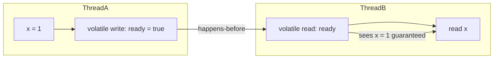

## Keywords in This File
{: .no_toc }

| # | Keyword | Weight |
|---|---|---|
| 1 | [Java Concurrency - L4 Java Memory Model](#java-concurrency---l4-java-memory-model) | medium |

---

# Java Concurrency - L4 Java Memory Model

## Java Memory Model (JMM)

---

### 🎯 Model Answer

**30 seconds:**
> The Java Memory Model (JMM) defines the rules under which a thread's
> writes to shared variables are guaranteed to be visible to other threads.
> Without the JMM, compilers and CPUs can reorder instructions and cache
> values in registers - meaning a value written by Thread A may never be
> seen by Thread B. The JMM establishes "happens-before" relationships:
> if action A happens-before action B, then A's effects (writes) are
> guaranteed visible to B. Synchronization, volatile variables, and final
> fields create these relationships.

**3 minutes (Senior):**
> The JMM (JSR-133, Java 5+) answers the question: "When is a write
> to a shared variable guaranteed to be visible to a reader?" The model
> is defined in terms of happens-before (HB): a partial order over
> actions. If write W happens-before read R on the same variable, R
> sees W's value (or a later write).
>
> Key HB rules: (1) Program order: all actions in a thread happen-before
> later actions in the same thread. (2) Monitor: `unlock(M)` HB `lock(M)`.
> (3) Volatile: a volatile write HB every subsequent volatile read of the
> same variable. (4) Thread start: `Thread.start()` HB all actions in
> the started thread. (5) Thread join: all actions in thread T HB
> `T.join()` returning. (6) Transitivity.
>
> The practical impact: without HB, a CPU can cache a written value in
> a register or L1 cache. Other cores see their own L1 cache. Volatile
> writes flush to main memory (or issue memory barriers), ensuring other
> cores see the update. The JMM abstraction hides the specific
> CPU/architecture differences (x86 TSO vs ARM weak memory model) behind
> a common set of guarantees.

**Framework:** WHAT → WHY → HOW → TRADE-OFF → EXAMPLE

*Adapting up:* Discuss the "happens-before is partial, not total" -
not all actions are ordered, and the JMM allows reordering of unrelated
actions. Cover the safe publication idiom, the visibility of final
fields after construction, and how the JMM enables double-checked locking.

*Adapting down:* "The JMM is the rulebook that says: if you use
synchronized or volatile, Java guarantees that one thread sees what
another thread wrote. Without these, the CPU and compiler are free to
do things that make your code appear to not work in multithreaded scenarios."

**Blank Mind Recovery:**

**(1) Restate:** "So you are asking about the Java Memory Model - let
me explain visibility, happens-before, and why volatile and synchronized
work."

**(2) First principles:** "From first principles: modern CPUs have
L1/L2/L3 caches per core. A write to a variable may stay in L1 for
milliseconds before reaching main memory. Another core reads its own
L1 and sees the old value. The JMM defines what synchronization
operations FORCE a flush and make the value universally visible."

**(3) Bridge:** "The JMM is like a sports rulebook that says: under
certain conditions (synchronized, volatile), a thread is guaranteed
to see what another thread wrote. Without those conditions, all bets
are off - the compiler and CPU can freely reorder and cache."

---

### 📘 Concept Explanation

**What it is:**
The Java Memory Model (JMM) is the formal specification of how Java
threads interact through shared memory. It defines: (1) which actions
are visible to which other actions, (2) what orderings of actions are
permitted, and (3) what values a read can return.

**The problem it solves:**
Modern CPUs and compilers perform three categories of "optimizations"
that break naive concurrency:
1. Compiler reordering: moves loads/stores for better register use
2. CPU instruction reordering: out-of-order execution for throughput
3. Cache visibility: cached values may not be written to shared memory

Without a formal model, the programmer cannot predict what behavior
to expect. JMM provides a contract: these synchronization actions
guarantee visibility.

**How it works - Happens-Before rules:**
```
Happens-Before (HB) relationships established by:

1. Program Order Rule
   In thread T: action A before action B =>
   A happens-before B (in T's own view)

2. Monitor Lock Rule
   unlock(m) happens-before lock(m)
   (Every thread acquiring m sees all writes before the unlock)

3. Volatile Variable Rule
   volatile write(v) happens-before volatile read(v)
   (for any subsequent read by any thread)

4. Thread Start Rule
   Thread.start() happens-before every action in the started thread

5. Thread Termination Rule
   Every action in thread T happens-before Thread.join(T) returns

6. Transitivity
   If A HB B and B HB C, then A HB C

7. Interruption Rule
   Thread.interrupt() on T happens-before
   T detecting it (via interrupted() or InterruptedException)
```

> **Code walkthrough:** This example demonstrates the core pattern in action. The key mechanism shows how the concept works in practice. Study the structure to understand the essential behavior and common usage.

**The key insight:**
Happens-before is a PARTIAL order. Actions with no HB relationship
between them are unordered - the JMM makes NO guarantee about which
value a reader sees for those. This is where data races occur.

A data race: two threads access the same variable concurrently, at
least one write, and they are not ordered by HB. A data-race-free
program with proper synchronization behaves sequentially consistently.

**Final field semantics:**
```java
class ImmutablePoint {
    final int x;
    final int y;
    ImmutablePoint(int x, int y) { this.x = x; this.y = y; }
}
// After constructor completes: ANY thread can safely read x, y
// WITHOUT synchronization - JMM guarantees final fields are visible
// after construction, even without HB to the constructor
```
> **Code walkthrough:** This example demonstrates the core pattern in action. The key mechanism shows how the concept works in practice. Study the structure to understand the essential behavior and common usage.

Final fields written in the constructor are guaranteed visible to any
thread that obtains a reference to the fully constructed object.
This is what makes immutable objects thread-safe without synchronization.

**Double-checked locking (fixed by JMM):**
```java
// BROKEN in Java 4 (pre-JSR-133):
class Singleton {
    private static Singleton instance;
    static Singleton getInstance() {
        if (instance == null) {  // first check (unsynchronized read)
            synchronized(Singleton.class) {
                if (instance == null) {
                    instance = new Singleton(); // may be partially published!
                }
            }
        }
        return instance; // may return partially constructed object
    }
}

// FIXED in Java 5+: volatile provides the HB guarantee
class Singleton {
    private static volatile Singleton instance; // volatile!
    static Singleton getInstance() {
        if (instance == null) {
            synchronized(Singleton.class) {
                if (instance == null) {
                    instance = new Singleton();
                    // volatile write HB any subsequent volatile read
                }
            }
        }
        return instance; // volatile read sees fully constructed object
    }
}
```

> **Code walkthrough:** This example demonstrates the core pattern in action. The key mechanism shows how the concept works in practice. Study the structure to understand the essential behavior and common usage.

**When to use it:**
The JMM is always in effect. Understanding it is required to:
- Know when `volatile` is needed vs when synchronization is needed
- Understand why double-checked locking requires volatile
- Understand safe publication of objects
- Debug visibility bugs where threads see stale data

**When NOT to use it:**
The JMM is not a tool you "use" - it is the specification you reason
against. You cannot opt out of it.

---

### 💻 Code Example

> **Code walkthrough:** The BAD example shows a visibility bug: the
> reading thread may never see `ready = true` because there is no
> HB relationship. The GOOD example adds `volatile` to establish HB.
> The production example demonstrates safe publication using an
> AtomicReference (which provides volatile semantics).

```java
// BAD: visibility bug - reading thread may spin forever
class StopFlag {
    private boolean stop = false; // NOT volatile

    void stopWorker() {
        stop = true; // write cached in writer thread's register
    }

    void worker() {
        while (!stop) { // reads from its own cache - may never see true
            doWork();
        }
    }
}
```

> **Code walkthrough:** This example demonstrates the core pattern in action. The key mechanism shows how the concept works in practice. Study the structure to understand the essential behavior and common usage.

```java
// GOOD: volatile establishes happens-before
class StopFlag {
    private volatile boolean stop = false; // volatile!

    void stopWorker() {
        stop = true;
        // volatile write HB subsequent volatile read
    }

    void worker() {
        while (!stop) { // volatile read - guaranteed to eventually see true
            doWork();
        }
    }
}
```

> **Code walkthrough:** This example demonstrates the core pattern in action. The key mechanism shows how the concept works in practice. Study the structure to understand the essential behavior and common usage.

```java
// PRODUCTION: safe publication with AtomicReference
// (volatile semantics via AtomicReference.set/get)
class ConfigLoader {
    private final AtomicReference<Config> config =
        new AtomicReference<>(null);

    // Writer thread: builds config, publishes atomically
    void reload() {
        Config newConfig = buildConfig(); // build fully
        config.set(newConfig);
        // AtomicReference.set() is a volatile write:
        // all writes in buildConfig() happen-before
        // any thread reading config.get()
    }

    // Reader thread: sees fully constructed Config
    Config getConfig() {
        Config c = config.get(); // volatile read
        return c != null ? c : Config.empty();
        // Guaranteed to see all fields written by buildConfig()
        // because volatile read HB the volatile write that set it
    }
}
```

> **Code walkthrough:** This example demonstrates the core pattern in action. The key mechanism shows how the concept works in practice. Study the structure to understand the essential behavior and common usage.

---

### 🎓 Answers by Seniority

**Junior / Mid (0-5 years):**
> The Java Memory Model defines when writes by one thread are visible
> to other threads. Without it, CPUs and compilers can cache values and
> reorder instructions, meaning Thread B might see stale values. The key
> mechanism is "happens-before": synchronized blocks, volatile variables,
> and thread start/join create these relationships. If a write happens-before
> a read, the reader is guaranteed to see the write. If there's no
> happens-before relationship, it's a data race and the behavior is undefined.

*Push deeper:* Why did double-checked locking not work in Java 4 and
how was it fixed in Java 5?

---

**Senior / Staff (5+ years):**
> The JMM is what makes my concurrency code correct vs. accidentally working.
> The critical rules I apply: (1) any shared mutable state needs either
> synchronization or volatile - not one or the other, but as required by
> the access pattern. (2) Final fields in immutable objects are JMM-safe
> without any extra synchronization. (3) Publishing a reference via
> volatile or AtomicReference is a full memory barrier - all writes before
> the publication are visible to any reader that sees the published reference.
> (4) Thread.start() establishes HB, which is why you can safely pass
> data to a thread before starting it.

*Push deeper:* What is the difference between the JMM's happens-before
and sequential consistency? When does a JMM-compliant program behave
sequentially consistently?

---

### ⚠️ Common Misconceptions

**Misconception 1: "synchronized is only for mutual exclusion."**
`synchronized` provides TWO guarantees: (1) mutual exclusion (only one
thread in the block) and (2) visibility (entering a `synchronized` block
flushes caches; exiting writes all changes to main memory via HB).
Many bugs come from using `volatile` when `synchronized` (for compound
operations) or synchronized when only visibility (not atomicity) is needed.

**Misconception 2: "volatile guarantees atomicity for all operations."**
`volatile` guarantees visibility and 64-bit atomic reads/writes
(on 32-bit JVMs, `long` and `double` reads/writes are not guaranteed
atomic without volatile). But volatile does NOT make compound operations
like `count++` atomic. `count++` is still read-modify-write (three
operations), and two threads can both increment and lose an increment.

**Misconception 3: "You don't need volatile if you use synchronized."**
True within synchronized blocks. But if you read a variable OUTSIDE a
synchronized block and write it INSIDE, the read has no HB relationship
with the write. Volatile is needed when reads are unsynchronized.

---

### 🚨 Failure Modes and Diagnosis

**Failure 1: Infinite loop due to visibility bug**
Symptom: thread appears to run forever even after stop flag is set.
JVM with `-server` flag (or any JIT with hoisting) lifts the flag read
out of the loop entirely (it's always false from the thread's view).
Cause: flag variable is not `volatile`.
Diagnosis: add `-XX:+PrintCompilation` to see JIT activity; thread
dump shows the thread running in the loop method.
Fix: make the flag `volatile`.

**Failure 2: Partially constructed object visible**
Symptom: `NullPointerException` on fields that should be non-null;
fields read as 0 / false despite being set in constructor.
Cause: object reference published before constructor completed, without
`volatile` or `synchronized`.
Diagnosis: happens in constructor-escape anti-pattern:
```java
// ANTI-PATTERN: 'this' escapes from constructor
class Unsafe {
    int value;
    Unsafe(Registry r) {
        r.register(this); // 'this' visible to other threads BEFORE
        this.value = 42;  // value assignment - may see 0!
    }
}
```
> **Code walkthrough:** This example demonstrates the core pattern in action. The key mechanism shows how the concept works in practice. Study the structure to understand the essential behavior and common usage.

Fix: complete object construction before publishing the reference;
use `volatile` or `synchronized` publication.

**Failure 3: Double-checked locking stale read**
Symptom: two instances of a "singleton" created; or singleton's
fields read as uninitialized.
Cause: `instance` reference not `volatile`.
Fix: add `volatile` to the instance field.

---

### 🎯 Interview Deep-Dive

| Question Category | Time to Answer |
|---|---|
| Definition | 60 seconds |
| Happens-before | 3-4 minutes |
| Volatile | 3-4 minutes |
| Final fields | 2-3 minutes |
| Publication | 3-4 minutes |
| Double-checked locking | 3-4 minutes |
| Reordering | 3-4 minutes |
| CPU architecture | 3-4 minutes |
| Sequential consistency | 3-4 minutes |
| Data race | 3-4 minutes |
| Trade-off | 2-3 minutes |
| Production diagnosis | 3-4 minutes |

---

**Q1 (Definition): What problem does the Java Memory Model solve?**

A: Modern CPUs and compilers do not execute programs in the order
written. They apply optimizations:

1. Register caching: a CPU may never write a variable value to RAM -
   it stays in a register for the life of a method call.

2. L1/L2/L3 cache: values written by CPU-0 stay in CPU-0's L1 cache.
   CPU-1 reads its own L1 cache and sees the old value.

3. Instruction reordering: both compilers (for register allocation)
   and CPUs (for out-of-order execution) reorder loads and stores.
   The result is correct for a single thread but may violate assumptions
   about shared-variable ordering between threads.

Without a formal specification, Java programmers could not know: "under
what conditions will Thread B see Thread A's writes?"

The JMM (JSR-133, implemented in Java 5) provides the contract: use
these synchronization mechanisms, and these visibility and ordering
guarantees hold. The JMM hides CPU-specific memory models (x86's
Total Store Order vs ARM's weak memory model) behind a common API.

The practical programmer rule: any shared mutable variable accessed
by multiple threads must be protected by synchronized, volatile, or
be a member of a concurrent data structure that provides its own
guarantees. Anything else is a data race with undefined behavior.

*What separates good from great:* Pre-Java 5 (pre-JSR-133), the JMM
was underspecified. Double-checked locking was broken because the
specification did not forbid reordering the store of the object reference
before the completion of the constructor. JSR-133 explicitly forbids
this reordering under volatile write semantics. Many concurrency bugs
in Java 1.4 era code were due to relying on behaviors that the JMM
did not guarantee.

---

**Q2 (Happens-before): List the happens-before rules and give a
concrete example of each.**

A: The six canonical happens-before rules:

**Rule 1 - Program order:** Within a single thread, all actions are
ordered. If action A comes before action B in source, A HB B.
```java
// In same thread: x=1 happens-before y=2
int x = 1; // A
int y = 2; // B - guaranteed to see x=1 in this thread
```

> **Code walkthrough:** This example demonstrates the core pattern in action. The key mechanism shows how the concept works in practice. Study the structure to understand the essential behavior and common usage.

**Rule 2 - Monitor lock:** Unlocking a monitor HB locking the same monitor.
```java
synchronized(lock) { data = "written"; } // unlock at end
// Another thread:
synchronized(lock) { read = data; } // lock sees the unlock; reads "written"
```

> **Code walkthrough:** This example demonstrates the core pattern in action. The key mechanism shows how the concept works in practice. Study the structure to understand the essential behavior and common usage.

**Rule 3 - Volatile write/read:** Volatile write HB subsequent volatile read.
```java
volatile boolean ready = false;
// Thread A: data = "hello"; ready = true; // volatile write
// Thread B: if (ready) use(data); // volatile read sees "hello"
```

> **Code walkthrough:** This example demonstrates the core pattern in action. The key mechanism shows how the concept works in practice. Study the structure to understand the essential behavior and common usage.

**Rule 4 - Thread start:** `Thread.start()` HB every action in the thread.
```java
int data = 42;
Thread t = new Thread(() -> {
    // Guaranteed to see data=42 (start() HB first action in t)
    System.out.println(data);
});
t.start();
```

> **Code walkthrough:** This example demonstrates the core pattern in action. The key mechanism shows how the concept works in practice. Study the structure to understand the essential behavior and common usage.

**Rule 5 - Thread termination:** All actions in thread T HB `join(T)` returning.
```java
Thread t = new Thread(() -> { result = compute(); });
t.start();
t.join();
// Guaranteed to see result from t (join() HB our next read)
System.out.println(result);
```

> **Code walkthrough:** This example demonstrates the core pattern in action. The key mechanism shows how the concept works in practice. Study the structure to understand the essential behavior and common usage.

**Rule 6 - Transitivity:** A HB B and B HB C implies A HB C.
```java
// Thread A: x = 1; synchronized(m) { y = 2; } unlock
// Thread B: synchronized(m) { lock; z = y; } // sees y=2 (Rule 2)
// Also sees x=1 via transitivity: x=1 HB unlock HB lock HB z=y
```

> **Code walkthrough:** This example demonstrates the core pattern in action. The key mechanism shows how the concept works in practice. Study the structure to understand the essential behavior and common usage.

*What separates good from great:* The transitivity rule is why you can
"chain" happens-before relationships. A class that uses a synchronized
method to publish data creates an HB from the writer to the lock, and
from the lock to any subsequent reader that acquires the same lock.
The reader sees everything written before the lock release.

---

**Q3 (Volatile): What are the full semantics of `volatile` in Java?**

A: `volatile` provides three guarantees:

**1. Visibility:** A write to a volatile variable is immediately visible
to all threads that subsequently read the variable.

Mechanism: the JVM inserts memory barriers. On x86: a volatile write
is `SFENCE` + the write (or `LOCK` prefix on a dummy instruction).
On ARM: `DMB` (data memory barrier). This flushes the value from the
CPU's write buffer to the coherent cache, making it visible to other
cores.

**2. Ordering:** A volatile write cannot be reordered with any previous
read or write. A volatile read cannot be reordered with any subsequent
read or write.
```
Writes BEFORE volatile write -> never reordered to AFTER it
Reads AFTER volatile read -> never reordered to BEFORE it
```
> **Code walkthrough:** This example demonstrates the core pattern in action. The key mechanism shows how the concept works in practice. Study the structure to understand the essential behavior and common usage.

This prevents the partial publication problem: all writes before a
`volatile` store are committed before the store.

**3. 64-bit atomicity:** `long` and `double` reads/writes are guaranteed
atomic (no word-tearing). On 32-bit JVMs without volatile, a 64-bit
long could be written as two separate 32-bit operations, causing
another thread to see a half-written long.

What `volatile` does NOT provide:
- Atomicity of compound operations: `count++` is still
  read-modify-write. Volatile provides atomic read and atomic write,
  but NOT atomic read-modify-write.
- Mutual exclusion: multiple threads can be in "volatile reads/writes"
  simultaneously (no lock is acquired)

```java
// volatile provides: the increment eventually propagates
volatile int count = 0;
// But: two threads both increment, one increment is lost
count++; // NOT atomic compound operation

// Need AtomicInteger for atomic increment:
AtomicInteger count = new AtomicInteger(0);
count.incrementAndGet(); // atomic
```

> **Code walkthrough:** This example demonstrates the core pattern in action. The key mechanism shows how the concept works in practice. Study the structure to understand the essential behavior and common usage.

*What separates good from great:* Volatile reads and writes are cheaper
than synchronized (no lock acquisition, no thread scheduling) but
more expensive than regular reads/writes (memory barriers prevent
reordering, may flush store buffers). The cost: roughly 10-50 ns vs
< 1 ns for a regular read on x86. Understanding this cost justifies
using AtomicInteger over `volatile int++` and LongAdder over volatile
for counters.

---

**Q4 (Final fields): What visibility guarantees do final fields provide?**

A: Final fields have a special guarantee in the JMM: after an object's
constructor completes and the reference to the object is published
(without race), all final fields written in the constructor are
visible to any thread that reads the reference.

The JMM provides a "freeze" action at the end of a constructor for
each final field. Any read of a final field that comes after the freeze
sees the value written in the constructor.

```java
class SafePoint {
    final int x;
    final int y;
    SafePoint(int x, int y) { this.x = x; this.y = y; }
}

// Publisher:
SafePoint point = new SafePoint(3, 4); // constructor complete
// Final fields are "frozen" - x=3, y=4 visible to all

// Any thread reading point (if published safely) is guaranteed:
// point.x == 3 and point.y == 4
```

> **Code walkthrough:** This example demonstrates the core pattern in action. The key mechanism shows how the concept works in practice. Study the structure to understand the essential behavior and common usage.

Safe publication required for the final field guarantee:
The reference itself must be published safely. If the reference is
published through a data race (e.g., a non-volatile, unsynchronized
field), another thread might see the reference before the constructor
completed. Final fields protect against seeing uninitialized (0/null)
values even after the reference is visible.

**Non-final fields do NOT have this guarantee:**
```java
class Unsafe {
    int x; // NOT final
    int y; // NOT final
    Unsafe(int x, int y) { this.x = x; this.y = y; }
}
// A thread reading an Unsafe instance via a data race may see x=0, y=0
// (default values) even though the constructor set them
```

> **Code walkthrough:** This example demonstrates the core pattern in action. The key mechanism shows how the concept works in practice. Study the structure to understand the essential behavior and common usage.

*What separates good from great:* The final field guarantee is what
makes Java's immutable objects thread-safe without synchronization.
`String`, `Integer`, and other immutable classes rely on final fields
for thread safety. A class that looks immutable but has non-final fields
(even if never modified after construction) does not get this guarantee.

---

**Q5 (Publication): What is "safe publication" and what mechanisms
support it?**

A: Safe publication means making an object reference available to other
threads such that they see the fully constructed object (all fields
initialized, not default values).

An object is safely published if it is published via:
1. A `static` initializer: class loading is thread-safe. Static fields
   initialized at class load time are safely published.
   ```java
   private static final Config INSTANCE = new Config(); // safe
   ```

> **Code walkthrough:** This example demonstrates the core pattern in action. The key mechanism shows how the concept works in practice. Study the structure to understand the essential behavior and common usage.

2. A `volatile` or `AtomicReference` field:
   ```java
   private volatile Config config; // volatile write publishes fully
   config = new Config();
   ```

> **Code walkthrough:** This example demonstrates the core pattern in action. The key mechanism shows how the concept works in practice. Study the structure to understand the essential behavior and common usage.

3. A field guarded by a `synchronized` block (published while holding lock):
   ```java
   synchronized(lock) { this.config = new Config(); }
   ```

> **Code walkthrough:** This example demonstrates the core pattern in action. The key mechanism shows how the concept works in practice. Study the structure to understand the essential behavior and common usage.

4. A `final` field: the JMM freeze action guarantees visibility after
   the constructor completes.

Unsafe publication (NOT safe):
```java
// Not volatile, not synchronized, not static, not final:
Config sharedConfig; // non-volatile

// Thread A:
sharedConfig = new Config(); // write may not be visible to B

// Thread B:
if (sharedConfig != null) {
    sharedConfig.doSomething(); // may see partially constructed object!
}
```

> **Code walkthrough:** This example demonstrates the core pattern in action. The key mechanism shows how the concept works in practice. Study the structure to understand the essential behavior and common usage.

The race condition: Thread B may see `sharedConfig != null` (the
reference write propagated) but the Config object's fields may still
show default values (the constructor's writes have not propagated).

*What separates good from great:* The most commonly overlooked safe
publication case: lazy initialization. The pattern:
```java
class LazyInit {
    private volatile Resource resource;
    Resource get() {
        if (resource == null) {
            synchronized(this) {
                if (resource == null) {
                    resource = new Resource(); // volatile write
                }
            }
        }
        return resource; // volatile read
    }
}
```
> **Code walkthrough:** This example demonstrates the core pattern in action. The key mechanism shows how the concept works in practice. Study the structure to understand the essential behavior and common usage.

Without `volatile`, two threads may each see `resource == null` and
create two instances, or one thread may see a partially constructed
`Resource`. With `volatile`, the publication is safe.

---

**Q6 (Double-checked locking): Why was DCL broken in Java 4 and
how does Java 5 fix it?**

A: Double-checked locking (DCL) is a pattern to lazily initialize a
singleton with minimal synchronization:

```java
// Java 4 version - BROKEN
class Singleton {
    private static Singleton instance;
    static Singleton getInstance() {
        if (instance == null) {        // read 1 (unsynchronized)
            synchronized(Singleton.class) {
                if (instance == null) { // read 2 (synchronized)
                    instance = new Singleton(); // write
                }
            }
        }
        return instance; // read 3 (unsynchronized)
    }
}
```

> **Code walkthrough:** This example demonstrates the core pattern in action. The key mechanism shows how the concept works in practice. Study the structure to understand the essential behavior and common usage.

Why it's broken (Java 4): `instance = new Singleton()` is three operations:
1. Allocate memory for Singleton
2. Initialize fields (run constructor)
3. Store reference to `instance`

Under the Java 4 memory model, step 3 can be reordered before step 2.
Thread A: allocates memory, stores reference (instance != null),
then initializes fields. Thread B: sees `instance != null` (step 3
visible), reads `instance`, accesses uninitialized fields.

Java 5 fix - JSR-133: make `instance` volatile.
```java
private static volatile Singleton instance; // volatile!
```

> **Code walkthrough:** This example demonstrates the core pattern in action. The key mechanism shows how the concept works in practice. Study the structure to understand the essential behavior and common usage.

Why volatile fixes it: a volatile write cannot be reordered before
any preceding write. This prevents the reordering of step 3 (volatile
write to instance) before step 2 (constructor writes to fields).
All constructor writes happen-before the volatile write.

Thread B's volatile read sees the volatile write's effect, which
happens-after all the constructor writes. Thread B sees a fully
constructed Singleton.

Alternative (simpler): class-holder idiom (no volatile needed):
```java
class Singleton {
    private static class Holder {
        static final Singleton INSTANCE = new Singleton();
    }
    static Singleton getInstance() { return Holder.INSTANCE; }
}
```
> **Code walkthrough:** This example demonstrates the core pattern in action. The key mechanism shows how the concept works in practice. Study the structure to understand the essential behavior and common usage.

The inner class is loaded lazily (on first call to `getInstance()`).
Static initialization is thread-safe (handled by the class loader).
No `volatile`, no `synchronized` needed.

*What separates good from great:* The class-holder idiom leverages
the JVM's guarantee that class loading is thread-safe. The JLS (Java
Language Specification) requires the class loader to initialize static
fields under a lock that prevents concurrent initialization. This is
a JVM-level guarantee, not a programmer-level synchronization.

---

**Q7 (Reordering): What kinds of reordering does the JMM permit
and which does it prohibit?**

A: The JMM defines what compilers and CPUs are NOT permitted to reorder.
Anything not prohibited is permitted.

**Permitted reorderings (within a thread, not observable by that thread):**
- Independent loads/stores in the same thread can be reordered
- A write followed by a read of a different variable can be reordered
- Two reads of different variables can be reordered

**Prohibited reorderings:**
The JMM prohibits reorderings that would violate happens-before:
- Can't move a load/store before a monitor lock
- Can't move a load/store after a monitor unlock
- Can't move a volatile write before a preceding write
- Can't move a volatile read after a following read
- Can't reorder two volatile accesses relative to each other

```
Memory barrier semantics (simplified):
[LoadLoad]  : No load reordered before preceding load
[StoreStore]: No store reordered after following store
[LoadStore] : No load reordered after following store
[StoreLoad] : No store reordered before following load (most expensive)

volatile write:  [StoreStore] + write + [StoreLoad]
volatile read:   [LoadLoad]  + read  + [LoadStore]
lock:    [StoreStore] + [LoadLoad] (acquire semantics)
unlock:  [StoreLoad]  + [StoreStore] (release semantics)
```

> **Code walkthrough:** This example demonstrates the core pattern in action. The key mechanism shows how the concept works in practice. Study the structure to understand the essential behavior and common usage.

**Real-world impact:** on x86 (TSO - Total Store Order), the hardware
already prohibits most reorderings. The main one it allows is
Store-Load reordering (write then read: the write may be buffered
and the read of another variable may be executed first). Volatile
inserts SFENCE or LOCK to prevent this.

On ARM (weak memory model), many more reorderings are permitted by
hardware. The JVM must insert more barriers on ARM than on x86.

*What separates good from great:* The "roach motel" analogy (from Doug
Lea): memory operations can CHECK IN to a synchronized block from
before it (moved in), but they cannot CHECK OUT from the synchronized
block to after it. Stores before `unlock` stay before the unlock.
Loads after `lock` stay after the lock.

---

**Q8 (CPU architecture): How does the JMM relate to CPU memory models
on x86 and ARM?**

A: Each CPU architecture has its own memory consistency model:

**x86 - Total Store Order (TSO):**
x86 provides strong guarantees almost matching sequential consistency:
- Loads are never reordered before other loads
- Stores are never reordered before other stores
- Loads may be reordered before stores to DIFFERENT addresses
- One exception: store-load reordering (store to X, then load from Y:
  the load of Y may execute before the store of X becomes visible)

On x86, the JVM inserts minimal barriers:
- volatile write: `SFENCE` or `LOCK` prefix (prevents store-load)
- volatile read: no explicit barrier needed (already ordered by TSO)

**ARM - Weak memory model:**
ARM allows nearly all reorderings unless explicitly prevented:
- Stores can be reordered relative to other stores
- Loads can be reordered relative to loads
- Loads and stores can be freely reordered

On ARM, the JVM inserts more barriers:
- volatile write: `STLR` (store-release) or `DMB` + store
- volatile read: `LDAR` (load-acquire) or load + `DMB`
- Synchronized block: `DMB ISH` on lock and unlock

**What the JMM provides:**
The JMM abstracts these differences. Writing `volatile` Java code is
correct on all platforms the JVM supports. The JIT handles the
platform-specific barrier insertion.

The performance implication: volatile on x86 is cheaper (fewer barriers)
than on ARM. Code with heavy volatile usage that benchmarks well on x86
may be slower on ARM. This matters for mobile (Android, ARM servers).

*What separates good from great:* `VarHandle` (Java 9+) exposes the
different memory ordering modes: `get()` / `set()` (plain, no barrier),
`getVolatile()` / `setVolatile()`, `getAcquire()` / `setRelease()`.
Acquire/release semantics correspond to lock/unlock barriers (one-way
barriers, cheaper than full volatile which is two-way). This is an
expert optimization for lock-free algorithms that need less than full
volatile ordering.

---

**Q9 (Sequential consistency): What is the relationship between
the JMM and sequential consistency?**

A: Sequential consistency (SC) is the strongest correctness model: the
result of any execution appears as if all operations were executed in
some sequential order, and the operations of each individual thread
appear in program order within that sequence.

The JMM does NOT guarantee sequential consistency for all programs.
It only guarantees SC for data-race-free (DRF) programs.

A program is data-race-free if: for all pairs (W, R) where W is a
write and R is a read of the same variable, and they execute
concurrently, they are ordered by happens-before.

Theorem (JMM): A correctly synchronized (DRF) Java program executes
as if sequentially consistent. This is the key guarantee.

**Implication:**
If your program uses proper synchronization (no data races), you can
reason about it as if operations execute in a single global sequential
order. This is the programming model we expect.

If your program has data races, the JMM provides minimal guarantees:
Java provides "out-of-thin-air safety" (you won't see values that were
never written), but other than that, the behavior is undefined.

```java
// DRF: synchronized access ensures SC behavior
synchronized(lock) { x = 1; }
synchronized(lock) { y = x + 1; } // Guaranteed: y = 2
```

> **Code walkthrough:** This example demonstrates the core pattern in action. The key mechanism shows how the concept works in practice. Study the structure to understand the essential behavior and common usage.

```java
// Not DRF: data race on x
x = 1;         // Thread A (no synchronization)
y = x + 1;     // Thread B: might see x=0, x=1, or anything
```

> **Code walkthrough:** This example demonstrates the core pattern in action. The key mechanism shows how the concept works in practice. Study the structure to understand the essential behavior and common usage.

*What separates good from great:* The "DRF = SC" theorem is why proper
synchronization is the foundation of concurrent programming. It means:
if you correctly use synchronized, volatile, and the JUC classes (which
are DRF internally), you can reason about your concurrent program using
the simple sequential consistency model. Data races break this and put
you into the much harder "weak memory model" reasoning space.

---

**Q10 (Data race): What is a data race and how do you detect one?**

A: A data race exists when:
1. Two threads access the same variable concurrently
2. At least one access is a write
3. The accesses are not ordered by happens-before

Data races are undefined behavior in the JMM. The compiler/JVM is
allowed to do anything: cache the value permanently in a register,
eliminate dead writes, reorder with other operations. The programmer
cannot predict what will happen.

Detection methods:

**1. Java ThreadSanitizer (TSan):** The most reliable tool.
Available for the JVM via `-Xss` flag or Java Flight Recorder with
race detection. Reports races as they occur at runtime.

**2. Static analysis:** SpotBugs with `@GuardedBy` annotations, Error Prone.
Useful for obvious races but misses dynamic patterns.

**3. Code review patterns:**
- Non-volatile, non-synchronized field accessed from multiple threads
- Field written in one method, read in another, with no common lock
- ConcurrentModificationException (symptom of data race on collections)

**4. Stress testing:** jcstress (Java Concurrency Stress) runs code with
JVM flags that maximize reorderings, exposing races.

Example detection with jcstress:
```java
@JCStressTest
@Outcome(id="0, 0", expect=Expect.ACCEPTABLE_INTERESTING)
@Outcome(id="1, 1", expect=Expect.ACCEPTABLE)
@State
public class SimpleRaceTest {
    int x = 0;
    @Actor public void actor1() { x = 1; }
    @Actor public void actor2() { r.r1 = x; }
}
```

> **Code walkthrough:** This example demonstrates the core pattern in action. The key mechanism shows how the concept works in practice. Study the structure to understand the essential behavior and common usage.

*What separates good from great:* "I never saw the race in testing"
is not evidence of thread safety. Races depend on scheduling, CPU
count, cache state, and JIT decisions. A program may run correctly
for years and then fail after a JVM upgrade that changes JIT heuristics.
The only reliable evidence is: the code is data-race-free (provably,
via synchronization or happens-before analysis).

---

**Q11 (Production diagnosis): A service intermittently returns stale
data. How do you diagnose a JMM visibility bug?**

A: Diagnosis steps for suspected JMM visibility issues:

**Step 1: Identify the shared variable.**
Find the variable that is written by one thread and read by another.
Look for fields that are updated in background threads (schedulers,
refresh threads) and read in request-handling threads.

**Step 2: Check for synchronization.**
Is the variable `volatile`? Is every write and read in a `synchronized`
block guarded by the SAME lock? Is it in a concurrent data structure?
If none of the above: data race, JMM violation.

**Step 3: Look for missing `volatile` on caches and flags.**
Common patterns:
```java
// Pattern A: cache without volatile
private MyConfig cachedConfig; // MISSING volatile
void refreshCache() { cachedConfig = loadFromDB(); }
MyConfig getConfig() { return cachedConfig; } // stale!

// Pattern B: flag without volatile
private boolean initialized = false; // MISSING volatile
void init() { setup(); initialized = true; }
void operate() {
    if (!initialized) throw new IllegalStateException();
    // May see initialized=false even after init() complete
}
```

> **Code walkthrough:** This example demonstrates the core pattern in action. The key mechanism shows how the concept works in practice. Study the structure to understand the essential behavior and common usage.

**Step 4: Add volatile and retest.**
If adding `volatile` fixes the bug, the diagnosis is confirmed.

**Step 5: For subtle cases, use async-profiler + JFR.**
Java Flight Recorder with `--volatile-accesses` (Java 16+) records
volatile memory accesses for visibility analysis.

**Permanent fix:**
- Add `volatile` for single-writer/multiple-reader flags and references
- Use `synchronized` when the update involves multiple fields that must
  be consistent together
- Use `AtomicReference` for reference swaps

*What separates good from great:* Stale data bugs are typically
non-deterministic. They may appear only on multi-core machines (not
on developer laptops with 2 cores), only under load, or only after JIT
compilation kicks in. The JIT can hoist loop-invariant reads into
registers, making them permanently stale. `-server` flag enables
aggressive JIT optimizations that reveal these bugs earlier.

---

**Q12 (Trade-off): What is the performance cost of the JMM's
synchronization mechanisms and when is each appropriate?**

A: Ordering from cheapest to most expensive:

| Mechanism | Cost | Use Case |
|---|---|---|
| Regular read/write | ~0 ns | Single-thread, or synchronized access |
| volatile read | ~3-10 ns | Flag check, reference read |
| volatile write | ~10-50 ns | Publish result, update flag |
| AtomicLong.get() | ~3-10 ns | Counter read |
| AtomicLong.incrementAndGet() | ~10-30 ns | Counter increment, low contention |
| synchronized (uncontended) | ~20-60 ns | Exclusive section, no contention |
| synchronized (contended) | ~100-500 ns + wait | Exclusive section, contention |
| LongAdder.increment() | ~5-15 ns | Counter, high contention |

Decision guide:
- Single writer, multiple readers (flag, reference): `volatile`
- Single variable, low-contention CAS: AtomicXxx
- High-contention counter: LongAdder
- Multiple variables, complex invariant: synchronized / ReentrantLock
- Read-heavy, write-rare: StampedLock (optimistic reads)
- Immutable data: final fields + safe publication (no ongoing cost)

The mistake to avoid: "the cost of synchronized is too high" is usually
premature optimization. Uncontended synchronized is roughly the same
cost as a volatile read/write pair (both need memory barriers). The
cost only becomes significant under high contention.

*What separates good from great:* The true cost of synchronization is
not the lock instruction but the memory barriers it enforces. These
prevent the CPU from executing out of order and from keeping cache-hot
values in registers. For tight loops with simple computations, this
barrier cost can dwarf the lock overhead. Use lock-free atomic operations
only when profiling confirms the synchronization is on the critical path.

---

### ⚖️ Comparison Table

| Mechanism | Visibility | Atomicity | Mutual Exclusion | Cost |
|---|---|---|---|---|
| volatile | Yes (single var) | Read/write only | No | Low |
| synchronized | Yes (all vars in block) | All ops in block | Yes | Medium |
| AtomicXxx | Yes (single var) | CAS operations | No | Low-medium |
| final fields | Yes (after construction) | Construction only | No | Zero (at runtime) |
| Thread.start() | Yes (pre-start writes) | N/A | N/A | Zero (at access) |
| Thread.join() | Yes (pre-termination writes) | N/A | N/A | Zero (at access) |

**The deciding factor:**
Visibility only (one writer): volatile.
Visibility + atomicity (compound ops): synchronized or AtomicXxx.
Immutable published data: final fields.

---

### 🏛️ System Design

**JMM in distributed caching (hot-swap without downtime):**

```
Pattern: Config hot-swap in a stateless service

Producer (config refresh thread):
  1. Build new Config object (all fields set in constructor - FINAL fields)
  2. AtomicReference.set(newConfig) -> volatile write
     All field writes HB this volatile write

Consumer (every request handler thread):
  1. AtomicReference.get() -> volatile read
     This volatile read HB all field reads
  2. Read config.featureFlag, config.timeoutMs, etc.
     Guaranteed to see fully constructed Config

Key: no synchronization needed in hot path (request handlers)
     Only one volatile read per request
     Config is immutable (final fields) -> no visibility concern after publication
```

> **Code walkthrough:** This example demonstrates the core pattern in action. The key mechanism shows how the concept works in practice. Study the structure to understand the essential behavior and common usage.

Design alternatives:
- `synchronized(lock)` around config read: mutual exclusion on every
  request - not needed, wasteful
- `volatile Config config` without AtomicReference: identical semantics,
  but AtomicReference provides `compareAndSet()` for conditional updates
- Dependency injection framework reload: similar pattern but framework-managed

At scale (1M TPS): the volatile read per request is ~10 ns = ~1% of
a 1 us request budget. Acceptable. If profiling shows hot, refactor to
thread-local copy with periodic refresh.

---

### 📊 Diagram

```
JMM Happens-Before relationships:

Thread A                    Thread B
--------                    --------
write(x = 1)
volatile write(ready = true)
                            volatile read(ready) -> true
                            read(x) -> guaranteed 1

Without volatile:
write(x = 1)
write(ready = true)  -- may be in register, never visible
                            read(ready) -> may see false
                            read(x) -> may see 0
```



> **Diagram walkthrough:** Thread A writes `x = 1` then performs a
> volatile write to `ready`. Thread B performs a volatile read of
> `ready` and then reads `x`. The volatile write in Thread A
> happens-before the volatile read in Thread B (JMM Volatile Rule).
> By transitivity, the write of `x = 1` also happens-before Thread B's
> read of `x`. Thread B is guaranteed to see `x = 1`. Without `volatile`,
> there is no happens-before relationship between Thread A's writes and
> Thread B's reads - Thread B may see stale values or the CPU may never
> flush Thread A's writes to Thread B's cache. The `volatile` keyword is
> the synchronization action that creates this guarantee.

---

### 💻 Code Example

*(Omit: this concept does not have a programmatic interface that can be demonstrated in code. The conceptual explanation above is sufficient.)*


---

### 🏛️ System Design

*(Omit: system design diagram not applicable for this concept - see ★★★ keywords for full system design coverage.)*


---

### ⚖️ Comparison Table

*(Omit: this is a ★☆☆ foundational concept with no direct alternatives to compare - see higher-difficulty keywords for trade-off analysis.)*


---

### 📊 Diagram

*(Omit: no standalone visual diagram required for this concept - the explanations and code examples above provide sufficient clarity.)*


