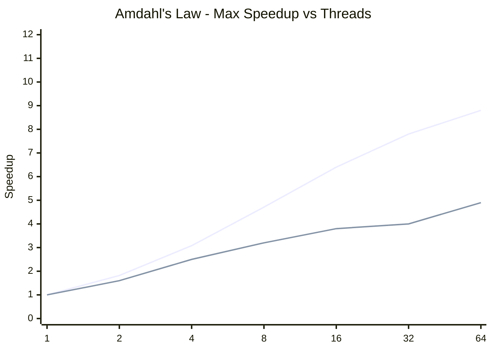

# Java Concurrency - L4 Lock Contention

## Lock Contention Profiling

### 🎯 Model Answer

**30 seconds:**
> Lock contention occurs when multiple threads compete to acquire the
> same lock. The waiting threads are BLOCKED, consuming no CPU but adding
> latency. At scale, a single hot lock becomes a serialization bottleneck
> limiting throughput to the single-threaded speed of the critical section.
> Diagnosis: JFR `jdk.JavaMonitorEnter` events or async-profiler lock
> mode show which locks are contested and how long threads wait. Fixes
> include reducing critical section size, lock striping, replacing
> synchronized with concurrent data structures, or eliminating shared
> state.

**3 minutes (Senior):**
> Lock contention is an Amdahl's Law problem: even 5% of time in a
> serial (locked) section limits throughput to 20x regardless of thread
> count. The contention profile typically follows an 80/20 rule - one
> or two locks cause 80% of the contention. Identifying the hot lock
> is the first step.
>
> Profiling options: (1) JFR `jdk.JavaMonitorEnter` event captures every
> synchronized block entry with blocking duration - low overhead, always-on
> safe. (2) async-profiler's `-e lock` mode profiles lock contention with
> flame graphs. (3) JVM flags `-XX:+PrintBiasedLockingStatistics` and
> `-XX:BiasedLockingStartupDelay=0` (older JVMs) show biased lock info.
>
> Fix strategies in increasing complexity: (1) reduce critical section
> to only the lines that MUST be synchronized. (2) Lock striping: multiple
> locks, each guarding a subset of data (ConcurrentHashMap uses this
> internally). (3) Copy-on-write: create new data structure, atomically
> swap (CopyOnWriteArrayList). (4) Lock-free: replace synchronized counter
> with LongAdder. (5) Eliminate sharing: give each thread its own copy of
> the data (thread-local state).

**Framework:** WHAT → WHY → HOW → TRADE-OFF → EXAMPLE

*Adapting up:* Discuss Amdahl's Law quantitatively for lock contention,
the JVM biased locking optimization (removed in Java 15), lock elision
by the JIT, and how LMAX Disruptor eliminates shared lock contention
via mechanical sympathy (cache-line padding).

*Adapting down:* "Lock contention is a traffic jam on a one-lane bridge.
Even if you add more cars (threads), they all wait for the same single
lane. The fix is to build a wider bridge (more locks for different data)
or move the bottleneck to a queue system."

**Blank Mind Recovery:**

**(1) Restate:** "So you are asking about lock contention - let me explain
how to detect it with profiling tools and the main strategies to reduce it."

**(2) First principles:** "From first principles: a lock makes threads
run serially through the critical section. With N threads competing for
one lock, throughput = critical-section-throughput × 1 (serialized).
The rest of each thread's time is wasted waiting."

**(3) Bridge:** "Lock contention is like a single cashier at a grocery
store checkout. No matter how many customers (threads) come in, they
all wait in the same queue. Fix: open more checkout lanes (lock striping),
or implement self-checkout (lock-free algorithms)."

---

### 📘 Concept Explanation

**What it is:**
Lock contention is the state where multiple threads compete to acquire
the same lock. Waiting threads are BLOCKED (for synchronized) or parked
(for ReentrantLock) until the holder releases. This converts parallel
execution into serial execution for the duration of the critical section.

**The problem it causes:**
Even a small fraction of time spent in a contended lock severely limits
scalability. Amdahl's Law: with fraction `S` of execution serial:

$$\text{Speedup} = \frac{1}{S + \frac{1-S}{N}}$$

With S = 0.05 (5% serial), max speedup at N threads:
- N=4: 3.6x speedup (91% efficiency)
- N=16: 8.9x speedup (56% efficiency)
- N=∞: 20x speedup limit (regardless of thread count)

**How contention builds:**
```
Low contention (lock usually uncontended):
  Thread A: acquire, work 1ms, release
  Thread B: (thread A already released)  acquire, work 1ms, release

High contention (threads pile up):
  Thread A: acquire, work 10ms, release
  Thread B: BLOCKED 5ms, acquire, work 10ms, release
  Thread C: BLOCKED 15ms, acquire, work 10ms, release
  Thread D: BLOCKED 25ms, acquire, work 10ms, release
  Throughput: 1 operation / 10ms despite 4 threads
```

**JVM lock optimizations (brief):**
The JVM applies three lock optimizations for uncontended paths:
1. Biased locking (pre-Java 15): lock biased to first acquiring thread,
   subsequent acquisitions by same thread cost near zero (removed in Java 15
   as it added complexity without benefit on modern CPUs)
2. Thin lock / stack lock: uncontended synchronized stored on the stack,
   no OS mutex overhead
3. Lock inflation to fat lock: when contended, the lock inflates to an
   OS-level mutex

**When to diagnose:**
- Service latency P99 much higher than P50 (suggests queuing/waiting)
- High thread count but low CPU utilization
- Throughput plateau despite adding threads
- Thread dump shows many BLOCKED threads on same lock

---

### 💻 Code Example

> **Code walkthrough:** The BAD example has a coarse-grained lock on an
> entire data structure, serializing all access. The GOOD examples show
> progressively better techniques: fine-grained lock, lock striping, and
> finally ConcurrentHashMap which handles striping internally.

```java
// BAD: coarse-grained lock serializes all access
class ContendedCache {
    private final Map<String, Data> cache = new HashMap<>();
    private final Object lock = new Object();

    // ALL reads and writes compete for ONE lock
    Data get(String key) {
        synchronized(lock) { return cache.get(key); }
    }

    void put(String key, Data value) {
        synchronized(lock) { cache.put(key, value); }
    }
}
// Problem: 100 concurrent reads all block each other - no read parallelism
```

```java
// BETTER: ReadWriteLock - reads parallel, writes exclusive
class ReadOptimizedCache {
    private final Map<String, Data> cache = new HashMap<>();
    private final ReadWriteLock rwLock = new ReentrantReadWriteLock();
    private final Lock readLock  = rwLock.readLock();
    private final Lock writeLock = rwLock.writeLock();

    Data get(String key) {
        readLock.lock();   // multiple readers can hold simultaneously
        try { return cache.get(key); }
        finally { readLock.unlock(); }
    }

    void put(String key, Data value) {
        writeLock.lock(); // exclusive: no readers or writers
        try { cache.put(key, value); }
        finally { writeLock.unlock(); }
    }
}
// Better for read-heavy workloads, but writers still contend
```

```java
// BEST: ConcurrentHashMap - internal lock striping, no external locks
class HighThroughputCache {
    // ConcurrentHashMap: 16 segments (default), each with its own lock
    // reads are lock-free (volatile), writes lock only the affected segment
    private final ConcurrentHashMap<String, Data> cache =
        new ConcurrentHashMap<>();

    Data get(String key) { return cache.get(key); } // lock-free!

    void put(String key, Data value) { cache.put(key, value); }
    // Only 1/16 of threads contend for any given segment

    // Atomic conditional operations:
    Data computeIfAbsent(String key, Function<String, Data> loader) {
        return cache.computeIfAbsent(key, loader); // atomic - no external lock
    }
}
```

---

### 🎓 Answers by Seniority

**Junior / Mid (0-5 years):**
> Lock contention happens when multiple threads compete for the same lock.
> While one thread holds the lock, others wait - they're BLOCKED and can't
> do anything useful. This wastes time and limits how much the application
> speeds up from adding more threads. To reduce contention: (1) make
> critical sections shorter (minimize the code inside synchronized), (2)
> use concurrent data structures like ConcurrentHashMap instead of
> synchronized HashMap, (3) use ReentrantLock with tryLock for non-blocking
> attempts.

*Push deeper:* What is lock striping and how does ConcurrentHashMap
use it internally?

---

**Senior / Staff (5+ years):**
> Lock contention is an Amdahl's Law problem. I start by profiling with
> JFR's JavaMonitorEnter events or async-profiler to quantify WHERE
> contention exists (which lock, how much blocking time). The fix strategy:
> first try reducing the critical section (often 80% of fixes). If that's
> not enough: stripe the lock (partition data, each partition has its own
> lock). For counters: LongAdder. For read-heavy: StampedLock optimistic
> reads. For write-heavy with no contention between operations: consider
> thread-local state with periodic aggregation.

*Push deeper:* What does Amdahl's Law tell us about the upper bound of
improvement when we eliminate 90% of lock contention? What is the
remaining bottleneck?

---

### ⚠️ Common Misconceptions

**Misconception 1: "More threads = more throughput."**
With contended locks, adding threads increases contention rather than
throughput. At high contention, more threads can REDUCE throughput (due
to lock convoy effects and cache thrash). Profile first, then decide
whether adding threads or reducing contention is the right fix.

**Misconception 2: "ReentrantLock is always faster than synchronized."**
Uncontended: both are similar (both use CAS + memory barrier).
For simple cases, `synchronized` benefits from JIT lock elision and
biased locking (pre-Java 15). ReentrantLock wins for: timed tryLock,
interruptible lock acquisition, fair mode, and Condition variables.
Don't replace `synchronized` with `ReentrantLock` just for performance
without profiling.

**Misconception 3: "volatile eliminates lock contention."**
`volatile` removes mutual exclusion (no lock) and provides visibility.
But volatile reads/writes still generate memory barriers, and under
high write contention, atomic CAS operations (used in AtomicXxx) still
create cache-line contention. The fix for high write contention on a
single variable is LongAdder (striped), not volatile.

---

### 🚨 Failure Modes and Diagnosis

**Failure 1: Lock convoy (lock starvation under contention)**
Symptom: throughput much lower than expected; CPU lower than expected;
threads spending most time waiting.
Cause: a thread acquires a lock, is preempted (OS context switch) while
holding it. All other waiting threads remain blocked during the
preemption. The "convoy" of waiting threads builds up.
Diagnosis: JFR shows very high avg blocking time on one lock; thread
dump shows many BLOCKED threads on same lock.
Fix: minimize critical section; unlock before any syscall; or use
lock-free structures.

**Failure 2: False sharing - cache line contention without locks**
Symptom: high CPU but low throughput; no obvious lock contention; CAS
operations hot in profiler.
Cause: two variables on the SAME cache line (64 bytes). Thread A writes
var1, Thread B writes var2. Both invalidate the shared cache line -
behaves like contention even though different variables.
```java
// False sharing: x and y share a cache line (adjacent fields)
class BadPair { long x; long y; }

// Fix: pad to separate cache lines
@sun.misc.Contended  // Java 8+: adds padding to separate cache lines
class GoodPair { long x; long y; }
// Or: use padded fields (explicit 7 longs of padding)
```
Detection: async-profiler's `-e itimer` with cache miss analysis, or
`-XX:+PrintFalseSharingStatistics` (experimental flag).

**Failure 3: Thundering herd on lock release**
Symptom: lock is released, all N waiting threads wake up, but only
one can proceed - the others spin briefly then re-block. High CPU
burst on lock release.
Cause: `java.util.concurrent.locks.AbstractQueuedSynchronizer` uses
FIFO queuing (fair mode avoids this but has its own overhead).
Fix: `new ReentrantLock(true)` for fair mode; or redesign to use
batch processing.

---

### 🎯 Interview Deep-Dive

| Question Category | Time to Answer |
|---|---|
| Definition | 60 seconds |
| Amdahl's Law | 3-4 minutes |
| Profiling tools | 3-4 minutes |
| JFR event analysis | 3-4 minutes |
| Fix strategies | 4-5 minutes |
| Lock striping | 3-4 minutes |
| False sharing | 3-4 minutes |
| Production case study | 4-5 minutes |
| StampedLock | 3-4 minutes |
| Measurement | 2-3 minutes |
| Benchmark | 3-4 minutes |
| Design review | 3-4 minutes |

---

**Q1 (Definition): What is lock contention and how does it affect
throughput?**

A: Lock contention is when two or more threads try to acquire the same
lock at the same time. The losing threads are BLOCKED until the holder
releases.

Impact on throughput: the critical section becomes serialized. If the
critical section takes T milliseconds, maximum throughput = 1/T operations
per millisecond regardless of thread count.

Example: database connection management
```java
synchronized void getConnection() {
    // 5ms: find available connection, validate, return
}
// 10 threads compete for this lock
// Throughput: 1/5ms = 200 connections/second max
// Adding 100 threads: still 200/second
// Threads 2-100 just wait in line
```

The throughput equation: if fraction `s` of execution is serialized
(in the lock), and fraction `1-s` is parallel:

With 10% serial: max speedup = 1/(0.1 + 0.9/N) at N threads
- N=4: 3.07x speedup
- N=16: 5.88x speedup
- N=∞: 10x speedup (hard limit)

Practical impact: most production services have 5-20% of code in
critical sections. Even 5% serial code limits improvement to 20x
regardless of thread count.

*What separates good from great:* Contention manifests as non-linear
tail latency. P50 may be 5ms (most requests pass through quickly).
P99 may be 100ms (the 1% that arrives when 50 threads are queued
for the lock). This is why P99/P999 latency is the right metric
for contention, not average latency.

---

**Q2 (Amdahl's Law): Quantify the impact of lock contention using
Amdahl's Law.**

A: Amdahl's Law:

$$\text{Speedup}(N) = \frac{1}{S + \frac{1-S}{N}}$$

Where S = serial fraction (fraction of time in the locked section),
N = number of threads.

For a service with a 10% serial section (S=0.1):
```
N=1:   Speedup = 1.0x  (baseline)
N=2:   Speedup = 1/(0.1 + 0.9/2) = 1/0.55 = 1.82x
N=4:   Speedup = 1/(0.1 + 0.9/4) = 1/0.325 = 3.08x
N=8:   Speedup = 1/(0.1 + 0.9/8) = 1/0.213 = 4.71x
N=16:  Speedup = 1/(0.1 + 0.9/16) = 1/0.156 = 6.40x
N=∞:   Speedup = 1/0.1 = 10x limit (no further improvement)
```

Applied to contention analysis:
If profiling shows threads spend 20% of their time blocked on a lock
(S=0.2), current thread count N=16:
- Current speedup = 1/(0.2 + 0.8/16) = 1/0.25 = 4.0x
- If we eliminate half the contention (S=0.1): 1/(0.1 + 0.9/16) = 6.4x
- That's 1.6x improvement from halving contention
- To get from 4x to 6.4x by adding threads would need N→∞

**Business translation:** reducing S from 20% to 10% is worth more
than infinite threads.

*What separates good from great:* Amdahl's Law underestimates the
impact at high contention because it doesn't account for the overhead
of blocked threads consuming memory (stack space), context switches,
and cache invalidations during the blocking/unblocking cycle. Measured
throughput degrades FASTER than Amdahl predicts at extreme contention
because of these overhead effects.

---

**Q3 (Profiling tools): What tools do you use to profile lock contention?**

A: Tools in order of production-readiness:

**1. JFR (Java Flight Recorder) - recommended for production:**
Events: `jdk.JavaMonitorEnter` (synchronized), `jdk.JavaMonitorWait`,
`jdk.ThreadPark` (ReentrantLock).
```bash
# Configure:
jcmd <pid> JFR.start name=lockprofiling \
  settings=default duration=60s filename=/tmp/locks.jfr
# Analyze: 'jfr print --events jdk.JavaMonitorEnter locks.jfr'
# Or open in Java Mission Control
```

**2. async-profiler - lock mode:**
```bash
./profiler.sh -d 30 -e lock --lock 100us -f locks.html <pid>
```
Output: flame graph with lock acquisition time. Shows which methods
hold contended locks and how long.

**3. JConsole / VisualVM:**
Shows thread states in real time. Useful for quick visual confirmation.
Not precise enough for production measurement.

**4. -XX:+PrintBiasedLockingStatistics:**
```
-XX:+UnlockDiagnosticVMOptions -XX:+PrintBiasedLockingStatistics
```
Prints biased lock revocation counts (pre-Java 15). High revocation
count = lock shared across threads (contention). Less useful post-Java 15.

**5. ThreadMXBean:**
```java
bean.getThreadContentionMonitoringEnabled(); // must enable first
ThreadInfo info = bean.getThreadInfo(threadId);
info.getBlockedTime();   // ms spent blocked on monitors
info.getBlockedCount();  // number of times blocked
info.getWaitedTime();    // ms spent in wait()
```

**Comparison:**
| Tool | Overhead | Precision | Production | Best For |
|---|---|---|---|---|
| JFR | 1-2% | High | Yes | All contention analysis |
| async-profiler | 2-5% | High | Yes (careful) | Flame graphs |
| ThreadMXBean | <1% | Low (sampling) | Yes | Quick checks |
| -XX+PBLS | High | Medium | No | Pre-Java 15 biased |

*What separates good from great:* JFR's `jdk.JavaMonitorEnter` event
includes the FULL STACK TRACE of the blocked thread and the duration
of the block. Running this for 60 seconds in production gives a
complete picture of every lock acquisition > threshold (configurable),
sorted by total blocking time. This immediately identifies the hot lock
and the code path entering it.

---

**Q4 (JFR event analysis): Walk through analyzing lock contention
with JFR.**

A: End-to-end JFR lock analysis:

**Step 1: Capture.**
```bash
# Capture 60s with JavaMonitorEnter events:
jcmd <pid> JFR.start name=lock-analysis duration=60s \
  settings=profile filename=/tmp/lock-$(date +%s).jfr
```

**Step 2: Parse with jfr tool.**
```bash
# Print all JavaMonitorEnter events > 1ms, sorted by duration:
jfr print --events jdk.JavaMonitorEnter \
  --stack-depth 10 /tmp/lock.jfr | \
  grep -A 15 "duration" | \
  sort -t= -k2 -rn | head -100
```

**Step 3: Analyze with Java Mission Control (JMC).**
Open JMC → File → Open → select .jfr file.
Navigate to: Automated Analysis → Lock Instances.
JMC ranks lock instances by total wait time and shows:
- Lock class (which object/class is the bottleneck)
- Threads waiting (which threads are blocked)
- Stack traces of blockers and holders

**What to look for:**
```
Lock: java.util.concurrent.locks.ReentrantLock$NonfairSync@0x...
Total block time: 4532ms (over 60s recording)
Blocked threads: 47 unique threads
Top blocking location: 
  com.app.PaymentService.process(PaymentService.java:89) -> 78% of time
```

This output tells us:
- A ReentrantLock in PaymentService is the hot lock
- 47 threads blocked on it in 60 seconds
- 4.5 seconds of total blocking time (significant for a 60s window)
- Line 89 in process() is the holder's location when other threads block

**Step 5: Fix verification.**
After fix: run same JFR recording. Compare:
- Total block time should decrease significantly
- Blocked thread count should decrease
- P99 latency should improve

*What separates good from great:* JFR's event data can be exported to
structured formats for custom analysis:
```java
RecordingFile file = new RecordingFile(Path.of("lock.jfr"));
while (file.hasMoreEvents()) {
    RecordedEvent event = file.readEvent();
    if ("jdk.JavaMonitorEnter".equals(event.getEventType().getName())) {
        Duration blocked = event.getDuration();
        RecordedClass lockClass = event.getValue("monitorClass");
        // Aggregate by lock class, compute percentiles
    }
}
```
Custom aggregation can produce a per-lock latency histogram - more
useful than averages for tail latency analysis.

---

**Q5 (Fix strategies): What are the strategies to reduce lock contention?**

A: Strategies from lowest to highest complexity:

**1. Reduce critical section size (most impactful, lowest risk):**
Move work that doesn't NEED to be synchronized outside the lock.
```java
// BAD: validates and computes INSIDE lock
synchronized void process(Request req) {
    validate(req);     // no shared state - doesn't need lock
    Data result = compute(req); // no shared state - doesn't need lock
    cache.put(req.id, result); // THIS needs the lock
}

// GOOD: only the shared state mutation inside lock
void process(Request req) {
    validate(req);     // outside lock
    Data result = compute(req); // outside lock
    synchronized(this) { cache.put(req.id, result); } // only this
}
```

**2. Lock striping (partition data, one lock per partition):**
```java
// N locks, each guarding 1/N of the data:
static final int SEGMENTS = 16;
Object[] locks = new Object[SEGMENTS];
Map<String, Data>[] maps = new HashMap[SEGMENTS];
{ for (int i=0; i<SEGMENTS; i++) { locks[i]=new Object(); maps[i]=new HashMap<>(); } }

int segment(String key) { return Math.abs(key.hashCode() % SEGMENTS); }

void put(String key, Data data) {
    int seg = segment(key);
    synchronized(locks[seg]) { maps[seg].put(key, data); }
    // Only 1/16 of operations contend (same segment)
}
```

**3. Replace with concurrent structures:**
- `HashMap + synchronized` → `ConcurrentHashMap`
- `int counter + synchronized` → `AtomicInteger` or `LongAdder`
- `List + synchronized` → `CopyOnWriteArrayList` or `ConcurrentLinkedQueue`

**4. Copy-on-write:**
```java
// Read: no lock, always consistent
// Write: copy, modify, swap
volatile List<Rule> rules = List.of();
void addRule(Rule rule) {
    List<Rule> newRules = new ArrayList<>(rules);
    newRules.add(rule);
    rules = List.copyOf(newRules); // volatile write publishes atomically
}
```

**5. Thread-local state with periodic aggregation:**
Each thread has its own local counter. Aggregate to a shared counter
periodically. No contention during operation.
```java
ThreadLocal<long[]> localCount = ThreadLocal.withInitial(() -> new long[1]);
void increment() { localCount.get()[0]++; } // no contention
long total() {
    // Sum all threads' values - for periodic reporting only
}
```

*What separates good from great:* Strategy 1 (reduce critical section)
is the highest ROI action. In practice, 40-60% of lock contention
comes from doing unnecessary work inside locks. Profile first to confirm
which lock is hot, then examine WHAT is being done inside that lock.

---

**Q6 (Lock striping): Implement lock striping for a custom cache.**

A: Lock striping partitions data into N buckets, each with its own lock.
The probability of two operations contending drops by factor N:
```java
class StripedCache<K, V> {
    private static final int STRIPES = 16;
    private final ReentrantLock[] locks;
    private final Map<K, V>[] buckets;

    @SuppressWarnings("unchecked")
    StripedCache() {
        locks = new ReentrantLock[STRIPES];
        buckets = new HashMap[STRIPES];
        for (int i = 0; i < STRIPES; i++) {
            locks[i] = new ReentrantLock();
            buckets[i] = new HashMap<>();
        }
    }

    private int stripe(K key) {
        // Spread keys across stripes using hash:
        int h = key.hashCode();
        // Spread bits to avoid clustering:
        h ^= (h >>> 16);
        return Math.abs(h % STRIPES);
    }

    V get(K key) {
        int s = stripe(key);
        locks[s].lock();
        try {
            return buckets[s].get(key);
        } finally {
            locks[s].unlock();
        }
    }

    void put(K key, V value) {
        int s = stripe(key);
        locks[s].lock();
        try {
            buckets[s].put(key, value);
        } finally {
            locks[s].unlock();
        }
    }

    int size() {
        // Sum all stripes without locks (approximate is OK):
        int total = 0;
        for (Map<K, V> b : buckets) total += b.size();
        return total;
    }
}
```

Stripe count choice: powers of 2, minimum 4 × expected concurrent threads.
With 4 threads and 16 stripes: expected contention per stripe = 4/16 =
25% of original. With 64 stripes: ~6.25%.

ConcurrentHashMap uses this pattern internally, with lazy cell creation
and CAS for single-element buckets (no lock until > 1 element in bucket).

*What separates good from great:* The hash spreading step (`h ^= h>>>16`)
is critical. Without it, keys that only differ in the low 4 bits map
to the same stripe regardless of STRIPES count. For example, Integer
keys 0, 16, 32, 48 all hash to 0% 16 = 0 (same stripe) without spreading.
ConcurrentHashMap uses `(h ^ (h >>> 16)) & 0x7fffffff` for this reason.

---

**Q7 (False sharing): What is false sharing and how do you diagnose
and fix it?**

A: False sharing: two threads write to DIFFERENT variables, but those
variables happen to share the same CPU cache line (typically 64 bytes).
When either thread writes, the entire cache line is invalidated for
all other CPUs. The CPU holding the other variable must fetch the cache
line before it can write - even though the two variables are logically
independent.

```java
// FALSE SHARING: x and y on same cache line (adjacent longs = 16 bytes)
class CounterPair {
    volatile long x = 0; // Thread 1 increments
    volatile long y = 0; // Thread 2 increments
    // Both x and y fit in same 64-byte cache line
    // Thread 1 writing x invalidates Thread 2's cache line containing y
    // Thread 2 must fetch before writing y - CONTENTION without a lock!
}
```

```java
// FIX 1: @Contended annotation (Java 8+, requires JVM flag)
@sun.misc.Contended
class PaddedCounter {
    volatile long x = 0;
    volatile long y = 0;
}
// JVM adds padding: each @Contended field gets its own 128-byte region

// FIX 2: Manual padding (portable, no JVM flag needed)
class PaddedManual {
    volatile long x = 0;
    // 7 longs (56 bytes) padding after x + x itself = 64 bytes per cache line
    long p1, p2, p3, p4, p5, p6, p7;
    volatile long y = 0;
}
```

Enabling `@Contended`:
```
-XX:-RestrictContended  (JDK internals only by default, this opens it up)
```

Detection:
- async-profiler with cache-miss events (`-e cache-misses`)
- Linux `perf stat -e cache-misses,L1-dcache-load-misses java ...`
- JMH microbenchmark with varying stride sizes

*What separates good from great:* False sharing is why LongAdder's
`Cell[]` array uses `@Contended` on the `Cell` class. Each Cell
(one volatile long) is padded to its own cache line. Without this,
all cells would be adjacent in memory and updating any cell would
invalidate the cache line for all cells on other CPUs - defeating the
entire purpose of striping.

---

**Q8 (Production case study): A payment service processes 1000 TPS
but has high P99 latency (500ms). Walk through diagnosing and fixing
lock contention.**

A: **Step 1: Measure the symptom.**
Metrics: P50=5ms, P99=500ms, P999=2000ms. CPU utilization: 40%.
Implication: non-linear tail latency suggests queuing/contention,
not computation overhead.

**Step 2: JFR capture (60s at production traffic).**
```bash
jcmd <pid> JFR.start name=lock-diag duration=60s \
  settings=profile filename=/tmp/payment-$(date +%s).jfr
```

**Step 3: Analyze.**
JFR JavaMonitorEnter report:
```
Lock: RateLimiter$SlidingWindowLog@0x...
Total blocked: 28,400ms (over 60s = 47% blocking time!)
Blocked threads: 300 unique
Top stack: PaymentService.checkRateLimit(line:156) -> 92%
```

Finding: RateLimiter uses a synchronized `LinkedList` to maintain
a sliding window of request timestamps. All 300 threads contend on
one `synchronized` block.

**Step 4: Fix the bottleneck.**
Replace synchronized sliding window with a lock-free data structure:

```java
// BAD: synchronized sliding window (ALL threads contend on one lock)
class SlidingWindowRateLimiter {
    private final LinkedList<Long> window = new LinkedList<>();
    private final int maxRequests;

    synchronized boolean tryAcquire() {
        long now = System.currentTimeMillis();
        window.removeIf(t -> t < now - 1000);  // remove old
        if (window.size() >= maxRequests) return false;
        window.addLast(now);
        return true;
    }
}

// GOOD: replace with atomic counter + TokenBucket pattern
class TokenBucketRateLimiter {
    private final AtomicLong tokens;
    private final ScheduledExecutorService refiller;

    TokenBucketRateLimiter(int maxPerSecond) {
        tokens = new AtomicLong(maxPerSecond);
        refiller = Executors.newSingleThreadScheduledExecutor();
        refiller.scheduleAtFixedRate(
            () -> tokens.set(maxPerSecond),
            0, 1, TimeUnit.SECONDS);
    }

    boolean tryAcquire() {
        while (true) {
            long current = tokens.get();
            if (current <= 0) return false;
            if (tokens.compareAndSet(current, current - 1)) return true;
        }
    }
}
```

**Step 5: Measure after fix.**
P99: 500ms → 12ms. CPU: 40% → 45% (slightly more CPU, doing real work).
Throughput: 1000 TPS → 4200 TPS (limited by I/O, not the limiter).

*What separates good from great:* The diagnosis sequence: P99 spike →
JFR lock analysis → identify hot lock → understand the data structure
→ replace with lock-free alternative. The error would be to immediately
try "use ConcurrentHashMap" or "add more threads" - neither helps because
the bottleneck is a single synchronized method. Understanding WHERE the
lock is and WHAT it protects is the only path to the correct fix.

---

**Q9 (StampedLock): When should you use StampedLock for lock contention?**

A: `StampedLock` (Java 8+) is designed for read-heavy, write-rare workloads
where even read-read contention in ReadWriteLock is too expensive.

Three modes:
1. Write lock (exclusive): `writeLock()` - like ReentrantWriteLock
2. Read lock (shared): `readLock()` - like ReentrantReadLock
3. Optimistic read (no lock!): `tryOptimisticRead()` - lock-free

Optimistic read pattern:
```java
StampedLock lock = new StampedLock();
volatile Point p = new Point(0, 0);

double distanceFromOrigin() {
    // Try optimistic read FIRST (no lock acquired):
    long stamp = lock.tryOptimisticRead(); // returns non-zero if no write
    double x = p.x;   // read without lock
    double y = p.y;
    // Validate: was there a write between our read and now?
    if (lock.validate(stamp)) {
        return Math.sqrt(x * x + y * y); // no write: result is valid
    }
    // There was a write: fall back to read lock:
    stamp = lock.readLock();
    try {
        x = p.x; y = p.y;
        return Math.sqrt(x * x + y * y);
    } finally {
        lock.unlockRead(stamp);
    }
}

void updatePoint(double x, double y) {
    long stamp = lock.writeLock();
    try { p = new Point(x, y); }
    finally { lock.unlockWrite(stamp); }
}
```

When to use StampedLock vs ReadWriteLock:
- Read-heavy (>95% reads, <5% writes): StampedLock optimistic reads are free
- Read-write mix (50/50): ReadWriteLock (ReentrantReadWriteLock) may be simpler
- StampedLock is NOT reentrant: a thread cannot acquire write lock while
  holding read lock (deadlock). Use only if you're certain.

*What separates good from great:* The `validate()` check after optimistic
read is essential and subtle. You must capture all variables you need
BEFORE calling `validate()`. If you call `validate()` then read the
variable, a write between `validate()` and the read invalidates your
data. The idiom: read all needed values, validate once, use or retry.

---

**Q10 (Measurement): How do you measure the impact of lock contention
fixes with JMH?**

A:
```java
@BenchmarkMode(Mode.Throughput)
@OutputTimeUnit(TimeUnit.SECONDS)
@Warmup(iterations=5, time=1, timeUnit=TimeUnit.SECONDS)
@Measurement(iterations=10, time=1, timeUnit=TimeUnit.SECONDS)
@Threads(8) // Simulate concurrent access
@State(Scope.Benchmark)
public class LockContention {

    // Baseline: coarse-grained lock
    private final HashMap<Integer, String> syncMap = new HashMap<>();
    private final Object syncLock = new Object();

    // Fix candidate: ConcurrentHashMap
    private final ConcurrentHashMap<Integer, String> concMap =
        new ConcurrentHashMap<>();

    @Setup
    public void setup() {
        for (int i = 0; i < 1000; i++) {
            syncMap.put(i, "v" + i);
            concMap.put(i, "v" + i);
        }
    }

    @Benchmark
    public String synchronizedGet() {
        synchronized (syncLock) {
            return syncMap.get(ThreadLocalRandom.current().nextInt(1000));
        }
    }

    @Benchmark
    public String concurrentHashMapGet() {
        return concMap.get(ThreadLocalRandom.current().nextInt(1000));
    }
}

// Run: mvn exec:java -Dexec.mainClass=org.openjdk.jmh.Main \
//      -Dexec.args="LockContention -prof gc"
```

Expected results at 8 threads:
- `synchronizedGet`: ~8-15M ops/sec (contended lock)
- `concurrentHashMapGet`: ~80-150M ops/sec (lock-free reads)
- ~10x difference under contention

Key JMH options: `-prof stack` for stack profiling, `-prof gc` for
GC pressure, `-prof perfasm` for assembly output (requires perf).

*What separates good from great:* Always measure BEFORE and AFTER
the fix with JMH using the same thread count as production. A fix
that works well at 2 threads may show diminishing returns at 32 threads
(if a new bottleneck emerges). JMH's `@Fork` prevents JVM state from
leaking between benchmark runs.

---

**Q11 (Benchmark): Design a benchmarking experiment to quantify
lock contention in a production service.**

A:

**Option 1: Production load test with JFR:**
```bash
# 1. Enable JFR recording during a load test:
java -XX:StartFlightRecording=settings=profile,disk=true,\
  filename=/tmp/baseline.jfr,dumponexit=true -jar app.jar &

# 2. Run representative load (e.g., with Apache Benchmark):
ab -n 100000 -c 100 http://localhost:8080/api/payment

# 3. Analyze baseline recording in JMC
# 4. Apply fix, repeat with same load
# 5. Compare total blocking time in JavaMonitorEnter events
```

**Option 2: Synthetic micro-benchmark with JMH + contended lock:**
Vary: number of threads, critical section size, inter-arrival time.
Measure: throughput, latency percentiles.

**Option 3: Lock wait time via ThreadMXBean:**
```java
// Before fix:
Map<Long, Long> before = captureBlockedTimes();
runWorkload();
Map<Long, Long> after = captureBlockedTimes();
long totalBlockedMs = after.values().stream().mapToLong(Long::longValue).sum()
                    - before.values().stream().mapToLong(Long::longValue).sum();
System.out.println("Total blocked: " + totalBlockedMs + "ms");

Map<Long, Long> captureBlockedTimes() {
    ThreadMXBean bean = ManagementFactory.getThreadMXBean();
    bean.setThreadContentionMonitoringEnabled(true);
    return Arrays.stream(bean.dumpAllThreads(false, false))
        .collect(toMap(ThreadInfo::getThreadId, ThreadInfo::getBlockedTime));
}
```

**Key metrics to capture:**
- Blocking time per lock (JFR)
- Throughput (ops/sec) before/after fix
- P50/P99/P999 latency
- CPU utilization (should increase slightly after removing contention,
  as threads do real work instead of waiting)

*What separates good from great:* CPU utilization going UP after a
contention fix is a success indicator - previously idle (blocked) threads
are now doing useful work. If CPU stays flat after the fix, the bottleneck
is elsewhere. If throughput stays flat but CPU goes up, you may have
introduced a new CPU-bound bottleneck.

---

**Q12 (Design review): Review this code for lock contention issues
and propose fixes.**

A: Code under review:
```java
class OrderService {
    private final Map<String, Order> orders = new HashMap<>();
    private final List<Order> recentOrders = new ArrayList<>();
    private final Object lock = new Object();
    private int totalAmount = 0;

    void placeOrder(Order order) {
        synchronized(lock) {
            orders.put(order.id, order);
            recentOrders.add(0, order); // expensive: O(N) insert
            totalAmount += order.amount;
            sendEmail(order); // EXTERNAL CALL IN LOCK - anti-pattern
            auditLog.write(order); // DB write inside lock
        }
    }
}
```

Issues:
1. External calls (`sendEmail`, `auditLog`) inside lock: lock held
   for seconds during I/O → all other threads blocked
2. `recentOrders.add(0, ...)`: O(N) operation shifting all elements
   → lock held longer as list grows
3. All three data structures under ONE lock: any update to any of them
   blocks the others

Proposed fixes:
```java
class OrderService {
    // Separate concurrent structures (no external lock needed):
    private final ConcurrentHashMap<String, Order> orders =
        new ConcurrentHashMap<>();
    // Deque for recent orders: O(1) add at front
    private final ConcurrentLinkedDeque<Order> recentOrders =
        new ConcurrentLinkedDeque<>();
    // LongAdder for counter: no lock, high-throughput
    private final LongAdder totalAmount = new LongAdder();

    // Async queue for I/O operations:
    private final ExecutorService ioExecutor =
        Executors.newVirtualThreadPerTaskExecutor();

    void placeOrder(Order order) {
        // All in-memory operations are lock-free:
        orders.put(order.id, order);
        recentOrders.addFirst(order);  // O(1), thread-safe
        totalAmount.add(order.amount); // O(1), thread-safe

        // I/O operations submitted OUTSIDE the critical path:
        ioExecutor.submit(() -> sendEmail(order));     // async
        ioExecutor.submit(() -> auditLog.write(order)); // async
    }
}
```

Result: zero lock contention on the hot path. All writes are lock-free.
I/O is decoupled from the request thread.

*What separates good from great:* The pattern "identify the hot path,
make it lock-free, push I/O to async queues" is the standard fix for
I/O-inside-lock anti-patterns. The tradeoff: audit log and email are
eventually consistent (may arrive after the `placeOrder` response).
For compliance-sensitive operations, this requires careful consideration.
A CompletableFuture that signals when the audit log write completes
can be used if the caller needs to wait.

---

### ⚖️ Comparison Table

| Technique | Contention Reduction | Complexity | Trade-off |
|---|---|---|---|
| Reduce critical section | High | Low | Code review required |
| ReadWriteLock | High (read-heavy) | Low | Write starvation risk |
| Lock striping | High | Medium | Per-stripe consistency only |
| ConcurrentHashMap | High | Low | API limited to single ops |
| LongAdder | Very high (counters) | Low | Approximate sum() |
| StampedLock optimistic | Very high (read-heavy) | High | Not reentrant |
| @Contended (false sharing) | High (cache-level) | Low | JVM flag needed |
| Thread-local accumulation | Maximum | Medium | Delayed aggregation |

**The deciding factor:**
Profile first. Reduce critical section first (highest ROI). Then apply
the appropriate data structure or striping approach based on access pattern.

---

### 🏛️ System Design

**High-throughput counter service (metrics aggregation at 10M TPS):**

```
Design goals:
  - 10M increments/second across 64 threads
  - Read aggregates every 10 seconds (dashboard)
  - Zero locks on the increment hot path

Architecture:
  Thread 1: localCounter[1]++ (no lock, no contention)
  Thread 2: localCounter[2]++ (no lock, no contention)
  ...
  Thread 64: localCounter[64]++ (no lock, no contention)

  Aggregator (every 10s):
    total = sum(localCounters[0..63])
    publish to monitoring

Implementation:
  LongAdder[] = create 1 per metric per thread
  AtomicLongArray = shared array, PADDING between cells (64 bytes)
  Direct byte buffer aligned to cache lines

At 10M TPS / 64 threads = 156K TPS per thread:
  Each increment: < 1ns (no CAS needed, purely local)
  Aggregation every 10s: 64 reads = 64ns total
  Net overhead: < 0.1% CPU for the counter itself

Comparison:
  synchronized counter at 10M TPS: serialized, ~10 ns per op -> 100M ops/sec ceiling
  LongAdder: ~200-400M ops/sec (JMH measured)
  Per-thread local: ~1B ops/sec (cache-hot, no contention)
```

---

### 📊 Diagram

```
Amdahl's Law - Speedup vs Serial Fraction:

Threads  S=0.05  S=0.1  S=0.2  S=0.5
1        1.0x    1.0x   1.0x   1.0x
4        3.6x    3.1x   2.5x   1.6x
16       9.5x    6.4x   4.0x   1.9x
64       14.5x   8.8x   4.9x   2.0x
∞        20x     10x    5x     2x

S=0.1 means 10% of execution is inside a lock.
Regardless of thread count, max speedup = 10x.
```



> **Diagram walkthrough:** The upper curve (S=0.1: 10% serial) shows
> that even with just 10% of execution in a lock, throughput plateaus
> around 8-9x improvement at 32-64 threads, never reaching the
> theoretical 10x limit. The lower curve (S=0.2: 20% serial) plateaus
> near 5x. Adding threads beyond 16 yields diminishing returns - the
> lock is the bottleneck, not thread count. This is why profiling lock
> contention and reducing the serial fraction is more valuable than
> adding more threads to a contention-bound service.
