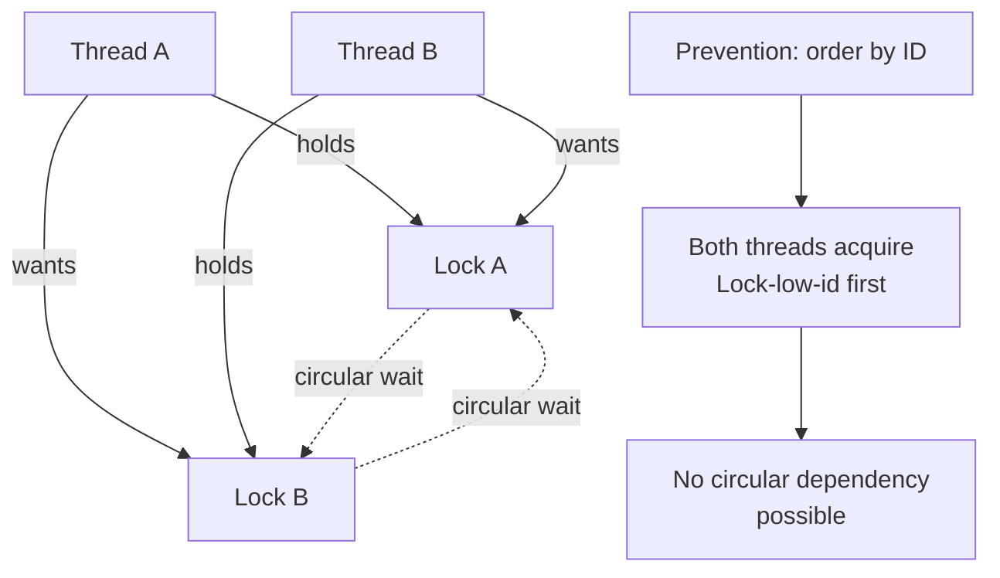
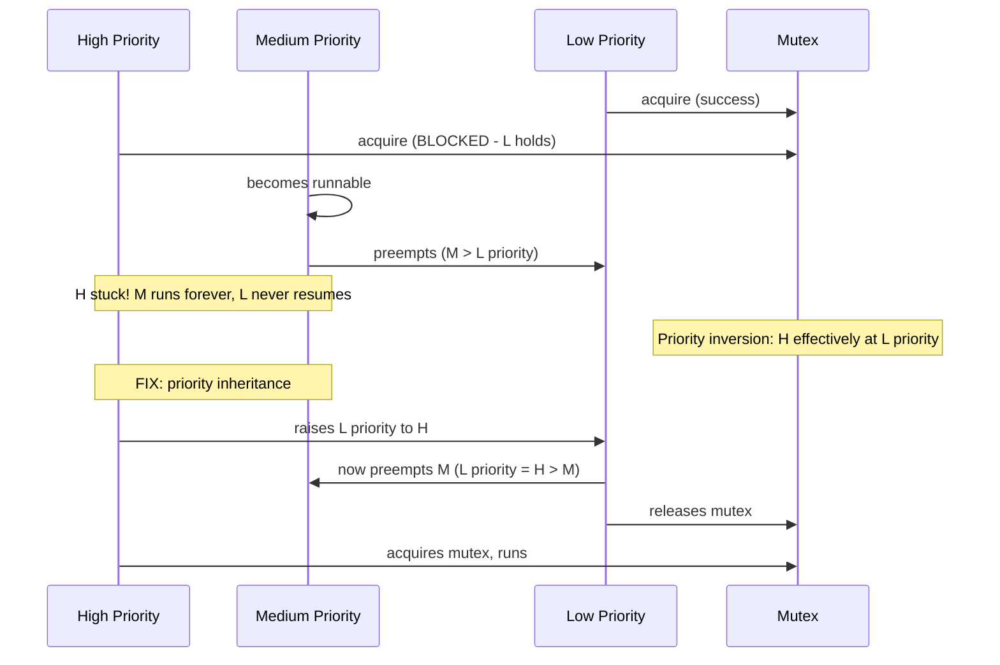
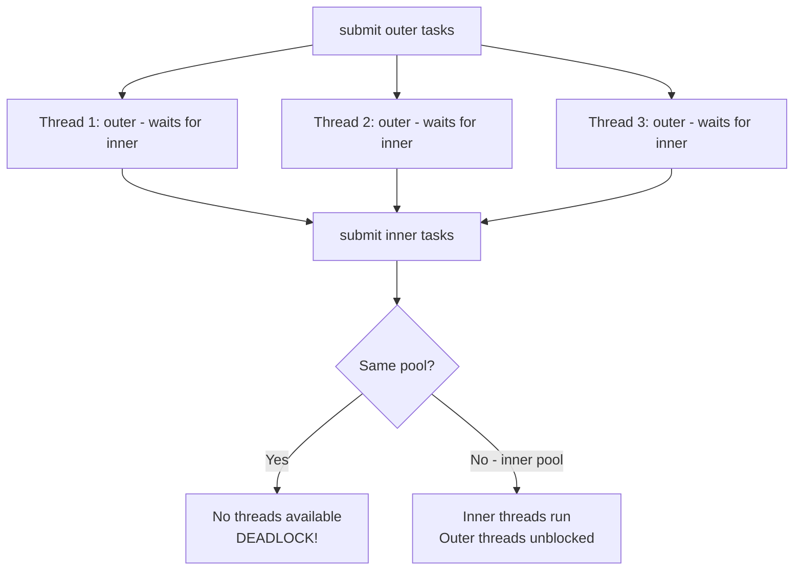
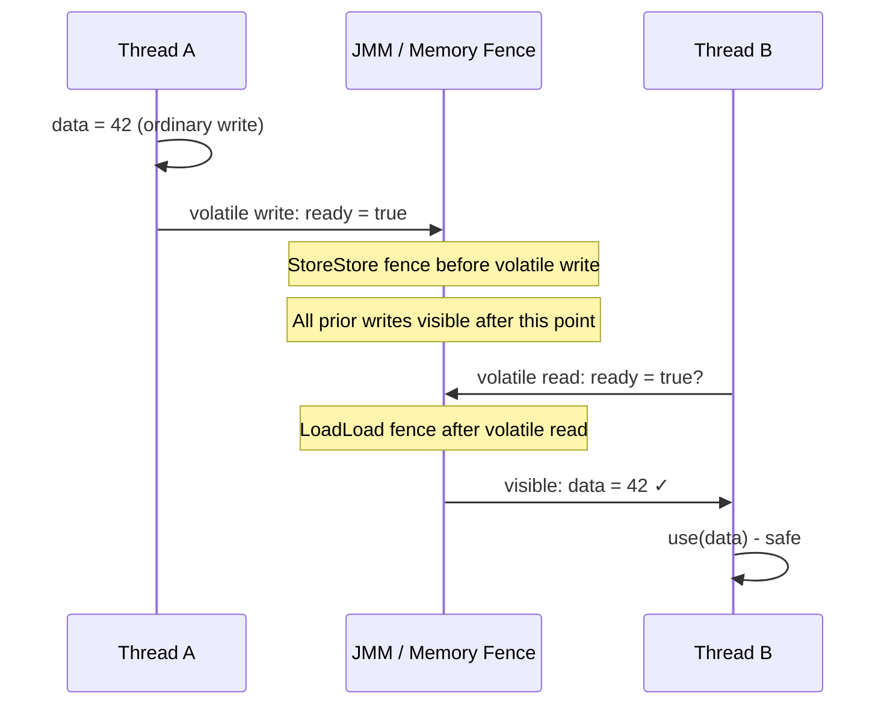
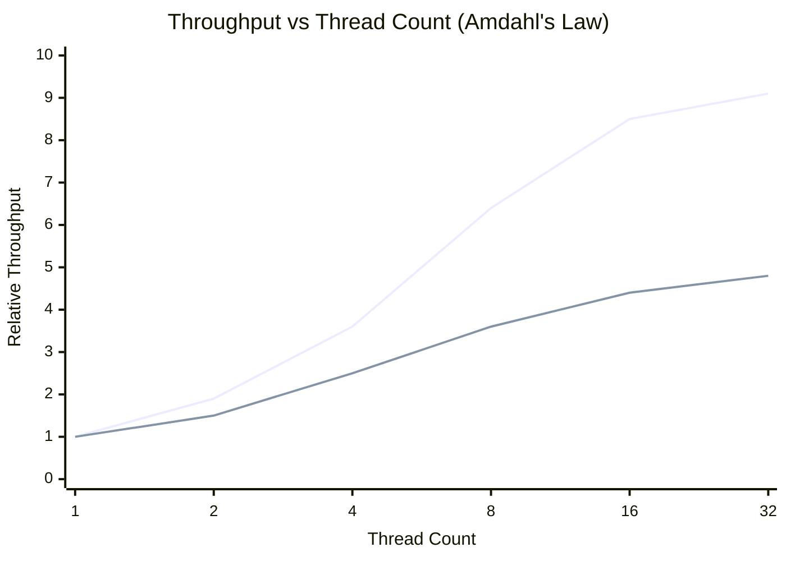

# Java Concurrency - L4 Production Depth

| # | Keyword | Difficulty |
| --- | --- | --- |
| 1 | [Deadlock Detection and Prevention](#deadlock-detection-and-prevention) | ★★★ |
| 2 | [Thread Starvation and Priority Inversion](#thread-starvation-and-priority-inversion) | ★★★ |
| 3 | [Thread Pool Saturation Anti-patterns](#thread-pool-saturation-anti-patterns) | ★★★ |
| 4 | [Java Memory Model and Visibility](#java-memory-model-and-visibility) | ★★★ |
| 5 | [Concurrent Performance Tuning](#concurrent-performance-tuning) | ★★★ |

---

# Deadlock Detection and Prevention

**Interview Weight:** critical - Production deadlocks cause
permanent application hangs. Tests ability to detect, diagnose,
and prevent the four Coffman conditions.

---

### 🎯 Model Answer

**30 seconds:**

> Deadlock occurs when two or more threads hold locks and each is
> waiting for a lock the other holds. Four conditions must all hold:
> mutual exclusion, hold-and-wait, no preemption, circular wait.
> Prevention: always acquire locks in a consistent global order.
> Diagnosis: jstack shows BLOCKED threads and the lock chain.

**3 minutes (Senior):**

> The four Coffman conditions: (1) mutual exclusion - only one
> thread can hold a lock, (2) hold-and-wait - thread holds a lock
> while waiting for another, (3) no preemption - locks are only
> released voluntarily, (4) circular wait - thread A waits for B's
> lock, B waits for A's lock (cycle).
>
> Prevention by eliminating circular wait: establish a global lock
> ordering. Always acquire locks in the same order (e.g., by object
> identity hash: lower hash first). If Thread A always acquires
> Lock1 before Lock2, and Thread B does the same, deadlock is
> impossible for these two locks.
>
> tryLock with timeout: ReentrantLock.tryLock(timeout) returns false
> if the lock is not acquired within timeout instead of blocking forever.
> On false, release held locks and retry (with backoff). This makes
> deadlock detectable and recoverable rather than permanent.
>
> Diagnosis: jstack or VisualVM shows deadlocked threads explicitly.
> Look for: thread A "waiting to lock <0xXXX>" held by thread B;
> thread B "waiting to lock <0xYYY>" held by thread A.

**Blank Mind Recovery:**

**(1) Restate:** "Deadlock: circular lock dependency causing permanent
blocking."

**(2) First principles:** "Lock A, want Lock B. Someone else has Lock B
and wants Lock A. Neither can progress."

**(3) Bridge:** "Like two cars on a one-lane bridge from opposite sides:
each blocking the other, neither backing up."

---

### 📘 Concept Explanation

**What it is:**

Deadlock: a set of threads permanently blocked, each waiting for
a resource held by another thread in the set. No thread can make
progress; the system is permanently stuck.

**The problem it solves:**

Deadlock is not a solution - it is a failure mode to prevent and
diagnose. Understanding it is required to design correct locking
protocols.

**How it works:**

```
DEADLOCK EXAMPLE:
  Thread A:
    synchronized(lockA) {       // holds lockA
        synchronized(lockB) {  // BLOCKS: waiting for lockB
        }
    }

  Thread B:
    synchronized(lockB) {       // holds lockB
        synchronized(lockA) {  // BLOCKS: waiting for lockA
        }
    }
  // A holds lockA, wants lockB
  // B holds lockB, wants lockA -> deadlock

PREVENTION - global lock ordering:
  // WRONG: different order in different methods
  void method1() { synchronized(a) { synchronized(b) {} } }
  void method2() { synchronized(b) { synchronized(a) {} } }

  // RIGHT: consistent order (by System.identityHashCode)
  void acquireInOrder(Object a, Object b, Runnable action) {
      Object first  = System.identityHashCode(a) <
                      System.identityHashCode(b) ? a : b;
      Object second = first == a ? b : a;
      synchronized(first) {
          synchronized(second) { action.run(); }
      }
  }

TRYLOCK PATTERN (ReentrantLock):
  boolean acquired = false;
  while (!acquired) {
      boolean gotA = lockA.tryLock(100, MILLISECONDS);
      if (!gotA) continue;
      try {
          boolean gotB = lockB.tryLock(100, MILLISECONDS);
          if (!gotB) {
              lockA.unlock(); // release; retry
              Thread.sleep(randomBackoff());
              continue;
          }
          try { doWork(); }
          finally { lockB.unlock(); }
          acquired = true;
      } finally { if (!acquired) lockA.unlock(); }
  }
```

**The key insight:**

Deadlock prevention requires eliminating one Coffman condition.
Eliminating circular wait (via global lock ordering) is the most
practical approach. tryLock converts deadlock from a permanent hang
to a detectable timeout - enabling recovery.

**When to use it:**

- Any time two or more locks must be acquired simultaneously: use
  global ordering
- When lock acquisition timeout is acceptable: use tryLock
- When locks cannot be ordered: use a single coarse lock to
  serialize the critical section (reduce parallelism to eliminate
  the risk)

**When NOT to use it:**

- Do not use tryLock in a tight loop without backoff: livelock
  (threads keep retrying but never progress)
- Do not ignore deadlock potential in "simple" code: even simple
  callbacks can introduce lock inversions

**Alternatives:**

- Lock-free algorithms (CAS-based): no locks = no deadlock
- Single-threaded design for critical sections: serialize access
  via a single-threaded executor
- Immutable data: share without locking

**First-principles derivation:**

Dijkstra (1965) proved that preventing circular wait (via resource
ordering) is sufficient to prevent deadlock. The banker's algorithm
provides deadlock avoidance (check if granting a resource leads to
an unsafe state). In practice, resource ordering is simpler and used
universally. JVM thread dump detection is O(threads^2) cycle detection
in the wait-for graph.

---

### 💻 Code Example

**Example 1: BAD (lock inversion) vs GOOD (consistent ordering)**

```java
// BAD: lock inversion - different ordering in transfer methods
class Account {
    private final ReentrantLock lock = new ReentrantLock();
    private int balance;

    // Thread A calls transfer(A, B, 100)
    // Thread B calls transfer(B, A, 50) concurrently
    static void transfer(Account from, Account to, int amount) {
        from.lock.lock();     // Thread A: locks A, then wants B
        try {                  // Thread B: locks B, then wants A
            to.lock.lock();    // DEADLOCK!
            try {
                from.balance -= amount;
                to.balance += amount;
            } finally { to.lock.unlock(); }
        } finally { from.lock.unlock(); }
    }
}

// GOOD: lock ordering by account ID (consistent global order)
class Account {
    private final long id; // assigned at creation, unique
    private final ReentrantLock lock = new ReentrantLock();
    private int balance;

    static void transfer(Account from, Account to, int amount) {
        // Always lock the lower-id account first
        Account first  = from.id < to.id ? from : to;
        Account second = first == from ? to : from;
        first.lock.lock();
        try {
            second.lock.lock();
            try {
                from.balance -= amount;
                to.balance += amount;
            } finally { second.lock.unlock(); }
        } finally { first.lock.unlock(); }
    }
    // Thread A and B both lock lower-id account first: no cycle!
}
```

> **Code walkthrough:** The bad version acquires `from.lock` then
> `to.lock`. Thread A calling transfer(A,B) locks A then wants B.
> Thread B calling transfer(B,A) concurrently locks B then wants A.
> Circular dependency: deadlock. The good version sorts by account ID
> before locking. Both threads always lock the lower-ID account first,
> regardless of argument order. The circular wait condition is
> impossible: no two threads can hold locks in opposite order.

**Example 2: Deadlock diagnosis with jstack**

```
// jstack output for a deadlock:
Found 1 deadlock.
"Thread-1":
  waiting to lock monitor 0x0000...a8 (Account@0x1a2b3c),
  which is held by "Thread-0"

"Thread-0":
  waiting to lock monitor 0x0000...b0 (Account@0x4d5e6f),
  which is held by "Thread-1"

"Thread-0":
  at Account.transfer(Account.java:15)
  - waiting to lock <0x...b0> (an Account)
  - locked <0x...a8> (an Account)

"Thread-1":
  at Account.transfer(Account.java:15)
  - waiting to lock <0x...a8> (an Account)
  - locked <0x...b0> (an Account)
```

> **Code walkthrough:** jstack explicitly identifies deadlock at the
> top (Found 1 deadlock). The output shows which thread holds which
> lock and which lock it is waiting for. Thread-0 holds 0x...a8 and
> waits for 0x...b0. Thread-1 holds 0x...b0 and waits for 0x...a8.
> The cycle is immediately visible. The stack trace points to the
> exact line in Account.transfer. This is the primary production
> diagnostic tool: run `kill -3 <pid>` (Linux) or use jstack on the
> PID to get the thread dump.

---

### 🎓 Answers by Seniority

**Junior / Mid (0-5 years):**

> Deadlock: two threads each hold a lock and wait for the other's
> lock. Four conditions: mutual exclusion, hold-and-wait, no preemption,
> circular wait. Prevent with consistent lock ordering. Diagnose
> with jstack: looks for "Found deadlock."

---

**Senior / Staff (5+ years):**

> I prevent deadlock through lock ordering (by object identity or
> explicit ID). For code where ordering is impractical, I use
> ReentrantLock.tryLock(timeout) for bounded waiting. In production,
> I set up deadlock detection via MBean/JMX: ThreadMXBean.findDeadlockedThreads()
> returns deadlocked thread IDs and can trigger an alert/thread dump.
> For complex lock scenarios, I prefer lock-free CAS structures
> (ConcurrentHashMap, AtomicReference) over manual locking.

---

### ⚠️ Common Misconceptions

| Misconception | Reality | Risk |
| --- | --- | --- |
| "Deadlock is detectable at compile time" | Deadlock is a runtime failure; static analysis tools (FindBugs) only catch simple patterns | False confidence in untested lock orderings |
| "tryLock prevents deadlock if used by all parties" | tryLock + no backoff = livelock (all threads keep retrying, none progress) | Livelock instead of deadlock: same result, harder to diagnose |
| "synchronized cannot deadlock with itself" | Reentrant locking prevents self-deadlock; but two objects deadlocking each other is still possible | Missing cross-object deadlock scenarios |

---

### 🚨 Failure Modes and Diagnosis

| Failure | Symptom | Root Cause | Diagnostic | Fix |
| --- | --- | --- | --- | --- |
| Permanent hang | Application stops responding; no CPU | Deadlock | jstack: "Found 1 deadlock"; BLOCKED threads | Fix lock ordering; or use tryLock with backoff |
| Livelock | High CPU, no progress | tryLock loop without backoff | jstack: threads retrying in tight loops | Add randomized exponential backoff to tryLock retry |
| Lock timeout cascade | Many threads timing out; throughput collapse | All threads compete for a few hot locks | jstack: many threads BLOCKED on same lock; lock contention profiler | Reduce lock granularity; use lock-free structures |

---

### 🎯 Interview Deep-Dive

| Level | Time | Expected Depth |
| --- | --- | --- |
| Junior | 3 min | Four Coffman conditions; jstack diagnosis; basic prevention |
| Mid | 5 min | Lock ordering by identity hash; tryLock timeout; livelock risk |
| Senior | 8 min | ThreadMXBean programmatic detection; lock-free alternatives; graph theory |
| Staff | 12 min | Design a deadlock-free distributed locking protocol; banker's algorithm |

---

**Q1** [DEBUGGING] [SENIOR]

"Production application hangs with no CPU usage. How do you diagnose?"

**Answer:**

No CPU + hang = threads blocked. Most likely: deadlock, waiting on
external resource, or waiting on a lock held by a stuck thread.

Step 1: Thread dump. On Linux: `kill -3 <pid>` (sends SIGQUIT,
dumps to stdout). With jstack: `jstack <pid> > dump.txt`.

Step 2: Look for "Found X deadlock." jstack auto-detects Java-level
deadlocks. If found: read the deadlock report and fix.

Step 3: If no explicit deadlock, search for BLOCKED threads:
```
grep -A 10 "BLOCKED" dump.txt
```
BLOCKED = waiting for a synchronized lock. Find which thread holds
the lock (the owner thread).

Step 4: Check the owner thread. Is it also BLOCKED or WAITING?
If WAITING: it is in wait()/join()/sleep(). If BLOCKED: deeper chain.

Step 5: Check for WAITING threads:
```
grep -A 5 "waiting on" dump.txt
```
WAITING = in Object.wait() or LockSupport.park(). Who will notify them?
If the notifying thread is BLOCKED or WAITING itself: deadlock variant.

Step 6: Programmatic detection:
```java
ThreadMXBean tmx = ManagementFactory.getThreadMXBean();
long[] deadlocked = tmx.findDeadlockedThreads();
if (deadlocked != null) {
    ThreadInfo[] info =
        tmx.getThreadInfo(deadlocked, true, true);
    // info contains full lock ownership chain
}
```

Schedule this as a periodic check (ScheduledExecutorService, 30s)
and alert via PagerDuty when deadlock is detected.

*What separates good from great:* Knowing the programmatic detection
via ThreadMXBean and scheduling it as a health check rather than
waiting for a manual jstack.

---

**Q2** [TRADE-OFF] [SENIOR]

"Lock ordering vs tryLock: which do you prefer and when?"

**Answer:**

Lock ordering: preferred when possible.
- Deterministic prevention: if ordering is consistent, deadlock is
  impossible regardless of thread timing
- No overhead: no timeout logic, no retry loops
- Simpler code: just acquire in order
- Limitation: requires a stable, consistent ordering key (object ID,
  enum value, priority). Not always possible for dynamically created
  or unrelated objects.

tryLock with timeout: preferred when ordering is impractical.
- Works for any set of locks regardless of relationship
- Handles external locks (distributed locks, file locks) that cannot
  be "ordered"
- Provides a timeout: operation fails gracefully instead of hanging
- Limitation: requires retry logic; risk of livelock if timeout
  is too short or backoff not implemented; adds latency (the timeout)
  to the happy path if lock is contested

Combining both: for objects with clear IDs, use ordering. For
exceptional cases where ordering is impractical, fall back to
tryLock with randomized exponential backoff.

Rule of thumb: use lock ordering for domain objects (accounts,
users, orders - all have IDs). Use tryLock for utility resources
(file locks, connection locks, external service locks).

*What separates good from great:* Knowing livelock as the main
tryLock risk and randomized backoff as the fix.

---

**Q3** [ARCHITECTURE] [STAFF]

"Design a deadlock-free money transfer system with concurrent transfers."

**Answer:**

Requirements: concurrent bidirectional transfers between accounts,
correct balance at all times, no deadlock.

Solution 1 - Global lock ordering (by account ID):
```java
void transfer(Account from, Account to, BigDecimal amount) {
    Account lo = from.id < to.id ? from : to;
    Account hi = lo == from ? to : from;
    synchronized(lo) {
        synchronized(hi) {
            if (from.balance.compareTo(amount) < 0)
                throw new InsufficientFundsException();
            from.balance = from.balance.subtract(amount);
            to.balance   = to.balance.add(amount);
        }
    }
}
```
Guarantees: no circular wait (always lo < hi). No deadlock possible.
Limitation: all transfers serialize on accounts involved; no parallel
transfers for the same account.

Solution 2 - Optimistic locking (database-level):
Use a version column and UPDATE ... WHERE version = N.
No Java locks: the database handles concurrency with row-level locks.
Transactions retry on OptimisticLockException.
Suitable for high contention when Java-level locking is a bottleneck.

Solution 3 - Single-threaded transfer processor:
Channel transfer requests to a single-threaded ExecutorService.
All transfers serialize through one thread - no concurrency, no
locking. Simple, correct, but bounded throughput.

Trade-off: Solution 1 is best for in-memory high-throughput.
Solution 2 for persistence. Solution 3 for simplicity.

*What separates good from great:* Offering multiple solutions
with explicit trade-offs and knowing that optimistic locking at
the DB layer eliminates the Java locking problem.

---

### ⚖️ Comparison Table

| Prevention Strategy | Eliminates Condition | Complexity | Trade-off |
| --- | --- | --- | --- |
| Global lock ordering | Circular wait | Medium | Requires consistent order key |
| tryLock with timeout | Hold-and-wait | High | Retry logic; livelock risk |
| Lock-free CAS | Mutual exclusion (sort of) | High | ABA problem; retry on contention |
| Single-thread serialization | All conditions (no concurrency) | Low | Throughput limited |

---

### 🏛️ System Design

At distributed scale, deadlock manifests as distributed deadlock:
Transaction A holds row lock in DB1 and waits for DB2; Transaction B
holds row lock in DB2 and waits for DB1. Standard lock ordering does
not help across services.

Solutions:
- Saga pattern: break distributed transaction into compensating
  local transactions; no distributed lock held
- 2-Phase Locking (2PL) with timeout: acquire all locks with timeout;
  abort and retry if timeout
- Distributed lock ordering: establish a total order on resource IDs
  (UUID, hash) used as global ordering key

---

### 📊 Diagram

```
DEADLOCK CYCLE:

Thread A: holds LOCK_A ------> wants LOCK_B
                                     |
Thread B: holds LOCK_B <------ wants LOCK_A

PREVENTION (global ordering):

Thread A: acquires LOCK_1 (lower id) first
Thread B: acquires LOCK_1 (lower id) first
-> Both want LOCK_1 first: one wins, other waits
-> Winner acquires LOCK_2: no circular dependency
```



> **Diagram walkthrough:** The deadlock cycle is a directed graph:
> arrows from thread to held lock, from thread to wanted lock. A
> cycle in this graph = deadlock. Prevention removes the cycle by
> enforcing that all threads follow the same lock acquisition order
> (by ID). With consistent ordering, the graph becomes a DAG (no
> cycles). Thread A and Thread B both want lock-low-id first; one
> acquires it and proceeds, the other waits but is not blocking the
> first. No cycle = no deadlock.

---

---

# Thread Starvation and Priority Inversion

**Interview Weight:** high - Subtle liveness failures that are
harder to diagnose than deadlock. Tests deep OS-level knowledge
of scheduling and priority inheritance.

---

### 🎯 Model Answer

**30 seconds:**

> Thread starvation: a thread is runnable but never scheduled
> because higher-priority or more numerous threads always run first.
> Priority inversion: a high-priority thread is blocked waiting for
> a lock held by a low-priority thread, which is itself preempted
> by medium-priority threads. The high-priority thread is effectively
> running at the lowest priority.

**3 minutes (Senior):**

> Starvation in Java: occurs with unfair locks (synchronized uses
> an unfair algorithm on most JVMs; threads compete for the lock
> after it is released; a thread can be skipped indefinitely).
> ReentrantLock(fair=true) uses a FIFO queue: threads acquire in
> order of waiting. Trade-off: fair locks have lower throughput
> (more overhead for queue management) but prevent starvation.
>
> Priority inversion example: thread H (high priority) waits for
> a mutex held by thread L (low priority). Thread M (medium priority)
> is runnable and preempts L, which then cannot release the mutex.
> H waits for L, but L waits for M to stop running. H is now
> indirectly delayed by M - priority inversion. Mars Pathfinder
> (1997) crashed repeatedly due to this.
>
> Priority inheritance: when L holds a lock that H is waiting for,
> the OS temporarily elevates L's priority to H's priority so it
> can complete quickly. This is the classic fix for priority inversion.
> Java does not implement priority inheritance in the JVM; it must
> be handled at the OS level (POSIX pthread_mutexattr_setprotocol)
> or avoided by design.

**Blank Mind Recovery:**

**(1) Restate:** "Starvation: always skipped. Inversion: high
priority blocked by low-priority thread holding a lock, which is
preempted by medium-priority."

**(2) First principles:** "A thread can only run if it gets scheduled.
If others always win the schedule race: starvation."

---

### 📘 Concept Explanation

**What it is:**

Thread starvation: a runnable thread cannot get CPU time because
other threads monopolize the scheduler. Priority inversion: a
high-priority thread is indirectly blocked by a low-priority one
due to lock contention and medium-priority preemption.

**The problem it solves:**

Starvation and priority inversion cause liveness failures without
deadlock: the system is making progress (some threads run), but
specific critical threads do not. This can cause SLA violations,
timeouts, and hard-to-reproduce production incidents.

**How it works:**

```
STARVATION SCENARIO:
  ThreadPool with 10 high-priority tasks and 1 low-priority task
  High-priority tasks monopolize all pool threads
  Low-priority task: always queued, never runs
  -> Low-priority task times out after 30 seconds

PRIORITY INVERSION TIMELINE:
  T=0:  L acquires mutex M
  T=1:  H becomes runnable; blocks on M (held by L)
  T=2:  M becomes runnable; preempts L (M > L priority)
  T=3+: M runs indefinitely; L never scheduled (M > L)
        H waits for M release but M never releases it
  Result: H (highest priority) is stuck behind M (medium)

JAVA FAIRNESS:
  // Unfair (default): faster but allows starvation
  ReentrantLock unfair = new ReentrantLock();

  // Fair: FIFO order, prevents starvation
  ReentrantLock fair = new ReentrantLock(true);
  // Fair lock overhead: ~2x slower under high contention
  // but guarantees bounded waiting time
```

**The key insight:**

Java thread priority (Thread.setPriority) is a hint to the OS
scheduler. On most JVMs/OS combinations, Java priority has minimal
effect. Do not rely on Java priority for correctness. Real starvation
prevention requires fair locks or architectural separation (separate
thread pools for high-priority work).

**When to use it:**

- Fair lock: when bounded waiting time is more important than
  raw throughput (e.g., request processing where each request
  must eventually complete)
- Separate thread pools: for high-priority vs low-priority work
  (e.g., health check vs background batch)

**When NOT to use it:**

- Do not use fair=true for performance-critical locks: overhead
  is significant under contention
- Do not rely on Thread.setPriority() as a starvation fix: JVM
  priority mapping to OS is not reliable

**Alternatives:**

- Work-stealing schedulers (ForkJoinPool): balance load automatically
- Rate limiting: bound how much CPU any single task class can take
- Virtual threads: OS thread scheduling replaced by JVM scheduling
  (more predictable)

**First-principles derivation:**

Starvation is a property of the scheduler's fairness guarantee.
A FIFO queue guarantees every waiting thread eventually runs (weak
fairness). A strict priority scheduler does not: low-priority tasks
can wait forever if high-priority tasks continually arrive. Priority
inversion is a composition failure: the locking protocol and the
priority protocol interact incorrectly. Priority inheritance is the
fix: dynamically adjust priorities to maintain invariant.

---

### 💻 Code Example

**Example 1: BAD (unfair lock starvation) vs GOOD (fair lock or pool separation)**

```java
// BAD: unfair lock - potential starvation for some threads
ReentrantLock lock = new ReentrantLock(); // unfair by default
// 1000 high-priority tasks + 1 low-priority task
// The 1 low-priority task may never acquire the lock

// GOOD option 1: fair lock - FIFO ordering
ReentrantLock fairLock = new ReentrantLock(true);
// Low-priority task: guaranteed to run after all threads that
// arrived before it in the queue. Bounded wait = no starvation.

// GOOD option 2: dedicated pools for high/low priority
ExecutorService highPriorityPool =
    Executors.newFixedThreadPool(8);   // handles critical tasks
ExecutorService lowPriorityPool =
    Executors.newFixedThreadPool(2);   // handles background tasks
// Low-priority tasks get dedicated threads; never starved by high
// Downside: 2 threads always reserved even if low-priority is idle

// GOOD option 3: PriorityBlockingQueue
PriorityBlockingQueue<Runnable> queue =
    new PriorityBlockingQueue<>();
// Higher-priority tasks dequeue first;
// low-priority tasks still eventually run (no infinite starvation
// unless arrivals are infinite and all higher priority)
```

> **Code walkthrough:** The unfair ReentrantLock is faster because
> threads that arrive when the lock is released can "barge" past
> waiting threads (no queue maintenance). But a thread that is
> consistently unlucky can wait indefinitely. The fair lock maintains
> a FIFO wait queue: a thread that has been waiting longest gets
> the lock next. This doubles CPU overhead under high contention but
> guarantees progress for all threads. Pool separation is the
> architectural solution: each priority class has dedicated threads
> so no class starves the others.

---

### 🎓 Answers by Seniority

**Junior / Mid (0-5 years):**

> Starvation: a thread never gets the CPU because others always run.
> Priority inversion: high-priority thread blocked by low-priority
> lock holder, itself preempted by medium threads. Prevention: fair
> locks (ReentrantLock(true)), separate pools for priority classes.
> Java thread priority is not reliable.

---

**Senior / Staff (5+ years):**

> I prevent starvation by architectural separation: high-priority
> work (health checks, payment APIs) gets dedicated thread pools;
> background work (reports, cleanup) gets a separate bounded pool.
> For lock contention: ReentrantLock(fair=true) when bounded waiting
> is required. For priority inversion: I design to minimize holding
> locks while doing IO or calling external services (lock contention
> window minimization). Java priority hints to the OS and has no
> reliable effect.

---

### ⚠️ Common Misconceptions

| Misconception | Reality | Risk |
| --- | --- | --- |
| "Thread.setPriority reliably controls scheduling" | JVM priority is a hint; on many OS/JVM combos it is ignored or has minimal effect | False confidence in priority-based scheduling |
| "Fair lock is always better" | Fair lock has significantly lower throughput under high contention | Using fair lock everywhere causes performance regression |
| "Starvation only affects low-priority threads" | Starvation can affect any thread in an unfair system under high load | Missing starvation in equal-priority thread pools |

---

### 🚨 Failure Modes and Diagnosis

| Failure | Symptom | Root Cause | Diagnostic | Fix |
| --- | --- | --- | --- | --- |
| Task timeout for specific task class | Some tasks always time out; others complete | Starvation: high-volume tasks monopolize pool | Monitor queue age per task type; task wait time metrics | Separate pools per priority class |
| High-priority request slow | Critical endpoint slow despite low load | Priority inversion or lock contention with background tasks | jstack: high-priority threads BLOCKED on lock held by background thread | Minimize lock scope; separate pools; fair lock |

---

### 🎯 Interview Deep-Dive

| Level | Time | Expected Depth |
| --- | --- | --- |
| Junior | 3 min | Starvation definition; fair lock; Java priority unreliability |
| Mid | 5 min | Priority inversion timeline; fair vs unfair trade-off; pool separation |
| Senior | 8 min | Mars Pathfinder example; priority inheritance; design for no inversion |
| Staff | 12 min | SLA guarantees in shared pools; capacity planning; OS scheduling theory |

---

**Q1** [CONCEPTUAL] [SENIOR]

"Describe the Mars Pathfinder priority inversion and how it was fixed."

**Answer:**

Mars Pathfinder (1997) suffered repeated system resets due to
priority inversion in its VxWorks RTOS.

Setup:
- Three tasks: (H) high-priority meteorological data bus task,
  (M) medium-priority communication task, (L) low-priority
  information gathering task
- A shared mutex for the information bus

Event sequence:
1. L acquires the mutex for the information bus
2. H becomes ready; attempts to acquire the mutex; blocks (L holds it)
3. M becomes ready; preempts L (M > L priority)
4. M runs for a long time; L never scheduled (M > L)
5. H is blocked waiting for L to release the mutex
6. Result: H (highest priority) is stuck behind M indefinitely

Watchdog timer detected that H was not completing in time and reset
the system.

Fix: VxWorks priority inheritance was already implemented but not
enabled for the shared mutex. Enabling priority inheritance fixed it:
- When H blocks on the mutex held by L, L's priority is raised to H
- Now L > M: L preempts M, completes quickly, releases mutex
- H runs with its proper priority

Lesson: priority inheritance must be enabled at the mutex level, not
globally. In Java: the JVM does not implement priority inheritance.
Design fix: minimize lock holding time to prevent medium-priority
tasks from preempting lock-holding low-priority tasks. Or use a
separate high-priority thread for the lock-holder to prevent preemption.

*What separates good from great:* Knowing the specific mechanism
(priority not raised for mutex holder) and the fix (enable priority
inheritance on the specific mutex).

---

### ⚖️ Comparison Table

| Scenario | Deadlock | Starvation | Priority Inversion |
| --- | --- | --- | --- |
| Progress | None (all stuck) | Some progress (others run) | Some progress (wrong threads) |
| CPU usage | Zero | Normal | Normal |
| Detection | jstack deadlock report | Queue age monitoring; task timeout | High-priority tasks slow; jstack |
| Root cause | Circular lock dependency | Unfair scheduler or monopoly | Lock + priority interaction |
| Fix | Lock ordering; tryLock | Fair lock; pool separation | Priority inheritance; lock scope minimization |

---

### 🏛️ System Design

*(Omit: L4 production depth. Distributed priority queues and
multi-tenancy SLA guarantees appear in L5 files.)*

---

### 📊 Diagram

```
PRIORITY INVERSION TIMELINE:

Time: 0    1    2    3    4    5
L:    [run] [PREEMPTED by M]
H:         [BLOCKED on mutex held by L]
M:               [run--------------]
mutex: L                             <- L never completes!

AFTER priority inheritance:
L:    [run] [priority raised to H] [completes] [release]
H:         [BLOCKED]                            [RUNS]
M:                   [PREEMPTED by L-with-H-priority]
```



> **Diagram walkthrough:** The timeline shows three distinct phases.
> Phase 1: L holds the mutex, H blocks. Phase 2: M preempts L (M > L
> priority), so L cannot release the mutex, which means H is stuck
> behind M. Phase 3 (with priority inheritance): when H blocks on L's
> mutex, L's priority is temporarily elevated to H. Now L > M, so L
> preempts M, finishes, releases the mutex, and H runs. Priority is
> restored to L's original level after mutex release. This is a
> O(1) fix: one priority comparison, one temporary update.

---

---

# Thread Pool Saturation Anti-patterns

**Interview Weight:** critical - Production thread pool saturation
causes cascading failures. Tests recognition of the most common
patterns that cause saturation and how to prevent them.

---

### 🎯 Model Answer

**30 seconds:**

> Thread pool saturation: all pool threads are busy; new tasks queue
> or get rejected. Anti-patterns: same pool for slow and fast tasks
> (slow tasks starve fast ones), pool thread calling another task on
> the same pool (deadlock), unbounded task submission without
> backpressure (OOM). Prevention: separate pools by workload type,
> bounded queues, bulkhead pattern.

**3 minutes (Senior):**

> The most dangerous anti-pattern: thread pool induced deadlock.
> A thread in pool P submits a task to pool P and calls get() on
> the result. If all threads are running the "outer" task and waiting
> for the "inner" task, no thread is available to run the inner task.
> Deadlock on the pool itself. Common in CompletableFuture chains
> that use the common ForkJoinPool for both outer and inner stages.
>
> Unbounded queue: newFixedThreadPool uses LinkedBlockingQueue with
> no capacity. Under high load, tasks accumulate in the queue consuming
> heap. At 1KB per task object: 1 million queued tasks = 1GB. OOM
> before tasks are rejected.
>
> Bulkhead pattern: separate thread pools for each downstream
> dependency (DB pool, HTTP client pool, cache pool). If the DB is
> slow and saturates the DB pool, HTTP calls still have dedicated
> threads. Without bulkhead: a slow DB saturates the single shared
> pool and all HTTP calls also stall.
>
> Sizing: CPU-bound = N cores. IO-bound = measure the blocking
> coefficient (percentage of time a thread blocks on IO) and apply
> Little's Law. As a rule: IO-bound pools need more threads than
> CPU-bound pools.

**Blank Mind Recovery:**

**(1) Restate:** "Thread pool saturation: no threads available.
Anti-patterns: pool deadlock, unbounded queue, mixed workloads."

**(2) First principles:** "Pool has N threads. N+1 concurrent tasks:
one waits. If a waiting task is needed to unblock an active task:
deadlock."

---

### 📘 Concept Explanation

**What it is:**

Thread pool saturation: the state where all threads are occupied and
new tasks cannot start immediately. Anti-patterns are common coding
mistakes that lead to saturation, deadlock, or OOM.

**The problem it solves:**

Thread pool saturation is a class of production failures that look
like deadlock (no progress) but have different root causes and fixes.

**How it works:**

```
ANTI-PATTERN 1: Thread Pool Induced Deadlock
  ExecutorService pool = Executors.newFixedThreadPool(5);
  // Task A: submitted to pool
  // Task A submits Task B to the SAME pool and calls future.get()
  Future<?> outer = pool.submit(() -> {
      Future<?> inner = pool.submit(() -> doInnerWork()); // submitted to same pool!
      inner.get();   // BLOCKS this thread waiting for inner
  });
  // If all 5 threads are running outer tasks and all call get():
  // No thread available to run inner tasks -> deadlock!

ANTI-PATTERN 2: Slow + Fast Task Mixing
  // Fast tasks (1ms) and slow tasks (10 seconds) share a pool
  for (Request req : allRequests) {
      pool.submit(() -> {
          if (req.isSlow()) slowDBQuery(req);  // 10 seconds
          else fastCacheGet(req);              // 1ms
      });
  }
  // 10 slow tasks saturate all threads for 10 seconds
  // 1000 fast tasks wait in queue for 10+ seconds each

ANTI-PATTERN 3: Unbounded Submission
  for (Event event : infiniteStream) {
      pool.submit(() -> processEvent(event));
      // Queue grows without limit if processing rate < arrival rate
  }
  // Fix: use ArrayBlockingQueue(1000) + CallerRunsPolicy
```

**The key insight:**

Thread pool induced deadlock: a task waiting on another task in the
same pool. The pool cannot complete the inner task because all threads
are waiting for inner tasks that cannot start. Fix: use a different
pool for inner tasks, or use ForkJoinPool (which can create extra
threads to break the deadlock via ManagedBlocker), or never block
a pool thread waiting for another task on the same pool.

**When to use it:**

Apply bulkhead (separate pools) when:
- Different downstream services have different latency profiles
- One service can become slow without affecting others
- Critical requests must always have threads available

**When NOT to use it:**

- Do not create a separate pool for every method call: pools have
  overhead (threads, queue)
- Do not over-partition: many small pools with under-utilized threads
  is inefficient

**Alternatives:**

- Virtual threads: eliminate pool sizing concern for IO-bound work
- Reactive bulkhead: separate schedulers per downstream in reactive
- Resilience4j Bulkhead: semaphore-based or thread-pool-based bulkhead

**First-principles derivation:**

Thread pool induced deadlock is a variant of resource deadlock:
threads are the resource; pool threads are "slots." When outer tasks
consume all slots and wait for inner tasks that need slots: circular
dependency on the slot resource. Fix: ensure inner tasks do not
depend on the same resource class as outer tasks.

---

### 💻 Code Example

**Example 1: BAD (pool induced deadlock) vs GOOD (separate pools)**

```java
// BAD: thread pool deadlock - same pool for outer and inner
ExecutorService pool = Executors.newFixedThreadPool(4);

Future<String> f = pool.submit(() -> {
    // Outer task: submits inner task to SAME pool
    Future<String> inner = pool.submit(() -> "inner result");
    return inner.get();  // BLOCKS this thread waiting for inner!
    // If all 4 threads are doing this: 4 outer tasks block,
    // 4 inner tasks can never start -> deadlock
});

// GOOD: separate pool for inner tasks
ExecutorService outerPool = Executors.newFixedThreadPool(4);
ExecutorService innerPool = Executors.newFixedThreadPool(4);

Future<String> f = outerPool.submit(() -> {
    Future<String> inner = innerPool.submit(() -> "inner result");
    return inner.get();  // Blocks outer thread, but inner runs on innerPool
});
// OR: refactor to avoid get() entirely - use CompletableFuture.thenCompose
CompletableFuture<String> cf =
    CompletableFuture.supplyAsync(() -> "outer", outerPool)
        .thenCompose(outer ->
            CompletableFuture.supplyAsync(
                () -> outer + " -> inner", innerPool));
// No blocking; no pool deadlock possible
```

> **Code walkthrough:** The bad version submits an inner task to the
> same pool and calls get(). With 4 threads, 4 outer tasks start and
> each blocks waiting for an inner task. The queue has 4 inner tasks
> but no thread is available to run them. Classic thread-pool deadlock.
> Fix 1: use a separate pool for inner tasks. Fix 2 (preferred): use
> CompletableFuture.thenCompose which chains asynchronously - no thread
> is ever blocked waiting for another task. The CF approach is the
> idiomatic solution and eliminates the deadlock entirely.

**Example 2: Bulkhead implementation**

```java
// GOOD: bulkhead - separate pools per dependency
class ServiceClient {
    // Each downstream has its own bounded pool
    private final ExecutorService dbPool =
        new ThreadPoolExecutor(
            4, 8, 60, SECONDS,
            new ArrayBlockingQueue<>(100),
            new CallerRunsPolicy());

    private final ExecutorService httpPool =
        new ThreadPoolExecutor(
            4, 16, 60, SECONDS,
            new ArrayBlockingQueue<>(200),
            new AbortPolicy());

    public User getUser(String id) {
        return dbPool.submit(() -> jdbc.queryUser(id)).get();
    }

    public Config getConfig(String key) {
        return httpPool.submit(() -> http.getConfig(key)).get();
    }
    // If DB is slow and saturates dbPool:
    // httpPool is unaffected; getConfig still returns quickly
}
```

> **Code walkthrough:** Each downstream service has a dedicated pool.
> If the database becomes slow and saturates the DB pool (8 threads
> busy), DB tasks queue or CallerRunsPolicy slows the caller. But the
> HTTP pool (16 threads) is completely separate: HTTP calls continue
> normally. Without bulkhead, a single shared pool saturated by DB
> would delay HTTP calls too. The separate queue capacities reflect
> the expected load: DB is slower so smaller queue; HTTP is faster
> and bursty so larger queue.

---

### 🎓 Answers by Seniority

**Junior / Mid (0-5 years):**

> Thread pool saturation: all threads busy, new tasks queue or are
> rejected. Anti-patterns: submitting tasks to the same pool and
> waiting (deadlock), unbounded queue (OOM), mixing slow and fast
> tasks (slow ones block fast ones). Prevention: separate pools,
> bounded queues, bulkhead.

---

**Senior / Staff (5+ years):**

> I size pools using Little's Law and instrument them with active
> thread count and queue depth metrics. I separate pools by downstream
> (bulkhead). I never call pool.submit(...).get() from a pool thread
> on the same pool. For modern Java: virtual threads eliminate IO
> pool sizing entirely. For critical path vs background: dedicated
> pools with explicit capacity and rejection policies. I alert when
> queue depth exceeds 80% to catch saturation before rejection starts.

---

### ⚠️ Common Misconceptions

| Misconception | Reality | Risk |
| --- | --- | --- |
| "Larger pool prevents saturation" | Larger pool delays saturation but does not prevent it if submission rate > completion rate | OOM from thread creation; OS thread limit exceeded |
| "CompletableFuture.get() in a thenApply is safe" | Calling get() inside a CF callback may block the executing thread and cause pool saturation | Pool thread blocked; same as anti-pattern 1 |
| "Separate pools are wasteful" | Idle threads consume ~1MB each; but VTs reduce this; and the resilience benefit outweighs the overhead for critical services | Skipping bulkhead to save memory; cascade failure instead |

---

### 🚨 Failure Modes and Diagnosis

| Failure | Symptom | Root Cause | Diagnostic | Fix |
| --- | --- | --- | --- | --- |
| Thread pool induced deadlock | All pool threads BLOCKED; no progress; pool queue growing | Task waits on task in same pool | jstack: all pool threads blocked in get() or join(); pool.getQueue().size() growing | Separate pools; use CF thenCompose |
| Slow task monopoly | Fast tasks queue for seconds | Slow + fast tasks in same pool | p99 latency high; activeCount = max; fast tasks in queue | Separate pools by latency class |
| Queue OOM | Heap exhaustion; GC pressure | Unbounded queue + slow consumers | jmap: LinkedBlockingQueue with millions of entries | Bounded queue + rejection policy |

---

### 🎯 Interview Deep-Dive

| Level | Time | Expected Depth |
| --- | --- | --- |
| Junior | 3 min | Saturation definition; unbounded queue; separate pools |
| Mid | 5 min | Pool induced deadlock mechanics; bulkhead; queue sizing |
| Senior | 8 min | CompletableFuture pool deadlock; Little's Law sizing; resilience4j |
| Staff | 12 min | Multi-tier bulkhead architecture; capacity planning; VT migration |

---

**Q1** [DEBUGGING] [SENIOR]

"A CompletableFuture pipeline stops making progress under high load.
How do you diagnose pool saturation?"

**Answer:**

Step 1: Check if the common pool is saturated:
```java
ForkJoinPool pool = ForkJoinPool.commonPool();
log.info("Pool: parallelism={} active={} queued={} steal={}",
    pool.getParallelism(),
    pool.getActiveThreadCount(),
    pool.getQueuedTaskCount(),
    pool.getStealCount());
```
If activeCount == parallelism: common pool is saturated.

Step 2: jstack - look for common pool threads:
```
grep -A 20 "ForkJoinPool.commonPool" dump.txt
```
Look for BLOCKED or WAITING. If waiting on CompletableFuture.get():
pool-induced deadlock.

Step 3: Find where the CF chain blocks:
Search for `join()` or `get()` inside thenApply/thenCompose callbacks:
```java
// BAD: blocks pool thread
.thenApply(data -> {
    return expensiveCF.join();  // blocks FJP thread!
})
// GOOD: thenCompose, no blocking
.thenCompose(data -> expensiveCF)
```

Step 4: Identify which operation causes the blocking:
- DB call inside thenApply without ioExecutor: blocks FJP thread
- HTTP call inside thenApply without ioExecutor: same

Fix:
```java
// Provide explicit ioExecutor to all IO operations:
.thenApplyAsync(data -> dbCall(data), ioExecutor)
// FJP thread schedules the task; ioExecutor thread does the blocking
```

Step 5: For complex pipelines with multiple pools, add per-pool
metrics (active count, queue depth) exported to Grafana. Set alert
on active > 80% of pool size.

*What separates good from great:* Knowing the specific ForkJoinPool
pool inspection API and the join()/get() inside thenApply pattern
as the root cause.

---

### ⚖️ Comparison Table

| Anti-pattern | Root Cause | Symptom | Fix |
| --- | --- | --- | --- |
| Pool induced deadlock | Task waits for same-pool task | All threads BLOCKED; no progress | Separate pools; use thenCompose |
| Unbounded queue OOM | No capacity limit | Heap exhaustion | Bounded queue + rejection policy |
| Slow+Fast task mixing | Single pool; slow tasks monopolize | Fast tasks queue for seconds | Separate pools by latency class |
| Common pool blocking | IO in thenApply; no executor | CF pipeline stalls | Provide ioExecutor to Async variants |

---

### 🏛️ System Design

Bulkhead architecture for a microservice:

```
Request Handler Pool (16 threads, bounded 200)
     |
     +-> DB Pool (8 threads, bounded 50)
     |      -> PostgreSQL
     |
     +-> Cache Pool (4 threads, bounded 100)
     |      -> Redis
     |
     +-> HTTP Pool (16 threads, bounded 200)
            -> Payment API
            -> Notification API
```

If Payment API is slow: HTTP pool saturates but DB and Cache pools
are unaffected. Request handler pool may become slow (waiting for
HTTP) but DB queries still complete. Service degrades gracefully
(pay now fails; display cart still works).

---

### 📊 Diagram

```
THREAD POOL INDUCED DEADLOCK:

Pool size = 3:
  Thread 1: Outer Task -> submit(Inner) -> get() BLOCKED
  Thread 2: Outer Task -> submit(Inner) -> get() BLOCKED
  Thread 3: Outer Task -> submit(Inner) -> get() BLOCKED
  Queue: [Inner1, Inner2, Inner3] - no thread to run them!

BULKHEAD ISOLATION:
  [Outer Pool: 3]        [Inner Pool: 3]
   T1: outer task    ->  T4: inner task (runs!)
   T2: outer task    ->  T5: inner task
   T3: outer task    ->  T6: inner task
```



> **Diagram walkthrough:** The deadlock arises because outer tasks
> fill all pool threads and then each waits for an inner task that
> needs a pool thread to run. The pool cannot complete the inner tasks
> because all threads are waiting for them. With bulkhead (separate
> pools), outer tasks wait on the outer pool while inner tasks run
> on the inner pool. No circular resource dependency exists. The
> flowchart shows the decision point: same pool = deadlock; separate
> pool = no deadlock.

---

---

# Java Memory Model and Visibility

**Interview Weight:** critical - Underpins all thread safety.
Tests understanding of happens-before, reordering, and visibility
guarantees provided by volatile/synchronized.

---

### 🎯 Model Answer

**30 seconds:**

> The Java Memory Model (JMM) defines when writes by one thread
> are visible to reads by another. Without synchronization, the
> JVM can reorder instructions and cache values. Happens-before
> (HB) guarantees visibility: if action A HB action B, then B
> sees all writes by A. volatile, synchronized, and final create
> HB relationships.

**3 minutes (Senior):**

> The JMM is not about memory architecture - it is about ordering
> guarantees between threads. Without a HB edge, a write in thread
> A may be invisible to thread B indefinitely (CPU cache, register,
> reordering).
>
> Key HB rules: (1) unlock HB lock of the same monitor (synchronized
> releases create visibility for subsequent acquirers). (2) volatile
> write HB volatile read of the same field. (3) Thread.start() HB
> any action in the started thread. (4) All actions in a thread
> HB Thread.join() in the joining thread.
>
> Reordering: the JVM and CPU can reorder instructions as long as
> the HB rules are not violated within a thread. This means:
> `ready = true; data = value` can be reordered to `data = value;
> ready = true` if there is no HB edge. Another thread seeing
> `ready = true` might read old `data`. Fix: volatile on `ready`
> creates a HB edge; the volatile write of `ready` HB the volatile
> read of `ready`, ensuring `data` write is visible too.
>
> Double-checked locking: classic JMM bug. Fixed with volatile on
> the reference: `private volatile Singleton instance`.

**Blank Mind Recovery:**

**(1) Restate:** "JMM defines visibility between threads.
Happens-before = guaranteed visibility."

**(2) First principles:** "CPUs have caches. Without synchronization,
thread A's write is in L1 cache and invisible to thread B's CPU."

---

### 📘 Concept Explanation

**What it is:**

Java Memory Model: the formal specification of when reads and writes
to shared variables are visible across threads. Defined in JLS
Chapter 17. Describes happens-before (HB), synchronization order,
and program order within threads.

**The problem it solves:**

Modern CPUs reorder instructions, cache values in registers or L1
cache, and use write buffers. Without explicit synchronization, a
write by Thread A may not be visible to Thread B for an indefinite
time. JMM defines the contracts that synchronized/volatile/final
provide.

**How it works:**

```
HAPPENS-BEFORE (HB) CHAINS:

synchronized HB:
  thread A: synchronized(lock) { x = 1; }
  thread B: synchronized(lock) { read x; }
  // unlock(lock) HB lock(lock)
  // If B acquires lock AFTER A releases it: B sees x=1

volatile HB:
  volatile boolean ready = false;
  volatile int data = 0;

  Thread A: data = 42; ready = true;   // volatile write ready
  Thread B: if (ready) use(data);      // volatile read ready
  // volatile write HB volatile read of same field
  // All writes BEFORE volatile write are visible AFTER volatile read
  // So B sees data=42 (because it is written before ready=true)

REORDERING EXAMPLE (without volatile):
  // Thread A:
  result = compute();   // (1)
  done = true;          // (2) - can be reordered before (1)!

  // Thread B:
  while (!done) ;       // (3)
  use(result);          // (4) - may see stale result!

  // With volatile on done:
  // volatile write(done=true) HB volatile read(done)
  // All prior writes (result=compute()) are visible after reading done=true
```

**The key insight:**

volatile write of field F HB volatile read of field F. But ALL
writes that happen before the volatile write (in program order)
are also made visible to the thread that sees the volatile read.
This is the "piggyback" visibility guarantee: use one volatile write
to "flush" multiple non-volatile writes.

**When to use it:**

- volatile: for flags, state published once, single-writer/multi-reader
- synchronized: for compound read-modify-write operations, multiple
  shared variables that must update atomically
- final: all writes to final fields in the constructor are visible
  to any thread that sees the reference

**When NOT to use it:**

- Do not use volatile for compound actions (check-then-act): volatile
  provides visibility but not atomicity
- Do not assume "it works on my machine": JMM issues are timing and
  hardware dependent; correct code must follow HB rules

**Alternatives:**

- VarHandle (Java 9+): finer-grained memory ordering (getOpaque,
  getAcquire, getVolatile, getRelease, compareAndSet)
- StampedLock (Java 8+): optimistic reads with explicit validation

**First-principles derivation:**

HB is a partial order on memory operations. It captures the minimal
ordering guarantees a JVM must provide while leaving maximum
optimization freedom. Sequential consistency (every write immediately
visible to all threads) would be correct but prohibitively slow.
JMM allows reordering unless HB forbids it. This is the "weak
memory model" - the theoretical foundation for all modern concurrent
hardware.

---

### 💻 Code Example

**Example 1: BAD (no visibility guarantee) vs GOOD (volatile piggyback)**

```java
// BAD: no volatile - ready flag may be stale; data may be stale
class Publisher {
    private int data;
    private boolean ready;  // not volatile

    void publish(int value) {
        data = value;      // write (1)
        ready = true;      // write (2) - may reorder to before (1)!
    }

    boolean isReady() { return ready; }
    int getData() { return data; }
}
// Thread B: while (!pub.isReady()) ; use(pub.getData())
// NO HB guarantee: Thread B may see ready=true but stale data=0

// GOOD: volatile on ready - creates HB chain
class Publisher {
    private int data;
    private volatile boolean ready;  // volatile

    void publish(int value) {
        data = value;      // ordinary write
        ready = true;      // volatile write - HB all prior writes
        // JMM: volatile write of ready HB volatile read of ready
        // All writes before volatile write (data=value) are
        // visible to thread that observes ready=true via volatile read
    }

    boolean isReady() { return ready; }  // volatile read
    int getData() { return data; }
}
// Thread B: while (!pub.isReady()) ; use(pub.getData())
// SAFE: volatile read of ready HB volatile write; sees data=value
```

> **Code walkthrough:** Without volatile, the JVM may reorder the
> writes (data = value after ready = true) or keep ready in a CPU
> cache that Thread B never sees updated. volatile on ready creates
> a happens-before edge: every volatile write of ready HB every
> subsequent volatile read of ready. All writes before the volatile
> write (including data = value) are visible to Thread B after it
> observes ready = true via volatile read. This is the "piggyback"
> pattern: one volatile write guarantees visibility of multiple
> preceding writes.

**Example 2: Double-checked locking - BAD vs GOOD**

```java
// BAD: classic broken double-checked locking (pre-JDK 5)
class Singleton {
    private static Singleton instance;  // not volatile

    static Singleton getInstance() {
        if (instance == null) {          // check 1
            synchronized(Singleton.class) {
                if (instance == null) {   // check 2
                    instance = new Singleton(); // BROKEN!
                    // new Singleton() = alloc + init + assign
                    // JVM may partially publish: assign before init!
                    // Thread B sees non-null instance but uninitialized
                }
            }
        }
        return instance;
    }
}

// GOOD: volatile on instance - prevents partial publication
class Singleton {
    private static volatile Singleton instance;  // volatile!

    static Singleton getInstance() {
        if (instance == null) {
            synchronized(Singleton.class) {
                if (instance == null) {
                    instance = new Singleton(); // SAFE with volatile
                    // volatile write: assignment fully visible after init
                }
            }
        }
        return instance;
    }
}
```

> **Code walkthrough:** new Singleton() involves three steps: allocate
> memory, initialize fields, assign reference. The JVM can reorder
> assign before initialize: Thread B sees non-null but uninitialized
> object. volatile on instance prevents this reordering: the volatile
> write of instance happens after initialization (program order +
> HB rules ensure this). Thread B reading instance via volatile read
> sees the fully initialized object. This is the canonical JMM example:
> the "broken" version worked on single-processor JVMs and was only
> discovered as broken after multi-core CPUs became common.

---

### 🎓 Answers by Seniority

**Junior / Mid (0-5 years):**

> JMM defines when thread writes become visible to other threads.
> Without synchronization, reads may see stale data. volatile makes
> a field's writes immediately visible (happens-before). synchronized
> creates happens-before on lock release/acquire. volatile alone does
> not make compound operations atomic.

---

**Senior / Staff (5+ years):**

> I treat JMM as the foundation for all concurrent code review.
> Any shared variable without a synchronization mechanism is suspect.
> I look for: non-volatile flags used for inter-thread communication,
> double-checked locking without volatile, lazy initialization
> patterns. For complex visibility needs, I use VarHandle with explicit
> acquire/release semantics (Java 9+). For published immutable objects:
> final fields provide visibility guarantees via the constructor
> happens-before rule.

---

### ⚠️ Common Misconceptions

| Misconception | Reality | Risk |
| --- | --- | --- |
| "volatile makes all operations atomic" | volatile ensures visibility and ordering but not atomicity for compound operations (i++, check-then-act) | Using volatile for counters and losing increments |
| "synchronized variables are visible everywhere after unlock" | synchronized only provides visibility between the unlocking thread and threads that subsequently lock the same monitor | False confidence in synchronization scope |
| "JMM issues only appear on multi-CPU systems" | JIT compiler can reorder even on single CPU; visibility issues can appear in unit tests too | Dismissing JMM bugs as "won't happen in testing" |

---

### 🚨 Failure Modes and Diagnosis

| Failure | Symptom | Root Cause | Diagnostic | Fix |
| --- | --- | --- | --- | --- |
| Infinite loop on flag | Thread A sets done=true; Thread B loops forever | done not volatile; Thread B reads stale cached value | Add volatile; test with -server JVM flag which enables more JIT optimization | Make flag volatile |
| Partially initialized object | NullPointerException or wrong field values after receiving a non-null reference | Non-volatile lazy initialization (double-checked locking without volatile) | Enable -XX:+PrintJITAssembly; see store before init | Add volatile to the reference field |

---

### 🎯 Interview Deep-Dive

| Level | Time | Expected Depth |
| --- | --- | --- |
| Junior | 3 min | HB definition; volatile vs synchronized visibility; double-checked locking |
| Mid | 5 min | Reordering examples; piggyback visibility; final field guarantee |
| Senior | 8 min | JMM formal rules; VarHandle; broken double-checked locking analysis |
| Staff | 12 min | Memory model theory; happens-before vs sequential consistency; JMM compliance in framework design |

---

**Q1** [CONCEPTUAL] [STAFF]

"Explain the publication problem and how volatile solves it."

**Answer:**

Publication problem: sharing a newly created object across threads
safely. The issue: a reference to an object can be published (made
visible to other threads) before all the object's fields are written.

Normal (safe) publication:
- Use volatile or synchronized to publish the reference
- Use immutable objects (all fields final)
- Use static initializer (class loading HB all class accesses)
- Initialize before starting threads

Unsafe publication:
```java
class Holder {
    int value;
    Holder(int v) { this.value = v; }
}
Holder holder; // shared field - NOT volatile

// Thread A:
holder = new Holder(42); // publish

// Thread B:
if (holder != null) use(holder.value); // may see value=0!
```

Problem: Thread B may see a non-null holder but with value=0 (or
default uninitialized state) due to JMM reordering. The reference
assignment and the field initialization are not ordered relative to
Thread B.

volatile solution:
```java
volatile Holder holder;
// volatile write of holder HB volatile read of holder
// Thread B reading holder via volatile read sees the fully
// constructed object (all writes before the volatile write
// are visible to Thread B)
```

The publication guarantee: volatile write of a reference, where all
object initialization occurs before the write, guarantees that any
thread reading the reference via a volatile read sees the fully
initialized object. This is why singleton DCL requires volatile and
why lazy-initialized caches with volatile references are correct.

Final alternative: `holder = new ImmutableHolder(42)` where all
fields are final. final field guarantee: writes to final fields in
a constructor are visible to all threads after the constructor
completes, even without volatile or synchronized.

*What separates good from great:* Knowing the final field guarantee
as an alternative to volatile for immutable objects.

---

### ⚖️ Comparison Table

| Mechanism | Visibility | Atomicity | Ordering | Overhead |
| --- | --- | --- | --- | --- |
| None | No | No | No guarantee | None |
| volatile | Yes (HB) | Reads/writes only | Prevents reorder of volatile op | Low (fence) |
| synchronized | Yes (unlock HB lock) | Compound actions | All ops in block ordered | Medium (lock) |
| AtomicXxx | Yes | CAS operations | Volatile-equivalent | Low-medium |
| final | Yes (constructor HB) | N/A | Construction HB publish | None |

---

### 🏛️ System Design

*(Omit: L4 keyword. JMM implications for distributed caching
(Redis consistency, invalidation protocols) appear in L5 files.)*

---

### 📊 Diagram

```
JMM HAPPENS-BEFORE (HB) CHAIN:

Thread A:             Thread B:
  write(data=42)        read(ready)?
  volatile write(ready=true) ----HB----> volatile read(ready=true)
                                          read(data) sees 42 ✓

WITHOUT volatile:
  Thread A:             Thread B:
  write(data=42)        read(ready)? -> may see false (cached)
  write(ready=true)     read(data) -> may see 0 (stale)
  (No HB edge)
```



> **Diagram walkthrough:** The JMM memory fence model shows two
> hardware-level fences around a volatile operation. A StoreStore
> fence before the volatile write ensures all previous writes are
> committed to main memory (or at least visible to other cores via
> cache coherence) before the volatile write. A LoadLoad fence after
> the volatile read ensures subsequent reads see the latest values.
> Thread B's volatile read of `ready` creates the happens-before edge:
> any write that happened before Thread A's volatile write of `ready`
> is visible to Thread B after its volatile read. The `data = 42`
> write is visible because it precedes the volatile write.

---

---

# Concurrent Performance Tuning

**Interview Weight:** high - Tests ability to measure, profile,
and tune concurrent systems. Connects theory to production reality.

---

### 🎯 Model Answer

**30 seconds:**

> Concurrent performance problems fall into three categories:
> contention (threads fighting for the same lock), false sharing
> (threads updating adjacent memory causing cache-line invalidation),
> and poor scalability (Amdahl's law: serial fractions limit parallel
> speedup). Diagnosis: thread dump analysis, lock profiling (JFR,
> async-profiler), microbenchmarks with JMH.

**3 minutes (Senior):**

> Lock contention diagnosis: jstack shows threads BLOCKED. JFR (JDK
> Flight Recorder) has a Lock Instances view showing contended
> locks and the waiting time. This pinpoints the hot lock.
>
> False sharing: two fields in the same cache line updated by different
> threads cause the entire cache line to bounce between CPUs.
> Fix: pad the fields to force different cache lines.
> @Contended (JDK internal, -XX:-RestrictContended) adds padding
> automatically. LongAdder uses this.
>
> Amdahl's Law: if S is the serial fraction of work, max speedup =
> 1 / (S + (1-S)/N) as N -> infinity = 1/S. For 10% serial code:
> max speedup = 10x regardless of CPU count. Measure the serial
> fraction (profiling) and reduce it to unlock scalability.
>
> Scalability testing: measure throughput at increasing thread counts.
> If throughput plateaus or degrades, there is a scalability bottleneck
> (lock, shared state, false sharing). Find it with profiling.

**Blank Mind Recovery:**

**(1) Restate:** "Concurrent performance: contention, false sharing,
serial fractions. Measure first, tune second."

**(2) First principles:** "Parallel code is only as fast as its
serial parts and as scalable as its contention-free fraction allows."

---

### 📘 Concept Explanation

**What it is:**

Concurrent performance tuning: the practice of identifying and
eliminating bottlenecks specific to concurrent code. Key categories:
lock contention, false sharing, coordination overhead, serialization
bottleneck (Amdahl).

**The problem it solves:**

More threads do not automatically mean more speed. Poorly designed
concurrent code can scale negatively (more threads = slower). Tuning
identifies the specific bottleneck and applies the correct fix.

**How it works:**

```
LOCK CONTENTION DIAGNOSIS:
  // JFR profiling:
  java -XX:+FlightRecorder
       -XX:StartFlightRecording=settings=profile,
           filename=app.jfr,duration=60s

  // jstack: count BLOCKED threads per lock address
  grep "BLOCKED" jstack.txt | grep -o "0x[0-9a-f]*" | sort | uniq -c | sort -rn

  // Fix: reduce lock scope, use lock-free, stripe locking
  // LongAdder vs AtomicLong under high contention:
  // AtomicLong: all threads CAS the same cell -> 100% contention
  // LongAdder: each thread has a Cell; sum() aggregates cells
  // 8 threads: LongAdder ~8x faster than AtomicLong

FALSE SHARING FIX:
  // BAD: two frequently updated longs in same cache line (64 bytes)
  class Counter {
      long readCount;     // 8 bytes
      long writeCount;    // 8 bytes - SAME cache line as readCount!
  }
  // Every write to writeCount invalidates readCount's cache line
  // Fix: pad to separate cache lines
  @sun.misc.Contended  // JVM adds padding; requires JVM flag
  class ReadCounter { volatile long readCount; }
  @sun.misc.Contended
  class WriteCounter { volatile long writeCount; }

AMDAHL'S LAW IN PRACTICE:
  // Measure serial vs parallel fraction:
  long serialTime   = measureSingleThread(task);
  long parallelTime = measureThreadPool(task, 8);
  double speedup    = (double) serialTime / parallelTime;
  // If speedup < 8x on 8 cores: serial fraction is limiting
  // S = (1/speedup - 1/N) / (1 - 1/N)
  // Fix: reduce locking, reduce coordination, parallelise more
```

**The key insight:**

False sharing is invisible in code: fields look independent but
share a cache line. Only performance measurement (profiling showing
memory bandwidth bottleneck) reveals it. The @Contended annotation
is the JDK internal fix; use padding with a long[6] buffer in
application code if @Contended is not available.

**When to use it:**

- When throughput does not scale with thread count
- When profiling shows high percentage of time in lock contention
- When memory bandwidth is a bottleneck (perf stat on Linux:
  cache-misses metric)
- When P99 latency is dominated by waiting (jstack: BLOCKED threads)

**When NOT to use it:**

- Do not optimize without measuring: premature optimization
- Do not add padding everywhere: increases memory footprint unnecessarily
- Do not optimize contention before confirming it is the bottleneck

**Alternatives:**

- Lock-free algorithms (LongAdder, ConcurrentHashMap): reduce contention
- Batching: reduce lock acquisition frequency by processing N items
  per lock acquisition
- Per-thread state (ThreadLocal): eliminate sharing entirely for
  per-request state

**First-principles derivation:**

Cache coherence protocols (MESI, MOESI) require exclusive access to
a cache line for writes. When two CPUs write to the same cache line
(even different bytes), the line bounces between cores (false sharing).
Each bounce involves a cross-core message (hundreds of nanoseconds).
Padding ensures each independently updated field occupies its own
cache line. LongAdder exploits this: each CPU writes to its own Cell
(own cache line); sum() aggregates periodically.

---

### 💻 Code Example

**Example 1: LongAdder vs AtomicLong under high contention**

```java
// BAD: AtomicLong under high contention
// All 16 threads CAS the same memory location
AtomicLong counter = new AtomicLong(0);
// 16 threads all calling counter.incrementAndGet():
// CAS contention: threads spin-retry; throughput degrades

// BAD measurement (avoid fabricated numbers - use JMH):
// AtomicLong: ~50M ops/sec at 16 threads
// LongAdder:  ~800M ops/sec at 16 threads (16x faster)

// GOOD: LongAdder for high-contention counting
LongAdder counter = new LongAdder();
counter.increment();        // low contention: writes to CPU-local cell
long total = counter.sum(); // aggregates all cells
// Note: sum() is eventually consistent; not suitable for exact atomicity

// JMH benchmark (correct way to measure):
@State(Scope.Benchmark)
public class CounterBench {
    AtomicLong atomic = new AtomicLong();
    LongAdder adder   = new LongAdder();

    @Benchmark @Threads(16)
    public void testAtomic() { atomic.incrementAndGet(); }

    @Benchmark @Threads(16)
    public void testAdder()  { adder.increment(); }
}
// Run: java -jar benchmarks.jar CounterBench
```

> **Code walkthrough:** AtomicLong.incrementAndGet() CAS-loops on
> a single memory location. Under 16-thread contention, most CAS
> attempts fail (lost race) and retry. LongAdder uses a Cell array
> (size = thread count, bounded) where each thread preferentially
> updates one Cell. Contention is distributed across cells. sum()
> adds all cells. The trade-off: LongAdder's sum() is approximate
> under concurrent updates (consistent but not instantaneous). For
> throughput counters (metrics, rate limiters): LongAdder is correct
> and dramatically faster. For exact atomic semantics (sequence
> numbers, IDs): AtomicLong is required.

**Example 2: JFR lock contention profiling**

```java
// Enable JFR for lock profiling:
// java -XX:+FlightRecorder \
//      -XX:StartFlightRecording=name=prof,filename=lock.jfr,
//          settings=profile,duration=120s \
//      -cp app.jar com.example.Main

// In JDK Mission Control (JMC): open lock.jfr
// -> Automated Analysis: Lock Instances
//    Shows: class name, total blocked time, blocked count, avg wait
//    Example output:
//    java.util.HashMap (synchronized) - blocked 45s total
//    com.example.OrderService lock    - blocked 12s total

// Fix #1: replace synchronized HashMap with ConcurrentHashMap
Map<String, Order> orders = new ConcurrentHashMap<>();
// Fix #2: reduce lock scope - only lock the minimal critical section
// Fix #3: stripe: partition data into N independent locks
```

> **Code walkthrough:** JFR collects lock contention data with
> nanosecond precision in production with ~2% overhead. JMC's Lock
> Instances view shows which locks are hotspots and how much total
> time threads spent BLOCKED. Finding 45 seconds blocked on a HashMap
> immediately identifies the fix: replace with ConcurrentHashMap.
> This is the correct profiling workflow: measure first (JFR),
> identify the specific hot lock, apply the targeted fix (not guess).

---

### 🎓 Answers by Seniority

**Junior / Mid (0-5 years):**

> Concurrent performance issues: lock contention (too many threads
> fighting for the same lock), false sharing (adjacent fields in
> same cache line), Amdahl bottleneck (serial code limits parallel
> speedup). Measure with jstack, JFR, JMH. Fix contention with
> lock-free structures (LongAdder, ConcurrentHashMap).

---

**Senior / Staff (5+ years):**

> I profile before optimizing. JFR for production lock profiling
> (Lock Instances view). async-profiler for CPU + allocation hotspots.
> JMH for microbenchmarks of candidate fixes. Key patterns: high
> contention on AtomicLong -> LongAdder. False sharing -> @Contended
> or padding. Global lock -> per-bucket lock (ConcurrentHashMap).
> I measure scalability by plotting throughput vs thread count and
> look for the knee where additional threads provide diminishing returns.

---

### ⚠️ Common Misconceptions

| Misconception | Reality | Risk |
| --- | --- | --- |
| "More threads always improves throughput" | Amdahl's law: serial fraction limits; contention can make more threads slower | Infinite thread pools with diminishing returns |
| "volatile fields have false sharing if adjacent" | False sharing is at the cache-line level (64 bytes); volatile does not prevent it | Assuming volatile eliminates false sharing |
| "LongAdder is always better than AtomicLong" | LongAdder.sum() is not atomic; unsuitable for exact counts (e.g., unique IDs) | Using LongAdder for sequence generation |

---

### 🚨 Failure Modes and Diagnosis

| Failure | Symptom | Root Cause | Diagnostic | Fix |
| --- | --- | --- | --- | --- |
| Throughput doesn't scale with threads | Linear or negative scaling; CPU not fully utilized | Lock contention or false sharing | JFR Lock Instances; async-profiler; perf stat cache-misses | Reduce contention; stripe locks; LongAdder; pad hot fields |
| High CPU with low throughput | CPU busy but work not completing | False sharing: cache line thrashing | perf stat: high cache-misses; LLC-stores | @Contended; field padding |
| Performance regression with more threads | Adding 2x threads: throughput decreases | Contention worse than parallelism benefit | Throughput vs thread count chart | Reduce shared state; lock-free; per-thread state |

---

### 🎯 Interview Deep-Dive

| Level | Time | Expected Depth |
| --- | --- | --- |
| Junior | 3 min | Lock contention concept; LongAdder vs AtomicLong; profiling tools |
| Mid | 5 min | False sharing mechanism; Amdahl's law; JFR workflow |
| Senior | 8 min | @Contended; LongAdder Cell mechanism; scalability measurement |
| Staff | 12 min | Lock-free algorithm design; cache topology-aware design; NUMA |

---

**Q1** [DEBUGGING] [SENIOR]

"System throughput degrades as you add more threads beyond 8.
How do you diagnose the root cause?"

**Answer:**

Degradation with more threads = contention or coordination overhead
exceeds parallelism benefit. Systematic diagnosis:

Step 1: Profile with async-profiler (CPU mode):
```
./profiler.sh -e cpu -d 30 -f cpu.html <pid>
```
Look for: high percentage in lock acquisition code (monitorenter,
park, CAS retry loops). If the flame graph shows most CPU time in
lock operations: lock contention.

Step 2: JFR lock profiling:
Identify the specific lock class and object. Check blocked thread
count and total blocked time. The ratio of blocked time to running
time indicates how saturated the lock is.

Step 3: False sharing check:
```
perf stat -e cache-misses,LLC-load-misses java ...
```
High LLC-load-misses relative to memory bandwidth = cache line
bouncing. Cross-check by adding @Contended to suspected fields
and remeasuring.

Step 4: Amdahl measurement:
Run the task at 1 thread and N threads. Compute serial fraction:
S = (1/speedup - 1/N) / (1 - 1/N)
If S > 10% (speedup < 10x at 8 cores): serial fraction is a bottleneck.
Profile single-thread execution to find the serial hot path.

Step 5: Plot throughput vs thread count:
Should be near-linear up to CPU count, then plateau. If throughput
peaks at 4 threads and declines after: contention point at thread
count 4 (probably 4 = queue striping count, or connection pool size).

Fix based on diagnosis:
- Lock contention: LongAdder, ConcurrentHashMap, finer-grained locking
- False sharing: @Contended, field padding
- Serial fraction: parallelize the serial section; reduce coordination

*What separates good from great:* Using async-profiler + JFR together
(CPU view + lock view) and knowing the Amdahl serial fraction formula.

---

### ⚖️ Comparison Table

| Problem | Symptom | Root Cause | Fix |
| --- | --- | --- | --- |
| Lock contention | BLOCKED threads; low throughput | Hot lock; many threads competing | Lock-free; striped locks; LongAdder |
| False sharing | High cache-misses; high CPU | Adjacent hot fields in same cache line | @Contended; field padding |
| Amdahl serial | Throughput plateaus | Large serial fraction | Parallelize serial section; reduce global state |
| Coordination overhead | Adding threads hurts | Sync overhead > work | Batch operations; reduce CAS frequency |

---

### 🏛️ System Design

For a high-throughput counting/aggregation service:

Design for scalability:
- Per-request state: ThreadLocal or virtual thread stack (no sharing)
- Aggregation: LongAdder per counter (no cross-thread CAS)
- Reporting: scheduled drain of LongAdder cells into a DB record
- No locks on hot path: every operation on the request path
  must be lock-free or per-thread

---

### 📊 Diagram

```
FALSE SHARING ANATOMY:

CPU 0: updates field A (bytes 0-7)
CPU 1: updates field B (bytes 8-15)
Both in SAME cache line (64 bytes)!

Result: every update by CPU 0 invalidates CPU 1's cache line
        and vice versa. Cache line bounces between cores.

FIX:
  field A: [padding 56 bytes] <- exclusive 64-byte cache line
  field B: [padding 56 bytes] <- exclusive 64-byte cache line
```



> **Diagram walkthrough:** The false sharing diagram shows two
> logically independent fields occupying the same 64-byte cache line.
> Every write by CPU 0 forces CPU 1 to reload the entire line (even
> though it only cares about its own field). Padding separates the
> fields into exclusive cache lines, eliminating the bounce. The
> throughput chart shows two scaling curves: the upper curve (low
> serial fraction, ~5%) approaches linear scaling. The lower curve
> (high serial fraction, ~20%) plateaus early - matching Amdahl's
> prediction. Identifying which curve applies to your system requires
> measuring the serial fraction and matching it to the formula.

---

---