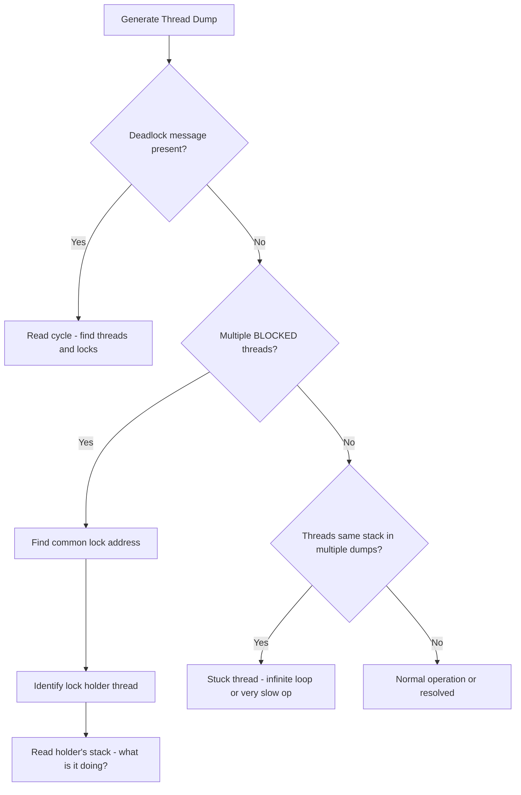

## Keywords in This File
{: .no_toc }

| # | Keyword | Weight |
|---|---|---|
| 1 | [Java Concurrency - L4 Thread Dump Analysis](#java-concurrency---l4-thread-dump-analysis) | medium |

---

# Java Concurrency - L4 Thread Dump Analysis

## Thread Dump Analysis

---

### 🎯 Model Answer

**30 seconds:**
> A thread dump is a snapshot of all threads in a JVM at a specific
> instant - their state, call stacks, and held/waited locks. It is the
> primary diagnostic tool for: deadlock (threads in BLOCKED state with
> lock cycle), thread pool exhaustion (all pool threads in WAITING or
> doing the same operation), performance degradation (hot methods across
> many threads), and application hangs. Generate with `jstack <pid>`,
> `kill -3`, or JFR. Read by finding BLOCKED/WAITING threads and tracing
> their stacks.

**3 minutes (Senior):**
> Thread dump structure: each thread entry shows the thread name, state
> (NEW, RUNNABLE, BLOCKED, WAITING, TIMED_WAITING, TERMINATED), thread
> ID, daemon flag, priority, and the full call stack. Lock annotations
> show `- locked <addr>` (held), `- waiting to lock <addr>` (blocked
> on monitor), `- waiting on <addr>` (in Object.wait()), and `- parking
> to wait for <addr>` (LockSupport.park - used by AQS/ReentrantLock).
>
> Common patterns: (1) All pool threads showing the same call stack =
> all doing the same work (normal) or all stuck (problem). (2) BLOCKED
> threads with a lock cycle = deadlock. (3) Many threads WAITING in
> `ThreadPoolExecutor$Worker.run()` doing `take()` = pool idle. (4) Threads
> in BLOCKED state on `synchronized` = lock contention hot spot.
>
> `jstack` requires the PID and the same user as the JVM process. In
> containers: `kubectl exec -it <pod> -- jstack 1` (PID 1 is usually
> the JVM). JFR captures thread samples continuously without a point-
> in-time snapshot limitation.

**Framework:** WHAT → WHY → HOW → TRADE-OFF → EXAMPLE

*Adapting up:* Discuss automated thread dump analysis tools (IBM Thread
Analyzer, FastThread.io, Samurai), JFR's continuous thread profiling,
and how to correlate thread dumps with GC logs and JVM metrics for
full incident root cause analysis.

*Adapting down:* "A thread dump is like a freeze-frame of all the
workers in a building: you can see what each worker is currently doing,
who is blocked waiting for which door to open, and who is idle waiting
for work."

**Blank Mind Recovery:**

**(1) Restate:** "So you are asking about thread dump analysis - let
me walk through how to generate one, read the thread states, and
identify common problems."

**(2) First principles:** "From first principles: when a JVM hangs or
misbehaves, you need to see what each thread is doing right now. A
thread dump answers that: every thread's current state and call stack,
all in one snapshot."

**(3) Bridge:** "A thread dump is like calling a fire roll - the fire
warden calls out and everyone must respond with their current location.
Threads that don't respond (BLOCKED, WAITING) are the ones to
investigate."

---

### 📘 Concept Explanation

**What it is:**
A thread dump (also called thread snapshot or Java stack trace) is a
point-in-time capture of all threads in a JVM process. It shows each
thread's: name, ID, state, priority, daemon status, OS thread ID,
complete call stack, and lock annotations (held and waited locks).

**The problem it solves:**
When a Java application hangs, slows unexpectedly, or has high CPU
without doing useful work, the thread dump answers: "What is each
thread currently doing?" This identifies: deadlocks, lock contention
hot spots, thread pool exhaustion, infinite loops, and stuck threads.

**Thread states in a dump:**
```
RUNNABLE    - Thread executing or ready to execute
              (includes CPU-bound loops, JNI calls, network I/O)

BLOCKED     - Thread waiting to acquire a synchronized monitor lock
              owned by another thread
              Indicates: lock contention or deadlock

WAITING     - Thread indefinitely waiting (via Object.wait(),
              Thread.join(), or LockSupport.park())
              Indicates: waiting for a signal or task

TIMED_WAITING - Thread waiting with a timeout (Thread.sleep(),
              Object.wait(N), Thread.join(N), LockSupport.parkNanos())
              Normal for pool threads waiting for work

NEW         - Thread created but not yet started
TERMINATED  - Thread completed execution
```

> **Code walkthrough:** This L4 Thread Dump Analysis example demonstrates a key concept in practice using concurrency primitive. **KEY MECHANISM:** the runtime executes these instructions in sequence with specific memory and execution semantics. **WHY IT MATTERS:** misapplying this pattern causes subtle bugs that only manifest under production load. **TAKEAWAY: understand the execution model before using this pattern in production code.**

**Lock annotations in the stack:**
```
- locked <0xABCD> (classname)       - holds this monitor
- waiting to lock <0xABCD>          - blocked on synchronized monitor
- waiting on <0xABCD>               - in Object.wait() on this monitor
- parking to wait for <0xABCD>      - LockSupport.park (AQS/ReentrantLock)
```

> **Code walkthrough:** This L4 Thread Dump Analysis example demonstrates a key concept in practice using concurrency primitive. **KEY MECHANISM:** the runtime executes these instructions in sequence with specific memory and execution semantics. **WHY IT MATTERS:** misapplying this pattern causes subtle bugs that only manifest under production load. **TAKEAWAY: understand the execution model before using this pattern in production code.**

**How to generate:**
```bash
# Using jstack (requires same user as JVM process):
jstack <pid> > thread-dump.txt

# Using kill signal (JVM must not be in container PID namespace):
kill -3 <pid>  # output goes to stderr (usually application log)

# In containers / Kubernetes:
kubectl exec -it <pod> -- jstack 1

# Programmatic (for health endpoints):
ThreadMXBean mx = ManagementFactory.getThreadMXBean();
ThreadInfo[] infos = mx.dumpAllThreads(true, true);

# Using jcmd (Java 7+):
jcmd <pid> Thread.print

# Java Flight Recorder (continuous):
jcmd <pid> JFR.start
jcmd <pid> JFR.dump filename=/tmp/recording.jfr
# Then analyze with JMC (Java Mission Control)
```

> **Code walkthrough:** This Then analyze with JMC (Java Mission Control) example demonstrates shell script pattern using container. **KEY MECHANISM:** the shell executes commands sequentially; pipes pass stdout of one command to stdin of the next. **WHY IT MATTERS:** unquoted variables with spaces cause word splitting - IFS splits the value into multiple arguments. **TAKEAWAY: always double-quote variables: "$VAR"; use [[ ]] instead of [ ] for safer conditionals.**

**Common analysis patterns:**

Pattern 1 - Deadlock:
```plaintext
"Found one Java-level deadlock" section present
Threads in BLOCKED state with circular lock dependency
```

> **Code walkthrough:** This Then analyze with JMC (Java Mission Control) example demonstrates a key concept in practice. **KEY MECHANISM:** the runtime executes these instructions in sequence with specific memory and execution semantics. **WHY IT MATTERS:** misapplying this pattern causes subtle bugs that only manifest under production load. **TAKEAWAY: understand the execution model before using this pattern in production code.**

Pattern 2 - Lock contention:
```
Multiple BLOCKED threads all waiting on the same lock address
One RUNNABLE thread holding that lock with a long stack trace
= hot contention point
```

> **Code walkthrough:** This Then analyze with JMC (Java Mission Control) example demonstrates a key concept in practice. **KEY MECHANISM:** the runtime executes these instructions in sequence with specific memory and execution semantics. **WHY IT MATTERS:** misapplying this pattern causes subtle bugs that only manifest under production load. **TAKEAWAY: understand the execution model before using this pattern in production code.**

Pattern 3 - Thread pool exhaustion:
```plaintext
All pool threads in WAITING at take() = idle (normal)
All pool threads doing the same long operation = busy (may be normal)
All pool threads in BLOCKED or long-running = exhausted
```

> **Code walkthrough:** This Then analyze with JMC (Java Mission Control) example demonstrates a key concept in practice. **KEY MECHANISM:** the runtime executes these instructions in sequence with specific memory and execution semantics. **WHY IT MATTERS:** misapplying this pattern causes subtle bugs that only manifest under production load. **TAKEAWAY: understand the execution model before using this pattern in production code.**

Pattern 4 - Stuck thread:
```
One or few RUNNABLE threads with the same stack trace across
multiple dumps taken seconds apart = thread stuck in a tight loop
or infinite operation
```

> **Code walkthrough:** This Then analyze with JMC (Java Mission Control) example demonstrates a key concept in practice. **KEY MECHANISM:** the runtime executes these instructions in sequence with specific memory and execution semantics. **WHY IT MATTERS:** misapplying this pattern causes subtle bugs that only manifest under production load. **TAKEAWAY: understand the execution model before using this pattern in production code.**

---

### 💻 Code Example

> **Code walkthrough:** The BAD pattern uses System.out to print a threadice. **KEY MECHANISM:** the runtime executes these instructions in sequence with specific memory and execution semantics. **WHY IT MATTERS:** misapplying this pattern causes subtle bugs that only manifest under production load. **TAKEAWAY: understand the execution model before using this pattern in production code.**
> dump, losing the lock annotations. The GOOD pattern uses ThreadMXBean
> to programmatically capture dumps with full lock info. The production
> example shows a health check endpoint that detects deadlocks.

```java
// BAD: manual thread dump via raw getAllStackTraces()
// Missing lock annotations - can't detect deadlocks!
void dumpThreads() {
    for (Map.Entry<Thread, StackTraceElement[]> entry :
            Thread.getAllStackTraces().entrySet()) {
        System.out.printf("Thread %s: %s%n",
            entry.getKey().getName(), entry.getKey().getState());
        for (StackTraceElement e : entry.getValue()) {
            System.out.println("  at " + e);
        }
    }
    // MISSING: lock ownership, monitors held, waiting locks
}
```

> **Code walkthrough:** BAD pattern: This Then analyze with JMC (Java Mission Control) example demonstrates exception handling. **KEY MECHANISM:** the JVM checks catch clauses in order; finally always executes for cleanup. **WHY IT MATTERS:** swallowing exceptions silently hides failures that corrupt downstream state. **WHAT BREAKS: log or rethrow every exception; empty catch blocks are defects.**

```java
// GOOD: full thread dump with lock annotations via ThreadMXBean
void dumpThreadsWithLocks() {
    ThreadMXBean bean = ManagementFactory.getThreadMXBean();
    // true, true = include monitor info and locked synchronizers
    ThreadInfo[] infos = bean.dumpAllThreads(true, true);

    for (ThreadInfo info : infos) {
        System.out.printf(
            "Thread \"%s\" #%d state=%s%n",
            info.getThreadName(), info.getThreadId(),
            info.getThreadState());

        // Held monitors:
        for (MonitorInfo m : info.getLockedMonitors()) {
            System.out.printf("  - locked <0x%x> (%s) at depth %d%n",
                m.getIdentityHashCode(), m.getClassName(),
                m.getLockedStackDepth());
        }

        // Stack trace:
        for (StackTraceElement e : info.getStackTrace()) {
            System.out.println("  at " + e);
        }
    }
}
```

> **Code walkthrough:** GOOD pattern: This Then analyze with JMC (Java Mission Control) example demonstrates metadata declaration. **KEY MECHANISM:** annotations are processed at compile-time or runtime via reflection. **WHY IT MATTERS:** annotation processing adds compile time; runtime reflection disables JIT optimizations. **TAKEAWAY: prefer compile-time annotation processors (APT) over runtime reflection for performance.**

```java
// PRODUCTION: deadlock detection health check
@Component
class DeadlockHealthCheck implements HealthIndicator {
    private final ThreadMXBean threadMXBean =
        ManagementFactory.getThreadMXBean();

    @Override
    public Health health() {
        long[] deadlockedThreads =
            threadMXBean.findDeadlockedThreads();

        if (deadlockedThreads == null) {
            return Health.up()
                .withDetail("status", "No deadlocks detected")
                .build();
        }

        // Deadlock found - collect details
        ThreadInfo[] infos = threadMXBean
            .getThreadInfo(deadlockedThreads);
        StringBuilder details = new StringBuilder();
        for (ThreadInfo info : infos) {
            details.append(info.getThreadName())
                .append(" -> ")
                .append(info.getLockOwnerName())
                .append("; ");
        }
        return Health.down()
            .withDetail("deadlockedThreads", details.toString())
            .withDetail("count", deadlockedThreads.length)
            .build();
    }
}
```

> **Code walkthrough:** This Then analyze with JMC (Java Mission Control) example demonstrates Java API usage using Spring annotation. **KEY MECHANISM:** the JVM compiles to bytecode that runs on the JVM; JIT compiles hot paths to native. **WHY IT MATTERS:** unchecked assumptions about thread safety cause data races under concurrent load. **TAKEAWAY: document thread-safety guarantees on every shared mutable class.**

---

### 🎓 Answers by Seniority

**Junior / Mid (0-5 years):**
> A thread dump is a snapshot of all threads showing what each is
> currently doing. Generate it with `jstack <pid>`. Look for the thread
> state: BLOCKED = waiting for a lock (possible deadlock), WAITING =
> waiting for a signal, RUNNABLE = running. The stack trace shows exactly
> what the thread is executing. Look for "Found one Java-level deadlock"
> at the top for deadlocks. Compare multiple dumps taken a few seconds
> apart to find stuck threads (same stack across multiple dumps = stuck).

*Push deeper:* How do you identify lock contention (not deadlock but
performance degradation) from a thread dump?

---

**Senior / Staff (5+ years):**
> Thread dump analysis is my go-to for production hangs and performance
> issues. Key techniques: (1) Take 3+ dumps 5 seconds apart - comparing
> across time reveals stuck threads (same stack) vs. active threads
> (different stacks). (2) For lock contention: grep for "BLOCKED" and
> the lock address - if many threads block on the same address, that's
> the hot lock. (3) For thread pool exhaustion: count pool threads in
> different states. (4) For CPU spikes with no useful work: look for
> RUNNABLE threads in tight loops (stack shows same method repeatedly).
> I integrate `ThreadMXBean.findDeadlockedThreads()` into production
> health checks to get proactive detection.

*Push deeper:* How does JFR's continuous thread profiling differ from
a point-in-time thread dump for diagnosing intermittent issues?

---

### ⚠️ Common Misconceptions

**Misconception 1: "RUNNABLE means the thread is doing useful work."**
RUNNABLE means the thread is not blocked on a lock or in `wait()`.
It could be in a tight infinite loop, executing JNI code, doing
network I/O (Java considers blocking socket I/O as RUNNABLE!), or
actively executing. A RUNNABLE thread on a blocking I/O call appears
the same as one computing prime numbers.

**Misconception 2: "One thread dump is enough to diagnose a problem."**
A single dump is a point-in-time snapshot. A thread may appear RUNNABLE
in one dump but be stuck in an infinite loop (takes multiple dumps
to confirm). Transient contention may not appear in a single dump.
Best practice: take 3-5 dumps, 5-10 seconds apart.

**Misconception 3: "WAITING threads are always a problem."**
Thread pool threads spend most of their time in TIMED_WAITING (waiting
for new tasks in the queue). This is correct and expected behavior.
WAITING is a problem when: a thread has been waiting for an unexpectedly
long time, or an unusual number of threads are waiting on the same
object.

---

### 🚨 Failure Modes and Diagnosis

**Failure 1: Thread dump unreadable due to no thread names**
Symptom: hundreds of threads named `Thread-0`, `Thread-1`, etc.
No context for what each thread does.
Cause: thread pools created without `ThreadFactory` that names threads.
Fix: always name thread pools:
```java
ThreadFactory factory = new ThreadFactoryBuilder()
    .setNameFormat("payment-processor-%d")
    .build();
ExecutorService pool = Executors.newFixedThreadPool(10, factory);
```
> **Code walkthrough:** This Unknown example demonstrates thread pool management using thread pool. **KEY MECHANISM:** the pool maintains a work queue; submitted tasks block until a thread is free. **WHY IT MATTERS:** unconfigured pool sizes exhaust threads under load or waste memory at rest. **TAKEAWAY: always name threads and bound queue size to detect saturation.**

Thread name appears in dumps as "payment-processor-0", making
correlation to code much easier.

**Failure 2: jstack fails with "Unable to open socket file"**
Symptom: `jstack <pid>` returns error about permissions or attachment.
Cause: different user running jstack vs JVM process; or JVM in
a container without jstack installed.
Fix: `sudo -u appuser jstack <pid>` or `kubectl exec` into the
container, or use `/proc/<pid>/fd` trick for root access.

**Failure 3: Thread dump not capturing the right moment**
Symptom: dump looks normal (all threads active, no deadlock) but the
application is hung.
Cause: the hung state is transient (resolved by the time jstack ran),
or the application appears hung due to GC pause (threads in "VM Thread"
doing GC).
Fix: look for "VM Thread" doing GC in the dump; check GC logs for
stop-the-world pauses. Take multiple dumps rapidly to catch the state.

---

### 🎯 Interview Deep-Dive

| Question Category | Time to Answer |
|---|---|
| Definition | 60 seconds |
| Generation | 2-3 minutes |
| Thread states | 3-4 minutes |
| Reading a dump | 3-4 minutes |
| Deadlock detection | 3-4 minutes |
| Contention analysis | 3-4 minutes |
| Thread pool diagnosis | 3-4 minutes |
| JFR comparison | 2-3 minutes |
| Naming | 2-3 minutes |
| Production workflow | 3-4 minutes |
| Multiple dumps | 2-3 minutes |
| Automation | 2-3 minutes |

---

**Q1 (Definition): What information does a thread dump contain and
when do you use it?**

A: A thread dump contains, for each thread:
- Thread name, ID, OS native ID (hex)
- Thread state: RUNNABLE, BLOCKED, WAITING, TIMED_WAITING
- Thread priority and daemon flag
- Complete call stack (most recent frame first)
- Lock annotations: monitors held, monitors waited, LockSupport parkers

Use a thread dump when:
- Application is hanging / unresponsive
- Service response time suddenly increased
- CPU is high but throughput is low
- Deadlock suspected (health check reported it)
- Thread pool appears exhausted

Thread dump versus heap dump:
- Thread dump: "what is each thread doing RIGHT NOW" - for behavior issues
- Heap dump: "what objects are in memory" - for memory/OOM issues

Thread dump versus profiler:
- Thread dump: single point-in-time snapshot (or a few over seconds)
- Profiler (async-profiler, JFR): continuous sampling over minutes/hours,
  statistical aggregation of where threads spend time

*What separates good from great:* Thread dumps are best for diagnosing
"stuck" states (deadlock, contention, exhaustion). For "too slow" issues
(where nothing is stuck but throughput is below expectations), a profiler
is better - it shows WHERE time is being spent over a period, not just
at one instant.

---

**Q2 (Generation): Walk through all methods to generate a thread dump.**

A: Methods in order of availability and detail:

**1. jstack (most common):**
```bash
jstack <pid>          # to stdout
jstack -l <pid>       # with extra lock info (-l flag)
jstack -F <pid>       # force attach (if JVM not responding)
```
> **Code walkthrough:** This Unknown example demonstrates shell script pattern. **KEY MECHANISM:** the shell executes commands sequentially; pipes pass stdout of one command to stdin of the next. **WHY IT MATTERS:** unquoted variables with spaces cause word splitting - IFS splits the value into multiple arguments. **TAKEAWAY: always double-quote variables: "$VAR"; use [[ ]] instead of [ ] for safer conditionals.**

Note: `-F` may fail to show lock info in some JVM versions.

**2. jcmd (Java 7+, preferred over jstack):**
```bash
jcmd <pid> Thread.print              # basic
jcmd <pid> Thread.print -l true      # with lock info
```

> **Code walkthrough:** This Unknown example demonstrates shell script pattern. **KEY MECHANISM:** the shell executes commands sequentially; pipes pass stdout of one command to stdin of the next. **WHY IT MATTERS:** unquoted variables with spaces cause word splitting - IFS splits the value into multiple arguments. **TAKEAWAY: always double-quote variables: "$VAR"; use [[ ]] instead of [ ] for safer conditionals.**

**3. kill -3 / SIGQUIT (Linux/Mac):**
```bash
kill -3 <pid>  # JVM prints dump to stderr (application log)
```
> **Code walkthrough:** This Unknown example demonstrates shell script pattern. **KEY MECHANISM:** the shell executes commands sequentially; pipes pass stdout of one command to stdin of the next. **WHY IT MATTERS:** unquoted variables with spaces cause word splitting - IFS splits the value into multiple arguments. **TAKEAWAY: always double-quote variables: "$VAR"; use [[ ]] instead of [ ] for safer conditionals.**

Useful when jstack is not available in the container.

**4. JMX / Programmatic:**
```java
ThreadMXBean bean = ManagementFactory.getThreadMXBean();
ThreadInfo[] ti = bean.dumpAllThreads(true, true);
```
> **Code walkthrough:** This Unknown example demonstrates Java API usage. **KEY MECHANISM:** the JVM compiles to bytecode that runs on the JVM; JIT compiles hot paths to native. **WHY IT MATTERS:** unchecked assumptions about thread safety cause data races under concurrent load. **TAKEAWAY: document thread-safety guarantees on every shared mutable class.**

Exposes via HTTP `/threaddump` endpoint (Spring Actuator: `/actuator/threaddump`).

**5. Java Flight Recorder:**
```bash
jcmd <pid> JFR.start name=diagnosis duration=60s filename=/tmp/r.jfr
# Then open with Java Mission Control (JMC)
```
> **Code walkthrough:** This Then open with Java Mission Control (JMC) example demonstrates shell script pattern. **KEY MECHANISM:** the shell executes commands sequentially; pipes pass stdout of one command to stdin of the next. **WHY IT MATTERS:** unquoted variables with spaces cause word splitting - IFS splits the value into multiple arguments. **TAKEAWAY: always double-quote variables: "$VAR"; use [[ ]] instead of [ ] for safer conditionals.**

Captures continuous thread samples, not just a snapshot.

**6. VisualVM / JConsole:**
GUI tools with "Thread Dump" button. Requires JMX connectivity.

**Comparison:**
| Method | Lock info | Container | Continuous | Overhead |
|---|---|---|---|---|
| jstack | Yes | Need pid | No | None |
| kill -3 | Yes | Yes | No | None |
| JMX | Yes | Yes (port) | No | Minimal |
| JFR | Statistical | Yes | Yes | 1-2% |

*What separates good from great:* In containerized environments, `jstack`
often fails due to PID namespace isolation. The reliable approach:
`kubectl exec -it <pod-name> -- sh -c "jcmd 1 Thread.print"` (if JDK
is in the image) or use the Spring Actuator `/actuator/threaddump`
endpoint (no JDK tools needed at all).

---

**Q3 (Thread states): What does each thread state indicate and what
are the common causes?**

A: Thread state guide:

**RUNNABLE:**
Thread executing or eligible to run. Does NOT mean useful work.
Could be: executing code, blocked on I/O (socket read/write, file),
in JNI call, spinning in a loop.
Diagnosis: multiple RUNNABLE threads with identical stacks = possible
loop or hot contention. RUNNABLE threads with I/O calls = I/O may
be the bottleneck.

**BLOCKED:**
Thread waiting to acquire a `synchronized` monitor owned by another.
The critical state for lock analysis. Shows `- waiting to lock <addr>`.
Cause: high lock contention or deadlock.
Action: find which thread holds the lock (look for `- locked <addr>`).

**WAITING:**
Thread waiting indefinitely for a signal:
- `Object.wait()` without timeout
- `Thread.join()` (waiting for another thread to finish)
- `LockSupport.park()` (used by ReentrantLock, Semaphore, etc.)
Stack will show `sun.misc.Unsafe.park()` or `Object.wait()`.
Normal for: threads waiting for work from a queue.
Abnormal: if a thread has been WAITING for an unreasonably long time
or no thread ever signals it.

**TIMED_WAITING:**
Thread waiting with a timeout:
- `Thread.sleep(N)`
- `Object.wait(N)`
- `Thread.join(N)`
- `LockSupport.parkNanos()`
Normal for: pool threads waiting for tasks (`take()`), scheduled tasks.
Abnormal: if all pool threads are in TIMED_WAITING with identical stacks
indicating they're all sleeping and not processing.

**NEW / TERMINATED:**
Rarely seen in dumps (transitions are fast). If many NEW threads: threads
being created but not started quickly enough. TERMINATED: thread ended
but not yet GC'd (unusual).

*What separates good from great:* The RUNNABLE state for I/O operations
is a common confusion. Java classifies socket I/O (NIO non-blocking or
old blocking) as RUNNABLE even though the thread is blocking at the OS
level. To distinguish I/O blocking from CPU work: look at the stack -
`java.net.SocketInputStream.socketRead0()` or `sun.nio.ch.FileDispatcher.read0()`
indicates I/O blocking.

---

**Q4 (Reading a dump): Walk through reading a typical thread dump entry.**

A: Sample thread dump entry (annotated):

```plaintext
"http-nio-8080-exec-1"           <- Thread name
  #62                            <- Thread number
  daemon                         <- Is a daemon thread
  prio=5                         <- Priority (1-10, 5=normal)
  os_prio=0                      <- OS thread priority
  cpu=234.50ms                   <- CPU time used since start
  elapsed=3600.10s               <- Thread age
  tid=0x00007f8a5c001000         <- JVM thread ID
  nid=0x3d50                     <- Native OS thread ID (hex)
  waiting for monitor entry      <- Why it's blocked
  [0x00007f8a50dff000]           <- Thread stack top address

java.lang.Thread.State: BLOCKED  <- Java state

  at com.app.PaymentService.process(PaymentService.java:45)
  - waiting to lock <0x000000076ab3c5d8>  <- Lock it WANTS
    (a java.util.concurrent.locks.ReentrantLock$NonfairSync)
  at com.app.OrderController.checkout(OrderController.java:89)
  at ...

Locked ownable synchronizers:   <- Locks THIS thread holds
  - <0x000000076ab3c5e0> (a java.util.concurrent.locks.ReentrantLock$NonfairSync)
```

> **Code walkthrough:** This Then open with Java Mission Control (JMC) example demonstrates a key concept in practice using concurrency primitive. **KEY MECHANISM:** the runtime executes these instructions in sequence with specific memory and execution semantics. **WHY IT MATTERS:** misapplying this pattern causes subtle bugs that only manifest under production load. **TAKEAWAY: understand the execution model before using this pattern in production code.**

Key fields to read:
1. Thread name: identifies the thread's role (from thread pool factory name)
2. State: BLOCKED, WAITING, RUNNABLE, etc.
3. `- waiting to lock <addr>`: the lock this thread wants
4. Find `- locked <addr>` in ANOTHER thread: that's the holder
5. "Locked ownable synchronizers": ReentrantLock and other AQS-based locks
   this thread currently holds

For synchronized blocks vs ReentrantLock:
- `- waiting to lock` / `- locked` = synchronized monitor
- `- parking to wait for` / "Locked ownable synchronizers" = ReentrantLock/AQS

*What separates good from great:* The native thread ID (nid) in hex can
be correlated to CPU usage in `top -H -p <pid>` (show threads). Convert
hex to decimal: `nid=0x3d50 = 15696 in decimal`. Then `top -H -p <pid>`:
the thread with TID 15696 consuming 100% CPU is the thread to investigate.
This correlates CPU hot spots to specific code paths.

---

**Q5 (Deadlock detection): Find and diagnose deadlock from a thread dump.**

A: Deadlock detection in a dump:

Step 1: Look for "Found one Java-level deadlock" at the top.
If present, the JVM has automatically detected the cycle.

Step 2: If the JVM detection message is absent (it only covers
`synchronized` monitors, not ReentrantLock by default), look for:
- Multiple BLOCKED threads
- Each waiting for a lock held by another waiting thread

Step 3: Read the cycle.

Example dump (simplified):
```
"Thread-A" State: BLOCKED
  at MyClass.method1(MyClass.java:25)
  - waiting to lock <0xAAA> (Lock2)
  - locked <0xBBB> (Lock1)          <- holds Lock1

"Thread-B" State: BLOCKED
  at MyClass.method2(MyClass.java:40)
  - waiting to lock <0xBBB> (Lock1) <- wants Lock1 (held by Thread-A)
  - locked <0xAAA> (Lock2)          <- holds Lock2
```

> **Code walkthrough:** This Then open with Java Mission Control (JMC) example demonstrates a key concept in practice. **KEY MECHANISM:** the runtime executes these instructions in sequence with specific memory and execution semantics. **WHY IT MATTERS:** misapplying this pattern causes subtle bugs that only manifest under production load. **TAKEAWAY: understand the execution model before using this pattern in production code.**

Cycle: Thread-A holds 0xBBB (Lock1), wants 0xAAA (Lock2).
Thread-B holds 0xAAA (Lock2), wants 0xBBB (Lock1). Deadlock.

**For ReentrantLock (not in auto-detection by default):**
Use `jstack -l` or `jcmd Thread.print -l true` to include
"Locked ownable synchronizers" section. Then manually trace the cycle.
Or enable: `ManagementFactory.getThreadMXBean().findDeadlockedThreads()`
which finds both synchronized AND ReentrantLock deadlocks.

*What separates good from great:* The auto-detection only works for
Java monitor deadlocks. ReentrantLock deadlocks require the `-l` flag
or `findDeadlockedThreads()`. In production, use the MXBean API in a
health check - it covers both types.

---

**Q6 (Contention analysis): How do you identify lock contention (not
deadlock) from a thread dump?**

A: Lock contention pattern: many BLOCKED threads waiting on the SAME lock.

Steps:
1. Filter for BLOCKED threads:
```bash
grep -A 5 "State: BLOCKED" thread-dump.txt
```

> **Code walkthrough:** This Then open with Java Mission Control (JMC) example demonstrates shell script pattern. **KEY MECHANISM:** the shell executes commands sequentially; pipes pass stdout of one command to stdin of the next. **WHY IT MATTERS:** unquoted variables with spaces cause word splitting - IFS splits the value into multiple arguments. **TAKEAWAY: always double-quote variables: "$VAR"; use [[ ]] instead of [ ] for safer conditionals.**

2. Find the hot lock address: look for a lock address that appears
   multiple times in `- waiting to lock <addr>` lines.
```bash
grep "waiting to lock" thread-dump.txt | sort | uniq -c | sort -rn
```
> **Code walkthrough:** This Then open with Java Mission Control (JMC) example demonstrates shell script pattern. **KEY MECHANISM:** the shell executes commands sequentially; pipes pass stdout of one command to stdin of the next. **WHY IT MATTERS:** unquoted variables with spaces cause word splitting - IFS splits the value into multiple arguments. **TAKEAWAY: always double-quote variables: "$VAR"; use [[ ]] instead of [ ] for safer conditionals.**

High count for a specific address = hot lock.

3. Find the holder: search for `- locked <hot-addr>` in the dump.
   The thread with `- locked <addr>` is the lock holder. Its stack
   tells you what's holding the lock for so long.

4. Measure the extent:
- 3 threads waiting on 1 lock in a dump = minor contention
- 30 threads waiting on 1 lock = severe contention, needs fixing

Fix options:
- Reduce lock scope (smaller critical section)
- Lock striping (different lock for different data subsets)
- Replace synchronized with ConcurrentHashMap, LongAdder, etc.
- Read-write lock if reads dominate

*What separates good from great:* A single thread dump shows a snapshot.
For contention analysis, compare multiple dumps. If the same lock always
appears with 5+ threads waiting, it's consistently hot. If it appears
once and never again, it was a transient burst. JFR's `jdk.JavaMonitorEnter`
event tracks lock acquisition with blocking time, making contention
analysis much more reliable than point-in-time dumps.

---

**Q7 (Thread pool diagnosis): How do you diagnose thread pool exhaustion?**

A: Symptoms of thread pool exhaustion:
- Queue depth grows
- Response times increase
- New requests rejected (RejectedExecutionException)
- Pool threads stuck in long operations

Diagnosis from thread dump:
```bash
# Count threads in each pool by name:
grep "pool-name-" thread-dump.txt | grep "State:" | \
  awk '{print $NF}' | sort | uniq -c

# Example output:
# 20 RUNNABLE     <- all 20 threads active
# 0 WAITING       <- none idle = pool exhausted
```

> **Code walkthrough:** This 0 WAITING       <- none idle = pool exhausted example demonstrates shell script pattern. **KEY MECHANISM:** the shell executes commands sequentially; pipes pass stdout of one command to stdin of the next. **WHY IT MATTERS:** unquoted variables with spaces cause word splitting - IFS splits the value into multiple arguments. **TAKEAWAY: always double-quote variables: "$VAR"; use [[ ]] instead of [ ] for safer conditionals.**

If all pool threads are RUNNABLE, examine what they're doing:
- All in the same method = possibly stuck (same stack in multiple dumps)
- All in different methods = genuinely processing (may need more threads)
- All in I/O operations = I/O bound pool, undersized for I/O concurrency

Compare two dumps 5 seconds apart:
- If stacks progressed (different frames) = threads are active
- If stacks identical = threads stuck

Thread pool sizing signal from dumps:
- All threads WAITING in `take()` = pool oversized (reduce for efficiency)
- All threads RUNNABLE = pool at capacity (may be fine or may need expansion)
- Some WAITING, some RUNNABLE = good utilization

*What separates good from great:* Thread dump shows state at one moment.
For pool exhaustion diagnosis, correlate with metrics: `ThreadPoolExecutor`
exposes `getActiveCount()`, `getQueue().size()`, `getCompletedTaskCount()`.
Expose these via Micrometer/Prometheus. A rising queue size with stable
active count = pool workers stuck. A rising queue size with rising active
count = pool correctly sized but workload exceeds capacity (needs scaling).

---

**Q8 (JFR comparison): How does JFR differ from thread dumps for
diagnosing concurrency issues?**

A: Thread dumps and JFR serve different diagnostic needs:

**Thread dump:**
- Point-in-time snapshot (or a few snapshots taken manually)
- Complete: shows ALL threads and their full stacks
- Latency: zero overhead (no sampling, no impact on production)
- Limitation: misses intermittent states; must be taken at the right moment

**Java Flight Recorder (JFR):**
- Continuous sampling over time (seconds to hours)
- Statistical: periodic sampling of thread states (not exhaustive at
  each sample)
- Events: specific JFR events capture precise lock acquisition data:
  - `jdk.JavaMonitorEnter`: each synchronized block entry + blocking time
  - `jdk.JavaMonitorWait`: Object.wait() calls with duration
  - `jdk.ThreadPark`: LockSupport.park() calls
  - `jdk.ThreadSleep`: Thread.sleep() calls
- Overhead: ~1-2% CPU (acceptable in production)
- Best for: finding intermittent lock contention, thread behavior
  over time, identifying the slowest lock acquisitions

Example JFR commands:
```bash
# Start JFR recording:
jcmd <pid> JFR.start name=profiling duration=120s \
  filename=/tmp/profiling.jfr settings=profile

# Dump when issue observed:
jcmd <pid> JFR.dump filename=/tmp/dump-$(date +%s).jfr

# Analyze: open with Java Mission Control (JMC) or:
jfr print --events jdk.JavaMonitorEnter /tmp/dump.jfr | head -100
```

> **Code walkthrough:** This Analyze: open with Java Mission Control (JMC) or: example demonstrates shell script pattern. **KEY MECHANISM:** the shell executes commands sequentially; pipes pass stdout of one command to stdin of the next. **WHY IT MATTERS:** unquoted variables with spaces cause word splitting - IFS splits the value into multiple arguments. **TAKEAWAY: always double-quote variables: "$VAR"; use [[ ]] instead of [ ] for safer conditionals.**

Recommendation:
- Production outage (hang / deadlock): thread dump (immediate, zero impact)
- Performance investigation (slow lock): JFR (statistical, time-bounded)
- Intermittent contention: JFR always-on with 1-5 minute rolling buffer

*What separates good from great:* JFR's always-on recording with a
rolling buffer is the production gold standard. Configure:
`-XX:StartFlightRecording=dumponexit=true,filename=/var/log/jfr/recording.jfr,
settings=default,duration=0`. When an incident occurs, the recording
contains the last N minutes of data, including the moments before the
incident. Thread dumps require you to take action WHILE the problem
is occurring - JFR captures the evidence retrospectively.

---

**Q9 (Naming): Why is thread naming important and what's the convention?**

A: Thread names appear directly in thread dumps. Without descriptive
names, you cannot correlate a stuck thread in a dump to a specific
component in the code.

```
# Unnamed pool (unhelpful dump):
"pool-3-thread-14" state=BLOCKED waiting to lock <0xABC>
"pool-3-thread-7" state=BLOCKED waiting to lock <0xABC>
# Which pool? Which service? Unknown.

# Named pool (helpful dump):
"payment-processor-14" state=BLOCKED waiting to lock <0xABC>
"payment-processor-7" state=BLOCKED waiting to lock <0xABC>
# Immediately: payment processor has a lock contention problem
```

> **Code walkthrough:** This Immediately: payment processor has a lock contention problem example demonstrates a key concept in practice. **KEY MECHANISM:** the runtime executes these instructions in sequence with specific memory and execution semantics. **WHY IT MATTERS:** misapplying this pattern causes subtle bugs that only manifest under production load. **TAKEAWAY: understand the execution model before using this pattern in production code.**

Naming convention:
```java
// Use ThreadFactory with descriptive names:
ThreadFactory factory = r -> {
    Thread t = new Thread(r, "payment-processor-" + counter.incrementAndGet());
    t.setDaemon(true); // optional: don't prevent JVM shutdown
    return t;
};
ExecutorService pool = new ThreadPoolExecutor(
    10, 20, 60, SECONDS, new LinkedBlockingQueue<>(1000), factory);

// With Guava ThreadFactoryBuilder:
ThreadFactory factory = new ThreadFactoryBuilder()
    .setNameFormat("user-cache-refresher-%d")
    .setDaemon(true)
    .build();

// For virtual threads (Java 21):
Thread.ofVirtual()
    .name("order-handler-", 0)  // order-handler-0, order-handler-1, ...
    .factory();
```

> **Code walkthrough:** This Immediately: payment processor has a lock contention problem example demonstrates thread pool management using thread pool. **KEY MECHANISM:** the pool maintains a work queue; submitted tasks block until a thread is free. **WHY IT MATTERS:** unconfigured pool sizes exhaust threads under load or waste memory at rest. **TAKEAWAY: always name threads and bound queue size to detect saturation.**

System threads to recognize in dumps:
- `"main"`: the main application thread
- `"GC task thread"`: garbage collector threads
- `"Finalizer"`: finalization thread
- `"Reference Handler"`: weak/soft/phantom reference processing
- `"Signal Dispatcher"`: OS signal handling

*What separates good from great:* Include operation context in thread
names dynamically. Frameworks like Spring set the thread name to the
current request path, so a dump shows `"http-exec-5 (processing /api/payment)"`.
With Servlet containers, you can use the built-in naming or set it
programmatically: `Thread.currentThread().setName("req-" + requestId)` -
remove the context at request end.

---

**Q10 (Production workflow): Walk through a production hang investigation
using thread dumps.**

A: Production hang investigation workflow:

**Step 1: Confirm the hang.**
Health check failing? Connection pool timeout errors? Response time
P99 exploded? Log lines stopped appearing?

**Step 2: Take 3 thread dumps, 5 seconds apart.**
```bash
for i in 1 2 3; do
    jstack <pid> > /tmp/dump-$i-$(date +%s).txt
    echo "Dump $i taken"
    sleep 5
done
```

> **Code walkthrough:** This Immediately: payment processor has a lock contention problem example demonstrates shell script pattern. **KEY MECHANISM:** the shell executes commands sequentially; pipes pass stdout of one command to stdin of the next. **WHY IT MATTERS:** unquoted variables with spaces cause word splitting - IFS splits the value into multiple arguments. **TAKEAWAY: always double-quote variables: "$VAR"; use [[ ]] instead of [ ] for safer conditionals.**

**Step 3: Quick scan - deadlock first.**
```bash
grep -l "deadlock" /tmp/dump-*.txt
grep "Found one Java-level deadlock" /tmp/dump-*.txt
```

> **Code walkthrough:** This Immediately: payment processor has a lock contention problem example demonstrates shell script pattern. **KEY MECHANISM:** the shell executes commands sequentially; pipes pass stdout of one command to stdin of the next. **WHY IT MATTERS:** unquoted variables with spaces cause word splitting - IFS splits the value into multiple arguments. **TAKEAWAY: always double-quote variables: "$VAR"; use [[ ]] instead of [ ] for safer conditionals.**

**Step 4: Count threads per state.**
```bash
for f in /tmp/dump-*.txt; do
    echo "=== $f ==="
    grep "State:" $f | sort | uniq -c | sort -rn
done
```

> **Code walkthrough:** This Immediately: payment processor has a lock contention problem example demonstrates shell script pattern. **KEY MECHANISM:** the shell executes commands sequentially; pipes pass stdout of one command to stdin of the next. **WHY IT MATTERS:** unquoted variables with spaces cause word splitting - IFS splits the value into multiple arguments. **TAKEAWAY: always double-quote variables: "$VAR"; use [[ ]] instead of [ ] for safer conditionals.**

**Step 5: Identify hot BLOCKED threads.**
```bash
grep -h "waiting to lock" /tmp/dump-*.txt | sort | uniq -c | sort -rn
# Frequent lock address = hot contention point
```

> **Code walkthrough:** This Frequent lock address = hot contention point example demonstrates shell script pattern. **KEY MECHANISM:** the shell executes commands sequentially; pipes pass stdout of one command to stdin of the next. **WHY IT MATTERS:** unquoted variables with spaces cause word splitting - IFS splits the value into multiple arguments. **TAKEAWAY: always double-quote variables: "$VAR"; use [[ ]] instead of [ ] for safer conditionals.**

**Step 6: Find locked threads (not progressing across dumps).**
```bash
diff /tmp/dump-1*.txt /tmp/dump-3*.txt | grep -A 3 "Thread"
# Threads with identical stacks across 10 seconds = stuck
```

> **Code walkthrough:** This Threads with identical stacks across 10 seconds = sice. **KEY MECHANISM:** the runtime executes these instructions in sequence with specific memory and execution semantics. **WHY IT MATTERS:** misapplying this pattern causes subtle bugs that only manifest under production load. **TAKEAWAY: understand the execution model before using this pattern in production code.**

**Step 7: Correlate with metrics.**
- CPU high: look for RUNNABLE threads in compute loops
- CPU low: look for BLOCKED/WAITING threads not working
- Queue growing: check pool threads (RUNNABLE or WAITING?)

**Step 8: If deadlock confirmed:** restart the application (rolling if
possible). Fix the lock ordering afterward.

*What separates good from great:* Automate this workflow. A script that
takes 5 dumps at 2-second intervals, formats them, and emails/Slacks
the results on `PagerDuty` alert fire reduces MTTR from minutes to
seconds. The hardest part of incident response is doing the right
thing calmly under pressure - automation removes that burden.

---

**Q11 (Multiple dumps): Why do you need multiple thread dumps?**

A: A single thread dump is a one-frame movie. Problems require the
full picture over time.

**Problem 1 - Transient vs persistent BLOCKED state:**
One dump: 5 threads BLOCKED on payment lock.
Could be: momentary contention (5 threads arrived simultaneously,
cleared in < 1 second) OR persistent deadlock.
Multiple dumps: if the same 5 threads are BLOCKED on the same lock
across 3 dumps 5 seconds apart → persistent, likely deadlock.
If different threads appear BLOCKED each time → transient contention.

**Problem 2 - Stuck RUNNABLE thread:**
One dump: one thread RUNNABLE with a specific stack.
Could be: normal execution of that method OR infinite loop stuck there.
Multiple dumps: same stack frame across 3 dumps at identical line
= stuck (infinite loop or very long operation).

**Problem 3 - Transient event missed:**
If the incident lasts < 1 second: a single dump taken 3 seconds too
late misses it. Multiple dumps increase the probability of catching
the state. JFR continuous recording is the solution for very short
transient events.

Standard practice: minimum 3 dumps, 5-10 seconds apart.

*What separates good from great:* Script for rapid repeated dumps:
```bash
#!/bin/bash
PID=$1
INTERVAL=${2:-5}
COUNT=${3:-5}
for i in $(seq 1 $COUNT); do
    TIMESTAMP=$(date +%Y%m%d_%H%M%S)
    jstack $PID > /tmp/threaddump_${i}_${TIMESTAMP}.txt
    echo "Dump $i taken at $TIMESTAMP"
    [ $i -lt $COUNT ] && sleep $INTERVAL
done
echo "All dumps in /tmp/threaddump_*.txt"
```
> **Code walkthrough:** This Threads with identical stacks across 10 seconds = sice. **KEY MECHANISM:** the runtime executes these instructions in sequence with specific memory and execution semantics. **WHY IT MATTERS:** misapplying this pattern causes subtle bugs that only manifest under production load. **TAKEAWAY: understand the execution model before using this pattern in production code.**

Add to the JVM startup classpath as a diagnostic utility.

---

**Q12 (Automation): How do you automate thread dump capture and analysis?**

A: Automated thread dump capture for production:

**Trigger on health check failure:**
```java
@Scheduled(fixedRate = 30_000)
void detectDeadlock() {
    long[] deadlocked = threadMXBean.findDeadlockedThreads();
    if (deadlocked != null) {
        // Capture full dump:
        ThreadInfo[] infos = threadMXBean
            .dumpAllThreads(true, true);
        String dump = formatDump(infos);

        // Alert + dump storage:
        alertService.sendCritical("DEADLOCK DETECTED", dump);
        writeToFile("/var/log/jvm/deadlock-" + Instant.now() + ".txt",
            dump);
    }
}
```

> **Code walkthrough:** This Threads with identical stacks across 10 seconds = stuck example demonstrates Java API usage. **KEY MECHANISM:** the JVM compiles to bytecode that runs on the JVM; JIT compiles hot paths to native. **WHY IT MATTERS:** unchecked assumptions about thread safety cause data races under concurrent load. **TAKEAWAY: document thread-safety guarantees on every shared mutable class.**

**Integrate with Spring Actuator:**
Spring Boot Actuator exposes `/actuator/threaddump` endpoint.
Use it for on-demand dumps from monitoring systems.

**Automated analysis with fastthread.io or IBM TMDA:**
Programmatic analysis of dump files to extract patterns.

**JFR always-on:**
```java
// Start JFR at application startup for continuous profiling:
@PostConstruct
void startJfr() {
    try {
        Recording r = new Recording();
        r.enable("jdk.JavaMonitorEnter").withThreshold(Duration.ofMillis(10));
        r.enable("jdk.ThreadSleep");
        r.enable("jdk.ThreadPark");
        r.setMaxAge(Duration.ofMinutes(5)); // rolling 5-min buffer
        r.start();
    } catch (Exception e) {
        log.warn("JFR startup failed", e);
    }
}
```

> **Code walkthrough:** This Threads with identical stacks across 10 seconds = stuck example demonstrates exception handling using error handling. **KEY MECHANISM:** the JVM checks catch clauses in order; finally always executes for cleanup. **WHY IT MATTERS:** swallowing exceptions silently hides failures that corrupt downstream state. **TAKEAWAY: log or rethrow every exception; empty catch blocks are defects.**

*What separates good from great:* JFR's low overhead (1-2%) combined
with a rolling buffer means it is safe to run 24/7 in production.
When an incident occurs, the JFR recording already contains the
evidence from before the incident - no need to trigger anything at the
right moment. The recording can be dumped post-incident for analysis,
even after recovery.

---

### ⚖️ Comparison Table

| Tool | Type | Overhead | Coverage | Best For |
|---|---|---|---|---|
| jstack | Point-in-time | Zero | All threads | Hangs, deadlocks |
| kill -3 | Point-in-time | Zero | All threads | Containers without JDK tools |
| Spring Actuator | On-demand | Zero | All threads | REST-accessible dumps |
| JFR | Continuous | 1-2% | Sampled + events | Intermittent contention |
| async-profiler | Continuous | 2-5% | Sampled | CPU hot spots |
| JVisualVM | GUI/on-demand | Low | All threads | Interactive debugging |

**The deciding factor:**
Production hang: jstack (zero overhead, immediate).
Intermittent performance: JFR always-on.
Container without JDK: Spring Actuator or kill -3.

---

### 🏛️ System Design

**Observability stack for JVM thread monitoring:**

```
Application JVM
  |-- JFR always-on (1-2% overhead)
  |   Rolling 5-min buffer
  |   Events: MonitorEnter, ThreadPark, GC pauses
  |
  |-- Micrometer metrics -> Prometheus
  |   thread.pool.active, thread.pool.queue
  |   deadlocked.threads (gauge from ThreadMXBean)
  |
  |-- Spring Actuator /actuator/threaddump
      On-demand via HTTP

Alerting:
  deadlocked.threads > 0 -> PagerDuty -> auto-capture JFR dump
  thread.pool.queue > 1000 -> Slack warning
  
Analysis:
  JFR dumps -> Java Mission Control (JMC)
  Thread dumps -> FastThread.io / Samurai
```

> **Code walkthrough:** This Threads with identical stacks across 10 seconds = sice. **KEY MECHANISM:** the runtime executes these instructions in sequence with specific memory and execution semantics. **WHY IT MATTERS:** misapplying this pattern causes subtle bugs that only manifest under production load. **TAKEAWAY: understand the execution model before using this pattern in production code.**

---

### 📊 Diagram

```
Thread Dump Structure:

"thread-name" #id state=BLOCKED
  at Class.method(File.java:line)   <- top of stack = WHERE it is
  - waiting to lock <0xABC>         <- blocked on this monitor
  at Class.caller(File.java:line)
  - locked <0xDEF>                  <- holds this monitor

Relationships to find deadlock:
  Thread A: waiting to lock <X>, locked <Y>
  Thread B: waiting to lock <Y>, locked <X>
  -> DEADLOCK: cycle A->X->B->Y->A
```



> **Diagram walkthrough:** Thread dump analysis follows a decision tree.
> First check for the JVM's auto-detected deadlock message - if found,
> trace the cycle. If not, search for BLOCKED threads and find a common
> waited-on lock address. The holder of that lock (found by `- locked <addr>`)
> is the bottleneck - its stack reveals the long-held lock cause. If no
> BLOCKED pattern, compare multiple dumps: threads with identical stacks
> across 10+ seconds are stuck. The process systematically narrows from
> "something is wrong" to "this specific method in this specific thread
> is the root cause."

---

### 💻 Code Example

*(Omit: this concept does not have a programmatic interface that can be demonstrated in code. The conceptual explanation above is sufficient.)*


---

### 🏛️ System Design

*(Omit: system design diagram not applicable for this concept - see ★★★ keywords for full system design coverage.)*


---

### ⚖️ Comparison Table

*(Omit: this is a ★☆☆ foundational concept with no direct alternatives to compare - see higher-difficulty keywords for trade-off analysis.)*


---

### 📊 Diagram

*(Omit: no standalone visual diagram required for this concept - the explanations and code examples above provide sufficient clarity.)*


