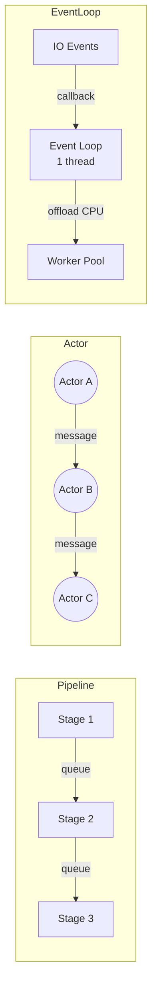
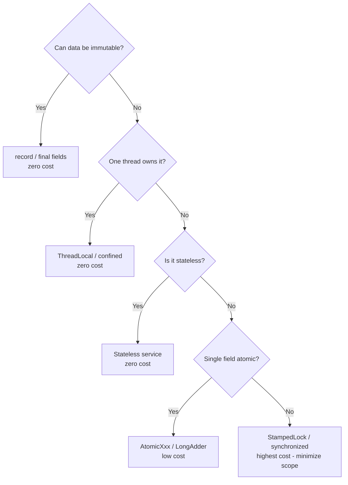
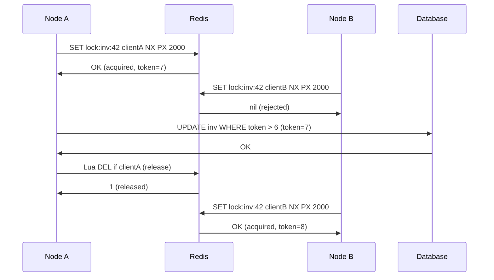

# Java Concurrency - L5 Architecture

| # | Keyword | Difficulty |
| --- | --- | --- |
| 1 | [Concurrency Architecture Patterns](#concurrency-architecture-patterns) | ★★★ |
| 2 | [Thread Safety Design Strategies](#thread-safety-design-strategies) | ★★★ |
| 3 | [Distributed Locking Strategies](#distributed-locking-strategies) | ★★★ |

---

# Concurrency Architecture Patterns

**Interview Weight:** high (L5) - Tests ability to choose and
design system-level concurrency architectures. Staff-level question.

---

### 🎯 Model Answer

**30 seconds:**

> Key concurrency architecture patterns: Actor model (isolated state
> per actor, message passing), Event Loop (single-threaded event
> dispatch, non-blocking), Pipeline (stages connected by queues),
> and Thread-per-Request (blocking IO, simple). Modern Java: virtual
> threads + Thread-per-Request gives reactive-level scalability with
> the simplest architecture.

**3 minutes (Senior):**

> Actor model (Akka, Erlang OTP): each actor has private state,
> processes one message at a time. No shared mutable state eliminates
> lock-based synchronization entirely. Actors communicate only via
> messages. Fault tolerance: supervisor hierarchies restart failed
> actors. Scale: actors distribute across machines natively.
>
> Event Loop (Node.js, Netty, Vert.x): single thread handles all
> IO events via non-blocking callbacks. No threads = no locking.
> Limitation: one blocking call blocks the entire loop. CPU-bound
> work must be offloaded to a thread pool.
>
> Pipeline pattern (Disruptor, Kafka Streams): data flows through
> stages, each processed by a dedicated thread. Each stage owns
> its data; no locks between stages. Between stages: lock-free
> ring buffers (Disruptor) or queues. Extremely high throughput
> for sequential processing.
>
> Choice: Actor for complex stateful distributed systems. Event loop
> for IO-heavy, low-latency services. Pipeline for ordered
> high-throughput processing. Thread-per-Request + Virtual Threads
> for standard CRUD services.

**Blank Mind Recovery:**

**(1) Restate:** "Concurrency patterns: Actor (message passing),
Event Loop (single thread, non-blocking), Pipeline (stage queues),
Thread-per-Request."

**(2) First principles:** "All concurrency problems come from
shared mutable state. Eliminate sharing (Actor, Pipeline) or
eliminate mutability (immutable data) to eliminate the problem."

---

### 📘 Concept Explanation

**What it is:**

Concurrency architecture patterns: system-level designs that
structure how threads, state, and work interact to achieve
correctness and scalability.

**The problem it solves:**

Low-level synchronization (locks, semaphores) is error-prone and
hard to reason about at scale. Architecture patterns provide
higher-level abstractions that make concurrency correctness a
structural property rather than a per-class burden.

**How it works:**

```
ACTOR MODEL (Akka):
  class OrderActor extends AbstractActor {
      private OrderState state;  // PRIVATE - no sharing

      @Override public Receive createReceive() {
          return receiveBuilder()
              .match(PlaceOrder.class, msg -> {
                  state = state.applyOrder(msg);
                  // No locks needed: only this actor touches state
                  sender().tell(new OrderConfirmed(msg.id), self());
              }).build();
      }
  }

EVENT LOOP (Vert.x):
  vertx.createHttpServer()
       .requestHandler(req -> {
           // Runs on single event loop thread
           // Non-blocking: callbacks only
           dbClient.get(req.param("id"))  // non-blocking
               .onSuccess(result ->
                   req.response().end(result.toString()))
               .onFailure(err ->
                   req.response().setStatusCode(500).end());
       }).listen(8080);

PIPELINE (Disruptor):
  // Producer -> RingBuffer -> Consumer1 -> Consumer2 -> Consumer3
  // Each stage on its own thread; no locks; cache-line padded slots
  RingBuffer<Event> ringBuffer =
      disruptor.getRingBuffer();
  long seq = ringBuffer.next();     // claim slot
  ringBuffer.get(seq).setValue(42); // write (no lock)
  ringBuffer.publish(seq);          // make visible
```

**The key insight:**

The Actor model does not eliminate concurrency - it eliminates
shared mutable state. Actors run concurrently; their internal state
is sequential. Bugs become message protocol bugs (easier to reason)
rather than lock ordering bugs (notoriously hard to reason).

**When to use it:**

- Actor: stateful distributed systems, event sourcing, game servers
- Event Loop: high-concurrency IO (HTTP proxy, API gateway, chat)
- Pipeline: ordered stream processing, ETL, financial matching engines
- Thread-per-Request + VT: standard web services, CRUD APIs

**When NOT to use it:**

- Do not use Actor for CPU-bound algorithms: message overhead
  and mailbox processing adds latency
- Do not use Event Loop for CPU-heavy requests: blocks the loop
- Do not use Pipeline for irregular/dynamic workloads: stage sizes
  are hard to balance

**Alternatives:**

- CSP (Communicating Sequential Processes): Kotlin channels,
  Go channels - message passing without actor location transparency
- Dataflow: RxJava, Reactor - data-flow DAG with reactive streams

**First-principles derivation:**

All architectures address the fundamental problem: shared mutable
state causes race conditions. Solutions: (1) eliminate sharing
(actor, thread-local, immutable), (2) eliminate mutation (functional,
immutable data), (3) serialize access (event loop, serial executor).
Each architecture makes a different trade-off between simplicity,
throughput, and latency.

---

### 💻 Code Example

**Example 1: Pipeline with ArrayBlockingQueue**

```java
// GOOD: Three-stage pipeline
// Stage 1 (parser) -> Stage 2 (validator) -> Stage 3 (writer)
BlockingQueue<String> rawQ    = new ArrayBlockingQueue<>(1000);
BlockingQueue<Record> parsedQ = new ArrayBlockingQueue<>(1000);
BlockingQueue<Record> validQ  = new ArrayBlockingQueue<>(1000);

// Stage 1: Parse (1 thread)
Executors.newSingleThreadExecutor().submit(() -> {
    for (String line : source) {
        rawQ.put(line);       // blocks if rawQ full (backpressure)
    }
});

// Stage 2: Validate (2 threads for parallelism)
for (int i = 0; i < 2; i++) {
    Executors.newSingleThreadExecutor().submit(() -> {
        while (true) {
            String raw = rawQ.take();  // blocks if empty
            Record r = parse(raw);
            parsedQ.put(r);
        }
    });
}

// Stage 3: Write (1 thread - single writer to DB)
Executors.newSingleThreadExecutor().submit(() -> {
    while (true) {
        Record r = parsedQ.take();
        if (validate(r)) validQ.put(r);
    }
});
```

> **Code walkthrough:** Each stage runs on its own thread(s). Data
> flows downstream through bounded BlockingQueues. Backpressure is
> natural: if Stage 3 (writer) is slow, validQ fills up, blocking
> Stage 2, which causes parsedQ to fill, blocking Stage 1. No locks
> needed because each stage owns its data while processing it. The
> queue is the handoff point: the only synchronization needed is the
> queue's own thread-safe put/take. This pattern scales by adding
> threads to bottleneck stages.

---

### 🎓 Answers by Seniority

**Junior / Mid (0-5 years):**

> Architecture patterns for concurrency: Actor (private state, messages),
> Event Loop (single thread, non-blocking), Pipeline (stages + queues),
> Thread-per-Request. Each eliminates shared mutable state differently.
> Choice depends on workload: IO-heavy = event loop, stateful distributed
> = actors, ordered streaming = pipeline.

---

**Senior / Staff (5+ years):**

> I select architecture before selecting primitives. For new Java
> services: Thread-per-Request + Virtual Threads (simple, scales).
> For high-throughput ordered processing: pipeline with Disruptor
> (lock-free ring buffer, 100M+ msg/sec). For distributed stateful
> systems: Akka or Axon (actor + event sourcing). For reactive
> streaming: Reactor Flux with bounded elastic scheduler. I never
> add lock-based complexity when an architectural pattern eliminates
> the need.

---

### ⚠️ Common Misconceptions

| Misconception | Reality | Risk |
| --- | --- | --- |
| "Actor model eliminates concurrency bugs" | Actors eliminate race conditions on state; deadlock is still possible (actors waiting for each other's response) | False confidence in actor systems |
| "Event loop is always faster than thread pool" | Event loop excels at IO-bound; for CPU-bound, thread pool is equivalent or better | Using event loop for CPU tasks; blocks the loop |
| "Pipeline pattern requires Disruptor" | BlockingQueue-based pipeline works well for moderate throughput; Disruptor adds complexity for > 10M msg/sec only | Over-engineering simple pipelines |

---

### 🚨 Failure Modes and Diagnosis

| Failure | Symptom | Root Cause | Diagnostic | Fix |
| --- | --- | --- | --- | --- |
| Actor mailbox overflow | OOM or task rejection | Actor cannot process messages faster than arrival rate | Monitor mailbox sizes; alert on queue > threshold | Add backpressure; scale actors; bound mailbox with drop/buffer strategy |
| Pipeline stage imbalance | Queue between stages always full or always empty | Stage throughput mismatch | Monitor queue depth per stage | Scale slow stage (more threads); tune batch size |

---

### 🎯 Interview Deep-Dive

| Level | Time | Expected Depth |
| --- | --- | --- |
| Junior | 3 min | Name and describe each pattern; basic use cases |
| Mid | 5 min | Trade-offs; when to choose each; Java implementations |
| Senior | 8 min | Disruptor mechanics; actor deadlock; event loop + thread pool combo |
| Staff | 12 min | Design a system using one of these patterns end-to-end |

---

**Q1** [ARCHITECTURE] [STAFF]

"Design a high-throughput order processing system (1M orders/sec)
using a concurrency architecture pattern."

**Answer:**

Pattern choice: Pipeline with lock-free Disruptor ring buffer.

Requirements analysis:
- 1M orders/sec = 1000 ns per order budget
- Orders must be processed in sequence (matching engine rule)
- Multiple stages: receive, validate, match, persist, notify
- Low latency: P99 < 1ms

Architecture:
```
[Network] -> [Receive] -> [Validate] -> [Match] -> [Persist] -> [Notify]
               Thread 1     Threads 2-3   Thread 4   Thread 5    Thread 6

Ring Buffer between each stage (Disruptor):
  - Lock-free slot claim (CAS)
  - Cache-line padded: no false sharing between slots
  - Consumer polls (spin-wait): microsecond latency
  - 64K slots: 64K * 64 bytes = 4MB (fits in L3 cache)
```

Design decisions:
1. Single sequence in Match stage: orders matched in arrival order.
   Only one match thread avoids locking the order book.
2. Persist stage: async write to DB; ring buffer absorbs bursts
3. BatchSize for Persist: group 500 orders per DB write (500x
   throughput improvement vs one DB call per order)
4. Notify stage: publish to Kafka; async, no latency impact

Scalability: at 1M/sec, each stage has 1000ns budget.
Disruptor ring buffer: ~5ns per slot claim. Match stage: ~200ns.
Persist (batched): 500 orders in one 2ms DB write = 4ns/order.
Total: within budget.

Fault tolerance: Disruptor has no persistence; wrap with
event sourcing: write each order to the ring buffer AND to a
durable log (Kafka) before processing. On restart: replay from log.

*What separates good from great:* Single-thread Match stage by
design (no locking on the order book) and batching for Persist
(the key to meeting the throughput target).

---

### ⚖️ Comparison Table

| Pattern | State Model | Throughput | Latency | Complexity | Best For |
| --- | --- | --- | --- | --- | --- |
| Actor | Private per actor | Medium-high | Medium | High | Distributed stateful |
| Event Loop | Global (single thread) | High (IO) | Low | Medium | IO gateway |
| Pipeline | Per-stage | Very high | Low | Medium | Ordered stream processing |
| Thread-per-Request | Shared (synchronized) | Medium | Medium | Low | CRUD services |

---

### 🏛️ System Design

The concurrency architecture determines the entire system design:

Actor: Use when components need location transparency (local or
remote actor, same API). Event Sourcing + Actor = CQRS.

Event Loop: Use for API gateways, proxy servers, WebSocket
hubs. Combine with thread pool for CPU-heavy requests
(Netty's EventLoop + workerPool design).

Pipeline: Use when data has a natural flow (ETL, financial,
media encoding). Disruptor for extreme throughput, BlockingQueue
for moderate.

---

### 📊 Diagram

```
PIPELINE vs ACTOR vs EVENT LOOP:

Pipeline:
  [Stage1: 1 thread] --queue--> [Stage2: 2 threads] --queue--> [Stage3]

Actor:
  [ActorA]--msg-->[ActorB]--msg-->[ActorC]
  Each actor: private state, sequential mailbox

Event Loop:
  [EventLoop: 1 thread] --callbacks--> IO completion
  [WorkerPool] <-- CPU tasks offloaded
```



> **Diagram walkthrough:** Pipeline: data is a river flowing through
> stages via queues; each stage owns a slice of time with the data.
> Actor: data is a message in a mailbox; actors are isolated islands
> communicating by post. Event Loop: one thread handles all IO events
> via callbacks, offloading CPU work to a separate pool. Each model
> eliminates shared mutable state differently: Pipeline by strict
> handoff, Actor by mailbox isolation, Event Loop by single-threading
> the dispatch.

---

---

# Thread Safety Design Strategies

**Interview Weight:** high (L5) - Tests ability to select the
correct thread safety strategy for a given design scenario.

---

### 🎯 Model Answer

**30 seconds:**

> Five strategies for thread safety: (1) immutability - no mutation,
> no races; (2) thread confinement - one thread owns the data;
> (3) stateless - no fields, pure functions; (4) synchronization -
> locks or CAS; (5) copy-on-write - reads share; writes copy.
> Strategy 1-3 are zero-cost; prefer them before reaching for locks.

**3 minutes (Senior):**

> Thread confinement is the most underused: if data is only ever
> touched by one thread, no synchronization is needed at all.
> ThreadLocal implements per-thread confinement. Virtual thread
> stacks are naturally confined. Event loop: all state confined to
> the event loop thread.
>
> Immutability: Java Record, @Value (Lombok), Collections.unmodifiableX,
> final fields. Immutable objects are always safe to share - no
> mutation = no data race. The cost: every "update" creates a new
> object. For frequently modified state, this is inefficient.
>
> Stateless: Spring @Service beans are designed stateless. All state
> is in the arguments or in external storage (DB, cache). Stateless
> services scale horizontally without synchronization.
>
> Synchronization (last resort): when mutation is unavoidable and
> cannot be confined, use the minimal synchronization necessary.
> Prefer lock-free (CAS, AtomicXxx) over locks. Prefer read-write
> locks (StampedLock) over exclusive locks for read-heavy workloads.

**Blank Mind Recovery:**

**(1) Restate:** "Thread safety strategies: immutability, confinement,
stateless, CAS, locks. First three are free."

**(2) First principles:** "Race conditions require: two threads +
shared mutable state. Eliminate either sharing or mutation."

---

### 📘 Concept Explanation

**What it is:**

A taxonomy of strategies for making code thread-safe, ordered from
zero-cost (preferred) to highest-cost (last resort).

**The problem it solves:**

Developers default to locks for thread safety. Locks are the
right tool in some cases but wrong in most. The strategy taxonomy
helps select the correct approach at design time.

**How it works:**

```
STRATEGY 1: IMMUTABILITY (zero cost)
  record Point(double x, double y) {}  // Java record: immutable
  Point p = new Point(1.0, 2.0);
  // Share freely: no lock needed, no synchronization

STRATEGY 2: THREAD CONFINEMENT (zero cost)
  ThreadLocal<SimpleDateFormat> sdf =
      ThreadLocal.withInitial(() -> new SimpleDateFormat("yyyy-MM-dd"));
  // Each thread has its own SDF; no sharing; no synchronization

STRATEGY 3: STATELESS (zero cost)
  @Service
  class OrderCalculator {  // no fields; all state in parameters
      BigDecimal calculate(Order order, PriceList prices) {
          return order.items().stream()
              .map(item -> prices.get(item.sku()).multiply(item.qty()))
              .reduce(BigDecimal.ZERO, BigDecimal::add);
      }
  }
  // 1000 threads calling calculate() simultaneously: correct, no sync

STRATEGY 4: CAS/LOCK-FREE (low cost)
  AtomicLong counter = new AtomicLong(0);
  counter.incrementAndGet(); // CAS: no lock, bounded retry

STRATEGY 5: LOCKS (highest cost, last resort)
  synchronized(this) { /* critical section */ }
  // Or: ReentrantLock for try-lock, fair, condition variables
```

**The key insight:**

The question is not "should I add a lock?" but "can I eliminate
shared mutable state entirely?" Most concurrency bugs in production
are caused by mutable shared state that was never analyzed for
thread safety. Defaulting to immutability at design time prevents
entire classes of bugs.

**When to use each:**

- Immutable: DTOs, value objects, configuration, results
- Confinement: per-request state, parsers, formatters, caches
- Stateless: service beans, utility classes, pure functions
- CAS: counters, flags, single-field state
- Locks: multi-field atomic updates, non-trivial invariants

**When NOT to use it:**

- Do not use locks for state that could be immutable: over-engineering
- Do not use ThreadLocal for long-lived state: memory leak if not cleaned
- Do not use stateless when natural state exists: forcing statelessness
  into an algorithm that has inherent state is a code smell

**Alternatives:**

- Software Transactional Memory (Clojure STM): optimistic
  multi-field atomic updates without locks
- Actor model: confinement as an architectural pattern

**First-principles derivation:**

Data race condition: two threads access same memory, at least one
writes, no HB ordering. Immutability: writes never happen. Confinement:
only one thread can access (no second thread). Stateless: no
shared memory. CAS/Locks: HB established by the atomic operation.
All strategies address the formal data race definition.

---

### 💻 Code Example

**Example 1: Bad (unnecessary lock) vs Good (immutability first)**

```java
// BAD: synchronized for a value that never changes
class Config {
    private String apiUrl;
    private int timeout;

    synchronized String getApiUrl() { return apiUrl; }   // lock!
    synchronized int getTimeout() { return timeout; }    // lock!
    synchronized void init(String url, int t) {
        apiUrl = url; timeout = t;
    }
}

// GOOD: immutable config - zero locking overhead
record Config(String apiUrl, int timeout) {}
// Create once; share freely:
Config config = new Config("https://api.example.com", 5000);
// No synchronization needed: record fields are final
// Reading from 100 threads: zero contention

// GOOD: thread-local for per-request mutable state
private static final ThreadLocal<RequestContext> CONTEXT =
    ThreadLocal.withInitial(RequestContext::new);

public void handleRequest(HttpRequest req) {
    CONTEXT.get().setUserId(req.header("X-User-Id"));
    try {
        processRequest(req);
    } finally {
        CONTEXT.remove(); // CRITICAL: prevent memory leak
    }
}
```

> **Code walkthrough:** The bad Config uses synchronized getters
> for data that is initialized once and never changes - unnecessary
> synchronization overhead on every read, from every thread, forever.
> The Java record Config makes all fields final; the compiler enforces
> immutability. Any thread can read config.apiUrl() with zero
> synchronization. The ThreadLocal example shows confinement:
> RequestContext is per-thread, created fresh per request, and
> cleaned up in the finally block (CRITICAL - without remove(),
> thread pool threads leak the context across requests).

---

### 🎓 Answers by Seniority

**Junior / Mid (0-5 years):**

> Five strategies: immutability (Java record, final fields), thread
> confinement (ThreadLocal), stateless (no fields), CAS (AtomicLong),
> locks (synchronized, ReentrantLock). Prefer immutability over
> locks. Stateless Spring beans: zero synchronization needed.

---

**Senior / Staff (5+ years):**

> I design for thread safety from the start, not as an afterthought.
> Default: immutable data (Java records for DTOs). Stateless services:
> all mutable state in DB or external stores. Per-request state:
> thread-local or method parameters. Only when mutation is unavoidable
> do I reach for CAS, then locks as a last resort. Code review focus:
> any mutable field in a @Service or @Component is a potential
> concurrency bug unless explicitly synchronized.

---

### ⚠️ Common Misconceptions

| Misconception | Reality | Risk |
| --- | --- | --- |
| "Spring beans are thread-safe by default" | Spring beans are singletons; shared instance fields are NOT thread-safe | Mutable fields in @Service cause race conditions |
| "ThreadLocal prevents all memory leaks" | ThreadLocal values stay in thread pool threads between requests unless explicitly removed | Stale context; OOM in thread pools |
| "Immutable means slow (always copies)" | Structural sharing (persistent data structures) enables efficient immutable updates; simple immutable objects have no overhead for reads | Premature optimization to mutable for "performance" |

---

### 🚨 Failure Modes and Diagnosis

| Failure | Symptom | Root Cause | Diagnostic | Fix |
| --- | --- | --- | --- | --- |
| Race condition in @Service | Intermittent wrong results or NPE | Mutable instance field in stateless service | FindBugs/SpotBugs: non-final field in singleton; jstack race under load | Remove instance field; use method parameter or ThreadLocal |
| ThreadLocal memory leak | Memory grows over time in thread pool | ThreadLocal not removed in finally | Heap dump: large ThreadLocalMap in pool threads | Add try/finally with ThreadLocal.remove() |

---

### 🎯 Interview Deep-Dive

| Level | Time | Expected Depth |
| --- | --- | --- |
| Junior | 3 min | Name five strategies; basic examples |
| Mid | 5 min | Trade-offs; ThreadLocal lifecycle; Spring singleton issue |
| Senior | 8 min | Design a cache with correct thread safety strategy selection |
| Staff | 12 min | Thread safety as a system design first principle; eliminate vs manage shared state |

---

**Q1** [ARCHITECTURE] [STAFF]

"Given a Spring @Service that must cache frequently read,
occasionally updated data, design a thread-safe caching strategy."

**Answer:**

Requirements: high read throughput, occasional write, correctness
under concurrent reads/writes.

Strategy analysis:
- Not immutable: data changes
- Not stateless: holding cache state
- Need synchronization, but minimize cost for reads

Option 1: ConcurrentHashMap (read-heavy, no invalidation)
```java
@Service
class ProductService {
    // ConcurrentHashMap: lock-free reads, fine-grained write locks
    private final ConcurrentHashMap<String, Product> cache
        = new ConcurrentHashMap<>();

    public Product get(String id) {
        return cache.computeIfAbsent(id, k -> loadFromDB(k));
        // computeIfAbsent: atomic check-and-set; only loads once
    }

    public void invalidate(String id) {
        cache.remove(id);
    }
}
// Correct for: one-shot loading, TTL handled externally
```

Option 2: StampedLock (read-heavy with write)
```java
@Service
class ProductService {
    private final StampedLock lock = new StampedLock();
    private Map<String, Product> cache = new HashMap<>();

    public Product get(String id) {
        // Optimistic read: no lock if no concurrent write
        long stamp = lock.tryOptimisticRead();
        Product p = cache.get(id);
        if (!lock.validate(stamp)) { // writer changed data
            stamp = lock.readLock(); // fall back to read lock
            try { p = cache.get(id); }
            finally { lock.unlockRead(stamp); }
        }
        return p;
    }

    public void refresh(Map<String, Product> newCache) {
        long stamp = lock.writeLock();
        try { cache = newCache; }
        finally { lock.unlockWrite(stamp); }
    }
}
// Correct for: very frequent reads, rare full refreshes
// Optimistic read: zero lock overhead when no writer active
```

Option 3: Caffeine (production-grade cache)
```java
@Service
class ProductService {
    private final LoadingCache<String, Product> cache =
        Caffeine.newBuilder()
            .maximumSize(10_000)
            .expireAfterWrite(5, TimeUnit.MINUTES)
            .refreshAfterWrite(1, TimeUnit.MINUTES)
            .build(id -> loadFromDB(id));  // auto-load on miss

    public Product get(String id) {
        return cache.get(id);  // thread-safe, auto-load, auto-expire
    }
}
// Correct for: production use; handles TTL, eviction, refresh
```

Recommendation: Use Caffeine for production. Implement manually
only when Caffeine is not available or constraints require it.

*What separates good from great:* Knowing StampedLock optimistic
read and recommending Caffeine for production caches.

---

### ⚖️ Comparison Table

| Strategy | Read Cost | Write Cost | Concurrency Model | Use Case |
| --- | --- | --- | --- | --- |
| Immutability | Zero | New object | No sync needed | DTOs, config |
| ThreadLocal | Zero (per thread) | Zero | No sync needed | Per-request state |
| Stateless | Zero | Zero | No sync needed | Service logic |
| CAS (AtomicXxx) | Low | Low-medium | Lock-free | Counters, flags |
| synchronized | Medium | Medium | Exclusive lock | Multi-field invariants |
| StampedLock | Near-zero (optimistic) | Medium | Optimistic + exclusive | Read-heavy cache |

---

### 🏛️ System Design

Thread safety strategy selection framework:

1. Can the data be immutable? Use immutability.
2. Is the data per-thread? Use confinement.
3. Is the logic stateless? Remove instance fields.
4. Is only one field changing atomically? Use CAS.
5. Multiple fields changing atomically? Use the smallest
   possible synchronized block or StampedLock.

Apply in order: earlier strategies in the list are always better.
Only proceed to the next strategy if the previous is not applicable.

---

### 📊 Diagram

```
STRATEGY SELECTION TREE:

Can data be immutable? --YES--> record / final / Collections.unmodifiableX
         |
        NO
         |
One thread only? --------YES--> ThreadLocal / confined object
         |
        NO
         |
No shared state? --------YES--> Stateless service / pure function
         |
        NO
         |
Single field atomic? ----YES--> AtomicXxx / CAS
         |
        NO
         |
Use smallest lock scope: synchronized / ReentrantLock / StampedLock
```



> **Diagram walkthrough:** The decision tree encodes the strategy
> selection framework. Each node eliminates a strategy and moves to
> the next. The goal: reach the topmost applicable node. Most domain
> objects can be made immutable (DTOs, events, results). Per-request
> state fits confinement. Service logic fits stateless. Only complex
> mutable aggregates need locks. Following the tree prevents the
> common mistake of jumping directly to "add a lock" for everything.

---

---

# Distributed Locking Strategies

**Interview Weight:** critical (L5) - Tests ability to reason
about distributed consensus and the trade-offs of distributed
locking. Frequently asked at senior/staff level.

---

### 🎯 Model Answer

**30 seconds:**

> Distributed locking ensures mutual exclusion across JVM processes
> or machines. Options: Redis SETNX with TTL (simple, not
> fully safe), Redlock (multi-node Redis, safer), ZooKeeper
> ephemeral nodes (strong consistency), database row locks (simple
> with RDBMS). Key challenge: what happens when the lock holder
> crashes? TTL + fencing tokens prevent stale lock holders from
> corrupting state.

**3 minutes (Senior):**

> Redis SETNX (SET if Not eXists): atomically sets a key with an
> expiry. Acquire: SET lock:key $clientId NX PX 30000 (30s TTL).
> Release: check clientId (Lua script: get key, compare, del if match
> - atomic). Problem: single Redis node - if it fails during lock
> hold, the lock is lost or stuck. Failover takes time; new leader
> may not have the lock state.
>
> Redlock: acquire the lock on majority (>N/2) of N independent
> Redis nodes. Lock is valid only if majority acquisition time < TTL.
> Martin Kleppmann (2016) argued Redlock is unsafe under clock skew
> and GC pauses (lock may expire while holder is paused, another
> client acquires, then paused client resumes unaware). Safety
> requires fencing tokens.
>
> Fencing token: monotonically increasing sequence number attached
> to the lock. Storage backend (DB, file system) rejects writes
> from stale tokens. Ensures correctness even if the lock holder
> is paused after lock expiry.
>
> ZooKeeper (Curator): uses ephemeral sequential nodes. The node
> with the lowest sequence number holds the lock. ZK watches notify
> the next node when the current holder releases. ZK uses ZAB
> (atomic broadcast) for linearizable writes: correct under network
> partitions. More complex but proven correct.

**Blank Mind Recovery:**

**(1) Restate:** "Distributed lock: mutual exclusion across JVMs.
Options: Redis, Redlock, ZooKeeper. Key problem: what if holder crashes."

**(2) First principles:** "A lock is a promise: one holder at a time.
In distributed systems, promise can be broken by crash, network,
GC pause. TTL + fencing tokens are the safeguards."

---

### 📘 Concept Explanation

**What it is:**

Distributed locking: a mutual exclusion mechanism across multiple
processes or machines. Prevents two nodes from concurrently
modifying the same resource (e.g., cron job running twice,
inventory going negative).

**The problem it solves:**

In-JVM locks (synchronized, ReentrantLock) have no effect across
multiple JVM instances. Distributed systems need cross-node mutual
exclusion for: job scheduling (exactly-once execution), inventory
deduction (exactly-one write), distributed caches (single writer).

**How it works:**

```
REDIS SETNX PATTERN:
  // Acquire (Java with Lettuce/Jedis):
  String clientId = UUID.randomUUID().toString();
  String lock = "lock:inventory:" + productId;
  boolean acquired = redis.set(lock, clientId,
      SetArgs.Builder.nx().px(30_000)); // NX=only if absent, PX=TTL ms

  // Release (atomic Lua script: check owner then delete):
  String releaseScript = """
      if redis.call('get', KEYS[1]) == ARGV[1] then
          return redis.call('del', KEYS[1])
      else return 0 end
  """;
  redis.eval(releaseScript, 1, lock, clientId);
  // CRITICAL: only release YOUR lock (compare clientId first)

FENCING TOKEN:
  // Lock server returns a monotonically increasing token on each acquire
  Lock lock = lockServer.acquire("inventory");
  long token = lock.getToken();  // e.g., 42

  // Write to storage with token:
  db.update("inventory", amount, token);
  // Storage checks: is token > last_seen_token?
  // If yes: apply write. If no (stale token): reject.
  // Guarantees: stale client (resumed after GC pause) is rejected

REDLOCK ALGORITHM:
  // Acquire on N=5 Redis nodes (majority = 3):
  long start = currentTime();
  int acquired = 0;
  for (Redis node : redisNodes) {
      if (node.set(lock, clientId, NX, PX, ttl)) acquired++;
  }
  long elapsed = currentTime() - start;
  if (acquired >= 3 && elapsed < ttl) {
      // Lock acquired; validity = ttl - elapsed
  } else {
      // Failed; release all acquired nodes
  }
```

**The key insight:**

TTL prevents permanent lock: if the holder crashes, the lock
expires. But TTL + GC pause = dangerous: holder is paused for
longer than TTL. Lock expires. Another client acquires. Original
client resumes unaware. Fencing tokens are the only way to detect
this race: storage rejects writes from tokens smaller than the
current fence.

**When to use it:**

- Cron job exactly-once execution across cluster nodes
- Inventory deduction preventing double-spend
- Leader election for singleton services
- Cache warming: only one node computes and caches

**When NOT to use it:**

- Do not use distributed locks for high-frequency operations:
  lock acquisition is ~1ms (network RTT); unsuitable for sub-ms paths
- Do not use single-node Redis for critical data: node failure
  loses the lock state temporarily
- Do not assume Redlock is safe under all conditions: use ZooKeeper
  or etcd for stronger guarantees

**Alternatives:**

- etcd (Raft-based): linearizable; used by Kubernetes for its
  distributed locks
- PostgreSQL advisory locks: pg_try_advisory_lock (integer-based,
  cheap, session or transaction scoped)
- ShedLock (Spring): @SchedulerLock annotation + backed by Redis,
  JDBC, or Mongo; designed for scheduled tasks

**First-principles derivation:**

Distributed mutual exclusion is impossible to achieve perfectly in
an asynchronous network (FLP impossibility - with crash failures,
no deterministic consensus protocol terminates). Practical distributed
locks accept bounded safety violations (TTL) and use fencing tokens
to detect and reject stale operations. ZooKeeper achieves
linearizability via ZAB consensus (majority required for each write).

---

### 💻 Code Example

**Example 1: BAD (no owner check) vs GOOD (atomic Lua release)**

```java
// BAD: race condition on lock release
String lock = "lock:job:1";
try {
    redis.setex(lock, 30, clientId); // acquire
    doWork();
} finally {
    redis.del(lock);  // BAD: may delete ANOTHER client's lock!
    // If TTL expired during doWork(), another client acquired the lock.
    // del() deletes the new client's lock -> two concurrent holders!
}

// GOOD: atomic compare-and-delete via Lua script
String releaseScript = """
    if redis.call('get', KEYS[1]) == ARGV[1] then
        return redis.call('del', KEYS[1])
    else
        return 0
    end
""";
try {
    String clientId = UUID.randomUUID().toString();
    boolean acquired = "OK".equals(
        redis.set(lock, clientId, SetArgs.Builder.nx().px(30_000)));
    if (!acquired) throw new LockAcquisitionException(lock);
    doWork();
} finally {
    // Atomic: check clientId AND delete in one Redis command
    redis.eval(releaseScript, ScriptOutputType.INTEGER,
        new String[]{lock}, clientId);
}
```

> **Code walkthrough:** The bad version uses redis.del() in the
> finally block. If TTL expired during doWork() (GC pause, slow
> operation), another process already acquired the lock. Deleting
> the key removes the new holder's lock, creating two concurrent
> lock holders - the exact problem we're trying to prevent. The good
> version uses a Lua script that atomically reads the key (checking
> ownership) and deletes only if this client owns it. Redis executes
> Lua scripts atomically: no other command can interleave between
> the GET and DEL. The clientId (UUID) uniquely identifies this
> specific lock acquisition attempt.

**Example 2: ShedLock for Spring scheduled tasks**

```java
// GOOD: ShedLock prevents duplicate job execution across cluster
@Configuration
class ShedLockConfig {
    @Bean
    public LockProvider lockProvider(DataSource dataSource) {
        return new JdbcTemplateLockProvider(dataSource,
            JdbcTemplateLockProvider.Configuration.builder()
                .withTableName("shedlock")
                .usingDbTime()  // use DB clock for consistency
                .build());
    }
}

@Component
class InventoryRefreshJob {
    @Scheduled(cron = "0 0 * * * *")  // every hour
    @SchedulerLock(
        name = "inventoryRefresh",
        lockAtLeastFor = "PT10M",   // hold lock min 10 min
        lockAtMostFor = "PT55M")    // auto-release after 55 min
    public void refreshInventory() {
        // Only ONE node in the cluster runs this method per hour
        inventoryService.refresh();
    }
}
// DB-backed: survives Redis failure; uses DB transaction for safety
```

> **Code walkthrough:** ShedLock uses a database row as the lock.
> On job start: attempts to INSERT or UPDATE a row in the shedlock
> table with lockAtMostFor expiry. If the insert/update fails (another
> node holds the lock): the job is skipped. lockAtLeastFor prevents
> releasing too early (protects against clock drift between nodes).
> lockAtMostFor is the safety TTL: if the node crashes, the lock
> expires after 55 minutes. This is simpler and more reliable than
> manual Redis SETNX for scheduled tasks.

---

### 🎓 Answers by Seniority

**Junior / Mid (0-5 years):**

> Distributed lock: prevents two nodes from doing the same work.
> Redis SETNX with TTL is the common approach. TTL: auto-expire if
> holder crashes. Always release with a Lua script that checks
> ownership first. ShedLock for Spring scheduled jobs.

---

**Senior / Staff (5+ years):**

> I design distributed locking with fail-safety first: what happens
> if the holder crashes after acquiring? TTL handles lock expiry.
> Fencing tokens handle the "resumed stale holder" problem. I use
> ShedLock for job scheduling (simpler, DB-backed). For
> high-availability applications, I use Redis Redlock with fencing
> tokens for correctness guarantees. For critical locking (financial
> transactions): ZooKeeper (Curator) or etcd (linearizable). I never
> assume a distributed lock is perfectly safe without fencing.

---

### ⚠️ Common Misconceptions

| Misconception | Reality | Risk |
| --- | --- | --- |
| "Redis SETNX is safe" | Single-node Redis: failover loses lock state; clock skew invalidates TTL calculations | Lock loss during Redis failover; two concurrent holders |
| "Redlock solves all Redis lock problems" | Redlock is disputed for safety under clock skew + GC pause (Kleppmann 2016); needs fencing tokens | False confidence in Redlock safety |
| "Distributed lock is easy" | Distributed consensus is fundamentally hard (FLP impossibility); practical locks have bounded safety violations | Under-engineering; production incidents |

---

### 🚨 Failure Modes and Diagnosis

| Failure | Symptom | Root Cause | Diagnostic | Fix |
| --- | --- | --- | --- | --- |
| Duplicate job execution | Two nodes run the same cron job simultaneously | No distributed lock; or lock expired due to long GC pause | Check job logs across nodes: same job ID executed twice | ShedLock with lockAtLeastFor; fencing tokens in storage |
| Lock never released | Lock TTL too long; stuck job; other nodes starved | Node crashed before release; TTL too large | Redis: TTL remaining on lock key; check if holder process is still alive | Set TTL <= expected max job duration; implement lock health check |
| Stale lock holder | Data corruption: two writers to same resource | GC pause longer than TTL; original holder resumed | Fencing token rejections in storage logs | Implement fencing tokens; reject writes with stale tokens |

---

### 🎯 Interview Deep-Dive

| Level | Time | Expected Depth |
| --- | --- | --- |
| Junior | 3 min | Redis SETNX concept; TTL purpose; ShedLock |
| Mid | 5 min | Lua release script; Redlock overview; ZooKeeper vs Redis trade-off |
| Senior | 8 min | Fencing tokens; Redlock safety debate; etcd/ZooKeeper internals |
| Staff | 12 min | Design a distributed locking system for a financial application |

---

**Q1** [ARCHITECTURE] [STAFF]

"Design a distributed locking system for an inventory deduction service
that processes 50K/sec transactions."

**Answer:**

Requirements:
- 50K/sec inventory deductions
- No double-spend: exactly one deduction per transaction
- Lock granularity: per product (not global)
- Acceptable latency: +5ms for lock overhead

Analysis:
50K/sec with per-product locks = distributed lock must support
50K lock acquisitions/sec. Redis handles 100K-1M ops/sec.
Network RTT for Redis in same datacenter: ~0.5ms.
Lock acquisition: one SET NX = one Redis call = 0.5ms.

Architecture: Redis-based per-product distributed lock:

```
Transaction arrives -> Acquire lock for product-id
  -> SET lock:inv:{product-id} {txnId} NX PX 2000 (2s TTL)
  -> If acquired:
     - Check inventory (DB read)
     - Deduct (DB write with fencing token)
     - Publish event (Kafka)
     - Release lock (Lua: check txnId + DEL)
  -> If not acquired: retry with 50ms backoff, max 3 retries
```

Fencing token: use the Kafka partition offset as the fencing token.
Storage rejects writes from lower offsets. Even if a transaction's
lock expires and a new one starts, the offset monotonically increases.
Stale transactions have lower offsets and are rejected.

Scale: 50K/sec = 50K Redis SETNX calls/sec. One Redis node: max
~100K ops/sec. Shard lock keys by product category: 5 Redis nodes,
each handling ~10K/sec. Per-node headroom at 50%.

Failure handling:
- Redis node failure: lock key lost. Two transactions may proceed.
  Fencing token prevents double-deduction at DB level.
- Transaction crash during hold: TTL=2s. Next retry after 2s.
  Set TTL = max transaction duration + 100ms buffer.

*What separates good from great:* Using Kafka offset as fencing
token (already available in the system; no extra infrastructure)
and sharding lock keys across multiple Redis nodes for horizontal
scalability.

---

### ⚖️ Comparison Table

| Strategy | Consistency | Throughput | Complexity | Best For |
| --- | --- | --- | --- | --- |
| Redis SETNX | Best-effort (single node) | Very high (~100K ops/s) | Low | Scheduled jobs, low-risk locks |
| Redlock | Better (majority) | High | Medium | Multi-node Redis environments |
| ZooKeeper (Curator) | Strong (linearizable) | Medium (~10K ops/s) | High | Leader election, critical resources |
| etcd | Strong (Raft) | Medium | Medium | Kubernetes-style coordination |
| DB advisory lock | Strong (ACID) | Medium | Low | Already-RDBMS systems |

---

### 🏛️ System Design

Distributed locking in a microservices inventory system:

Tier 1 (high throughput, lower consistency): Redis SETNX with
fencing tokens for product-level locks. Handles the 50K/sec
deduction path.

Tier 2 (leader election, low frequency): ZooKeeper ephemeral
nodes for singleton service election (one inventory refresh
process, one report generator). Happens ~10x/day, not on the
hot path.

Tier 3 (scheduled jobs): ShedLock with DB backing for nightly
batch jobs. Simple, auditable, uses existing RDBMS.

Never mix tiers: use the simplest tool appropriate for each
use case.

---

### 📊 Diagram

```
REDIS DISTRIBUTED LOCK LIFECYCLE:

Node A:  [SET NX OK] --hold-- [Lua DEL]
Node B:  [SET NX FAIL] --wait-- [retry after TTL] [SET NX OK]
                         ^
                   TTL expires (crash protection)

FENCING TOKEN:
  Lock acquired: token=42
  Write to DB: UPDATE inventory WHERE token > 41 -> OK (42 > 41)
  Lock expires; client pauses; token=43 issued to Node B
  Original client resumes: UPDATE ... WHERE token > 43 -> REJECTED (42 < 43)
```



> **Diagram walkthrough:** Node A acquires the lock (SET NX OK)
> and receives fencing token 7. Node B's concurrent attempt is
> rejected (nil). Node A writes to DB with token 7; DB accepts
> (7 > 6, the previous token). Node A releases with the Lua script
> (safe: only deletes if clientA owns the key). Node B then acquires
> with token 8. If Node A somehow retried after Node B acquired,
> its DB write would carry token 7, which the DB would reject
> (7 < 8). Fencing tokens make the storage layer the final
> arbiter of correctness, not the lock system.

---

---
