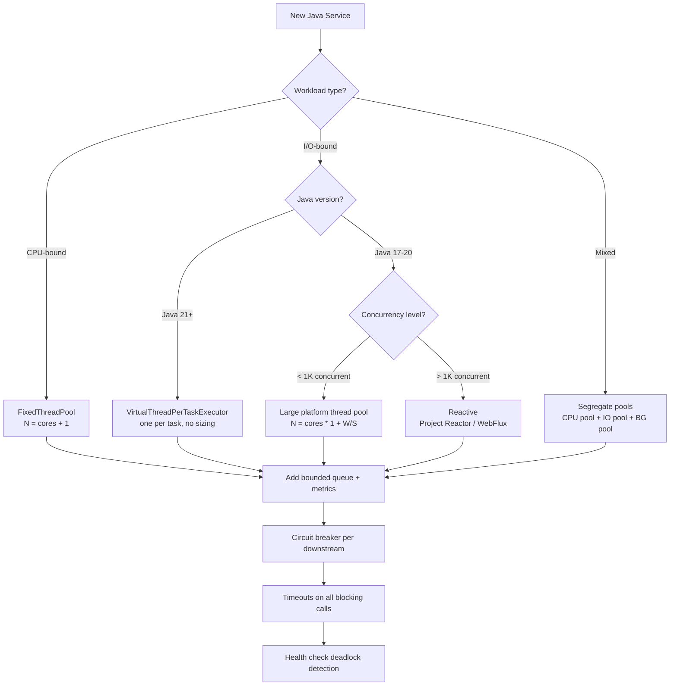

## Keywords in This File
{: .no_toc }

| # | Keyword | Weight |
|---|---|---|
| 1 | [Java Concurrency - L5 Architecture](#java-concurrency---l5-architecture) | medium |

---

# Java Concurrency - L5 Architecture

## Concurrency Architecture Decisions

---

### 🎯 Model Answer

**30 seconds:**
> Concurrency architecture is the set of decisions that determine HOW
> a system handles concurrent work: thread model (platform vs virtual),
> execution model (blocking vs reactive), data access pattern (shared
> state vs message passing), and back-pressure strategy. These decisions
> are made at design time and are expensive to change. Getting them right
> requires understanding the workload type (CPU-bound vs I/O-bound vs
> mixed), the expected concurrency level, and the failure tolerance
> required.

**3 minutes (Senior):**
> The fundamental tension in concurrency architecture is utilization vs
> simplicity. Reactive/non-blocking maximizes CPU utilization for I/O-bound
> work but makes code harder to reason about. Thread-per-task is simple
> but wastes CPU if threads block on I/O.
>
> Virtual threads (Java 21) changed the calculus: virtual threads are
> cheap enough (~1KB stack vs 1MB platform thread) to run one per task
> even for I/O-bound work, reclaiming the simplicity of thread-per-task
> while getting near-reactive CPU utilization.
>
> Key decisions: (1) Thread model: platform threads (CPU-bound tasks,
> fixed count) vs virtual threads (I/O-bound tasks, unbounded). (2)
> Coordination: shared state with locks (simple, but contention) vs
> message passing with queues (higher throughput, harder debugging).
> (3) Work isolation: separate thread pools per workload type to prevent
> I/O-bound tasks from starving CPU-bound tasks. (4) Back-pressure:
> bounded queues reject overflow rather than allowing unbounded memory
> growth.

**Framework:** WHAT → WHY → HOW → TRADE-OFF → EXAMPLE

*Adapting up:* Discuss the Reactor pattern (Project Reactor / RxJava)
vs the CSP model (Kotlin Coroutines channels) vs Actor model (Akka),
the LMAX Disruptor for ultra-low-latency, and the operational implications
of each model on debugging, distributed tracing, and circuit breaker
integration.

*Adapting down:* "Concurrency architecture answers: how do you handle
many requests at once? Option 1: one waiter per table (thread per request).
Option 2: one waiter handles all tables at once using callbacks (event
loop / reactive). Virtual threads give you the appearance of Option 1
(code simplicity) with the efficiency of Option 2."

**Blank Mind Recovery:**

**(1) Restate:** "You are asking about architecture-level decisions for
handling concurrency in a Java system. Let me structure this as: thread
model, execution model, data sharing model, and resilience design."

**(2) First principles:** "From first principles: a computer has N CPU
cores. The concurrency architecture determines how threads are mapped
to those cores, how work is distributed to threads, and how threads
coordinate without stepping on each other."

**(3) Bridge:** "Concurrency architecture is like designing a restaurant.
Do you assign one chef per table (simple, but expensive if the kitchen
has 200 tables and only 8 stove burners)? Or use a centralized kitchen
that handles all tables with a queue (efficient, but the queue can back
up and the chef must juggle multiple tasks)?"

---

### 📘 Concept Explanation

**What it is:**
Concurrency architecture is the collection of design decisions that
govern how a Java application creates, manages, and coordinates concurrent
work. It encompasses: thread model, task distribution, state management,
back-pressure, and failure isolation.

**Why it matters:**
Wrong concurrency architecture causes:
- Thread starvation (I/O tasks monopolize pool shared with CPU tasks)
- Memory pressure (unbounded thread creation for incoming requests)
- Deadlocks (wrong coordination primitives)
- Cascading failures (pool exhaustion propagates upstream)
- Debugging nightmares (reactive chains without structured context)

**The core decision framework:**
```
Is the work CPU-bound or I/O-bound?
  CPU-bound: fixed-size thread pool (N = CPU cores +1)
             Platform threads, no more than cores (avoid context switch)
  I/O-bound: larger thread pool OR virtual threads OR reactive
             Task spends most time waiting, not computing

What is the expected concurrency level?
  100s:  Platform threads fine (1MB each, 100 = 100MB)
  10Ks:  Virtual threads (Java 21) or reactive (NIO-based)
  100Ks: Reactive (Project Reactor, Vert.x) or virtual threads

How do threads/tasks coordinate?
  Read-heavy:  ReadWriteLock, StampedLock, CopyOnWrite
  Write-heavy: Lock striping, queue-based (LMAX Disruptor)
  State-free:  Thread-local state, immutable data structures

What is the failure model?
  Task failure:    CompletableFuture exception handling
  Pool exhaustion: Circuit breaker, bounded queue with rejection policy
  Timeout:         ScheduledExecutorService, CompletableFuture.orTimeout()
```

> **Code walkthrough:** This L5 Architecture example demonstrates a key concept in practice using CompletableFuture. **KEY MECHANISM:** the runtime executes these instructions in sequence with specific memory and execution semantics. **WHY IT MATTERS:** misapplying this pattern causes subtle bugs that only manifest under production load. **TAKEAWAY: understand the execution model before using this pattern in production code.**

**Java concurrency evolution timeline:**

| Java | Feature | Impact |
|---|---|---|
| 1.0 | synchronized, Thread | Foundation - but unmanaged |
| 5.0 | java.util.concurrent | ExecutorService, locks, queues |
| 7 | ForkJoinPool | Parallel work-stealing for divide-and-conquer |
| 8 | CompletableFuture | Async composition without explicit threads |
| 9 | reactive streams | Standardized back-pressure protocol |
| 19 | Virtual threads preview | Million-thread I/O concurrency |
| 21 | Virtual threads GA | Platform threads for CPU, virtual for I/O |
| 21 | Structured Concurrency | Scoped lifetime for async task groups |

**Platform threads vs virtual threads:**
```
Platform thread:
  ~1MB stack (configurable via -Xss)
  OS-scheduled (context switch ~10 microseconds)
  JVM limit: OS limits (~10,000-100,000 per JVM, practical)
  Best for: CPU-bound work, OS/native library calls

Virtual thread (Java 21):
  ~KB stack (grows dynamically)
  JVM-scheduled (unmounts from carrier thread on blocking I/O)
  Limit: millions per JVM
  Best for: I/O-bound work (HTTP clients, DB queries, file I/O)
  NOT suitable: CPU-bound (just uses a platform carrier thread)
```

> **Code walkthrough:** This L5 Architecture example demonstrates a key concept in practice. **KEY MECHANISM:** the runtime executes these instructions in sequence with specific memory and execution semantics. **WHY IT MATTERS:** misapplying this pattern causes subtle bugs that only manifest under production load. **TAKEAWAY: understand the execution model before using this pattern in production code.**

---

### 💻 Code Example

> **Code walkthrough:** The BAD example uses a single shared unboundedice. **KEY MECHANISM:** the runtime executes these instructions in sequence with specific memory and execution semantics. **WHY IT MATTERS:** misapplying this pattern causes subtle bugs that only manifest under production load. **TAKEAWAY: understand the execution model before using this pattern in production code.**
> thread pool for all work types, causing CPU and I/O tasks to compete.
> The GOOD example segregates workloads into separate pools with bounded
> queues and uses virtual threads for I/O-bound tasks in Java 21.

```java
// BAD: one shared pool for all work types
ExecutorService sharedPool = Executors.newFixedThreadPool(20);

// CPU-bound and I/O-bound tasks compete for the SAME 20 threads
sharedPool.submit(() -> encryptData(payload));        // CPU-bound
sharedPool.submit(() -> callExternalApi(request));    // I/O-bound (blocks)
sharedPool.submit(() -> queryDatabase(query));        // I/O-bound (blocks)
// I/O tasks block their threads; CPU tasks starve
// If all 20 threads are blocked on I/O, CPU tasks queue indefinitely
```

> **Code walkthrough:** BAD pattern: This L5 Architecture example demonstrates thread pool management using thread pool. **KEY MECHANISM:** the pool maintains a work queue; submitted tasks block until a thread is free. **WHY IT MATTERS:** unconfigured pool sizes exhaust threads under load or waste memory at rest. **WHAT BREAKS: always name threads and bound queue size to detect saturation.**

```java
// GOOD: segregated thread pools by workload type (Java 17)
// CPU-bound pool: N = cores (maximize compute, no context switch waste)
int cpuCores = Runtime.getRuntime().availableProcessors();
ExecutorService cpuPool = new ThreadPoolExecutor(
    cpuCores, cpuCores, 0, SECONDS,
    new LinkedBlockingQueue<>(1000),
    new ThreadFactoryBuilder().setNameFormat("cpu-worker-%d").build(),
    new ThreadPoolExecutor.CallerRunsPolicy());

// I/O-bound pool: N = 4x cores (threads block on I/O, not CPU)
ExecutorService ioPool = new ThreadPoolExecutor(
    cpuCores * 4, cpuCores * 8, 60, SECONDS,
    new LinkedBlockingQueue<>(10000),
    new ThreadFactoryBuilder().setNameFormat("io-worker-%d").build(),
    new ThreadPoolExecutor.AbortPolicy());

// Route by workload type:
cpuPool.submit(() -> encryptData(payload));
ioPool.submit(() -> callExternalApi(request));
ioPool.submit(() -> queryDatabase(query));
```

> **Code walkthrough:** GOOD pattern: This L5 Architecture example demonstrates thread pool management using thread pool. **KEY MECHANISM:** the pool maintains a work queue; submitted tasks block until a thread is free. **WHY IT MATTERS:** unconfigured pool sizes exhaust threads under load or waste memory at rest. **TAKEAWAY: always name threads and bound queue size to detect saturation.**

```java
// BEST (Java 21+): virtual threads for I/O, platform pool for CPU
// CPU-bound: same fixed pool as above
ExecutorService cpuPool = Executors.newFixedThreadPool(cpuCores);

// I/O-bound: virtual thread executor (unlimited, mounted on carrier pool)
ExecutorService ioExecutor =
    Executors.newVirtualThreadPerTaskExecutor();

// Each virtual thread: ~2KB, unmounts from carrier when blocking on I/O
// Carrier pool = ForkJoinPool.commonPool() (N = CPU cores)
// 1000 virtual threads waiting on DB = 1000 virtual, 8 carriers (8-core machine)

// Structured concurrency (Java 21 preview / 23 second preview):
try (var scope = new StructuredTaskScope.ShutdownOnFailure()) {
    var userFuture = scope.fork(() -> fetchUser(userId));
    var orderFuture = scope.fork(() -> fetchOrders(userId));
    scope.join().throwIfFailed(); // wait for both or cancel all
    return new UserWithOrders(userFuture.get(), orderFuture.get());
}
```

> **Code walkthrough:** This Unknown example demonstrates thread pool management using thread pool. **KEY MECHANISM:** the pool maintains a work queue; submitted tasks block until a thread is free. **WHY IT MATTERS:** unconfigured pool sizes exhaust threads under load or waste memory at rest. **TAKEAWAY: always name threads and bound queue size to detect saturation.**

---

### 🎓 Answers by Seniority

**Junior / Mid (0-5 years):**
> I know that ExecutorService manages thread pools and avoids creating
> threads directly. I'd use Executors.newFixedThreadPool for CPU work
> and a larger pool for I/O work. In Java 21, I'd use virtual threads
> for I/O-bound tasks because they're cheap and don't block OS threads.
> CompletableFuture lets me chain async operations without nested callbacks.
> I always use bounded queues to prevent memory issues if tasks back up.

*Push deeper:* How do you decide the thread pool size for an I/O-bound
service, and how would that change with virtual threads?

---

**Senior / Staff (5+ years):**
> My architecture decisions start with workload classification. For CPU-
> bound: fixed pool at CPU count + work-stealing (ForkJoinPool). For
> I/O-bound in Java 21+: virtual threads (code is synchronous, JVM handles
> the unmounting). I isolate workloads into separate pools to prevent
> noisy-neighbor starvation. I use bounded queues everywhere with calibrated
> rejection policies (CallerRunsPolicy for self-throttling, AbortPolicy
> for explicit circuit breaking). I never share a pool between fast and
> slow operations. For fan-out calls (call 5 services, combine results):
> StructuredTaskScope with ShutdownOnFailure for automatic cancellation
> semantics. For metrics aggregation: LongAdder per thread, periodic
> aggregation.

*Push deeper:* What changes in your concurrency architecture when you
introduce virtual threads? What problems do virtual threads NOT solve?

---

### ⚠️ Common Misconceptions

**Misconception 1: "Virtual threads eliminate the need for all concurrency
design."**
Virtual threads solve the "blocking I/O wastes a platform thread" problem.
They do NOT solve: CPU-bound workloads (still need platform thread pools),
lock contention (synchronization on virtual threads still blocks the
carrier), pinning (synchronized blocks prevent unmounting - must use
ReentrantLock for virtual-thread-friendly code), and memory coordination
(shared state still needs concurrent data structures).

**Misconception 2: "Reactive programming is always better than blocking."**
Reactive (Project Reactor, RxJava) maximizes CPU utilization for I/O-
bound work but at the cost of: complex error handling, difficult debugging
(no meaningful stack traces), incompatibility with blocking APIs, and
steep learning curve. For most services, virtual threads (Java 21) achieve
similar throughput with synchronous code.

**Misconception 3: "One big thread pool is simpler and works fine."**
A single shared pool causes noisy-neighbor problems: slow operations
(DB timeouts, external HTTP calls) fill the pool and starve fast
operations. Pool segregation (CPU pool, I/O pool, background pool) is
not premature optimization - it is a fundamental resilience pattern.

---

### 🚨 Failure Modes and Diagnosis

**Failure 1: Thread pool starvation due to mixed workloads**
Symptom: service becomes unresponsive; fast endpoints affected by slow
endpoints; thread dump shows all pool threads stuck in slow operations.
Cause: single shared pool with mixed fast/slow tasks.
```
Thread pool: 20 threads
Fast tasks: 1ms (checkout page)
Slow tasks: 30s (large report generation)
When 20 report generation tasks submit: pool exhausted
All checkout requests queue, timeout, cascade to upstream failures
```
> **Code walkthrough:** This Unknown example demonstrates a key concept in practice. **KEY MECHANISM:** the runtime executes these instructions in sequence with specific memory and execution semantics. **WHY IT MATTERS:** misapplying this pattern causes subtle bugs that only manifest under production load. **TAKEAWAY: understand the execution model before using this pattern in production code.**

Fix: dedicated pools by operation type and SLA class.

**Failure 2: Virtual thread pinning**
Symptom: Java 21 virtual threads, high I/O concurrency, but throughput
plateaus at carrier pool size (default = CPU count).
Cause: virtual thread executes `synchronized` block while waiting on
I/O. The virtual thread is PINNED to its carrier (cannot unmount).
```bash
# Detect pinning with JFR:
-Djdk.tracePinnedThreads=full  # prints stack trace when pinning occurs
# Or JFR event: jdk.VirtualThreadPinned
```
> **Code walkthrough:** This Or JFR event: jdk.VirtualThreadPinned example demonstrates shell script pattern. **KEY MECHANISM:** the shell executes commands sequentially; pipes pass stdout of one command to stdin of the next. **WHY IT MATTERS:** unquoted variables with spaces cause word splitting - IFS splits the value into multiple arguments. **TAKEAWAY: always double-quote variables: "$VAR"; use [[ ]] instead of [ ] for safer conditionals.**

Fix: replace synchronized blocks with ReentrantLock inside virtual-
thread code. Synchronized on the virtual thread body (not critical
section) cannot be worked around.

**Failure 3: Back-pressure missing - OutOfMemoryError under load**
Symptom: service works fine at normal load; under spike, memory exhausts.
Cause: unbounded task queue; incoming requests faster than processing.
```
Unbounded queue: LinkedBlockingQueue() // no capacity limit!
10K requests arrive in 10 seconds
10K tasks queued, each holding request data
Request objects: 1KB each = 10MB (fine)
10K virtual thread stacks: 2KB each = 20MB (fine)
BUT: each task fetches a 1MB response = 10GB pending results = OOM
```
> **Code walkthrough:** This Or JFR event: jdk.VirtualThreadPinned example demonstrates a key concept in practice. **KEY MECHANISM:** the runtime executes these instructions in sequence with specific memory and execution semantics. **WHY IT MATTERS:** misapplying this pattern causes subtle bugs that only manifest under production load. **TAKEAWAY: understand the execution model before using this pattern in production code.**

Fix: bounded queues with explicit rejection handling. Circuit breaker
to shed load before OOM.

---

### 🎯 Interview Deep-Dive

| Question Category | Time to Answer |
|---|---|
| Thread model decision | 3-4 minutes |
| Pool sizing | 3-4 minutes |
| Virtual threads vs reactive | 4-5 minutes |
| Workload isolation | 3-4 minutes |
| Back-pressure design | 3-4 minutes |
| State sharing model | 3-4 minutes |
| Failure isolation | 3-4 minutes |
| Structured concurrency | 3-4 minutes |
| Microservices concurrency | 3-4 minutes |
| Migration strategy | 4-5 minutes |
| Production patterns | 3-4 minutes |
| Review a design | 4-5 minutes |

---

**Q1 (Thread model decision): How do you decide between platform threads,
virtual threads, and reactive for a new service?**

A: Decision framework based on workload type:

**Step 1: Classify the work.**
- CPU-bound (encryption, compression, computation): platform threads.
  Rule: N threads = CPU cores + 1. More threads than cores = context
  switch overhead, not more throughput.
- I/O-bound (HTTP calls, DB queries, file I/O): threads block most of
  the time. Platform threads waste OS resources while blocking.
- Mixed: split into separate pools (see Q4).

**Step 2: Check Java version.**
Java 21+: virtual threads are available and GA.
Pre-Java 21: only platform threads or reactive.

**Step 3: Apply the Java 21 decision tree:**
```
I/O-bound work?
  YES -> Virtual threads (Executors.newVirtualThreadPerTaskExecutor())
  NO (CPU-bound) -> Fixed platform thread pool (N = cores)

Synchronous code with synchronized blocks?
  Virtual thread + synchronized -> risk of pinning -> use ReentrantLock
  Platform thread -> synchronized is fine

Need reactive back-pressure or event streaming?
  Use Project Reactor (Spring WebFlux) or RxJava
  (Reactive shines here even with virtual threads)
```

> **Code walkthrough:** This Or JFR event: jdk.VirtualThreadPinned example demonstrates a key concept in practice using concurrency primitive. **KEY MECHANISM:** the runtime executes these instructions in sequence with specific memory and execution semantics. **WHY IT MATTERS:** misapplying this pattern causes subtle bugs that only manifest under production load. **TAKEAWAY: understand the execution model before using this pattern in production code.**

**Virtual thread benefits:**
- No pool sizing: create one per task (millions possible)
- Blocking I/O auto-unmounts: carrier is freed for other virtual threads
- Code remains synchronous (no callback pyramid)
- Try-with-resources, debugging stack traces work normally

**Remaining use cases for reactive:**
- Streaming large datasets (back-pressure without loading all in memory)
- Event-driven pipelines
- Libraries that are already reactive (R2DBC, Spring WebFlux)

*What separates good from great:* Virtual threads changed the default
answer for I/O-bound services from "use reactive" to "use virtual
threads with synchronous code". But reactive still wins for stream
processing (large datasets, event pipelines) because its back-pressure
model (Flux.onBackpressureDrop(), buffer()) is built for flow control
in ways that virtual thread executors don't provide natively.

---

**Q2 (Pool sizing): How do you size a thread pool for different workload
types?**

A: Thread pool sizing formulas:

**CPU-bound:**
```
Thread count = CPU cores + 1

Rationale: N = cores means N threads can run simultaneously.
+1 handles the rare case where a thread is temporarily paused
(OS preemption, minor GC). More than +1 = unnecessary context switches.

Example: 8-core machine -> pool size = 9
Code: Runtime.getRuntime().availableProcessors() + 1
```

> **Code walkthrough:** This Or JFR event: jdk.VirtualThreadPinned example demonstrates a key concept in practice. **KEY MECHANISM:** the runtime executes these instructions in sequence with specific memory and execution semantics. **WHY IT MATTERS:** misapplying this pattern causes subtle bugs that only manifest under production load. **TAKEAWAY: understand the execution model before using this pattern in production code.**

**I/O-bound (platform threads):**
```
Thread count = CPU cores × (1 + wait_time / compute_time)

Example: 8 cores, each task: 1ms compute, 9ms I/O wait
Thread count = 8 × (1 + 9/1) = 80 threads

This ensures all 8 CPU cores are always busy:
80 threads, each 90% of time waiting = 8 threads always computing
```

> **Code walkthrough:** This Or JFR event: jdk.VirtualThreadPinned example demonstrates a key concept in practice. **KEY MECHANISM:** the runtime executes these instructions in sequence with specific memory and execution semantics. **WHY IT MATTERS:** misapplying this pattern causes subtle bugs that only manifest under production load. **TAKEAWAY: understand the execution model before using this pattern in production code.**

**I/O-bound (Java 21 virtual threads):**
```
No sizing needed. Create one per task.
JVM automatically manages carrier pool (default = ForkJoinPool.commonPool
= CPU cores). When virtual thread blocks on I/O, it unmounts from carrier;
another virtual thread mounts. Carrier pool stays fully utilized.
```

> **Code walkthrough:** This Or JFR event: jdk.VirtualThreadPinned example demonstrates a key concept in practice. **KEY MECHANISM:** the runtime executes these instructions in sequence with specific memory and execution semantics. **WHY IT MATTERS:** misapplying this pattern causes subtle bugs that only manifest under production load. **TAKEAWAY: understand the execution model before using this pattern in production code.**

**Mixed workloads:**
```
Separate pools:
- Pool A: CPU tasks (N = cores)
- Pool B: I/O tasks (N = cores × 5, or virtual threads)
- Pool C: Background/batch (N = 2, low priority)

Never mix CPU and I/O tasks in the same pool.
```

> **Code walkthrough:** This Or JFR event: jdk.VirtualThreadPinned example demonstrates a key concept in practice. **KEY MECHANISM:** the runtime executes these instructions in sequence with specific memory and execution semantics. **WHY IT MATTERS:** misapplying this pattern causes subtle bugs that only manifest under production load. **TAKEAWAY: understand the execution model before using this pattern in production code.**

**Back-pressure (queue sizing):**
```
Queue capacity = acceptable_latency_ms × throughput_per_ms

Example: 100ms max acceptable queue wait, 200 ops/sec
Queue capacity = 100 × 0.2 = 20 tasks

When queue > 20: reject (CallerRunsPolicy or AbortPolicy)
```

> **Code walkthrough:** This Or JFR event: jdk.VirtualThreadPinned example demonstrates a key concept in practice. **KEY MECHANISM:** the runtime executes these instructions in sequence with specific memory and execution semantics. **WHY IT MATTERS:** misapplying this pattern causes subtle bugs that only manifest under production load. **TAKEAWAY: understand the execution model before using this pattern in production code.**

*What separates good from great:* The I/O thread count formula requires
measuring actual wait time. Measure with JFR `jdk.ThreadPark` and
`jdk.JavaMonitorWait` over a production window. The formula is a starting
point; calibrate with load testing. Also: thread pool utilization
should be 70-80% in steady state, not 90-100% (leaves headroom for
traffic spikes).

---

**Q3 (Virtual threads vs reactive): Compare virtual threads and reactive
programming for a high-concurrency service.**

A:

**Virtual threads (Java 21):**
```java
// Thread-per-request with virtual threads
try (var executor = Executors.newVirtualThreadPerTaskExecutor()) {
    for (Request req : incoming) {
        executor.submit(() -> {
            User user = userService.find(req.userId);  // blocks -> unmounts
            Order order = orderService.create(req);     // blocks -> unmounts
            return notifyService.send(order);           // blocks -> unmounts
        });
    }
}
// Code looks synchronous - easy to read, debug, and reason about
// Each blocking call frees the carrier thread for another virtual thread
```

> **Code walkthrough:** This Or JFR event: jdk.VirtualThreadPinned example demonstrates exception handling. **KEY MECHANISM:** the JVM checks catch clauses in order; finally always executes for cleanup. **WHY IT MATTERS:** swallowing exceptions silently hides failures that corrupt downstream state. **TAKEAWAY: log or rethrow every exception; empty catch blocks are defects.**

**Reactive (Project Reactor):**
```java
// Non-blocking pipeline
Mono.fromCallable(() -> req.userId)
    .flatMap(userId -> userService.findReactive(userId))  // non-blocking
    .flatMap(user -> orderService.createReactive(req))    // non-blocking
    .flatMap(order -> notifyService.sendReactive(order))  // non-blocking
    .subscribe(
        result -> log.info("Done: {}", result),
        error -> log.error("Failed", error)
    );
// Non-blocking: no thread tied up
// Code: callback/Mono chain - harder to read, debug
```

> **Code walkthrough:** This Unknown example demonstrates Java API usage. **KEY MECHANISM:** the JVM compiles to bytecode that runs on the JVM; JIT compiles hot paths to native. **WHY IT MATTERS:** unchecked assumptions about thread safety cause data races under concurrent load. **TAKEAWAY: document thread-safety guarantees on every shared mutable class.**

**Comparison:**

| Dimension | Virtual Threads | Reactive |
|---|---|---|
| Code style | Synchronous | Functional/callback |
| Debugging | Normal stack traces | Operator fusion, hard stacks |
| Exception handling | try/catch | onErrorResume, onErrorReturn |
| Throughput (I/O-bound) | Similar | Similar |
| Back-pressure | No native support | Built-in (Flux) |
| Library ecosystem | Any blocking library | Must use reactive libraries |
| Structured concurrency | StructuredTaskScope | reactor.util.context |
| Learning curve | Low | High |

**When reactive is still better:**
1. Large stream processing: `Flux.fromIterable(1_000_000_records).map(transform)...`
   with back-pressure prevents OOM.
2. WebSocket / SSE: reactive streaming is natural.
3. Existing reactive codebase (R2DBC, Spring WebFlux): stay reactive.

**When virtual threads are better:**
- New services that use JDBC (blocking), blocking HTTP clients
- Teams without reactive experience
- When debugging simplicity matters

*What separates good from great:* The practical answer for most teams:
adopt virtual threads for new I/O-bound services in Java 21. Reserve
reactive for genuine streaming use cases. The common mistake: adopting
reactive across the board for "performance", then spending months
debugging `onErrorResume` chains and context propagation issues that
would have been straightforward in synchronous code.

---

**Q4 (Workload isolation): Why and how do you isolate thread pools by
workload type?**

A: Workload isolation prevents noisy-neighbor interference: a slow
workload (30-second report generation) filling the thread pool and
blocking fast workloads (5ms API health check).

**The problem without isolation:**
```
Single pool: 20 threads

Normal traffic:
  10 API requests (5ms each)  -> 10 threads
  10 idle threads available

Traffic spike with slow tasks:
  10 API requests (5ms each)  -> 10 threads
  10 report requests (30s each) -> 10 threads (ALL remaining used)
  New API request arrives -> QUEUED! 30+ second wait

Result: API latency goes from 5ms to 30s+
        Health check fails
        Circuit breaker opens
        Cascading failure upstream
```

> **Code walkthrough:** This Unknown example demonstrates a key concept in practice. **KEY MECHANISM:** the runtime executes these instructions in sequence with specific memory and execution semantics. **WHY IT MATTERS:** misapplying this pattern causes subtle bugs that only manifest under production load. **TAKEAWAY: understand the execution model before using this pattern in production code.**

**Isolation architecture:**
```java
// Pool A: API requests (fast SLA, must be responsive)
ThreadPoolExecutor apiPool = new ThreadPoolExecutor(
    20, 20, 0, SECONDS,
    new LinkedBlockingQueue<>(500),  // bounded
    threadFactory("api-handler-%d"),
    new AbortPolicy()); // reject immediately if full

// Pool B: Report generation (slow, can queue)
ThreadPoolExecutor reportPool = new ThreadPoolExecutor(
    4, 8, 60, SECONDS,   // small: we limit parallelism
    new LinkedBlockingQueue<>(100),
    threadFactory("report-gen-%d"),
    new CallerRunsPolicy()); // self-throttle if full

// Pool C: Background (low priority, non-urgent)
ExecutorService bgPool = Executors.newFixedThreadPool(2);

// Route by operation type:
apiPool.submit(() -> handleApiRequest(req));
reportPool.submit(() -> generateReport(reportId));
bgPool.submit(() -> sendWelcomeEmail(userId));
```

> **Code walkthrough:** This Unknown example demonstrates thread pool management using thread pool. **KEY MECHANISM:** the pool maintains a work queue; submitted tasks block until a thread is free. **WHY IT MATTERS:** unconfigured pool sizes exhaust threads under load or waste memory at rest. **TAKEAWAY: always name threads and bound queue size to detect saturation.**

**Pool isolation benefits:**
- API pool remains responsive even when report pool is saturated
- Each pool can be sized for its specific workload characteristics
- Metrics (queue depth, active count) are meaningful per workload
- Failure modes are contained: report generation failure doesn't
  affect API handling

*What separates good from great:* Name your pools with SLA context
(`api-handler`, `batch-processor`, `background-task`) and expose
their metrics via Micrometer. Alert when pool queue depth > threshold
(pre-exhaustion warning) or when active count > 90% of max (near-capacity
warning). Pools that silently exhaust before alerting cause cascading
failures.

---

**Q5 (Back-pressure design): Design the back-pressure strategy for
a service that ingests 10K requests/second.**

A: Back-pressure prevents a fast producer from overwhelming a slow
consumer by signaling the producer to slow down or drop work.

**Without back-pressure:**
```plaintext
Producer: 10K req/s
Consumer: processes 8K req/s
Difference: 2K req/s accumulates in queue
After 60 seconds: 120K tasks queued
Each task: 1KB in-memory = 120MB queue (JVM heap pressure)
After 10 minutes: 1.2GB queue -> OOM -> crash
```

> **Code walkthrough:** This Unknown example demonstrates a key concept in practice using Kafka messaging. **KEY MECHANISM:** the runtime executes these instructions in sequence with specific memory and execution semantics. **WHY IT MATTERS:** misapplying this pattern causes subtle bugs that only manifest under production load. **TAKEAWAY: understand the execution model before using this pattern in production code.**

**Back-pressure strategies:**

Strategy 1 - Bounded blocking queue:
```java
// Queue capacity = max work we can absorb before rejecting
BlockingQueue<Request> queue = new LinkedBlockingQueue<>(1000);

// Producer: blocks if queue full (CallerRunsPolicy)
ThreadPoolExecutor pool = new ThreadPoolExecutor(
    8, 8, 0, SECONDS, queue, factory,
    new ThreadPoolExecutor.CallerRunsPolicy()); // caller thread blocks
// When pool saturated: HTTP server thread blocks -> HTTP 503 naturally
```

> **Code walkthrough:** This Unknown example demonstrates Java API usage using thread pool. **KEY MECHANISM:** the JVM compiles to bytecode that runs on the JVM; JIT compiles hot paths to native. **WHY IT MATTERS:** unchecked assumptions about thread safety cause data races under concurrent load. **TAKEAWAY: document thread-safety guarantees on every shared mutable class.**

Strategy 2 - Circuit breaker (Resilience4j):
```java
@CircuitBreaker(name="ingestion",
    fallbackMethod="rejectRequest")
Response handleRequest(Request req) {
    return processQueue.submit(() -> process(req))
        .get(100, MILLISECONDS); // timeout = reject if slow
}

Response rejectRequest(Request req, Throwable ex) {
    return Response.status(503).entity("Service overloaded").build();
}
```

> **Code walkthrough:** This Unknown example demonstrates Java API usage. **KEY MECHANISM:** the JVM compiles to bytecode that runs on the JVM; JIT compiles hot paths to native. **WHY IT MATTERS:** unchecked assumptions about thread safety cause data races under concurrent load. **TAKEAWAY: document thread-safety guarantees on every shared mutable class.**

Strategy 3 - Reactive back-pressure (Project Reactor):
```java
Flux.<Request>create(sink -> {
    requestSource.setListener(sink::next);
})
.onBackpressureBuffer(1000, dropped -> metrics.increment("dropped"),
    BufferOverflowStrategy.DROP_LATEST)
.flatMap(req -> processAsync(req), 8) // max 8 in-flight
.subscribe();
```

> **Code walkthrough:** This Unknown example demonstrates Java API usage. **KEY MECHANISM:** the JVM compiles to bytecode that runs on the JVM; JIT compiles hot paths to native. **WHY IT MATTERS:** unchecked assumptions about thread safety cause data races under concurrent load. **TAKEAWAY: document thread-safety guarantees on every shared mutable class.**

Strategy 4 - Rate limiting (token bucket):
```java
RateLimiter limiter = RateLimiter.create(8000.0); // 8K permits/sec
if (!limiter.tryAcquire(1, 10, MILLISECONDS)) {
    return Response.status(429).entity("Rate limit exceeded").build();
}
return process(request);
```

> **Code walkthrough:** This Unknown example demonstrates exception handling. **KEY MECHANISM:** the JVM checks catch clauses in order; finally always executes for cleanup. **WHY IT MATTERS:** swallowing exceptions silently hides failures that corrupt downstream state. **TAKEAWAY: log or rethrow every exception; empty catch blocks are defects.**

*What separates good from great:* The right strategy depends on failure
semantics. CallerRunsPolicy is good for internal back-pressure (slow
down the caller). For external clients, return HTTP 429 (rate limit)
or HTTP 503 (service unavailable) explicitly. Dropping tasks silently
(DROP_LATEST without logging) is dangerous in financial services.
Always: log dropped work, emit a metric, and alert when drop rate > 0.

---

**Q6 (State sharing model): When should you use shared state vs message
passing?**

A: The fundamental choice in concurrent architecture.

**Shared state + locks:**
```java
// Shared state: all threads access the same objects
class AccountService {
    private final ConcurrentHashMap<String, Account> accounts;

    void transfer(String from, String to, BigDecimal amount) {
        Account a = accounts.get(from);
        Account b = accounts.get(to);
        // Lock ordering matters to prevent deadlock:
        Object first = from.compareTo(to) < 0 ? a : b;
        Object second = from.compareTo(to) < 0 ? b : a;
        synchronized(first) {
            synchronized(second) {
                a.debit(amount);
                b.credit(amount);
            }
        }
    }
}
```
> **Code walkthrough:** This Unknown example demonstrates mutex locking using concurrency primitive. **KEY MECHANISM:** the JVM acquires the intrinsic lock on the object monitor before entering the block. **WHY IT MATTERS:** a thread holding the lock blocks all other threads - a bottleneck at scale. **TAKEAWAY: prefer ReentrantLock or ConcurrentHashMap over synchronized for hot paths.**

Pros: low latency, no copying, simple for small state.
Cons: lock ordering, deadlock risk, hard to scale across machines.

**Message passing (queue-based):**
```java
// Each account owns its own processing queue
class Account {
    private final BlockingQueue<Transaction> txnQueue;
    // Account thread reads from its own queue only:
    void start() {
        Thread.ofVirtual().start(() -> {
            while (true) {
                Transaction txn = txnQueue.take();
                applyTransaction(txn); // single-threaded, no locks needed
            }
        });
    }
    void submit(Transaction txn) { txnQueue.put(txn); }
}
```
> **Code walkthrough:** This Unknown example demonstrates Java API usage. **KEY ice. **KEY MECHANISM:** the runtime executes these instructions in sequence with specific memory and execution semantics. **WHY IT MATTERS:** misapplying this pattern causes subtle bugs that only manifest under production load. **TAKEAWAY: understand the execution model before using this pattern in production code.**

Pros: no locks on account state, easy to scale (each account an actor).
Cons: async (eventual consistency), harder to implement synchronous
transfer (two-phase commit or saga pattern needed).

**When to use shared state:**
- Low-latency requirements (sub-millisecond)
- Small, well-defined state
- Contention is manageable (use concurrent data structures)
- Simple CRUD without complex invariants

**When to use message passing:**
- Complex state machines per entity (Actor model)
- High isolation required (failures don't propagate)
- Scalability across machines (actors → distributed actors)
- Workflows with multiple steps and compensating actions

*What separates good from great:* The Actor model (Akka, or virtual
threads as lightweight actors) is the natural fit for event-sourced
domains where each entity has complex state and its own lifecycle.
The shared state model is simpler for stateless services or services
where state is primarily in the database (each request reads from DB,
modifies in memory, writes back - limited shared mutable state in JVM).

---

**Q7 (Failure isolation): How do you design for concurrency failure
isolation?**

A: Failure isolation prevents a failing or slow component from affecting
other components - the "bulkhead" pattern.

**Thread pool bulkheads:**
```java
// Without bulkheads: database slowness -> all threads blocked -> service down
// With bulkheads: database threads isolated -> API threads unaffected

@Configuration
class PoolConfig {
    // Database operations: isolated pool
    @Bean ExecutorService dbPool() {
        return new ThreadPoolExecutor(
            10, 20, 60, SECONDS,
            new LinkedBlockingQueue<>(50),
            factory("db-worker-%d"),
            new AbortPolicy()); // RejectedExecutionException if full
    }

    // External HTTP calls: separate isolated pool
    @Bean ExecutorService httpPool() {
        return new ThreadPoolExecutor(
            10, 50, 60, SECONDS,
            new LinkedBlockingQueue<>(200),
            factory("http-worker-%d"),
            new AbortPolicy());
    }
}
```

> **Code walkthrough:** This Unknown example demonstrates thread pool management using thread pool. **KEY MECHANISM:** the pool maintains a work queue; submitted tasks block until a thread is free. **WHY IT MATTERS:** unconfigured pool sizes exhaust threads under load or waste memory at rest. **TAKEAWAY: always name threads and bound queue size to detect saturation.**

**Timeout every blocking operation:**
```java
CompletableFuture<User> userFuture =
    CompletableFuture.supplyAsync(() -> userService.find(id), dbPool);

// Never wait indefinitely:
User user = userFuture
    .orTimeout(500, TimeUnit.MILLISECONDS)     // timeout
    .exceptionally(ex -> User.defaultUser())   // fallback
    .get();
```

> **Code walkthrough:** This Unknown example demonstrates async pipeline construction using CompletableFuture. **KEY MECHANISM:** the JVM schedules continuations via ForkJoinPool when each stage completes. **WHY IT MATTERS:** callback chains execute on wrong threads causing ClassCastException in Spring context. **TAKEAWAY: always specify executor on thenApplyAsync to control thread context.**

**Circuit breaker at the pool level:**
```java
@CircuitBreaker(name = "db-circuit",
    fallbackMethod = "fallback")
CompletableFuture<User> loadUser(String id) {
    return CompletableFuture.supplyAsync(() -> db.find(id), dbPool);
}
// When db circuit opens: fallback immediately, don't fill pool queue
```

> **Code walkthrough:** This Unknown example demonstrates async pipeline construction using CompletableFuture. **KEY MECHANISM:** the JVM schedules continuations via ForkJoinPool when each stage completes. **WHY IT MATTERS:** callback chains execute on wrong threads causing ClassCastException in Spring context. **TAKEAWAY: always specify executor on thenApplyAsync to control thread context.**

**StructuredTaskScope for failure propagation (Java 21):**
```java
// ShutdownOnFailure: if any subtask fails, cancel all remaining
try (var scope = new StructuredTaskScope.ShutdownOnFailure()) {
    var userFuture  = scope.fork(() -> userService.find(req.userId));
    var orderFuture = scope.fork(() -> orderService.list(req.userId));
    scope.join().throwIfFailed(); // throws if either failed
    return combine(userFuture.get(), orderFuture.get());
}
// If userService throws -> orderService task automatically cancelled
// Clean resource management via AutoCloseable
```

> **Code walkthrough:** This Unknown example demonstrates exception handling. **KEY MECHANISM:** the JVM checks catch clauses in order; finally always executes for cleanup. **WHY IT MATTERS:** swallowing exceptions silently hides failures that corrupt downstream state. **TAKEAWAY: log or rethrow every exception; empty catch blocks are defects.**

*What separates good from great:* StructuredTaskScope (Java 21) solves
the "fire-and-forget gone wrong" problem. Without structured concurrency,
if a parent task fails, subtasks continue running even if their results
are no longer needed (wasting resources, possibly causing side effects).
With `ShutdownOnFailure`, failure in one subtask immediately cancels
the others - correct cancellation semantics by default.

---

**Q8 (Structured concurrency): Explain Structured Concurrency (Java 21)
and when to use it.**

A: Structured Concurrency (JEP 453, Java 21 preview, Java 23 second
preview) is a framework that ensures subtask lifetimes are contained
within the parent task's lifetime.

**The problem without structured concurrency:**
```java
// BAD: fire-and-forget with futures
Future<User> userFuture = pool.submit(() -> fetchUser(id));
Future<Orders> orderFuture = pool.submit(() -> fetchOrders(id));

// If fetchUser throws: userFuture fails
// fetchOrders is STILL RUNNING - wasting resources
// When we get the exception: orderFuture is orphaned

User user = userFuture.get();    // throws
Orders orders = orderFuture.get(); // never reached, orderFuture runs on
```

> **Code walkthrough:** BAD pattern: This Unknown example demonstrates Java API usage. **KEY MECHANISM:** the JVM compiles to bytecode that runs on the JVM; JIT compiles hot paths to native. **WHY IT MATTERS:** unchecked assumptions about thread safety cause data races under concurrent load. **WHAT BREAKS: document thread-safety guarantees on every shared mutable class.**

**With StructuredTaskScope:**
```java
// GOOD: structured concurrency
try (var scope = new StructuredTaskScope.ShutdownOnFailure()) {
    var userTask = scope.fork(() -> fetchUser(id));
    var orderTask = scope.fork(() -> fetchOrders(id));

    scope.join();          // wait for all tasks to complete
    scope.throwIfFailed(); // throw if any task failed

    return combine(userTask.get(), orderTask.get());
}
// If fetchUser throws:
//   scope.join() sees the failure
//   StructuredTaskScope cancels fetchOrders automatically
//   try-with-resources: scope.close() ensures cleanup
// ALL subtasks complete (or are cancelled) before parent returns
```

> **Code walkthrough:** GOOD pattern: This Unknown example demonstrates exception handling. **KEY MECHANISM:** the JVM checks catch clauses in order; finally always executes for cleanup. **WHY IT MATTERS:** swallowing exceptions silently hides failures that corrupt downstream state. **TAKEAWAY: log or rethrow every exception; empty catch blocks are defects.**

**Variants:**
```java
// ShutdownOnFailure: cancel all if any fails (fan-out calls)
var scope = new StructuredTaskScope.ShutdownOnFailure();

// ShutdownOnSuccess: cancel all when first succeeds (race two sources)
var scope = new StructuredTaskScope.ShutdownOnSuccess<String>();
scope.fork(() -> fetchFromPrimary(key));
scope.fork(() -> fetchFromBackup(key));
scope.join();
String result = scope.result(); // whichever finished first
```

> **Code walkthrough:** This Unknown example demonstrates Java API usage. **KEY MECHANISM:** the JVM compiles to bytecode that runs on the JVM; JIT compiles hot paths to native. **WHY IT MATTERS:** unchecked assumptions about thread safety cause data races under concurrent load. **TAKEAWAY: document thread-safety guarantees on every shared mutable class.**

**When to use:**
- Fan-out HTTP calls (call user service + order service, combine results)
- Race two data sources (primary + backup)
- Any parallel work where: lifetime must be bounded, parent must wait
  for children, failure should cancel siblings

*What separates good from great:* StructuredTaskScope enforces the tree
structure of concurrent work - a subtask cannot outlive its parent.
This prevents resource leaks, simplifies cancellation, and makes thread
dump analysis straightforward (tree of scopes visible). Contrast with
`CompletableFuture.allOf()`: results in orphaned futures on failure
unless you manually cancel them (which most code doesn't).

---

**Q9 (Microservices concurrency): How do concurrency decisions change
in a microservices architecture?**

A: In microservices, concurrency decisions extend beyond JVM-level
thread management to service-level coordination:

**Per-service thread pools:**
Each service call should have its own thread pool (bulkhead):
```java
// UserServiceClient, OrderServiceClient, InventoryServiceClient:
// Each has its own pool with its own timeout and circuit breaker
@FeignClient(configuration = UserFeignConfig.class)
interface UserServiceClient { ... }

class UserFeignConfig {
    @Bean
    Retryer retryer() { return new Retryer.Default(100, 1000, 3); }
    // Resilience4j circuit breaker + bulkhead:
    @Bean
    public UserFeignClient client() {
        return CircuitBreaker.decorateSupplier(
            "user-service-cb",
            () -> new UserFeignClientImpl(userPool));
    }
}
```

> **Code walkthrough:** This Unknown example demonstrates exception handling using Spring annotation. **KEY MECHANISM:** the JVM checks catch clauses in order; finally always executes for cleanup. **WHY IT MATTERS:** swallowing exceptions silently hides failures that corrupt downstream state. **TAKEAWAY: log or rethrow every exception; empty catch blocks are defects.**

**Cross-service consistency:**
- Synchronous calls: service-to-service RPC. Fast, but cascading failure
  risk. Use timeouts + circuit breakers.
- Asynchronous events: Kafka. Higher latency, but decoupled failure modes.
  Choose based on consistency requirements.

**Distributed back-pressure:**
At a single-JVM level, bounded queues prevent OOM. In microservices:
- HTTP: return 503/429 to upstream (upstream's circuit breaker opens)
- Kafka: consumer lag is the queue; back-pressure = slow consumption
- Reactive HTTP: Spring WebFlux with back-pressure from reactor

**Context propagation across threads:**
```java
// MDC (Mapped Diagnostic Context) must be propagated to worker threads:
String traceId = MDC.get("traceId");
executor.submit(() -> {
    MDC.put("traceId", traceId);  // restore in worker thread
    try { doWork(); }
    finally { MDC.clear(); }     // clean up
});
// Or use Micrometer's ObservationRegistry for automatic context propagation
```

> **Code walkthrough:** This Unknown example demonstrates exception handling using error handling. **KEY MECHANISM:** the JVM checks catch clauses in order; finally always executes for cleanup. **WHY IT MATTERS:** swallowing exceptions silently hides failures that corrupt downstream state. **TAKEAWAY: log or rethrow every exception; empty catch blocks are defects.**

*What separates good from great:* The "bulkhead" pattern at the
microservice level: each downstream service gets its own thread pool
AND circuit breaker. If the user-service latency spikes (50th-percentile
goes from 10ms to 500ms), the user-service pool fills with waiting
threads but other pools (order-service, inventory-service) are
unaffected. Without pool isolation, one slow downstream service
can fill the entire thread pool and take down the entire calling
service.

---

**Q10 (Migration strategy): How do you migrate a Spring Boot service
from a blocking thread-per-request model to virtual threads?**

A: Migration from traditional blocking to virtual threads (Java 21):

**Assessment first:**
1. Check Java version (need 21+): `java -version`
2. Find blocking code in hot paths (JDBC, RestTemplate, file I/O) -
   these are the use cases that benefit most
3. Find `synchronized` blocks that will cause pinning - must convert
   to ReentrantLock

**Migration steps:**

Step 1: Update `application.properties`:
```properties
# Spring Boot 3.2+:
spring.threads.virtual.enabled=true
# Sets Tomcat/Jetty to use virtual threads automatically
```

> **Code walkthrough:** This Sets Tomcat/Jetty to use virtual threads automatically example demonstrates a key concept in practice. **KEY MECHANISM:** the runtime executes these instructions in sequence with specific memory and execution semantics. **WHY IT MATTERS:** misapplying this pattern causes subtle bugs that only manifest under production load. **TAKEAWAY: understand the execution model before using this pattern in production code.**

Step 2: Update thread pools:
```java
// BEFORE: standard fixed thread pool
@Bean
ExecutorService taskExecutor() {
    return Executors.newFixedThreadPool(100);
}

// AFTER: virtual thread executor
@Bean
ExecutorService taskExecutor() {
    return Executors.newVirtualThreadPerTaskExecutor();
}
```

> **Code walkthrough:** This Sets Tomcat/Jetty to use virtual threads automatically example demonstrates thread pool management using thread pool. **KEY MECHANISM:** the pool maintains a work queue; submitted tasks block until a thread is free. **WHY IT MATTERS:** unconfigured pool sizes exhaust threads under load or waste memory at rest. **TAKEAWAY: always name threads and bound queue size to detect saturation.**

Step 3: Replace synchronized with ReentrantLock in hot paths:
```java
// BEFORE (causes pinning when virtual thread blocks inside):
synchronized void process() { ... }

// AFTER (virtual-thread-friendly):
private final ReentrantLock lock = new ReentrantLock();
void process() {
    lock.lock();
    try { ... }
    finally { lock.unlock(); }
}
```

> **Code walkthrough:** This Sets Tomcat/Jetty to use virtual threads automatically example demonstrates mutex locking using concurrency primitive. **KEY MECHANISM:** the JVM acquires the intrinsic lock on the object monitor before entering the block. **WHY IT MATTERS:** a thread holding the lock blocks all other threads - a bottleneck at scale. **TAKEAWAY: prefer ReentrantLock or ConcurrentHashMap over synchronized for hot paths.**

Step 4: Enable pinning detection:
```
-Djdk.tracePinnedThreads=full
```
> **Code walkthrough:** This Sets Tomcat/Jetty to use virtual threads automatically example demonstrates a key concept in practice. **KEY MECHANISM:** the runtime executes these instructions in sequence with specific memory and execution semantics. **WHY IT MATTERS:** misapplying this pattern causes subtle bugs that only manifest under production load. **TAKEAWAY: understand the execution model before using this pattern in production code.**

Look for pinning events in logs during load test.

Step 5: Load test and compare:
- Throughput at target concurrency (10K concurrent requests)
- Memory (virtual threads lower stack footprint)
- CPU (should be similar or lower)

**What NOT to migrate:**
- CPU-bound task pools: virtual threads don't help, platform pools stay
- Scheduled tasks with precise timing: `@Scheduled` fine as-is

*What separates good from great:* The migration is mostly a configuration
change for Spring Boot 3.2+ (`spring.threads.virtual.enabled=true`).
The hard part is finding and fixing the pinning hot spots. Run with
`-Djdk.tracePinnedThreads=full` under load test and fix every reported
pinning incident before claiming the migration is complete. A single
synchronized hot spot (e.g., inside JDBC driver) can pin all virtual
threads and reduce throughput to carrier-pool size (8 threads on an
8-core machine).

---

**Q11 (Production patterns): What are the essential production concurrency
patterns you use in every service?**

A: Essential production patterns:

**1. Named thread pools with metrics:**
```java
ExecutorService pool = new ThreadPoolExecutor(10, 20, ..., queue, factory) {
    { // expose to Micrometer:
        Metrics.gauge("pool.size", this, ThreadPoolExecutor::getPoolSize);
        Metrics.gauge("pool.active", this, ThreadPoolExecutor::getActiveCount);
        Metrics.gauge("pool.queue", this, e -> e.getQueue().size());
    }
};
```

> **Code walkthrough:** This Sets Tomcat/Jetty to use virtual threads automatically example demonstrates thread pool management using thread pool. **KEY MECHANISM:** the pool maintains a work queue; submitted tasks block until a thread is free. **WHY IT MATTERS:** unconfigured pool sizes exhaust threads under load or waste memory at rest. **TAKEAWAY: always name threads and bound queue size to detect saturation.**

**2. Timeouts on every blocking call:**
```java
// Every external call has a timeout - no exceptions:
future.orTimeout(500, MILLISECONDS)
    .exceptionally(ex -> fallbackResponse());
```

> **Code walkthrough:** This Sets Tomcat/Jetty to use virtual threads automatically example demonstrates Java API usage. **KEY MECHANISM:** the JVM compiles to bytecode that runs on the JVM; JIT compiles hot paths to native. **WHY IT MATTERS:** unchecked assumptions about thread safety cause data races under concurrent load. **TAKEAWAY: document thread-safety guarantees on every shared mutable class.**

**3. Deadlock detection in health check:**
```java
@Bean HealthIndicator deadlockDetector() {
    ThreadMXBean bean = ManagementFactory.getThreadMXBean();
    return () -> bean.findDeadlockedThreads() == null ?
        Health.up().build() :
        Health.down().withDetail("deadlock", "detected").build();
}
```

> **Code walkthrough:** This Sets Tomcat/Jetty to use virtual threads automatically example demonstrates Java API usage using Spring annotation. **KEY MECHANISM:** the JVM compiles to bytecode that runs on the JVM; JIT compiles hot paths to native. **WHY IT MATTERS:** unchecked assumptions about thread safety cause data races under concurrent load. **TAKEAWAY: document thread-safety guarantees on every shared mutable class.**

**4. Thread naming for observability:**
Every thread pool has a descriptive name. Thread dump immediately
shows which component is stuck.

**5. Structured concurrency for fan-out:**
For any "call N services, combine results" pattern: StructuredTaskScope
(Java 21) or CompletableFuture.allOf() with explicit timeout.

**6. Back-pressure with bounded queues:**
No unbounded queues in production. Every queue has a capacity, rejection
policy, and metric for current depth.

*What separates good from great:* The combination of named pools +
metrics + health check creates an observable concurrency layer. During
incidents: metrics show WHICH pool is saturated, health check shows
deadlocks, named threads in dumps show WHERE stuck. Without these,
production incidents require 30-minute investigations. With these,
diagnosis in under 5 minutes.

---

**Q12 (Review a design): Review this service's concurrency design and
identify improvements.**

A: Design under review:
```java
@Service
class DataService {
    // Single global pool:
    ExecutorService pool = Executors.newFixedThreadPool(50);

    CompletableFuture<Result> process(Request req) {
        return CompletableFuture.supplyAsync(() -> {
            User user = httpClient.get("/users/" + req.userId); // blocking HTTP
            List<Order> orders = db.query(/* long query */); // blocking DB
            Report report = reportGen.generate(user, orders); // CPU intensive
            emailService.send(user.email, report); // blocking SMTP
            return new Result(report);
        }, pool);
    }
}
```

> **Code walkthrough:** This Sets Tomcat/Jetty to use virtual threads automatically example demonstrates async pipeline construction using CompletableFuture. **KEY MECHANISM:** the JVM schedules continuations via ForkJoinPool when each stage completes. **WHY IT MATTERS:** callback chains execute on wrong threads causing ClassCastException in Spring context. **TAKEAWAY: always specify executor on thenApplyAsync to control thread context.**

Issues identified:

**Issue 1: Single pool for mixed workloads.**
HTTP calls, DB queries, CPU work, and SMTP in the same pool. If DB
is slow, all 50 threads block. HTTP, CPU, and SMTP all starve.

**Issue 2: Pool size wrong for workload mix.**
50 threads for 4 different blocking types. Each type needs its own
sizing calculation.

**Issue 3: No timeouts.**
HTTP, DB, SMTP can all hang indefinitely. One stuck task holds a
thread permanently.

**Issue 4: No back-pressure.**
`Executors.newFixedThreadPool` uses an UNBOUNDED queue by default.
Under load: infinite queue growth, OOM.

**Issue 5: No failure isolation.**
If email service is down: all email tasks queue, fill pool, affect
user fetch and order query.

Improved design:
```java
@Service
class DataService {
    private final ExecutorService httpPool =   // I/O bound
        newBoundedPool("http-worker", 20, 50, 200);
    private final ExecutorService dbPool =     // I/O bound
        newBoundedPool("db-worker", 10, 30, 100);
    private final ExecutorService cpuPool =    // CPU bound
        newBoundedPool("report-gen", cores, cores + 1, 50);
    private final ExecutorService emailPool =  // I/O, low priority
        newBoundedPool("email-sender", 2, 5, 20);

    CompletableFuture<Result> process(Request req) {
        return CompletableFuture
            .supplyAsync(() -> httpClient.get("/users/" + req.userId),
                httpPool)
            .orTimeout(200, MILLISECONDS)
            .thenCombineAsync(
                CompletableFuture.supplyAsync(() -> db.query(...), dbPool)
                    .orTimeout(1000, MILLISECONDS),
                (user, orders) -> user, // combine
                cpuPool)
            .thenApplyAsync(
                user -> reportGen.generate(user), cpuPool)
            .thenApplyAsync(report -> {
                emailPool.submit(() -> emailService.send(report)); // async
                return new Result(report);
            });
    }
}
```

> **Code walkthrough:** This Unknown example demonstrates async pipeline construction using CompletableFuture. **KEY MECHANISM:** the JVM schedules continuations via ForkJoinPool when each stage completes. **WHY IT MATTERS:** callback chains execute on wrong threads causing ClassCastException in Spring context. **TAKEAWAY: always specify executor on thenApplyAsync to control thread context.**

*What separates good from great:* The email submission is fire-and-forget
async (emailPool.submit) because the response should not wait for email
delivery. If email fails, it should be retried via a message queue
(Kafka, RabbitMQ) - not by re-running the entire request. Separating
"core business logic" (HTTP + DB + report) from "side effects" (email)
is the key architectural insight: core path gets high-priority pools
with tight timeouts; side effects get low-priority pools with retry
infrastructure.

---

### ⚖️ Comparison Table

| Model | Throughput | Code Complexity | Debugging | Best For |
|---|---|---|---|---|
| Thread-per-request (blocking) | Medium | Low | Easy | Traditional apps, low concurrency |
| Thread pools (segregated) | High | Medium | Medium | Standard production services |
| Virtual threads (Java 21) | High (I/O) | Low | Easy | I/O-bound, Java 21+ |
| Reactive (Project Reactor) | Very High (I/O) | High | Hard | Streaming, event-driven |
| Actor model (Akka) | High | High | Medium | Complex state machines |
| LMAX Disruptor | Very High (CPU) | Very High | Hard | Ultra-low latency |

**The deciding factor:**
Java 21+ with I/O-bound work: virtual threads.
Java 17 or earlier with I/O-bound: reactive or large thread pools.
CPU-bound: fixed platform thread pool at core count.
Stream processing: reactive back-pressure model.

---

### 🏛️ System Design

**Design: Resilient high-concurrency API gateway (10K concurrent requests)**

```
                    [Incoming HTTP - Tomcat Virtual Threads]
                              |
                    [Rate Limiter - Token Bucket]
                    Max 8,000 req/s, reject with 429 above
                              |
                    [Dispatcher Thread]
                    Routes by request type
                   /          |          \
          [Auth Pool]   [Cache Pool]   [Upstream Pool]
          VT executor   VT executor    VT executor
          (fast path)   (read-heavy)   (external calls)
                   \          |          /
                    [Response Assembler]
                    StructuredTaskScope.ShutdownOnFailure
                              |
                    [Circuit Breaker - Resilience4j]
                    Opens if error rate > 50% or latency > 500ms
                              |
                    [Metrics - Micrometer + Prometheus]
                    per-pool: active, queue depth, P99 latency

Failure modes handled:
  - Upstream slow: circuit breaker opens, cached response returned
  - Pool exhaustion: bounded queue + CallerRunsPolicy (self-throttle)
  - Deadlock: health check detects, alert within 30 seconds
  - High load: rate limiter returns 429 before queue fills
```

> **Code walkthrough:** This Unknown example demonstrates a key concept in practice. **KEY MECHANISM:** the runtime executes these instructions in sequence with specific memory and execution semantics. **WHY IT MATTERS:** misapplying this pattern causes subtle bugs that only manifest under production load. **TAKEAWAY: understand the execution model before using this pattern in production code.**

This design provides: horizontal isolation (each pool fails independently),
back-pressure (bounded queues, rate limiter), observability (per-pool
metrics), and safe failure propagation (StructuredTaskScope).

---

### 📊 Diagram

```
Concurrency Architecture Decision Tree:

Workload type?
  CPU-bound: FixedThreadPool(cores)
  I/O-bound:
    Java 21+? -> VirtualThreadPerTaskExecutor
    Java 17:  -> Large pool (cores * wait/compute ratio)
              or Reactive (Project Reactor/WebFlux)
  Mixed: Segregate into separate pools

Fan-out pattern?
  Java 21: StructuredTaskScope.ShutdownOnFailure
  Java 17: CompletableFuture.allOf() + orTimeout

Back-pressure?
  Bounded queue + explicit rejection policy
  Rate limiter before the pool

Failure isolation?
  One pool per downstream service/resource
  Circuit breaker on each pool
  Timeout on every blocking call
```



> **Diagram walkthrough:** The decision tree maps workload type and
> Java version to the right concurrency model. CPU-bound work always
> uses a fixed platform thread pool sized to core count - this prevents
> context switch overhead. I/O-bound work branches on Java version:
> virtual threads in Java 21+ deliver the same throughput as reactive
> with synchronous code simplicity. Java 17 I/O-bound services at high
> concurrency require reactive to avoid too many blocked platform threads.
> All paths converge on the same production requirements: bounded queues,
> circuit breakers, timeouts, and health checks - these are non-negotiable
> regardless of the concurrency model chosen.

---

### 💻 Code Example

*(Omit: this concept does not have a programmatic interface that can be demonstrated in code. The conceptual explanation above is sufficient.)*


---

### 🏛️ System Design

*(Omit: system design diagram not applicable for this concept - see ★★★ keywords for full system design coverage.)*


---

### ⚖️ Comparison Table

*(Omit: this is a ★☆☆ foundational concept with no direct alternatives to compare - see higher-difficulty keywords for trade-off analysis.)*


---

### 📊 Diagram

*(Omit: no standalone visual diagram required for this concept - the explanations and code examples above provide sufficient clarity.)*


