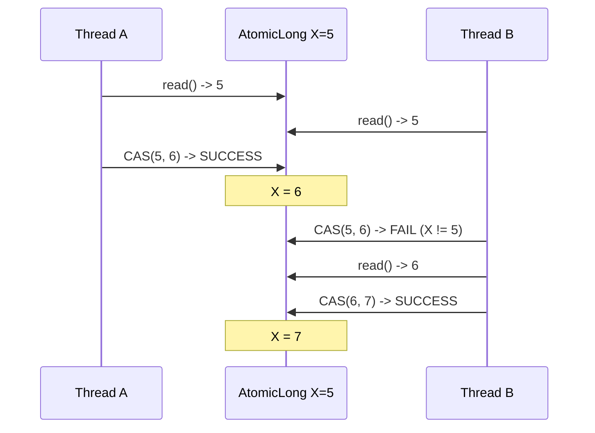
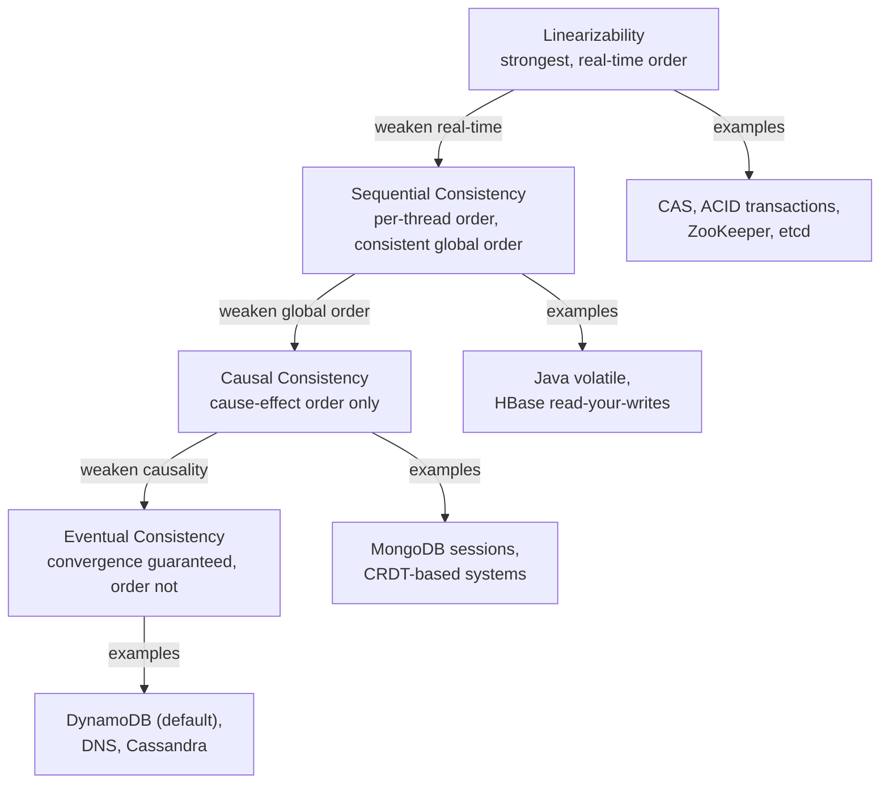

# Java Concurrency - L6 Theory

## Lock-Free Algorithms

### 🎯 Model Answer

**30 seconds:**
> Lock-free algorithms guarantee system-wide progress: at least one thread
> makes progress even if other threads are delayed or suspended. They
> achieve this by replacing mutual exclusion locks with atomic operations
> (CAS, compare-and-swap) that succeed for one thread even when others
> contend. Unlike non-blocking structures that use locks, lock-free code
> avoids: priority inversion, deadlock, convoying, and the overhead of
> OS thread blocking. The cost: algorithm complexity and the ABA problem.

**3 minutes (Senior):**
> Lock-free progress guarantees: (1) lock-free = system-wide progress,
> at least one thread makes progress per a bounded number of steps.
> (2) wait-free = every thread makes progress in a bounded number of
> its own steps (stronger guarantee, harder to implement). Java's
> AtomicInteger, AtomicReference, ConcurrentLinkedQueue are lock-free.
> LongAdder is lock-free via striped CAS.
>
> Core pattern: read-modify-CAS loop.
> ```
> do {
>   old = current.get();
>   newVal = compute(old);
> } while (!current.compareAndSet(old, newVal));
> ```
> This loop retries if another thread changed `current` between our
> read and CAS. ABA problem: CAS succeeds even if value went A -> B -> A.
> Fix: `AtomicStampedReference` or `AtomicMarkableReference` (adds version
> or mark to the reference).
>
> Java lock-free data structures: ConcurrentLinkedQueue (Michael-Scott
> queue, two CAS for enqueue/dequeue), ConcurrentLinkedDeque, LongAdder
> (striped counters, no single CAS hot spot).

**Framework:** WHAT → WHY → HOW → TRADE-OFF → EXAMPLE

*Adapting up:* Discuss memory ordering requirements for lock-free
algorithms on weakly-ordered architectures (ARM), the ABA problem in
depth with pointer tagging solutions, the Michael-Scott queue algorithm,
and Herlihy's consensus number for classifying synchronization primitives.

*Adapting down:* "Lock-free is like multiple people updating a shared
whiteboard without a lock on the room door. Each person reads the board,
computes their update, then tries to write. If someone else changed the
board first (CAS fails), they re-read and try again."

**Blank Mind Recovery:**

**(1) Restate:** "Lock-free algorithms - let me explain what progress
guarantee they provide, how CAS implements them, and the key problem
of ABA."

**(2) First principles:** "From first principles: mutual exclusion
creates a bottleneck (one thread at a time). Lock-free algorithms
remove the mutual exclusion lock, using atomic hardware instructions
(CAS) to coordinate without blocking any thread."

**(3) Bridge:** "Lock-free is like an optimistic transaction: do the
work, then check if the world changed. If it did, redo. If it didn't,
commit. No lock held while working, so no other thread is blocked."

---

### 📘 Concept Explanation

**What it is:**
Lock-free algorithms are concurrent algorithms that guarantee system-
wide progress without using mutex locks. At least one thread makes
progress in a bounded number of steps, regardless of how other threads
are scheduled.

**Progress guarantee hierarchy:**
```
Blocking (locks)
  Some thread may block indefinitely (deadlock possible)
  
Obstruction-free
  Isolated thread makes progress, but concurrent threads may all fail
  
Lock-free
  At least one thread among all concurrent threads makes progress
  No deadlock possible, but individual threads may starve
  
Wait-free
  Every thread makes progress in a bounded number of its own steps
  Strongest guarantee - hardest to implement
  
Java examples:
  Wait-free:   AtomicInteger.get()  (single read, always succeeds)
  Lock-free:   AtomicInteger.incrementAndGet() (CAS loop, global progress)
  Lock-based:  synchronized blocks, ReentrantLock
```

**CAS - the atomic primitive:**
Compare-and-Swap is the hardware instruction (x86: `CMPXCHG`) that
underpins lock-free algorithms:
```
CAS(memory_location, expected, new_value):
  atomically:
    if (*memory_location == expected):
      *memory_location = new_value
      return SUCCESS
    else:
      return FAILURE (current value unchanged)
```

**ABA problem:**
```
Thread 1: reads value A from address X
Thread 1: preempted

Thread 2: changes X from A -> B
Thread 2: changes X back from B -> A

Thread 1: resumes, CAS(X, A, newValue) SUCCEEDS!
  But the object at X may have been recycled/reallocated!
  Thread 1 made a decision based on stale state (the A it read
  was a different A than the current A)
```

**ABA fix - AtomicStampedReference:**
```java
AtomicStampedReference<Node> head =
    new AtomicStampedReference<>(initialNode, 0);

// Read: both value AND version:
int[] stampHolder = new int[1];
Node current = head.get(stampHolder);
int stamp = stampHolder[0];

// CAS includes version check:
boolean success = head.compareAndSet(
    current, newNode,   // value old -> new
    stamp, stamp + 1);  // version old -> new
// A->B->A trick fails: stamp would be 0->1->2, not 0->0->0
```

---

### 💻 Code Example

> **Code walkthrough:** The BAD example uses synchronized for a counter,
> creating contention. The GOOD example uses AtomicInteger CAS loop
> for a lock-free counter. The production example shows a lock-free
> Treiber stack (classic lock-free stack using CAS on the head).

```java
// BAD: synchronized counter - all threads serialize through lock
class LockedCounter {
    private long value = 0;
    private final Object lock = new Object();

    synchronized void increment() { value++; }
    synchronized long get() { return value; }
}
// All threads compete for lock even when incrementing different "slots"
```

```java
// GOOD: lock-free counter using CAS loop
class LockFreeCounter {
    private final AtomicLong value = new AtomicLong(0);

    void increment() {
        // CAS loop: retry if another thread updated first
        value.incrementAndGet(); // internally: CAS loop
    }

    // Explicit CAS loop for conditional increment:
    boolean incrementIfLessThan(long limit) {
        while (true) {
            long current = value.get();
            if (current >= limit) return false;
            if (value.compareAndSet(current, current + 1)) return true;
            // Another thread changed value - retry
        }
    }

    long get() { return value.get(); }
}
```

```java
// PRODUCTION: lock-free Treiber stack
// Classic lock-free stack using CAS on the head pointer
class LockFreeStack<T> {
    // Immutable node:
    private static class Node<T> {
        final T value;
        final Node<T> next;
        Node(T v, Node<T> n) { this.value = v; this.next = n; }
    }

    private final AtomicReference<Node<T>> head =
        new AtomicReference<>(null);

    void push(T value) {
        Node<T> newHead;
        Node<T> oldHead;
        do {
            oldHead = head.get();
            newHead = new Node<>(value, oldHead);
            // CAS: only succeeds if head hasn't changed since oldHead read
        } while (!head.compareAndSet(oldHead, newHead));
    }

    T pop() {
        Node<T> oldHead;
        Node<T> newHead;
        do {
            oldHead = head.get();
            if (oldHead == null) return null; // empty
            newHead = oldHead.next;
        } while (!head.compareAndSet(oldHead, newHead));
        return oldHead.value;
    }
}
// ABA problem: if a Node is recycled and pushed again with same address,
// CAS could succeed incorrectly. Fix: AtomicStampedReference<Node<T>>
```

---

### 🎓 Answers by Seniority

**Junior / Mid (0-5 years):**
> Lock-free algorithms use atomic operations like CAS instead of locks.
> CAS checks if a value matches what we expect and updates it atomically.
> If another thread changed the value first, CAS fails and we retry.
> This means no thread is ever blocked - threads either succeed or retry.
> Java's AtomicInteger, AtomicReference, and ConcurrentLinkedQueue are
> lock-free. The main caveat is the ABA problem: CAS can succeed
> incorrectly if a value changes and changes back to the original.

---

**Senior / Staff (5+ years):**
> Lock-free algorithms provide a weaker guarantee than wait-free:
> system-wide progress, not per-thread. The core primitive is CAS.
> The CAS loop pattern (read-compute-CAS-retry) is correct but can
> livelock under extreme contention (every thread's CAS fails in a
> "CAS storm"). LongAdder solves this by distributing the CAS across
> multiple cells - any cell is likely uncontended. The ABA problem
> requires version tagging (AtomicStampedReference). In practice, I
> use JDK lock-free data structures (ConcurrentLinkedQueue, LongAdder)
> rather than implementing my own. Custom lock-free algorithms require
> formal verification to prove correctness.

---

### ⚠️ Common Misconceptions

**Misconception 1: "Lock-free is always faster than locked."**
Lock-free uses CAS, which is a memory barrier (flush CPU pipeline,
invalidate cache lines). Under low contention, a synchronized block
may be faster (no contention = biased lock, near-zero overhead). Lock-
free wins under HIGH contention: no thread sleeps, no OS scheduler
overhead. Profile before switching.

**Misconception 2: "CAS is truly atomic on all CPUs."**
On x86: `CMPXCHG` with `LOCK` prefix is atomic on a single memory
location up to 8 bytes. On 32-bit systems: `AtomicLong` CAS on 64-bit
values uses a different mechanism. On multi-socket NUMA: the LOCK
prefix flushes the cache line across sockets - expensive. Lock-free
on NUMA may be slower than expected.

**Misconception 3: "Lock-free eliminates all concurrency bugs."**
Lock-free eliminates deadlocks and priority inversion. It does NOT
eliminate: races on multiple non-atomic operations (need atomic
compound operation), ABA problem, starvation (individual threads may
always lose the CAS race), and logical correctness issues in the
CAS loop body.

---

### 🚨 Failure Modes and Diagnosis

**Failure 1: CAS storm (high CAS retry rate)**
Symptom: lock-free code, but throughput lower than synchronized version;
CPU high due to wasted CAS retries.
Cause: all N threads read, compute, then CAS. One succeeds, N-1 retry.
Those N-1 again read, compute, CAS. Another one succeeds, N-2 retry.
Each "round" does O(N) work to advance by 1. Throughput = O(1/N).
Fix: use LongAdder (distributes contention across cells) or
exponential backoff before retry.

**Failure 2: ABA in a recycling pool**
Symptom: lock-free stack or queue corrupts data intermittently.
Cause: Node recycling (object pool or GC compaction) causes the same
address to appear twice in history - ABA.
Diagnosis: add invariant checks or use AtomicStampedReference.
```java
// ABA detection: print when CAS succeeds with recycled node
AtomicStampedReference<Node> head = new AtomicStampedReference<>(null, 0);
```

---

### 🎯 Interview Deep-Dive

| Question Category | Time to Answer |
|---|---|
| Definition / progress guarantee | 2-3 minutes |
| CAS mechanism | 2-3 minutes |
| ABA problem | 3-4 minutes |
| Java lock-free structures | 2-3 minutes |
| CAS storm | 2-3 minutes |
| Wait-free vs lock-free | 2-3 minutes |
| LongAdder design | 3-4 minutes |
| Custom implementation | 3-4 minutes |
| When to use | 2-3 minutes |

---

**Q1 (Definition): What does "lock-free" mean as a progress guarantee?**

A: Lock-free is a progress guarantee at the system level: among all
concurrent threads running a lock-free algorithm, AT LEAST ONE thread
makes progress (completes an operation) in a bounded number of steps,
regardless of how other threads are scheduled.

Contrast with blocking: in a lock-based system, if the thread holding
a mutex is suspended by the OS, ALL other threads waiting for that mutex
are blocked. One thread's suspension causes system-wide stall.

In a lock-free system: no thread holds a resource exclusively. If
Thread A fails its CAS, Thread A retries. Thread B may have succeeded
(system made progress). Thread A retrying doesn't require Thread B
to be in any particular state.

Wait-free (stronger): EVERY thread makes progress in a bounded number
of its OWN steps. No thread can starve. Much harder to implement.
AtomicInteger.get() is wait-free (one read, always succeeds).
AtomicInteger.incrementAndGet() is lock-free (CAS loop, global progress
but individual threads may retry many times).

*What separates good from great:* The distinction between lock-free
and wait-free matters for real-time and safety-critical systems.
In a real-time OS, priority inversion and unbounded retry loops are
unacceptable. Wait-free algorithms provide deterministic step bounds -
but they are significantly more complex to implement and often have
higher constant factors. For most Java services, lock-free (not wait-
free) is the target and is achievable with JDK primitives.

---

**Q2 (CAS mechanism): Explain how CAS works and its memory model
implications.**

A: CAS (Compare-and-Swap) is an atomic hardware instruction:

```
CAS(address, expected, new_value) -> boolean
  atomically:
    if memory[address] == expected:
      memory[address] = new_value
      return true
    else:
      return false
```

On x86: compiled to `LOCK CMPXCHG` instruction.
On ARM: compiled to `LDAXR` / `STLXR` (load-acquire / store-release).

Memory model implications:
- CAS is both an acquire and release fence in the Java Memory Model.
  A successful CAS: (1) sees all writes by the thread that last CAS'd
  successfully (acquire), and (2) makes the new value visible to the
  next successful CAS (release).
- Failed CAS: no fence semantics guaranteed.

The standard CAS loop:
```java
do {
    long current = atom.get();   // load (acquire semantics)
    long update = f(current);    // compute new value
} while (!atom.compareAndSet(current, update)); // CAS (acquire+release)
```

Performance cost of CAS:
- Uncontended: ~3-4 nanoseconds (just a locked instruction)
- Contended (cache line contested): ~20-100 nanoseconds (cache line
  bounces between cores)
- CAS storm: O(N^2) work for N threads

*What separates good from great:* The ARM memory model is weaker than
x86. On x86, all loads and stores are sequentially consistent by default
(no reordering except store-load). On ARM, reordering is possible. Java
CAS maps to `STLXR` (store-release) on ARM, which provides the required
ordering semantics. But when writing lock-free code for native platforms,
the choice of memory order (relaxed, acquire, release, seq_cst) matters.
Java abstracts this but restricts implementation choices.

---

**Q3 (ABA problem): Explain the ABA problem and solutions.**

A: The ABA problem: CAS succeeds even when the value has changed and
changed back to the original.

Scenario (lock-free stack):
```
Initial: head -> A -> B -> C

Thread 1: reads head = A (pointer to Node A)
Thread 1: preempted

Thread 2: pops A and B from stack (head -> C)
Thread 2: pushes A back (head -> A -> C)
  Note: A is the SAME pointer, but A.next is now C, not B!

Thread 1: resumes, CAS(head, A, B) SUCCEEDS
  Because head is still A (pointer value matches)
  But B is no longer in the stack! A.next should be C, not B.
  Stack is now corrupted: head -> B -> (dangling?)
```

Fix 1: AtomicStampedReference (version number):
```java
AtomicStampedReference<Node> head =
    new AtomicStampedReference<>(nodeA, 0); // version=0

// Thread 1: reads both value AND version
int[] stamp = {0};
Node current = head.get(stamp); // stamp[0] = 0

// Thread 2: pops and pushes A, each time incrementing version
// After Thread 2: head=(A, version=2)

// Thread 1: CAS with old stamp=0 FAILS because current stamp=2:
head.compareAndSet(current, newNode, stamp[0], stamp[0] + 1);
// stamp[0]=0, but actual stamp=2 -> FAIL -> Thread 1 retries
```

Fix 2: Hazard pointers (not in Java stdlib):
Mark nodes as "in use" before reading their fields. GC in managed
languages partially mitigates ABA by never reusing live object addresses.

Fix 3: Epoch-based reclamation (garbage collection in C++ lock-free
structures - less relevant in Java with GC).

*What separates good from great:* In Java, the GC provides partial
protection against ABA: a Node object cannot be allocated at the same
memory address as a live Node. However, if you use an OBJECT POOL
(reuse Node objects to avoid allocation), ABA becomes a real risk
because the same Node object reference can appear twice in history.
Always use AtomicStampedReference when using pooled objects in lock-
free data structures.

---

**Q4 (Java lock-free structures): What lock-free data structures does
Java provide?**

A: JDK lock-free data structures:

**Atomic primitives (CAS-based):**
- AtomicInteger, AtomicLong, AtomicBoolean: lock-free CAS loops
- AtomicReference<T>: lock-free reference update
- AtomicStampedReference<T>: with version counter (ABA protection)
- AtomicMarkableReference<T>: with boolean mark
- AtomicIntegerArray, AtomicLongArray, AtomicReferenceArray

**Lock-free data structures:**
- ConcurrentLinkedQueue<E>: Michael-Scott non-blocking queue
  - Enqueue: CAS on tail, then CAS on last node's next
  - Dequeue: CAS on head
  - size() is O(N) - not a reliable concurrent metric
- ConcurrentLinkedDeque<E>: non-blocking double-ended queue
- LongAdder: striped lock-free counter (not ABA-subject per counter)
  - Internal `Cell[]` array, each Cell an AtomicLong
  - Increment hashes to a Cell, CAS that Cell (likely uncontended)
  - sum() aggregates all cells
- LongAccumulator: generalized LongAdder for any associative operation

**Not strictly lock-free but minimally locked:**
- ConcurrentHashMap: lock-free reads (volatile), CAS on empty buckets,
  synchronized only on individual bucket during resize/collision
- CopyOnWriteArrayList: lock only on writes (copy entire array), lock-
  free reads

*What separates good from great:* ConcurrentLinkedQueue's `size()` is
O(N) and traverses the queue to count elements. Under high concurrency
this is inaccurate and slow. For a queue where you need the current
size, use LinkedBlockingQueue (has an atomic counter for size()) or
track size externally with an AtomicInteger.

---

**Q5 (CAS storm): What is a CAS storm and how is it mitigated?**

A: CAS storm: under high contention, all N threads attempt CAS on the
same memory location, only one succeeds per round, N-1 retry. In the
next round, N-1 attempt again, one succeeds, N-2 retry.

Analysis:
```
Round 1: N threads CAS -> 1 succeeds, N-1 retry (O(N) total CAS ops)
Round 2: N-1 threads CAS -> 1 succeeds, N-2 retry (O(N-1) total CAS ops)
...
Total work to advance by N: O(N^2)
Throughput: O(1/N) - throughput DECREASES as threads increase
```

Mitigation strategies:

**1. LongAdder / LongAccumulator:**
```java
LongAdder adder = new LongAdder();
adder.increment(); // CAS on one of 16 Cells (hash(threadId) % cells)
// Different threads likely hit different Cells
// N threads -> N/16 threads per Cell -> much less contention
```

**2. Exponential backoff:**
```java
int backoff = 1;
while (!atom.compareAndSet(expected, update)) {
    LockSupport.parkNanos(backoff * 100L);
    backoff = Math.min(backoff * 2, 1024); // exponential, capped
    expected = atom.get();
    update = compute(expected);
}
```

**3. Eliminate the shared state:**
Use per-thread counters (ThreadLocal) aggregated periodically.

*What separates good from great:* LongAdder's internal resizing is
worth knowing. It starts with one Cell. On contention, it adds more
Cells (doubles the array) up to CPU count. The Cell array size is
bounded by the hardware parallelism - no point having more cells than
cores. This makes LongAdder O(1) throughput regardless of thread count,
unlike AtomicLong which degrades to O(1/N) under high contention.

---

**Q6 (Wait-free vs lock-free): When would you need wait-free instead
of lock-free?**

A: Wait-free provides the stronger guarantee that EVERY thread completes
its operation in a bounded number of steps.

Lock-free guarantees system-wide progress but allows individual thread
starvation. Under high contention, a specific thread may retry its CAS
many times while other threads succeed.

**When wait-free matters:**
- Real-time systems: bounded execution time required per operation
- Safety-critical systems: worst-case latency must be guaranteed
- Low-priority threads must not be indefinitely starved

**Examples:**
- AtomicInteger.get(): wait-free (single load, always succeeds)
- AtomicInteger.set(): wait-free (single store)
- AtomicInteger.incrementAndGet(): lock-free (CAS loop)
- Reading an immutable structure: wait-free

**Trade-offs:**
Wait-free algorithms are harder to implement and often have higher
AVERAGE cost (more memory, more operations per call) to guarantee
worst-case bounds. For most Java services, lock-free is sufficient.

*What separates good from great:* In Java, you can approximate wait-
free behavior for important operations by bounding the CAS retry count
and falling back to a lock after N retries:
```java
int retries = 0;
while (!atom.compareAndSet(expected, update)) {
    if (++retries > 8) {
        synchronized(fallbackLock) { /* guaranteed progress */ }
        return;
    }
    expected = atom.get();
    update = compute(expected);
}
```
This is sometimes called "bounded spinning with lock fallback."

---

**Q7 (LongAdder design): How does LongAdder work internally?**

A: LongAdder is designed specifically for high-contention increment use
cases where AtomicLong degrades under CAS storms.

Internal structure:
```java
// Simplified internal structure:
class LongAdder extends Striped64 {
    // Base: used when no contention (uncontended fast path)
    transient volatile long base;

    // Cells: created on contention, each on its own cache line
    // Cell is @Contended: padded to 128 bytes (separate cache line)
    transient volatile Cell[] cells; // power of 2 size
}

@sun.misc.Contended
class Cell {
    volatile long value;
    boolean cas(long cmp, long val) {
        return VALUE.compareAndSet(this, cmp, val);
    }
}
```

increment() logic:
1. Hash thread ID to determine target Cell index.
2. Attempt CAS on the Cell.
3. If Cell is null: try CAS on base (no contention detected).
4. If CAS on base fails: initialize Cell array (first contention).
5. If CAS on Cell fails: rehash to a different Cell or expand array.
6. If array already max size (CPU count): rehash continuously.

sum() / longValue():
```java
long sum() {
    Cell[] cs; long sum = base;
    if ((cs = cells) != null)
        for (Cell c : cs) if (c != null) sum += c.value;
    return sum;
}
```
Note: sum() is NOT atomic. While iterating cells, other threads
may be incrementing them. LongAdder.sum() is an estimate. For
exact value: use AtomicLong.

*What separates good from great:* The @Contended annotation on Cell
is essential. Without it, all 16 Cell objects would be adjacent in
memory and share cache lines. Thread A updating Cell[0] would
invalidate Thread B's cache containing Cell[1] - false sharing.
@Contended pads each Cell to its own cache line, ensuring that updates
to different Cells on different CPUs are truly independent.

---

**Q8 (Custom implementation): Implement a lock-free queue.**

A: Michael-Scott non-blocking queue (basis of ConcurrentLinkedQueue):
```java
class LockFreeQueue<T> {
    private static class Node<T> {
        final T item;
        final AtomicReference<Node<T>> next =
            new AtomicReference<>(null);
        Node(T item) { this.item = item; }
    }

    private final AtomicReference<Node<T>> head;
    private final AtomicReference<Node<T>> tail;

    LockFreeQueue() {
        Node<T> sentinel = new Node<>(null);
        head = new AtomicReference<>(sentinel);
        tail = new AtomicReference<>(sentinel);
    }

    void enqueue(T item) {
        Node<T> newNode = new Node<>(item);
        while (true) {
            Node<T> t = tail.get();
            Node<T> next = t.next.get();
            if (t == tail.get()) {       // consistent read
                if (next == null) {
                    // Tail is pointing to last node: try to link
                    if (t.next.compareAndSet(null, newNode)) {
                        // Advance tail (may fail if another thread does it)
                        tail.compareAndSet(t, newNode);
                        return;
                    }
                } else {
                    // Tail not pointing to last node: advance it
                    tail.compareAndSet(t, next);
                }
            }
        }
    }

    T dequeue() {
        while (true) {
            Node<T> h = head.get();
            Node<T> t = tail.get();
            Node<T> next = h.next.get();
            if (h == head.get()) { // consistent read
                if (h == t) {
                    if (next == null) return null; // empty
                    tail.compareAndSet(t, next);    // advance tail
                } else {
                    T item = next.item;
                    if (head.compareAndSet(h, next)) return item;
                }
            }
        }
    }
}
```

*What separates good from great:* The "consistent read" checks (`t == tail.get()`)
are necessary because the algorithm uses two CAS operations (one to
link the new node, one to advance tail). Between these two CAS ops,
another thread may advance the tail. The algorithm is designed so that
any intermediate state is still valid and can be advanced by ANY thread -
not just the original enqueuer. This "helping" property is what makes
the queue lock-free rather than just non-blocking.

---

**Q9 (When to use): When should you use lock-free algorithms vs
locks in production?**

A: Decision framework:

**Use lock-free (JDK primitives) when:**
- Counter/accumulator under high contention: LongAdder
- Shared reference swap (config reload): AtomicReference
- Simple conditional update: AtomicInteger.compareAndSet()
- FIFO queue: ConcurrentLinkedQueue
- Map with lock-free reads: ConcurrentHashMap

**Avoid custom lock-free algorithms when:**
- You need compound operations on multiple variables (locks are simpler)
- The data structure has complex invariants (correctness hard to prove)
- The team lacks expertise in memory model subtleties
- The bottleneck is not actually lock contention (profile first)

**Use locks when:**
- Critical section is short and contention is low (biased lock = near zero cost)
- You need compound atomic operations on multiple variables
- The logic is complex (deadlock is preferable to an ABA bug that corrupts data)

*What separates good from great:* Production rule: use JDK's lock-free
structures (ConcurrentHashMap, LongAdder, ConcurrentLinkedQueue) instead
of rolling your own. These are battle-tested, formally verified, and
maintained. Custom lock-free algorithms require formal proofs and are
prone to subtle bugs under edge cases. Only implement custom lock-free
code when JDK structures do not fit the use case AND you have the formal
methods expertise to verify correctness.

---

### ⚖️ Comparison Table

| Technique | Progress Guarantee | ABA Risk | Throughput (high concention) | Complexity |
|---|---|---|---|---|
| Synchronized | Blocking (OS mutex) | None | Low (serialized) | Low |
| ReentrantLock | Blocking (park/unpark) | None | Low-Medium | Low |
| AtomicLong CAS loop | Lock-free | Low (GC protects) | Medium (CAS storm) | Medium |
| AtomicStampedReference | Lock-free | None (version) | Medium | High |
| LongAdder | Lock-free + striped | None | High (distributes) | Low (API only) |
| ConcurrentLinkedQueue | Lock-free | None (GC protects) | High | Low (API only) |
| Wait-free (e.g., AtomicInteger.get) | Wait-free | N/A | Highest | Very High |

---

### 🏛️ System Design

*(Omit: L6 Theory - non-★★★ level. System design applies to ★★★ keywords.)*

---

### 📊 Diagram

```
Lock-free CAS loop:

Thread A              Thread B
  read X = 5           read X = 5
  compute Y = 6
                       compute Y = 6
  CAS(X, 5, 6) -> OK   CAS(X, 5, 6) -> FAIL (X is now 6)
                       re-read X = 6
                       compute Y = 7
                       CAS(X, 6, 7) -> OK
System progress: at least one thread succeeds per round
```



> **Diagram walkthrough:** Both threads read the same value (5) and try
> to CAS. Thread A succeeds first (system makes progress - lock-free
> guarantee met). Thread B's CAS fails because X changed from 5 to 6.
> Thread B retries: reads the new value (6), computes the new update (7),
> and CAS succeeds on the retry. This is the fundamental CAS loop pattern:
> read, compute, CAS, retry on failure. No thread is ever blocked waiting
> for another - both are always making attempts.

---

---

## Linearizability and Sequential Consistency

### 🎯 Model Answer

**30 seconds:**
> Linearizability is the gold-standard correctness condition for
> concurrent data structures: each operation appears to take effect
> atomically at some single point between its invocation and completion.
> Sequential consistency is weaker: operations can be reordered as long
> as: (1) each thread's operations appear in program order, and (2) all
> threads see the same total order. Java volatile provides sequential
> consistency for volatile variable accesses. CAS provides linearizability.

**3 minutes (Senior):**
> Linearizability requires a real-time ordering: if operation A completes
> before operation B starts (in real time), then A must appear before B
> in the total operation order. This makes the concurrent execution appear
> equivalent to a sequential execution where all operations happen
> instantaneously.
>
> Sequential consistency relaxes the real-time requirement: threads see
> a consistent total order, but that order may not match the real-time
> ordering of non-overlapping operations. This distinction matters for:
> (1) reasoning about distributed systems, (2) designing lock-free data
> structures, and (3) understanding why double-checked locking without
> volatile is broken (violates sequential consistency).
>
> Practical relevance: Java's memory model defines happens-before, which
> is a form of sequential consistency. For lock-free data structures to
> be linearizable, their CAS operations must be both the synchronization
> point AND the atomic effect point.

**Framework:** WHAT → WHY → HOW → TRADE-OFF → EXAMPLE

*Adapting up:* Discuss the formal definition from Herlihy and Wing's
1990 paper, the hierarchy of memory consistency models (linearizability
> sequential consistency > causal consistency > eventual consistency),
and how the choice of consistency model affects distributed database
design (CAP theorem relationship).

*Adapting down:* "Linearizability is the gold standard of 'fair' concurrent
behavior: the system behaves as if operations happened one at a time in
a sensible order that respects real time. If you called a function and
I called mine, and yours finished before mine started, it must look
like yours happened before mine."

**Blank Mind Recovery:**

**(1) Restate:** "You are asking about linearizability and sequential
consistency as correctness models for concurrent operations."

**(2) First principles:** "From first principles: when multiple threads
access shared data, we need a model to say what 'correct' means. The
models define which orderings of operations are considered valid."

**(3) Bridge:** "Linearizability is like a bank where every transaction
appears on the statement in the exact real-world time order. Sequential
consistency is like a bank that guarantees YOUR transactions appear in
order, but may reorder transactions from different accounts."

---

### 📘 Concept Explanation

**What it is:**
Linearizability and sequential consistency are formal correctness
conditions for concurrent objects, defining when a concurrent execution
is considered "correct."

**Linearizability (strong):**
A concurrent execution is linearizable if each operation appears to
take effect atomically at some single point (the "linearization point")
within the real-time interval of that operation.

Properties:
1. Operation seems instantaneous (no partial states visible)
2. Real-time order preserved: if A completes before B starts, A's
   effect appears before B's effect
3. Each thread's operations appear in their program order

**Sequential consistency (weaker):**
A concurrent execution is sequentially consistent if there exists a
sequential (total) order of all operations such that:
1. Each thread's operations appear in their program order
2. The results of operations match the sequential specification

Key difference: sequential consistency does NOT require the total order
to respect real-time inter-thread ordering. Non-overlapping operations
from different threads may be reordered.

**Practical implication:**

```
Thread A: write(x, 1); write(y, 1)
Thread B: read(y) -> 1; read(x) -> 0

Under linearizability: ILLEGAL
  B reads y=1 (B started after A wrote y=1)
  B reads x=0 (should see x=1 since A wrote x=1 BEFORE y=1)
  Contradiction with real-time ordering

Under sequential consistency: LEGAL
  Reordering allows: Thread A's write(y,1) -> Thread B's reads -> Thread A's write(x,1)
  Thread B reads y=1 (correct) and x=0 (Thread A hadn't "committed" x yet in this order)
```

**Java's memory model:**
Java volatile provides sequential consistency for volatile accesses.
Java synchronized/CAS provides linearizability for operations within
the critical section.

---

### 💻 Code Example

> **Code walkthrough:** The BAD example shows an operation that is NOT
> linearizable - it appears atomic but has a window where internal state
> is inconsistent. The GOOD example uses a single CAS to make the
> operation truly linearizable.

```java
// BAD: non-linearizable "atomic" update (two separate writes)
class BadPoint {
    volatile int x, y;

    // NOT linearizable: between writing x and y, another thread
    // can see x=newX, y=oldY - an inconsistent intermediate state
    void setPoint(int newX, int newY) {
        x = newX; // write 1
        y = newY; // write 2
        // Another thread reading between these two writes:
        // sees a point that was never "intended"
    }
}
```

```java
// GOOD: linearizable point update using AtomicReference
class LinearizablePoint {
    record Point(int x, int y) {}
    private final AtomicReference<Point> point =
        new AtomicReference<>(new Point(0, 0));

    // Single CAS = single linearization point
    void setPoint(int newX, int newY) {
        point.set(new Point(newX, newY)); // single volatile write
        // Any reader sees either the old Point OR the new Point
        // No intermediate state possible
    }

    Point getPoint() { return point.get(); } // always consistent
}
```

---

### 🎓 Answers by Seniority

**Junior / Mid (0-5 years):**
> Linearizability means every operation looks like it happened atomically
> at a single instant - there's never a "half-done" state visible to
> other threads. For example, if I call `getAndIncrement()` on an
> AtomicInteger, no other thread ever sees a partial state between the
> read and the increment. Sequential consistency is weaker: it guarantees
> each thread's operations stay in order, but may reorder operations
> between threads. Java volatile provides sequential consistency.

---

**Senior / Staff (5+ years):**
> Linearizability is the correctness condition that makes concurrent
> data structures "behave correctly." A concurrent data structure is
> linearizable if every operation has a linearization point - a single
> instant where the operation takes effect. CAS has a clear linearization
> point: the CAS instruction itself. Two-field update (write x, then y)
> is NOT linearizable because the linearization point is ambiguous.
> Sequential consistency is what Java's volatile gives you: a consistent
> total order across all volatile accesses, but real-time inter-thread
> ordering is not guaranteed (x86 provides this for free; ARM may need
> fences). When designing concurrent data structures, I verify they are
> linearizable by identifying the linearization point of each operation
> and proving no intermediate state violates the sequential specification.

---

### ⚠️ Common Misconceptions

**Misconception 1: "volatile gives you linearizability."**
volatile gives sequential consistency for the volatile variable's
accesses. It does NOT give linearizability for compound operations.
`volatile int x; volatile int y; setX(1); setY(1)` - a reader can
see x=1, y=0 which violates the "atomic point update" semantic.
True linearizability for compound operations requires a single CAS
or lock.

**Misconception 2: "Sequential consistency is the weakest model we care about."**
There are many weaker models: causal consistency (respects causal
ordering), FIFO consistency (each thread's writes seen in order by
all), eventual consistency (all nodes eventually agree). Distributed
databases often use eventual consistency for availability (DynamoDB,
Cassandra). Java's memory model is stronger than eventual consistency
but the distinction matters for distributed system design.

---

### 🚨 Failure Modes and Diagnosis

**Failure: Assuming volatile compound operations are atomic.**
Symptom: data corruption with two volatile fields that must be
consistent together.
Cause: two volatile writes are NOT linearizable as a pair.
```java
volatile int x, y;
// Thread A: x = 1; y = 1;
// Thread B: if (y == 1) assert x == 1; // FAILS!
// Thread B may see y=1 but x=0 (store-store reorder on non-x86)
```
Fix: use AtomicReference<Point> or synchronize the compound operation.

---

### 🎯 Interview Deep-Dive

| Question Category | Time to Answer |
|---|---|
| Definition | 2-3 minutes |
| Real-time ordering | 2-3 minutes |
| Java memory model connection | 3-4 minutes |
| Linearization point | 3-4 minutes |
| Sequential vs linearizable | 3-4 minutes |
| Distributed systems connection | 2-3 minutes |
| Verification | 2-3 minutes |
| Practical relevance | 2-3 minutes |
| DCL and linearizability | 3-4 minutes |

---

**Q1 (Definition): Define linearizability and explain why it matters
for concurrent data structures.**

A: Linearizability is a correctness condition: a concurrent execution
of a data structure is linearizable if each operation appears to take
effect at a single, instantaneous point in time (the linearization
point) within the operation's real-time interval.

Why it matters: without linearizability, concurrent data structures
can produce results that are impossible under any sequential execution
order. This makes programs impossible to reason about.

Example - non-linearizable counter:
```
Thread A: read counter=5; increment to 6; write counter=6
Thread B: read counter=5; increment to 6; write counter=6
Result: counter=6 (should be 7)
```
This violates linearizability: no sequential order of these operations
produces counter=6 if the counter started at 5 and both threads
incremented once.

Linearizable counter (CAS):
```
Thread A: CAS(5, 6) -> SUCCESS; counter=6
Thread B: CAS(5, 6) -> FAIL; re-read 6; CAS(6, 7) -> SUCCESS; counter=7
Result: counter=7 (correct)
```
CAS makes the increment linearizable: the linearization point is the
successful CAS.

*What separates good from great:* Linearizability is "composable": if
operation A is linearizable and operation B is linearizable, then
calling A then B together is also linearizable. This property makes
it safe to build larger systems from linearizable components. Sequential
consistency is NOT composable in this way, which is why it's harder
to build systems from sequentially consistent components.

---

**Q2 (Real-time ordering): What is the difference between the real-time
ordering requirement in linearizability vs sequential consistency?**

A: The key difference is whether the total order of operations must
respect the real-time ordering of non-overlapping operations.

**Linearizability:** Total order MUST respect real-time.
If operation A completes before operation B starts (in real clock time),
then A must appear before B in the total order.

```
Timeline:
  A: [write x=1]----------complete
  B:                              [read x] -> returns 0
  
Under linearizability: ILLEGAL
  A completed before B started.
  B must see x=1 (A's write must appear before B's read in the total order).
  B returning 0 violates the real-time constraint.
```

**Sequential consistency:** Total order does NOT need to respect
real-time for non-overlapping operations.
```
Same timeline under sequential consistency: LEGAL
  The total order could be: [read x -> 0] then [write x=1]
  This is a valid sequential execution (x was 0 before write).
  Sequential consistency allows this reordering.
```

**Practical impact:**
- Linearizability: safe for any real-time reasoning ("I called the
  service and it returned success, so subsequent calls will see the update")
- Sequential consistency: safe only within a single session (each thread
  sees its own writes in order, but inter-thread real-time ordering not
  guaranteed)

*What separates good from great:* This distinction is central to
distributed systems. Amazon DynamoDB's "strongly consistent reads"
provide linearizability within a region. "Eventually consistent reads"
provide eventual consistency (much weaker - doesn't even guarantee
sequential consistency). The linearizability guarantee is what makes
it safe to read immediately after a write and know you'll see the write.

---

**Q3 (Java memory model connection): How does linearizability relate
to Java's memory model?**

A: Java's memory model (JMM) defines "happens-before" (HB) as the
ordering guarantee:

- `volatile` write HB `volatile` read (if read sees the write)
- `synchronized` exit HB `synchronized` entry on same object
- `Thread.start()` HB any action in the started thread
- Thread's last action HB `Thread.join()` return

This is sequential consistency for the HB-related operations:
```java
// Sequential consistency for volatile:
volatile boolean ready = false;
int data = 0;

// Thread A:
data = 42;          // non-volatile
ready = true;       // volatile write -> HB fence

// Thread B:
if (ready) {        // volatile read -> sees data=42
    assert data == 42; // GUARANTEED: volatile read HB-after volatile write
                       // which HB-after the non-volatile write
}
```

**Linearizability in Java:**
CAS operations provide linearizability:
```java
AtomicInteger counter = new AtomicInteger(0);

// Linearization point: the successful CAS instruction
counter.incrementAndGet();
// Observable effect: counter increased by 1, atomically
// No thread ever sees counter in an intermediate state
```

**Double-checked locking requires volatile for linearizability:**
```java
// BROKEN (pre-Java 5): not linearizable without volatile
// Compiler can reorder: allocate object THEN write reference,
// before constructor completes.
private Singleton instance;

// CORRECT: volatile ensures construction HB reference publication
private volatile Singleton instance;
Singleton getInstance() {
    if (instance == null) {
        synchronized(this) {
            if (instance == null) instance = new Singleton();
        }
    }
    return instance;
}
```

*What separates good from great:* The JMM's HB relation provides
the exact minimum guarantees needed for correct concurrent programs.
It's deliberately weaker than linearizability to allow JVM and hardware
optimizations (instruction reordering, store buffers). Java programs
that use only synchronized, volatile, and java.util.concurrent are
correct relative to the JMM. Understanding this boundary is what
separates engineers who write correct concurrent Java from those
who write code that appears to work but fails rarely under load.

---

**Q4 (Linearization point): What is a linearization point and how
do you identify it?**

A: A linearization point is the single instant during a concurrent
operation's execution at which the operation's effect becomes visible
to all threads - the "atomic moment."

Identifying linearization points:

**AtomicInteger.incrementAndGet():**
Linearization point = the successful `CAS` instruction.
Before CAS: counter still at old value.
After CAS: counter at new value. Visible to all threads.
No thread sees the counter "between" values.

**ConcurrentLinkedQueue.enqueue() (Michael-Scott):**
Linearization point = the CAS that links the new node to the tail.
Before CAS: node not in queue.
After CAS: node is the new tail.
Note: the CAS that advances the tail pointer is a SEPARATE step
(may be done by any thread). This is why ConcurrentLinkedQueue can
have a "lagging tail" - the tail pointer may not yet point to the
true last node.

**Non-linearizable operations:**
A `++counter` (read-modify-write without atomics) has NO single
linearization point. The read and write are separate operations with
a window between them.

**Design for linearizability:**
For each operation, identify the single instruction that makes the
change "committed." That instruction is the linearization point.
Design the operation so that: before this point, no partial state
is visible; after this point, the complete change is visible.

*What separates good from great:* When implementing lock-free data
structures, the linearization point identification is the HARDEST
part of proving correctness. For the Michael-Scott queue, the
linearization point for enqueue is the CAS on the LAST node's next
pointer - NOT the CAS that advances the tail. This means a successful
enqueue may be "linearized" even before the tail pointer is advanced.
The formal proof of correctness depends on this precise identification.

---

**Q5 (Sequential vs linearizable): Give a concrete example where
sequential consistency permits an execution that linearizability forbids.**

A:
```
Two registers: x=0, y=0.
Two operations:

Processor A: write(x, 1); read(y) -> 0
Processor B: write(y, 1); read(x) -> 0

Can both processors see the other's initial write as 0?
```

**Under sequential consistency:** YES
One valid sequential order:
1. read(y) -> 0 (A's read before B's write)
2. read(x) -> 0 (B's read before A's write)
3. write(x, 1) (A's write)
4. write(y, 1) (B's write)

A sees y=0, B sees x=0 - both reads return old values.
This is sequentially consistent: each thread's operations are in order.

**Under linearizability:** NO
Processor A's write(x,1) OVERLAPS with read(y) and write(y,1).
Processor B's write(y,1) OVERLAPS with read(x) and write(x,1).
But if A reads y=0, then A's read linearized before B's write(y,1).
Then B's write(y,1) linearized before B's read(x).
Then B's read(x) must see x=1 (A's write already linearized before A's read).
Contradiction: B would see x=1, not x=0.

**Practical relevance:**
x86 CPUs provide sequential consistency by default (Total Store Order
which approximates SC). ARM CPUs allow the above execution. This is
why lock-free code that works on x86 may fail on ARM without explicit
memory barriers.

*What separates good from great:* The Dekker mutual exclusion algorithm
(a historical spin-lock) relies on sequential consistency and FAILS on
hardware that only provides sequential consistency within each thread.
It requires memory fences on ARM. Modern Java programs using
`synchronized`, `volatile`, or `java.util.concurrent` are correctly
implemented for all platforms because the JVM inserts the required
memory barriers.

---

**Q6 (Distributed systems): How do linearizability and sequential
consistency relate to CAP theorem?**

A: CAP theorem (Brewer): a distributed system can provide at most 2
of 3: Consistency, Availability, Partition tolerance.

**Consistency in CAP = Linearizability:**
The "C" in CAP is typically interpreted as linearizability: every read
sees the most recent write or an error. This is NOT "eventual consistency."

**Partition tolerance:**
In real distributed systems, network partitions happen. Therefore
the practical choice is: CP or AP.

**CP (Consistent + Partition tolerant):**
During a network partition: reject reads/writes that cannot be
guaranteed linearizable. Example: ZooKeeper, etcd, HBase.

**AP (Available + Partition tolerant):**
During a network partition: continue serving reads/writes even if
they may be stale. Example: DynamoDB (eventually consistent), Cassandra.

**Sequential consistency in distributed systems:**
Weaker than linearizability, achievable with better performance:
- Each client's operations appear in order
- All clients see the same total order
- Real-time ordering between different clients NOT guaranteed
- Used in some distributed systems as a middle ground

**Java relevance:**
JVM concurrency (in-process) is linearizable (CAS) or sequentially
consistent (volatile) within the JVM. Across services, consistency
is governed by the distributed database's guarantee, not the JVM.

*What separates good from great:* Many interview discussions conflate
"consistent" (linearizable) with "consistent" (eventually consistent).
PACELC extends CAP: even without partitions, there is a tradeoff
between latency (L) and consistency (C). A linearizable system must
wait for quorum acknowledgement on writes, adding latency. Eventual
consistency allows immediate local writes, lower latency. The choice
is a business decision: financial transactions need linearizability;
social media likes are fine with eventual consistency.

---

**Q7 (Verification): How do you verify that a concurrent data structure
is linearizable?**

A: Verification approaches:

**1. Formal proof (manual):**
For each operation, identify the linearization point and prove:
- No intermediate state is visible before the LP
- The complete effect is visible immediately after the LP
- The resulting state matches the sequential specification

**2. Wing-Gong linearizability checker (algorithmic):**
Given a concurrent execution history (sequence of invocations and
responses), check if a valid sequential ordering exists that:
- Respects real-time ordering of non-overlapping operations
- Produces the same results as the sequential specification
Complexity: NP-complete in general, but practical for small histories.

**3. Model checking (TLA+, Alloy):**
Specify the algorithm formally in a model checker and verify all
possible execution interleavings up to a bounded state space.
TLA+ is used by Amazon (AWS, DynamoDB) and Microsoft (Azure) to
verify concurrent protocols.

**4. Testing with Jepsen (distributed):**
Jepsen is an open-source framework that tests distributed databases
by injecting network partitions and verifying that the observed
operation history is linearizable.

**Practical Java approach:**
For simple lock-free structures: write multithreaded unit tests that
invoke operations concurrently and verify the final state matches
all valid sequential orderings. Use tools like `jcstress` (Java
Concurrency Stress Tests framework from OpenJDK):
```java
@JCStressTest
@Outcome(id = "1, 1", expect = ACCEPTABLE)
@Outcome(id = "0, 1", expect = ACCEPTABLE)
@Outcome(id = "1, 0", expect = ACCEPTABLE)
@Outcome(id = "0, 0", expect = FORBIDDEN) // if both miss the increment
@State
class MyCounterTest {
    MyCounter counter = new MyCounter();
    @Actor void actor1(II_Result r) { r.r1 = counter.getAndIncrement(); }
    @Actor void actor2(II_Result r) { r.r2 = counter.getAndIncrement(); }
}
```

*What separates good from great:* `jcstress` is the standard JVM tool
for stress testing concurrency primitives. It runs tests with many
different thread interleavings, verifies results against the acceptable
outcomes, and reports forbidden results with reproducible stress
scenarios. Running `jcstress` against AtomicInteger reveals that `(0,0)`
never occurs - both actors always see different results - confirming
linearizability.

---

**Q8 (Practical relevance): What practical decisions does understanding
linearizability inform?**

A:

**Decision 1: Volatile for visibility is NOT enough for compound ops.**
```java
// PROBLEM: two volatile fields updated separately = not linearizable
volatile int hour, minute;
void setTime(int h, int m) { hour = h; minute = m; }
// Reader may see hour=13, minute=0 (inconsistent intermediate state)

// FIX: AtomicReference<LocalTime> for linearizable time update
```

**Decision 2: Database read-after-write.**
If your database provides linearizability (strongly consistent reads),
you can safely: write a record, then immediately read it back and
see your write. With eventual consistency, you might read the old value.

**Decision 3: Distributed lock correctness.**
A distributed lock (Redis SETNX) must be linearizable to be a
correct mutual exclusion primitive. If the lock service provides
only sequential consistency, two clients could both believe they hold
the lock under a partition.

**Decision 4: Event sourcing ordering.**
An event stream is linearizable if events are totally ordered with
respect to their real-time submission order. Kafka within a partition
provides this. Across partitions, Kafka provides only sequentially
consistent ordering within each partition.

*What separates good from great:* Every system has an implicit
consistency model whether its designers know it or not. When building
distributed systems, explicitly state and document the consistency
model of each component. "Strongly consistent" and "eventually consistent"
are not enough - specify whether you provide linearizability (reads
see latest committed write) or sequential consistency (reads see a
consistent order but may lag). This determines what operations are
safe to build on top.

---

**Q9 (DCL and linearizability): Why does double-checked locking
require volatile to be correct?**

A: Double-Checked Locking (DCL) is a lazy initialization pattern:
```java
// BROKEN (pre-Java 5):
private Singleton instance;

Singleton getInstance() {
    if (instance == null) {              // check 1: fast path
        synchronized(Singleton.class) {
            if (instance == null) {       // check 2: inside lock
                instance = new Singleton(); // problem here!
            }
        }
    }
    return instance;
}
```

The problem: `new Singleton()` is NOT a single atomic operation.
At the bytecode level:
1. Allocate memory
2. Initialize fields (run constructor)
3. Assign reference to `instance`

The JIT compiler (and the CPU instruction reordering) may perform
step 3 BEFORE step 2: a thread may see `instance != null` and return
a reference to a PARTIALLY CONSTRUCTED object.

Why this violates linearizability:
- The "effect" of creating the Singleton is an initialized instance
  being visible at `instance`
- The linearization point SHOULD be after full construction
- But without volatile, the reference publication (step 3) can be
  visible BEFORE construction (step 2) completes

Fix with volatile:
```java
private volatile Singleton instance; // volatile ensures publication ordering
```

`volatile` adds a store fence after the write to `instance`, ensuring:
step 2 (constructor) HB step 3 (volatile write to `instance`) HB
any read of `instance`.

Result: any thread that sees `instance != null` is guaranteed to see
a fully constructed Singleton. The linearization point is the volatile
write.

*What separates good from great:* DCL without volatile was a common
pattern in pre-Java 5 code. Java 5 fixed the JMM to make volatile
semantics sufficient for DCL. The root cause was that the pre-Java 5
JMM did not guarantee that volatile prevented reordering of non-volatile
writes. The Java 5 JSR-133 memory model fix was specifically motivated
by making DCL with volatile correct.

---

### ⚖️ Comparison Table

| Model | Real-time order | Per-thread order | Composable | Used in |
|---|---|---|---|---|
| Linearizability | REQUIRED | Yes | Yes | CAS ops, ACID transactions |
| Sequential consistency | Not required | Yes | No | Java volatile |
| Causal consistency | Causal only | Yes | Yes | Some NoSQL DBs |
| Eventual consistency | No | No | No | DynamoDB, Cassandra default |
| FIFO consistency | No | Per-thread | No | Message queues (within partition) |

---

### 🏛️ System Design

*(Omit: L6 Theory - non-★★★ level. System design applies to ★★★ keywords.)*

---

### 📊 Diagram

```
Consistency Model Hierarchy:

Linearizability (strongest)
  |-- Real-time + per-thread order + atomic operations
  |-- Used by: CAS, ACID databases, distributed locks

Sequential Consistency
  |-- Per-thread order + global consistent order
  |-- Used by: Java volatile, some distributed databases

Causal Consistency
  |-- Preserves cause-and-effect ordering
  |-- Used by: some distributed systems (MongoDB sessions)

Eventual Consistency (weakest)
  |-- All replicas converge eventually
  |-- Used by: DynamoDB default, Cassandra, DNS
```



> **Diagram walkthrough:** The consistency model hierarchy forms a
> spectrum from strongest to weakest. Linearizability is the gold
> standard used for CAS operations and ACID database transactions -
> every operation appears to execute atomically at a real-time point.
> Sequential consistency relaxes the real-time requirement, allowing
> operations from different threads to be reordered as long as each
> thread's operations appear in program order - this is what Java's
> volatile provides. Moving down to eventual consistency, only convergence
> is guaranteed (all replicas eventually agree) with no ordering
> guarantees at all. System designers must explicitly choose where on
> this spectrum their system sits, as the choice drives latency,
> availability, and the types of bugs that can occur.
