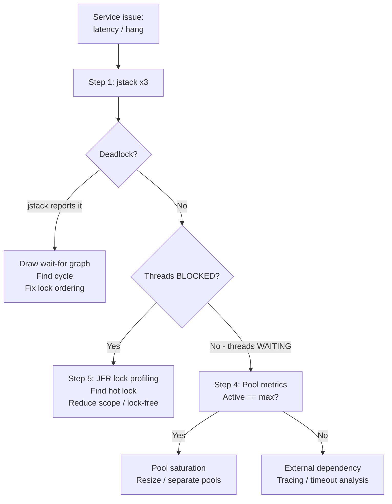
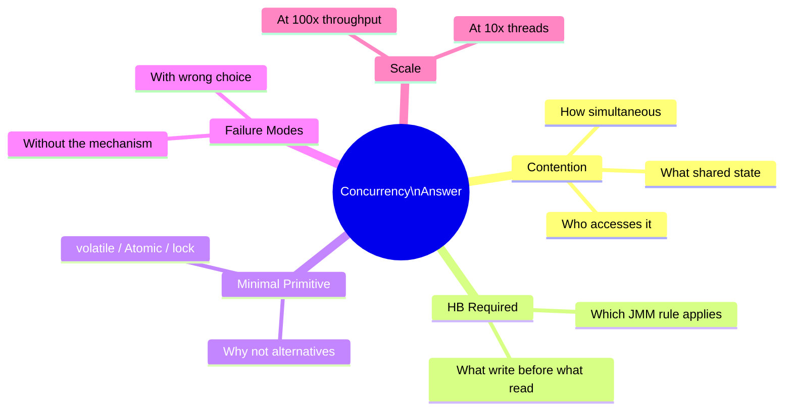

# Java Concurrency - META Patterns

| # | Keyword | Difficulty |
| --- | --- | --- |
| 1 | [Concurrency Debugging Mental Model](#concurrency-debugging-mental-model) | ★★☆ |
| 2 | [Concurrency Interview Framework](#concurrency-interview-framework) | ★★☆ |

---

# Concurrency Debugging Mental Model

**Interview Weight:** high (META) - The 5-step diagnostic
protocol that separates engineers who guess from those who
diagnose systematically and reliably.

---

### 🎯 Model Answer

**30 seconds:**

> When debugging a concurrency issue: (1) get a thread dump (jstack)
> to find which threads are stuck and what locks they hold;
> (2) identify lock ordering - look for circular waits;
> (3) check whether threads are WAITING vs BLOCKED vs RUNNABLE;
> (4) inspect thread pool metrics (active, queue depth);
> (5) correlate with application metrics (latency, error rate).
> Never guess - always instrument first.

**3 minutes (Senior):**

> The 5-step protocol:
>
> Step 1 - jstack: run 3 snapshots 10 seconds apart. Threads
> appearing BLOCKED in all 3 are genuinely stuck.
>
> Step 2 - Lock analysis: jstack shows which lock each thread holds
> and which lock it waits for. Draw the wait-for graph.
> Cycle = deadlock. No cycle + BLOCKED threads = contention.
>
> Step 3 - Thread state analysis: BLOCKED = waiting for monitor.
> WAITING = waiting for notify() or park(). TIMED_WAITING = sleep.
> RUNNABLE + high CPU = livelock or busy-wait.
>
> Step 4 - Pool metrics: for WAITING threads, check thread pool
> queue depth. If active == poolSize and queue grows: saturation.
>
> Step 5 - JFR lock profiling: for contention (not deadlock),
> Java Flight Recorder Lock Instances view shows the specific hot
> lock and total blocked duration per lock class.

**Blank Mind Recovery:**

**(1) Restate:** "Concurrency debugging: jstack first. Find stuck
threads. Find locks. Draw wait-for graph. Check pool metrics."

**(2) First principles:** "Concurrency bugs: threads waiting for
things. jstack shows what each thread is waiting for. Follow the
waits to find the cycle or the bottleneck."

---

### 📘 Concept Explanation

**What it is:**

A repeatable 5-step mental model for diagnosing any concurrency
issue: deadlock, livelock, starvation, pool saturation, or
visibility failure.

**The problem it solves:**

Concurrency bugs appear intermittent and environment-specific.
Without a systematic approach, engineers add logging, restart
the service, or change random parameters. A mental model produces
a diagnosis in minutes.

**How it works:**

```
THE 5-STEP PROTOCOL:

Step 1: CAPTURE - three thread dumps
  jstack <pid> > dump1.txt
  sleep 10; jstack <pid> > dump2.txt
  sleep 10; jstack <pid> > dump3.txt
  diff dump1.txt dump3.txt   # stuck threads in all 3 = genuine

Step 2: FIND LOCKS
  grep -A 5 "BLOCKED" dump1.txt
  # "thread-1" BLOCKED on <0xABCD> held by "thread-2"
  # Draw: thread-1 --waits for--> lock-A (held by thread-2)

Step 3: DETECT DEADLOCK
  # jstack reports "Found 1 deadlock." automatically
  # Manual: draw full wait-for graph; cycle = deadlock
  # No cycle + BLOCKED = contention or starvation

Step 4: CHECK POOL HEALTH
  # Actuator:
  GET /actuator/metrics/executor.active
  GET /actuator/metrics/executor.queued
  # active == max && queue growing -> saturation

Step 5: JFR FOR CONTENTION
  jcmd <pid> JFR.start name=lock settings=profile
  # wait 60 seconds
  jcmd <pid> JFR.stop name=lock filename=lock.jfr
  # JMC -> Events -> Lock Instances:
  # class name / blocked count / total blocked time
```

**The key insight:**

Concurrency bugs have observable symptoms that map to root causes:
BLOCKED + cycle = deadlock; BLOCKED + no cycle = contention;
WAITING + pool full = saturation; RUNNABLE + CPU spike = livelock.
Each symptom has a specific tool and fix. The mental model
eliminates guessing by following the symptom.

**When to use it:**

- Service stops responding under load
- P99 latency spikes while P50 stays low
- CPU 100% with no throughput increase
- Thread count growing without bound

**When NOT to use it:**

- Single-threaded application issues (not concurrency)
- GC pauses dominating latency: use GC log analysis instead

**Alternatives:**

- async-profiler wall-clock mode: shows where threads spend
  time including lock wait; excellent for contention
- VisualVM thread timeline: visual lock pattern recognition

**First-principles derivation:**

Every concurrency bug violates an ordering or exclusion property.
Deadlock: circular ordering requirement. Starvation: a thread
never wins the ordering competition. Livelock: threads compete
without progress. Visibility: write HB read violated. The mental
model traces the symptom to the specific violated property,
then applies the minimal fix.

---

### 💻 Code Example

**Example 1: Deadlock - BAD lock order vs GOOD consistent ordering**

```java
// BAD: lock order depends on parameter order -> deadlock possible
class TransferService {
    void transfer(Account from, Account to, BigDecimal amount) {
        synchronized (from) {         // locks from first
            synchronized (to) {       // then locks to
                from.deduct(amount);
                to.credit(amount);
            }
        }
    }
}
// Thread 1: transfer(A, B, 100) -> locks A, waits for B
// Thread 2: transfer(B, A, 100) -> locks B, waits for A
// DEADLOCK: circular wait; jstack shows "Found 1 deadlock."

// GOOD: consistent lock ordering by account ID -> no cycle
class TransferService {
    void transfer(Account from, Account to, BigDecimal amount) {
        // Order locks by ID: always acquire the lower-ID lock first
        Account first  = from.id() < to.id() ? from : to;
        Account second = from.id() < to.id() ? to : from;
        synchronized (first) {
            synchronized (second) {
                from.deduct(amount);
                to.credit(amount);
            }
        }
    }
}
// Both threads acquire in the same order:
// Thread 1 & 2 both try to lock account with lower ID first
// No cycle in the wait-for graph -> no deadlock
```

> **Code walkthrough:** The bad version acquires locks in the order
> determined by the caller. Two concurrent calls with reversed
> parameters create a circular dependency: Thread 1 holds A and
> waits for B; Thread 2 holds B and waits for A. jstack reports
> "Found 1 deadlock." and shows the wait cycle. The fix establishes
> a global lock ordering: always acquire the lock with the lower
> account ID first. With a consistent order, no two threads can
> hold lock X while waiting for lock Y in opposite directions.
> No cycle; no deadlock. This is the canonical deadlock fix pattern.

---

### 🎓 Answers by Seniority

**Junior / Mid (0-5 years):**

> Concurrency debugging protocol: jstack for thread dumps; check
> BLOCKED threads and lock holders; jstack reports deadlocks
> automatically. Check thread pool active count and queue depth
> for saturation. Use JFR lock profiling for contention.

---

**Senior / Staff (5+ years):**

> I follow the 5-step protocol and instrument proactively. I add
> Micrometer gauges for thread pool active/queue depth at design
> time - I want alerts before users notice. In production, I use
> JFR lock profiling (2% overhead, safe). For root cause analysis:
> three jstack dumps 10 seconds apart - threads stuck in all three
> are genuinely blocked. I draw the wait-for graph for any deadlock
> suspicion. Systematic approach: symptom to tool to root cause to
> fix. Never restart first.

---

### ⚠️ Common Misconceptions

| Misconception | Reality | Risk |
| --- | --- | --- |
| "Intermittent bugs are random" | Concurrency bugs are deterministic but timing-sensitive; the same code path under different scheduling produces the bug | Dismissing as flaky; not investing in root cause |
| "One jstack dump is enough" | One dump may catch a thread in a transitional state; 3 dumps 10s apart distinguish stuck from temporarily waiting | Misdiagnosis on a single snapshot |
| "jstack shows all concurrency problems" | jstack shows locking and waiting; JMM visibility bugs (stale reads) do not appear in jstack - they manifest as wrong values, not hangs | Missing visibility bugs with jstack-only approach |

---

### 🚨 Failure Modes and Diagnosis

| Failure | Symptom | Root Cause | Diagnostic | Fix |
| --- | --- | --- | --- | --- |
| Service hangs completely | No responses; threads stuck | Deadlock | jstack: "Found N deadlocks"; draw wait-for graph | Consistent lock ordering; tryLock with timeout |
| P99 spikes, P50 normal | Mostly fast; occasional multi-second delays | Lock contention or GC pause | JFR lock profiling + GC events | Reduce lock scope; LongAdder; tune GC |
| CPU 100%, no throughput | CPU maxed; no work completing | Livelock or busy-wait | jstack: many RUNNABLE; async-profiler: spinning in CAS/retry loop | Add backoff; LockSupport.parkNanos() |

---

### 🎯 Interview Deep-Dive

| Level | Time | Expected Depth |
| --- | --- | --- |
| Junior | 3 min | jstack command; BLOCKED vs WAITING; deadlock definition |
| Mid | 5 min | 5-step protocol; JFR workflow; deadlock fix strategies |
| Senior | 8 min | Wait-for graph; livelock diagnosis; JFR lock profiling |
| Staff | 12 min | Design observability for a concurrent service; proactive monitoring |

---

**Q1** [DEBUGGING] [SENIOR]

"Production P99 latency is 8 seconds; P50 is 20ms.
Walk through your full diagnostic process."

**Answer:**

P99 >> P50 indicates periodic blocking, not systematic slowness.
Candidates: lock contention, GC pause, pool saturation,
external dependency timeout.

Step 1: Capture during a high-latency window:
```
jstack <pid> > dump1.txt; sleep 10; jstack <pid> > dump2.txt
```
Threads blocked consistently in both = contention or deadlock.

Step 2: Check GC logs:
```
# -Xlog:gc*:file=app-gc.log:time,uptime already in startup flags
grep "Pause" /var/log/app-gc.log | tail -20
```
8-second GC pauses? GC is the cause. Pauses < 1s: not GC.

Step 3: Thread pool metrics:
```
GET /actuator/metrics/executor.active
GET /actuator/metrics/executor.queued
```
Active == pool size and queue growing? Pool saturation.
Pool healthy? Look at external dependencies.

Step 4: Distributed tracing (Zipkin/Jaeger): find spans > 1s.
Which span is 8s in P99 cases? That component is the bottleneck.

Step 5: If pool saturation - what are threads waiting for?
```
grep -E "WAITING|BLOCKED" dump2.txt | grep -v "cleaner|Reference"
```
DB connection wait? HTTP client wait? Identify the resource.

Hypothetical finding: DB connection pool exhausted; HikariCP
connections waiting 8 seconds. Fix: increase maximumPoolSize,
add connectionTimeout alert (Micrometer: hikaricp.connections.pending),
reduce query time with indexes.

*What separates good from great:* Eliminating GC and external
dependency as causes before assuming lock issues - P99 spikes
have multiple possible causes.

---

**Q2** [DEBUGGING] [MID]

"jstack output shows 'Found 1 deadlock.' - what are your
next steps?"

**Answer:**

jstack reports the deadlock automatically with the wait cycle.
Read the deadlock section:

```
Found one Java-level deadlock:
=============================
"thread-1":
  waiting to lock monitor 0x00000000 (object 0x..., AccountB)
  which is held by "thread-2"
"thread-2":
  waiting to lock monitor 0x00000000 (object 0x..., AccountA)
  which is held by "thread-1"
```

Step 1: Draw the wait-for graph from the jstack output.
Identify which classes are involved (AccountA, AccountB here).

Step 2: Find the code that acquires the two locks.
Search for `synchronized(account)` or equivalent.
Find where AccountA and AccountB are locked in opposite orders.

Step 3: Apply consistent lock ordering:
Sort accounts by ID before acquiring. Document the ordering
convention in a comment.

Step 4: Add a test:
```java
@Test
void transferDoesNotDeadlock() throws Exception {
    // Two threads: transfer A->B and B->A simultaneously
    ExecutorService pool = Executors.newFixedThreadPool(2);
    Future<?> f1 = pool.submit(() -> service.transfer(A, B, 100));
    Future<?> f2 = pool.submit(() -> service.transfer(B, A, 100));
    // Assert both complete within 5 seconds (no deadlock)
    f1.get(5, SECONDS);
    f2.get(5, SECONDS);
}
```

Step 5: Deploy and verify with jstack - "Found 0 deadlocks."

*What separates good from great:* Adding the concurrent transfer
test so the deadlock cannot regress silently.

---

**Q3** [TRADE-OFF] [SENIOR]

"When would you use tryLock with a timeout instead of
synchronized for deadlock prevention?"

**Answer:**

`synchronized` never times out: a thread waits indefinitely.
`ReentrantLock.tryLock(timeout, unit)` returns false if the
lock cannot be acquired within the timeout. This provides
deadlock detection at runtime.

When to use tryLock:
- Lock ordering is not globally enforceable (e.g., locks are
  determined at runtime from user input or dynamic state)
- Deadlock is theoretically possible and static ordering is
  too complex to guarantee
- The operation can be retried or reported as failed

```java
// tryLock deadlock-safe transfer:
boolean transferred = false;
while (!transferred) {
    if (from.tryLock(50, MILLISECONDS)) {
        try {
            if (to.tryLock(50, MILLISECONDS)) {
                try {
                    from.deduct(amount);
                    to.credit(amount);
                    transferred = true;
                } finally { to.unlock(); }
            }
        } finally { from.unlock(); }
    }
    if (!transferred) {
        Thread.sleep(10 + random.nextInt(20)); // randomized backoff
    }
}
```

Trade-off: tryLock with retry adds livelock risk (both threads
keep timing out and retrying). Randomized backoff reduces but
does not eliminate livelock. Consistent lock ordering has no
livelock risk and is simpler. Prefer consistent ordering; use
tryLock only when ordering is impractical.

*What separates good from great:* Recognizing that tryLock with
retry can cause livelock and naming randomized backoff as the
mitigation.

---

### ⚖️ Comparison Table

| Symptom | Likely Cause | Diagnostic Tool | Fix |
| --- | --- | --- | --- |
| Service hangs | Deadlock | jstack: "Found N deadlocks" | Consistent lock ordering |
| P99 spikes, P50 normal | Contention / pool saturation | JFR Lock Instances; Actuator metrics | Reduce lock scope; resize pool |
| CPU 100%, no throughput | Livelock / spin-wait | async-profiler CPU; jstack RUNNABLE | Add backoff; park |
| Memory growing | ThreadLocal leak | Heap dump; jmap | ThreadLocal.remove() in finally |

---

### 🏛️ System Design

*(Omit: META keyword. Observability system design for concurrent
services is covered in L4 and L5 files with production context.)*

---

### 📊 Diagram

```
5-STEP DIAGNOSTIC PROTOCOL:

1. CAPTURE: jstack x3 (10s apart)
          |
2. FIND LOCKS: grep BLOCKED -> wait-for graph
          |
3. DETECT CYCLE: cycle = DEADLOCK; no cycle = CONTENTION
          |
4. POOL METRICS: active==max + queue growing = SATURATION
          |
5. JFR PROFILING: hot lock + blocked time -> targeted fix
```



> **Diagram walkthrough:** The protocol starts with observable
> evidence (thread dump) and branches based on what is found.
> Deadlock is self-reported by jstack. For non-deadlock BLOCKED
> threads, JFR identifies the specific hot lock. For WAITING threads
> (not BLOCKED), pool metrics distinguish saturation from external
> dependency. Each branch terminates at a specific tool and a
> specific fix. The mental model makes debugging reproducible:
> the same symptom always leads to the same diagnostic path.

---

---

# Concurrency Interview Framework

**Interview Weight:** critical (META) - The meta-skill of
structuring any concurrency answer clearly and completely
under interview pressure.

---

### 🎯 Model Answer

**30 seconds:**

> For any concurrency question, answer in five dimensions:
> (1) identify the contention point - what shared state?
> (2) state the happens-before relationship required;
> (3) pick the minimal synchronization primitive;
> (4) name the failure modes;
> (5) state the scale implications.
> This structure works for 95% of concurrency questions.

**3 minutes (Senior):**

> The framework applied to "How do you make a singleton thread-safe?":
>
> 1. Contention: multiple threads calling getInstance() before
>    initialization may race to create the instance.
>
> 2. HB required: constructor completion must HB any usage of
>    the instance. Non-volatile DCL violates this.
>
> 3. Minimal primitive: static initializer (class loading HB all
>    class accesses - simpler than DCL). Or: volatile + DCL.
>
> 4. Failure modes: non-volatile DCL = partial publication.
>    Eager static = class loaded even if never used.
>
> 5. Scale: singleton is a shared resource; mutable state in
>    singleton must itself be thread-safe.
>
> Interviewers evaluate clarity of structure, not just correctness.
> Unstructured correct answers score lower than structured ones.

**Blank Mind Recovery:**

**(1) Restate:** "Concurrency framework: contention, HB, primitive,
failure, scale. Answer in that order."

**(2) First principles:** "Every concurrency question is about:
what data? who accesses it? what ordering is required?
what breaks if wrong?"

---

### 📘 Concept Explanation

**What it is:**

A transferable 5-dimension framework for structuring concurrency
answers in technical interviews. Applicable to any question:
thread safety, synchronization primitives, concurrent collections,
distributed locks.

**The problem it solves:**

Without structure, candidates either over-explain irrelevant details
or skip the key point. The framework ensures every answer covers
the five dimensions interviewers evaluate.

**How it works:**

```
THE 5-DIMENSION FRAMEWORK:

1. CONTENTION POINT
   "The shared mutable state is: ___"
   "Multiple threads access it by: ___"
   If no shared mutable state: no concurrency problem.

2. HAPPENS-BEFORE REQUIRED
   "Thread A must complete ___ before Thread B reads ___"
   Name the specific HB relationship needed.

3. MINIMAL PRIMITIVE
   "The correct tool is: ___ because ___"
   Justify. Show alternatives rejected and why.

4. FAILURE MODES
   "Without this: ___ (symptom)"
   "With wrong tool: ___ (symptom)"
   Name at least 2 failure scenarios.

5. SCALE IMPLICATIONS
   "At 10x threads: ___"
   "At 100x throughput: ___"
   How does behavior change as concurrency increases?

APPLIED - "Implement a thread-safe request counter":

1. CONTENTION: 200 request-handling threads increment the
   same counter simultaneously.

2. HB REQUIRED: each increment must be visible to the
   /metrics endpoint that reads the total.

3. MINIMAL PRIMITIVE: LongAdder for high-throughput counting
   (not AtomicLong - CAS storm at 200 threads).

4. FAILURE MODES:
   - plain long: lost increments (read-modify-write race)
   - synchronized(this): all 200 threads serialize -> bottleneck
   - AtomicLong: correct; CAS retry storm at 200 concurrent threads

5. SCALE: LongAdder advantage grows with thread count because
   CAS contention scales linearly while LongAdder cells absorb it.
```

**The key insight:**

Interviewers evaluate five things: correctness (HB), pragmatism
(minimal sync), completeness (failure modes), depth (scale),
and clarity (structure). The framework explicitly addresses all
five. A candidate who says "I'd use ConcurrentHashMap" without
explaining why passes the knowledge test but fails the
communication test.

**When to use it:**

- Thread safety, synchronization, locks, atomic operations
- System design questions involving shared state
- Behavioral questions: "Tell me about a concurrency bug you fixed"

**When NOT to use it:**

- Pure definitional questions ("What is a deadlock?"): answer
  directly, not via framework
- Timed 30-second answers: collapse to 1 sentence per dimension

**Alternatives:**

- C4 (Context, Challenge, Choice, Consequence) for design stories
- PREP (Point, Reason, Example, Point) for behavioral questions
- Combine: C4 for the overall story, concurrency framework for the
  technical choice within the story

**First-principles derivation:**

The framework maps to formal concurrency properties: (1) contention
= shared mutable state identification; (2) HB = JMM ordering
requirement; (3) primitive = mechanism that establishes HB;
(4) failure modes = what property is violated without the mechanism;
(5) scale = how the mechanism behaves under load. All correct
answers implicitly cover these; the framework makes them explicit.

---

### 💻 Code Example

**Example 1: Applying the framework - thread-safe counter**

```java
// FRAMEWORK APPLIED: thread-safe request counter

// 1. CONTENTION: 200 HTTP handler threads increment simultaneously

// 2. HB REQUIRED: each increment visible to the metrics reader

// 3. PRIMITIVE ANALYSIS:

// BAD: plain long - race on read-modify-write
class Stats {
    private long total = 0;           // NOT thread-safe
    void record() { total++; }        // lost increments under load
    long get()    { return total; }   // stale reads
}

// BETTER: AtomicLong - correct, simple
class Stats {
    private final AtomicLong total = new AtomicLong(0);
    void record() { total.incrementAndGet(); }
    long get()    { return total.get(); }
}

// BEST for high contention: LongAdder
class Stats {
    private final LongAdder total = new LongAdder();
    void record() { total.increment(); }
    // sum() is eventually consistent - correct for metrics
    long get()    { return total.sum(); }
}

// 4. FAILURE MODES:
//    plain long: lost increments; race condition
//    synchronized: all 200 threads serialize on one lock
//    AtomicLong: correct; CAS retry storm at 200+ threads
//    LongAdder: correct; not exact (sum() is approximate)

// 5. SCALE: at 200 threads:
//    AtomicLong CAS retry rate increases with thread count
//    LongAdder: each thread hits its own Cell; minimal contention
```

> **Code walkthrough:** The example walks through all five framework
> dimensions in code. Contention: 200 threads on one counter. HB:
> each increment visible to readers. Primitive evolution from wrong
> (plain long) to better (AtomicLong) to best (LongAdder for high
> contention). Failure modes: synchronized is technically correct
> but serializes 200 threads on one lock - correct is not the same
> as good. LongAdder is correct and fast but not atomic for exact
> counts. Scale: the LongAdder advantage grows with thread count
> because CAS contention grows linearly while LongAdder distributes
> across cells.

---

### 🎓 Answers by Seniority

**Junior / Mid (0-5 years):**

> Framework for concurrency answers: (1) identify shared state,
> (2) name the HB relationship needed, (3) pick the minimal
> primitive, (4) name 2 failure modes, (5) discuss scale.
> Applying this structure to any concurrency question ensures
> correctness, pragmatism, and depth.

---

**Senior / Staff (5+ years):**

> I use this framework as a mental checklist. In interviews, I
> state the contention point explicitly first - this signals I
> understand the problem before jumping to a solution. I always
> name one wrong approach and explain why it fails: demonstrates
> depth. For scale, I connect to specific context (200 threads,
> 50K/sec) rather than generalities. Structured answers score
> better not because they contain more information but because
> the structure itself signals engineering maturity.

---

### ⚠️ Common Misconceptions

| Misconception | Reality | Risk |
| --- | --- | --- |
| "Correct answer is enough" | Communication clarity is evaluated separately; unstructured correct answers score lower | Technically correct but poorly communicated answers fail interviews |
| "Jump to code immediately" | Taking 30 seconds to frame contention and HB scores better than immediately writing code | Coding before understanding the synchronization requirement |
| "Framework is for juniors" | Staff engineers use frameworks for communication discipline; ad-hoc answers lose the interviewer | Abandoning structure at senior level |

---

### 🚨 Failure Modes and Diagnosis

| Failure | Symptom | Root Cause | Fix |
| --- | --- | --- | --- |
| Answer lacks depth | Interviewer probes every point with follow-ups | Missed HB and failure mode dimensions | Apply all 5 dimensions explicitly before the interviewer asks |
| Answer is too long | Interviewer loses track; cuts off | No structure; no contention-first framing | Lead with contention + HB in 1 sentence each; expand on request |
| Wrong primitive chosen | Interviewer asks "what about failure mode X?" | Primitive selected without considering failure modes | Always name 2 failure modes of the chosen primitive |

---

### 🎯 Interview Deep-Dive

| Level | Time | Expected Depth |
| --- | --- | --- |
| Junior | 3 min | Describe 5 dimensions; apply to one example |
| Mid | 5 min | Apply framework to a real question; name failure modes precisely |
| Senior | 8 min | Framework + scale analysis + behavioral story |
| Staff | 12 min | Framework + system design + proactive instrumentation story |

---

**Q1** [APPLICATION] [SENIOR]

"Using the framework, answer: How would you make a lazy-initialized
singleton field thread-safe?"

**Answer:**

Applying the 5-dimension framework:

**1. Contention:**
Multiple threads calling getInstance() before initialization may
race: two threads see null, both call initialize(), both assign the
field. Incorrect; creates two instances or partially published one.

**2. Happens-before required:**
The constructor completion must HB any subsequent read of the field.
Non-volatile DCL violates this: the JVM may assign the reference
before all constructor writes are visible to other threads
(partial publication).

**3. Minimal primitive:**

Option A: volatile + DCL (classic correct version)
```java
private static volatile Singleton instance;  // volatile required

public static Singleton getInstance() {
    if (instance == null) {
        synchronized (Singleton.class) {
            if (instance == null) {
                instance = new Singleton(); // volatile write
            }
        }
    }
    return instance;   // volatile read after init: no sync
}
// volatile ensures: constructor writes HB any read via volatile read
```

Option B: Initialization-on-demand holder (simpler, preferred)
```java
private static class Holder {
    static final Singleton INSTANCE = new Singleton();
    // JVM guarantees class initialization is thread-safe
}
public static Singleton getInstance() {
    return Holder.INSTANCE;  // no synchronization needed
}
// Class loading of Holder is a one-time event; JVM serializes it
// No volatile needed; no synchronized needed after init
```

**4. Failure modes:**
- DCL without volatile: partial publication. Thread B sees
  non-null but uninitialized Singleton fields (classic JMM bug).
- Holder: ExceptionInInitializerError if Singleton() throws.
  No retry possible. Must ensure constructor does not throw.
- Eager (static field): class loaded and Singleton() called even
  if getInstance() is never invoked.

**5. Scale:**
After initialization: volatile read (Option A) is a memory fence
with no lock - scales to N CPUs with no contention. Holder (Option
B): no fence at all after class is loaded - slightly faster.

Recommendation: Holder pattern is the simplest and most correct.
Use volatile DCL only when lazy init logic is more complex than
a constructor (e.g., conditional initialization based on config).

*What separates good from great:* Knowing the Holder pattern
and its ExceptionInInitializerError edge case - most candidates
only know DCL.

---

**Q2** [TRADE-OFF] [SENIOR]

"A colleague says 'just put synchronized on every method of
a shared object and it will be thread-safe.' What is wrong
with this advice?"

**Answer:**

The advice is partially right (compound operations within one
method become atomic) but misses two critical problems:

Problem 1: Compound actions across methods are not atomic.
```java
// BAD: thread-safe methods, but unsafe compound operation
class SafeMap {
    private final Map<String, Integer> map = new HashMap<>();

    synchronized boolean contains(String key) {
        return map.containsKey(key);
    }
    synchronized void put(String key, Integer val) {
        map.put(key, val);
    }
}
// Thread 1: if (!map.contains("k")) map.put("k", 1);
// Thread 2: if (!map.contains("k")) map.put("k", 1);
// Both see "k" absent, both put -> race condition
// contains() and put() are individually synchronized
// but the CHECK-THEN-ACT is not atomic
```

Fix: putIfAbsent() or synchronize the compound operation.

Problem 2: Performance.
Synchronizing all methods creates a single lock for the entire
object. Under high concurrency, all threads serialize. For
read-heavy objects (10 reads per write), all readers block each
other unnecessarily. ReadWriteLock or ConcurrentHashMap provides
read concurrency.

Framework dimensions:
- Contention: all method callers compete for one object lock
- HB: established (each method is atomic)
- Failure: compound operations across methods are not atomic
- Scale: all operations serialize; throughput degrades at 16+ threads

*What separates good from great:* Naming compound operation
atomicity as the primary correctness issue and read/write lock
as the performance fix.

---

**Q3** [BEHAVIORAL] [SENIOR]

"Tell me about a concurrency bug you found and fixed in production."

**Answer:**

Structured via the framework:

**Contention (what was shared):** A Spring @Service had an instance
field holding a SimpleDateFormat. SimpleDateFormat is not thread-safe
(internal calendar state is mutable). 200 concurrent request threads
shared one instance.

**HB violation:** SimpleDateFormat.format() and parse() modify
the calendar field internally. No synchronization. Thread A's
write to calendar.time was visible to Thread B mid-operation
(visibility violation of internal state).

**Symptom:** Intermittent incorrect date parsing (format()
returning dates offset by one day in ~0.1% of requests under
load).

**Diagnosis:** Bug was timing-sensitive: never reproduced
in tests with single-threaded Spring test context. Found by
adding a concurrency test:
```java
// Test: 20 threads calling format() simultaneously on one instance
ExecutorService pool = Executors.newFixedThreadPool(20);
IntStream.range(0, 1000).forEach(i ->
    pool.submit(() -> {
        String result = service.formatDate(testDate);
        assertThat(result).isEqualTo(expectedFormat);
    }));
pool.shutdown();
pool.awaitTermination(10, SECONDS);
```
Test failed ~15% of the time.

**Fix:** ThreadLocal<SimpleDateFormat> per thread.
Or: DateTimeFormatter (java.time) which is immutable and thread-safe.

```java
// Fix: immutable DateTimeFormatter (Java 8+)
private static final DateTimeFormatter FORMATTER =
    DateTimeFormatter.ofPattern("yyyy-MM-dd");

String formatDate(LocalDate date) {
    return FORMATTER.format(date);  // thread-safe; no shared state
}
```

**Failure modes named:** SimpleDateFormat everywhere -> identical
bug; synchronized on the formatter -> bottleneck.

**Scale:** at 200 threads, ThreadLocal creates 200 instances (memory
cost). DateTimeFormatter: 1 instance, 200 threads, no overhead.

*What separates good from great:* Diagnosing with a concurrency
test (reproducing the timing-sensitive bug deterministically) and
choosing DateTimeFormatter (immutability) over synchronized.

---

### ⚖️ Comparison Table

| Question Type | Framework Emphasis | Key Dimension |
| --- | --- | --- |
| Thread-safe data structure | Contention + primitive + scale | Why ConcurrentHashMap over synchronized |
| Singleton pattern | HB + failure modes | volatile DCL vs holder vs eager |
| Thread pool sizing | Scale + failure modes | Little's Law; saturation; bulkhead |
| Distributed lock | All 5 dimensions | Redis vs ZooKeeper; fencing tokens |
| Performance tuning | Scale + contention | LongAdder; false sharing; Amdahl |

---

### 🏛️ System Design

*(Omit: META keyword. System design implications are covered
in L3-L5 files with specific concurrency architectures.)*

---

### 📊 Diagram

```
CONCURRENCY ANSWER FRAMEWORK:

1. CONTENTION  -> "The shared state is X; concurrent access is Y"
2. HB NEEDED   -> "Thread A complete Z before Thread B reads Z"
3. PRIMITIVE   -> "Use minimal: [volatile/AtomicXxx/lock] because"
4. FAILURE     -> "Without: [symptom]. Wrong tool: [symptom]"
5. SCALE       -> "At 10x: [behavior]. At 100x: [behavior]"
```



> **Diagram walkthrough:** The linear protocol (text block) shows
> the answer structure as a sequence: state contention before jumping
> to primitives. The mindmap shows all five dimensions as equally
> important branches - no single dimension dominates. Both
> representations emphasize that contention identification must
> come first: without knowing what the shared state is and how it
> is accessed concurrently, no primitive choice can be justified.
> The framework is a communication tool as much as a technical tool:
> following it ensures the interviewer hears all five evaluation
> dimensions in every answer, even under time pressure.

---

---