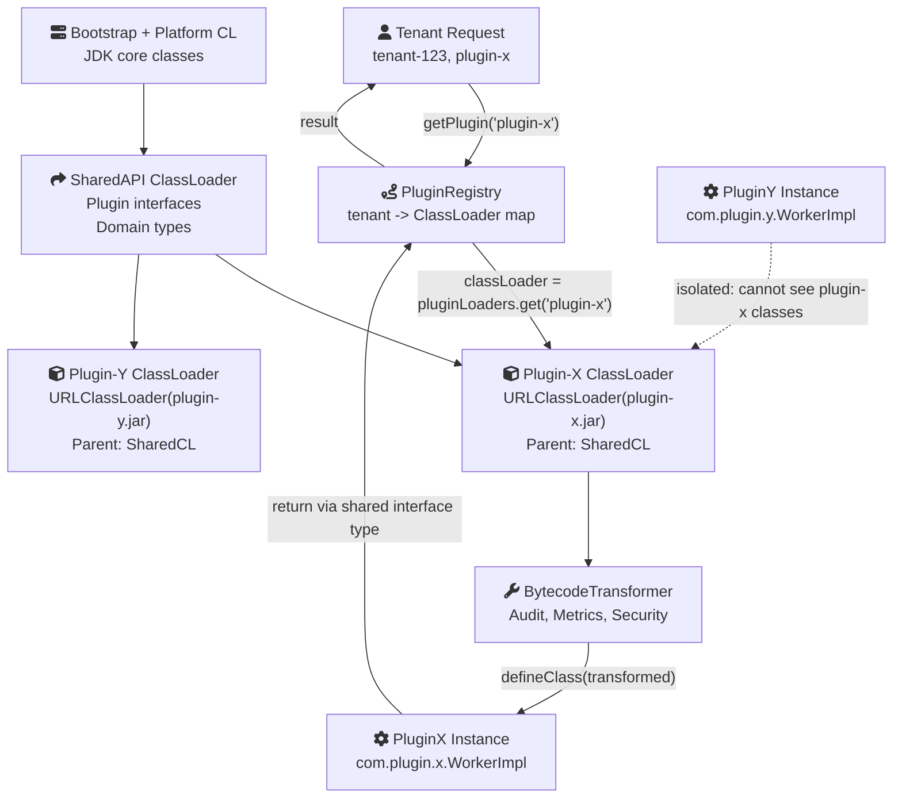
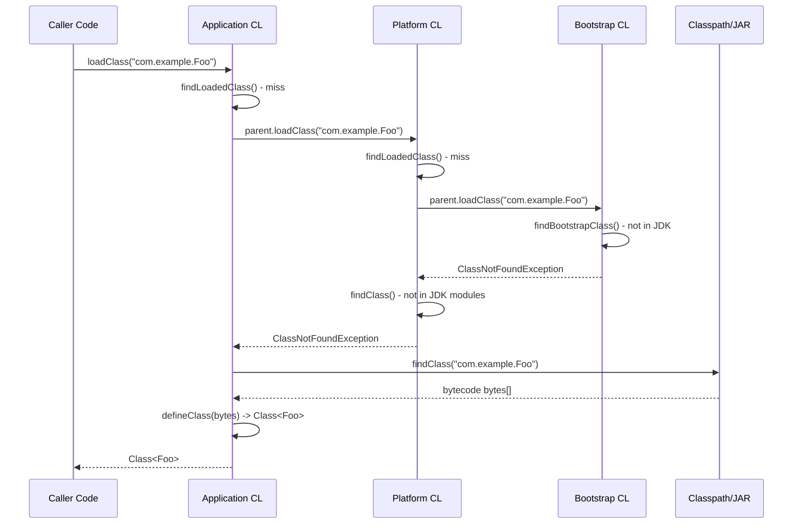

## Keywords in This File
{: .no_toc }

| # | Keyword | Weight |
|---|---|---|
| 1 | [Java Core - L4 ClassLoader](#java-core---l4-classloader) | medium |

---

# Java Core - L4 ClassLoader

## ClassLoader Architecture

---

### 🎯 Model Answer

**30 seconds:**
> ClassLoaders load `.class` bytecode into the JVM's method area. Java uses
> a three-level hierarchy: Bootstrap ClassLoader (JDK core: java.lang, java.util),
> Platform ClassLoader (Java 9+, formerly Extension: JDK modules), Application
> ClassLoader (application classpath). The delegation model: before loading a
> class, a loader first asks its parent. This ensures `java.lang.String` always
> comes from Bootstrap, never overridden by application classes. Custom
> ClassLoaders enable: OSGi plugin isolation, hot class reloading, sandboxed
> multi-tenant apps, bytecode instrumentation.

**3 minutes (Senior):**
> Class identity in the JVM = `(ClassLoader, fully-qualified-name)`. Two
> copies of `com.example.Foo` loaded by different ClassLoaders are DIFFERENT
> classes - they cannot be cast to each other (ClassCastException). This is
> the foundation of class isolation in OSGi and application servers.
>
> Java 9 module system changed the loader hierarchy: the three-loader model
> (Bootstrap, Extension, App) became (Bootstrap, Platform, App), but with
> modules, most JDK classes load from named modules via `jdk.internal.loader`.
> Memory leak pattern: ClassLoader leak - a long-lived object holds a
> reference to a class loaded by a ClassLoader that should be garbage collected.
> The ClassLoader keeps ALL its loaded classes and their static fields alive.
> Web container hot-deploy: redeploy loads a new ClassLoader; if the old one
> leaks, PermGen/Metaspace fills up.

**Framework:** WHAT → WHY → HOW → TRADE-OFF → EXAMPLE

**Blank Mind Recovery:**

**(1) Restate:** "ClassLoader architecture - let me cover the three-level
hierarchy, parent delegation, custom ClassLoaders, class identity, and
memory leak patterns."

**(2) First principles:** "Classes need to be loaded from bytecode into JVM
memory before they can be instantiated. ClassLoaders are the mechanism.
The delegation model ensures core JDK classes are always authoritative -
you can't substitute your own `java.lang.String` because Bootstrap wins."

**(3) Bridge:** "The ClassLoader hierarchy is like a corporate org chart
for class loading. When a department (ClassLoader) needs something, it asks
its manager (parent) first. Only if the manager doesn't have it does the
department load it itself. Bootstrap is the CEO whose decisions override everyone."

---

### 📘 Concept Explanation

**The three-level hierarchy (Java 11+):**
```
Bootstrap ClassLoader (C++ code, native, no Java object)
  - Loads: java.lang.*, java.util.*, java.io.*, etc.
  - Source: jrt:/ (Java runtime image, Java 9+)
  - getClassLoader() returns null (native)

Platform ClassLoader (Java 9+ replacement for Extension)
  - Loads: JDK modules not in bootstrap (java.sql, java.xml, etc.)
  - Source: --module-path, platform modules
  - Parent: Bootstrap

Application (System) ClassLoader
  - Loads: application classpath, -cp, module path
  - Source: CLASSPATH, -jar, --class-path
  - Parent: Platform
  - getSystemClassLoader() returns this
```

> **Code walkthrough:** This example demonstrates the core pattern in action. The key mechanism shows how the concept works in practice. Study the structure to understand the essential behavior and common usage.

**Delegation model (parent-first):**
```java
// Class.forName("com.example.Foo") -> App ClassLoader
// App.loadClass("com.example.Foo"):
//   1. Ask parent (Platform):
//      Platform.loadClass("com.example.Foo"):
//        1. Ask parent (Bootstrap):
//           Bootstrap.loadClass: not found
//        2. Platform: not found (com.example not in JDK)
//   2. App: search classpath -> found! load and define.
```

> **Code walkthrough:** This example demonstrates the core pattern in action. The key mechanism shows how the concept works in practice. Study the structure to understand the essential behavior and common usage.

**Creating a custom ClassLoader:**
```java
class IsolatingClassLoader extends ClassLoader {
    private final Path classDir;

    IsolatingClassLoader(Path classDir, ClassLoader parent) {
        super(parent); // delegate to parent
        this.classDir = classDir;
    }

    @Override
    protected Class<?> findClass(String name) throws ClassNotFoundException {
        Path classFile = classDir.resolve(name.replace('.', '/') + ".class");
        try {
            byte[] bytes = Files.readAllBytes(classFile);
            return defineClass(name, bytes, 0, bytes.length);
        } catch (IOException e) {
            throw new ClassNotFoundException(name, e);
        }
    }
    // loadClass() calls findLoadedClass() -> parent.loadClass() -> findClass()
    // Only override findClass() to respect parent delegation!
}
```

> **Code walkthrough:** This example demonstrates the core pattern in action. The key mechanism shows how the concept works in practice. Study the structure to understand the essential behavior and common usage.

---

### 💻 Code Example

> **Code walkthrough:** The plugin isolation pattern is the core use case
> for custom ClassLoaders. Each plugin gets its own ClassLoader instance.
> Classes loaded by one plugin's ClassLoader are invisible to another plugin
> (different ClassLoader = different class identity). The URLClassLoader
> is the built-in flexible ClassLoader that loads from URLs (files, jars, http).

```java
// BAD: loading plugin with application ClassLoader (breaks isolation)
// All plugins share the same ClassLoader
// Plugin A's "com.example.Logger" and Plugin B's "com.example.Logger"
// are the SAME class - version conflict!
Class<?> pluginClass = Class.forName("com.plugin.a.Main"); // App ClassLoader

// GOOD: isolated ClassLoader per plugin
class PluginContainer {
    private final Map<String, ClassLoader> pluginLoaders = new HashMap<>();

    void loadPlugin(String pluginId, URL[] pluginJars) {
        // Each plugin gets its own ClassLoader with parent = App ClassLoader
        // App ClassLoader provides shared APIs; plugin provides implementation
        URLClassLoader pluginLoader = new URLClassLoader(
            pluginJars,
            getClass().getClassLoader() // parent: share JDK + shared APIs
        );
        pluginLoaders.put(pluginId, pluginLoader);
    }

    Object invokePlugin(String pluginId, String className, String method)
            throws Exception {
        ClassLoader loader = pluginLoaders.get(pluginId);
        Class<?> clazz = Class.forName(className, true, loader);
        Object instance = clazz.getDeclaredConstructor().newInstance();
        return clazz.getMethod(method).invoke(instance);
    }

    void unloadPlugin(String pluginId) {
        ClassLoader loader = pluginLoaders.remove(pluginId);
        if (loader instanceof URLClassLoader ucl) {
            try { ucl.close(); } catch (IOException e) { /* log */ }
        }
        // Now the ClassLoader is eligible for GC (if no class leaks!)
    }
}

// Hot reload example: re-read modified .class files
class HotReloader {
    private ClassLoader currentLoader;
    private final Path classDir;

    HotReloader(Path classDir) { this.classDir = classDir; reload(); }

    synchronized void reload() {
        currentLoader = new IsolatingClassLoader(
            classDir,
            HotReloader.class.getClassLoader()); // parent = App CL
    }

    synchronized <T> T getInstance(String className, Class<T> iface)
            throws Exception {
        Class<?> clazz = currentLoader.loadClass(className);
        return iface.cast(clazz.getDeclaredConstructor().newInstance());
    }
}
// Use case: development tools, scripting engines, test frameworks
```

> **Code walkthrough:** `URLClassLoader(jars, parentLoader)` - the parent
> determines what is "shared" vs "isolated". If parent is Application CL:
> all application classes are shared; only plugin-specific JARs are isolated.
> If parent is Bootstrap CL: only JDK classes are shared, everything else
> isolated. For plugin systems: use Application CL as parent to share your
> API (plugin interface contracts); the plugin JAR provides the implementation.
> `ucl.close()` (Java 7+) releases file locks on JARs - critical on Windows
> where open JARs can't be replaced during hot-redeploy.

---

### 🎓 Answers by Seniority

**Junior / Mid (0-5 years):**
> Three loaders: Bootstrap (JDK core), Platform (JDK modules), Application
> (classpath). Parent delegation: always ask parent first, prevents JDK
> class override. `getClass().getClassLoader()` returns the ClassLoader
> that loaded the current class. `Class.forName(name)` uses the calling
> class's ClassLoader. Custom ClassLoaders override `findClass()` (not
> `loadClass()`) to respect delegation.

---

**Senior / Staff (5+ years):**
> ClassLoader memory leaks in web containers: Tomcat hot-deploy creates a
> new ClassLoader per web application. A leak occurs when a long-lived JVM
> object (ThreadLocal, static field, JDK class) holds a reference to an
> object from the old ClassLoader. The old ClassLoader cannot be GC'd
> (it's reachable via the reference), keeping ALL its loaded classes and
> static fields alive. Symptoms: Metaspace/PermGen growth on each redeploy.
> Diagnosis: heap dump, find old ClassLoader instances, trace references
> to root. Common culprits: JDBC drivers (DriverManager holds reference),
> ThreadLocal variables not cleaned, logging framework static fields.
> Mitigation: `DriverManager.deregisterDriver()` on undeploy, `ThreadLocal.remove()`,
> libraries that support ClassLoader-aware lifecycle.

---

### ⚠️ Common Misconceptions

**Misconception 1: "Same class name = same class in JVM."**
A class is uniquely identified by `(ClassLoader, fully-qualified-name)`.
Two loads of `com.example.Foo` by different ClassLoaders produce DIFFERENT
`Class<?>` objects. Trying to cast between them: `ClassCastException`.
Trying to call methods on one using the other's types: runtime type mismatch.
This is intentional for isolation but a common source of confusion in
OSGi and web containers.

**Misconception 2: "Override loadClass() in custom ClassLoaders."**
`loadClass()` implements the delegation algorithm:
1. `findLoadedClass()` - already loaded?
2. `parent.loadClass()` - delegate to parent
3. `findClass()` - load it yourself
Override `loadClass()` only to change delegation behavior (child-first for
OSGi). Override `findClass()` to change where bytes come from. Overriding
`loadClass()` incorrectly can break parent delegation, allowing application
classes to shadow JDK classes.

---

### 🚨 Failure Modes and Diagnosis

**Failure: ClassLoader memory leak in web container.**
```
Symptom: java.lang.OutOfMemoryError: Metaspace (or PermGen in Java 7)
         grows after each Tomcat hot-redeploy

Diagnosis:
  # Take heap dump after a few redeployments:
  jmap -dump:format=b,file=heap.hprof <pid>
  # Open in Eclipse Memory Analyzer (MAT)
  # Query: SELECT * FROM java.lang.ClassLoader
  # Look for multiple instances of WebappClassLoader (one per deploy)
  # "Retained Heap" of old loaders = what's leaking

Common culprits and fixes:
  1. JDBC DriverManager:
     - Symptom: DriverManager holds reference to driver class loaded by webapp CL
     - Fix: deregister in ServletContextListener.contextDestroyed():
       DriverManager.getDrivers().asIterator().forEachRemaining(d -> {
           if (d.getClass().getClassLoader() == this.getClass().getClassLoader())
               DriverManager.deregisterDriver(d);
       });

  2. ThreadLocal not removed:
     - Symptom: thread pool thread holds ThreadLocal with webapp class reference
     - Fix: ThreadLocal.remove() in finally blocks or after request processing

  3. Static field in JDK class holding webapp object:
     - Symptom: ObjectInputStream.caches or similar hold class references
     - Fix: review all static initializers in your webapp; avoid storing
            webapp objects in JDK static caches
```

> **Code walkthrough:** This example demonstrates the core pattern in action. The key mechanism shows how the concept works in practice. Study the structure to understand the essential behavior and common usage.

---

### 🎯 Interview Deep-Dive

| Question Category | Time to Answer |
|---|---|
| ClassLoader hierarchy | 2 minutes |
| Parent delegation algorithm | 2 minutes |
| Class identity | 2 minutes |
| Custom ClassLoader use cases | 2 minutes |
| ClassLoader memory leaks | 3 minutes |
| Java 9 module impact | 2 minutes |
| URLClassLoader | 90 seconds |
| Context ClassLoader | 2 minutes |
| OSGi isolation model | 2-3 minutes |
| Hot class reloading | 2 minutes |
| ClassCastException from CL | 2 minutes |
| Service loader pattern | 2 minutes |

---

**Q1 (ClassLoader hierarchy): Describe the ClassLoader hierarchy.**

A:
```
Bootstrap ClassLoader (C++)
  - Loads: java.*, javax.* core packages
  - In Java 9+: loads from java.base module
  - getClassLoader() returns null (not a Java object)
  - Cannot be obtained; Class.class.getClassLoader() == null

Platform ClassLoader (Java 9+, was Extension CL)
  - Loads: JDK non-core modules (java.sql, java.xml, java.crypto, etc.)
  - Parent: Bootstrap
  - ClassLoader.getPlatformClassLoader()

Application (System) ClassLoader
  - Loads: app classpath (-cp, -jar, CLASSPATH env var)
  - Parent: Platform
  - ClassLoader.getSystemClassLoader()
  - Default for most code
```

> **Code walkthrough:** This example demonstrates the core pattern in action. The key mechanism shows how the concept works in practice. Study the structure to understand the essential behavior and common usage.

```java
// Verify the hierarchy:
ClassLoader appCL = ClassLoader.getSystemClassLoader();
ClassLoader platformCL = ClassLoader.getPlatformClassLoader();

// App CL parent is Platform CL:
System.out.println(appCL.getParent() == platformCL); // true

// Platform CL parent is null (Bootstrap, not a Java object):
System.out.println(platformCL.getParent()); // null

// Where is a class loaded from?
System.out.println(String.class.getClassLoader());   // null (Bootstrap)
System.out.println(java.sql.Driver.class.getClassLoader()); // Platform
System.out.println(MyApp.class.getClassLoader());   // Application
```

> **Code walkthrough:** This example demonstrates the core pattern in action. The key mechanism shows how the concept works in practice. Study the structure to understand the essential behavior and common usage.

*What separates good from great:* The Java 9 module system changed class
loading internals significantly. In Java 8: three `sun.misc.Launcher$*`
loaders. In Java 9+: named module loaders. The public API
(`ClassLoader.getPlatformClassLoader()`, `ClassLoader.getSystemClassLoader()`)
is stable, but the implementation changed. Important for tooling: agents
and frameworks that used to call `sun.misc.Launcher.getLauncher().getClassPathEntries()`
broke on Java 9. The `ClassLoader` API is the stable interface; internal
loader implementations are JDK-private.

---

**Q2 (Parent delegation algorithm): Walk through the parent delegation algorithm.**

A:
```java
// Default ClassLoader.loadClass() implementation (conceptual):
protected Class<?> loadClass(String name, boolean resolve)
        throws ClassNotFoundException {
    synchronized (getClassLoadingLock(name)) {
        // Step 1: Check if already loaded in this ClassLoader:
        Class<?> c = findLoadedClass(name);

        if (c == null) {
            // Step 2: Delegate to parent (or Bootstrap if parent is null):
            try {
                if (getParent() != null) {
                    c = getParent().loadClass(name, false);
                } else {
                    // Parent is Bootstrap (null): try native bootstrap
                    c = findBootstrapClassOrNull(name);
                }
            } catch (ClassNotFoundException e) {
                // Parent couldn't find it - that's OK, we'll try
            }

            // Step 3: If parent didn't find it, try this ClassLoader:
            if (c == null) {
                c = findClass(name); // override THIS method in subclasses
            }
        }

        if (resolve) resolveClass(c);
        return c;
    }
}

// Custom ClassLoader: override findClass, not loadClass
// (Unless you need child-first loading, like Tomcat WebappClassLoader)
@Override
protected Class<?> findClass(String name) throws ClassNotFoundException {
    byte[] bytecode = loadBytecodeFromMySource(name);
    return defineClass(name, bytecode, 0, bytecode.length);
}
```

> **Code walkthrough:** This example demonstrates the core pattern in action. The key mechanism shows how the concept works in practice. Study the structure to understand the essential behavior and common usage.

*What separates good from great:* The `synchronized(getClassLoadingLock(name))`
is critical: class loading is serialized per class name within each
ClassLoader. Without this: two threads loading the same class simultaneously
could `defineClass()` it twice - a `LinkageError`. The `getClassLoadingLock()` 
returns a per-name lock object (Java 7+), allowing concurrent loading of
DIFFERENT classes. Before Java 7: the entire ClassLoader was synchronized
on `this`, causing lock contention in parallel-loading scenarios.

---

**Q3 (Class identity): When do you get ClassCastException from ClassLoader issues?**

A:
```java
// Scenario: two ClassLoaders load the same class
ClassLoader cl1 = new URLClassLoader(urls, parent);
ClassLoader cl2 = new URLClassLoader(urls, parent);

Class<?> clazz1 = cl1.loadClass("com.example.Service");
Class<?> clazz2 = cl2.loadClass("com.example.Service");

System.out.println(clazz1 == clazz2); // false! different class objects

Object obj1 = clazz1.getDeclaredConstructor().newInstance();
Object obj2 = clazz2.getDeclaredConstructor().newInstance();

// If parent delegation works correctly and com.example.Service
// is on the parent classpath: clazz1 == clazz2 (both delegated to parent)

// ClassCastException scenario:
// cl1 loads Service (NOT on parent classpath)
// cl2 also loads Service independently
// An interface IService is on the PARENT classpath (shared)
// Both Service classes implement the same IService interface bytecode

// Attempting to use cl2's instance where cl1's Service is expected:
com.example.Service s = (com.example.Service) obj2; // ClassCastException!
// obj2 IS-A [cl2]com.example.Service
// but you're casting to [cl1]com.example.Service
// These are DIFFERENT classes despite same fully-qualified name

// DIAGNOSIS:
// "cannot be cast to class com.example.Service
// (com.example.Service is in unnamed module of loader 'app';
//  com.example.Service is in unnamed module of loader 'custom')"
// Note: TWO different loaders mentioned for the SAME class name = CL issue
```

> **Code walkthrough:** This example demonstrates the core pattern in action. The key mechanism shows how the concept works in practice. Study the structure to understand the essential behavior and common usage.

*What separates good from great:* This ClassCastException is the classic
"what class is it really?" production issue in application servers and OSGi.
When you see a ClassCastException mentioning the SAME class name twice,
it's always a ClassLoader mismatch. The diagnostic information in Java 9+
includes the module and loader name, making it much easier to diagnose.
Java 8 error: just the class name, no loader info (confusing). Java 9+
error: `(com.example.Foo is in unnamed module of loader 'app')` - the
loader name identifies which ClassLoader loaded it.

---

**Q4 (Custom ClassLoader use cases): What are the main use cases for custom ClassLoaders?**

A:
1. **Plugin isolation:** separate ClassLoader per plugin, preventing classpath conflicts
2. **Hot class reloading:** re-read `.class` files without JVM restart (JRebel, Spring DevTools)
3. **Multi-tenant isolation:** each tenant's classes isolated (prevents cross-tenant access)
4. **Bytecode transformation:** instrument classes at load time (agents, AOP weaving)
5. **Sandboxing:** restrict what classes a loaded plugin can access
6. **Custom class sources:** load from database, network, encrypted files, ZIP

```java
// Bytecode transformation on load:
class TransformingClassLoader extends ClassLoader {
    private final ClassFileTransformer transformer;

    @Override
    protected Class<?> findClass(String name) throws ClassNotFoundException {
        byte[] original = loadBytesFromParent(name);
        byte[] transformed = transformer.transform(
            this, name.replace('.', '/'), null, null, original);
        byte[] bytecode = (transformed != null) ? transformed : original;
        return defineClass(name, bytecode, 0, bytecode.length);
    }
}
// Used by: AspectJ load-time weaving, test coverage tools (JaCoCo),
// profilers (adding timing instrumentation to all methods)

// Network class loading (applets era, still used in distributed systems):
ClassLoader netLoader = new URLClassLoader(
    new URL[]{ new URL("http://example.com/plugins/") },
    getClass().getClassLoader()); // SECURITY: sandbox this carefully!
// Modern use: OSGi bundles loaded from Maven repositories
```

> **Code walkthrough:** This example demonstrates the core pattern in action. The key mechanism shows how the concept works in practice. Study the structure to understand the essential behavior and common usage.

*What separates good from great:* Java agents (`java.lang.instrument.Instrumentation`)
use ClassLoader-based bytecode transformation. The `ClassFileTransformer`
interface (in the JVM Agent API) intercepts every class load and can
return modified bytecode. This is how JaCoCo (code coverage), profilers
(YourKit, JProfiler), APM tools (New Relic, Datadog), and Spring DevTools
work. They register a `ClassFileTransformer` that adds instrumentation
to method entries/exits without touching source code. Understanding this
mechanism is essential for explaining how "zero-code instrumentation" works.

---

**Q5 (ClassLoader memory leaks): How do ClassLoader memory leaks occur?**

A:
```
Root cause: A reference from a long-lived object (survivor) to an object
whose class was loaded by a ClassLoader (victim CL) prevents the victim CL
from being GC'd.

Victim CL is kept alive ->
All classes it loaded are kept alive (class objects in Metaspace) ->
All static fields of those classes are kept alive ->
All objects referenced by those static fields are kept alive

Result: Metaspace OOM after N hot-redeploys

Reference chain types that cause leaks:

1. Thread pool thread -> ThreadLocal value -> webapp class
   ThreadLocal<SomeWebappType> tl = new ThreadLocal<>();
   // After undeploy: thread survives (pool reuse), webapp CL cannot GC

2. JDK static registry -> webapp object:
   java.sql.DriverManager -> JDBC driver loaded by webapp CL
   java.beans.Introspector -> cached BeanInfo from webapp classes

3. Logging system static -> webapp appender/formatter:
   log4j/logback static context -> appender registered from webapp

4. Scheduled timer / thread started by webapp:
   new Timer(true).schedule(...) // daemon thread, but holds webapp reference
```

> **Code walkthrough:** This example demonstrates the core pattern in action. The key mechanism shows how the concept works in practice. Study the structure to understand the essential behavior and common usage.

Diagnosis:
```bash
# Check Metaspace growth:
jstat -gcmetacapacity <pid> 1000 20

# Heap dump and analyze with Eclipse MAT:
jmap -dump:live,format=b,file=heap.hprof <pid>
# MAT: OQL: SELECT * FROM java.lang.ClassLoader
# "Retained heap" on old ClassLoader instances = what's leaking
# Path to GC roots shows the reference chain

# Tomcat-specific: leak detection built in
# catalina.out shows: "The web application [myapp] appears to have
# started a thread named [xyz] but has failed to stop it"
```

> **Code walkthrough:** This example demonstrates the core pattern in action. The key mechanism shows how the concept works in practice. Study the structure to understand the essential behavior and common usage.

*What separates good from great:* Production Tomcat environments deploy
the same application repeatedly (CI/CD, config changes). Without proper
ClassLoader cleanup, Metaspace grows until the JVM crashes. The fix requires
a lifecycle listener (Tomcat: `ServletContextListener.contextDestroyed()`)
that explicitly cleans up: deregister JDBC drivers, remove ThreadLocals,
cancel scheduled tasks, flush logging. Frameworks like Spring provide
`ContextLoaderListener` that handles Spring bean shutdown. But custom
code (thread pools, JDBC drivers registered manually) needs explicit
cleanup. JVM argument `-XX:MaxMetaspaceSize=256m` forces OOM earlier
(to fail fast) rather than silently growing until the container host OOMs.

---

**Q6 (Java 9 module impact): How did Java 9 modules change ClassLoading?**

A:
```java
// Java 8: Extension ClassLoader loaded jars from java.ext.dirs
// Java 9: Extension ClassLoader -> Platform ClassLoader (loads JDK modules)

// Java 8 classpath additions to JDK modules (no longer works!):
// java.ext.dirs = /usr/java/ext (add jars here for extension CL) - GONE

// Java 9+: JDK packages in named modules
Module m = String.class.getModule();
System.out.println(m.getName()); // "java.base" (named module)

// Unnamed module (classpath code):
Module myMod = MyClass.class.getModule();
System.out.println(myMod.isNamed()); // false (classpath)

// Module restrictions on reflection:
// Without --add-opens: setAccessible() on JDK internals throws:
// InaccessibleObjectException: Unable to make field ... accessible

// Runtime --add-opens workaround:
// java --add-opens java.base/java.lang=ALL-UNNAMED
//      --add-opens java.base/java.util=ALL-UNNAMED
// (needed by Spring, Hibernate, Mockito on Java 9+)

// ServiceLoader (module-aware):
// META-INF/services/com.example.SomeService - still works
// module-info.java: uses com.example.SomeService; - module-aware
ServiceLoader<SomeService> loader = ServiceLoader.load(SomeService.class);
loader.forEach(service -> service.process(data));
```

> **Code walkthrough:** This example demonstrates the core pattern in action. The key mechanism shows how the concept works in practice. Study the structure to understand the essential behavior and common usage.

*What separates good from great:* The module system's impact on ClassLoading
was one of the most disruptive changes in Java's history. Pre-Java 9 tools
(reflection-heavy frameworks, code generation libraries, some Gradle/Maven
plugins) needed significant updates. The migration path:
(1) Add `--add-opens` as JVM flags temporarily; (2) Update libraries to
module-aware versions (Spring 5+ for Java 9+, Hibernate 6+ for Java 17+);
(3) Gradually adopt named modules in your own code. Java 17 "strong encapsulation"
made `--add-opens` mandatory for previously-accessible internal APIs.
Java 21 has no changes here, but expects module adoption to continue.

---

**Q7 (URLClassLoader): How does URLClassLoader work?**

A: `URLClassLoader` is the standard ClassLoader for loading classes from
URLs (files, directories, JAR files, HTTP endpoints).

```java
// Load from JAR file:
URL jarUrl = new File("my-plugin.jar").toURI().toURL();
URLClassLoader ucl = new URLClassLoader(
    new URL[]{ jarUrl },
    Thread.currentThread().getContextClassLoader()); // parent

// Load class from jar:
Class<?> clazz = ucl.loadClass("com.plugin.MainPlugin");
Object instance = clazz.getDeclaredConstructor().newInstance();

// Load multiple jars (plugin with dependencies):
File pluginDir = new File("plugins/my-plugin");
URL[] jars = Files.list(pluginDir.toPath())
    .filter(p -> p.toString().endsWith(".jar"))
    .map(p -> {
        try { return p.toUri().toURL(); }
        catch (Exception e) { throw new RuntimeException(e); }
    })
    .toArray(URL[]::new);
URLClassLoader ucl = new URLClassLoader(jars, parentLoader);

// IMPORTANT: close URLClassLoader when done (Java 7+)
// Without close(): JAR files remain open (file handle leak, Windows lock)
try {
    // ... use the ClassLoader ...
} finally {
    ucl.close(); // releases file handles and resources
}

// Try-with-resources (URLClassLoader implements Closeable):
try (URLClassLoader ucl2 = new URLClassLoader(jars, parent)) {
    Class<?> c = ucl2.loadClass("com.example.Foo");
    c.getMethod("run").invoke(c.newInstance());
}
// ucl2.close() called automatically
```

> **Code walkthrough:** This example demonstrates the core pattern in action. The key mechanism shows how the concept works in practice. Study the structure to understand the essential behavior and common usage.

*What separates good from great:* `ucl.close()` on Windows is critical:
open JAR files are locked by the OS. If you hot-deploy (replace the JAR
while the JVM runs), Windows throws `Permission denied` on file replacement
unless the ClassLoader is closed. Linux doesn't lock open files (can delete
while open), but the ClassLoader still holds a native file descriptor.
In long-running servers: unclosed URLClassLoaders leak file descriptors,
eventually hitting the OS limit (`Too many open files`). The try-with-resources
pattern is the correct idiom for URLClassLoader lifecycle management.

---

**Q8 (Context ClassLoader): What is the Thread context ClassLoader?**

A: Every thread has a context ClassLoader (`Thread.currentThread().getContextClassLoader()`).
It's a "fallback" ClassLoader set by the container (Tomcat, Spring Boot).

```java
// Problem: JDK classes loading user code
// Example: JAXB, JDBC, ServiceLoader need to find implementations
// loaded by the application ClassLoader, not Bootstrap
// But: they run in JDK code where the ClassLoader is Bootstrap

// Solution: Thread Context ClassLoader (TCCL)
// Container sets TCCL to the application ClassLoader:
Thread.currentThread().setContextClassLoader(webAppClassLoader);

// JDK service discovery (JDBC, JAXB) uses TCCL:
// ServiceLoader.load(Driver.class) internally uses:
// Thread.currentThread().getContextClassLoader()
// This finds the application's JDBC driver even though
// ServiceLoader is in the JDK (Bootstrap ClassLoader)

// ServiceLoader pattern:
ClassLoader tccl = Thread.currentThread().getContextClassLoader();
ServiceLoader<Driver> drivers = ServiceLoader.load(Driver.class, tccl);
// Discovers all META-INF/services/java.sql.Driver files in app classpath

// Best practice for library code (code that runs as a library in a container):
ClassLoader original = Thread.currentThread().getContextClassLoader();
try {
    // Set TCCL for the operation that needs to discover user classes:
    Thread.currentThread().setContextClassLoader(
        userCode.getClass().getClassLoader());
    ServiceLoader.load(MyExtensionInterface.class).iterator().next();
} finally {
    Thread.currentThread().setContextClassLoader(original); // restore!
}
```

> **Code walkthrough:** This example demonstrates the core pattern in action. The key mechanism shows how the concept works in practice. Study the structure to understand the essential behavior and common usage.

*What separates good from great:* The Thread Context ClassLoader solves
the "inverse delegation" problem. Normally delegation goes UP (child asks
parent). But JDK utility classes (JAXB, ServiceLoader, JDBC DriverManager)
run with Bootstrap ClassLoader but need to find APPLICATION classes (drivers,
providers). TCCL is set by the container to bridge this gap. Tomcat sets
TCCL to the WebappClassLoader for each request thread. Spring Boot sets
TCCL to the application ClassLoader at startup. Understanding TCCL explains
why changing thread pools can break JDBC connections or service discovery:
if a background thread pool inherits the wrong TCCL, it can't find the
right service providers.

---

**Q9 (OSGi isolation model): How does OSGi use ClassLoaders for isolation?**

A: OSGi (Open Services Gateway initiative) uses a ClassLoader PER BUNDLE.
Each bundle controls exactly what packages it imports from other bundles
and what packages it exports.

```
OSGi ClassLoader model:

  Bundle A (com.example.api)         Bundle B (com.example.impl)
  ClassLoader A                      ClassLoader B
  Exports: com.example.api           Imports: com.example.api
  Imports: java.util (from JDK)      Exports: nothing
           com.some.dependency
  
  Bundle A CL:
    - java.lang.*         -> Bootstrap (delegation)
    - java.util.*         -> Bootstrap (delegation)
    - com.example.api.*   -> Load myself (I own this package)
    - com.some.dep.*      -> Load from Bundle C (wired at runtime)
    - com.example.impl.*  -> NOT VISIBLE (not imported!)

  Bundle B CL:
    - com.example.api.*   -> Load from Bundle A (wired, not my copy)
    - com.example.impl.*  -> Load myself
    - com.example.api.User -> SAME class object as Bundle A's User
      (because both get it from Bundle A's ClassLoader)

Key rule: if A and B both import com.example.api from Bundle API,
they share the SAME Class objects -> no ClassCastException!
```

> **Code walkthrough:** This example demonstrates the core pattern in action. The key mechanism shows how the concept works in practice. Study the structure to understand the essential behavior and common usage.

*What separates good from great:* OSGi's "wired imports" model solves the
ClassCastException problem through controlled sharing. Only ONE bundle "owns"
each package. All bundles that import it get the same class from the owning
bundle's ClassLoader. This is fundamentally different from traditional
ClassLoader hierarchies: it's a directed graph of ClassLoader relationships,
not a tree. Each OSGi ClassLoader's `loadClass()` consults the bundle wiring
instead of just the parent. This enables true semantic versioning:
Bundle A can import `com.example.api` version 1.x and Bundle B can
import `com.example.api` version 2.x simultaneously - different ClassLoaders,
different class objects, no conflict.

---

**Q10 (Hot class reloading): How does hot class reloading work?**

A:
```java
// The challenge: JVM class is immutable once defined
// "Reload" = load a NEW version of the class with a NEW ClassLoader
// Old instances still use the old class object
// New instances use the new class object

// Basic hot reload pattern:
class HotReloadService {
    private volatile ClassLoader currentCL;
    private final Path classDir;

    // Call this when .class files change:
    synchronized void reload() throws Exception {
        // Close old ClassLoader to release file handles:
        if (currentCL instanceof Closeable c) {
            try { c.close(); } catch (IOException ignored) {}
        }
        // Create fresh ClassLoader pointing to updated .class files:
        currentCL = new URLClassLoader(
            new URL[]{ classDir.toUri().toURL() },
            HotReloadService.class.getClassLoader()); // parent
    }

    <T> T getBean(String className, Class<T> iface) throws Exception {
        ClassLoader cl = currentCL; // snapshot (volatile, stable reference)
        return iface.cast(cl.loadClass(className)
            .getDeclaredConstructor().newInstance());
    }
}

// LIMITATION: existing instances are still "old version"
// If you have: OldService ref = getBean("OldService", OldService.class)
// After reload: ref still points to old version
// Must get a fresh instance: getBean("OldService", OldService.class)

// JVM HotSwap (JDWP): limited bytecode replacement
// Supported: method body changes
// NOT supported: adding/removing fields, changing method signatures
// How Spring DevTools works: file watch -> full context restart (new CL)
// JRebel: uses Java agent to instrument class objects directly
//         supports field/method addition via bytecode hacks
```

> **Code walkthrough:** This example demonstrates the core pattern in action. The key mechanism shows how the concept works in practice. Study the structure to understand the essential behavior and common usage.

*What separates good from great:* Hot reload in production (not just development)
is the foundation of enterprise Java hot-deploy. Application servers (JBoss/WildFly,
WebLogic, Tomcat) support it via war/ear redeploy which is exactly this pattern:
new ClassLoader per web application, fresh deployment without JVM restart.
The contract: all INTERFACE types must be loaded by a shared (parent) ClassLoader.
If `UserService` interface is in the webapp ClassLoader: every redeploy creates
a new `UserService` class, breaking cross-request type compatibility. The solution:
put shared APIs in a parent ClassLoader (Tomcat shared lib), put implementations
in the webapp ClassLoader. This mirrors OSGi's wiring model.

---

**Q11 (ClassCastException from CL): How do you diagnose ClassCastException
caused by ClassLoader issues?**

A:
```java
// Diagnostic: the exception message reveals the ClassLoader names (Java 9+)
// "com.example.Foo cannot be cast to com.example.Foo
//  (com.example.Foo is in unnamed module of loader 'app';
//   com.example.Foo is in unnamed module of loader 'my-custom-cl')"
// Same class name, two different loaders = CL mismatch

// Diagnostic code:
Object suspiciousObject = getFromSomewhere();
System.out.println("Object class: " + suspiciousObject.getClass());
System.out.println("Object CL: " + suspiciousObject.getClass().getClassLoader());
System.out.println("Target CL: " + com.example.Foo.class.getClassLoader());
System.out.println("Same? " +
    (suspiciousObject.getClass().getClassLoader() ==
     com.example.Foo.class.getClassLoader()));

// Fix strategies:
// 1. Load interface from shared parent CL:
//    Put IFoo in parent CL's classpath; Foo in child
//    Cast to IFoo (not Foo) -> works
//
// 2. Use reflection to call methods (no cast needed):
//    method.invoke(suspiciousObject, args) - no cast
//
// 3. Serialize/deserialize through a neutral format:
//    Object -> JSON -> com.example.Foo (using the right CL's type)
//
// 4. Ensure both sides use the same ClassLoader for shared types
```

> **Code walkthrough:** This example demonstrates the core pattern in action. The key mechanism shows how the concept works in practice. Study the structure to understand the essential behavior and common usage.

*What separates good from great:* The interface-based solution is the
architectural recommendation: define APIs (interfaces) in a parent ClassLoader,
implementations in child ClassLoaders. Callers code against the interface.
This is the plugin pattern, the service pattern, and the OSGi export pattern.
The Java SPI (ServiceLoader) enforces this: the service interface is in the
JDK (Bootstrap) or application (App CL), the provider is discovered via
the implementation's ClassLoader. Mixing up these boundaries is the root
cause of ClassCastException in multi-ClassLoader environments.

---

**Q12 (Service loader pattern): How does ServiceLoader use ClassLoaders?**

A:
```java
// Java SPI (Service Provider Interface):
// Defines: com.example.StorageBackend (interface in your module)
// Implementations: S3Backend, LocalFileBackend, etc. (in plugins)

// Provider registration:
// META-INF/services/com.example.StorageBackend
// (file content = fully qualified implementation class names)
// com.example.plugins.S3Backend
// com.example.plugins.LocalFileBackend

// Module-info.java (Java 9+):
// module com.example.s3backend {
//     provides com.example.StorageBackend with com.example.plugins.S3Backend;
// }

// Discovery:
ServiceLoader<StorageBackend> loader =
    ServiceLoader.load(StorageBackend.class); // uses TCCL
// OR: explicit ClassLoader
ServiceLoader<StorageBackend> loader =
    ServiceLoader.load(StorageBackend.class, pluginClassLoader);

for (StorageBackend backend : loader) {
    System.out.println("Found: " + backend.getClass().getName());
}

// Lazy loading (Java 9+):
Optional<StorageBackend> first = ServiceLoader
    .load(StorageBackend.class)
    .findFirst();

// How it works:
// 1. Look for META-INF/services/<interface-name> in all JARs on classpath
//    (from the specified or context ClassLoader)
// 2. Read each class name in the file
// 3. Load the class using the ClassLoader
// 4. Instantiate via no-arg constructor
// 5. Return as iterator

// ClassLoader must be able to load the provider class:
// If TCCL doesn't have access to S3Backend.jar -> ClassNotFoundException -> skipped
```

> **Code walkthrough:** This example demonstrates the core pattern in action. The key mechanism shows how the concept works in practice. Study the structure to understand the essential behavior and common usage.

*What separates good from great:* ServiceLoader is Java's built-in plugin
discovery mechanism. JDBC drivers, JCE providers, JAX-RS implementations,
and many JDK extensions use it. The ClassLoader selection is critical:
`ServiceLoader.load(iface)` uses `Thread.currentThread().getContextClassLoader()`.
In a multi-ClassLoader environment (OSGi, Tomcat): the TCCL determines which
plugins are "visible." If a background thread has a wrong TCCL (e.g., system CL
instead of webapp CL), ServiceLoader won't find plugins in the webapp's JAR files.
This is a common production issue: scheduled tasks or async processors failing
to find JPA providers, serializers, or other SPI-based services because their
thread's TCCL is incorrect.

---

### ⚖️ Comparison Table

| ClassLoader Type | Scope | Parent | Use Case |
|---|---|---|---|
| Bootstrap | JDK core | None (native) | java.lang, java.util |
| Platform (Java 9+) | JDK modules | Bootstrap | java.sql, java.crypto |
| Application | Classpath | Platform | Your application code |
| URLClassLoader | Custom URLs | Any | Plugin loading, hot reload |
| Custom | Anywhere | Any | Isolation, transformation |
| OSGi Bundle CL | Bundle packages | Varies (wired) | Plugin isolation |

---

### 🏛️ System Design

**Design: multi-tenant plugin system using ClassLoader isolation**

```
Request: tenant-123 -> plugin-x.doWork()

[Tenant Request Router]
       |
       v
[PluginRegistry]
  tenant -> pluginId -> ClassLoader
       |
       v
[Plugin ClassLoader (per plugin JAR)]
   Parent: SharedAPI ClassLoader
   Loads: plugin implementation classes
   Isolated from: other plugins
       |
       v
[Bytecode Transformer] (optional AOP)
   Instruments: audit, metrics, security
       |
       v
[Plugin Instance]
  runs in isolated ClassLoader context
       |
  (results back through shared interface types)
       v
[Shared API ClassLoader (parent)]
  Loads: Plugin interface, domain types
  Shared across all tenants/plugins

ClassLoader lifecycle:
  Load:   new URLClassLoader(pluginJars, sharedApiCL)
  Use:    instantiate plugin, call methods via shared interface
  Unload: remove from registry + ucl.close()
          -> eligible for GC (if no leaks)
```



> **Diagram walkthrough:** The hierarchy shows Bootstrap at the bottom
> (foundation), SharedAPI ClassLoader in the middle (common types), and
> per-plugin ClassLoaders at the top (isolated implementations). Plugin-X and
> Plugin-Y are siblings - they have the same parent (SharedAPI CL) but no
> visibility into each other's classes. The BytecodeTransformer intercepts
> class loading in each plugin's ClassLoader to add cross-cutting concerns.
> Results flow back through the shared interface types (loaded by SharedAPI CL),
> preventing ClassCastExceptions. The router maintains the mapping of plugin
> ID to ClassLoader, handling lifecycle (load on first request, close on undeploy).

---

### 📊 Diagram

**Parent delegation call sequence:**

```
loadClass("com.example.Foo") on App CL:

App CL                Platform CL          Bootstrap CL
   |                       |                     |
   |--findLoadedClass()     |                     |
   |  (not found)          |                     |
   |                       |                     |
   |--parent.loadClass()--->|                     |
   |                       |--findLoadedClass()   |
   |                       |  (not found)        |
   |                       |                     |
   |                       |--parent.loadClass()-->|
   |                       |                     |--findBootstrapClass()
   |                       |                     |  "com.example.Foo"
   |                       |                     |  (not in JDK!)
   |                       |<--ClassNotFoundException
   |                       |--findClass()
   |                       |  "com.example.Foo" (not in JDK modules)
   |<--ClassNotFoundException
   |--findClass()
   |  "com.example.Foo" -> found on classpath!
   |--defineClass(bytes) -> Class<Foo>
   |--return Class<Foo>
```



> **Diagram walkthrough:** The sequence follows the delegation chain upward
> (to Bootstrap) before searching locally. Bootstrap rejects the class because
> `com.example.Foo` is not in the JDK. Platform CL rejects it because it's
> not in any JDK module. Application CL then searches the classpath and finds
> it. This guarantees: JDK classes always load from the JDK (Bootstrap can't
> be "shadowed"). A malicious or buggy library cannot substitute its own
> `java.lang.String` by placing it on the classpath. Only non-JDK classes
> are loaded from the application classpath.

---

### 💻 Code Example

*(Omit: this concept does not have a programmatic interface that can be demonstrated in code. The conceptual explanation above is sufficient.)*


---

### 🏛️ System Design

*(Omit: system design diagram not applicable for this concept - see ★★★ keywords for full system design coverage.)*


---

### ⚖️ Comparison Table

*(Omit: this is a ★☆☆ foundational concept with no direct alternatives to compare - see higher-difficulty keywords for trade-off analysis.)*


---

### 📊 Diagram

*(Omit: no standalone visual diagram required for this concept - the explanations and code examples above provide sufficient clarity.)*


