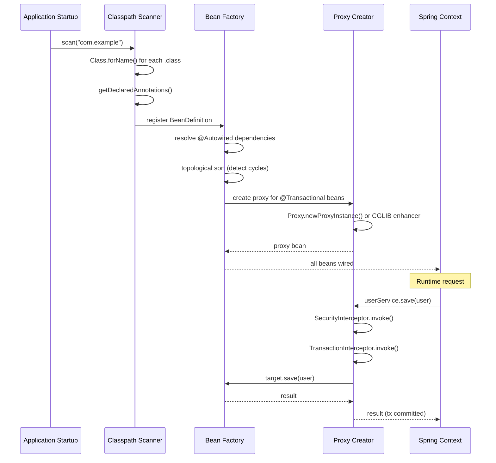
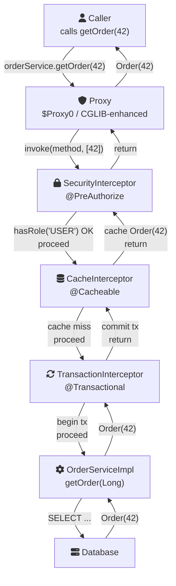

# Java Core - L4 Reflection

## Java Reflection and Dynamic Proxies

### 🎯 Model Answer

**30 seconds:**
> Reflection allows a Java program to inspect and modify its own structure
> at runtime: discover classes, fields, methods; invoke methods dynamically;
> create instances without knowing the type at compile time. Dynamic proxies
> (`java.lang.reflect.Proxy`) create objects that implement interfaces
> dynamically, intercepting method calls via an `InvocationHandler`. Cost:
> reflective calls bypass JIT inlining (15-100x slower than direct calls),
> bypass access control (`setAccessible(true)`), and reduce type safety.
> Use cases: frameworks (Spring DI, JUnit, Hibernate), serialization, plugin
> systems, testing tools.

**3 minutes (Senior):**
> Reflection API: `Class<?> clazz = Class.forName("com.example.Foo")`.
> `getDeclaredMethods()` returns all methods (including private).
> `getMethods()` returns all public methods (including inherited).
> `setAccessible(true)` bypasses Java's access control for fields and methods.
> In Java 9+: modules restrict cross-module `setAccessible` - need
> `--add-opens module/package=target` or the module must explicitly
> open the package.
>
> Dynamic proxies: `Proxy.newProxyInstance(classLoader, interfaces, handler)`.
> The proxy implements ALL listed interfaces. Every method call goes through
> `InvocationHandler.invoke(proxy, method, args)`. Spring AOP uses CGLIB
> (class proxy, works without interface) for Spring beans. JDK proxy requires
> an interface. Hibernate uses Byte Buddy (bytecode generation) for lazy-loaded
> entity proxies.
>
> Method handles (Java 7, MethodHandles API): lower-level than reflection,
> faster (JIT can inline them), safer (checked at creation time).
> `invokedynamic` bytecode instruction (used for lambdas) uses MethodHandle
> under the hood. For performance-critical dynamic dispatch: prefer
> `MethodHandle` over `Method.invoke()`.

**Framework:** WHAT → WHY → HOW → TRADE-OFF → EXAMPLE

**Blank Mind Recovery:**

**(1) Restate:** "Reflection - let me cover Class/Method/Field APIs,
setAccessible security, dynamic proxies with InvocationHandler, performance
impact, MethodHandles, and Java 9 module restrictions."

**(2) First principles:** "Reflection is the runtime equivalent of IDE
code completion: the program reads its own bytecode metadata at runtime.
Dynamic proxy creates a fake implementation: every call goes through a
central dispatcher instead of real code."

**(3) Bridge:** "Reflection is like a police detective examining a crime
scene using latent evidence. Dynamic proxies are like phone call forwarding:
every call to 'UserService' gets routed through a central dispatcher
(InvocationHandler) before reaching the real service."

---

### 📘 Concept Explanation

**Class object and type inspection:**
```java
// Three ways to get Class<?>:
Class<?> c1 = String.class;          // literal (compile-time known)
Class<?> c2 = str.getClass();        // from instance
Class<?> c3 = Class.forName("java.lang.String"); // from name (dynamic)

// Inspect fields, methods, constructors:
Field[] fields = c.getDeclaredFields(); // all declared (incl private)
Field[] pubFs  = c.getFields();         // all public (incl inherited)
Method[] meths = c.getDeclaredMethods();
Method m       = c.getMethod("substring", int.class); // public only

// Constructor and instantiation:
Constructor<?> ctor = c.getDeclaredConstructor(String.class);
ctor.setAccessible(true); // if private
Object obj = ctor.newInstance("hello");
```

**Invocation:**
```java
Method method = obj.getClass().getMethod("greet", String.class);
Object result = method.invoke(obj, "World"); // "Hello, World"

// Static method (first arg is null):
Method staticM = Math.class.getMethod("max", int.class, int.class);
int max = (int) staticM.invoke(null, 3, 7); // 7
```

**Dynamic proxy:**
```java
// Creates a proxy that implements UserService:
UserService proxy = (UserService) Proxy.newProxyInstance(
    UserService.class.getClassLoader(),
    new Class<?>[]{ UserService.class },
    (proxyObj, method, args) -> {
        System.out.println("Before: " + method.getName());
        Object result = /* invoke real service */;
        System.out.println("After: " + method.getName());
        return result;
    }
);
```

---

### 💻 Code Example

> **Code walkthrough:** The generic object mapper demonstrates the core
> reflective use case: convert between two objects of different types by
> matching field names. This is exactly how BeanUtils.copyProperties()
> (Spring/Apache Commons) works internally. The caching layer (static
> Map of field arrays) is critical: `getDeclaredFields()` is expensive;
> frameworks like Spring cache all reflection lookups at startup.

```java
// BAD: re-read fields on every copy (expensive, not cached)
void copyProperties(Object src, Object dst) {
    Field[] fields = src.getClass().getDeclaredFields(); // EVERY CALL!
    for (Field f : fields) {
        f.setAccessible(true); // EVERY CALL!
        // ... copy ...
    }
}

// GOOD: cache Field arrays per class
private static final Map<Class<?>, Field[]> FIELD_CACHE =
    new ConcurrentHashMap<>();

void copyProperties(Object src, Object dst) {
    Field[] srcFields = FIELD_CACHE.computeIfAbsent(
        src.getClass(), c -> {
            Field[] fs = c.getDeclaredFields();
            for (Field f : fs) f.setAccessible(true); // once
            return fs;
        });
    Map<String, Field> dstFields = Arrays.stream(
        FIELD_CACHE.computeIfAbsent(dst.getClass(), c -> {
            Field[] fs = c.getDeclaredFields();
            for (Field f : fs) f.setAccessible(true);
            return fs;
        }))
        .collect(Collectors.toMap(Field::getName, f -> f));

    for (Field sf : srcFields) {
        Field df = dstFields.get(sf.getName());
        if (df != null && df.getType().equals(sf.getType())) {
            try {
                df.set(dst, sf.get(src));
            } catch (IllegalAccessException e) {
                throw new RuntimeException("Copy failed: " + sf.getName(), e);
            }
        }
    }
}

// Dynamic proxy: logging + timing interceptor
interface OrderService {
    Order createOrder(OrderRequest req);
    Order getOrder(Long id);
    void cancelOrder(Long id);
}

class LoggingProxy implements InvocationHandler {
    private final Object target;
    private static final Logger log = LoggerFactory.getLogger(LoggingProxy.class);

    LoggingProxy(Object target) { this.target = target; }

    @Override
    public Object invoke(Object proxy, Method method, Object[] args)
            throws Throwable {
        long start = System.nanoTime();
        log.info("CALL: {}.{}({})",
            target.getClass().getSimpleName(),
            method.getName(),
            args != null ? Arrays.toString(args) : "");
        try {
            Object result = method.invoke(target, args);
            long elapsed = System.nanoTime() - start;
            log.info("RETURN: {}.{} -> {} in {}ms",
                target.getClass().getSimpleName(),
                method.getName(),
                result,
                elapsed / 1_000_000);
            return result;
        } catch (InvocationTargetException e) {
            // Unwrap: InvocationTargetException wraps the real exception
            log.error("EXCEPTION: {}.{} threw {}",
                target.getClass().getSimpleName(),
                method.getName(),
                e.getCause().getClass().getSimpleName());
            throw e.getCause(); // rethrow the real exception
        }
    }

    // Factory method:
    @SuppressWarnings("unchecked")
    static <T> T wrap(T target, Class<T> iface) {
        return (T) Proxy.newProxyInstance(
            iface.getClassLoader(),
            new Class<?>[]{ iface },
            new LoggingProxy(target));
    }
}

// Usage:
OrderService service = LoggingProxy.wrap(
    new OrderServiceImpl(), OrderService.class);
service.createOrder(request); // logs timing automatically
```

> **Code walkthrough:** `InvocationTargetException` is the wrapper exception
> thrown by `method.invoke()` when the invoked method throws. The `.getCause()`
> is the real exception. Callers of the proxy expect the declared checked
> exceptions from the interface, not `InvocationTargetException`. Unwrapping
> and rethrowing (`throw e.getCause()`) is mandatory for correct exception
> propagation. Failing to unwrap: callers catch the wrong exception type,
> breaking exception handling contracts throughout the codebase.

---

### 🎓 Answers by Seniority

**Junior / Mid (0-5 years):**
> `Class.forName()` loads a class by name. `getDeclaredMethods()` returns
> all methods, `getMethods()` returns public. `setAccessible(true)` bypasses
> private. `Method.invoke(target, args)` calls the method dynamically.
> Reflection is slow for hot paths - cache `Method` and `Field` objects.
> Dynamic proxy requires an interface; CGLIB works with concrete classes.

---

**Senior / Staff (5+ years):**
> MethodHandles (`java.lang.invoke.MethodHandles.Lookup`) are the modern
> alternative to raw reflection for performance-critical code. JIT can inline
> `MethodHandle.invokeExact()` like a direct call. `VarHandle` (Java 9) replaces
> `Field` for atomic field access without `sun.misc.Unsafe`. Java 9 modules:
> `setAccessible` across module boundaries requires `--add-opens` or the
> module must `opens` the package. Spring/Hibernate need `--add-opens
> java.base/java.lang=ALL-UNNAMED` etc. for legacy reflective access.
> Native image (GraalVM) requires reflection configuration at build time
> (reflection-config.json): all reflective access must be declared, dynamic
> class discovery won't work without it.

---

### ⚠️ Common Misconceptions

**Misconception 1: "setAccessible(true) always works."**
Java 9+ modules restrict reflective access across module boundaries.
`setAccessible(true)` on JDK internals (`sun.misc.Unsafe`, internal fields)
requires `--add-opens module/package=ALL-UNNAMED` JVM flag. Without it:
`InaccessibleObjectException`. This is intentional: module system protects
JDK internals from reflective access by default.

**Misconception 2: "Dynamic proxy works with any class."**
JDK `Proxy` only works with interfaces. The proxy class is a synthetic
class that implements the specified interfaces. For concrete class proxying:
use CGLIB (`enhancer.create()`), Byte Buddy, or Spring's proxy factory
(which chooses JDK vs CGLIB automatically based on whether the target
implements interfaces).

---

### 🚨 Failure Modes and Diagnosis

**Failure: InvocationTargetException swallows real errors.**
```java
// BUG: not unwrapping InvocationTargetException
try {
    method.invoke(target, args);
} catch (InvocationTargetException e) {
    log.error("Method failed: " + e.getMessage()); // WRONG!
    // e.getMessage() = null; real cause is e.getCause()!
    throw new RuntimeException("Method failed", e); // wraps the wrapper!
}
// Callers now see RuntimeException wrapping InvocationTargetException
// wrapping the real NullPointerException/BusinessException.
// Stack trace shows 3 levels of useless wrappers.

// FIX: always unwrap
} catch (InvocationTargetException e) {
    Throwable cause = e.getCause();
    if (cause instanceof RuntimeException) throw (RuntimeException) cause;
    if (cause instanceof Error) throw (Error) cause;
    throw new RuntimeException("Unexpected checked exception", cause);
}
```
Diagnosis: check stack traces for `InvocationTargetException` with a
null message. Real cause is always in `e.getCause()`.

---

### 🎯 Interview Deep-Dive

| Question Category | Time to Answer |
|---|---|
| Reflection API overview | 2 minutes |
| getDeclaredX vs getX | 90 seconds |
| setAccessible and modules | 2 minutes |
| Dynamic proxy mechanics | 3 minutes |
| CGLIB vs JDK proxy | 2 minutes |
| InvocationTargetException | 2 minutes |
| MethodHandles performance | 2-3 minutes |
| Reflection caching | 2 minutes |
| Serialization and reflection | 2 minutes |
| GraalVM native image | 2-3 minutes |
| Spring AOP proxy model | 2-3 minutes |
| Security implications | 2 minutes |

---

**Q1 (Reflection API overview): What can Java reflection do?**

A:
1. **Inspect types:** get class name, superclass, interfaces, modifiers, annotations
2. **Discover members:** list fields, methods, constructors
3. **Read/write fields:** including private (with `setAccessible`)
4. **Invoke methods:** including private (with `setAccessible`)
5. **Create instances:** including no-arg and parameterized constructors
6. **Operate generics:** `getGenericType()` returns `ParameterizedType`
7. **Read annotations:** `getAnnotation(class)`, `getAnnotationsByType(class)`
8. **Array operations:** `Array.newInstance()`, `Array.get()`

```java
// Inspect:
Class<?> c = SomeClass.class;
c.getName();           // fully qualified: "com.example.SomeClass"
c.getSimpleName();     // "SomeClass"
c.getSuperclass();     // superclass Class<?>
c.getInterfaces();     // implemented interfaces
c.getModifiers();      // int: Modifier.isPublic(c.getModifiers())
c.getAnnotations();    // runtime annotations
c.isInterface();       // boolean
c.isEnum();            // boolean
c.isRecord();          // Java 16+: boolean

// Generic field type inspection:
Field f = MyClass.class.getDeclaredField("names"); // List<String> names
Type type = f.getGenericType();
if (type instanceof ParameterizedType pt) {
    Type arg = pt.getActualTypeArguments()[0]; // String.class
}
```

*What separates good from great:* Generic type inspection via `getGenericType()`
is what allows frameworks like Gson, Jackson, and Hibernate to understand
`List<String>` vs `List<Integer>`. Raw type erasure removes generic info
at runtime FOR VARIABLES, but field/method signatures retain it in bytecode.
This is why `field.getGenericType()` returns the parameterized type even
though type erasure applies to runtime instances. Jackson uses this to
know the correct type when deserializing `List<User>` (passed as
`TypeReference<List<User>>`).

---

**Q2 (getDeclaredX vs getX): What is the difference between getDeclaredFields()
and getFields()?**

A:

| Method | Scope | Includes inherited | Includes private |
|---|---|---|---|
| `getDeclaredFields()` | Current class only | No | Yes |
| `getFields()` | Current + all ancestors | Yes | No (public only) |
| `getDeclaredMethods()` | Current class only | No | Yes |
| `getMethods()` | Current + all ancestors | Yes | No (public only) |
| `getDeclaredConstructors()` | Current class only | - | Yes |
| `getConstructors()` | Current class only | - | No (public only) |

```java
class Animal {
    public String name;
    protected int age;
    private String secret;
    public void breathe() {}
}

class Dog extends Animal {
    public String breed;
    private String tag;
    public void bark() {}
}

Dog d = new Dog();
// getDeclaredFields: Dog's own fields only
Field[] df = Dog.class.getDeclaredFields(); // [breed, tag] - no Animal fields!

// getFields: all public, from Dog + Animal + Object
Field[] pf = Dog.class.getFields(); // [breed, name] - only public!

// getDeclaredMethods: Dog's own methods only
Method[] dm = Dog.class.getDeclaredMethods(); // [bark] - no breathe!

// getFields does NOT include private, getDeclaredFields includes ALL:
for (Field f : Dog.class.getDeclaredFields()) {
    f.setAccessible(true); // unlock private
    System.out.println(f.getName() + " = " + f.get(d));
}

// To get ALL fields including inherited (including private):
List<Field> allFields = new ArrayList<>();
Class<?> c = Dog.class;
while (c != null && c != Object.class) {
    Collections.addAll(allFields, c.getDeclaredFields());
    c = c.getSuperclass(); // walk hierarchy
}
```

*What separates good from great:* Walking the class hierarchy with
`getSuperclass()` is required for frameworks that serialize/deserialize
objects with inheritance (Jackson, Hibernate). Jackson by default includes
only the declared fields of the target class; use `@JsonIncludeProperties`
or the visibility settings to control inherited field inclusion. Hibernate
entity scanning walks the entire hierarchy to find all `@Column` annotations
including those in `@MappedSuperclass` parents.

---

**Q3 (setAccessible and modules): How does Java 9 module system affect reflection?**

A: Java 9 introduced the module system (JPMS). By default, modules don't
allow deep reflective access (reading private fields/methods) to their
internal packages.

```
// Module access levels:
// reads:     compile-time, can use public types in exported packages
// exports:   makes public types accessible to specific modules
// opens:     allows REFLECTIVE access to all types (including private)
//            without "opens": setAccessible(true) throws InaccessibleObjectException

// JDK module: java.base module does NOT open java.lang by default
// Attempting setAccessible on java.lang.String field: FAILS

// JVM flags to re-open for legacy code:
// --add-opens java.base/java.lang=ALL-UNNAMED
// --add-opens java.base/java.util=ALL-UNNAMED
// This is how Spring/Hibernate run on Java 17+

// In module-info.java:
module my.module {
    opens com.example.internal; // ALL other modules can reflect into this package
    opens com.example.model to com.jackson; // only com.jackson can reflect
}

// Checking if module opens:
Module module = SomeClass.class.getModule();
boolean isOpen = module.isOpen("com.example.internal",
    MyReflectionTool.class.getModule());
```

*What separates good from great:* The module system breaking reflection
was intentional - it was the key mechanism for "encapsulate JDK internals"
(Project Jigsaw). Before Java 9: `sun.misc.Unsafe`, internal GC APIs,
`URLClassLoader` internals were accessible via `setAccessible`. After
Java 9: accessing JDK internals requires explicit `--add-opens` flags.
Real-world impact: Spring Boot apps running on Java 17 typically need
`--add-opens` flags in their startup scripts. GraalVM native image doesn't
support dynamic `setAccessible` at all: all reflective accesses must be
declared in `reflect-config.json` at build time.

---

**Q4 (Dynamic proxy mechanics): How does JDK dynamic proxy work internally?**

A: `Proxy.newProxyInstance()` creates a new class at runtime (stored in the
classloader's namespace). This synthetic class:
1. Extends `java.lang.reflect.Proxy`
2. Implements all specified interfaces
3. For every method call: delegates to `InvocationHandler.invoke()`

```java
// JDK proxy requires an interface:
interface Greeter { String greet(String name); }

// Create proxy:
Greeter proxy = (Greeter) Proxy.newProxyInstance(
    Greeter.class.getClassLoader(),
    new Class<?>[]{ Greeter.class },
    new InvocationHandler() {
        @Override
        public Object invoke(Object proxyObj, Method method, Object[] args)
                throws Throwable {
            // method: the Method object for greet(String)
            // args: ["World"]
            String name = (String) args[0];

            // Delegate to real impl? (need to inject it):
            // return realImpl.greet(name);

            // Or handle directly:
            return "Hello, " + name + "!";
        }
    });

String result = proxy.greet("World"); // "Hello, World!"

// The generated proxy class (conceptually):
// class $Proxy0 extends Proxy implements Greeter {
//     $Proxy0(InvocationHandler h) { super(h); }
//     public String greet(String name) {
//         return (String) h.invoke(this, greetMethod, new Object[]{name});
//     }
// }

// getProxyClass: get the class (useful for introspection)
Class<?> proxyClass = proxy.getClass();
System.out.println(Proxy.isProxyClass(proxyClass)); // true
System.out.println(Proxy.getInvocationHandler(proxy)); // the handler
```

*What separates good from great:* The generated proxy class is cached:
calling `Proxy.newProxyInstance` with the same interfaces and classloader
returns instances of the SAME generated proxy class (just different
`InvocationHandler` instances). This means reflection on the proxy class
is fast after the first call (no re-generation). Spring's
`ProxyFactoryBean` uses this: one proxy class per service interface,
reused across all beans. The handler instance carries the per-bean state
(reference to target, interceptor chain, etc.).

---

**Q5 (CGLIB vs JDK proxy): When does Spring use CGLIB vs JDK proxy?**

A:

| Condition | Proxy Type | Mechanism |
|---|---|---|
| Bean implements interface(s) | JDK proxy (default) | `Proxy.newProxyInstance()` |
| Bean is a concrete class (no interface) | CGLIB | Bytecode subclass generation |
| `@EnableAspectJAutoProxy(proxyTargetClass=true)` | CGLIB | Forces CGLIB for all |
| Spring Boot (default in 2.x+) | CGLIB | proxyTargetClass=true by default |

```java
// JDK Proxy (interface required):
@Service
class UserServiceImpl implements UserService {
    // Spring wraps with JDK proxy implementing UserService interface
}
// The Spring bean is: Proxy$UserService -> InvocationHandler -> UserServiceImpl

// CGLIB (no interface, or forced):
@Service
class OrderService { // no interface
    @Transactional
    public void placeOrder(Order o) { /* ... */ }
}
// Spring wraps with: OrderService$EnhancerByCGLIB -> OrderService
// CGLIB creates a SUBCLASS, overrides all non-final methods

// IMPORTANT: CGLIB can't proxy:
// 1. final classes (can't subclass)
// 2. final methods (can't override)
// 3. private methods (can't override)
@Service
class ProblemService {
    @Transactional
    public final void doSomething() { } // @Transactional IGNORED! final!
}
// Spring silently skips proxy for final methods -> no transaction!
// Diagnosis: enable Spring transaction logging, check if transaction active

// Spring Boot 2.x default: CGLIB (proxyTargetClass=true)
// Reason: avoids the "injecting by concrete type" issues with JDK proxies
// @Autowired UserServiceImpl impl; // fails with JDK proxy (cast fails!)
// @Autowired UserService service;  // works with both proxy types
```

*What separates good from great:* Spring Boot's switch to CGLIB by default
(version 2.0) resolved a long-standing friction: `@Autowired UserServiceImpl`
failed with JDK proxy (the bean is a `$Proxy`, not `UserServiceImpl`).
With CGLIB: the proxy IS-A `UserServiceImpl` (subclass), so concrete-type
injection works. The trade-off: CGLIB generates subclasses, which means
the target class must have a no-arg constructor accessible to the subclass.
With Java 17+ modules: CGLIB subclassing also has module restrictions.
Spring's solution: compile-time component scanning with explicit proxy
configuration for GraalVM native image.

---

**Q6 (InvocationTargetException): Why does InvocationTargetException exist?**

A: `method.invoke()` declares: `throws IllegalAccessException, InvocationTargetException`.
It cannot declare the method's own checked exceptions (unknown at `invoke()`
time). So all exceptions thrown by the invoked method are wrapped in
`InvocationTargetException`. The real exception is always `e.getCause()`.

```java
// Correct exception handling for Method.invoke():
public Object safeInvoke(Method method, Object target, Object... args) {
    try {
        return method.invoke(target, args);
    } catch (IllegalAccessException e) {
        // Programming error: forgot setAccessible(true)
        throw new IllegalStateException(
            "Cannot access method: " + method.getName(), e);
    } catch (InvocationTargetException e) {
        Throwable cause = e.getCause(); // ALWAYS unwrap!
        // Re-throw as appropriate:
        if (cause instanceof RuntimeException re) throw re;
        if (cause instanceof Error err) throw err;
        // Checked exception from target method:
        throw new RuntimeException(
            "Checked exception from " + method.getName(), cause);
    }
}

// In InvocationHandler: throw the cause directly
@Override
public Object invoke(Object proxy, Method method, Object[] args)
        throws Throwable {
    try {
        return method.invoke(target, args);
    } catch (InvocationTargetException e) {
        throw e.getCause(); // declared as Throwable - safe to propagate
    }
}
// InvocationHandler.invoke() throws Throwable - allows propagating
// any exception type including checked exceptions from the target
```

*What separates good from great:* In `InvocationHandler.invoke()`, the
`throws Throwable` declaration allows re-throwing `e.getCause()` directly,
even if it's a checked exception not declared in the interface method.
The JVM's duck typing ensures the proxy propagates the exact exception
the caller expects (declared in the interface). This is the ONLY place
in Java where you can throw an arbitrary checked exception without
declaring it: through `e.getCause()` rethrow in an `InvocationHandler`.
Spring's proxy chain uses this mechanism to propagate checked exceptions
cleanly through multiple proxy layers.

---

**Q7 (MethodHandles performance): How do MethodHandles improve on reflection?**

A: `MethodHandles` (java.lang.invoke, Java 7) provide a typed, lower-level
mechanism for dynamic method invocation. Key advantages over reflection:
- JIT-inlineable (the JIT can inline `MethodHandle.invokeExact()` like a direct call)
- Checked at creation time (not at invocation time)
- Faster in tight loops after JIT warmup

```java
// Reflection: MethodHandle comparison
import java.lang.invoke.*;

MethodHandles.Lookup lookup = MethodHandles.lookup();

// Find method handle (checked at CREATION, not at invocation):
MethodHandle handle = lookup.findVirtual(
    String.class,
    "substring",
    MethodType.methodType(String.class, int.class)); // (return, params)

// Invoke:
String result = (String) handle.invoke("Hello World", 6); // "World"
// Or type-safe:
String result = (String) handle.invokeExact(
    (String)"Hello World", (int)6); // faster (no boxing)

// Micro-benchmark (approximate - JIT-dependent):
// Direct call:        ~1ns
// MethodHandle.invokeExact: ~2-5ns (JIT-warmed, may inline)
// Method.invoke():    ~20-50ns (JIT cannot inline through reflection)
// (All numbers approximate; actual depends on JIT optimization)

// VarHandle (Java 9): typed field access with compare-and-set
VarHandle vh = MethodHandles.lookup()
    .findVarHandle(Counter.class, "count", int.class);
int val = (int) vh.get(counter);
vh.set(counter, 42);
vh.compareAndSet(counter, 42, 100); // atomic CAS

// Compare with: Field.get()/set() - untyped, slower
```

*What separates good from great:* The JDK itself uses `invokedynamic` and
`MethodHandle` internally for lambda expressions (since Java 8). The
`LambdaMetafactory` creates `MethodHandle`-based functional interfaces
at first use. This is why lambda performance equals or exceeds anonymous
inner class performance after JIT warmup: the `MethodHandle` gets inlined.
For framework authors implementing their own "method invocation with interception":
prefer `MethodHandle.asCollector()` / `MethodHandles.lookup().findVirtual()`
over raw `Method.invoke()` for production-quality performance.

---

**Q8 (Reflection caching): How do you cache reflection objects for performance?**

A:
```java
// Reflection objects to cache (expensive to create):
// Class<?> - obtained once, reuse
// Method   - getDeclaredMethod() is moderately expensive
// Field    - getDeclaredField() is moderately expensive
// Constructor - getDeclaredConstructor() is expensive

// Cache pattern: per-class, application-scoped
class ReflectionCache {
    // ClassValue is a JVM-level per-class cache (no ConcurrentHashMap overhead)
    private static final ClassValue<Map<String, Method>> METHOD_CACHE =
        new ClassValue<>() {
            @Override
            protected Map<String, Method> computeValue(Class<?> c) {
                Map<String, Method> map = new HashMap<>();
                for (Method m : c.getDeclaredMethods()) {
                    m.setAccessible(true);
                    map.put(m.getName(), m); // simplified: ignores overloads
                }
                return Collections.unmodifiableMap(map);
            }
        };

    static Method findMethod(Class<?> clazz, String name) {
        return METHOD_CACHE.get(clazz).get(name);
    }
}

// ClassValue: lightweight, GC-friendly, no Map overhead
// Auto-cleared when the class is garbage collected (ClassLoader GC)
// Preferred over ConcurrentHashMap<Class<?>, ...> for class-keyed caches

// Jackson's approach:
// ObjectMapper caches: BeanDescription per class (field list, annotations)
// First serialization: expensive (scan fields, find annotations)
// Subsequent: use cached BeanDescription
// Benchmark: 10x+ speedup on repeated serialization of same type
```

*What separates good from great:* `ClassValue<T>` is the JVM-provided
per-class cache, available since Java 7. Unlike `WeakHashMap<Class<?>, T>`
or `ConcurrentHashMap`, it's designed for this exact use case:
the cache entry is associated with the class object's identity, cleared
when the class is unloaded, and accessed without hash collision overhead.
For reflection-heavy code that processes many different types: `ClassValue`
is the production-correct solution. Many frameworks (Hibernate Validator,
Jackson internals) use it or equivalent patterns.

---

**Q9 (Serialization and reflection): How does Java serialization use reflection?**

A: Java's built-in serialization (`ObjectOutputStream`/`ObjectInputStream`)
uses reflection internally:
1. `writeObject()`: iterates all non-transient, non-static fields (including private) via `getDeclaredFields()` + `setAccessible(true)`
2. `readObject()`: instantiates object WITHOUT calling constructor (allocates directly via `ReflectionFactory`), then restores fields via reflection

```java
// Serializable class:
class User implements Serializable {
    private static final long serialVersionUID = 1L;
    private String name;
    private transient String password; // NOT serialized

    private void writeObject(ObjectOutputStream out) throws IOException {
        out.defaultWriteObject(); // serialize non-transient fields
        out.writeObject(encrypt(password)); // custom: encrypted password
    }

    private void readObject(ObjectInputStream in)
            throws IOException, ClassNotFoundException {
        in.defaultReadObject(); // restore non-transient fields
        this.password = decrypt((String) in.readObject()); // custom restore
    }
}

// Serialization security risk:
// readResolve() can return a different object after deserialization
// Gadget chains: a series of readObject() calls that trigger
// arbitrary code execution (Java deserialization vulnerabilities)
// CVE-2015-4852: Apache Commons Collections gadget chain
// Prevention: serialization filters (Java 9+)
ObjectInputStream ois = new ObjectInputStream(input);
ois.setObjectInputFilter(FilterInfo fi -> {
    if (fi.serialClass() == null) return ObjectInputFilter.Status.UNDECIDED;
    if (fi.serialClass().getName().startsWith("com.myapp.")) {
        return ObjectInputFilter.Status.ALLOWED;
    }
    return ObjectInputFilter.Status.REJECTED; // deny all unknown classes
});
Object obj = ois.readObject();
```

*What separates good from great:* Java deserialization is one of the most
critical security issues in enterprise Java. Deserializing untrusted data
(from external systems, user uploads, message queues containing serialized
Java objects) can execute arbitrary code via "gadget chains" - sequences of
`readObject()` implementations in legitimate classes that chain together to
run attacker-controlled code. The fix: never deserialize untrusted Java
serialization data. If required: use `ObjectInputFilter` (Java 9+) to
whitelist allowed classes. Modern alternative: JSON/Protocol Buffers/Avro
instead of Java serialization for cross-system communication.

---

**Q10 (GraalVM native image): How does GraalVM native image affect reflection?**

A: GraalVM Native Image performs ahead-of-time (AOT) compilation: it builds
a standalone native executable from Java code. The trade-off: dynamic features
(reflection, dynamic class loading) require explicit configuration.

```json
// reflect-config.json: declares all reflective access at build time
[
  {
    "name": "com.example.User",
    "allDeclaredFields": true,
    "allDeclaredMethods": true,
    "allDeclaredConstructors": true
  },
  {
    "name": "com.example.OrderService",
    "methods": [
      {"name": "processOrder", "parameterTypes": ["com.example.OrderRequest"]}
    ]
  }
]
// native-image will include only the declared reflective accesses
// Any undeclared reflection at runtime: NullPointerException or ClassNotFoundException
```

*What separates good from great:* Spring Boot 3 + GraalVM Native Image is
the production scenario. Spring's `@RegisterReflectionForBinding` and
`@ImportRuntimeHints` annotations generate the `reflect-config.json`
automatically for Spring beans. For custom code: use the GraalVM Tracing Agent
(`-agentlib:native-image-agent=config-output-dir=./config`) to auto-generate
configuration by running tests and watching reflective accesses. Quarkus and
Micronaut build around AOT from the ground up, avoiding dynamic reflection
in their core (processing everything at build time).

---

**Q11 (Spring AOP proxy model): How does Spring AOP use dynamic proxies?**

A:
```java
// Spring's proxy creation (simplified):
// 1. At startup: BeanPostProcessor scans beans for @Transactional,
//    @Cacheable, @Async, @Secured, custom @Aspect pointcuts
// 2. For matching beans: wraps in a proxy (JDK or CGLIB)
// 3. Proxy chains interceptors: [SecurityInterceptor -> TransactionInterceptor
//    -> CacheInterceptor -> Target method]

@Service
class OrderService {
    @Transactional  // Spring adds TransactionInterceptor
    @Cacheable("orders") // Spring adds CacheInterceptor
    @PreAuthorize("hasRole('USER')") // Spring adds SecurityInterceptor
    public Order getOrder(Long id) {
        return repo.findById(id).orElseThrow();
    }
}

// What Spring builds (conceptually):
// OrderService proxy:
//   invoke(getOrder, [id]):
//     1. SecurityInterceptor.invoke() -> check hasRole('USER')
//     2. CacheInterceptor.invoke() -> check "orders" cache
//     3. TransactionInterceptor.invoke() -> begin transaction
//     4. OrderService.getOrder(id) -> real method
//     5. TransactionInterceptor -> commit/rollback
//     6. CacheInterceptor -> cache result
//     7. SecurityInterceptor -> cleanup

// Self-invocation problem (critical):
@Service
class OrderService {
    public void processOrder(Order order) {
        // Calls self directly - bypasses ALL proxy interceptors!
        this.persistOrder(order); // 'this' is the real object, not proxy
    }

    @Transactional // NEVER CALLED - no proxy here!
    private void persistOrder(Order order) { repo.save(order); }

    // Fix: inject self via @Autowired, or use AopContext.currentProxy()
}
```

*What separates good from great:* Spring AOP's proxy model has a well-known
limitation: it only intercepts calls that go THROUGH the proxy. Any internal
call (`this.method()`) goes directly to the target object. This is why
Spring recommends structuring code so transactional/cached/secured operations
are public methods on separate beans, not internal helpers. The alternative:
AspectJ full weaving (compile-time or load-time bytecode instrumentation)
which can intercept ANY call including private and internal. Spring supports
AspectJ mode via `@EnableAspectJAutoProxy(mode=AspectJ)`.

---

**Q12 (Security implications): What are the security risks of reflection?**

A:
1. **Access control bypass:** `setAccessible(true)` bypasses `private`, `protected`
2. **Sensitive data exposure:** reflectively reading private fields (passwords, keys)
3. **Gadget chains in deserialization:** as discussed in Q9
4. **Arbitrary class instantiation:** `Class.forName(userInput).newInstance()`

```java
// VULNERABILITY: accepting class name from user input
// BAD: Server-Side Template Injection / Remote Code Execution
String className = request.getParameter("class"); // user-controlled!
Class<?> clazz = Class.forName(className);        // loads ANY class!
Object obj = clazz.getDeclaredConstructor().newInstance(); // instantiates it!
// Attacker sends: class=javax.naming.InitialContext
// InitialContext constructor can connect to attacker LDAP
// -> Log4Shell-style RCE (CVE-2021-44228)

// FIX: whitelist approach
private static final Set<String> ALLOWED_CLASSES = Set.of(
    "com.example.model.User",
    "com.example.model.Order"
);
String className = request.getParameter("class");
if (!ALLOWED_CLASSES.contains(className)) {
    throw new SecurityException("Unauthorized class: " + className);
}
Class<?> clazz = Class.forName(className); // now safe

// Java Security Manager (deprecated Java 17, removed 21):
// Was the platform-level defense. Now: module system + explicit whitelists
// Modern defense: input validation + class whitelist + SecurityManager replacement
```

*What separates good from great:* Log4Shell (CVE-2021-44228) was the most
severe Java vulnerability in years: Log4j2 used `Class.forName()` with
data from log messages (user-controlled input), enabling JNDI lookups to
attacker-controlled LDAP servers. The root cause: trusting class names
derived from user input. This applies to any code path where:
`Class.forName(string)`, `Class.forName(string).newInstance()`,
`ClassLoader.loadClass(string)`, or `ObjectInputStream.readObject()`
processes attacker-controlled data. The fix: whitelist, input validation,
`ObjectInputFilter`, never log unsanitized user input.

---

### ⚖️ Comparison Table

| Mechanism | Type Safety | Performance | Dynamic | Use Case |
|---|---|---|---|---|
| Direct call | Compile-time | Native (1x) | No | Normal code |
| `Method.invoke()` | Runtime | 20-50x slower | Yes | General reflection |
| `MethodHandle.invokeExact()` | Checked at creation | 2-5x (JIT) | Yes | Performance-sensitive |
| `VarHandle` | Typed | Near-native | Yes | Atomic field access |
| JDK Dynamic Proxy | Interface | Moderate | Yes | Interface interception |
| CGLIB Proxy | Class | Moderate | Yes | Class interception |
| Byte Buddy | Both | Near-native | Yes | Framework bytecode gen |

---

### 🏛️ System Design

**Design: Framework dependency injection container using reflection**

```
Application Startup:
  [Classpath Scan] -> [Component Detection] -> [Dependency Graph]
       |                      |                       |
  Class.forName()      @Service, @Repository    topological sort
  URLClassLoader        @Component, @Bean        cycle detection
                            |
                    [Bean Factory]
                         |         |
               [JDK Proxy]     [CGLIB Proxy]
               (interface)      (class)
                    |                |
            [Interceptor Chain]
               @Transactional
               @Cacheable
               @Async
               @Secured
                    |
            [Application Ready]
                    |
             [Runtime Calls]
             InvocationHandler
             -> interceptors
             -> target method
```



> **Diagram walkthrough:** The sequence shows Spring's startup flow: classpath
> scanning uses `Class.forName()` to load classes, reflection reads annotations,
> the bean factory resolves dependencies and detects cycles via topological sort,
> then proxies are created for AOP-annotated beans. At runtime, every method
> call goes through the interceptor chain before reaching the real target.
> The key insight: all the expensive reflection happens once at startup,
> cached in `BeanDefinition` objects. Runtime calls use cached proxy classes
> and pre-built interceptor chains.

---

### 📊 Diagram

**JDK Dynamic Proxy call chain:**

```
Caller -> [OrderService (Proxy)]
             |
             | InvocationHandler.invoke()
             |
             +-> SecurityInterceptor.invoke()
             |      +-> check hasRole('USER')
             |
             +-> CacheInterceptor.invoke()
             |      +-> check cache(orders, id)
             |      +-> (if miss, proceed)
             |
             +-> TransactionInterceptor.invoke()
             |      +-> begin transaction
             |      +-> proceed
             |      +-> commit/rollback
             |
             +-> OrderServiceImpl.getOrder(id)
                    +-> repo.findById(id)
                    +-> return Order
```



> **Diagram walkthrough:** The proxy wraps the real `OrderServiceImpl` with
> a chain of interceptors. Each interceptor can: check a condition and abort
> (security), short-circuit with cached value (cache), wrap with transaction
> semantics (transaction). Interceptors are ordered (security before cache
> before transaction by default in Spring). The `InvocationHandler.invoke()`
> method is the single entry point for ALL method calls on the proxy. The
> proxy knows all interfaces the target implements; calling any method on
> the proxy routes through the same `invoke()` method. The proxy pattern
> enables adding cross-cutting concerns (security, caching, transactions)
> without modifying the target class.
