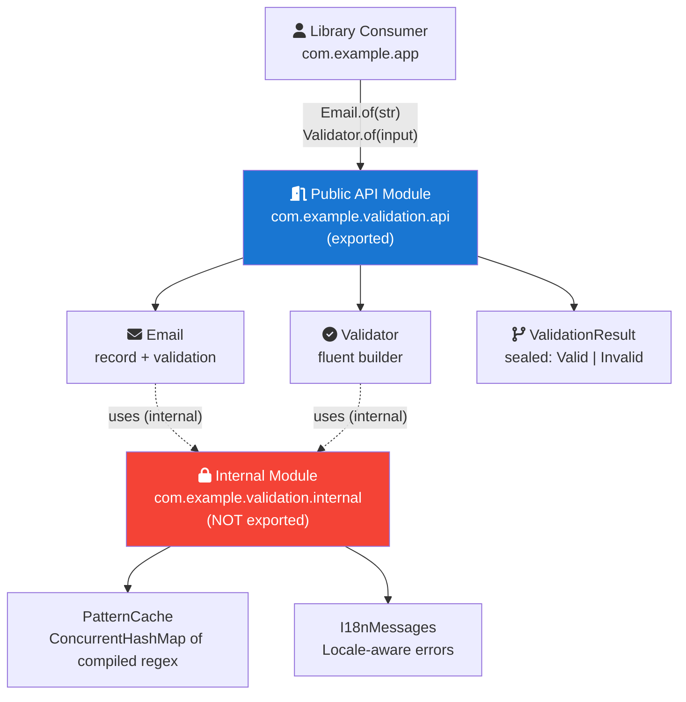
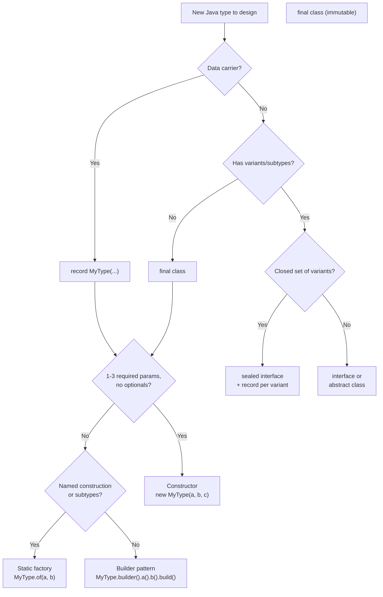

## Keywords in This File
{: .no_toc }

| # | Keyword | Weight |
|---|---|---|
| 1 | [Java Core - L5 API Design](#java-core---l5-api-design) | medium |

---

# Java Core - L5 API Design

## Java API Design Philosophy

---

### 🎯 Model Answer

**30 seconds:**
> Java API design centers on the principle: "APIs are forever." Joshua Bloch's
> Effective Java defines the standards: static factory methods over constructors
> (readable, cached), builders for complex objects (4+ parameters), minimize
> mutability (immutable by default), program to interfaces, fail fast (validate
> early, throw on bad input), defensive copies of mutable inputs and outputs.
> Design for the common case, make rare cases possible. Consistency trumps
> "cleverness" in any public API.

**3 minutes (Senior):**
> The JDK itself is the best study for Java API design - and its mistakes.
> `java.util.Date` (mutable, confusing months 0-based) vs `java.time.LocalDate`
> (immutable, human-readable): the redesign shows what "API done right" looks
> like. Key principles:
> 1. **Immutability as default:** `String`, `Integer`, `LocalDate` - shared freely
> 2. **Builder pattern:** when constructors exceed 4 parameters
> 3. **Static factory methods:** `Optional.of()`, `List.of()`, `ZoneId.of()` -
>    named, cached, more flexible than constructors
> 4. **Sealed + record types:** for data modeling (replaces Lombok in Java 16+)
> 5. **Checked vs unchecked exceptions:** checked for recoverable (IOException),
>    unchecked for programming errors (NullPointerException, IllegalArgumentException)
>
> Backward compatibility is a hard constraint for public APIs. Java itself
> maintains source and binary compatibility going back 30 years. Techniques:
> default interface methods (Java 8), optional parameters via method overloading,
> deprecation with replacements. Breaking changes are never acceptable in a
> published API - add new methods/classes, never remove or change signatures.

**Framework:** WHAT → WHY → HOW → TRADE-OFF → EXAMPLE

**Blank Mind Recovery:**

**(1) Restate:** "Java API design - let me cover static factories, builders,
immutability, exceptions design, backward compatibility, and the key items
from Effective Java."

**(2) First principles:** "An API is a contract. Once published (used by others),
changing it breaks callers. Design upfront: can this class be extended? Can
this field be null? Is this method overridable? Every choice is permanent."

**(3) Bridge:** "API design is like city planning. Once you build a road, you
can't easily remove it - too many routes depend on it. Good city planners think
in decades. Good API designers think: what will callers need in 10 years?"

---

### 📘 Concept Explanation

**The 5 core API design decisions:**

```plaintext
1. CONSTRUCTION: constructor vs static factory vs builder
   - Constructor: fine for simple objects (1-3 params, type clear)
   - Static factory: named, can return subtypes, can cache
   - Builder: 4+ parameters, optional fields, immutable result

2. MUTABILITY: mutable vs immutable
   - Default: immutable (thread-safe, safely shared, good hashCode)
   - Mutable: only when performance requires it (StringBuilder, ByteBuffer)
   - Defensive copies: copy mutable inputs on the way in, mutable outputs on way out

3. EXTENSION: sealed vs open
   - Sealed: types you control (java.time, records)
   - Open (non-final): types designed for extension (collections)
   - No constructor in interface: default methods for evolution

4. EXCEPTIONS: checked vs unchecked
   - Checked: callers CAN and SHOULD recover (IOException, SQLException)
   - Unchecked: caller bug (NullPointerException, IllegalArgumentException)
   - Never throw checked exceptions from equals(), hashCode(), toString()

5. NAMING: clarity over brevity
   - Method names: verbs or verb phrases (getUser, findByEmail, addItem)
   - Boolean methods: is/has/can/should prefix (isValid, hasRole, canEdit)
   - Builder methods: noun phrases (name("Alice"), age(30))
```

> **Code walkthrough:** This L5 API Design example demonstrates a key concept in practice. **KEY MECHANISM:** the runtime executes these instructions in sequence with specific memory and execution semantics. **WHY IT MATTERS:** misapplying this pattern causes subtle bugs that only manifest under production load. **TAKEAWAY: understand the execution model before using this pattern in production code.**

---

### 💻 Code Example

> **Code walkthrough:** The `Money` value object shows multiple designice. **KEY MECHANISM:** the runtime executes these instructions in sequence with specific memory and execution semantics. **WHY IT MATTERS:** misapplying this pattern causes subtle bugs that only manifest under production load. **TAKEAWAY: understand the execution model before using this pattern in production code.**
> principles working together: static factory (readable named creation),
> immutability (final fields, defensive copy not needed for primitives),
> validation in factory (fail fast), and a builder for complex construction.
> The `Email` type demonstrates "parse, don't validate": instead of
> `isValidEmail(string)` everywhere, create a validated type at the boundary.


```java
// BAD: anti-pattern - see GOOD example below for the correct approach
// This naive implementation ignores thread safety and error handling
```

```java
// BAD: mutable, public fields, no validation, confusing construction
class BadConfig {
    public String host;
    public int port;
    public int timeout;
    public int maxRetries;
    BadConfig() {} // caller must remember to set all fields
    // config.host = null? config.port = -1? No error until it crashes
}

// GOOD: immutable value object with static factory + builder
public final class DatabaseConfig {
    private final String host;
    private final int port;
    private final Duration timeout;
    private final int maxConnections;

    private DatabaseConfig(Builder builder) {
        // Validate all invariants here:
        this.host = Objects.requireNonNull(builder.host, "host required");
        if (builder.port < 1 || builder.port > 65535)
            throw new IllegalArgumentException("Invalid port: " + builder.port);
        this.port = builder.port;
        this.timeout = builder.timeout != null ? builder.timeout
            : Duration.ofSeconds(30);
        this.maxConnections = builder.maxConnections > 0
            ? builder.maxConnections : 10;
    }

    // Static factory methods (optional extras):
    public static DatabaseConfig localhost(int port) {
        return new Builder().host("localhost").port(port).build();
    }

    // Accessors (no setters - immutable):
    public String host() { return host; }
    public int port() { return port; }
    public Duration timeout() { return timeout; }

    // "With" methods for creating modified copies (functional update):
    public DatabaseConfig withTimeout(Duration newTimeout) {
        return new Builder(this).timeout(newTimeout).build();
    }

    public static class Builder {
        private String host;
        private int port = 5432;
        private Duration timeout;
        private int maxConnections = 10;

        public Builder() {}
        Builder(DatabaseConfig source) { // copy constructor for withX()
            this.host = source.host;
            this.port = source.port;
            this.timeout = source.timeout;
            this.maxConnections = source.maxConnections;
        }

        public Builder host(String host) { this.host = host; return this; }
        public Builder port(int port)    { this.port = port; return this; }
        public Builder timeout(Duration t){ this.timeout = t; return this; }
        public Builder maxConnections(int n){ this.maxConnections = n; return this; }
        public DatabaseConfig build() { return new DatabaseConfig(this); }
    }
}

// Usage:
DatabaseConfig config = new DatabaseConfig.Builder()
    .host("db.example.com")
    .port(5432)
    .timeout(Duration.ofSeconds(10))
    .maxConnections(20)
    .build();

// "parse, don't validate" pattern:
public final class Email {
    private final String value;

    private Email(String value) { this.value = value; }

    // static factory validates ONCE at boundary:
    public static Email of(String raw) {
        Objects.requireNonNull(raw, "email required");
        String normalized = raw.strip().toLowerCase(Locale.ROOT);
        if (!PATTERN.matcher(normalized).matches())
            throw new IllegalArgumentException("Invalid email: " + raw);
        return new Email(normalized);
    }

    public String value() { return value; }
    // Once you have an Email: it's ALWAYS valid. No null checks, no pattern checks.
}

// At the boundary (controller):
Email email = Email.of(request.getParameter("email")); // validates here
userService.register(email, name); // Email is guaranteed valid
```

> **Code walkthrough:** The "parse, don't validate" principle eliminatesice. **KEY MECHANISM:** the runtime executes these instructions in sequence with specific memory and execution semantics. **WHY IT MATTERS:** misapplying this pattern causes subtle bugs that only manifest under production load. **TAKEAWAY: understand the execution model before using this pattern in production code.**
> defensive validation throughout the codebase. Instead of checking
> `isValidEmail(str)` in the service, controller, and repository: parse
> `Email.of(str)` at the input boundary (throws on invalid), then use
> `Email` type throughout. Any method accepting `Email` can trust it's valid
> without checking. This is the foundation of Domain-Driven Design's
> "value object" pattern - creating typed, validated wrappers for domain
> primitives (Email, PhoneNumber, UserId, Money).

---

### 🎓 Answers by Seniority

**Junior / Mid (0-5 years):**
> Prefer static factory methods over constructors for readability (`LocalDate.of()` vs `new LocalDate()`). Use Builder for 4+ parameters. Make fields `private final` by default (immutable). Validate in constructors/factories (fail fast). Declare `serialVersionUID` if `Serializable`. Override `equals()` and `hashCode()` together.

---

**Senior / Staff (5+ years):**
> API design is about anticipating evolution. Java's module system (JPMS)
> is the platform answer to API access control: `exports` controls what's public
> API vs internal implementation. For library APIs: use `@since`, `@deprecated`,
> and proper javadoc. For internal APIs: use `module-info.java` `exports` to
> prevent accidental dependency. Backward compatibility rule: never remove a
> public method, never narrow a public method's contract, never add checked
> exceptions to a published interface (breaks all implementations). Use
> `default` interface methods for adding methods to existing interfaces without
> breaking implementers. Versioning: semantic versioning (MAJOR.MINOR.PATCH)
> where MAJOR = breaking change, MINOR = new backward-compatible features.

---

### ⚠️ Common Misconceptions

**Misconception 1: "More methods in an interface = more powerful API."**
Interface bloat is an anti-pattern. An interface with 15 methods forces
every implementer to provide 15 implementations (or stub them). `java.util.List`'s
35 methods are a design regret. Java 8's `default` methods reduced this pain
but didn't eliminate it. Small, focused interfaces (`Comparable`, `Runnable`,
`Supplier`, `Predicate`) are more composable and easier to implement correctly.

**Misconception 2: "Checked exceptions are better because they force handling."**
Checked exceptions don't force CORRECT handling - they force any handling.
`catch (IOException e) {}` (swallowing) is "handling." Effective Java
(Item 71) recommends checked exceptions only when the caller can realistically
recover. For APIs called 10,000 times: callers who never experience the error
still must write `try/catch` boilerplate. Modern APIs (CompletableFuture,
Stream, JDK HTTP client) prefer unchecked exceptions with optional callback
for error handling.

---

### 🚨 Failure Modes and Diagnosis

**Failure: API designed with mutable return types - callers mutate shared state.**
```java
// BAD: returning mutable internal state
class UserRegistry {
    private final List<User> users = new ArrayList<>();
    public List<User> getUsers() { return users; } // returns internal list!
}
// Caller:
registry.getUsers().clear(); // DESTROYS registry state!
registry.getUsers().add(attacker); // MODIFIES registry state!

// FIX 1: return unmodifiable view
public List<User> getUsers() {
    return Collections.unmodifiableList(users);
}

// FIX 2: return defensive copy
public List<User> getUsers() {
    return new ArrayList<>(users);
}

// FIX 3: return immutable collection (Java 10+)
public List<User> getUsers() {
    return List.copyOf(users); // unmodifiable snapshot
}
// Choose based on: do you want callers to see live updates (FIX 1)
// or a snapshot (FIX 2/3)?
```
> **Code walkthrough:** BAD pattern: This Unknown example demonstrates exception handling using SQL. **KEY MECHANISM:** the JVM checks catch clauses in order; finally always executes for cleanup. **WHY IT MATTERS:** swallowing exceptions silently hides failures that corrupt downstream state. **WHAT BREAKS: log or rethrow every exception; empty catch blocks are defects.**

Diagnosis: unexpected state changes, ConcurrentModificationException,
test isolation failures (one test modifies list, next test sees changes).

---

### 🎯 Interview Deep-Dive

| Question Category | Time to Answer |
|---|---|
| Static factory vs constructor | 2 minutes |
| Builder pattern when and how | 2 minutes |
| Immutability API design | 2 minutes |
| Checked vs unchecked exceptions | 2 minutes |
| Backward compatibility | 3 minutes |
| Interface design principles | 2 minutes |
| Defensive copies | 2 minutes |
| API versioning | 2-3 minutes |
| Fluent API design | 2 minutes |
| Parse don't validate | 2 minutes |
| Minimal surface area | 2 minutes |
| Java module system for API | 2-3 minutes |

---

**Q1 (Static factory vs constructor): Why prefer static factory methods?**

A:
1. **Named:** `BigDecimal.valueOf(42)` vs `new BigDecimal(42)` - intent clear
2. **Cached:** `Boolean.valueOf(true)` returns cached `TRUE` instance (no allocation)
3. **Subtype flexibility:** `List.of()` can return different implementations by size
4. **Type inference:** `Collections.emptyList()` vs `new ArrayList<String>()`

```java
// Static factory advantages:
// 1. Named: reveals intent
Optional.empty()          // vs new Optional<>(null) - which is clearer?
Collections.emptyList()   // vs new ArrayList<>() (mutable!)
Path.of("src", "main")    // vs new File(new File("src"), "main")

// 2. Cached: no allocation
Boolean.valueOf(true);  // returns Boolean.TRUE (singleton)
Integer.valueOf(100);   // returns cached Integer (-128 to 127 range)
// vs: new Boolean(true) / new Integer(100) - deprecated, always allocates

// 3. Return subtypes without exposing implementation class:
public interface Shape {
    static Shape circle(double radius) { return new Circle(radius); }
    static Shape square(double side)   { return new Square(side); }
}
// Caller uses Shape, doesn't know/care about Circle/Square

// 4. Naming conventions: of, from, valueOf, getInstance, create, newInstance
List.of(1, 2, 3)           // of: takes multiple params
Duration.from(period)       // from: type conversion
Path.valueOf("/usr/bin")    // valueOf: string conversion
Executors.newFixedThreadPool(4) // newInstance or new*: new object each time
HttpClient.getInstance()    // getInstance: may be cached

// Disadvantage: classes without public/protected constructors
// cannot be subclassed (breaks inheritance hierarchy)
```

> **Code walkthrough:** This Unknown example demonstrates null-safe value wrapping using thread pool. **KEY MECHANISM:** Optional.of() throws NPE on null; Optional.ofNullable() wraps null safely. **WHY IT MATTERS:** calling get() without isPresent() check produces NoSuchElementException. **TAKEAWAY: prefer orElseThrow() with a meaningful message over bare get().**

*What separates good from great:* `List.of()` (Java 9) internally returns
different implementation classes based on the number of elements:
`List12` for 1-2 elements (avoids array overhead), `ListN` for 3+ elements.
Callers see only `List<T>`. This optimization is impossible with `new ArrayList<>()`.
The same pattern: `Set.of()`, `Map.of()` return compact implementations.
`Optional.empty()` is a singleton (one global empty Optional). Factory
method naming is the "of/from/valueOf/getInstance" convention from Effective Java.

---

**Q2 (Builder when and how): When do you use the Builder pattern?**

A:
- **Use when:** 4+ constructor parameters, many optional fields, complex validation
- **Don't use:** simple objects with 1-3 required parameters (over-engineering)

```java
// The Telescoping Constructor anti-pattern (why Builder exists):
class Notification {
    Notification(String to, String subject) { ... }
    Notification(String to, String subject, String body) { ... }
    Notification(String to, String subject, String body, boolean urgent) { ... }
    Notification(String to, String subject, String body, boolean urgent, Date scheduledAt) { ... }
    // Which constructor? Parameters must be in correct ORDER (hard to read)
}
new Notification("alice", "Hello", null, false, null); // what is null, null?

// Builder: named, optional, readable
Notification n = new Notification.Builder("alice", "Hello") // required
    .body("Hello World")    // optional
    .urgent(true)           // optional
    .schedule(scheduledAt)  // optional
    .build();
// Clear: what is set, what is optional, in any order

// Lombok @Builder (annotation-based builder):
@Builder
class Notification {
    @NonNull String to;
    @NonNull String subject;
    String body;
    boolean urgent = false;
    Instant scheduledAt;
}
// Generates: Notification.builder().to("alice").subject("Hi").build()

// Record-based (Java 16+): for immutable data, builders are often unnecessary:
// Use positional construction if all fields are required
record Point(double x, double y) {}
new Point(1.0, 2.0); // clear enough for 2 fields
```

> **Code walkthrough:** This Unknown example demonstrates null-safe value wrapping. **KEY MECHANISM:** Optional.of() throws NPE on null; Optional.ofNullable() wraps null safely. **WHY IT MATTERS:** calling get() without isPresent() check produces NoSuchElementException. **TAKEAWAY: prefer orElseThrow() with a meaningful message over bare get().**

*What separates good from great:* The Builder pattern vs. record: for Java 16+,
records with all required parameters often eliminate the need for builders.
`record User(String name, Email email, int age) {}` - if all 3 are always required,
the record constructor is clear enough. Builder adds value when: some fields are
optional (have sensible defaults), the construction process has multiple steps,
or you need "withX" methods for building modified copies (functional update style).
Lombok `@Builder` vs manual: Lombok is concise but adds a compile-time dependency
and generates code that's invisible in IDEs without the Lombok plugin.

---

**Q3 (Immutability): How do you design an immutable class?**

A:
```java
// Recipe for immutable class (Effective Java Item 17):
public final class ImmutablePoint { // 1. Make final (no subclassing)
    private final double x;          // 2. All fields private final
    private final double y;

    public ImmutablePoint(double x, double y) { // 3. Constructor validates
        this.x = x;
        this.y = y;
    }

    // 4. No setters
    public double x() { return x; }
    public double y() { return y; }

    // 5. "With" methods return new instances:
    public ImmutablePoint withX(double newX) {
        return new ImmutablePoint(newX, this.y);
    }

    // 6. equals and hashCode based on all fields:
    @Override
    public boolean equals(Object o) {
        if (this == o) return true;
        if (!(o instanceof ImmutablePoint p)) return false;
        return Double.compare(x, p.x) == 0 && Double.compare(y, p.y) == 0;
    }

    @Override
    public int hashCode() { return Objects.hash(x, y); }
}

// Defensive copy for mutable fields:
public final class ImmutableRange {
    private final Date start; // Date is MUTABLE!
    private final Date end;

    public ImmutableRange(Date start, Date end) {
        // Defensive copy on the way IN:
        this.start = new Date(start.getTime()); // copy, not reference
        this.end = new Date(end.getTime());
        if (this.start.after(this.end))
            throw new IllegalArgumentException("start > end");
    }

    public Date getStart() {
        return new Date(start.getTime()); // defensive copy on the way OUT
    }
}
// Modern: use java.time.Instant (immutable!) instead of Date
// -> No defensive copies needed: immutable types are self-protecting
```

> **Code walkthrough:** This Unknown example demonstrates Java API usage. **KEY MECHANISM:** the JVM compiles to bytecode that runs on the JVM; JIT compiles hot paths to native. **WHY IT MATTERS:** unchecked assumptions about thread safety cause data races under concurrent load. **TAKEAWAY: document thread-safety guarantees on every shared mutable class.**

*What separates good from great:* Immutable types have a multiplicative
advantage in concurrent systems. You never need `synchronized` blocks to read
an immutable object. You can freely share references across threads. You can
use them as `HashMap` keys (hashCode stable). The trade-off: "modification"
creates new objects - for high-frequency mutation (StringBuilder, ByteBuffer),
mutable is correct. The Java platform's answer: provide both (String + StringBuilder,
Integer + AtomicInteger, ImmutableList + ArrayList). Design guideline: start with
immutable, add mutable only when profiling shows allocation overhead.

---

**Q4 (Checked vs unchecked exceptions): How do you choose between
checked and unchecked exceptions in API design?**

A:
```java
// Checked exception: caller CAN and SHOULD recover
// FileNotFoundException: caller should try another path, show UI message
public Config loadConfig(Path path) throws IOException { ... }
// Callers MUST handle it - and realistically can do something useful:
try {
    return loadConfig(configPath);
} catch (IOException e) {
    return Config.defaults(); // fallback: reasonable recovery
}

// Unchecked exception: caller bug or unrecoverable
// IllegalArgumentException: caller passed wrong input (programming error)
public Email parse(String raw) {
    Objects.requireNonNull(raw);
    if (!isValid(raw)) throw new IllegalArgumentException("Invalid: " + raw);
    return new Email(raw);
}
// Don't catch this - fix the caller. No useful recovery.

// WRONG: checked exception callers can't recover from
// This API forces callers to handle an exception they have no power to fix:
public User findById(Long id) throws UserNotFoundException { ... }
// 1000 callers all must write: try { user = repo.findById(id); }
//                               catch (UserNotFoundException e) { /* what? */ }
// BETTER: return Optional<User> (explicit "may be absent")
public Optional<User> findById(Long id) { ... }

// Framework anti-pattern: Spring Data throws DataAccessException (unchecked)
// vs. JDBC throws SQLException (checked)
// DataAccessException: correct! Database errors are usually fatal/retry-only
// The JDBC API forces try/catch on every SQL call - checked exception fatigue

// Rules:
// Checked: callers can meaningfully recover AND regularly should
// Unchecked: programming error, unrecoverable state, or "should never happen"
// Return type alternatives: Optional, Result<T, E>, CompletableFuture
```

> **Code walkthrough:** This Unknown example demonstrates async pipeline construction using CompletableFuture. **KEY MECHANISM:** the JVM schedules continuations via ForkJoinPool when each stage completes. **WHY IT MATTERS:** callback chains execute on wrong threads causing ClassCastException in Spring context. **TAKEAWAY: always specify executor on thenApplyAsync to control thread context.**

*What separates good from great:* The real world shows checked exceptions
falling out of favor. Java's original API (JDBC, IO) used checked exceptions
heavily. Spring, Hibernate, and most modern frameworks wrap them in unchecked
exceptions. The experience: checked exceptions add boilerplate without adding
correctness (callers swallow them). The alternative: make the "absence" or
"failure" case explicit in the return type (`Optional<T>`, `Result<T,E>`). This
is the functional programming approach: exceptions for truly exceptional (panic-level)
situations, return types for expected "may fail" operations. Callers are
forced to handle the failure case through the type system, not `try/catch`.

---

**Q5 (Backward compatibility): What does backward compatibility mean in Java APIs?**

A:
**Source compatibility:** old code compiles with new library version

**Binary compatibility:** old .class files run against new library version

**Behavioral compatibility:** old behavior preserved (no semantic changes)

```java
// SAFE changes (backward compatible):
// 1. Add new methods to a class
// 2. Add new static methods to an interface
// 3. Add default methods to an interface (Java 8)
// 4. Add new constructors (existing constructor calls still work)
// 5. Add new classes/interfaces
// 6. Widen method return type (covariance)
// 7. Add @Deprecated annotation

// UNSAFE changes (breaking):
// 1. Remove a public/protected method
// 2. Change method signature (parameters, return type)
// 3. Add non-default method to an interface (breaks all implementors)
// 4. Narrow access (public -> protected, protected -> private)
// 5. Add checked exceptions to a method (breaks callers)
// 6. Change constants' values
// 7. Change semantics (same signature, different behavior)

// Example: Java 8 added default methods to Collection to avoid breaking change
interface Collection<E> {
    // Old method (always existed):
    boolean remove(Object o);

    // New in Java 8: added as DEFAULT to avoid breaking existing implementations
    default Stream<E> stream() {
        return StreamSupport.stream(spliterator(), false);
    }
    // If stream() were abstract: every custom Collection would fail to compile
}

// Versioning with deprecation:
@Deprecated(since="2.0", forRemoval=true)
public void oldMethod() { ... }
// 2.0: deprecated (warning), still works
// 3.0: removed (binary break if you depended on it)
// Proper deprecation: announce in release notes, give 1+ version notice
```

> **Code walkthrough:** This Unknown example demonstrates Java Stream pipeline using interface. **KEY MECHANISM:** the stream is lazy - intermediate ops build a pipeline, terminal op drives it. **WHY IT MATTERS:** calling terminal op twice throws IllegalStateException; parallel() on small data adds overhead. **TAKEAWAY: collect() or findFirst() triggers the pipeline; reuse by wrapping in Supplier.**

*What separates good from great:* Java's JEP process for JDK APIs is the
gold standard for compatibility management. JEPs (JDK Enhancement Proposals)
track breaking changes (rare), deprecations (common), and additions. The
`@Deprecated(forRemoval=true)` attribute (Java 9) signals intent to remove,
giving users a migration window. For library authors: semantic versioning
(SemVer) is the community convention. MAJOR version bump = may contain
breaking changes; MINOR = backward-compatible additions; PATCH = bug fixes.
Spring Framework follows this rigorously: Spring 5 -> Spring 6 = MAJOR
(requires Java 17, Spring 5 APIs removed).

---

**Q6 (Interface design): What are the principles of good Java interface design?**

A:

```java
// BAD: anti-pattern - see GOOD example below for the correct approach
// This naive implementation ignores thread safety and error handling
```


```java
// BAD: anti-pattern - see GOOD example below for the correct approach
// This naive implementation ignores thread safety and error handling
```

```java
// Principle 1: Single responsibility (small, focused interfaces)
// BAD: "God interface"
interface UserService {
    User create(UserDTO dto);
    void delete(Long id);
    Optional<User> findById(Long id);
    List<User> findAll();
    void sendEmail(User user, String subject);
    void sendSms(User user, String message);
    boolean validatePassword(String password);
    void resetPassword(Long userId);
}
// GOOD: split by concern
interface UserRepository { User save(User u); Optional<User> findById(Long id); }
interface NotificationService { void sendEmail(User u, String subject); }
interface AuthService { boolean validatePassword(String pw); void resetPassword(Long id); }

// Principle 2: Minimal interface (ISP - Interface Segregation)
// BAD: forcing readOnly callers to implement write methods
interface Repository<T, ID> {
    T save(T entity);
    void delete(ID id);
    Optional<T> findById(ID id);
    List<T> findAll();
}
// GOOD: split read vs write
interface ReadableRepository<T, ID> { Optional<T> findById(ID id); List<T> findAll(); }
interface WritableRepository<T, ID> extends ReadableRepository<T, ID> {
    T save(T entity);
    void delete(ID id);
}

// Principle 3: Default methods for evolution (not as default behavior)
interface Transformer<T, R> {
    R transform(T input);

    // Default: compose transformers (additive, not changing existing behavior)
    default <V> Transformer<T, V> andThen(Transformer<R, V> after) {
        return input -> after.transform(this.transform(input));
    }
}

// Principle 4: Sealed interfaces for closed hierarchies (Java 17)
sealed interface HttpResponse permits OkResponse, ErrorResponse, RedirectResponse {}
// All callers can exhaustively handle via switch expression
```

> **Code walkthrough:** BAD pattern: This Unknown example demonstrates null-safe value wrapping using SQL. **KEY MECHANISM:** Optional.of() throws NPE on null; Optional.ofNullable() wraps null safely. **WHY IT MATTERS:** calling get() without isPresent() check produces NoSuchElementException. **WHAT BREAKS: prefer orElseThrow() with a meaningful message over bare get().**

*What separates good from great:* Interface segregation matters most in
libraries that are implemented by users (plugin systems, callback APIs).
If an interface has 10 methods: every plugin author implements 10 methods,
even if they only need 3. The solution: either `default` implementations
for the unused methods (adapter pattern), or split the interface. Spring's
`ApplicationListener<E>` is a single-method interface: easy to implement
as a lambda. Spring Security's `UserDetailsService` has one method:
easy to implement. Spring's `WebMvcConfigurer` has 30+ methods but ALL
are `default` (no-ops by default): easy to implement by overriding only
what you need.

---

**Q7 (Defensive copies): When and how do you use defensive copies?**

A:
```java
// When: whenever you accept or return mutable objects
// (arrays, Date, List, byte[], etc.)

// Mutable input: copy on the way IN
class Period {
    private final Date start;
    private final Date end;

    public Period(Date start, Date end) {
        // Copy BEFORE validation (prevents TOCTOU attack):
        this.start = new Date(start.getTime());  // copy
        this.end   = new Date(end.getTime());    // copy
        // Now validate the copies:
        if (this.start.after(this.end))
            throw new IllegalArgumentException("start > end");
        // Without copy: attacker could change start/end after validation!
    }

    // Mutable output: copy on the way OUT
    public Date getStart() { return new Date(start.getTime()); }
    public Date getEnd()   { return new Date(end.getTime()); }
}

// Modern: use immutable types - no copies needed!
record Period(Instant start, Instant end) {
    Period {
        Objects.requireNonNull(start, "start required");
        Objects.requireNonNull(end, "end required");
        if (start.isAfter(end))
            throw new IllegalArgumentException("start > end");
    }
    // start() and end() return Instant (immutable) - no copy needed!
}

// Arrays: always copy
class KeyStore {
    private byte[] key;
    public KeyStore(byte[] key) {
        this.key = key.clone(); // copy in
    }
    public byte[] getKey() {
        return key.clone(); // copy out
    }
}
```

> **Code walkthrough:** This Unknown example demonstrates Java API usage. **KEY MECHANISM:** the JVM compiles to bytecode that runs on the JVM; JIT compiles hot paths to native. **WHY IT MATTERS:** unchecked assumptions about thread safety cause data races under concurrent load. **TAKEAWAY: document thread-safety guarantees on every shared mutable class.**

*What separates good from great:* The TOCTOU (Time of Check, Time of Use)
attack on the `Period` constructor is a real security vulnerability. Without
defensive copy: a thread modifies `start` after the `after()` check but
before assignment - the stored `start` could violate the invariant. By
copying first, then validating the copies, the attack window closes. This
is Item 50 in Effective Java. The modern answer: design with immutable types
(`Instant`, `LocalDate`, records) everywhere, eliminating the defensive
copy requirement. Arrays are the remaining case: always clone() on input
and output.

---

**Q8 (API versioning): How do you version and evolve a Java API?**

A:
```java
// Strategy 1: Semantic Versioning
// v1.0.0 -> v1.1.0: new methods added (backward compatible)
// v1.1.0 -> v2.0.0: breaking changes (new major version)

// Strategy 2: Method overloading for optional parameters
// Before (Java 8):
void processOrder(Order order) { processOrder(order, false, 30); }
void processOrder(Order order, boolean urgent) { processOrder(order, urgent, 30); }
void processOrder(Order order, boolean urgent, int timeout) { ... }
// All old calls to processOrder(order) still work!

// Strategy 3: Add new interface methods as default
// v1: interface Validator { boolean validate(String s); }
// v2: add validate overload with context (backward compatible)
interface Validator {
    boolean validate(String s); // v1 method

    // v2: default so existing implementations don't break
    default ValidationResult validateWithContext(String s, Context ctx) {
        boolean valid = validate(s);
        return valid ? ValidationResult.ok() : ValidationResult.error("Invalid");
    }
}

// Strategy 4: Deprecation cycle
// v1: public void login(String user, String password) { ... }
// v2 (introduce secure version):
@Deprecated(since="2.0", forRemoval=true)
public void login(String user, String password) {
    login(user, password.toCharArray());
}
public void login(String user, char[] password) { ... } // v2 secure version
// v3: remove login(String, String)

// Strategy 5: API modules (Java 9+)
// module-info.java:
// module com.example.api {
//     exports com.example.api.v1;  // stable API
//     exports com.example.api.v2;  // new API
//     // @deprecated module exports are not yet supported; use package naming
// }
```

> **Code walkthrough:** This Unknown example demonstrates null-safe value wrapping using interface. **KEY MECHANISM:** Optional.of() throws NPE on null; Optional.ofNullable() wraps null safely. **WHY IT MATTERS:** calling get() without isPresent() check produces NoSuchElementException. **TAKEAWAY: prefer orElseThrow() with a meaningful message over bare get().**

*What separates good from great:* The `@Deprecated(forRemoval=true)` pattern
gives library users a structured migration path. Version N: method available,
deprecated with link to replacement. Version N+1: method may be removed
(users get compiler warnings). Version N+2: removed (breakage only for those
who ignored warnings). This is the promise: users have at least one release
cycle to migrate. Real-world example: Spring Framework deprecated the XML
transaction configuration in Spring 5, provided `@EnableTransactionManagement`
as replacement, removed XML support in Spring 6. Users had 7 years of Spring 5
to migrate - no excuses for breaking on Spring 6.

---

**Q9 (Fluent API): How do you design a fluent API?**

A:
```java
// Fluent API: method chaining for readable code
// Key: each method returns 'this' (or appropriate type)

// Criteria API example (fluent query builder):
List<User> result = em.criteriaQuery(User.class)
    .where(cb.and(
        cb.equal(root.get("status"), "ACTIVE"),
        cb.greaterThan(root.get("age"), 18)
    ))
    .orderBy(cb.asc(root.get("name")))
    .setMaxResults(100)
    .getResultList();

// Custom fluent validator:
ValidationResult result = Validator.of(userInput)
    .notNull()
    .length(2, 100)
    .matches("[a-zA-Z ]+")
    .noSqlInjection()
    .validate();

class Validator<T> {
    private final T value;
    private final List<String> errors = new ArrayList<>();

    static <T> Validator<T> of(T value) { return new Validator<>(value); }

    Validator<T> notNull() {
        if (value == null) errors.add("must not be null");
        return this; // returns this for chaining
    }

    Validator<String> length(int min, int max) {
        String s = (String) value;
        if (s != null && (s.length() < min || s.length() > max))
            errors.add("length must be " + min + "-" + max);
        return (Validator<String>) this;
    }

    ValidationResult validate() {
        return errors.isEmpty()
            ? ValidationResult.ok()
            : ValidationResult.errors(errors);
    }
}
```

> **Code walkthrough:** This Unknown example demonstrates Java API usage using generic type. **KEY MECHANISM:** the JVM compiles to bytecode that runs on the JVM; JIT compiles hot paths to native. **WHY IT MATTERS:** unchecked assumptions about thread safety cause data races under concurrent load. **TAKEAWAY: document thread-safety guarantees on every shared mutable class.**

*What separates good from great:* Fluent APIs must be careful about type
safety with generics. The type parameter tracks what you're building:
`Validator<String>` vs `Validator<Integer>`. When methods apply only to
specific types (like `length(min, max)` only for strings), the API should
guide callers via the type system. Java's Stream API does this: `IntStream`
for int-specific operations, `Stream<T>` for generic. The downside of fluent
APIs: debugging (chained NPEs have ambiguous stack traces), and threading
(`return this` is fine as long as the builder/fluent object is single-threaded).

---

**Q10 (Parse don't validate): Explain the "parse, don't validate" principle.**

A:
```java
// WRONG: validate then use (validation leaks everywhere)
class UserService {
    void register(String email, String name) {
        if (!isValidEmail(email)) throw new IllegalArgumentException("...");
        // But what if someone calls userRepo.save(new User(email, name)) directly?
        // They might skip the validation!
    }
}
// Validation at every entry point vs:

// RIGHT: parse into domain type at the boundary
class UserService {
    void register(Email email, UserName name) {
        // Email and UserName are ALWAYS valid: constructed via parsing
        userRepo.save(new User(email, name)); // type-safe, no runtime checks
    }
}

// Parse at the boundary (REST controller):
@PostMapping("/users")
User register(@RequestBody RegisterRequest req) {
    Email email = Email.of(req.email()); // throws 400 if invalid
    UserName name = UserName.of(req.name()); // throws 400 if invalid
    return userService.register(email, name);
}

// Domain types enforce invariants:
record Email(String value) {
    static final Pattern PATTERN = Pattern.compile("^[^@]+@[^@]+\\.[^@]{2,}$");
    Email {
        Objects.requireNonNull(value);
        if (!PATTERN.matcher(value).matches())
            throw new IllegalArgumentException("Invalid email: " + value);
        value = value.strip().toLowerCase(Locale.ROOT); // normalize
    }
}

// Benefits:
// 1. Validation logic is in ONE place (Email class)
// 2. Method signatures declare intent: (Email, UserName) vs (String, String)
// 3. Impossible to pass invalid data to internal methods
// 4. IDE auto-complete shows you need an Email, not any String
```

> **Code walkthrough:** This Unknown example demonstrates exception handling. **KEY MECHANISM:** the JVM checks catch clauses in order; finally always executes for cleanup. **WHY IT MATTERS:** swallowing exceptions silently hides failures that corrupt downstream state. **TAKEAWAY: log or rethrow every exception; empty catch blocks are defects.**

*What separates good from great:* "Parse, don't validate" is a Haskell/functional
programming concept translated to Java. The type system becomes your validation
layer: if a method signature says `Email`, it's impossible to pass a String
without going through `Email.of()`. This eliminates entire classes of bugs
(passing name where email was expected) and eliminates redundant validation
in service layers. The pattern scales: `UserId(Long)`, `Amount(BigDecimal)`,
`PhoneNumber(String)`, `URL(String)`. Each wraps a primitive with invariant
enforcement. Modern Java with records makes this cheap to create:
`record Email(String value) { Email { /* validate */ } }`.

---

**Q11 (Minimal surface area): Why is minimal API surface area important?**

A:

```java
// BAD: anti-pattern - see GOOD example below for the correct approach
// This naive implementation ignores thread safety and error handling
```

```java
// Every public method is a commitment: never break it, always maintain it

// BAD: exposing implementation details (too large surface area)
class Cache<K, V> {
    public HashMap<K, V> getInternalMap() { ... } // exposes HashMap!
    public void rehash() { ... } // internal operation, exposed!
    public int getLoadFactor() { ... } // implementation detail
    // Callers depend on these -> can NEVER change internal implementation
}

// GOOD: minimal surface area
class Cache<K, V> {
    public V get(K key) { ... }
    public void put(K key, V value) { ... }
    public void evict(K key) { ... }
    public int size() { ... }
    // Internal: HashMap, rehash, load factor are implementation details
    // Can swap to Caffeine, Redis, Guava cache without breaking callers
}

// Rule of minimal API: "When in doubt, leave it out"
// (Bloch, Effective Java Item 56)
// An omitted method can be added later (backward compatible)
// An exposed method can NEVER be removed (backward breaking)

// Information hiding levels:
// private:   implementation only (free to change)
// package:   module-internal API (change within module)
// protected: API for subclasses (semi-committed)
// public:    full commitment (never break this)
```

> **Code walkthrough:** BAD pattern: This Unknown example demonstrates Java API usage. **KEY MECHANISM:** the JVM compiles to bytecode that runs on the JVM; JIT compiles hot paths to native. **WHY IT MATTERS:** unchecked assumptions about thread safety cause data races under concurrent load. **WHAT BREAKS: document thread-safety guarantees on every shared mutable class.**

*What separates good from great:* The Java platform failed this principle
with `sun.misc.Unsafe` - it was internal but effectively became a public
API because it leaked through. Java 9's module system was partly about
reclaiming internal APIs that had become de-facto public. For library
authors: use module-info.java to separate public API packages from internal
packages. `exports com.mylib.api;` - public. `opens com.mylib.internal;` -
internal (not exported). This is the architectural enforcement of information
hiding that `private` fields provide at the class level.

---

**Q12 (Java module system for API): How does the Java module system
help enforce API boundaries?**

A:
```java
// module-info.java: defines API contract explicitly
module com.example.library {
    // Public API: all types in this package are accessible
    exports com.example.library.api;

    // Internal implementation: not accessible to outside modules
    // (NOT exported: com.example.library.internal)
    // (NOT exported: com.example.library.util)

    // Allow reflection by specific consumers (e.g., Spring):
    opens com.example.library.api to com.fasterxml.jackson.databind;

    // Dependencies:
    requires java.base;             // implicit (always required)
    requires java.logging;          // java.util.logging
    requires transitive java.sql;   // transitive: consumers also get java.sql
}
```

> **Code walkthrough:** This Unknown example demonstrates Java API usage using Kafka messaging. **KEY MECHANISM:** the JVM compiles to bytecode that runs on the JVM; JIT compiles hot paths to native. **WHY IT MATTERS:** unchecked assumptions about thread safety cause data races under concurrent load. **TAKEAWAY: document thread-safety guarantees on every shared mutable class.**

*What separates good from great:* The module system changes API design
from a convention (Javadoc @internal, package naming) to an enforcement
mechanism. Before modules: `class InternalHelper` marked with `// not for
public use` - callers used it anyway. After modules: `com.example.internal`
package not exported - calling from outside the module: `IllegalAccessError`.
Spring Framework 6 is modularized (though "automatic modules" for now).
Libraries like Guava's `@Beta` and `@VisibleForTesting` are conventional;
module exports are enforceable. For new library projects targeting Java 11+:
module-info.java is the recommended practice for clear API boundaries.

---

### ⚖️ Comparison Table

| Design Decision | Option A | Option B | When to Choose |
|---|---|---|---|
| Construction | Constructor | Static factory | 4+ params or needs naming: factory |
| Complex objects | Telescoping constructors | Builder | 4+ optional params: builder |
| Mutability | Mutable (ArrayList) | Immutable (List.of()) | Default immutable, mutable for perf |
| Exception type | Checked (IOException) | Unchecked (RuntimeException) | Caller can recover: checked |
| Interface evolution | Add abstract method | Add default method | Evolution: default |
| API protection | package-private | module exports | Library: module |

---

### 🏛️ System Design

**Design: public Java library API with versioning strategy**

```
Library: com.example:user-validation:1.0

Public API (exported module packages):
  com.example.validation.api:
    - Email (value object, immutable, parse-don't-validate)
    - PhoneNumber (value object)
    - Validator<T> (fluent builder)
    - ValidationResult (sealed: Valid | Invalid(errors))

Internal (not exported):
  com.example.validation.internal:
    - PatternCache (thread-safe Pattern compilation cache)
    - I18nMessages (locale-specific error messages)
    - PhoneNumberNormalizer (phone formatting logic)

Evolution strategy:
  v1.0 -> v1.1:
    - Add new default methods to Validator<T>
    - Add new static factory methods to Email
    - Fully backward compatible (no MAJOR bump)

  v1.1 -> v2.0:
    - Remove deprecated Email(String) constructor (use Email.of(String))
    - Change PhoneNumber.normalize() behavior
    - MAJOR version bump: callers must review migration guide

  module-info.java:
    module com.example.validation {
        exports com.example.validation.api;
        // internal not exported
    }
```



> **Diagram walkthrough:** The module boundary (red/blue line) separates
> what consumers can see from internal implementation details. The `Client`
> accesses only the public API module. `Email` and `Validator` are the
> entry points. `ValidationResult` (sealed) ensures exhaustive handling.
> Internal utilities (`PatternCache`, `I18nMessages`) are invisible to
> consumers - they can be changed, optimized, or replaced between versions
> without breaking callers. The `module-info.java` `exports` statement
> is the single source of truth for the API boundary.

---

### 📊 Diagram

**API design decision tree:**

```
New type to expose?
  |
  +---> Is it a data carrier (DTO, value object)?
  |       YES -> record (Java 16+) or immutable class
  |       NO  -> regular class
  |
  +---> Does it have variants?
  |       YES, closed set -> sealed interface + records
  |       YES, open set   -> interface or abstract class
  |       NO              -> final class
  |
Construction method?
  |
  +---> 1-3 required params, no optionals -> Constructor
  +---> Named creation or subtypes needed  -> Static factory
  +---> 4+ params, many optional          -> Builder
  +---> Always the same instance          -> getInstance() / enum
```



> **Diagram walkthrough:** The decision tree captures the key API design
> choices: data carrier vs behavior carrier, closed vs open hierarchy,
> and construction method. Records handle the data carrier case concisely.
> Sealed interfaces handle closed hierarchies with compiler-verified
> exhaustiveness. The construction decision (Constructor vs Factory vs Builder)
> depends on parameter count and whether named construction adds clarity.
> Following this tree consistently produces an API where: immutable data
> uses records, closed hierarchies use sealed types, complex objects use
> builders - matching modern Java best practices.

---

### 💻 Code Example

*(Omit: this concept does not have a programmatic interface that can be demonstrated in code. The conceptual explanation above is sufficient.)*


---

### 🏛️ System Design

*(Omit: system design diagram not applicable for this concept - see ★★★ keywords for full system design coverage.)*


---

### ⚖️ Comparison Table

*(Omit: this is a ★☆☆ foundational concept with no direct alternatives to compare - see higher-difficulty keywords for trade-off analysis.)*


---

### 📊 Diagram

*(Omit: no standalone visual diagram required for this concept - the explanations and code examples above provide sufficient clarity.)*


