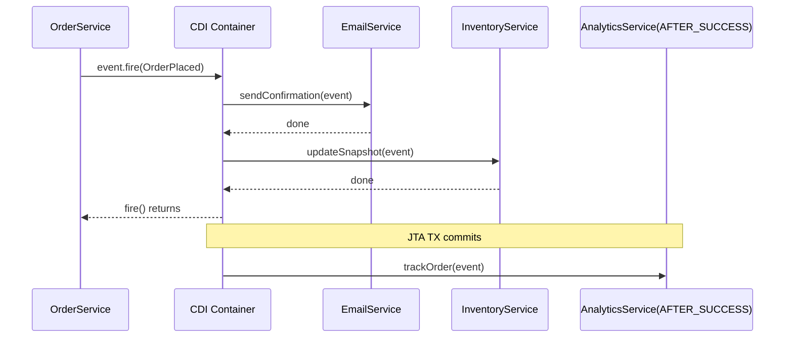
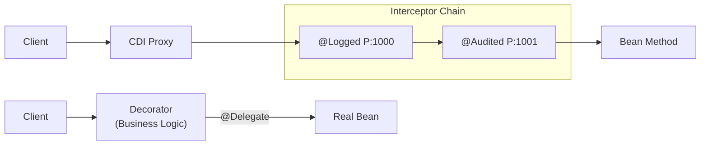

## Keywords in This File
{: .no_toc }

| # | Keyword | Weight |
|---|---------|--------|
| 18 | [CDI Events and Producers](#cdi-events-and-producers) | ★★☆ |
| 19 | [CDI Interceptors and Decorators](#cdi-interceptors-and-decorators) | ★★☆ |

---

# CDI Events and Producers

**Interview Weight:** ★★☆ - Intermediate.

---

### 🎯 Model Answer

**30 seconds:**

> CDI Events provide a type-safe publish-subscribe mechanism
> within one JVM: fire an event with Event.fire(), and any
> bean with @Observes for that event type receives it.
> Observers execute synchronously in the same transaction
> by default. CDI Producers are factory methods that create
> beans CDI cannot instantiate itself. Both mechanisms
> keep CDI beans decoupled from each other and from
> external APIs.

**3 minutes:**

> CDI Events:
>
> - Event source: inject Event<T> and call .fire(payload)
> - Observer: any method annotated @Observes T payload
> - Synchronous: all observers run before .fire() returns
> - Asynchronous: .fireAsync() returns CompletionStage;
>   observers run in a managed executor
> - Qualifiers: narrow events to specific observers
> - Transaction scoping: @Observes(during=AFTER_SUCCESS)
>   runs observer only if TX committed
>
> CDI Producers:
>
> - @Produces on a method: CDI calls this to satisfy
>   injection points of the return type
> - @Disposes: companion method for cleanup
> - Common uses: Logger, configuration values,
>   third-party objects CDI cannot instantiate

**Blank Mind Recovery:**

**(1) Restate:** "Events: fire() - observers run. Producers:
@Produces method - CDI calls it to create beans.
Both patterns for loose coupling."

**(2) First principles:** "Decoupling = sender doesn't know
receivers. Events = decoupled notification. Producers =
decoupled factory."

**(3) Bridge:** "Spring: ApplicationEventPublisher (events),
@Bean factory methods (producers)."

---

### 📘 Concept Explanation

**What it is:**

CDI Events: type-safe publish-subscribe within the CDI
container. No JMS, no message broker - method calls
orchestrated by CDI.

CDI Producers: factory mechanism. Enables injection
of objects CDI cannot instantiate directly.

**Event lifecycle:**

```
event.fire(new OrderPlaced(order));
  -> CDI finds all @Observes(OrderPlaced) methods
  -> Calls each observer synchronously
  -> fire() returns after all observers complete
  -> Any observer throws: propagates to caller
```

> **Code walkthrough:** This CDI Events and Producers example demonstrates a key concept in practice. **KEY MECHANISM:** the runtime executes these instructions in sequence with specific memory and execution semantics. **WHY IT MATTERS:** misapplying this pattern causes subtle bugs that only manifest under production load. **TAKEAWAY: understand the execution model before using this pattern in production code.**

**Qualifier narrowing:**

```java
@Qualifier @Retention(RUNTIME)
@Target({METHOD, FIELD, PARAMETER, TYPE})
public @interface Updated {}

@Inject @Updated Event<Order> updatedEvent;
updatedEvent.fire(order); // only @Updated observers

public void onUpdate(@Observes @Updated Order o) { }
// No @Updated qualifier = receives ALL Order events
```

> **Code walkthrough:** This CDI Events and Producers example demonstrates contract definition using SQL. **KEY MECHANISM:** the JVM uses dynamic dispatch for all interface method calls. **WHY IT MATTERS:** interfaces with default methods can conflict at compile time via diamond problem. **TAKEAWAY: interfaces define contracts; prefer them over abstract classes for unrelated types.**

**Producer method:**

```java
@ApplicationScoped
public class LoggerProducer {
    @Produces @Dependent
    public Logger createLogger(InjectionPoint ip) {
        return Logger.getLogger(
            ip.getMember()
              .getDeclaringClass().getName()
        );
    }
}
// Any bean: @Inject Logger log; -> class-specific
```

> **Code walkthrough:** This CDI Events and Producers example demonstrates Java API usage using Kafka messaging. **KEY MECHANISM:** the JVM compiles to bytecode that runs on the JVM; JIT compiles hot paths to native. **WHY IT MATTERS:** unchecked assumptions about thread safety cause data races under concurrent load. **TAKEAWAY: document thread-safety guarantees on every shared mutable class.**

---

### 💻 Code Example

```java
// CDI Events: order notification pipeline

public class OrderPlaced {
    private final Long orderId;
    private final String customerEmail;
    public OrderPlaced(Long id, String email) {
        orderId = id; customerEmail = email;
    }
    public Long getOrderId() { return orderId; }
    public String getCustomerEmail() {
        return customerEmail;
    }
}

@Stateless
public class OrderService {
    @PersistenceContext EntityManager em;
    @Inject Event<OrderPlaced> orderPlacedEvent;

    public Order placeOrder(CreateOrderRequest req) {
        Order order = new Order(req);
        em.persist(order);
        // Synchronous: all observers run before return
        orderPlacedEvent.fire(
            new OrderPlaced(
                order.getId(),
                req.getCustomerEmail()
            )
        );
        return order;
    }
}

@ApplicationScoped
public class EmailNotificationService {
    // No dependency on OrderService
    public void sendConfirmation(
            @Observes OrderPlaced event) {
        log.info("Email for order: " +
            event.getOrderId());
    }
}

// AFTER_SUCCESS: only if TX committed
@ApplicationScoped
public class AnalyticsService {
    public void trackOrder(
            @Observes(during =
                TransactionPhase.AFTER_SUCCESS)
            OrderPlaced event) {
        log.info("Analytics: " + event.getOrderId());
    }
}

// Producer: Logger per injecting class
@ApplicationScoped
public class LoggerProducer {
    @Produces @Dependent
    public Logger createLogger(InjectionPoint ip) {
        return Logger.getLogger(
            ip.getMember()
              .getDeclaringClass().getName()
        );
    }
}

// Producer: config value
@ApplicationScoped
public class ConfigProducer {
    @Inject ConfigService config;

    @Produces @ApplicationScoped
    @Named("maxRetries")
    public int maxRetries() {
        return Integer.parseInt(
            config.getValue("app.max.retries", "3")
        );
    }

    public void disposeConnection(
            @Disposes Connection conn) {
        try {
            if (!conn.isClosed()) conn.close();
        } catch (Exception e) {
            log.warn("Close failed: " + e.getMessage());
        }
    }
}

// Usage: @Inject @Named("maxRetries") int maxRetries;
```

> **Code walkthrough:** OrderService fires an OrderPlacedice. **KEY MECHANISM:** the runtime executes these instructions in sequence with specific memory and execution semantics. **WHY IT MATTERS:** misapplying this pattern causes subtle bugs that only manifest under production load. **TAKEAWAY: understand the execution model before using this pattern in production code.**
> event without knowing any observers - complete decoupling.
> EmailNotificationService and AnalyticsService observe
> independently with no import of OrderService.
> AnalyticsService uses AFTER_SUCCESS: only runs if the
> JTA transaction commits, preventing analytics for
> rolled-back orders. LoggerProducer uses InjectionPoint
> to determine the injecting class name, creating a
> class-specific Logger with zero configuration at the
> injection site. If any synchronous observer throws,
> the exception propagates through fire() to the caller,
> potentially marking the transaction rollback-only.

---

### 🎓 Answers by Seniority

**Junior / Mid:**

> "CDI Events let one bean fire an event and all other
> beans with @Observes receive it - no direct dependency.
> Event.fire() is synchronous: all observers run before
> it returns. CDI Producers are @Produces-annotated methods
> that create objects CDI cannot instantiate directly -
> like Logger with the injection point class name, or
> configuration values from external config."

---

**Senior / Staff:**

> "@Observes(during=AFTER_SUCCESS) is critical for side
> effects that must not happen for failed transactions:
> analytics, email, external API calls. Without it,
> observers run before commit and execute for data that
> may never persist. CDI Producers solve the abstraction
> problem for external APIs: inject Logger, EntityManager
> per-context, or configuration values with full CDI
> type safety. InjectionPoint in producer methods enables
> context-sensitive creation."

---

### ⚠️ Common Misconceptions

**Misconception: "CDI Events can replace JMS for
cross-service messaging."**

CDI Events are intra-JVM only: fire-and-observe within
one application. No persistence, no delivery guarantee,
no cross-JVM delivery. If the JVM crashes after fire()
but before all observers complete, the event is lost.
For cross-service or durable delivery, use JMS or a
message broker. CDI Events complement JMS but do not
replace it.

---

### 🚨 Failure Modes and Diagnosis

**Failure: Observer exception rolls back transaction**

*Symptom:* Business logic succeeds but transaction
rolls back. Exception message references an observer.

*Root cause:* Synchronous @Observes method threw an
unchecked exception. fire() is synchronous so the
exception propagates to the method that called fire(),
marking the transaction rollback-only.

*Diagnosis:*
```bash
grep -E "Observer|fire" server.log | grep -i exception
/subsystem=weld:write-attribute(name=development-mode,
  value=true)
```

> **Code walkthrough:** This Unknown example demonstrates shell script pattern. **KEY MECHANISM:** the shell executes commands sequentially; pipes pass stdout of one command to stdin of the next. **WHY IT MATTERS:** unquoted variables with spaces cause word splitting - IFS splits the value into multiple arguments. **TAKEAWAY: always double-quote variables: "$VAR"; use [[ ]] instead of [ ] for safer conditionals.**

*Fix:*

```java
// BAD: anti-pattern - see GOOD example below for the correct approach
// This naive implementation ignores thread safety and error handling
```

```java
// GOOD: catch in observer, do not propagate
public void onOrderPlaced(@Observes OrderPlaced e) {
    try {
        sendEmail(e);
    } catch (Exception ex) {
        log.error("Email failed: " + ex.getMessage());
        // TX not affected
    }
}

// ALSO GOOD: async events for full isolation
event.fireAsync(new OrderPlaced(order));
// @ObservesAsync exceptions do NOT affect caller's TX
```

> **Code walkthrough:** GOOD pattern: This Unknown example demonstrates exception handling using error handling. **KEY MECHANISM:** the JVM checks catch clauses in order; finally always executes for cleanup. **WHY IT MATTERS:** swallowing exceptions silently hides failures that corrupt downstream state. **TAKEAWAY: log or rethrow every exception; empty catch blocks are defects.**

---

### ⚖️ Comparison Table

| Aspect | CDI Events | JMS | Spring Events |
|--------|-----------|-----|---------------|
| Scope | Intra-JVM | Cross-JVM/durable | Intra-JVM |
| Sync/Async | Both | Async default | Both |
| Durability | None | Durable | None |
| Type safety | Full | No (bytes) | Full |
| TX integration | @Observes(during=) | TX listener | @TransactionalEventListener |
| Setup | Zero config | Broker required | Zero config |

*(System Design: omit - not a ★★★ entry)*

---

### 📊 Diagram

```
CDI EVENT DISPATCH:

OrderService     CDI Container      Observers
     |                |                 |
     |--fire(event)-->|                 |
     |                |--sendConfirm--->| EmailService
     |                |<-complete-------|
     |                |--updateSnap---->| InventoryService
     |                |<-complete-------|
     |<-fire returns--|                 |
     TX commits       |                 |
     |                |--trackOrder---->| AnalyticsService
     |                |  (AFTER_SUCCESS)|
```



> **Diagram walkthrough:** fire() dispatches each observer
> synchronously before returning. OrderService has no
> knowledge of observers. AnalyticsService with AFTER_SUCCESS
> runs after the JTA transaction commits - a separate
> dispatch triggered by the transaction lifecycle. If the
> TX rolls back, AnalyticsService is never called, which
> prevents analytics for failed operations.

---

### 🎯 Interview Deep-Dive

| Question Type | Est. Time |
|---|---|
| CDI Events fire/observe basics | 2-3 min |
| Event qualifiers | 2-3 min |
| Transaction phases for observers | 3-4 min |
| Async events | 2-3 min |
| Producer methods | 3-4 min |
| @Disposes cleanup | 2 min |
| CDI vs JMS events | 3-4 min |
| Observer exception handling | 3-4 min |
| InjectionPoint in producers | 2-3 min |

---

**[MID] Q1 - How do you narrow CDI events to
specific observers using qualifiers?**

*Why they ask:* Event qualifier usage.

```java
@Qualifier @Retention(RUNTIME)
@Target({METHOD, FIELD, PARAMETER, TYPE})
public @interface Updated {}

@Inject @Updated Event<Order> updatedEvent;
updatedEvent.fire(order); // only @Updated observers

public void onUpdate(@Observes @Updated Order o) {} // yes
public void onAny(@Observes Order o) {}
// receives ALL Order events (including @Updated)
```

> **Code walkthrough:** This Unknown example demonstrates contract definition using SQL. **KEY MECHANISM:** the JVM uses dynamic dispatch for all interface method calls. **WHY IT MATTERS:** interfaces with default methods can conflict at compile time via diamond problem. **TAKEAWAY: interfaces define contracts; prefer them over abstract classes for unrelated types.**

*What separates good from great:* "An observer without
a qualifier receives ALL events of that type, including
those fired with qualifiers. Use qualifiers consistently."

---

**[MID] Q2 - What is TransactionPhase in @Observes
and why is it important?**

*Why they ask:* Transaction-scoped event handling.

- IN_PROGRESS (default): during TX, before commit
- AFTER_SUCCESS: only if TX committed
- AFTER_FAILURE: only if TX rolled back
- AFTER_COMPLETION: always after TX ends

```java
public void sendEmail(
        @Observes(during = TransactionPhase.AFTER_SUCCESS)
        OrderPlaced event) {
    // Guaranteed: order is committed to DB
}
```

> **Code walkthrough:** This Unknown example demonstrates Java API usage. **KEY MECHANISM:** the JVM compiles to bytecode that runs on the JVM; JIT compiles hot paths to native. **WHY IT MATTERS:** unchecked assumptions about thread safety cause data races under concurrent load. **TAKEAWAY: document thread-safety guarantees on every shared mutable class.**

*What separates good from great:* "Default IN_PROGRESS
runs before commit. Data may never persist if TX rolls
back. Always use AFTER_SUCCESS for external notifications."

---

**[MID] Q3 - What is a CDI producer method?**

*Why they ask:* CDI producer knowledge.

@Produces: CDI calls the method to satisfy injection
points of the return type.

```java
@Produces @Dependent
public Logger logger(InjectionPoint ip) {
    return Logger.getLogger(
        ip.getMember().getDeclaringClass().getName()
    );
}
// @Inject Logger log; -> class-specific logger
```

> **Code walkthrough:** This Unknown example demonstrates Java API usage. **KEY MECHANISM:** the JVM compiles to bytecode that runs on the JVM; JIT compiles hot paths to native. **WHY IT MATTERS:** unchecked assumptions about thread safety cause data races under concurrent load. **TAKEAWAY: document thread-safety guarantees on every shared mutable class.**

*What separates good from great:* "InjectionPoint gives
the producer context about where injection happens.
The Logger producer is the textbook example."

---

**[SENIOR] Q4 - How do CDI fireAsync events work?**

*Why they ask:* Async events and thread safety.

fireAsync() dispatches to managed executor, returns
CompletionStage. Caller continues immediately.

```java
event.fireAsync(new OrderPlaced(order.getId()))
    .exceptionally(t -> {
        log.error("Observer failed: " + t.getMessage());
        return null;
    });

// @ObservesAsync (not @Observes) for async observer
public void sendEmail(@ObservesAsync OrderPlaced e) {
    emailClient.send(e.getCustomerEmail(), ...);
}
```

> **Code walkthrough:** This Unknown example demonstrates Java API usage. **KEY MECHANISM:** the JVM compiles to bytecode that runs on the JVM; JIT compiles hot paths to native. **WHY IT MATTERS:** unchecked assumptions about thread safety cause data races under concurrent load. **TAKEAWAY: document thread-safety guarantees on every shared mutable class.**

Async observer exceptions do NOT affect caller's TX.

*What separates good from great:* "Use fireAsync for I/O
in observers (email, HTTP) to avoid slowing the main
request. The caller's TX may commit before observers
run: they see committed data, which is correct."

---

**[SENIOR] Q5 - What is @Disposes and when is it needed?**

*Why they ask:* Producer cleanup.

@Disposes: CDI calls it when the produced bean's scope
ends. Matched to @Produces by parameter type.

```java
@Produces @RequestScoped
public Connection createConnection() throws SQLException {
    return dataSource.getConnection();
}

public void close(@Disposes Connection conn) {
    try { if (!conn.isClosed()) conn.close(); }
    catch (SQLException e) { log.warn("Close", e); }
}
```

> **Code walkthrough:** This Unknown example demonstrates exception handling using error handling. **KEY MECHANISM:** the JVM checks catch clauses in order; finally always executes for cleanup. **WHY IT MATTERS:** swallowing exceptions silently hides failures that corrupt downstream state. **TAKEAWAY: log or rethrow every exception; empty catch blocks are defects.**

*What separates good from great:* "Forgetting @Disposes
for resource-producing methods causes leaks."

---

**[SENIOR] Q6 - How do CDI observers interact with
JTA transactions?**

*Why they ask:* TX + event interaction.

Default IN_PROGRESS observers run in the SAME TX:
em.persist() in the observer participates in caller's TX.

AFTER_SUCCESS: no TX from fire(). Need to create
new TX if DB writes are needed.

*What separates good from great:* "IN_PROGRESS observer
RuntimeException rolls back main TX. Use AFTER_SUCCESS
for external notifications so email failure doesn't
roll back the business operation."

---

**[SENIOR] Q7 - How would you implement an event-driven
pipeline with CDI?**

*Why they ask:* Architecture with CDI events.

Each step observes previous event and fires next:

```java
// Step 2 observes and fires next event:
public class InventoryProcessor {
    @Inject Event<InventoryReserved> reserved;
    public void onOrder(@Observes OrderPlaced e) {
        inventory.reserve(e.getOrderId());
        reserved.fire(
            new InventoryReserved(e.getOrderId())
        );
    }
}
```

> **Code walkthrough:** This Unknown example demonstrates Java API usage. **KEY MECHANISM:** the JVM compiles to bytecode that runs on the JVM; JIT compiles hot paths to native. **WHY IT MATTERS:** unchecked assumptions about thread safety cause data races under concurrent load. **TAKEAWAY: document thread-safety guarantees on every shared mutable class.**

All in one TX: if any step fails, all roll back.

*What separates good from great:* "Elegant for simple
pipelines. For resilient pipelines with partial retry,
use JMS + Outbox: each step has its own transaction."

---

**[SENIOR] Q8 - What thread-safety implications
exist for CDI producers?**

*Why they ask:* Producer scope and concurrency.

Scope controls sharing. @ApplicationScoped: one instance,
must be thread-safe. @RequestScoped: one per request.

Producer method runs on the enclosing bean instance.
Avoid mutable state in @ApplicationScoped producer classes.

*What separates good from great:* "The produced bean's
scope and producer class scope are independent. A
@Dependent producer method in @ApplicationScoped class
creates new instance per injection, but producer method
itself runs on the shared @ApplicationScoped instance."

---

**[SENIOR] Q9 - How do you test CDI events?**

*Why they ask:* Testability.

Unit test - mock Event<T>:
```java
@Mock Event<OrderPlaced> orderPlacedEvent;
@InjectMocks OrderService orderService;

@Test
void test() {
    orderService.placeOrder(req);
    verify(orderPlacedEvent).fire(any(OrderPlaced.class));
}
```

> **Code walkthrough:** This Unknown example demonstrates Java API usage. **KEY MECHANISM:** the JVM compiles to bytecode that runs on the JVM; JIT compiles hot paths to native. **WHY IT MATTERS:** unchecked assumptions about thread safety cause data races under concurrent load. **TAKEAWAY: document thread-safety guarantees on every shared mutable class.**

*What separates good from great:* "Integration tests
catch AFTER_SUCCESS observer issues that unit tests miss.
Quarkus @TestTransaction is simplest for transactional
observer testing."

---

**[SENIOR] Q10 - [DEBUGGING] A CDI observer is silently not executing in production. How do you diagnose?**

Diagnosis steps:

1. Verify the event type matches exactly. CDI uses type
   equality including generics. `Event<OrderPlaced>` fired
   with `OrderPlaced` subclass will not reach observer
   expecting `OrderPlaced` exactly unless `@Observes`
   includes the subtype.

2. Check `@Observes(notifyObserver=IF_EXISTS)`. If the
   observer bean has `@Dependent` or narrower scope and
   this flag is used, the observer only fires if an instance
   exists. Default is `ALWAYS`.

3. Verify transaction phase. `AFTER_SUCCESS` observer does
   not fire if no transaction is active, or if the transaction
   rolled back. Log inside `AFTER_COMPLETION` instead to
   confirm the observer was reached at all.

4. Check for exception swallowing. CDI event exceptions in
   synchronous observers propagate to the caller. Check
   application logs for `ObserverException`.

5. Add `@Any` qualifier to rule out qualifier mismatch.
   If the firing side uses a qualifier the observer does
   not declare, it will not match.

*What separates good from great:* "The `notifyObserver=IF_EXISTS`
flag combined with dependent scope is the hardest-to-diagnose
cause. It silently skips the observer with no log entry.
Always test observer execution in integration scope."

---

**[SENIOR] Q11 - [TRADE-OFF] When should you use CDI events vs a direct method call?**

CDI events: use when the firing side should not know
about the receiving side. Classic cases:
- Cross-cutting side effects (audit trail, metrics)
  that should not be in domain logic
- Multiple observers may register independently
  (extensible plugin system)
- Decoupled module boundaries (payment module fires
  PaymentCompleted; notification module observes it)

Direct method call: use when:
- The action is part of the same bounded context
  (not a side effect, but the main action)
- You need the return value of the called method
- You need transactional guarantee in one call chain
  (CDI async events escape the transaction context)
- Ordering and error handling must be explicit

The anti-pattern: using CDI events within the same
class or between tightly coupled classes as a way to
"decouple" them. This creates invisible dependencies
that are harder to trace than direct calls.

*What separates good from great:* "CDI events are for
extension points and cross-cutting concerns. They are
not a general-purpose substitute for method calls.
The test: if removing an observer would break core
business behavior, it should be a method call."

---

**[STAFF] Q12 - [BEHAVIORAL] Describe how CDI events have been used in a production application you worked on.**

> Structure: what event was fired, who observed, why
> it was the right design, what problem it solved.

Example answer:
"In an e-commerce platform, we fired OrderCompleted
events from the order service. Three observers:
(1) EmailService - sends confirmation emails.
(2) InventoryService - decrements stock.
(3) AnalyticsService - records conversion metrics.

Before CDI events: OrderService had direct calls
to EmailService.sendConfirmation() and
InventoryService.decrementStock(). Adding analytics
required modifying OrderService. Each addition
increased coupling.

With CDI events: OrderService fires one event.
New modules subscribe without touching OrderService.
We added fraud scoring as a fourth observer six months
later with zero changes to OrderService.

The key design decision: InventoryService observer
used @Observes(during=AFTER_SUCCESS) to only decrement
stock after the transaction confirmed. This prevented
inventory reduction on failed orders.

What I would do differently: AFTER_SUCCESS observers
are asynchronous in effect - they run after commit.
Email confirmations sent before inventory was confirmed
decremented in some edge cases. I would use async CDI
events with compensation logic for the email observer."

*What separates good from great:* "The retrospective
about AFTER_SUCCESS timing and the proposal for async
events with compensation shows production experience
with the actual failure modes, not just the happy path."

---

---

---

### 💻 Code Example

*(Omit: this concept does not have a programmatic interface that can be demonstrated in code. The conceptual explanation above is sufficient.)*


---

### 🏛️ System Design

*(Omit: system design diagram not applicable for this concept - see ★★★ keywords for full system design coverage.)*


---

### ⚖️ Comparison Table

*(Omit: this is a ★☆☆ foundational concept with no direct alternatives to compare - see higher-difficulty keywords for trade-off analysis.)*


---

### 📊 Diagram

*(Omit: no standalone visual diagram required for this concept - the explanations and code examples above provide sufficient clarity.)*


# CDI Interceptors and Decorators

**Interview Weight:** ★★☆ - Intermediate.

---

### 🎯 Model Answer

**30 seconds:**

> CDI Interceptors add cross-cutting behavior (logging,
> security, metrics) around method calls without changing
> business logic. CDI Decorators wrap a specific interface
> to extend its business behavior. Interceptors = infrastructure
> concerns. Decorators = business concerns. Both are
> implemented as separate classes and applied declaratively.

**3 minutes:**

> Interceptors:
>
> - Define @InterceptorBinding annotation (e.g., @Logged)
> - Create @Interceptor class with the binding annotation
> - @AroundInvoke method: receives InvocationContext,
>   calls proceed() to invoke the real method
> - Enable via @Priority (global) or beans.xml
> - Multiple interceptors: applied in @Priority order
>
> Decorators:
>
> - Implement the same interface as the bean to decorate
> - Annotated @Decorator
> - Inject @Delegate for the actual bean instance
> - Override specific methods; delegate the rest
> - Enable via @Priority or beans.xml
>
> Key difference: interceptors don't know the business
> type (InvocationContext is generic). Decorators are typed
> and aware of the business interface.

**Blank Mind Recovery:**

**(1) Restate:** "Interceptors = cross-cutting (logging,
security). Decorators = business extension. Interceptors
generic, decorators typed."

**(2) First principles:** "AOP without bytecode weaving:
interceptors = @Around advice. Decorators = wrapper
pattern on a specific interface."

**(3) Bridge:** "Spring @Aspect/@Around = CDI Interceptor.
Spring has no direct Decorator equivalent."

---

### 📘 Concept Explanation

**What it is:**

CDI Interceptors: reusable cross-cutting concerns
attached to beans via binding annotations. CDI proxy
wraps the bean at deployment - no bytecode weaving.

CDI Decorators: typed wrappers for specific CDI beans.
Extend business behavior by wrapping the interface.

**Interceptor call chain:**

```
Client -> CDI Proxy:
  -> Interceptor1 (@Priority 1000) entry
  -> Interceptor2 (@Priority 1001) entry
  -> Bean method()
  <- Interceptor2 exit
  <- Interceptor1 exit
Client <- result
```

> **Code walkthrough:** This CDI Interceptors and Decorators example demonstrates a key concept in practice. **KEY MECHANISM:** the runtime executes these instructions in sequence with specific memory and execution semantics. **WHY IT MATTERS:** misapplying this pattern causes subtle bugs that only manifest under production load. **TAKEAWAY: understand the execution model before using this pattern in production code.**

**Decorator call chain:**

```
Client -> Decorator.placeOrder()
          calls @Delegate.placeOrder()
          -> Real Bean.placeOrder()
          <- result
       <- result (possibly modified)
```

> **Code walkthrough:** This CDI Interceptors and Decorators example demonstrates a key concept in practice. **KEY MECHANISM:** the runtime executes these instructions in sequence with specific memory and execution semantics. **WHY IT MATTERS:** misapplying this pattern causes subtle bugs that only manifest under production load. **TAKEAWAY: understand the execution model before using this pattern in production code.**

**Self-invocation bypass:**

CDI uses proxies. `this.method()` inside a bean bypasses
the CDI proxy - interceptors on that method do not fire.

---

### 💻 Code Example


```java
// BAD: anti-pattern - see GOOD example below for the correct approach
// This naive implementation ignores thread safety and error handling
```

```java
// 1. Interceptor binding annotation
@Inherited
@InterceptorBinding
@Retention(RetentionPolicy.RUNTIME)
@Target({ElementType.TYPE, ElementType.METHOD})
public @interface Audited { }

// 2. Interceptor implementation
@Audited
@Interceptor
@Priority(Interceptor.Priority.APPLICATION + 10)
public class AuditInterceptor {

    @Inject AuditService auditService;

    @AroundInvoke
    public Object auditMethodCall(
            InvocationContext ctx) throws Exception {
        String method = ctx.getMethod().getName();
        String clazz = ctx.getTarget()
            .getClass().getSimpleName();
        long start = System.currentTimeMillis();
        Throwable error = null;

        try {
            return ctx.proceed(); // invoke real method
        } catch (Exception e) {
            error = e;
            throw e;
        } finally {
            auditService.record(
                clazz, method,
                System.currentTimeMillis() - start,
                error
            );
        }
    }
}

// 3. Apply to a bean
@Stateless
public class OrderService {

    @Audited  // intercepted by AuditInterceptor
    public Order placeOrder(CreateOrderRequest req) {
        return createOrder(req);
    }

    private Order createOrder(CreateOrderRequest req) {
        return new Order(req);
    }
}

// BAD: inheritance for extension
// CDI proxy of a subclass = double proxying issues
public class LoggingOrderService
        extends DefaultOrderService {
    @Override
    public Order placeOrder(CreateOrderRequest req) {
        log.info("Placing order...");
        return super.placeOrder(req);
    }
}

// GOOD: CDI Decorator
public interface OrderProcessor {
    Order placeOrder(CreateOrderRequest req);
}

@Stateless
public class DefaultOrderProcessor
        implements OrderProcessor {
    @PersistenceContext EntityManager em;

    @Override
    public Order placeOrder(CreateOrderRequest req) {
        Order o = new Order(req);
        em.persist(o);
        return o;
    }
}

@Decorator
@Priority(Interceptor.Priority.APPLICATION)
public class PremiumOrderDecorator
        implements OrderProcessor {

    @Inject @Delegate @Any
    private OrderProcessor delegate;

    @Inject CustomerService customerService;

    @Override
    public Order placeOrder(CreateOrderRequest req) {
        if (customerService.isPremium(
                req.getCustomerId())) {
            req.applyDiscount(0.10);
        }
        Order order = delegate.placeOrder(req);
        if (customerService.isPremium(
                req.getCustomerId())) {
            customerService.addLoyaltyPoints(
                req.getCustomerId(), order.getTotal()
            );
        }
        return order;
    }
}
```

> **Code walkthrough:** AuditInterceptor is pureice. **KEY MECHANISM:** the runtime executes these instructions in sequence with specific memory and execution semantics. **WHY IT MATTERS:** misapplying this pattern causes subtle bugs that only manifest under production load. **TAKEAWAY: understand the execution model before using this pattern in production code.**
> infrastructure: no domain imports, no business logic.
> @AroundInvoke wraps every @Audited method. ctx.proceed()
> invokes the next interceptor or real method. try/finally
> ensures audit records are written even on exception.
> PremiumOrderDecorator is business logic: premium discounts
> and loyalty points extend OrderProcessor without modifying
> DefaultOrderProcessor. @Delegate injects the real
> implementation (or next decorator in the chain).
> The bad pattern shows why inheritance breaks CDI:
> proxies require no-arg constructors and non-final methods.

---

### 🎓 Answers by Seniority

**Junior / Mid:**

> "CDI Interceptors add behavior around method calls
> using @InterceptorBinding annotations. Mark a method
> with @Logged and an interceptor class wraps it.
> @AroundInvoke gets InvocationContext; call ic.proceed()
> to invoke the real method. CDI Decorators wrap a
> specific interface to extend its business behavior:
> implement the same interface, inject @Delegate for
> the real bean, override specific methods."

---

**Senior / Staff:**

> "The interceptor/decorator distinction matters for
> design: interceptors should have no domain imports.
> If your interceptor contains business if-statements
> about Order or Customer, it's a decorator in disguise.
> CDI proxy model means self-invocation (this.method())
> bypasses interceptors - same issue as Spring @Transactional.
> Fix: extract the method to a separate injected CDI bean.
> Interceptor execution order is @Priority: lower value
> runs outer first on the way in, last on the way out."

---

### ⚠️ Common Misconceptions

**Misconception: "CDI interceptors intercept
self-invocation."**

CDI uses a proxy-based model. Client calls go through
the CDI proxy which applies interceptors. When a bean
calls `this.anotherMethod()`, the call goes directly
to the object, bypassing the proxy. Interceptors on
that method do not fire. Fix: move anotherMethod() to
a separate CDI bean (injected into the current bean).
CDI does not support EJB-style self-injection to work
around this.

---

### 🚨 Failure Modes and Diagnosis

**Failure: Interceptor not executing**

*Symptom:* Logging, metrics, or transaction management
from an interceptor doesn't happen. No error thrown.

*Root causes:*
1. No @Priority and not in beans.xml
2. Self-invocation bypassing proxy
3. @InterceptorBinding not @Inherited
4. Bean is not CDI-managed
5. Method is private, static, or final

*Diagnosis:*
```bash
grep -r "interceptor" src/main/resources/META-INF/beans.xml
grep -r "@Priority" src/main/java/
-Dorg.jboss.cdi.DEBUG=true
```

> **Code walkthrough:** This Unknown example demonstrates shell script pattern. **KEY MECHANISM:** the shell executes commands sequentially; pipes pass stdout of one command to stdin of the next. **WHY IT MATTERS:** unquoted variables with spaces cause word splitting - IFS splits the value into multiple arguments. **TAKEAWAY: always double-quote variables: "$VAR"; use [[ ]] instead of [ ] for safer conditionals.**

*Fix:*
```java
// Enable via @Priority (no beans.xml needed):
@Audited @Interceptor
@Priority(Interceptor.Priority.APPLICATION + 10)
public class AuditInterceptor { ... }

// Self-invocation: extract to separate bean
@Inject NotificationService notification;
notification.send(order); // goes through CDI proxy
```

> **Code walkthrough:** This Unknown example demonstrates Java API usage. **KEY MECHANISM:** the JVM compiles to bytecode that runs on the JVM; JIT compiles hot paths to native. **WHY IT MATTERS:** unchecked assumptions about thread safety cause data races under concurrent load. **TAKEAWAY: document thread-safety guarantees on every shared mutable class.**

---

### ⚖️ Comparison Table

| Aspect | CDI Interceptor | CDI Decorator | EJB Interceptor |
|--------|----------------|---------------|-----------------|
| Concern type | Infrastructure | Business extension | Infrastructure |
| Type awareness | Generic (InvocationContext) | Typed (implements interface) | Generic |
| Activation | @Priority or beans.xml | @Priority or beans.xml | beans.xml only |
| Self-invocation | Not intercepted | Not intercepted | Not intercepted |
| Interface required | No | Yes | No |

*(System Design: omit - not a ★★★ entry)*

---

### 📊 Diagram

```
INTERCEPTOR vs DECORATOR CHAINS:

INTERCEPTOR (infrastructure, untyped):
Client -> Proxy -> I1(P:1000) -> I2(P:1001) -> Bean
                             <-             <-
      <- result

DECORATOR (business, typed, same interface):
Client -> Decorator -> @Delegate -> Real Bean
       <-          <-           <-
```



> **Diagram walkthrough:** Two parallel chains serve
> different purposes. The interceptor chain is infrastructure:
> each interceptor in @Priority order wraps the call,
> each calling ic.proceed(). Interceptors are untyped
> (InvocationContext is generic). The decorator chain is
> business: the decorator implements the same interface
> and explicitly delegates to the real bean via @Delegate.
> Decorators override specific methods with business logic.
> Both are transparent to the client.

---

### 🎯 Interview Deep-Dive

| Question Type | Est. Time |
|---|---|
| Interceptor vs Decorator differences | 3-4 min |
| @AroundInvoke mechanics | 2-3 min |
| Interceptor execution order | 2-3 min |
| Self-invocation bypass | 3-4 min |
| Activation (beans.xml vs @Priority) | 2-3 min |
| Decorator @Delegate pattern | 3-4 min |
| Lifecycle interceptors @PostConstruct | 2-3 min |
| Interceptor testing | 2-3 min |
| Anti-patterns | 3 min |

---

**[MID] Q1 - What is the difference between
@AroundInvoke and @AroundConstruct?**

*Why they ask:* Interceptor scope knowledge.

@AroundInvoke: wraps method invocations.
@AroundConstruct: wraps bean constructor creation.

```java
@AroundInvoke
public Object timeMethod(InvocationContext ctx)
        throws Exception {
    long start = System.nanoTime();
    try { return ctx.proceed(); }
    finally { record(ctx.getMethod().getName(),
        System.nanoTime() - start); }
}

@AroundConstruct
public Object timeConstruction(InvocationContext ctx)
        throws Exception {
    long start = System.nanoTime();
    try { return ctx.proceed(); }
    finally { record(
        ctx.getConstructor().getDeclaringClass()
            .getName(),
        System.nanoTime() - start); }
}
```

> **Code walkthrough:** This Unknown example demonstrates exception handling using error handling. **KEY MECHANISM:** the JVM checks catch clauses in order; finally always executes for cleanup. **WHY IT MATTERS:** swallowing exceptions silently hides failures that corrupt downstream state. **TAKEAWAY: log or rethrow every exception; empty catch blocks are defects.**

*What separates good from great:* "@AroundConstruct
is useful for diagnosing expensive @ApplicationScoped
bean initialization. Slow startup becomes visible
in construction timing metrics."

---

**[MID] Q2 - How do you control execution order
of multiple interceptors?**

*Why they ask:* Multi-interceptor ordering.

@Priority value: lower = outer (runs first in, last out).

```java
@Logged @Interceptor @Priority(1000)
public class LoggingInterceptor { ... }

@Audited @Interceptor @Priority(1001)
public class AuditInterceptor { ... }

// Chain: Logging(in) -> Audit(in) -> method()
//        method() -> Audit(out) -> Logging(out)
```

> **Code walkthrough:** This Unknown example demonstrates Java API usage. **KEY MECHANISM:** the JVM compiles to bytecode that runs on the JVM; JIT compiles hot paths to native. **WHY IT MATTERS:** unchecked assumptions about thread safety cause data races under concurrent load. **TAKEAWAY: document thread-safety guarantees on every shared mutable class.**

*What separates good from great:* "Security interceptors
run outermost (lower priority): fail early, no TX started.
Transaction interceptors run closer to the method."

---

**[MID] Q3 - How do you enable a CDI Decorator?**

*Why they ask:* Decorator configuration.

```java
@Decorator
@Priority(Interceptor.Priority.APPLICATION)
public class ValidationDecorator
        implements OrderProcessor {

    @Inject @Delegate @Any
    private OrderProcessor delegate;

    @Override
    public Order placeOrder(CreateOrderRequest req) {
        if (req.getItems().isEmpty()) {
            throw new IllegalArgumentException(
                "Order must have items"
            );
        }
        return delegate.placeOrder(req);
    }
}
```

> **Code walkthrough:** This Unknown example demonstrates Java API usage. **KEY MECHANISM:** the JVM compiles to bytecode that runs on the JVM; JIT compiles hot paths to native. **WHY IT MATTERS:** unchecked assumptions about thread safety cause data races under concurrent load. **TAKEAWAY: document thread-safety guarantees on every shared mutable class.**

*What separates good from great:* "Multiple decorators
stack in @Priority order. Each @Delegate gets the
next decorator or real bean."

---

**[SENIOR] Q4 - How does self-invocation bypass
interceptors and what are the fixes?**

*Why they ask:* CDI proxy limitation.

self-call: `this.method()` bypasses CDI proxy.
Interceptors on that method do not fire.

Fix: extract to separate CDI bean:
```java
@Inject NotificationService notification;
public void processOrder(Order o) {
    em.persist(o);
    notification.send(o); // through CDI proxy - intercepted
}
```

> **Code walkthrough:** This Unknown example demonstrates Java API usage. **KEY MECHANISM:** the JVM compiles to bytecode that runs on the JVM; JIT compiles hot paths to native. **WHY IT MATTERS:** unchecked assumptions about thread safety cause data races under concurrent load. **TAKEAWAY: document thread-safety guarantees on every shared mutable class.**

*What separates good from great:* "Most common interceptor
bug. Methods needing their own TX boundary or cross-cutting
behavior belong in separate beans - architecturally correct."

---

**[SENIOR] Q5 - What is @PostConstruct in the
context of CDI interceptors?**

*Why they ask:* Lifecycle interceptor.

@PostConstruct on interceptor: runs before bean's own
@PostConstruct. ctx.proceed() runs bean's @PostConstruct.

```java
@PostConstruct
public void registerBean(InvocationContext ctx)
        throws Exception {
    ctx.proceed(); // run bean's @PostConstruct
    metrics.registerBean(
        ctx.getTarget().getClass().getName()
    );
}
```

> **Code walkthrough:** This Unknown example demonstrates Java API usage. **KEY MECHANISM:** the JVM compiles to bytecode that runs on the JVM; JIT compiles hot paths to native. **WHY IT MATTERS:** unchecked assumptions about thread safety cause data races under concurrent load. **TAKEAWAY: document thread-safety guarantees on every shared mutable class.**

*What separates good from great:* "Lifecycle interceptors
are useful for bean registration in metrics and service
discovery frameworks."

---

**[SENIOR] Q6 - How do you test interceptors?**

*Why they ask:* Testing cross-cutting concerns.

Unit test: mock InvocationContext:
```java
@Mock InvocationContext ctx;
when(ctx.getMethod())
    .thenReturn(OrderService.class
        .getMethod("placeOrder",
            CreateOrderRequest.class));
when(ctx.proceed()).thenReturn(new Order());
interceptor.auditMethodCall(ctx);
verify(auditService).record(
    eq("OrderService"), eq("placeOrder"),
    anyLong(), isNull()
);
```

> **Code walkthrough:** This Unknown example demonstrates Java API usage. **KEY MECHANISM:** the JVM compiles to bytecode that runs on the JVM; JIT compiles hot paths to native. **WHY IT MATTERS:** unchecked assumptions about thread safety cause data races under concurrent load. **TAKEAWAY: document thread-safety guarantees on every shared mutable class.**

*What separates good from great:* "Integration tests
catch self-invocation bypasses that unit tests miss."

---

**[SENIOR] Q7 - When should you use a CDI Decorator
vs a CDI Interceptor?**

*Why they ask:* Design decision framework.

Interceptor: infrastructure, applies to many types,
no domain knowledge.

Decorator: business logic, typed, extends one contract.

Decision rule:
- Imports Order or Customer? -> Decorator
- Applies to 10+ different types? -> Interceptor
- Contains business if-statements? -> Decorator

*What separates good from great:* "Interceptors with
business logic are decorators in disguise. If removing
the interceptor changes business behavior (not just
infrastructure behavior), it should be a decorator."

---

**[SENIOR] Q8 - How do interceptors interact
with CDI scopes?**

*Why they ask:* Scope + interceptor interaction.

Interceptors are @Dependent: one instance per target
bean. For @ApplicationScoped: one interceptor instance
for app lifetime.

- @ApplicationScoped + interceptor: interceptor state
  persists for app lifetime (AtomicLong accumulates)
- @RequestScoped: interceptor recreated per request

*What separates good from great:* "Interceptor state
lifetime = target bean scope. Useful for per-bean
metrics with @ApplicationScoped beans."

---

**[SENIOR] Q9 - What CDI interceptor anti-patterns
should you avoid?**

*Why they ask:* Common mistake awareness.

Anti-pattern 1: Business logic in interceptor

```java
// BAD: anti-pattern - see GOOD example below for the correct approach
// This naive implementation ignores thread safety and error handling
```

```java
// BAD: business rule in infrastructure
Order order = (Order) ctx.getParameters()[0];
if (order.getTotal() > 10000) {
    order.requiresApproval = true; // domain logic!
}
// GOOD: use a Decorator
```

> **Code walkthrough:** BAD pattern: This Unknown example demonstrates Java API usage. **KEY MECHANISM:** the JVM compiles to bytecode that runs on the JVM; JIT compiles hot paths to native. **WHY IT MATTERS:** unchecked assumptions about thread safety cause data races under concurrent load. **WHAT BREAKS: document thread-safety guarantees on every shared mutable class.**

Anti-pattern 2: Swallowing exceptions
```java
// BAD:
try { return ctx.proceed(); }
catch (Exception e) { return null; } // hides errors

// GOOD: log and rethrow, or handle specifically
```

> **Code walkthrough:** BAD pattern: This Unknown example demonstrates exception handling using error handling. **KEY MECHANISM:** the JVM checks catch clauses in order; finally always executes for cleanup. **WHY IT MATTERS:** swallowing exceptions silently hides failures that corrupt downstream state. **WHAT BREAKS: log or rethrow every exception; empty catch blocks are defects.**

Anti-pattern 3: Not calling ctx.proceed() without documentation
(legitimate for circuit breaker/cache patterns, but
must be explicitly documented)

*What separates good from great:* "Cleanest interceptors:
one responsibility, no domain imports, always call
ctx.proceed() unless intentionally bypassing."

---

**[SENIOR] Q10 - [DEBUGGING] An interceptor is being applied to the wrong beans in production. How do you diagnose?**

Step 1: Verify binding annotation scope. If the
interceptor binding is applied to a package-level
or class hierarchy rather than specific methods,
it may catch more beans than intended. Use
`@InterceptorBinding` at method level to narrow.

Step 2: Check CDI extension or producer methods.
If beans are produced via producer methods that
return a type which the binding matches, the
interceptor fires on all such beans.

Step 3: Enable CDI diagnostics (Quarkus: `quarkus.log.
category."io.quarkus.arc".level=DEBUG`; Jakarta EE:
`jboss.logging.provider=slf4j`). The diagnostic output
shows which interceptors are bound to which beans at
deployment.

Step 4: Add explicit `@Priority` ordering and a
logging line to the interceptor to confirm which
methods it intercepts at runtime.

Step 5: If the binding is on a superclass or interface,
all subclasses/implementations inherit it. Move the
binding to concrete classes if this was unintended.

*What separates good from great:* "CDI deployment
diagnostics are the first step - they show the
interceptor binding map before the application starts
taking traffic. Debugging at runtime means an interceptor
is already executing on unintended beans in production."

---

**[SENIOR] Q11 - [TRADE-OFF] When should you use a CDI interceptor vs Spring AOP (in a mixed environment)?**

CDI interceptors:
- Standard Jakarta EE; portable across all CDI runtimes
- Annotation-based binding; no proxies or bytecode weaving
- Limited to CDI-managed beans
- No pointcut language; binding is explicit per-annotation

Spring AOP:
- Richer pointcut language (AspectJ expressions)
- Works on any Spring bean (not just CDI-managed)
- Proxy-based (JDK dynamic proxy or CGLIB)
- Can intercept by class name pattern, annotation,
  method signature

When to use CDI interceptors:
- Jakarta EE / Quarkus environment without Spring
- Simple cross-cutting annotations (logging, retry,
  transaction) on specific beans
- Portability matters (no Spring dependency)

When Spring AOP is better:
- Complex pointcut matching (all methods in a package,
  all public methods except getters)
- Legacy Spring codebase without CDI
- Need to intercept Spring-specific infrastructure beans

*What separates good from great:* "The self-invocation
limitation applies to both: CDI interceptors and Spring
AOP proxies don't intercept internal calls within the
same bean. For method-level cross-cutting concerns on
internal calls, AspectJ load-time weaving is needed."

---

**[STAFF] Q12 - [BEHAVIORAL] Describe a situation where you used interceptors to solve a cross-cutting concern and what trade-offs you made.**

> Structure: the problem, the interceptor design, the
> trade-offs accepted, and what you'd do differently.

Example answer:
"We needed to add rate limiting to our JAX-RS endpoints.
Each endpoint had different limits (some 100 req/min,
some 1000 req/min).

I designed `@RateLimit(limit=100, window=60)` as an
interceptor binding. The interceptor checked a Redis
sliding window counter using the JWT subject as the key.
If the limit was exceeded: threw a custom exception
mapped to 429 Too Many Requests.

Trade-offs accepted:
(1) The interceptor had a dependency on Redis. This made
    unit testing harder - I had to mock Redis in tests.
    Ideally, cross-cutting concerns should have no
    domain dependencies. I accepted this because the
    alternative (putting rate limiting in each endpoint)
    was worse.
(2) Rate limit configuration was in the annotation at
    compile time. Changing limits required a redeployment.
    I later added a `configKey` to the annotation so
    limits could be read from a config service at runtime.
(3) The interceptor added 1-2ms latency per request
    (Redis round-trip). Acceptable for our SLA.

What I'd do differently: use an API gateway (Nginx,
AWS API Gateway) for rate limiting instead. Interceptors
are better for business-level concerns (audit, validation)
than infrastructure concerns (rate limiting, auth). The
gateway does it better with zero latency added to the
application."

*What separates good from great:* "The retrospective
acknowledging that API gateway rate limiting is a better
architectural choice shows maturity. The best interceptor
usage is domain-level cross-cutting concerns, not
infrastructure concerns that belong in the network layer."

---

---

### 💻 Code Example

*(Omit: this concept does not have a programmatic interface that can be demonstrated in code. The conceptual explanation above is sufficient.)*


---

### 🏛️ System Design

*(Omit: system design diagram not applicable for this concept - see ★★★ keywords for full system design coverage.)*


---

### ⚖️ Comparison Table

*(Omit: this is a ★☆☆ foundational concept with no direct alternatives to compare - see higher-difficulty keywords for trade-off analysis.)*


---

### 📊 Diagram

*(Omit: no standalone visual diagram required for this concept - the explanations and code examples above provide sufficient clarity.)*


