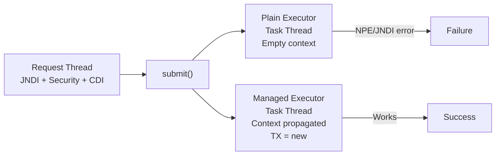
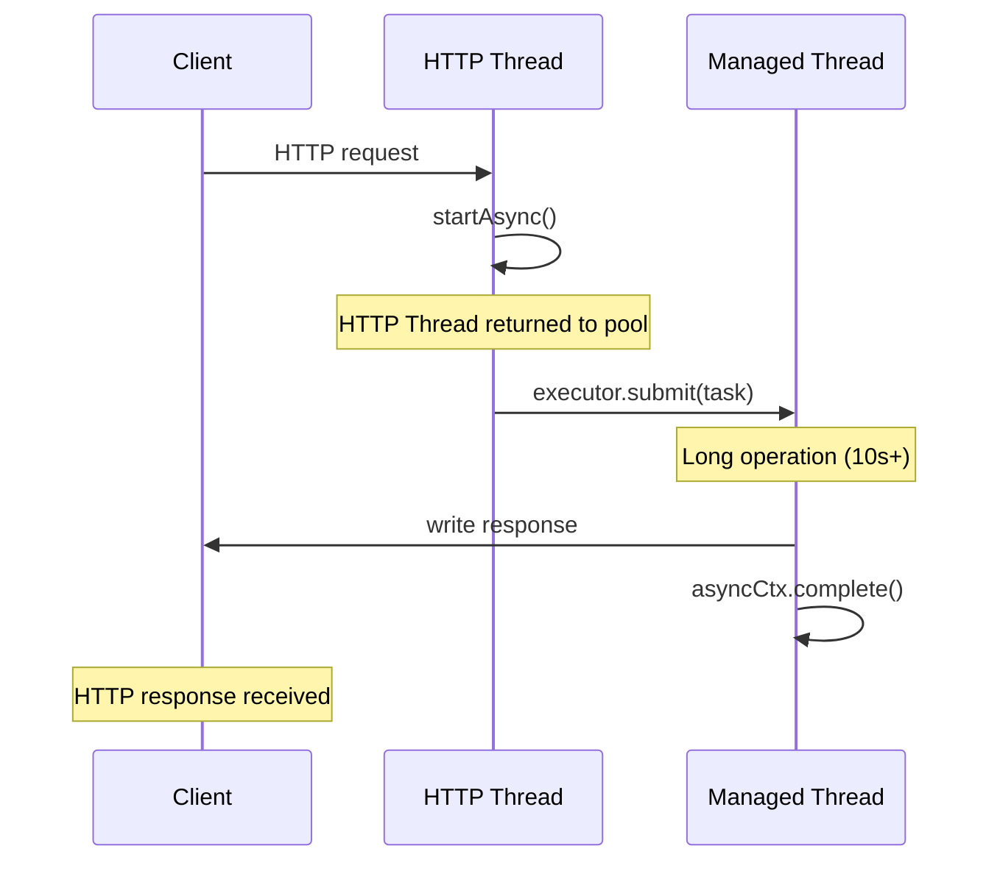

## Keywords in This File
{: .no_toc }

| # | Keyword | Weight |
|---|---------|--------|
| 20 | [Managed Executor Service](#managed-executor-service) | ★★☆ |
| 21 | [Async Servlets and EJBs](#async-servlets-and-ejbs) | ★★☆ |

---

# Managed Executor Service

**Interview Weight:** ★★☆ - Intermediate.

---

### 🎯 Model Answer

**30 seconds:**

> ManagedExecutorService (Jakarta Concurrency) is a
> container-managed thread pool. Unlike a plain Java
> ExecutorService, tasks inherit the caller's context:
> security principal, JNDI namespace, CDI context.
> This means EJB-style injection works inside submitted
> tasks and the logged-in user's identity is propagated.
> Use it when you need to offload work in Java EE without
> losing container services.

**3 minutes:**

> Jakarta Concurrency provides four managed utilities:
>
> - ManagedExecutorService: async task execution with
>   context propagation
> - ManagedScheduledExecutorService: scheduled tasks
>   with context propagation
> - ManagedThreadFactory: create managed threads directly
> - ContextService: create context-aware proxies of
>   arbitrary objects
>
> Context propagation:
> - JNDI: java:comp/env lookups work in task threads
> - ClassLoader: application's class loader
> - Security: JAAS subject/principal propagated
> - CDI: CDI request/session scoped beans accessible
> - NOT propagated: JTA transaction (task starts new TX)
>
> WildFly default:
> java:comp/DefaultManagedExecutorService

**Blank Mind Recovery:**

**(1) Restate:** "ManagedExecutorService = container-managed
thread pool with context propagation. Plain ExecutorService
= raw threads, no context. Use Managed for Java EE tasks."

**(2) First principles:** "Container services (JNDI, security,
CDI) are thread-local. Raw threads have no thread-locals
from parent. Managed executor copies thread-locals to
new thread before executing the task."

**(3) Bridge:** "Spring: @Async with TaskExecutor configured
to propagate SecurityContextHolder."

---

### 📘 Concept Explanation

**What it is:**

Jakarta Concurrency thread pools managed by the container.
Tasks run with the same context as the submitting thread.

**Context propagation comparison:**

```
Plain ExecutorService task thread:
  JNDI = EMPTY (java:comp/env lookups fail)
  Security = EMPTY (null principal)
  CDI = EMPTY (@Inject proxies fail)

ManagedExecutorService task thread:
  JNDI = PROPAGATED
  Security = PROPAGATED
  CDI = PROPAGATED
  TX = NEW (not propagated)
```

> **Code walkthrough:** This Managed Executor Service example demonstrates a key concept in practice using thread pool. **KEY MECHANISM:** the runtime executes these instructions in sequence with specific memory and execution semantics. **WHY IT MATTERS:** misapplying this pattern causes subtle bugs that only manifest under production load. **TAKEAWAY: understand the execution model before using this pattern in production code.**

**Configuration (WildFly standalone.xml):**

```xml
<managed-executor-service
  name="default"
  jndi-name="java:jboss/ee/concurrency/executor/default"
  core-threads="5"
  max-threads="25"
  keepalive-time="5000">
  <blocking-queue-length>200</blocking-queue-length>
</managed-executor-service>
```

> **Code walkthrough:** This Managed Executor Service example demonstrates a key concept in practice. **KEY MECHANISM:** the runtime executes these instructions in sequence with specific memory and execution semantics. **WHY IT MATTERS:** misapplying this pattern causes subtle bugs that only manifest under production load. **TAKEAWAY: understand the execution model before using this pattern in production code.**

---

### 💻 Code Example


```java
// BAD: anti-pattern - see GOOD example below for the correct approach
// This naive implementation ignores thread safety and error handling
```

```java
// BAD: plain ExecutorService loses container context
@Stateless
public class BadReportService {
    @PersistenceContext EntityManager em;

    public void generateReport(Long userId) {
        ExecutorService pool =
            Executors.newFixedThreadPool(4);
        pool.submit(() -> {
            // JNDI gone: em proxy is null/fails
            // NPE on em.createQuery()
            em.createQuery(
                "SELECT r FROM Report r " +
                "WHERE r.userId = :uid",
                Report.class
            ).setParameter("uid", userId)
             .getResultList();
        });
    }
}

// GOOD: ManagedExecutorService propagates context
@Stateless
public class GoodReportService {

    @Resource
    private ManagedExecutorService executor;

    @PersistenceContext
    private EntityManager em;

    public Future<List<Report>> generateReportAsync(
            Long userId) {
        return executor.submit(() -> {
            // JNDI propagated: em works
            // Security propagated: getCallerPrincipal() works
            return em.createQuery(
                "SELECT r FROM Report r " +
                "WHERE r.userId = :uid",
                Report.class
            ).setParameter("uid", userId)
             .getResultList();
        });
    }
}

// Programmatic scheduling with context propagation:
@Singleton @Startup
public class ScheduledJobService {

    @Resource
    private ManagedScheduledExecutorService scheduledExecutor;

    @PostConstruct
    public void startSchedule() {
        scheduledExecutor.scheduleAtFixedRate(
            this::processQueue,
            0, 5, TimeUnit.MINUTES
        );
    }

    private void processQueue() {
        // Container context propagated here
        log.info("Processing on thread: " +
            Thread.currentThread().getName());
    }

    @PreDestroy
    public void stopSchedule() {
        scheduledExecutor.shutdown();
    }
}

// CompletableFuture with managed executor:
@Stateless
public class OrderProcessingService {

    @Resource
    private ManagedExecutorService executor;

    public CompletableFuture<Order> processAsync(
            CreateOrderRequest req) {
        return CompletableFuture.supplyAsync(
            () -> processOrder(req),
            executor  // use managed executor, not ForkJoinPool
        ).thenApplyAsync(
            order -> enrichOrder(order),
            executor  // keep context on next stage too
        );
    }

    private Order processOrder(CreateOrderRequest r) {
        return new Order(r);
    }
    private Order enrichOrder(Order o) { return o; }
}
```

> **Code walkthrough:** BadReportService creates a rawice. **KEY MECHANISM:** the runtime executes these instructions in sequence with specific memory and execution semantics. **WHY IT MATTERS:** misapplying this pattern causes subtle bugs that only manifest under production load. **TAKEAWAY: understand the execution model before using this pattern in production code.**
> thread pool outside container management. The EntityManager
> @PersistenceContext injection is a proxy that resolves
> the real EntityManager via JNDI at runtime. In an
> unmanaged thread, the JNDI context is missing, so the
> proxy fails with a NullPointerException. GoodReportService
> uses @Resource ManagedExecutorService: when submit()
> is called, the executor captures the current JNDI, security,
> and CDI context and activates it on the task thread.
> The CompletableFuture pattern shows the key rule: always
> pass the managed executor to every supplyAsync/thenApplyAsync
> call. The default ForkJoinPool.commonPool() is not
> container-managed.

---

### 🎓 Answers by Seniority

**Junior / Mid:**

> "ManagedExecutorService is a container-managed thread pool
> that preserves the Java EE context: JNDI lookups work,
> security principal is available, CDI beans are accessible.
> A plain Java ExecutorService runs threads without container
> context - JNDI and CDI don't work. Inject via @Resource
> and use like a standard ExecutorService."

---

**Senior / Staff:**

> "The critical distinction is context propagation. What
> ManagedExecutorService does NOT propagate: JTA transaction.
> Tasks start with no transaction context. If the task needs
> a transaction, call an @TransactionAttribute(REQUIRED) EJB
> method from within the task. For transaction-aware work
> with simpler programming model, consider @Asynchronous
> EJBs. ManagedExecutorService shines for fan-out: submit
> 1000 tasks with invokeAll() where @Asynchronous would
> require 1000 separate EJB method invocations."

---

### ⚠️ Common Misconceptions

**Misconception: "ManagedExecutorService propagates
the current JTA transaction to submitted tasks."**

ManagedExecutorService does NOT propagate the JTA
transaction. Tasks submitted from within a transaction
run with no transaction context. This is by design:
propagating an in-progress transaction to another thread
would require the TX to span threads, which creates
complex 2PC scenarios and lock contention. If the task
needs a transaction, call an @TransactionAttribute(REQUIRED)
EJB method from within the task, which starts a new TX.

---

### 🚨 Failure Modes and Diagnosis

**Failure: NullPointerException or NameNotFoundException
in task thread**

*Symptom:* Tasks submitted to executor fail with JNDI or
CDI errors. Same code works on HTTP request thread.

*Root cause:* Plain ExecutorService used instead of
ManagedExecutorService.

*Diagnosis:*
```bash
# Check for plain executor usage:
grep -r "Executors.new\|new ThreadPoolExecutor" src/

# WildFly: enable concurrency debug:
/subsystem=logging/logger=org.jboss.as.ee.concurrent\
:write-attribute(name=level,value=DEBUG)
```

> **Code walkthrough:** This WildFly: enable concurrency debug: example demonstrates shell script pattern using thread pool. **KEY MECHANISM:** the shell executes commands sequentially; pipes pass stdout of one command to stdin of the next. **WHY IT MATTERS:** unquoted variables with spaces cause word splitting - IFS splits the value into multiple arguments. **TAKEAWAY: always double-quote variables: "$VAR"; use [[ ]] instead of [ ] for safer conditionals.**

*Fix:*

```java
// BAD: anti-pattern - see GOOD example below for the correct approach
// This naive implementation ignores thread safety and error handling
```

```java
// BAD:
ExecutorService pool = Executors.newCachedThreadPool();

// GOOD:
@Resource ManagedExecutorService executor;
```

> **Code walkthrough:** BAD pattern: This WildFly: enable concurrency debug: example demonstrates thread pool management using thread pool. **KEY MECHANISM:** the pool maintains a work queue; submitted tasks block until a thread is free. **WHY IT MATTERS:** unconfigured pool sizes exhaust threads under load or waste memory at rest. **WHAT BREAKS: always name threads and bound queue size to detect saturation.**

---

### ⚖️ Comparison Table

| Aspect | ManagedExecutorService | Plain ExecutorService | EJB @Asynchronous |
|--------|----------------------|----------------------|-------------------|
| JNDI propagation | Yes | No | Yes |
| Security propagation | Yes | No | Yes |
| TX propagation | No (new TX) | No | No (new TX) |
| CDI context | Propagated | None | Propagated |
| Return type | Future/CompletableFuture | Future | Future |
| Fan-out (invokeAll) | Yes | Yes | Awkward |

*(System Design: omit - not a ★★★ entry)*

---

### 📊 Diagram

```
CONTEXT PROPAGATION:

Request Thread (JNDI + Security + CDI) -> submit()
    |
    +-- Plain ExecutorService:
    |       Task Thread: empty context -> NPE/JNDI error
    |
    +-- ManagedExecutorService:
            Container captures context snapshot
            Task Thread: JNDI + Security + CDI propagated
                         TX = NEW (not propagated)
```



> **Diagram walkthrough:** The same task submitted to two
> executors has radically different outcomes. Plain executor
> creates a raw thread with no container state - JNDI lookups
> fail, security principal is null. ManagedExecutorService
> snapshots the caller's context and activates it on the
> task thread. The JTA transaction is the exception: it is
> not propagated by design. Tasks requiring transactions
> must create new ones.

---

### 🎯 Interview Deep-Dive

| Question Type | Est. Time |
|---|---|
| ManagedExecutorService vs plain | 2-3 min |
| What context is propagated | 2-3 min |
| Transaction context behavior | 3-4 min |
| ManagedScheduledExecutorService | 2-3 min |
| ContextService | 2-3 min |
| CompletableFuture + managed executor | 2-3 min |
| @Asynchronous vs ManagedExecutorService | 3-4 min |
| Thread pool configuration | 2-3 min |
| Task failure handling | 2-3 min |

---

**[MID] Q1 - Why can't you use a plain ExecutorService
in Java EE?**

*Why they ask:* Container context fundamentals.

Plain ExecutorService creates threads without container
management. Container services rely on thread-local state.
Threads created outside the container have no thread-locals:

- JNDI: `java:comp/env` namespace is empty
- Security: `getCallerPrincipal()` returns null
- CDI: `@Inject` proxies fail
- EntityManager: JNDI proxy NPE

*What separates good from great:* "Plain ExecutorService
is fine for pure computation with no container services.
The problem arises as soon as the task needs @Inject, JNDI,
or security. ManagedExecutorService should be the default
for any Java EE async work."

---

**[MID] Q2 - How do you inject a ManagedExecutorService?**

*Why they ask:* Configuration knowledge.

```java
// Standard Java EE name:
@Resource(name = "java:comp/DefaultManagedExecutorService")
private ManagedExecutorService executor;

// WildFly default:
@Resource(
    lookup = "java:jboss/ee/concurrency/executor/default"
)
private ManagedExecutorService executor;

// Named custom executor:
@Resource(lookup = "java:/concurrent/reporting")
private ManagedExecutorService reportingExecutor;
```

> **Code walkthrough:** This WildFly: enable concurrency debug: example demonstrates thread pool management using thread pool. **KEY MECHANISM:** the pool maintains a work queue; submitted tasks block until a thread is free. **WHY IT MATTERS:** unconfigured pool sizes exhaust threads under load or waste memory at rest. **TAKEAWAY: always name threads and bound queue size to detect saturation.**

*What separates good from great:* "Always use @Resource
injection, not programmatic JNDI lookup. @Resource lets
the container resolve and lifecycle-manage the instance."

---

**[MID] Q3 - How do you use CompletableFuture with
ManagedExecutorService?**

*Why they ask:* Modern async patterns.

```java
public CompletableFuture<List<Order>> loadAsync(Long uid) {
    return CompletableFuture.supplyAsync(
        () -> em.createQuery(
            "SELECT o FROM Order o WHERE o.userId = :u",
            Order.class
        ).setParameter("u", uid).getResultList(),
        executor  // managed executor, not ForkJoinPool
    ).thenApplyAsync(
        orders -> enrichWithDetails(orders),
        executor  // pass executor to every stage
    );
}
```

> **Code walkthrough:** This WildFly: enable concurrency debug: example demonstrates async pipeline construction using CompletableFuture. **KEY MECHANISM:** the JVM schedules continuations via ForkJoinPool when each stage completes. **WHY IT MATTERS:** callback chains execute on wrong threads causing ClassCastException in Spring context. **TAKEAWAY: always specify executor on thenApplyAsync to control thread context.**

*What separates good from great:* "Default thenApply()
runs on whichever thread completed the previous stage.
thenApplyAsync with managed executor guarantees all
stages run on managed threads with context."

---

**[SENIOR] Q4 - What context does ManagedExecutorService
NOT propagate?**

*Why they ask:* Context propagation limits.

Not propagated:
- JTA transaction: by design. Threads sharing a TX would
  require concurrent TX access - databases don't support this.
- HTTP request/response: Servlet request is not propagated.

Workaround for TX:
```java
executor.submit(() -> {
    // No TX here. Start new one via EJB call:
    orderRepository.saveInNewTx(order);
    // saveInNewTx has @TransactionAttribute(REQUIRED)
});
```

> **Code walkthrough:** This WildFly: enable concurrency debug: example demonstrates Java API usage. **KEY MECHANISM:** the JVM compiles to bytecode that runs on the JVM; JIT compiles hot paths to native. **WHY IT MATTERS:** unchecked assumptions about thread safety cause data races under concurrent load. **TAKEAWAY: document thread-safety guarantees on every shared mutable class.**

*What separates good from great:* "@RequestScoped CDI beans
may have stale state in task threads since the HTTP request
context is not the live HTTP session. Pass needed data as
parameters rather than reading from request-scoped beans."

---

**[SENIOR] Q5 - When should you use ManagedExecutorService
vs @Asynchronous EJB?**

*Why they ask:* Design decision.

@Asynchronous: declarative, simple, one method = one task.

ManagedExecutorService: programmatic, flexible, fan-out
(invokeAll for N tasks), CompletableFuture chains.

Choose @Asynchronous: simple fire-and-forget, standard
context propagation sufficient, EJB methods.

Choose ManagedExecutorService: dynamic parallelism
(invoke N tasks based on input), complex async pipelines.

*What separates good from great:* "@Asynchronous is simpler
for most cases. ManagedExecutorService is right for fan-out:
process 1000 items in parallel with invokeAll()."

---

**[SENIOR] Q6 - How do you handle task exceptions
in ManagedExecutorService?**

*Why they ask:* Async exception handling.

```java
Future<List<Order>> future = executor.submit(() -> {
    return orderRepository.findAll();
});

try {
    List<Order> orders = future.get();
} catch (ExecutionException e) {
    log.error("Task failed: " + e.getCause().getMessage());
} catch (InterruptedException e) {
    Thread.currentThread().interrupt();
    throw new RuntimeException("Interrupted", e);
}

// CompletableFuture:
CompletableFuture.supplyAsync(() -> loadOrders(), executor)
    .exceptionally(t -> {
        log.error("Load failed: " + t.getMessage());
        return Collections.emptyList();
    });
```

> **Code walkthrough:** This Unknown example demonstrates async pipeline construction using CompletableFuture. **KEY MECHANISM:** the JVM schedules continuations via ForkJoinPool when each stage completes. **WHY IT MATTERS:** callback chains execute on wrong threads causing ClassCastException in Spring context. **TAKEAWAY: always specify executor on thenApplyAsync to control thread context.**

*What separates good from great:* "Unchecked exceptions
in Runnable tasks are silently captured in the Future.
If no one calls get(), the exception is lost. Always
add exceptionally() or log in the task itself."

---

**[SENIOR] Q7 - How do you configure a custom
ManagedExecutorService in WildFly?**

*Why they ask:* Production configuration.

WildFly CLI:
```bash
/subsystem=ee/managed-executor-service=reporting:add(
    jndi-name="java:/concurrent/reporting",
    core-threads=5, max-threads=20,
    keepalive-time=60000, queue-length=100
)
:reload
```

> **Code walkthrough:** This Unknown example demonstrates shell script pattern. **KEY MECHANISM:** the shell executes commands sequentially; pipes pass stdout of one command to stdin of the next. **WHY IT MATTERS:** unquoted variables with spaces cause word splitting - IFS splits the value into multiple arguments. **TAKEAWAY: always double-quote variables: "$VAR"; use [[ ]] instead of [ ] for safer conditionals.**

*What separates good from great:* "Separate thread pools
for different workloads: long-running reports (small pool,
large queue) vs quick notifications (larger pool). Mixing
means report generation starves notification threads."

---

**[SENIOR] Q8 - What is ContextService?**

*Why they ask:* Advanced Jakarta Concurrency.

ContextService creates context-aware proxies of arbitrary
objects. Captures current context and applies it when
proxy methods are called:

```java
@Resource ContextService contextService;

Runnable contextualTask = contextService
    .createContextualProxy(
        () -> em.find(Order.class, orderId),
        Runnable.class
    );

// Hand to any external thread pool:
externalPool.execute(contextualTask);
// Container context applied even on non-managed thread
```

> **Code walkthrough:** This Unknown example demonstrates Java API usage using container. **KEY MECHANISM:** the JVM compiles to bytecode that runs on the JVM; JIT compiles hot paths to native. **WHY IT MATTERS:** unchecked assumptions about thread safety cause data races under concurrent load. **TAKEAWAY: document thread-safety guarantees on every shared mutable class.**

*What separates good from great:* "ContextService is the
escape hatch for legacy thread pools you can't replace.
Wrap callbacks in contextual proxies for non-managed pools."

---

**[SENIOR] Q9 - How do you monitor ManagedExecutorService
thread pools?**

*Why they ask:* Production monitoring.

```bash
# WildFly CLI: read pool statistics
/subsystem=ee/managed-executor-service=default\
:read-resource(include-runtime=true)
# Shows: active-thread-count, completed-task-count,
# rejected-count, task-count

/subsystem=ee/managed-executor-service=default\
:write-attribute(name=statistics-enabled,value=true)
```

> **Code walkthrough:** This rejected-count, task-count example demonstrates shell script pattern. **KEY MECHANISM:** the shell executes commands sequentially; pipes pass stdout of one command to stdin of the next. **WHY IT MATTERS:** unquoted variables with spaces cause word splitting - IFS splits the value into multiple arguments. **TAKEAWAY: always double-quote variables: "$VAR"; use [[ ]] instead of [ ] for safer conditionals.**

Alert when:
- `rejected-count` increasing: queue full, tasks dropped
- `active-thread-count` == `max-thread-count`: pool saturated

*What separates good from great:* "Rejected tasks are
silently dropped by default. Monitor rejected-count and
alert when non-zero. Consider bounded queue with explicit
rejection handler for silent failure prevention."

---

**[SENIOR] Q10 - [DEBUGGING] ManagedExecutorService tasks are completing but results are lost. How do you diagnose?**

Common causes:

1. Fire-and-forget without handling CompletableFuture:
   ```java
   // BAD: no exception handling - failures are silently lost
   mes.runAsync(() -> processOrder(order));
   // GOOD: handle failures
   mes.runAsync(() -> processOrder(order))
      .exceptionally(ex -> {
          log.error("Order processing failed", ex);
          return null;
      });
   ```

   > **Code walkthrough:** The BAD pattern submits a task whose exception is never observed - the CompletableFuture returned is discarded. KEY MECHANISM: `runAsync` returns a CompletableFuture; if nobody calls `get()` or chains `exceptionally()`, the exception is swallowed by the ForkJoinPool's uncaught exception handler with no application-level log. WHY IT MATTERS: order processing failures become invisible data loss. WHAT BREAKS: silent drops that only surface as missing records in the database. TAKEAWAY: always chain `exceptionally()` or `whenComplete()` on every fire-and-forget async call.
   caller doesn't call `Future.get()`, exceptions
   from the task are silently lost.

3. Transaction context not propagated: ManagedExecutorService
   propagates Jakarta EE context. But if the task modifies
   an entity and expects the caller's transaction, it runs
   in a separate transaction. EntityManager state from
   the caller's persistence context is not visible.

4. Check completed-task-count vs submitted-task-count.
   If they match but no result: the task completed but
   its side effect (DB write, event fire) was rolled back.
   Check for silent exception in the task.

*What separates good from great:* "Adding `.exceptionally()`
to every fire-and-forget async call is the first defensive
step. Silent async failures are production data loss events
waiting to happen."

---

**[SENIOR] Q11 - [TRADE-OFF] When should you use ManagedExecutorService vs a message queue (JMS/Kafka)?**

ManagedExecutorService: use for:
- In-process async work that completes quickly (< 30s)
- Tasks that don't need durability (acceptable to lose
  on server restart/crash)
- Fan-out within the same request context (parallel HTTP
  calls, parallel DB reads)
- Work that benefits from the caller's transaction context

Message queue: use for:
- Work that must survive server restarts (durable)
- Work that could take minutes or hours (background jobs)
- Cross-service communication (decoupled producers/consumers)
- Retry semantics required (message queue provides
  automatic retry with dead letter queue)
- Work that should not block the request thread at all

The test: "What happens if the server crashes while
this task is running?" If the answer is "we can safely
lose it or retry idempotently," ManagedExecutorService
is fine. If "we must guarantee completion," use a
message queue.

*What separates good from great:* "The durability
boundary is the key distinction. ManagedExecutorService
is in-process work. Message queue is at-least-once
durable delivery. Mixing them up causes silent data
loss on server crash."

---

**[STAFF] Q12 - [BEHAVIORAL] Describe a production issue caused by incorrect use of concurrency in a Jakarta EE application.**

> Structure: what was used, what went wrong, how diagnosed,
> how fixed.

Example answer:
"We had a ReportGenerator service that used a static
thread pool (plain Java ExecutorService) instead of
ManagedExecutorService. The service generated PDF reports
by querying the database in background threads.

The problem: JNDI DataSource lookups inside the thread
pool threads failed intermittently with NamingException.
Under load, threads couldn't resolve the DataSource
because Jakarta EE context was not propagated to the
plain ExecutorService threads.

Diagnosis: added logging around the JNDI lookup and
confirmed it only failed in background threads, not
in the main request thread. Traced the DataSource
lookup to the thread pool workers.

Fix: replaced `Executors.newFixedThreadPool(10)` with
`@Resource ManagedExecutorService mes`. Context propagation
is automatic. All JNDI lookups in MES tasks resolve
correctly.

Additional problem uncovered: the thread pool was
unbounded (the original ExecutorService had no queue
limit). Under burst load, thousands of report tasks
queued up in memory, causing OutOfMemoryError.
Added bounded queue with rejection handler to shed
load gracefully.

Root cause was two-fold: not using the Jakarta EE
managed thread API, and not designing for backpressure."

*What separates good from great:* "The second root
cause (unbounded queue) is what interviewers listen for.
Fixing the context propagation is textbook. Identifying
and addressing the backpressure gap shows production
systems thinking."

---

---

---

### 💻 Code Example

*(Omit: this concept does not have a programmatic interface that can be demonstrated in code. The conceptual explanation above is sufficient.)*


---

### 🏛️ System Design

*(Omit: system design diagram not applicable for this concept - see ★★★ keywords for full system design coverage.)*


---

### ⚖️ Comparison Table

*(Omit: this is a ★☆☆ foundational concept with no direct alternatives to compare - see higher-difficulty keywords for trade-off analysis.)*


---

### 📊 Diagram

*(Omit: no standalone visual diagram required for this concept - the explanations and code examples above provide sufficient clarity.)*


# Async Servlets and EJBs

**Interview Weight:** ★★☆ - Intermediate.

---

### 🎯 Model Answer

**30 seconds:**

> Async Servlet (AsyncContext): releases the HTTP thread
> back to the pool while processing continues on a different
> thread. The HTTP connection stays open. When processing
> is done, the response is written and the connection closes.
> This prevents thread exhaustion when requests take long
> time. @Asynchronous EJB: marks an EJB method to return
> immediately with a Future while actual work happens on
> a container-managed thread.

**3 minutes:**

> Async Servlet pattern:
> 1. Request arrives -> Servlet thread handles request
> 2. AsyncContext ctx = req.startAsync() - releases HTTP thread
> 3. Submit work to ManagedExecutorService
> 4. HTTP thread is free to handle other requests
> 5. Task completes -> writes to ctx.getResponse()
> 6. ctx.complete() - closes the HTTP connection
>
> @Asynchronous EJB:
> - Method returns Future<T> immediately
> - EJB container runs method on a separate thread
> - Caller gets Future to check/get result
> - Async thread starts a NEW transaction (REQUIRED)
> - No transaction propagation from caller to async method
>
> Self-invocation bypass: @Asynchronous methods called
> via this.method() are synchronous. Must call through
> CDI/EJB proxy.

**Blank Mind Recovery:**

**(1) Restate:** "Async Servlet = release HTTP thread while
work continues. @Async EJB = method returns immediately,
work on separate thread."

**(2) First principles:** "HTTP thread pool is limited.
Long requests hold threads. Async = release thread early
so pool can serve more requests."

**(3) Bridge:** "Spring: @Async on service methods,
DeferredResult/ResponseBodyEmitter in MVC."

---

### 📘 Concept Explanation

**What it is:**

Async Servlet: Servlet 3.0 feature. HTTP request starts
on a thread, which can be released mid-request while
processing continues elsewhere.

@Asynchronous EJB: EJB method that returns immediately.
Actual execution is on a container-managed thread.

**Async Servlet flow:**

```
Client HTTP request
    |
[HTTP Thread] <- limited pool
    |
request.startAsync()
    |
HTTP Thread released to pool (immediately)
    |
[Managed Thread - runs the work]
    |
long operation()
    |
response.write(result) + asyncCtx.complete()
    |
Client receives HTTP response
```

> **Code walkthrough:** This Async Servlets and EJBs example demonstrates a key concept in practice. **KEY MECHANISM:** the runtime executes these instructions in sequence with specific memory and execution semantics. **WHY IT MATTERS:** misapplying this pattern causes subtle bugs that only manifest under production load. **TAKEAWAY: understand the execution model before using this pattern in production code.**

**@Asynchronous flow:**

```
Caller thread:
  future = service.asyncMethod()  <- returns immediately
  (other work here)
  result = future.get()  <- blocks until done

EJB container thread:
  executes asyncMethod() body
  returns AsyncResult<>(value)
```

> **Code walkthrough:** This Async Servlets and EJBs example demonstrates a key concept in practice using container. **KEY MECHANISM:** the runtime executes these instructions in sequence with specific memory and execution semantics. **WHY IT MATTERS:** misapplying this pattern causes subtle bugs that only manifest under production load. **TAKEAWAY: understand the execution model before using this pattern in production code.**

---

### 💻 Code Example


```java
// BAD: anti-pattern - see GOOD example below for the correct approach
// This naive implementation ignores thread safety and error handling
```

```java
// BAD: blocking servlet
@WebServlet("/reports/sync")
public class SyncServlet extends HttpServlet {
    @Inject ReportService reportService;
    @Override
    protected void doGet(HttpServletRequest req,
            HttpServletResponse resp)
            throws IOException {
        // Blocks HTTP thread for full report time
        Report r = reportService.generate(
            Long.parseLong(req.getParameter("id"))
        );
        resp.getWriter().write(r.toString());
    }
}

// GOOD: async servlet
@WebServlet(
    value = "/reports/async",
    asyncSupported = true  // REQUIRED
)
public class AsyncServlet extends HttpServlet {

    @Inject ReportService reportService;
    @Resource ManagedExecutorService executor;

    @Override
    protected void doGet(HttpServletRequest req,
            HttpServletResponse resp)
            throws IOException {
        Long id = Long.parseLong(
            req.getParameter("id")
        );

        // Release HTTP thread back to pool:
        AsyncContext ctx = req.startAsync();
        ctx.setTimeout(60_000); // 60 second timeout

        executor.submit(() -> {
            try {
                Report r = reportService.generate(id);
                ctx.getResponse().getWriter()
                    .write(r.toString());
            } catch (Exception e) {
                try {
                    ((HttpServletResponse) ctx.getResponse())
                        .sendError(500, e.getMessage());
                } catch (IOException io) {
                    log.error("Error", io);
                }
            } finally {
                ctx.complete(); // ALWAYS call in finally
            }
        });
        // Returns here - HTTP thread freed
    }
}

// Timeout listener for safe async:
AsyncContext ctx = req.startAsync();
ctx.setTimeout(30_000);
ctx.addListener(new AsyncListener() {
    @Override
    public void onTimeout(AsyncEvent e)
            throws IOException {
        e.getAsyncContext().getResponse()
            .getWriter().write("{\"error\":\"timeout\"}");
        e.getAsyncContext().complete();
    }
    @Override public void onComplete(AsyncEvent e) {}
    @Override public void onError(AsyncEvent e) {}
    @Override public void onStartAsync(AsyncEvent e) {}
});

// @ASYNCHRONOUS EJB: fire-and-forget
@Stateless
public class NotificationService {

    // Returns immediately; runs on container thread
    @Asynchronous
    public Future<Void> sendNotification(Long orderId) {
        try {
            Order order = em.find(Order.class, orderId);
            if (order != null) {
                emailClient.send(
                    order.getCustomerEmail(),
                    "Order " + orderId + " confirmed"
                );
            }
        } catch (Exception e) {
            log.error("Notification failed: " +
                e.getMessage());
        }
        return new AsyncResult<>(null);
    }

    @Asynchronous
    public Future<Report> generateReport(Long id) {
        return new AsyncResult<>(buildReport(id));
    }
}

// Self-invocation FIX: inject self via @EJB
@Stateless
public class OrderService {
    @EJB OrderService self; // self-injection through proxy

    public void placeOrder(Order order) {
        em.persist(order);
        self.sendNotification(order); // through proxy = async
    }

    @Asynchronous
    public Future<Void> sendNotification(Order order) {
        emailClient.send(order.getCustomerEmail(), "...");
        return new AsyncResult<>(null);
    }
}
```

> **Code walkthrough:** The sync vs async servlet contrast:ice. **KEY MECHANISM:** the runtime executes these instructions in sequence with specific memory and execution semantics. **WHY IT MATTERS:** misapplying this pattern causes subtle bugs that only manifest under production load. **TAKEAWAY: understand the execution model before using this pattern in production code.**
> the blocking servlet holds the HTTP thread for the entire
> report generation. With a 50-thread pool and 50 simultaneous
> slow requests, new requests are rejected. The async servlet
> calls startAsync() which releases the HTTP thread immediately.
> Work happens on a ManagedExecutorService thread. asyncCtx.complete()
> in the finally block is critical: missing it leaks connections
> indefinitely. The timeout listener handles tasks that never
> complete. @Asynchronous EJB is simpler: just annotate the
> method, return AsyncResult. The self-injection fix via @EJB
> works because EJB self-injection goes through the EJB proxy,
> activating the @Asynchronous interceptor. Better solution:
> move notification to a separate injected bean.

---

### 🎓 Answers by Seniority

**Junior / Mid:**

> "Async Servlet allows the HTTP thread to be released while
> long work continues on a separate thread. The HTTP connection
> stays open. When work is done, call asyncCtx.complete().
> Without async, each slow request blocks one HTTP thread.
> @Asynchronous EJB makes an EJB method return a Future
> immediately while actual execution happens on a container
> thread. Both prevent thread pool exhaustion under load."

---

**Senior / Staff:**

> "Async servlet is about HTTP thread pool utilization.
> With 50 HTTP threads and 50 concurrent 10-second requests,
> synchronous servlets exhaust the pool. Async frees threads
> immediately. Key operational detail: always register an
> AsyncListener with a timeout, and always call complete()
> in a finally block. Missing complete() leaks connections.
> @Asynchronous EJBs don't need this overhead - simpler for
> background processing. But @Asynchronous can't do streaming
> or long-polling - that requires async servlet."

---

### ⚠️ Common Misconceptions

**Misconception: "@Asynchronous EJB inherits the caller's
JTA transaction."**

@Asynchronous methods always run in a new transaction
context. Even if the caller has an active JTA transaction,
the @Asynchronous method starts with no transaction.
If the async method has @TransactionAttribute(REQUIRED),
the container creates a NEW transaction. This is by design:
transactions are thread-bound and cannot span threads.
Design implication: if the async method reads data written
by the caller, the caller must commit before the async
method runs, otherwise the async method may read null.

---

### 🚨 Failure Modes and Diagnosis

**Failure: Async servlet connection leaked**

*Symptom:* Client never receives response. Connections
pile up. Eventually timeout or connection refused.

*Root cause:* asyncCtx.complete() was never called.
Exception in task without finally-block calling complete().

*Diagnosis:*
```bash
# WildFly: check active requests (should not grow unbounded):
/subsystem=undertow:read-resource(include-runtime=true)

# Enable access logging to see requests with no end:
/subsystem=undertow/configuration=handler\
/file=access-log:add(pattern="%h %t %r %s %D")
# %D = time to complete in ms; very large = leaked
```

> **Code walkthrough:** This %D = time to complete in ms; very large = leaked example demonstrates shell script pattern. **KEY MECHANISM:** the shell executes commands sequentially; pipes pass stdout of one command to stdin of the next. **WHY IT MATTERS:** unquoted variables with spaces cause word splitting - IFS splits the value into multiple arguments. **TAKEAWAY: always double-quote variables: "$VAR"; use [[ ]] instead of [ ] for safer conditionals.**

*Fix:*
```java
executor.submit(() -> {
    try {
        Report r = reportService.generate(id);
        ctx.getResponse().getWriter().write(r.toString());
    } catch (Exception e) {
        try {
            ((HttpServletResponse) ctx.getResponse())
                .sendError(500);
        } catch (IOException ignore) { }
    } finally {
        ctx.complete(); // ALWAYS call this
    }
});
```

> **Code walkthrough:** This %D = time to complete in ms; very large = leaked example demonstrates exception handling using error handling. **KEY MECHANISM:** the JVM checks catch clauses in order; finally always executes for cleanup. **WHY IT MATTERS:** swallowing exceptions silently hides failures that corrupt downstream state. **TAKEAWAY: log or rethrow every exception; empty catch blocks are defects.**

---

### ⚖️ Comparison Table

| Aspect | Async Servlet | @Asynchronous EJB | ManagedExecutorService |
|--------|--------------|-------------------|----------------------|
| Use case | Long HTTP requests | Background processing | General async |
| HTTP connection | Stays open | No HTTP | No HTTP |
| Return type | Via asyncCtx | Future<T> | Future<T> |
| TX propagation | No (new TX) | No (new TX) | No (new TX) |
| Complexity | Medium (complete()) | Low (declarative) | Medium |
| Streaming support | Yes | No | No |

*(System Design: omit - not a ★★★ entry)*

---

### 📊 Diagram

```
ASYNC SERVLET FLOW:

Client ---------> [HTTP Thread Pool]
                         |
                  startAsync()
                         |
                  HTTP Thread freed <-- returns to pool
                         |
                  [Managed Thread]
                         |
                  long operation()
                         |
                  write response
                         |
                  asyncCtx.complete()
                         |
Client <-------  HTTP Response
```



> **Diagram walkthrough:** The async servlet pattern
> decouples the HTTP thread from the work thread. The HTTP
> thread is released immediately after startAsync() and
> submit(), and is available for new requests. The managed
> thread does the actual work and directly writes to the
> HTTP connection (which remains open). asyncCtx.complete()
> signals end of request to the container. The benefit:
> N HTTP threads can serve far more than N concurrent
> long-running requests.

---

### 🎯 Interview Deep-Dive

| Question Type | Est. Time |
|---|---|
| startAsync/complete mechanics | 3-4 min |
| asyncSupported annotation | 2 min |
| AsyncListener timeout handling | 3-4 min |
| @Asynchronous return types | 2-3 min |
| Transaction in async methods | 3-4 min |
| Async Servlet vs @Async EJB choice | 3-4 min |
| Self-invocation with @Asynchronous | 2-3 min |
| Streaming responses | 3-4 min |
| Error handling in async servlets | 2-3 min |

---

**[MID] Q1 - What is the difference between
startAsync() and synchronous servlet handling?**

*Why they ask:* Async basics.

Synchronous: HTTP thread handles entire request.
10-second operation = 10 seconds of HTTP thread blocked.

startAsync(): HTTP thread released immediately.
Work on different thread. HTTP connection stays open.
Complete() sends response.

*What separates good from great:* "The HTTP thread pool
size limits concurrent synchronous requests. With async,
the HTTP pool serves new requests while work threads
handle slow operations. Limiting factor shifts from
HTTP pool to work thread pool."

---

**[MID] Q2 - What does asyncSupported=true mean
and what happens without it?**

*Why they ask:* Async configuration.

asyncSupported=true: required on @WebServlet AND all
filters in the chain. Without it, startAsync() throws
IllegalStateException.

```java
@WebServlet(value = "/async", asyncSupported = true)
// AND
@WebFilter(urlPatterns = "/*", asyncSupported = true)
public class LoggingFilter implements Filter { ... }
```

> **Code walkthrough:** This %D = time to complete in ms; very large = leaked example demonstrates Java API usage. **KEY MECHANISM:** the JVM compiles to bytecode that runs on the JVM; JIT compiles hot paths to native. **WHY IT MATTERS:** unchecked assumptions about thread safety cause data races under concurrent load. **TAKEAWAY: document thread-safety guarantees on every shared mutable class.**

*What separates good from great:* "All Filters in the
chain must have asyncSupported=true. One missing filter
breaks the entire async chain."

---

**[MID] Q3 - What are the return types for
@Asynchronous EJB methods?**

*Why they ask:* @Asynchronous API.

- `void`: fire-and-forget
- `Future<T>`: caller gets result handle
- Return `new AsyncResult<>(value)` inside the method

```java
@Asynchronous
public Future<Report> generateReport(Long id) {
    Report r = buildReport(id); // may take 30 seconds
    return new AsyncResult<>(r);
}

// Caller: blocks until done
Report report = reportService.generateReport(id).get();

// Non-blocking check:
if (future.isDone()) {
    Report r = future.get();
}
```

> **Code walkthrough:** This %D = time to complete in ms; very large = leaked example demonstrates Java API usage. **KEY MECHANISM:** the JVM compiles to bytecode that runs on the JVM; JIT compiles hot paths to native. **WHY IT MATTERS:** unchecked assumptions about thread safety cause data races under concurrent load. **TAKEAWAY: document thread-safety guarantees on every shared mutable class.**

*What separates good from great:* "future.cancel(true)
does not interrupt the running EJB async task. The task
continues. True cancellation requires a flag the task
checks cooperatively."

---

**[SENIOR] Q4 - Why doesn't @Asynchronous EJB
propagate the caller's JTA transaction?**

*Why they ask:* Async + TX interaction.

JTA transactions are thread-bound (ThreadLocal).
@Asynchronous runs on a different thread.

Design reasons: database connections are one-thread-at-a-time;
concurrent TX access creates lock contention; TX commit
semantics unclear with multiple threads.

Data visibility bug:
```java
public void placeOrder(Order order) {
    em.persist(order); // TX1 not committed yet
    notifications.sendNotification(order.getId());
    // Async method reads orderId: may find NULL
    // TX1 not committed when async starts
}
```

> **Code walkthrough:** This Unknown example demonstrates Java API usage. **KEY MECHANISM:** the JVM compiles to bytecode that runs on the JVM; JIT compiles hot paths to native. **WHY IT MATTERS:** unchecked assumptions about thread safety cause data races under concurrent load. **TAKEAWAY: document thread-safety guarantees on every shared mutable class.**

Fix: pass data as parameters:
```java
notifications.sendNotificationWithData(
    order.getId(), order.getCustomerEmail()
);
```

> **Code walkthrough:** This Unknown example demonstrates Java API usage. **KEY MECHANISM:** the JVM compiles to bytecode that runs on the JVM; JIT compiles hot paths to native. **WHY IT MATTERS:** unchecked assumptions about thread safety cause data races under concurrent load. **TAKEAWAY: document thread-safety guarantees on every shared mutable class.**

*What separates good from great:* "The data visibility issue
is the most common @Asynchronous bug: async task reads data
written by caller but not yet committed. Pass data as
parameters instead of re-reading from DB."

---

**[SENIOR] Q5 - How does self-invocation affect
@Asynchronous EJBs?**

*Why they ask:* EJB proxy bypass.

this.method() bypasses EJB proxy. @Asynchronous has no effect.
Call is synchronous.

Fix options:
1. @EJB self-injection:
```java
@EJB OrderService self;
self.sendNotification(order); // through proxy = async
```

> **Code walkthrough:** This Unknown example demonstrates Java API usage. **KEY MECHANISM:** the JVM compiles to bytecode that runs on the JVM; JIT compiles hot paths to native. **WHY IT MATTERS:** unchecked assumptions about thread safety cause data races under concurrent load. **TAKEAWAY: document thread-safety guarantees on every shared mutable class.**

2. Extract to separate bean (better):
```java
@Inject NotificationService notifications;
notifications.send(order); // separate bean, through proxy
```

> **Code walkthrough:** This Unknown example demonstrates Java API usage. **KEY MECHANISM:** the JVM compiles to bytecode that runs on the JVM; JIT compiles hot paths to native. **WHY IT MATTERS:** unchecked assumptions about thread safety cause data races under concurrent load. **TAKEAWAY: document thread-safety guarantees on every shared mutable class.**

*What separates good from great:* "Move async methods to
separate beans. Separates concerns and solves the
self-invocation problem cleanly."

---

**[SENIOR] Q6 - How do you implement streaming responses
with Async Servlets?**

*Why they ask:* Advanced async patterns.

Write response data incrementally with flush():

```java
AsyncContext ctx = req.startAsync();
executor.submit(() -> {
    try (PrintWriter w = ctx.getResponse().getWriter()) {
        w.write("[");
        boolean first = true;
        int offset = 0;
        List<Order> batch;
        do {
            batch = repo.findPage(offset, 100);
            for (Order o : batch) {
                if (!first) w.write(",");
                w.write(toJson(o));
                first = false;
            }
            w.flush(); // send chunk to client
            offset += batch.size();
        } while (batch.size() == 100);
        w.write("]");
    } finally { ctx.complete(); }
});
```

> **Code walkthrough:** This Unknown example demonstrates exception handling. **KEY MECHANISM:** the JVM checks catch clauses in order; finally always executes for cleanup. **WHY IT MATTERS:** swallowing exceptions silently hides failures that corrupt downstream state. **TAKEAWAY: log or rethrow every exception; empty catch blocks are defects.**

*What separates good from great:* "writer.flush() sends
buffered data without closing connection. Client starts
receiving data before server finishes generating it.
Critical for large exports: dramatically reduces
time-to-first-byte."

---

**[SENIOR] Q7 - How do async servlets interact
with CDI request scope?**

*Why they ask:* CDI + async servlet interaction.

ManagedExecutorService propagates CDI context from the
original HTTP request thread. @RequestScoped beans are
accessible in the task thread.

Risk: HttpServletRequest and HttpServletResponse may be
recycled by the container after the HTTP thread returns.


```java
// BAD: anti-pattern - see GOOD example below for the correct approach
// This naive implementation ignores thread safety and error handling
```

```java
// BAD: access request in task thread
executor.submit(() -> {
    String id = req.getParameter("id"); // UNSAFE
});

// GOOD: capture before startAsync()
String id = req.getParameter("id");
AsyncContext ctx = req.startAsync();
executor.submit(() -> process(ctx, id));
```

> **Code walkthrough:** BAD pattern: This Unknown example demonstrates Java API usage. **KEY MECHANISM:** the JVM compiles to bytecode that runs on the JVM; JIT compiles hot paths to native. **WHY IT MATTERS:** unchecked assumptions about thread safety cause data races under concurrent load. **WHAT BREAKS: document thread-safety guarantees on every shared mutable class.**

*What separates good from great:* "Capture all needed
request data before startAsync(). Do not access
HttpServletRequest from the async task thread."

---

**[SENIOR] Q8 - What are the timeout handling options
for async servlets?**

*Why they ask:* Production configuration.

```java
// Per-request timeout:
AsyncContext ctx = req.startAsync();
ctx.setTimeout(30_000); // 30 seconds

// Timeout listener:
ctx.addListener(new AsyncListener() {
    @Override
    public void onTimeout(AsyncEvent e) throws IOException {
        e.getAsyncContext().getResponse()
            .getWriter().write("{\"error\":\"timeout\"}");
        e.getAsyncContext().complete();
    }
    @Override public void onComplete(AsyncEvent e) {}
    @Override public void onError(AsyncEvent e)
            throws IOException {}
    @Override public void onStartAsync(AsyncEvent e) {}
});
```

> **Code walkthrough:** This Unknown example demonstrates Java API usage. **KEY MECHANISM:** the JVM compiles to bytecode that runs on the JVM; JIT compiles hot paths to native. **WHY IT MATTERS:** unchecked assumptions about thread safety cause data races under concurrent load. **TAKEAWAY: document thread-safety guarantees on every shared mutable class.**

*What separates good from great:* "Set specific timeouts
per endpoint: fast APIs (5-10s), reports (60-120s),
file exports (300s+). Always add timeout listener with
proper 503 response."

---

**[SENIOR] Q9 - How do you test async servlets?**

*Why they ask:* Testing async behavior.

Integration test with HTTP client:
```java
URL asyncUrl = new URL(deploymentUrl, "reports/async?id=1");
HttpURLConnection conn =
    (HttpURLConnection) asyncUrl.openConnection();
conn.setReadTimeout(60_000);
assertEquals(200, conn.getResponseCode());
assertNotNull(conn.getInputStream().readAllBytes());
```

> **Code walkthrough:** This Unknown example demonstrates Java Stream pipeline using HTTP client. **KEY MECHANISM:** the stream is lazy - intermediate ops build a pipeline, terminal op drives it. **WHY IT MATTERS:** calling terminal op twice throws IllegalStateException; parallel() on small data adds overhead. **TAKEAWAY: collect() or findFirst() triggers the pipeline; reuse by wrapping in Supplier.**

Unit test: verify complete() is called:
```java
AsyncContext ctx = mock(AsyncContext.class);
when(req.startAsync()).thenReturn(ctx);
servlet.doGet(req, resp);
verify(ctx, timeout(5000)).complete();
```

> **Code walkthrough:** This Unknown example demonstrates Java API usage. **KEY MECHANISM:** the JVM compiles to bytecode that runs on the JVM; JIT compiles hot paths to native. **WHY IT MATTERS:** unchecked assumptions about thread safety cause data races under concurrent load. **TAKEAWAY: document thread-safety guarantees on every shared mutable class.**

*What separates good from great:* "Key assertion: verify
complete() is called exactly once, even on exceptions.
A missing complete() is a resource leak. Use
verify(ctx, timeout(5000)).complete() to assert eventual
completion."

---

**[SENIOR] Q10 - [DEBUGGING] An async servlet hangs - the client never receives a response. How do you diagnose?**

Cause A: AsyncContext.complete() never called.
The async thread threw an exception before calling
complete(). The request hangs until the AsyncContext
timeout fires. Check: is there an exception handler
in the async runnable that calls complete() in finally?

```java
// BAD: complete() not guaranteed on exception
asyncContext.start(() -> {
    processAndWrite(asyncContext); // throws? complete() never called
    asyncContext.complete();
});
// GOOD: always complete
asyncContext.start(() -> {
    try {
        processAndWrite(asyncContext);
    } catch (Exception e) {
        sendError(asyncContext, 500, e.getMessage());
    } finally {
        asyncContext.complete(); // always
    }
});
```

> **Code walkthrough:** The BAD pattern places `complete()` after the processing call - if an exception is thrown, `complete()` is never reached and the request hangs until timeout. KEY MECHANISM: AsyncContext keeps the request open until `complete()` is called or the timeout fires; a missing `complete()` leaks a request slot. WHY IT MATTERS: under load, hanging requests accumulate, exhausting the connector thread pool. WHAT BREAKS: gradual memory and thread exhaustion visible as increasing active request count in monitoring. TAKEAWAY: `complete()` in `finally` is non-negotiable for async servlets.

Cause B: AsyncContext timeout too long. Default is
30 seconds. Under load, hanging requests accumulate.
Check: server thread pool at capacity?

Cause C: Thread pool exhausted. The Runnable passed
to asyncContext.start() uses the servlet container
thread pool. If the pool is full, the task queues
and the client waits. Check thread pool statistics.

Diagnosis: add logging at complete() call and at
the start of the async Runnable. If the Runnable
log appears but complete() log does not: exception
is swallowing the complete().

*What separates good from great:* "complete() in
finally block is non-negotiable. Async servlets
that don't guarantee complete() in the exception
path create a slow resource leak that manifests
as a gradual memory/thread exhaustion under load."

---

**[SENIOR] Q11 - [TRADE-OFF] When should you use async servlets vs reactive frameworks (Project Reactor/Mutiny)?**

Async servlets:
- Standard Jakarta EE; works on any compliant container
- Good for simple off-thread work (file generation,
  external service calls)
- Thread-per-task model under the hood
- Limited composability for complex async pipelines

Reactive frameworks (Reactor, Mutiny, RxJava):
- Designed for complex async pipelines with
  backpressure, error handling, retries, timeouts
- Composable operators for map, flatMap, zip, merge
- Better for: multiple concurrent async calls composed
  together, streaming responses, event-driven architectures
- Learning curve: reactive programming model

When async servlets are sufficient:
- One or two background calls per request
- Team familiar with servlet model, not reactive
- Must remain on Jakarta EE without additional dependencies

When reactive is better:
- Fan-out to 5+ concurrent services
- Complex retry, timeout, fallback chains
- High-throughput streaming use cases

*What separates good from great:* "Jakarta EE 10+
supports reactive paradigms via Mutiny (Quarkus) and
SmallRye Mutiny. These bridge reactive and imperative
worlds. Async servlets are the floor, not the ceiling."

---

**[STAFF] Q12 - [BEHAVIORAL] You need to process 10,000 reports asynchronously and ensure no report is lost on server restart. How do you design this?**

> This is an architectural trade-off question requiring
> distributed systems thinking.

Answer:
"Async servlets and ManagedExecutorService are
in-memory - reports would be lost on restart.

The design: request -> persistence -> async processing.

(1) When a report is requested: persist a ReportRequest
    record to the database with status PENDING. Return
    202 Accepted with the request ID to the client.

(2) A scheduled job (Jakarta EE ManagedScheduledExecutorService)
    polls for PENDING requests every 10 seconds. Picks up
    batches of 20. Updates status to PROCESSING with
    a lock (optimistic or pessimistic) to prevent
    concurrent pickup.

(3) For each request: generate the report. On success:
    store the result (S3, database blob). Update status
    to COMPLETE. On failure: increment retry count.
    After 3 failures: mark FAILED.

(4) Client polls `GET /reports/{id}/status` or receives
    a push notification when COMPLETE.

Alternative: use a message queue (JMS/Kafka). More
scalable but adds infrastructure complexity.

The key: the database is the durable queue. No report
can be lost because persistence happens before processing
starts."

*What separates good from great:* "The optimistic
lock on status update prevents two servers picking
up the same request in a cluster. Candidates who
describe the design without addressing concurrent
pickup have not deployed this pattern in production."

---

---

### 💻 Code Example

*(Omit: this concept does not have a programmatic interface that can be demonstrated in code. The conceptual explanation above is sufficient.)*


---

### 🏛️ System Design

*(Omit: system design diagram not applicable for this concept - see ★★★ keywords for full system design coverage.)*


---

### ⚖️ Comparison Table

*(Omit: this is a ★☆☆ foundational concept with no direct alternatives to compare - see higher-difficulty keywords for trade-off analysis.)*


---

### 📊 Diagram

*(Omit: no standalone visual diagram required for this concept - the explanations and code examples above provide sufficient clarity.)*


