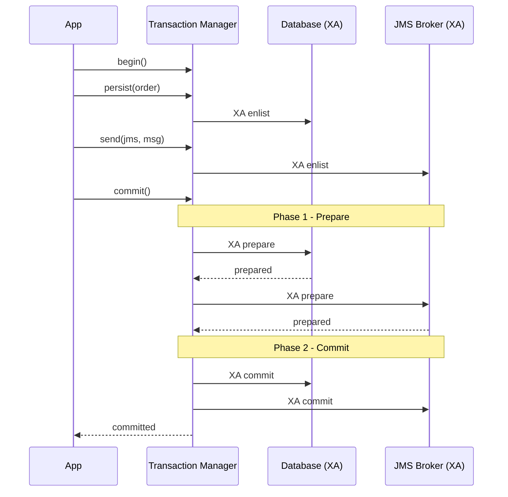
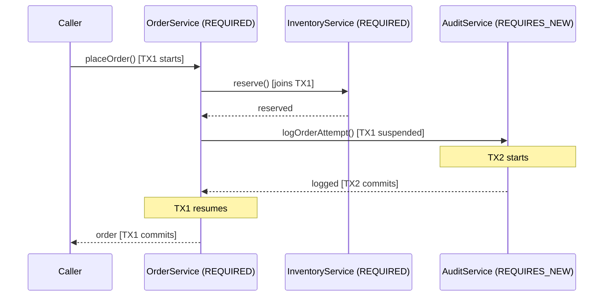

## Keywords in This File
{: .no_toc }

| # | Keyword | Weight |
|---|---------|--------|
| 16 | [JTA Distributed Transactions](#jta-distributed-transactions) | ★★☆ |
| 17 | [Transaction Propagation in EJBs](#transaction-propagation-in-ejbs) | ★★☆ |

---

# JTA Distributed Transactions

**Interview Weight:** ★★☆ - Intermediate. JTA enables
ACID transactions across multiple resources. Understanding
XA protocol, two-phase commit, and the practical
limits of distributed transactions is required for
senior Java EE interviews.

---

### 🎯 Model Answer

**30 seconds:**

> JTA (Jakarta Transaction API) extends ACID transactions
> beyond a single database to multiple XA-capable resources:
> two databases, database + JMS, database + JCA connectors.
> It uses the two-phase commit (2PC) protocol: the
> transaction manager asks each resource to prepare
> (vote), then commits or rolls back all resources
> atomically. The cost is real: two round trips to all
> resources, holding locks during 2PC. Modern architectures
> prefer the Outbox Pattern over JTA for cross-service
> atomicity.

**3 minutes:**

> JTA participants:
>
> - Transaction Manager (TM): the coordinator. In WildFly,
>   this is Narayana. It tracks all enrolled resources
>   and drives 2PC.
> - XA Resource: a resource (database, JMS broker) that
>   supports the XA protocol for coordinated commit.
>   Regular (non-XA) JDBC connections cannot participate.
> - UserTransaction: the application's handle to the TM.
>
> 2PC protocol:
> 1. Application begins transaction: TM starts a new TX
> 2. Application writes to DB1, writes to JMS queue
>    (both auto-enlist in the TX via XA connections)
> 3. Application requests commit
> 4. Phase 1 (prepare): TM asks each resource to prepare
>    Resource votes commit (writes to redo log) or abort
> 5. Phase 2:
>    - All voted commit: TM sends commit to all resources
>    - Any voted abort: TM sends rollback to all resources
>
> Configuration (WildFly):
> - XA DataSource instead of regular DataSource
> - XA JMS ConnectionFactory for JMS
> - The TM auto-enlists XA resources when accessed
>   within a JTA transaction
>
> When 2PC fails midway: recovery. The TM writes a
> transaction log to disk before Phase 2. If it crashes
> mid-commit, the recovery process reads the log and
> completes the commit/rollback.

**Blank Mind Recovery:**

**(1) Restate:** "JTA = ACID across multiple resources.
XA = resource-level protocol. 2PC = prepare then commit
all or rollback all. TM coordinates."

**(2) First principles:** "Atomicity across resources requires
a coordinator. 2PC is the protocol: vote first, then
commit or rollback based on all votes."

**(3) Bridge:** "2PC in distributed databases works the same
way. JTA brings it to Java enterprise components."

---

### 📘 Concept Explanation

**What it is:**

JTA is the Jakarta EE specification for managing
transactions that span multiple XA-capable resources.
The Transaction Manager coordinates the 2PC protocol.

**The problem it solves:**

Without JTA: writing to database AND sending a JMS message
are in separate transactions. The database can commit
but JMS can fail, or vice versa. This creates
inconsistent state: order saved, notification not sent.

With JTA: both resources participate in one transaction.
Either both commit or both roll back.

**2PC protocol flow:**

```
Application requests commit
         |
         v
TRANSACTION MANAGER:
  Phase 1 (PREPARE):
    -> "DB1, can you commit?" -> DB1: "Yes, prepared"
    -> "JMS, can you commit?" -> JMS: "Yes, prepared"

  All YES:
  Phase 2 (COMMIT):
    -> "DB1, commit" -> DB1: committed
    -> "JMS, commit" -> JMS: committed
    -> TM marks TX complete

  Any NO (abort vote):
  Phase 2 (ROLLBACK):
    -> "DB1, rollback" -> DB1: rolled back
    -> "JMS, rollback" -> JMS: rolled back
```

**XA DataSource configuration (WildFly):**

```xml
<!-- standalone.xml: XA datasource -->
<xa-datasource jndi-name="java:/XaDS"
               pool-name="XaDS" enabled="true">
  <xa-datasource-property name="ServerName">
    localhost
  </xa-datasource-property>
  <xa-datasource-property name="DatabaseName">
    mydb
  </xa-datasource-property>
  <driver>postgresql</driver>
  <xa-pool>
    <min-pool-size>5</min-pool-size>
    <max-pool-size>20</max-pool-size>
  </xa-pool>
  <security>
    <user-name>app</user-name>
    <password>secret</password>
  </security>
</xa-datasource>
```

**JTA transaction in EJB:**

```java
@Stateless
public class OrderService {
    @PersistenceContext  // auto-enlists in JTA TX
    private EntityManager em;

    @Inject
    @JMSConnectionFactory("java:/JmsXA")  // XA JMS
    private JMSContext jmsCtx;

    // REQUIRED: JTA TX covers both DB and JMS
    public void placeOrder(Order order) {
        em.persist(order);          // DB1 write in TX
        jmsCtx.createProducer()
            .send(orderQueue,        // JMS in SAME TX
                order.getId().toString());
        // At method end: 2PC commits both atomically
    }
}
```

---

### 💻 Code Example

```java
// Production pattern: Outbox vs JTA comparison

// APPROACH 1: JTA (traditional)
@Stateless
public class JtaOrderService {

    @PersistenceContext
    private EntityManager em;

    @Inject
    @JMSConnectionFactory("java:/JmsXA")
    private JMSContext jmsCtx;

    @Resource(lookup = "java:/jms/queue/orders")
    private Queue orderQueue;

    @TransactionAttribute(REQUIRED)
    public void placeOrder(CreateOrderRequest req) {
        Order order = new Order(req);
        em.persist(order);               // DB in TX

        jmsCtx.createProducer()
            .send(orderQueue,             // JMS in TX
                order.getId().toString());

        // 2PC: either both commit or both rollback
        // Cost: DB and JMS broker must both be XA
        // Cost: 2PC round trip to both resources
    }
}

// APPROACH 2: Outbox Pattern (modern alternative)
@Stateless
public class OutboxOrderService {

    @PersistenceContext
    private EntityManager em;

    // One database transaction only
    @TransactionAttribute(REQUIRED)
    public void placeOrder(CreateOrderRequest req) {
        Order order = new Order(req);
        em.persist(order);

        // Write event to outbox in SAME DB transaction
        OutboxEvent event = new OutboxEvent();
        event.setAggregateType("Order");
        event.setAggregateId(
            order.getId().toString()
        );
        event.setType("OrderCreated");
        event.setPayload(serialize(order));
        event.setStatus("PENDING");
        em.persist(event);

        // Single DB transaction: order + event atomically
        // No XA, no 2PC
    }

    private String serialize(Object o) {
        return o.toString();
    }
}

// Outbox processor: separate service reads and sends
@Singleton
public class OutboxProcessor {

    @PersistenceContext
    private EntityManager em;

    @Inject
    @JMSConnectionFactory("java:/JmsLocal")
    private JMSContext jmsCtx;

    @Resource(lookup = "java:/jms/queue/orders")
    private Queue orderQueue;

    @Schedule(minute = "*/1", hour = "*",
              persistent = false)
    @TransactionAttribute(REQUIRED)
    public void processOutbox() {
        List<OutboxEvent> events = em.createQuery(
            "SELECT e FROM OutboxEvent e " +
            "WHERE e.status = 'PENDING' " +
            "ORDER BY e.id",
            OutboxEvent.class
        ).setMaxResults(100).getResultList();

        for (OutboxEvent event : events) {
            try {
                jmsCtx.createProducer()
                    .send(orderQueue, event.getPayload());
                event.setStatus("SENT");
            } catch (Exception e) {
                event.setStatus("FAILED");
            }
        }
    }
}
```

> **Code walkthrough:** Two approaches to the same
> problem: atomically save an order and send a
> notification. The JTA approach with XA requires
> both the database and JMS broker to support the XA
> protocol, adds 2PC overhead, and creates operational
> complexity. The Outbox pattern uses only one database
> resource: the order and the outbox event are written
> atomically in a single local transaction. A separate
> OutboxProcessor reads pending events and sends them
> to JMS. If JMS send fails, the event stays PENDING
> and retries. Consumers must be idempotent because
> the event may be sent more than once. The trade-off:
> 2PC guarantees exactly-once across resources; Outbox
> guarantees at-least-once with idempotent consumers.

---

### 🎓 Answers by Seniority

**Junior / Mid:**

> "JTA allows one transaction to span multiple resources:
> two databases or database + JMS. The two-phase commit
> protocol coordinates: first all resources vote (prepare),
> then all commit or all rollback based on votes. Configure
> XA DataSources and XA JMS ConnectionFactory in the
> app server. The @PersistenceContext and JMS context
> auto-enlist in the current JTA transaction."

---

**Senior / Staff:**

> "JTA 2PC has real costs: two round trips to all resources,
> locks held during 2PC, XA driver requirements, and
> transaction log recovery complexity. For new systems,
> the Outbox Pattern is usually better: persist the
> business entity AND a notification event in one local
> transaction. A separate processor reads events and
> sends to messaging. Single resource, no 2PC, cloud-native.
> The remaining valid JTA use cases: legacy systems
> already using XA, applications requiring truly synchronous
> exactly-once delivery across resources, or regulatory
> requirements for atomic multi-resource operations."

---

### ⚠️ Common Misconceptions

**Misconception: "JTA 2PC guarantees no data loss
in any failure scenario."**

2PC has a known failure window: after Phase 1 (all
resources prepared) but before Phase 2 completes
(commit messages sent to all resources), if the
transaction manager crashes, the transaction is
"in doubt". Resources hold their locks and state
pending a recovery decision. The TM recovery process
reads the transaction log and completes the 2PC when
it restarts. During the recovery window, those rows
are locked. In practice, TM crashes are rare but
not impossible. The transaction log (stored to disk
before Phase 2) is the recovery mechanism - if the
log is lost (disk failure), the transaction is
permanently in doubt and requires manual resolution.

---

### 🚨 Failure Modes and Diagnosis

**Failure: "In-doubt" transaction blocking database rows**

*Symptom:* Specific rows are permanently locked;
queries time out with lock wait timeout. No application
code is running.

*Root cause:* JTA transaction in Phase 1 state
(resources prepared, waiting for Phase 2). The
transaction manager crashed or the Phase 2 message
was lost.

*Diagnosis:*
```sql
-- PostgreSQL: check for in-doubt prepared transactions
SELECT gid, prepared, owner FROM pg_prepared_xacts;

-- Check WildFly transaction object store:
ls standalone/data/tx-object-store/
```

*Resolution:*
```sql
-- If TM recovery cannot complete the TX:
-- Manually rollback (after verifying TM has no record)
ROLLBACK PREPARED 'gid-from-above';

-- Commit manually if certain it should commit:
COMMIT PREPARED 'gid-from-above';
```

---

### ⚖️ Comparison Table

| Aspect | JTA 2PC | Outbox Pattern | Saga |
|--------|---------|----------------|------|
| Atomicity | Exactly-once | At-least-once | Compensating |
| Resources | XA required | Single DB | Any |
| Performance | 5-20ms overhead | Low | Varies |
| Cloud support | Limited | Full | Full |
| Complexity | TM config, XA recovery | Outbox table, cleanup | Compensation logic |
| Use case | Legacy, strict exactly-once | Modern cloud-native | Long-running multi-step |

*(System Design: omit - not a ★★★ entry)*

### 📊 Diagram

```
2PC PROTOCOL FLOW:

APP           TM           DB1          JMS
 |             |             |            |
 |--begin()-->|             |            |
 |             |             |            |
 |--persist-->|             |            |
 |             |--XA enlist->|            |
 |--send JMS->|             |            |
 |             |--XA enlist------------->|
 |             |             |            |
 |--commit()-->|             |            |
 |    PHASE 1: |             |            |
 |             |--prepare--->|            |
 |             |<--prepared--|            |
 |             |--prepare-------------->|
 |             |<--prepared-------------|
 |    PHASE 2: |             |            |
 |             |--commit---->|            |
 |             |--commit--------------->|
 |<--done-----|             |            |
```



> **Diagram walkthrough:** The 2PC flow shows two distinct
> phases across all resources. The Transaction Manager
> acts as the single coordinator: it drives prepare
> to all resources, collects votes, then drives commit
> (or rollback) to all. The critical insight is the
> gap between Phase 1 completion and Phase 2 completion:
> if the TM crashes in this gap, resources are holding
> prepared state with locks. The TM's transaction log
> (written before Phase 2) enables recovery.

---

### 🎯 Interview Deep-Dive

| Question Type | Est. Time |
|---|---|
| JTA vs local transactions | 2-3 min |
| 2PC protocol steps | 3-4 min |
| XA resource requirements | 2-3 min |
| In-doubt transactions | 3-4 min |
| Outbox pattern vs JTA | 4-5 min |
| Performance impact of 2PC | 2-3 min |
| Transaction log and recovery | 3 min |
| JTA with multiple databases | 2-3 min |
| When NOT to use JTA | 3 min |

---

**[MID] Q1 - What is the difference between
a local transaction and a JTA transaction?**

*Why they ask:* Transaction scope understanding.

Local transaction: managed by one resource. Only that
resource participates. No coordination with others.

JTA transaction: managed by the Transaction Manager.
Multiple XA resources participate. All commit or
rollback together via 2PC.

Performance difference:
- Local: ~1-2ms per commit (one resource)
- JTA 2PC: ~5-20ms per commit (two round trips)

*What separates good from great:* "JTA provides a
'last resource gamble' optimization: if only one XA
resource enrolls, the TM skips 2PC and uses a local
transaction (1PC). So a single-DB JTA transaction
has nearly the same cost as a local transaction."

---

**[MID] Q2 - What is an XA DataSource and how does
it differ from a regular DataSource?**

*Why they ask:* JTA infrastructure knowledge.

Regular DataSource: JDBC connections for local
transactions. Cannot participate in JTA 2PC.

XA DataSource: XAConnection objects that implement
the XA protocol. Can participate in JTA 2PC. When
accessed within a JTA transaction, the connection
automatically enlists in the transaction.

*What separates good from great:* "Not all JDBC
drivers implement XA correctly. Always test XA
crash recovery in staging: kill the app server
mid-2PC and verify recovery completes correctly.
PostgreSQL's XA driver is reliable."

---

**[MID] Q3 - How does JTA interact with JPA/EntityManager?**

*Why they ask:* JTA + JPA integration.

JTA EntityManager (@PersistenceContext default):
- Auto-enlists in the current JTA transaction
- EntityManager scope = transaction scope
- Flushed and closed when transaction commits
- No explicit flush/close needed

Resource-local EntityManager:
- Not JTA-managed
- Must use EntityTransaction explicitly

*What separates good from great:* "FlushModeType.AUTO
(default) flushes before JPQL queries to ensure
query results reflect pending changes. Set COMMIT
for batch jobs where you don't need to read your
own writes - avoids unexpected SQL in loops."

---

**[SENIOR] Q4 - What happens when a 2PC transaction
is in-doubt?**

*Why they ask:* 2PC failure modes.

In-doubt transaction: after Phase 1 (all resources
prepared) but before Phase 2 completes, if the TM
crashes, the transaction is "in doubt". Resources
hold locks pending a recovery decision.

Recovery: TM restarts, reads transaction log, and
re-drives Phase 2 commit/rollback.

If log is corrupted/missing: manual resolution
required (COMMIT PREPARED or ROLLBACK PREPARED).

*What separates good from great:* "The in-doubt
window is why 2PC is not truly failure-proof. Design
for recovery: monitor in-doubt transactions, have
runbooks for manual resolution."

---

**[SENIOR] Q5 - When should you use JTA vs
the Outbox Pattern?**

*Why they ask:* Architecture decision framework.

JTA 2PC: legacy systems, same data center, XA available,
exactly-once required, low write volume.

Outbox: cloud deployment, high throughput, at-least-once
acceptable, consumers idempotent, managed services.

*What separates good from great:* "Cloud databases
and managed brokers (SQS, Kafka) don't support XA.
Default to Outbox; consider JTA only when exactly-once
is a hard requirement that idempotency can't satisfy."

---

**[SENIOR] Q6 - What is the performance cost
of JTA 2PC?**

*Why they ask:* Production performance awareness.

Components: extra round trips (2 vs 1), locks held
longer during coordination, transaction log I/O,
XA connection pool overhead.

Typical: local TX ~1-3ms; JTA 2PC with 2 resources
~5-20ms same data center.

*What separates good from great:* "At 1000 TPS, 20ms
commit means 20 seconds of aggregate lock time per
second. This is why JTA limits throughput in high-volume
write scenarios."

---

**[SENIOR] Q7 - How do you configure JTA
transaction recovery in WildFly?**

*Why they ask:* Production operations knowledge.

WildFly uses Narayana. Recovery runs every ~2 minutes,
scans tx-object-store, contacts resources to re-drive
Phase 2.

Monitor: check tx-object-store for stuck files;
use WildFly CLI to read transaction statistics.

*What separates good from great:* "The tx-object-store
directory is critical for recovery. Use durable storage
(not ephemeral volumes in containers) for this
directory in cloud deployments."

---

**[SENIOR] Q8 - How does JTA interact with
UserTransaction in BMT?**

*Why they ask:* BMT vs CMT transaction control.

BMT: EJB manages transactions via UserTransaction.
`utx.begin()` starts, `utx.commit()` ends.

Key rule: CMT methods called from BMT see no propagated
transaction. A CMT REQUIRED method called from BMT
starts its own NEW transaction.

*What separates good from great:* "BMT-to-CMT non-propagation
is non-obvious. If you need a CMT method to participate
in a BMT transaction, there's no direct mechanism -
refactor to consistent transaction management style."

---

**[SENIOR] Q9 - What are the alternatives to
JTA for cross-service atomicity?**

*Why they ask:* Architecture patterns.

1. Outbox: persist business entity + event in one TX,
   async processor delivers messages. At-least-once.
2. Saga: series of local transactions with compensating
   transactions for rollback. For multi-step processes.
3. Event Sourcing: all state changes are events; other
   services consume events for eventual consistency.
4. CQRS + Eventual Consistency: accept eventual
   consistency, design read-your-writes at service boundary.

*What separates good from great:* "The Saga pattern
is correct for multi-step business processes: each step
is a local transaction; compensation handles rollback.
Complexity: designing and testing compensating transactions."

---

---

# Transaction Propagation in EJBs

**Interview Weight:** ★★☆ - Intermediate. Transaction
propagation defines how transaction context flows
across EJB method calls. Understanding propagation
rules is essential for diagnosing data integrity
bugs in Java EE applications.

---

### 🎯 Model Answer

**30 seconds:**

> Transaction propagation in EJBs is controlled by
> @TransactionAttribute on each method. REQUIRED (default)
> joins an existing transaction or starts a new one.
> REQUIRES_NEW always starts an independent transaction,
> suspending any existing one. When an EJB method calls
> another EJB method, the called method's @TransactionAttribute
> determines how it relates to the caller's transaction.
> A RuntimeException from any participant marks the
> whole transaction as rollback-only - even if the
> caller catches the exception.

**3 minutes:**

> The six transaction attribute types:
>
> - REQUIRED: join existing TX; start new if none.
>   Most methods should use this (default).
> - REQUIRES_NEW: always a new independent TX.
>   Suspends existing TX. Used for audit logs.
> - MANDATORY: must already be in a TX; throws if not.
>   Enforces caller-managed TX.
> - NEVER: must NOT be in a TX; throws if one exists.
> - SUPPORTS: join if one exists; no TX otherwise.
>   For read-only operations.
> - NOT_SUPPORTED: suspend any TX for this call.
>   For legacy JCA resources.
>
> The rollback trap: when a method with REQUIRED throws
> a RuntimeException, the transaction is marked rollback-only.
> If the caller catches the exception and tries to continue,
> the commit at the outer boundary fails with RollbackException.
> Catching the exception does NOT clear the rollback-only flag.

**Blank Mind Recovery:**

**(1) Restate:** "REQUIRED = join or start. REQUIRES_NEW = new,
suspend existing. MANDATORY = must exist. NEVER = must
not exist. SUPPORTS = join or nothing. NOT_SUPPORTED =
suspend."

**(2) First principles:** "Transaction = atomic unit. Propagation
= how the boundary extends across calls. REQUIRED = extend.
REQUIRES_NEW = isolate."

**(3) Bridge:** "Same as Spring @Transactional propagation:
REQUIRED, REQUIRES_NEW, MANDATORY, NEVER, SUPPORTS,
NOT_SUPPORTED map one-to-one."

---

### 📘 Concept Explanation

**What it is:**

EJB transaction propagation defines the relationship
between the current transaction context and the
transaction context of a called EJB method.

**Propagation matrix:**

```
Attribute     | No TX?       | Has TX?
--------------+--------------+-----------------------
REQUIRED      | New TX       | Join existing TX
REQUIRES_NEW  | New TX       | Suspend, new TX
MANDATORY     | Exception    | Join existing TX
NEVER         | No TX (ok)   | Exception
SUPPORTS      | No TX (ok)   | Join existing TX
NOT_SUPPORTED | No TX (ok)   | Suspend, no TX
```

**Call chain propagation:**

```
OrderService.placeOrder() [REQUIRED] -> TX1 starts
  inventory.reserve() [REQUIRED]     -> joins TX1
  audit.logOrder() [REQUIRES_NEW]    -> TX2 starts
    (TX1 suspended)
  audit.logOrder() returns           -> TX2 commits
    (TX1 resumes)
  placeOrder() ends -> TX1 commits

RuntimeException in reserve():
  TX1 marked rollback-only
  placeOrder() catches -> does not clear flag
  placeOrder() ends -> RollbackException
```

**@ApplicationException and rollback:**

By default, checked exceptions do NOT trigger rollback.
RuntimeException DOES trigger rollback.

Override with:
```java
@ApplicationException(rollback = true)
public class InsufficientStockException extends Exception {
}
```

---

### 💻 Code Example

```java
// Transaction propagation across EJB services

@Stateless
public class OrderService {

    @PersistenceContext
    private EntityManager em;

    @Inject
    private InventoryService inventory;

    @Inject
    private AuditService audit;

    @Resource
    private SessionContext ctx;

    // Default REQUIRED: starts or joins transaction
    public Order placeOrder(CreateOrderRequest req)
            throws InsufficientStockException {
        // Both reserve() and createOrder() join THIS TX
        inventory.reserve(req.getItems());
        Order order = createOrder(req);

        // REQUIRES_NEW: independent TX for audit
        // Audit commits even if main TX rolls back
        audit.logOrderAttempt(order.getId());
        return order;
    }

    private Order createOrder(CreateOrderRequest req) {
        Order order = new Order();
        em.persist(order);
        return order;
    }
}

@Stateless
public class InventoryService {
    @PersistenceContext EntityManager em;

    // REQUIRED: joins caller's TX (default)
    public void reserve(List<OrderItem> items)
            throws InsufficientStockException {
        for (OrderItem item : items) {
            Product p = em.find(
                Product.class,
                item.getProductId()
            );
            if (p == null ||
                    p.getStock() < item.getQuantity()) {
                // @ApplicationException(rollback=true)
                // -> marks TX rollback-only AND throws
                throw new InsufficientStockException(
                    "Insufficient: " + item.getProductId()
                );
            }
            p.setStock(p.getStock() - item.getQuantity());
        }
    }
}

// Mark application exceptions as rollback triggers
@ApplicationException(rollback = true)
public class InsufficientStockException extends Exception {
    public InsufficientStockException(String msg) {
        super(msg);
    }
}

@Stateless
public class AuditService {
    @PersistenceContext EntityManager em;

    // REQUIRES_NEW: always commits independently
    @TransactionAttribute(
        TransactionAttributeType.REQUIRES_NEW
    )
    public void logOrderAttempt(Long orderId) {
        AuditLog log = new AuditLog();
        log.setOrderId(orderId);
        log.setTimestamp(java.time.Instant.now());
        em.persist(log);
        // Commits independently of caller's TX
    }
}

// BAD: rollback-only trap
@Stateless
public class BadService {
    @Inject InventoryService inv;

    public void badPattern() {
        try {
            // REQUIRED: if this throws RuntimeException
            inv.doRiskyThing();
        } catch (RuntimeException e) {
            // TX is ALREADY rollback-only here
            // This catch does NOT undo the flag
            log.warn("Failed: " + e.getMessage());
        }
        // Returns normally BUT commit will throw
        // RollbackException
    }
}

// GOOD: use REQUIRES_NEW for isolation
@Stateless
public class GoodService {
    @Inject InventoryService inv;

    public void goodPattern() {
        try {
            // REQUIRES_NEW: inv's TX is independent
            inv.doRiskyThingInOwnTx();
        } catch (RuntimeException e) {
            // inv's TX rolled back; THIS TX is fine
            log.warn("Isolated failure: " + e.getMessage());
            // Can continue safely
        }
    }
}
```

> **Code walkthrough:** The OrderService demonstrates
> the two most important propagation behaviors. REQUIRED
> on inventory.reserve() means it joins the caller's
> transaction - if it fails, the whole order fails.
> InsufficientStockException marked with @ApplicationException(rollback=true)
> is critical: without it, the checked exception would
> not trigger rollback, and partially modified inventory
> could commit. AuditService with REQUIRES_NEW runs in
> its own transaction that commits independently -
> even if the order rolls back, the audit record persists.
> The BadService/GoodService pair shows the rollback-only
> trap: catching RuntimeException from a REQUIRED call
> does not clear the rollback flag. REQUIRES_NEW isolates
> the sub-call from the outer transaction.

---

### 🎓 Answers by Seniority

**Junior / Mid:**

> "Transaction propagation controls how EJB method calls
> relate to the current transaction. REQUIRED (default)
> joins existing or starts new. REQUIRES_NEW always
> starts a new independent transaction, suspending any
> existing one. @TransactionAttribute on the called
> method determines propagation. RuntimeException from
> any REQUIRED participant marks the transaction
> rollback-only."

---

**Senior / Staff:**

> "The most dangerous behavior: a RuntimeException from
> a REQUIRED sub-call marks the transaction rollback-only
> even if the caller catches the exception. The code
> looks correct but commit throws RollbackException.
> Use REQUIRES_NEW to isolate calls you want to catch
> and recover from. The audit log pattern (REQUIRES_NEW)
> exists because audit records must never be lost:
> they commit independently so the business TX failure
> doesn't erase them. Another critical detail:
> @ApplicationException(rollback=true) on checked
> exceptions - without it, insufficient stock exception
> might not roll back the TX."

---

### ⚠️ Common Misconceptions

**Misconception: "Catching a RuntimeException from
a nested EJB call prevents the transaction from
rolling back."**

Catching a RuntimeException does not clear the
rollback-only flag. When a RuntimeException escapes
a REQUIRED EJB method, the transaction manager marks
the transaction rollback-only before propagating the
exception. The catch block receives the exception,
but the transaction is already flagged. When the
outermost boundary attempts to commit, it throws
`javax.transaction.RollbackException`. The only
isolation mechanism is REQUIRES_NEW.

---

### 🚨 Failure Modes and Diagnosis

**Failure: RollbackException on commit despite caught exception**

*Symptom:* `EJBException: RollbackException: Could not commit`.
Code has a try/catch around the failing call.

*Root cause:* Nested REQUIRED call threw RuntimeException,
marking the transaction rollback-only. Catch block
received exception but rollback flag remains.

*Diagnosis:*
```bash
# Find original exception before RollbackException:
grep -B50 "RollbackException" standalone/log/server.log \
  | grep -i "exception\|error" | tail -20

# Enable transaction debug in WildFly:
/subsystem=logging/logger=com.arjuna.ats\
:write-attribute(name=level,value=DEBUG)
# Look for: "setRollbackOnly" entries
```

*Fix:*
```java
// Use REQUIRES_NEW on the failing sub-call:
@TransactionAttribute(
    TransactionAttributeType.REQUIRES_NEW
)
public void riskyOperation() {
    // If this throws, only this TX rolls back
    // Outer TX is unaffected
}

// Or mark application exceptions properly:
@ApplicationException(rollback = true)
public class BusinessException extends Exception { }
```

---

### ⚖️ Comparison Table

| Attribute | Existing TX | No TX | Best For |
|-----------|------------|-------|----------|
| REQUIRED | Join | Start new | Business logic (default) |
| REQUIRES_NEW | Suspend, new | Start new | Audit logs, error logs |
| MANDATORY | Join | Exception | Helper methods requiring TX |
| NEVER | Exception | No TX | Non-transactional resources |
| SUPPORTS | Join | No TX | Read-only queries |
| NOT_SUPPORTED | Suspend | No TX | Legacy JCA resources |

*(System Design: omit - not a ★★★ entry)*

### 📊 Diagram

```
PROPAGATION CALL CHAIN:

Thread: [TX1]
  OrderService.placeOrder()  [REQUIRED - joins TX1]
    |
    +-> inventory.reserve()   [REQUIRED - joins TX1]
    |     returns or throws
    |
    +-> audit.logOrder()      [REQUIRES_NEW]
          |
          [TX1 suspended]
          [TX2 starts]
          audit.logOrder() body
          [TX2 commits]
          [TX1 resumes]
    |
  placeOrder() ends
  [TX1 commits or rolls back]
```



> **Diagram walkthrough:** The call chain shows how
> REQUIRED propagates the same transaction (TX1) through
> OrderService and InventoryService - they share one
> atomic boundary. When AuditService (REQUIRES_NEW) is
> called, TX1 is suspended and TX2 begins. TX2 commits
> when AuditService returns, TX1 resumes. The key
> insight: if TX1 later rolls back, TX2 is already
> committed - the audit record is preserved. This is
> the intent: audit should always record the attempt,
> regardless of whether the business operation succeeds.

---

### 🎯 Interview Deep-Dive

| Question Type | Est. Time |
|---|---|
| Six transaction attribute types | 3-4 min |
| REQUIRES_NEW use cases and risks | 3-4 min |
| Rollback-only trap | 4-5 min |
| MANDATORY vs NEVER | 2-3 min |
| Propagation through call chain | 3-4 min |
| Transaction propagation across threads | 3 min |
| @ApplicationException rollback rule | 2-3 min |
| Checked exception rollback behavior | 3-4 min |
| setRollbackOnly usage | 2-3 min |

---

**[MID] Q1 - What does @TransactionAttribute(MANDATORY)
do and when would you use it?**

*Why they ask:* Transaction attribute knowledge.

MANDATORY: requires an active transaction from the caller.
If there's no transaction, throws EJBTransactionRequiredException.

```java
@Stateless
public class AuditService {
    @TransactionAttribute(
        TransactionAttributeType.MANDATORY
    )
    public void logAction(AuditEntry entry) {
        em.persist(entry);
        // Caller's TX - audit commits/rolls back together
    }
}
```

Use case: helper methods that MUST participate in
the caller's transaction. Enforces correct usage
at the API level: if called without a TX, fails fast.

*What separates good from great:* "MANDATORY is a
contract enforcement mechanism. Use it for helper
methods that only make sense within a transaction.
It says 'you as the caller are responsible for the
transaction boundary' - incorrect usage fails fast
instead of silently creating orphaned data."

---

**[MID] Q2 - What is the difference between SUPPORTS
and NOT_SUPPORTED?**

*Why they ask:* Rare but tested attributes.

SUPPORTS: joins existing TX or runs without TX.
Read-only queries that work either way.

NOT_SUPPORTED: suspends existing TX; runs without TX.
Use for legacy JCA resources that can't handle XA.

```java
@TransactionAttribute(
    TransactionAttributeType.NOT_SUPPORTED
)
public String readFromLegacy(String path) {
    return legacyClient.read(path);
    // TX suspended here - legacy client won't be enrolled
}
```

*What separates good from great:* "NOT_SUPPORTED is
the correct pattern for legacy integration points
with their own connection management. Calling them
within a JTA transaction may cause accidental XA
enlistment that fails or causes undefined behavior."

---

**[MID] Q3 - How does CDI @Transactional differ
from EJB @TransactionAttribute?**

*Why they ask:* CDI vs EJB transactions.

EJB: container-managed, implicit REQUIRED on all methods.

CDI: requires explicit @Transactional. Same semantics:

```java
// EJB: implicit CMT REQUIRED
@Stateless
public class EjbService {
    public void save(Order o) { em.persist(o); }
}

// CDI: explicit @Transactional
@ApplicationScoped
@Transactional
public class CdiService {
    public void save(Order o) { em.persist(o); }
}

// CDI: rollbackOn attribute (cleaner than @ApplicationException)
@Transactional(
    rollbackOn = BusinessException.class,
    dontRollbackOn = ValidationException.class
)
public void process(Order o) throws BusinessException {}
```

*What separates good from great:* "In Jakarta EE 10+,
CDI @Transactional is preferred. The rollbackOn attribute
is cleaner than annotating exception classes with
@ApplicationException(rollback=true)."

---

**[SENIOR] Q4 - What is the rollback-only trap
and how do you debug it?**

*Why they ask:* Difficult transaction debugging.

The trap: RuntimeException from REQUIRED sub-call marks TX
rollback-only. Caller catches exception - does not clear flag.
Outer commit -> RollbackException.

Symptoms: RollbackException where no exception expected;
code looks correct; only visible at TX commit boundary.

Debugging:
```bash
# Find original exception before RollbackException:
grep -B50 "RollbackException" server.log | grep -i exception

# Enable Narayana debug:
/subsystem=logging/logger=com.arjuna.ats\
:write-attribute(name=level,value=DEBUG)
# Grep for "setRollbackOnly"
```

Fix: use REQUIRES_NEW to isolate, or accept the rollback
and let the entire operation fail.

*What separates good from great:* "The key insight:
catching an exception only stops exception propagation;
it doesn't undo JTA state changes. The transaction
manager's rollback flag is orthogonal to Java exception
handling - the most confusing bug in Java EE."

---

**[SENIOR] Q5 - How does REQUIRES_NEW interact
with deadlocks?**

*Why they ask:* Advanced transaction risk.

REQUIRES_NEW suspends outer TX and starts a new one.
The new TX can deadlock with the suspended outer TX:

1. TX1 (outer): locks row A
2. REQUIRES_NEW method (TX2) starts
3. TX2 tries to access row A
4. TX2 waits for TX1 to release the lock
5. TX1 is suspended - cannot release until TX2 completes
6. DEADLOCK

Fix: never access data locked by the suspended TX.
Pass data as parameters instead of re-reading from DB.

*What separates good from great:* "REQUIRES_NEW methods
should receive data as value objects (snapshots), not
re-read from DB. Then TX2 doesn't need any row locks
that TX1 holds."

---

**[SENIOR] Q6 - What happens to transaction propagation
when calling @Asynchronous EJB methods?**

*Why they ask:* Async transaction context.

@Asynchronous methods run in a separate thread and do NOT
inherit the caller's transaction. A REQUIRED async method
starts its own new TX:

```java
public void placeOrder(Order order) {
    em.persist(order); // TX1 in progress
    emailService.sendAsync(order.getId()); // new thread, no TX1

    return order;
    // TX1 commits here
}

@Asynchronous
public Future<Void> sendAsync(Long orderId) {
    // New TX (REQUIRED = new TX)
    Order order = em.find(Order.class, orderId);
    // May be NULL: TX1 may not have committed yet
}
```

Fix: pass data as parameters, not re-read from DB.

*What separates good from great:* "Pass everything the
async method needs as parameters. If it must read from DB,
use a transactional message queue instead: publish to
queue in TX1, async processor reads after TX1 commits."

---

**[SENIOR] Q7 - How do you use setRollbackOnly
and when is it appropriate?**

*Why they ask:* Programmatic rollback control.

SessionContext.setRollbackOnly() marks TX rollback-only
without throwing an exception:

```java
@Resource SessionContext ctx;

public OrderResult placeOrder(Order order) {
    try {
        payment.charge(order);
    } catch (TransientPaymentException e) {
        ctx.setRollbackOnly(); // flag for rollback
        return OrderResult.failed("Try again");
        // Caller gets OrderResult.failed()
        // TX will rollback at boundary
    }
    em.persist(order);
    return OrderResult.success(order);
}
```

Check rollback status: `ctx.getRollbackOnly()`.

*What separates good from great:* "setRollbackOnly is
rarely the right tool. If an operation fails, throw an
exception. Use setRollbackOnly only when you need to
return a value to the caller while ensuring the TX
rolls back - an unusual combination."

---

**[SENIOR] Q8 - What is the difference between
BMT and CMT for transaction propagation?**

*Why they ask:* Transaction management mode comparison.

CMT: container manages begin/commit/rollback via annotations.

BMT: EJB manages transactions via UserTransaction explicitly.

Key rule: CMT methods called from BMT see NO propagated TX.
A CMT REQUIRED method called from BMT starts its own NEW TX:

```java
@Stateless
@TransactionManagement(BEAN)
public class BatchService {
    @Resource UserTransaction utx;
    @Inject CmtService svc; // REQUIRED CMT

    public void processBatch() throws Exception {
        utx.begin(); // BMT TX starts
        svc.process(); // CMT: starts OWN new TX
        // svc's TX commits when svc.process() returns
        utx.commit(); // BMT TX commits separately
    }
}
```

*What separates good from great:* "BMT-to-CMT non-propagation
is non-obvious. If you need the CMT method to participate
in the BMT TX, there's no direct mechanism. Refactor
to consistent management - all CMT or all BMT."

---

**[SENIOR] Q9 - How do you handle cross-cutting
transaction concerns without repeating code?**

*Why they ask:* Transaction design patterns.

CDI Interceptors: encapsulate transaction logic:

```java
// Custom interceptor for retry-on-deadlock
@Interceptor
@RetryOnDeadlock
@Priority(Interceptor.Priority.APPLICATION)
public class RetryOnDeadlockInterceptor {

    @AroundInvoke
    public Object retry(InvocationContext ic)
            throws Exception {
        int attempts = 3;
        for (int i = 0; i < attempts; i++) {
            try {
                return ic.proceed();
            } catch (DeadlockException e) {
                if (i == attempts - 1) throw e;
                Thread.sleep(50 * (i + 1));
            }
        }
        throw new IllegalStateException("unreachable");
    }
}

// Usage:
@Stateless
@RetryOnDeadlock  // retries on deadlock, up to 3 times
public class OrderService {
    public void placeOrder(Order o) { ... }
}
```

*What separates good from great:* "Deadlock retry is
the most valuable transaction interceptor pattern.
At 1% deadlock rate with 3 retries, effective deadlock
rate is 0.01% - often acceptable without application
logic changes."

---
