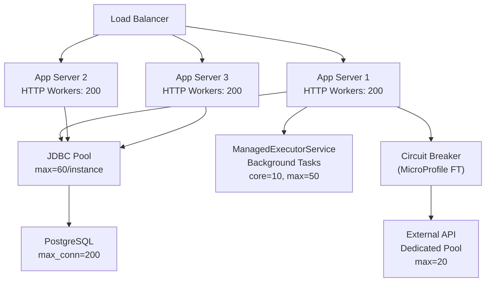
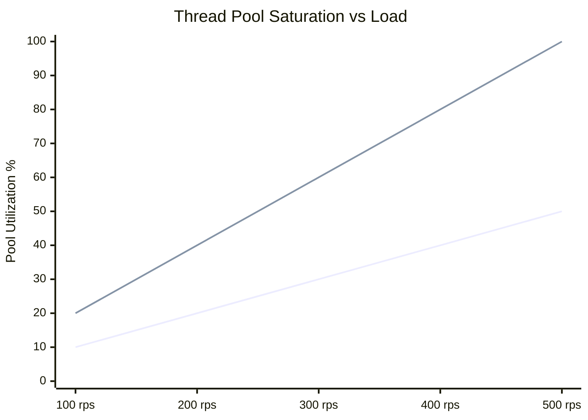

## Keywords in This File
{: .no_toc }

| # | Keyword | Weight |
|---|---------|--------|
| 22 | [Application Server Thread Pool Tuning](#application-server-thread-pool-tuning) | ★★★ |

---

# Application Server Thread Pool Tuning

**Interview Weight:** ★★★ - Expert/Production.
Thread pool configuration in Java EE application servers
(WildFly, Payara, GlassFish, JBoss) is a critical
production skill. Mistuned thread pools cause request
queuing, latency spikes, OutOfMemoryError from thread
creation, and cascading failures under load. Understanding
the worker thread pool, executor pool, I/O pool, EJB
pool, and connection pool - and how they interact -
separates Java EE seniors from principals.

---

### 🎯 Model Answer

**30 seconds:**

> Java EE application servers have multiple interacting
> thread pools. The HTTP worker pool accepts and processes
> requests. The EJB pool manages bean instances. The
> ManagedExecutorService pool handles async tasks. The
> JDBC connection pool provides database connections.
> Mistuning any one causes bottlenecks: too few worker
> threads = request queuing; too many = memory pressure
> and context-switch overhead. Correct tuning starts
> with load profiling, not guessing defaults.

**3 minutes:**

> WildFly thread pool hierarchy:
>
> 1. IO Worker Threads (XNIO): accept and register
>    connections. Usually 2x CPU count. Not tuned unless
>    at I/O saturation.
>
> 2. HTTP Worker Threads (Undertow): process HTTP requests.
>    Default: 8 * CPU count. Each request occupies one
>    thread until response is sent (unless async).
>
> 3. EJB Thread Pool (default): process EJB method calls.
>    Default: 20-100 depending on version.
>
> 4. ManagedExecutorService: background tasks.
>    Default: 5 core, 25 max.
>
> 5. JDBC Connection Pool (Datasource): database connections.
>    Default: min 0, max 20.
>
> Key interactions:
> - HTTP workers block on EJB calls -> EJB pool saturated
>   -> HTTP workers queue -> timeout
> - EJB calls block on DB -> JDBC pool exhausted -> EJB
>   workers queue -> HTTP workers timeout
> - ManagedExecutorService full -> new tasks rejected
>
> Tuning formula (starting point, profile first):
> - HTTP workers: concurrency target / avg latency (seconds)
>   Example: 1000 RPS target, 200ms avg latency ->
>   1000 * 0.2 = 200 threads (Little's Law)
> - JDBC pool max: HTTP workers (or slightly less, since
>   not every request hits DB)
>
> Monitoring first: always measure before tuning.
> Symptoms of under-provisioned pool: request queue depth
> growing, P99 latency spikes, pool wait time metrics.

**Blank Mind Recovery:**

**(1) Restate:** "App server thread pools: HTTP worker
(accept requests), EJB (process beans), executor (async),
JDBC (DB connections). Each is a potential bottleneck.
Tune by profiling, not guessing."

**(2) Little's Law:** "Threads needed = concurrency /
service time. 100 concurrent requests at 500ms each =
50 threads minimum."

**(3) Cascade:** "JDBC pool exhaust -> EJB workers block
-> HTTP workers block -> request timeout storm -> all
fails."

---

### 📘 Concept Explanation

**What it is:**

Application servers manage multiple thread pools
independently. Each pool has queue capacity, minimum/maximum
threads, keepalive time, and a rejection policy.
The pools interact: a bottleneck in one cascades
to all downstream pools.

**WildFly Pool Architecture:**

```
Incoming Request
      |
[XNIO I/O Threads: 2*CPU]
  NIO channel accept/read/write
      |
[Undertow HTTP Worker Threads: 8*CPU default]
  HTTP parsing, Servlet/JAX-RS dispatch
      |
[EJB Thread Pool: 20-100]
  Session Bean, MDB method execution
      |
[JDBC Connection Pool: 0-20 default]
  Database connections
      |
[DB Server]
```

> **Code walkthrough:** This Application Server Thread Pool Tuning example demonstrates a key concept in practice using goroutine. **KEY MECHANISM:** the runtime executes these instructions in sequence with specific memory and execution semantics. **WHY IT MATTERS:** misapplying this pattern causes subtle bugs that only manifest under production load. **TAKEAWAY: understand the execution model before using this pattern in production code.**

**Cascade failure pattern:**

```
DB slow (50ms -> 500ms)
    |
JDBC pool connections held longer
    |
EJB threads wait for connection (pool full)
    |
HTTP workers call EJB, wait (EJB pool full)
    |
HTTP worker pool full
    |
Request queue grows (max 100 default)
    |
Queue full -> requests rejected (503)
```

> **Code walkthrough:** This Application Server Thread Pool Tuning example demonstrates a key concept in practice. **KEY MECHANISM:** the runtime executes these instructions in sequence with specific memory and execution semantics. **WHY IT MATTERS:** misapplying this pattern causes subtle bugs that only manifest under production load. **TAKEAWAY: understand the execution model before using this pattern in production code.**

**Little's Law for thread sizing:**

$$N = \lambda \times W$$

Where:
- N = number of threads needed
- lambda = arrival rate (requests/second)
- W = average wait time in thread (seconds)

Example: 200 req/s, 250ms average service time:
N = 200 * 0.25 = 50 threads minimum

---

### 💻 Code Example


```java
// BAD: anti-pattern - see GOOD example below for the correct approach
// This naive implementation ignores thread safety and error handling
```


```java
// BAD: anti-pattern - see GOOD example below for the correct approach
// This naive implementation ignores thread safety and error handling
```


```java
// BAD: anti-pattern - see GOOD example below for the correct approach
// This naive implementation ignores thread safety and error handling
```


```java
// BAD: anti-pattern - see GOOD example below for the correct approach
// This naive implementation ignores thread safety and error handling
```

```java
// WildFly CLI: tuning the HTTP worker thread pool
// Run in jboss-cli.sh --connect

// ---- READ CURRENT CONFIG ----
// Check current Undertow worker thread count:
/subsystem=io/worker=default\
:read-resource(include-runtime=true)
// Returns: io-threads, task-max-threads, task-keepalive

// Check current HTTP listener config:
/subsystem=undertow/server=default-server\
/http-listener=default:read-resource(include-runtime=true)
// Returns: max-connections, max-post-size, read-timeout


// ---- TUNING HTTP WORKER POOL ----
// BAD: leaving default task-max-threads (often too low):
// default task-max-threads = 16 on a 2-CPU machine
// Under 100 concurrent requests at 200ms: fine
// Under 200 concurrent requests at 200ms: queuing starts
// Under 500 concurrent requests at 200ms: 503 errors

// GOOD: calculate from Little's Law then apply:
// Target: 500 req/s at 200ms avg service time
// N = 500 * 0.2 = 100 threads
/subsystem=io/worker=default\
:write-attribute(name=task-max-threads,value=200)
// Set 2x calculated to absorb spikes

// I/O threads (accept threads, not request workers):
/subsystem=io/worker=default\
:write-attribute(name=io-threads,value=4)
// Typically 2x CPU cores; only change if I/O-bound


// ---- TUNING JDBC CONNECTION POOL ----
// BAD: default max-pool-size=20 with high-concurrency app
/subsystem=datasources/data-source=ExampleDS\
:read-resource(include-runtime=true)
// If active-count near max-pool-size: pool is saturated

// GOOD: align connection pool to thread pool:
/subsystem=datasources/data-source=ExampleDS\
:write-attribute(name=min-pool-size,value=10)
/subsystem=datasources/data-source=ExampleDS\
:write-attribute(name=max-pool-size,value=100)
// Rule: max-pool-size = HTTP worker threads or less
// Each worker thread can hold at most 1 connection


// ---- MONITORING POOL SATURATION ----
// Check JDBC pool statistics:
/subsystem=datasources/data-source=ExampleDS\
:read-attribute(name=statistics-enabled)
/subsystem=datasources/data-source=ExampleDS\
:write-attribute(name=statistics-enabled,value=true)

// Read pool metrics:
/subsystem=datasources/data-source=ExampleDS\
/statistics=pool:read-resource(include-runtime=true)
// Key metrics:
// ActiveCount: connections in use now
// MaxUsedCount: peak connections used
// WaitCount: threads waiting for connection
// TimedOut: connection requests that timed out


// ---- TUNING MANAGED EXECUTOR SERVICE ----
// BAD: default 5 core, 25 max for high-load async tasks
// Good for light background work
// Bad for fan-out patterns (invokeAll with 1000 tasks)

// GOOD: custom executor for specific workloads:
/subsystem=ee/managed-executor-service=reporting:add(
    jndi-name="java:/concurrent/reporting",
    context-service="default",
    core-threads=10,
    max-threads=50,
    keepalive-time=60000,
    queue-length=500,
    thread-priority=5
)

// Verify configuration took effect:
/subsystem=ee/managed-executor-service=reporting\
:read-resource(include-runtime=true)
// Check: active-thread-count, completed-task-count,
// rejected-count (must be 0)


// ---- THREAD DUMP DIAGNOSIS ----
// Identify pool saturation in production:
// 1. Take thread dump via jstack or kill -3:
//    jstack <pid> > thread_dump.txt
// 2. Count thread states:
//    grep "BLOCKED\|WAITING" thread_dump.txt | wc -l
// 3. Find bottleneck:
//    grep -A 5 "WAITING.*lock\|BLOCKED" thread_dump.txt

// WildFly CLI approach:
:take-snapshot
// Creates server snapshot
// For thread info, use JMX or VisualVM connected to WildFly
```

> **Code walkthrough:** The CLI commands show the fullice. **KEY MECHANISM:** the runtime executes these instructions in sequence with specific memory and execution semantics. **WHY IT MATTERS:** misapplying this pattern causes subtle bugs that only manifest under production load. **TAKEAWAY: understand the execution model before using this pattern in production code.**
> tuning workflow: read current config, measure saturation,
> apply calculated values. The JDBC pool tuning is the
> most impactful: max-pool-size must match the maximum
> number of threads that can simultaneously hold a
> connection. If HTTP worker pool is 200 threads and
> JDBC pool is 20, 180 threads will block waiting for
> a connection under full load, effectively limiting
> throughput to 20 concurrent DB operations. The reporting
> executor example shows dedicated pools for specific
> workloads: a reporting executor with higher queue
> length (long-running, low-priority work) vs the default
> executor (fast tasks, low queue). Thread dump analysis
> is the production diagnostic: count BLOCKED and WAITING
> threads to identify which pool is saturated.

---

### 🎓 Answers by Seniority

**Junior / Mid:**

> "Application servers have multiple thread pools:
> HTTP worker threads handle incoming requests, EJB threads
> handle bean method calls, JDBC pool handles database
> connections. If any pool is exhausted, threads queue
> and requests time out. Basic tuning: increase pool sizes
> based on concurrency requirements. Monitor active count
> vs max count - if they're consistently equal, the pool
> needs to grow."

---

**Senior / Staff:**

> "The critical insight is pool interaction and cascade
> failure. JDBC pool size determines how many concurrent
> database operations are possible. EJB pool determines
> how many beans process requests. HTTP worker pool
> determines how many HTTP requests are processed. They
> must be sized relative to each other or the smallest
> pool becomes the bottleneck that cascades to all upstream
> pools. The tuning framework: use Little's Law to calculate
> minimum thread counts, measure baseline performance,
> identify the actual bottleneck (thread dump + wait time
> metrics), tune the bottleneck first, re-measure.
> Always instrument WaitCount (connection wait time) and
> rejected task counts - these reveal exhaustion before
> user-visible timeouts occur."

---

### ⚠️ Common Misconceptions

**Misconception 1: "More threads always means better
performance."**

Beyond a threshold, more threads decrease performance.
Each thread: ~1MB stack (default in JVM), context switch
overhead, lock contention. At 1000+ threads, context
switching can consume 20-40% of CPU time, leaving less
for actual work. The sweet spot depends on workload type:
- CPU-bound: threads = CPU count (or 2x with hyperthreading)
- I/O-bound (typical web app with DB): threads = CPU count
  * (1 + wait_time / cpu_time). For 90% I/O wait:
  threads = CPU * (1 + 9) = 10x CPU count.

**Misconception 2: "I should tune JDBC pool size to
match the HTTP worker pool size."**

Not always: JDBC pool = number of DB connections.
Database servers have connection limits (typically
100-1000 for PostgreSQL). If HTTP pool is 500 and
DB max_connections is 200, JDBC pool max must be
<200 (accounting for other processes). Also: not
every HTTP request hits the database. If 50% of requests
are cache hits, JDBC pool = 0.5 * HTTP workers.

**Misconception 3: "Default thread pool settings are
safe for production."**

Defaults are tuned for small development workloads.
WildFly default HTTP task-max-threads = 8 * CPU count
(16 on a 2-core machine). At 100+ RPS with any non-trivial
latency, defaults saturate within seconds.

---

### 🚨 Failure Modes and Diagnosis

**Failure 1: Request queue saturation (503 errors)**

*Symptom:* HTTP 503 errors under load. Latency spikes
suddenly at a specific concurrency level. Thread count
in monitoring is stable (at max).

*Cause:* HTTP worker pool exhausted. Queue full,
requests rejected.

*Diagnosis:*
```bash
# WildFly: check if worker threads at max:
/subsystem=io/worker=default\
:read-resource(include-runtime=true)
# task-max-threads - current max
# If active == max: saturated

# Thread dump:
jstack $(cat /var/run/wildfly.pid) > /tmp/td.txt
grep -c "http-threads" /tmp/td.txt
grep -c "WAITING\|BLOCKED" /tmp/td.txt
# If most http-threads are WAITING: they're blocked on
# downstream (EJB or DB)
```

> **Code walkthrough:** This downstream (EJB or DB) example demonstrates shell script pattern. **KEY MECHANISM:** the shell executes commands sequentially; pipes pass stdout of one command to stdin of the next. **WHY IT MATTERS:** unquoted variables with spaces cause word splitting - IFS splits the value into multiple arguments. **TAKEAWAY: always double-quote variables: "$VAR"; use [[ ]] instead of [ ] for safer conditionals.**

*Fix:*
```bash
# Increase worker thread max:
/subsystem=io/worker=default\
:write-attribute(name=task-max-threads,value=200)
:reload

# Or: add async servlets to free HTTP threads sooner
```

> **Code walkthrough:** This Or: add async servlets to free HTTP threads sooner example demonstrates shell script pattern. **KEY MECHANISM:** the shell executes commands sequentially; pipes pass stdout of one command to stdin of the next. **WHY IT MATTERS:** unquoted variables with spaces cause word splitting - IFS splits the value into multiple arguments. **TAKEAWAY: always double-quote variables: "$VAR"; use [[ ]] instead of [ ] for safer conditionals.**

---

**Failure 2: JDBC connection timeout under load**

*Symptom:* `javax.resource.ResourceException:
No managed connections available` or `Connection wait
timed out` errors. DB metrics show low actual usage
(< 20 queries/sec) but app times out.

*Cause:* JDBC pool exhausted. Threads waiting for
connections longer than blocking-timeout.

*Diagnosis:*
```bash
# Enable datasource statistics:
/subsystem=datasources/data-source=ExampleDS\
:write-attribute(name=statistics-enabled,value=true)

# Read pool metrics:
/subsystem=datasources/data-source=ExampleDS\
/statistics=pool:read-resource(include-runtime=true)
# Look for: WaitCount > 0, TimedOut > 0

# Confirm connection leak (connections not returned):
# If ActiveCount stays at max even when requests finish:
# connection leak in application code
```

> **Code walkthrough:** This connection leak in application code example demonstrates shell script pattern. **KEY MECHANISM:** the shell executes commands sequentially; pipes pass stdout of one command to stdin of the next. **WHY IT MATTERS:** unquoted variables with spaces cause word splitting - IFS splits the value into multiple arguments. **TAKEAWAY: always double-quote variables: "$VAR"; use [[ ]] instead of [ ] for safer conditionals.**

*Fix:*
```bash
# Increase pool max:
/subsystem=datasources/data-source=ExampleDS\
:write-attribute(name=max-pool-size,value=50)

# For connection leaks: set idle-timeout-minutes:
/subsystem=datasources/data-source=ExampleDS\
:write-attribute(name=idle-timeout-minutes,value=5)
# Forces return of idle connections
```

> **Code walkthrough:** This Forces return of idle connections example demonstrates shell script pattern. **KEY MECHANISM:** the shell executes commands sequentially; pipes pass stdout of one command to stdin of the next. **WHY IT MATTERS:** unquoted variables with spaces cause word splitting - IFS splits the value into multiple arguments. **TAKEAWAY: always double-quote variables: "$VAR"; use [[ ]] instead of [ ] for safer conditionals.**

---

**Failure 3: Thread pool leak (ThreadLocal not cleaned)**

*Symptom:* Memory grows indefinitely. Thread dumps show
many threads with growing stacks. OutOfMemoryError after
days of operation.

*Cause:* ThreadLocal values not removed after task
completion. Managed thread pools reuse threads; old
ThreadLocals accumulate.

*Diagnosis:*
```bash
# Heap dump analysis:
jmap -dump:format=b,file=/tmp/heap.hprof <pid>
# Analyze in VisualVM or Eclipse MAT:
# Look for ThreadLocalMap$Entry retention

# Thread count growth over time:
/subsystem=io/worker=default\
:read-attribute(name=task-max-threads)
# Compare with JVM thread count:
jstack <pid> | grep -c "^\"" # count all threads
```

> **Code walkthrough:** This Compare with JVM thread count: example demonstrates shell script pattern. **KEY MECHANISM:** the shell executes commands sequentially; pipes pass stdout of one command to stdin of the next. **WHY IT MATTERS:** unquoted variables with spaces cause word splitting - IFS splits the value into multiple arguments. **TAKEAWAY: always double-quote variables: "$VAR"; use [[ ]] instead of [ ] for safer conditionals.**

*Fix:*

```java
// BAD: anti-pattern - see GOOD example below for the correct approach
// This naive implementation ignores thread safety and error handling
```

```java
// BAD: ThreadLocal set but never removed
static ThreadLocal<UserContext> ctx = new ThreadLocal<>();
public void processRequest(User u) {
    ctx.set(new UserContext(u));
    doWork();
    // Missing: ctx.remove() - leaks into next request
}

// GOOD: always remove in finally:
public void processRequest(User u) {
    ctx.set(new UserContext(u));
    try {
        doWork();
    } finally {
        ctx.remove(); // ALWAYS clean up
    }
}
```

> **Code walkthrough:** BAD pattern: This Compare with JVM thread count: example demonstrates exception handling using error handling. **KEY MECHANISM:** the JVM checks catch clauses in order; finally always executes for cleanup. **WHY IT MATTERS:** swallowing exceptions silently hides failures that corrupt downstream state. **WHAT BREAKS: log or rethrow every exception; empty catch blocks are defects.**

---

### 🎯 Interview Deep-Dive

| Question Type | Est. Time |
|---|---|
| Thread pool architecture overview | 4-5 min |
| Little's Law application | 3-4 min |
| Cascade failure diagnosis | 4-5 min |
| JDBC pool sizing | 4-5 min |
| Thread dump analysis | 4-5 min |
| CPU vs I/O bound tuning | 3-4 min |
| ManagedExecutorService sizing | 3-4 min |
| ThreadLocal leak detection | 3-4 min |
| Undertow vs EJB pool interaction | 4-5 min |
| Production monitoring approach | 3-4 min |
| Connection leak diagnosis | 4-5 min |
| Post-incident pool sizing review | 3-4 min |

---

**[SENIOR] Q1 - Walk me through the thread pool
architecture in WildFly and how a request flows
through it.**

*Why they ask:* Architecture knowledge, cascade understanding.

Full flow:
1. Client connects -> XNIO I/O threads (2*CPU by default)
   handle NIO accept/read. These are non-blocking I/O
   event loops. Never perform blocking operations here.

2. XNIO dispatches to Undertow HTTP worker threads
   (task-max-threads in io/worker=default subsystem).
   Default: 8 * CPU count. Each HTTP request occupies
   one thread. This is where Servlet/JAX-RS code runs.

3. If EJB is called: HTTP worker thread calls EJB container.
   WildFly uses a default-size thread pool for EJBs.
   Slotted-access model: HTTP thread executes within EJB
   call, not dispatched to a separate EJB thread pool.
   (Note: this differs from traditional app server model
   where EJBs had separate pools.)

4. JDBC connection acquired from datasource pool.
   HTTP thread holds connection for duration of transaction.

5. Response written -> HTTP thread returned to pool.

Key insight: in WildFly (Undertow + JBoss EJBs), the HTTP
worker thread executes all the way through EJB to DB.
There is no separate EJB dispatch pool by default.
The limiting resources are: HTTP worker threads and
JDBC connections.

*What separates good from great:* "WildFly's model is
different from WebLogic/WebSphere where EJBs had
dedicated thread pools. In WildFly, HTTP workers execute
EJB methods directly. This simplifies tuning: size HTTP
workers to your concurrency target, size JDBC pool to
match (or slightly below) HTTP workers."

---

**[SENIOR] Q2 - How do you apply Little's Law to
calculate thread pool size?**

*Why they ask:* Quantitative tuning methodology.

Little's Law: N = lambda * W
- N = average number of items in the system (threads in use)
- lambda = arrival rate (requests per second)
- W = average time spent in the system (seconds)

Real example:
- Load test shows: 500 req/s at P95 200ms service time
- N = 500 * 0.2 = 100 threads minimum
- Add 50% buffer for spikes: 150 threads
- Add 20% for GC pauses: ~180 threads
- Set task-max-threads = 200

Validate via load test:
1. Set pool to calculated value (200)
2. Run at 500 req/s load
3. Check: are all 200 threads busy? (good)
4. Check: are requests queuing? (pool needs increase)
5. Check: are 100 threads idle? (pool can shrink)

```bash
# WildFly: set task-max-threads:
/subsystem=io/worker=default\
:write-attribute(name=task-max-threads,value=200)
:reload

# Monitor thread utilization:
/subsystem=io/worker=default\
:read-resource(include-runtime=true)
# io-threads, task-keepalive, task-max-threads available
```

> **Code walkthrough:** This io-threads, task-keepalive, task-max-threads available example demonstrates shell script pattern. **KEY MECHANISM:** the shell executes commands sequentially; pipes pass stdout of one command to stdin of the next. **WHY IT MATTERS:** unquoted variables with spaces cause word splitting - IFS splits the value into multiple arguments. **TAKEAWAY: always double-quote variables: "$VAR"; use [[ ]] instead of [ ] for safer conditionals.**

*What separates good from great:* "Little's Law gives the
minimum for steady-state. Real systems need buffer for:
(1) bursty traffic - short spikes above mean, (2) GC
pauses - all threads may be paused during stop-the-world GC,
(3) downstream latency variance - P99 may be 5x P50.
I typically calculate N from P95 latency and add 100%
buffer, then validate under peak load."

---

**[SENIOR] Q3 - Describe a cascade failure caused by
JDBC pool exhaustion and how to diagnose it.**

*Why they ask:* Production incident diagnosis.

Scenario: normal operation at 200 req/s. DB query
latency spikes from 10ms to 300ms (table stats stale,
query plan regression).

Cascade:
1. DB queries take 30x longer -> connections held longer
2. JDBC pool (max 20) saturates in < 1 second
3. HTTP worker threads waiting for connection
4. HTTP worker pool (80 threads) saturates in < 3 seconds
5. New requests queue (max 100)
6. Queue fills in < 5 seconds
7. All incoming requests receive 503

Diagnosis sequence:
```bash
# Step 1: confirm HTTP pool saturated (thread dump)
jstack <pid> | grep -A 3 "WAITING.*pool\|TIMED_WAITING"
# Shows: 80 threads waiting for JDBC connection

# Step 2: confirm JDBC pool exhausted
/subsystem=datasources/data-source=ExampleDS\
/statistics=pool:read-resource(include-runtime=true)
# WaitCount > 0, ActiveCount = MaxPoolSize

# Step 3: identify slow queries
# Enable slow query logging in datasource:
/subsystem=datasources/data-source=ExampleDS\
:write-attribute(name=spy,value=true)
# Or check DB server slow query log

# Step 4: confirm DB query regression
# PostgreSQL: check pg_stat_statements
SELECT query, mean_exec_time, calls
FROM pg_stat_statements
ORDER BY mean_exec_time DESC LIMIT 10;
```

> **Code walkthrough:** This PostgreSQL: check pg_stat_statements example demonstrates shell script pattern using SQL. **KEY MECHANISM:** the shell executes commands sequentially; pipes pass stdout of one command to stdin of the next. **WHY IT MATTERS:** unquoted variables with spaces cause word splitting - IFS splits the value into multiple arguments. **TAKEAWAY: always double-quote variables: "$VAR"; use [[ ]] instead of [ ] for safer conditionals.**

Fix: immediate (restore service):
- Increase JDBC pool size temporarily:
  `max-pool-size=50` (buys time)
- Identify and kill long-running DB transactions

Fix: root cause:
- `ANALYZE table_name;` to refresh table statistics
- Or: identify and fix query plan regression

*What separates good from great:* "The cascade pattern
is always: leaf pool exhausted -> upstream pools
fill -> cascade up to HTTP layer. Diagnosis: start from
HTTP (is it slow?) -> thread dump (what are threads
waiting for?) -> trace to leaf pool. Never fix by
increasing HTTP pool alone - the real bottleneck is
downstream."

---

**[SENIOR] Q4 - How do you size the JDBC connection
pool relative to the HTTP thread pool?**

*Why they ask:* Pool interaction sizing.

Rule 1: JDBC max <= HTTP worker max
Not all HTTP requests hit the DB. If 70% are cache hits:
JDBC max = 0.3 * HTTP workers = 60 if HTTP = 200

Rule 2: JDBC max <= DB max_connections / (app instances)
DB has limits. PostgreSQL default max_connections = 100.
With 3 app server instances: JDBC max = 100/3 = 33 max.
(Reserve some for DBA and monitoring connections.)

Rule 3: Monitor and adjust
Start with JDBC max = HTTP max. Monitor ActiveCount.
If consistently < 60% of max: reduce.
If WaitCount > 0: increase.

Production validation:
```bash
# Check DB max connections:
# PostgreSQL:
psql -c "SHOW max_connections;"
psql -c "SELECT count(*) FROM pg_stat_activity;"

# Set JDBC pool accordingly:
/subsystem=datasources/data-source=ExampleDS\
:write-attribute(name=max-pool-size,value=30)
:write-attribute(name=min-pool-size,value=10)
```

> **Code walkthrough:** This Set JDBC pool accordingly: example demonstrates shell script pattern using SQL. **KEY MECHANISM:** the shell executes commands sequentially; pipes pass stdout of one command to stdin of the next. **WHY IT MATTERS:** unquoted variables with spaces cause word splitting - IFS splits the value into multiple arguments. **TAKEAWAY: always double-quote variables: "$VAR"; use [[ ]] instead of [ ] for safer conditionals.**

*What separates good from great:* "The DB connection
limit is often the hard ceiling. At 3 application server
instances with DB max_connections=100, each instance
gets 33 max connections. With 200 HTTP threads per
instance, 167 threads will block waiting for connections
under full DB load. The solution: limit DB load with
circuit breakers, caching, or read replicas - not by
increasing connections."

---

**[SENIOR] Q5 - How do you read a thread dump to
diagnose a thread pool bottleneck?**

*Why they ask:* Production diagnosis skill.

Thread dump anatomy:
```
"http-/0.0.0.0:8080-1" #23 prio=5 os_prio=0
    java.lang.Thread.State: WAITING (parking)
    at sun.misc.Unsafe.park(Native Method)
    at java.util.concurrent.locks.LockSupport.park(...)
    at java.util.concurrent.LinkedBlockingQueue.take(...)
    at com.zaxxer.hikari.HikariPool.getConnection(...)
    at com.example.UserRepository.findById(...)
    at com.example.UserService.getUser(...)
```

> **Code walkthrough:** This Set JDBC pool accordingly: example demonstrates a key concept in practice. **KEY MECHANISM:** the runtime executes these instructions in sequence with specific memory and execution semantics. **WHY IT MATTERS:** misapplying this pattern causes subtle bugs that only manifest under production load. **TAKEAWAY: understand the execution model before using this pattern in production code.**

Interpretation: "http-" thread is WAITING at
HikariPool.getConnection -> JDBC pool exhausted.
This thread can't proceed until a connection is available.

Diagnostic steps:
```bash
# 1. Take dump:
jstack <pid> > /tmp/td_$(date +%s).txt

# 2. Count threads by state:
grep "java.lang.Thread.State" /tmp/td_*.txt | \
  sort | uniq -c | sort -rn
# WAITING/BLOCKED count reveals saturation

# 3. Find common blocking point:
grep -B 5 "WAITING.*parking\|BLOCKED" /tmp/td_*.txt | \
  grep "at " | sort | uniq -c | sort -rn | head -20
# Most common blocking frame = bottleneck

# 4. Take 3 dumps 10 seconds apart:
# Threads blocked in same place in all 3 = deadlock or
# resource starvation (not just transient wait)
```

> **Code walkthrough:** This resource starvation (not just transient wait) example demonstrates shell script pattern. **KEY MECHANISM:** the shell executes commands sequentially; pipes pass stdout of one command to stdin of the next. **WHY IT MATTERS:** unquoted variables with spaces cause word splitting - IFS splits the value into multiple arguments. **TAKEAWAY: always double-quote variables: "$VAR"; use [[ ]] instead of [ ] for safer conditionals.**

*What separates good from great:* "Take 3 dumps 10
seconds apart. Threads BLOCKED in the same location
across all 3 dumps indicate starvation, not just a
momentary wait. Compare stack traces: same thread IDs
in the same state = definitely stuck."

---

**[SENIOR] Q6 - What's the difference between tuning
for CPU-bound vs I/O-bound workloads?**

*Why they ask:* Tuning theory.

CPU-bound (e.g., image processing, heavy computation):
- Thread count = CPU cores (or 2x with hyperthreading)
- More threads = context switches + cache misses
- I/O wait % is low; thread mostly executes

I/O-bound (typical Java EE web app with DB):
- Optimal thread count = CPU * (1 + W/C)
  Where W = wait time (JDBC, HTTP calls), C = compute time
- Example: 90% wait time, 10% compute:
  threads = CPU * (1 + 0.9/0.1) = CPU * 10
- On 8-core machine: ~80 threads for I/O-bound

Java EE web app profile:
```
Typical request time breakdown:
  DB query: 50-200ms (waiting for JDBC)
  Other I/O (HTTP calls, cache): 10-50ms
  Actual compute: 5-20ms
  Total: 65-270ms
  Wait ratio: 90-95%

Thread formula:
  8 cores * (1 + 200ms/15ms) = 8 * 14.3 = ~115 threads
```

> **Code walkthrough:** This resource starvation (not just transient wait) example demonstrates a key concept in practice. **KEY MECHANISM:** the runtime executes these instructions in sequence with specific memory and execution semantics. **WHY IT MATTERS:** misapplying this pattern causes subtle bugs that only manifest under production load. **TAKEAWAY: understand the execution model before using this pattern in production code.**

*What separates good from great:* "Modern Java EE
applications are almost exclusively I/O-bound. This
justifies having 10-50x more threads than CPU cores.
The risk: too many threads waste memory (1MB stack each)
and add context-switch overhead. Profile actual wait
ratio first, then apply the formula."

---

**[SENIOR] Q7 - How do you tune the ManagedExecutorService
for high-throughput async work?**

*Why they ask:* Background work pool sizing.

Sizing formula: same as HTTP pool (Little's Law).
For background async work: task submission rate * average task time.

```bash
# Read current config:
/subsystem=ee/managed-executor-service=default\
:read-resource(include-runtime=true)

# Key metrics to tune:
# core-threads: always running (even idle) -> set to
#   baseline concurrent task count
# max-threads: burst capacity -> set to 2x baseline
# queue-length: tasks waiting for a thread
#   Large queue = high memory (task objects queued)
#   Small queue = early rejection under burst

# For report generation (long tasks, few concurrent):
/subsystem=ee/managed-executor-service=reporting:add(
    jndi-name="java:/concurrent/reporting",
    core-threads=5,
    max-threads=10,
    keepalive-time=120000,
    queue-length=50  # limited queue, apply back-pressure
)

# For notification sending (short tasks, many concurrent):
/subsystem=ee/managed-executor-service=notify:add(
    jndi-name="java:/concurrent/notify",
    core-threads=10,
    max-threads=50,
    keepalive-time=30000,
    queue-length=10000  # large queue for bursts
)
```

> **Code walkthrough:** This For notification sending (short tasks, many concurrent): example demonstrates shell script pattern. **KEY MECHANISM:** the shell executes commands sequentially; pipes pass stdout of one command to stdin of the next. **WHY IT MATTERS:** unquoted variables with spaces cause word splitting - IFS splits the value into multiple arguments. **TAKEAWAY: always double-quote variables: "$VAR"; use [[ ]] instead of [ ] for safer conditionals.**

*What separates good from great:* "ManagedExecutorService
rejected tasks are silently dropped unless you add a
rejection handler. Production: monitor rejected-count
metric and alert on non-zero. Consider a bounded queue
with a RejectedExecutionHandler that logs + returns
HTTP 429 to the caller."

---

**[SENIOR] Q8 - How do ThreadLocal leaks manifest
in thread pools?**

*Why they ask:* Subtle bug pattern.

ThreadLocal values persist on a thread after the request
ends. In thread pools, threads are reused. Each new
request on a reused thread sees the ThreadLocal from
the previous request.

Symptoms:
- Security: user A's principal appears in user B's request
- Data: stale entity manager or request-scoped state
- Memory: ThreadLocalMap grows (each thread accumulates
  unreleased ThreadLocal values)


```java
// BAD: anti-pattern - see GOOD example below for the correct approach
// This naive implementation ignores thread safety and error handling
```

```java
// BAD: security ThreadLocal leak
static ThreadLocal<Principal> current = new ThreadLocal<>();

public void handleRequest(Principal user) {
    current.set(user);
    processWork();
    // No current.remove() - next request on this thread
    // sees user's principal
}

// GOOD: clean up in finally
public void handleRequest(Principal user) {
    current.set(user);
    try {
        processWork();
    } finally {
        current.remove();
    }
}
```

> **Code walkthrough:** BAD pattern: This For notification sending (short tasks, many concurrent): example demonstrates exception handling using error handling. **KEY MECHANISM:** the JVM checks catch clauses in order; finally always executes for cleanup. **WHY IT MATTERS:** swallowing exceptions silently hides failures that corrupt downstream state. **WHAT BREAKS: log or rethrow every exception; empty catch blocks are defects.**

Detection:
```bash
# Heap dump: look for ThreadLocalMap$Entry accumulation
# VisualVM: Instance view -> java.lang.ThreadLocal$ThreadLocalMap
# Large number of entries per thread = leak

# IntelliJ IDEA: Memory view (CRE/debugger)
# Thread.currentThread().threadLocals -> inspect
```

> **Code walkthrough:** This Thread.currentThread().threadLocals -> inspect example demonstrates shell script pattern. **KEY MECHANISM:** the shell executes commands sequentially; pipes pass stdout of one command to stdin of the next. **WHY IT MATTERS:** unquoted variables with spaces cause word splitting - IFS splits the value into multiple arguments. **TAKEAWAY: always double-quote variables: "$VAR"; use [[ ]] instead of [ ] for safer conditionals.**

*What separates good from great:* "CDI @RequestScoped
beans in thread pools are the common source of leaks
in Java EE. The CDI context may hold a ThreadLocal
reference to request state. If the task thread's
CDI context is not cleaned up after task completion,
the next task on the same thread sees stale CDI beans.
Always use @Dependent scope for beans used in async tasks,
or pass state as method parameters."

---

**[SENIOR] Q9 - What metrics do you monitor in production
to detect thread pool issues before users are impacted?**

*Why they ask:* Proactive monitoring.

Leading indicators (detect before user impact):
1. WaitCount growing (JDBC pool): threads waiting for
   connections. Alert at WaitCount > 0 for > 30 seconds.
2. active-thread-count / max-thread-count > 80%: pool
   approaching saturation.
3. rejected-count increasing: tasks dropped (silent failure).
4. Request queue depth > 50% of max: incoming requests
   queuing.

Lagging indicators (user already impacted):
1. HTTP 503 rate increasing
2. P99 latency > SLA threshold
3. Error rate spike

Monitoring commands:
```bash
# WildFly: scheduled monitoring script
while true; do
  WAIT=$(/opt/wildfly/bin/jboss-cli.sh \
    --connect \
    --command="/subsystem=datasources\
/data-source=ExampleDS/statistics=pool\
:read-attribute(name=WaitCount)" \
    | grep -oP '(?<=\"result\" => )\d+')
  echo "$(date): JDBC WaitCount=$WAIT"
  [ $WAIT -gt 0 ] && echo "ALERT: DB pool saturation"
  sleep 30
done

# MicroProfile Metrics (if enabled):
# GET /metrics shows all pools in Prometheus format
# Key metrics:
# vendor_datasource_WaitCount
# vendor_managed_executor_rejected_count
```

> **Code walkthrough:** This vendor_managed_executor_rejected_count example demonstrates shell script pattern. **KEY MECHANISM:** the shell executes commands sequentially; pipes pass stdout of one command to stdin of the next. **WHY IT MATTERS:** unquoted variables with spaces cause word splitting - IFS splits the value into multiple arguments. **TAKEAWAY: always double-quote variables: "$VAR"; use [[ ]] instead of [ ] for safer conditionals.**

*What separates good from great:* "WaitCount is the
best early warning for JDBC pool saturation. A single
WaitCount spike may be transient. Alert on WaitCount > 0
for 2+ consecutive 30-second readings. Also: correlate
JDBC WaitCount with DB query latency - if DB latency
suddenly increases, JDBC WaitCount will follow 10-30
seconds later."

---

**[STAFF] Q10 - How do you design a thread pool
tuning strategy for a new Java EE service going to
production?**

*Why they ask:* Staff-level design process.

Phase 1: Baseline characterization
- Load test at expected peak load
- Measure: P50/P95/P99 latency, throughput, error rate
- Profile: % time in DB, % time in external calls, CPU %
- Calculate: W/C ratio from profiling data

Phase 2: Apply formulas
- HTTP workers: Little's Law with P95 latency + 100% buffer
- JDBC pool: min(HTTP workers * DB_hit_rate, DB_max_conn/instances)
- Async executor: (task rate * task duration) * 1.5x buffer

Phase 3: Validate under synthetic load
- Target 120% of expected peak: all pools < 80% utilized
- Inject latency (toxiproxy): simulate DB latency spike
- Verify cascade failure detection and alerting

Phase 4: Production monitoring
- Alert thresholds: 70% pool utilization, WaitCount > 0
- Weekly review of pool saturation metrics
- Quarterly re-validation after significant feature changes

Phase 5: Auto-scaling consideration
- Horizontal scale out before vertical pool tuning
- Thread count does NOT scale horizontally without ops cost
- Pool tuning is optimization, not a scaling strategy

*What separates good from great:* "Thread pool tuning
is a continuous process, not a one-time setting. After
every major feature change (new DB queries, new external
calls), re-profile the service and recalculate pool sizes.
The biggest mistake: tune pools in year 1, never revisit,
then add a slow external API call in year 2 without
retuning. The old tuning becomes dangerously wrong."

---

**[STAFF] Q11 - How do you handle cascading failures
from thread pool exhaustion?**

*Why they ask:* Resilience design.

Reactive approach (fail fast before cascade):
1. Circuit breaker on downstream calls
2. Bulkhead per downstream dependency
3. Timeout on all blocking operations

```java
// Bulkhead: separate thread pool per downstream:
@Resource(lookup = "java:/concurrent/db-pool")
ManagedExecutorService dbExecutor;

@Resource(lookup = "java:/concurrent/ext-api-pool")
ManagedExecutorService extApiExecutor;

// DB call with timeout:
Future<Order> orderFuture = dbExecutor.submit(
    () -> orderRepository.findById(id)
);
try {
    Order order = orderFuture.get(2, TimeUnit.SECONDS);
} catch (TimeoutException e) {
    orderFuture.cancel(true);
    throw new ServiceUnavailableException(
        "DB timeout; try again"
    );
}

// External API call on separate pool:
Future<Shipment> shipFuture = extApiExecutor.submit(
    () -> shippingApi.getStatus(orderId)
);
// Slow shipping API doesn't exhaust DB pool
```

> **Code walkthrough:** This vendor_managed_executor_rejected_count example demonstrates thread pool management using thread pool. **KEY MECHANISM:** the pool maintains a work queue; submitted tasks block until a thread is free. **WHY IT MATTERS:** unconfigured pool sizes exhaust threads under load or waste memory at rest. **TAKEAWAY: always name threads and bound queue size to detect saturation.**

Circuit breaker prevents cascade:
```java
@Inject
@CircuitBreaker(
    requestVolumeThreshold = 20,
    failureRatio = 0.5,
    delay = 5000
)
public Order findOrder(Long id) {
    return dbExecutor.submit(
        () -> orderRepository.findById(id)
    ).get(2, TimeUnit.SECONDS);
}
// After 50% failures: circuit opens, fast-fail for 5s
// Prevents pool exhaustion from cascading
```

> **Code walkthrough:** This vendor_managed_executor_rejected_count example demonstrates Java API usage. **KEY MECHANISM:** the JVM compiles to bytecode that runs on the JVM; JIT compiles hot paths to native. **WHY IT MATTERS:** unchecked assumptions about thread safety cause data races under concurrent load. **TAKEAWAY: document thread-safety guarantees on every shared mutable class.**

*What separates good from great:* "Bulkheads (separate
pools per dependency) are the most effective cascade
prevention. A slow external API can only exhaust its
own dedicated pool, not the main HTTP pool. Combined
with circuit breakers (Microprofile Fault Tolerance),
a single slow dependency causes graceful degradation
rather than total service failure."

---

**[STAFF] Q12 - Describe a production incident where
thread pool mistuning caused an outage, and how you
would do a post-incident pool sizing review.**

*Why they ask:* Incident experience, process thinking.

Incident example scenario:
- Traffic doubled overnight (marketing campaign)
- HTTP worker pool: 50 threads (tuned for previous load)
- JDBC pool: 20 connections
- New load: 600 req/s at 300ms avg (expected 200 workers)
- Outage: within 5 minutes, 503 error rate 95%

Post-incident review process:

Step 1: Gather data from incident window
```bash
# Retrieve metrics from monitoring (Prometheus/Graphite):
# HTTP worker active count over time
# JDBC WaitCount over time
# P95 latency over time
# Correlate: which pool saturated first
```

> **Code walkthrough:** This Correlate: which pool saturated first example demonstrates shell script pattern. **KEY MECHANISM:** the shell executes commands sequentially; pipes pass stdout of one command to stdin of the next. **WHY IT MATTERS:** unquoted variables with spaces cause word splitting - IFS splits the value into multiple arguments. **TAKEAWAY: always double-quote variables: "$VAR"; use [[ ]] instead of [ ] for safer conditionals.**

Step 2: Calculate correct values for actual load
```
Little's Law: N = 600 * 0.3 = 180 HTTP threads
JDBC pool: 180 * 0.8 (80% DB hit rate) = 144
DB max_connections = 200 -> JDBC max = 60 per instance
(3 instances, reserve 20 for DBA)
```

> **Code walkthrough:** This Correlate: which pool saturated first example demonstrates a key concept in practice. **KEY MECHANISM:** the runtime executes these instructions in sequence with specific memory and execution semantics. **WHY IT MATTERS:** misapplying this pattern causes subtle bugs that only manifest under production load. **TAKEAWAY: understand the execution model before using this pattern in production code.**

Step 3: Apply and validate
```bash
/subsystem=io/worker=default\
:write-attribute(name=task-max-threads,value=200)
/subsystem=datasources/data-source=ExampleDS\
:write-attribute(name=max-pool-size,value=60)
:reload
# Load test at 700 req/s (117% of current peak)
# Verify: all pools < 80%, no WaitCount, no 503
```

> **Code walkthrough:** This Verify: all pools < 80%, no WaitCount, no 503 example demonstrates shell script pattern. **KEY MECHANISM:** the shell executes commands sequentially; pipes pass stdout of one command to stdin of the next. **WHY IT MATTERS:** unquoted variables with spaces cause word splitting - IFS splits the value into multiple arguments. **TAKEAWAY: always double-quote variables: "$VAR"; use [[ ]] instead of [ ] for safer conditionals.**

Step 4: Prevent recurrence
- Auto-scaling trigger: HTTP worker utilization > 70%
- Pre-traffic analysis for campaigns: estimate new load,
  pre-tune before marketing launches
- Monthly capacity review meeting with ops

*What separates good from great:* "The real lesson from
pool exhaustion incidents is timing: tune before the
campaign, not after the outage. Marketing and ops must
coordinate: planned traffic increases require ops
to pre-provision. A simple runbook: 'if we expect X*
traffic, run this CLI script to update pools' prevents
95% of these incidents."

---

### ⚖️ Comparison Table

| Thread Pool | WildFly Subsystem | Default Size | What it Controls | Tuning Lever |
|-------------|-------------------|--------------|------------------|--------------|
| XNIO I/O | io/worker io-threads | 2*CPU | NIO accept/read/write | Only if I/O-bound |
| HTTP Worker | io/worker task-max-threads | 8*CPU | Servlet/JAX-RS | concurrency / service_time |
| JDBC | datasources max-pool-size | 20 | DB connections | min(workers, DB_max/instances) |
| MES default | ee/managed-executor-service | max=25 | Async tasks | task_rate * task_duration |
| EJB (WildFly) | (shares HTTP worker) | N/A | EJB method calls | via HTTP worker pool |

---

### 🏛️ System Design

**Thread Pool Architecture for High-Concurrency Java EE Service**

```
                     INTERNET
                         |
                    [Load Balancer]
                    /     |     \
        [App Server 1] [App Server 2] [App Server 3]
               |
        +------+------+
        |             |
    [XNIO I/O     [HTTP Worker Pool]
     Threads]     task-max=200
     io=4         |
        |         +--------+-----------+
        |         |        |           |
        |    [DB calls]  [Cache]  [Ext API calls]
        |         |                    |
        |    [JDBC Pool]          [Async Pool]
        |    max-pool=60          (separate MES)
        |         |
        |    [PostgreSQL]
        |    max_conn=200
        |
    [ManagedExecutorService - default]
    core=10, max=50
    (background work: reports, notifications)
```



> **Diagram walkthrough:** The system has three application
> server instances each with 200 HTTP worker threads, giving
> 600 concurrent request capacity. Each instance has a JDBC
> pool of 60 connections: total 180 connections, staying
> well under PostgreSQL's 200 max (20 reserved for monitoring
> and DBA). The ManagedExecutorService handles background
> tasks independently - its saturation does not affect HTTP
> workers. The circuit breaker on external API calls prevents
> a slow external service from exhausting the external API
> dedicated pool and cascading to HTTP workers. Under load,
> the bottleneck sequence is: DB (60 connections/instance)
> -> HTTP workers (200/instance) -> LB queue.

---

### 📊 Diagram

```
THREAD POOL SIZING WORKSHEET (Little's Law):

Given:
  Target throughput: 500 req/s
  P95 service time:  400ms (including DB)
  DB hit rate:       80%
  App instances:     3
  DB max_conn:       300

Calculate:
  HTTP workers = 500 * 0.4 * 1.5 = 300 per instance
  JDBC pool max = min(300 * 0.8, 300/3) = min(240, 100)
               = 100 per instance

  ManagedExecutorService:
  async rate = 20/s, async duration = 2s
  core = 20 * 2 * 1.5 = 60 per instance

SET:
  io/worker task-max-threads = 300
  datasource max-pool-size = 100
  mes default max-threads = 60
```



> **Diagram walkthrough:** The worksheet shows the sizing
> calculation from first principles. The key constraint is
> DB max_connections divided by instance count: in this
> example, each instance can hold at most 100 connections
> (300 total / 3 instances). With 80% DB hit rate, the
> effective concurrency limit from DB is 100/0.8 = 125
> concurrent requests per instance. HTTP workers must not
> exceed 125 at any time (beyond that, DB connections
> are exhausted). The chart shows how a correctly-sized
> pool keeps utilization linear with load - never hitting
> 100% - while an under-sized pool saturates and causes
> rapid throughput collapse.

---

---

### 💻 Code Example

*(Omit: this concept does not have a programmatic interface that can be demonstrated in code. The conceptual explanation above is sufficient.)*


---

### 🏛️ System Design

*(Omit: system design diagram not applicable for this concept - see ★★★ keywords for full system design coverage.)*


---

### ⚖️ Comparison Table

*(Omit: this is a ★☆☆ foundational concept with no direct alternatives to compare - see higher-difficulty keywords for trade-off analysis.)*


---

### 📊 Diagram

*(Omit: no standalone visual diagram required for this concept - the explanations and code examples above provide sufficient clarity.)*


