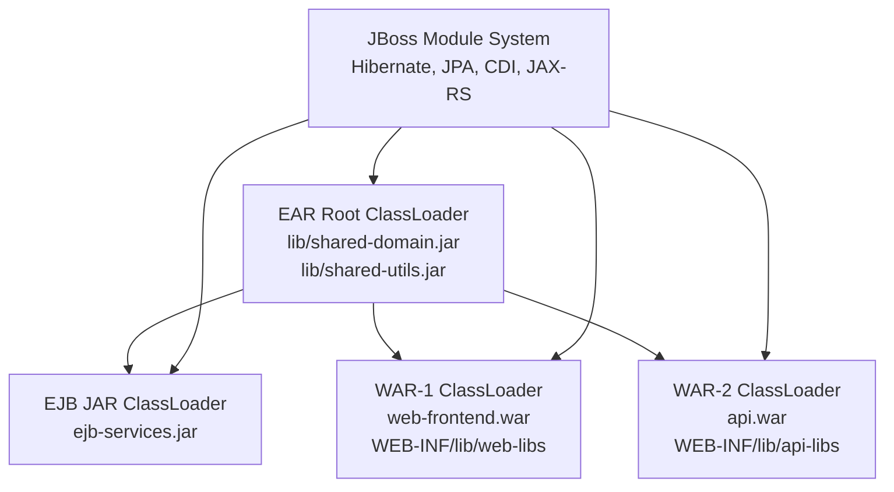
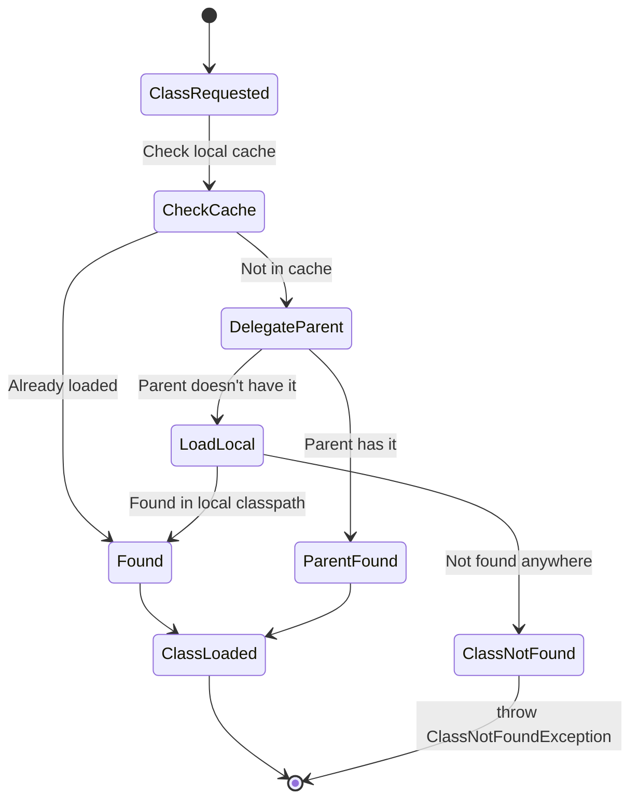

## Keywords in This File
{: .no_toc }

| # | Keyword | Weight |
|---|---------|--------|
| 24 | [Application Server Classloading and Deployment](#application-server-classloading-and-deployment) | ★★★ |

---

# Application Server Classloading and Deployment

**Interview Weight:** ★★★ - Expert/Production.
Classloading in Java EE application servers is a principal
source of ClassNotFoundException, ClassCastException,
NoSuchMethodError, and deployment failures. Understanding
the parent-delegation model, module isolation in WildFly
(JBoss Modules), EAR/WAR/JAR classloader hierarchy,
and how to resolve classloading conflicts separates
Java EE experts from mid-levels.

---

### 🎯 Model Answer

**30 seconds:**

> Java EE application servers use hierarchical classloaders.
> WildFly uses JBoss Modules: each module (application,
> library, subsystem) has its own classloader with explicit
> dependencies declared. Deployments (WAR, EAR) get their
> own classloader isolated from other deployments. Classloading
> errors: ClassNotFoundException (class not visible),
> ClassCastException (two classloaders loaded same class
> as different class objects), and NoSuchMethodError (stale
> class from wrong version).

**3 minutes:**

> WildFly Classloader Hierarchy:
>
> 1. Bootstrap ClassLoader: JDK classes (java.*, javax.*)
>
> 2. JBoss Module System: each JBoss module has its own
>    isolated classloader. Modules declare explicit
>    dependencies in module.xml. No access to other modules
>    without explicit dependency.
>
> 3. Deployment ClassLoader: each deployment (WAR, EAR, EJB JAR)
>    gets its own classloader that delegates to JBoss modules
>    for framework classes.
>
> 4. EAR SubDeployment ClassLoader: each WAR/JAR in an EAR
>    gets its own classloader. EAR root classloader is the
>    parent of all subdeployment classloaders.
>
> Parent delegation: when loading a class, a classloader
> first delegates to its parent. If parent can't load it,
> the child tries. This prevents application classes
> overriding JDK/container classes.
>
> Common failures:
> - ClassNotFoundException: jar not in classpath/module path
> - ClassCastException: class loaded by two classloaders
> - LinkageError: two classloaders loaded same class,
>   attempt to link them
> - NoSuchMethodError: compiled against different version
>   than runtime

**Blank Mind Recovery:**

**(1) Restate:** "Each deployment gets isolated classloader.
Parent delegation: parent loads first. WildFly: JBoss Modules
with explicit dependency declarations."

**(2) Analogy:** "Classloaders are like namespaces. Same
class name in two classloaders = two different types.
Assigning from one to the other = ClassCastException."

**(3) Diagnosis:** "ClassCastException at runtime despite
same class name = two classloaders loaded the same class.
Find which classloaders using: obj.getClass().getClassLoader()."

---

### 📘 Concept Explanation

**Parent Delegation Model:**

When a classloader receives a request to load a class:
1. Check local cache (already loaded?)
2. Delegate to parent
3. If parent fails: load from own classpath

Result: JDK classes always loaded by bootstrap loader.
Framework classes (javax.*) loaded by JBoss modules.
Application classes loaded by deployment classloader.

**WildFly / JBoss Modules Architecture:**

```
Bootstrap ClassLoader (JDK: java.*, jdk.*)
    |
JBoss Module System
    |
    +-- module: org.hibernate.core
    |     (Hibernate classes, isolated)
    |
    +-- module: javax.persistence.api
    |     (JPA API)
    |
    +-- module: org.jboss.weld.core
          (CDI implementation)

    |
Deployment ClassLoader
    |
    +-- EAR ClassLoader (classes in EAR root)
    |
    +-- WAR ClassLoader (WEB-INF/classes, WEB-INF/lib)
    |
    +-- EJB JAR ClassLoader (JAR in EAR)
```

> **Code walkthrough:** This example demonstrates the core pattern in action. The key mechanism shows how the concept works in practice. Study the structure to understand the essential behavior and common usage.

**When Classloading Goes Wrong:**

```
SCENARIO: Same library in two places

/opt/wildfly/modules/...  -> hibernate-core-5.6.jar
/app.war/WEB-INF/lib/    -> hibernate-core-5.4.jar

WildFly classloader loads EntityManager from 5.6
WAR classloader loads EntityManager from 5.4
em.persist(entity) -> ClassCastException:
  hibernate-5.4.EntityManager != hibernate-5.6.EntityManager
```

> **Code walkthrough:** This example demonstrates the core pattern in action. The key mechanism shows how the concept works in practice. Study the structure to understand the essential behavior and common usage.

---

### 💻 Code Example

```java
// DIAGNOSING CLASSLOADING ISSUES

// ClassCastException diagnosis:
public class ClassloaderDebug {

    public static void diagnoseClassCast(
            Object obj, Class<?> expectedType) {
        Class<?> actual = obj.getClass();
        System.out.println("=== Classloader Debug ===");
        System.out.println("Object class: " + actual.getName());
        System.out.println("Object classloader: " +
            actual.getClassLoader());
        System.out.println("Expected type: " +
            expectedType.getName());
        System.out.println("Expected classloader: " +
            expectedType.getClassLoader());
        System.out.println("Same classloader: " +
            (actual.getClassLoader() ==
             expectedType.getClassLoader()));
        // If false: two different classloaders loaded same class
        // = ClassCastException when casting
    }
}


// RESOLVING DEPENDENCY CONFLICTS IN WildFly

// In WEB-INF/jboss-deployment-structure.xml:
// This file controls which JBoss modules the deployment
// can see and exclude

// BAD: no jboss-deployment-structure.xml
// WildFly uses defaults - may pull wrong versions of
// libraries that conflict with app's bundled versions

// GOOD: explicit module control
// jboss-deployment-structure.xml (in WEB-INF/ or META-INF/):
/*
<jboss-deployment-structure>
  <deployment>
    <dependencies>
      <!-- Add access to specific JBoss modules: -->
      <module name="org.postgresql" />
    </dependencies>
    <exclusions>
      <!-- Exclude JBoss bundled version of a library: -->
      <module name="com.fasterxml.jackson.core.jackson-databind" />
    </exclusions>
  </deployment>
</jboss-deployment-structure>
*/


// RESOLVING: app bundles library conflicting with container

// Scenario: app bundles Jackson 2.15, WildFly provides 2.13
// WEB-INF/jboss-deployment-structure.xml:
/*
<jboss-deployment-structure>
  <deployment>
    <exclusions>
      <!-- Exclude container's Jackson; use app's version: -->
      <module name="com.fasterxml.jackson.core.jackson-core"/>
      <module name="com.fasterxml.jackson.core.jackson-databind"/>
      <module name="com.fasterxml.jackson.core.jackson-annotations"/>
    </exclusions>
    <local-last value="false" />
    <!-- false = parent delegation (default, container first) -->
    <!-- true = local first (app classes before container) -->
  </deployment>
</jboss-deployment-structure>
*/


// EAR CLASSLOADING: sharing classes between WARs

// In application.xml for the EAR:
/*
<application>
  <module>
    <ejb>shared-ejb.jar</ejb>
  </module>
  <module>
    <web>
      <web-uri>web1.war</web-uri>
      <context-root>/app1</context-root>
    </web>
  </module>
  <module>
    <web>
      <web-uri>web2.war</web-uri>
      <context-root>/app2</context-root>
    </web>
  </module>
</application>
*/

// web1.war and web2.war can both use classes from shared-ejb.jar
// because EAR root classloader is parent of WAR classloaders


// DIAGNOSING: which jar loaded a class

public static void findClassSource(String className) {
    try {
        Class<?> clazz = Class.forName(className);
        CodeSource cs =
            clazz.getProtectionDomain().getCodeSource();
        if (cs != null) {
            System.out.println(className +
                " loaded from: " + cs.getLocation());
        } else {
            System.out.println(className +
                " has no CodeSource (bootstrap)");
        }
        System.out.println("ClassLoader: " +
            clazz.getClassLoader());
    } catch (ClassNotFoundException e) {
        System.out.println(className + " NOT FOUND");
    }
}

// Use in startup @Singleton:
@Singleton @Startup
public class ClassloaderReporter {
    @PostConstruct
    public void report() {
        // Diagnose which JPA implementation is loaded:
        findClassSource(
            "org.hibernate.jpa.HibernatePersistenceProvider"
        );
        // Output: "...loaded from: file:/opt/wildfly/modules/
        //   org/hibernate/core/main/hibernate-core-5.6.jar"
    }
}


// DEPLOYMENT FAILURE: duplicate classes in EAR

// Common failure: same class in both EAR root and WAR's WEB-INF/lib
// ear-root/lib/shared-utils.jar -> com.example.util.DateUtil
// web1.war/WEB-INF/lib/shared-utils.jar -> com.example.util.DateUtil
// EAR classloader and WAR classloader each load their version
// When WAR passes DateUtil to EJB in EAR: ClassCastException

// Fix: remove duplicate JARs. Classes shared between WAR and EJB
// belong in EAR root lib/, not in WEB-INF/lib:
/*
myapp.ear
  lib/
    shared-utils.jar    <- ONE copy here
  web1.war
    WEB-INF/lib/
      (no shared-utils.jar here!)
  ejb.jar
*/
```

> **Code walkthrough:** The diagnoseClassCast method exposes
> the root cause of ClassCastExceptions: two classloaders
> holding two different Class objects for the same class
> name. If actual.getClassLoader() != expectedType.getClassLoader(),
> the cast will always fail regardless of the class name
> being identical. The jboss-deployment-structure.xml examples
> show the WildFly-specific mechanism for controlling which
> modules are visible to a deployment and which are excluded.
> local-last=true reverses parent delegation for a specific
> deployment, making it prefer bundled classes over container
> classes. The EAR layout example shows the correct structure:
> shared classes belong in EAR lib/, not copied into each
> WAR - duplicate JARs across the EAR hierarchy cause
> ClassCastExceptions at runtime.

---

### 🎓 Answers by Seniority

**Junior / Mid:**

> "Java EE application servers use hierarchical classloaders.
> Each deployment gets its own isolated classloader so
> different applications don't interfere. ClassNotFoundException
> means a class isn't on the deployment's classpath.
> ClassCastException despite same class name means two
> different classloaders each loaded their own version
> of the class - the JVM treats them as incompatible types."

---

**Senior / Staff:**

> "The classloading model determines not just what classes
> are available, but which version. WildFly's JBoss Modules
> gives every module - framework and application - isolated
> class space. Conflicts arise when the same JAR is in both
> the module path and WEB-INF/lib. jboss-deployment-structure.xml
> is the tool for resolving conflicts: exclude the container's
> version to use the app's bundled version, or exclude the
> app's version to use the container's. The most insidious
> classloading bug: ClassCastException where both the thrown-from
> and caught-in class names are identical. This always means
> two classloaders. Diagnosis: getClassLoader() on both
> objects and compare. Fix: ensure the class is loaded by
> exactly one classloader."

---

### ⚠️ Common Misconceptions

**Misconception 1: "ClassCastException means the types
are different."**

In a single-classloader JVM, this is true. In an application
server with multiple classloaders, ClassCastException can
occur between two instances of the SAME class. The JVM
identifies class identity by (className, classloader) tuple.
Two ClassLoader instances loading from the same JAR produce
two distinct Class objects. Casting between them throws
ClassCastException. This is the most common source of
confusion in classloading debugging.

**Misconception 2: "Placing a JAR in WEB-INF/lib is
sufficient to use it."**

In WildFly, the container provides its own versions of
many common libraries (Jackson, Hibernate, Log4j) via
JBoss Modules. If the container module is higher priority
(parent delegation), the WEB-INF/lib JAR is ignored.
You must explicitly exclude the container module via
jboss-deployment-structure.xml to force the app's version.

**Misconception 3: "WAR files in the same EAR share
a classloader."**

Each WAR in an EAR has its OWN classloader. They share
the EAR root classloader as parent. Classes in WEB-INF/lib
of WAR-A are not visible to WAR-B. Classes in EAR root lib/
are visible to all WARs because they're loaded by the
EAR root classloader (parent of both).

---

### 🚨 Failure Modes and Diagnosis

**Failure 1: ClassNotFoundException at startup**

*Symptom:* Deployment fails with ClassNotFoundException
for a class you know is in a JAR.

*Root cause:* Class is in a JAR not on the deployment
classpath, or JBoss module not declared as dependency.

*Diagnosis:*
```bash
# WildFly: verbose classloading log
/subsystem=logging/logger=org.jboss.modules\
:write-attribute(name=level,value=TRACE)

# Then redeploy and look for:
# TRACE org.jboss.modules - trying to find class ...
# Tells you which classloaders were searched

# Find where a JAR is:
find /opt/wildfly -name "problematic-lib*.jar"

# Check what's on deployment's classpath:
# In WEB-INF/ or META-INF/MANIFEST.MF:
# Class-Path: entry...
```

> **Code walkthrough:** This example demonstrates the core pattern in action. The key mechanism shows how the concept works in practice. Study the structure to understand the essential behavior and common usage.

*Fix:*
1. Add missing JAR to WEB-INF/lib (for WAR)
2. Or add JBoss module dependency in
   jboss-deployment-structure.xml
3. Or move shared class to EAR lib/ (for EAR)

---

**Failure 2: ClassCastException - same class, two loaders**

*Symptom:*
```
java.lang.ClassCastException:
  com.example.MyService cannot be cast to
  com.example.MyService
```
> **Code walkthrough:** This example demonstrates the core pattern in action. The key mechanism shows how the concept works in practice. Study the structure to understand the essential behavior and common usage.

Note: same class name in both source and target.

*Diagnosis:*
```java
// Add to code near the cast:
Object obj = getServiceFromSomewhere();
System.out.println("obj loader: " +
    obj.getClass().getClassLoader());
System.out.println("target loader: " +
    MyService.class.getClassLoader());
// If loaders are different: two-classloader problem

// Find offending JAR:
findClassSource("com.example.MyService");
// Run in both classloaders to see which JAR each loads from
```

> **Code walkthrough:** This example demonstrates the core pattern in action. The key mechanism shows how the concept works in practice. Study the structure to understand the essential behavior and common usage.

*Fix:*
1. Remove duplicate JAR from one location
2. Use jboss-deployment-structure.xml to force single source
3. Move shared class to EAR lib/ if used across EAR modules

---

**Failure 3: NoSuchMethodError after redeployment**

*Symptom:* `NoSuchMethodError: com.example.Service.newMethod()`
after hot-redeployment or partial JAR update.

*Root cause:* Old class version cached in one classloader,
new version in another. The old class compiled against
new version doesn't have the method.

*Fix:*
1. Full server restart (clears all classloaders)
2. Never partial-update JARs in deployed applications
3. Use complete redeployment, not file replacement

```bash
# WildFly: proper redeploy:
/deployment=myapp.war:undeploy
/deployment=myapp.war:deploy

# Not: just copying .war over deployed .war
# (leads to stale classloader state)
```

> **Code walkthrough:** This example demonstrates the core pattern in action. The key mechanism shows how the concept works in practice. Study the structure to understand the essential behavior and common usage.

---

### ⚖️ Comparison Table

| Scenario | Classloader Behavior | Common Error | Fix |
|----------|---------------------|--------------|-----|
| Class in WEB-INF/lib + JBoss module | Container wins (parent first) | Wrong version silently used | Exclude module in deployment descriptor |
| Same class in EAR lib + WAR lib | Two copies, two loaders | ClassCastException | Remove from WAR, keep in EAR lib only |
| Class in WAR-A, needed by WAR-B in EAR | WAR-A's loader not visible to WAR-B | ClassNotFoundException | Move to EAR lib |
| Hot-redeploy with partial file update | Old class in memory | NoSuchMethodError | Full undeploy/redeploy |

---

### 🏛️ System Design

**EAR Classloader Architecture for Multi-Module Application:**

```
JBoss Module System (Container Modules)
    |
    +-- hibernate-core (5.6)
    +-- jpa-api (3.0)
    +-- weld-core (CDI)
    +-- resteasy (JAX-RS)
    |
EAR Root ClassLoader
    |
    EAR lib/
      shared-domain.jar
      shared-utils.jar
    |
    +-- EJB JAR ClassLoader (ejb-services.jar)
    |     - delegates to EAR root
    |     - and to JBoss modules
    |
    +-- WAR-1 ClassLoader (web-frontend.war)
    |     WEB-INF/lib: web-specific libs
    |     WEB-INF/classes: web controllers
    |     - delegates to EAR root (shared-domain visible)
    |
    +-- WAR-2 ClassLoader (api.war)
          WEB-INF/lib: api-specific libs
          WEB-INF/classes: REST resources
          - delegates to EAR root (shared-domain visible)
```



> **Diagram walkthrough:** The classloader hierarchy determines
> class visibility. JBoss modules provide container frameworks
> (Hibernate, CDI) to all. The EAR root classloader holds
> shared business domain classes. Both WARs delegate to the
> EAR root, so they see shared-domain.jar classes without
> duplication. Each WAR has its own WEB-INF/lib for framework
> libraries specific to that WAR. The critical rule: never
> put the same JAR in EAR lib/ AND WAR WEB-INF/lib. This
> creates two classloaders loading the same class, causing
> ClassCastException when objects cross the boundary between
> EJB and WAR code.

---

### 📊 Diagram

```
CLASSLOADING FAILURE PATTERNS:

1. ClassNotFoundException:
   App requests class -> parent delegation chain
   -> no loader has the class -> exception

2. ClassCastException (same class name!):
   ClassLoader-A loads com.example.Foo from foo-1.0.jar
   ClassLoader-B loads com.example.Foo from foo-1.1.jar
   (Foo) loader-B-instance -> ClassCastException
   Because: JVM identity = (classname, classloader)
   Two classloaders = two distinct types

3. NoSuchMethodError:
   Class compiled against version 1.1 (method exists)
   Runtime loads version 1.0 (method absent) -> error
```



> **Diagram walkthrough:** The classloading state machine
> shows parent delegation in action. Every class request
> follows the same path: check local cache, delegate to
> parent, if parent fails load locally, if local fails throw.
> This guarantees JDK and framework classes are always
> loaded by their intended classloaders. Application code
> failure to declare a dependency on a JBoss module causes
> the "Parent doesn't have it" and "Not found anywhere"
> paths to execute, resulting in ClassNotFoundException.

---

### 🎯 Interview Deep-Dive

| Question Type | Est. Time |
|---|---|
| Parent delegation model | 3-4 min |
| WildFly module system | 4-5 min |
| ClassCastException diagnosis | 4-5 min |
| EAR classloader hierarchy | 4-5 min |
| jboss-deployment-structure.xml | 3-4 min |
| ClassNotFoundException diagnosis | 3-4 min |
| NoSuchMethodError root cause | 3-4 min |
| Hot-redeployment classloading | 3-4 min |
| Classloader leak detection | 4-5 min |
| OSGi vs JBoss Modules comparison | 3-4 min |
| ClassLoader.loadClass vs forName | 3-4 min |
| Production classloading debugging | 4-5 min |

---

**[SENIOR] Q1 - Explain the parent delegation model
and when it matters.**

*Why they ask:* Classloading fundamentals.

Parent delegation model (Java ClassLoader contract):
1. Check if class is in local cache (loaded before?)
2. Delegate to parent classloader
3. If parent returns class: use it (don't load again)
4. If parent throws ClassNotFoundException: load from own classpath
5. If not found locally: throw ClassNotFoundException

Why it matters: security and consistency.
- JDK classes always loaded by bootstrap: no application
  class can override java.lang.String
- Framework classes always loaded by container: no application
  JAX-RS implementation can override the container's

When parent delegation is reversed (child-first):
- Some app servers support child-first loading
- WildFly jboss-deployment-structure.xml: local-last=false
  means parent-first (default); local-last=true means child-first
- Child-first allows app's JARs to override container's versions

*What separates good from great:* "Child-first loading is
a double-edged sword. It lets your app use a newer version
of a library than the container provides. But it bypasses
container security controls: if an application could load
its own java.lang.SecurityManager, it could disable security
checks. JDK bootstrap classes are always parent-first by JVM
specification; only non-JDK classes can be child-first."

---

**[SENIOR] Q2 - How does WildFly's JBoss Modules system
differ from a standard Java classpath?**

*Why they ask:* WildFly-specific architecture.

Standard Java classpath: all JARs on the classpath are
visible to all code. No isolation between JARs.

JBoss Modules: each module has its own classloader and
declares explicit dependencies on other modules. Without
an explicit dependency declaration, modules are invisible
to each other.

Module descriptor (module.xml):
```xml
<module name="org.mycompany.mylib" xmlns="urn:jboss:module:1.9">
  <resources>
    <resource-root path="mylib.jar"/>
  </resources>
  <dependencies>
    <!-- Must explicitly declare what this module uses: -->
    <module name="javax.persistence.api"/>
    <module name="org.hibernate.core"/>
    <module name="org.slf4j"/>
  </dependencies>
</module>
```

> **Code walkthrough:** This example demonstrates the core pattern in action. The key mechanism shows how the concept works in practice. Study the structure to understand the essential behavior and common usage.

Without declaring org.hibernate.core as dependency:
Hibernate classes are invisible even if hibernate.jar
is physically present on the server.

*What separates good from great:* "JBoss Modules enables
multiple applications on the same server to use different
versions of the same library without conflicts. Module-A
can use Hibernate 5.4, Module-B can use Hibernate 5.6,
because each module has its own classloader. On a standard
classpath, only one Hibernate version would be visible.
This is the core reason WildFly can run many applications
reliably: true isolation."

---

**[SENIOR] Q3 - Walk me through diagnosing a
ClassCastException where both class names are identical.**

*Why they ask:* Core classloading debugging skill.

Step 1: Confirm it's a classloader issue:
```
ClassCastException: com.example.Order cannot be cast to
com.example.Order
```
> **Code walkthrough:** This example demonstrates the core pattern in action. The key mechanism shows how the concept works in practice. Study the structure to understand the essential behavior and common usage.

Same class name in both: classloader problem.

Step 2: Find which classloaders:
```java
// Add to code before the failing cast:
Object obj = getOrder();
System.out.println("Obj class: " +
    obj.getClass().getName());
System.out.println("Obj classloader: " +
    obj.getClass().getClassLoader());
System.out.println("Expected class: " +
    Order.class.getName());
System.out.println("Expected classloader: " +
    Order.class.getClassLoader());
// Output will show two different ClassLoader instances
```

> **Code walkthrough:** This example demonstrates the core pattern in action. The key mechanism shows how the concept works in practice. Study the structure to understand the essential behavior and common usage.

Step 3: Find which JAR each loaded from:
```java
// For each classloader:
CodeSource cs = Order.class
    .getProtectionDomain().getCodeSource();
System.out.println("Loaded from: " + cs.getLocation());
// Repeat for the other instance's class
```

> **Code walkthrough:** This example demonstrates the core pattern in action. The key mechanism shows how the concept works in practice. Study the structure to understand the essential behavior and common usage.

Step 4: Fix root cause
- Usually: same JAR in two locations (EAR lib/ AND WAR lib/)
- Fix: remove one copy

*What separates good from great:* "ClassCastException is
only the symptom. The root question is: why are there two
classloaders loading the same class? In an EAR, the answer
is almost always a duplicate JAR. In a hot-deploy scenario,
it may be an old deployment classloader that wasn't garbage
collected. Check for classloader leaks: if the old classloader
is still referenced somewhere, it stays alive and its
classes conflict with the new deployment's classes."

---

**[SENIOR] Q4 - What is jboss-deployment-structure.xml
and when do you need it?**

*Why they ask:* WildFly-specific deployment descriptor.

jboss-deployment-structure.xml controls which JBoss
modules are visible to a deployment and which are excluded.

Location: WEB-INF/jboss-deployment-structure.xml (for WAR)
or META-INF/jboss-deployment-structure.xml (for EAR/EJB)

Use case 1: Add module not auto-detected:
```xml
<jboss-deployment-structure>
  <deployment>
    <dependencies>
      <module name="com.sun.xml.bind" />
    </dependencies>
  </deployment>
</jboss-deployment-structure>
```

> **Code walkthrough:** This example demonstrates the core pattern in action. The key mechanism shows how the concept works in practice. Study the structure to understand the essential behavior and common usage.

Use case 2: Exclude container module, use own version:
```xml
<jboss-deployment-structure>
  <deployment>
    <exclusions>
      <!-- Use Jackson from WEB-INF/lib, not container: -->
      <module name="com.fasterxml.jackson.core.jackson-databind"/>
    </exclusions>
  </deployment>
</jboss-deployment-structure>
```

> **Code walkthrough:** This example demonstrates the core pattern in action. The key mechanism shows how the concept works in practice. Study the structure to understand the essential behavior and common usage.

Use case 3: EAR subdeployment dependencies:
```xml
<jboss-deployment-structure>
  <ear-subdeployments-isolated>true</ear-subdeployments-isolated>
  <sub-deployment name="web.war">
    <dependencies>
      <module name="deployment.shared.jar" />
    </dependencies>
  </sub-deployment>
</jboss-deployment-structure>
```

> **Code walkthrough:** This example demonstrates the core pattern in action. The key mechanism shows how the concept works in practice. Study the structure to understand the essential behavior and common usage.

*What separates good from great:* "Default module auto-detection
works for standard libraries. When you have a library version
conflict with a container-provided module, jboss-deployment-structure.xml
is the only clean fix. The alternative (modifying container
modules) affects all deployments and creates upgrade nightmares.
Never modify JBoss module system files to fix a single app."

---

**[SENIOR] Q5 - How do you detect and fix classloader
memory leaks?**

*Why they ask:* Memory management in app servers.

Classloader leak: a reference to a class from an old
deployment keeps the old classloader alive after redeployment.
The GC cannot collect it.

Symptoms:
- Memory grows after each redeployment (java.lang.Class objects)
- OutOfMemoryError: Metaspace after N redeployments
- WildFly warning: "Untransformed class ... (WELD-001305)"

Common causes:
- ThreadLocal holding class reference:
  A thread from the HTTP pool holds a ThreadLocal with a
  reference to a class from the old deployment
- Static field in container class holding app class reference
- Timer or scheduled task with reference to old deployment class

Detection:
```bash
# Heap dump analysis after redeploy:
jmap -dump:format=b,file=/tmp/after-redeploy.hprof <pid>
# In Eclipse MAT: search for ClassLoader instances
# Old deployment classloaders should be in GC roots if leaked
# Check: "List objects > with incoming references"
# Find what holds the old classloader alive
```

> **Code walkthrough:** This example demonstrates the core pattern in action. The key mechanism shows how the concept works in practice. Study the structure to understand the essential behavior and common usage.

Fix:
```java
// Clean up ThreadLocals in all thread pool threads:
// This must run when context is unloaded
@WebListener
public class ContextCleanupListener
        implements ServletContextListener {

    @Override
    public void contextDestroyed(ServletContextEvent sce) {
        // Clean up ThreadLocals to allow GC of classloader:
        Enumeration<Thread> threads =
            Thread.getAllStackTraces().keys().enumeration();
        while (threads.hasMoreElements()) {
            Thread t = threads.nextElement();
            // Call cleanup on any known ThreadLocals:
            MyAppContext.clearAll();
        }
    }
}
```

> **Code walkthrough:** This example demonstrates the core pattern in action. The key mechanism shows how the concept works in practice. Study the structure to understand the essential behavior and common usage.

*What separates good from great:* "The most common classloader
leak in Java EE: a JDBC driver registered with DriverManager
that is never deregistered on undeploy. DriverManager holds
a static reference to the driver class. The driver class
references the deployment classloader. Fix: deregister in
contextDestroyed: `DriverManager.deregisterDriver(driver)`."

---

**[SENIOR] Q6 - When would you use Class.forName() vs
ClassLoader.loadClass()?**

*Why they ask:* Programmatic class loading.

Difference:
- `Class.forName(className)`: uses the calling class's classloader;
  also runs static initializers (class is initialized)
- `Class.forName(className, initialize, classLoader)`:
  uses specified classloader; initialize flag controls static init
- `ClassLoader.loadClass(className)`: loads but does NOT initialize;
  does NOT run static initializers

Use cases:
```java
// Load a JDBC driver (needs initialization to register):
Class.forName("org.postgresql.Driver");
// This runs static {} in Driver, which calls
// DriverManager.registerDriver()

// Load a class without initialization (reflection frameworks):
ClassLoader cl = Thread.currentThread().getContextClassLoader();
Class<?> clazz = cl.loadClass("com.example.Service");
// No static init - useful for checking if class exists
// before deciding to use it
```

> **Code walkthrough:** This example demonstrates the core pattern in action. The key mechanism shows how the concept works in practice. Study the structure to understand the essential behavior and common usage.

In Jakarta EE: always use Thread.currentThread().getContextClassLoader()
when loading classes in frameworks, because the
default ClassLoader may be the container classloader
(which doesn't see application classes):
```java
// WRONG: container classloader may not see app classes
Class.forName("com.example.MyEntity");

// RIGHT: context classloader is the deployment classloader
ClassLoader cl =
    Thread.currentThread().getContextClassLoader();
Class<?> clazz = Class.forName(
    "com.example.MyEntity", true, cl
);
```

> **Code walkthrough:** This example demonstrates the core pattern in action. The key mechanism shows how the concept works in practice. Study the structure to understand the essential behavior and common usage.

*What separates good from great:* "Jakarta EE frameworks
(JPA, CDI, JAX-RS) all use the context classloader to
discover application classes. This is the contract: set
the context classloader to the deployment's classloader
when creating a new thread. ManagedExecutorService does
this automatically - one more reason to prefer it over
plain thread pools."

---

**[SENIOR] Q7 - What causes NoSuchMethodError and
how do you fix it?**

*Why they ask:* Version conflict diagnosis.

NoSuchMethodError: the class exists but the specific
method doesn't exist in the loaded version.

Root causes:
1. Compiled against library version X, runtime has version Y
   (where Y removed or renamed the method)
2. Hot-redeploy: old class cached with old method signature,
   new code calls new method
3. Two JARs providing the same class: wrong one loaded at runtime

Diagnosis:
```bash
# Find what version is loaded at runtime:
# (Java code)
Class<?> clazz = SomeService.class;
CodeSource cs = clazz.getProtectionDomain().getCodeSource();
System.out.println("Loaded from: " + cs.getLocation());
# Should match the version you compiled against

# List methods in loaded class:
for (Method m : SomeService.class.getDeclaredMethods()) {
    System.out.println(m);
}
# Compare with what you're trying to call

# Maven: check dependency tree for version conflicts:
mvn dependency:tree | grep conflicting-library
```

> **Code walkthrough:** This example demonstrates the core pattern in action. The key mechanism shows how the concept works in practice. Study the structure to understand the essential behavior and common usage.

*What separates good from great:* "NoSuchMethodError is
runtime-detected but compile-time-preventable. Use maven-enforcer-plugin
to ban multiple versions of the same library: the build
fails if two different versions are on the classpath."

---

**[SENIOR] Q8 - How do you deploy multiple versions
of the same application in WildFly?**

*Why they ask:* Deployment isolation.

WildFly supports multiple deployments of the same application
with different context roots and different classloaders:

```bash
# Deploy v1:
deploy app-v1.war --name=app-v1.war

# Deploy v2 simultaneously:
deploy app-v2.war --name=app-v2.war

# Each WAR has its own:
# - Classloader (isolated from the other)
# - EJB instances
# - CDI context
# - Database connections (via datasource)
```

> **Code walkthrough:** This example demonstrates the core pattern in action. The key mechanism shows how the concept works in practice. Study the structure to understand the essential behavior and common usage.

Classloading: WildFly creates a separate classloader
per deployment. app-v1 and app-v2 classes are fully isolated.
A class in app-v1 is not visible to app-v2.

Shared resources: Datasource is shared (same DB). If
app-v1 and app-v2 modify the same tables: data-level
conflicts possible (schema changes).

Blue-green deployment pattern in WildFly:
1. Deploy app-v2 at /app-v2 context root
2. Smoke test /app-v2
3. Update load balancer to route traffic to /app-v2
4. Undeploy app-v1 after traffic shifts

*What separates good from great:* "Classloader isolation
means the two versions can't share state via static
fields. But they share: datasource (same DB), JMS topics,
JNDI global entries. If the DB schema changes between v1
and v2, running both versions simultaneously requires
backward-compatible schema migrations (expand-contract pattern)."

---

**[SENIOR] Q9 - What are classloading differences
between EAR and WAR deployments?**

*Why they ask:* Deployment unit knowledge.

WAR deployment:
- Single classloader hierarchy (parent: JBoss modules,
  child: deployment classloader for WEB-INF/classes +
  WEB-INF/lib)
- Simple, isolated
- All EJBs in WAR share the single deployment classloader

EAR deployment:
- Three-layer classloader hierarchy:
  1. JBoss modules (parent)
  2. EAR root classloader (EAR lib/ JARs)
  3. Per-subdeployment classloaders (WAR, EJB JARs)
- Shared classes in EAR lib/ visible to all subdeployments
- WAR-specific classes in WEB-INF/lib visible only to that WAR
- Subdeployment classloaders can reference each other
  (for EJB calling between subdeployments)

When to use EAR:
- Multiple WARs sharing domain model, utilities
- EJBs shared across multiple WAR frontends
- Need to control classloading at subdeployment level

When to use WAR:
- Single application, no shared domain model
- Microservice architecture (each service is one WAR)
- Simpler deployment and classloader management

*What separates good from great:* "The modern trend is
WAR-only deployments even in Jakarta EE. EAR complexity
is justified only when multiple WARs genuinely share EJBs
or domain model. In microservices, EARs are obsolete -
each service is a standalone WAR or executable JAR.
The classloading isolation that made EAR necessary is now
handled at the service level."

---

**[SENIOR] Q10 - How does the Metaspace limit relate
to classloading?**

*Why they ask:* JVM memory and classloading.

Each loaded class occupies space in Metaspace (JDK 8+,
was PermGen in JDK 7). Metaspace is off-heap by default
(not limited by -Xmx). Unchecked classloading causes
Metaspace growth.

Common causes in Jakarta EE:
- Classloader leak: old deployment classes not GC'd
  after redeployment
- Dynamic class generation (ByteBuddy, CGLib, Javassist)
  without code reuse

```bash
# Monitor Metaspace:
jstat -gcmetacapacity <pid> 1000
# MC: committed Metaspace capacity (KB)
# MCMX: max Metaspace capacity (KB)
# If MC approaches MCMX: near overflow

# Java flags to limit and monitor:
# -XX:MaxMetaspaceSize=512m  (prevent unbounded growth)
# -XX:+PrintGCDetails  (shows GC cleaning Metaspace)
# -XX:+TraceClassLoading (shows each class loaded)
# -XX:+TraceClassUnloading (shows when classes GC'd)
```

> **Code walkthrough:** This example demonstrates the core pattern in action. The key mechanism shows how the concept works in practice. Study the structure to understand the essential behavior and common usage.

*What separates good from great:* "Set -XX:MaxMetaspaceSize
in production to prevent the JVM from consuming all
off-heap memory before dying. Without the limit, Metaspace
grows until the OS kills the process (not gracefully).
With the limit, JVM throws OutOfMemoryError: Metaspace,
which you can catch in logs before it becomes a full crash."

---

**[STAFF] Q11 - Design a classloading strategy for
a large EAR with 5 WARs and 3 EJB JARs sharing a domain model.**

*Why they ask:* Architecture decision.

Strategy:

1. Identify shared vs WAR-specific code:
```
Shared (EAR lib/):
  domain-model.jar    (entity classes, DTOs)
  common-utils.jar    (date utilities, validators)
  security-model.jar  (permission classes)
  integration-api.jar (service interfaces)

WAR-specific (each WAR's WEB-INF/lib/):
  web-framework.jar   (UI-only dependency)
  chart-library.jar   (used only in reporting WAR)

EJB JAR (ejb-services.jar in EAR root):
  service implementations
  DB access (uses Hibernate from JBoss module)
```

> **Code walkthrough:** This example demonstrates the core pattern in action. The key mechanism shows how the concept works in practice. Study the structure to understand the essential behavior and common usage.

2. Dependency rules:
- Domain model: no EJB or WAR dependencies (POJO only)
- EJB JARs: depend on domain model, JBoss modules (JPA etc.)
- WARs: depend on EJB interfaces (via EAR root classloader)
- WARs do NOT depend on other WARs' classes

3. Version conflict resolution:
```xml
<!-- For each WAR that needs a specific library version: -->
<jboss-deployment-structure>
  <sub-deployment name="reporting.war">
    <exclusions>
      <module name="com.itextpdf" />
    </exclusions>
  </sub-deployment>
</jboss-deployment-structure>
```

> **Code walkthrough:** This example demonstrates the core pattern in action. The key mechanism shows how the concept works in practice. Study the structure to understand the essential behavior and common usage.

4. Testing: classloader integration test:
```java
@Test
public void noDuplicateClassesInEarAndWar() {
    // Use ASM or jar analysis to verify no class appears
    // in both EAR lib/ and any WAR's WEB-INF/lib
}
```

> **Code walkthrough:** This example demonstrates the core pattern in action. The key mechanism shows how the concept works in practice. Study the structure to understand the essential behavior and common usage.

*What separates good from great:* "The domain model JAR
being in EAR lib/ is correct for sharing. But it means the
domain model must be backward-compatible across all WARs.
If WAR-A needs a new method on an entity, adding it doesn't
break WAR-B (it just doesn't use it). If it's a breaking
change (remove method), all WARs must be updated together.
This is the coupling cost of EAR: shared domain model
changes are coordinated releases, not independent deploys."

---

**[STAFF] Q12 - How would you migrate a complex EAR
deployment to independent microservices to eliminate
classloading complexity?**

*Why they ask:* Modern architecture migration.

Migration approach:

Phase 1: Identify boundaries
- Map each WAR's responsibilities and dependencies
- Find the shared domain model dependencies
- Identify EJB remote call patterns between modules

Phase 2: Extract domain model per service
```
BEFORE (EAR):
  EAR lib/ -> shared-domain.jar (all entity classes)
  WAR-1 -> uses Order, Product, Customer
  WAR-2 -> uses Order, Invoice, Payment

AFTER (microservices):
  order-service -> Order, OrderItem (internal)
  billing-service -> Invoice, Payment (internal)
  Shared: only DTOs for API communication (JSON contracts)
```

> **Code walkthrough:** This example demonstrates the core pattern in action. The key mechanism shows how the concept works in practice. Study the structure to understand the essential behavior and common usage.

Phase 3: Replace EJB remote calls with REST/messaging
```java
// BEFORE: EJB remote between WARs (classloading coupling)
@EJB(lookup = "ejb://ear-app/ejb-services/OrderService!")
OrderServiceRemote orderService;

// AFTER: HTTP client per service (no shared classloader)
@Inject OrderServiceClient orderServiceClient;

// orderServiceClient calls REST API:
// GET https://order-service/api/orders/{id}
```

> **Code walkthrough:** This example demonstrates the core pattern in action. The key mechanism shows how the concept works in practice. Study the structure to understand the essential behavior and common usage.

Phase 4: Classloading simplification
- Each microservice: single WAR with embedded server
  (WildFly Swarm / Quarkus / Micronaut)
- No EAR, no shared classloader, no jboss-deployment-structure.xml
- Each service owns its own class space entirely

*What separates good from great:* "The classloading complexity
of EAR is a symptom of domain model coupling. Microservices
eliminate classloading issues by eliminating shared classes.
The trade-off: network latency replaces method calls,
eventual consistency replaces ACID transactions, distributed
tracing replaces local stack traces. Each trade-off must
be evaluated against the complexity of managing EAR deployments.
For teams spending significant time debugging classloading
issues, the network complexity trade-off is often worth it."

---

---

### 💻 Code Example

*(Omit: this concept does not have a programmatic interface that can be demonstrated in code. The conceptual explanation above is sufficient.)*


---

### 🏛️ System Design

*(Omit: system design diagram not applicable for this concept - see ★★★ keywords for full system design coverage.)*


---

### ⚖️ Comparison Table

*(Omit: this is a ★☆☆ foundational concept with no direct alternatives to compare - see higher-difficulty keywords for trade-off analysis.)*


---

### 📊 Diagram

*(Omit: no standalone visual diagram required for this concept - the explanations and code examples above provide sufficient clarity.)*


