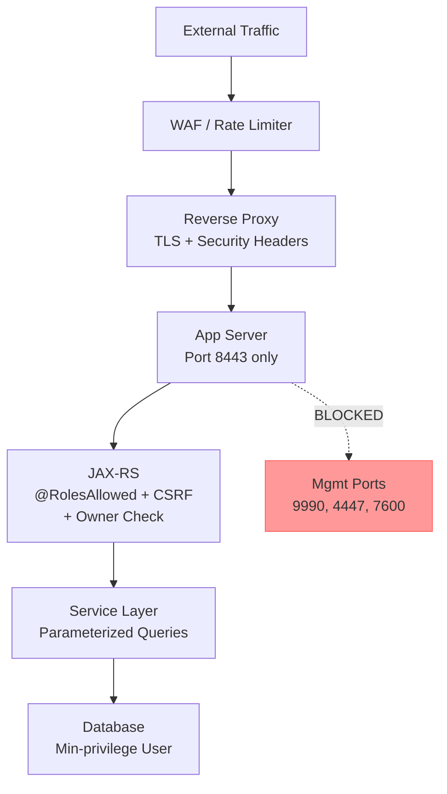
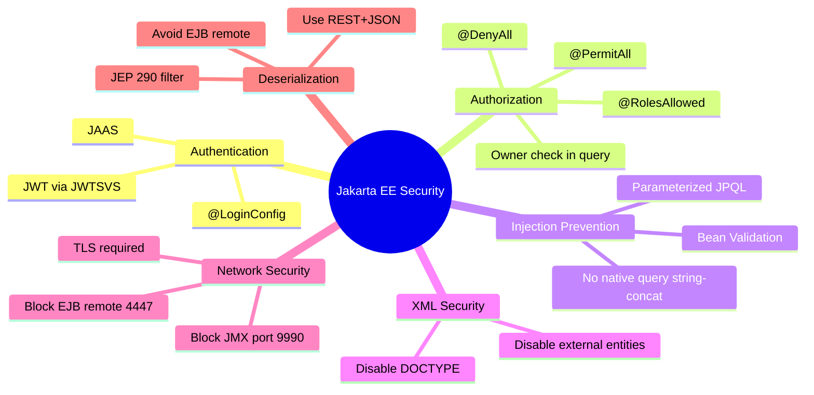

## Keywords in This File
{: .no_toc }

| # | Keyword | Weight |
|---|---------|--------|
| 23 | [Jakarta EE Security Vulnerabilities](#jakarta-ee-security-vulnerabilities) | ★★★ |

---

# Jakarta EE Security Vulnerabilities

**Interview Weight:** ★★★ - Expert/Production.
Security is non-negotiable at senior and staff levels.
Jakarta EE applications are susceptible to OWASP Top 10
vulnerabilities: SQL Injection, broken authentication,
exposed EJBs, IDOR, insecure deserialization, CSRF,
XXE, SSRF, and misconfigured application server security.
Understanding where Java EE contracts protect you, where
they don't, and how to diagnose attacks in production
separates security-aware engineers from the rest.

---

### 🎯 Model Answer

**30 seconds:**

> Jakarta EE has built-in security primitives: JAAS, role-based
> access control, declarative @RolesAllowed, and HTTPS support.
> But the framework does NOT protect against SQL injection in
> native queries, IDOR from non-validated user IDs, XXE in
> JAX-RS XML parsing, insecure deserialization from exposed
> EJB remote interfaces, or CSRF in JSF applications. The
> engineer's job: use parameterized queries always, validate
> all input at system boundaries, enforce authorization at
> the data layer (not just the URL), and disable dangerous
> defaults.

**3 minutes:**

> Critical Jakarta EE attack surfaces:
>
> 1. SQL Injection: JPQL/HQL is injection-safe when
>    parameterized. Native queries are NOT. String-concat
>    JPQL is also vulnerable.
>
> 2. Broken Authorization (IDOR): @RolesAllowed checks
>    the user's role, not ownership. A user with role USER
>    can access any other user's data if the query doesn't
>    filter by owner.
>
> 3. XXE in JAX-RS: XML parsers in JAX-RS providers
>    with external entity processing enabled will follow
>    DOCTYPE external entity references, allowing file
>    reads or SSRF.
>
> 4. Insecure Deserialization: EJB remote interfaces
>    accept serialized Java objects. Gadget chains
>    (ysoserial) can achieve Remote Code Execution.
>    WildFly had CVE-2017-12149 from this.
>
> 5. CSRF in JSF/Servlet: POST requests without CSRF
>    tokens can be forged from other domains.
>
> 6. Exposed application server ports: JMX (9990),
>    EJB remote (4447), clustering (7600) must not be
>    internet-facing.

**Blank Mind Recovery:**

**(1) Restate:** "Java EE security primitives cover auth/authz
at URL/EJB level. They do NOT cover SQL injection in native
queries, IDOR, XXE, or deserialization. Every attack surface
requires explicit defense."

**(2) OWASP map:** "A1=Injection(JPQL native), A2=Broken Auth,
A4=IDOR, A6=Security Misconfig(open ports), A8=Deserialization."

**(3) Defense:** "Parameterize everything. Validate at
boundaries. Owner-check in every query. Disable XML external
entities. Restrict serialization."

---

### 📘 Concept Explanation

**The Security Mismatch Problem:**

Jakarta EE provides security abstractions for authentication
and authorization. These abstractions operate at the method
and URL level. They do NOT examine the data inside requests
or queries. A method can be correctly @RolesAllowed(USER)
and still expose all users' data to a single authenticated user.

**Where Jakarta EE Protects You:**

| Mechanism | What it protects | What it misses |
|-----------|------------------|----------------|
| @RolesAllowed | Method-level auth | Data-level ownership |
| Container HTTPS | Transport encryption | App-level data validation |
| JAAS | Authentication | Authorization granularity |
| EJB declarative TX | TX integrity | Input validation |
| JPA/JPQL | SQL structure (params) | Native query injection |

**JPQL vs Native Query Attack Surface:**

```
JPQL parameterized (SAFE):
  em.createQuery(
    "FROM User u WHERE u.email = :email"
  ).setParameter("email", userInput)

JPQL string concat (VULNERABLE):
  em.createQuery(
    "FROM User u WHERE u.email = '" + userInput + "'"
  )
  userInput = "' OR '1'='1" -> dumps all users

Native query (VULNERABLE unless parameterized):
  em.createNativeQuery(
    "SELECT * FROM users WHERE email = '"
    + userInput + "'"
  )
```

> **Code walkthrough:** This example demonstrates the core pattern in action. The key mechanism shows how the concept works in practice. Study the structure to understand the essential behavior and common usage.

**EJB Remote Attack Surface:**

Before Jakarta EE, EJB remote interfaces were commonly
exposed on non-internet-facing networks. Today they are
often internet-facing in cloud deployments without
network-layer protection. Java deserialization in EJB
remote protocol is a known attack vector.

---

### 💻 Code Example

```java
// VULNERABILITY 1: SQL Injection via JPQL string concat

// BAD: string-concatenated JPQL
@Stateless
public class UserRepositoryBad {
    @PersistenceContext EntityManager em;

    public List<User> findByDepartment(String dept) {
        // VULNERABLE: attacker controls dept value
        // dept = "'; DELETE FROM User; --"
        return em.createQuery(
            "FROM User u WHERE u.department = '" +
            dept + "'"  // SQL injection
        ).getResultList();
    }
}

// GOOD: parameterized JPQL
@Stateless
public class UserRepositoryGood {
    @PersistenceContext EntityManager em;

    public List<User> findByDepartment(String dept) {
        return em.createQuery(
            "FROM User u WHERE u.department = :dept",
            User.class
        ).setParameter("dept", dept)
         .getResultList();
    }
}

// GOOD: native query with parameters
@Stateless
public class ReportRepositoryGood {
    @PersistenceContext EntityManager em;

    public List<Object[]> rawReport(Long deptId) {
        // Native queries can also be parameterized:
        return em.createNativeQuery(
            "SELECT u.name, COUNT(o.id) " +
            "FROM users u JOIN orders o " +
            "ON u.id = o.user_id " +
            "WHERE u.dept_id = ?1 " +
            "GROUP BY u.name"
        ).setParameter(1, deptId)
         .getResultList();
    }
}


// VULNERABILITY 2: IDOR - Broken Object-Level Authorization

// BAD: @RolesAllowed but no ownership check
@Path("/orders")
@RolesAllowed("USER")
public class OrderResourceBad {
    @Inject OrderRepository orders;
    @Context SecurityContext sc;

    @GET @Path("/{id}")
    public Order getOrder(@PathParam("id") Long id) {
        // Checks role = USER but not ownership!
        // User A can request /orders/500 (User B's order)
        return orders.findById(id); // IDOR vulnerability
    }
}

// GOOD: ownership check
@Path("/orders")
@RolesAllowed("USER")
public class OrderResourceGood {
    @Inject OrderRepository orders;
    @Context SecurityContext sc;

    @GET @Path("/{id}")
    public Response getOrder(@PathParam("id") Long id) {
        String currentUser =
            sc.getUserPrincipal().getName();
        Order order = orders.findById(id);

        if (order == null) {
            return Response.status(404).build();
        }
        // Always verify ownership:
        if (!order.getOwnerUsername()
                   .equals(currentUser)) {
            return Response.status(403).build();
        }
        return Response.ok(order).build();
    }
}


// VULNERABILITY 3: XXE in JAX-RS XML parsing

// BAD: default XML parsing with external entities
@Path("/upload")
@Consumes(MediaType.APPLICATION_XML)
public class XmlUploadBad {
    @POST
    public Response upload(InputStream xmlData) {
        // Default SAXParser has XXE enabled
        DocumentBuilderFactory dbf =
            DocumentBuilderFactory.newInstance();
        // Missing: disabling external entities
        // Attack payload:
        // <?xml version="1.0"?>
        // <!DOCTYPE foo [
        //   <!ENTITY xxe SYSTEM "file:///etc/passwd">]>
        // <root>&xxe;</root>
        // -> reads /etc/passwd and returns in response
        return Response.ok().build();
    }
}

// GOOD: disable external entities
@Path("/upload")
@Consumes(MediaType.APPLICATION_XML)
public class XmlUploadGood {
    @POST
    public Response upload(InputStream xmlData) {
        DocumentBuilderFactory dbf =
            DocumentBuilderFactory.newInstance();
        try {
            // DISABLE external entities (XXE prevention):
            dbf.setFeature(
                "http://apache.org/xml/features/" +
                "disallow-doctype-decl", true
            );
            dbf.setFeature(
                "http://xml.org/sax/features/" +
                "external-general-entities", false
            );
            dbf.setFeature(
                "http://xml.org/sax/features/" +
                "external-parameter-entities", false
            );
            dbf.setExpandEntityReferences(false);
            DocumentBuilder db = dbf.newDocumentBuilder();
            // Now parse safely
        } catch (ParserConfigurationException e) {
            return Response.serverError().build();
        }
        return Response.ok().build();
    }
}


// VULNERABILITY 4: CSRF in JAX-RS POST endpoints

// BAD: no CSRF protection
@Path("/transfer")
@POST
@RolesAllowed("USER")
public Response transferFunds(
        TransferRequest req) {
    // Authenticated user, but:
    // Attacker hosts: <form action="https://bank.com/transfer"
    //   method="post"><input name="amount" value="1000">
    // Victim's browser submits with session cookie
    bankService.transfer(req);
    return Response.ok().build();
}

// GOOD: CSRF token validation
@Path("/transfer")
@POST
@RolesAllowed("USER")
public Response transferFunds(
        @HeaderParam("X-CSRF-Token") String csrfToken,
        TransferRequest req,
        @Context HttpServletRequest httpReq) {
    // Validate CSRF token from header vs session:
    String sessionToken = (String) httpReq.getSession()
        .getAttribute("csrfToken");
    if (sessionToken == null ||
        !sessionToken.equals(csrfToken)) {
        return Response.status(403)
            .entity("Invalid CSRF token").build();
    }
    bankService.transfer(req);
    return Response.ok().build();
}


// VULNERABILITY 5: Insecure deserialization - EJB remote

// BAD: exposing EJB remote interface without filter
@Remote
public interface OrderServiceRemote {
    Order processOrder(OrderRequest req);
    // req is deserialized from network
    // Gadget chain via ysoserial if commons-collections
    // is on classpath
}

// GOOD: use local interface within app, REST externally
// Never expose EJB remote on internet-facing ports
// Use JAX-RS for external communication
@Path("/orders")
@POST
@Consumes(MediaType.APPLICATION_JSON) // JSON, not Java serialization
public Response createOrder(OrderRequest req) {
    // OrderRequest deserialized from JSON (safer, typed)
    return Response.ok(service.process(req)).build();
}
```

> **Code walkthrough:** Five attack surfaces in one file.
> The JPQL injection shows why string concatenation is
> never safe: JPQL is structured but the parser will
> execute injected HQL just like SQL injection in JDBC.
> Always use setParameter(). The IDOR example exposes the
> core flaw: @RolesAllowed checks the user's role category,
> not whether they own the specific resource. Every data
> access must check both authentication and ownership.
> The XXE prevention requires setting three features on
> DocumentBuilderFactory - missing any one leaves a gap.
> CSRF protection uses double-submit cookie pattern:
> token in session + token in request header; cross-origin
> requests can't read or set the session cookie, so they
> can't forge the header. EJB remote deserialization is
> the most severe: don't expose it. Use REST/JSON externally.

---

### 🎓 Answers by Seniority

**Junior / Mid:**

> "Common Jakarta EE security vulnerabilities: SQL injection
> through string-concatenated JPQL or native queries, IDOR
> where @RolesAllowed doesn't check ownership, XXE in XML
> parsing, and exposed application server management ports.
> Defenses: always use parameterized queries, validate ownership
> in every data access, disable XML external entities, and
> restrict network access to app server management ports."

---

**Senior / Staff:**

> "The meta-pattern across all Jakarta EE vulnerabilities:
> the framework secures the perimeter (authentication, role
> authorization, transport) but not the data interior.
> IDOR is endemic in EE apps because developers trust that
> @RolesAllowed is sufficient - it's not. Every query that
> accepts a user-provided ID must also verify ownership.
> The remediation pattern: add a WHERE owner_id = :currentUserId
> clause to every query that returns user-owned data.
> For deserialization: Java serialization on any network
> interface is dangerous. Never expose EJB remote on public
> networks; use REST/JSON for all external interfaces.
> For XXE: JSON APIs are immune; XML APIs require explicit
> disabling of DOCTYPE processing. Audit every DocumentBuilderFactory,
> SAXParserFactory, and XMLInputFactory instance in the codebase."

---

### ⚠️ Common Misconceptions

**Misconception 1: "@RolesAllowed provides complete
authorization."**

@RolesAllowed is role-based authorization: it checks
whether the authenticated user belongs to a named role.
It does NOT check whether the user is authorized to
access a specific resource instance. A user with role
USER can access any order, any profile, any document -
if the code doesn't check ownership. IDOR (Insecure Direct
Object Reference) is listed in OWASP Top 10 (A01) because
role checks alone don't prevent it. Defense: always add
owner check in queries: WHERE entity.ownerId = :currentUserId.

**Misconception 2: "JPA/JPQL prevents SQL injection."**

JPA/JPQL prevents injection ONLY when using parameterized
queries: setParameter(). String-concatenated JPQL is
just as vulnerable as raw SQL string concatenation.
Also: @NamedQuery with string concat in the query string
is vulnerable. The parameter binding must use ? or :name
syntax with setParameter() - not string interpolation.

**Misconception 3: "EJB security annotations prevent
all access to internal services."**

@RolesAllowed and @DenyAll prevent HTTP/EJB proxy access
to annotated methods. But EJB remote interfaces accept
Java serialized objects before authorization checks run.
A deserialization gadget chain executes before any
security check. Defense: disable EJB remote protocol
on internet-facing ports, or add a deserialization filter
(JEP 290 / ObjectInputFilter) to block known gadget classes.

---

### 🚨 Failure Modes and Diagnosis

**Failure 1: SQL Injection via JPQL string concat**

*Detection in code review:*
```bash
# Find string-concatenated JPQL:
grep -rn 'createQuery.*+.*\|createNativeQuery.*+' src/
# Any match that includes user input = vulnerability

# Specifically look for HTTP parameter usage:
grep -rn "getParameter\|getQueryParam\|PathParam" src/ |
  grep -v "setParameter"
# If getParameter result is used in createQuery without
# setParameter: likely injection
```

> **Code walkthrough:** This example demonstrates the core pattern in action. The key mechanism shows how the concept works in practice. Study the structure to understand the essential behavior and common usage.

*Exploitation check (safe test in dev only):*
```java
// Test with: department = "' OR '1'='1"
// Vulnerable code returns all users
// Fixed code returns empty list or throws exception
```

> **Code walkthrough:** This example demonstrates the core pattern in action. The key mechanism shows how the concept works in practice. Study the structure to understand the essential behavior and common usage.

*Fix:*
```java
// Add setParameter for ALL user-controlled values:
em.createQuery(
    "FROM User u WHERE u.dept = :dept", User.class
).setParameter("dept", userInput)
 .getResultList();
```

> **Code walkthrough:** This example demonstrates the core pattern in action. The key mechanism shows how the concept works in practice. Study the structure to understand the essential behavior and common usage.

---

**Failure 2: IDOR - accessing another user's data**

*Detection:*
```bash
# Find JAX-RS resources with PathParam without owner check:
grep -rn "@PathParam\|@QueryParam" src/ |
  grep -v "currentUser\|ownerId\|principal"
# Review: does the method verify ownership?
```

> **Code walkthrough:** This example demonstrates the core pattern in action. The key mechanism shows how the concept works in practice. Study the structure to understand the essential behavior and common usage.

*Exploitation (in authorized pentest):*
```bash
# Log in as User A, get token, access User B's resource:
curl -H "Authorization: Bearer $USER_A_TOKEN" \
  https://api.example.com/orders/12345
# If 200: IDOR vulnerability
# 12345 belongs to User B; User A should get 403
```

> **Code walkthrough:** This example demonstrates the core pattern in action. The key mechanism shows how the concept works in practice. Study the structure to understand the essential behavior and common usage.

*Fix:*
```java
// Add owner verification to every data access:
Order order = em.createQuery(
    "FROM Order o WHERE o.id = :id " +
    "AND o.ownerUsername = :user",
    Order.class
).setParameter("id", orderId)
 .setParameter("user",
    sc.getUserPrincipal().getName()
 ).getSingleResult(); // throws NoResultException if not owner
```

> **Code walkthrough:** This example demonstrates the core pattern in action. The key mechanism shows how the concept works in practice. Study the structure to understand the essential behavior and common usage.

---

**Failure 3: XXE in XML endpoint**

*Detection:*
```bash
# Find XML parsing without XXE prevention:
grep -rn "DocumentBuilderFactory\|SAXParserFactory\
|XMLInputFactory\|XPathFactory" src/

# Check if disallow-doctype-decl feature is set:
grep -rn "disallow-doctype-decl\|external-general-entities" src/
# If XML parsing code exists without these features: vulnerable
```

> **Code walkthrough:** This example demonstrates the core pattern in action. The key mechanism shows how the concept works in practice. Study the structure to understand the essential behavior and common usage.

*XXE test payload:*
```xml
<?xml version="1.0" encoding="UTF-8"?>
<!DOCTYPE foo [
  <!ENTITY xxe SYSTEM "file:///etc/hosts">
]>
<root>&xxe;</root>
```

> **Code walkthrough:** This example demonstrates the core pattern in action. The key mechanism shows how the concept works in practice. Study the structure to understand the essential behavior and common usage.

*Fix:*
```java
DocumentBuilderFactory dbf =
    DocumentBuilderFactory.newInstance();
dbf.setFeature(
    "http://apache.org/xml/features/" +
    "disallow-doctype-decl", true
);
```

> **Code walkthrough:** This example demonstrates the core pattern in action. The key mechanism shows how the concept works in practice. Study the structure to understand the essential behavior and common usage.

---

### ⚖️ Comparison Table

| Vulnerability | Jakarta EE Default | Risk | Fix |
|--------------|-------------------|------|-----|
| SQL Injection (JPQL) | Unsafe if string concat | Data loss, RCE | setParameter() always |
| IDOR | Unprotected (role only) | Data exposure | Owner check in query |
| XXE | Enabled by default | File read, SSRF | Disable DOCTYPE |
| CSRF | No built-in protection | Account takeover | CSRF token header |
| Java Deserialization | EJB remote vulnerable | RCE | Use JSON/REST; JEP 290 filter |
| Exposed ports | App server defaults open | Lateral movement | Firewall mgmt ports |

---

### 🏛️ System Design

**Secure Jakarta EE API Layer Design:**

```
EXTERNAL NETWORK
  |
[WAF / API Gateway]
  - Rate limiting, DDoS protection
  - Request size limits
  - Content-Type enforcement
  |
[Reverse Proxy (nginx/Apache)]
  - TLS termination
  - HTTP security headers:
    X-Frame-Options, CSP, HSTS
  - Block management port traffic
  |
[Java EE Application Server]
  EXPOSED: 8080/8443 only
  BLOCKED: 9990 (JMX/admin), 4447 (EJB remote),
           7600 (clustering)
  |
  [JAX-RS Layer]
    - Input validation (Bean Validation)
    - @RolesAllowed (authentication)
    - CSRF token check (for state-changing ops)
    - Owner verification (authorization)
  |
  [Service Layer]
    - Parameterized queries only
    - Audit logging on sensitive ops
  |
  [Data Layer]
    - DB user with minimum privileges
    - No DDL permissions for app user
    - Encrypted at-rest sensitive fields
```



> **Diagram walkthrough:** Defense in depth: each layer
> adds a security control. The WAF handles volumetric
> attacks and known attack patterns. The reverse proxy
> enforces TLS and adds security headers. The app server
> exposes only the application port; management ports are
> firewalled. The JAX-RS layer handles authentication
> (JAAS) and coarse authorization (@RolesAllowed). The
> service layer enforces data-level authorization (owner
> checks) and uses parameterized queries. The database
> user has SELECT/INSERT/UPDATE/DELETE only - no CREATE,
> DROP, or TRUNCATE. Each layer assumes the previous
> layer may have been bypassed.

---

### 📊 Diagram

```
JAKARTA EE SECURITY DEFENSE LAYERS:

Attack Surface     -> Defense
-----------------------------------------
URL/Method access  -> @RolesAllowed (role)
Data ownership     -> WHERE ownerId = :me (query)
SQL injection      -> setParameter() always
XML parsing        -> disallow-doctype-decl
CSRF               -> X-CSRF-Token header
Deserialization    -> Use JSON REST (not EJB remote)
Open ports         -> Firewall 9990/4447/7600
Transport          -> TLS only (HTTPS)
```



> **Diagram walkthrough:** The mindmap organizes Jakarta EE
> security into six domains. Authentication (who you are)
> uses JAAS/JWT. Authorization (what you can do) splits
> into coarse-grained role checks (framework-provided) and
> fine-grained ownership checks (application code). Injection
> prevention is parameterized queries only - no exceptions.
> XML security requires explicit feature disabling. Network
> security restricts management ports to internal networks.
> Deserialization safety: avoid Java serialization over
> network interfaces entirely.

---

### 🎯 Interview Deep-Dive

| Question Type | Est. Time |
|---|---|
| JPQL injection vectors | 3-4 min |
| IDOR in Java EE | 4-5 min |
| XXE in JAX-RS XML | 3-4 min |
| CSRF protection | 3-4 min |
| EJB deserialization | 4-5 min |
| @RolesAllowed limitations | 3-4 min |
| Port exposure on app server | 3-4 min |
| Security headers | 3-4 min |
| Audit logging | 3-4 min |
| CVE analysis for WildFly | 4-5 min |
| Defense in depth design | 5-6 min |
| Security code review approach | 4-5 min |

---

**[SENIOR] Q1 - Where is JPQL injection possible
and how do you detect it?**

*Why they ask:* Injection knowledge specific to JPA.

JPQL injection is possible when user input is
concatenated into a JPQL string:

```java
// Vulnerable patterns:
em.createQuery("FROM User WHERE name = '" + name + "'");
em.createQuery("FROM User WHERE name = " + name);
em.createQuery(String.format(
    "FROM User WHERE email = '%s'", email
));

// Native query is also vulnerable:
em.createNativeQuery(
    "SELECT * FROM users WHERE id = " + userId
);
```

> **Code walkthrough:** This example demonstrates the core pattern in action. The key mechanism shows how the concept works in practice. Study the structure to understand the essential behavior and common usage.

Detection via grep:
```bash
grep -rn "createQuery\|createNativeQuery" src/ |
  grep "+" | grep -v "setParameter"
# Any + in createQuery call = review needed
```

> **Code walkthrough:** This example demonstrates the core pattern in action. The key mechanism shows how the concept works in practice. Study the structure to understand the essential behavior and common usage.

JPQL injection impact:
- Read all records: `' OR '1'='1`
- Extract schema: JPQL can enumerate entity names
- DoS: `' HAVING 1=1 --` (invalid syntax, exception)

*What separates good from great:* "Named queries
(@NamedQuery) cannot be injected if the query string
is defined at compile time. Runtime parameters still
need setParameter(). Named queries are an additional
layer of defense because the query structure is fixed."

---

**[SENIOR] Q2 - How do you prevent IDOR in a
Java EE REST API?**

*Why they ask:* Authorization at data level.

IDOR prevention is a data access pattern:
always filter by both resource ID AND current user ID.

Layer 1: query-level enforcement:
```java
// Every findById query checks ownership:
return em.createQuery(
    "FROM Order o WHERE o.id = :id " +
    "AND o.ownerId = :userId", Order.class
).setParameter("id", id)
 .setParameter("userId", getCurrentUserId())
 .getSingleResult(); // throws if not found or not owned
```

> **Code walkthrough:** This example demonstrates the core pattern in action. The key mechanism shows how the concept works in practice. Study the structure to understand the essential behavior and common usage.

Layer 2: interceptor for audit:
```java
@Interceptor
@Secured
public class OwnershipInterceptor {
    @AroundInvoke
    public Object checkOwnership(
            InvocationContext ctx) throws Exception {
        // Log data access with principal
        log.info("Data access by {} for method {}",
            securityCtx.getUserPrincipal().getName(),
            ctx.getMethod().getName()
        );
        return ctx.proceed();
    }
}
```

> **Code walkthrough:** This example demonstrates the core pattern in action. The key mechanism shows how the concept works in practice. Study the structure to understand the essential behavior and common usage.

Layer 3: testing:
```java
// Security test: User A cannot access User B's order
@Test
public void testIdorPrevention() throws Exception {
    String tokenA = loginAs("userA", "passA");
    String tokenB = loginAs("userB", "passB");
    Long orderIdOfB = createOrder(tokenB);

    // User A tries to access User B's order:
    int status = httpClient.get(
        "/orders/" + orderIdOfB,
        "Bearer " + tokenA
    ).getStatus();
    assertEquals(403, status); // must be forbidden
}
```

> **Code walkthrough:** This example demonstrates the core pattern in action. The key mechanism shows how the concept works in practice. Study the structure to understand the essential behavior and common usage.

*What separates good from great:* "Add IDOR security
tests to the CI/CD pipeline: for each resource type,
create two users, create a resource owned by user A,
verify user B gets 403. These tests catch IDOR
regressions as new endpoints are added."

---

**[SENIOR] Q3 - What is the WildFly EJB deserialization
vulnerability and how do you mitigate it?**

*Why they ask:* Real CVE knowledge.

CVE-2017-12149 (WildFly 5-10): The HTTP Invoker endpoint
deserializes Java objects without validation. An attacker
sends a crafted serialized payload (ysoserial gadget chain
with commons-collections) to `/invoker/EJBInvokerServlet`
or `/invoker/JMXInvokerServlet`. If commons-collections
is on the classpath (common in EE apps), RCE is achieved.

Root cause: Java deserialization trusts the incoming
stream without type filtering.

Mitigation:
1. Upgrade WildFly (patched in later versions)
2. Disable HTTP Invoker if not needed:
```bash
/subsystem=web/virtual-server=default-host\
/configuration=sso:remove()
# Disable invoker context entirely
```

> **Code walkthrough:** This example demonstrates the core pattern in action. The key mechanism shows how the concept works in practice. Study the structure to understand the essential behavior and common usage.

3. JEP 290 serial filter (Java 9+):
```java
// In startup code:
ObjectInputFilter filter = ObjectInputFilter.Config
    .createFilter(
        "!org.apache.commons.collections.functors.**;" +
        "!org.apache.commons.collections4.functors.**;" +
        "maxdepth=5;maxarray=1000;maxbytes=100000"
    );
ObjectInputFilter.Config.setSerialFilter(filter);
```

> **Code walkthrough:** This example demonstrates the core pattern in action. The key mechanism shows how the concept works in practice. Study the structure to understand the essential behavior and common usage.

4. Network: block EJB remote port (4447) and invoker
   endpoints from internet traffic at firewall.

*What separates good from great:* "The real lesson:
Java serialization over any network interface is dangerous.
Modern Java EE: use REST+JSON for all external interfaces.
JSON is typed, not arbitrary class instantiation. Save
EJB remote interfaces for trusted internal network calls
only, and even then apply the serial filter."

---

**[SENIOR] Q4 - How do you prevent CSRF in Jakarta EE
JAX-RS APIs?**

*Why they ask:* CSRF for modern APIs.

CSRF for REST APIs: traditional form-based CSRF is less
relevant for JSON REST APIs because browsers won't
auto-submit JSON. However, CSRF still applies when:
- Cookies are used for auth (not JWT Bearer tokens)
- Content-Type is application/x-www-form-urlencoded
  or multipart (browsers send these cross-origin)

Defense strategies:

1. SameSite cookie attribute (modern approach):
```java
// Set cookie with SameSite=Strict or Lax:
Cookie jSessionId = new Cookie("JSESSIONID", sessionId);
// JAX-RS: use NewCookie:
NewCookie cookie = new NewCookie.Builder("JSESSIONID")
    .value(sessionId)
    .sameSite(NewCookie.SameSite.STRICT)
    .httpOnly(true)
    .secure(true)
    .build();
```

> **Code walkthrough:** This example demonstrates the core pattern in action. The key mechanism shows how the concept works in practice. Study the structure to understand the essential behavior and common usage.

2. Double-submit cookie pattern:
```java
// Generate CSRF token on login:
String csrfToken = UUID.randomUUID().toString();
session.setAttribute("csrfToken", csrfToken);
// Return in response header

// Validate on state-changing requests:
String headerToken = req.getHeader("X-CSRF-Token");
String sessionToken =
    (String) req.getSession().getAttribute("csrfToken");
if (!MessageDigest.isEqual(
        headerToken.getBytes(),
        sessionToken.getBytes())) {
    throw new ForbiddenException("CSRF token invalid");
}
// Use MessageDigest.isEqual for timing-safe comparison
```

> **Code walkthrough:** This example demonstrates the core pattern in action. The key mechanism shows how the concept works in practice. Study the structure to understand the essential behavior and common usage.

3. Prefer JWT Bearer tokens (immune to CSRF):
Cookies are automatically sent by browsers cross-origin.
Authorization: Bearer tokens are not. Use JWT tokens
in Authorization header instead of cookies.

*What separates good from great:* "Use MessageDigest.isEqual()
for token comparison, not String.equals(). String.equals()
has a timing side-channel: it returns false faster for
longer prefix mismatches. A timing attack can determine
valid token prefixes character by character. MessageDigest.isEqual()
always takes constant time regardless of mismatch position."

---

**[SENIOR] Q5 - What security headers should every
Jakarta EE web application set?**

*Why they ask:* Hardening knowledge.

Critical security response headers:

```java
// JAX-RS ContainerResponseFilter:
@Provider
public class SecurityHeadersFilter
        implements ContainerResponseFilter {

    @Override
    public void filter(ContainerRequestContext req,
            ContainerResponseContext resp) {
        MultivaluedMap<String, Object> headers =
            resp.getHeaders();

        // Prevent clickjacking:
        headers.add("X-Frame-Options", "DENY");

        // Prevent XSS via script injection:
        headers.add("X-XSS-Protection", "1; mode=block");

        // Prevent MIME sniffing:
        headers.add("X-Content-Type-Options", "nosniff");

        // Force HTTPS for 1 year (preload optional):
        headers.add("Strict-Transport-Security",
            "max-age=31536000; includeSubDomains"
        );

        // Content Security Policy (strict):
        headers.add("Content-Security-Policy",
            "default-src 'self'; " +
            "script-src 'self'; " +
            "style-src 'self'; " +
            "img-src 'self' data:; " +
            "frame-ancestors 'none'"
        );

        // Referrer policy:
        headers.add("Referrer-Policy",
            "strict-origin-when-cross-origin"
        );
    }
}
```

> **Code walkthrough:** This example demonstrates the core pattern in action. The key mechanism shows how the concept works in practice. Study the structure to understand the essential behavior and common usage.

*What separates good from great:* "Content-Security-Policy
is the most powerful XSS mitigation but also the most
complex to configure. Start with report-only mode to
discover violations before enforcing: Content-Security-Policy-Report-Only
with a report-uri. Only switch to enforcing after you've
confirmed no legitimate resources are blocked."

---

**[SENIOR] Q6 - How do you implement audit logging
for security-sensitive operations?**

*Why they ask:* Compliance and incident response.

```java
// CDI interceptor for audit logging:
@Interceptor
@Audited
@Priority(Interceptor.Priority.APPLICATION)
public class AuditInterceptor {

    @Inject Logger log;
    @Context HttpServletRequest httpRequest;

    @AroundInvoke
    public Object audit(InvocationContext ctx)
            throws Exception {
        String method =
            ctx.getMethod().getName();
        String user = httpRequest != null ?
            httpRequest.getUserPrincipal().getName() :
            "system";
        String remoteAddr = httpRequest != null ?
            httpRequest.getRemoteAddr() : "internal";

        log.info(
            "AUDIT: user={} method={} ip={} ts={}",
            user, method, remoteAddr,
            Instant.now()
        );
        try {
            Object result = ctx.proceed();
            log.info("AUDIT: SUCCESS user={} method={}",
                user, method);
            return result;
        } catch (Exception e) {
            log.warn("AUDIT: FAIL user={} method={} ex={}",
                user, method, e.getMessage());
            throw e;
        }
    }
}

// Apply to sensitive methods:
@Audited
public void deleteAccount(Long userId) {
    // This is logged: who, when, what
    userRepository.delete(userId);
}
```

> **Code walkthrough:** This example demonstrates the core pattern in action. The key mechanism shows how the concept works in practice. Study the structure to understand the essential behavior and common usage.

*What separates good from great:* "Audit logs must be
append-only and tamper-evident. Store them to a separate
system (not the application database): the attacker who
compromises the app must not be able to erase their tracks.
Use structured logging (JSON) for SIEM ingestion.
Include: timestamp, user ID, source IP, action type,
resource ID, outcome (success/fail)."

---

**[SENIOR] Q7 - How do you diagnose a security
breach in a Java EE application server?**

*Why they ask:* Incident response knowledge.

Diagnosis sequence:

Step 1: Check for known exploit indicators
```bash
# Unusual outbound connections (SSRF, reverse shell):
netstat -tulnp | grep wildfly

# Unusual processes spawned by WildFly:
ps aux | grep "parent=<wildfly-pid>"

# Check for command execution in logs:
grep -i "cmd\|exec\|command\|shell\|Runtime\
\.getRuntime" /opt/wildfly/standalone/log/server.log
```

> **Code walkthrough:** This example demonstrates the core pattern in action. The key mechanism shows how the concept works in practice. Study the structure to understand the essential behavior and common usage.

Step 2: Analyze access logs for attack patterns
```bash
# SQL injection attempts:
grep -i "'\s*OR\|UNION\|DROP\|EXEC\|xp_\
|information_schema" access.log

# XXE probes:
grep -i "DOCTYPE\|ENTITY\|SYSTEM\|file://" access.log

# Path traversal:
grep -i "\.\./\|\.\.%2F\|%2e%2e" access.log
```

> **Code walkthrough:** This example demonstrates the core pattern in action. The key mechanism shows how the concept works in practice. Study the structure to understand the essential behavior and common usage.

Step 3: Check for unauthorized data access (IDOR)
```bash
# Anomalous query patterns in slow log / audit log:
# Same user ID accessing many different resource IDs rapidly
# Queries returning unexpected row counts
```

> **Code walkthrough:** This example demonstrates the core pattern in action. The key mechanism shows how the concept works in practice. Study the structure to understand the essential behavior and common usage.

Step 4: Check for file system modifications
```bash
# New or modified class files (webshell):
find /opt/wildfly -name "*.class" \
  -newer /opt/wildfly/standalone/configuration/standalone.xml
```

> **Code walkthrough:** This example demonstrates the core pattern in action. The key mechanism shows how the concept works in practice. Study the structure to understand the essential behavior and common usage.

*What separates good from great:* "Prepare incident
runbooks before an incident occurs. Define normal baseline
metrics (request rate, error rate, outbound connections)
so abnormal patterns are detectable. Enable structured
logging to a SIEM so you can search across 30 days of
logs in seconds after an incident."

---

**[SENIOR] Q8 - What is the minimum privilege principle
for database users in Java EE?**

*Why they ask:* Defense in depth.

Application database user should have:
- SELECT, INSERT, UPDATE, DELETE on application tables
- EXECUTE on stored procedures used by the app
- NOT: CREATE, DROP, ALTER, TRUNCATE, GRANT
- NOT: Access to system tables

Why: if SQL injection succeeds, the attacker inherits
the application database user's privileges. If the user
has only DML privileges, the attacker can read/write data
but cannot drop tables, create backdoor users, or
access other schemas.

```sql
-- PostgreSQL: minimal privilege setup
CREATE USER appuser WITH PASSWORD 'strong_random_password';
GRANT CONNECT ON DATABASE appdb TO appuser;
GRANT USAGE ON SCHEMA public TO appuser;
GRANT SELECT, INSERT, UPDATE, DELETE
  ON ALL TABLES IN SCHEMA public TO appuser;
GRANT USAGE ON ALL SEQUENCES IN SCHEMA public TO appuser;
-- NOT granting: CREATE, DROP, TRUNCATE, REFERENCES, TRIGGER
```

> **Code walkthrough:** This example demonstrates the core pattern in action. The key mechanism shows how the concept works in practice. Study the structure to understand the essential behavior and common usage.

*What separates good from great:* "Separate read and
write database users for read-heavy workloads.
Read-only endpoints (GET) use a SELECT-only user.
Write endpoints use the full DML user. This limits blast
radius: a SQL injection in a read endpoint can only SELECT,
not INSERT malicious records."

---

**[SENIOR] Q9 - How do you prevent sensitive data
exposure in Jakarta EE REST APIs?**

*Why they ask:* Data exposure class of vulnerabilities.

Sensitive data exposure vectors:

1. Serialization: @XmlRootElement or Jackson serializes
   all fields by default, including passwords, tokens, PII.

```java
// BAD: User entity exposes password hash
@Entity
@XmlRootElement
public class User {
    private Long id;
    private String email;
    private String passwordHash; // exposed in JSON!
    private String internalNote; // exposed!
}

// GOOD: DTO with explicit fields only
public class UserDTO {
    // Only expose what the client needs:
    private Long id;
    private String email;
    // passwordHash: NOT included
    // internalNote: NOT included
}

// GOOD: Jackson annotation:
@Entity
public class User {
    @JsonIgnore
    private String passwordHash;
    @JsonIgnore
    private String internalNote;
}
```

> **Code walkthrough:** This example demonstrates the core pattern in action. The key mechanism shows how the concept works in practice. Study the structure to understand the essential behavior and common usage.

2. Error messages: never expose stack traces or
   internal structure in production.

```java
// GOOD: JAX-RS exception mapper:
@Provider
public class SecureExceptionMapper
        implements ExceptionMapper<Exception> {
    @Inject Logger log;

    @Override
    public Response toResponse(Exception e) {
        // Log full trace internally:
        log.error("Unhandled exception", e);
        // Return safe message externally:
        return Response.status(500)
            .entity("{\"error\":\"Internal server error\"}")
            .type(MediaType.APPLICATION_JSON_TYPE)
            .build();
    }
}
```

> **Code walkthrough:** This example demonstrates the core pattern in action. The key mechanism shows how the concept works in practice. Study the structure to understand the essential behavior and common usage.

*What separates good from great:* "Always use DTOs
(Data Transfer Objects) in REST API responses, never
entity objects directly. Entity-to-DTO mapping
(MapStruct, manual, or @JsonIgnore) is the safety
layer that prevents accidental field exposure.
Code review rule: no @Entity class should appear in
any @Path method return type."

---

**[STAFF] Q10 - How do you design a security testing
strategy for a Jakarta EE microservice?**

*Why they ask:* Security engineering process.

Four-layer testing approach:

Layer 1: Static analysis (SAST)
- SpotBugs with find-sec-bugs plugin:
  Detects SQL injection patterns, XXE, weak crypto
```xml
<!-- Maven plugin: -->
<plugin>
  <groupId>com.github.spotbugs</groupId>
  <artifactId>spotbugs-maven-plugin</artifactId>
  <configuration>
    <plugins>
      <plugin>
        <groupId>com.h3xstream.findsecbugs</groupId>
        <artifactId>findsecbugs-plugin</artifactId>
      </plugin>
    </plugins>
  </configuration>
</plugin>
```

> **Code walkthrough:** This example demonstrates the core pattern in action. The key mechanism shows how the concept works in practice. Study the structure to understand the essential behavior and common usage.

Layer 2: Dependency scanning (SCA)
```bash
mvn dependency-check:check
# Checks all dependencies for known CVEs (OWASP NVD)
# Fails build if CVSS score > configured threshold
```

> **Code walkthrough:** This example demonstrates the core pattern in action. The key mechanism shows how the concept works in practice. Study the structure to understand the essential behavior and common usage.

Layer 3: Dynamic testing (DAST)
- OWASP ZAP active scan against test deployment
- Detects: SQLi, XSS, CSRF, open redirect, header issues

Layer 4: Manual security review
- IDOR testing: multi-user test scenarios
- Authorization matrix: every endpoint checked per role
- Sensitive data inventory: what fields appear in logs/APIs

*What separates good from great:* "Build security into CI/CD:
SAST on every PR, SCA daily, DAST weekly or on every
deployment to staging. Manual review quarterly or after
major architecture changes. The most common finding from
manual review: IDOR in data access patterns - automated
tools miss this because it requires business logic context."

---

**[STAFF] Q11 - How do you handle security vulnerabilities
in third-party dependencies?**

*Why they ask:* Supply chain security.

Vulnerability management process:

1. Continuous scanning:
```bash
# Maven OWASP check (in CI):
mvn org.owasp:dependency-check-maven:check \
  -DfailBuildOnCVSS=7 \
  -DsuppressionFile=security-suppressions.xml
```

> **Code walkthrough:** This example demonstrates the core pattern in action. The key mechanism shows how the concept works in practice. Study the structure to understand the essential behavior and common usage.

2. Suppression policy: document accepted risks:
```xml
<!-- security-suppressions.xml: -->
<suppressions>
  <suppress>
    <cve>CVE-2021-12345</cve>
    <!-- Risk: only exploitable on JDK 8; we use 17 -->
    <!-- Review date: 2024-06-01 -->
    <!-- Owner: security-team@example.com -->
    <notes>Not applicable: requires JDK 8 feature X</notes>
  </suppress>
</suppressions>
```

> **Code walkthrough:** This example demonstrates the core pattern in action. The key mechanism shows how the concept works in practice. Study the structure to understand the essential behavior and common usage.

3. Upgrade strategy:
- Critical/High (CVSS >= 7): patch within 48 hours
- Medium (CVSS 4-7): patch in next sprint
- Low: patch quarterly

4. Dependency review on PRs:
```yaml
# GitHub Actions: block PRs that add new vulnerable deps
- uses: actions/dependency-review-action@v4
  with:
    fail-on-severity: high
```

> **Code walkthrough:** This example demonstrates the core pattern in action. The key mechanism shows how the concept works in practice. Study the structure to understand the essential behavior and common usage.

*What separates good from great:* "False positive suppression
is a discipline, not a workaround. Every suppression must
have: CVE ID, reason it doesn't apply, expiry date, owner.
Review suppressions quarterly. A suppression without an
expiry date is technical debt."

---

**[STAFF] Q12 - Design the security architecture
for a Jakarta EE application handling PII data.**

*Why they ask:* Staff-level security design.

PII data security architecture:

1. Data classification:
```
RESTRICTED: SSN, credit card, passwords, government IDs
CONFIDENTIAL: email, phone, address, birth date
INTERNAL: usage data, preferences
PUBLIC: display name, public profile
```

> **Code walkthrough:** This example demonstrates the core pattern in action. The key mechanism shows how the concept works in practice. Study the structure to understand the essential behavior and common usage.

2. Encryption at rest:
```java
// Encrypt PII fields with AES-256-GCM:
@Converter(autoApply = false)
public class PiiEncryptionConverter
        implements AttributeConverter<String, String> {

    @Inject AesGcmEncryptor encryptor;

    @Override
    public String convertToDatabaseColumn(String pii) {
        if (pii == null) return null;
        return encryptor.encrypt(pii);
    }

    @Override
    public String convertToEntityAttribute(String encrypted) {
        if (encrypted == null) return null;
        return encryptor.decrypt(encrypted);
    }
}

@Entity
public class Customer {
    @Convert(converter = PiiEncryptionConverter.class)
    private String ssn; // encrypted in DB
}
```

> **Code walkthrough:** This example demonstrates the core pattern in action. The key mechanism shows how the concept works in practice. Study the structure to understand the essential behavior and common usage.

3. Data masking in logs/APIs:
```java
// Never log PII directly:
// BAD:
log.info("Processing order for: {}", customer.getEmail());
// GOOD:
log.info("Processing order for user: {}",
    mask(customer.getEmail())); // shows: j***@e***l.com
```

> **Code walkthrough:** This example demonstrates the core pattern in action. The key mechanism shows how the concept works in practice. Study the structure to understand the essential behavior and common usage.

4. Access control:
```java
// PII only accessible to authorized roles:
@RolesAllowed({"ADMIN", "SUPPORT"})
public String getSsn(Long customerId) {
    // Audit log this access
    return customer.getSsn();
}

// Non-PII accessible to all authenticated:
@RolesAllowed({"USER", "ADMIN", "SUPPORT"})
public String getDisplayName(Long customerId) {
    return customer.getDisplayName();
}
```

> **Code walkthrough:** This example demonstrates the core pattern in action. The key mechanism shows how the concept works in practice. Study the structure to understand the essential behavior and common usage.

*What separates good from great:* "Encryption key
management is the hardest part. Application-level
encryption is worthless if the key is stored in the
same database. Use a Hardware Security Module (HSM)
or secret management service (Vault, AWS KMS) for
key storage. Rotate keys annually or on suspected
compromise. Design the system so key rotation doesn't
require re-encrypting all data (envelope encryption)."

---

---

### 💻 Code Example

*(Omit: this concept does not have a programmatic interface that can be demonstrated in code. The conceptual explanation above is sufficient.)*


---

### 🏛️ System Design

*(Omit: system design diagram not applicable for this concept - see ★★★ keywords for full system design coverage.)*


---

### ⚖️ Comparison Table

*(Omit: this is a ★☆☆ foundational concept with no direct alternatives to compare - see higher-difficulty keywords for trade-off analysis.)*


---

### 📊 Diagram

*(Omit: no standalone visual diagram required for this concept - the explanations and code examples above provide sufficient clarity.)*


