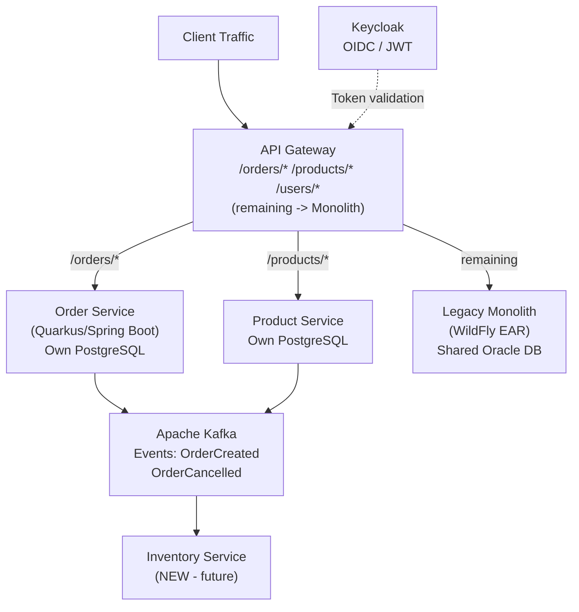
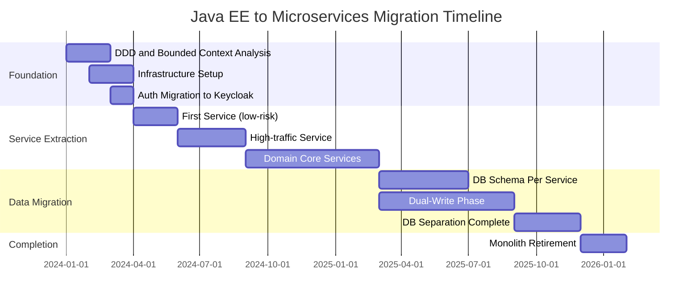

## Keywords in This File
{: .no_toc }

| # | Keyword | Weight |
|---|---------|--------|
| 25 | [Migrating from Java EE to Microservices](#migrating-from-java-ee-to-microservices) | ★★★ |

---

# Migrating from Java EE to Microservices

**Interview Weight:** ★★★ - Architect/Staff level.
Migrating a monolithic Java EE application to microservices
is one of the most complex and high-risk architectural
undertakings. This topic requires understanding domain-driven
design, the strangler fig pattern, distributed system pitfalls,
data migration, and organizational readiness - not just
technical frameworks. Staff and principal engineers are
expected to lead this process and speak to failures, not
just successes.

---

### 🎯 Model Answer

**30 seconds:**

> Java EE to microservices migration is not a framework
> swap - it's a distributed systems transformation. The
> safest approach is the Strangler Fig pattern: new
> microservices absorb one bounded context at a time
> behind an API gateway, while the monolith continues
> running. Key risks: distributed transactions (ACID is gone),
> network latency replacing method calls, and operational
> complexity explosion (observability, discovery, deployment).
> The most common failure: migrating the architecture without
> migrating the team's capabilities.

**3 minutes:**

> Migration strategy framework:
>
> Phase 1 - Assessment (2-4 weeks):
> - Identify bounded contexts (DDD)
> - Measure coupling: class dependency analysis
> - Identify shared state: shared database tables, shared
>   CDI beans, shared EJB state
> - Catalog cross-cutting concerns: auth, logging, tracing
>
> Phase 2 - Foundation (4-8 weeks):
> - Build infrastructure: container platform, service registry,
>   API gateway, centralized logging, distributed tracing
> - Migrate auth to token-based (JWT/OIDC)
> - Build first microservice: low-risk, bounded context
>   with no dependencies on other future services
>
> Phase 3 - Incremental extraction (ongoing):
> - Extract one bounded context per sprint (2-week cycles)
> - Deploy behind API gateway at same URL (strangler fig)
> - Keep monolith live for rest of features
> - Each extracted service has its own database
>
> Phase 4 - Data separation:
> - Hardest step: split shared database
> - Use event sourcing or CQRS to decouple reads
> - Synchronization period: new service writes to own DB
>   and publishes events; monolith reads from events
>
> ACID to BASE transition:
> - Java EE: @TransactionAttribute guarantees ACID
> - Microservices: network calls, no 2PC
> - Patterns: Saga (choreography or orchestration),
>   Outbox pattern, idempotent consumers

**Blank Mind Recovery:**

**(1) Restate:** "Strangler fig: extract one bounded context
at a time. Route old paths through new service via API
gateway. Monolith shrinks, services grow."

**(2) Key risk:** "Distributed transactions gone. Each service
must handle its own ACID. Cross-service consistency = eventual."

**(3) Failure pattern:** "Big bang migration = guaranteed failure.
Incremental = survivable."

---

### 📘 Concept Explanation

**Why Java EE Monoliths Accumulate Coupling:**

Java EE's strengths become migration obstacles:
- EJBs call each other by injection (@EJB): no network boundary
- Shared database: all entities visible to all EJBs
- Container-managed transactions: span multiple EJB calls trivially
- CDI beans share state within container: easy, but tight coupling

When you try to extract a service:
- The EJB calls are replaced with HTTP (latency, fallback needed)
- Shared DB must be split (data ownership established)
- Transactions must become Sagas (consistency model changes)
- CDI shared state must become either service state or events

**The Strangler Fig Pattern:**

```
PHASE 1: Everything in monolith
  Client -> API Gateway -> Monolith (all routes)

PHASE 2: Extract Order service
  Client -> API Gateway -> /orders/* -> Order Service
                        -> all other -> Monolith

PHASE 3: Extract Product service
  Client -> API Gateway -> /orders/* -> Order Service
                        -> /products/* -> Product Service
                        -> all other -> Monolith

PHASE N: Monolith is empty - retire it
```

**ACID vs BASE Comparison:**

```
Java EE ACID transaction:
  @TransactionAttribute(REQUIRED)
  void placeOrder(Order o) {
    orderRepo.save(o);        // atomic
    inventoryRepo.reduce(o);  // atomic with above
    paymentService.charge(o); // atomic with above
    // all or nothing: ACID
  }

Microservice Saga:
  order-service: OrderCreated event
  inventory-service: listens, reduces -> InventoryReduced
  payment-service: listens, charges -> PaymentProcessed
  // If payment fails -> compensating transactions:
  // inventory-service: compensates InventoryReduced
  // order-service: cancels order
  // Eventually consistent: BASE
```

---

### 💻 Code Example

```java
// BEFORE: Java EE monolith - tight coupling via EJB
@Stateless
public class OrderProcessorMonolith {

    @EJB InventoryServiceLocal inventory;
    @EJB PaymentServiceLocal payment;
    @EJB NotificationServiceLocal notifications;
    @PersistenceContext EntityManager em;

    @TransactionAttribute(REQUIRED)
    public OrderResult processOrder(CreateOrderRequest req) {
        // All in one ACID transaction:
        Order order = createOrder(req);
        em.persist(order);           // 1. save order
        inventory.reduce(req);       // 2. reduce stock (EJB call)
        PaymentResult pay =
            payment.charge(req);     // 3. charge (EJB call)
        notifications.send(order);   // 4. notify (EJB call)
        // If payment fails: entire TX rolls back
        // Inventory reduction and order are also rolled back
        return new OrderResult(order, pay);
    }
}


// AFTER: Microservice with Saga (Choreography pattern)

// Order service: publishes event
@Path("/orders")
public class OrderResource {

    @Inject OrderRepository orders;
    @Inject EventBus eventBus; // Kafka/JMS

    @POST
    @Transactional
    public Response createOrder(CreateOrderRequest req) {
        // Save order + publish event in same TX (Outbox pattern)
        Order order = new Order(req);
        order.setStatus(OrderStatus.PENDING);
        orders.save(order);

        // Outbox: event stored in DB, not sent directly
        // (prevents dual-write problem)
        OrderCreatedEvent event =
            new OrderCreatedEvent(order.getId(), req);
        orders.saveOutboxEvent(event);

        return Response.accepted(order).build();
        // HTTP 202: accepted, processing async
    }
}

// Inventory service: listens and reacts
@ApplicationScoped
public class InventoryOrderListener {

    @Inject InventoryRepository inventory;
    @Inject EventBus eventBus;

    @Incoming("order-created") // MicroProfile Reactive Messaging
    @Transactional
    public void onOrderCreated(OrderCreatedEvent event) {
        try {
            inventory.reduce(event.getOrderId(),
                event.getItems());
            eventBus.publish(new InventoryReservedEvent(
                event.getOrderId()
            ));
        } catch (InsufficientStockException e) {
            // Compensating transaction:
            eventBus.publish(new InventoryFailedEvent(
                event.getOrderId(),
                "Insufficient stock"
            ));
        }
    }
}

// Order service: handles compensation
@ApplicationScoped
public class OrderCompensationListener {

    @Inject OrderRepository orders;

    @Incoming("inventory-failed")
    @Transactional
    public void onInventoryFailed(InventoryFailedEvent e) {
        // Compensate: cancel the order
        Order order = orders.findById(e.getOrderId());
        order.setStatus(OrderStatus.CANCELLED);
        order.setCancelReason(e.getReason());
        orders.save(order);
        // Notify customer of cancellation
    }
}


// STRANGLER FIG: gradual API Gateway routing
// nginx configuration example:
/*
location /api/orders {
    # Route to new order microservice:
    proxy_pass http://order-service:8080;
}

location /api/products {
    # Route to new product microservice:
    proxy_pass http://product-service:8080;
}

location / {
    # Remaining routes still go to monolith:
    proxy_pass http://monolith:8080;
}
*/


// DATABASE SPLIT: interim dual-write pattern
@Stateless
public class OrderServiceInterim {

    @PersistenceContext  // Old monolith DB
    EntityManager monolithEm;

    @Inject NewOrderRepository newRepo; // New microservice DB

    // During migration: write to BOTH
    @TransactionAttribute(REQUIRED)
    public Order createOrder(CreateOrderRequest req) {
        Order order = new Order(req);

        // Write to monolith DB (backward compat):
        monolithEm.persist(order);

        // Write to new service DB:
        newRepo.save(order);

        // Once all readers use new DB, remove monolith write
        return order;
    }
}
```

> **Code walkthrough:** The monolith example shows why EJB
> coupling is a migration obstacle: four EJB calls in one ACID
> transaction. Breaking this into microservices means replacing
> the ACID guarantee with a Saga. The after-example uses the
> Outbox pattern: the order and the OrderCreatedEvent are saved
> in the same database transaction (preventing dual-write).
> A separate relay process reads the outbox and publishes to
> Kafka. This guarantees at-least-once delivery without
> distributed transaction. The inventory listener uses
> compensating transactions (InventoryFailedEvent) to roll
> back business logic across service boundaries. The dual-write
> pattern during migration shows how to incrementally migrate
> data ownership without a big-bang cutover.

---

### 🎓 Answers by Seniority

**Junior / Mid:**

> "Java EE to microservices migration starts with identifying
> bounded contexts: groups of functionality that belong together.
> The Strangler Fig pattern extracts one bounded context at a
> time by routing its URLs to the new microservice via an API
> gateway. The monolith handles everything else until it's
> empty. The main technical challenge: shared databases must
> be split, and EJB transactions must become Sagas for
> cross-service consistency."

---

**Senior / Staff:**

> "The hardest part of Java EE to microservices migration is
> not the framework - it's the distributed transactions.
> Java EE's @TransactionAttribute(REQUIRED) spans multiple
> EJB calls atomically. In microservices, those calls become
> HTTP requests that can fail independently. The Saga pattern
> is the distributed system's answer: each step succeeds or
> publishes a compensating event. But Sagas are harder to
> reason about, harder to debug (distributed log correlation),
> and harder to test than ACID transactions. This is the
> actual cost of microservices that migration plans often
> underestimate. My framework: never extract a service that
> currently participates in multi-step ACID transactions without
> first understanding the consistency requirement. Sometimes
> the answer is: keep those EJBs in the same deployment,
> only extract services with clear data ownership boundaries."

---

### ⚠️ Common Misconceptions

**Misconception 1: "Microservices are always better
than a Java EE monolith."**

Microservices solve deployment independence and team
autonomy at scale. They introduce: network latency per call,
distributed tracing complexity, eventual consistency,
independent database management, and operational overhead.
A well-structured Java EE monolith serves thousands of
requests per second with ACID transactions and a fraction
of the operational cost. The question is: does the
organizational structure (team size, deployment frequency)
justify the complexity? Amazon migrated to microservices
because 2-pizza teams needed independent deployment.
A 5-person team does not need that complexity.

**Misconception 2: "Database-per-service means we must
move all data immediately."**

Database separation is the hardest and riskiest migration
step. It can be phased: (1) shared database for all services,
each owning specific tables; (2) separate schemas in same
database instance; (3) separate database instances.
Phase 1 is a valid intermediate state for months. Premature
database separation breaks JOIN queries across services and
forces API composition patterns before the team is ready.

**Misconception 3: "The Strangler Fig pattern is
straightforward to implement."**

Strangler Fig requires: API gateway/reverse proxy with
routing rules, session state management (monolith uses
server-side sessions; microservices should use stateless JWT),
distributed tracing setup (requests now span systems),
and backward-compatible data migration. Each of these
is a multi-week engineering effort. Teams that underestimate
this end up with a broken hybrid where neither the monolith
nor the services work reliably.

---

### 🚨 Failure Modes and Diagnosis

**Failure 1: Distributed monolith (microservices with
synchronous coupling)**

*Symptom:* Services are deployed independently but each
call chains synchronously to 5-10 other services. Latency
is the sum of all service latencies. Any service failure
cascades to total failure.

*Root cause:* EJB call chains converted to HTTP call chains
without redesigning the communication model.

*Diagnosis:*
```bash
# Distributed trace visualization (Jaeger/Zipkin):
# Look for long linear call chains in trace view
# Each hop adds latency AND a failure point

# If P99 latency = sum of P99 latencies of all services:
# you have a distributed monolith

# Service dependency map:
# Draw a graph of which services call which
# If it's not a DAG but a web: tight coupling remains
```

*Fix:*
- Async communication (event-driven) for non-critical paths
- Aggregate services that are always called together
- Apply DDD: find the correct bounded contexts

---

**Failure 2: Saga rollback failure (incomplete compensation)**

*Symptom:* Orders stuck in PENDING state. Some services
completed, others failed. No automatic compensation.
Manual intervention required to clean up inconsistent data.

*Root cause:* Saga compensation logic not implemented or
incorrectly implemented. Missing idempotency on compensation.

*Diagnosis:*
```bash
# Query for orders stuck in PENDING > timeout:
SELECT id, created_at, status FROM orders
WHERE status = 'PENDING'
AND created_at < NOW() - INTERVAL '10 minutes';

# Correlate Saga state across services:
# Each saga participant should log: sagaId, step, outcome
grep "sagaId=<id>" order-service.log
grep "sagaId=<id>" inventory-service.log
grep "sagaId=<id>" payment-service.log
# Find where the chain broke
```

*Fix:*
- Implement saga orchestrator with explicit state machine
- Add saga timeout: automatic compensation after TTL
- Idempotent compensation: if compensation fires twice,
  second invocation is a no-op

---

**Failure 3: Dual-write inconsistency during migration**

*Symptom:* During monolith + new service phase, data
in monolith DB and new service DB diverges. Reads from
new service show stale or incorrect data.

*Root cause:* Dual-write is not atomic. Network failure
after first write succeeds but before second write causes
divergence.

*Diagnosis:*
```bash
# Compare data between old and new DB:
# On monolith DB:
SELECT COUNT(*), MAX(id) FROM orders WHERE date > '2024-01-01';
# On new service DB:
SELECT COUNT(*), MAX(id) FROM orders WHERE date > '2024-01-01';
# Count difference = missing records from failed dual-write
```

*Fix:*
- Use Outbox pattern: write to old DB + outbox in ONE transaction
- Separate relay process reads outbox and writes to new DB
- Acceptable temporary inconsistency window: relay processing time
- OR: Change Data Capture (Debezium): read from old DB's WAL
  and replicate to new DB asynchronously

---

### ⚖️ Comparison Table

| Approach | Risk | Duration | Rollback | When to Use |
|----------|------|----------|----------|-------------|
| Big Bang (rewrite) | Extreme | 1-3 years | Hard | Never (only for total tech stack change) |
| Strangler Fig | Low | Months-years | Easy | Default choice |
| Branch-by-abstraction | Medium | Months | Medium | Shared codebase refactor first |
| Parallel deployment | Low | Months | Easy | When both systems can coexist |

### 🏛️ System Design

**Strangler Fig Migration Architecture:**

```
CURRENT STATE (Monolith):
  Internet -> Monolith [Orders, Products, Users, Auth]
                             |
                        Oracle DB (shared)

TARGET STATE (Microservices):
  Internet
      |
  API Gateway (Kong / nginx)
      |
  +--------+--------+---------+
  |        |        |         |
Orders   Products  Users  Auth (Keycloak)
Service  Service   Service     |
  |        |        |     JWT token
Own DB   Own DB   Own DB

Kafka: async events between services
```



> **Diagram walkthrough:** The strangler fig pattern routes
> already-migrated paths (/orders/*, /products/*) to their
> new microservices. All other traffic goes to the monolith,
> which continues running without modification. The API gateway
> is the seam between old and new. As more services are extracted,
> more routes switch. Kafka provides async event bus for
> inter-service communication, decoupling services from direct
> HTTP calls. Keycloak centralizes auth: the monolith and
> all new services validate the same JWT tokens, eliminating
> session sharing issues during migration.

---

### 📊 Diagram

```
MIGRATION MATURITY MODEL:

L0: Big Ball of Mud (all EJBs, shared DB)
L1: Modular Monolith (bounded contexts in packages)
L2: Strangler Fig started (1-2 services extracted)
L3: Core domain migrated (50%+ in microservices)
L4: Shared DB eliminated (each service owns data)
L5: Monolith retired (all services independent)

TYPICAL TIMELINE (12-person team, medium-size monolith):
  L0 -> L1: 2-3 months (DDD, package restructure)
  L1 -> L2: 2-3 months (infrastructure + first service)
  L2 -> L3: 6-12 months (incremental extraction)
  L3 -> L4: 6-18 months (DB split - hardest)
  L4 -> L5: 3-6 months (final cleanup)
  TOTAL: 18-36 months minimum
```



> **Diagram walkthrough:** The maturity model frames migration
> as incremental levels, not a binary switch. Most organizations
> operate at L2-L3 for extended periods: this is acceptable
> and stable. The Gantt chart shows realistic timeline for a
> medium-size team: 18-24 months from start to completion.
> Database separation (L4) is deliberately shown as the longest
> phase - it requires careful coordination, dual-write periods,
> and data consistency verification. The monolith retirement
> (L5) happens after data separation, not before.

---

### 🎯 Interview Deep-Dive

| Question Type | Est. Time |
|---|---|
| Strangler Fig pattern explained | 4-5 min |
| ACID to BASE transition | 5-6 min |
| Saga pattern choreography vs orchestration | 5-6 min |
| Database separation strategy | 5-6 min |
| Distributed monolith anti-pattern | 3-4 min |
| Session management during migration | 4-5 min |
| Outbox pattern | 4-5 min |
| Organizational readiness | 3-4 min |
| When NOT to migrate | 4-5 min |
| Service mesh role | 3-4 min |
| Migration rollback strategy | 4-5 min |
| Success metrics | 3-4 min |

---

**[SENIOR] Q1 - What is the Strangler Fig pattern
and why is it preferred for Java EE migration?**

*Why they ask:* Migration strategy knowledge.

Strangler Fig: incrementally replace a legacy system
by routing specific functionality to new implementations
via an API gateway or proxy. The legacy system handles
everything else and gradually shrinks.

Why preferred over Big Bang rewrite:
- Rollback: route traffic back to monolith if new service fails
- Risk: only the extracted service's functionality is at risk
- Continuous delivery: migrated services can ship independently
- Learning: each extraction teaches the team before the next

Implementation in Java EE context:
1. Deploy API gateway (nginx, Kong, Envoy) in front of monolith
2. Extract first bounded context as new service
3. Add routing rule: /api/orders/* -> order-service
4. Remove functionality from monolith (or leave as dead code)
5. Repeat for each bounded context

*What separates good from great:* "The Strangler Fig works
best when there's a clear HTTP boundary (REST API). For
monoliths with direct EJB calls between extracted components
and remaining monolith code, an anti-corruption layer is
needed: the new service exposes an API that the monolith
calls, hiding the fact that it's now a separate service."

---

**[SENIOR] Q2 - How do you handle distributed
transactions after removing ACID guarantees?**

*Why they ask:* Core technical challenge.

Two-Phase Commit (2PC) across microservices: avoid it.
2PC is slow (all participants block until coordinator
confirms), brittle (coordinator failure = hung transactions),
and scales poorly.

Saga pattern instead:

Choreography Saga (event-driven):
```
OrderService -> OrderCreated (event)
  -> InventoryService (listens) -> InventoryReserved
  -> PaymentService (listens) -> PaymentProcessed
  -> OrderService (listens) -> OrderConfirmed

Compensation (if payment fails):
  PaymentService -> PaymentFailed
  -> InventoryService (listens) -> InventoryReleased
  -> OrderService (listens) -> OrderCancelled
```

Orchestration Saga (central coordinator):
```
SagaOrchestrator:
  step1: call InventoryService.reserve()
  if success: step2: call PaymentService.charge()
  if payment fails: compensate: InventoryService.release()
  if all success: update Order status to Confirmed
```

Choreography: decoupled, but hard to track saga state.
Orchestration: single point of failure, but visible saga state.

*What separates good from great:* "The choice between
choreography and orchestration depends on complexity.
For 2-3 step sagas: choreography (simpler). For 5+ steps
with complex compensation: orchestration (more observable,
easier to debug). Netflix uses orchestration for checkout
sagas because the compensation logic for partial failures
at step 7 of 10 is too complex to implement in choreography."

---

**[SENIOR] Q3 - What is the Outbox pattern and
why do you need it during migration?**

*Why they ask:* Dual-write problem.

Problem: after saving to DB, publishing an event to Kafka
is a second write. If the service crashes between the DB
commit and the Kafka publish, the event is lost. Downstream
services never process the order.

Outbox pattern solution:
1. Write business data + event to same DB in one transaction
2. Separate "Outbox relay" process polls the outbox table
3. Relay publishes events to Kafka and marks them sent

```java
// In one transaction:
@Transactional
public void createOrder(CreateOrderRequest req) {
    Order order = new Order(req);
    orders.save(order);

    // Same TX: save event to outbox table
    OutboxEvent event = OutboxEvent.builder()
        .aggregateId(order.getId().toString())
        .eventType("OrderCreated")
        .payload(toJson(order))
        .build();
    outboxRepository.save(event);
    // If TX commits: both order AND event are in DB
    // If TX rolls back: neither is in DB
}

// Relay (separate process/thread):
@Scheduled(every = "5s")
void relayOutbox() {
    List<OutboxEvent> pending = outboxRepo.findUnpublished();
    for (OutboxEvent event : pending) {
        kafka.publish(event.getEventType(), event.getPayload());
        event.setPublished(true);
        outboxRepo.save(event);
    }
}
```

*What separates good from great:* "Debezium (Change Data
Capture) is an alternative to polling the outbox table.
Debezium reads the database's WAL (write-ahead log)
and publishes outbox table changes directly to Kafka.
This eliminates polling overhead and gives near-real-time
event delivery. The trade-off: Debezium requires DB
privileges to read WAL and a Kafka Connect deployment."

---

**[SENIOR] Q4 - How do you split a shared database
during microservices migration?**

*Why they ask:* Database migration strategy.

Three-phase approach:

Phase 1: Shared database, logical ownership
- Each service owns specific tables (naming convention: service_table)
- Services MUST NOT join across ownership boundaries
- Use API calls or events for cross-service data needs
- Validate: add DB views that enforce boundaries (no cross joins)

Phase 2: Shared database, separate schemas
```sql
-- Create separate schemas:
CREATE SCHEMA order_service;
CREATE SCHEMA product_service;

-- Move tables:
ALTER TABLE orders SET SCHEMA order_service;
ALTER TABLE order_items SET SCHEMA order_service;
ALTER TABLE products SET SCHEMA product_service;

-- Grant only appropriate access:
GRANT ALL ON SCHEMA order_service TO order_svc_user;
GRANT SELECT ON product_service.products TO order_svc_user;
-- Read-only to other schemas (temporary, for data needs)
```

Phase 3: Separate database instances
- Point order service to own DB instance
- Point product service to own DB instance
- Data sync complete (no cross-DB foreign keys possible)

*What separates good from great:* "The hardest part is
foreign keys across future service boundaries. An order
references a productId that's in the products table.
After separation, there's no DB-level foreign key.
The order service must tolerate 'orphaned' orders that
reference products that no longer exist in the product
service. Design: store denormalized product snapshots
in the order (product name, price at order time) so
the order is self-contained and doesn't depend on the
product service."

---

**[SENIOR] Q5 - What are the failure patterns in
Java EE to microservices migrations?**

*Why they ask:* Failure experience.

Failure 1 - Distributed monolith:
All services extracted, but they call each other
synchronously in chains. No improvement in resilience
or deployment independence. Fix: async communication
for non-critical paths, aggregate tightly-coupled services.

Failure 2 - Premature database separation:
Database split before service boundaries are stable.
Each schema change requires coordination between 5+ teams.
Fix: stay in shared DB until bounded contexts are stable.

Failure 3 - Big Bang rewrite alongside migration:
Team decides to rewrite in new framework while migrating.
Both efforts are half-baked. Fix: migrate first (strangler fig),
then upgrade technology within the new services.

Failure 4 - Missing operational foundation:
Services deployed without centralized logging, distributed
tracing, health checks, or circuit breakers. First outage
takes hours to diagnose because logs are on 20 different
hosts. Fix: build operational foundation before first service.

Failure 5 - Org not ready:
Technical migration done, but team still deploys 20 services
in a coordinated release (mimicking monolith). Services
exist but deployment independence is not achieved.
Fix: each service must have its own CI/CD pipeline and
independent deployment authority.

*What separates good from great:* "Failure 5 is the most
insidious. The monolith has been replaced by a distributed
monolith that's harder to operate. Conway's Law: your
architecture will mirror your org structure. If the org
is organized as a single team, a monolith is the appropriate
architecture. Microservices require team ownership of
individual services."

---

**[SENIOR] Q6 - How do you handle session management
during migration?**

*Why they ask:* State management in hybrid systems.

Java EE monolith: HttpSession stored in memory (or clustered).
Microservices: stateless, each request authenticated
independently (JWT).

Migration challenge: during strangler fig, requests split
between monolith (session-based) and new services (JWT-based).

Strategy 1: Token issuance at edge
- Deploy Keycloak before first service extraction
- Configure monolith to accept Keycloak-issued JWTs
- New services also accept same JWTs
- Session state migration: convert session data to JWT claims

Strategy 2: Session facade at gateway
- API gateway validates JWT, injects user context as headers:
  `X-User-Id: 12345`, `X-User-Roles: USER,ADMIN`
- Both monolith and services read from headers
- Monolith: adapt authentication to read headers
  (or still use session for internal monolith pages)

Strategy 3: Hybrid (session for monolith, JWT for services)
- Monolith issues JWT on login (in addition to session)
- New services accept JWT only
- Frontend stores both; sends session cookie to monolith
  paths, JWT Bearer to new service paths

*What separates good from great:* "Keycloak setup is
typically done in Phase 2 (Foundation) specifically to
solve this problem. Once Keycloak is in place, both
monolith and new services validate the same tokens.
The monolith integration usually requires a custom
JAAS LoginModule that validates JWTs from Keycloak
instead of checking username/password from DB."

---

**[SENIOR] Q7 - When should you NOT migrate from
Java EE to microservices?**

*Why they ask:* Anti-pattern recognition.

Reasons not to migrate:

1. Small team (< 10 engineers): operational overhead of
   microservices (deployment, monitoring, on-call per service)
   consumes too much capacity. Keep monolith.

2. Tight domain coupling: if 90% of requests span multiple
   bounded contexts, network overhead overwhelms any gains.
   Profile first: how much of the code is truly separable?

3. Strong ACID requirements: financial systems with complex
   multi-step transactions. Saga complexity may be worse
   than monolith complexity.

4. Stable system with no scalability needs: if the monolith
   handles load without issues and deployment frequency is low,
   migration ROI is negative.

5. Technical debt > architecture debt: if the codebase
   is unmaintainable due to poor code quality (not architecture),
   a rewrite fixes nothing. Fix the code quality first.

Decision matrix:
- Team size > 20 and growing? +Microservices
- Independent deployment needed per domain? +Microservices
- Tight domain coupling (joins everywhere)? -Microservices
- No ACID across domains? +Microservices
- High operational maturity? +Microservices

*What separates good from great:* "Sam Newman (Building
Microservices) states: if you can get the benefits you
need from a monolith, keep it. The question is never
'should we use microservices' but 'do we need what
microservices provide'. The failure mode is copying
Netflix's architecture for a team of 8 engineers.
Netflix has 1000+ engineers and 700+ microservices.
The ratio matters."

---

**[SENIOR] Q8 - What observability tools do you
set up before migrating the first service?**

*Why they ask:* Operational readiness.

Required before first service extraction:

1. Centralized logging (ELK / Loki):
```yaml
# Fluent Bit config for log shipping:
[OUTPUT]
    Name  elasticsearch
    Match *
    Host  elasticsearch.infra.svc
    # Parses structured JSON logs from services
```

2. Distributed tracing (Jaeger / Zipkin):
```java
// MicroProfile OpenTracing - automatic trace propagation:
@Traced
public Order getOrder(Long id) {
    // Creates span, propagates trace ID to outgoing calls
    return repo.findById(id);
}
// Trace ID flows: gateway -> order-service -> DB query
```

3. Metrics (Prometheus + Grafana):
```java
// MicroProfile Metrics:
@Counted(name = "orders.created",
         description = "Orders placed")
public Order createOrder(CreateOrderRequest req) { ... }

// Auto-exposes: http://service/q/metrics
```

4. Health checks (MicroProfile Health):
```java
@Readiness
public class DatabaseHealthCheck
        implements HealthCheck {
    @Override
    public HealthCheckResponse call() {
        return em.createQuery("SELECT 1").getSingleResult()
            != null ?
            HealthCheckResponse.up("db") :
            HealthCheckResponse.down("db");
    }
}
```

*What separates good from great:* "Correlation ID is the
most important observability investment for migration.
Every request generates a unique ID at the gateway.
All logs, spans, and events include this ID. When a bug
spans multiple services (as they always do during migration),
you grep for the correlation ID across all log systems
and reconstruct the full request path. Without this,
debugging a 3-service call chain takes hours."

---

**[STAFF] Q9 - How do you build the business case
for a Java EE to microservices migration?**

*Why they ask:* Staff-level business thinking.

Build the case with measured current pain:

1. Deployment frequency measurement:
```
Current: Deploy once per quarter (coordinate all teams)
Target: Deploy per service per day
Cost: 3 days per sprint spent on deployment coordination
```

2. Reliability impact measurement:
```
Monolith availability: 99.5% (14h downtime/year)
Cause: coupled deployments; one bug takes down everything
Estimated target: 99.9% per service
Business impact: calculate revenue lost per hour of downtime
```

3. Feature velocity measurement:
```
Average time from code complete to production: 3 weeks
Target: 2-3 days
Bottleneck: deployment coordination, shared codebase conflicts
```

4. Risk analysis of migration:
- Phase 1-2 (Foundation): no production risk
- Phase 3 (Extraction): risk per service is isolated
- Phase 4 (DB split): highest risk (plan for 2x duration)

5. Total cost estimate:
- Engineering time: 2-4 FTE for 18-24 months
- Infrastructure: container platform (Kubernetes), observability
- Training: team upskilling on distributed systems

*What separates good from great:* "The business case must
connect technical improvements to business outcomes.
'Faster deployments' is a technical metric. 'Faster time
to market' is the business metric. Quantify: if we can
deploy features 5x faster, we can A/B test 5x more, leading
to 15% improvement in conversion based on historical data.
That's the language that gets migration approved."

---

**[STAFF] Q10 - What organizational changes does
microservices migration require?**

*Why they ask:* Conway's Law awareness.

Conway's Law: any organization that designs a system
will produce a design whose structure mirrors the
communication structure of that organization.

Java EE monolith typically matches: functional teams
(backend team, database team, frontend team) all work
on one codebase. No team owns any service end-to-end.

Microservices require: product teams (team-A owns orders,
team-B owns products). Each team owns code, database,
deployment pipeline, and on-call for their services.

Organizational changes needed:
1. Cross-functional teams: each team has backend, frontend,
   DBA skills (not separate functional silos)
2. Team owns pipeline: each team runs their own CI/CD,
   no shared deployment gatekeeper
3. On-call ownership: each team is on-call for their services
   (incentive to build reliable services)
4. API contracts: teams publish stable APIs, others depend
   on them (consumer-driven contract testing: Pact)
5. Platform team: separate team manages Kubernetes, shared
   infra, service mesh (enables product teams to self-serve)

Without org change, microservices fail:
- Teams still coordinating deployments (distributed monolith)
- Shared DB still owned by central DBA team (bottleneck)
- No team has full ownership; no team is responsible

*What separates good from great:* "The org change is
harder than the technical migration and takes longer.
You can migrate technology in 18 months. Cultural change
(product ownership, independent deployment authority,
on-call) takes 2-3 years. Start the org change in parallel
with the technical migration, not after."

---

**[STAFF] Q11 - What are the success metrics for
a microservices migration?**

*Why they ask:* Outcome measurement.

Leading indicators (during migration):
- Services deployed independently: count of services with
  autonomous deployment pipelines
- DORA metrics: deployment frequency, lead time per service
- Mean time to detect (MTTD): how fast are anomalies detected?

Lagging indicators (after migration):
- Deployment frequency: target > 1/day per team vs < 1/quarter before
- Change failure rate: target < 5% vs > 15% before
- Mean time to restore (MTTR): target < 1 hour vs > 4 hours before
- Feature cycle time: idea to production, target < 1 week

Technical metrics:
- Service availability per-service: each must have SLO
- P99 latency: per-service, should not increase after migration
- Error budget consumption: alert if SLO breach rate accelerates

Anti-success (proxy metrics that feel good but aren't):
- "We have 50 services deployed" (not a business outcome)
- "We use Kubernetes" (tooling, not outcome)
- "Each service has its own DB" (mechanism, not outcome)

*What separates good from great:* "DORA metrics (Accelerate
research) are the gold standard for measuring software
delivery performance. Track deployment frequency and
change failure rate BEFORE starting migration to establish
baseline. Report these quarterly to leadership. Without
baseline + measurement, you can't prove the migration
was worth it."

---

**[STAFF] Q12 - Design the end state architecture
for migrating a WildFly Java EE application
to a cloud-native microservices platform.**

*Why they ask:* Full architecture design.

Target architecture:

Service decomposition (DDD bounded contexts):
```
Identity Service (auth, users)
Order Service (order lifecycle)
Catalog Service (products, pricing)
Inventory Service (stock management)
Payment Service (payment processing)
Notification Service (email, SMS, push)
Reporting Service (analytics)
```

Technology stack per service:
- Runtime: Quarkus (native image) or WildFly Bootable JAR
- Database: service-specific (PostgreSQL, MongoDB, Redis)
- Messaging: Apache Kafka for events
- Service mesh: Istio (mutual TLS, traffic management)
- API gateway: Kong or AWS API Gateway

Infrastructure:
```
[Route 53 / DNS]
    |
[CloudFront CDN]
    |
[API Gateway (Kong)]
    |
[Kubernetes (EKS/GKE)]
  - Namespace per service
  - HPA based on CPU/request rate
  - PodDisruptionBudget for HA
    |
[Services - each with own DB]
    |
[Kafka (MSK/Confluent)]
    |
[Observability]
  - Prometheus/Grafana (metrics)
  - Jaeger (traces)
  - ELK/Loki (logs)
  - PagerDuty (alerts)
```

*What separates good from great:* "The target architecture
is often not the destination you reach in 18 months.
It's the north star. Pragmatic architecture: migrate
to Kubernetes and separate services first (L1-L3 in the
maturity model), then introduce service mesh and
event-driven patterns (L4-L5). Trying to implement
service mesh from day one while also migrating from
Java EE adds 6-12 months of delay and complexity.
Incrementalism is the only way to successfully migrate
a production system."

---
