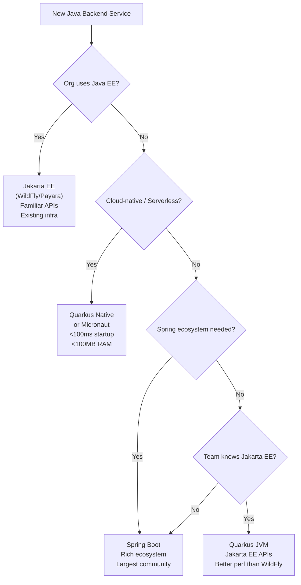
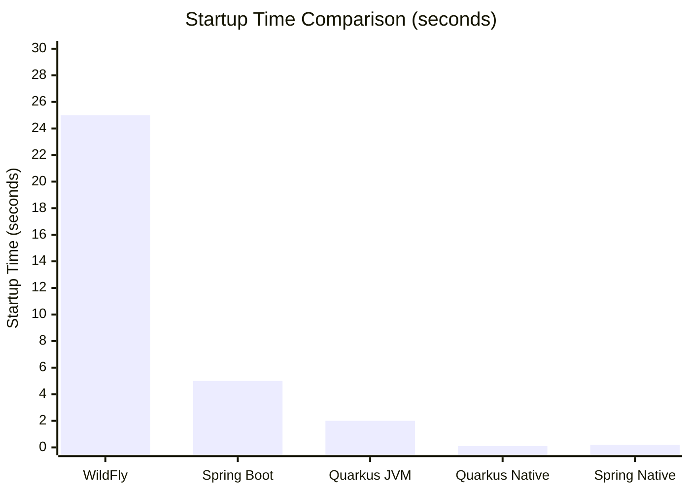

## Keywords in This File
{: .no_toc }

| # | Keyword | Weight |
|---|---------|--------|
| 26 | [Java EE vs Spring Boot Strategic Decision](#java-ee-vs-spring-boot-strategic-decision) | ★★★ |

---

# Java EE vs Spring Boot Strategic Decision

**Interview Weight:** ★★★ - Architect/Staff level.
Choosing between Jakarta EE and Spring Boot is a
strategic engineering decision with multi-year
consequences. Staff engineers must articulate trade-offs
across: vendor lock-in, ecosystem maturity, team skills,
cloud-native readiness, startup time, memory footprint,
testing, and specification vs. opinionated convention.
Both are legitimate choices; the interview tests reasoning,
not a predetermined answer.

---

### 🎯 Model Answer

**30 seconds:**

> Jakarta EE is a vendor-neutral specification implemented by
> WildFly, Payara, GlassFish, Open Liberty. Spring Boot is an
> opinionated framework with convention-over-configuration.
> Jakarta EE offers portability across runtimes and adherence
> to open standards. Spring Boot offers faster development,
> larger ecosystem, richer community, and first-class cloud-native
> support. For cloud-native microservices, Quarkus or
> Micronaut (using Jakarta EE APIs) close the gap. Choose
> based on team context, organizational standards, and
> what you need from the runtime.

**3 minutes:**

> Decision dimensions:
>
> Vendor neutrality:
> - Jakarta EE: specification means any compliant server works
> - Spring Boot: embedded Tomcat/Jetty, Spring-specific APIs
>   Some cloud providers optimize for Spring Boot
>
> Ecosystem maturity:
> - Spring: Data, Security, Cloud, Batch, Integration
>   Most comprehensive Java ecosystem today
> - Jakarta EE: JPA, CDI, JAX-RS, JMS, JTA are rock-solid
>   Fewer high-level utilities than Spring ecosystem
>
> Cloud-native startup time (memory):
> - Traditional WildFly: 15-30s startup, 500MB-1GB heap
> - Spring Boot on JVM: 3-8s startup, 300-500MB
> - Quarkus JVM mode: 1-3s startup, 150-300MB
> - Quarkus native: < 100ms startup, 50-100MB
> - Spring Native (GraalVM): < 200ms startup, 70-150MB
>
> Convention vs specification:
> - Spring Boot: convention-over-configuration
>   Less code, more "magic", harder to debug when it goes wrong
> - Jakarta EE: explicit configuration, more verbose,
>   clear what the container provides
>
> Learning curve:
> - Spring Boot: one framework to learn, rich documentation
> - Jakarta EE: multiple specs (EJB, CDI, JAX-RS, JTA)
>   each with their own concepts and interactions

**Blank Mind Recovery:**

**(1) Restate:** "Jakarta EE = open standard, portable,
multiple vendors. Spring Boot = opinionated, one stack,
richer ecosystem. Both valid."

**(2) Key factors:** "Team skills, cloud-native requirements,
startup time, organizational standards, existing investment."

**(3) Modern context:** "Quarkus uses Jakarta EE APIs
with cloud-native performance. Spring Boot 3 has similar
improvements. The gap is narrowing."

---

### 📘 Concept Explanation

**Architecture Comparison:**

```
JAKARTA EE RUNTIME MODEL:
  Source -> WAR/EAR
  Deploy to: WildFly / Payara / Open Liberty
  Server provides: CDI, EJB, JPA, JAX-RS, JTA, JMS
  App is thin layer on top of full platform
  Startup: slow (full platform init)
  Memory: high (full platform always present)

SPRING BOOT RUNTIME MODEL:
  Source -> Fat JAR (with embedded Tomcat)
  Run with: java -jar app.jar
  Framework provides: Spring IoC, AOP, Data, MVC
  App includes Spring (no external container needed)
  Startup: medium (IoC container init + classpath scan)
  Memory: medium (only included starters active)

QUARKUS RUNTIME MODEL (using Jakarta EE APIs):
  Source -> Jar or native binary
  Build-time: CDI wiring, configuration baked in
  Runtime: minimal init, no classpath scanning
  Startup: fast (JVM) to very fast (native)
  Memory: low (especially native)
```

> **Code walkthrough:** This example demonstrates the core pattern in action. The key mechanism shows how the concept works in practice. Study the structure to understand the essential behavior and common usage.

**Feature Comparison Matrix:**

| Feature | Jakarta EE | Spring Boot |
|---------|-----------|-------------|
| Dependency injection | CDI (JSR 346) | Spring IoC |
| REST API | JAX-RS (Jersey, RESTEasy) | Spring MVC / WebFlux |
| ORM | JPA (Hibernate) | Spring Data JPA (Hibernate) |
| Transactions | JTA (container-managed) | Spring @Transactional |
| Security | JAAS, Jakarta EE Security | Spring Security |
| Messaging | JMS, Jakarta Messaging | Spring AMQP, Spring Kafka |
| Scheduling | @Schedule EJB | Spring Scheduler |
| Batch | Jakarta Batch | Spring Batch |
| Testing | Arquillian | Spring Test |
| Cloud config | MicroProfile Config | Spring Cloud Config |

---

### 💻 Code Example

```java
// COMPARISON: Same feature in Jakarta EE vs Spring Boot

// ---- DEPENDENCY INJECTION ----

// Jakarta EE (CDI):
@ApplicationScoped
public class OrderService {
    @Inject
    private OrderRepository repository;

    public Order findById(Long id) {
        return repository.findById(id);
    }
}

// Spring Boot:
@Service
public class OrderService {
    @Autowired
    private OrderRepository repository;
    // Or: constructor injection (preferred):
    // public OrderService(OrderRepository repository) {
    //     this.repository = repository;
    // }

    public Optional<Order> findById(Long id) {
        return repository.findById(id);
    }
}


// ---- REST API ----

// Jakarta EE (JAX-RS):
@Path("/orders")
@Produces(MediaType.APPLICATION_JSON)
@Consumes(MediaType.APPLICATION_JSON)
@RequestScoped
public class OrderResource {

    @Inject OrderService orderService;

    @GET
    @Path("/{id}")
    public Response getOrder(@PathParam("id") Long id) {
        Order order = orderService.findById(id);
        if (order == null) {
            return Response.status(404).build();
        }
        return Response.ok(order).build();
    }

    @POST
    public Response createOrder(CreateOrderRequest req) {
        Order order = orderService.create(req);
        URI location = UriBuilder.fromResource(
            OrderResource.class
        ).path("/{id}").build(order.getId());
        return Response.created(location)
            .entity(order).build();
    }
}

// Spring Boot (Spring MVC):
@RestController
@RequestMapping("/orders")
public class OrderController {

    private final OrderService orderService;

    public OrderController(OrderService orderService) {
        this.orderService = orderService;
    }

    @GetMapping("/{id}")
    public ResponseEntity<Order> getOrder(
            @PathVariable Long id) {
        return orderService.findById(id)
            .map(ResponseEntity::ok)
            .orElse(ResponseEntity.notFound().build());
    }

    @PostMapping
    @ResponseStatus(HttpStatus.CREATED)
    public Order createOrder(
            @RequestBody @Valid CreateOrderRequest req) {
        return orderService.create(req);
    }
}


// ---- TRANSACTIONS ----

// Jakarta EE (container-managed):
@Stateless
public class OrderServiceEjb {
    @PersistenceContext EntityManager em;

    @TransactionAttribute(REQUIRED)
    public Order createOrder(CreateOrderRequest req) {
        // Container starts TX before this, commits after
        Order order = new Order(req);
        em.persist(order);
        return order;
        // Auto-commit when method returns
    }

    @TransactionAttribute(REQUIRES_NEW)
    public void auditLog(String msg) {
        // New TX regardless of caller
        em.persist(new AuditLog(msg));
    }
}

// Spring Boot:
@Service
public class OrderServiceSpring {

    @PersistenceContext EntityManager em;

    @Transactional  // starts new TX, commits on return
    public Order createOrder(CreateOrderRequest req) {
        Order order = new Order(req);
        em.persist(order);
        return order;
    }

    @Transactional(propagation = Propagation.REQUIRES_NEW)
    public void auditLog(String msg) {
        em.persist(new AuditLog(msg));
    }
}


// ---- TESTING ----

// Jakarta EE (Arquillian - container required):
@RunWith(Arquillian.class)
public class OrderServiceIT {

    @Deployment
    public static Archive<?> createDeployment() {
        return ShrinkWrap.create(WebArchive.class)
            .addClasses(OrderService.class,
                        OrderRepository.class)
            .addAsWebInfResource(
                EmptyAsset.INSTANCE, "beans.xml"
            );
    }

    @Inject OrderService orderService;

    @Test
    public void createOrderTest() {
        Order o = orderService.create(
            new CreateOrderRequest("item1", 2)
        );
        assertNotNull(o.getId());
    }
}

// Spring Boot (mocking, no container needed):
@SpringBootTest
public class OrderServiceTest {

    @MockBean OrderRepository repository;
    @Autowired OrderService orderService;

    @Test
    public void createOrderTest() {
        when(repository.save(any(Order.class)))
            .thenReturn(new Order(1L, "item1", 2));
        Order o = orderService.create(
            new CreateOrderRequest("item1", 2)
        );
        assertEquals(1L, o.getId());
    }
}
// Note: Spring Boot test starts faster, no need for
// real container. Arquillian needs a real container running.
```

> **Code walkthrough:** The side-by-side comparison reveals
> the character of each framework. CDI @ApplicationScoped
> vs Spring @Service differ in lifecycle: CDI is container-managed
> with proxyable beans; Spring is IoC container-managed with
> CGLIB proxies. JAX-RS vs Spring MVC: both produce the same
> HTTP output but Spring MVC is more terse with @RestController
> and ResponseEntity. The transaction comparison is most
> revealing: Jakarta EE uses @TransactionAttribute on @Stateless
> EJBs with container-managed semantics; Spring uses @Transactional
> AOP on any @Service with equivalent semantics. The testing
> comparison shows Spring's biggest practical advantage:
> @SpringBootTest starts the IoC container without a servlet
> container; Arquillian requires deploying to a real or embedded
> application server, which is slower and more complex.

---

### 🎓 Answers by Seniority

**Junior / Mid:**

> "Jakarta EE and Spring Boot both build Java web applications
> and microservices. Jakarta EE uses specifications (CDI,
> JAX-RS, JPA) implemented by application servers like WildFly.
> Spring Boot is an opinionated framework with embedded server.
> Spring Boot is faster to start a new project with, has
> larger community, and is more commonly required in job postings.
> Jakarta EE is chosen in enterprise environments with
> existing Java EE infrastructure or vendor contracts."

---

**Senior / Staff:**

> "The choice depends on what you're optimizing for.
> Jakarta EE's strengths: open standards with multiple
> compliant implementations (vendor portability), battle-tested
> enterprise components (JTA, JMS, EJB), and mature specs
> for complex deployment scenarios (EAR, clustering).
> Spring Boot's strengths: larger ecosystem, faster iteration,
> testability (no container required for unit tests),
> cloud-native starter kits, and larger talent pool.
> For new cloud-native development in 2024: Quarkus closes
> Jakarta EE's startup time gap while using Jakarta EE APIs.
> Spring Native (GraalVM) closes Spring Boot's startup gap.
> The decision is more about team familiarity and organizational
> standards than technical capability - both can solve the
> same problems today."

---

### ⚠️ Common Misconceptions

**Misconception 1: "Spring Boot is not enterprise-grade."**

Spring Boot powers Netflix, Amazon, LinkedIn, Alibaba.
It is enterprise-grade by any definition. The misconception
comes from historical enterprise Java = Java EE = IBM WebSphere.
Today, enterprise grade is defined by: observability,
resilience, security, scalability - all achievable with
either Spring Boot or Jakarta EE. "Enterprise" is no longer
a synonym for "Java EE application server."

**Misconception 2: "Jakarta EE is dead / legacy."**

Jakarta EE 10 released 2022, Jakarta EE 11 in progress.
WildFly 31 (2024) is active. Payara, Open Liberty, and
GlassFish all have active releases. Jakarta EE is not
legacy - it's the continuation of Java EE under Eclipse
Foundation. The transition from Oracle to Eclipse Foundation
accelerated specification evolution. Quarkus and Micronaut
use Jakarta EE APIs as their foundation.

**Misconception 3: "Quarkus replaces Jakarta EE."**

Quarkus uses Jakarta EE APIs (CDI, JPA, JAX-RS) as its
programming model. It does not replace them - it implements
them with a build-time augmentation model for cloud-native
performance. A developer writing Quarkus code writes
Jakarta EE annotations (@ApplicationScoped, @Entity, @Path).
Quarkus IS a Jakarta EE runtime, optimized for microservices
and cloud-native deployment.

---

### 🚨 Failure Modes and Diagnosis

**Failure 1: Spring Boot team introduces Jakarta EE patterns
(or vice versa) causing confusion**

*Symptom:* Code mixes Spring @Autowired and CDI @Inject,
Spring @Service and CDI @ApplicationScoped, causing
dependency injection failures.

*Root cause:* Developer familiar with one framework
applies patterns from the other.

*Detection:*
```bash
# Find mixed injection annotations:
grep -rn "@Autowired\|@EJB\|@Inject" src/ |
  grep -v "javax.inject\|jakarta.inject"
# @Inject from javax.inject is compatible with both
# @Autowired is Spring-only
# @EJB is Java EE only
```

> **Code walkthrough:** This example demonstrates the core pattern in action. The key mechanism shows how the concept works in practice. Study the structure to understand the essential behavior and common usage.

*Fix:* standardize on one framework per module.
If using Spring: @Autowired or constructor injection.
If using Jakarta EE/CDI: @Inject.

---

**Failure 2: Arquillian tests slow or flaky in CI**

*Symptom:* Integration tests take 5-10 minutes per run.
CI pipeline timeout. Tests pass locally, fail in CI.

*Root cause:* Arquillian deploys to a real application
server for each test run. Container startup is slow.
CI environments may have different resources.

*Fix options:*
1. Use embedded container (WildFly Embedded for Arquillian)
2. Switch to testcontainers for integration tests
3. Separate unit tests (fast, no container) from integration
   tests (slow, container)
4. For Spring Boot: use @SpringBootTest instead of Arquillian
   (no container needed)

---

**Failure 3: Spring Boot auto-configuration conflict**

*Symptom:* Expected bean is not injected. Wrong
implementation is auto-configured. Unexpected behavior
in production that doesn't reproduce in unit tests.

*Root cause:* Spring Boot auto-configuration applies
conditionally (@ConditionalOnMissingBean). Two starters
may configure conflicting beans.

*Diagnosis:*
```bash
# Run with debug to see auto-configuration report:
java -jar app.jar --debug 2>&1 | grep "Positive matches"
# Shows all auto-configured beans

# Or in application.properties:
# debug=true
```

> **Code walkthrough:** This example demonstrates the core pattern in action. The key mechanism shows how the concept works in practice. Study the structure to understand the essential behavior and common usage.

*Fix:*
```java
// Explicitly configure the bean to prevent auto-config:
@Bean
@Primary
public DataSource dataSource() {
    // Your explicit configuration wins over auto-config
    return DataSourceBuilder.create()
        .url(url)
        .username(user)
        .password(pass)
        .build();
}
```

> **Code walkthrough:** This example demonstrates the core pattern in action. The key mechanism shows how the concept works in practice. Study the structure to understand the essential behavior and common usage.

---

### ⚖️ Comparison Table

| Dimension | Jakarta EE | Spring Boot | Winner |
|-----------|-----------|-------------|--------|
| Vendor neutrality | High (spec) | Low (Spring-specific) | Jakarta EE |
| Ecosystem richness | Medium | High | Spring Boot |
| Cloud-native perf | Low (WildFly) / High (Quarkus) | Medium / High (native) | Tie |
| Testing DX | Hard (Arquillian) | Easy (Spring Test) | Spring Boot |
| Learning curve | Medium (multiple specs) | Medium (Spring magic) | Tie |
| Talent pool | Smaller | Larger | Spring Boot |
| Standards compliance | High (TCK) | Low (proprietary) | Jakarta EE |
| Active innovation | Medium | High | Spring Boot |

---

### 🏛️ System Design

**Technology Selection for New Greenfield Service:**

```
DECISION FLOWCHART:

Start: New Java backend service needed
    |
    v
Existing org uses Java EE?
  Yes -> Jakarta EE (team skills, infra reuse)
  No ->
    |
    v
Cloud-native, serverless, or edge?
  Yes -> Quarkus native or Micronaut
  No ->
    |
    v
Strong Spring ecosystem needed?
(Spring Data, Security, Batch)
  Yes -> Spring Boot
  No ->
    |
    v
Team knows Jakarta EE well?
  Yes -> Quarkus (Jakarta EE APIs + cloud performance)
  No -> Spring Boot (larger community, more tutorials)
```



> **Diagram walkthrough:** The decision tree shows that
> context dominates technology selection. An organization
> with Java EE expertise and WildFly infrastructure should
> leverage that investment. An organization starting fresh
> chooses based on cloud requirements (native performance)
> or team skills (Spring Boot's larger ecosystem). Quarkus
> occupies the space where Jakarta EE APIs are preferred
> but cloud-native performance matters - it is often the
> best of both worlds for teams with Java EE background
> moving to containers and Kubernetes.

---

### 📊 Diagram

```
PERFORMANCE COMPARISON (approximate, JVM mode):

                Startup   Heap    RPS/core
WildFly EAR     20-30s    512MB   5,000
Spring Boot 3    3-8s     256MB   8,000
Quarkus JVM      1-3s     150MB   10,000
Quarkus Native  <0.1s      50MB   9,000
Spring Native   <0.2s      70MB   8,500

Note: RPS varies by app complexity.
Startup time is main differentiator for:
  - Lambda/serverless (cold starts)
  - Kubernetes horizontal scaling (time to ready)
  - Developer inner loop (local restart time)
```



> **Diagram walkthrough:** The startup time comparison
> quantifies the cloud-native gap between traditional
> WildFly and modern runtimes. WildFly's 20-30 second
> startup is acceptable for long-running app server deployments
> but is prohibitive for serverless (cold start budget is
> typically < 1 second) and slow for Kubernetes horizontal
> scaling (pods take 30s to become ready). Quarkus native
> achieves sub-100ms startup by compiling to native binary
> with GraalVM, eliminating JVM startup and class loading.
> This enables Lambda and edge use cases. Spring Native
> achieves similar performance. For long-running microservices
> on Kubernetes (steady-state deployment), startup time
> matters less than throughput and memory - where all JVM
> options are competitive.

---

### 🎯 Interview Deep-Dive

| Question Type | Est. Time |
|---|---|
| Jakarta EE vs Spring Boot key differences | 4-5 min |
| Vendor lock-in comparison | 3-4 min |
| Testing experience comparison | 3-4 min |
| Cloud-native performance comparison | 4-5 min |
| Quarkus role in Jakarta EE ecosystem | 3-4 min |
| When to choose each | 4-5 min |
| Spring Boot ecosystem advantages | 3-4 min |
| Migration path between frameworks | 4-5 min |
| TCK compliance and standards | 3-4 min |
| Organizational factors | 3-4 min |
| Spring Boot 3 vs Jakarta EE 10 | 3-4 min |
| Staff decision-making framework | 5-6 min |

---

**[SENIOR] Q1 - What are the key philosophical
differences between Jakarta EE and Spring Boot?**

*Why they ask:* Framework philosophy understanding.

Jakarta EE philosophy: specification-first.
A committee defines the API (CDI 4.0 spec, JAX-RS 3.1 spec).
Multiple vendors implement the spec. Application code
is written to the spec API, not the implementation.
The container provides services through the spec contract.

Spring Boot philosophy: convention-over-configuration.
Spring Framework defines the API and implementation together.
Spring Boot adds opinionated defaults ("starters") so
most configuration is automatic. Developer writes less code
but relies on Spring's conventions.

Practical implication:
- Jakarta EE app: can switch from WildFly to Payara without
  code changes (same spec APIs)
- Spring Boot app: cannot switch from Spring MVC to Jakarta
  EE JAX-RS without code changes (different APIs)

*What separates good from great:* "The specification-first
approach has a hidden cost: spec committees are conservative,
and new features take years to standardize. Spring can
release features quarterly. This is why Spring often leads
and Jakarta EE follows. Spring Security had OAuth2 support
years before Jakarta EE Security had equivalent. The spec
eventually catches up, but teams often need the feature now."

---

**[SENIOR] Q2 - Where is Spring Boot's ecosystem
significantly ahead of Jakarta EE?**

*Why they ask:* Ecosystem comparison.

Spring Data:
- Repository pattern with auto-generated implementations:
  `interface OrderRepository extends JpaRepository<Order, Long>`
- Spring Data provides 50+ database integrations
- Jakarta EE alternative: JPA EntityManager (more verbose)

Spring Security:
- CSRF, CORS, OAuth2, OIDC, method security, reactive security
- Jakarta EE Security 3.0 covers the basics but lacks Spring's
  breadth (especially OAuth2/OIDC without MicroProfile)

Spring Cloud:
- Circuit breaker (Resilience4j), service discovery,
  config server, distributed tracing
- Jakarta EE: MicroProfile covers some (Config, Health, Metrics)
  but Spring Cloud has more production-ready defaults

Spring Batch:
- Complex batch processing framework with job scheduling,
  partitioning, retry, skip
- Jakarta EE has Jakarta Batch but less tooling/documentation

Spring Integration:
- Enterprise Integration Patterns implementation
- No direct Jakarta EE equivalent

*What separates good from great:* "Spring Data alone often
tips the decision toward Spring Boot. The difference between
writing 20 lines of JPQL queries vs annotating a repository
interface is significant at scale. Spring Data's derived
query methods (`findByEmailAndStatus`) generate queries
from method names - this is not available in vanilla JPA."

---

**[SENIOR] Q3 - How does testing compare between
Jakarta EE and Spring Boot?**

*Why they ask:* Developer experience (DX).

Spring Boot testing:
```java
// No container needed for unit tests:
@ExtendWith(MockitoExtension.class)
public class OrderServiceTest {
    @Mock OrderRepository repo;
    @InjectMocks OrderService service;

    @Test
    void createOrder() {
        when(repo.save(any())).thenReturn(new Order(1L));
        Order o = service.createOrder(new CreateReq());
        assertEquals(1L, o.getId());
    }
}
// Fast: milliseconds to run. Pure JUnit + Mockito.

// Integration test with Spring context (slower but no server):
@SpringBootTest(webEnvironment =
    SpringBootTest.WebEnvironment.MOCK)
@AutoConfigureMockMvc
public class OrderControllerTest {
    @Autowired MockMvc mvc;

    @Test
    void getOrder() throws Exception {
        mvc.perform(get("/orders/1"))
           .andExpect(status().isOk());
    }
}
```

> **Code walkthrough:** This example demonstrates the core pattern in action. The key mechanism shows how the concept works in practice. Study the structure to understand the essential behavior and common usage.

Jakarta EE testing (Arquillian):
```java
// Requires deploying to a container (real or embedded):
@RunWith(Arquillian.class)
public class OrderServiceIT {
    @Deployment
    public static Archive<?> createDeployment() {
        // Must construct deployment archive manually
        return ShrinkWrap.create(WebArchive.class)
            .addClasses(OrderService.class, Order.class)
            .addAsWebInfResource(
                EmptyAsset.INSTANCE, "beans.xml"
            );
    }
    @Inject OrderService service; // real CDI injection

    @Test
    public void createOrder() {
        // Runs inside real container
        Order o = service.createOrder(new CreateReq());
        assertNotNull(o.getId());
    }
}
// Slower: 15-60 seconds for container startup per test suite
```

> **Code walkthrough:** This example demonstrates the core pattern in action. The key mechanism shows how the concept works in practice. Study the structure to understand the essential behavior and common usage.

*What separates good from great:* "Mockito-based Spring
tests run in milliseconds. Arquillian tests run in seconds
to minutes. This directly impacts CI feedback loop speed.
For a team running 1000 tests per PR, the difference is
minutes vs hours. This is the practical advantage that
leads many teams to choose Spring Boot regardless of
architectural preferences."

---

**[SENIOR] Q4 - What is Quarkus and how does it
relate to the Jakarta EE vs Spring Boot decision?**

*Why they ask:* Modern Jakarta EE evolution.

Quarkus: cloud-native Java framework from Red Hat.
Uses Jakarta EE APIs (CDI, JPA, JAX-RS, JSON-B) as its
programming model but replaces the runtime (no WildFly,
no EAR, no full platform).

Key technical difference: Quarkus does CDI wiring at
build time (not runtime). No classpath scanning at startup.
Result: < 1s JVM startup, < 100ms native startup.

For the Jakarta EE vs Spring Boot decision, Quarkus
changes the calculus:
- Team knows CDI, JAX-RS? -> Quarkus (same APIs, better performance)
- Need Spring Data? -> Spring Boot (Quarkus has Panache but different)
- Need sub-100ms startup? -> Quarkus native or Spring Native
- Need JMS/messaging? -> Quarkus supports SmallRye Messaging

```bash
# Quarkus project creation (Jakarta EE APIs):
quarkus create app com.example:order-service \
    --extension=rest,jpa,hibernate-orm,panache

# The code you write is Jakarta EE:
@Path("/orders")
public class OrderResource {
    @Inject OrderService service;
    // JAX-RS + CDI - same as WildFly
}
```

> **Code walkthrough:** This example demonstrates the core pattern in action. The key mechanism shows how the concept works in practice. Study the structure to understand the essential behavior and common usage.

*What separates good from great:* "Quarkus resolves the
traditional Jakarta EE disadvantage: startup time and
cloud-native performance. If a team is on WildFly today,
migrating to Quarkus is a runtime swap with no code
changes - the Jakarta EE APIs are the same. This is
a less disruptive path than rewriting to Spring Boot.
Red Hat supports Quarkus in RHEL, which means enterprise
organizations with Red Hat contracts have a migration
path without leaving their support ecosystem."

---

**[SENIOR] Q5 - What role does vendor lock-in play
in the Jakarta EE vs Spring Boot decision?**

*Why they ask:* Enterprise architectural risk.

Spring Boot vendor lock-in:
- Technically: Spring Framework is open source (Apache 2.0),
  but owned and primarily maintained by Pivotal/VMware
- API dependency: Spring-specific annotations and APIs
  (@Autowired, @SpringBootApplication) are not portable
  to other frameworks
- If VMware deprioritizes Spring: community must fork
- In practice: very low risk due to community size

Jakarta EE vendor lock-in:
- Specification is owned by Eclipse Foundation (vendor-neutral)
- Multiple implementations: WildFly, Payara, Open Liberty,
  GlassFish, JBoss
- TCK (Technology Compatibility Kit) ensures compliance
- Can switch from WildFly to Open Liberty without code changes
- True vendor portability: IBM, Red Hat, Payara, Oracle all implement

Practical impact:
- Government/regulated industries: prefer open standards
  (Jakarta EE) due to procurement rules
- Startups: prefer Spring Boot (speed, ecosystem, talent)
- Enterprises with IBM/Red Hat contracts: may have contractual
  preference for Jakarta EE

*What separates good from great:* "The theoretical portability
advantage of Jakarta EE is partially undermined in practice:
application servers have vendor-specific extensions (WildFly's
JBoss Modules config, Payara's CDI extensions). Teams
use these extensions and lose portability. True portability
requires strict adherence to spec APIs only - a discipline
that's hard to maintain at scale."

---

**[SENIOR] Q6 - How do you evaluate when to use Spring
Boot vs Jakarta EE for a new enterprise project?**

*Why they ask:* Decision-making framework.

Evaluation matrix:

Factors favoring Spring Boot:
1. Team: existing Spring Boot expertise (retraining cost)
2. Speed to market: Spring Boot starter + Spring Data
   = working CRUD API in hours
3. Testing: faster unit/integration tests
4. Ecosystem: need Spring Batch, Spring Integration,
   Spring Security advanced features
5. Cloud: AWS-optimized Spring Cloud integrations

Factors favoring Jakarta EE:
1. Standards: regulatory requirement for open standards
2. Existing investment: WildFly/WebLogic already licensed
3. Team: existing Java EE expertise
4. Portability: multi-vendor procurement requirements
5. Platform services: need full JTA, JMS (complex messaging)

Neutral factors (both handle well):
- REST APIs (JAX-RS = Spring MVC in capability)
- JPA (both use Hibernate under the hood)
- JSON (Jackson is standard for both)
- Database (same databases supported)

Decision:
- New project, Spring-experienced team: Spring Boot
- New project, Java EE-experienced team: Quarkus
- Existing Java EE monolith: Jakarta EE or Quarkus
- Regulated industry, vendor neutrality required: Jakarta EE

*What separates good from great:* "The team skills factor
is often underweighted. Switching frameworks costs 3-6
months of reduced productivity while the team learns.
If the team knows Java EE, don't switch to Spring Boot
just because it's trendier. If cloud performance is the
driver, Quarkus lets the team use their Java EE knowledge
with cloud-native performance."

---

**[SENIOR] Q7 - What is Spring Boot 3 and how does
it compare to Jakarta EE 10?**

*Why they ask:* Current state of both platforms.

Spring Boot 3 (November 2022):
- Requires Java 17 minimum
- Migrated to Jakarta EE 9+ APIs (javax.* to jakarta.*)
- Spring MVC and WebFlux on servlet 6.0 / reactor
- GraalVM native image support
- Observability: Micrometer with auto-configuration
- AOT (ahead-of-time) compilation for faster startup

Jakarta EE 10 (September 2022):
- CDI 4.0 (CDI Lite: subset usable without container)
- JAX-RS 3.1 (multipart, better OpenAPI support)
- Servlet 6.0
- Jakarta Security 3.0 (OpenID Connect support)
- MicroProfile alignment
- Pattern matching, switch expressions

Convergence: Spring Boot 3 uses Jakarta EE 9+ APIs
(jakarta.* namespace). Spring Boot 3 with spring-boot-starter-web
uses Servlet 6.0 (same as Jakarta EE 10). The two
ecosystems use the same underlying APIs; the difference
is the IoC container and ecosystem.

*What separates good from great:* "Spring Boot 3's migration
to the jakarta.* namespace was a major breaking change
for existing Spring Boot 2.x applications (all javax.*
imports must change to jakarta.*). Jakarta EE applications
on Servlet 5.0+ already use jakarta.* - they were ahead
of Spring Boot on this migration. Teams migrating from
Spring Boot 2.x to 3.x experienced the same migration
pain that Jakarta EE applications went through in 2019."

---

**[SENIOR] Q8 - How would you migrate a Spring Boot
application to Quarkus?**

*Why they ask:* Migration knowledge (both directions).

Key migration steps:

1. Dependency swap:
```xml
<!-- Spring Boot pom.xml:
<dependency>
  <groupId>org.springframework.boot</groupId>
  <artifactId>spring-boot-starter-web</artifactId>
</dependency>
-->

<!-- Quarkus pom.xml: -->
<dependency>
  <groupId>io.quarkus</groupId>
  <artifactId>quarkus-rest</artifactId>
</dependency>
<dependency>
  <groupId>io.quarkus</groupId>
  <artifactId>quarkus-hibernate-orm-panache</artifactId>
</dependency>
```

> **Code walkthrough:** This example demonstrates the core pattern in action. The key mechanism shows how the concept works in practice. Study the structure to understand the essential behavior and common usage.

2. Controller to JAX-RS:
```java
// Spring MVC:
@RestController
@RequestMapping("/orders")
public class OrderController {
    @GetMapping("/{id}")
    public Order getOrder(@PathVariable Long id) { ... }
}

// Quarkus JAX-RS:
@Path("/orders")
public class OrderResource {
    @GET @Path("/{id}")
    public Order getOrder(@PathParam("id") Long id) { ... }
}
```

> **Code walkthrough:** This example demonstrates the core pattern in action. The key mechanism shows how the concept works in practice. Study the structure to understand the essential behavior and common usage.

3. @Service/@Repository to CDI:
```java
// Spring:
@Service public class OrderService { }
@Repository public class OrderRepository extends JpaRepository<...> {}

// Quarkus:
@ApplicationScoped public class OrderService { }
// Panache (simpler than Spring Data):
@Entity public class Order extends PanacheEntity {
    public static List<Order> findByStatus(String s) {
        return list("status", s);
    }
}
```

> **Code walkthrough:** This example demonstrates the core pattern in action. The key mechanism shows how the concept works in practice. Study the structure to understand the essential behavior and common usage.

*What separates good from great:* "The migration from
Spring Boot to Quarkus is more disruptive than from
WildFly to Quarkus. Spring IoC and Jakarta CDI have
the same conceptual model but different annotations.
Spring Data and Quarkus Panache have different APIs.
Budget 2-4 weeks per service for migration, plus test
updates. Going the other direction (Quarkus to Spring Boot)
has the same cost."

---

**[STAFF] Q9 - How do you make the Java EE vs Spring Boot
decision for a 100-person engineering organization
moving to microservices?**

*Why they ask:* Staff-level organizational decision.

Organizational decision framework:

1. Inventory existing expertise:
- How many engineers know Spring Boot? Jakarta EE?
- What frameworks are used in existing codebases?
- What is the cost of retraining?

2. Evaluate strategic alignment:
- Does the org have contracts with IBM/Red Hat/Oracle
  (Jakarta EE implications)?
- Is there a cloud platform preference (AWS Lambda, GKE)?
  AWS Lambda favors fast-start (Quarkus/Spring Native)
- Is vendor neutrality a procurement requirement?

3. Choose framework, then standardize:
- Multi-framework organizations pay: shared libraries,
  inconsistent patterns, harder hiring
- Pick one per layer (frontend, backend, data)
- Standard enables template repositories, shared tooling,
  easier code reviews

4. Decision at scale:
- Spring Boot: larger talent pool, easier hiring
  100-person org, faster scaling = Spring Boot advantage
- Jakarta EE: existing codebase and WildFly investment
  reduce retraining cost

5. Create Architecture Decision Record (ADR):
- Document: options considered, rationale, trade-offs,
  decision, review date
- Forces periodic re-evaluation (not permanent decision)

*What separates good from great:* "For a 100-person org,
hiring velocity is a primary driver. There are more Spring Boot
engineers available than Jakarta EE engineers globally.
Choosing Spring Boot expands the hiring pool. If the org
already has 70 Jakarta EE engineers, retraining cost
outweighs hiring pool advantage. The ADR (Architecture
Decision Record) is critical: document the decision so
future engineers understand why, not just what."

---

**[STAFF] Q10 - Evaluate the long-term strategic risk
of each choice.**

*Why they ask:* Long-term thinking.

Spring Boot long-term risks:
1. Pivotal/VMware ownership: if VMware is acquired or
   deprioritizes Spring, community must fork (similar to
   Hudson -> Jenkins when Oracle acquired Sun)
2. Spring Framework complexity: each version adds features,
   deprecated APIs remain, complexity grows
3. No TCK: no standard compliance test = Spring defines
   its own correctness; breaking changes are possible

Jakarta EE long-term risks:
1. Ecosystem lagging: Spring ecosystem innovations take
   years to appear in Jakarta EE specs
2. Slow innovation cycle: JCP/Eclipse Foundation governance
   is slower than private company
3. Market share declining: surveys show Spring Boot dominance
   growing vs Jakarta EE in new projects

Mitigation:
- Spring Boot: use standard Jakarta EE APIs where possible
  (JPA, CDI, JAX-RS via Spring integration), reducing
  dependency on Spring-specific patterns
- Jakarta EE: use Quarkus or Micronaut to benefit from
  spec compliance + modern cloud performance

10-year outlook:
- Spring Boot: stable dominant position, GraalVM native
  addresses the startup gap
- Jakarta EE/Quarkus: growing in cloud-native space where
  startup time matters; Red Hat investment is strong

*What separates good from great:* "The safest long-term
strategy: write business logic to the Jakarta EE API
(CDI, JPA, JAX-RS) but deploy on Quarkus. If Quarkus
changes: switch to Payara or WildFly with no code changes.
This gives standards compliance (portability) with
cloud-native performance. The framework of choice is
the least locked-in of all options."

---

**[STAFF] Q11 - How do you quantify the cost of a
wrong framework choice?**

*Why they ask:* Risk quantification.

Cost dimensions:

1. Migration cost (if wrong choice forces migration later):
- Lines of code to change: typically 30-50% for framework swap
- Testing time: full regression test
- Example: 100K LOC Spring Boot -> Quarkus: ~6-12 months
  for 5 engineers

2. Opportunity cost:
- Features not delivered during migration
- Team focus diverted from business value

3. Hiring cost:
- Wrong framework for local talent market = higher salaries
- Training cost: 3-6 months per engineer to reskill

4. Performance cost (if startup/memory wrong):
- Cloud bill difference: WildFly vs Quarkus native
  WildFly: 1GB heap, $0.10/hour * 8760h = $876/year/instance
  Quarkus native: 100MB, $0.01/hour * 8760h = $88/year/instance
  100 instances: $79,200/year savings

Risk mitigation:
- ADR with review dates
- Architecture spike: build prototype in both, compare
- Team survey: what does the team want to build with?
- Pilot team: let one team try the new framework for one quarter

*What separates good from great:* "The performance cost
in cloud environments is often the most quantifiable
and the most convincing for business stakeholders.
Calculate: current WildFly instance cost vs Quarkus native
instance cost per year at your scale. Show this number
to leadership. Infrastructure cost savings of $500K/year
make framework migration ROI clear."

---

**[STAFF] Q12 - Design a framework selection and governance
process for a growing engineering organization.**

*Why they ask:* Engineering governance thinking.

Governance process:

1. Technology Radar (Thoughtworks-style):
- ADOPT: proven, recommended (e.g., Quarkus, Spring Boot)
- TRIAL: encouraging, limited adoption (e.g., Micronaut)
- ASSESS: promising, not yet evaluated (e.g., Helidon)
- HOLD: not recommended for new projects (e.g., WebSphere)

Update quarterly, driven by Tech Advisory Board (TAB).

2. Architecture Decision Records (ADRs):
```markdown
# ADR-003: Backend Framework Selection

## Status: Accepted

## Context
New microservices team forming. Choose Spring Boot or Quarkus.

## Decision
Spring Boot 3.2 for all new microservices.

## Rationale
- 80% of engineers have Spring Boot experience
- Larger community for recruiting
- Spring Data simplifies data access tier

## Consequences
- All new services: Spring Boot
- Existing Jakarta EE services: maintain until natural migration
- Review: 2025-Q4 - evaluate Quarkus market position

## Alternatives Considered
- Quarkus: rejected - insufficient team experience currently
- Jakarta EE + WildFly: rejected - startup time disadvantage
```

> **Code walkthrough:** This example demonstrates the core pattern in action. The key mechanism shows how the concept works in practice. Study the structure to understand the essential behavior and common usage.

3. Exception process:
- Team can use alternative with TAB approval
- Must document trade-offs and migration plan
- Limits organizational divergence

4. Dependency on org size:
- < 20 engineers: one framework, no governance needed
- 20-100: ADRs, periodic review
- 100+: Technology Radar + TAB + ADRs + template repos

*What separates good from great:* "The best framework
governance is lightweight: Technology Radar + ADRs.
The worst is heavy: a committee that must approve every
dependency. Governance should enable alignment without
blocking teams. A team that disagrees with the ADR should
be able to document their reason and get a quick answer
(TAB review in 1 week, not 1 month). Slow governance
leads to shadow IT: teams using unapproved frameworks
without documentation."

---

---

### 💻 Code Example

*(Omit: this concept does not have a programmatic interface that can be demonstrated in code. The conceptual explanation above is sufficient.)*


---

### 🏛️ System Design

*(Omit: system design diagram not applicable for this concept - see ★★★ keywords for full system design coverage.)*


---

### ⚖️ Comparison Table

*(Omit: this is a ★☆☆ foundational concept with no direct alternatives to compare - see higher-difficulty keywords for trade-off analysis.)*


---

### 📊 Diagram

*(Omit: no standalone visual diagram required for this concept - the explanations and code examples above provide sufficient clarity.)*


