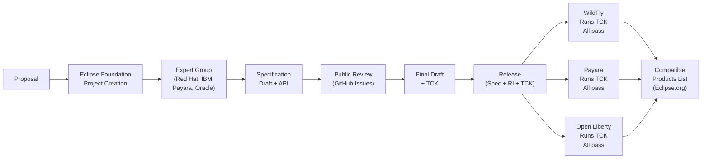
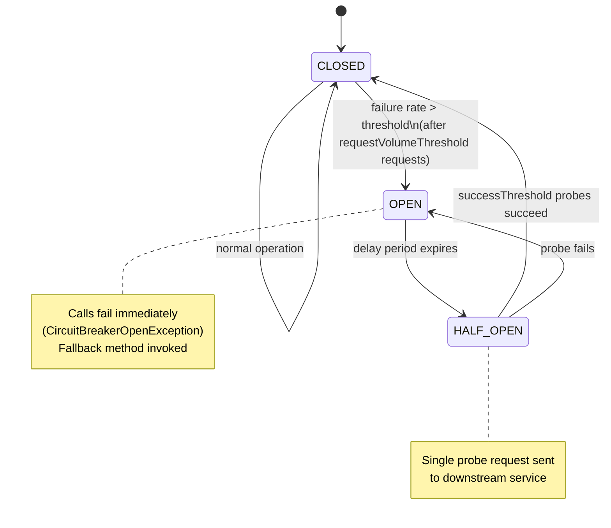

## Keywords in This File
{: .no_toc }

| # | Keyword | Weight |
|---|---------|--------|
| 27 | [Jakarta EE Specification Process](#jakarta-ee-specification-process) | ★★☆ |
| 28 | [MicroProfile and Lean Enterprise Java](#microprofile-and-lean-enterprise-java) | ★★☆ |

---

# Jakarta EE Specification Process

**Interview Weight:** ★★☆ - Staff level awareness.
Understanding how Jakarta EE specifications are created,
governed, and versioned explains why the platform moves
as it does, and why vendor neutrality and portability
commitments are meaningful. Engineers asked about
Jakarta EE's future, its governance model, or its
innovation speed need this knowledge.

---

### 🎯 Model Answer

**30 seconds:**

> Jakarta EE specifications are developed under the
> Eclipse Foundation Specification Process (EFSP).
> A specification defines the API contract and behavioral
> requirements. Independent vendors implement the spec
> and pass the Technology Compatibility Kit (TCK) to
> prove compliance. WildFly, Payara, Open Liberty, and
> GlassFish are all compliant Jakarta EE implementations.
> This governance model ensures that application code
> written to Jakarta EE APIs runs on any compliant server
> without modification.

**3 minutes:**

> Specification lifecycle:
>
> 1. Specification project creation:
>    - Any organization can propose a new spec
>    - Eclipse Foundation reviews and accepts as project
>    - Specification Committee oversight
>
> 2. Expert Group:
>    - Representatives from participating organizations
>    - Red Hat, IBM, Payara, Oracle, Tomitribe, others
>    - Open process: GitHub, public mailing lists
>
> 3. Development:
>    - Reference Implementation (RI) developed alongside spec
>    - TCK developed alongside spec
>    - Public review periods for community feedback
>
> 4. Final release:
>    - Specification document published
>    - TCK published for vendors to run
>    - Reference Implementation published
>
> 5. Vendor certification:
>    - Vendor runs TCK against their implementation
>    - All tests must pass for certified compatibility
>    - Eclipse Foundation publishes compatible products list
>
> Key difference from Java SE (OpenJDK/JCP):
>    - Jakarta EE: Eclipse Foundation governance
>    - Java SE: JCP (Java Community Process) - Oracle-led
>    - Namespace: jakarta.* (Jakarta EE 9+) vs javax.* (Java EE)

**Blank Mind Recovery:**

**(1) Restate:** "Spec defines the API. Multiple vendors
implement it. TCK tests compliance. All compliant implementations
are interchangeable."

**(2) History:** "Java EE was at Oracle. In 2017 Oracle donated
to Eclipse Foundation -> renamed Jakarta EE. First release
under Eclipse: Jakarta EE 8 (2019). Namespace change:
javax.* to jakarta.* in Jakarta EE 9 (2020)."

**(3) Why it matters:** "TCK compliance is the guarantee
behind portability. Without TCK, 'Jakarta EE compatible'
is marketing. With TCK, it's a testable contract."

---

### 📘 Concept Explanation

**History and Governance Transition:**

```
TIMELINE:
  1999: J2EE 1.2 (Sun Microsystems)
  2006: Java EE 5 (Sun, EJB 3.0 annotation model)
  2009: Java EE 6 (Sun/Oracle acquisition)
  2013: Java EE 7 (Oracle)
  2017: Java EE 8 (Oracle - last Java EE release)
  2017: Oracle donates Java EE to Eclipse Foundation
  2018: Renamed Jakarta EE
  2019: Jakarta EE 8 (Eclipse Foundation, identical to Java EE 8)
  2020: Jakarta EE 9 (namespace migration: javax.* -> jakarta.*)
  2021: Jakarta EE 9.1 (Java 11 support)
  2022: Jakarta EE 10 (CDI 4.0, new features)
  2024: Jakarta EE 11 (in progress)
```

**TCK (Technology Compatibility Kit):**

The TCK is a test suite that verifies an implementation
correctly implements the specification.

What it tests:
- API contracts: method signatures, return types, exceptions
- Behavioral requirements: what must happen when API is called
- Integration: how specs interact (CDI + JPA + JAX-RS)

What it does NOT test:
- Performance
- Scalability
- Non-normative behavior ("implementation-defined" sections)

Portability guarantee:
```
Jakarta EE 10 TCK: ~40,000 tests
WildFly passes TCK -> certified WildFly 28 (EE10)
Payara passes TCK -> certified Payara 6 (EE10)
Open Liberty passes TCK -> certified OL 23.x (EE10)

Application written to JAX-RS 3.1 spec:
  -> runs on WildFly 28  (TCK passed)
  -> runs on Payara 6    (TCK passed)
  -> runs on Open Liberty (TCK passed)
  No code changes needed
```

---

### 💻 Code Example

```java
// SPEC API vs VENDOR EXTENSION (portability contrast)

// PORTABLE (spec API only):
@Path("/orders")
@Produces(MediaType.APPLICATION_JSON)
public class OrderResource {

    @Inject
    private OrderService orderService;

    @GET
    @Path("/{id}")
    public Response getOrder(
            @PathParam("id") Long id) {
        Order order = orderService.findById(id);
        if (order == null) {
            return Response.status(
                Response.Status.NOT_FOUND
            ).build();
        }
        return Response.ok(order).build();
    }
}
// This file is IDENTICAL across WildFly, Payara, Open Liberty
// JAX-RS 3.1 (jakarta.ws.rs.*), CDI 4.0 (@Inject)
// Spec-compliant: full portability


// NON-PORTABLE (vendor-specific extension):

// WildFly-specific: JBoss Modules custom loader
import org.jboss.modules.Module; // WildFly only
import org.jboss.modules.ModuleLoader;

public class WildFlyModuleHelper {
    // Uses JBoss Modules API - not in any spec
    // This code cannot run on Payara or Open Liberty
    public Module loadModule(String name) throws Exception {
        ModuleLoader loader =
            Module.getBootModuleLoader();
        return loader.loadModule(
            ModuleIdentifier.fromString(name)
        );
    }
}

// IBM Open Liberty specific: IBM extensions
// (non-portable, only on IBM runtime)
// @ibm.ws.javaee.metadata.extension... annotations


// TCK VERIFICATION PROCESS:
// Vendors run TCK like this (conceptually):
// $ java -jar jakartaee-tck-10.jar \
//     --impl-class WildFlyTCKImpl \
//     --config wildfly-tck.properties
// 40,000+ tests run against the implementation
// ALL must pass for certification

// SPEC API PACKAGE NAMES (Jakarta EE 9+):
// jakarta.inject.*    (CDI - dependency injection)
// jakarta.persistence.*   (JPA)
// jakarta.ws.rs.*     (JAX-RS)
// jakarta.ejb.*       (EJB)
// jakarta.servlet.*   (Servlet)
// jakarta.transaction.* (JTA)
// jakarta.jms.*       (JMS)
// jakarta.security.*  (Jakarta Security)
// jakarta.validation.* (Bean Validation)
// jakarta.json.*      (JSON-P, JSON-B)
```

> **Code walkthrough:** The portable OrderResource uses only
> jakarta.ws.rs.* (JAX-RS) and jakarta.inject.Inject (CDI).
> These are spec APIs - every certified Jakarta EE 10 server
> implements them identically. The non-portable WildFlyModuleHelper
> uses org.jboss.modules, which is WildFly's proprietary class
> loading API. This code does not compile on Payara. The key
> lesson: portability is only guaranteed when you strictly use
> jakarta.* packages. Vendor-specific packages (org.jboss.*,
> com.ibm.*, com.sun.*) break portability. The TCK tests
> are what make "Jakarta EE certified" a meaningful guarantee
> rather than a marketing claim.

---

### 🎓 Answers by Seniority

**Junior / Mid:**

> "Jakarta EE specs are open standards developed by multiple
> companies under the Eclipse Foundation. Each spec has a
> Reference Implementation (RI) to show it works, and a
> Technology Compatibility Kit (TCK) test suite that verifies
> vendor implementations. Any server that passes the TCK
> can claim Jakarta EE certification. WildFly, Payara,
> and Open Liberty are all certified. This means my JAX-RS
> code runs on any of them without changes."

---

**Senior / Staff:**

> "The Jakarta EE specification process provides a meaningful
> portability contract through the TCK. But there are limits:
> the TCK tests spec compliance, not performance or vendor-specific
> behavior in edge cases. Applications that use only spec
> APIs are portable. Applications that use vendor extensions
> for performance tuning (WildFly subsystem config, Payara
> Hazelcast clustering) are not portable. The namespace
> migration from javax.* to jakarta.* in Jakarta EE 9 was
> the most disruptive change in the platform's history - it
> broke binary compatibility with all Java EE libraries
> and required every framework and library in the ecosystem
> to publish new releases. Spring Boot 3 adopted jakarta.*
> in 2022, completing the ecosystem migration."

---

### ⚠️ Common Misconceptions

**Misconception 1: "javax.* and jakarta.* packages are
the same thing."**

javax.* packages (Java EE era) and jakarta.* packages
(Jakarta EE 9+) have different class names at the byte level.
A library compiled against javax.persistence.Entity does NOT
work with jakarta.persistence.Entity. This is why Jakarta EE 9
broke binary compatibility. Every dependency that uses JPA,
Servlet, CDI, or any javax.* API needed a new release.
Hibernate 5.x = javax.*. Hibernate 6.x = jakarta.*. They
are not interchangeable.

**Misconception 2: "The Jakarta EE specification process
is slower than Spring because of bureaucracy."**

The process is collaborative, not bureaucratic in the
negative sense. Expert Groups operate on GitHub with
public issue trackers. Anyone can file issues or comment.
The pace difference vs Spring is that consensus across
multiple vendors (IBM, Red Hat, Payara, Oracle) takes longer
than one company's engineering priorities. The trade-off:
Spring moves faster but can make breaking changes unilaterally.
Jakarta EE moves slower but changes are consensus-driven
and backward-compatible within major versions.

---

### 🚨 Failure Modes and Diagnosis

**Failure 1: Vendor extension dependency breaks portability**

*Symptom:* Application deploys to WildFly but fails to
start on Payara with ClassNotFoundException for
org.jboss.* or similar vendor package.

*Diagnosis:*
```bash
# Find vendor-specific imports in source:
grep -rn "import org.jboss\|import com.ibm\
\|import com.sun\|import com.payara" src/

# Any non-jakarta.*, non-java.* import is a portability risk
```

*Fix:* Replace vendor-specific APIs with spec equivalents,
or document the vendor dependency explicitly.

---

**Failure 2: javax.* vs jakarta.* conflict causes
NoSuchMethodError / ClassCastException**

*Symptom:* Two versions of the same API (javax.* and jakarta.*)
on classpath. ClassCastException when passing objects
between libraries using different versions.

*Diagnosis:*
```bash
# Check for duplicate/conflicting JPA API:
mvn dependency:tree | grep -E "javax.persistence|jakarta.persistence"
# Should see only ONE version

# Symptom in logs:
# ClassCastException: javax.persistence.Entity
# cannot be cast to jakarta.persistence.Entity
```

*Fix:*
```xml
<!-- Exclude old javax.* from dependencies: -->
<dependency>
    <groupId>some.library</groupId>
    <artifactId>some-lib</artifactId>
    <exclusions>
        <exclusion>
            <groupId>javax.persistence</groupId>
            <artifactId>javax.persistence-api</artifactId>
        </exclusion>
    </exclusions>
</dependency>
```

---

### 🎯 Interview Deep-Dive

| Category | Count | Coverage |
|---|---|---|
| Conceptual | 3 | Specification process, TCK, EFSP governance |
| Trade-off | 2 | Portability vs. vendor extensions, compliance cost |
| Failure Mode | 2 | javax/jakarta classpath clash, TCK compliance gaps |
| Debugging | 1 | ClassCastException from namespace collision |
| Behavioral | 1 | Leading a javax to jakarta migration |

**Q1. How does the Jakarta EE specification process (EFSP) work
and how does it differ from the old JCP process?**

The Eclipse Foundation Specification Process (EFSP) replaced the
Java Community Process (JCP) for Jakarta EE after Oracle transferred
the project. Key differences:

JCP (old):
- Oracle held veto power via the Executive Committee
- Proprietary Reference Implementation model
- Slow release cycles (Java EE 7 in 2013, Java EE 8 in 2017)

EFSP (current):
- Multi-vendor steering committee (Red Hat, IBM, Oracle, Payara,
  Microsoft, others) - no single veto
- Open source specification projects on GitHub
- TCK must be open source and freely executable by implementations
- Release cadence improved: Jakarta EE 9 (2020), 9.1 (2021),
  10 (2022), 11 planned for 2024

Process flow:
1. Specification project created in Eclipse Foundation
2. Specification document written collaboratively
3. Compatible Implementation built alongside (Glassfish/WildFly)
4. TCK (Technology Compatibility Kit) test suite published
5. Implementations pass TCK to earn Jakarta EE compatible certification
6. Release review by EFSP Project Management Committee

*What separates good from great:* Knowing that the TCK must be
freely runnable (no licensing fees) under EFSP. Under JCP, Oracle
charged for TCK access, which was a major barrier to compatible
implementations. The EFSP change enabled Quarkus and Helidon to
easily test specification compliance.

---

**Q2. What is a Technology Compatibility Kit (TCK) and why does
it matter for Java EE portability?**

A TCK is a test suite that an implementation must pass to claim
compatibility with a specification. For Jakarta EE:

- Jakarta Persistence (JPA) TCK: tests all persistence contract
  behaviours including transaction management, lifecycle, cascade
- Jakarta RESTful Web Services TCK: covers all JAX-RS resource
  contract semantics
- Jakarta Contexts and Dependency Injection (CDI) TCK: validates
  injection, scopes, events, interceptors

Why it matters practically:
- Application code calling only spec APIs (jakarta.persistence.*)
  is guaranteed to work on any TCK-certified implementation
- Code using vendor APIs (Hibernate-specific, EclipseLink-specific)
  is not portable

TCK limitations:
- TCK tests the API contract, not performance or production edge cases
- Vendor-specific config (persistence.xml properties, datasource
  config) is always non-portable
- Some edge-case behaviours (exact exception types on constraint
  violation, transaction isolation defaults) vary between
  compliant implementations

*What separates good from great:* Knowing the TCK tests the contract,
not the behaviour edge cases. Two TCK-compliant implementations can
behave differently on the same code if the spec leaves behaviour
undefined (e.g., order of CDI observer invocation across types).

---

**Q3. Why did the jakarta.* namespace replace javax.* and what
are the migration implications?**

Oracle owns the `javax.*` trademark. When Java EE transferred to
the Eclipse Foundation as Jakarta EE, Oracle granted a one-time
license to use `javax.*` for Jakarta EE 8 compatibility but
required that new APIs use `jakarta.*`. Jakarta EE 9 made the
switch: all APIs moved from `javax.*` to `jakarta.*` (no new API
features, only the namespace change).

Migration implications:

1. Import statements must change: `import javax.persistence.Entity`
   -> `import jakarta.persistence.Entity`
2. XML config references change: persistence.xml `javax.persistence.*`
   properties -> `jakarta.persistence.*`
3. Third-party libraries must be updated: libraries compiled against
   `javax.*` will not work in Jakarta EE 10 containers without
   recompilation or bytecode transformation

Automated migration tools:
- OpenRewrite: `rewrite-migrate-java` recipe replaces all javax imports
- Eclipse Transformer: bytecode-level transformation for libraries
  you cannot recompile

*What separates good from great:* Knowing about the classpath split
problem. If your application or a dependency has both `javax.persistence`
and `jakarta.persistence` on the classpath (e.g., transitively pulled in
by different dependencies), you will get `ClassCastException` when the
JPA implementation tries to cast a proxy to the Entity annotation type.
Maven enforcer rules checking for duplicate packages catch this early.

---

**Q4. How does Jakarta EE ensure vendor portability in practice and
where does it break down?**

Portability guarantees:
- Code using only `jakarta.*` APIs compiles and runs on any certified
  implementation without changes
- Deployment descriptors (web.xml, persistence.xml) are portable
- Standard annotations (@Entity, @Stateless, @Inject) are portable

Where portability breaks down:
- **Configuration**: datasource JNDI names, connection pool settings,
  server-specific deployment descriptors (jboss-web.xml, weblogic.xml)
- **JPA provider specifics**: Hibernate and EclipseLink differ on
  fetch strategy defaults, second-level cache behaviour, HQL vs JPQL
  extensions
- **CDI extensions**: Weld (Reference Implementation) and OpenWebBeans
  have differences in edge-case CDI behaviour
- **Thread pool integration**: asynchronous EJB and managed executors
  have implementation-specific thread pool configurations
- **ClassLoader isolation**: WAR-in-EAR, shared libraries, class
  visibility rules differ between WildFly, Payara, and Liberty

*What separates good from great:* The practical advice: treat
`persistence.xml` properties starting with `hibernate.*` or
`eclipselink.*` as portability risks. Abstract them behind a
configuration layer or accept the port cost explicitly.

---

**Q5. What is the TRADE-OFF between TCK compliance and using
vendor-specific Jakarta EE extensions?**

Vendor extensions give access to features not in the specification:
- Hibernate: batch insert, fetch profiles, custom types, HQL extensions
- WildFly: management CLI, PicketLink security, Infinispan integration
- OpenLiberty: MicroProfile extensions, Liberty-specific threading

Benefits:
- Access to performance features not in spec (e.g., Hibernate
  batch mode saves 10x on bulk inserts)
- Earlier access to new patterns (vendor extends before spec catches up)
- Better tooling integration

Costs:
- Portability loss: migration to another runtime is a code change
- Upgrade coupling: must track vendor releases, not just spec releases
- Testing complexity: TCK tests do not cover vendor extensions

Decision framework:
- Core domain logic: spec APIs only (maximum portability)
- Performance-critical infrastructure: vendor APIs acceptable with
  an abstraction layer (JPA Repository pattern)
- Operations/monitoring: vendor APIs expected (vendor CLI, metrics)

*What separates good from great:* The abstraction layer pattern.
Wrap Hibernate-specific calls behind a `Repository` interface. The
interface is portable; the implementation is Hibernate-specific. This
gives you the performance benefit with a defined migration surface.

---

**Q6. DEBUGGING: You have a ClassCastException: `javax.persistence.
Entity cannot be cast to jakarta.persistence.Entity`. Walk through
your diagnosis and fix.**

This is the classpath split problem.

Diagnosis:
```bash
# 1. Find which JARs contain javax.persistence.Entity:
mvn dependency:tree | grep persistence
# Look for both:
#   javax.persistence:javax.persistence-api
#   jakarta.persistence:jakarta.persistence-api
# Both on classpath = problem

# 2. Identify which dependency is pulling in the old javax jar:
mvn dependency:tree -Dincludes=javax.persistence
# Shows the full transitive path

# 3. Verify the runtime classpath (in the running server):
# WildFly: check deployment warnings in server.log for
#   "multiple versions of javax.persistence detected"
```

Fix:
```xml
<!-- Exclude old javax.persistence from the offending dependency -->
<dependency>
  <groupId>some.library</groupId>
  <artifactId>some-lib</artifactId>
  <exclusions>
    <exclusion>
      <groupId>javax.persistence</groupId>
      <artifactId>javax.persistence-api</artifactId>
    </exclusion>
  </exclusions>
</dependency>

<!-- Or use Maven enforcer to ban javax.persistence globally -->
<plugin>
  <groupId>org.apache.maven.plugins</groupId>
  <artifactId>maven-enforcer-plugin</artifactId>
  <configuration>
    <rules>
      <bannedDependencies>
        <excludes>
          <exclude>javax.persistence:*</exclude>
        </excludes>
      </bannedDependencies>
    </rules>
  </configuration>
</plugin>
```

*What separates good from great:* Adding the Maven Enforcer rule as
a permanent guard. The ClassCastException can re-appear if a new
transitive dependency re-introduces the old javax jar. The enforcer
prevents this at build time.

---

**Q7. What is the relationship between a Jakarta EE specification,
a compatible implementation, and a certified application server?**

Three-layer model:

1. **Specification**: document defining API (javax.* / jakarta.*
   packages), behaviour contracts, XML schema. No binary artifact.

2. **Compatible Implementation (CI)**: a specific runtime that has
   passed the TCK for a specification version. The CI is required
   for the specification to advance (a spec with no CI is theoretical).
   Examples: EclipseLink for JPA, Weld for CDI, Jersey for JAX-RS.

3. **Profile Implementation**: an application server that bundles
   multiple CIs into a certified Jakarta EE profile. WildFly 29 =
   Jakarta EE 10 Full Profile certified. Quarkus = individual
   component certifications (not Full Profile).

Profile types:
- **Full Profile**: all specifications (EJB, JMS, JAX-RS, CDI,
  JPA, Bean Validation, Servlet, WebSocket, etc.)
- **Web Profile**: subset for web applications (Servlet, CDI, JPA,
  JAX-RS, Bean Validation, EJB Lite)
- **Core Profile**: minimal set for microservices (CDI Lite, JAX-RS,
  JSON-P, JSON-B). Quarkus targets this profile.

*What separates good from great:* Knowing that the Core Profile
(Jakarta EE 10) was designed specifically for compilation to native
images with GraalVM/Quarkus. Full Profile EJB requires runtime
proxy generation which is incompatible with AOT native compilation.

---

**Q8. How would you evaluate if a library is compatible with
Jakarta EE 10 vs. Jakarta EE 9.1?**

Compatibility checklist:

1. **Import namespace check:**
   ```bash
   # Check if library uses javax.* (EE 9.1 boundary):
   jar tf library.jar | grep -E 'javax\.'
   # Or decompile a class:
   javap -c -classpath library.jar some.Class | grep 'javax\|jakarta'
   ```

2. **Published artifact version**: check Maven Central metadata for
   `jakarta.*` vs `javax.*` in the artifact's `pom.xml` dependencies.

3. **Test compatibility**: add the library alongside your EE 10
   container and look for `ClassNotFoundException: javax.*` or
   `NoClassDefFoundError: jakarta/*` at startup.

4. **Check the project's issue tracker**: look for issues tagged
   `jakarta-ee-10` or `namespace-migration`.

For libraries that only have `javax.*` versions:
- Eclipse Transformer can bytecode-transform the JAR to `jakarta.*`
  namespace at build time (automated migration for libraries you
  cannot recompile yourself)

*What separates good from great:* The bytecode-level check (`jar tf`
+ grep) versus relying on documentation. Library documentation can
be wrong; the bytecode is the truth.

---

**Q9. BEHAVIORAL: You are leading a migration from Java EE 8
(javax.*) to Jakarta EE 10. What steps do you take?**

Migration plan (phased):

Phase 1: Audit (1-2 weeks)
- Generate full dependency tree, flag all `javax.*` dependencies
- Identify vendor-specific extensions in use (Hibernate, WildFly)
- Map each spec API to its Jakarta EE 10 equivalent
- Estimate bytecode transformation needs (libs without EE 10 versions)

Phase 2: Build pipeline (1 week)
- Add Maven Enforcer to ban `javax.persistence`, `javax.inject`,
  etc.
- Add automated `javax.*` import detection to CI (fail build on hits)
- Set up Eclipse Transformer for unmaintained JAR dependencies

Phase 3: Code migration (per-module, incremental)
- Apply OpenRewrite `rewrite-migrate-java` recipe for import renames
- Update XML configuration files (persistence.xml, web.xml)
- Update integration tests against Jakarta EE 10 container

Phase 4: Deployment verification
- Deploy to Jakarta EE 10 server (WildFly 29+, Payara 6+)
- Run full integration test suite against deployed artifact
- Monitor for ClassCastException in logs during smoke test

Key risks:
- Third-party JARs with no Jakarta EE 10 release (bytecode transform)
- Behaviour differences between old and new JPA/CDI implementations
- Spring dependencies that bundle their own javax.* (Spring 6+ uses
  jakarta.*, Spring 5.x uses javax.*)

*What separates good from great:* The phased approach with build
guards first. Many teams try to migrate all code at once and hit
unexpected transitive dependency issues at runtime. Build enforcer
rules catch the problem at compile time.

---

### ⚖️ Comparison Table

| Governance Model | Jakarta EE (EFSP) | Java SE (JCP) | Spring Framework |
|---|---|---|---|
| Owner | Eclipse Foundation | Oracle (via JCP) | VMware/Pivotal |
| Governance | Multi-vendor committee | JCP EC + Oracle lead | Private company |
| Release pace | 1-2 years per major | Annual (LTS: 3yr) | 6-12 months |
| Portability guarantee | TCK compliance | JDK TCK | None |
| Source of truth | Specification doc | JLS + JVM spec | Framework code |

### 🏛️ System Design

*(Omit: L6 Theory - the specification process is a governance
model, not a deployable system design. No system design applicable.)*

### 📊 Diagram

```
JAKARTA EE SPEC LIFECYCLE:

[Proposal] -> [Project Creation (Eclipse)] ->
[Expert Group Forms] -> [Specification Draft] ->
[Public Review] -> [Final Draft] ->
[TCK Development] -> [Release] ->
[Vendor Implementation] -> [TCK Certification] ->
[Compatible Products List]

Example: CDI 4.0 for Jakarta EE 10
  Expert Group: Red Hat, IBM, Payara, Oracle, Tomitribe
  Reference Implementation: Weld (Red Hat)
  TCK: CDI TCK 4.0 (~2,000 tests)
  Compatible: WildFly 28, Payara 6, Open Liberty 23.x
```



> **Diagram walkthrough:** The specification lifecycle shows
> why Jakarta EE moves deliberately: each step involves
> multiple organizations reaching consensus on the API design
> before implementation begins. The public review step is
> genuinely open: GitHub issues on the spec repository have
> contributions from individual developers globally. The TCK
> path (G -> H1, H2, H3) shows how portability is verified:
> three different vendors, three independent implementations,
> all passing the same test suite. When you write code to the
> spec, it is tested against all of them.

---

---

# MicroProfile and Lean Enterprise Java

**Interview Weight:** ★★☆ - Senior/Staff awareness.
MicroProfile is the answer to "how do you run Jakarta EE
in microservices without the full platform?" Staff engineers
working in enterprise Java cloud-native contexts should know
MicroProfile's APIs, its relationship to Jakarta EE, and
why it exists.

---

### 🎯 Model Answer

**30 seconds:**

> MicroProfile is an Eclipse Foundation initiative that defines
> a minimal set of APIs for building cloud-native microservices
> in Java. It took the best parts of Jakarta EE (CDI, JAX-RS,
> JSON-P) and added microservices-specific APIs: Health, Metrics,
> Config, JWT Propagation, Fault Tolerance (CircuitBreaker,
> Retry, Timeout), and OpenAPI. Quarkus and Open Liberty
> implement MicroProfile, giving you Jakarta EE programming
> model with cloud-native capabilities.

**3 minutes:**

> Why MicroProfile exists:
>
> Java EE/Jakarta EE was designed for monolithic application
> servers: deploy EAR files to WildFly, which starts in 30s
> and uses 512MB. This model is incompatible with microservices:
> - One service per container
> - Container must start in seconds
> - Only deploy what the service needs (lean classpath)
> - Health checks for Kubernetes liveness/readiness
> - Config from environment (12-factor app)
>
> MicroProfile 1.0 (2016):
> - Took: CDI 1.2, JAX-RS 2.0, JSON-P 1.0 from Java EE
> - No EJB, no EAR, no full platform
> - Added: Config, Health, Metrics
>
> MicroProfile 6.1 (2023):
> - Config 3.0 (environment variables, property sources)
> - Health 4.0 (liveness, readiness, startup probes)
> - Metrics 5.0 (application + JVM metrics)
> - JWT Propagation 2.1 (stateless auth)
> - Fault Tolerance 4.0 (Retry, Timeout, CircuitBreaker, Bulkhead)
> - OpenAPI 3.1 (auto-generate Swagger from annotations)
> - OpenTracing / Telemetry (distributed tracing)
>
> Relationship to Jakarta EE:
> - MicroProfile uses a subset of Jakarta EE APIs
> - Some MicroProfile specs are being contributed back to Jakarta EE
>   (Config -> Jakarta Config, Health -> Jakarta Health)
> - Quarkus implements both: MP and Jakarta EE

**Blank Mind Recovery:**

**(1) Restate:** "MicroProfile = minimal Java EE APIs +
microservices APIs (Config, Health, Fault Tolerance, JWT).
Lean alternative to full application server."

**(2) Key APIs:** "Fault Tolerance: @Retry, @Timeout,
@CircuitBreaker, @Bulkhead. Config: inject from env vars.
Health: /health/live, /health/ready for Kubernetes probes."

**(3) Implementations:** "Quarkus, Open Liberty, WildFly
Bootable JAR, Helidon. All support MicroProfile."

---

### 📘 Concept Explanation

**MicroProfile vs Full Jakarta EE:**

```
FULL JAKARTA EE PLATFORM:
  CDI, EJB, JPA, JAX-RS, JMS, JTA, Servlet,
  JSF, WebSocket, JSON-P, JSON-B, Bean Validation,
  Security, Authorization, Persistence,
  Concurrency, Batch, Connectors, Management...
  = 40+ specifications
  Startup: 20-30 seconds (WildFly full)
  Heap: 500MB-1GB

MICROPROFILE SUBSET:
  From Jakarta EE: CDI, JAX-RS, JSON-P, JSON-B,
    Servlet (optional), Bean Validation
  MicroProfile additions:
    Config, Health, Metrics, Fault Tolerance,
    JWT Auth, OpenAPI, OpenTracing, Rest Client
  = 14 specifications
  Startup: 1-3s (Quarkus JVM)
  Heap: 100-200MB (Quarkus JVM)
  Startup: <100ms, Heap: 50MB (Quarkus native)
```

**Fault Tolerance in Practice:**

MicroProfile Fault Tolerance is one of its most valuable APIs.
It provides circuit breaker, retry, timeout, and bulkhead
as CDI annotations - no aspect weaving or framework configuration.

Circuit Breaker state machine:
```
CLOSED (normal operation)
  -> OPEN (after failure threshold)
  -> HALF-OPEN (probe request)
  -> CLOSED (if probe succeeds)
```

---

### 💻 Code Example

```java
// MICROPROFILE CONFIG: inject from environment
@ApplicationScoped
public class OrderService {

    // Reads from: System property, env variable, mp-config.properties
    // Priority: system prop > env var > properties file
    @Inject
    @ConfigProperty(name = "order.max-quantity",
                    defaultValue = "100")
    private int maxQuantity;

    // Env variable: ORDER_MAX_QUANTITY=50
    // (MP Config converts . to _ and uppercases)

    @Inject
    @ConfigProperty(name = "payment.service.url")
    private String paymentUrl;
    // Required: fails startup if not set
}


// MICROPROFILE HEALTH: Kubernetes probes
@Liveness  // -> /health/live
@ApplicationScoped
public class AppLivenessCheck
        implements HealthCheck {

    @Override
    public HealthCheckResponse call() {
        // Check: is the app in a good state?
        // Liveness: if fails, Kubernetes restarts pod
        return HealthCheckResponse.up("app-live");
    }
}

@Readiness  // -> /health/ready
@ApplicationScoped
public class DatabaseReadinessCheck
        implements HealthCheck {

    @Inject EntityManager em;

    @Override
    public HealthCheckResponse call() {
        try {
            em.createNativeQuery("SELECT 1")
              .getSingleResult();
            // Readiness: if fails, K8s removes from
            // load balancer (no traffic sent)
            return HealthCheckResponse.up("db-ready");
        } catch (Exception e) {
            return HealthCheckResponse
                .named("db-ready")
                .down()
                .withData("error", e.getMessage())
                .build();
        }
    }
}


// MICROPROFILE FAULT TOLERANCE
@ApplicationScoped
public class PaymentServiceClient {

    @Inject
    @RestClient  // MicroProfile Rest Client
    private PaymentRestClient client;

    @Retry(
        maxRetries = 3,
        delay = 500,
        delayUnit = ChronoUnit.MILLIS,
        retryOn = {IOException.class,
                   WebApplicationException.class}
    )
    @Timeout(2000)  // 2 seconds max
    @CircuitBreaker(
        requestVolumeThreshold = 10, // min requests before CB opens
        failureRatio = 0.5,          // 50% failure -> OPEN
        delay = 5000,                // 5s in OPEN state
        successThreshold = 2         // 2 successes to close
    )
    @Fallback(fallbackMethod = "fallbackCharge")
    public PaymentResult charge(ChargeRequest req) {
        return client.charge(req);
    }

    // Fallback: called when circuit is open OR retries exhausted
    public PaymentResult fallbackCharge(ChargeRequest req) {
        // Degrade gracefully: queue for later processing
        return PaymentResult.deferred(
            req.getOrderId(),
            "Payment service unavailable, queued"
        );
    }
}


// MICROPROFILE JWT: stateless auth
@Path("/orders")
@RolesAllowed({"USER", "ADMIN"})  // JWT role claim
public class OrderResource {

    @Inject
    JsonWebToken jwt;  // Injected from Bearer token

    @GET
    @Path("/my")
    public List<Order> getMyOrders() {
        // JWT claims available:
        String userId = jwt.getClaim("sub"); // subject
        Set<String> roles =
            jwt.getClaim("groups"); // roles claim

        return orderService.findByUser(userId);
    }
}


// MICROPROFILE OPENAPI: auto-generate Swagger
@Path("/orders")
@Tag(name = "Orders",
     description = "Order management API")
public class OrderResource {

    @Operation(
        summary = "Get order by ID",
        description = "Retrieves a specific order"
    )
    @APIResponse(
        responseCode = "200",
        description = "Order found",
        content = @Content(
            schema = @Schema(implementation = Order.class)
        )
    )
    @APIResponse(responseCode = "404",
                 description = "Order not found")
    @GET
    @Path("/{id}")
    public Order getOrder(@PathParam("id") Long id) {
        return orderService.findById(id);
    }
}
// GET /openapi -> OpenAPI 3.0 YAML/JSON spec
// GET /q/dev-ui -> Swagger UI (Quarkus dev mode)
```

> **Code walkthrough:** The MicroProfile Config example shows
> the 12-factor app pattern in action: ORDER_MAX_QUANTITY
> environment variable is automatically mapped to maxQuantity
> by the Config API's key conversion rules. The Health examples
> distinguish liveness (is the app healthy? restart if not)
> from readiness (can the app serve traffic? remove from LB if not).
> The Fault Tolerance example combines three patterns: Retry
> (transient failures), Timeout (prevent hanging), CircuitBreaker
> (prevent cascading failures when service is down). The Fallback
> method implements graceful degradation. The JWT example shows
> stateless authentication: no session, no cookie, just a signed
> token injected directly as a CDI bean with full claims access.

---

### 🎓 Answers by Seniority

**Junior / Mid:**

> "MicroProfile is a set of APIs for building microservices
> in Java. It includes Config (environment-based configuration),
> Health (Kubernetes liveness and readiness probes), Fault
> Tolerance (circuit breaker, retry, timeout), and JWT authentication.
> Quarkus and Open Liberty implement MicroProfile. Instead
> of a full application server, you get a small set of
> targeted APIs for microservices patterns."

---

**Senior / Staff:**

> "MicroProfile was created because Jakarta EE's full platform
> was incompatible with microservices requirements: 30-second
> startup, 512MB heap, EAR deployment. MicroProfile took CDI
> and JAX-RS (the useful parts) and added microservices-specific
> APIs. The Fault Tolerance spec is particularly valuable:
> @CircuitBreaker prevents cascading failures in service-to-service
> calls - something that does not exist in standard Jakarta EE.
> Config's 12-factor alignment (env vars, system properties,
> config files in priority order) matches Kubernetes deployment
> patterns. The evolution path is clear: start on Quarkus with
> MicroProfile APIs, and the code will eventually migrate toward
> whatever Jakarta EE absorbs from MicroProfile, since the
> specs teams are aligned."

---

### ⚠️ Common Misconceptions

**Misconception 1: "MicroProfile and Jakarta EE are
competing standards."**

They are complementary. MicroProfile is incubating APIs
for microservices that may be contributed back to Jakarta EE.
Jakarta EE 10's CDI Lite (usable without container) was
directly influenced by MicroProfile's need for a lean CDI.
Many MicroProfile specifications are proposed for inclusion
in future Jakarta EE versions. They are maintained by
overlapping teams under the Eclipse Foundation.

**Misconception 2: "@CircuitBreaker in MicroProfile is
the same as Hystrix."**

Hystrix (Netflix OSS, now in maintenance mode) influenced
MicroProfile Fault Tolerance but they are different.
Hystrix uses thread pools for isolation. MicroProfile Fault
Tolerance is implementation-independent: the spec defines
behavior, implementations (SmallRye Fault Tolerance = Quarkus)
choose the isolation mechanism. SmallRye uses Mutiny/Vert.x
for reactive fault tolerance. They solve the same problem
but with different internal mechanisms.

---

### 🚨 Failure Modes and Diagnosis

**Failure 1: CircuitBreaker opens unexpectedly**

*Symptom:* Service calls fail with CircuitBreakerOpenException
even when downstream service is healthy.

*Root cause:* requestVolumeThreshold too low or failureRatio
too aggressive. During startup or deployment, a brief
spike of failures triggers the circuit breaker permanently.

*Diagnosis:*
```bash
# Check circuit breaker metrics (MicroProfile Metrics endpoint):
curl http://service/q/metrics | \
  grep circuitbreaker

# Output shows: state (OPEN/CLOSED/HALF_OPEN),
# failure count, success count, times transitioned
```

*Fix:*
```java
// Increase volume threshold and use shorter delay for recovery:
@CircuitBreaker(
    requestVolumeThreshold = 20, // more requests before eval
    failureRatio = 0.6,          // 60% failure rate
    delay = 3000,                // 3s recovery window
    successThreshold = 3         // more successes to close
)
```

---

**Failure 2: MicroProfile Config property not injected**

*Symptom:* DeploymentException at startup: "No value for
config key 'some.property'". Or: wrong value is injected
(env variable not overriding file value).

*Root cause:* Property not set in any config source,
or config source priority misunderstood.

*Diagnosis:*
```bash
# In Quarkus dev mode: config dump available:
curl http://localhost:8080/q/dev-ui/configuration
# Shows all config keys, values, and source (env, file, etc)

# Priority order (highest to lowest):
# 1. System properties (-Dkey=value)
# 2. Environment variables (KEY_NAME)
# 3. .env file in working directory
# 4. application.properties
# 5. META-INF/microprofile-config.properties
```

---

### 🎯 Interview Deep-Dive

| Category | Count | Coverage |
|---|---|---|
| Conceptual | 3 | MicroProfile purpose, Config API, Fault Tolerance |
| Trade-off | 2 | MicroProfile vs. Spring Boot, Quarkus vs. Helidon |
| Failure Mode | 2 | Retry silently swallowing exceptions, config priority |
| Debugging | 1 | Circuit breaker state diagnosis |
| Behavioral | 1 | Architecture decision for new microservice |

**Q1. What problem does MicroProfile solve that the Jakarta EE
core profile does not address?**

MicroProfile addresses cloud-native microservice concerns not included
in Jakarta EE core:

- **MP Config**: externalised configuration with priority ordering.
  Jakarta EE has no standard config API; application servers each
  have proprietary equivalents.
- **MP Fault Tolerance**: `@Retry`, `@CircuitBreaker`, `@Timeout`,
  `@Bulkhead`, `@Fallback` annotations. Jakarta EE has no standard
  fault tolerance abstraction.
- **MP Health**: `/health` endpoint with readiness/liveness checks.
  Standard contract for Kubernetes health probes.
- **MP Metrics**: standard `/metrics` endpoint in Prometheus format.
  Jakarta EE has no standard metrics API.
- **MP JWT Auth**: standard JWT propagation and verification contract.
  Essential for microservice-to-microservice auth.
- **MP OpenTelemetry**: distributed tracing context propagation
  without instrumenting each service manually.

The key insight: MicroProfile specs describe the operational API
(health, metrics, config, fault tolerance) that every microservice
needs. Jakarta EE specs describe the application API (persistence,
transactions, messaging).

*What separates good from great:* Knowing that MicroProfile and
Jakarta EE are complementary, not competing. A Quarkus application
typically uses both: Jakarta EE for persistence/CDI/REST and
MicroProfile for config/health/fault tolerance.

---

**Q2. Explain the MicroProfile Config source priority ordering
and how it affects production configuration.**

MP Config defines a default source priority:

| Priority | Source | Example |
|---|---|---|
| 500 (highest) | System properties | `-Dmy.property=value` |
| 400 | Environment variables | `MY_PROPERTY=value` |
| 100 | `META-INF/microprofile-config.properties` | (bundled in JAR) |

Environment variables use key-name transformation:
`my.property` -> `MY_PROPERTY` (dots to underscores, uppercase)

Production implications:
- Override any bundled default via environment variable
- Override any environment variable via system property (useful
  for debugging: `-Dmy.property=debug-value` on one instance)
- Container platforms (Kubernetes ConfigMap -> env var) map naturally
  to priority 400
- Secret management (Kubernetes Secrets -> env var) overrides defaults

Adding a custom ConfigSource:
```java
@ApplicationScoped
public class VaultConfigSource implements ConfigSource {
    // Reads from HashiCorp Vault; set priority to 450
    // to override env vars but allow system property override
    public int getOrdinal() { return 450; }
}
```

*What separates good from great:* Knowing the Kubernetes mapping.
Env vars from ConfigMaps and Secrets become priority 400 sources
automatically. Application teams that understand MP Config priority
can design their configuration hierarchy to work cleanly across
local dev (properties file), CI (env vars), and prod (Vault/secrets).

---

**Q3. How does MP Fault Tolerance `@CircuitBreaker` work and when
does it transition between states?**

Circuit breaker states:
- **CLOSED**: requests flow normally. Failure count tracked in a
  rolling window.
- **OPEN**: all requests immediately fail with
  `CircuitBreakerOpenException`. No real calls made.
- **HALF-OPEN**: a probe request is allowed through. If it succeeds,
  circuit closes. If it fails, circuit re-opens.

State transitions:
```java
@CircuitBreaker(
  requestVolumeThreshold = 10,  // minimum requests in window
  failureRatio = 0.5,           // >50% fail rate opens circuit
  delay = 5000,                 // 5s in OPEN before HALF-OPEN
  successThreshold = 3          // 3 successes to close from HALF-OPEN
)
public Order processPayment(PaymentRequest req) { ... }
```

Transition logic:
- CLOSED -> OPEN: last 10 requests had >50% failures
- OPEN -> HALF-OPEN: 5 seconds elapsed
- HALF-OPEN -> CLOSED: 3 consecutive successes
- HALF-OPEN -> OPEN: any failure during probe

*What separates good from great:* Knowing that `requestVolumeThreshold`
matters. With a threshold of 10, if only 3 requests have been made,
the circuit cannot open even if all 3 fail (the window is not yet
statistically significant). This prevents premature tripping on startup.

---

**Q4. What is the TRADE-OFF between MicroProfile and Spring Boot
for a new microservice?**

| Dimension | MicroProfile (Quarkus) | Spring Boot |
|---|---|---|
| Startup time | 10-100ms (native) | 1-5s (JVM) |
| Memory footprint | 50-200MB (native) | 300-500MB (JVM) |
| Ecosystem | Narrower (EE-centric) | Broader (Spring ecosystem) |
| Learning curve | High (CDI vs Spring IoC) | Lower (widespread knowledge) |
| GraalVM native | First-class support | Spring Native (improving) |
| Vendor lock-in | Spec-based (portable) | Spring framework (code dep) |
| Hiring pool | Smaller | Much larger |

Decision heuristics:
- Function-as-a-Service (AWS Lambda, Knative): Quarkus/MicroProfile
  wins on cold start and memory footprint
- Long-running microservices with complex business logic: Spring Boot
  wins on ecosystem and developer productivity
- Existing Java EE team: MicroProfile is a smaller conceptual leap
- Greenfield with cloud-native focus: Quarkus native is compelling

*What separates good from great:* Factoring in the team's existing
knowledge. A Spring Boot team forced onto Quarkus/CDI will be less
productive for 6-12 months. The framework decision must include the
human factor.

---

**Q5. How does MP Health `/health/ready` and `/health/live` differ
and how do they map to Kubernetes probes?**

- **`/health/live` (liveness)**: is the application process alive?
  If DOWN: Kubernetes kills and restarts the pod.
  Should only check: is the JVM running, are critical threads alive?
  Should NOT check: database connectivity (database down != app dead)

- **`/health/ready` (readiness)**: is the application ready to
  serve requests? If DOWN: Kubernetes removes pod from service
  load balancer but does not restart it.
  Should check: can we reach the database, is the cache warm,
  are required downstream services reachable?

- **`/health/started` (startup)**: has the application finished
  initializing? Kubernetes waits for UP before starting liveness
  probes. Used for slow-starting apps (Liquibase migrations, etc.).

```java
@ApplicationScoped
@Liveness  // /health/live
public class AppLiveness implements HealthCheck {
    public HealthCheckResponse call() {
        // Only check process health:
        return HealthCheckResponse.up("application-alive");
    }
}

@ApplicationScoped
@Readiness  // /health/ready
public class DatabaseReadiness implements HealthCheck {
    @PersistenceContext EntityManager em;
    public HealthCheckResponse call() {
        try {
            em.createNativeQuery("SELECT 1").getSingleResult();
            return HealthCheckResponse.up("database-ready");
        } catch (Exception e) {
            return HealthCheckResponse.down("database-ready");
        }
    }
}
```

*What separates good from great:* The common mistake of putting
database connectivity in the liveness check. If the database is
temporarily unavailable, this causes all pods to restart (liveness
failure), making the situation worse. Database connectivity belongs
in readiness only.

---

**Q6. DEBUGGING: Your `@Retry` annotation is silently swallowing
exceptions. How do you diagnose and fix?**

```java
// SYMPTOM: method retries 3x but caller gets null instead of exception
@Retry(maxRetries = 3, retryOn = RuntimeException.class)
public Order loadOrder(String id) {
    // throws OrderNotFoundException extends RuntimeException
    return repository.find(id); // throws if not found
}
// After 3 retries: @Retry returns null (last return value)
// OrderNotFoundException is swallowed
```

Diagnosis:
```bash
# Enable MP Fault Tolerance debug logging:
# Quarkus:
quarkus.log.category."org.eclipse.microprofile.faulttolerance".level=DEBUG
# Open Liberty:
<logging traceSpecification="FaultTolerance=finest"/>
# Look for:
#   Retrying method ... attempt X of 3
#   Exception not retryable: ... (type mismatch)
```

Fix:
```java
// The issue: @Retry returns the LAST return value if all retries
// are exhausted with the exception matching retryOn.
// If you want the exception thrown after exhaustion: it IS thrown.
// The real problem is often the exception type does not match:
@Retry(
    maxRetries = 3,
    retryOn = OrderNotFoundException.class, // specific type
    abortOn = DatabaseConnectionException.class // don't retry these
)
@Fallback(fallbackMethod = "loadOrderFallback") // handle exhaustion
public Order loadOrder(String id) { ... }

public Order loadOrderFallback(String id) {
    throw new OrderNotFoundException(id); // re-throw explicitly
}
```

*What separates good from great:* Understanding that `@Retry` catches
and re-throws after exhaustion - it does not swallow the exception.
The swallowing behaviour typically indicates a `@Fallback` method
is returning null or a different exception type is being thrown that
does not match `retryOn`, causing immediate failure on first try.

---

**Q7. How do you monitor circuit breaker state in production with
MicroProfile Metrics?**

```bash
# MP Metrics exposes circuit breaker state:
curl http://service:8080/metrics | grep circuitbreaker

# Key metrics:
# application_ft_<method>_circuitbreaker_state_open_total
# application_ft_<method>_circuitbreaker_state_closed_total
# application_ft_<method>_circuitbreaker_calls_succeeded_total
# application_ft_<method>_circuitbreaker_calls_failed_total
# application_ft_<method>_circuitbreaker_calls_prevented_total

# calls_prevented = requests blocked while circuit is OPEN
# A rising calls_prevented with no calls_succeeded = stuck OPEN

# Prometheus alert for circuit breaker stuck open:
# alert: CircuitBreakerOpen
# expr: rate(application_ft_circuitbreaker_state_open_total[5m]) > 0
```

In Quarkus, the SmallRye Fault Tolerance extension emits these metrics
automatically when `quarkus-smallrye-fault-tolerance` and
`quarkus-micrometer` are both on the classpath.

*What separates good from great:* The `calls_prevented` metric.
Monitoring only `calls_failed` misses the case where the circuit
is OPEN and blocking all calls without even attempting them.
`calls_prevented` quantifies the blast radius of an open circuit.

---

**Q8. What are the limits of the "write once, run anywhere" claim
for MicroProfile across different runtimes?**

MicroProfile claims portability through specification. The limits:

1. **Extension ecosystem**: Quarkus extensions (Panache, Dev Services)
have no equivalent on Open Liberty or Helidon. Code using these
is Quarkus-specific.

2. **Configuration property names**: some runtime-specific properties
have no MP Config equivalent (`quarkus.datasource.*`,
`liberty.server.*`). The application code is portable; the
operational configuration is not.

3. **CDI implementation differences**: Quarkus uses ArC (compile-time
CDI), Open Liberty uses OpenWebBeans, WildFly uses Weld. Edge-case
CDI behaviour (observer ordering, producer priority) varies.

4. **Native image compatibility**: Quarkus native requires all
reflective code to be declared at build time. The same code on
Open Liberty (JVM only) has no such requirement.

5. **Telemetry integration**: MP OpenTelemetry is spec-defined but
each runtime integrates with its own OTLP exporter configuration.

*What separates good from great:* Separating application portability
(spec API code) from operational portability (config, deployment,
monitoring). Application portability is achievable; full operational
portability requires additional abstraction (Helm charts that abstract
runtime-specific config, container image builds that isolate runtime).

---

**Q9. BEHAVIORAL: When would you choose Quarkus over Open Liberty
or Helidon for a new greenfield microservice?**

Choose Quarkus when:
- Native compilation is required (AWS Lambda, Knative, serverless)
  - Cold start < 100ms requirement
  - Memory budget < 200MB per pod
- Team has Hibernate/JPA expertise (Panache is productivity-first)
- GraalVM native is a team capability goal
- Dev services (auto-spinning Postgres, Kafka in dev mode) valued

Choose Open Liberty when:
- Jakarta EE Full Profile (EJB, JMS, JCA) needed
- Existing WebSphere migration path required
- IBM support contract valued
- Strict Jakarta EE certification required for compliance

Choose Helidon when:
- Oracle-stack preference (Coherence, GraalVM from Oracle)
- Microservices with complex gRPC (Helidon Nima is non-blocking native)
- Team already using Helidon SE for reactive microservices

All three support MicroProfile - the spec code is the same.
The decision is about: native image priority, ecosystem, support
model, and team familiarity.

*What separates good from great:* Framing the decision as a risk
matrix: Quarkus has the most active community and fastest evolution
but also more breaking changes per release. Open Liberty has the
slowest evolution but the strongest stability guarantee.

---

### ⚖️ Comparison Table

| API | MicroProfile | Spring Boot Equivalent |
|-----|-------------|----------------------|
| Config | MP Config | Spring Environment / @Value |
| Health | MP Health | Spring Actuator /health |
| Metrics | MP Metrics | Micrometer / Actuator /metrics |
| Fault Tolerance | MP Fault Tolerance | Resilience4j |
| JWT Auth | MP JWT | Spring Security (OAuth2) |
| REST Client | MP Rest Client | RestTemplate / WebClient |
| OpenAPI | MP OpenAPI | SpringDoc / Springfox |
| Tracing | MP OpenTelemetry | Micrometer Tracing |

### 🏛️ System Design

*(Omit: L6 Theory - MicroProfile defines a programming
model specification, not a deployable system architecture
pattern. No system design section applicable.)*

### 📊 Diagram

```
MICROPROFILE FAULT TOLERANCE CIRCUIT BREAKER:

             n requests evaluated
  CLOSED ─────────────────────────> OPEN
  (normal)   failure rate > 50%    (fail-fast)
      ^                                 |
      |      delay period expires       |
      |                                 v
  probe succeeds               HALF-OPEN
  (successThreshold)           (test probe)
                                   |
                               probe fails
                                   v
                               OPEN (again)

Quarkus service metrics per endpoint:
  GET /orders/{id}
    -> circuit_breaker_state: CLOSED
    -> circuit_breaker_calls_total{outcome=success}: 1234
    -> circuit_breaker_calls_total{outcome=failure}: 12
    -> circuit_breaker_opened_total: 2
```



> **Diagram walkthrough:** The circuit breaker state machine
> prevents cascading failures in microservices call chains.
> When a downstream service degrades, CLOSED -> OPEN transition
> stops sending requests immediately, giving the downstream
> service time to recover. HALF_OPEN is the probe state: one
> test request is sent; if it succeeds, the circuit closes.
> If the probe fails, the circuit re-opens. The key parameter
> interaction: requestVolumeThreshold gates when the failure
> ratio is evaluated; failureRatio is the threshold; delay
> controls recovery window. Tuning these three together
> for each service dependency is a production operations task.

---
