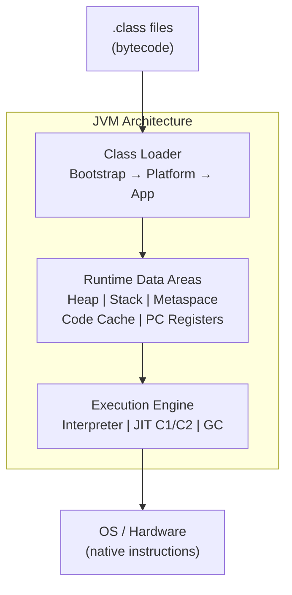

## Keywords in This File
{: .no_toc }

| # | Keyword | Weight |
|---|---|---|
| 1 | [JVM Architecture Overview](#jvm-architecture-overview) | high |
| 2 | [Interpretation vs JIT Compilation](#interpretation-vs-jit-compilation) | high |
| 3 | [Garbage Collection Overview](#garbage-collection-overview) | high |
| 4 | [JVM Ecosystem and Tools](#jvm-ecosystem-and-tools) | high |

---

# JVM Architecture Overview

**Interview Weight:** high - The mental model every Java engineer
needs. Tests whether you can describe the major components and
how they interact.

---

### 🎯 Model Answer

**30 seconds:**

> The JVM has three major components: Class Loader Subsystem (loads
> .class files), Runtime Data Areas (memory: heap, stack, metaspace,
> code cache), and Execution Engine (interpreter + JIT compiler +
> garbage collector). Your Java source compiles to bytecode (.class
> files) which are platform-independent. The JVM is the platform-
> specific layer that executes bytecode on the actual OS.

**3 minutes (Senior):**

> JVM architecture follows a layered model:
>
> **Class loading**: `.class` files are loaded, verified, prepared
> (static field defaults), resolved (symbolic references to concrete
> references), and initialized (static initializers run). The class
> loader hierarchy uses parent delegation: Bootstrap → Platform → App.
>
> **Runtime Data Areas**:
> - Heap: object instances (shared across all threads)
> - Stack: per-thread frames (local variables, operand stack, return address)
> - Metaspace (Java 8+): class metadata, method bytecode, interned strings
> - Code Cache: compiled native code from JIT
> - PC (Program Counter): per-thread, current bytecode instruction
>
> **Execution Engine**:
> - Interpreter: executes bytecode instructions one by one. Slow but
>   starts immediately.
> - JIT Compiler (C1/C2): compiles hot methods to native code. C1
>   (client) = fast compilation, modest optimization. C2 (server) =
>   slow compilation, aggressive optimization. Tiered compilation
>   (Java 7+) uses both.
> - GC: reclaims heap memory from unreachable objects.
>
> The JVM is the "write once, run anywhere" layer. Java bytecode
> is identical whether compiled on Windows or Linux; the JVM
> translates it to OS-native instructions.

---

### 💻 Code Example

**Example 1: Observing JVM components in action**

```java
// Class loading + initialization order
class Config {
    static {
        System.out.println("Config class initialized");  // runs once on first use
    }
    static final String DB_URL = "jdbc:postgresql://localhost/db";
}

// What happens when you run: new Config()
// 1. ClassLoader finds Config.class
// 2. Verifier checks bytecode safety
// 3. Static field DB_URL gets default null
// 4. Static initializer runs: prints "Config class initialized"
// 5. Object allocated on heap
// 6. Constructor runs

// JVM memory: observe at runtime
Runtime rt = Runtime.getRuntime();
System.out.println("Max heap:   " + rt.maxMemory()   / (1024*1024) + " MB");
System.out.println("Used heap:  " + (rt.totalMemory() - rt.freeMemory()) / (1024*1024) + " MB");
System.out.println("CPU cores:  " + rt.availableProcessors());

// JVM flags: view effective configuration
// $ java -XX:+PrintFlagsFinal -version 2>&1 | grep -E "HeapSize|NewRatio"
// intx NewRatio = 2 → Old:Young = 2:1 ratio
// uintx MaxHeapSize = 4294967296 (4GB default on 16GB machine)
```

> **Code walkthrough:** The static initializer block illustrates
> the class initialization phase of loading. It runs exactly once,
> the first time the class is used. The `Runtime` API gives a
> programmatic view of the heap; `-XX:+PrintFlagsFinal` dumps all
> JVM flags with their effective values - useful for auditing how
> the JVM is actually configured.

---

### 📊 Diagram

```
 JVM Architecture
 +-----------------+  +------------------+  +------------------+
 | Class Loader    |  | Runtime Data     |  | Execution Engine |
 | Subsystem       |  | Areas            |  |                  |
 |                 |  |                  |  | Interpreter      |
 | Bootstrap CL    |  | Heap (objects)   |  | JIT (C1/C2)      |
 | Platform CL     |  | Stack (per-thd)  |  | GC               |
 | App CL          |  | Metaspace        |  |                  |
 |                 |  | Code Cache       |  | Native Interface |
 +-----------------+  | PC Registers     |  | (JNI)            |
                       +------------------+  +------------------+
         ↑                     ↑
   .class files          OS / Hardware
```



> **Diagram walkthrough:** Class files flow in from left. The class
> loader reads them into the runtime data areas (memory). The
> execution engine interprets or JIT-compiles bytecode from the
> runtime areas and drives the GC to reclaim heap memory. The JNI
> layer allows calling OS-native code from Java.

---

### 🎓 Answers by Seniority

**Junior / Mid (0-5 years):**

> The JVM loads .class bytecode files, stores objects on the heap,
> and executes bytecode using an interpreter or JIT compiler. The
> GC reclaims unused heap memory.

---

**Senior / Staff (5+ years):**

> I think of the JVM in three planes: loading (class lifecycle),
> memory (heap/stack/metaspace allocation), and execution (interpreter
> warmup → JIT optimization). The code cache is often forgotten -
> it holds JIT-compiled native code and can fill up under heavy
> class loading, causing JIT deoptimization.

---

### ❓ Questions You Will Be Asked

#### Definition

- "What is the JVM and why is Java 'platform-independent'?"

🗣️ "The JVM is the virtual machine that executes Java bytecode.
Java source compiles to bytecode (.class files) - a platform-neutral
binary format. The JVM is platform-specific: there is a different
JVM binary for Windows, Linux, macOS, etc. Each JVM translates the
same bytecode to native machine instructions for its platform. This
is the 'write once, run anywhere' principle: the bytecode is
portable; the JVM is the portability layer. In contrast, C/C++
compiles directly to native code for a specific platform."

| Interviewer Type | Emphasis |
|---|---|
| Technical Panel  | Three subsystems, memory areas, execution tiers. |
| Hiring Manager   | Why JVM matters - platform independence, GC. |
| Bar Raiser       | Code cache, JIT deoptimization, JVMTI. |
| Peer Engineer    | "Our JVM OOMed in code cache on high deploy frequency..." |

---

---

# Interpretation vs JIT Compilation

**Interview Weight:** high - Explains why Java has a warm-up period
and how to tune JIT. Tests depth on tiered compilation.

---

### 🎯 Model Answer

**30 seconds:**

> Java starts in interpreted mode: the JVM reads each bytecode
> instruction and executes it without compilation. This is slow
> but starts immediately. When a method is called many times
> (default: 10,000 invocations), it becomes "hot" and the JIT
> compiler compiles it to optimized native code. After compilation,
> the method runs at near-native speed. This warm-up period means
> Java is slow at startup and fast under sustained load.

**3 minutes (Senior):**

> Tiered compilation (Java 7+ default, -XX:+TieredCompilation):
> - **Tier 0**: Interpreter. Profiling data collected (invocation
>   count, branch profiles).
> - **Tier 1-3**: C1 compiler. Fast compilation with light
>   optimization. Used for methods with moderate call count.
> - **Tier 4**: C2 compiler. Slow compilation with aggressive
>   optimization: inlining, escape analysis, loop unrolling,
>   vectorization. Requires substantial profiling data.
>
> JIT optimizations:
> - **Inlining**: replaces method call with method body. Eliminates
>   call overhead and enables further optimizations. The most
>   impactful JIT optimization.
> - **Escape analysis**: if an object doesn't escape the creating
>   method, allocate it on the stack (not heap) - no GC pressure.
> - **Deoptimization**: if a C2 assumption (e.g., "only one subclass
>   implements this interface") is invalidated (a new subclass is
>   loaded), the JVM deoptimizes: falls back to interpreter until
>   recompilation. Class loading at runtime can trigger sudden
>   performance drops.
>
> JVM warm-up time: 10,000 invocations before C2 compiles. In
> production: first N requests after deployment are slower. Mitigations:
> warm-up during deployment (canary traffic), JVM startup with
> pre-compiled code (AppCDS: Application Class Data Sharing).

---

### 💻 Code Example

**Example 1: Observing JIT warm-up and compilation**

```java
// Observe JIT compilation
// Add JVM flags to see what is being JIT-compiled:
// -XX:+PrintCompilation
// Output: timestamp  comp_id  tier  class::method  size

// Trigger JIT compilation (run method >10000 times)
// First 10000 calls: interpreted (slower)
// After 10000: JIT-compiled to native code (faster)
long sum = 0;
for (int i = 0; i < 100_000; i++) {
    sum += compute(i);      // JIT kicks in around iteration 10,000
}

// Inlining: check what is inlined
// -XX:+PrintInlining (diagnostic output)
// Method is inlining if bytecode size <= 35 bytes (default InlineSmallCode)
// Small methods always inlined: getters, simple utility methods

// Force compilation of specific method (useful for benchmarking)
// -XX:CompileOnly=com/example/MyClass.hotMethod

// Deoptimization trigger example
interface Processor { void process(); }
class FastProcessor implements Processor { ... }
// JIT inlines FastProcessor.process() - very fast
// Later: SlowProcessor added at runtime (new classloader)
// JIT deoptimizes: "polymorphic call site" - falls back to vtable dispatch

// AppCDS: share class data across JVM instances (faster startup)
// Step 1: create class list
// java -XX:DumpLoadedClassList=app.classlist -jar app.jar
// Step 2: create archive
// java -Xshare:dump -XX:SharedArchiveFile=app.jsa \
//     -XX:SharedClassListFile=app.classlist -jar app.jar
// Step 3: use archive
// java -XX:SharedArchiveFile=app.jsa -jar app.jar
// Result: startup time reduced by 20-50%
```

> **Code walkthrough:** `-XX:+PrintCompilation` shows every JIT
> compilation event with tier (1=C1, 4=C2). Small methods like
> getters are inlined automatically (remove the call overhead entirely).
> Deoptimization is the hidden cost of JIT: when assumptions break,
> performance drops suddenly until recompilation. AppCDS serializes
> class data to disk and memory-maps it on startup - critical for
> containerized apps that restart frequently.

---

### 🎓 Answers by Seniority

**Junior / Mid (0-5 years):**

> Java starts interpreted and JIT-compiles hot methods after ~10,000
> calls. JIT-compiled code runs at near-native speed. This explains
> the Java warm-up period: slow at first, fast under sustained load.

---

**Senior / Staff (5+ years):**

> Tiered compilation with C1 and C2 is the production default.
> C1 gives a quick performance boost early; C2 kicks in with heavy
> profiling data for aggressive optimization. Deoptimization is the
> danger: loading new classes at runtime can invalidate C2 assumptions
> and cause sudden throughput drops. I monitor JIT compile rate and
> deopt rate with JFR.

---

### ❓ Questions You Will Be Asked

#### Mechanism

- "Why does Java have a warm-up period? How do you reduce it?"

🗣️ "Java's warm-up is caused by JIT compilation. The JVM starts
in interpreted mode and collects profiling data (invocation counts,
branch outcomes). After ~10,000 invocations, it JIT-compiles the
method to optimized native code. Until compilation, the method runs
10-100x slower. To reduce warm-up: (1) AppCDS (Application Class
Data Sharing) pre-loads class data from a shared archive - reduces
startup by 20-50%; (2) tiered compilation (-XX:+TieredCompilation,
default) starts C1 compilation earlier for faster initial performance;
(3) Quarkus/Spring Native use GraalVM AOT compilation to compile
to native binary at build time - zero JVM warm-up, at the cost of
runtime adaptability."

| Interviewer Type | Emphasis |
|---|---|
| Technical Panel  | Tiered compilation tiers, inlining, deoptimization. |
| Hiring Manager   | Warm-up in production - canary deployments, AppCDS. |
| Bar Raiser       | Escape analysis, loop vectorization, GraalVM AOT. |
| Peer Engineer    | "Our first 30s of canary traffic had 10x higher latency..." |

---

---

# Garbage Collection Overview

**Interview Weight:** high - Foundational GC knowledge. Tests
understanding of how GC works conceptually before going deeper
into algorithms.

---

### 🎯 Model Answer

**30 seconds:**

> The JVM's GC automatically reclaims heap memory from objects that
> are no longer reachable. Starting from GC roots (local variables,
> static fields, JNI references), the GC traces the object graph.
> Any object not reachable from a root is garbage. The GC reclaims
> it. The two costs: pause time (application threads stop while GC
> runs) and throughput (CPU spent on GC, not application logic).

**3 minutes (Senior):**

> GC generations: the generational hypothesis says most objects
> die young. The heap is divided into Young (new objects) and Old
> (long-lived objects). Young generation has Eden + two Survivor
> spaces. Minor GC runs on Young only - fast, low pause. After
> surviving several GCs (default: 15), objects are promoted to
> Old. Major GC (Full GC) reclaims Old - slower, longer pause.
>
> Mark-and-sweep: (1) Mark - traverse from GC roots, mark live
> objects. (2) Sweep - reclaim unmarked (dead) objects. Problem:
> heap fragmentation (free spaces scattered). Solution: compaction
> (move live objects together, update references). Compaction is
> expensive (pause time).
>
> Stop-the-world (STW): the application threads must stop while
> the GC runs (for compacting collectors). Concurrent GC algorithms
> (G1, ZGC, Shenandoah) minimize STW by doing most work concurrently
> with the application. ZGC and Shenandoah target sub-millisecond
> pauses even on 100GB+ heaps.

---

### 💻 Code Example

**Example 1: GC visibility and basic tuning**

```java
// Trigger GC (hint - not guaranteed)
System.gc();  // BAD in production - can trigger Full GC at wrong time

// Monitor GC via MXBeans
for (GarbageCollectorMXBean gcBean :
        ManagementFactory.getGarbageCollectorMXBeans()) {
    System.out.printf("GC: %-20s count=%d time=%dms%n",
        gcBean.getName(),
        gcBean.getCollectionCount(),
        gcBean.getCollectionTime());
}
// Output example:
// GC: G1 Young Generation   count=142 time=312ms
// GC: G1 Old Generation     count=3   time=45ms

// Enable GC logging (Java 9+ unified logging)
// -Xlog:gc*:file=gc.log:time,uptime,level,tags
// Output: [1.234s][info][gc] GC(42) Pause Young (G1 Evacuation Pause) 512M->480M 8ms

// Simple allocation that creates GC pressure
List<byte[]> sink = new ArrayList<>();
for (int i = 0; i < 10000; i++) {
    byte[] data = new byte[1024];   // 1KB allocation
    sink.add(data);                 // kept alive: not collected
}
// Without the list reference: all byte[] are eligible for GC after loop
```

> **Code walkthrough:** The `GarbageCollectorMXBean` gives runtime
> GC statistics without profiling tools. The count and time tell
> you how often GC runs and how much pause time it introduces.
> Unified GC logging (`-Xlog:gc*`) is the Java 9+ replacement for
> `-XX:+PrintGCDetails` - it writes structured GC events including
> heap sizes before/after and pause duration.

---

### 🎓 Answers by Seniority

**Junior / Mid (0-5 years):**

> GC traces from roots, marks live objects, and reclaims unreachable
> ones. Objects start in Young generation, promoted to Old after
> surviving several GCs. Minor GC is fast; Full GC is slow and pauses
> the application.

---

**Senior / Staff (5+ years):**

> The production GC concern is pause time vs throughput trade-off.
> G1 is the default and good for most workloads. For latency-sensitive
> services (<1ms pause requirement), I evaluate ZGC or Shenandoah.
> I always enable GC logging in production - it is near-zero overhead
> and essential for diagnosing GC-related latency spikes.

---

### ❓ Questions You Will Be Asked

#### Definition

- "What is a stop-the-world pause in GC?"

🗣️ "A stop-the-world (STW) pause occurs when the GC needs the
application threads to stop so it can safely traverse the heap.
If threads continue running while GC moves objects, references
become stale (the GC moved the object, but the thread still has
the old address). To prevent this, the JVM uses safepoints:
points in the bytecode where all threads can be safely paused.
The GC requests a safepoint, all threads pause, the GC runs its
STW phase, then threads resume. STW pauses cause application
latency spikes - a 200ms GC pause = 200ms latency spike for all
pending requests. Concurrent collectors (G1, ZGC, Shenandoah) do
most work concurrently with the application to minimize STW time."

| Interviewer Type | Emphasis |
|---|---|
| Technical Panel  | GC roots, mark-sweep-compact, generations. |
| Hiring Manager   | GC logging setup for production. |
| Bar Raiser       | Safepoints, concurrent phases, read/write barriers. |
| Peer Engineer    | "We had 200ms latency spikes - all caused by Old GC pauses..." |

---

---

# JVM Ecosystem and Tools

**Interview Weight:** high - Practical orientation. Tests which
JVM distributions, diagnostic tools, and monitoring approaches
you are familiar with.

---

### 🎯 Model Answer

**30 seconds:**

> Key JVM distributions: OpenJDK (community baseline), Oracle JDK
> (commercial support), Amazon Corretto, Eclipse Temurin (formerly
> AdoptOpenJDK), Azul Zulu, GraalVM. Core diagnostic tools:
> `jstack` (thread dumps), `jmap` (heap dumps), `jstat` (GC statistics),
> `jcmd` (unified: replaces all of the above), JFR/Mission Control
> (profiling), async-profiler (CPU and allocation profiling without
> safepoint bias). Monitoring: JMX metrics exposed to Prometheus
> via micrometer or JMX exporter.

**3 minutes (Senior):**

> **JVM distributions matter for:**
> - License: Oracle JDK requires commercial license after Java 8 update 201.
>   OpenJDK-based distributions (Temurin, Corretto, Zulu) are free.
> - Performance: Azul Zing uses C4 GC (pauseless). GraalVM has the
>   Graal JIT compiler (better than C2 in some benchmarks) and AOT
>   native-image compilation.
> - Update cadence: major version every 6 months, LTS versions
>   (Java 11, 17, 21) have long support windows.
>
> **Diagnostic tools tier:**
> - **Command-line (JDK tools)**: `jcmd <pid> Thread.print`,
>   `jcmd <pid> GC.heap_info`, `jcmd <pid> VM.flags`, `jstat -gcutil <pid> 1s`
> - **Profiling**: JFR (Java Flight Recorder) built into HotSpot;
>   low overhead (~1%). async-profiler for flame graphs without
>   safepoint bias.
> - **APM**: Datadog, New Relic, AppDynamics auto-instrument JVM
>   metrics and traces.
>
> **The safepoint bias problem**: `jstack` and `jstat` only capture
> thread state at safepoints. Methods that never reach a safepoint
> (tight loops) appear invisible to sampling profilers. async-profiler
> uses `AsyncGetCallTrace` JVMTI API to profile at any instruction,
> eliminating bias.

---

### 💻 Code Example

**Example 1: Key diagnostic commands**

```bash
# Get process ID
jps -l
# 12345 com.example.MyApp

# Thread dump (all threads + locks)
jcmd 12345 Thread.print
# or: jstack 12345 > threaddump.txt

# GC statistics (1s interval)
jstat -gcutil 12345 1000
#  S0     S1     E      O      M     CCS    YGC   YGCT    FGC   FGCT    CGC   CGCT    GCT
#   0.00  40.26  25.17  11.38  95.13  91.26    234    1.234     1    0.042    -      -    1.276

# Heap dump (for memory analysis)
jcmd 12345 GC.heap_dump /tmp/heap.hprof
# Analyze with: Eclipse MAT, VisualVM, or jmap -histo:live

# JVM flags in effect
jcmd 12345 VM.flags
# Useful: check -Xmx, -Xms, GC algorithm in use

# JFR recording (low-overhead, safe in production)
jcmd 12345 JFR.start duration=60s filename=/tmp/recording.jfr
jcmd 12345 JFR.check
# Open with: Java Mission Control (JMC)

# Heap summary without full dump
jcmd 12345 GC.heap_info
# Heap address: 0x00000007c0000000
# Size: 4096MB Committed: 2048MB

# async-profiler flame graph (no safepoint bias)
# ./profiler.sh -d 30 -f flamegraph.html 12345
```

> **Code walkthrough:** `jcmd` is the Swiss Army knife: one tool
> for thread dumps, heap dumps, JFR, flags, and heap info. `jstat
> -gcutil` prints GC columns every 1s: S0/S1=survivor usage %,
> E=eden %, O=old %, YGC/YGCT=young GC count/time, FGC=full GC
> count. Rising O% with Full GC events is the classic heap pressure
> signal.

---

### 🎓 Answers by Seniority

**Junior / Mid (0-5 years):**

> Key tools: `jstack` for thread dumps, `jmap`/`jcmd` for heap dumps,
> `jstat` for GC stats, JFR for profiling. JVM distributions include
> OpenJDK, Temurin, Corretto. Oracle JDK requires a license after
> Java 8 u201.

---

**Senior / Staff (5+ years):**

> I default to `jcmd` for ad-hoc diagnosis and JFR for production
> profiling. The safepoint bias of traditional profilers is real -
> I use async-profiler when I need accurate CPU flame graphs.
> For container environments I configure JMX metrics → Prometheus
> via micrometer for continuous GC monitoring without connecting to
> the process.

---

### ❓ Questions You Will Be Asked

#### Mechanism

- "How would you generate a thread dump in production? What does
  it tell you?"

🗣️ "Three methods: `jcmd <pid> Thread.print`, `kill -3 <pid>`
(sends SIGQUIT, JVM dumps to stdout/stderr), or `jstack <pid>`.
A thread dump is a snapshot of every thread's state and stack trace.
What it tells you: (1) BLOCKED threads - waiting on a monitor lock
held by another thread (potential deadlock); (2) WAITING threads -
parked waiting for `notify()` or future completion; (3) RUNNABLE
threads - actively running (or waiting for I/O); (4) Deadlock report
at the bottom - 'Found one Java-level deadlock'. Take 2-3 dumps
10 seconds apart to distinguish threads stuck permanently vs
threads that are just slow. Threads that appear on the same line
across all dumps are the suspects."

| Interviewer Type | Emphasis |
|---|---|
| Technical Panel  | jcmd vs jstack vs kill -3, safepoint bias, JFR overhead. |
| Hiring Manager   | Production diagnostics workflow. |
| Bar Raiser       | async-profiler, JVMTI, safepoint bias, JMX → Prometheus. |
| Peer Engineer    | "We narrowed a production hang to a deadlock in 5 minutes with jstack..." |
