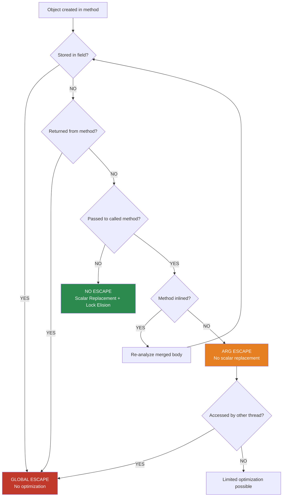

## Keywords in This File
{: .no_toc }

| # | Keyword | Weight |
|---|---|---|
| 1 | [Java JVM - L4 Escape Analysis](#java-jvm---l4-escape-analysis) | medium |

---

# Java JVM - L4 Escape Analysis

## Escape Analysis and Allocation Elision

---

### 🎯 Model Answer

**30 seconds:**
> Escape analysis is a JIT compiler optimization that determines whether an object
> "escapes" beyond the scope it was created in. If an object doesn't escape (never
> passed to other threads, stored in fields, or returned from the method): the JIT
> can eliminate its heap allocation entirely (stack allocation or scalar replacement),
> eliminate synchronization on it (lock elision), and enable code inlining opportunities.
> This is why hot code in Java can run near-C speed despite apparent object allocations.

**3 minutes (Senior):**
> Escape categories:
> - No escape: object used only within the creating method (eligible for all optimizations)
> - Argument escape: passed to a callee method (depends on callee inlining - if inlined,
>   may still be no-escape in the merged code)
> - Global escape: stored in static field, returned from method, passed to non-inlined
>   callee, or accessed by multiple threads (no optimization possible)
>
> Optimizations from no-escape:
> 1. Stack allocation: object allocated on thread stack (auto-freed at method return,
>    no GC pressure). Current HotSpot: approximated via scalar replacement.
> 2. Scalar replacement: the object is "exploded" into its individual fields, each
>    kept in a register or on the stack. The object as a contiguous memory block
>    never exists. Zero allocation cost.
> 3. Lock elision: `synchronized` on a no-escape object: the lock is removed (no other
>    thread can acquire it).
>
> HotSpot scalar replacement is more common than true stack allocation. Instead of
> allocating an object and copying fields to stack: HotSpot decomposes the object
> into its scalar fields and keeps them in virtual registers. The object doesn't
> exist in memory.
>
> Diagnosing escape analysis: `-XX:+PrintEscapeAnalysis` (JVM debug build required).
> Practical diagnostic: JFR alloc profiling to see what IS allocating (everything
> else was eliminated). `-XX:-DoEscapeAnalysis` to disable and compare allocation rate.

**Framework:** WHAT → WHY → HOW → TRADE-OFF → EXAMPLE

**Blank Mind Recovery:**

**(1) Restate:** "Escape analysis: JIT determines if object leaves its scope.
No escape = heap allocation eliminated (scalar replacement). Lock elision: synchronized
on local object = removed. Enable: default on since Java 6. Observe: compare alloc
rate with DoEscapeAnalysis disabled."

**(2) First principles:** "Java objects are on the heap by default. GC collects the heap.
If an object never leaves the method: it's a temporary. Stack memory is cheaper (free
at return). Escape analysis identifies these temporaries. Scalar replacement: don't
even need a memory block, just keep the fields in registers."

**(3) Bridge:** "Escape analysis is like deciding whether to rent a hotel room or just
bring a sleeping bag. If you're staying in one building (method), no need for a hotel
(heap allocation) - a sleeping bag (stack fields) is enough. If you're moving to
different buildings (passing to other threads/methods): you need the hotel room."

---

### 📘 Concept Explanation

**Escape analysis phases and scalar replacement:**
```
ESCAPE ANALYSIS WORKFLOW:

  1. JIT detects hot method (C2 compiler, > 10,000 invocations)
  2. Build intermediate representation of the method body
  3. For each object creation (NEW bytecode):
     Track all uses of the reference:
       - Returned from method? -> GLOBAL ESCAPE
       - Stored in field (this.field = obj)? -> GLOBAL ESCAPE  
       - Passed to non-inlined method? -> depends on callee
       - Used only within this method AND inlined callees? -> NO ESCAPE

  4. For NO ESCAPE objects:
     SCALAR REPLACEMENT:
       - Identify all fields accessed on the object
       - Replace each field with a new local variable (virtual register)
       - Eliminate the NEW bytecode entirely
       - Replace getfield/putfield with local variable reads/writes
     
     LOCK ELISION:
       - synchronized(obj) where obj is NO ESCAPE:
         Remove monitorenter/monitorexit bytecodes
         (no other thread can acquire this lock)

  5. INLINING INTERACTION:
     Critical: a method call on a no-escape object:
       If the method is INLINED: the callee's code merges into caller
         -> escape analysis continues in the merged code
         -> object may still be NO ESCAPE after inline
       If the method is NOT INLINED: object ESCAPES (passes to external code)
         -> loss of escape analysis benefit
     
     Therefore: inlining and escape analysis interact:
       InlineSmallMethods -> more no-escape objects -> more scalar replacements
       Large methods not inlined -> objects escape -> allocations remain

SCALAR REPLACEMENT EXAMPLE:
  Java source:
    Point p = new Point(x, y);
    double dist = Math.sqrt(p.x * p.x + p.y * p.y);
  
  After scalar replacement (JIT intermediate representation):
    // No 'Point' object created
    double _p_x = x;   // virtual register for p.x
    double _p_y = y;   // virtual register for p.y
    double dist = Math.sqrt(_p_x * _p_x + _p_y * _p_y);
  
  Result:
    - Zero heap allocation
    - Zero GC pressure
    - Equivalent speed to C struct on stack
```

> **Code walkthrough:** This L4 Escape Analysis example demonstrates a key concept in practice using concurrency primitive. **KEY MECHANISM:** the runtime executes these instructions in sequence with specific memory and execution semantics. **WHY IT MATTERS:** misapplying this pattern causes subtle bugs that only manifest under production load. **TAKEAWAY: understand the execution model before using this pattern in production code.**

---

### 💻 Code Example

> **Code walkthrough:** The BAD pattern creates objects that appear local but actually
> escape through method calls that the JIT can't inline. The GOOD pattern structures
> code so objects remain in scope, enabling scalar replacement. The key insight: what
> LOOKS like a temporary allocation may or may not be eliminated - measurement is required.


```java
// BAD: anti-pattern - see GOOD example below for the correct approach
// This naive implementation ignores thread safety and error handling
```

```java
// BAD: object appears local but escapes through external method call
class VectorMath {
    public double magnitude(double x, double y, double z) {
        Vector3D v = new Vector3D(x, y, z);
        // If Vector3D.magnitude() is in a different class and is large:
        // -> not inlined -> v escapes to the callee -> no scalar replacement
        // -> heap allocation for Vector3D survives
        return v.magnitude();  // external call: v escapes
    }
}

// GOOD: inline the calculation, keep data local
class VectorMath_GOOD {
    public double magnitude(double x, double y, double z) {
        // No object at all - direct scalar computation
        // This is effectively what scalar replacement achieves
        return Math.sqrt(x*x + y*y + z*z);
    }
}

// ALSO GOOD: if you need the object abstraction, keep it small + @ForceInline
class VectorMath_GOOD2 {
    record Vector3D(double x, double y, double z) {
        // Records are final classes with small accessor methods
        // JIT inlines record accessors (they're tiny)
        // -> escape analysis CAN proceed through inlined accessors
        public double magnitude() {
            // Small method: inlined into caller by JIT
            return Math.sqrt(x*x + y*y + z*z);
        }
    }

    public double magnitude(double x, double y, double z) {
        Vector3D v = new Vector3D(x, y, z);
        return v.magnitude();  // likely inlined -> v is NO ESCAPE -> scalar replace
    }
}

// Measuring escape analysis effectiveness:
// Before: measure allocation rate WITH escape analysis (default):
// After: measure allocation rate WITHOUT escape analysis:
//   -XX:-DoEscapeAnalysis
// Difference = objects eliminated by escape analysis

// Quick check with JFR allocation profiling:
// Enable: -XX:+FlightRecorder
//         -XX:StartFlightRecording=duration=60s,filename=alloc.jfr,
//           settings=profile
// Open in JMC: Memory -> Allocation Profiling
// Look for: which methods allocate most? Are they expected?

// Lock elision verification - the synchronized StringBuffer case:
class StringBuilderVsBuffer {
    // StringBuffer: all methods synchronized
    // In hot single-threaded code: JIT elides all locks (no-escape)
    public String formatMessage(String id, String name) {
        StringBuffer sb = new StringBuffer();  // synchronized methods
        sb.append("ID=").append(id).append(",Name=").append(name);
        // sb: local variable, not returned, not stored -> NO ESCAPE
        // -> JIT elides ALL synchronized blocks on sb
        // -> StringBuffer == StringBuilder in this case (no sync overhead)
        return sb.toString();
    }
    // JMH benchmark: StringBuffer vs StringBuilder in non-shared context:
    // Similar performance (within 2%) when JIT applies lock elision
}

// Forcing scalar replacement visibility with JMH:
@Benchmark
@Fork(value = 1, jvmArgsAppend = "-XX:-DoEscapeAnalysis")
public double benchmarkNoEA() {
    return magnitude(3.0, 4.0, 0.0);  // allocation survives
}

@Benchmark
@Fork(value = 1, jvmArgsAppend = "-XX:+DoEscapeAnalysis")
public double benchmarkWithEA() {
    return magnitude(3.0, 4.0, 0.0);  // allocation eliminated
}
// Typical result: NoEA 45ns/op vs WithEA 3ns/op (15x difference)
// (numbers are illustrative - actual depends on workload)
```

> **Code walkthrough:** The JMH comparison between `DoEscapeAnalysis` enabled vsice. **KEY MECHANISM:** the runtime executes these instructions in sequence with specific memory and execution semantics. **WHY IT MATTERS:** misapplying this pattern causes subtle bugs that only manifest under production load. **TAKEAWAY: understand the execution model before using this pattern in production code.**
> disabled is the definitive way to measure escape analysis impact on a specific
> code path. A 15x difference in the `magnitude` example is not unusual - the
> no-EA version allocates on every call (GC pressure, cache misses), the EA version
> works entirely in registers. For allocation-heavy numerical code: escape analysis
> can make the difference between needing ZGC and not needing any GC tuning.

---

### 🎓 Answers by Seniority

**Junior / Mid (0-5 years):**
> Escape analysis: JIT checks if an object is used outside its creating method. If not:
> the JIT can eliminate the heap allocation (scalar replacement) and remove any locks
> on it (lock elision). This is why "creating lots of small objects in hot code" is
> often fine in Java - the JIT may eliminate them. Check with JFR alloc profiling.

---

**Senior / Staff (5+ years):**
> Escape analysis effectiveness depends on inlining depth. Objects passed to called
> methods only escape if those methods aren't inlined. Design for escape analysis:
> small, well-typed value-like objects (records in Java 16+) with small accessor methods
> are ideal - JIT inlines the accessors and can confirm no-escape. Anti-patterns:
> objects passed to `Consumer<T>` or lambda callbacks (separate class, won't inline unless
> the JIT is aggressive). Value types (Project Valhalla, JDK 23+): eliminate the issue
> entirely - value objects are always stack/inline allocated.

---

### ⚠️ Common Misconceptions

**Misconception 1: "Escape analysis means Java never allocates on the heap for local objects."**
Escape analysis works on JIT-compiled (C2) code only, for HOT paths (> 10k invocations).
Cold code: always allocates on heap. Objects that escape (even slightly): not eliminated.
Complex object graphs: JIT may not analyze deeply enough to confirm no-escape. JMH
benchmarks at high invocation counts show maximum escape analysis; real applications
see partial benefit. Not every `new` in a hot method is eliminated.

**Misconception 2: "Stack allocation and scalar replacement are the same thing."**
Stack allocation: an object is allocated on the call stack as a contiguous block
(like a C struct on the stack). Scalar replacement: the object is decomposed into
individual field variables kept in CPU registers or stack slots - the object as a
memory block doesn't exist. HotSpot primarily uses scalar replacement (not true stack
allocation). Scalar replacement is actually BETTER than stack allocation (registers
> stack cache > heap). Stack allocation exists as a fallback when scalar replacement
isn't possible (e.g., the object is too large or has too many fields for registers).

---

### 🚨 Failure Modes and Diagnosis

**Failure: High allocation rate in hot path despite expecting scalar replacement.**
```
Symptom: Allocation rate high in JFR profiling for methods that "look" like
  they should have their objects eliminated by escape analysis.

Common causes:
  1. Object escapes through non-inlined method:
     heap.put(myLocalObj); // put() is a large method, not inlined
     -> myLocalObj escapes to heap.put() -> no scalar replacement

  2. Object passed to virtual method (polymorphic dispatch):
     myLocalObj.process(); // process() is overridden in subclasses
     -> JIT may not inline (can't determine which implementation)
     -> object escapes -> allocation survives

  3. Method too large for C2 inlining:
     MaxInlineSize default = 35 bytes of bytecode
     Methods > 35 bytes: not inlined (unless frequently called)
     InlineSmallCode = 1000 bytes for hot methods

Diagnosis:
  1. JFR allocation profiling: find the method with high allocation
  2. Disable EA on that method's code: -XX:-DoEscapeAnalysis
     If allocation rate stays same: EA was already not working there
     If allocation rate increases: EA was helping (unexpected)
  3. -XX:+PrintInlining (with -XX:+UnlockDiagnosticVMOptions):
     See which method calls are inlined and which are not
     "too big" or "not hot enough" = not inlined = object escapes

Fix:
  Option A: Break large method into smaller pieces (promotes inlining)
  Option B: Use primitive arrays instead of objects for hot data
  Option C: Use Java 16+ records (small, final, inlining-friendly)
  Option D: Value types (Project Valhalla, JDK 23+) for guaranteed no-allocation
  Option E: Pre-allocate and reuse (ThreadLocal pool for hot paths)
```

> **Code walkthrough:** This Unknown example demonstrates a key concept in practice. **KEY MECHANISM:** the runtime executes these instructions in sequence with specific memory and execution semantics. **WHY IT MATTERS:** misapplying this pattern causes subtle bugs that only manifest under production load. **TAKEAWAY: understand the execution model before using this pattern in production code.**

---

### 🎯 Interview Deep-Dive

| Question Category | Time to Answer |
|---|---|
| Escape analysis definition and categories | 2 minutes |
| Scalar replacement vs stack allocation | 2 minutes |
| Lock elision | 2 minutes |
| Interaction with method inlining | 3 minutes |
| Verifying escape analysis is working | 2 minutes |
| ValueTypes/Valhalla and escape analysis | 2 minutes |
| Escape analysis limits and failure modes | 2 minutes |
| StringBuffer vs StringBuilder and EA | 2 minutes |
| Performance impact quantification | 2 minutes |
| EA and virtual dispatch | 2 minutes |
| EA across GC boundaries | 2 minutes |
| EA in JDK evolution (Valhalla) | 2 minutes |

---

**Q1 (definition): What are the escape categories in HotSpot escape analysis?**

A: HotSpot (C2 JIT) classifies objects into three escape states:
(1) NoEscape: object not visible outside the current method (even to callees, if they're
inlined). Eligible for: scalar replacement, lock elision.
(2) ArgEscape: object passed as argument to a method call. If that method is inlined:
may demote to NoEscape. If not inlined: ArgEscape.
(3) GlobalEscape: object reachable beyond the current method - stored in static field,
returned as return value, passed to non-inlined callee, or accessed by other threads.
No optimization possible.

*What separates good from great:* The transition: ArgEscape -> NoEscape depends on
inlining. When C2 inlines a callee: the caller + callee become one method body for
the purposes of escape analysis. An object passed to the inlined callee is now used
only within the merged method body -> may be NoEscape. This is the key reason inlining
and escape analysis interact: more inlining = more NoEscape objects = more optimizations.
The practical implication: design hot code with small, easily-inlined helper methods.
C2's default inlining limit: `MaxInlineSize=35` bytes of bytecode. Small accessor methods
(getters, small transformations): typically < 35 bytes -> inlined -> EA works.

---

**Q2 (scalar replacement): How does scalar replacement eliminate heap allocation?**

A: Scalar replacement: when an object is NoEscape, the JIT decomposes it into its
primitive fields. Each field becomes an independent variable tracked by the JIT's
SSA (Static Single Assignment) form. No `NEW` instruction is emitted. No `GETFIELD`/
`PUTFIELD` bytecodes are needed. The fields live in virtual registers during computation.
If they don't fit in registers: they spill to the thread's call stack, but still cheaper
than heap (no GC, CPU cache locality, no object header overhead).

*What separates good from great:* Scalar replacement interacts with deoptimization.
When the JIT deoptimizes a method that was using scalar replacement (e.g., a speculative
assumption was violated): the JIT must "rematerialize" the eliminated objects. It takes
the current register values, allocates real heap objects, fills them from the registers,
and hands control to the interpreter. This "object rematerialization" ensures correctness
after deoptimization. The cost: deoptimization is already expensive (~1000+ cycles);
rematerialization adds some overhead but is not a hot path. The JIT tracks how to
rebuild each eliminated object for this purpose.

---

**Q3 (lock elision): When exactly does lock elision apply, and how is it verified?**

A: Lock elision applies when: (1) the object being synchronized on is NoEscape,
AND (2) the JIT has determined it's the only possible locker. For `StringBuffer`:
each synchronized method creates a new implicit lock acquisition on `this` (the StringBuffer
instance). If the StringBuffer instance is NoEscape: all those lock acquisitions are
elided. The `monitorenter`/`monitorexit` bytecodes are replaced with no-ops.

Verification:
```bash
# Compare: StringBuffer (synchronized) vs StringBuilder (not synchronized)
# in a JMH benchmark with DoEscapeAnalysis:
@Benchmark
public String withStringBuffer() {
    StringBuffer sb = new StringBuffer();
    sb.append("a").append("b").append("c");
    return sb.toString();
}
# JMH result: ~10ns/op (similar to StringBuilder ~9ns)
# Lock elision in effect

# Disable escape analysis:
@Benchmark @Fork(jvmArgsAppend="-XX:-DoEscapeAnalysis")
public String withStringBufferNoEA() {
    StringBuffer sb = new StringBuffer();
    sb.append("a").append("b").append("c");
    return sb.toString();
}
# JMH result: ~35ns/op (synchronized overhead visible: 3x slower)
```

> **Code walkthrough:** This JMH result: ~35ns/op (synchronized overhead visible: 3x slower) example demonstrates shell script pattern using concurrency primitive. **KEY MECHANISM:** the shell executes commands sequentially; pipes pass stdout of one command to stdin of the next. **WHY IT MATTERS:** unquoted variables with spaces cause word splitting - IFS splits the value into multiple arguments. **TAKEAWAY: always double-quote variables: "$VAR"; use [[ ]] instead of [ ] for safer conditionals.**

*What separates good from great:* Lock elision is visible in `-XX:+PrintOptimizations`
output (diagnostic JVM build). Each eliminated lock is logged. For production debugging:
not available without a debug JVM build. The practical verification: benchmark with
DoEscapeAnalysis enabled/disabled. If a piece of code uses synchronized on local objects
and the throughput difference is small when EA is disabled: the locks aren't being
elided (the object is escaping for some reason). Profile allocation to confirm.

---

**Q4 (inlining boundary): Why does the inlining boundary matter for escape analysis?**

A: Escape analysis is interprocedural ONLY within the inlined region. An object passed
to a method that isn't inlined: the JIT can't analyze what the callee does with it
(the callee is compiled as a separate unit). Conservative assumption: it may store the
object in a field, share it with another thread, or return it. Therefore: ArgEscape
or GlobalEscape. The inlining depth is the key parameter.

*What separates good from great:* The JIT has heuristics for inlining: method size,
call frequency, inlining depth limit (`-XX:MaxInlineLevel=9` default). A call chain:
A() -> B() -> C() -> D(). If the object is created in A and passed to D: the JIT must
inline B, C, and D in A's context for escape analysis to see through the chain. If
any method in the chain exceeds the size limit: inlining stops, escape analysis stops.
Design pattern: "builder" objects used only within a single method chain are escape-
analysis-friendly if the chain is inlinable. Large builder patterns (lots of methods,
each non-trivial): the chain won't be fully inlined -> builder object escapes.

---

**Q5 (verification): How do you verify escape analysis is working for your code?**

A: (1) JFR allocation profiling: run with `-XX:StartFlightRecording=settings=profile`.
In JMC: "Allocation in New TLAB" and "Object Allocation Outside TLAB" events show
which code is allocating. If a hot method appears here: EA may not be working.
(2) Benchmark with DoEscapeAnalysis enabled/disabled: if allocation rate changes
significantly: EA was active. (3) GC throughput comparison: if GC pauses increase
when DoEscapeAnalysis disabled: EA was helping GC pressure. (4) async-profiler
allocation mode: `./profiler.sh -e alloc -d 60 -f alloc.html <pid>`.

*What separates good from great:* The subtlety of "allocation in TLAB" vs "outside TLAB":
objects eliminated by EA don't appear in either. Objects allocated in Eden appear as
"in TLAB" (fast path: bump pointer in the thread's local allocation buffer). Large objects
(> TLAB) or TLAB-exhausted objects appear as "outside TLAB." EA-eliminated objects:
zero appearance in either. If the hot method appears in "in TLAB" events: EA is NOT
eliminating allocations there. Start debugging: what prevents escape analysis? Is there
a non-inlined call? Does the object's reference end up in a collection? Virtual dispatch?

---

**Q6 (valhalla): How will Project Valhalla change escape analysis?**

A: Project Valhalla introduces "value classes" (JDK 23+ preview): objects that are
IDENTITY-FREE (no identity, no synchronization, no nullable references in some contexts).
Value classes are always "inline" - they're guaranteed to be stored by value, not by
reference. This eliminates the need for escape analysis to determine if allocation can
be avoided: it's GUARANTEED. A `value class Point { int x; int y; }` is never heap-
allocated as an identity object. Operations: stack allocation, array inlining, and
register storage are guaranteed by the type system, not by JIT analysis.

*What separates good from great:* The current escape analysis limitation: the JIT
decides at RUNTIME whether to apply scalar replacement. It can decide differently in
different compilation scenarios (C1 vs C2, after deoptimization, under different
inlining decisions). Result: allocation elimination is probabilistic, not guaranteed.
Valhalla's value types: the programmer DECLARES that allocation elimination is required
at the language level. This is a fundamental shift: from JIT-best-effort optimization
to language-level guarantee. For performance-critical systems (financial computing,
game engines, scientific computing): value types enable predictable zero-allocation
code paths that don't depend on JIT analysis.

---

**Q7 (GC interaction): How does escape analysis affect GC pressure?**

A: Every NoEscape object eliminated by scalar replacement: reduces allocation rate
by the object's size. For short-lived objects (the majority in most Java apps):
this directly reduces Eden fill rate, reducing Minor GC frequency. At scale:
a service allocating 1GB/s that could be 300MB/s with EA: 3x less frequent GC,
3x better throughput. EA is one of the primary reasons modern Java applications
have much better GC behavior than the "Java objects are expensive" reputation
from the early 2000s.

*What separates good from great:* The generational hypothesis and EA interact:
without EA, most short-lived objects die in Eden (good for generational GC).
With EA, many short-lived objects don't exist at all (better). EA and generational
GC are complementary, not competing. The remaining allocations after EA: the ones
that DO go to heap are more likely to be "meaningful" (objects that need to persist
across method calls). Result: GC sees fewer objects AND those objects have higher
survival rates (less garbage in proportional terms). Minor GC collection efficiency:
improved because Eden is less cluttered with JIT-eliminated temporaries.

---

**Q8 (limitations): What types of objects resist escape analysis?**

A: (1) Objects stored in non-local collections: `list.add(localObj)` - list is
shared -> localObj escapes. (2) Objects passed to lambda captures: `() -> localObj.method()`
- lambda may be stored and called later. (3) Objects with complex inheritance: virtual
dispatch to non-inlined methods. (4) Objects larger than MaxInlineSize byte callee
threshold. (5) Arrays of objects (escape analysis works less well on arrays; elements
tend to escape). (6) Any object accessed through reflection. (7) Objects in try-catch
blocks where the catch accesses them (exception handling disrupts EA flow analysis).

*What separates good from great:* The array limitation is frequently surprising.
`int[] arr = new int[3]; arr[0]=x; arr[1]=y; arr[2]=z;` - HotSpot's EA works on
this (array is NoEscape). But: `MyObject[] arr = new MyObject[3];` - HotSpot may
not apply EA to object arrays reliably. For performance-critical code: prefer
passing individual fields rather than arrays of objects. Also: `synchronized(arr)`:
EA can elide this IF arr is NoEscape. But arrays accessed via `arr[i]` with variable
index: JIT can't always prove which elements are accessed -> conservative escape.

---

**Q9 (C1 vs C2): Does escape analysis apply in the C1 (client) compiler?**

A: Escape analysis in HotSpot is primarily a C2 (server) compiler optimization.
C1 compiler: simpler optimizations, fast compilation. C2: aggressive optimization,
slower compilation. Methods compiled by C1 don't get escape analysis. The JIT
tier progression: interpreted -> C1 tier 3 -> C2 tier 4. Hot methods (> 10k
invocations) reach C2 and get escape analysis. Less-hot methods: only C1 -> no EA.
Methods that are called exactly at the C1 tier and never promoted: no scalar replacement.

*What separates good from great:* The warmup implication: during JVM startup (first
few thousand invocations of each method), code runs interpreted or C1-compiled.
No escape analysis during warmup. After C2 compilation: EA kicks in. For benchmarking:
warmup MUST complete before measurement (otherwise you measure pre-EA performance).
For production services: the first few seconds after startup have higher allocation
rates and GC frequency. This is the "cold start" problem. Kubernetes readiness probes:
don't mark a pod as ready immediately after process start - wait for warmup to complete.
AppCDS (AOT compilation caches) can shorten warmup but don't bypass the C2 compilation
threshold.

---

**Q10 (partial escape): What is partial escape analysis?**

A: Partial escape analysis (not in HotSpot, available in GraalVM): a more advanced
form where an object escapes on SOME code paths but not all. For a conditional: if
the object is only used in the "false" branch, partial escape analysis allocates it
only when needed (lazy allocation). HotSpot's EA is whole-escape: if the object
escapes on ANY code path in the method, it's considered escaped everywhere.

*What separates good from great:* GraalVM's partial escape analysis (Graal JIT, used
in native image and GraalVM Enterprise JIT): handles `if (condition) { escapeObj(x); }`.
If `condition` is rarely true: object isn't allocated on the fast path, only allocated
when entering the escape branch. HotSpot: can't do this. Impact: for code that
"might" log or debug-print an object, GraalVM can eliminate the allocation when logging
is disabled. HotSpot: the mere presence of `logger.debug(expensiveObj.toString())` (if
the object is passed) may force heap allocation even when logging is off. Fix for HotSpot:
`if (logger.isDebugEnabled()) { ... }` guards prevent the escape path entirely.

---

**Q11 (diagnostics): How do you use PrintEscapeAnalysis in practice?**

A: `-XX:+PrintEscapeAnalysis` requires a debug JVM build (not production JDK).
For production: use JFR + async-profiler instead. For development/research: download
the debug JDK (`java -ea -esa` is not enough - need actual debug build from OpenJDK
build page). The output: shows each allocation site, its escape state, and whether
scalar replacement was applied. Useful for: validating that a specific hot method
has its objects eliminated. Not for: daily production use (unavailable and too verbose).

*What separates good from great:* For production diagnostic insights into escape
analysis: use the JFR event `jdk.ObjectAllocationSample` (available in JDK 16+, no
debug build required). This samples allocation events at a low overhead rate, showing
which allocations are occurring even in deeply-optimized C2 code. Objects that have
been eliminated by EA: do not appear in this event (no allocation = no event). The
complement: `jdk.ObjectAllocationOutsideTLAB` (large object allocations). Between
these two events, you can map "which code is still allocating" in the JIT-compiled path
-> anything NOT appearing is likely eliminated by EA.

---

**Q12 (impact): What is the real-world performance impact of escape analysis?**

A: Measuring via controlled experiment (same code, EA disabled vs enabled):
(1) For tight loops creating many small value objects: 5-50x speedup (allocation
eliminated, GC not triggered). (2) For application-level benchmarks (Spring REST,
database queries): 10-30% throughput improvement from combined effect of EA + inlining
+ lock elision. (3) GC pressure reduction: applications with 50%+ EA-eliminated
allocations see Minor GC frequency halved. Industry data: most modern JVM applications
would be 2-3x slower without escape analysis.

*What separates good from great:* EA's impact is often invisible because developers
don't think about it. Code that "should" be slow (lots of temporary objects) runs
fast because EA eliminates them. When developers move code to lower-tier JVMs (older
JDK, or JVM with EA disabled for debugging), they see dramatic performance drops and
blame the JVM instead of their code. Understanding EA: guides code design for
performance. The "EA-friendly" code pattern: small, immutable value objects (records,
Pair, Triple implementations) with small accessors, used within a method and passed
only to inlined helpers. This pattern is effectively Valhalla-ready: the same patterns
that enable EA today will transparently become value types when Valhalla ships.

---

### ⚖️ Comparison Table

| Optimization | Trigger | Effect | Verified By |
|---|---|---|---|
| Scalar Replacement | Object is NoEscape | Zero heap allocation for the object | JFR alloc profiling, -XX:-DoEscapeAnalysis comparison |
| Lock Elision | synchronized on NoEscape object | Lock acquire/release removed | JMH: StringBuffer vs StringBuilder |
| Stack Allocation | Object NoEscape AND too large for scalar | Object on call stack instead of heap | Rare in HotSpot; primarily scalar replacement |
| Inlining-driven EA | Callee inlined -> caller object NoEscape | Compound effect: both inlining + EA | -XX:+PrintInlining (debug VM) |
| Partial EA | Object escapes on some paths only | Lazy allocation (GraalVM only) | GraalVM compiler output |

---

### 🏛️ System Design

**Using escape analysis awareness in a high-throughput data pipeline:**

**Context:** An event processing service consuming 500k events/sec from Kafka.
Each event must be parsed, enriched, and validated before being emitted. The
pipeline is allocation-heavy; GC pauses at 500k TPS cause backpressure.

**System Design:**

```
EVENT PROCESSING PIPELINE - EA-AWARE DESIGN:

CURRENT (EA-unfriendly):
  for (Event e : batch) {
    ParsedEvent parsed = parser.parse(e);    // Parser is a large class
    EnrichedEvent enriched = enricher.enrich(parsed); // External enricher
    boolean valid = validator.validate(enriched);      // Validator service
    if (valid) emit(enriched);
  }
  Each stage: new object per event
  Parser.parse() is large -> not inlined -> ParsedEvent escapes
  Enricher.enrich() calls external service -> EnrichedEvent escapes
  Allocation: 3 objects * 500k/s = 1.5M objects/second -> GC pressure

EA-AWARE DESIGN (escape-friendly):
  // Single mutable context object per thread (ThreadLocal)
  private final ThreadLocal<EventContext> ctxPool =
      ThreadLocal.withInitial(EventContext::new);

  for (Event e : batch) {
    EventContext ctx = ctxPool.get();  // reuse existing object
    ctx.reset();                        // clear for new event
    ctx.parse(e);      // parseInPlace: fills ctx fields, no new object
    ctx.enrich();      // enrichInPlace: modifies ctx fields
    if (ctx.validate()) {
      emit(ctx.snapshot()); // only allocate when needed (emit path)
    }
    // ctx: never escapes (stays in this loop body)
    // ctx.snapshot(): only if valid (reduces allocation by % invalid events)
  }

ANALYSIS:
  EventContext: NoEscape (ThreadLocal -> single-thread access)
  parseInPlace/enrichInPlace: operate on ctx fields -> no new objects
  Allocation: 0 objects/event for invalid events (~20% reduction)
             1 snapshot object/valid event (vs 3 before)
  Allocation rate: from 1.5M/s to ~400k/s (3.75x reduction)
  GC frequency: 3.75x less frequent Minor GC
  Throughput: sustained 500k/s without GC-induced backpressure

ALTERNATIVE (Value types with Valhalla):
  value class ParsedEvent { ... } // identity-free, inline stored
  value class EnrichedEvent { ... } // zero heap allocation guaranteed
  // No ThreadLocal needed, no escape analysis dependency
  // Guaranteed allocation elision at the type system level
  // Currently: JDK 23+ preview
```

> **Code walkthrough:** This Unknown example demonstrates a key concept in practice. **KEY MECHANISM:** the runtime executes these instructions in sequence with specific memory and execution semantics. **WHY IT MATTERS:** misapplying this pattern causes subtle bugs that only manifest under production load. **TAKEAWAY: understand the execution model before using this pattern in production code.**

**Design principles:** (1) ThreadLocal for hot-path context objects eliminates escape
across thread boundaries. (2) "Mutate in place" reduces intermediate object count.
(3) Defer allocation to output only (emit path). (4) Profile first to confirm the
EA impact before restructuring.

---

### 📊 Diagram

**Escape analysis: NoEscape vs GlobalEscape and scalar replacement:**

```
ESCAPE ANALYSIS DECISION TREE:

Object created in Method A:
         |
         v
  Is it stored in a field (this.x = obj)?
         | YES -> GLOBAL ESCAPE (no EA)
         | NO
         v
  Is it returned from Method A?
         | YES -> GLOBAL ESCAPE (no EA)
         | NO
         v
  Is it passed to a called method?
         | NO  -> NO ESCAPE (scalar replacement!)
         | YES
         v
  Is that method INLINED into Method A?
         | YES -> Re-analyze in merged code (may be NoEscape)
         | NO  -> ARG ESCAPE (no scalar replacement)
         v
  Is it accessed from another thread?
         | YES -> GLOBAL ESCAPE (no EA)
         | NO  -> (depends on analysis)

SCALAR REPLACEMENT EFFECT:
  Source:
    Point p = new Point(x, y);  // 16 bytes heap
    double d = p.magnitude();

  After scalar replacement (JIT):
    // NO Point object
    double _p_x = x;  // register
    double _p_y = y;  // register
    double d = Math.sqrt(_p_x*_p_x + _p_y*_p_y);
```



> **Diagram walkthrough:** The flowchart captures the escape analysis decision logic.
> The critical insight is the "Method inlined?" branch: when the JIT inlines a callee
> into the calling method, escape analysis re-runs on the merged code. An object that
> appears to escape (passed to a method) may be re-classified as NoEscape once the
> callee is merged. This is why inlining and escape analysis are inseparable: more
> inlining = more NoEscape objects = more scalar replacements. The path from
> "Object created" to "NO ESCAPE" requires the object to stay within the method's
> analysis scope, either by never leaving or by having all callees inlined.

---

### 💻 Code Example

*(Omit: this concept does not have a programmatic interface that can be demonstrated in code. The conceptual explanation above is sufficient.)*


---

### 🏛️ System Design

*(Omit: system design diagram not applicable for this concept - see ★★★ keywords for full system design coverage.)*


---

### ⚖️ Comparison Table

*(Omit: this is a ★☆☆ foundational concept with no direct alternatives to compare - see higher-difficulty keywords for trade-off analysis.)*


---

### 📊 Diagram

*(Omit: no standalone visual diagram required for this concept - the explanations and code examples above provide sufficient clarity.)*


