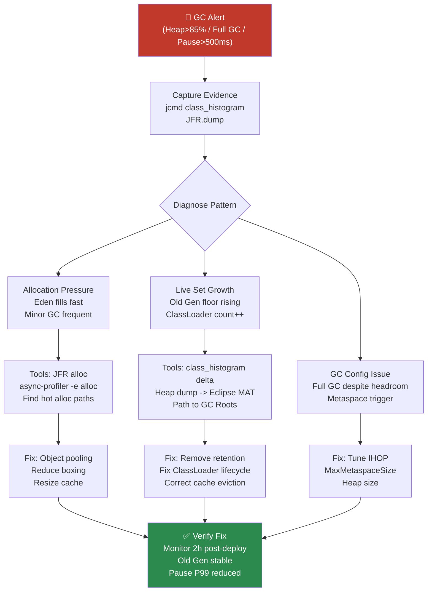

## Keywords in This File
{: .no_toc }

| # | Keyword | Weight |
|---|---|---|
| 1 | [Java JVM - L4 GC Diagnostics](#java-jvm---l4-gc-diagnostics) | medium |

---

# Java JVM - L4 GC Diagnostics

## GC Diagnostics with JFR and JVM Flags

---

### 🎯 Model Answer

**30 seconds:**
> GC diagnostics in production follows a hierarchy: first GC log analysis (always-on,
> low overhead), then JFR continuous profiling (< 1% overhead, ring buffer), then
> heap dumps (high overhead, one-shot). The primary tool chain: `-Xlog:gc*` for GC
> logs, JFR with default profile for allocation and GC events, `jcmd` for live
> inspection, and async-profiler for allocation hotspot profiling. The goal: identify
> the root cause (allocation rate, live set size, fragmentation, code issue) before
> making any tuning change.

**3 minutes (Senior):**
> GC diagnostic workflow:
>
> 1. **Detect**: monitoring alerts on GC pause P99, GC overhead %, heap utilization
> 2. **Characterize**: is it allocation pressure, live set growth, fragmentation, or code regression?
>    - GC logs: `gc+heap` - shows Eden fill rate, Old Gen growth
>    - JFR: `ObjectAllocationSample` - which code allocates
>    - `jcmd GC.class_histogram` - what's in the heap by class
> 3. **Locate**: which code path causes the behavior?
>    - async-profiler `-e alloc` - stack trace of allocations
>    - JFR `JavaMonitorEnter` - contention (if relevant)
>    - Heap dump: Eclipse MAT - object retention chains
> 4. **Fix**: address root cause (cache sizing, object pooling, ClassLoader leak)
> 5. **Verify**: compare GC log metrics before/after fix
>
> JFR continuous recording: should be ON by default in production. The default
> settings file captures: GC events, class loading, I/O, lock contention, with
> < 1% overhead and a 1-hour ring buffer.

**Framework:** WHAT → WHY → HOW → TRADE-OFF → EXAMPLE

**Blank Mind Recovery:**

**(1) Restate:** "GC diagnostics: GC log -> JFR -> heap dump (escalating overhead).
Characterize problem type (allocation, leak, fragmentation), then locate the code.
Tools: jcmd, async-profiler, Eclipse MAT."

**(2) First principles:** "GC problems have a root cause in application behavior:
too much allocation, too many long-lived objects, or code regression. Diagnostics
trace the symptoms (pauses, OOM) back to the cause (specific code, data structure,
configuration)."

**(3) Bridge:** "GC diagnostics is like medical triage. Symptoms (pauses, OOM) =
chief complaint. GC logs = vital signs. JFR = blood work. Heap dump = biopsy.
Treatment (tuning) follows diagnosis, not the reverse."

---

### 📘 Concept Explanation

**GC diagnostic tool hierarchy:**
```
TOOL HIERARCHY (by impact and use case):

Level 1: Always-on (< 0.1% overhead)
  -Xlog:gc:file=gc.log:time,uptime:filecount=5,filesize=20m
  Captures: all GC events with timing
  Use for: trend analysis, pause measurement, GC frequency
  Can leave on forever in production

Level 2: JFR Default Profile (< 1% overhead)
  -XX:+FlightRecorder
  -XX:StartFlightRecording=settings=default,name=continuous,
    maxage=1h,maxsize=250m,dumponexit=true,filename=/tmp/jfr/
  Captures: GC events, allocation samples, class loading, I/O, locks
  Can leave on forever in production
  On-demand dump: jcmd <pid> JFR.dump

Level 3: JFR Profile Settings (1-2% overhead)
  settings=profile instead of default
  Captures: more frequent allocation samples
  Use for: investigating specific issues
  Turn on for 5-60 minutes during investigation

Level 4: Heap Dump (seconds to minutes of pause for large heaps)
  jcmd <pid> GC.heap_dump /tmp/heap.hprof
  Captures: complete heap snapshot
  Use for: OOM analysis, ClassLoader leak analysis
  NOT for routine production use

Level 5: Native Memory Tracking (1-3% overhead)
  -XX:NativeMemoryTracking=summary
  jcmd <pid> VM.native_memory summary
  Captures: off-heap memory by category (Java heap, thread stacks,
    Metaspace, code cache, GC internal)
  Use for: investigating non-heap memory growth

GC LOG ANALYSIS COMMANDS:
  # Pause time distribution:
  grep "Pause" gc.log | awk '{print $NF}' | sort -n | \
    awk 'END{print "Max: " $0 "ms"}; NR==int(0.99*NR){print "P99: " $0 "ms"}'

  # GC frequency:
  grep -c "GC(" gc.log

  # Old Gen growth rate (G1):
  grep "Old: " gc.log | awk -F'[KMG->]' '{print $2}' | tail -100
```

> **Code walkthrough:** This Old Gen growth rate (G1): example demonstrates a key concept in practice. **KEY MECHANISM:** the runtime executes these instructions in sequence with specific memory and execution semantics. **WHY IT MATTERS:** misapplying this pattern causes subtle bugs that only manifest under production load. **TAKEAWAY: understand the execution model before using this pattern in production code.**

---

### 💻 Code Example

> **Code walkthrough:** The diagnostic commands below represent the actual workflow
> for a production GC investigation. They escalate from quick checks (GC log grep)
> to deeper analysis (JFR dump, heap dump). The key principle: characterize before
> investigating - don't jump to heap dumps immediately.

```bash
# ====== STEP 1: Quick GC health check ======
# Is GC overhead excessive? (> 3% is concerning, > 10% is critical)
jcmd <pid> GC.run_finalization
jcmd <pid> PerfCounter.print | grep "sun.gc"
# Output includes: gc.cause, gc.time, gc.count

# GC overhead via JMX (quick check):
jcmd <pid> GC.heap_info
# Output: garbage-first heap total 8192M, used 5120M (62.5%)
#         [eden: 2048M, survivor: 256M, old: 2816M]

# ====== STEP 2: GC log analysis ======
# Find top 10 longest GC pauses:
grep "Pause" /var/log/gc.log | \
  awk '{gsub("ms",""); print $NF}' | sort -rn | head -10
# Output: 487.234, 234.123, 189.456, ...

# Count Full GC events (should be 0 in healthy system):
grep -c "Pause Full" /var/log/gc.log

# G1: check for "to-space exhausted" (indicator of heap pressure):
grep -c "to-space exhausted" /var/log/gc.log

# Old Gen growth trend (G1):
grep "GC pause.*Normal\|GC pause.*Prepare" /var/log/gc.log | \
  awk '{match($0, /Old: [0-9]+M->[0-9]+M/, arr); print arr[0]}'

# ====== STEP 3: Live heap inspection ======
# Class histogram - top memory consumers by class (running JVM, no dump):
jcmd <pid> GC.class_histogram | head -30
# Output:
#  num     #instances         #bytes  class name
#  1:       12345678      987654321  [B (byte arrays)
#  2:        2345678       56789012  java.lang.String
#  3:         345678       23456789  com.example.UserSession
# Large UserSession count: possible session leak

# ====== STEP 4: JFR allocation profiling ======
# Start focused JFR recording (allocation profiling):
jcmd <pid> JFR.start duration=60s \
  settings=profile \
  name=alloc_investigation \
  filename=/tmp/alloc.jfr

# Wait 60s, then analyze with jfr CLI:
jfr print --events jdk.ObjectAllocationSample /tmp/alloc.jfr | \
  grep "stackTrace" -A 5 | head -100
# Shows: which methods are allocating objects + sizes

# ====== STEP 5: Heap dump for deep investigation ======
# Only when steps 1-4 don't isolate the cause:
# WARNING: pauses the JVM for the duration!
# For 8GB live heap: expect 15-60 second pause
jcmd <pid> GC.heap_dump /tmp/heap_$(date +%Y%m%d_%H%M%S).hprof

# Analyze with Eclipse MAT:
# 1. File -> Open Heap Dump -> select .hprof
# 2. Window -> Heap Dump Details -> Dominator Tree
#    (shows which objects retain the most memory)
# 3. For suspected leak: Find -> OQL Query:
#    SELECT s FROM com.example.UserSession s
#    (count all UserSession instances)
# 4. Path to GC Roots for the largest cluster of UserSession objects
```

```java
// Programmatic GC monitoring (JMX - for custom metrics/alerting):
import java.lang.management.*;

public class GCMonitor {
    public static void setupGCNotifications() {
        List<GarbageCollectorMXBean> gcBeans =
            ManagementFactory.getGarbageCollectorMXBeans();

        for (GarbageCollectorMXBean gcBean : gcBeans) {
            if (gcBean instanceof NotificationEmitter emitter) {
                emitter.addNotificationListener(
                    (notification, handback) -> {
                        if (notification.getType().equals(
                            GarbageCollectionNotificationInfo.GARBAGE_COLLECTION_NOTIFICATION)) {

                            GarbageCollectionNotificationInfo info =
                                GarbageCollectionNotificationInfo.from(
                                    (CompositeData) notification.getUserData());

                            long duration = info.getGcInfo().getDuration();
                            String gcName = info.getGcName();
                            String gcCause = info.getGcCause();
                            long heapBefore = info.getGcInfo()
                                .getMemoryUsageBeforeGc()
                                .values().stream()
                                .mapToLong(MemoryUsage::getUsed).sum();
                            long heapAfter = info.getGcInfo()
                                .getMemoryUsageAfterGc()
                                .values().stream()
                                .mapToLong(MemoryUsage::getUsed).sum();

                            // Alert: Full GC or long pause
                            if (gcCause.contains("Ergonomics") ||
                                duration > 500) {
                                logger.warn("GC Alert: {} ({}) {}ms "
                                    + "heap: {}MB->{}MB",
                                    gcName, gcCause, duration,
                                    heapBefore/(1024*1024),
                                    heapAfter/(1024*1024));
                                metrics.record("gc.pause.duration",
                                    duration, "gc", gcName);
                            }
                        }
                    }, null, null);
            }
        }
    }
}
```

> **Code walkthrough:** JMX GC notifications provide real-time GC event data withice. **KEY MECHANISM:** the runtime executes these instructions in sequence with specific memory and execution semantics. **WHY IT MATTERS:** misapplying this pattern causes subtle bugs that only manifest under production load. **TAKEAWAY: understand the execution model before using this pattern in production code.**
> zero additional JVM overhead (notifications are generated by the JVM anyway for
> internal tracking). The callback receives: GC type, cause, duration, and before/after
> heap sizes per memory pool. This is the correct way to build custom GC metrics in
> production: push-based (notification callback), not polling (which misses events
> between polls). Alerting on `duration > 500` catches Full GC events; alerting on
> `gcCause.contains("Ergonomics")` for G1 catches concurrent marking cycles (Old Gen
> pressure signal).

---

### 🎓 Answers by Seniority

**Junior / Mid (0-5 years):**
> GC diagnostics: start with GC logs (`-Xlog:gc*`). Measure: pause duration, frequency,
> GC cause. If pauses are too high: identify if it's allocation pressure (Eden fills
> fast), live set growth (Old Gen grows), or Full GC (Emergency). Use `jcmd GC.class_histogram`
> to see what's in the heap. JFR allocation profiling to find which code allocates most.

---

**Senior / Staff (5+ years):**
> GC diagnostics is a differential diagnosis. The three primary failure patterns each
> have distinct signatures: (1) Allocation pressure: high Minor GC frequency, Eden fills
> in < 5 seconds, Old Gen stable; (2) Live set growth (memory leak): Old Gen grows
> monotonically, GC doesn't reclaim, eventually Full GC; (3) GC algorithm failure
> (Full GC from to-space exhausted or concurrent marking failure): sudden Full GC with
> previously healthy metrics. Each pattern requires a different investigation path and
> fix. Never tune flags without first identifying which pattern you're dealing with.

---

### ⚠️ Common Misconceptions

**Misconception 1: "jmap -histo is safe to run on production."**
`jmap -histo` with a live heap requires a brief safepoint (JVM pause). For small
heaps: milliseconds. For 32GB heaps: seconds. `jmap -dump` requires a full heap dump:
STW for the duration (minutes for large heaps). Use `jcmd GC.class_histogram` instead
(same data, requires safepoint but uses the JVM's built-in mechanism with slightly
better timeout handling). For heap dumps on production: prefer `-XX:+HeapDumpOnOutOfMemoryError`
(triggered at OOM, doesn't require manual invocation) or `jcmd GC.heap_dump` with
prior notice to operations about the pause.

**Misconception 2: "More GC threads always improves diagnostics speed."**
More concurrent GC threads don't help diagnosis - they're for GC execution. More
JFR event processing threads don't exist. The diagnostic overhead is fixed:
GC logs (< 0.1%), JFR default (< 1%), heap dump (seconds of pause). For faster
diagnosis: use better tooling (JMC for visual analysis, Eclipse MAT for heap dumps)
rather than more resources.

---

### 🚨 Failure Modes and Diagnosis

**Failure: Memory leak - heap grows after each request until OOM.**
```
Symptom: Heap usage graph: staircase pattern, growing after each deploy
  GC collects some but Old Gen floor rises each hour
  Eventually: java.lang.OutOfMemoryError: Java heap space

STEP 1 - Confirm leak:
  Snapshot heap usage every 30 minutes (Prometheus or JMX):
  t=0: 2GB used, t=30: 2.3GB used, t=60: 2.6GB used
  Old Gen never drops below floor after GC -> CONFIRMED LEAK
  Rate: 300MB/hour -> will OOM in ~10 hours from deploy

STEP 2 - Identify retained object type:
  jcmd <pid> GC.class_histogram | head -20
  Look for: large count of unexpected class (UserSession, CacheEntry, etc.)
  t=0: 1000 UserSession objects
  t=60: 10000 UserSession objects -> growing!
  -> UserSession objects not being GC'd -> something holds them

STEP 3 - Find what holds UserSession objects:
  # Take heap dump when leak is visible (Old Gen ~70%):
  jcmd <pid> GC.heap_dump /tmp/heap.hprof
  
  # Eclipse MAT:
  # Dominator Tree: UserSession is retaining 8GB (unexpected!)
  # OQL: SELECT s FROM com.example.UserSession s -> 10000 results
  # Path to GC Roots for one retained UserSession:
  #   java.util.HashMap$Entry -> sessions (HashMap) ->
  #   SessionManager.sessions (static field) ->
  #   SessionManager (static singleton)
  # -> SessionManager.sessions holds all UserSession objects
  # -> sessions are never removed when session expires!

STEP 4 - Fix:
  Review SessionManager.sessions cleanup:
  Sessions should be removed in:
    - Session.invalidate()
    - Session expiry scheduler
    - HttpSessionListener.sessionDestroyed()
  
  Find the missing cleanup:
  - Session expiry scheduler: disabled in production config!
  - Fix: re-enable session expiry with maxInactiveInterval=30min

STEP 5 - Verify fix:
  Deploy fix, monitor Old Gen usage over 2 hours
  Expected: Old Gen now has a stable floor (no staircase)
  class_histogram: UserSession count stabilizes (not growing)
```

> **Code walkthrough:** This -> sessions are never removed when session expires! example demonstrates a key concept in practice using SQL. **KEY MECHANISM:** the runtime executes these instructions in sequence with specific memory and execution semantics. **WHY IT MATTERS:** misapplying this pattern causes subtle bugs that only manifest under production load. **TAKEAWAY: understand the execution model before using this pattern in production code.**

---

### 🎯 Interview Deep-Dive

| Question Category | Time to Answer |
|---|---|
| GC diagnostic tool hierarchy | 2 minutes |
| Reading GC logs | 2 minutes |
| JFR for GC diagnosis | 2 minutes |
| heap dump analysis workflow | 3 minutes |
| Memory leak diagnosis | 3 minutes |
| jcmd commands | 2 minutes |
| Allocation profiling | 2 minutes |
| OOM categories and causes | 2 minutes |
| GC overhead calculation | 2 minutes |
| Production monitoring setup | 2 minutes |
| Automated GC alerting | 2 minutes |
| Post-mortem OOM analysis | 2 minutes |

---

**Q1 (tools): What is your GC diagnostic toolchain and when do you use each tool?**

A: (1) GC logs (`-Xlog:gc*`): always-on, < 0.1% overhead. Use: pause duration trend,
GC frequency, Old Gen growth rate. (2) JFR default recording: always-on, < 1%. Use:
allocation hotspots, class loading, lock contention. (3) `jcmd GC.class_histogram`:
on-demand, 1-5ms safepoint. Use: identify which classes consume most heap. (4) async-profiler
`-e alloc`: 1-2%, run for 5 minutes. Use: stack traces of high-allocation code paths.
(5) Heap dump: high impact, on-demand. Use: memory leak analysis (Eclipse MAT).

*What separates good from great:* The "continuous JFR" setup is the biggest gap between
teams. Most teams: no JFR in production ("it's overhead"). Reality: JFR default profile
< 1% overhead, captures critical diagnostic data. Without JFR: investigating a
post-mortem is blind (no data for the period leading up to the incident). With JFR:
the ring buffer captures the last 1 hour of events. After an OOM or spike: dump the
recording, analyze what was happening just before. This is the difference between
"we had an OOM" and "we had an OOM caused by a HashMap.put() loop in PaymentService.process()
allocating 5MB/s starting at 14:23".

---

**Q2 (gc log): What key metrics do you extract from GC logs?**

A: (1) Pause duration: `grep "Pause" gc.log | awk '{print $NF}'` - P50, P99, P999.
(2) GC frequency: pause count per hour. (3) Old Gen trend: after each GC, what is Old Gen
size? (growing = leak). (4) GC cause: why did each GC trigger? Ergonomics (normal),
GCLocker (JNI), System.gc (code), Heap Dump (operational). (5) GC overhead: `sum(pause_ms)
/ total_time_ms * 100%` - should be < 3%.

*What separates good from great:* The "GC cause" field in G1 logs is extremely diagnostic.
Key causes: "G1 Evacuation Pause" (normal Minor GC), "G1 Humongous Allocation" (large
object bypass), "G1 Preventive Collection" (ergonomic: G1 predicts issues), "Metadata
GC Threshold" (Metaspace-triggered GC: may indicate Metaspace leak), "GCLocker" (GC
delayed because JNI code is executing): "GCLocker Initiated GC" (GC that fired right
after a long JNI release). If "GCLocker" appears frequently: JNI calls are holding
GC at bay, leading to bursty GC behavior when they complete.

---

**Q3 (OOM categories): What are the distinct categories of OutOfMemoryError?**

A: (1) `Java heap space`: heap full (live set > heap - Eden). Cause: memory leak
OR heap too small. (2) `GC overhead limit exceeded`: GC spending > 98% of time
reclaiming < 2% of heap (enabled by default, flag: `UseGCOverheadLimit`). Cause:
heap dramatically undersized. (3) `Metaspace`: class metadata exceeds MaxMetaspaceSize
(if set). Cause: ClassLoader leak or MaxMetaspaceSize too small. (4) `unable to create
new native thread`: OS thread limit (ulimit -u) exceeded. Not a GC issue. (5) `Direct
buffer memory`: off-heap DirectByteBuffer pool exceeded. NIO code. (6) `Map failed`:
OS can't map memory (usually virtual address exhaustion or mmap limit).

*What separates good from great:* "GC overhead limit exceeded" is a compassionate OOM:
the JVM detects it's in an infinite GC loop (spending all time on GC, making no progress)
and throws OOM proactively rather than spinning forever. This OOM can be triggered even
when the heap technically has free space - the issue is that the JVM CAN'T free enough
to make a successful allocation. Tuning: lower `GCTimeLimit` (default 98%) or increase
heap. But the real message: the heap is far too small for the current live set. Fix:
find the memory leak or increase heap.

---

**Q4 (jfr allocation): How do you use JFR to find allocation hotspots?**

A: JFR `ObjectAllocationSample` event (JDK 16+): samples allocations at a configurable
rate (~1% of all allocations), recording the stack trace. Lower overhead than recording
every allocation. Enable: `jfr settings=profile` includes allocation sampling. Analyze:
`jfr print --events ObjectAllocationSample recording.jfr`. JMC: Memory -> Allocation
Profiling shows a flame graph of allocating methods. Identify: top allocating methods
+ allocated types.

*What separates good from great:* The JFR allocation event has evolved: JDK 8-15
used `jdk.ObjectAllocationInNewTLAB` and `jdk.ObjectAllocationOutsideTLAB` (every
allocation). JDK 16+: `jdk.ObjectAllocationSample` (sampled, lower overhead). For
sampling to be statistically representative: run for 5+ minutes under production load.
A 10-second JFR snapshot during idle periods: shows idle-path allocations (not useful).
The right workflow: start JFR recording when CPU > 70% (under load), run for 5 minutes,
stop. The recording captures production-realistic allocations. Also: compare two recordings
(before and after a code change) to quantify allocation rate improvement.

---

**Q5 (class histogram): How do you use jcmd GC.class_histogram to diagnose issues?**

A: `jcmd <pid> GC.class_histogram` outputs: class name, instance count, total bytes,
sorted by bytes descending. Read it as: "which class is using the most memory right now?"
Compare two histograms 30 minutes apart: classes growing indicate a leak. Pay attention to:
byte arrays (`[B`): often backed by strings, byte buffers, or cached data.
`java.lang.String`: many strings? Possible deduplication opportunity.
Application classes with high counts: unexpected retention.

*What separates good from great:* The histogram has 3 triggers for investigation:
(1) application class with count much higher than concurrent requests: each request
creates multiple and they're not GC'd -> retention issue. (2) `[B` (byte arrays) is
the largest: expected (Strings, network buffers) or unexpected (large cache). (3) JDK
classes at unexpected counts: many `java.util.HashMap$Entry` when you expected few maps.
Technique: snapshot histogram every 5 minutes for 30 minutes, compute delta per class
(`diff` command or grep). Classes with monotonically increasing count: RETAINED (leak).
Classes with count that goes up and down: normal (allocate + GC).

---

**Q6 (heap dump): When and how do you take a heap dump in production?**

A: When: (1) OOM occurred (automatic with `-XX:+HeapDumpOnOutOfMemoryError -XX:HeapDumpPath=/tmp/`);
(2) memory leak confirmed (Old Gen growing) and class histogram doesn't isolate the cause;
(3) unusual memory consumption that can't be explained by other tools.
How: `jcmd <pid> GC.heap_dump /tmp/heap.hprof`. WARNING: STW pause for large heaps.
Plan for the pause (alert ops, drain load balancer traffic first for the instance,
or take dump from one pod in a multi-pod deployment).

*What separates good from great:* Production heap dump coordination: (1) In Kubernetes:
drain the pod from the service first (`kubectl drain --ignore-daemonsets pod-name`),
then take the dump on the drained instance (no user traffic). (2) Heap dump path:
pre-create the directory with enough disk space (`df -h /tmp` before). A 32GB JVM:
dump file can be 10-50GB (compressed). Ensure 50+ GB free. (3) `gcore` approach:
instead of JVM heap dump, take a process core dump with `gcore <pid>`, then use JVM
tools offline to extract heap data. Less JVM-specific but useful when JVM is unresponsive.
(4) JVM flag: `-XX:+HeapDumpOnOutOfMemoryError` should be on for all production JVMs.
Without it: an OOM produces a stack trace but no heap state, making diagnosis impossible.

---

**Q7 (eclipse MAT): Walk through an Eclipse MAT analysis for a memory leak.**

A: (1) Open .hprof in MAT. (2) Overview: shows total heap, top consumers, leak suspects.
(3) Leak Suspects Report (automatic): MAT applies heuristics to identify likely leaks.
Often directly points to the culprit. (4) Dominator Tree: objects sorted by "retained
heap" (all objects that would be freed if this object were collected). Largest retained
heap = biggest impact object. (5) Histogram (Object Counts): shows all classes and
instance counts. (6) Path to GC Roots: for a suspect object, shows the reference
chain from GC root to the object (why it's alive).

*What separates good from great:* MAT's OQL (Object Query Language) is the power user
feature. SQL-like syntax to query the heap: `SELECT s FROM com.example.Session s WHERE
s.lastAccess < now - 3600000` (sessions older than 1 hour). Useful for: quantifying
the leak scope, finding objects with specific states. MAT's "Unreachable Objects
Histogram": shows objects that WOULD be collected but are still in the heap snapshot
(useful for understanding what was recently alive). The retained heap calculation:
uses a "dominator tree" algorithm. An object's retained heap = all objects only
reachable through it. If deleting one SessionManager object would free 8GB: it's
the root of the leak (retains 8GB through its reference chain).

---

**Q8 (native memory): How do you diagnose non-heap memory growth?**

A: Non-heap memory growth: JVM process grows beyond `Xmx`. Categories:
(1) Metaspace (class loading): `jcmd VM.native_memory summary | grep Class`.
(2) Thread stacks: `jcmd VM.native_memory summary | grep Thread` + thread count.
(3) Code cache: `-XX:+PrintCodeCacheOnCompilation`, check `ReservedCodeCacheSize`.
(4) DirectByteBuffer: `jcmd VM.native_memory summary | grep Internal`.
(5) JNI GlobalRefs: `jcmd VM.native_memory summary | grep Internal`.

Enable NMT: `-XX:NativeMemoryTracking=summary` (1% overhead) or
`-XX:NativeMemoryTracking=detail` (3% overhead).

*What separates good from great:* Thread stack memory is a common surprise in
microservices. A Tomcat server with 200 threads: 200 * 512KB (default stack) = 100MB
minimum. A Spring WebFlux service with 10,000 virtual threads (JDK 21): thread stacks
are on-heap continuation stacks, not native stacks. Traditional: native thread stacks
= native memory. Virtual threads: continuation = on-heap = counted in `Xmx`.
This is a backwards compatibility concern: migrating from platform threads to virtual
threads can INCREASE heap pressure (continuations on heap) while DECREASING native
memory pressure. Sizing: account for both effects in your total memory budget.

---

**Q9 (continuous monitoring): What GC metrics should be in every production dashboard?**

A: (1) GC pause P99 (alert > 200ms). (2) GC overhead % (alert > 5%). (3) Heap utilization
(current / max, alert > 85%). (4) Old Gen occupancy (steady growth = leak signal).
(5) GC count per minute (sudden increase = allocation pressure change). (6) Full GC count
(alert > 0 per hour). (7) Minor GC frequency (alert on sudden 10x increase).

*What separates good from great:* The "Old Gen floor" metric: after each Full GC,
what is the minimum Old Gen size? This is the current live set. Tracking this over
time: if it grows from 2GB to 3GB over 24 hours = 1GB of new long-lived objects per day.
At this rate: in 7 days, the heap is full. This is the early warning of a memory leak,
visible weeks before OOM. Implementation: subscribe to GC notifications (JMX), record
Old Gen "after GC" size, alert if the 24-hour moving minimum increases by > 10%.
Most teams don't track this metric until after the first OOM. Build it into the initial
service setup.

---

**Q10 (allocation pressure): How do you diagnose and fix high allocation pressure?**

A: Allocation pressure: Eden fills and triggers Minor GC too frequently (< 5-10 seconds
between GC cycles). Diagnosis: (1) GC log: `gc+heap` shows Eden fill rate. (2) JFR
alloc profiling: find the top allocating methods. (3) async-profiler `-e alloc`:
stack traces of hot allocation paths. Fix: (1) reduce allocation rate in hot paths
(object pooling, primitives over boxed, avoid boxing in maps). (2) Increase Eden size
(allows more allocation before GC). (3) Reduce live set (if Old Gen is full, more
Minor GC survive to Old Gen, increasing GC work). (4) Cache-level analysis: is there
a cache that generates too many throw-away objects per request?

*What separates good from great:* The "allocation rate" metric: bytes allocated per
second. Measurable: from JFR TLAB allocation events or from GC log (`Eden: before->after`
per GC cycle, divided by time between cycles). A production REST service: typical
allocation rate 50-200MB/s per 100 RPS. 2GB/s for 100 RPS: suspect. The normal sources:
HTTP request/response objects (expected), serialization buffers (expected, often large),
domain objects (expected, should be short-lived). Unexpected sources: logging with
string formatting (`log.debug("User: " + user.toString())` - allocates even when debug
disabled), boxed integer maps (`Map<String, Integer>`), and date formatting (SimpleDateFormat
creates temporary objects per format call).

---

**Q11 (GC regression): How do you identify when a code change caused GC regression?**

A: Compare GC metrics before/after deployment: (1) GC log: export pause P99, GC
frequency per hour, Old Gen growth rate. (2) Prometheus: diff metrics between
`[now-24h, deployment_time]` vs `[deployment_time, now]`. (3) JFR: compare two
recordings of same duration before and after deployment.
Signal of regression: Minor GC frequency > 2x previous, Old Gen floor increasing,
Full GC appearing where none before.

*What separates good from great:* Automated GC regression detection in CI: run a
load test with production-like traffic for 30 minutes, extract GC metrics, compare
to baseline (last passing build). Alert if Minor GC frequency > 150% of baseline.
This catches allocation regressions before they reach production. Implementation:
`-Xlog:gc::time,uptime` + a post-test script that parses the log and computes metrics.
Fail the deployment pipeline if GC overhead increases by > 2x. Teams that do this:
catch memory regressions in hours instead of weeks.

---

**Q12 (production runbook): What is your production GC incident runbook?**

A: (1) **Triage** (< 2 min): check monitoring - is it OOM, high pause, or high GC overhead?
Is service still serving traffic? (2) **Capture** (< 5 min): `jcmd <pid> GC.class_histogram`
(no pause) + dump JFR recording if available. (3) **Stabilize** (immediate): if OOM imminent,
pod restart to restore service. (4) **Diagnose** (15-30 min): class histogram analysis,
JFR allocation profiling, check Old Gen floor trend. (5) **Root cause**: is it allocation
pressure, live set growth, GC config, or code regression? (6) **Fix**: specific to root
cause. (7) **Verify**: monitor for 2 hours post-fix. (8) **Post-mortem**: document cause
and prevention.

*What separates good from great:* The "capture before restart" step is the most commonly
missed in production incidents. Teams restart pods immediately to restore service, destroying
the evidence. Better: in a multi-pod deployment, mark ONE pod for diagnostic capture
(drain from load balancer, don't restart), capture class histogram and JFR dump, then
restart it. This preserves diagnostic data while minimizing service impact. The class
histogram takes 1-5ms (negligible). JFR dump: instantaneous (just copies the ring buffer
to disk). Heap dump: minutes (high impact, only if histogram + JFR are insufficient).

---

### ⚖️ Comparison Table

| Tool | Overhead | Data Type | Use Case | Trigger |
|---|---|---|---|---|
| GC logs (-Xlog) | < 0.1% | Pause times, heap sizes, GC causes | Trend monitoring | Always-on |
| JFR default | < 1% | Allocation, GC events, class loading | Investigation | Always-on (ring buffer) |
| jcmd class_histogram | 1-5ms STW | Object count by class | Leak identification | On-demand |
| async-profiler alloc | 1-2% | Allocation stack traces | Hot allocation code | 5-min investigation |
| Heap dump | Seconds pause | Complete heap snapshot | Memory leak root cause | On-demand / OOM |
| NMT summary | 1% | Native memory by category | Non-heap growth | Enable early |

---

### 🏛️ System Design

**GC Observability Architecture for a multi-service platform:**

**Context:** 20 microservices, each with 5 pods, running JVM workloads.
Need: proactive GC alerting, post-mortem capability, allocation regression detection.

```
GC OBSERVABILITY ARCHITECTURE:

  SERVICE JVM (each pod):
    GC Config:
      -Xlog:gc*:file=/var/log/gc.log:time,uptime:filecount=3,filesize=50m
      -XX:+FlightRecorder
      -XX:StartFlightRecording=settings=default,name=continuous,
        maxage=1h,maxsize=250m,dumponexit=true,
        filename=/var/log/jfr/continuous-%t.jfr
      -XX:+HeapDumpOnOutOfMemoryError
      -XX:HeapDumpPath=/var/log/heap/

    JMX Exporter (for Prometheus):
      jmx_prometheus_javaagent -> exposes JMX metrics at /metrics

  METRICS COLLECTION:
    Prometheus scrapes /metrics (JMX exporter) every 15s
    JVM metrics exposed:
      jvm_gc_collection_seconds_count{gc="G1 Young Generation"}
      jvm_gc_collection_seconds_sum{gc}
      jvm_memory_pool_bytes_used{area="heap",pool="G1 Old Gen"}
      jvm_memory_pool_bytes_max{area="heap"}

  ALERTING (Prometheus/Grafana):
    Alert 1: Full GC  (HIGH)
      rate(jvm_gc_collection_seconds_count{gc="G1 Old Generation"}[5m]) > 0
      Action: page on-call, capture class histogram

    Alert 2: GC overhead (MEDIUM)
      rate(jvm_gc_collection_seconds_sum[5m]) /
        rate(jvm_gc_collection_seconds_count[5m]) > 0.5  (> 500ms avg pause)
      Action: alert channel, check JFR recording

    Alert 3: Heap pressure (MEDIUM)
      jvm_memory_pool_bytes_used{pool="G1 Old Gen"} /
        jvm_memory_pool_bytes_max > 0.85
      Action: alert channel, monitor for OOM within 2h

    Alert 4: Old Gen floor growth (EARLY WARNING)
      Old Gen "after-GC" size tracked over 24h window
      If increases > 200MB/24h: potential leak
      Action: alert team, investigate class histogram

  POST-MORTEM PIPELINE:
    OOM occurs:
    1. OOM handler triggers: JVM writes heap dump to /var/log/heap/
    2. PV (persistent volume) mounted at /var/log/heap/ persists across pod restart
    3. Filebeat sidecar ships heap dump to central storage (S3)
    4. Team downloads from S3, analyzes with Eclipse MAT

    JFR continuous recording:
    1. Normal operation: 1h ring buffer in /var/log/jfr/
    2. Incident: engineer runs: kubectl exec pod -- jcmd 1 JFR.dump
       filename=/var/log/jfr/incident.jfr
    3. kubectl cp pod:/var/log/jfr/incident.jfr .
    4. Open in JMC for analysis

  CAPACITY PLANNING:
    Dashboard: "Old Gen floor" per service per week
    Trend: services with > 500MB/week Old Gen growth = investigate for leaks
    Monthly review: adjust Xmx for services that are growing
```

> **Code walkthrough:** This Unknown example demonstrates a key concept in practice using goroutine. **KEY MECHANISM:** the runtime executes these instructions in sequence with specific memory and execution semantics. **WHY IT MATTERS:** misapplying this pattern causes subtle bugs that only manifest under production load. **TAKEAWAY: understand the execution model before using this pattern in production code.**

---

### 📊 Diagram

**GC diagnostic workflow for a production memory incident:**

```
PRODUCTION GC INCIDENT RESPONSE:

Monitoring Alert: Heap > 85% / GC overhead > 5% / Full GC detected
         |
         v
  [1] Quick capture (non-invasive):
      jcmd <pid> GC.class_histogram > histogram_t0.txt
      jcmd <pid> JFR.dump filename=/tmp/incident.jfr
         |
         v
  [2] Characterize pattern:

  Allocation Pressure?    Live Set Growth?     GC Config Issue?
  Eden fills < 5s        Old Gen floor rises   Full GC with healthy heap
       |                       |                       |
       v                       v                       v
  JFR alloc profile      class histogram        GC log: cause=
  async-profiler alloc   histogram delta        "Metadata GC Threshold"
  -> reduce allocations  Eclipse MAT            -> check IHOP, MaxMetaspace
                         Path to GC Roots
                         -> fix retention
         |                       |                       |
         v                       v                       v
  [3] Fix & Deploy (appropriate to root cause)
         |
         v
  [4] Verify: Monitor GC metrics for 2 hours post-fix
       Confirm: Old Gen floor stable, pause P99 reduced
```



> **Diagram walkthrough:** The flowchart captures the differential diagnosis approach
> to GC incidents. Every incident follows the same structure: capture evidence first
> (class histogram + JFR dump are non-invasive and take seconds), then characterize
> the pattern before investigating. The three patterns (allocation pressure, live set
> growth, GC config) require completely different tools and fixes. Skipping
> characterization - jumping straight to heap dumps or flag tuning - wastes time and
> often treats the wrong problem. The verification step is non-negotiable: a fix that
> doesn't change the metrics isn't a fix.

---

### 💻 Code Example

*(Omit: this concept does not have a programmatic interface that can be demonstrated in code. The conceptual explanation above is sufficient.)*


---

### 🏛️ System Design

*(Omit: system design diagram not applicable for this concept - see ★★★ keywords for full system design coverage.)*


---

### ⚖️ Comparison Table

*(Omit: this is a ★☆☆ foundational concept with no direct alternatives to compare - see higher-difficulty keywords for trade-off analysis.)*


---

### 📊 Diagram

*(Omit: no standalone visual diagram required for this concept - the explanations and code examples above provide sufficient clarity.)*


