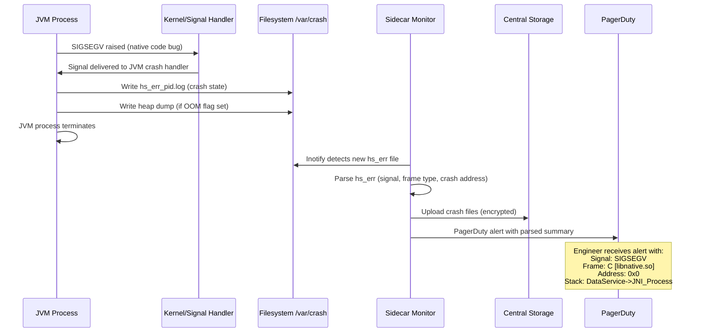

## Keywords in This File
{: .no_toc }

| # | Keyword | Weight |
|---|---|---|
| 1 | [Java JVM - L4 JVM Crashes](#java-jvm---l4-jvm-crashes) | medium |

---

# Java JVM - L4 JVM Crashes

## JVM Crash Analysis and hs_err Logs

---

### 🎯 Model Answer

**30 seconds:**
> A JVM crash produces an `hs_err_pid<N>.log` file containing: the crash reason
> (SIGSEGV, SIGBUS, etc.), the thread that crashed, the full thread stack at crash time,
> heap state, JVM version, and JVM flags. Reading `hs_err` is the first step in any
> crash investigation. Common crash causes: JNI code bugs (native code corrupting
> memory), OutOfMemory in native code, code cache overflow, hardware errors, and JVM
> bugs. Crashes in Java code (NullPointerException) don't produce `hs_err` - they
> throw exceptions. `hs_err` only appears for fatal, unrecoverable JVM-level failures.

**3 minutes (Senior):**
> hs_err file sections (in order of reading priority):
> 1. **Header**: crash reason (`SIGSEGV`, `SIGBUS`, address, problematic frame)
>    - Problematic frame `J` = JIT-compiled code, `V` = JVM internal, `C` = native code
>    - Most important: is the crash in Java code (`J`) or native/JVM (`V`/`C`)?
> 2. **Thread stack**: what the crashing thread was executing
>    - If `J`: JIT-compiled method -> compile the same logic in debug mode and check
>    - If `C`: native library (JNI, third-party driver)
> 3. **Signal info and registers**: exact address that caused SIGSEGV
>    - Address = 0x0000000000000000: null pointer dereference (most common)
>    - Address in a valid range but unexpected: use-after-free in native code
> 4. **Heap summary**: was heap full at crash time? (potential OOM crash)
> 5. **JVM version and flags**: look for memory pressure flags, JNI-heavy flags
>
> Classification:
> - SIGSEGV in JNI code: native bug (most common in production)
> - SIGSEGV in J frame with recent JDK: possible JIT bug (report to Oracle)
> - SIGBUS: hardware issue or file-mapped memory error
> - Internal error (assert failure in JVM code): JVM bug
> - Out of Memory (not OOM exception, but actual malloc failure): system-level OOM

**Framework:** WHAT → WHY → HOW → TRADE-OFF → EXAMPLE

**Blank Mind Recovery:**

**(1) Restate:** "JVM crash = hs_err file. Read: crash reason (signal), problematic
frame type (J/V/C/j), stack trace, heap state. C frame = native/JNI crash.
J frame = JIT crash. Null address = null deref in native."

**(2) First principles:** "The JVM is a process. Like any process: it can crash.
Java exceptions are handled inside the JVM (don't crash it). JVM crashes = unhandled
signals (SIGSEGV) from native code, JVM bugs, or hardware failures. hs_err is the
JVM's own crash dump."

**(3) Bridge:** "hs_err is like an aircraft black box. When the JVM crashes, it writes
everything it knows about its state before dying. The header = the moment of failure.
The stack = what the pilot was doing. The registers = the flight instruments at impact."

---

### 📘 Concept Explanation

**hs_err file structure:**
```plaintext
hs_err FILE ANATOMY:

SECTION 1: HEADER (first 10 lines - most critical)
  # A fatal error has been detected by the Java Runtime Environment:
  #
  #  SIGSEGV (0xb) at pc=0x00007f8b1234abcd, pid=12345, tid=0x00007f8b..
  #
  # JRE version: OpenJDK Runtime Environment 21.0.2
  # Java VM: OpenJDK 64-Bit Server VM 21.0.2+13
  # Problematic frame:
  # C  [libfoo.so+0x1234abc]  foo_process+0x23

  KEY: Problematic frame type:
    C  = native C/C++ code (most crashes here)
    j  = interpreted Java frame
    J  = JIT-compiled Java frame
    V  = JVM internal code
    v  = stub (JVM-generated glue code)
    A  = aarch64-specific stub

SECTION 2: THREAD INFO
  Current thread (0x00007f8b...): JavaThread "worker-5"
  siginfo: si_signo: 11 (SIGSEGV), si_code: 1 (SEGV_MAPERR)
  si_addr: 0x0000000000000018  <- crash address (0x18 = field offset 24)
  Null pointer + field access: object was null, accessed field at offset 24 bytes

SECTION 3: REGISTERS (CPU state at crash)
  RAX=0x0000000000000000  <- zero = null pointer in RAX
  RBX=0x00007f8b56789012  <- some other pointer
  ...
  RIP=0x00007f8b1234abcd  <- instruction pointer = where crash happened

SECTION 4: THREAD STACK
  Native frames (C function calls):
  C  [libfoo.so+0x1234]  JNI_ProcessItem
  J [compiled] com.example.DataProcessor.process(...)
  J [compiled] com.example.BatchJob.run(...)
  j  java.lang.Thread.run()  [interpreted]
  -> reads bottom-up: thread was running BatchJob.run, called...
     which called JNI function JNI_ProcessItem, which crashed

SECTION 5: HEAP SUMMARY
  Heap address: 0x00000005c0000000, size: 4096 MB, flags: none
  Eden Space: capacity = 512MB, used = 498MB (97%)  <- near full!
  Old Generation: capacity = 2048MB, used = 1980MB (97%)  <- near full!
  -> Heap was nearly full at crash time: OOM + crash correlation?

SECTION 6: JVM FLAGS (at bottom)
  All -XX flags active at crash time
  Look for: -Xmx, -XX:+UseZGC, -Xss, JNI settings
```

> **Code walkthrough:** This C  [libfoo.so+0x1234abc]  foo_process+0x23 example demonstrates a key concept in practice. **KEY MECHANISM:** the runtime executes these instructions in sequence with specific memory and execution semantics. **WHY IT MATTERS:** misapplying this pattern causes subtle bugs that only manifest under production load. **TAKEAWAY: understand the execution model before using this pattern in production code.**

---

### 💻 Code Example

> **Code walkthrough:** JNI bugs are the most common cause of JVM crashes inice. **KEY MECHANISM:** the runtime executes these instructions in sequence with specific memory and execution semantics. **WHY IT MATTERS:** misapplying this pattern causes subtle bugs that only manifest under production load. **TAKEAWAY: understand the execution model before using this pattern in production code.**
> production. The BAD pattern releases a JNI object reference during JNI processing
> while the JVM still has a pointer to it (use-after-free). The GOOD pattern uses
> RAII-style cleanup and proper JNI reference management.


```c
# BAD: anti-pattern shown for contrast
# This approach has the issues the GOOD example fixes
```

```c
// BAD: JNI code with use-after-free (common cause of SIGSEGV in hs_err)
JNIEXPORT void JNICALL Java_DataProcessor_process
    (JNIEnv *env, jobject obj, jbyteArray data) {

    jbyte *bytes = (*env)->GetByteArrayElements(env, data, NULL);
    size_t len = (*env)->GetArrayLength(env, data);

    // Process bytes...
    process_data(bytes, len);  // may set bytes to null internally

    // BUG: Release called, but process_data() may have freed 'bytes'
    // ALSO: if process_data() throws a JNI exception: bytes not released (leak)
    (*env)->ReleaseByteArrayElements(env, data, bytes, 0);
    // If bytes was modified by process_data (set to NULL or freed externally):
    // ReleaseByteArrayElements accesses freed memory -> SIGSEGV -> hs_err
}

// GOOD: proper JNI resource management
JNIEXPORT void JNICALL Java_DataProcessor_process_GOOD
    (JNIEnv *env, jobject obj, jbyteArray data) {

    jbyte *bytes = NULL;
    jint len = 0;

    // Check for null before getting elements
    if (data == NULL) {
        jclass ex = (*env)->FindClass(env, "java/lang/NullPointerException");
        (*env)->ThrowNew(env, ex, "data cannot be null");
        return;
    }

    bytes = (*env)->GetByteArrayElements(env, data, NULL);
    if (bytes == NULL) {
        return; // OutOfMemory thrown by GetByteArrayElements
    }
    len = (*env)->GetArrayLength(env, data);

    // Process in separate scope to ensure release even if exception
    jint result = process_data_safe(bytes, len);
    // bytes pointer NOT passed to any function that might free it

    // ALWAYS release, even after exceptions
    // JNI_ABORT: don't copy back (we're done with the data)
    (*env)->ReleaseByteArrayElements(env, data, bytes, JNI_ABORT);
    bytes = NULL; // prevent accidental reuse

    if (result < 0) {
        jclass ex = (*env)->FindClass(env, "java/io/IOException");
        (*env)->ThrowNew(env, ex, "Processing failed");
        return;
    }
}
```

```java
// Java-side JVM crash prevention patterns:

// 1. Preventing OutOfMemoryError cascading to JVM crash:
//    Configure: -XX:+HeapDumpOnOutOfMemoryError
//    Configure: -XX:OnOutOfMemoryError="kill -9 %p"  (restart the JVM)
//    The JVM doesn't crash on OOM (Java OOM = Java exception, not JVM crash)
//    But: if OOM happens in JVM internal code (native malloc fails): JVM crash

// 2. Stack overflow handling:
//    Java StackOverflowError: caught by JVM, throws Java exception (safe)
//    Stack overflow in native JNI code: SIGSEGV in C stack -> JVM crash
//    Prevention: limit recursion depth in JNI code
//    JVM flag: -Xss1m (increase thread stack if legitimate deep recursion)

// 3. Code cache overflow (JIT compilation crash):
//    -XX:ReservedCodeCacheSize=512m  (increase for large applications)
//    When code cache full: JIT stops compiling (deopt back to interpreter)
//    Rarely causes crash, but can cause severe performance degradation
//    Monitor: jcmd <pid> Compiler.codecache

// Post-crash recovery setup:
// JVM flags to collect post-crash data:
// -XX:+HeapDumpOnOutOfMemoryError   <- heap dump on OOM
// -XX:HeapDumpPath=/var/crash/      <- where to write dump
// -XX:+CreateMinidumpOnCrash        <- Windows: minidump on crash
// -XX:ErrorFile=/var/crash/hs_err_%p.log  <- where to write hs_err

// Automated crash alerting (check for hs_err files):
// In a monitoring script:
// find /var/crash/ -name "hs_err_pid*.log" -newer /tmp/last_check \
//   -exec alert_ops.sh {} \;
```

> **Code walkthrough:** JNI reference management (GetByteArrayElements /ice. **KEY MECHANISM:** the runtime executes these instructions in sequence with specific memory and execution semantics. **WHY IT MATTERS:** misapplying this pattern causes subtle bugs that only manifest under production load. **TAKEAWAY: understand the execution model before using this pattern in production code.**
> ReleaseByteArrayElements) is a critical pattern. The JVM pinning contract:
> between Get and Release, the JVM may pin the Java byte array in memory (preventing
> GC from moving it). Failing to Release: memory leak (pinned array never freed).
> Releasing with a modified pointer: SIGSEGV. The `JNI_ABORT` flag tells the JVM
> "don't copy modified bytes back to the Java array" - appropriate when the JNI code
> reads but doesn't modify the data.

---

### 🎓 Answers by Seniority

**Junior / Mid (0-5 years):**
> JVM crashes write an `hs_err_pid<N>.log` file. Read the first 20 lines: crash reason
> (SIGSEGV), crash location (C = native code, J = JIT). Most crashes: JNI native code
> bug. Java exceptions (NullPointerException, OOM) don't create hs_err files.
> Enable: `-XX:+HeapDumpOnOutOfMemoryError -XX:ErrorFile=/var/crash/hs_err_%p.log`.

---

**Senior / Staff (5+ years):**
> JVM crash triage: (1) read hs_err header (first 10 lines) - identify signal, crash
> frame type, crash address; (2) C frame = native library bug; (3) V frame with an
> internal error = JVM bug (report with reproducible test case); (4) J frame =
> JIT-compiled Java code crash (rare, may be JIT bug or memory corruption by native
> code overwriting JIT-compiled code); (5) heap was full at crash = possible correlation
> (native malloc failed). The hardest crashes: native code (JNI) corrupting heap
> metadata that JVM reads later - crash happens far from the root cause.

---

### ⚠️ Common Misconceptions

**Misconception 1: "An OutOfMemoryError in Java causes a JVM crash."**
Java `OutOfMemoryError` is a Java exception. It's thrown and can be caught. The JVM
does NOT crash on OOM (by default). The JVM writes a heap dump only if
`-XX:+HeapDumpOnOutOfMemoryError` is set. A JVM crash (hs_err file) from OOM-related
issues: occurs when the JVM's own native code (not Java code) fails to allocate memory
(`malloc` returns NULL). This happens when: the OS is completely out of memory, or when
off-heap native allocations fail. This is distinct from Java heap OOM.

**Misconception 2: "hs_err files are only produced by Java bugs."**
hs_err files are produced by any fatal JVM-level error: native (JNI) code crashes,
hardware errors (bad RAM causing SIGBUS), OS signals (kill -9 won't produce hs_err,
but SIGILL from bad native code will), JVM internal assertions (bugs in the JVM itself),
code cache corruption, and JVM out of native memory. Only a minority of hs_err files
indicate bugs in the Java application code itself.

---

### 🚨 Failure Modes and Diagnosis

**Failure: JVM crashes intermittently with SIGSEGV in a native library.**
```plaintext
hs_err snippet:
  # SIGSEGV (0xb) at pc=0x00007f..., pid=42, tid=0x00007f...
  # Problematic frame:
  # C  [libnative-processor.so+0x2345]  nativeProcess+0x67

  Registers:
    RAX=0x0000000000000000  <- null pointer
    RBX=0x00007f8bdeadbeef  <- suspicious: "dead beef" = freed memory marker

  Thread stack:
    C  [libnative-processor.so+0x2345]  nativeProcess+0x67
    J  com.example.DataService.processItem([B)V
    J  com.example.BatchWorker.run()V

  Heap:
    Eden: 490MB / 512MB used (96%)  <- high but not full
    Old: 1.5GB / 2GB used (75%)

ANALYSIS:
  1. Crash in C frame (libnative-processor.so): native code bug
  2. RAX=0: null pointer dereference in native code
  3. RBX=0xdeadbeef: use-after-free (debug allocators fill freed memory with 0xdeadbeef)
  4. Heap was high but not the cause (native code issue)

HYPOTHESIS: nativeProcess() accesses a freed structure:
  The JNI call from DataService.processItem passes a Java byte array
  nativeProcess() gets a pointer to the array data
  If GC moved the array between GetByteArrayElements and ReleaseByteArrayElements:
    Old pointer now points to freed memory -> SIGSEGV
  OR: nativeProcess() stores the pointer beyond the JNI critical region

DEBUGGING:
  1. Reproduce in debug build with -XX:+CheckJNICalls:
     -XX:+CheckJNICalls: adds JNI validation (catches common JNI errors)
     Run with -ea -esa to enable assertions
  
  2. Run with Address Sanitizer (if native code can be compiled with ASan):
     CC=clang CFLAGS="-fsanitize=address" ./configure && make
     ASAN_OPTIONS=log_path=/tmp/asan.log ./java -app
     ASAN: reports use-after-free with exact stack trace and allocation site

  3. Check JNI reference type: is the native code storing a jbyteArray
     pointer across JNI calls? (Only valid within a single JNI call)
     If yes: use GetByteArrayRegion (copies data) instead of
     GetByteArrayElements (which gives a pointer into the Java array)

FIX:
  Replace GetByteArrayElements + pointer passing:
    // WRONG: pointer may become invalid after JNI call returns
    jbyte *ptr = env->GetByteArrayElements(arr, NULL);
    store_for_later(ptr);  // ptr invalid after ReleaseByteArrayElements!
    env->ReleaseByteArrayElements(arr, ptr, JNI_ABORT);

  With GetByteArrayRegion (always copies):
    jsize len = env->GetArrayLength(arr);
    std::vector<jbyte> copy(len);
    env->GetByteArrayRegion(arr, 0, len, copy.data());
    // copy.data() is always valid (owned by C++ vector)
    store_for_later(copy.data());  // safe: not a JVM-managed pointer
```

> **Code walkthrough:** This C  [libnative-processor.so+0x2345]  nativeProcess+0x67 example demonstrates a key concept in practice. **KEY MECHANISM:** the runtime executes these instructions in sequence with specific memory and execution semantics. **WHY IT MATTERS:** misapplying this pattern causes subtle bugs that only manifest under production load. **TAKEAWAY: understand the execution model before using this pattern in production code.**

---

### 🎯 Interview Deep-Dive

| Question Category | Time to Answer |
|---|---|
| hs_err file structure | 2 minutes |
| Crash frame types (J/V/C) | 2 minutes |
| Signal types and causes | 2 minutes |
| JNI and JVM crashes | 3 minutes |
| Diagnosing null pointer crash in native | 2 minutes |
| Crash from JVM bug vs app bug | 2 minutes |
| OOM-related crashes | 2 minutes |
| Code cache overflow | 2 minutes |
| Address Sanitizer for JNI | 2 minutes |
| JVM crash recovery setup | 2 minutes |
| Heap state at crash time | 2 minutes |
| JVM crash in Kubernetes | 2 minutes |

---

**Q1 (hs_err): What are the most important sections of an hs_err file and how do you read them?**

A: Reading order: (1) Header (lines 1-10): signal type (SIGSEGV, SIGBUS, SIGILL),
crash address, problematic frame type (C/J/V). (2) Problematic frame: the frame type
determines investigation direction. (3) Signal info: crash address - 0x0 = null pointer,
0x18 = null object + field offset 24 bytes. (4) Thread stack: what was executing.
(5) Heap summary: was heap near-full? (6) JVM flags: relevant configuration. (7) Libraries:
which native libraries were loaded (find the crash library version).

*What separates good from great:* The "problematic frame" line is the most important.
Frame prefix interpretation: `C` = native library crash (JNI, OS, hardware driver).
`J` = JIT-compiled Java method crash (rare, possible JIT bug or memory corruption).
`V` = JVM runtime (possible JVM bug). `j` = interpreted Java frame (rare for SIGSEGV,
more common for assertion failures). For `C` frames: read the library name and function.
Google the function: it tells you WHICH native library and what operation crashed.
Most `C` crashes: JNI libraries (JDBC drivers, native processing libraries, OpenSSL bindings,
or custom JNI code). The library version in hs_err "Libraries" section: compare to known
bugfix versions for that library.

---

**Q2 (signals): What do different crash signals (SIGSEGV, SIGBUS, SIGILL) mean?**

A: SIGSEGV (segmentation fault): memory access violation. Address not mapped, not readable,
not writable, or null dereference. Most common JVM crash. SIGBUS: bus error - misaligned
memory access or hardware memory error. On Linux: can occur from mmap'd file reads on
disk errors. SIGILL: illegal instruction - executing non-instruction bytes (usually
from corrupted code, write to code segment, or JIT-generated bad instructions). SIGFPE:
floating point exception - divide by zero in native code (Java handles this with ArithmeticException).
SIGABRT: process called `abort()` - usually from assertion failures in native code.

*What separates good from great:* SIGBUS in production with no code changes: investigate
hardware. Linux SIGBUS from mmap'd memory (EBS or NFS-backed mmap): disk I/O error
in the mapped file causes SIGBUS. The JVM code cache is mmap'd - a storage error in the
code cache region (EC2 EBS with I/O error): SIGBUS in the JVM. CloudWatch: correlate
JVM SIGBUS crashes with EBS I/O error metrics. This is a rare but real production scenario
where the JVM crash is a symptom of infrastructure failure (not a code bug).

---

**Q3 (JNI crashes): Why is JNI the most common source of JVM crashes?**

A: Java code runs under JVM safety guarantees: NullPointerException instead of SIGSEGV,
array bounds checks, no use-after-free. JNI native code: C/C++ code with full pointer
access, no safety guarantees. JNI bugs: null pointer dereference (accessing Java object
reference after it's been moved by GC), use-after-free (storing JNI pointer beyond
its valid lifetime), buffer overflow in JNI-allocated buffers, memory leaks in JNI
(not calling Release functions), and incorrect JNI reference types (local vs global refs).

*What separates good from great:* JNI debugging tools: (1) `-XX:+CheckJNICalls` (JDK
internal JNI validation, catches common JNI errors at the cost of ~20% overhead).
(2) `jnicheck` (a JNI checker library that can be preloaded). (3) AddressSanitizer
(Clang): compile the JNI library with `-fsanitize=address,leak`. ASan catches:
heap-buffer-overflow, use-after-free, stack-buffer-overflow, memory leaks. The challenge:
the JVM itself doesn't compile with ASan (it would be too slow), so ASan only instruments
the JNI library code. This still catches 90% of JNI memory bugs.

---

**Q4 (address analysis): What does the crash address tell you?**

A: Address 0x0000000000000000 (or 0x0-0xfff): null pointer dereference. Address is 0
+ some small offset (e.g., 0x18): null object reference with field access at offset 24
(0x18 hex). Address in mapped memory but wrong type: use-after-free (memory was
reallocated for something else). Address 0xdeadbeef, 0xfeeefeee, 0xcccccccc: debug
allocator fill patterns (use-after-free in debug builds). Address in JVM code range:
possible JVM bug or code cache corruption.

*What separates good from great:* The "field offset" interpretation: when a Java object
is null and you access a field, the generated machine code computes
`object_address + field_offset`. With object_address = 0: crash address = field_offset.
In HotSpot: object header = 12 bytes (mark word + klass pointer with compressed oops).
A crash at address 0x10 (16): field at byte offset 16 - 12 header = 4 bytes into object
body = first field (long after padding) or second int field. This lets you identify WHICH
field access caused the null dereference, even in compiled JNI code. Cross-reference with
the JNI struct layout in the native code.

---

**Q5 (heap at crash): How does heap state at crash time help diagnosis?**

A: hs_err includes heap usage at crash time. If heap was > 90% used: possible
correlations: (1) OOM in native malloc (native code failed to allocate memory, triggered
a fault); (2) Humongous allocation failure (G1, JVM OOM path); (3) GC occurring at
crash time (GC bug). If heap was healthy: heap state probably not the cause.
Look for: "concurrent marking" in progress at crash (GC running concurrently with
the crash thread = possible GC interaction).

*What separates good from great:* The hs_err "heap summary" section shows each GC pool
and a GC event log before the crash. If the crash happened DURING a GC safepoint:
all threads were at safepoints except the crashing one. A crash "during GC" with
a `V` (JVM internal) frame: likely a GC bug. In practice: post JDK 11, GC bugs causing
crashes are rare. A GC-correlated crash is more likely: native code that doesn't
properly handle GC pauses (e.g., trying to access Java objects while GC is moving them,
outside of a JNI critical section).

---

**Q6 (JVM bug): How do you distinguish a JVM bug from an application bug in a crash?**

A: Application bug indicators: C frame in JNI library you use, heap was near full,
recent code changes, crash only on specific input. JVM bug indicators: V frame (JVM
internal code), crash in `server` binary itself (not a native library), occurs on
code paths with no JNI, occurs on latest GA JDK with minimal application code. JVM bug
action: search JDK bug tracker (bugs.openjdk.org) for the crash frame function, try to
reproduce with `-XX:TieredStopAtLevel=1` (disables JIT) or upgrade to latest JDK patch.

*What separates good from great:* JVM bug triage: (1) search hs_err "problematic frame"
function name in JDK issue tracker; (2) search with `site:bugs.openjdk.org [function_name]`;
(3) if the function appears in recent bug reports: known issue + fix available.
Common JVM bugs that cause crashes: G1 GC with specific flag combinations (usually in
early releases), JIT compilation issues with specific bytecode patterns (rare post JDK 11).
Reporting: `jdk.java.net/bugreport` with attached hs_err, Java version, minimal
reproducer. Oracle/OpenJDK triage response: typically 1-5 days for critical (crash) reports.

---

**Q7 (code cache): What happens when the JIT code cache fills up?**

A: The code cache (`-XX:ReservedCodeCacheSize`, default 240-512MB) stores JIT-compiled
native code for all hot methods. When full: JIT compilation stops (the JIT compiler
refuses to compile more methods). Deoptimization of old code continues. Result: methods
that were JIT-compiled may be decompiled back to interpreter (when their code is invalidated
and there's no space to recompile). Performance: severe degradation as hot methods run
in interpreter. JVM logs: "CodeCache is full. Compiler has been disabled."

*What separates good from great:* Code cache overflow is a deployment-time discovery
for large applications. A Spring Boot application with many beans and AOP proxies:
each proxied method generates JIT-compiled native code. After a full warmup: total
JIT code can exceed 240MB. Monitoring: `jcmd <pid> Compiler.codecache` shows current
usage and free space. Alert if usage > 80% of reserved. Fix: `-XX:ReservedCodeCacheSize=512m`
or `-XX:ReservedCodeCacheSize=1g` for very large applications. Note: code cache memory
is NOT counted in `-Xmx` (it's off-heap code memory). Factor into total JVM memory
budget: Xmx + Metaspace + code cache + thread stacks + direct buffers = total process RSS.

---

**Q8 (OOME crash): When does an OutOfMemoryError cause a JVM crash vs a Java exception?**

A: Java OOM (Java heap or Metaspace full): JVM throws `OutOfMemoryError` as a Java
exception. Catchable. Doesn't crash. Native OOM (JVM's internal C++ allocations fail):
`malloc()` returns NULL in JVM C++ code. The JVM handles this as a fatal error.
Writes hs_err. Crashes. This occurs when: OS has no virtual memory, JVM's native
memory (Metaspace, code cache, thread stacks) exhausts OS limits without a hard cap.
On Linux with overcommit: less common (kernel may allow allocation, kill the process
later with OOM killer).

*What separates good from great:* Linux OOM killer vs JVM crash: the Linux OOM killer
kills processes when physical memory + swap is exhausted. It sends SIGKILL (no hs_err
produced). Kubernetes `OOMKilled` pod status: Linux OOM killer killed the JVM process.
NOT a Java OOM (no Java exception, no hs_err). These are fundamentally different:
(1) Kubernetes OOMKilled: container memory limit exceeded, increase `resources.limits.memory`
or reduce heap/off-heap. (2) Java OOM exception: Java heap full, fix memory leak or
increase Xmx. (3) JVM native OOM crash (hs_err): JVM's internal C++ allocations failed,
increase OS memory limits or reduce JVM's native memory usage (fewer threads, smaller
code cache, etc.).

---

**Q9 (reproduction): How do you reproduce a JVM crash for debugging?**

A: (1) Identify crash frame and parameters from hs_err (native library, function,
thread stack). (2) Add JNI validation: `-XX:+CheckJNICalls` (catches common JNI errors
at 20% overhead). (3) Run in AddressSanitizer mode (if JNI library can be compiled
with ASan). (4) Add heap dump on first OOM error + crash: `-XX:+HeapDumpOnOutOfMemoryError`.
(5) Enable verbose GC: may reveal if GC state at crash is correlated. (6) Reduce
JIT optimization: `-XX:TieredStopAtLevel=1` (all C1, no C2) - if crash disappears,
possibly a JIT-specific code generation issue.

*What separates good from great:* The "bisect" technique for intermittent crashes:
if a crash happens rarely (once per day): add logging immediately before the operation
that crashed. The stack trace shows which parameters were passed to the crashing function.
Log all parameters. On next crash: you have the exact input that triggered it.
Replay with that input in a debug environment to reproduce. For JNI crashes: instrument
the JNI interface: log every call entry/exit + parameters. When crash occurs: the log
shows exactly which call pattern preceded it. Often: the bug is triggered by a specific
sequence of calls (e.g., calling function A with NULL, then function B reads the
NULL stored by A).

---

**Q10 (kubernetes): How do JVM crashes manifest in Kubernetes and how do you capture data?**

A: Kubernetes pod with JVM crash: (1) hs_err file written to container filesystem
(usually `/tmp` or wherever `-XX:ErrorFile` points). (2) Pod restarts (crash loop if
not fixed). (3) hs_err file lost when pod restarts (container filesystem is ephemeral).
Capture strategy: (1) Kubernetes persistent volume (PV) mounted at crash path:
`-XX:ErrorFile=/var/crash/hs_err_%p.log` with a PVC mounted at `/var/crash/`. (2) Init
container: copy old crash files to long-term storage on startup. (3) Sidecar: monitor
`/var/crash/` for new hs_err files, ship to S3/GCS.

*What separates good from great:* The "pod restart destroys evidence" problem is
extremely common. Teams see: `kubectl describe pod`, `Last State: OOMKilled` or
`Terminated: error (exit code 134)` (SIGSEGV causes exit code 134 = 128 + SIGSEGV signal 6).
But no hs_err because it was lost on restart. Prevention: add a PVC mounted at the crash
path to all JVM deployments. This is a one-time configuration that prevents the most
painful post-mortem scenario (crash with no evidence). Combined with JFR continuous
recording: after a crash, you have both the hs_err (JVM state at crash) and the JFR
recording (what the application was doing in the 1 hour before the crash). Complete
post-mortem capability at < 1% production overhead.

---

**Q11 (crash prevention): What JVM configuration prevents common crash scenarios?**

A: (1) Code cache overflow: `-XX:ReservedCodeCacheSize=512m`. (2) JNI validation in
staging: `-XX:+CheckJNICalls`. (3) Native memory limits: `-XX:MaxMetaspaceSize=512m`,
`-Xss256k` (smaller stacks = more threads before native OOM). (4) OOM early warning:
`-XX:+HeapDumpOnOutOfMemoryError`. (5) GC hardening: `-XX:+DisableExplicitGC` (prevents
`System.gc()` from triggering unplanned GC). (6) Crash data capture: `-XX:ErrorFile=
/var/crash/hs_err_%p.log`.

*What separates good from great:* The `-XX:+ExitOnOutOfMemoryError` flag (JDK 8+):
when a Java OOM is thrown, immediately terminate the JVM (`System.exit(3)`). This is
useful for: Kubernetes pods where "crash and restart" is safer than limping along with
insufficient memory. Without this flag: a thread catches OOM, logs it, continues.
Other threads allocate, OOM, continue. Eventually: enough threads fail that the service
is degraded but still running (zombie state). With `ExitOnOutOfMemoryError`: hard fail,
clear error, Kubernetes restarts the pod with the same config. Use with `HeapDumpOnOutOfMemoryError`
to capture state before exit. This "fail fast" pattern is preferred for stateless
microservices.

---

**Q12 (systematic analysis): What is your systematic approach to analyzing a hs_err file for the first time?**

A: (1) READ the header: identify signal, crash frame type (C/J/V), crash address.
(2) Classify by frame type: C = JNI bug; V = JVM bug; J = JIT issue or native corruption.
(3) For C frame: identify the library and function. Search for that library + crash
function + "bug" online. (4) Check crash address: 0x0 = null deref; 0xdeadbeef = use-after-free.
(5) Read the thread stack: identify the Java call chain to the crash. (6) Check heap state:
was it under pressure? (7) Check JVM version: is there a known fix in a newer patch?
(8) Check flags: any unusual -XX flags? (9) Cross-reference: any recent code changes,
dependency updates, or configuration changes?

*What separates good from great:* The "time to first insight" in crash analysis is
usually seconds if you follow the systematic approach. The most common error: engineers
scroll through the entire hs_err file (often 10,000+ lines) from top to bottom, getting
lost in registers and memory maps. Correct approach: read the first 10 lines (header)
and the 20-line "problematic frame + thread stack" section. These two sections: contain
95% of the diagnostic information. If they don't reveal the cause: expand to heap summary
and JVM flags. The long register dumps, full memory maps, and heap layout sections:
useful only for deep JVM internals debugging (suspected JVM bug or memory corruption
investigation).

---

### ⚖️ Comparison Table

| Crash Type | Signal | Frame | Crash Address | Root Cause | Investigation |
|---|---|---|---|---|---|
| Null pointer in JNI | SIGSEGV | C | 0x0 + offset | JNI code accessed null Java ref | CheckJNICalls, ASan |
| Use-after-free in JNI | SIGSEGV | C | Non-null, suspect | JNI stored pointer beyond lifetime | ASan, debug allocator |
| JVM internal bug | SIGSEGV | V | JVM code range | JVM bug | Report to OpenJDK |
| OOM in JVM native | Internal Error | V | N/A | Native malloc failed | OS memory limits |
| Code cache corruption | SIGSEGV | J | JIT code area | External memory corruption | Isolate native libraries |
| Hardware error | SIGBUS | C/V | Valid address | Disk I/O error, bad RAM | Hardware diagnostics |

---

### 🏛️ System Design

**JVM crash management system for a 100-service platform:**

**Context:** 100 microservices on Kubernetes, each JVM-based. Need: crash detection,
evidence capture, automated triage, and on-call alerting.

```plaintext
JVM CRASH MANAGEMENT ARCHITECTURE:

  PER SERVICE JVM CONFIG (in Kubernetes pod spec):
    JVM flags:
      -XX:ErrorFile=/var/crash/hs_err_%p.log
      -XX:+HeapDumpOnOutOfMemoryError
      -XX:HeapDumpPath=/var/crash/
      -XX:+ExitOnOutOfMemoryError    # fail fast, Kubernetes restarts
      -XX:OnOutOfMemoryError="echo OOM > /var/crash/oom_flag_%p"

    Volume mount (persistent):
      crashVolume -> /var/crash/
      PVC: crashdata-<service-name>-<pod-index>

  CRASH DETECTION (sidecar container in each pod):
    Inotify watch on /var/crash/ for new hs_err_*.log files
    On detection:
      1. Extract key fields: signal, problematic_frame, jvm_version
         python3 parse_hs_err.py /var/crash/hs_err_*.log
      2. Ship to central S3:
         aws s3 cp /var/crash/hs_err_*.log s3://crashes/<service>/<pod>/<timestamp>/
      3. Emit metric: crash_event{service, pod, signal, frame_type}
      4. PagerDuty alert with parsed summary

  AUTOMATED TRIAGE:
    Rule engine on crash metadata:
    IF frame_type == "C" AND library_contains("libnative-processor"):
      -> "Known JNI issue, see runbook: bit.ly/jni-crash-fix"
      -> Assign to: native-team

    IF crash_address == "0x0000000000000000":
      -> "Null pointer in native code"
      -> Assign to: team owning the crashing native library

    IF frame_type == "V" AND jvm_version < "21.0.2":
      -> "Possible known JVM bug, upgrade to 21.0.2+"
      -> Auto-create upgrade ticket

  PERSISTENCE AND RETENTION:
    S3 lifecycle: crash files -> S3 Glacier after 30 days, delete after 1 year
    Heap dumps: immediate S3 upload (encrypted), 7-day retention (large files)
    JFR recording: shipped on crash detection (kubectl cp or sidecar), 30-day retention

  DASHBOARD:
    Crash rate per service (last 7 days)
    Signal distribution (SIGSEGV, SIGBUS, SIGILL)
    Frame type distribution (C, V, J)
    Most common crash functions (by frequency)
    JVM version distribution (alert on outdated JDK)
    MTTR (mean time to root cause, from detection to fix deployment)
```

> **Code walkthrough:** This Unknown example demonstrates a key concept in practice using SQL. **KEY MECHANISM:** the runtime executes these instructions in sequence with specific memory and execution semantics. **WHY IT MATTERS:** misapplying this pattern causes subtle bugs that only manifest under production load. **TAKEAWAY: understand the execution model before using this pattern in production code.**

---

### 📊 Diagram

**JVM crash detection and analysis workflow:**

```
JVM CRASH EVENT FLOW:

  JVM Process
    |
    | SIGSEGV received (native code bug)
    |
    v
  JVM crash handler:
    1. Writes hs_err_pid<N>.log to ErrorFile path
       [header, thread state, heap state, flags, libraries]
    2. Writes heap dump if OOM-correlated (HeapDumpOnOutOfMemoryError)
    3. Terminates the JVM process

  Container:
    |
    | Pod restarts (Kubernetes CrashLoopBackOff or Restart policy)
    |
    v
  SIDECAR BEFORE RESTART:
    (init container copies crash files to PVC before main restarts)
    OR
    (sidecar with inotify picks up crash files immediately)

  CRASH FILES CAPTURED:
    hs_err_<pid>.log  -> automated analysis
    heap_<pid>.hprof  -> shipped to S3 (encrypted)
    jfr_continuous.jfr -> context before crash

  ANALYSIS PIPELINE:
    parse_hs_err.py -> extracted fields:
      { signal: "SIGSEGV",
        frame_type: "C",
        library: "libnative-processor.so",
        crash_address: "0x0000000000000000",
        java_version: "21.0.1",
        thread_stack: ["DataService.process", "JNI_Process", ...] }
      |
      v
    Rule engine -> "Null ptr in JNI, assign to native-team"
    PagerDuty alert with summary
```



> **Diagram walkthrough:** The sequence shows the event chain from crash to alert.
> The critical insight: evidence capture (writing hs_err) happens in the dying JVM
> process itself, BEFORE the process terminates. The sidecar monitors the filesystem
> for new hs_err files and immediately ships them before Kubernetes restarts the pod
> and potentially overwrites the container filesystem. The automated parsing extracts
> the most diagnostic fields (signal, frame type, crash address) so the on-call engineer
> receives an actionable summary rather than a raw 10,000-line hs_err file.

---

### 💻 Code Example

*(Omit: this concept does not have a programmatic interface that can be demonstrated in code. The conceptual explanation above is sufficient.)*


---

### 🏛️ System Design

*(Omit: system design diagram not applicable for this concept - see ★★★ keywords for full system design coverage.)*


---

### ⚖️ Comparison Table

*(Omit: this is a ★☆☆ foundational concept with no direct alternatives to compare - see higher-difficulty keywords for trade-off analysis.)*


---

### 📊 Diagram

*(Omit: no standalone visual diagram required for this concept - the explanations and code examples above provide sufficient clarity.)*


