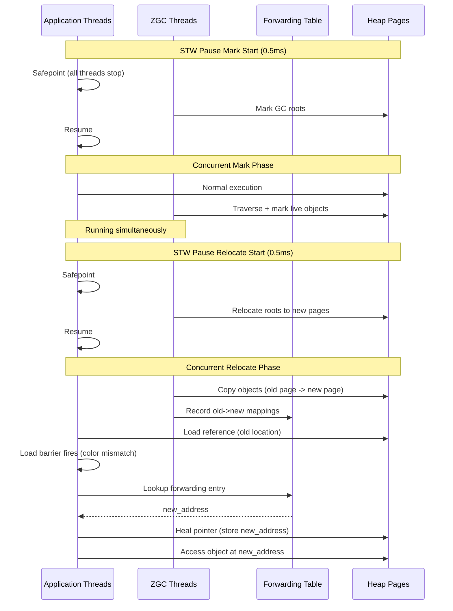

## Keywords in This File
{: .no_toc }

| # | Keyword | Weight |
|---|---|---|
| 1 | [Java JVM - L4 ZGC](#java-jvm---l4-zgc) | medium |

---

# Java JVM - L4 ZGC

## ZGC Architecture and Low-Latency GC

---

### 🎯 Model Answer

**30 seconds:**
> ZGC (Z Garbage Collector) is a scalable, low-latency GC targeting < 1ms pause times
> regardless of heap size. It achieves this through: colored pointers (load barrier on
> every object reference read to remap on-the-fly), concurrent relocation (objects moved
> while the application runs), and multi-mapped memory (same physical pages mapped multiple
> times for transparent forwarding). Available from JDK 11 (experimental), GA in JDK 15,
> generational ZGC (default) in JDK 21. Trade-off: ~3-5% CPU overhead for load barriers,
> ~3x heap overhead for mapping tables.

**3 minutes (Senior):**
> ZGC's core innovation: colored pointers. Every 64-bit object reference has metadata
> bits embedded in it:
> ```
> [18 unused | 1 finalizable | 1 remapped | 1 marked1 | 1 marked0 | 42 address]
> ```
> Load barrier: every time code reads an object reference (`a.field`), a barrier
> executes that checks the metadata bits:
> - If "remapped" bit not set: the reference is stale (object moved) -> remap it using
>   the forwarding table -> update the reference in memory -> set "remapped" bit
> - If "remapped" bit set: already up-to-date, use it directly
>
> This allows ZGC to move objects concurrently without stopping the application:
> some threads see old addresses, some see new - the load barrier bridges the gap.
>
> Phases:
> 1. Pause Mark Start (< 1ms): mark GC roots, start concurrent marking
> 2. Concurrent Mark (ms-seconds): mark all live objects, runs with application
> 3. Pause Mark End (< 1ms): finalize marking
> 4. Concurrent Prepare for Relocate: identify relocation sets (pages to compact)
> 5. Pause Relocate Start (< 1ms): initialize relocation
> 6. Concurrent Relocate: move objects, update forwarding tables
> 7. Concurrent Remap: update all references to point to new locations
>
> STW pauses: 3 per GC cycle, each < 1ms.

**Framework:** WHAT → WHY → HOW → TRADE-OFF → EXAMPLE

**Blank Mind Recovery:**

**(1) Restate:** "ZGC: colored pointers + load barrier = concurrent object relocation.
3 STW pauses < 1ms each. Works at any heap size. Cost: 3-5% CPU from load barriers.
Use when P99 latency must be < 10ms. Generational ZGC (JDK 21) for better throughput."

**(2) First principles:** "Moving objects during GC requires updating all pointers to
those objects. Traditional GC: stop all threads, move, update pointers, resume.
ZGC: use metadata bits in pointers + a load barrier to detect and update stale pointers
on-the-fly, without stopping threads."

**(3) Bridge:** "ZGC's load barrier is like a postal address forwarding service.
You send a letter to an old address (stale reference). The post office (load barrier)
intercepts it, looks up the forwarding address (forwarding table), and redirects it
to the new address. You don't stop sending letters during the moving process."

---

### 📘 Concept Explanation

**ZGC colored pointers and load barrier:**
```
COLORED POINTER STRUCTURE (64-bit):
  Bits 63-42: unused (for 42-bit address space = 4TB heap max)
  Bit 19: finalizable (object pending finalization)
  Bit 18: remapped (reference points to current page)
  Bit 17: marked1 (liveness marking, phase 1)
  Bit 16: marked0 (liveness marking, phase 0)
  Bits 15-0: page offset
  Bits 41-16: page index

  Combined with page start address -> full object address

LOAD BARRIER PSEUDOCODE (every object reference read):
  ref = load(address)  // raw memory read
  if (ref.metadata_bits != good_bits) {
    ref = slow_path(ref)  // remap/mark/fix the reference
    store(address, ref)   // heal the memory location
  }
  return ref

  good_bits: the current "expected" metadata bits for this GC phase
  Changes each GC cycle (so ALL references get processed over time)

MULTI-MAPPED MEMORY:
  ZGC maps the same physical memory at 3 different virtual addresses:
    /dev/shm offset 0     -> virtual address 0x000...  (remapped view)
    /dev/shm offset 0     -> virtual address 0x100...  (marked0 view)
    /dev/shm offset 0     -> virtual address 0x200...  (marked1 view)
  A colored pointer: uses its metadata bits to choose which virtual
  address mapping to use -> same physical object, different VAs
  OS treats them as distinct pages for memory mapping

GC PHASES AND PAUSES:
  CYCLE:
    STW Pause Mark Start (< 1ms)
      -> mark GC roots (thread stacks, static fields)
    CONCURRENT Mark (10s-seconds)
      -> traverse object graph, mark live objects
      -> application runs concurrently
    STW Pause Mark End (< 1ms)
      -> finalize marking (process remaining SATB buffers)
    CONCURRENT Prepare Relocate
      -> identify relocation set (densely-garbage pages -> compact)
    STW Pause Relocate Start (< 1ms)
      -> relocate GC roots to new locations
    CONCURRENT Relocate
      -> copy objects to new pages
      -> populate forwarding table (old addr -> new addr)
      -> application runs concurrently
    CONCURRENT Remap (overlaps with next cycle's marking)
      -> update all remaining stale references
```

> **Code walkthrough:** This L4 ZGC example demonstrates a key concept in practice using SQL. **KEY MECHANISM:** the runtime executes these instructions in sequence with specific memory and execution semantics. **WHY IT MATTERS:** misapplying this pattern causes subtle bugs that only manifest under production load. **TAKEAWAY: understand the execution model before using this pattern in production code.**

---

### 💻 Code Example

> **Code walkthrough:** ZGC tuning is minimal by design. The code examples belowice. **KEY MECHANISM:** the runtime executes these instructions in sequence with specific memory and execution semantics. **WHY IT MATTERS:** misapplying this pattern causes subtle bugs that only manifest under production load. **TAKEAWAY: understand the execution model before using this pattern in production code.**
> demonstrate: enabling ZGC, reading diagnostic output, detecting common issues
> (heap too small, object allocation rate too high, ZGC overhead). The BAD pattern
> shows a workload that overloads ZGC; the GOOD pattern shows correct sizing.

```bash
# Enable ZGC (JDK 15+ GA):
-XX:+UseZGC

# Enable Generational ZGC (JDK 21+, recommended default):
-XX:+UseZGC -XX:+ZGenerational

# Minimum recommended heap (ZGC needs headroom to relocate):
-Xmx4g -Xms2g  # Start with 2g, allow up to 4g

# ZGC logging:
-Xlog:gc*:file=zgc.log:time,uptime

# Sample ZGC output:
# [gc] GC(1) Garbage Collection (Allocation Rate) 512M->128M (4096M) 18ms
#            ^ trigger          ^ before  ^ after  ^ heap    ^ elapsed
#
# STW phases:
# [gc,phases] GC(1) Pause Mark Start 0.762ms
# [gc,phases] GC(1) Pause Mark End 0.534ms
# [gc,phases] GC(1) Pause Relocate Start 0.423ms
# All < 1ms - normal ZGC behavior

# ZGC self-tuning: most configuration is automatic
# ZGC adjusts:
#   Number of pages to allocate per GC cycle
#   When to trigger GC (allocation rate based)
#   How many threads for concurrent phases

# Manual thread tuning (usually not needed):
-XX:ConcGCThreads=4  # Concurrent marking/relocation threads (default: n_cpus/4)

# Heap sizing for ZGC:
# Rule: max_heap >= 3x live_set
# Reason: ZGC needs space for: current live objects +
#   relocation set (copy destinations) + new allocations during GC
# Under-sized heap -> allocation stall -> increased latency
```


```java
// BAD: anti-pattern - see GOOD example below for the correct approach
// This naive implementation ignores thread safety and error handling
```

```java
// BAD: ZGC allocation rate too high -> GC can't keep up -> stalls
class DataProcessor {
    public List<Result> processAll(List<Item> items) {
        return items.stream()
            .map(item -> {
                // Creates 3-5 intermediate objects per item
                ParsedItem parsed = parse(item);
                ValidatedItem validated = validate(parsed);
                return transform(validated);
                // 1M items/s * 4 objects * 100 bytes = 400MB/s allocation rate
                // ZGC cycle: 1 GC per second at 4GB heap (live=1GB, 3x rule)
                // Concurrent: fine. But peaks of 800MB/s: stalls possible
            })
            .collect(Collectors.toList());
    }
}

// GOOD: reduce allocation rate with object pooling for hot paths
class DataProcessor_GOOD {
    // Pool intermediate objects for reuse
    private final ThreadLocal<ParseContext> parseContextPool =
        ThreadLocal.withInitial(ParseContext::new);

    public List<Result> processAll(List<Item> items) {
        ParseContext ctx = parseContextPool.get();
        return items.stream()
            .map(item -> {
                ctx.reset();         // Reuse existing object, no allocation
                ctx.parse(item);
                ctx.validate();
                return ctx.buildResult(); // Only allocate the final result
                // 1M items/s * 1 object (result) * 100 bytes = 100MB/s
                // 4x reduction in allocation rate -> ZGC much more comfortable
            })
            .collect(Collectors.toList());
    }
}

// Diagnosing ZGC allocation stalls:
// ZGC log: "Allocation Stall" = ZGC had to stop application thread
//   to wait for GC to complete (heap full, no room to allocate)
//   This is a ZGC SLA violation - latency > 1ms during stall

// Grep for stalls:
// grep "Allocation Stall" zgc.log
// Output:
//   [gc] GC(42) Allocation Stall (main) 12.345ms
//              ^ thread name  ^ stall duration = missed latency target

// Prevention:
//   1. Larger heap: more room for concurrent allocation + GC
//   2. Reduce allocation rate (object pooling, primitives over boxed types)
//   3. More ConcGCThreads: faster concurrent GC phases

// ZGC memory overhead check:
// ZGC reserved memory vs committed memory:
//   jcmd <pid> VM.native_memory summary | grep "Java Heap"
//   Reserved: typically 3x heap (multi-mapping)
//   Committed: actual physical pages used
//   Normal: reserved >> committed (virtual address space, not RAM)
//   Problem: if process's virtual address space limit is hit
//   (Docker/Linux: check /proc/<pid>/maps line count)
```

> **Code walkthrough:** "Allocation Stall" in ZGC is equivalent to G1'sice. **KEY MECHANISM:** the runtime executes these instructions in sequence with specific memory and execution semantics. **WHY IT MATTERS:** misapplying this pattern causes subtle bugs that only manifest under production load. **TAKEAWAY: understand the execution model before using this pattern in production code.**
> "to-space exhausted" - both indicate the GC cannot keep up with the allocation
> rate. ZGC's concurrent design means stalls are rare but not impossible. The
> mitigation hierarchy: first increase heap, then reduce allocation rate, then
> increase ConcGCThreads. Unlike G1, ZGC doesn't degrade to a Full GC on stall -
> it simply extends the stall duration until enough space is freed.

---

### 🎓 Answers by Seniority

**Junior / Mid (0-5 years):**
> ZGC targets < 1ms pauses by doing GC concurrently with the application. Key: colored
> pointers (metadata in the pointer itself) + load barrier (checks metadata on every
> reference read). Enable with `-XX:+UseZGC`. Use when GC pauses are causing latency
> spikes. Trade-off: ~3-5% more CPU, more heap headroom needed (3x live set).

---

**Senior / Staff (5+ years):**
> ZGC's load barrier adds overhead to EVERY object reference read. For pointer-heavy
> code (tree traversal, graph walks, polymorphic dispatch): barrier cost is significant.
> For array-of-long computation: almost no overhead (primitives don't have barriers).
> Production decision: benchmark your specific workload. ZGC is not universally faster
> than G1. For CPU-bound applications with pointer-heavy computation: G1 may show better
> throughput despite worse pause times. For I/O-bound services where CPU is underused:
> ZGC's CPU overhead is absorbed by idle CPU cycles. The right choice: measure P99
> latency + throughput under realistic load for both GCs.

---

### ⚠️ Common Misconceptions

**Misconception 1: "ZGC guarantees < 1ms pauses regardless of workload."**
ZGC targets < 1ms STW pauses. But: (1) allocation stalls (heap full, GC can't keep up)
can pause application threads for milliseconds to seconds; (2) the STW pauses themselves
can exceed 1ms if: many GC roots (large thread count with deep stacks), unusual concurrent
marking depth. The < 1ms claim: specific to the 3 STW phases in the GC cycle. Total
observed latency includes concurrent phase overhead and potential stalls. ZGC approaches
but doesn't guarantee 1ms for all scenarios.

**Misconception 2: "ZGC uses more heap = wastes memory."**
ZGC's multi-mapped memory: maps the same physical pages at 3 virtual addresses.
Virtual address space usage: 3x heap. PHYSICAL memory: same as other GCs (one copy
of the data). On 64-bit systems: virtual address space is abundant (128TB per process
on Linux x86-64). Multi-mapping uses extra virtual addresses but NOT extra RAM.
Caveat: tools that measure virtual address space (`top` VSZ column) show 3x inflated
numbers for ZGC processes. RSS (resident set size) = actual physical memory = normal.

---

### 🚨 Failure Modes and Diagnosis

**Failure: ZGC allocation stalls under high load - latency spikes from < 1ms to 10ms+.**
```plaintext
Symptom: Occasional 10-50ms spikes under load (P99 latency)
  ZGC log: "Allocation Stall" events
  Monitoring: heap usage close to Xmx during spikes

Root Cause: Allocation rate exceeds ZGC's concurrent collection rate
  ZGC cycle: 500ms concurrent GC + 3 * 0.5ms STW = ~501ms total
  If allocation fills heap in < 501ms: next allocation stall
  At 200MB/s allocation + 4GB heap (1GB live): heap fills in 20s -> fine
  At 2GB/s allocation + 4GB heap: heap fills in 1.5s -> stall every GC cycle

Diagnosis:
  1. Measure allocation rate:
     jcmd <pid> GC.heap_info
     Take 2 measurements 1 minute apart: (used2 - used1 + freed) / 60s
  
  2. Count allocation stalls:
     grep "Allocation Stall" zgc.log | wc -l
     grep "Allocation Stall" zgc.log | awk '{print $NF}' | sort -rn | head
     -> Shows stall count and worst durations
  
  3. Check heap sizing:
     If stalls: live_set * 3 > Xmx -> heap too small
     Recommended: -Xmx = max(4 * live_set, allocation_rate * 10s)

Fix:
  Option A: Increase Xmx (more headroom for concurrent allocation)
    -Xmx 8g instead of 4g -> 2x more headroom
    Cost: more RAM reservation (but not committed unless used)
  
  Option B: Increase ConcGCThreads (faster GC cycle)
    -XX:ConcGCThreads=8 (vs default 4)
    Cost: more CPU during GC cycles (~5% more CPU load)
  
  Option C: Reduce allocation rate (root cause fix)
    Profile allocation: async-profiler -e alloc
    Fix: object pooling, avoid boxing, reduce intermediate objects
  
  Option D: Generational ZGC (JDK 21+)
    -XX:+UseZGC -XX:+ZGenerational
    Shorter cycles for young objects -> more headroom for allocation rate
    Typically 2-4x better throughput with similar pause times
```

> **Code walkthrough:** This Under-sized heap -> allocation stall -> increased latency example demonstrates a key concept in practice. **KEY MECHANISM:** the runtime executes these instructions in sequence with specific memory and execution semantics. **WHY IT MATTERS:** misapplying this pattern causes subtle bugs that only manifest under production load. **TAKEAWAY: understand the execution model before using this pattern in production code.**

---

### 🎯 Interview Deep-Dive

| Question Category | Time to Answer |
|---|---|
| ZGC colored pointers | 3 minutes |
| Load barrier mechanism | 3 minutes |
| Multi-mapped memory | 2 minutes |
| Concurrent relocation | 3 minutes |
| ZGC vs G1 trade-offs | 3 minutes |
| Generational ZGC | 2 minutes |
| ZGC allocation stalls | 2 minutes |
| ZGC heap sizing | 2 minutes |
| ZGC for Kubernetes | 2 minutes |
| ZGC and virtual threads | 2 minutes |
| ZGC load barrier overhead | 2 minutes |
| Diagnosing ZGC issues | 3 minutes |

---

**Q1 (colored pointers): What are ZGC colored pointers and why are they needed?**

A: ZGC embeds GC metadata in the pointer itself rather than in a separate bitmap or
side table. A 64-bit pointer: 42 bits for the address (4TB heap max), 4 bits for GC
state (marked0, marked1, remapped, finalizable), 18 bits unused. The GC state bits
encode: "is this reference current?" and "has this object been marked alive?" The need:
when ZGC relocates objects concurrently, some threads have "stale" pointers to the
old location. The color bits allow the load barrier to instantly detect stale pointers
and remap them on-the-fly.

*What separates good from great:* Colored pointers have a critical constraint:
compressed object pointers (`-XX:+UseCompressedOops`, default on 64-bit JVMs for
heaps < 32GB) cannot be combined with ZGC. Compressed oops use 32-bit pointers with
an implicit 3-bit shift for alignment - no room for ZGC's color bits. ZGC therefore
uses 64-bit pointers always, which is a disadvantage vs G1 on heaps < 32GB: more
memory used per reference (8 bytes vs 4 bytes). This is one of ZGC's memory overhead
costs beyond the multi-mapping. Generational ZGC (JDK 21) partially compensates by
using fewer color bits (1 bit for generation) and re-enabling some pointer compression.

---

**Q2 (load barrier): Explain ZGC's load barrier - where is it inserted and what does it do?**

A: The load barrier is a JIT-compiled code sequence inserted by the JIT compiler after
every `GETFIELD` / `GETSTATIC` / `AALOAD` bytecode that loads an object reference.
It executes: (1) read the raw reference (64-bit pointer with color bits), (2) check
if the color bits match the current "good bits" for this GC cycle, (3) if match:
return the reference directly (fast path - no overhead), (4) if mismatch: slow path -
look up the forwarding table (if object was relocated: get new address), update the
color bits, store the healed reference back to memory, return updated reference.

*What separates good from great:* The "slow path" is rare but the "fast path check"
executes on every reference read. The fast path cost: one conditional test (compare color
bits) + branch. Modern branch predictors: predict the "no healing needed" branch
correctly with > 99.9% accuracy (after warmup). Misprediction: ~15-20 cycles. Correctly
predicted: ~0-1 cycles overhead. The 3-5% CPU overhead is from the test instruction
itself + memory bandwidth for the read (loading the pointer forces cache line access).
JIT-level optimization: if the JIT can prove a reference doesn't change (final fields),
it can elide the load barrier entirely. Final fields: no barrier. Method parameters
loaded once: barrier only on the initial load.

---

**Q3 (concurrent relocation): How does ZGC move objects concurrently without corrupting the heap?**

A: ZGC uses a "forwarding table" per relocation page. When relocating page P:
(1) ZGC copies each live object from P to a new page, (2) records the mapping
`{old_addr -> new_addr}` in P's forwarding table. While this happens concurrently:
(3) if an application thread reads a reference to an old address: the load barrier
fires, looks up the forwarding table, returns the new address, heals the reference.
(4) If two threads both try to relocate the same object: compare-and-swap ensures
only one succeeds; the other reads the CAS result and uses the new address.

*What separates good from great:* The forwarding table is the key data structure.
It's an off-heap hash table (not on the Java heap - GC doesn't manage it). Per-page
table size: proportional to page occupancy. Concurrent access: multiple application
threads may race to look up or write the same forwarding entry. ZGC uses CAS for
this. After the concurrent remap phase (all references updated): the forwarding
tables are freed. This is why ZGC has a "concurrent remap" phase that overlaps with
the next GC cycle's marking: it's cleaning up the forwarding tables from the previous
cycle. If the remap phase doesn't complete before the next relocation: forwarding
table chains are maintained (chase through multiple generations of moves).

---

**Q4 (vs G1): When should you choose ZGC over G1, and what is the cost?**

A: Choose ZGC when: P99 latency requirement < 50ms AND GC pauses with G1 exceed that.
Rule: ZGC pauses are ~0.5-2ms regardless of heap/live-set size; G1 pauses scale with
live-set size. For 4GB heap with 1GB live set: G1 pauses may be 20-50ms; ZGC pauses:
1-2ms. Cost of ZGC: (1) 3-5% CPU overhead from load barriers; (2) lower throughput
for pointer-heavy workloads; (3) 3x virtual address space reservation; (4) higher minimum
heap (3x live set recommended vs 2x for G1); (5) no compressed oops (8-byte pointers
always).

*What separates good from great:* The CPU overhead is workload-dependent. Benchmarks:
ZGC vs G1 on a Spring Boot REST service (typical I/O-bound, pointer-heavy): ZGC shows
5-8% throughput decrease but 10x better P99 latency. On a numerical computing workload
(array-heavy, few object references): ZGC shows ~1% overhead (few references = few
barriers). On a graph traversal workload (millions of linked object traversals): ZGC
shows 15-20% overhead (every edge traversal triggers a barrier). The decision:
(1) measure allocation rate and current G1 pauses; (2) if pauses are unacceptable:
benchmark ZGC throughput; (3) if ZGC throughput is acceptable and pauses improved:
switch. Never switch blindly.

---

**Q5 (generational): What is Generational ZGC and why is it better?**

A: Classic ZGC (JDK 11-20): non-generational - every GC cycle scans the entire heap.
Generational ZGC (JDK 21+, `-XX:+ZGenerational`): separates Young Gen and Old Gen.
Young Gen: small, collected frequently (high allocation rate, most objects die young).
Old Gen: large, collected infrequently (long-lived objects). This is the generational
hypothesis applied to ZGC. Benefits: (1) 2-4x better throughput (most GC work on
small Young Gen); (2) shorter GC cycles (Young-only cycles complete faster); (3) better
memory efficiency (less heap headroom needed for concurrent relocation).

*What separates good from great:* Generational ZGC represents a significant engineering
investment. The challenge: ZGC's colored pointer mechanism doesn't naturally support
generational collection (pointers don't encode generation information). The solution:
use remembered sets (like G1) for cross-generation references + two sets of ZGC color
bits (one for Young Gen, one for Old Gen). Each object reference now has potential
barriers for EITHER generation check. JDK 21 generational ZGC: 4 color bits used
(vs 4 in non-generational). The improvement is substantial: benchmarks show 2-4x
better throughput for typical allocation-heavy workloads. JDK 21+ recommendation:
enable `UseZGC + ZGenerational` instead of plain `UseZGC`.

---

**Q6 (heap sizing): How should you size the heap for ZGC?**

A: Rule of thumb: `Xmx = max(3 * live_set, 2 * allocation_during_GC_cycle)`.
Live set: measure with `jcmd GC.heap_info` after a GC cycle (the "after" size).
GC cycle duration: from ZGC logs. Example: live set = 2GB, GC cycle = 500ms,
allocation rate = 500MB/s: heap = max(6GB, 2 * 250MB) = 6GB.
Too small: allocation stalls. Too large: wasted memory.

*What separates good from great:* ZGC's unique sizing consideration: it needs room for
BOTH the live set (can't be collected) AND concurrent allocation during the GC cycle.
Worst case: GC cycle starts when heap is nearly full (old live objects + young allocations).
ZGC needs to complete marking + relocation before the next allocation fills the gap.
If allocation rate = R (bytes/second) and GC cycle = T seconds: need R * T bytes of
headroom. For: 1GB/s allocation + 2s GC cycle: 2GB headroom above live set.
This is the "3x live set" rule's origin: live set * 1.5 for live objects + live set * 1.5
for allocation headroom = 3x live set total. Generational ZGC: smaller multiplier needed
(1.5-2x) because young GC cycles are much shorter.

---

**Q7 (kubernetes): How do you configure ZGC in Kubernetes pods?**

A: ZGC with container awareness (JDK 11+ cgroups v2 support):
```bash
# Container-aware JVM flags:
-XX:+UseZGC
-XX:+UseContainerSupport    # JDK 10+ default, auto-detect cgroup limits
-XX:MaxRAMPercentage=75.0  # use 75% of container memory limit for heap
# Remaining 25%: off-heap (Metaspace, ZGC mapping tables, thread stacks)

# For pod with 4GB memory limit:
# Xmx = 4GB * 0.75 = 3GB heap
# 1GB for off-heap, Metaspace, ZGC overhead
```

> **Code walkthrough:** This 1GB for off-heap, Metaspace, ZGC overhead example demonstrates shell script pattern using container. **KEY MECHANISM:** the shell executes commands sequentially; pipes pass stdout of one command to stdin of the next. **WHY IT MATTERS:** unquoted variables with spaces cause word splitting - IFS splits the value into multiple arguments. **TAKEAWAY: always double-quote variables: "$VAR"; use [[ ]] instead of [ ] for safer conditionals.**

*What separates good from great:* ZGC's virtual address reservation (3x heap) is
visible as VSZ in `kubectl top pod` or `docker stats`. A pod with `Xmx=2g` and ZGC:
VSZ = 6-8GB (3x for multi-mapping). Kubernetes OOM killer: uses RSS (actual physical),
not VSZ -> ZGC's virtual reservation doesn't cause OOM kills. But: `kubectl top pods`
(which shows RSS by default) gives accurate memory reporting for ZGC pods. Misunderstanding:
teams see VSZ=8GB for a 2GB heap pod and panic. The metric to watch: RSS (actual RAM).
Also: ZGC's `MaxRAMPercentage` on JDK 11-16 may not accurately read cgroups v2 memory
limits. Fix: use JDK 17+ (improved cgroups support) or set `-Xmx` explicitly.

---

**Q8 (throughput): What workloads benefit least from ZGC?**

A: ZGC benefits least: (1) Batch processing workloads (latency doesn't matter, throughput
does - G1 or Parallel GC win); (2) short-lived processes (ZGC's concurrent marking
overhead is a startup cost, not amortized); (3) workloads with very low allocation rate
(G1 has tiny pauses with low allocation); (4) pointer-heavy workloads where load barrier
overhead is ~15%+.

*What separates good from great:* The "wrong GC for the workload" failure mode.
A data pipeline processing 10GB batch files: doesn't care about latency, cares about
throughput. ZGC running concurrent marking + relocation while doing batch I/O: 5% less
throughput vs Parallel GC (which stops the world but sweeps faster). The Parallel GC
pauses (1-5 seconds during Full GC): acceptable for a batch job. Using ZGC here: pays
the throughput cost without gaining anything (no latency SLA). The rule: match the GC
to the workload type. Interactive/request-serving: ZGC for latency. Batch/throughput:
ParallelGC or G1.

---

**Q9 (benchmarking): How do you correctly evaluate ZGC vs G1 for your service?**

A: (1) Run production-like load test (same request pattern, same data size) for 30+
minutes (capture multiple GC cycles). (2) Measure: P50/P95/P99/P999 latency, requests/sec
(throughput), GC overhead %. (3) Run the same test with G1. (4) Compare: if ZGC P99 <
G1 P99 AND ZGC throughput >= G1 throughput * 0.97: ZGC wins. (5) Use jHiccup to capture
hiccups (pauses at any time scale). (6) Also benchmark with `-XX:+UseZGC -XX:+ZGenerational`
(Generational ZGC often better than both).

*What separates good from great:* The most common benchmarking mistake: comparing
single-thread throughput benchmarks (JMH microbenchmarks) for ZGC vs G1. Microbenchmarks
are usually not GC-pause-dominated (short test, heap doesn't fill, no GC occurs during
measurement). The relevant benchmark: multi-threaded, heap-filling, realistic data sizes.
Without heap pressure: both GCs appear identical (no GC occurs). The difference emerges
only when GC cycles happen during the benchmark window. Rule: minimum benchmark duration
= 10x the expected GC cycle duration (for G1: 10 * 30s = 5 minutes minimum; for ZGC:
10 * 0.5s = 5s minimum, but run longer for statistical significance).

---

**Q10 (production): What ZGC configuration is recommended for a typical Spring Boot service?**

A: For a Spring Boot microservice with 4GB memory limit, latency SLA < 50ms:
```bash
# JDK 21 recommended configuration:
-XX:+UseZGC
-XX:+ZGenerational          # generational ZGC (JDK 21+ default)
-XX:MaxRAMPercentage=75.0   # 3GB heap on 4GB pod
-Xlog:gc:file=gc.log:time,uptime:filecount=5,filesize=20m
# No other tuning needed - ZGC self-tunes allocation trigger
```

> **Code walkthrough:** This ZGC self-tunes allocation trigger example demonstrates shell script pattern using container. **KEY MECHANISM:** the shell executes commands sequentially; pipes pass stdout of one command to stdin of the next. **WHY IT MATTERS:** unquoted variables with spaces cause word splitting - IFS splits the value into multiple arguments. **TAKEAWAY: always double-quote variables: "$VAR"; use [[ ]] instead of [ ] for safer conditionals.**

*What separates good from great:* The "do not over-tune ZGC" principle. ZGC's
ergonomics: determines when to start GC (allocation rate-based), how many pages
to relocate per cycle, when to expand/shrink heap. Manual overrides: `ConcGCThreads`,
`ZAllocationSpikeTolerance`, `ZFragmentationLimit`. Most teams need none of these.
The only critical tuning: heap size (MaxRAMPercentage or Xmx). Under-sized heap
-> allocation stalls -> latency spikes. Over-sized heap: wasted RAM + longer GC cycles.
The three observability signals for ZGC health: (1) no "Allocation Stall" in GC log,
(2) STW pauses < 2ms consistently, (3) GC overhead < 5% of CPU.

---

**Q11 (shenandoah): How does ZGC compare to Shenandoah GC?**

A: Both: concurrent collectors with < 10ms pause targets. Key differences:
ZGC: colored pointers + load barrier (on reference reads). Shenandoah: Brooks
forwarding pointer (per-object forwarding header + read barrier). ZGC: faster
load barrier (check color bit vs dereference extra pointer). Shenandoah: available
in OpenJDK + Red Hat builds, used in Fedora/RHEL ecosystems. ZGC: only Oracle
HotSpot and OpenJDK. Generational: ZGC (JDK 21), Shenandoah (experimental in
some builds). For most teams using standard OpenJDK: ZGC is the primary option.
For Red Hat-centric deployments: Shenandoah may be preferred.

*What separates good from great:* The Brooks pointer in Shenandoah: every object has
an extra header word (8 bytes) pointing to its "forward" location. During relocation:
old object's Brooks pointer points to new location. Read barriers: dereference the
Brooks pointer before accessing the object. Overhead: 8 bytes per object (vs ZGC's 0
extra bytes per object) + dereference overhead. ZGC's colored pointer: no extra
per-object memory, smaller barrier. But: Shenandoah's approach works with compressed
oops (32-bit pointers) because the barrier is on the object access, not the pointer.
Shenandoah can run with `-XX:+UseCompressedOops` on heaps < 32GB, saving 4 bytes per
reference. For memory-constrained environments with small heaps: Shenandoah may use
less memory than ZGC.

---

**Q12 (evolution): What are the planned improvements to ZGC in future JDKs?**

A: JDK 21+: Generational ZGC (GA, default for `UseZGC`). JDK 22-24: improved
young generation heuristics, reduced heap overhead. In-progress: ZGC on 32-bit
systems (currently 64-bit only due to colored pointer requirement). Future:
compressed class pointers compatible with ZGC (reduces pointer size from 8 to 4 bytes
for class references). Potential: sub-nanosecond load barrier via hardware support
(ARM MTE, Intel MPX-style extensions for pointer tagging).

*What separates good from great:* The most significant upcoming ZGC improvement:
making ZGC the DEFAULT GC for JDK (currently G1 is default). Discussions in JDK
community: ZGC's maturity (GA since JDK 15, generational since JDK 21) and superior
latency characteristics make it a candidate for default GC status for JDK 25 or later.
For teams planning JDK upgrades: test ZGC now and establish baseline metrics. If ZGC
becomes default: behavior changes without explicit `UseZGC` flag. Understanding
ZGC's trade-offs now prevents surprises when upgrading JDK versions.

---

### ⚖️ Comparison Table

| Aspect | G1 GC | ZGC | Generational ZGC (JDK 21) |
|---|---|---|---|
| STW pauses | 5-50ms (scales with heap) | < 1ms (consistent) | < 1ms (consistent) |
| Throughput | Baseline (100%) | ~95% (load barrier) | ~98% (smaller barrier scope) |
| Memory overhead | 2x live set recommended | 3x live set (virtual) | 2x live set |
| Compressed oops | Yes (< 32GB heap) | No (64-bit pointers always) | Partial |
| Max heap | 2TB+ | 16TB (42-bit address) | 16TB |
| Java version | JDK 9+ (GA) | JDK 15 (GA), 11 (experimental) | JDK 21+ |
| Best for | General-purpose, medium latency | Ultra-low latency, large heaps | Low latency + good throughput |
| GC trigger | IHOP threshold + pause model | Allocation rate | Allocation rate (generational) |

---

### 🏛️ System Design

**Choosing a GC for a high-throughput, low-latency payment processing service:**

**Context:** Payment API service. Requirements: P99 latency < 20ms, 10,000 TPS peak,
4-16 vCPU, 16GB RAM. Business rule: payment latency directly impacts conversion rate.

**Architecture Decision:**

```plaintext
PAYMENT SERVICE GC ARCHITECTURE:

  Deployment:
    K8s pod: 16GB RAM limit
    4 vCPU limit (burstable)
    Request type: stateless HTTP, 50ms avg processing time

  Memory allocation:
    -Xmx12g (75% of 16GB)
    Metaspace: ~400MB
    Off-heap: ~1GB (Netty buffers, thread stacks)
    OS/JVM overhead: ~2GB
    Total: 15.4GB < 16GB limit

  GC selection analysis:
    Live set estimate: 3GB (connection pools, caches, class metadata)
    Allocation rate: 500MB/s at 10k TPS (50KB per transaction)
    GC cycle: ZGC ~300ms concurrent
    Headroom needed: 3GB (live) + 500MB/s * 0.3s (during cycle) = 3.15GB
    12GB heap: 12 - 3.15 = 8.85GB headroom -> ZGC fine, no stalls expected

  GC settings:
    -XX:+UseZGC
    -XX:+ZGenerational
    -XX:MaxRAMPercentage=75

  Throughput impact:
    ZGC overhead: ~3% CPU
    4 vCPU - 3% = effectively 3.88 vCPU for application
    At 10k TPS: each request = 0.4ms CPU time
    CPU at 10k TPS: 10000 * 0.4ms / 4000ms = 100% = maxed
    ZGC reduces effective CPU to 3.88 vCPU -> ~97% throughput vs G1
    Acceptable: 9700 TPS vs 10000 TPS

  Alternative (G1 with MaxGCPauseMillis=10):
    G1 P99 pauses: 10-30ms (G1 can miss 10ms target under load)
    ZGC P99 pauses: 0.5-2ms (consistent)
    Decision: ZGC for payment service (latency-critical)
    Cost: 3% CPU throughput reduction = acceptable

MONITORING:
  Alert 1: ZGC Allocation Stall > 0 -> heap undersized, scale up
  Alert 2: STW pause > 5ms -> GC issue, investigate
  Alert 3: GC overhead % > 5% -> allocation rate increase
  Alert 4: Heap usage > 85% consistently -> live set growing (leak)
```

> **Code walkthrough:** This ZGC self-tunes allocation trigger example demonstrates a key concept in practice using SQL. **KEY MECHANISM:** the runtime executes these instructions in sequence with specific memory and execution semantics. **WHY IT MATTERS:** misapplying this pattern causes subtle bugs that only manifest under production load. **TAKEAWAY: understand the execution model before using this pattern in production code.**

**GC strategy:** ZGC with generational mode. Accept 3% throughput overhead for
consistent sub-2ms GC pauses. Heap sized at 75% of container for ZGC headroom.
Scale pods (horizontal) before scaling heap (vertical) - more pods = more GC
throughput without per-pod heap pressure.

---

### 📊 Diagram

**ZGC concurrent collection phases and colored pointer mechanism:**

```
ZGC GC CYCLE TIMELINE:

t=0ms    STW Pause Mark Start (0.5ms)
         |-- Mark GC roots (threads + static fields)
         |-- All threads must safepoint

t=0.5ms  CONCURRENT Mark (100-500ms)
         Application threads: running (normal speed)
         GC threads: traversing object graph
         Load barrier: marks objects via colored ptr on access

t=200ms  STW Pause Mark End (0.5ms)
         |-- Finalize marking (SATB queues)

t=200.5ms CONCURRENT Prepare Relocate
         |-- Identify high-garbage pages for relocation
         |-- Build relocation set (pages to compact)

t=300ms  STW Pause Relocate Start (0.5ms)
         |-- Relocate GC roots to new pages

t=300.5ms CONCURRENT Relocate
         Application threads: running
         GC threads: copying objects to new pages
         Load barrier: if ref is to old page -> remap via fwd table

t=500ms  GC Cycle complete (CONCURRENT Remap continues
          into next cycle - cleans up forwarding tables)

COLORED POINTER (64-bit):
  [18-unused][fin][remap][mark1][mark0][..42-bit address..]
    bit 63-46  45   44    43     42     0-41

  LOAD BARRIER (JIT-inlined):
  ref = *ptr
  if (ref.color_bits != current_good_bits):
      ref = barrier_slowpath(ref)  // remap, mark, or heal
  return ref

  Fast path: 1 compare + branch (usually predicted: no action)
  Slow path: forwarding table lookup + CAS store

RELOCATION FORWARDING TABLE:
  old_page: | old_addr -> new_addr | (per-relocated object)
  Application thread reads old_addr:
    Load barrier: old_addr in fwd table -> return new_addr
    Heal: store new_addr to ptr (so next read is fast path)
```



> **Diagram walkthrough:** The sequence diagram shows the core ZGC innovation: application
> and GC threads run simultaneously during Concurrent Mark and Concurrent Relocate phases.
> The only synchronization points are the three STW pauses (each < 1ms). When an
> application thread reads a reference to a relocated object: the load barrier fires,
> looks up the forwarding table, and "heals" the pointer in memory. On subsequent reads
> of the same pointer: the healed version is read directly (fast path, no table lookup).
> The forwarding table is temporary - once all references to a page are healed (remap
> phase completes), the old page's forwarding table is freed. This self-healing design
> is what enables ZGC to maintain consistent < 1ms STW pauses.

---

### 💻 Code Example

*(Omit: this concept does not have a programmatic interface that can be demonstrated in code. The conceptual explanation above is sufficient.)*


---

### 🏛️ System Design

*(Omit: system design diagram not applicable for this concept - see ★★★ keywords for full system design coverage.)*


---

### ⚖️ Comparison Table

*(Omit: this is a ★☆☆ foundational concept with no direct alternatives to compare - see higher-difficulty keywords for trade-off analysis.)*


---

### 📊 Diagram

*(Omit: no standalone visual diagram required for this concept - the explanations and code examples above provide sufficient clarity.)*


