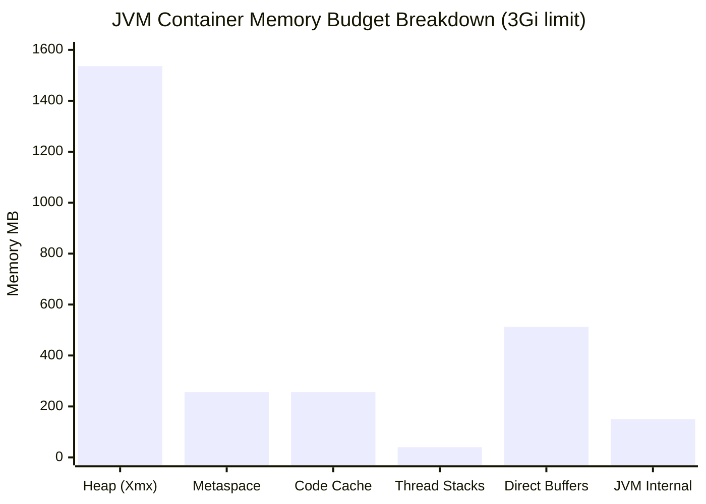

## Keywords in This File
{: .no_toc }

| # | Keyword | Weight |
|---|---|---|
| 1 | [Java JVM - L5 Capacity Planning](#java-jvm---l5-capacity-planning) | medium |

---

# Java JVM - L5 Capacity Planning

## JVM Sizing and Capacity Planning at Scale

---

### 🎯 Model Answer

**30 seconds:**
> JVM capacity planning: size each memory region separately (heap, Metaspace, code
> cache, thread stacks, direct buffers). Profile under realistic load with JFR to
> measure actual steady-state consumption. Set Xmx to peak heap usage + 25% GC headroom.
> Off-heap is typically 50-200% of heap size. In Kubernetes: container limit = Xmx +
> all off-heap. Underestimate = OOMKilled. Overestimate = wasted cluster cost. The art:
> right-sizing each region for each service profile.

**3 minutes (Senior):**
> JVM memory anatomy for capacity planning:
>
> 1. **Java heap** (`-Xms`/`-Xmx`): GC-managed. Size = peak live data + GC headroom
>    (20-30% free for efficient GC). Over-allocation: GC runs less frequently but each
>    GC pause is longer (more heap to scan). Under-allocation: frequent GC, high pause rate.
>
> 2. **Metaspace** (class metadata): grows as classes load. For Spring Boot: 80-150MB
>    typical. Dynamic class generation (CGLib, Lombok, JPA metamodel): can add 50-200MB.
>    `-XX:MaxMetaspaceSize=512m` prevents Metaspace OOM.
>
> 3. **Code cache** (JIT-compiled code): 240-512MB typical. Large applications with
>    many AOP proxies: can exceed default. `-XX:ReservedCodeCacheSize=512m`.
>
> 4. **Thread stacks**: each thread = `-Xss` bytes native stack (default 512k-1m).
>    100 threads = 100MB. High-concurrency apps with many threads: significant budget.
>
> 5. **Direct/off-heap buffers**: NIO, Netty, Kafka consumer/producer, Grpc use
>    direct ByteBuffers allocated off-heap. `-XX:MaxDirectMemorySize` controls limit.
>    Hard to measure without heap dump or JMX monitoring.
>
> **Kubernetes formula:**
> ```
> container.limits.memory =
>   Xmx
>   + MaxMetaspaceSize
>   + ReservedCodeCacheSize
>   + (threadCount * Xss)
>   + MaxDirectMemorySize
>   + 100MB (JVM internal: GC metadata, JIT compiler overhead)
> ```

**Framework:** WHAT → WHY → HOW → TRADE-OFF → EXAMPLE

**Blank Mind Recovery:**

**(1) Restate:** "JVM memory = heap + Metaspace + code cache + thread stacks + direct
buffers. K8s limit = sum of all. Profile with JFR to measure actual usage per region.
GC headroom: 20-30% free in heap at steady state."

**(2) First principles:** "Container OOMKilled = kernel counted more bytes than the
limit. JVM allocates memory in several separate regions. Most teams only size the heap
(-Xmx) and forget off-heap. The pod OOMKills because Metaspace + code cache + direct
buffers consumed what was supposed to be padding."

**(3) Bridge:** "Sizing a JVM for Kubernetes is like budgeting for a household. Xmx
is the rent (biggest and most visible). Metaspace is utilities. Code cache is subscriptions.
Thread stacks are grocery bills. Direct buffers are credit card bills that surprise you.
Total expenses (container limit) must cover ALL categories or the household goes bankrupt
(OOMKilled)."

---

### 📘 Concept Explanation

**JVM memory regions and sizing methodology:**
```
JVM PROCESS MEMORY LAYOUT:

+------------------------------------------+  <- OS virtual memory
|  JVM Binary + Libraries (~50-100MB)       |  JVM executable code
+------------------------------------------+
|  Java Heap (Xms to Xmx)                  |  Objects, arrays
|  Eden + Survivor + Old Gen               |
|  Sized: -Xms256m -Xmx4g                  |
+------------------------------------------+
|  Metaspace (class metadata)              |  Class definitions
|  Default: unlimited (capped by OS)       |  Method tables
|  Sized: -XX:MaxMetaspaceSize=512m        |
+------------------------------------------+
|  Code Cache (JIT-compiled code)          |  Native x64 methods
|  Default: 240-512MB                      |
|  Sized: -XX:ReservedCodeCacheSize=512m   |
+------------------------------------------+
|  Thread Stacks                           |  Per-thread: call stack
|  Per thread: -Xss (default 512k-1m)     |  frames, local vars
|  Example: 200 threads * 1m = 200MB       |
+------------------------------------------+
|  Direct / Off-Heap Buffers               |  NIO ByteBuffers
|  -XX:MaxDirectMemorySize (default=Xmx)   |  Netty, Kafka, gRPC
|  Measured: jcmd <pid> VM.native_memory   |
+------------------------------------------+
|  JVM Internal (GC metadata, JIT state)  |  ~50-150MB overhead
+------------------------------------------+

SIZING FORMULA FOR KUBERNETES:
  limits.memory =
    Xmx                         <- Java heap max
    + MaxMetaspaceSize           <- class metadata cap
    + ReservedCodeCacheSize      <- JIT code
    + (threads * Xss)            <- thread stacks
    + MaxDirectMemorySize        <- direct buffers
    + 150MB                      <- JVM internals + safety

EXAMPLE - Spring Boot Kafka consumer:
  Xmx = 2g
  MaxMetaspaceSize = 256m
  ReservedCodeCacheSize = 256m
  threads = 150, Xss = 512k: 150 * 512k = 75MB
  MaxDirectMemorySize = 512m (Kafka consumer buffers)
  JVM internals = 150m
  
  TOTAL = 2048 + 256 + 256 + 75 + 512 + 150 = 3297MB
  limits.memory: 3.5Gi (3584MB, ~9% safety margin)
  
  Common mistake: setting limits.memory = 2.5Gi (only sizing the heap)
    -> OOMKilled when Kafka + Netty direct buffers + Metaspace exceed limit
```

> **Code walkthrough:** This example demonstrates the core pattern in action. The key mechanism shows how the concept works in practice. Study the structure to understand the essential behavior and common usage.

---

### 💻 Code Example

> **Code walkthrough:** Measuring actual JVM memory consumption by region is the
> foundation of accurate capacity planning. The GOOD pattern uses JVM native memory
> tracking (NMT) and jcmd to produce a per-region breakdown that directly maps to the
> sizing formula.

```bash
# STEP 1: Enable Native Memory Tracking (NMT) at JVM startup
# Add to JVM flags:
# -XX:NativeMemoryTracking=summary  (low overhead: < 5%)
# -XX:NativeMemoryTracking=detail   (higher overhead: ~10%, use in staging only)

# STEP 2: Query NMT baseline (run after application warms up fully)
jcmd <pid> VM.native_memory summary

# Example output (abridged):
# Native Memory Tracking:
# Total: reserved=5.2GB, committed=3.1GB
#
#                 Java Heap (reserved=4096MB, committed=2048MB)
#                               (mmap: reserved=4096MB, committed=2048MB)
#                 Class (reserved=1152MB, committed=156MB)
#                               (classes #18432)
#            Thread (reserved=1200MB, committed=1200MB)
#                               (thread #150)
#                    Code (reserved=420MB, committed=180MB)
#                               (mmap: reserved=420MB, committed=180MB)
#                 GC (reserved=256MB, committed=256MB)
#          Compiler (reserved=3MB, committed=3MB)
#     Internal (reserved=28MB, committed=28MB)
#       Symbol (reserved=22MB, committed=22MB)
# Native Memory Tracking (reserved=6MB, committed=6MB)

# KEY: "committed" = actual RSS (resident set size, counts toward container limit)
# KEY: "reserved" = virtual address space (doesn't count toward container limit)

# STEP 3: Monitor direct buffer usage (NIO/Netty/Kafka)
# Direct buffers appear under "Other" or "Internal" in NMT summary
# For detailed direct buffer monitoring, use JMX:
jcmd <pid> VM.native_memory detail | grep -A 3 "Direct"

# OR via JMX MBean:
# java.nio:type=BufferPool,name=direct
# -> Count, TotalCapacity, MemoryUsed

# STEP 4: Measure Metaspace under realistic load
jcmd <pid> VM.metaspace summary

# Example:
# Total: 156MB used, 200MB committed, 512MB reserved
# Non-class: 130MB used
# Class: 26MB used

# STEP 5: GC log analysis for heap sizing
# Look for: "average heap occupancy after GC" (stable state)
# In G1 GC log after warmup:
# [GC pause (G1 Evacuation Pause) (young) 1856M->1203M(4096M)
#    Target: keep post-GC occupancy < 60% of Xmx
#    If post-GC > 70% routinely: Xmx is too small (frequent GC, OOM risk)
#    If post-GC < 30% routinely: Xmx is too large (waste, increase density)

# STEP 6: Generate capacity recommendation
cat << 'EOF'
#!/bin/bash
# capacity_report.sh: generate JVM memory recommendation from NMT + GC log
PID=$1
NMT=$(jcmd $PID VM.native_memory summary 2>&1)
echo "=== JVM MEMORY SIZING REPORT ==="
HEAP_COMMITTED=$(echo "$NMT" | grep "Java Heap" |
  grep -oP 'committed=\K[0-9]+MB')
CLASS_COMMITTED=$(echo "$NMT" | grep "Class " |
  grep -oP 'committed=\K[0-9]+MB')
THREAD_COMMITTED=$(echo "$NMT" | grep "Thread" |
  grep -oP 'committed=\K[0-9]+MB')
CODE_COMMITTED=$(echo "$NMT" | grep "Code " |
  grep -oP 'committed=\K[0-9]+MB')
echo "Heap:        $HEAP_COMMITTED"
echo "Metaspace:   $CLASS_COMMITTED"
echo "Threads:     $THREAD_COMMITTED"
echo "Code Cache:  $CODE_COMMITTED"
echo "Recommended limits.memory: add 150MB overhead and 15% safety margin"
EOF
```

> **Code walkthrough:** Native Memory Tracking (NMT) is the authoritative source for
> JVM memory breakdown. The `committed` value is what the OS has actually allocated
> (counts toward container memory limit); `reserved` is virtual address space only.
> This distinction is critical: a common confusion is looking at `reserved` numbers
> (which appear alarming, e.g., 5GB reserved for a 2GB Xmx app) and over-provisioning
> containers. Only `committed` memory contributes to RSS and Kubernetes memory limits.

---

### 🎓 Answers by Seniority

**Junior / Mid (0-5 years):**
> JVM memory planning: set `-Xmx` to about 75% of the container memory limit (leaving
> room for off-heap). Enable NMT (`-XX:NativeMemoryTracking=summary`) to see actual
> memory by region. Watch for OOMKilled in Kubernetes (means container limit is too low,
> not just heap). Start small, measure under load, adjust.

---

**Senior / Staff (5+ years):**
> JVM capacity at scale: (1) profile each service separately (different profiles:
> batch vs. API vs. Kafka consumer). (2) Use the NMT formula: heap + Metaspace + code
> cache + thread stacks + direct buffers = container limit. (3) Right-size for density
> (too large = fewer pods per node, higher cost). (4) Use G1/ZGC with appropriate
> region sizing for the heap profile. (5) Monitor P99 GC pause, GC time %, and post-GC
> heap occupancy. (6) For 10x scale: horizontal scaling (more pods) usually beats
> vertical (larger Xmx) due to GC pause scaling with heap size.

---

### ⚠️ Common Misconceptions

**Misconception 1: "Setting -Xmx = container limits.memory is correct."**
Setting `-Xmx` equal to the container limit ignores all off-heap memory. A 2GB container
with `-Xmx2g`: Metaspace (150MB) + code cache (250MB) + direct buffers (200MB) + thread
stacks (100MB) = 700MB additional off-heap. Total JVM usage: ~2.7GB in a 2GB container.
Result: OOMKilled by the Linux kernel OOM killer (not a Java OutOfMemoryError). Correct:
`-Xmx` should be 60-75% of `limits.memory`, leaving room for off-heap.

**Misconception 2: "Larger heap = better performance."**
Larger heap: less frequent GC (good). But longer GC pauses (bad): more objects to scan,
more memory to compact. For latency-sensitive applications (P99 < 10ms): smaller heap
with ZGC or Shenandoah (sub-millisecond pauses regardless of heap size) is better than
a large heap with G1 (where pause time scales with heap size). The correct heap size:
determined by the amount of live data, not by "bigger is better."

---

### 🚨 Failure Modes and Diagnosis

**Failure: OOMKilled in Kubernetes after weeks of stable operation.**
```
Symptom:
  Pod status: OOMKilled
  container_memory_usage_bytes metric: spiked to limits.memory then pod died
  No Java OutOfMemoryError in logs (died at kernel level, before JVM OOM)

Diagnosis:
  Step 1: kubectl describe pod <pod-name>
    Last State: Terminated
    Reason: OOMKilled
    Exit Code: 137  (= 128 + 9 for SIGKILL)
    -> confirmed: Linux OOM killer, NOT Java OOM

  Step 2: check what changed (weeks of stability):
    - New feature deployed that uses more memory?
    - Increased traffic (more threads, more data)?
    - Dependency update that uses more off-heap (Kafka client version bump)?
    - More classes loaded (plugin added, new Spring beans)?

  Step 3: identify the actual consumer (requires NMT data from next deploy):
    Add: -XX:NativeMemoryTracking=summary
    Monitor: jcmd <pid> VM.native_memory summary every 5 minutes
    Look for: which region is growing unexpectedly?

  Common culprit: Kafka client update from 2.x to 3.x
    Kafka 3.x: larger default buffer sizes (fetch.min.bytes,
      receive.buffer.bytes changed defaults)
    New Kafka client: 200MB more direct buffers than old client
    If limits.memory had no off-heap headroom: OOMKilled

  Fix:
    Option A: increase limits.memory by 256MB-512MB (measured amount)
    Option B: reduce direct buffer usage:
      fetch.min.bytes=1048576 (1MB instead of default)
      receive.buffer.bytes=65536 (64KB instead of default)
    Option C: add MaxDirectMemorySize:
      -XX:MaxDirectMemorySize=512m
      -> JVM throws Java OutOfMemoryError (direct buffer) before
         kernel OOM killer fires. Get Java error in logs, not OOMKilled.
    
    PREFERRED: Option C first (converts silent OOMKill to visible Java error)
    Then: Option A or B to fix the root cause
```

> **Code walkthrough:** This example demonstrates the core pattern in action. The key mechanism shows how the concept works in practice. Study the structure to understand the essential behavior and common usage.

---

### 🎯 Interview Deep-Dive

| Question Category | Time to Answer |
|---|---|
| JVM memory regions | 2 minutes |
| Kubernetes sizing formula | 2 minutes |
| NMT and measurement | 2 minutes |
| OOMKilled vs Java OOM | 2 minutes |
| Heap sizing and GC headroom | 2 minutes |
| Off-heap and direct buffers | 2 minutes |
| Thread count and memory | 2 minutes |
| Capacity planning at 10x scale | 3 minutes |
| GC algorithm selection for capacity | 2 minutes |
| Metaspace and class loading | 2 minutes |
| Right-sizing for cost | 2 minutes |
| Container density optimization | 2 minutes |

---

**Q1 (memory regions): Name all JVM memory regions and explain what determines their size.**

A: (1) Java heap (Xms/Xmx): contains Java objects. Size determined by live data size
and GC headroom (20-30% free headroom recommended for efficient GC). (2) Metaspace
(class metadata): one entry per loaded class. Size determined by number of unique classes
loaded (including proxy-generated classes from Spring, Hibernate). No cap by default
(can grow indefinitely). Cap with `MaxMetaspaceSize`. (3) Code cache: JIT-compiled
native code. One entry per compiled method at each optimization tier. Grows with
application warmup. Cap with `ReservedCodeCacheSize`. (4) Thread stacks: one per thread,
size = `Xss`. Total = threadCount * Xss. (5) Direct buffers: off-heap ByteBuffers
allocated by NIO, Netty, Kafka, JDBC drivers. Cap with `MaxDirectMemorySize`.

*What separates good from great:* Two regions are often overlooked: (1) GC internal
data structures: G1 remembers sets, card tables, and concurrent marking structures. For
a 4GB heap: G1 internal data ≈ 200-400MB (5-10% of heap size). ZGC: colored pointers
reduce this overhead. (2) JVM compiler overhead: the JIT compiler (`C2`) itself uses
native memory while compiling. During peak compilation (application warmup): C2 can
use 50-100MB transiently. `jcmd <pid> VM.native_memory` shows this under "Compiler".
Both of these appear in NMT output and are included in the "JVM internals" buffer in
the sizing formula. For right-sizing: add 150-200MB to the sum of all explicitly-sized
regions to cover JVM internals.

---

**Q2 (kubernetes formula): What is the exact formula for setting Kubernetes memory limits?**

A: `limits.memory = Xmx + MaxMetaspaceSize + ReservedCodeCacheSize + (threads * Xss) + MaxDirectMemorySize + 150MB`. Example: `2GB + 256MB + 256MB + 200 * 512KB + 512MB + 150MB = 3.27GB`. Round up to `3.5Gi`. Set `requests.memory` to 70-80% of `limits.memory` (allows Kubernetes to overcommit on nodes with CPU headroom). JVM flags: set `Xms = Xmx` (avoid heap growth overhead) and cap all off-heap regions explicitly.

*What separates good from great:* The Kubernetes `requests.memory` vs `limits.memory`
distinction is important for cluster density. If `requests = limits`: the pod claims
that full memory on the node, reducing density. If `requests < limits`: multiple pods
can be scheduled on the same node (overcommit), and only the ones that actually exceed
their limit are OOMKilled. For Java services: set `requests.memory` = steady-state
RSS (measured with `kubectl top pod` after warmup). Set `limits.memory` = peak RSS +
safety margin. The difference: cushion for traffic spikes and GC pressure. Typical ratio:
requests = 0.7x limits. This allows 30% more pods per node compared to requests = limits.

---

**Q3 (nmt): How do you use NMT to diagnose unexpected memory growth?**

A: Enable NMT: `-XX:NativeMemoryTracking=summary`. Set baseline: `jcmd <pid> VM.native_memory
baseline`. After suspected growth: `jcmd <pid> VM.native_memory summary.diff`. The diff
shows which regions grew. Example diff output: `Metaspace: +50MB` indicates class loading.
`Thread: +200MB` indicates thread count increase. `Other: +300MB` indicates direct
buffer growth. The diff pinpoints the region so you know which flag to cap.

*What separates good from great:* NMT `detail` mode (vs `summary`) shows individual
allocation call sites in the JVM. For tracking down unexpected native memory growth:
`jcmd <pid> VM.native_memory detail.diff` shows which specific JVM function called
`malloc` for the unexpected memory. This is useful for: tracking down JVM internal
memory leaks (rare, but seen in ClassLoader-heavy applications), identifying specific
Netty pool allocations, and correlating specific application operations with off-heap
growth. Caveat: NMT `detail` mode adds ~10% overhead due to tracking every allocation.
Only use in staging or for a short-duration investigation window in production.

---

**Q4 (heap sizing): How do you right-size the Java heap for production?**

A: (1) Measure live data: after a full GC in production, the remaining heap = live data.
`jcmd <pid> GC.run` triggers GC (staging only). In production: use GC log analysis.
(2) Add headroom: `Xmx = live_data * 2.5` (for throughput) or `live_data * 1.5`
(for latency with ZGC). (3) Set `Xms = Xmx` (pre-allocate heap at startup: avoids
heap growth overhead and makes memory usage predictable). (4) Validate: monitor P99 GC
pause time and GC time % (target < 5% of CPU time in GC).

*What separates good from great:* The "GC throughput" metric: `(time not in GC) / total time`.
A 95% GC throughput means 5% of all time is spent in GC pauses. For most services:
99%+ throughput is the target. If throughput drops below 95%: either the heap is too
small (too much allocation, too frequent GC) or there's a memory leak (live data keeps
growing). The G1 GC adaptive sizing: G1 automatically adjusts Young generation size
based on the configured `GCPauseMillis` target. `XX:MaxGCPauseMillis=100` tells G1
to keep pauses under 100ms. G1 shrinks the Young generation to meet the target.
This adaptive sizing is a good starting point; manual tuning of Eden/Survivor sizes
is rarely necessary with G1.

---

**Q5 (zgc vs g1 capacity): How does GC algorithm selection affect capacity planning?**

A: G1 (default JDK 9+): pause time scales with heap size (more to scan). 4GB heap:
typical G1 pause 20-100ms. 16GB heap: typical G1 pause 200-500ms. G1 internals
(remember sets) use 5-10% of heap size as native memory. ZGC (JDK 15+ production):
sub-millisecond pauses regardless of heap size. Can support 16GB heaps with 1ms pauses.
ZGC overhead: 10-15% more CPU during GC (concurrent marking runs alongside application).
Shenandoah: similar to ZGC for latency; different algorithm (Brooks barriers).

*What separates good from great:* ZGC's capacity planning implication: since ZGC can
handle large heaps with consistent latency, the "smaller heap = better latency" trade-off
that applies to G1 doesn't apply to ZGC. With ZGC: run a larger heap (2-4x live data)
to reduce GC frequency. This lowers CPU overhead (fewer GC cycles) at the cost of more
heap memory. For a memory-abundant environment (AWS r-series instances): ZGC + large
heap = better latency + lower CPU GC overhead than G1 + smaller heap with frequent GC.
The capacity planning implication: ZGC may cost more in memory but less in CPU vs G1.
Model both options with actual load testing to determine cost-optimal configuration.

---

**Q6 (thread stacks): How do thread stacks factor into JVM capacity planning?**

A: Each thread: one native stack of size `Xss` (default 512KB-1MB depending on JDK
and platform). 200 threads: 100-200MB of committed native memory. For high-concurrency
services (thread-per-request model with deep call stacks): thread stacks can be 10-20%
of total JVM memory. Reduce: `Xss256k` (reduces stack size; may cause StackOverflowError
in deeply recursive code). Count threads: `jcmd <pid> Thread.print | grep -c "^\""`
or JMX: `java.lang:type=Threading, TotalStartedThreadCount`.

*What separates good from great:* Virtual threads (JDK 21 Project Loom): each virtual
thread does NOT have a dedicated native OS stack. Virtual threads are managed by the
JVM; they share a pool of carrier threads (default = vCPU count). 10,000 virtual threads:
use only the carrier thread stacks (e.g., 8 carriers * 512KB = 4MB). This fundamentally
changes thread-stack capacity planning for virtual-thread applications. The Xss flag
still applies to carrier threads (fewer carriers = lower Xss budget). For virtual-thread
migration: thread stack budget drops from `requestThreads * Xss` to `vCPU * Xss`.
A 500-thread Spring MVC app: 500 * 512KB = 250MB thread stacks. Equivalent Spring Boot
3 with virtual threads: 8 * 512KB = 4MB. Memory saving: 246MB per pod.

---

**Q7 (direct buffers): How do direct/off-heap buffers affect capacity planning?**

A: Direct ByteBuffers (NIO, Netty, Kafka): allocated off-heap, not in Java heap, not
counted by Xmx. Netty pooled allocator: preallocates chunks (default 16MB per chunk,
pool grows on demand). Kafka producer: `buffer.memory` (default 32MB). Kafka consumer:
`fetch.min.bytes` and receive buffers. gRPC/HTTP2 framing buffers. Total: can reach
500MB-1GB for high-throughput services. Measure: `jcmd <pid> VM.native_memory summary`
(see "Other" or "Internal") or JMX `java.nio:type=BufferPool,name=direct`.

*What separates good from great:* Off-heap buffers are the most common source of
unplanned OOMKill. They grow silently (not in heap) and aren't visible in heap monitoring.
Production mitigation: (1) set `MaxDirectMemorySize` explicitly: `-XX:MaxDirectMemorySize=1g`.
When this limit is hit: JVM throws `OutOfMemoryError: Direct buffer memory` (Java
exception, visible in logs). This converts a silent OOMKill into a visible Java OOM.
(2) Alert on `java.nio:type=BufferPool,name=direct,attribute=MemoryUsed > 80% of MaxDirectMemorySize`.
(3) For Netty applications: `io.netty:type=PooledByteBufAllocatorMetric` - track
`usedDirectMemory`. Netty leak detection: `-Dio.netty.leakDetectionLevel=paranoid`
in staging (1-2% overhead) to find direct buffer leaks before production.

---

**Q8 (10x scale): How does JVM capacity planning change at 10x current load?**

A: Horizontal vs vertical: at 10x load, usually horizontal scaling (10x more pods)
beats vertical (10x larger Xmx) because: GC pause times scale with heap size; 10 pods
at 2GB = lower P99 latency than 1 pod at 20GB with G1. Cost: horizontal scaling has
higher pod-level fixed overhead (Xms, Metaspace, code cache, JVM binary) per pod.
For large-heap ZGC workloads: vertical scaling is viable (ZGC pauses don't scale with
heap). Decision: measure P99 latency vs throughput trade-off for each scaling strategy
under load test.

*What separates good from great:* The "shared read-only memory" optimization at scale:
multiple JVM pods on the same Kubernetes node can share read-only JDK class data via
AppCDS (Application Class Data Sharing). `java -Xshare:dump -XX:SharedArchiveFile=app.jsa`
generates a shared archive. Pods on the same node map the same read-only pages of JDK
class data (bootstrap ClassLoader classes). At 10 pods per node: saves 30-50MB per pod
of RSS (the shared pages are counted only once by the OS). For a 1000-pod deployment
across 100 nodes: saves 3-5GB of total cluster RAM from AppCDS alone. At 10x scale:
AppCDS is worth the one-time setup (one build step to generate the archive, baked into
the container image).

---

**Q9 (cost optimization): How do you optimize JVM sizing for cost at scale?**

A: (1) Measure actual steady-state RSS (not just heap): `kubectl top pod` after 30min
warmup. (2) Right-size: set `limits.memory` = 1.2x observed peak RSS. Don't over-provision
for unknown spikes (scale horizontally for traffic spikes instead). (3) Increase pod
density: reduce per-pod footprint (Xss256k, minimize thread count, cap Metaspace/code
cache). (4) Right-size CPU: measure actual CPU % under load. JVM idle CPU: 0.1-0.2 vCPU.
Peak CPU: profile with `perf` or JFR CPU sampling. (5) Use Graviton/ARM: Java runs
on AArch64. AWS Graviton3: 20-40% better price/performance vs Intel for Java workloads.

*What separates good from great:* Pod density vs. GC interaction: packing more pods
per node increases the total heap pressure on the node. A node with 8 pods at 2GB heap
= 16GB total heap working simultaneously. Under load: all 8 pods GC concurrently (G1
concurrent marking). G1 concurrent marking uses CPU. 8 pods * 2 CPU GC threads = 16
additional CPU demand. If the node doesn't have that CPU headroom: GC falls behind,
heap pressure increases, mixed GC kicks in, latency spikes. At high density: either
allocate CPU overhead for concurrent GC (e.g., request 2 vCPU but limit 3 vCPU per pod),
or use ZGC (more CPU-efficient concurrent marking at low heap utilization). Model GC
CPU overhead as part of pod CPU request, not just application CPU.

---

**Q10 (metaspace growth): How do you detect and prevent Metaspace leaks?**

A: Metaspace leak symptoms: Metaspace grows without bound over time (observable in JMX:
`java.lang:type=MemoryPool,name=Metaspace`). Cause: ClassLoader leak (ClassLoader is
never garbage collected; all classes it loaded stay in Metaspace). Diagnosis:
heap dump + MAT/VisualVM analysis: look for ClassLoader instances that have no GC root
(unreachable from live objects, but not GC'd due to reference cycle). Common sources:
dynamically-generated classes (CGLib, ASM, Hibernate HBM2DDL), application redeployment
in servlet containers (ClassLoader from old WAR not GC'd), scripting engines (Groovy,
JRuby: each compilation creates a new ClassLoader).

*What separates good from great:* The definitive Metaspace diagnostic: `jcmd <pid>
VM.metaspace` in JDK 17+ shows per-ClassLoader Metaspace usage. Output:
```
ClassLoader                   Chunk count Chunk bytes Class count  Bytes
---------------                ---------- ----------- -----------  -----
Bootstrap ClassLoader              142     2.17 MB      3,127  12.5 MB
<app ClassLoader>                  95      1.50 MB      8,432  33.7 MB
CGLib-generated#1                  3       0.05 MB        45   0.2 MB
CGLib-generated#2                  3       0.05 MB        45   0.2 MB
... (100 more CGLib entries)
```
> **Code walkthrough:** This example demonstrates the core pattern in action. The key mechanism shows how the concept works in practice. Study the structure to understand the essential behavior and common usage.

If there are hundreds of CGLib-generated ClassLoaders: each Spring bean that uses
`@Scope("prototype")` with AOP proxying generates a new ClassLoader. Fix: use `@Scope`
with `proxyMode=ScopedProxyMode.NO` where possible, or increase `MaxMetaspaceSize`
as a temporary mitigation while fixing the root cause.

---

**Q11 (monitoring): What metrics do you monitor for JVM capacity health?**

A: Heap metrics: `jvm.memory.used{area=heap}`, `jvm.gc.pause{action=end-of-major-gc}`,
`jvm.gc.memory.promoted` (Old Gen growth rate), `jvm.gc.live.data.size` (live data
baseline). Off-heap: `jvm.memory.used{area=nonheap}`, `jvm.buffer.memory.used{id=direct}`.
GC health: `jvm.gc.pause` (P99 target < 100ms for G1, < 10ms for ZGC), `jvm.gc.overhead`
(% time in GC, target < 5%). Process: `process.cpu.usage`, `jvm.threads.live`.

*What separates good from great:* The "canary metric" for upcoming OOM: `jvm.gc.live.data.size`
(live data size after last full GC). This metric: if stable = no memory leak; if growing
linearly = memory leak. Alert: if `jvm.gc.live.data.size` grows > 10% per hour: memory
leak suspected, investigate before OOM occurs. The `jvm.gc.memory.promoted` rate: if
consistently high, objects are surviving many Young GCs (tenured to Old Generation faster
than expected). This indicates either: (1) long-lived cache objects (expected),
(2) object allocation rate exceeds the rate at which short-lived objects are collected
(Xmx too small for the workload), or (3) a reference bug causing unintended object
retention. Actionable: correlate with application events (cache eviction policy, request rate).

---

**Q12 (architecture): How does JVM capacity planning inform microservice architecture decisions?**

A: JVM fixed overhead per pod: ~300-500MB (Xms floor + Metaspace + code cache + JVM binary).
For services with < 1 RPS: this fixed overhead dominates, making JVM expensive per-request.
Architecture implication: consolidate very low-traffic JVM services into one shared JVM
(modular monolith or multi-endpoint service) to amortize the per-JVM overhead. For high-traffic
services: separate pods = better horizontal scaling. For very latency-sensitive paths:
allocate the entire pod to a single service (no JVM sharing).

*What separates good from great:* The "JVM cold start" problem in serverless/FaaS:
AWS Lambda, Google Cloud Run: JVM cold start = 1-5 seconds. Unacceptable for P99 latency
in user-facing services. Solutions: (1) Provisioned Concurrency (Lambda): pre-warms JVM
instances, eliminates cold start but costs even at zero traffic. (2) SnapStart (Lambda
with CRaC - Coordinated Restore at Checkpoint): snapshots JVM state after warmup, restores
in ~200ms instead of 3 seconds. (3) GraalVM native image: compiles Java to native binary,
~50ms cold start, no JVM overhead. Trade-off: native image requires compile-time
reflection metadata, loses JIT dynamic optimization, and requires full recompile for
each code change. (4) Micronaut/Quarkus framework: specifically designed for fast JVM
start (aggressive compilation-time DI, reduced reflection). Each architecture decision
has a different capacity profile: provisioned concurrency = always-on cost; native image
= 5-10x lower memory per pod but higher compile complexity.

---

### ⚖️ Comparison Table

| JVM Region | Default Cap | Hard Cap Flag | Monitoring | Typical Production Size |
|---|---|---|---|---|
| Java Heap | OS memory | -Xmx | jvm.memory.used{heap} | 512MB - 8GB |
| Metaspace | Unlimited | -XX:MaxMetaspaceSize | jvm.memory.used{nonheap} | 100-512MB |
| Code Cache | 240-512MB | -XX:ReservedCodeCacheSize | jcmd VM.native_memory Code | 128-512MB |
| Thread Stacks | Unlimited | -Xss per thread | jvm.threads.live | threads * 512KB |
| Direct Buffers | = Xmx | -XX:MaxDirectMemorySize | java.nio BufferPool | 256MB - 2GB |
| GC Internal | N/A (auto) | N/A | jcmd VM.native_memory GC | 5-10% of Xmx |

---

### 🏛️ System Design

**JVM capacity planning framework for a 50-service e-commerce platform:**

**Context:** Black Friday peak: 10x normal traffic. 50 microservices. Goal: no OOMKill,
no GC-induced SLA breach. Cost constraint: minimize AWS EKS cluster cost.

```
CAPACITY PLANNING FRAMEWORK:

PHASE 1: BASELINE MEASUREMENT (per service class)

  Service classes (by profile):
    API services: request-handling, latency-sensitive
      Target: P99 < 50ms, GC pause < 20ms
      Heap profile: short-lived objects (requests), moderate Old Gen
    Batch services: data processing, throughput-optimized
      Target: throughput, GC pause < 200ms acceptable
      Heap profile: large Old Gen (processing buffers), frequent promotion
    Streaming services: Kafka consumers, state accumulation
      Target: consistent throughput, memory-efficient
      Heap profile: growing direct buffers (Kafka), moderate heap

  Per-service NMT baseline (staging, warm load):
    jcmd <pid> VM.native_memory summary > profile-<service>.txt

PHASE 2: SIZING FORMULA PER SERVICE

  API Service (example: checkout-api):
    Live data (post-full-GC): 600MB
    Xmx: 600MB * 2.5 = 1500MB -> 1536m (1.5Gi)
    Xms: = Xmx (1536m, pre-allocated)
    MaxMetaspaceSize: measured 150MB -> cap at 256m
    ReservedCodeCacheSize: measured 120MB -> cap at 256m
    Threads: 80 * 512KB = 40MB
    MaxDirectMemorySize: 0 (no direct buffer usage) -> 128m (safety)
    JVM internals: 150MB

    limits.memory = 1536 + 256 + 256 + 40 + 128 + 150 = 2366MB -> 2.5Gi
    requests.memory = 1.8Gi (0.72x limit, allows 28% overcommit headroom)

    CPU: baseline 0.5 vCPU, GC overhead 0.2 vCPU
    requests.cpu: 500m, limits.cpu: 1500m

  Kafka Consumer (example: order-events):
    Live data: 400MB
    Xmx: 400MB * 2.0 = 800m
    MaxDirectMemorySize: 512m (Kafka buffers measured)
    Thread count: 20 * 512KB = 10MB
    limits.memory = 800 + 256 + 256 + 10 + 512 + 150 = 1984MB -> 2.2Gi

PHASE 3: PEAK TRAFFIC SCALING (Black Friday)

  Horizontal scaling: auto-scale on CPU% and jvm.gc.overhead:
    HPA: scale up when CPU > 60% OR gc_overhead > 3%
    Scale target: 10x pods at 10x load (same per-pod memory, linear scaling)

  Pre-scaling: schedule scale-out 1 hour before Black Friday:
    Friday 17:00: scale to 5x minimum pods
    Friday 23:00: scale to 3x minimum pods (traffic decreasing)

PHASE 4: CONTINUOUS RIGHT-SIZING

  Weekly review:
    Check: average RSS vs limits.memory (target: avg = 70% of limit)
    If avg < 50%: reduce limits by 20% (over-provisioned)
    If avg > 85%: increase limits by 30% (under-provisioned, OOMKill risk)

  Monthly cost report:
    Total pod * limits.memory * avg_utilization% = effective memory spend
    Potential saving if over-provisioned: 20-30% cluster cost reduction
```

> **Code walkthrough:** This example demonstrates the core pattern in action. The key mechanism shows how the concept works in practice. Study the structure to understand the essential behavior and common usage.

---

### 📊 Diagram

**JVM memory region breakdown and Kubernetes container limit calculation:**

```
KUBERNETES CONTAINER MEMORY BUDGET:

  limits.memory: 3.0Gi (3072MB)
  |
  +-- Java Heap (-Xmx): 1536MB (50%)
  |     Eden (512MB) + Survivor (128MB) + Old Gen (896MB)
  |     GC: G1, MaxGCPauseMillis=100
  |
  +-- Metaspace (-XX:MaxMetaspaceSize): 256MB (8%)
  |     Spring beans: ~3,200 classes
  |     CGLib proxies: ~800 classes
  |
  +-- Code Cache (-XX:ReservedCodeCacheSize): 256MB (8%)
  |     C1 compiled: ~1,200 methods
  |     C2 compiled: ~800 methods
  |
  +-- Thread Stacks (80 threads * 512KB): 40MB (1%)
  |     Tomcat: 50, async tasks: 20, system: 10
  |
  +-- Direct Buffers (-XX:MaxDirectMemorySize): 512MB (17%)
  |     Kafka consumer buffers
  |     gRPC framing
  |
  +-- JVM Internals: 150MB (5%)
        GC metadata, JIT compiler state, JVM binary

  OOMKill would occur at: 3073MB (1MB over limit)
  Safe headroom: 322MB (3072 - 2750 actual committed)
```



> **Diagram walkthrough:** The budget breakdown shows heap is the dominant but not
> exclusive consumer of container memory. The "surprise" regions for teams that only
> size Xmx: direct buffers (512MB for Kafka + gRPC) and Metaspace (256MB for a
> Spring-heavy application). Combined, the non-heap regions account for 50% of the
> container limit in this example. Setting `limits.memory = Xmx + small buffer` will
> cause OOMKill from the non-heap regions. The xychart makes the relative sizes
> immediately visible, helping capacity planners see where the memory budget is going.

---

### 💻 Code Example

*(Omit: this concept does not have a programmatic interface that can be demonstrated in code. The conceptual explanation above is sufficient.)*


---

### 🏛️ System Design

*(Omit: system design diagram not applicable for this concept - see ★★★ keywords for full system design coverage.)*


---

### ⚖️ Comparison Table

*(Omit: this is a ★☆☆ foundational concept with no direct alternatives to compare - see higher-difficulty keywords for trade-off analysis.)*


---

### 📊 Diagram

*(Omit: no standalone visual diagram required for this concept - the explanations and code examples above provide sufficient clarity.)*


