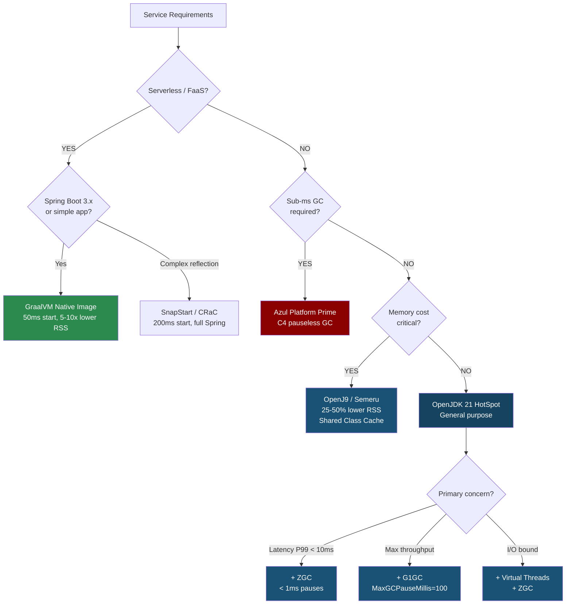

## Keywords in This File
{: .no_toc }

| # | Keyword | Weight |
|---|---|---|
| 1 | [Java JVM - L5 Deployment Architecture](#java-jvm---l5-deployment-architecture) | medium |

---

# Java JVM - L5 Deployment Architecture

## JVM Selection and Deployment Architecture

---

### 🎯 Model Answer

**30 seconds:**
> JVM selection involves choosing between HotSpot (OpenJDK, Oracle JDK), GraalVM (JIT
> + native image), OpenJ9 (IBM/Eclipse, lower footprint), and Azul Zulu/Zing (commercial
> SLAs, pauseless GC). For most production Java: OpenJDK LTS (JDK 21) on HotSpot is
> the default. GraalVM native image: for serverless/FaaS or startup-critical microservices.
> OpenJ9: for memory-constrained environments (25-50% less heap overhead than HotSpot).
> Deployment architecture: container + JVM flag alignment, AppCDS for startup performance,
> virtual threads for I/O-bound services.

**3 minutes (Senior):**
> JVM deployment architecture decisions:
>
> 1. **JVM distribution**: OpenJDK (community, free, LTS 3-year), Oracle JDK (commercial
>    LTS 8-year support), Azul Zulu (commercial support + Zing for pauseless GC),
>    GraalVM CE/EE (native image, polyglot). Choice: OpenJDK LTS for standard services,
>    GraalVM for serverless/startup-critical, Azul Zing for latency-critical (trading,
>    gaming, real-time systems).
>
> 2. **Container alignment**: JDK 10+ is container-aware (reads cgroup limits). JVM
>    auto-sizes heap to 25% of container limit by default (`-XX:MaxRAMFraction=4` equivalent).
>    Production best practice: override with explicit `-Xmx` + `-Xms` (don't rely on
>    auto-sizing for predictable behavior).
>
> 3. **AppCDS**: Application Class Data Sharing. Pre-verifies and pre-parses classes
>    into a shared archive. Shared across multiple JVM instances on same host (shared
>    memory pages). Startup 20-50% faster, RSS 30-50MB lower per pod (shared JDK class
>    data not counted per pod). Production standard for high-pod-count deployments.
>
> 4. **Virtual threads** (JDK 21): one-line migration for Spring MVC to virtual threads.
>    `spring.threads.virtual.enabled=true`. I/O-bound services: 10-100x thread throughput
>    with same heap. Thread stack budget drops from N*512KB to vCPU*512KB.
>
> 5. **GraalVM native image**: AOT compilation, 50ms startup, 5-10x lower RSS.
>    Trade-offs: slower throughput (no JIT adaptive optimization), reflection requires
>    compile-time metadata, longer build time, harder debuggability.

**Framework:** WHAT → WHY → HOW → TRADE-OFF → EXAMPLE

**Blank Mind Recovery:**

**(1) Restate:** "JVM selection: OpenJDK LTS default. GraalVM native for serverless.
OpenJ9 for low memory. Deployment: explicit Xmx, AppCDS for startup, virtual threads
for I/O. Container-aware from JDK 10+ (but always set explicit -Xmx)."

**(2) First principles:** "Choosing a JVM is choosing a runtime engine. Same Java code
can run on different JVMs with different performance profiles. JVM selection = trading
startup time, steady-state throughput, memory footprint, pause latency, and support
model. No single winner: choose based on service profile."

**(3) Bridge:** "Choosing a JVM for a service is like choosing a car for a trip.
HotSpot = a reliable sedan for most trips (adapts to road conditions with JIT).
GraalVM native = a sports car with a fixed engine tune (fast start, limited adaptability).
OpenJ9 = a compact car (less fuel/memory, acceptable speed). Azul Zing = a luxury
sedan with active suspension (never hits a speedbump, high cost)."

---

### 📘 Concept Explanation

**JVM ecosystem and deployment options:**
```plaintext
JVM DISTRIBUTION COMPARISON:

  HotSpot (OpenJDK / Oracle JDK):
    Runtime: JIT C1+C2, adaptive optimization
    GC options: G1 (default), ZGC, Shenandoah, ParallelGC
    Startup: 1-5s for typical Spring Boot app
    Peak throughput: excellent (C2 highly optimized for server workloads)
    Memory: standard (Xmx + ~300-500MB off-heap)
    Best for: general-purpose microservices, batch jobs, APIs
    LTS: JDK 21 (Sep 2023 - Sep 2026), JDK 25 (planned 2025)

  OpenJ9 (Eclipse / IBM Semeru):
    Runtime: JIT with AOT cache (shared class cache)
    Memory: 25-50% lower heap overhead than HotSpot
      (uses compressed object headers more aggressively)
    Startup: faster initial startup with shared class cache
      (JVM re-uses AOT-compiled code from previous runs)
    Best for: memory-constrained environments, JVM fleet with many
      identical pods sharing an SCC (Shared Class Cache)

  GraalVM Community Edition (Oracle, free):
    Runtime: GraalVM JIT (high-performance Truffle AST compiler)
    Polyglot: run JS, Python, Ruby on same JVM via Truffle
    Native Image: AOT compile Java to native binary
      - 50ms startup vs 3s JVM startup
      - 5-10x lower RSS (no JIT, no JVM metadata)
      - 10-30% lower throughput (no adaptive runtime optimization)
    Best for: serverless (Lambda, Cloud Run), CLI tools, init-critical services

  Azul Zing (commercial, now Azul Platform Prime):
    GC: C4 (Continuously Concurrent Compacting Collector) - pauseless
    Max pause: < 1ms regardless of heap size (even 100GB+ heaps)
    Use case: financial trading, gaming, real-time analytics
    Cost: commercial license (significant)
    Best for: extreme low-latency requirements where GC pauses are intolerable

CONTAINER DEPLOYMENT ARCHITECTURE:

  JDK 10+: container-aware (reads /sys/fs/cgroup/memory.limit_in_bytes)
  Auto-heap sizing: -XX:MaxRAMPercentage=75.0 (heap = 75% of container limit)
    Replaces old -XX:MaxRAMFraction=4 (25% = default, often too small)
  
  Best practice: ALWAYS override with explicit flags for predictability:
    -Xms<N>m -Xmx<N>m  # exact, no surprises
  
  JVM_OPTS for containerized services:
    -server                      # server-mode JIT (not needed JDK 11+, default)
    -XX:+UseContainerSupport     # enabled by default JDK 10+ (explicit for clarity)
    -XX:InitialRAMPercentage=50  # Xms as % of container limit
    -XX:MaxRAMPercentage=75      # Xmx as % of container limit
    -XX:+ExitOnOutOfMemoryError  # fail fast
    -XX:+HeapDumpOnOutOfMemoryError
    -XX:HeapDumpPath=/var/crash/
    -XX:ErrorFile=/var/crash/hs_err_%p.log
    -XX:NativeMemoryTracking=summary  # for sizing analysis
    -XX:+UseZGC                  # for latency-sensitive services
    -Xlog:gc*:file=/var/log/gc.log:time,level,tags:filecount=3,filesize=10m
```

> **Code walkthrough:** This L5 Deployment Architecture example demonstrates a key concept in practice using container. **KEY MECHANISM:** the runtime executes these instructions in sequence with specific memory and execution semantics. **WHY IT MATTERS:** misapplying this pattern causes subtle bugs that only manifest under production load. **TAKEAWAY: understand the execution model before using this pattern in production code.**

---

### 💻 Code Example

> **Code walkthrough:** AppCDS (Application Class Data Sharing) is the highest-value
> deployment optimization for services with many pods. The three-step process creates
> a shared class archive that reduces startup time and per-pod RSS, both improving
> container density.

```bash
# STEP 1: Generate class list during a dry run
# (run the application briefly to capture all loaded classes)
java -XX:DumpLoadedClassList=app-classes.lst \
     -cp app.jar \
     com.example.Main --exit-after-warmup

# app-classes.lst: one class per line, ~5,000-15,000 entries for Spring Boot
# head -5 app-classes.lst:
# java/lang/Object
# java/lang/String
# java/io/Serializable
# org/springframework/context/ApplicationContext
# com/example/Main

# STEP 2: Create the shared archive
java -Xshare:dump \
     -XX:SharedClassListFile=app-classes.lst \
     -XX:SharedArchiveFile=app.jsa \
     -cp app.jar

# app.jsa: 50-150MB shared archive file
# Contains: pre-parsed class metadata + pre-verified bytecode for all listed classes

# STEP 3: Use the shared archive at runtime
java -Xshare:on \
     -XX:SharedArchiveFile=app.jsa \
     -cp app.jar \
     com.example.Main

# Result: startup time reduced by 20-50% (skips class parsing + verification)
# RSS reduction: 30-60MB per pod (shared archive pages not counted per pod on same host)

# DOCKER BUILD: bake AppCDS archive into the container image
# Dockerfile:
# FROM eclipse-temurin:21-jre
# COPY target/app.jar /app/
# RUN java -XX:DumpLoadedClassList=/app/classes.lst \
#          -cp /app/app.jar com.example.Main --exit && \
#     java -Xshare:dump \
#          -XX:SharedClassListFile=/app/classes.lst \
#          -XX:SharedArchiveFile=/app/app.jsa \
#          -cp /app/app.jar
# CMD ["java", "-Xshare:on", "-XX:SharedArchiveFile=/app/app.jsa", \
#      "-cp", "/app/app.jar", "com.example.Main"]

# Virtual threads (JDK 21): Spring Boot configuration
# application.properties:
# spring.threads.virtual.enabled=true  (Spring Boot 3.2+)

# Or programmatic:
// Before JDK 21: Tomcat creates N threads per request (N = max-threads, default 200)
// Each thread: 512KB-1MB stack = 100-200MB for 200 threads

// JDK 21+ with Spring Boot 3.2:
@Configuration
public class VirtualThreadConfig {
    @Bean
    TomcatProtocolHandlerCustomizer<?> protocolHandlerVirtualThreadExecutorCustomizer() {
        return protocolHandler -> protocolHandler.setExecutor(
            Executors.newVirtualThreadPerTaskExecutor()
        );
    }
}
// Each request: one virtual thread (no stack per request)
// 10,000 concurrent requests: ~4 carrier threads (vCPU count)
// Stack budget: 4 * 512KB = 2MB (vs 10,000 * 512KB = 5,000MB before)
// Thread-blocking I/O (DB queries, HTTP calls): automatically unmounts from carrier
// No code changes needed in request handlers (virtual thread = regular thread to app code)
```

> **Code walkthrough:** The AppCDS workflow is a build-time optimization with zeroice. **KEY MECHANISM:** the runtime executes these instructions in sequence with specific memory and execution semantics. **WHY IT MATTERS:** misapplying this pattern causes subtle bugs that only manifest under production load. **TAKEAWAY: understand the execution model before using this pattern in production code.**
> runtime overhead after the archive is created. The key: the shared archive file
> (`app.jsa`) is memory-mapped read-only by all JVM instances on the same host. The
> OS kernel de-duplicates identical read-only pages across processes. This means
> 10 pods on the same node don't each load 50MB of JDK class data into RAM - they
> all share the same physical pages, reducing total cluster memory proportionally to pod density.

---

### 🎓 Answers by Seniority

**Junior / Mid (0-5 years):**
> Most Java services use OpenJDK (HotSpot). GraalVM native image: for serverless or
> fast-startup needs. Deployment: always set explicit `-Xmx` (don't rely on auto-sizing),
> use G1 or ZGC, enable container support. AppCDS: worth setting up for any service
> with 5+ pods (reduces startup time and memory).

---

**Senior / Staff (5+ years):**
> JVM deployment architecture strategy: (1) OpenJDK LTS (JDK 21) for all standard
> services; (2) GraalVM native for Lambda/Cloud Run or startup-critical paths; (3) ZGC
> for P99 < 10ms services; (4) AppCDS baked into all container images (free 30% startup
> improvement); (5) virtual threads for I/O-bound services migrated from Spring MVC to
> Spring Boot 3.2+ (eliminates thread-per-request overhead); (6) JVM version governance:
> all services on same LTS minor version, quarterly CVE-driven patch updates, automated
> Renovate/Dependabot PRs for JDK patch bumps in base images.

---

### ⚠️ Common Misconceptions

**Misconception 1: "GraalVM native image is always faster than JVM."**
GraalVM native image starts faster (50ms vs 3s) and uses less memory at startup. But:
peak throughput is typically 10-30% LOWER than HotSpot JIT-compiled code. The JIT
dynamically profiles actual workloads and generates optimized machine code for HOT paths.
AOT (native image) compiles with static assumptions: no runtime profiling = no
speculative inlining, no profile-guided dead code elimination. For long-running services
that process millions of requests: HotSpot JIT eventually outperforms native image.
Native image advantage: startup time and initial RSS. Correct use: short-lived processes
(CLI tools, Lambda functions), not long-running throughput-critical services.

**Misconception 2: "Container support means the JVM correctly handles all container limits."**
JDK 10+ reads cgroup memory limits for heap auto-sizing. But: CPU throttling in
Kubernetes (`limits.cpu` != `requests.cpu`) causes unexpected JVM behavior. The JVM
uses CPU count for: GC thread count (default = # of CPUs), JIT compiler parallelism,
ForkJoinPool default parallelism, `Runtime.getRuntime().availableProcessors()` (used
by many frameworks for thread pool sizing). If `limits.cpu = 0.5` (throttled after 500ms
per second): the JVM still sees 4 CPU cores (host CPU count) and creates 4 GC threads,
4 JIT threads, and frameworks create 4 worker threads. All 12+ threads compete for 0.5
vCPU. Fix: use `ActiveProcessorCount` to override: `-XX:ActiveProcessorCount=1` for
0.5-1 vCPU containers.

---

### 🚨 Failure Modes and Diagnosis

**Failure: GraalVM native image application fails at runtime for reflection-heavy framework.**
```
Symptom:
  Application starts in 50ms (great)
  First request fails with:
    java.lang.ClassNotFoundException: com.example.Service
    OR
    com.oracle.svm.core.jdk.UnsupportedFeatureError:
      Reflection not available for class...

Root cause:
  GraalVM native image: static analysis at compile time identifies all reachable code.
  Reflection (Class.forName, method.invoke): cannot be statically analyzed.
  If a class is ONLY referenced via reflection (not directly): native image excludes it.
  At runtime: class not found (excluded from native image binary).

Diagnosis:
  1. Check if frameworks use reflection:
     Spring: bean creation via Class.forName (YES, extensively)
     Hibernate: proxy generation via CGLib (YES)
     Jackson: @JsonProperty via reflection (YES)
     -> All need GraalVM reachability metadata

  2. Run with: -H:+ReportExceptionStackTraces
     Detailed error: shows which class/method triggered the failure

  3. Check META-INF/native-image/ in the classpath:
     Most Spring Boot 3.x libraries ship with native-image metadata
     (reflect-config.json, resource-config.json, proxy-config.json)

Fix:
  Option A: Use Spring Boot 3.x + GraalVM build plugin (AOT processing):
    ./mvnw -Pnative native:compile
    Spring Boot 3 AOT: generates all reflection metadata at build time
    For Spring Boot >= 3.0: native image is officially supported

  Option B: Add manual reflection configuration:
    src/main/resources/META-INF/native-image/reflect-config.json:
    [
      {
        "name": "com.example.Service",
        "allDeclaredConstructors": true,
        "allPublicMethods": true
      }
    ]

  Option C: Use agent to generate config automatically:
    java -agentlib:native-image-agent=config-output-dir=native-image-config/ \
         -jar app.jar
    # Run with realistic test traffic to capture all reflection usages
    # Then include native-image-config/ in build: produces reflect-config.json
    # Commit the generated config (don't regenerate every build)
```

> **Code walkthrough:** This Commit the generated config (don't regenerate every build) example demonstrates a key concept in practice. **KEY MECHANISM:** the runtime executes these instructions in sequence with specific memory and execution semantics. **WHY IT MATTERS:** misapplying this pattern causes subtle bugs that only manifest under production load. **TAKEAWAY: understand the execution model before using this pattern in production code.**

---

### 🎯 Interview Deep-Dive

| Question Category | Time to Answer |
|---|---|
| JVM distribution comparison | 2 minutes |
| GraalVM native image trade-offs | 3 minutes |
| Container-aware JVM behavior | 2 minutes |
| AppCDS architecture | 2 minutes |
| Virtual threads deployment impact | 2 minutes |
| JVM version governance | 2 minutes |
| OpenJ9 vs HotSpot trade-offs | 2 minutes |
| Azul Zing use cases | 1 minute |
| JVM on Kubernetes CPU throttling | 2 minutes |
| JVM upgrade strategy | 2 minutes |
| Multi-JVM deployment patterns | 2 minutes |
| JVM for serverless | 2 minutes |

---

**Q1 (distributions): Which JVM distribution do you choose for different use cases?**

A: OpenJDK (HotSpot): default for most production Java services. Free, community-supported,
LTS cadence (JDK 21, JDK 25). Best for: APIs, batch jobs, general microservices.
GraalVM CE/EE: when startup time or initial RSS is critical. Best for: Lambda functions,
Cloud Run, CLI tools, services with < 1s startup SLA. OpenJ9 (Eclipse Semeru): when
memory cost is the primary constraint. Best for: large JVM fleets where 25% memory
reduction per pod has significant cost impact. Azul Zing: when GC pauses are intolerable
(financial trading, gaming). Best for: extreme P99 latency requirements (sub-millisecond GC).

*What separates good from great:* The JVM distribution decision at org scale: most
engineering organizations standardize on ONE JVM distribution for 95% of services
(OpenJDK LTS) and explicitly define exceptions (GraalVM, OpenJ9, Zing). This reduces
operational complexity: one JDK version to patch, one security advisory stream, one
set of JVM debugging tools. The exception criteria: document when GraalVM or Zing is
justified (startup SLA, latency SLA). Ad-hoc JVM selection by individual teams:
operational chaos (different JVM bugs, different monitoring, different tuning flags).
JVM governance: a platform engineering responsibility, not per-team.

---

**Q2 (graalvm tradeoffs): What are the real-world trade-offs of GraalVM native image?**

A: Advantages: 50ms startup (vs 3-5s JVM), 5-10x lower RSS (no JVM metadata),
no JIT warmup period (immediate peak throughput - at a lower peak than warm JVM).
Disadvantages: 10-30% lower steady-state throughput (no adaptive JIT), longer build
time (5-15 minutes for native compile vs 30-60s for JVM), reflection requires explicit
configuration, no dynamic class loading (breaks some frameworks), harder debugging
(no JVM attach, limited profiling), not all Java features supported (no `finalize`,
limited JVMTI, restricted SecurityManager API).

*What separates good from great:* The "throughput cliff" in native image: at initial
startup, native image is FASTER than JVM (no JIT warmup). But: after 5-15 minutes of
JVM warmup, HotSpot JIT surpasses native image throughput permanently. For Lambda with
a function invoked once per hour: native image is always better (never reaches JIT
warmup). For a microservice handling 1,000 RPS continuously: JVM is better after the
first hour of operation. The break-even point: ~ 10-30 minutes of continuous operation.
GraalVM Enterprise (Zing): Profile-Guided Optimization (PGO) for native image - collect
a training profile, use it in AOT compilation. PGO can close the throughput gap to ~5%
vs JIT. But requires: production profiling run + additional build step.

---

**Q3 (container cpu): How does CPU throttling affect JVM behavior in Kubernetes?**

A: JVM uses `Runtime.getRuntime().availableProcessors()` to determine: GC thread count
(default N for N CPUs), JIT compiler threads, `ForkJoinPool.commonPool()` parallelism,
many framework thread pools (Tomcat, Netty, Spring `@Async`). `availableProcessors()`
returns the HOST CPU count, NOT the container CPU limit. A 0.5 vCPU container on a
16-core host: `availableProcessors() = 16`. JVM creates 16 GC threads, 16 JIT threads,
Netty creates 16 I/O threads. All 50+ threads compete for 0.5 vCPU. GC is throttled,
falls behind, heap fills up, OOM. Fix: `-XX:ActiveProcessorCount=2` (or 1 for < 1 vCPU
limit). Many frameworks: read this flag (Netty, Akka, ForkJoinPool).

*What separates good from great:* The CPU throttling visibility problem: `kubectl top pod`
shows CPU usage (e.g., 450m). This looks fine (under the 500m limit). But: CPU throttling
is different from CPU usage. The pod can be `throttled_time / total_time = 80%` even
at 450m average usage, IF it spikes to 2000m briefly (exceeds the limit) and is throttled.
Kubernetes metrics: `container_cpu_throttled_seconds_total` - the definitive throttling
metric. If throttled > 20%: the JVM is experiencing CPU starvation during GC and JIT
compilation bursts. Fix: either increase `limits.cpu` or reduce GC/JIT thread counts.
AlertRule: `rate(container_cpu_throttled_seconds_total[5m]) > 0.2`.

---

**Q4 (appcds): How does AppCDS improve startup time and RSS at scale?**

A: AppCDS (Application Class Data Sharing): pre-parses class files into a shared memory-mapped
archive (`.jsa`). At JVM startup: instead of reading/parsing/verifying class files from disk,
the JVM memory-maps the archive. Startup benefit: class loading 20-50% faster (pre-parsed).
RSS benefit: multiple JVM instances on the same host share the read-only archive pages
(OS-level page sharing). 10 pods on same node: 10 JVMs, but only 1 physical copy of
JDK class data in RAM (shared). Savings: 30-60MB per pod (shared JDK class pages not
counted per pod).

*What separates good from great:* AppCDS has evolved across JDK versions. JDK 8: basic
CDS (JDK built-in classes only). JDK 10-12: AppCDS (application + JDK classes). JDK 13:
Dynamic CDS (archive created at first JVM exit, no explicit dump step). JDK 19:
Premain JEP 483 (dump at startup, use on next run). The easiest modern form (JDK 19+):
`-XX:+AutoCreateSharedArchive`: JVM automatically creates the archive on first run and
uses it on subsequent runs. No manual `java -Xshare:dump` step needed. The archive is
created in a temp directory (or configurable path). Production recommendation: generate
the archive as part of the Docker image build (explicit, reproducible, shared across all
container instances). Dynamic archive (auto-created at runtime): less predictable (archives
differ per pod; no OS-level sharing across pods since each has a different archive).

---

**Q5 (virtual threads): What is the deployment impact of virtual threads on JVM resource requirements?**

A: Virtual threads (JDK 21): user-space threads managed by the JVM. Each virtual thread:
uses the JVM heap for its stack state when blocked (instead of a native OS stack). A
blocked virtual thread: its stack frame stored as a heap object (compact, GC-managed).
Impact: thread count can increase 100-1000x with minimal memory impact. 10,000 virtual
threads: memory ≈ 8 carrier thread stacks (8 * 512KB = 4MB) + lightweight heap objects
for blocked thread stacks (varies: typically 1-10KB per blocked virtual thread = 10-100MB
for 10,000 blocked threads). Vs. 10,000 OS threads: 10,000 * 512KB = 5,000MB thread stacks.

*What separates good from great:* Virtual threads are NOT free in all scenarios. The
"structured concurrency" footgun: if code using virtual threads does blocking I/O without
virtual-thread-aware I/O (legacy blocking JDBC, legacy blocking HTTP clients), carrier
threads are pinned and virtual threads don't help. JDK 21: `synchronized` blocks pin
carrier threads (fix: replace `synchronized` with `ReentrantLock`). JDK 23: pinning
in `synchronized` is being removed (JEP 491). Check for pinning: `-Djdk.tracePinnedThreads=full`
logs whenever a virtual thread pins a carrier. Migration concern: a library with
`synchronized` methods that do I/O: pins carriers, defeating virtual thread benefits.
Audit: `jdk.tracePinnedThreads` in staging, eliminate pinning before production rollout.

---

**Q6 (governance): How do you manage JVM versions across 100+ services?**

A: (1) Standard base image: all services use the same approved JDK base image (e.g.,
`eclipse-temurin:21.0.2-jre-alpine`). (2) Image registry pinning: use digest pins
(`eclipse-temurin@sha256:abc123...`) for reproducibility. (3) Automated updates:
Renovate or Dependabot: weekly PRs for JDK base image updates. Test suites must pass
before merge. (4) Security patch SLA: CVSS >= 9.0 base image patch within 24h; >= 7.0
within 7 days. (5) LTS-only: no services on non-LTS JDK versions in production.
(6) Version tracking: SBOM (Software Bill of Materials) for every image - include JDK
version. (7) Central JVM configuration: common JVM flags in a configmap or base image
ENV (teams can extend, not override).

*What separates good from great:* The JDK version cliff: when Oracle releases quarterly
CPU (Critical Patch Update): services running old JDK patch versions are vulnerable.
In a 100-service fleet: if services can use ANY JDK minor version, some will lag
months behind. The governance model: (1) Platform team maintains the approved base image
tag. (2) When a new JDK patch is released: platform team updates the tag, triggers
Renovate PRs for all services. (3) Services have 7 days to merge (for CVSS >= 7.0).
(4) After deadline: automated enforcement (CI fails for services still on old tag).
This centralizes JDK patch management: platform team does 1 update, all 100 services
get PRs automatically. Without this: each team manually updates their Dockerfile, many
forget for months.

---

**Q7 (openj9 tradeoffs): When is OpenJ9 (Semeru) a better choice than HotSpot?**

A: OpenJ9 advantages: (1) 25-50% lower heap usage (more efficient object headers,
better compressed references at large heap sizes). (2) Shared Class Cache (SCC): similar
to AppCDS but dynamic - classes are cached on first load, shared across pods on same host.
(3) Faster restart with SCC: JIT-compiled code cached in SCC, re-used on next startup.
(4) AOT compilation: option to pre-compile frequently-used methods at build time.
OpenJ9 disadvantages: (1) different GC algorithms (Balanced GC, not G1/ZGC - learning
curve), (2) different JVM flags (-Xgcpolicy instead of -XX:+Use*GC), (3) smaller community,
fewer Stack Overflow answers, (4) some performance benchmarks show lower peak throughput
than HotSpot C2 for specific workloads.

*What separates good from great:* OpenJ9's shared class cache (SCC) is architecturally
different from AppCDS. AppCDS: read-only class archive (just metadata). SCC: read-write,
can cache JIT-compiled code. When a second OpenJ9 JVM instance starts on the same host:
it finds the SCC, loads pre-JIT-compiled code immediately (JIT warmup: skipped). For
microservices with frequent restarts (crash-loop recovery, rolling deployments): OpenJ9 with
SCC recovers peak performance faster than HotSpot. The trade-off: SCC is per-host,
not per-pod (Kubernetes: a pod can be scheduled to any node; SCC won't be warm on a
new node). Best use case: stateful services or services with high deployment frequency
on stable nodes.

---

**Q8 (serverless): How do you architect JVM services for serverless (Lambda/Cloud Run)?**

A: Cold start problem: Lambda invokes function in a new JVM process: 2-5 second cold
start from HotSpot (class loading + JIT warmup). Latency SLA breached. Solutions:
(1) GraalVM native image: 50ms cold start. Best for: latency-critical functions.
(2) SnapStart (Lambda + CRaC): take a JVM snapshot after warmup, restore in ~200ms.
Best for: large Spring Boot applications where native image is too complex.
(3) Provisioned concurrency: keep N Lambda instances warm (no cold start, but cost even
at zero traffic). Best for: predictable traffic with cost budget.
(4) Quarkus or Micronaut: framework designed for fast JVM startup (AOT dependency injection,
reduced reflection). JVM start: 300-600ms vs Spring Boot's 2-5s. Best for: teams
not ready for native image but needing faster startup.

*What separates good from great:* CRaC (Coordinated Restore at Checkpoint, JEP pending
standardization): a JDK mechanism to checkpoint a running JVM process and restore from
the checkpoint. AWS SnapStart: uses CRaC at the Lambda layer. The checkpoint is taken
after the Lambda INIT phase (application startup + warmup). Restore: JVM state
reconstructed in ~200ms. The limitation: resources acquired during INIT
(network connections, file handles) may be stale after restore. CRaC provides hooks:
`Resource.beforeCheckpoint()` and `Resource.afterRestore()`. Spring Framework 6.1+:
implements CRaC hooks for connection pools, caches, and scheduled tasks (closes and
reopens connections across checkpoint/restore). Without framework support: CRaC restores
state with stale connections -> failures. With Spring 6.1+: transparent to application code.

---

**Q9 (jvm flags governance): How do you standardize JVM flags across a microservices fleet?**

A: Central flag baseline: define in base Kubernetes ConfigMap or Helm values:
```yaml
JVM_OPTS: >-
  -XX:+UseContainerSupport
  -XX:InitialRAMPercentage=50
  -XX:MaxRAMPercentage=75
  -XX:+ExitOnOutOfMemoryError
  -XX:+HeapDumpOnOutOfMemoryError
  -XX:HeapDumpPath=/var/crash/
  -XX:ErrorFile=/var/crash/hs_err_%p.log
  -XX:NativeMemoryTracking=summary
  -Xlog:gc*:file=/var/log/gc.log:time:filecount=3,filesize=10m
```
> **Code walkthrough:** This Unknown example demonstrates YAML configuration pattern using container. **KEY MECHANISM:** YAML parsers are whitespace-sensitive; indentation errors cause silent value misinterpretation. **WHY IT MATTERS:** unquoted strings starting with special chars (*, &, ?, |) trigger YAML parser errors. **TAKEAWAY: quote strings containing YAML special chars; validate YAML before deploying to production.**

Services extend (add service-specific flags) but cannot remove baseline flags.
Flag governance: any `--add-opens`, `-XX:+UnlockExperimentalVMOptions`, or
`-XX:+DisableAttachMechanism` requires architecture review.

*What separates good from great:* The `JAVA_TOOL_OPTIONS` environment variable (set
by the JVM automatically): allows injecting JVM flags into any JVM without modifying
the application startup script. In Kubernetes: set `JAVA_TOOL_OPTIONS` in the pod spec
or a ConfigMap mounted as an env var. The JVM logs: `Picked up JAVA_TOOL_OPTIONS: -XX:...`.
This is the most reliable way to inject baseline flags across a heterogeneous fleet
(services with different startup scripts, languages, frameworks). The platform team
owns `JAVA_TOOL_OPTIONS`; individual services add service-specific flags in their
`JAVA_OPTS`. This two-variable pattern: clear separation of platform-managed vs
service-managed JVM configuration.

---

**Q10 (upgrade strategy): How do you plan a JDK version upgrade across 100 services?**

A: JDK LTS upgrade plan: (1) Identify incompatibilities: run `jdeprscan --release 21`
against each service JAR (finds deprecated API usage). Run with `--illegal-access=deny`
equivalent (JDK 21 default) to find reflection issues. (2) Update test environments first:
JDK upgrade in CI pipeline, not production. Run full test suites. (3) Canary: deploy 1%
of production traffic to JDK 21 pods, compare error rates and latency. (4) Progressive
rollout: 1% -> 10% -> 50% -> 100% over 2 weeks. (5) Rollback plan: keep JDK 17 images
in registry for 30 days post-migration.

*What separates good from great:* The `-XX:+PrintFlagsFinal -version` output difference
between JDK versions: flags change defaults between versions. When upgrading from JDK 17
to JDK 21: some flags may have changed defaults (GC settings, module system flags). Run
`java -XX:+PrintFlagsFinal -version 2>&1 | sort` on both versions, diff the output.
Changed defaults: review impact before production upgrade. Example: JDK 21 changes
`TieredCompilation` to true by default for all applications (JDK 8 had it off for
small heaps). Services tuned for JDK 17 behavior may need flag adjustments. The upgrade
plan should include a "flag diff review" step before any production traffic goes to the
new JDK.

---

**Q11 (multi-jvm): When and how do you run multiple JVM distributions in the same platform?**

A: Justified multi-JVM scenarios: (1) HotSpot for standard microservices (95% of services),
(2) GraalVM native image for Lambda/Cloud Run functions (5%), (3) Azul Zing for the
trading engine (1 service). Each distribution: separate base image registry path,
separate monitoring dashboards (GraalVM native: no JVM metrics, only process metrics),
separate on-call runbooks (hs_err format differs per JVM). Org-wide inventory:
`jvm_distribution{service, version}` metric reported by each pod. Governance: new
distribution requires architecture review and platform team support commitment.

*What separates good from great:* The hidden cost of JVM diversity: debugging tools.
HotSpot: `jstack`, `jmap`, `jcmd`, `JFR` - all work. OpenJ9: uses `javacore` dumps
(different format from HotSpot thread dumps). GraalVM native: no JVM attach at all
(`jcmd` fails). Each distribution requires different: (1) APM agent (some APM agents
only support HotSpot), (2) heap dump analysis tool (OpenJ9 core dumps: need Eclipse MAT
with OpenJ9 extension), (3) on-call runbook. When an on-call engineer gets paged at 3AM
for an OpenJ9 service they've never debugged: they will struggle. Platform team
responsibility: ensure each supported JVM distribution has: documentation, tooling,
and a team member with expertise.

---

**Q12 (future): What JVM architectural changes are most impactful for production Java in 2025?**

A: (1) Virtual threads (JDK 21 - GA): already the biggest Java runtime change in a decade.
Eliminates thread-per-request scalability bottleneck for I/O-bound services. (2) Structured
concurrency (JDK 21 preview, JDK 25 target GA): safer concurrent code patterns using
StructuredTaskScope. (3) Project Valhalla (value types, JDK 25+ target): value classes
eliminate object header overhead for small objects (Point, OptionalInt). Heap efficiency
improvement: 5-10x for aggregate computation workloads. (4) CRaC/SnapStart: JVM
checkpoint-restore, reducing Lambda cold starts to ~200ms for full Spring Boot applications.
(5) Vector API (JDK 21 incubator, JDK 25 target GA): SIMD vectorization API.
Java ML inference speedup: 4-16x on vector-capable hardware.

*What separates good from great:* Project Valhalla is the most architecturally significant:
it changes the object model. Today: every Java object = header (12-16 bytes) + fields.
A `List<Point>` of 1 million points: 1 million object headers (12-24MB of headers alone).
With value types: `Point` declared as `value class Point { float x; float y; }`.
A `List<Point>` stores Points inline (no header, no pointer). Memory: 8 bytes per Point
(just x + y floats), down from 24+ bytes. Cache efficiency: dramatically improved (dense
arrays vs pointer-chased object graph). This is transformational for: numerical computing,
game engines, financial analytics, ML inference - any Java workload that processes large
numbers of small objects. Platform preparation: Valhalla is opt-in (declare `value class`).
No migration required for existing code.

---

### ⚖️ Comparison Table

| JVM Distribution | Startup | Peak Throughput | RSS | GC Pauses | Use Case | Cost |
|---|---|---|---|---|---|---|
| HotSpot OpenJDK | 2-5s | Excellent (JIT) | Standard | G1: 10-200ms; ZGC: < 1ms | General microservices | Free |
| GraalVM CE (native) | ~50ms | Good (AOT, -15%) | 5-10x lower | None (native) | Serverless, CLI | Free |
| GraalVM EE (native+PGO) | ~50ms | Very good (-5%) | 5-10x lower | None (native) | Startup+throughput | Commercial |
| OpenJ9 / Semeru | 1-3s (SCC) | Good (JIT) | 25-50% lower | Gencon, Balanced | Memory-constrained | Free |
| Azul Zing (Platform Prime) | 2-5s | Excellent (JIT) | Standard | < 1ms (C4) | Latency-critical | Commercial |

---

### 🏛️ System Design

**JVM deployment architecture for a multi-tier e-commerce platform:**

**Context:** Platform with API gateway, product catalog (read-heavy), order processing
(write-heavy), inventory updates (event-driven), and payment functions (latency-critical).
Goal: right JVM distribution and configuration for each service tier.

```
MULTI-TIER JVM ARCHITECTURE:

TIER 1: API Gateway (Spring Cloud Gateway)
  JVM: HotSpot (OpenJDK 21)
  GC: ZGC (P99 < 10ms, all I/O routing)
  Config:
    -Xmx512m -Xms512m
    -XX:+UseZGC
    -XX:ActiveProcessorCount=2  (2 vCPU limit)
    spring.threads.virtual.enabled=true
  Rationale: high connection count, I/O-bound, latency-sensitive

TIER 2: Product Catalog API (read-heavy, caching)
  JVM: HotSpot (OpenJDK 21)
  GC: G1 (throughput priority, large cache in Old Gen)
  Config:
    -Xmx2g -Xms2g
    -XX:+UseG1GC -XX:MaxGCPauseMillis=100
    -XX:ReservedCodeCacheSize=512m  (many hot methods)
  Rationale: large object cache, high throughput, pause < 100ms acceptable

TIER 3: Order Processing (write-heavy, CQRS)
  JVM: HotSpot (OpenJDK 21)
  GC: G1
  Config:
    -Xmx1g -Xms1g
    -XX:+UseG1GC
    spring.threads.virtual.enabled=true  (async I/O heavy)
  Rationale: mixed workload, moderate heap, I/O-heavy command handling

TIER 4: Inventory Consumer (Kafka, event-driven)
  JVM: HotSpot (OpenJDK 21)
  GC: G1
  Config:
    -Xmx512m -Xms512m
    -XX:MaxDirectMemorySize=512m  (Kafka buffers)
    -XX:+UseG1GC
  Rationale: off-heap heavy (Kafka), moderate heap

TIER 5: Payment Functions (AWS Lambda)
  JVM: GraalVM native image
  GC: N/A (native)
  Config:
    GraalVM 21 + Spring Boot 3.2 native
    Provisioned concurrency: 2 (P99 cold start requirement)
  Rationale: P99 < 500ms SLA, Lambda cold start with JVM: 3s (SLA breach)
    GraalVM native: 50ms cold start, SLA met

SHARED INFRASTRUCTURE:
  Base image: eclipse-temurin:21.0.2-jre-alpine (pinned digest)
  AppCDS: baked into all non-native images
    Reduces startup 30%, RSS 40MB per pod
  JVM flags baseline: JAVA_TOOL_OPTIONS in cluster ConfigMap
  Monitoring: JFR continuous recording + Micrometer metrics to Prometheus
  Crash capture: PVC at /var/crash/, sidecar ships to S3
```

> **Code walkthrough:** This Unknown example demonstrates a key concept in practice. **KEY MECHANISM:** the runtime executes these instructions in sequence with specific memory and execution semantics. **WHY IT MATTERS:** misapplying this pattern causes subtle bugs that only manifest under production load. **TAKEAWAY: understand the execution model before using this pattern in production code.**

---

### 📊 Diagram

**JVM distribution selection decision tree:**

```
JVM DISTRIBUTION SELECTION DECISION TREE:

  Service type?
  |
  +---> Serverless (Lambda/Cloud Run)? -> YES
  |       |
  |       +---> Spring Boot 3.x AOT supported? -> YES -> GraalVM native image
  |       |     (50ms start, < 50MB RSS)
  |       +---> Complex framework reflection? -> YES -> CRaC/SnapStart
  |             (200ms start, full Spring)
  |
  +---> Extreme low-latency (trading, gaming)? -> YES
  |       -> Azul Platform Prime (Zing)
  |          (sub-ms GC pauses, C4 GC)
  |
  +---> Memory-constrained fleet (cost pressure)? -> YES
  |       -> OpenJ9 / Eclipse Semeru
  |          (25-50% lower RSS)
  |
  +---> General microservice -> OpenJDK 21 (HotSpot)
          |
          +---> P99 < 10ms latency? -> ZGC
          +---> Throughput priority? -> G1GC
          +---> I/O-bound? -> virtual threads + ZGC
          +---> Large cache? -> G1GC + tuned Old Gen
```



> **Diagram walkthrough:** The decision tree externalizes the JVM selection framework
> as a structured flow rather than tribal knowledge. Each decision node maps to a
> measurable requirement (SLA, cost constraint, memory limit). The tree prevents the
> common mistake of defaulting to the "coolest" technology (native image is impressive,
> but wrong for a long-running API service). The four HotSpot specializations at the
> bottom show that even within the same distribution, the GC and threading configuration
> is driven by the service's primary constraint.

---

### 💻 Code Example

*(Omit: this concept does not have a programmatic interface that can be demonstrated in code. The conceptual explanation above is sufficient.)*


---

### 🏛️ System Design

*(Omit: system design diagram not applicable for this concept - see ★★★ keywords for full system design coverage.)*


---

### ⚖️ Comparison Table

*(Omit: this is a ★☆☆ foundational concept with no direct alternatives to compare - see higher-difficulty keywords for trade-off analysis.)*


---

### 📊 Diagram

*(Omit: no standalone visual diagram required for this concept - the explanations and code examples above provide sufficient clarity.)*


