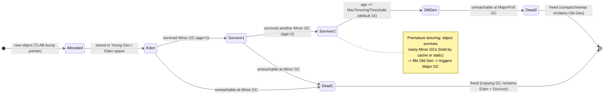
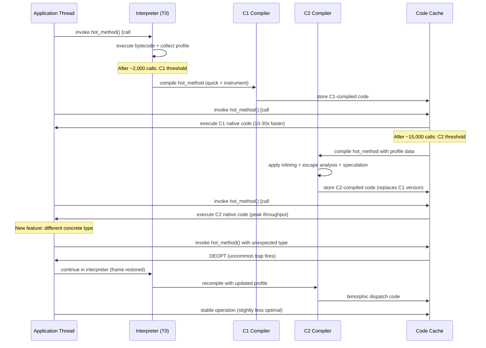

# Java JVM - L6 Theory

## Garbage Collection Algorithms Theory

### 🎯 Model Answer

**30 seconds:**
> GC algorithms fundamentally differ in: tracing strategy (mark-compact, mark-sweep,
> copying), when they run (stop-the-world vs concurrent vs incremental), and how they
> handle fragmentation. Tracing: follow all live object references from GC roots. Dead
> objects: everything not reachable. The tension in all GC design: maximizing throughput
> (less GC work) vs minimizing pause time (shorter stop-the-world) vs minimizing
> fragmentation (compact heap).

**3 minutes (Senior):**
> Fundamental GC classification:
>
> 1. **Reference counting**: each object counts incoming references. Zero = dead.
>    Problem: cycles (A -> B -> A: both have count > 0, both are dead). Java: does NOT
>    use reference counting for the heap (Python and Swift do). Java's WeakReference,
>    SoftReference, PhantomReference: Java-level reference types, not GC mechanism.
>
> 2. **Tracing GC**: start from GC roots (stack variables, static fields, JNI handles).
>    Follow all references transitively. Anything NOT reachable = dead. All JVM GC
>    algorithms are tracing.
>
> 3. **Mark-Sweep**: mark live objects, sweep (free) unmarked objects. Problem:
>    fragmentation (Swiss cheese heap). Allocation: linear scan to find free block.
>
> 4. **Mark-Sweep-Compact**: after sweep, compact live objects together. Eliminates
>    fragmentation. Allows bump-pointer allocation (fastest: just increment pointer).
>    Cost: moving objects (pointer updates, write barriers).
>
> 5. **Copying**: divide heap into "from" and "to" spaces. Copy live objects to "to"
>    space. Entire "from" space becomes free. Young generation uses this (Eden ->
>    Survivor). Fragmentation: zero. Cost: 2x memory (only 50% of heap usable).
>
> 6. **Generational hypothesis**: most objects die young (short-lived request objects).
>    Exploit: collect young objects frequently (cheap: few live objects), old objects
>    rarely. G1, Parallel, CMS: all generational.
>
> 7. **Concurrent GC**: run GC threads concurrently with application threads. Challenge:
>    application modifies the object graph while GC traces it. Solution: write barriers
>    (record mutations, re-trace modified references). ZGC, Shenandoah: fully concurrent.

**Framework:** WHAT → WHY → HOW → TRADE-OFF → EXAMPLE

**Blank Mind Recovery:**

**(1) Restate:** "GC = tracing from roots + collecting unreachable objects. Strategies:
mark-sweep (fragmentation), compact (expensive), copying (memory cost). Generational:
young objects die fast. Concurrent: run GC alongside app threads."

**(2) First principles:** "Memory management problem: reclaim objects the program no
longer uses. Without GC: manual malloc/free (C/C++: leaks and use-after-free). GC:
automate this. Core question: is this object still reachable? If no: free it."

**(3) Bridge:** "GC tracing is like a building evacuation. GC roots are the emergency
exits. Everyone who can reach an exit (transitively) is 'reachable' (alive). Anyone
in a dead-end corridor with no exit: unreachable (dead, can be freed). Compaction:
after the evacuation, rearranging people to use space efficiently."

---

### 📘 Concept Explanation

**GC algorithm taxonomy:**
```
GC ALGORITHM TAXONOMY:

TRACING STRATEGIES:
  Mark-Sweep:
    Mark phase: traverse object graph, mark all live objects
    Sweep phase: scan heap, free all unmarked objects
    Result: heap has "holes" where dead objects were
    Fragmentation: HIGH (allocation must find fitting hole)
    Allocation: slow (free list search)
    Used by: CMS (old generation)

  Mark-Sweep-Compact:
    After sweep: move all live objects to one end of heap
    Update all pointers to moved objects (expensive: all references updated)
    Result: dense heap + large free area at end
    Fragmentation: ZERO
    Allocation: fast (bump pointer: just increment a pointer)
    Used by: G1 (Full GC), Serial GC, Parallel GC (Old Gen)

  Copying (semi-space):
    Heap divided: from-space + to-space (50/50)
    Copy live objects from from-space to to-space
    After copy: from-space is entirely free
    Fragmentation: ZERO (objects are dense in to-space)
    Allocation: fast (bump pointer in to-space)
    Memory: ONLY 50% of heap available (other 50% = to-space)
    Used by: Young generation (Eden -> Survivor)

PAUSE STRATEGIES:
  Stop-The-World (STW):
    All application threads pause during GC
    GC can safely traverse object graph (no concurrent mutations)
    Pause duration: scales with heap size / live data
    Throughput: highest (no write barriers, no concurrent overhead)
    Used by: Young GC pause, Full GC, G1 evacuation pauses

  Concurrent:
    GC threads run alongside application threads
    Challenge: application modifies heap during GC marking
    Solution: write barriers record mutations; re-scan "dirty" regions
    Pause: minimal (only brief STW for initial mark + final remark)
    Overhead: write barrier on every object reference write (~5-10% CPU)
    Used by: G1 concurrent marking, ZGC concurrent phases

  Incremental:
    GC work split into small increments, interleaved with application
    Each increment: short pause, then application runs
    Overall pause: distributed over time (many small pauses vs one big)
    Used by: G1 (region-based incremental collection)

GENERATIONAL HYPOTHESIS:
  Empirical observation: most objects die within one or two GC cycles
  (request objects, temporary strings, short-lived caches)
  
  Exploit: separate young and old generations
    Young Gen: collected frequently (every few seconds)
      Most objects dead -> few survivors -> fast copying collection
    Old Gen: collected rarely (minutes to hours)
      Only long-lived objects survive here
  
  Remembered sets:
    Problem: Old Gen object may reference Young Gen object
    If Young Gen collects without checking Old Gen -> miss live reference
    Solution: remembered set records all Old-to-Young references
    Young GC root set: stack + statics + remembered set (Old -> Young refs)
```

---

### 💻 Code Example

> **Code walkthrough:** Write barriers are the runtime cost of concurrent GC. Every
> time the application writes an object reference, the JVM-generated code also executes
> a write barrier to maintain the GC's invariants. This is the concrete mechanism
> that makes concurrent GC possible - and its cost measurable.

```java
// Illustrating the write barrier overhead (conceptual):
// When the JVM executes: object.field = newValue;
// It actually executes:
//   1. object.field = newValue;            <- the actual write
//   2. write_barrier(object, newValue);    <- GC bookkeeping

// What the write barrier does (depends on GC):
// G1 pre-barrier (SATB - Snapshot At The Beginning):
//   Records the OLD value of object.field before overwriting
//   Ensures concurrent marking doesn't miss objects that were
//   reachable at marking start but have since been dereferenced

// ZGC load barrier (colored pointer check):
//   On every object load (not write): check pointer color
//   If pointer is "bad" (GC needs to relocate this object):
//     Trigger relocation eagerly (self-healing pointer)
//   If pointer is "good": fast path (no extra work)
//   ZGC: no STW for relocation (uses load barriers to fix pointers)

// MEASURING write barrier overhead:
// Benchmark: same logic with G1 vs no-GC (not realistic, but illustrative)
// Real measurement: JFR CPU sampling profile -> look for write barrier
// methods in hot call paths:
//   G1BarrierSet::write_ref_field_pre
//   G1BarrierSet::write_ref_field_post
// If these appear in top-5 CPU consumers: you have write-barrier-heavy code

// Allocation-heavy code pattern that stresses GC (BAD: creates fragmentation pressure):
// BAD: creates many short-lived objects, stresses Young Gen
void badAllocationPattern(List<String> input) {
    for (String s : input) {
        // Creates: StringBuilder + String on every iteration
        // Most die after each iteration -> Eden fills rapidly -> frequent minor GC
        String result = new StringBuilder()
            .append("prefix_")
            .append(s)
            .append("_suffix")
            .toString();
        process(result);
    }
}

// GOOD: reuse StringBuilder across iterations (reduce allocation pressure)
void goodAllocationPattern(List<String> input) {
    StringBuilder sb = new StringBuilder(64); // pre-sized, reused
    for (String s : input) {
        sb.setLength(0);        // reset, don't allocate new
        sb.append("prefix_");
        sb.append(s);
        sb.append("_suffix");
        process(sb.toString()); // String allocation unavoidable, but fewer total
    }
    // Only 1 StringBuilder allocation per call, not N
    // Eden fill rate: N/2 slower -> minor GC frequency halved
}
```

> **Code walkthrough:** The write barrier cost is real but usually small (< 5% CPU).
> The exception: code that writes millions of object references per second (e.g., graph
> processing, event sourcing with deep object graphs). In such cases: consider using
> off-heap memory (ByteBuffer or foreign memory API) to bypass the GC entirely for
> the performance-critical data structures, at the cost of manual memory management.

---

### 🎓 Answers by Seniority

**Junior / Mid (0-5 years):**
> GC traces from roots (stack, statics) to find live objects. Dead = unreachable.
> Strategies: copy (Young Gen), compact (Old Gen). Write barriers: bookkeeping code
> that runs on every object write, enabling concurrent GC. Generational hypothesis:
> most objects die young, so collect Young Gen frequently.

---

**Senior / Staff (5+ years):**
> GC algorithm choice determines the throughput/latency/memory trade-off triangle.
> Throughput GCs (ParallelGC): maximum CPU for GC, but large STW pauses. Latency GCs
> (ZGC, Shenandoah): concurrent phases, sub-ms pauses, 5-15% extra CPU overhead.
> Write barriers: the runtime cost of concurrency (every reference write = extra code).
> Production metric: `jvm.gc.overhead` (% CPU in GC) and `jvm.gc.pause` (P99 pause
> duration). Select GC: when P99 GC pause > 2x application P99: switch to ZGC.

---

### ⚠️ Common Misconceptions

**Misconception 1: "Reference counting is simpler and sufficient for Java."**
Reference counting cannot handle reference cycles (A -> B -> A: both have positive
reference count, both are dead). Python uses reference counting plus a cycle detector
for this reason. Java chose tracing GC from the start (avoids cycles completely).
Also: reference counting overhead is per-write (decrement old referent's count,
increment new referent's count on every assignment). For a JVM doing billions of object
writes per second: reference counting would be prohibitively expensive.

**Misconception 2: "Generational GC is always more efficient than non-generational."**
The generational hypothesis holds for most Java applications (web services, OLTP).
But: for some workloads (batch data processing, in-memory analytics, ML model serving),
most objects are long-lived (loaded once, read many times). For these: a generational
collector wastes time collecting a Young Gen that rarely has dead objects (few objects
die young). ZGC (non-generational in JDK 21, with Generational ZGC experimental in JDK 21+):
performs better than G1 for these workloads because it doesn't do generational bookkeeping.

---

### 🚨 Failure Modes and Diagnosis

**Failure: Excessive GC overhead causing application slowdown.**
```
Symptom: application P99 latency spikes every few minutes
  GC log: frequent Minor GC (every 1-5 seconds)
  jvm.gc.overhead: 15% (should be < 5%)

Diagnosis:
  Step 1: check allocation rate (Eden fill rate):
    jfr print --events jdk.YoungGarbageCollection recording.jfr
    Frequent Young GC: high allocation rate OR Eden too small
  
  Step 2: check promotion rate (Old Gen growth):
    jfr print --events jdk.PromotionFailed recording.jfr
    High promotion: objects surviving multiple Young GCs
    Cause: objects held by request-scoped caches across GC cycles
  
  Step 3: identify the allocator:
    jfr print --events jdk.ObjectAllocationInNewTLAB recording.jfr |
      sort -t= -k4 -rn | head -20
    Shows: which methods allocate the most (by bytes allocated)

  Common root causes:
    - String concatenation with + in a loop (creates StringBuilder + String per iter)
    - Large byte[] deserialization (Jackson creates byte[] + char[] per field)
    - Log message formatting (creates String args even if log level filtered)
    - BoxedType allocation (Integer, Long) in hot paths (use primitives)

  Fix pattern:
    - String: use StringBuilder reuse or String.format (allocates less than + in loop)
    - Logging: use {} parameterized logging (lazy evaluation, no String if not logged)
    - Primitives: use int[], long[] instead of Integer[], Long[] for performance-critical collections
```

---

### 🎯 Interview Deep-Dive

| Question Category | Time to Answer |
|---|---|
| Mark-sweep vs mark-compact | 2 minutes |
| Copying vs compacting | 2 minutes |
| Write barrier purpose | 2 minutes |
| Generational hypothesis | 2 minutes |
| Concurrent GC tri-color invariant | 2 minutes |
| Stop-the-world pause sources | 2 minutes |
| Remembered sets | 2 minutes |
| SATB (Snapshot at the Beginning) | 2 minutes |
| GC root enumeration | 1 minute |

---

**Q1 (mark-sweep): Why does mark-sweep lead to fragmentation and how is it solved?**

A: Mark-sweep: marks live objects, frees unmarked objects (returns to free list). Result:
live objects scattered in the heap with gaps (holes) where dead objects were. New allocation:
must find a hole large enough. Eventually: large allocations fail (no single hole large
enough) even though total free space is sufficient (fragmentation). Solutions: compaction
(move live objects together, eliminate holes - expensive: update all pointers), copying
(copy live to fresh space, original space entirely free), or coalescing (merge adjacent
free holes into larger blocks - partial mitigation, doesn't compact across live objects).

*What separates good from great:* The CMS (Concurrent Mark-Sweep) collector was removed
in JDK 14 precisely because of fragmentation: CMS did concurrent mark-sweep but no
compaction. Over time: the old generation became fragmented. Eventually: a "concurrent
mode failure" occurred (no space for promotion), forcing a Full GC (stop-the-world mark-compact).
The unpredictable Full GC pause (sometimes seconds) was CMS's fatal flaw. G1 solved this:
region-based compaction (evacuate one region at a time into a fresh region = no fragmentation
within collected regions). G1 still has concurrent phases but avoids the CMS fragmentation
death spiral.

---

**Q2 (tri-color): Explain the tri-color invariant for concurrent GC.**

A: Tri-color marking: objects colored during concurrent GC. White: not yet visited (may
be dead). Gray: reachable but children not yet scanned. Black: reachable and all children
scanned. Invariant: no black object points directly to a white object (if it did: the
white object might be freed even though reachable from black). During concurrent marking:
application threads can modify references. Problem: application writes a black-to-white
reference, deletes the original gray-to-white reference. GC misses the white object
(incorrectly frees a live object). Solution: write barriers detect this and re-gray
the affected object.

*What separates good from great:* Two types of write barriers for tri-color invariant:
(1) Incremental Update (used by CMS, G1): when black object B gets a new reference to
white W, re-gray B (force re-scan of B's references). (2) SATB (Snapshot At The Beginning,
used by G1): when any reference to white W is DELETED, record W (pre-write snapshot of
old value). Ensures: any object reachable at marking start is traced. Objects that die
during concurrent marking: traced but eventually found dead in the next cycle (floating
garbage - not a correctness issue, just a one-cycle latency in collection). SATB is
why G1 says it uses "concurrent marking with SATB" - it's the specific write barrier strategy.

---

**Q3 (safepoints): Why are safepoints required for GC?**

A: Safepoint: a point in program execution where the JVM has a consistent view of the
Java object graph. At a safepoint: no thread is in the middle of modifying a reference
(all threads are at "yield" points in the code). GC tracing requires safepoints for:
(1) reading GC roots (thread stacks: must not change while being scanned), (2) moving
objects (object relocation: all threads must be paused before the object moves, otherwise
a thread may use the old address). JVM safepoint locations: method return, loop back
edges, JNI calls, explicit safepoint checks.

*What separates good from great:* The "time to safepoint" problem: when the JVM requests
a safepoint (to start GC), it sets a flag. Threads: check this flag at safepoint
locations. A thread in the middle of a long operation with no safepoint locations:
delays the GC safepoint for everyone. All other threads have stopped, waiting for the
slow thread. This is "time to safepoint latency" (not the GC pause itself, but the time
waiting for all threads to reach a safepoint). Mitigation: JVM generates safepoint checks
at loop back edges, but for tight loops counting a primitive: the JVM may not generate
a check if it proves the loop is short. JEP 376 (Elastic Metaspace) and ZGC design:
minimize safepoint requirements (ZGC's concurrent relocation uses load barriers instead
of safepoints for pointer fixup).

---

**Q4 (zgc mechanism): How does ZGC achieve sub-millisecond pauses?**

A: ZGC's key innovations: (1) Concurrent compaction: ZGC relocates objects WHILE the
application runs (unlike G1 which evacuates in STW pauses). (2) Load barriers: on every
object reference load (not write), JVM checks the pointer's "color" (metadata bits in
the pointer itself - requires 64-bit pointers with spare bits). If the pointer is stale
(object relocated): the load barrier atomically updates the pointer (self-healing). (3)
Regions (Z-pages): heap divided into Z-pages. GC processes one Z-page at a time: marks,
relocates contents, maps old addresses to new. Application sees valid pointers throughout.

*What separates good from great:* ZGC's colored pointers are the architectural cornerstone.
In 64-bit JVM: object pointers don't need all 64 bits (Linux uses only 48 bits of virtual
address space). ZGC uses spare bits for GC metadata: 4 bits for "colors" (marked0, marked1,
remapped, finalizable). Every pointer access: the load barrier checks these bits. The check:
one branch, usually predicted correctly (fast path: no relocation needed). The "self-healing"
aspect: when a thread first accesses a relocated object via a stale pointer: it updates
the pointer in the source object. Subsequent accesses: fast path (pointer already updated).
This amortizes the relocation cost across accesses rather than paying it all at once in a
stop-the-world pause.

---

**Q5 (allocation): How do young gen allocation and TLAB work?**

A: TLAB (Thread-Local Allocation Buffer): each thread has its own private allocation
region in Eden. Allocation: just increment a pointer within the TLAB. No synchronization
needed (thread-local). When TLAB fills: request a new TLAB from Eden (rare, synchronized).
Eden overflow: trigger Minor GC. Benefit: allocation is nearly free (pointer bump = 1
instruction). Without TLAB: every allocation would need a synchronized CAS on the Eden
pointer (contention at high thread counts).

*What separates good from great:* TLAB sizing affects GC efficiency. A large TLAB:
each thread hoards more Eden, potentially wasting space at Minor GC time (unused TLAB
portion). A small TLAB: more frequent TLAB fill-and-refill operations (more sync overhead).
JVM: adaptively sizes TLABs based on allocation rate. `jcmd <pid> VM.tlab` shows current
TLAB sizes and refill count. For applications with uneven thread allocation rates:
some threads might be frequently refilling TLABs (slowing them down). Tuning: usually not
necessary (JVM adaptive sizing handles it), but relevant for extremely performance-sensitive
allocation paths (e.g., financial low-latency systems).

---

**Q6 (remembered sets): What problem do remembered sets solve and what is their cost?**

A: Remembered sets: in a generational collector, the Young Gen GC uses GC roots =
thread stacks + JNI handles + remembered set. The remembered set records all references
FROM the Old Gen TO the Young Gen. Without it: Young GC would have to scan the entire
Old Gen to find all possible roots for Young Gen objects (defeats the purpose of generational GC).
With remembered set: Young GC only scans the remembered set (much smaller than Old Gen).
Cost: a write barrier that records any Old Gen -> Young Gen reference creation. Memory:
remembered set stored in card table (heap divided into 512-byte "cards"; card is marked
"dirty" when modified).

*What separates good from great:* G1's per-region remembered sets (RSet) are more
fine-grained than the card table in CMS/Parallel. Each G1 region has its own RSet:
which other regions point into it. This enables G1 to collect only SOME Old Gen regions
per GC cycle (mixed GC) rather than all of Old Gen. RSets are expensive: for applications
with many Old-to-Young references (lots of long-lived objects pointing to short-lived ones):
RSets grow large, G1 spends significant time updating them. If RSet overhead is
dominating GC time: reduce references from Old Gen to Young Gen (redesign data structures
to minimize cross-generational references). Monitor: `-Xlog:gc+remset*=debug` shows RSet
statistics.

---

**Q7 (floating garbage): What is floating garbage and why does it matter?**

A: Floating garbage: objects that become dead AFTER concurrent marking starts, but before
the GC can free them. During concurrent marking (application threads running): an object
reachable at marking start may be dereferenced by the application and become dead.
SATB-based GC (G1): records all pre-write values at marking start. Objects that become
dead mid-cycle: still traced as live (SATB conservatism). Result: they survive the current
GC cycle and are collected in the NEXT cycle. Floating garbage is not a correctness issue
(objects are not freed prematurely) but a latency issue (objects linger one extra GC cycle).
For high-allocation workloads: floating garbage increases effective heap pressure.

*What separates good from great:* Floating garbage is the fundamental trade-off of SATB
concurrent GC. The alternative (incremental update: re-scan modified objects) also has
a cost (re-scan at final remark pause). G1 chose SATB: shorter final-remark pause at
the cost of floating garbage. The floating garbage amount: proportional to allocation
rate during concurrent marking. For a 4GB heap with 100% concurrent marking throughput:
floating garbage might be 50-200MB per GC cycle. This "hidden live data" must be
accounted for in heap sizing: Xmx should allow headroom for floating garbage beyond just
the real live data. Rule of thumb: G1 works best at 40-60% heap occupancy after GC (not
80%). Higher occupancy: floating garbage + normal allocation fills heap before next cycle.

---

**Q8 (shenandoah vs zgc): How does Shenandoah differ from ZGC in architecture?**

A: Both: sub-millisecond pauses, concurrent compaction. ZGC: colored pointers (load barrier
on every pointer load). Shenandoah: Brooks barriers (forwarding pointer per object).
Each Shenandoah object: has an extra header field pointing to itself (or to the new
location if relocated). Access: check forwarding pointer on every object access (read +
possible follow). Shenandoah advantage: no requirement for 64-bit pointer spare bits
(works on 32-bit, no colored pointer dependency). ZGC advantage: colored pointers are
faster (check bit in the pointer itself, not a separate indirection). Platform: Shenandoah
is more portable; ZGC is faster on 64-bit x86/ARM.

*What separates good from great:* The Shenandoah "IU" (Incremental Update) mode vs
SATB mode: Shenandoah supports both write barrier strategies. SATB mode: same floating
garbage trade-off as G1. IU mode: avoids floating garbage but longer concurrent marking
due to re-scanning. Shenandoah 2.0 (JDK 15+): defaults to IU mode. The practical
difference: for heap-sensitive workloads (small heap, high allocation rate), IU mode
reduces floating garbage and enables Shenandoah to work with smaller heaps. ZGC in
JDK 21: Generational ZGC added (experimental). Generational ZGC: combines ZGC's colored
pointer mechanism with generational optimization (frequently collecting short-lived objects
in a "young" zone). Early benchmarks: Generational ZGC outperforms both Shenandoah and
non-generational ZGC for typical server workloads.

---

**Q9 (gc choice): How do you choose between G1, ZGC, and Shenandoah for a given service?**

A: G1 (default, JDK 9+): throughput-optimized with bounded pause. Target: MaxGCPauseMillis.
Best for: services where P99 pause < 100-200ms is acceptable, heap 4GB-16GB.
ZGC (JDK 15+ production): sub-ms pauses regardless of heap size. Best for: latency-critical
services (P99 < 10ms), very large heaps (10GB+). Cost: 5-15% extra CPU (load barriers).
Shenandoah: similar to ZGC in latency, different internal algorithm. Best for: JDK versions
where ZGC is less mature, or non-x86 platforms where ZGC's colored pointer optimization
doesn't apply.

*What separates good from great:* The counter-intuitive ZGC case: switching from G1 to ZGC
REDUCES CPU usage for large-heap services. Why: G1 with large heap does long concurrent
marking cycles (GC threads run for seconds). ZGC: shorter concurrent cycles + load barrier
overhead. For heap > 8GB: ZGC's total GC CPU time is often LESS than G1 despite load
barrier overhead (G1's concurrent marking duration scales with heap size; ZGC's concurrent
phases are more efficient). For heap < 2GB: G1 often uses less CPU than ZGC (load barrier
overhead not justified at small heap scale). The crossover point: benchmark at 2GB, 4GB,
8GB heap sizes for your specific workload. Don't assume ZGC is "always the right choice for
low latency" - at small heap sizes, G1 with MaxGCPauseMillis=50 often matches ZGC latency
with less CPU overhead.

---

### ⚖️ Comparison Table

| GC Algorithm | Pause Model | Fragmentation | Memory Overhead | Best For |
|---|---|---|---|---|
| Mark-Sweep | STW | High | Low | Historical (CMS old gen) |
| Mark-Compact | STW | None | Low | Small heaps, throughput |
| Copying | STW | None | 2x (semi-space) | Young generation |
| G1 | Incremental STW | Low (region-based) | 5-10% (RSets) | General purpose |
| ZGC | Concurrent | None | 10-15% CPU (barriers) | Low-latency, large heap |
| Shenandoah | Concurrent | None | ~Brooks pointer overhead | Low-latency, portable |

---

### 🏛️ System Design

*(Omit: L6 Theory keywords focus on theoretical foundations rather than system-level architecture.
The concepts (write barriers, tri-color marking, concurrent compaction) are building blocks
for understanding GC behavior in production, but don't have standalone system design
applications beyond what is covered in GC selection for specific service types.)*

---

### 📊 Diagram

**GC algorithm comparison and memory state transitions:**

```
GC ALGORITHM MEMORY STATE TRANSITIONS:

MARK-SWEEP:
  Before:  [A][B][dead][C][dead][dead][D]
                (A,B,C,D = live; dead = garbage)
  After:   [A][B][   ][C][          ][D]
                     ^holes = fragmentation

MARK-COMPACT:
  Before:  [A][B][dead][C][dead][dead][D]
  After:   [A][B][C][D][                ]
                        ^large free block = no fragmentation

COPYING:
  From-space: [A][B][dead][C][dead][dead][D]
  To-space:   [A][B][C][D][ to-space free ]
  After swap: from-space entirely free, to-space = from-space next cycle

GENERATIONAL:
  Eden:     [new objects        ] [dead] [new]
  Survivor: [survived 1 cycle  ] [    ]
  Old Gen:  [long-lived objects                    ]
  
  Minor GC: copy live objects Eden+Survivor -> new Survivor (or Old if aged)
  Major GC: collect Old Gen (rare, expensive)
```



> **Diagram walkthrough:** The state diagram shows an object's complete lifecycle in
> a generational JVM. Most objects take the short path: Allocated -> Eden -> Dead1
> (freed at the first Minor GC, never promoted). The path through Survivor1/2 to OldGen
> is taken only by long-lived objects. The critical insight: premature tenuring occurs
> when objects are held by caches or static fields across multiple GC cycles, aging out
> into OldGen even though they're eventually garbage. These objects contribute to Old Gen
> growth and eventually trigger expensive Major GCs.

---

---

## JIT Compiler Theory and Optimization

### 🎯 Model Answer

**30 seconds:**
> JIT (Just-In-Time) compilation: the JVM starts by interpreting bytecode (slow but
> flexible). After a method reaches a threshold of invocations (10,000 by default), the
> JIT compiles it to optimized native machine code. JIT advantage over pure AOT: it can
> profile actual runtime behavior (inline virtual calls, eliminate dead branches) and
> generate better-than-static-AOT code for hot paths. Trade-off: warmup time (peak
> performance only after a few minutes of operation).

**3 minutes (Senior):**
> JIT compilation pipeline:
>
> 1. **Interpretation**: bytecode interpreted by the template interpreter. Profiling
>    data collected: invocation counts, branch frequencies, type profiles.
>
> 2. **C1 (client compiler)**: light compilation with limited optimization. Quick.
>    Target: methods at tier 1 (simple, short). Generates debug-friendly code.
>
> 3. **C2 (server compiler)**: aggressive optimization. Slow compilation, excellent
>    output. Target: hot methods (threshold reached). Highly optimized native code.
>
> 4. **Key C2 optimizations**:
>    - **Method inlining**: replace call site with method body (eliminates call overhead,
>      enables further optimization across the inlined code). Most impactful.
>    - **Escape analysis**: determine if object "escapes" the method. If not: allocate
>      on stack (not heap), lock elimination, scalar replacement.
>    - **Loop unrolling**: execute loop body N times per iteration (reduces branch overhead).
>    - **Dead code elimination**: remove branches that never execute (profile-guided).
>    - **Vectorization (SIMD)**: compile array loops to use SSE/AVX instructions.
>    - **Speculative optimization**: assume a virtual call always dispatches to class X
>      (seen in 99.9% of profiling). Generate fast direct call with uncommon trap.
>      If X changes: deoptimize, re-compile without speculation.
>
> 5. **Deoptimization**: compiled code invalidated when speculation fails. Thread
>    restores interpreter state from deopt point. Re-compile if method stays hot.

**Framework:** WHAT → WHY → HOW → TRADE-OFF → EXAMPLE

**Blank Mind Recovery:**

**(1) Restate:** "JIT = profile-guided native code compilation. Tiers: interpret ->
C1 (fast, basic) -> C2 (slow, aggressive). Key opts: inlining, escape analysis,
speculative virtual dispatch. Deopt: when speculation fails, fall back to interpreter."

**(2) First principles:** "Running bytecode (interpreted): slow. Native machine code
(compiled): fast. JIT: compile bytecode to native. Smarter than AOT: can see ACTUAL
runtime behavior (which branches are hot, which types are used) and optimize specifically
for it."

**(3) Bridge:** "JIT is like a chef learning a recipe. Day 1 (interpretation): follows
recipe step-by-step slowly. After 100 meals (C1): learned the basics, faster. After
10,000 meals (C2): has it memorized, takes shortcuts (inlines prep steps), has a
mise en place for common ingredients (speculative optimization)."

---

### 📘 Concept Explanation

**JIT compilation tiers and optimization phases:**
```
HOTSPOT TIERED COMPILATION PIPELINE:

TIER 0: Interpreter
  Executes bytecode directly (template interpreter)
  Speed: slowest (bytecode fetch + dispatch per instruction)
  Profiling: records invocation counts, branch taken/not-taken,
    type profiles (which concrete types appear at call sites)
  Threshold: method becomes "warm" after N interpretations
    (default: -XX:Tier4InvocationThreshold=15000)

TIER 1-2: C1 Compilation (quick compile)
  Input: bytecode + limited profiling
  Output: native code with profiling instrumentation
  Optimization level: basic (inlining of trivial methods, constant folding)
  Goal: fast path for methods that will be compiled to C2 soon
  Time: milliseconds

TIER 4: C2 Compilation (full optimization)
  Input: bytecode + rich profiling data (collected in T1/T2 code)
  Output: highly optimized native code
  Optimizations:
    1. Inlining:
       - Inline hot callee methods into caller
       - Enables further optimization across the combined code
       - Controlled by: -XX:MaxInlineSize=35 (bytecodes, default)
       - Benefit: eliminates call overhead + exposes more optimization context

    2. Escape analysis:
       - Determine if object "escapes" (is stored outside current method)
       - Non-escaping object: allocate on stack (no GC pressure)
       - No synchronization needed for non-escaped lock objects
       - Scalar replacement: decompose object into fields, store as registers

    3. Speculative virtual dispatch:
       - Virtual call type profile: "99.9% of time, interface is ArrayList"
       - Generate: if (concrete_type == ArrayList) fast_direct_call(ArrayList.method)
                   else deopt (uncommon trap)
       - Result: virtual call behaves like a direct call (inlineable)

    4. Loop transformations:
       - Loop unrolling: 4 iterations per loop body execution (reduce branch overhead)
       - Loop vectorization: int[] sum -> SSE/AVX add instructions (4 ints per cycle)
       - Loop peeling: handle first/last iteration separately to simplify main loop

    5. Dead code elimination:
       - Never-taken branches removed (profile: branch taken 0 times in 10,000 runs)
       - Null checks eliminated where escape analysis proves non-null
       - Bounds checks eliminated where range analysis proves safe

DEOPTIMIZATION:
  Triggered when: speculation fails (wrong type seen at call site)
  Process:
    1. Compiled code encounters uncommon trap (deopt point)
    2. JVM reconstructs interpreter state from current execution point
    3. Method continues in interpreter
    4. If method stays hot: recompile with updated profile
       (speculation removed or updated for new type)
  Cost: one-time ~100-1000ns (significant for latency-sensitive code)
  Monitor: -XX:+PrintDeoptimizations or JFR Deoptimization events
```

---

### 💻 Code Example

> **Code walkthrough:** Inlining is the most impactful JIT optimization. The BAD pattern
> creates deeply-chained calls that exceed the inlining depth limit (C2 stops inlining
> at ~9 levels by default). The GOOD pattern keeps hot paths shallow enough for full
> inlining, enabling all downstream optimizations.

```java
// BAD: deep call chain exceeds JIT inlining depth limit
// C2 default: inline up to 9 levels deep
// A -> B -> C -> D -> E -> F -> G -> H -> I -> J = 10 levels -> J not inlined
class DataPipeline {
    double process(double[] data) {
        return normalize(data);  // level 1
    }
    double normalize(double[] data) {
        return scale(computeMean(data), computeStdDev(data));  // 2
    }
    double computeMean(double[] data) {
        return sum(data) / data.length;  // 3
    }
    double sum(double[] data) {
        return accumulate(data, 0.0, 0);  // 4
    }
    double accumulate(double[] data, double acc, int idx) {
        if (idx >= data.length) return acc;
        return add(accumulate(data, acc, idx + 1), data[idx]);  // 5 + recursive!
    }
    // ...continues deep chain...
    // At level 9: inlining stops. Recursive accumulate: deopt or interpreted.
}

// GOOD: flat structure for JIT inlining
// Hot paths: 1-3 levels deep, all inlineable
class DataPipelineGood {
    double process(double[] data) {
        // Inlined by C2: all logic visible in one method for optimization
        double sum = 0.0;
        for (double v : data) sum += v;
        double mean = sum / data.length;

        double variance = 0.0;
        for (double v : data) {
            double diff = v - mean;
            variance += diff * diff;
        }
        double stdDev = Math.sqrt(variance / data.length);

        // Normalize inline:
        double[] result = new double[data.length];
        for (int i = 0; i < data.length; i++) {
            result[i] = (data[i] - mean) / stdDev;
        }
        return result[0]; // simplified return for example
    }
    // C2 can: vectorize the loops (SSE/AVX), eliminate bounds checks (range analysis)
    // JIT sees ALL operations = generates SIMD code for the inner loops
}

// Verifying JIT compiled a method:
// Option 1: JFR compilation events
// jfr print --events jdk.Compilation recording.jfr |
//   grep DataPipelineGood.process

// Option 2: PrintCompilation flag (development only, verbose)
// -XX:+PrintCompilation
// Output: 123  42  4 com.example.DataPipelineGood::process (87 bytes)
//              ^ tier 4 = C2 compiled
```

> **Code walkthrough:** The inlining depth limit exists because infinite inlining would
> cause code size explosion (JIT-compiled method grows exponentially with inlining).
> C2 balances: inline enough to enable optimization, stop before code cache bloat.
> The flat version's key JIT benefit: after inlining the loop bodies, C2 sees the full
> computation in one context. This enables autovectorization: the two similar loops
> (sum and variance) get compiled to SIMD instructions that process 4 doubles simultaneously
> on SSE2 hardware - a 4x speedup over scalar code.

---

### 🎓 Answers by Seniority

**Junior / Mid (0-5 years):**
> JIT: compiles hot methods to native code after profiling. Tiers: C1 (fast, basic) ->
> C2 (slow, aggressive). Key optimizations: inlining (replaces calls with method bodies),
> escape analysis (stack allocation). Warmup: first few minutes of operation = JIT
> compiling hot methods. Deoptimization: when assumptions fail, falls back to interpreter.

---

**Senior / Staff (5+ years):**
> JIT's power: profile-guided speculative optimization. Speculative inlining of virtual
> calls (99% monomorphic in practice) gives near-static-dispatch performance for
> polymorphic code. Escape analysis eliminates GC pressure for short-lived objects in hot
> loops. Autovectorization provides SIMD speedup for data-parallel code. Production
> concern: warmup latency in canary deployments, cold Lambda invocations, and rolling
> restarts. JIT profiling via JFR (`jdk.Compilation` event) reveals what's actually being
> compiled vs interpreted.

---

### ⚠️ Common Misconceptions

**Misconception 1: "JIT-compiled code is always faster than AOT-compiled code."**
JIT has advantages (profile-guided optimization) and disadvantages (speculation failures
cause deoptimization overhead, warmup latency). For long-running services: JIT eventually
surpasses AOT. For short-lived processes (Lambda, CLI tools): JIT never reaches peak
optimization before the process ends. AOT (GraalVM native image) wins for: startup time,
initial throughput. JIT wins for: peak steady-state throughput of long-running services.

**Misconception 2: "More JIT threads = faster warmup."**
JIT compiler threads (`-XX:CICompilerCount`) default to a value based on CPU count.
More threads = more concurrent compilations. BUT: JIT compilation is CPU-intensive. On
a 2-vCPU container: 2 JIT compiler threads saturate the CPUs, competing with application
threads. Slower application warmup (CPU stolen by JIT), not faster. Fix for constrained
containers: `-XX:CICompilerCount=1` or `-XX:TieredStopAtLevel=1` (C1 only, faster
compilation at lower optimization). Trade-off: lower peak performance but faster warmup.

---

### 🚨 Failure Modes and Diagnosis

**Failure: JIT deoptimization causing latency spikes in production.**
```
Symptom: intermittent P99 latency spikes (10-50ms per occurrence)
  Correlated with: deployment of new feature that introduced polymorphism
  JFR analysis: jdk.Deoptimization events spiking

Investigation:
  jfr print --events jdk.Deoptimization recording.jfr
  Output:
    Event: jdk.Deoptimization
    Start: 12:34:56.789
    Duration: 1.2ms
    Reason: class_check (unexpected type at call site)
    Stack: DataProcessor.processItem -> CollectionHelper.get

  "class_check" reason: C2 compiled a speculative inlining for
  ArrayList.get() at CollectionHelper.get(), but received a
  LinkedList (new feature uses LinkedList for some requests)

  Deoptimization: C2 code for CollectionHelper.get: invalidated
  All running instances: fall back to interpreter
  Re-compilation: with updated profile (ArrayList + LinkedList = bimorphic)
  Re-compiled: slightly less optimized (no more speculative inline)

Root cause: new feature creates a second call site type -> bimorphic dispatch
  Before: 100% ArrayList -> C2 generates fast inlined ArrayList.get()
  After: 99% ArrayList + 1% LinkedList -> C2 generates 2-type dispatch
    First occurrence of LinkedList: deopt (unexpected type)
    After recompile: bimorphic dispatch (still fast, just slightly slower)

Prevention patterns:
  1. Use the same concrete type everywhere (program to interface, but
     use the same implementation class in all code paths)
  2. If polymorphism needed: use a sealed interface (limited implementations)
     C2 can inline all N implementations (N <= 4) without deopt risk
  3. Benchmark before + after introducing polymorphism in hot paths
     JMH: same benchmark, ArrayList vs mixed -> measure throughput delta
```

---

### 🎯 Interview Deep-Dive

| Question Category | Time to Answer |
|---|---|
| JIT tiered compilation | 2 minutes |
| Method inlining mechanism | 2 minutes |
| Speculative optimization | 2 minutes |
| Deoptimization trigger | 2 minutes |
| Escape analysis | 2 minutes |
| JIT warmup problem | 2 minutes |
| Code cache and JIT limits | 1 minute |
| Vectorization in JIT | 2 minutes |
| Comparing JIT vs AOT | 2 minutes |

---

**Q1 (inlining): Why is method inlining the most important JIT optimization?**

A: Inlining replaces a call site with the callee's method body. Direct benefit: eliminates
call overhead (method dispatch, stack frame setup, argument passing). Indirect benefit
(more important): exposes the inlined code to the CALLER's optimization context. With
inlining: C2 sees a 200-line combined method and can: eliminate redundant computations,
propagate constants across boundaries, apply escape analysis to objects created in the callee,
vectorize loops that span what were previously separate methods. Without inlining: each
method is an opaque black box to the optimizer (arguments could be modified, objects might
escape, branches unknown). Inlining is the enabler for all other optimizations.

*What separates good from great:* The inlining budget: C2 stops inlining at bytecode size
limits (`-XX:MaxInlineSize=35` for trivial, `-XX:MaxFreqInlineSize=325` for hot). A method
that's 36 bytecodes: doesn't get inlined even if it's called 10 million times. In practice:
large methods that should be inlined need to be split. The JVM provides hints: `@ForceInline`
(Unsafe, internal API - do not use in application code). In user code: keep hot methods
small (< 35 bytecodes). Monitoring: `-XX:+PrintInlining` (dev only) or JFR
`jdk.CompilerInlining` event. If a hot callee is marked "too big" in the inlining log:
consider splitting it into a small hot-path + a cold-path fallback method.

---

**Q2 (escape analysis): How does escape analysis reduce GC pressure in hot paths?**

A: Escape analysis: C2 determines if an object "escapes" the current method scope. An object
escapes if: (1) stored in a field accessible outside the method, (2) passed to a method
that stores it, (3) returned from the method. Non-escaping objects: never need heap allocation.
Optimization: (1) Stack allocation: allocate the object on the call stack (freed automatically
when method returns, no GC work). (2) Scalar replacement: decompose the object into its
individual fields (stored as local variables or registers, no object header, no GC tracking).
(3) Lock elimination: if a non-escaping object is synchronized: no other thread can access
it -> synchronization is redundant -> eliminated.

*What separates good from great:* Escape analysis has limitations that are easy to hit.
(1) Any method call to an UNCOMPILED method: C2 assumes the called method makes all arguments
escape (conservative). The called method must be inlined for escape analysis to propagate.
Chain: object escapes if ANY callee is not inlined. (2) Arrays: escape analysis doesn't
apply to arrays that are accessed with non-constant indices (the JVM can't prove which
element is accessed). (3) Lambda capture: if a lambda captures a local variable and the
lambda itself escapes (stored in a field, returned): the captured variable "escapes" through
the lambda. Pattern: use `final` local variables to help the compiler reason that they
won't be modified through the lambda closure.

---

**Q3 (speculation): What happens when JIT speculation fails at runtime?**

A: Speculation: C2 generates optimized code based on profiling assumptions. Example: a
virtual call site has seen 100% `ArrayList` in 10,000 executions. C2 generates:
`if (obj.getClass() == ArrayList) -> direct call to ArrayList.get(); else -> uncommon trap`.
The uncommon trap: a deoptimization point. If the condition fails (obj is LinkedList):
uncommon trap fires, JVM deoptimizes (converts JIT frame to interpreter frame), and continues
in the interpreter. The deoptimized method: re-profiled, then re-compiled WITHOUT the
speculation (now with bimorphic dispatch for ArrayList + LinkedList).

*What separates good from great:* Speculation failure cascades: when a hot method is
deoptimized, all call sites that inlined it are also deoptimized (since their code contains
the inlined speculative code). A single type mismatch can trigger chain deoptimizations.
In a microservices deployment: if a small percentage of requests use a different concrete
type (e.g., a new feature adds a special request type): the first such request causes a
deoptimization wave. Subsequent requests: all re-compiled (bimorphic). The latency spike:
1-10ms per deoptimization event, compounded by the chain effect. Monitor: JFR
`jdk.Deoptimization` events. In staging: inject both request types from the start to
pre-train the JIT with the polymorphic profile before production.

---

**Q4 (vectorization): How does the JIT automatically vectorize array computations?**

A: Autovectorization: C2 detects data-parallel loops (loop body processes independent array
elements) and generates SIMD (SSE/AVX) instructions. Example: `for (int i = 0; i < n; i++) a[i] += b[i];`
with AVX2: computes 8 int additions per CPU cycle (vs 1 without SIMD). Preconditions:
loop body must be simple (no control flow within the body), array accesses must be
provably non-aliasing (a and b don't overlap), array length must be known or provable to
be a multiple of SIMD width.

*What separates good from great:* Bounds check elimination is a prerequisite for vectorization.
In Java: every array access has an implicit bounds check (`i < array.length`). If C2 can
prove the array index stays within bounds (range analysis), it eliminates the check.
Without bounds check elimination: the SIMD path is blocked (bounds check in the loop body
prevents vectorization). Two techniques: (1) Use `System.arraycopy` (JVM intrinsic, always
vectorized). (2) Structure loops for range inference: `for (int i = 0, n = array.length; i < n; i++)`
(the variable `n` is loop-invariant = range inference easier than `array.length` in loop
condition). The Vector API (JDK 21 incubator, JDK 25 GA): explicit SIMD programming.
`FloatVector` operations: always vectorized, no analyzer required. For performance-critical
numeric code: the Vector API is more reliable than relying on autovectorization.

---

**Q5 (warmup): What is the JVM warmup problem and how is it mitigated?**

A: JVM warmup: newly started JVM operates in interpreted or C1-compiled mode for the
first 1-10 minutes. Peak performance (C2 compiled, all speculative optimizations in place):
only after sufficient profiling. Problem scenarios: (1) Lambda cold starts (function never
warms up). (2) Canary deployment: canary JVM shows lower throughput during warmup, may
be incorrectly flagged as degraded. (3) Rolling restarts: each new pod takes 2-5 minutes
to reach peak performance. Mitigations: AppCDS (class loading faster), JIT AOT compilation
(pre-compile some methods at build time), GraalVM native image (no warmup, but no adaptive JIT).

*What separates good from great:* The JVM profiling cache (a hidden mechanism): JDK 13+
`-XX:+EnableJVMCIProduct` (GraalVM JIT) experimental feature allows pre-seeding the JIT
profile from a file. But the main production technique is AppCDS + JIT warmup planning:
(1) AppCDS speeds class loading (20-50% faster startup), but doesn't skip JIT compilation.
(2) For latency-critical services: "warmup probes" after deployment - send synthetic traffic
to the new pod before routing real traffic. HPA-driven probes: after pod comes up, run
a fixed number of synthetic requests, then add to load balancer. Spring Boot Actuator
readiness probe: customize to include a warmup phase (serve synthetic requests until JIT
stabilizes, then flip readiness to true). A well-implemented warmup probe prevents the
"cold pod" latency spike in a rolling deployment.

---

**Q6 (intrinsics): What are JVM intrinsics and how do they affect JIT performance?**

A: JVM intrinsics: specific Java methods that the JIT replaces with hand-written optimized
native code (not by compiling the Java bytecode). The JIT recognizes intrinsic methods and
substitutes the JVM's hand-crafted implementation. Examples: `System.arraycopy` (uses
memcpy or SIMD), `Math.sqrt` (uses x87 FSQRT or SSE instruction), `String.equals`
(uses vectorized comparison), `Arrays.sort` (uses Dual-Pivot Quicksort with SIMD),
`Integer.numberOfLeadingZeros` (uses BSR instruction), `CRC32.update` (uses hardware
CRC32 instruction on modern CPUs). Using intrinsified methods: often 10-50x faster than
pure Java equivalents.

*What separates good from great:* Intrinsic method availability varies by platform.
`Math.sqrt`: x86 intrinsified (1 instruction). ARM: also intrinsified. `java.util.zip.CRC32`:
x86 with SSE4.2: intrinsified (hardware CRC instruction). ARM without CRC extension:
falls back to software CRC. The performance difference: sometimes 10x. For
security-critical or performance-critical code: check if the method is intrinsified on
your target platform. `jcmd <pid> Compiler.codecache` or searching for the method in the
JDK source under `src/hotspot/share/opto/library_call.cpp` (or platform-specific files).
The Vector API (JDK 21+): designed to be intrinsified on all platforms that support
SIMD. Explicit Vector code: more portable than relying on autovectorization intrinsics.

---

**Q7 (jit memory): How does JIT compilation affect JVM memory and what are the limits?**

A: JIT compiler stores compiled methods in the code cache (`ReservedCodeCacheSize`, default
240-512MB). Code cache entries: per-method, per-optimization-level (C1 and C2 may both
have entries for the same method). When code cache is full: JIT compiler stops compiling
new methods (logs: "CodeCache is full. Compiler has been disabled."). Running out of code
cache: severe performance degradation (hot methods revert to interpreter or C1). Monitor:
`jcmd <pid> Compiler.codecache`. Alert if usage > 80%.

*What separates good from great:* Code cache sweeping: when the code cache is under
pressure, the JVM "sweeps" the cache, removing infrequently executed compiled methods to
make room for new ones. The sweep: a STW pause (usually short, < 10ms) but at high frequency
under cache pressure: CPU overhead and periodic latency spikes. For large applications
(Spring + microservices with many libraries): code cache may exceed 512MB. Flag:
`-XX:ReservedCodeCacheSize=512m` (or 1g for very large apps). Also: `-XX:InitialCodeCacheSize=128m`
(pre-allocate a portion at startup to avoid repeated OS page allocation during warmup).
Note: code cache is NOT heap. It doesn't count against `Xmx`. Include it in the
total JVM memory budget (container limits).

---

**Q8 (profiling): How does JVM profiling affect JIT optimization quality?**

A: JIT profiling collected during interpretation and C1: (1) method invocation count
(which methods are hot), (2) branch frequency (which branches are taken), (3) type profile
(which concrete types appear at virtual call sites), (4) null check frequency (which
null checks are always/never null). This profiling data: fed into C2. C2 generates
profile-optimized code: eliminates never-taken branches (dead code), speculates on
monomorphic types (inlines virtual calls), eliminates always-non-null null checks.
Quality: better profiling (more invocations before C2 compile) = better optimization.

*What separates good from great:* The profiling counter degradation problem: JVM profiling
counts use a fixed resolution. Very hot methods: counters may saturate and stop
incrementing. The JVM periodically resets counters to avoid saturation (profile "forgetting").
After a reset: the method's profile may appear "cold" temporarily, triggering de-optimization
or re-compilation. This is visible in JFR as periodic `jdk.Deoptimization` events
correlated with `jdk.Compilation` events. For extremely hot methods (called millions of
times per second): profiling saturation is rare but real. The `-XX:InvocationThreshold`
flag controls when methods are compiled; default is tuned for typical workloads. If your
workload has an unusual distribution (a few methods called billions of times, most rarely):
consider `-XX:Tier4InvocationThreshold` tuning.

---

**Q9 (graalvm jit): How does the GraalVM JIT compiler differ from HotSpot C2?**

A: GraalVM JIT (the Graal compiler): written in Java (self-hosted), uses the Truffle AST
framework, can be used as a JIT in standard OpenJDK via JVMCI interface. C2: written in
C++, older codebase, harder to modify. Graal JIT advantages: better inlining decisions
for some patterns (more aggressive partial escape analysis), easier to add new optimizations
(Java codebase), supports JVM languages beyond Java (JS, Python via Truffle). C2 advantages:
battle-tested for 20+ years, lowest overhead for standard Java code, no JVMCI indirection
overhead. In practice: for standard Java services, HotSpot C2 and GraalVM JIT have similar
peak throughput (within 5-10%). GraalVM CE: uses Graal JIT. GraalVM native image: uses
Graal as the AOT compiler.

*What separates good from great:* The JVMCI (JVM Compiler Interface, JEP 243) is the
mechanism that allows GraalVM to plug in as the JIT compiler for OpenJDK. `-XX:+UseJVMCICompiler
-XX:+EnableJVMCI`: switches from C2 to Graal JIT. The Graal compiler itself is loaded as a
Java module (the JIT compiler is a Java program running on the JVM it's compiling). This
"metacircular" architecture: powerful for extensibility but adds a layer of indirection.
In JDK 17+: JVMCI is available but experimental. GraalVM EE with PGO (Profile-Guided Optimization):
can match or exceed C2 throughput for specific workloads. But for general Java production:
C2 remains the default and lowest-risk choice.

---

### ⚖️ Comparison Table

| JIT Component | Purpose | When Active | Performance Impact |
|---|---|---|---|
| Interpreter (Tier 0) | Execute bytecode, collect profiles | Startup, cold methods | Slowest (100x vs C2) |
| C1 (Tier 1-3) | Quick native compile + instrumentation | After ~2,000 invocations | 10-30x faster than interpreter |
| C2 (Tier 4) | Full optimization native compile | After ~15,000 invocations | Near-peak throughput |
| Inlining | Replace calls with method body | C2 compilation | Enables all other opts |
| Escape analysis | Stack allocation, lock elim | C2 compilation | Reduces GC pressure |
| Speculation | Optimize for observed types | C2 compilation | Virtual call -> direct |
| Deoptimization | Revert to interpreter on failure | Runtime (on speculation fail) | 100-1000ns one-time |

---

### 🏛️ System Design

*(Omit: L6 Theory keyword JIT Compiler Theory covers theoretical foundations of JIT optimization.
System-level deployment architecture for JIT-compiled services is covered in L5 Deployment
Architecture. The JIT theory content focuses on the compiler mechanics (inlining, speculation,
deoptimization) that inform tuning decisions rather than standalone system design.)*

---

### 📊 Diagram

**JIT compilation pipeline and deoptimization flow:**

```
HOTSPOT JIT COMPILATION PIPELINE:

bytecode -> [Interpreter T0] -> profile data collected
               invocation count reaches threshold
               |
               v
            [C1 Compiler T1-T3]
               quick compile + instrumentation
               profile: branch freq, type profile
               |
               v (after more profiling)
            [C2 Compiler T4]
               aggressive optimization:
               - inline methods (depth <=9, size <=325 bytecodes)
               - escape analysis -> stack alloc
               - speculative virtual dispatch
               - dead code elimination
               - loop vectorization
               |
               v
            [Native Code in Code Cache]
               running at peak throughput

DEOPTIMIZATION (when speculation fails):
            [Native Code] -> uncommon trap fires
               speculation failed (wrong type at call site)
               |
               v
            [Interpreter] -> continues execution
               re-profiles method with new type seen
               |
               v
            [C2 Recompile] -> updated speculation
               bimorphic dispatch (2 types)
               slightly less optimized but stable
```



> **Diagram walkthrough:** The sequence shows the full JIT lifecycle from cold start to
> stable operation with deoptimization. The key insight is that deoptimization is not a
> failure mode but a normal and expected part of adaptive JIT compilation. The JIT makes
> aggressive bets (speculation) that pay off most of the time, and gracefully recovers
> (deoptimization + recompilation) when reality diverges from its profiling assumptions.
> The final state after deoptimization is stable and near-optimal for the now-observed
> polymorphic call site.
